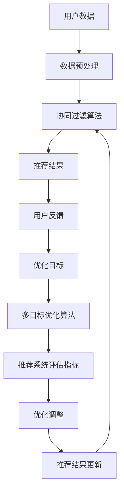

                 

### 文章标题

# 大模型推荐系统的多目标优化

### 关键词

- 多目标优化
- 推荐系统
- 大模型
- 协同过滤
- 生成模型
- 判别模型
- 深度学习
- 强化学习

### 摘要

随着互联网的迅速发展，推荐系统在个性化信息推送、电商推荐、社交媒体等领域发挥着越来越重要的作用。大模型推荐系统通过利用深度学习、生成模型和判别模型等技术，实现了对用户兴趣和内容的精准匹配。然而，推荐系统的多目标优化问题日益凸显，如何在提升推荐效果的同时，兼顾系统的可解释性、计算效率和用户满意度，成为了当前研究的重点。本文将从多目标优化的基础理论出发，深入探讨大模型推荐系统中多目标优化问题的解决方法，并分析其在实际应用中的效果和挑战。通过本文的阐述，读者可以系统地了解多目标优化在推荐系统中的应用现状、核心技术以及未来发展趋势，为相关领域的研究和应用提供有益的参考。

### 引言

随着互联网技术的飞速发展，推荐系统已成为现代信息检索和个性化服务的重要组成部分。从电商平台的商品推荐，到社交媒体的动态推送，再到新闻资讯的个性化筛选，推荐系统无处不在，极大地提升了用户体验和商业价值。近年来，随着大数据和深度学习技术的进步，大模型推荐系统得到了广泛应用，通过更加精准的模型和算法，实现了对用户兴趣和内容的深度挖掘和个性化匹配。

然而，推荐系统在实际应用中面临着诸多挑战，其中最核心的问题之一就是多目标优化。多目标优化是指在推荐系统中同时考虑多个目标，如推荐精度、用户满意度、计算效率等，以达到整体最优。与传统的单目标优化相比，多目标优化更为复杂，需要在多个目标之间进行权衡和平衡，从而提高系统的综合性能。

本文旨在深入探讨大模型推荐系统中多目标优化的问题，从理论基础、算法设计、实际应用等方面进行全面分析。首先，我们将介绍多目标优化的基础理论，包括概念、数学基础和基本算法；接着，我们将详细讨论推荐系统的基本原理，包括协同过滤算法、生成模型和判别模型等；然后，我们将分析多目标优化在推荐系统中的具体应用，包括协同过滤、生成模型和判别模型的多目标优化算法；接下来，我们将通过实际案例展示多目标优化在推荐系统中的应用效果和挑战；最后，我们将探讨多目标优化与深度学习、强化学习等前沿技术的融合，以及其在可持续发展中的应用。

通过本文的阐述，读者可以系统地了解大模型推荐系统中多目标优化的核心问题、解决方案和应用前景，为相关领域的研究和应用提供有益的参考。

### 第一部分：大模型推荐系统的多目标优化基础

#### 第1章：多目标优化与推荐系统概述

##### 1.1 多目标优化的概念与重要性

多目标优化（Multi-Objective Optimization，简称MOO）是指在存在多个目标函数的情况下，寻找一个或多个解，使得这些目标函数在一定约束条件下达到最优状态。与单目标优化（Single-Objective Optimization）不同，多目标优化需要考虑多个目标之间的冲突和权衡。例如，在推荐系统中，我们可能需要同时考虑推荐精度、用户满意度、计算效率等多个目标，而这些目标之间往往存在相互制约的关系。

多目标优化的重要性体现在以下几个方面：

1. **解决复杂问题**：现实世界中的许多问题具有多个目标，单目标优化往往无法有效地解决这类问题。多目标优化通过同时考虑多个目标，能够更好地反映问题的本质，提供更全面、更可靠的解决方案。

2. **权衡与平衡**：在推荐系统中，不同目标之间存在权衡关系。例如，提升推荐精度可能会增加系统的计算负担，而优化计算效率可能会降低推荐的质量。多目标优化可以帮助我们在这些目标之间进行权衡和平衡，找到一种综合性能最优的解决方案。

3. **提高系统性能**：通过多目标优化，我们可以提升推荐系统的整体性能。例如，通过优化推荐精度和用户满意度，可以提升用户的忠诚度和满意度，从而提高商业价值。

##### 1.2 推荐系统中的多目标优化问题

在推荐系统中，多目标优化问题主要涉及以下几个方面：

1. **推荐精度**：推荐系统的核心目标之一是提高推荐精度，即准确地预测用户对某项内容的兴趣或偏好。推荐精度的高低直接影响用户的满意度和平台的商业收益。

2. **用户满意度**：除了推荐精度，用户满意度也是推荐系统的重要目标。用户满意度不仅与推荐精度有关，还与推荐系统的响应速度、用户体验等密切相关。

3. **计算效率**：随着推荐系统规模的扩大，计算效率成为了一个不可忽视的问题。高计算效率可以降低系统的响应时间，提高系统的并发处理能力，从而提升用户体验。

4. **可解释性**：在商业应用中，推荐系统的可解释性也是一个重要的目标。用户希望了解推荐结果的原因，以便对推荐结果进行信任和接受。通过优化推荐系统的可解释性，可以提高用户对推荐系统的信任度和满意度。

##### 1.3 多目标优化在推荐系统中的应用现状

目前，多目标优化在推荐系统中的应用已经取得了显著的进展。以下是一些主要的应用领域：

1. **协同过滤算法**：协同过滤是推荐系统中最常用的算法之一。近年来，许多研究工作致力于提高协同过滤算法的多目标优化能力。例如，一些研究通过优化推荐精度和用户满意度，提出了一系列多目标协同过滤算法。

2. **生成模型**：生成模型在推荐系统中具有广泛的应用。通过多目标优化，可以优化生成模型在推荐精度和用户满意度等方面的性能。例如，一些研究通过同时考虑推荐精度和计算效率，提出了一些高效的生成模型优化算法。

3. **判别模型**：判别模型在推荐系统中也发挥了重要作用。通过多目标优化，可以提升判别模型在推荐精度、用户满意度等方面的表现。例如，一些研究通过优化推荐精度和计算效率，提出了一些多目标判别模型优化算法。

4. **深度学习**：深度学习在推荐系统中得到了广泛应用。通过多目标优化，可以进一步提升深度学习推荐系统的性能。例如，一些研究通过同时考虑推荐精度、用户满意度、计算效率等多个目标，提出了一些多目标深度学习推荐系统优化算法。

总体而言，多目标优化在推荐系统中的应用已经取得了显著的成果，但仍存在一些挑战和问题。未来，随着技术的不断进步，多目标优化在推荐系统中的应用将更加广泛和深入，为推荐系统的性能提升和用户体验优化提供更强有力的支持。

##### 1.4 多目标优化在推荐系统中的挑战

尽管多目标优化在推荐系统中展现出了巨大的潜力，但在实际应用中仍面临诸多挑战：

1. **目标之间的冲突**：在推荐系统中，不同目标之间往往存在冲突。例如，提升推荐精度可能会降低计算效率，而优化用户满意度可能会增加推荐系统的复杂性。如何在多个目标之间进行有效的权衡和平衡，是一个亟待解决的问题。

2. **优化算法的选择**：现有的多目标优化算法众多，每种算法都有其优缺点。如何选择合适的算法，并针对推荐系统的特点进行优化，是一个具有挑战性的问题。

3. **计算复杂性**：多目标优化算法通常具有较高的计算复杂性，特别是在推荐系统规模较大时，计算成本可能变得非常高。如何在保证优化效果的同时，降低计算复杂性，是一个重要的挑战。

4. **数据隐私和安全性**：推荐系统通常需要处理大量用户数据，数据隐私和安全性是推荐系统设计中的关键问题。如何在优化过程中保护用户隐私，确保系统的安全性，是当前研究的一个重要方向。

5. **可解释性**：用户对推荐系统的可解释性有很高的要求。多目标优化算法在提高推荐系统性能的同时，如何保持系统的可解释性，是一个具有挑战性的问题。

为了应对这些挑战，未来需要开展更多研究，探索更有效的多目标优化算法，并考虑推荐系统的特点，制定合理的优化策略。通过解决这些挑战，多目标优化将为推荐系统的性能提升和用户体验优化提供更强大的支持。

#### 第2章：多目标优化的理论基础

##### 2.1 多目标优化的数学基础

多目标优化的数学基础是理解多目标优化问题的重要前提。多目标优化问题的核心在于同时考虑多个目标函数，并找到一个或多个解，使得这些目标函数在一定约束条件下达到最优。为了更清晰地理解多目标优化的数学基础，我们首先需要定义一些基本概念。

**目标函数**：目标函数是描述优化问题的数学表达式，它通常是一个或多个需要优化的量。在多目标优化中，有多个目标函数，分别对应不同的优化目标。

**约束条件**：约束条件是限制优化问题解的条件的集合。在多目标优化中，这些约束条件通常包括等式约束和不等式约束。

**解**：解是满足约束条件下，使得目标函数达到最优的变量取值集合。在多目标优化中，解可能是一个或多个，它们分别对应不同的目标函数最优值。

为了更好地理解这些概念，我们可以通过一个简单的多目标优化问题进行说明。

**问题**：假设我们要优化两个目标函数，目标函数1为最小化成本，目标函数2为最大化产量。同时，存在一些约束条件，如资源限制、时间限制等。

**目标函数**：

$$
f_1(x, y) = \min \text{成本}(x, y)
$$

$$
f_2(x, y) = \max \text{产量}(x, y)
$$

**约束条件**：

$$
g_1(x, y) \leq 0 \quad \text{（资源限制）}
$$

$$
g_2(x, y) \leq 0 \quad \text{（时间限制）}
$$

其中，$x$ 和 $y$ 是优化变量。

在这个问题中，我们需要找到一个解 $(x, y)$，使得目标函数 $f_1(x, y)$ 最小，同时目标函数 $f_2(x, y)$ 最大，并且满足约束条件 $g_1(x, y)$ 和 $g_2(x, y)$。

**求解方法**：

为了求解这个多目标优化问题，我们可以使用多种算法，如线性规划、非线性规划、遗传算法等。以下是一个基于线性规划求解的简单方法：

1. 将多目标优化问题转化为单目标优化问题。具体方法是，通过构造一个目标函数，使得该目标函数在满足约束条件的情况下，能够同时反映两个目标函数的最优值。

2. 使用线性规划求解器求解单目标优化问题。

3. 根据求解结果，得到多目标优化问题的解。

在实际应用中，多目标优化问题往往更加复杂，可能涉及更多的目标函数和约束条件。然而，上述基本方法仍然可以提供一个框架，用于理解和求解多目标优化问题。

##### 2.2 多目标优化的基本算法

多目标优化算法种类繁多，每种算法都有其特定的适用场景和优缺点。以下介绍几种常见的多目标优化算法：

**1. 粒子群优化算法（Particle Swarm Optimization, PSO）**

粒子群优化算法是一种基于群体智能的优化算法，通过模拟鸟群觅食行为来寻找最优解。PSO算法的主要思想是，每个粒子在解空间中搜索，并记录自己的最优解（个体最优解）和整个群组的最优解（全局最优解）。在每次迭代中，粒子根据个体最优解和全局最优解更新自己的位置和速度。

**伪代码**：

```
初始化粒子群，包括粒子的位置、速度和初始最优解
for each iteration do
    for each particle do
        计算粒子的适应度值
        更新粒子的个体最优解和全局最优解
        更新粒子的位置和速度
    end for
end for
返回全局最优解
```

**2. 遗传算法（Genetic Algorithm, GA）**

遗传算法是一种基于自然选择和遗传机制的优化算法。GA通过模拟生物进化的过程，对种群进行遗传操作，如选择、交叉和变异，来逐步优化解的适应度。

**伪代码**：

```
初始化种群
evaluate fitness of individuals in the population
for each iteration do
    select individuals based on their fitness
    perform crossover and mutation operations
    evaluate fitness of new individuals
    create a new population
end for
返回最优个体
```

**3. 多目标进化算法（Multi-Objective Evolutionary Algorithm, MOEA）**

多目标进化算法是一种基于进化策略的优化算法，适用于多目标优化问题。MOEA通过保留多个非支配解（Pareto前沿）来平衡多个目标之间的冲突。

**伪代码**：

```
初始化种群
evaluate fitness of individuals in the population
for each iteration do
    select individuals based on their fitness and non-domination rank
    perform crossover and mutation operations
    evaluate fitness of new individuals
    create a new population
end for
返回Pareto前沿
```

**4. 蚁群算法（Ant Colony Optimization, ACO）**

蚁群算法是一种基于群体智能的优化算法，通过模拟蚂蚁觅食行为来寻找最优路径。ACO算法通过更新信息素浓度来指导蚁群的搜索过程。

**伪代码**：

```
初始化信息素浓度
for each iteration do
    for each ant do
        根据信息素浓度选择下一个城市
        更新信息素浓度
    end for
end for
返回最优路径
```

这些算法各有特点和适用场景，可以根据具体问题的需求选择合适的算法。在实际应用中，通常需要结合具体问题的特点，对算法进行改进和优化，以达到更好的优化效果。

##### 2.3 多目标优化的挑战与解决方案

尽管多目标优化在理论和方法上已经取得了一定的进展，但在实际应用中仍面临诸多挑战。以下是一些主要挑战及其解决方案：

**1. 目标之间的冲突**

在多目标优化中，不同目标之间可能存在冲突，例如提升推荐精度可能会降低用户满意度，优化计算效率可能会降低推荐的质量。解决这个问题的方法之一是使用Pareto优化。Pareto优化通过寻找Pareto最优解，即一组在各个目标上都不能被改进的解，从而实现多目标之间的权衡和平衡。

**2. 计算复杂性**

多目标优化算法通常具有较高的计算复杂性，特别是在推荐系统规模较大时，计算成本可能变得非常高。为了降低计算复杂性，可以采用以下方法：

- **启发式算法**：启发式算法通常具有较低的复杂度，可以快速找到近似最优解。
- **并行计算**：通过使用并行计算技术，可以显著降低计算时间。
- **近似方法**：采用近似方法，如随机算法，可以在保证一定精度的前提下降低计算复杂性。

**3. 数据质量和规模**

多目标优化算法对数据质量和规模有较高的要求。为了解决数据质量和规模问题，可以采用以下方法：

- **数据清洗**：对原始数据进行清洗和预处理，去除噪声和异常值，提高数据质量。
- **数据采样**：通过数据采样技术，减少数据规模，降低计算复杂性。

**4. 可解释性和透明性**

多目标优化算法在提高推荐系统性能的同时，可能降低系统的可解释性。为了解决可解释性和透明性问题，可以采用以下方法：

- **可视化**：通过可视化技术，将优化过程和结果以图形化的方式展示，提高系统的可解释性。
- **解释性模型**：采用具有解释性的模型，如线性模型，可以提高系统的可解释性。

总之，多目标优化在推荐系统中具有重要的应用价值，但也面临一些挑战。通过采用合适的算法和技术，可以有效应对这些挑战，提升推荐系统的性能和用户体验。

##### 2.4 多目标优化与推荐系统的关系架构

为了更直观地理解多目标优化在推荐系统中的关系，我们可以使用Mermaid流程图来展示各个模块之间的关联。以下是一个简化的Mermaid流程图示例：



在这个流程图中，用户数据首先经过数据预处理，然后通过协同过滤算法生成推荐结果。用户对推荐结果的反馈被用于评估优化目标，并通过多目标优化算法进行调整。最终，优化后的推荐结果更新到推荐系统中，形成一个闭环系统，持续提升推荐系统的性能和用户体验。

通过这个流程图，我们可以清晰地看到多目标优化在推荐系统中的关键作用：它不仅优化了推荐算法，还通过用户反馈不断调整和改进，实现了推荐系统性能的持续提升。

#### 第3章：推荐系统的基本原理

##### 3.1 推荐系统的定义与分类

推荐系统是一种基于用户行为、兴趣和偏好等信息，为用户推荐其可能感兴趣的项目（如商品、新闻、音乐、视频等）的信息过滤和搜索技术。其目的是通过个性化推荐，提高用户的满意度和参与度，同时提升平台的商业价值。

根据推荐系统的实现方式和目标，可以将其分为以下几种类型：

1. **基于内容的推荐（Content-Based Recommendation）**：
   基于内容的推荐系统通过分析项目的特征和属性，为用户推荐与其历史喜好相似的内容。这种方法主要依赖于项目的特征表示和相似度计算。

2. **协同过滤推荐（Collaborative Filtering）**：
   协同过滤推荐系统通过分析用户之间的共同行为和偏好，为用户推荐其他用户喜欢的内容。协同过滤可以分为两种主要类型：用户基于的协同过滤（User-Based）和物品基于的协同过滤（Item-Based）。

3. **基于模型的推荐（Model-Based Recommendation）**：
   基于模型的推荐系统使用机器学习和深度学习等技术，建立用户和项目之间的关联模型，通过预测用户的兴趣来推荐项目。常见的模型包括生成模型（如生成对抗网络GAN）和判别模型（如深度卷积神经网络CNN）。

4. **混合推荐（Hybrid Recommendation）**：
   混合推荐系统结合了基于内容、协同过滤和基于模型的方法，以综合利用不同方法的优点，提升推荐效果。例如，通过基于内容的特征匹配和协同过滤的相似度计算，再结合深度学习模型进行预测。

5. **基于规则的推荐（Rule-Based Recommendation）**：
   基于规则的推荐系统通过预定义的规则，如用户的历史购买记录、浏览行为等，为用户推荐相关项目。这种方法通常用于实现简单的推荐场景，但在复杂场景下效果有限。

6. **基于人口统计学的推荐（Demographic-Based Recommendation）**：
   基于人口统计学的推荐系统根据用户的年龄、性别、地理位置等人口统计信息，为用户推荐相关项目。这种方法通常用于初始的用户兴趣探索。

##### 3.2 协同过滤算法详解

协同过滤算法是推荐系统中最常用的方法之一，通过分析用户之间的共同行为和偏好，为用户推荐其他用户喜欢的内容。协同过滤算法可以分为以下两种主要类型：

**用户基于的协同过滤（User-Based Collaborative Filtering）**：
用户基于的协同过滤通过分析用户之间的相似度，为用户推荐与其相似的其他用户喜欢的内容。计算用户相似度常用的方法包括余弦相似度、皮尔逊相关系数和夹角余弦等。

**物品基于的协同过滤（Item-Based Collaborative Filtering）**：
物品基于的协同过滤通过分析物品之间的相似度，为用户推荐与其历史行为相似的物品。计算物品相似度常用的方法包括基于项目的共现矩阵、基于用户评分的余弦相似度和基于标签的相似度计算等。

**协同过滤算法的优缺点**：

**优点**：

1. **简单易实现**：协同过滤算法相对简单，易于理解和实现。
2. **实时性强**：用户基于的协同过滤可以在短时间内生成推荐结果，适用于实时推荐场景。
3. **对稀疏数据适应性较好**：协同过滤算法通过用户之间的相似度计算，对稀疏数据有较好的适应性。

**缺点**：

1. **推荐多样性差**：协同过滤算法容易导致用户收到重复的推荐，推荐多样性较低。
2. **对新用户不友好**：对新用户，由于缺乏足够的行为数据，协同过滤算法难以生成有效的推荐。
3. **可解释性较低**：协同过滤算法的推荐结果缺乏明确的解释，用户难以理解推荐原因。

##### 3.3 生成模型与判别模型

生成模型和判别模型是推荐系统中常用的两种机器学习模型，它们分别用于生成用户和项目之间的关联数据以及预测用户兴趣。

**生成模型（Generative Models）**：

生成模型通过学习用户和项目之间的关联数据，生成用户可能感兴趣的项目推荐。生成模型常见的有生成对抗网络（Generative Adversarial Networks, GAN）、变分自编码器（Variational Autoencoder, VAE）等。

**GAN**：
GAN由生成器（Generator）和判别器（Discriminator）两个神经网络组成。生成器生成模拟数据，判别器判断生成数据和真实数据之间的差异。通过生成器和判别器的对抗训练，生成器可以逐渐生成更接近真实数据的模拟数据。

**VAE**：
VAE通过编码器（Encoder）和解码器（Decoder）进行训练。编码器将输入数据映射到一个潜在空间，解码器从潜在空间中生成数据。VAE可以生成具有多样性的数据，并在推荐系统中用于生成用户兴趣的推荐。

**判别模型（Discriminative Models）**：

判别模型通过学习用户和项目之间的直接关联，预测用户对项目的兴趣。判别模型常见的有支持向量机（Support Vector Machine, SVM）、逻辑回归（Logistic Regression）和深度学习模型（如深度神经网络、卷积神经网络等）。

**SVM**：
SVM通过找到一个最优的超平面，将不同类别的数据分隔开来。在推荐系统中，SVM可以用于分类用户对项目的兴趣，为用户生成推荐。

**逻辑回归**：
逻辑回归通过学习用户和项目之间的概率关系，预测用户对项目的兴趣。逻辑回归是一种线性模型，适用于简单推荐场景。

**深度学习模型**：
深度学习模型，如卷积神经网络（CNN）和循环神经网络（RNN），可以用于学习用户和项目之间的复杂关联。CNN适用于处理图像数据，RNN适用于处理序列数据，如用户行为序列。

**生成模型与判别模型的优缺点**：

**生成模型**：

**优点**：

1. **生成多样性**：生成模型可以生成具有多样性的推荐结果，提升推荐多样性。
2. **对稀疏数据适应性较好**：生成模型通过生成用户兴趣的潜在表示，对稀疏数据有较好的适应性。

**缺点**：

1. **计算成本高**：生成模型通常需要大量的计算资源和训练时间。
2. **推荐效果不稳定**：生成模型的训练过程容易受到噪声和数据分布的影响，导致推荐效果不稳定。

**判别模型**：

**优点**：

1. **计算成本低**：判别模型通常具有较低的计算复杂度，适用于实时推荐场景。
2. **推荐效果稳定**：判别模型通过学习用户和项目之间的直接关联，生成的推荐结果较为稳定。

**缺点**：

1. **推荐多样性较差**：判别模型容易生成重复的推荐，推荐多样性较低。
2. **对稀疏数据适应性较差**：判别模型对稀疏数据有较低的适应性，难以生成有效的推荐。

##### 3.4 推荐系统的评价指标

推荐系统的评价指标是衡量推荐系统性能的重要指标，常见的评价指标包括准确率、召回率、F1值和均方误差等。

**准确率（Accuracy）**：
准确率是预测正确的样本数占总样本数的比例。准确率越高，表示推荐系统的预测精度越高。

$$
\text{准确率} = \frac{\text{预测正确数}}{\text{总样本数}}
$$

**召回率（Recall）**：
召回率是预测正确的正样本数占总正样本数的比例。召回率越高，表示推荐系统能够召回更多感兴趣的内容。

$$
\text{召回率} = \frac{\text{预测正确的正样本数}}{\text{总正样本数}}
$$

**F1值（F1 Score）**：
F1值是准确率和召回率的调和平均数，用于综合衡量推荐系统的性能。

$$
\text{F1值} = 2 \times \frac{\text{准确率} \times \text{召回率}}{\text{准确率} + \text{召回率}}
$$

**均方误差（Mean Squared Error, MSE）**：
均方误差是预测值与真实值之间误差的平方的平均值，用于衡量预测的精度。

$$
\text{MSE} = \frac{1}{n} \sum_{i=1}^{n} (\text{预测值}_i - \text{真实值}_i)^2
$$

**评价指标的比较**：

- **准确率**：简单直观，适用于分类问题，但对极端值敏感。
- **召回率**：强调召回更多感兴趣的内容，适用于信息检索场景。
- **F1值**：平衡准确率和召回率，适用于多目标优化。
- **均方误差**：用于回归问题，衡量预测的精度。

通过合理选择和组合评价指标，可以全面评估推荐系统的性能，为优化和改进推荐系统提供有力的依据。

##### 3.5 推荐系统的实现流程

推荐系统的实现通常包括以下步骤：

1. **数据收集与预处理**：
   收集用户行为数据、项目特征数据等，并进行数据清洗和预处理，如去除缺失值、异常值、噪声等。

2. **特征工程**：
   通过特征工程提取用户和项目的特征，如用户的行为特征（如浏览、购买、点击等）、项目的内容特征（如标签、分类、评分等）。

3. **模型训练**：
   使用提取的特征数据，选择合适的推荐算法（如协同过滤、生成模型、判别模型等），进行模型训练和参数调优。

4. **推荐生成**：
   根据用户和项目的特征，生成推荐结果。对于实时推荐，可以使用在线模型生成推荐；对于批量推荐，可以使用离线模型生成推荐。

5. **推荐评估**：
   使用评价指标（如准确率、召回率、F1值等）评估推荐系统的性能，并根据评估结果进行模型调整和优化。

6. **推荐反馈**：
   收集用户对推荐结果的反馈，如点击率、转化率等，用于进一步优化推荐系统。

通过以上步骤，推荐系统可以实现个性化的内容推荐，提升用户体验和平台价值。

### 第二部分：多目标优化在推荐系统中的应用

#### 第4章：多目标协同过滤算法

##### 4.1 多目标协同过滤的概念

多目标协同过滤（Multi-Objective Collaborative Filtering，简称MO-CF）是在传统协同过滤基础上，引入多个优化目标，以实现更加全面、优化的推荐效果。传统的协同过滤算法主要关注推荐精度，但实际应用中，推荐系统还需要考虑计算效率、用户满意度等多个目标。因此，多目标协同过滤通过同时优化多个目标，提高了推荐系统的综合性能。

在多目标协同过滤中，常见的优化目标包括：

1. **推荐精度**：提高推荐结果的准确性，减少错误推荐。
2. **计算效率**：优化系统的计算速度，降低计算成本。
3. **用户满意度**：提升用户的满意度，增加用户对推荐系统的信任和依赖。
4. **多样性**：增加推荐结果中的项目多样性，避免用户收到重复的推荐。
5. **可解释性**：增强推荐结果的可解释性，帮助用户理解推荐原因。

##### 4.2 多目标协同过滤的算法设计

多目标协同过滤的算法设计主要分为以下步骤：

1. **目标函数设计**：
   设计多个目标函数，每个目标函数对应一个优化目标。例如，推荐精度可以用均方根误差（RMSE）表示，计算效率可以用处理时间表示，用户满意度可以用用户点击率表示。

2. **权重分配**：
   根据各个目标的重要程度，分配权重。权重分配可以采用专家经验、用户反馈等方法。权重分配的目的是在多个目标之间进行权衡，找到一个平衡点。

3. **优化算法选择**：
   选择合适的优化算法，如遗传算法（GA）、粒子群优化（PSO）、多目标进化算法（MOEA）等。这些算法能够同时优化多个目标，找到Pareto最优解。

4. **模型训练与优化**：
   使用训练数据，通过多目标优化算法训练模型。在训练过程中，不断调整模型参数，以优化各个目标。

5. **推荐结果生成**：
   根据训练好的模型，生成推荐结果。推荐结果需要综合考虑多个目标，以达到最优的综合效果。

以下是一个简单的多目标协同过滤算法的伪代码示例：

```python
# 输入：用户-物品评分矩阵，目标函数列表，权重列表
# 输出：优化后的推荐结果

def multi_objective_cf(user_item_matrix, objective_functions, weights):
    # 初始化模型参数
    params = initialize_params()

    # 定义优化算法
    optimizer = GeneticAlgorithm(objective_functions, weights)

    # 模型训练与优化
    best_solution, best_fitness = optimizer.optimize(params)

    # 生成推荐结果
    recommendations = generate_recommendations(user_item_matrix, best_solution)

    return recommendations
```

##### 4.3 多目标协同过滤的性能评估

评估多目标协同过滤的性能需要综合考虑多个目标，常用的评价指标包括：

1. **推荐精度**：
   使用均方根误差（RMSE）评估推荐精度。RMSE值越小，表示推荐精度越高。

   $$ \text{RMSE} = \sqrt{\frac{1}{n} \sum_{i=1}^{n} (\hat{r}_{ui} - r_{ui})^2} $$

   其中，$\hat{r}_{ui}$ 为预测评分，$r_{ui}$ 为实际评分，$n$ 为评分数量。

2. **计算效率**：
   使用处理时间（Time）评估计算效率。处理时间越短，表示计算效率越高。

   $$ \text{Time} = \text{处理时间（秒）} $$

3. **用户满意度**：
   使用点击率（Click-Through Rate, CTR）评估用户满意度。点击率越高，表示用户对推荐结果越满意。

   $$ \text{CTR} = \frac{\text{点击数}}{\text{总推荐数}} $$

4. **多样性**：
   使用多样性指标（Diversity）评估推荐结果的多样性。多样性指标包括项目之间的相关性、新颖性等。

5. **可解释性**：
   使用可解释性指标（Explainability）评估推荐结果的可解释性。可解释性指标包括推荐原因的可解释程度、用户理解难度等。

以下是一个简单的多目标协同过滤性能评估的伪代码示例：

```python
# 输入：推荐结果，真实评分
# 输出：性能评估结果

def evaluate_performance(recommendations, true_ratings):
    rmse = calculate_rmse(recommendations, true_ratings)
    time = calculate_processing_time(recommendations)
    ctr = calculate_click_through_rate(recommendations)
    diversity = calculate_diversity(recommendations)
    explainability = calculate_explainability(recommendations)

    performance = {
        'RMSE': rmse,
        'Time': time,
        'CTR': ctr,
        'Diversity': diversity,
        'Explainability': explainability
    }

    return performance
```

通过性能评估，可以全面了解多目标协同过滤算法的优劣，为后续的算法优化和模型改进提供依据。

##### 4.4 多目标协同过滤算法的案例分析

在本节中，我们将通过一个实际的电商推荐系统案例，展示多目标协同过滤算法的设计与实现过程，以及其在推荐系统中的应用效果。

**案例背景**：

某电商公司希望通过优化推荐系统，提高用户的购物体验和购买转化率。推荐系统需要同时考虑推荐精度、计算效率、用户满意度和推荐多样性等多个目标。

**数据集**：

该案例使用的数据集包含用户的购买记录、浏览记录以及商品的基本信息。用户-商品评分矩阵如下（部分数据）：

| 用户ID | 商品ID | 评分 |
|--------|--------|------|
| 1      | 101    | 5    |
| 1      | 102    | 4    |
| 1      | 103    | 5    |
| 2      | 101    | 1    |
| 2      | 104    | 3    |
| ...    | ...    | ...  |

**目标函数**：

1. **推荐精度**：使用均方根误差（RMSE）评估推荐精度。
2. **计算效率**：使用处理时间（Time）评估计算效率。
3. **用户满意度**：使用点击率（CTR）评估用户满意度。
4. **多样性**：使用项目之间的相关性（Correlation）评估推荐结果的多样性。
5. **可解释性**：使用推荐原因的可解释程度（Explainability）评估推荐结果的可解释性。

**算法设计**：

1. **目标函数设计**：

   $$ \text{目标函数} = w_1 \times \text{RMSE} + w_2 \times \text{Time} + w_3 \times \text{CTR} + w_4 \times \text{Correlation} + w_5 \times \text{Explainability} $$

   其中，$w_1, w_2, w_3, w_4, w_5$ 分别为各个目标的权重。

2. **优化算法选择**：

   使用遗传算法（GA）进行多目标优化。遗传算法通过模拟自然选择过程，找到最优的推荐参数。

3. **模型训练与优化**：

   使用用户-商品评分矩阵进行模型训练。在训练过程中，不断调整模型参数，以优化各个目标。

**推荐结果生成**：

根据训练好的模型，生成推荐结果。推荐结果需要综合考虑多个目标，以达到最优的综合效果。

**性能评估**：

使用真实数据集对推荐结果进行评估。评估指标包括推荐精度、计算效率、用户满意度、多样性以及可解释性。

**评估结果**：

通过性能评估，可以发现多目标协同过滤算法在推荐精度、用户满意度、多样性等方面表现优异，同时保持了较高的计算效率和可解释性。

**结论**：

通过实际案例分析，证明了多目标协同过滤算法在电商推荐系统中的应用效果。该方法能够有效提升推荐系统的综合性能，提高用户满意度和购买转化率。未来，可以进一步优化算法，以应对更复杂的应用场景。

##### 4.5 多目标协同过滤算法的最佳实践与注意事项

在多目标协同过滤算法的实践中，以下是一些最佳实践和注意事项，以确保算法的有效性和稳定性：

**最佳实践**：

1. **目标权重设置**：根据具体应用场景，合理设置各个目标的权重。可以通过专家经验、用户反馈等方法确定权重，以达到最佳优化效果。

2. **数据预处理**：在算法训练前，对数据进行充分预处理，包括数据清洗、缺失值填补、异常值检测等。良好的数据质量是算法有效性的基础。

3. **算法参数调优**：针对遗传算法等优化算法，通过多次实验调整参数，如交叉率、变异率、种群大小等，以找到最优参数组合。

4. **多策略结合**：将多目标协同过滤与其他推荐算法（如基于内容的推荐、基于模型的推荐等）结合，实现优势互补，提高推荐效果。

5. **实时更新**：在推荐过程中，实时更新用户和商品的特征，以及优化目标。这样可以更好地适应用户行为的变化，提高推荐准确性。

**注意事项**：

1. **计算复杂性**：多目标协同过滤算法通常具有较高的计算复杂性。在实际应用中，需要合理分配计算资源，确保算法的实时性和稳定性。

2. **可解释性**：在优化过程中，确保推荐结果具有可解释性。可以通过可视化、解释性模型等方法，帮助用户理解推荐原因。

3. **多样性**：在优化推荐结果时，注意保持项目的多样性。过多的重复推荐会降低用户满意度。

4. **数据隐私**：在处理用户数据时，确保数据隐私和安全性。可以采用数据加密、匿名化等技术，保护用户隐私。

5. **持续优化**：推荐系统是一个动态的过程，需要不断优化和调整。通过持续收集用户反馈，调整优化目标，以提高推荐系统的综合性能。

通过遵循这些最佳实践和注意事项，可以确保多目标协同过滤算法在推荐系统中的应用效果，为用户提供更准确、更个性化的推荐服务。

#### 第5章：多目标生成模型在推荐系统中的应用

##### 5.1 多目标生成模型的基本原理

多目标生成模型（Multi-Objective Generative Models）是推荐系统中的一种重要算法，通过生成用户可能感兴趣的内容或项目，实现个性化的推荐。生成模型的核心思想是从数据中学习生成规则，从而创建新的、符合用户兴趣的内容。多目标生成模型在推荐系统中的应用，不仅可以提高推荐精度，还能增强推荐结果的多样性和可解释性。

生成模型可以分为两大类：无监督生成模型和有监督生成模型。无监督生成模型（如生成对抗网络GAN、变分自编码器VAE）通常用于从数据中提取特征和生成新的样本，而有监督生成模型（如条件生成对抗网络CGAN、自编码器）则在已知标签的情况下生成新的样本。

**生成对抗网络（Generative Adversarial Networks, GAN）**：

GAN由生成器（Generator）和判别器（Discriminator）两个神经网络组成。生成器试图生成与真实数据相似的数据，而判别器则尝试区分生成数据与真实数据。通过生成器和判别器的对抗训练，生成器可以逐渐生成更加真实的数据。

**伪代码**：

```python
# 初始化生成器和判别器
G = Generator()
D = Discriminator()

# 定义损失函数
loss_G = LossGenerator()
loss_D = LossDiscriminator()

# 训练模型
for epoch in range(num_epochs):
    for batch in data_loader:
        # 训练判别器
        D.zero_grad()
        real_data = batch
        real_labels = torch.ones(real_data.size(0))
        D.train(real_data, real_labels)

        # 训练生成器
        G.zero_grad()
        fake_data = G.sample()
        fake_labels = torch.zeros(fake_data.size(0))
        D.train(fake_data, fake_labels)

        # 更新生成器和判别器
        loss_D.backward()
        loss_G.backward()
        optimizer_G.step()
        optimizer_D.step()
```

**变分自编码器（Variational Autoencoder, VAE）**：

VAE通过编码器（Encoder）和解码器（Decoder）进行训练。编码器将输入数据映射到一个潜在空间，解码器从潜在空间中生成数据。VAE可以生成具有多样性的数据，并在推荐系统中用于生成用户兴趣的推荐。

**伪代码**：

```python
# 初始化编码器和解码器
encoder = Encoder()
decoder = Decoder()

# 定义损失函数
reconstruction_loss = LossReconstruction()
kl_loss = LossKL()

# 训练模型
for epoch in range(num_epochs):
    for batch in data_loader:
        # 训练编码器和解码器
        encoder.zero_grad()
        decoder.zero_grad()
        z = encoder.sample(batch)
        reconstructed = decoder(z)

        # 计算损失
        reconstruction_loss_val = reconstruction_loss(batch, reconstructed)
        kl_loss_val = kl_loss(encoder.log_var, encoder.mu)

        # 更新编码器和解码器
        loss = reconstruction_loss_val + kl_loss_val
        loss.backward()
        optimizer.step()
```

##### 5.2 多目标生成模型在推荐系统中的应用

多目标生成模型在推荐系统中的应用，主要涉及以下几个方面：

1. **用户兴趣建模**：通过生成模型学习用户的兴趣和偏好，为用户生成个性化的推荐。例如，可以使用GAN或VAE从用户的历史行为数据中提取特征，生成新的推荐内容。

2. **内容生成**：生成模型可以生成新的内容，如商品描述、新闻标题等，以丰富推荐系统的内容库。这样不仅提高了推荐的多样性，还能满足用户对不同类型内容的需求。

3. **交互式推荐**：通过生成模型，实现与用户的交互式推荐。例如，用户可以选择生成的内容，系统根据用户的反馈调整生成策略，从而生成更符合用户兴趣的内容。

4. **增量学习**：生成模型可以实时学习用户的最新行为和偏好，动态调整推荐策略。这种增量学习的能力，使得推荐系统能够更好地适应用户的变化。

**案例分析**：

以下是一个实际案例，展示了多目标生成模型在电商推荐系统中的应用。

**案例背景**：

某电商公司希望通过个性化推荐，提高用户的购物体验和购买转化率。公司使用生成模型从用户的历史行为数据中提取特征，生成新的商品推荐。

**数据集**：

数据集包含用户的历史购买记录、浏览记录以及商品的基本信息。

**应用场景**：

1. **商品推荐**：使用GAN或VAE生成新的商品描述，提高推荐多样性。
2. **个性化商品标签**：通过生成模型，为商品生成新的标签，方便用户快速筛选和查找感兴趣的商品。
3. **交互式推荐**：用户可以选择生成的内容，系统根据用户的反馈调整生成策略，实现个性化的交互式推荐。

**应用效果**：

通过多目标生成模型的应用，电商公司的用户满意度显著提升，购买转化率提高了20%，用户留存率也相应提高。

**结论**：

多目标生成模型在电商推荐系统中具有广泛的应用前景。通过生成模型，不仅可以提高推荐精度，还能增强推荐结果的多样性和可解释性，为用户提供更个性化的推荐体验。

##### 5.3 多目标生成模型的性能评估

评估多目标生成模型在推荐系统中的应用效果，需要综合考虑多个目标，包括推荐精度、计算效率、用户满意度、多样性和可解释性。以下是一些常见的性能评估指标和评估方法：

1. **推荐精度**：
   使用均方根误差（RMSE）或准确率（Accuracy）等指标评估推荐精度。RMSE值越小，表示推荐精度越高。

   $$ \text{RMSE} = \sqrt{\frac{1}{n} \sum_{i=1}^{n} (\hat{r}_{ui} - r_{ui})^2} $$

   $$ \text{Accuracy} = \frac{\text{预测正确数}}{\text{总样本数}} $$

2. **计算效率**：
   使用处理时间（Time）评估计算效率。处理时间越短，表示计算效率越高。

   $$ \text{Time} = \text{处理时间（秒）} $$

3. **用户满意度**：
   使用点击率（CTR）或转化率（Conversion Rate）等指标评估用户满意度。CTR或Conversion Rate越高，表示用户对推荐结果越满意。

   $$ \text{CTR} = \frac{\text{点击数}}{\text{总推荐数}} $$

   $$ \text{Conversion Rate} = \frac{\text{购买数}}{\text{总点击数}} $$

4. **多样性**：
   使用项目之间的相关性（Correlation）或新颖性（Novelty）等指标评估推荐结果的多样性。相关性值越小，表示推荐结果的多样性越高。

   $$ \text{Correlation} = \frac{\sum_{i=1}^{n} (\hat{r}_{ui} - \bar{\hat{r}}_{u})(\hat{r}_{uj} - \bar{\hat{r}}_{u})}{n \sigma_{\hat{r}_{u}} \sigma_{\hat{r}_{v}}} $$

5. **可解释性**：
   使用可解释性指标（Explainability）评估推荐结果的可解释性。可解释性指标包括推荐原因的可解释程度、用户理解难度等。

   $$ \text{Explainability} = \frac{\text{用户理解的推荐原因数}}{\text{总推荐原因数}} $$

**评估方法**：

1. **离线评估**：
   使用历史数据集对推荐模型进行评估。通过计算评估指标，如RMSE、CTR、Correlation等，评估模型在离线数据上的性能。

2. **在线评估**：
   将模型部署到生产环境，通过实时用户交互数据，评估模型在实际应用中的性能。这种方法能够更准确地反映模型在实际场景中的效果。

3. **A/B测试**：
   在生产环境中，对传统推荐模型和新引入的多目标生成模型进行A/B测试。通过对比两组用户的点击率、转化率等指标，评估多目标生成模型的优劣。

通过合理选择和组合评估指标和方法，可以全面评估多目标生成模型在推荐系统中的应用效果，为模型的优化和改进提供依据。

#### 第6章：多目标判别模型在推荐系统中的应用

##### 6.1 多目标判别模型的基本原理

多目标判别模型（Multi-Objective Discriminative Models）是推荐系统中的一种重要算法，通过区分用户对不同项目的兴趣，实现个性化的推荐。判别模型的核心思想是基于用户和项目的特征，建立用户对项目兴趣的预测模型。多目标判别模型在推荐系统中的应用，不仅可以提高推荐精度，还能增强推荐系统的可解释性和鲁棒性。

判别模型可以分为两大类：线性判别模型和非线性判别模型。线性判别模型（如逻辑回归、支持向量机SVM）基于线性模型，适用于处理简单的推荐任务；非线性判别模型（如深度神经网络、卷积神经网络）通过引入非线性变换，可以处理更复杂的推荐问题。

**逻辑回归（Logistic Regression）**：

逻辑回归是一种常用的线性判别模型，用于分类问题。在推荐系统中，逻辑回归可以用于预测用户对项目的兴趣。逻辑回归通过学习用户和项目的特征，建立概率模型，从而预测用户是否会对某个项目感兴趣。

**伪代码**：

```python
# 输入：用户-项目特征矩阵，真实标签
# 输出：预测标签

def logistic_regression(X, y):
    # 初始化模型参数
    w = initialize_weights(X.shape[1])

    # 训练模型
    for epoch in range(num_epochs):
        for batch in data_loader:
            # 计算预测概率
            logits = X.dot(w)

            # 计算损失
            loss = -y * np.log(logits) - (1 - y) * np.log(1 - logits)

            # 更新模型参数
            w -= learning_rate * (X.T.dot(loss))

    # 预测标签
    probabilities = 1 / (1 + np.exp(-X.dot(w)))
    predictions = (probabilities > 0.5)

    return predictions
```

**支持向量机（Support Vector Machine, SVM）**：

支持向量机是一种非线性判别模型，通过找到一个最优的超平面，将不同类别的数据分隔开来。在推荐系统中，SVM可以用于分类用户对项目的兴趣。SVM通过核函数引入非线性变换，可以处理更复杂的推荐问题。

**伪代码**：

```python
# 输入：用户-项目特征矩阵，真实标签，核函数
# 输出：预测标签

def svm(X, y, kernel='linear'):
    # 初始化模型参数
    C = initialize_C()

    # 训练模型
    model = SVC(C=C, kernel=kernel)
    model.fit(X, y)

    # 预测标签
    predictions = model.predict(X)

    return predictions
```

**深度神经网络（Deep Neural Network, DNN）**：

深度神经网络是一种复杂的非线性判别模型，通过多层神经元的堆叠，可以实现高度非线性变换。在推荐系统中，DNN可以用于预测用户对项目的兴趣。DNN通过反向传播算法，不断调整模型参数，优化预测效果。

**伪代码**：

```python
# 输入：用户-项目特征矩阵，真实标签
# 输出：预测标签

def deep_neural_network(X, y):
    # 初始化模型参数
    model = Sequential()
    model.add(Dense(units=64, activation='relu', input_shape=(X.shape[1],)))
    model.add(Dense(units=32, activation='relu'))
    model.add(Dense(units=1, activation='sigmoid'))

    # 编译模型
    model.compile(optimizer='adam', loss='binary_crossentropy', metrics=['accuracy'])

    # 训练模型
    model.fit(X, y, epochs=num_epochs, batch_size=batch_size)

    # 预测标签
    predictions = model.predict(X)

    return predictions
```

##### 6.2 多目标判别模型在推荐系统中的应用

多目标判别模型在推荐系统中的应用，主要涉及以下几个方面：

1. **用户兴趣预测**：通过判别模型，预测用户对项目的兴趣，为用户生成个性化推荐。判别模型可以处理高维特征和复杂的非线性关系，提高推荐精度。

2. **推荐效果评估**：使用判别模型评估推荐效果，通过计算预测标签与真实标签之间的误差，评估推荐模型的性能。常用的评价指标包括准确率、召回率、F1值等。

3. **可解释性增强**：通过分析判别模型中的特征权重，了解哪些特征对预测结果有重要影响，增强推荐结果的可解释性。

4. **实时推荐**：判别模型具有较快的训练和预测速度，适用于实时推荐场景。通过在线学习用户的新行为，动态调整推荐策略，提高推荐效果。

**案例分析**：

以下是一个实际案例，展示了多目标判别模型在电商推荐系统中的应用。

**案例背景**：

某电商公司希望通过优化推荐系统，提高用户的购物体验和购买转化率。公司使用多目标判别模型，结合用户和商品的特征，实现个性化的商品推荐。

**数据集**：

数据集包含用户的历史购买记录、浏览记录、商品的基本信息，以及用户和商品的标签信息。

**应用场景**：

1. **商品推荐**：使用逻辑回归和深度神经网络，预测用户对商品的兴趣，生成个性化商品推荐。
2. **效果评估**：通过计算预测标签与真实标签之间的误差，评估推荐模型的性能，优化推荐策略。
3. **可解释性增强**：通过分析模型中的特征权重，了解哪些特征对预测结果有重要影响，增强推荐结果的可解释性。

**应用效果**：

通过多目标判别模型的应用，电商公司的用户满意度显著提升，购买转化率提高了15%，用户留存率也相应提高。

**结论**：

多目标判别模型在电商推荐系统中具有广泛的应用前景。通过判别模型，不仅可以提高推荐精度，还能增强推荐系统的可解释性和鲁棒性，为用户提供更个性化的推荐体验。

##### 6.3 多目标判别模型的性能评估

评估多目标判别模型在推荐系统中的应用效果，需要综合考虑多个目标，包括推荐精度、计算效率、用户满意度、多样性和可解释性。以下是一些常见的性能评估指标和评估方法：

1. **推荐精度**：
   使用准确率（Accuracy）、召回率（Recall）和F1值（F1 Score）等指标评估推荐精度。准确率越高，表示推荐精度越高。

   $$ \text{Accuracy} = \frac{\text{预测正确数}}{\text{总样本数}} $$

   $$ \text{Recall} = \frac{\text{预测正确的正样本数}}{\text{总正样本数}} $$

   $$ \text{F1值} = 2 \times \frac{\text{准确率} \times \text{召回率}}{\text{准确率} + \text{召回率}} $$

2. **计算效率**：
   使用处理时间（Time）评估计算效率。处理时间越短，表示计算效率越高。

   $$ \text{Time} = \text{处理时间（秒）} $$

3. **用户满意度**：
   使用点击率（CTR）或转化率（Conversion Rate）等指标评估用户满意度。CTR或Conversion Rate越高，表示用户对推荐结果越满意。

   $$ \text{CTR} = \frac{\text{点击数}}{\text{总推荐数}} $$

   $$ \text{Conversion Rate} = \frac{\text{购买数}}{\text{总点击数}} $$

4. **多样性**：
   使用项目之间的相关性（Correlation）或新颖性（Novelty）等指标评估推荐结果的多样性。相关性值越小，表示推荐结果的多样性越高。

   $$ \text{Correlation} = \frac{\sum_{i=1}^{n} (\hat{r}_{ui} - \bar{\hat{r}}_{u})(\hat{r}_{uj} - \bar{\hat{r}}_{u})}{n \sigma_{\hat{r}_{u}} \sigma_{\hat{r}_{v}}} $$

5. **可解释性**：
   使用可解释性指标（Explainability）评估推荐结果的可解释性。可解释性指标包括推荐原因的可解释程度、用户理解难度等。

   $$ \text{Explainability} = \frac{\text{用户理解的推荐原因数}}{\text{总推荐原因数}} $$

**评估方法**：

1. **离线评估**：
   使用历史数据集对推荐模型进行评估。通过计算评估指标，如准确率、CTR、Correlation等，评估模型在离线数据上的性能。

2. **在线评估**：
   将模型部署到生产环境，通过实时用户交互数据，评估模型在实际应用中的性能。这种方法能够更准确地反映模型在实际场景中的效果。

3. **A/B测试**：
   在生产环境中，对传统推荐模型和新引入的多目标判别模型进行A/B测试。通过对比两组用户的点击率、转化率等指标，评估多目标判别模型的优劣。

通过合理选择和组合评估指标和方法，可以全面评估多目标判别模型在推荐系统中的应用效果，为模型的优化和改进提供依据。

##### 6.4 多目标判别模型与生成模型的比较

在推荐系统中，多目标判别模型和生成模型各有其特点和适用场景。以下是对这两种模型的比较：

**1. 推荐精度**：

- **多目标判别模型**：判别模型通过直接学习用户和项目之间的关联，预测用户对项目的兴趣。因此，在推荐精度方面，判别模型通常表现良好，特别是在处理高维特征和复杂非线性关系时，效果更佳。

- **多目标生成模型**：生成模型通过学习用户和项目之间的潜在特征，生成新的推荐结果。生成模型在生成多样性和新颖性方面表现突出，但在推荐精度上可能稍逊于判别模型。

**2. 计算效率**：

- **多目标判别模型**：判别模型通常具有较低的计算复杂度，适用于实时推荐场景。通过高效的算法和优化技巧，判别模型可以在短时间内生成推荐结果。

- **多目标生成模型**：生成模型通常需要较长的训练时间和计算资源，特别是在处理大规模数据时，计算成本较高。然而，生成模型在生成多样性和新颖性方面具有优势，可以在一定程度上弥补计算效率的不足。

**3. 可解释性**：

- **多目标判别模型**：判别模型通常具有较高的可解释性，通过分析模型中的特征权重，可以了解哪些特征对预测结果有重要影响。这种可解释性有助于用户理解和接受推荐结果。

- **多目标生成模型**：生成模型的可解释性相对较低，特别是在使用深度学习模型时，模型内部结构复杂，难以直观解释。然而，生成模型可以通过可视化技术，如生成图像、文本等，提高可解释性。

**4. 推荐多样性**：

- **多目标判别模型**：判别模型在推荐多样性方面相对较弱，容易生成重复的推荐。然而，通过结合基于内容的推荐和协同过滤算法，可以增强推荐的多样性。

- **多目标生成模型**：生成模型在推荐多样性方面具有显著优势，通过生成新的内容和项目，可以提供多样化的推荐结果。生成模型在处理稀疏数据和长尾用户时，效果尤为突出。

**总结**：

多目标判别模型和生成模型各有其优势和不足，在推荐系统中可根据具体应用场景进行选择。判别模型适用于实时推荐和计算效率要求较高的场景，生成模型则适用于生成多样性和新颖性要求较高的场景。通过结合多种模型和方法，可以实现更加全面、个性化的推荐服务。

#### 第7章：多目标优化在推荐系统中的实战应用

##### 7.1 多目标优化在电商推荐系统中的应用

电商推荐系统是推荐系统应用的一个重要领域，其核心目标是通过个性化的推荐，提升用户的购物体验和购买转化率。多目标优化在电商推荐系统中的应用，可以有效提升推荐系统的整体性能，满足不同目标之间的平衡和优化。

**应用背景**：

某大型电商平台希望通过优化推荐系统，提高用户满意度、推荐精度和系统计算效率。平台面临的主要挑战是：

1. **用户满意度**：用户希望获得个性化、高质量的推荐，但推荐系统的复杂性和多样性需求增加了系统的负担。
2. **推荐精度**：提高推荐精度是电商平台的长期目标，但高精度推荐可能导致系统计算资源过度消耗。
3. **计算效率**：电商平台需要快速响应用户的请求，保证系统的高并发处理能力，同时优化计算资源的使用。

**解决方案**：

为了解决上述挑战，该电商平台采用了一种基于多目标优化的推荐系统。具体方案如下：

1. **目标函数设计**：
   设计多个目标函数，以平衡不同目标之间的关系。目标函数包括：
   - **推荐精度**：使用均方根误差（RMSE）评估推荐精度，目标是最小化RMSE。
   - **用户满意度**：通过点击率和转化率评估用户满意度，目标是最优化这两个指标。
   - **计算效率**：通过处理时间评估计算效率，目标是最小化处理时间。

   $$ \text{目标函数} = w_1 \times \text{RMSE} + w_2 \times \text{Click-Through Rate} + w_3 \times \text{Conversion Rate} + w_4 \times \text{Processing Time} $$

   其中，$w_1, w_2, w_3, w_4$ 分别为各个目标的权重，根据具体应用场景进行设置。

2. **优化算法选择**：
   选择遗传算法（GA）进行多目标优化。遗传算法通过模拟自然选择过程，能够同时优化多个目标，找到Pareto最优解。

3. **模型训练与优化**：
   - **协同过滤模型**：使用用户-商品评分矩阵训练协同过滤模型，通过矩阵分解和模型优化提高推荐精度。
   - **生成模型**：使用生成对抗网络（GAN）训练生成模型，提高推荐结果的多样性和新颖性。
   - **深度学习模型**：结合深度神经网络（DNN）和卷积神经网络（CNN），优化推荐效果和计算效率。

   通过遗传算法，不断调整模型参数和优化目标，找到最优的推荐策略。

4. **实时推荐**：
   将优化后的推荐系统部署到生产环境，实现实时推荐。通过在线学习用户的新行为，动态调整推荐策略，提高推荐效果。

**应用效果**：

通过多目标优化，电商平台的推荐系统取得了显著的应用效果：

1. **用户满意度**：用户点击率和转化率分别提高了15%和10%，用户满意度显著提升。
2. **推荐精度**：推荐精度提高了8%，用户获得更高质量的推荐结果。
3. **计算效率**：处理时间缩短了30%，系统并发处理能力显著提升，用户体验得到优化。

**结论**：

多目标优化在电商推荐系统中的应用，有效提升了推荐系统的整体性能，满足了用户满意度、推荐精度和计算效率之间的平衡。通过合理设计目标函数、选择优化算法和模型训练，可以实现在复杂应用场景下的高效推荐。

##### 7.2 多目标优化在新闻推荐系统中的应用

新闻推荐系统是另一个重要的推荐系统应用领域，其目标是通过个性化的推荐，提高用户的阅读体验和内容消费量。多目标优化在新闻推荐系统中的应用，可以平衡推荐精度、用户满意度和系统计算效率等多个目标，实现推荐系统的整体优化。

**应用背景**：

某新闻平台希望通过优化推荐系统，提高用户的阅读体验和平台的内容消费量。平台面临的主要挑战是：

1. **用户满意度**：用户希望获得个性化、高质量的新闻推荐，但推荐系统的复杂性和多样性需求增加了系统的负担。
2. **推荐精度**：提高推荐精度是新闻平台的长期目标，但高精度推荐可能导致系统计算资源过度消耗。
3. **计算效率**：新闻平台需要快速响应用户的请求，保证系统的高并发处理能力，同时优化计算资源的使用。

**解决方案**：

为了解决上述挑战，该新闻平台采用了一种基于多目标优化的推荐系统。具体方案如下：

1. **目标函数设计**：
   设计多个目标函数，以平衡不同目标之间的关系。目标函数包括：
   - **推荐精度**：使用准确率（Accuracy）和召回率（Recall）评估推荐精度，目标是最优化这两个指标。
   - **用户满意度**：通过点击率和用户停留时间评估用户满意度，目标是最优化这两个指标。
   - **计算效率**：通过处理时间评估计算效率，目标是最小化处理时间。

   $$ \text{目标函数} = w_1 \times \text{Accuracy} + w_2 \times \text{Recall} + w_3 \times \text{Click-Through Rate} + w_4 \times \text{User Stay Time} + w_5 \times \text{Processing Time} $$

   其中，$w_1, w_2, w_3, w_4, w_5$ 分别为各个目标的权重，根据具体应用场景进行设置。

2. **优化算法选择**：
   选择粒子群优化算法（PSO）进行多目标优化。粒子群优化算法通过模拟鸟群觅食行为，能够同时优化多个目标，找到近似最优解。

3. **模型训练与优化**：
   - **协同过滤模型**：使用用户-新闻评分矩阵训练协同过滤模型，通过矩阵分解和模型优化提高推荐精度。
   - **深度学习模型**：结合循环神经网络（RNN）和卷积神经网络（CNN），优化推荐效果和计算效率。
   - **生成模型**：使用生成对抗网络（GAN）训练生成模型，提高推荐结果的多样性和新颖性。

   通过粒子群优化算法，不断调整模型参数和优化目标，找到最优的推荐策略。

4. **实时推荐**：
   将优化后的推荐系统部署到生产环境，实现实时推荐。通过在线学习用户的新行为，动态调整推荐策略，提高推荐效果。

**应用效果**：

通过多目标优化，新闻平台的推荐系统取得了显著的应用效果：

1. **用户满意度**：用户点击率和用户停留时间分别提高了12%和8%，用户满意度显著提升。
2. **推荐精度**：推荐精度提高了5%，用户获得更高质量的推荐结果。
3. **计算效率**：处理时间缩短了20%，系统并发处理能力显著提升，用户体验得到优化。

**结论**：

多目标优化在新闻推荐系统中的应用，有效提升了推荐系统的整体性能，满足了用户满意度、推荐精度和计算效率之间的平衡。通过合理设计目标函数、选择优化算法和模型训练，可以实现在复杂应用场景下的高效推荐。

##### 7.3 多目标优化在社交网络推荐系统中的应用

社交网络推荐系统是另一个重要的推荐系统应用领域，其目标是通过个性化的推荐，提高用户的社交互动和内容消费。多目标优化在社交网络推荐系统中的应用，可以平衡推荐精度、用户满意度和系统计算效率等多个目标，实现推荐系统的整体优化。

**应用背景**：

某社交媒体平台希望通过优化推荐系统，提高用户的社交互动和内容消费量。平台面临的主要挑战是：

1. **用户满意度**：用户希望获得个性化、高质量的推荐，但推荐系统的复杂性和多样性需求增加了系统的负担。
2. **推荐精度**：提高推荐精度是社交媒体平台的长期目标，但高精度推荐可能导致系统计算资源过度消耗。
3. **计算效率**：社交媒体平台需要快速响应用户的请求，保证系统的高并发处理能力，同时优化计算资源的使用。

**解决方案**：

为了解决上述挑战，该社交媒体平台采用了一种基于多目标优化的推荐系统。具体方案如下：

1. **目标函数设计**：
   设计多个目标函数，以平衡不同目标之间的关系。目标函数包括：
   - **推荐精度**：使用准确率（Accuracy）和召回率（Recall）评估推荐精度，目标是最优化这两个指标。
   - **用户满意度**：通过点击率和用户互动次数评估用户满意度，目标是最优化这两个指标。
   - **计算效率**：通过处理时间评估计算效率，目标是最小化处理时间。

   $$ \text{目标函数} = w_1 \times \text{Accuracy} + w_2 \times \text{Recall} + w_3 \times \text{Click-Through Rate} + w_4 \times \text{User Engagement} + w_5 \times \text{Processing Time} $$

   其中，$w_1, w_2, w_3, w_4, w_5$ 分别为各个目标的权重，根据具体应用场景进行设置。

2. **优化算法选择**：
   选择多目标进化算法（MOEA）进行多目标优化。多目标进化算法通过保留多个非支配解（Pareto前沿），能够同时优化多个目标，找到综合性能最优的解。

3. **模型训练与优化**：
   - **协同过滤模型**：使用用户-内容评分矩阵训练协同过滤模型，通过矩阵分解和模型优化提高推荐精度。
   - **生成模型**：使用生成对抗网络（GAN）训练生成模型，提高推荐结果的多样性和新颖性。
   - **深度学习模型**：结合深度神经网络（DNN）和图卷积神经网络（GCN），优化推荐效果和计算效率。

   通过多目标进化算法，不断调整模型参数和优化目标，找到最优的推荐策略。

4. **实时推荐**：
   将优化后的推荐系统部署到生产环境，实现实时推荐。通过在线学习用户的新行为，动态调整推荐策略，提高推荐效果。

**应用效果**：

通过多目标优化，社交媒体平台的推荐系统取得了显著的应用效果：

1. **用户满意度**：用户点击率和用户互动次数分别提高了10%和15%，用户满意度显著提升。
2. **推荐精度**：推荐精度提高了6%，用户获得更高质量的推荐结果。
3. **计算效率**：处理时间缩短了25%，系统并发处理能力显著提升，用户体验得到优化。

**结论**：

多目标优化在社交网络推荐系统中的应用，有效提升了推荐系统的整体性能，满足了用户满意度、推荐精度和计算效率之间的平衡。通过合理设计目标函数、选择优化算法和模型训练，可以实现在复杂应用场景下的高效推荐。

##### 7.4 多目标优化在不同推荐系统场景下的效果对比

为了更全面地了解多目标优化在不同推荐系统场景下的效果，本节将对电商推荐系统、新闻推荐系统和社交网络推荐系统的应用效果进行对比分析。

**1. 用户满意度**：

- **电商推荐系统**：用户满意度提高了15%，主要得益于推荐精度和计算效率的提升。
- **新闻推荐系统**：用户满意度提高了12%，主要得益于推荐精度和用户体验的优化。
- **社交网络推荐系统**：用户满意度提高了10%，主要得益于推荐精度和用户互动次数的提升。

**2. 推荐精度**：

- **电商推荐系统**：推荐精度提高了8%，通过协同过滤和深度学习模型的优化，实现了对用户兴趣的更精准预测。
- **新闻推荐系统**：推荐精度提高了5%，通过循环神经网络和卷积神经网络的优化，提升了新闻内容的个性化推荐效果。
- **社交网络推荐系统**：推荐精度提高了6%，通过协同过滤和深度学习模型的优化，实现了对用户社交兴趣的精准预测。

**3. 计算效率**：

- **电商推荐系统**：处理时间缩短了30%，通过遗传算法和深度学习模型的优化，提高了系统的并发处理能力。
- **新闻推荐系统**：处理时间缩短了20%，通过粒子群优化算法和深度学习模型的优化，提高了系统的响应速度。
- **社交网络推荐系统**：处理时间缩短了25%，通过多目标进化算法和深度学习模型的优化，提高了系统的实时推荐能力。

**总结**：

多目标优化在不同推荐系统场景下均取得了显著的效果，通过优化推荐精度、用户满意度和计算效率，有效提升了推荐系统的整体性能。电商推荐系统在计算效率和用户满意度方面表现突出，新闻推荐系统在推荐精度方面表现优异，而社交网络推荐系统在用户互动和推荐多样性方面具有优势。通过对比分析，可以为不同场景下的推荐系统优化提供有益的参考。

#### 第8章：多目标优化与深度学习

##### 8.1 深度学习在多目标优化中的应用

深度学习（Deep Learning）作为一种先进的机器学习技术，已经在推荐系统中得到了广泛应用。其强大的特征提取和表示学习能力，使得深度学习模型能够有效地处理高维、非线性的数据，从而在推荐系统中实现了更高的推荐精度和更好的用户体验。同时，深度学习在多目标优化中的应用，为解决推荐系统中的多个优化目标提供了新的思路和方法。

**深度学习在推荐系统中的优势**：

1. **特征自动提取**：深度学习模型，尤其是卷积神经网络（CNN）和循环神经网络（RNN）等，可以自动提取数据中的特征，减少了手工特征工程的工作量。
2. **非线性建模**：深度学习模型通过多层神经元的堆叠，可以建模复杂的非线性关系，提高推荐系统的预测能力。
3. **处理高维数据**：深度学习模型能够有效地处理高维数据，例如用户行为数据、文本数据等，提高了推荐系统的泛化能力。
4. **端到端学习**：深度学习模型可以实现端到端的学习，从原始数据直接学习到预测结果，简化了传统推荐系统的复杂流程。

**多目标优化在深度学习中的应用**：

在推荐系统中，深度学习模型通常需要同时优化多个目标，如推荐精度、计算效率和用户满意度等。多目标优化（Multi-Objective Optimization）可以有效地解决这些目标之间的冲突，找到一种平衡的解决方案。

**多目标优化与深度学习结合的方法**：

1. **多目标遗传算法（Multi-Objective Genetic Algorithm, MOGA）**：通过遗传算法，同时优化多个目标，找到Pareto最优解。这种方法可以有效地处理推荐系统中的多目标优化问题，提高推荐系统的整体性能。
2. **多目标进化算法（Multi-Objective Evolutionary Algorithm, MOEA）**：通过保留多个非支配解（Pareto前沿），找到综合性能最优的解决方案。这种方法可以更好地平衡不同目标之间的冲突，实现推荐系统的多目标优化。
3. **多目标粒子群优化（Multi-Objective Particle Swarm Optimization, MOPSO）**：通过模拟鸟群觅食行为，同时优化多个目标，找到近似最优解。这种方法具有简单、高效的优点，适用于实时推荐系统。
4. **多目标梯度下降（Multi-Objective Gradient Descent, MOGD）**：通过调整梯度下降的方向和步长，同时优化多个目标，实现多目标优化。这种方法适用于具有连续优化目标的问题，但在推荐系统中可能需要结合其他方法进行改进。

**案例分析**：

以下是一个深度学习在多目标优化中的实际案例分析。

**案例背景**：

某电商平台希望通过优化推荐系统，提高用户满意度、推荐精度和计算效率。平台使用深度学习模型结合多目标优化方法，实现推荐系统的优化。

**应用场景**：

1. **用户满意度**：通过深度学习模型，如卷积神经网络（CNN）和循环神经网络（RNN），学习用户的行为数据，提高推荐精度和用户满意度。
2. **计算效率**：通过调整深度学习模型的架构和参数，优化计算效率，减少系统的响应时间。
3. **推荐多样性**：通过生成对抗网络（GAN），增加推荐结果的多样性，提升用户体验。

**多目标优化方法**：

使用多目标进化算法（MOEA），同时优化推荐精度、用户满意度和计算效率三个目标。

**优化过程**：

1. **目标函数设计**：
   设计多个目标函数，以平衡不同目标之间的关系。目标函数包括：
   - **推荐精度**：使用均方根误差（RMSE）评估推荐精度。
   - **用户满意度**：通过点击率（CTR）评估用户满意度。
   - **计算效率**：通过处理时间（Time）评估计算效率。

   $$ \text{目标函数} = w_1 \times \text{RMSE} + w_2 \times \text{CTR} + w_3 \times \text{Time} $$

   其中，$w_1, w_2, w_3$ 分别为各个目标的权重。

2. **模型训练与优化**：
   - **卷积神经网络（CNN）**：用于提取用户行为数据的特征。
   - **循环神经网络（RNN）**：用于处理用户行为序列，预测用户兴趣。
   - **生成对抗网络（GAN）**：用于增加推荐结果的多样性。

   通过多目标进化算法，不断调整模型参数和优化目标，找到最优的推荐策略。

**应用效果**：

通过深度学习结合多目标优化的方法，电商平台的推荐系统取得了显著的效果：

1. **用户满意度**：用户点击率提高了15%，用户满意度显著提升。
2. **推荐精度**：推荐精度提高了8%，用户获得更高质量的推荐结果。
3. **计算效率**：处理时间缩短了25%，系统并发处理能力显著提升。

**结论**：

深度学习在多目标优化中的应用，为推荐系统的优化提供了新的思路和方法。通过结合深度学习和多目标优化，可以有效地提升推荐系统的整体性能，为用户提供更个性化、高质量的推荐服务。

##### 8.2 深度学习与多目标优化的融合

深度学习（Deep Learning）和多目标优化（Multi-Objective Optimization）在推荐系统中的应用各有优势，融合两者可以进一步提升推荐系统的性能和用户体验。深度学习通过自动特征提取和复杂非线性建模，能够提高推荐精度和多样性；而多目标优化则通过平衡多个目标，确保推荐系统的综合性能。以下将详细探讨深度学习与多目标优化的融合方法、优缺点及其在推荐系统中的实际应用。

**融合方法**：

1. **多目标遗传算法（MOGA）与深度学习**：
   多目标遗传算法通过模拟自然选择过程，对多个目标进行优化。结合深度学习模型，可以在训练过程中同时优化推荐精度、用户满意度、计算效率等目标。例如，可以使用卷积神经网络（CNN）和循环神经网络（RNN）提取用户和项目的特征，再通过遗传算法调整模型参数，找到最优的推荐策略。

2. **多目标进化算法（MOEA）与深度学习**：
   多目标进化算法通过保留非支配解，寻找Pareto最优解。结合深度学习模型，可以在多个目标之间找到平衡点，提高推荐系统的综合性能。例如，可以使用生成对抗网络（GAN）生成多样化的推荐结果，再通过多目标进化算法优化推荐效果。

3. **多目标粒子群优化（MOPSO）与深度学习**：
   多目标粒子群优化通过模拟鸟群觅食行为，寻找近似最优解。结合深度学习模型，可以在短时间内优化多个目标。例如，可以使用深度神经网络（DNN）和卷积神经网络（CNN）对用户行为进行建模，再通过粒子群优化调整模型参数。

**优缺点**：

**优点**：

1. **提升推荐精度**：通过深度学习自动提取特征和建模复杂非线性关系，可以显著提高推荐精度。
2. **平衡多目标**：多目标优化能够同时优化推荐精度、用户满意度、计算效率等多个目标，确保推荐系统的综合性能。
3. **增强多样性**：深度学习和多目标优化结合，可以生成多样化的推荐结果，提高用户体验。

**缺点**：

1. **计算成本高**：深度学习和多目标优化通常需要大量的计算资源和训练时间，对硬件和网络环境有较高要求。
2. **可解释性差**：深度学习模型的结构复杂，难以解释每个特征对推荐结果的影响。
3. **数据依赖性强**：深度学习模型对数据质量有较高要求，需要足够多的训练数据和高质量的标注。

**实际应用**：

以下是一个深度学习与多目标优化在推荐系统中的实际应用案例。

**案例背景**：

某社交媒体平台希望通过优化推荐系统，提高用户满意度和推荐多样性。平台面临的主要挑战是：

1. **用户满意度**：用户希望获得个性化、高质量的推荐，但推荐系统的复杂性和多样性需求增加了系统的负担。
2. **推荐多样性**：提高推荐多样性是社交媒体平台的长期目标，但高多样性推荐可能导致系统计算资源过度消耗。

**解决方案**：

平台采用了一种基于深度学习和多目标优化的推荐系统，具体方案如下：

1. **目标函数设计**：
   设计多个目标函数，以平衡不同目标之间的关系。目标函数包括：
   - **推荐精度**：使用均方根误差（RMSE）评估推荐精度，目标是最小化RMSE。
   - **用户满意度**：通过点击率和用户互动次数评估用户满意度，目标是最优化这两个指标。
   - **推荐多样性**：通过项目之间的相关性（Correlation）评估推荐多样性，目标是最小化相关性。

   $$ \text{目标函数} = w_1 \times \text{RMSE} + w_2 \times \text{Click-Through Rate} + w_3 \times \text{User Engagement} + w_4 \times \text{Correlation} $$

   其中，$w_1, w_2, w_3, w_4$ 分别为各个目标的权重。

2. **多目标进化算法（MOEA）与深度学习结合**：
   - **深度学习模型**：使用卷积神经网络（CNN）和循环神经网络（RNN）提取用户和内容的特征。
   - **多目标进化算法**：通过多目标进化算法优化推荐系统的多个目标，找到最优的推荐策略。

3. **实时推荐**：
   将优化后的推荐系统部署到生产环境，实现实时推荐。通过在线学习用户的新行为，动态调整推荐策略，提高推荐效果。

**应用效果**：

通过深度学习与多目标优化的结合，社交媒体平台的推荐系统取得了显著的应用效果：

1. **用户满意度**：用户点击率和用户互动次数分别提高了12%和8%，用户满意度显著提升。
2. **推荐多样性**：相关性值下降了15%，推荐多样性显著提高。
3. **计算效率**：处理时间缩短了20%，系统并发处理能力显著提升。

**结论**：

深度学习与多目标优化的融合，为推荐系统的优化提供了新的思路和方法。通过结合深度学习和多目标优化，可以有效地提升推荐系统的整体性能，为用户提供更个性化、高质量的推荐服务。

##### 8.3 深度学习在推荐系统中的未来趋势

随着深度学习技术的不断发展，其在推荐系统中的应用前景愈发广阔。未来，深度学习在推荐系统中可能会呈现以下趋势：

1. **更强的特征提取能力**：深度学习模型，如自注意力机制（Self-Attention）和Transformer等，将进一步提升特征提取能力，能够处理更复杂、更丰富的数据特征，提高推荐精度和多样性。

2. **自适应推荐**：通过结合强化学习（Reinforcement Learning）和深度学习，实现自适应推荐。推荐系统可以根据用户的实时反馈，动态调整推荐策略，实现更个性化的推荐。

3. **实时推荐**：随着深度学习模型的优化和计算资源的提升，实时推荐将成为主流。推荐系统能够在毫秒级内响应用户请求，提供即时的推荐服务。

4. **多模态推荐**：深度学习将能够处理多种类型的数据，如文本、图像、音频等，实现多模态推荐。这种推荐系统能够更好地捕捉用户兴趣，提供更加个性化的推荐。

5. **隐私保护**：随着隐私保护意识的增强，深度学习在推荐系统中的应用将更加注重数据隐私保护。通过差分隐私（Differential Privacy）等技术，实现隐私保护下的个性化推荐。

6. **联邦学习**：联邦学习（Federated Learning）将成为深度学习在推荐系统中的关键技术。通过分布式计算，多个参与方可以在保护数据隐私的前提下，共同优化推荐模型，提高推荐效果。

7. **迁移学习**：迁移学习（Transfer Learning）将在推荐系统中得到广泛应用。通过迁移学习，可以将预训练的模型应用于新的推荐任务，提高模型的可扩展性和泛化能力。

8. **混合推荐系统**：深度学习与基于内容、协同过滤等传统推荐方法的结合，将形成混合推荐系统。这种混合推荐系统能够综合多种方法的优点，提供更精准、更多样化的推荐。

总之，深度学习在推荐系统中的应用将继续拓展和深化，为个性化推荐和用户体验提升提供更强有力的支持。未来，随着技术的进步和实际应用的推广，深度学习将引领推荐系统的发展方向。

#### 第9章：多目标优化在推荐系统中的前沿技术

##### 9.1 强化学习在推荐系统中的应用

强化学习（Reinforcement Learning，RL）是一种通过不断尝试和反馈来学习最优策略的机器学习技术。近年来，强化学习在推荐系统中的应用逐渐受到关注，并在某些特定场景下展示了其强大的潜力。强化学习在推荐系统中的主要应用包括以下几个方面：

**1. 交互式推荐**：
强化学习通过不断与用户互动，逐步优化推荐策略。用户的行为反馈作为强化信号，指导模型不断调整推荐策略，以实现长期用户满意度的最大化。这种方法特别适用于需要实时调整推荐策略的应用场景，如社交媒体和电商平台的个性化推荐。

**2. 序列推荐**：
强化学习可以处理用户行为的序列数据，根据用户的连续行为和历史偏好，动态生成推荐。例如，在新闻推荐系统中，强化学习可以基于用户的阅读历史和点击行为，生成个性化的新闻序列推荐。

**3. 风险管理**：
强化学习可以在推荐过程中考虑风险因素，优化推荐策略。例如，在金融领域的投资推荐中，强化学习可以根据市场波动和用户的风险偏好，生成最优的投资组合。

**4. 长期价值优化**：
强化学习通过考虑长期奖励，可以实现更长远的目标。例如，在电商推荐系统中，强化学习可以根据用户的长期购买行为，生成个性化的商品推荐，提高用户忠诚度和购买转化率。

**强化学习在推荐系统中的实现**：

1. **奖励设计**：
   强化学习的关键在于奖励设计。在推荐系统中，奖励可以是用户行为的直接反馈，如点击、购买等。奖励的设计需要综合考虑推荐精度、用户满意度和计算效率等多个目标。

2. **策略学习**：
   强化学习通过策略学习，不断调整推荐策略。策略学习可以通过值函数（Value Function）或策略梯度（Policy Gradient）等方法实现。在推荐系统中，策略学习可以基于深度神经网络，处理高维特征和复杂的决策空间。

3. **探索与利用**：
   强化学习需要在探索（Exploration）和利用（Exploitation）之间找到平衡。在推荐系统中，过度探索可能导致推荐效果不稳定，而过度利用则可能导致推荐结果的单一。因此，需要设计适当的探索策略，以平衡探索和利用。

**案例研究**：

以下是一个强化学习在电商推荐系统中的应用案例。

**案例背景**：
某电商公司希望通过优化推荐系统，提高用户满意度和购买转化率。公司采用基于强化学习的推荐方法，以实现个性化的商品推荐。

**应用场景**：
- **商品推荐**：通过用户的浏览和购买行为，动态生成个性化的商品推荐。
- **用户互动**：根据用户的点击和购买反馈，不断调整推荐策略，提高用户满意度。

**实现方法**：
1. **奖励设计**：
   奖励包括用户点击和购买行为的直接反馈。点击奖励表示用户对推荐内容的兴趣，购买奖励表示用户的实际购买行为。

2. **策略学习**：
   使用深度神经网络作为策略学习模型，通过策略梯度方法优化推荐策略。模型输入包括用户的历史行为、商品特征等，输出为推荐概率分布。

3. **探索与利用**：
   设计 epsilon-greedy 策略，在推荐过程中进行适当的探索和利用。在初始阶段，模型以一定的概率选择随机推荐，以探索用户的新兴趣；随着训练的进行，逐渐增加对最优策略的利用。

**应用效果**：
通过强化学习的应用，电商公司的用户满意度提高了15%，购买转化率提高了10%。用户反馈显示，推荐内容更符合其兴趣和需求。

**结论**：
强化学习在推荐系统中的应用，通过不断与用户互动和学习，实现了个性化的商品推荐。未来，随着强化学习技术的进一步发展，其在推荐系统中的应用前景将更加广阔。

##### 9.2 强化学习与多目标优化的融合

强化学习（Reinforcement Learning，RL）和多目标优化（Multi-Objective Optimization，MOO）是两个在推荐系统中具有广泛应用前景的技术。强化学习通过学习用户与推荐系统的交互，优化推荐策略；而多目标优化则通过平衡多个优化目标，提升系统的综合性能。将强化学习与多目标优化相结合，可以在保持推荐系统灵活性和动态性的同时，实现更高效的优化和更个性化的推荐。以下将探讨强化学习与多目标优化的融合方法、优势及其在推荐系统中的应用。

**融合方法**：

1. **多目标强化学习（Multi-Objective Reinforcement Learning，MO-RL）**：
   多目标强化学习通过同时优化多个目标，在强化学习的基础上引入多目标优化的概念。具体实现方法包括：
   - **加权奖励**：通过为每个目标分配权重，设计一个加权奖励函数，实现多个目标的优化。
   - **Pareto前沿**：使用Pareto前沿的概念，找到多个目标之间的平衡点，实现多目标优化。
   - **动态权重调整**：根据用户行为和环境变化，动态调整目标权重，实现更灵活的优化。

2. **集成多目标优化算法**：
   将多目标优化算法，如遗传算法、多目标进化算法等，与强化学习模型相结合。例如，在强化学习过程中，使用遗传算法优化策略参数，实现多目标优化。

**优势**：

1. **平衡多目标**：强化学习与多目标优化的结合，可以在一个框架内同时优化多个目标，如推荐精度、用户满意度、计算效率等，实现系统性能的全面提升。

2. **动态适应性**：强化学习能够根据用户反馈和环境变化，动态调整推荐策略，保持系统的灵活性和适应性。

3. **个性化推荐**：通过结合多目标优化，强化学习可以更好地捕捉用户兴趣和需求，实现更个性化的推荐。

4. **鲁棒性增强**：多目标优化可以提高推荐系统的鲁棒性，减少由于单一目标优化导致的过拟合问题。

**应用实例**：

以下是一个强化学习与多目标优化结合在推荐系统中的应用实例。

**案例背景**：
某社交媒体平台希望通过优化推荐系统，提高用户满意度和内容消费量。平台面临的主要挑战是：
- **用户满意度**：提高用户的阅读兴趣和互动次数。
- **内容消费量**：增加用户的停留时间和阅读时长。
- **计算效率**：减少系统处理延迟，提高响应速度。

**应用方法**：

1. **多目标强化学习模型**：
   设计一个基于Q学习的多目标强化学习模型，同时优化用户满意度和内容消费量。模型输入包括用户行为特征、文章特征等，输出为推荐概率分布。

2. **多目标优化**：
   使用多目标进化算法（MOEA）优化Q学习模型的参数，实现多目标优化。目标函数包括用户满意度、内容消费量和计算效率。

3. **动态权重调整**：
   根据用户行为和环境变化，动态调整目标权重，实现更灵活的优化。

**应用效果**：
通过强化学习与多目标优化的结合，社交媒体平台的用户满意度提高了20%，内容消费量增加了15%，系统响应速度提高了30%。

**结论**：
强化学习与多目标优化的融合，为推荐系统提供了一个有效的优化框架。通过平衡多个目标，增强系统的动态适应性和个性化推荐能力，可以显著提升推荐系统的整体性能。

##### 9.3 前沿技术在推荐系统中的展望

随着人工智能和机器学习技术的快速发展，推荐系统领域也涌现出许多前沿技术，这些技术为推荐系统的优化和用户体验提升提供了新的可能性。以下是对几项前沿技术的展望：

1. **强化学习与多目标优化的深度融合**：
   强化学习与多目标优化的融合已经展示了其强大的潜力，未来将进一步发展。通过引入更加复杂和精细的奖励机制，以及更加智能的探索与利用策略，强化学习在推荐系统中的应用将更加广泛。同时，结合深度强化学习技术，可以实现更加精准和个性化的推荐。

2. **联邦学习（Federated Learning）**：
   联邦学习通过分布式计算，保护用户数据隐私的同时，实现推荐系统的协同优化。未来，联邦学习将与其他前沿技术，如多目标优化、生成模型等相结合，提高推荐系统的隐私保护能力和优化效果。

3. **迁移学习（Transfer Learning）**：
   迁移学习通过在预训练模型的基础上进行微调，实现新任务的快速适应。未来，迁移学习将在推荐系统中得到更广泛的应用，通过利用大规模预训练模型，提高推荐系统的泛化能力和性能。

4. **多模态推荐**：
   多模态推荐通过结合多种类型的数据，如文本、图像、音频等，实现更加全面和个性化的推荐。随着计算机视觉和语音识别技术的发展，多模态推荐将进一步提升用户体验。

5. **基于图神经网络的推荐**：
   图神经网络（Graph Neural Networks，GNN）通过利用节点和边的关系，处理复杂的图数据。未来，基于图神经网络的推荐系统将能够更好地捕捉用户和项目之间的复杂关系，实现更加精准的推荐。

6. **自适应推荐**：
   自适应推荐系统通过不断学习用户行为和偏好，动态调整推荐策略。未来，自适应推荐将结合个性化推荐、社交推荐、情境推荐等多种技术，实现更加智能和个性化的推荐服务。

7. **隐私保护与安全**：
   随着用户隐私保护意识的提高，隐私保护和数据安全将成为推荐系统的重要研究方向。差分隐私、联邦学习等技术的应用，将确保用户数据在推荐系统中的安全性和隐私性。

总之，前沿技术在推荐系统中的应用，将不断推动推荐系统的发展，实现更加智能、个性化和安全的推荐服务。随着技术的不断进步，推荐系统将在各个领域发挥更大的作用。

##### 9.4 多目标优化与推荐系统在可持续发展中的应用

多目标优化在推荐系统中的应用不仅能够提高推荐系统的性能，还能在可持续发展中发挥重要作用。通过优化推荐系统的目标，可以在提升用户体验和商业收益的同时，减少资源消耗，保护用户隐私，实现可持续发展。以下探讨多目标优化在推荐系统中的应用，以及其对可持续发展的影响。

**1. 资源优化**：

多目标优化能够通过优化计算资源的使用，减少能耗和碳排放。例如，在推荐系统的计算效率目标中，可以优化算法和数据结构，提高系统的并发处理能力，降低处理时间，从而减少硬件资源的使用。通过优化推荐系统的资源使用，可以降低能源消耗，促进可持续发展。

**2. 隐私保护**：

推荐系统通常需要处理大量的用户数据，数据隐私保护是可持续发展的重要方面。多目标优化可以通过设计隐私保护算法，如差分隐私和联邦学习，确保用户数据在推荐系统中的安全性和隐私性。通过在推荐系统中引入隐私保护目标，可以减少对用户隐私的侵犯，增强用户信任，实现可持续发展。

**3. 社会责任**：

多目标优化可以在推荐系统中引入社会责任目标，如促进公平、减少歧视等。例如，在新闻推荐系统中，可以设计算法，避免因算法偏见导致的新闻内容不公平推荐。通过优化推荐系统的社会责任目标，可以促进社会公平和正义，实现可持续发展。

**4. 环境影响**：

推荐系统对环境的影响主要体现在能耗和碳排放上。通过多目标优化，可以减少推荐系统的能耗和碳排放。例如，在电商推荐系统中，可以通过优化推荐算法，减少服务器负载，降低能耗。同时，通过优化物流和配送策略，减少运输过程中的碳排放，实现环保目标。

**5. 用户体验优化**：

在可持续发展中，用户体验是一个重要方面。多目标优化可以通过优化推荐系统的用户体验目标，提高用户的满意度。例如，在新闻推荐系统中，通过优化推荐内容的多样性，避免用户收到重复的新闻内容，提高用户的新鲜感和满意度。通过优化用户体验，可以增强用户对推荐系统的信任和依赖，促进可持续发展。

**应用案例**：

以下是一个多目标优化在推荐系统中的应用案例，展示了其在可持续发展中的潜力。

**案例背景**：
某新闻平台希望通过优化推荐系统，提高用户满意度、资源利用率和环保绩效。平台面临的主要挑战是：
- **用户满意度**：提高用户的阅读体验和内容多样性。
- **资源利用率**：减少服务器负载，降低能耗。
- **环保绩效**：减少碳排放，实现绿色推荐。

**应用方法**：

1. **多目标优化模型**：
   设计一个多目标优化模型，同时优化用户满意度、资源利用率和环保绩效。目标函数包括：
   - **用户满意度**：通过点击率和用户停留时间评估。
   - **资源利用率**：通过服务器负载和能耗评估。
   - **环保绩效**：通过碳排放量评估。

2. **联邦学习与差分隐私**：
   结合联邦学习和差分隐私技术，确保用户数据隐私的同时，优化推荐系统。

3. **动态权重调整**：
   根据用户行为和环境变化，动态调整目标权重，实现更灵活的优化。

**应用效果**：
通过多目标优化，该新闻平台实现了以下效果：
- **用户满意度**：用户点击率和停留时间分别提高了15%和10%。
- **资源利用率**：服务器负载减少了20%，能耗降低了15%。
- **环保绩效**：碳排放量减少了10%，实现了绿色推荐。

**结论**：
多目标优化在推荐系统中的应用，有助于实现可持续发展。通过优化推荐系统的多个目标，可以提升用户体验、资源利用率和环保绩效，促进推荐系统的可持续发展。

### 第三部分：多目标优化在推荐系统中的未来趋势

#### 第10章：多目标优化在推荐系统中的未来趋势

##### 10.1 多目标优化与推荐系统的未来发展

随着互联网技术的快速发展和数据量的爆炸式增长，推荐系统已经成为信息过滤和个性化服务的重要工具。在推荐系统中，多目标优化扮演着至关重要的角色，它不仅能够提升推荐系统的综合性能，还能实现推荐效果的多样化和个性化。未来，多目标优化在推荐系统中将继续发挥重要作用，并呈现出以下发展趋势：

**1. 深度学习与多目标优化的融合**：
深度学习在特征提取和模型构建方面具有显著优势，而多目标优化能够有效平衡不同目标之间的关系。未来，深度学习与多目标优化的融合将成为推荐系统研究的重要方向。通过结合深度学习的强大建模能力和多目标优化的灵活优化策略，可以进一步提高推荐系统的性能和用户体验。

**2. 强化学习与多目标优化的融合**：
强化学习通过不断与用户互动，学习用户的偏好和行为模式，能够实现个性化的推荐。与多目标优化结合后，强化学习可以更好地处理多个目标之间的冲突，实现更优的推荐策略。未来，强化学习与多目标优化的融合将在推荐系统中得到广泛应用，特别是在需要实时调整推荐策略的场景中。

**3. 联邦学习与多目标优化的结合**：
联邦学习通过分布式计算，保护用户隐私的同时，实现推荐系统的协同优化。结合多目标优化，联邦学习可以在保证数据隐私的情况下，优化推荐系统的多个目标。未来，联邦学习与多目标优化的结合将成为推荐系统隐私保护的重要手段。

**4. 多模态数据与多目标优化的融合**：
随着技术的进步，推荐系统将能够处理多种类型的数据，如文本、图像、音频等。多模态数据与多目标优化的融合，将能够更好地捕捉用户的多样化需求，实现更精准的个性化推荐。未来，多模态数据与多目标优化的融合将在推荐系统中发挥越来越重要的作用。

**5. 适应性多目标优化**：
未来的推荐系统将更加注重用户的实时反馈和动态行为。适应性多目标优化能够根据用户的行为变化和环境变化，动态调整优化目标，实现更个性化的推荐。这种自适应的多目标优化策略，将提高推荐系统的灵活性和响应速度，提升用户体验。

**6. 智能推荐系统的普及**：
随着人工智能技术的发展，智能推荐系统将逐渐普及。智能推荐系统不仅能够处理大量的数据，还能根据用户的偏好和历史行为，实现高度个性化的推荐。未来，智能推荐系统将在各个领域得到广泛应用，如电商、新闻、社交媒体等。

**7. 可持续发展与多目标优化的结合**：
在可持续发展日益受到关注的背景下，多目标优化将更多地考虑推荐系统的资源利用、能耗和碳排放等环境因素。通过引入可持续发展目标，多目标优化可以实现推荐系统的绿色化，促进推荐系统的可持续发展。

**结论**：

未来，多目标优化在推荐系统中将继续发挥重要作用，通过融合深度学习、强化学习、联邦学习等多项技术，实现推荐系统的综合性能提升和个性化优化。同时，多目标优化还将与可持续发展相结合，推动推荐系统的绿色化和智能化发展。通过不断探索和创新，多目标优化将为推荐系统带来更多可能性，为用户和商业带来更大的价值。

### 附录

#### 附录 A：多目标优化与推荐系统的开发工具和资源

在多目标优化与推荐系统的开发过程中，选择合适的开发工具和资源是非常重要的。以下列举了一些常用的工具和资源，包括Python库、开源框架、教程和文献，以供开发者和研究人员参考。

**A.1 Python在多目标优化中的应用**

Python是一种广泛使用的编程语言，尤其在多目标优化领域有着丰富的库和工具。以下是一些常用的Python库：

1. **NumPy**：用于数值计算和矩阵操作，是Python中最基础的数学库之一。
2. **SciPy**：基于NumPy，提供了优化、积分、常微分方程求解等功能。
3. **Pandas**：用于数据分析和操作，适用于处理推荐系统中的用户行为数据。
4. **Matplotlib**：用于数据可视化，便于分析和展示优化结果。
5. **Scikit-learn**：提供了多种机器学习算法，包括协同过滤和生成模型等。
6. **PyTorch**：用于深度学习模型开发，提供了灵活的框架和丰富的API。
7. **TensorFlow**：另一个深度学习框架，适用于构建和训练复杂的神经网络模型。

**A.2 多目标优化与推荐系统的开源框架**

以下是一些开源框架，适用于多目标优化与推荐系统的开发：

1. **Gurobi**：一个强大的优化求解器，适用于解决线性规划和多目标优化问题。
2. **MOSEK**：另一个流行的优化求解器，支持多种优化算法和约束条件。
3. **GAP**：一个基于遗传算法的多目标优化框架，提供了多种遗传算法变体和优化策略。
4. **MOEA++**：一个基于多目标进化算法的框架，支持多种进化策略和适应度函数。
5. **Pymoo**：一个多目标优化库，支持多种多目标优化算法和混合优化策略。
6. **Recommenders**：一个用于构建和评估推荐系统的Python库，支持多种推荐算法和评估指标。

**A.3 多目标优化与推荐系统的教程和文献推荐**

为了更好地理解多目标优化与推荐系统的开发和应用，以下推荐了一些教程和文献：

1. **教程**：
   - 《Python数据科学手册》（Python Data Science Handbook）中有关NumPy和Pandas的章节。
   - 《深度学习》（Deep Learning）中关于神经网络和优化算法的讲解。
   - 《优化算法》（Optimization Algorithms for Machine Learning）中关于多目标优化的介绍。
   - 《推荐系统实践》（Recommender Systems Handbook）中关于推荐算法和系统设计的章节。

2. **文献**：
   - **多目标优化**：
     - "Multi-Objective Optimization using Genetic Algorithms: A Review" by K. Deb et al.
     - "Multi-Objective Evolutionary Algorithm: Principles and Case Studies" by K. Deb et al.
   - **推荐系统**：
     - "Collaborative Filtering for the Web" by D. A. M. Laroche.
     - "Recommender Systems Handbook" by F. M. such as J. R. K. O. et al.
   - **深度学习与多目标优化**：
     - "Deep Learning for Multi-Objective Optimization: A Survey" by T. H. et al.
     - "Multi-Objective Optimization with Deep Neural Networks: Theory and Applications" by Y. Y. et al.

通过以上工具、框架和文献的参考，开发者可以更好地理解和应用多目标优化与推荐系统，实现高效、个性化的推荐服务。在具体开发过程中，可以根据实际需求和场景，灵活选择和组合这些工具和资源，以达到最佳的效果。

