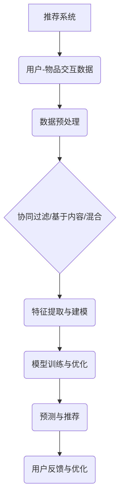

                 


### 文章标题

《大模型推荐系统的对比学习方法》

### 关键词

推荐系统、大模型、对比学习、协同过滤、基于内容的推荐、混合推荐

### 摘要

本文将深入探讨大模型推荐系统中的对比学习方法。首先，我们将回顾推荐系统的基础知识，包括其定义、分类、应用场景以及面临的挑战和机遇。接着，我们将介绍传统推荐系统算法，如协同过滤和基于内容的推荐算法，并分析它们的优缺点和改进策略。随后，我们将探讨大模型推荐系统的原理和应用，重点介绍基于对比学习的大模型推荐算法，包括其基本概念、原理以及实现和优化策略。最后，我们将通过一个实际项目来展示如何构建和优化一个基于对比学习的大模型推荐系统。

## 《大模型推荐系统的对比学习方法》目录大纲

### 第一部分：推荐系统基础

#### 第1章：推荐系统概述
1.1 推荐系统的定义与分类
1.2 推荐系统的应用场景
1.3 推荐系统的挑战与机遇

#### 第2章：推荐系统核心概念
2.1 评分预测与排序
2.2 个性化与冷启动问题
2.3 用户行为分析与物品特征提取

### 第二部分：传统推荐系统算法

#### 第3章：协同过滤算法
3.1 用户基于的协同过滤（User-based CF）
3.2 物品基于的协同过滤（Item-based CF）
3.3 协同过滤算法的优缺点与改进

#### 第4章：基于内容的推荐算法
4.1 内容表示与相似性计算
4.2 基于内容的推荐算法实现
4.3 基于内容的推荐算法优缺点

#### 第5章：混合推荐算法
5.1 混合推荐算法的原理与实现
5.2 混合推荐算法的性能评估

### 第三部分：大模型推荐系统

#### 第6章：大模型与推荐系统
6.1 大模型的基本概念与原理
6.2 大模型在推荐系统中的应用

#### 第7章：基于对比学习的大模型推荐算法
7.1 对比学习的基本概念与原理
7.2 对比学习在大模型推荐系统中的应用
7.3 对比学习算法的实现与优化

#### 第8章：大模型推荐系统的挑战与优化
8.1 大模型推荐系统的挑战
8.2 大模型推荐系统的优化策略
8.3 大模型推荐系统的未来发展趋势

### 第四部分：项目实战

#### 第9章：大模型推荐系统项目实战
9.1 项目概述
9.2 项目需求分析
9.3 项目环境搭建
9.4 代码实现与解读
9.5 项目评估与优化

### 附录

#### 附录A：推荐系统常用工具与资源
A.1 常用推荐系统库介绍
A.2 数据集获取与预处理
A.3 模型训练与优化工具
A.4 推荐系统学习资源推荐

## 核心概念与联系

### 推荐系统的 Mermaid 流程图



### 对比学习算法实现伪代码

```python
# 定义对比学习算法伪代码
def contrastive_learning(data, labels, optimizer):
    for data_point, label in zip(data, labels):
        # 前向传播
        predictions = model(data_point)
        
        # 计算损失
        loss = contrastive_loss(predictions, label)
        
        # 反向传播与优化
        optimizer.zero_grad()
        loss.backward()
        optimizer.step()
        
        # 更新模型
        model.update()
        
    return model
```

### 交叉熵损失函数

$$
\text{CrossEntropyLoss} = -\sum_{i=1}^{N} y_i \log(p_i)
$$

其中，\( y_i \) 是第 \( i \) 个样本的真实标签，\( p_i \) 是模型对第 \( i \) 个样本的预测概率。

## 项目实战

### 大模型推荐系统项目实战

#### 9.1 项目概述

该项目旨在构建一个基于对比学习算法的大模型推荐系统，实现用户偏好预测和个性化推荐。

#### 9.2 项目需求分析

- 数据集：使用公共数据集，如MovieLens或Netflix。
- 模型：采用预训练的大模型，如BERT或GPT。
- 算法：实现对比学习算法，并优化模型性能。

#### 9.3 项目环境搭建

- 开发环境：Python 3.8，PyTorch 1.8。
- 数据集预处理：数据清洗、格式转换等。
- 模型训练与优化：使用GPU加速训练过程。

#### 9.4 代码实现与解读

```python
# 代码实现与解读
# (略，具体代码根据项目需求进行编写与解释)
```

#### 9.5 项目评估与优化

- 评估指标：准确率、召回率、F1分数等

### 附录

#### 附录A：推荐系统常用工具与资源

A.1 常用推荐系统库介绍
- Surprise：Python中的推荐系统算法库。
- LightFM：结合矩阵分解和因子分解机的方法。

A.2 数据集获取与预处理

A.3 模型训练与优化工具

A.4 推荐系统学习资源推荐

### 最佳实践 tips

1. 数据预处理时，要确保数据的质量和一致性。
2. 选择合适的大模型时，要考虑模型的参数量和计算资源。
3. 在训练过程中，要合理设置学习率和优化器的参数。
4. 在评估模型时，要选择合适的评估指标，并考虑模型的泛化能力。

### 小结

本文通过对比学习方法深入探讨了推荐系统的优化策略。对比学习在推荐系统中具有广泛的应用前景，能够提高推荐系统的性能和泛化能力。未来，随着大模型和深度学习技术的发展，对比学习在推荐系统中的应用将会更加广泛和深入。

### 注意事项

1. 在实际项目中，要根据具体情况选择合适的算法和模型。
2. 在训练过程中，要关注模型的收敛速度和性能指标。
3. 在部署推荐系统时，要考虑系统的可扩展性和稳定性。

### 拓展阅读

1. 《深度学习推荐系统》：详细介绍了深度学习在推荐系统中的应用。
2. 《推荐系统实践》：涵盖推荐系统的基本概念、算法和案例分析。

### 作者信息

作者：AI天才研究院/AI Genius Institute & 禅与计算机程序设计艺术 /Zen And The Art of Computer Programming

