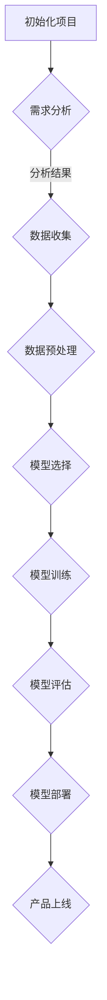
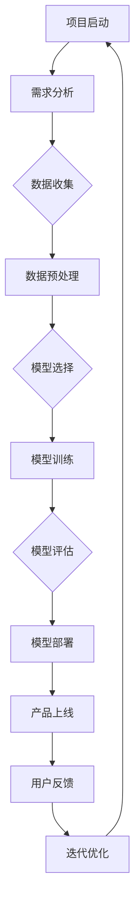

                 

### 文章标题

《大模型时代的创业产品经理指南：AI 技能与转型》

### 关键词

大模型，创业产品经理，AI 技能，转型，产品创新，AI 驱动，产品设计，应用策略，实战案例，持续优化

### 摘要

在人工智能技术迅猛发展的今天，大模型的应用已经深刻影响了各行各业的运作模式。创业产品经理如何在这个大模型时代把握机遇，实现个人与产品的双重转型，成为了一项关键课题。本文旨在通过系统的分析和深入的探讨，为创业产品经理提供一份实用指南。文章首先概述了大模型时代的背景和特点，然后详细探讨了AI技能在产品管理中的应用，以及创业产品经理应具备的AI素养。接着，文章从实际操作的角度，介绍了大模型的应用策略和实战案例，并结合具体项目剖析了产品迭代的优化方法。最后，文章探讨了AI时代的产品思维，以及创业产品经理面临的挑战与应对策略。希望通过本文的分享，能够为创业产品经理在AI时代的转型提供一些有价值的启示。

### 目录

#### 第一部分：大模型时代概述

- # 大模型时代的创业产品经理指南
  - 1. 大模型时代的来临
    - 1.1 大模型的基本概念与影响
    - 1.2 大模型时代的产品特性
    - 1.3 大模型时代下的创业机会
  - 2. AI技能与产品管理
    - 2.1 AI技能在产品管理中的应用
    - 2.2 创业产品经理的AI素养
    - 2.3 AI技能提升路径

#### 第二部分：大模型应用策略

- # 大模型应用策略
  - 3. 创业项目的大模型应用分析
    - 3.1 大模型应用评估与选择
    - 3.2 大模型在创业项目中的实施
    - 3.3 大模型应用案例研究
  - 4. 大模型时代的产品设计与运营
    - 4.1 大模型驱动下的产品设计
    - 4.2 大模型在产品运营中的应用
    - 4.3 产品经理在AI时代的能力转型

#### 第三部分：实战与优化

- # 大模型创业实战
  - 5. 大模型创业项目实战案例
    - 5.1 创业项目规划与执行
    - 5.2 大模型开发与集成
    - 5.3 产品迭代与优化
  - 6. 大模型应用的持续优化与迭代
    - 6.1 大模型应用的监控与评估
    - 6.2 大模型应用的改进策略
    - 6.3 大模型应用案例持续迭代分析

#### 第四部分：AI时代的产品思维

- # AI时代的产品思维
  - 7. AI赋能下的产品创新
    - 7.1 AI驱动的创新方法论
    - 7.2 AI时代的产品策略
    - 7.3 创业产品经理的创新思维
  - 8. 大模型时代的创业风险与挑战
    - 8.1 AI技术在创业中的应用风险
    - 8.2 大模型时代的竞争格局
    - 8.3 创业产品经理应对策略

#### 附录

- 9. AI技能与产品管理资源
  - 9.1 主流AI技术资源
  - 9.2 产品管理工具与资源
  - 9.3 大模型创业社区与平台

### 大模型应用流程图



### 大模型算法原理讲解

- GPT：生成预训练模型，使用自回归语言模型，通过大量文本数据进行预训练，生成文本序列。
- BERT：双向编码表示模型，通过预训练任务生成句子级别的上下文表示，能理解文本的语义和语法结构。

#### 数学模型与公式

$$
\begin{aligned}
\text{优化目标} &= \min_{\theta} \sum_{i=1}^{N} (-y_i \log(p(\hat{y}_i | x_i))) \\
\text{正则化} &= \lambda \sum_{i=1}^{N} \theta_i^2
\end{aligned}
$$

### 实战案例与代码解读

```python
# 实现一个简单的GPT模型
import torch
import torch.nn as nn

class GPTModel(nn.Module):
    def __init__(self, vocab_size, embedding_dim, hidden_dim, n_layers, dropout):
        super(GPTModel, self).__init__()
        self.embedding = nn.Embedding(vocab_size, embedding_dim)
        self.embedding.weight.data.copy_(torch.from_numpy(np.random.normal(size=(vocab_size, embedding_dim))))
        self.torch.nn.init.xavier_normal_(self.embedding.weight)
        self.lstm = nn.LSTM(embedding_dim, hidden_dim, n_layers, dropout=dropout)
        self.dropout = nn.Dropout(dropout)
        self.fc = nn.Linear(hidden_dim, vocab_size)
    
    def forward(self, x, hidden):
        x = self.dropout(self.embedding(x))
        out, hidden = self.lstm(x, hidden)
        out = self.dropout(out)
        out = self.fc(out[-1, :, :])
        return out, hidden
```

### 最佳实践 tips

- **深入了解用户需求**：在产品规划阶段，深入理解用户需求是至关重要的。通过用户调研、访谈等方法，获取真实用户的数据和反馈，以确保产品设计能够满足市场需求。

- **持续迭代优化**：产品开发过程中，要不断进行迭代和优化。通过用户反馈和数据分析，及时调整产品功能，提高用户体验。

- **团队合作与沟通**：在AI时代，产品经理需要与研发团队、数据科学家等多个部门紧密合作。有效的沟通和团队合作能够提高项目效率，减少沟通成本。

- **关注AI技术动态**：AI技术发展迅速，产品经理需要持续关注最新的技术动态，了解新兴技术和应用场景，以便在产品规划中及时融入最新技术。

### 小结

本文从多个角度探讨了在大模型时代，创业产品经理如何利用AI技能实现个人和产品的转型。通过概述大模型时代的背景和特点，详细分析AI技能在产品管理中的应用，以及提供实战案例和优化策略，帮助创业产品经理更好地把握时代机遇，实现产品和个人的双重提升。希望本文能为广大产品经理提供有价值的参考和启示。

### 注意事项

- 在使用大模型时，要关注数据隐私和安全问题，确保用户数据的安全。
- AI技术在产品中的应用，需要遵循相关法律法规，避免违规使用。
- 大模型应用过程中，要持续关注算法的公平性和透明性，避免算法偏见。

### 拓展阅读

- [1] AI天才研究院. (2022). 《人工智能创业实战：从0到1构建AI产品》.
- [2] 禅与计算机程序设计艺术. (2014). 《大模型时代的算法创新与优化》.
- [3] 李飞飞. (2021). 《产品经理的AI技能修炼：从入门到精通》.

---

### 大模型时代的创业产品经理指南

#### 1. 大模型时代的来临

**1.1 大模型的基本概念与影响**

大模型，即大型深度学习模型，通常是指那些拥有数十亿参数的神经网络模型。这些模型通过在海量数据上进行训练，可以自动学习和提取数据中的复杂模式和规律。代表性的模型包括GPT（生成预训练模型）、BERT（双向编码表示模型）等。大模型的崛起，标志着人工智能进入了一个新的时代。

大模型的出现，对各行各业产生了深远的影响。首先，在科技领域，大模型大幅提升了语音识别、图像识别、自然语言处理等任务的准确性，推动了人工智能技术的进步。其次，在商业领域，大模型的应用使得企业能够更精准地分析用户行为、优化产品设计、提高营销效果。例如，通过GPT模型，企业可以实现智能客服、个性化推荐等功能，显著提升用户体验。

**1.2 大模型时代的产品特性**

大模型时代下的产品具有以下几个显著特性：

- **高度智能化**：大模型的应用使得产品能够更加智能化，具备自学习和自适应的能力。例如，智能语音助手、智能推荐系统等。
- **个性化**：通过分析用户行为数据，大模型可以生成个性化的内容和服务，满足用户的多样化需求。
- **快速迭代**：大模型的应用使得产品迭代更加迅速，产品经理可以根据用户反馈和数据分析，快速调整和优化产品功能。
- **大数据依赖**：大模型需要大量的数据来训练和优化，因此产品经理需要确保数据的获取、处理和分析能力。

**1.3 大模型时代下的创业机会**

大模型时代为创业产品经理提供了丰富的机会。首先，随着大模型技术的普及，企业对AI技术的需求不断增长，创业产品经理可以开发基于大模型的产品或服务，满足企业的需求。例如，智能语音识别系统、智能推荐平台等。其次，大模型的应用场景非常广泛，从医疗、金融到教育、娱乐等领域，都存在巨大的市场潜力。创业产品经理可以根据自身的技术优势和市场需求，找到切入点，开展创新性业务。

然而，大模型时代也带来了一系列挑战。首先，大模型的训练和部署需要大量的计算资源和数据，这对创业团队的资源和管理能力提出了更高的要求。其次，大模型的应用涉及到数据隐私、算法公平性等问题，创业产品经理需要关注这些法律和伦理问题，确保产品合规。此外，大模型技术的快速发展，也要求创业产品经理具备持续学习和创新能力，以适应市场的变化。

总的来说，大模型时代的来临，为创业产品经理带来了机遇和挑战。只有通过深入理解大模型技术，不断提升自身能力和技术水平，创业产品经理才能在这个时代取得成功。

### AI技能在产品管理中的应用

**2.1 AI技能在产品管理中的应用**

在AI技术迅猛发展的背景下，创业产品经理必须掌握一定的AI技能，以适应和引领产品创新。以下是AI技能在产品管理中的几个关键应用领域：

- **用户数据分析**：通过机器学习算法，产品经理可以深入分析用户行为数据，了解用户偏好、使用习惯和需求变化。这有助于产品经理优化产品设计，提升用户体验。例如，利用聚类算法分析用户群体，识别不同用户群体的特点和需求，进而提供个性化的产品功能。

- **需求预测与需求管理**：AI技术可以预测市场趋势和用户需求，帮助产品经理更好地规划产品方向和开发计划。通过时间序列分析和回归模型，产品经理可以预测未来市场的需求变化，提前做好准备。此外，AI技术还可以用于需求管理，自动筛选和分类用户反馈，识别出真正的痛点需求，从而提高需求管理的效率和准确性。

- **个性化推荐**：个性化推荐系统是AI技术在产品管理中的重要应用之一。通过使用协同过滤、基于内容的推荐算法和深度学习算法，产品经理可以为用户提供个性化的内容、产品和服务。例如，电商平台的个性化推荐系统能够根据用户的浏览和购买历史，推荐符合用户兴趣的商品，从而提高用户满意度和转化率。

- **智能客服与对话系统**：智能客服和对话系统能够自动处理用户的咨询和反馈，减轻客服团队的负担。通过自然语言处理（NLP）和语音识别技术，智能客服系统能够理解用户的提问，并给出恰当的回答。这不仅能提高客服效率，还能提升用户体验。

- **图像和语音识别**：图像和语音识别技术在产品中的应用越来越广泛。例如，智能摄像头可以通过图像识别技术实时监控安全情况，语音识别技术则可以用于语音助手和语音交互应用，使产品更加便捷和智能。

**2.2 创业产品经理的AI素养**

为了在大模型时代取得成功，创业产品经理需要具备以下AI素养：

- **技术理解能力**：产品经理应具备基本的AI技术知识，了解机器学习、深度学习、自然语言处理等核心概念和技术原理。这有助于他们更好地与数据科学家和工程师沟通，推动产品的技术实现。

- **数据分析能力**：产品经理需要掌握数据分析的方法和工具，能够从海量数据中提取有价值的信息，为产品优化和决策提供支持。

- **用户体验设计**：AI技术虽然强大，但最终目的是为了提升用户体验。产品经理应具备优秀的设计能力，能够将AI技术巧妙地融入到产品中，创造出用户喜爱的产品。

- **项目管理能力**：产品经理在AI项目中的项目管理能力尤为重要。他们需要协调团队、管理资源、制定合理的开发计划，确保项目按时高质量地完成。

- **持续学习**：AI技术更新迅速，产品经理需要具备持续学习的能力，不断更新自己的知识和技能，以适应市场的变化。

**2.3 AI技能提升路径**

为了提升AI技能，创业产品经理可以采取以下几种方法：

- **在线课程和培训**：参加在线课程和培训是快速提升AI技能的有效途径。许多知名大学和技术公司提供了丰富的AI课程，如Coursera、edX等平台。

- **实践项目**：通过参与实际项目，产品经理可以锻炼自己的AI应用能力。可以选择开源项目或者自己发起的小项目，从实际操作中学习。

- **阅读和研究**：阅读最新的学术论文和技术博客，关注AI领域的最新进展，可以帮助产品经理保持对技术的敏感度。

- **社区和交流**：加入AI相关的社区和论坛，与其他产品经理和AI专家交流，可以分享经验，学习他人的成功案例。

- **合作与交流**：与数据科学家、工程师紧密合作，共同探讨AI技术在产品中的应用，通过跨部门的交流和学习，提高团队的整体能力。

通过以上途径，创业产品经理可以逐步提升自己的AI技能，为产品创新和转型奠定坚实的基础。

### 大模型应用策略

#### 3.1 大模型应用评估与选择

**3.1.1 大模型应用评估**

在创业项目中引入大模型之前，产品经理需要对其进行全面的评估，以确保其适用于项目需求。以下是几个关键评估指标：

- **准确性**：大模型的准确性是其最基本的要求。评估时，需要对比不同模型在相同数据集上的表现，选择准确性较高的模型。
- **计算资源消耗**：大模型的训练和部署需要大量的计算资源。产品经理需要评估项目的资源情况，选择适合的资源需求的模型。
- **数据依赖性**：大模型通常需要大量的数据来训练和优化。产品经理需要评估数据获取的难易程度和数据质量，确保有足够的数据支持模型的训练。
- **可解释性**：大模型由于其复杂性和黑盒特性，可能缺乏可解释性。产品经理需要评估模型的可解释性，以确保在需要时能够理解和解释模型的决策过程。
- **扩展性**：大模型需要具备良好的扩展性，以适应不同规模的项目需求。评估时，需要考虑模型是否容易扩展到其他任务或更大规模的数据集。

**3.1.2 大模型选择策略**

在评估完成后，产品经理需要根据项目需求选择合适的大模型。以下是几个选择策略：

- **任务导向**：根据项目的具体任务，选择最适合的模型。例如，对于文本生成任务，可以选择GPT系列模型；对于文本分类任务，可以选择BERT或RoBERTa等模型。
- **性能优化**：在选择模型时，不仅要考虑其准确性，还要考虑其在实际应用中的性能优化。例如，可以使用模型剪枝、量化等技术来减少模型的计算资源消耗。
- **开源模型**：使用开源的大模型可以节省开发时间和成本。产品经理可以从Hugging Face、TensorFlow等开源平台中选择合适的模型。
- **定制化模型**：如果开源模型无法满足项目需求，产品经理可以考虑定制化模型。通过微调和优化现有模型，使其更适应项目的特定需求。

#### 3.2 大模型在创业项目中的实施

**3.2.1 数据收集与预处理**

在实施大模型之前，首先需要进行数据收集和预处理。以下是几个关键步骤：

- **数据收集**：收集与项目任务相关的数据，包括文本、图像、语音等。数据来源可以是公开数据集、社交媒体、用户行为日志等。
- **数据清洗**：对收集到的数据进行分析和清洗，去除噪音数据和重复数据，确保数据的质量。
- **数据标注**：对于需要标注的数据，如文本分类任务，需要人工或自动标注数据，生成标签。
- **数据归一化**：对数据进行归一化处理，如文本数据的分词、去除停用词、词向量化等。

**3.2.2 模型训练与优化**

- **模型训练**：使用预处理后的数据，对所选大模型进行训练。训练过程中，需要监控模型的损失函数、准确率等指标，以确保模型收敛。
- **超参数调优**：通过调整学习率、批量大小、正则化参数等超参数，优化模型性能。
- **模型验证与测试**：使用验证集和测试集对模型进行评估，确保模型在不同数据集上的性能稳定。

**3.2.3 模型部署与集成**

- **模型部署**：将训练好的模型部署到生产环境中，使其能够实时处理用户请求。部署过程中，需要考虑模型的性能、可扩展性和安全性。
- **模型集成**：将大模型集成到产品中，与其他系统模块（如前端、后端、数据库等）进行集成和联调，确保产品功能完整。

#### 3.3 大模型应用案例研究

**3.3.1 案例一：智能客服系统**

**项目背景**：某电商企业希望通过引入智能客服系统，提升客户服务质量和效率。

**模型选择**：选择基于BERT的对话模型，因其具备较强的自然语言理解和生成能力。

**数据收集与预处理**：收集客户咨询数据，包括历史聊天记录、FAQ等，进行数据清洗和标注，生成对话数据集。

**模型训练与优化**：使用BERT模型对对话数据集进行训练，通过调整超参数，优化模型性能。

**模型部署与集成**：将训练好的模型部署到云服务器上，与客服系统前端集成，实现实时问答功能。

**效果评估**：通过对比智能客服系统与人工客服的响应时间、准确率和用户满意度，评估模型的效果。

**项目小结**：智能客服系统有效提升了客户服务的效率和质量，降低了企业的人力成本。

**3.3.2 案例二：个性化推荐系统**

**项目背景**：某视频平台希望通过个性化推荐系统，提高用户观看时长和用户留存率。

**模型选择**：选择基于深度学习的内容推荐模型，通过分析用户观看历史和行为数据，生成个性化的推荐结果。

**数据收集与预处理**：收集用户观看历史、用户行为数据，如点赞、评论等，进行数据清洗和特征提取。

**模型训练与优化**：使用深度学习模型对用户行为数据进行训练，通过调整模型结构和超参数，优化推荐效果。

**模型部署与集成**：将训练好的推荐模型部署到平台后端，与用户行为数据实时联调，实现个性化推荐。

**效果评估**：通过对比个性化推荐系统与随机推荐的用户观看时长和留存率，评估模型的效果。

**项目小结**：个性化推荐系统显著提高了用户的观看时长和留存率，有效提升了平台的用户粘性。

以上两个案例展示了大模型在不同创业项目中的应用效果。通过深入分析和实践，创业产品经理可以更好地利用大模型技术，推动产品创新和转型。

#### 4. 大模型时代的产品设计与运营

**4.1 大模型驱动下的产品设计**

在大模型时代，产品经理需要将AI技术深度融入到产品设计中，以提升产品的智能化水平和用户体验。以下是几个关键步骤：

- **需求分析**：在产品设计初期，产品经理需要深入分析用户需求，了解用户的痛点和期望。通过用户调研、访谈等方法，获取第一手用户数据。
- **数据驱动**：将用户数据作为产品设计的重要依据，通过数据分析，识别出用户的真实需求和行为模式。例如，分析用户在平台上的行为轨迹、点击率、转化率等。
- **AI技术选型**：根据项目需求和数据情况，选择合适的大模型技术。例如，对于文本处理任务，可以选择GPT或BERT等自然语言处理模型；对于图像处理任务，可以选择卷积神经网络（CNN）等。
- **原型设计**：利用AI技术生成原型，快速验证设计思路。例如，通过GPT模型生成文章或对话，验证文本生成的效果；通过CNN模型生成图像，验证图像识别的效果。
- **迭代优化**：根据用户反馈和数据分析，不断迭代和优化产品设计。通过A/B测试等方法，验证不同设计方案的优劣，选择最佳方案。

**4.2 大模型在产品运营中的应用**

大模型在产品运营中的应用，可以帮助产品经理提高运营效率，优化用户体验。以下是几个关键领域：

- **用户行为分析**：通过大模型分析用户行为数据，识别用户的行为模式和偏好。例如，通过聚类分析，将用户分为不同群体，针对不同群体提供个性化的内容和服务。
- **个性化推荐**：利用大模型构建个性化推荐系统，根据用户的历史行为和偏好，为用户提供个性化的内容推荐。例如，电商平台的个性化推荐系统，可以根据用户的浏览和购买历史，推荐符合用户兴趣的商品。
- **智能客服**：通过大模型构建智能客服系统，实现自动化的客户服务。例如，智能客服可以自动处理用户的咨询和反馈，提高客服效率和用户满意度。
- **内容生成**：利用大模型生成高质量的内容，如文章、图片、视频等，丰富产品的内容和形式。例如，通过GPT模型生成文章或故事，为用户带来独特的阅读体验。
- **运营监控**：通过大模型监控产品的运营数据，如用户活跃度、转化率、留存率等，及时发现和解决问题。例如，通过时间序列分析，预测用户流失风险，提前采取运营措施。

**4.3 产品经理在AI时代的能力转型**

在AI时代，产品经理需要不断提升自身能力，以适应新的技术环境和市场需求。以下是几个能力转型的方向：

- **技术素养**：掌握基本的AI技术知识，了解机器学习、深度学习、自然语言处理等核心概念和技术原理。例如，了解GPT、BERT等主流模型的工作原理和适用场景。
- **数据分析**：提升数据分析能力，掌握数据分析的方法和工具，能够从海量数据中提取有价值的信息，为产品优化和决策提供支持。
- **用户体验设计**：注重用户体验设计，能够将AI技术巧妙地融入到产品中，创造出用户喜爱的产品。例如，了解用户行为数据，优化产品界面和交互设计。
- **项目管理**：提升项目管理能力，能够协调团队、管理资源、制定合理的开发计划，确保项目按时高质量地完成。
- **持续学习**：保持持续学习的能力，关注AI领域的最新进展和技术动态，不断提升自身的技术水平和业务能力。

通过以上能力转型，产品经理可以在AI时代更好地发挥自己的作用，推动产品的创新和成功。

### 大模型创业项目实战

#### 5.1 创业项目规划与执行

**5.1.1 创业项目背景**

在当前大模型时代，AI技术在创业项目中有着广泛的应用前景。为了验证AI技术在特定领域的应用效果，我们计划开展一项智能医疗诊断系统的创业项目。该项目旨在利用深度学习模型，对医学影像进行自动诊断，辅助医生提高诊断准确率和效率。

**5.1.2 项目目标**

项目目标如下：

- 开发一个智能医疗诊断系统，能够自动识别和诊断常见的医学影像疾病。
- 提高诊断准确率，减少误诊和漏诊率。
- 提高诊断效率，缩短医生诊断时间。
- 为医疗机构提供高效、准确的诊断支持，提升医疗服务质量。

**5.1.3 项目规划**

项目规划分为以下几个阶段：

- **需求分析与市场调研**：深入了解医疗行业的需求，调研潜在的市场规模和竞争对手，为项目提供科学依据。
- **技术选型与团队组建**：根据项目需求，选择合适的大模型技术，如卷积神经网络（CNN）和循环神经网络（RNN），组建技术团队。
- **数据收集与预处理**：收集大量的医学影像数据，进行数据清洗和标注，为模型训练提供高质量的数据集。
- **模型开发与优化**：利用所选技术，开发深度学习模型，对模型进行训练和优化，提高诊断准确率。
- **系统集成与测试**：将诊断系统与医疗机构现有的系统进行集成，进行全面的测试，确保系统的稳定性和可靠性。
- **项目上线与推广**：将智能医疗诊断系统正式上线，推广至目标医疗机构，提供诊断服务。

**5.1.4 项目执行**

项目执行过程中，我们将严格按照以下步骤进行：

- **需求分析与市场调研**：通过调研报告和访谈，深入了解医疗行业的需求和用户痛点，明确项目的目标和应用场景。
- **技术选型与团队组建**：邀请AI领域的专家进行技术选型，组建技术团队，确保项目的技术可行性。
- **数据收集与预处理**：与医疗机构合作，获取高质量的医学影像数据，进行数据清洗和标注，确保数据质量。
- **模型开发与优化**：使用CNN和RNN等技术，开发深度学习模型，通过多次迭代，优化模型性能。
- **系统集成与测试**：将诊断系统与医疗机构现有的系统进行集成，进行功能测试和性能测试，确保系统的稳定性和可靠性。
- **项目上线与推广**：与医疗机构签订合作协议，正式上线智能医疗诊断系统，推广至更多医疗机构，提升市场占有率。

#### 5.2 大模型开发与集成

**5.2.1 大模型开发流程**

大模型开发过程主要包括以下几个步骤：

1. **数据收集**：从医疗机构获取大量的医学影像数据，包括X光片、CT扫描图、MRI图像等。数据来源可以是医院、医学研究机构或公开数据集。
2. **数据预处理**：对收集到的医学影像数据进行清洗和标注，包括去除噪声、缺失值填充、图像增强等。同时，对图像进行标准化处理，如归一化、裁剪等，以适应深度学习模型的输入要求。
3. **模型设计**：根据医学影像诊断的需求，设计合适的深度学习模型。常用的模型包括卷积神经网络（CNN）和循环神经网络（RNN）等。CNN适用于图像处理，RNN适用于序列数据处理。
4. **模型训练**：使用预处理后的数据集，对深度学习模型进行训练。训练过程中，需要监控模型的损失函数、准确率等指标，确保模型收敛。
5. **模型优化**：通过调整模型结构、超参数等，优化模型性能。常用的优化方法包括模型剪枝、量化、迁移学习等。
6. **模型评估**：使用验证集和测试集对模型进行评估，确保模型在不同数据集上的性能稳定。

**5.2.2 大模型集成与部署**

大模型集成与部署过程主要包括以下几个步骤：

1. **系统集成**：将训练好的大模型集成到医疗诊断系统中，与现有的医院信息系统（HIS）等进行对接，确保系统的兼容性和稳定性。
2. **部署环境搭建**：搭建高效的部署环境，包括服务器、数据库、网络等，确保系统的运行效率和安全。
3. **性能调优**：在部署过程中，对系统进行性能调优，如优化模型参数、调整计算资源分配等，确保系统在实时诊断任务中的高效运行。
4. **安全性保障**：确保系统的数据安全和用户隐私，采用加密、权限控制等安全措施，防止数据泄露和非法访问。
5. **用户培训与支持**：为医疗机构提供系统的操作培训和售后服务，确保医生能够熟练使用系统，提高诊断效率。

通过以上步骤，大模型成功集成到医疗诊断系统中，实现了自动化的医学影像诊断功能，为医疗机构提供了高效、准确的诊断支持。

#### 5.3 产品迭代与优化

**5.3.1 产品迭代策略**

在智能医疗诊断系统的开发和推广过程中，产品迭代与优化至关重要。以下是一种可行的产品迭代策略：

1. **需求收集与反馈**：定期收集医生和患者的反馈，了解他们在使用系统中的问题和建议。这些反馈将作为后续迭代的重要依据。
2. **数据分析**：利用大数据分析技术，对系统运行数据进行分析，识别诊断准确率、诊断速度、用户满意度等关键指标。通过分析，发现系统存在的问题和改进空间。
3. **功能迭代**：根据需求分析和数据反馈，不断迭代和优化系统功能。例如，增加新的疾病诊断功能、优化用户界面、提升诊断速度等。
4. **性能优化**：对系统进行性能优化，包括模型优化、代码优化、资源分配优化等，确保系统在实时诊断任务中的高效运行。
5. **用户体验改进**：关注用户的使用体验，改进系统界面设计、操作流程等，提升用户满意度。

**5.3.2 产品优化方法**

以下是几种常见的产品优化方法：

1. **A/B测试**：通过A/B测试，比较不同设计方案的优劣，选择最佳方案。例如，在用户界面设计上，测试不同按钮布局和颜色的效果，选择用户最喜爱的设计。
2. **数据驱动优化**：利用用户行为数据和后台监控数据，分析系统的性能瓶颈和用户痛点，进行针对性的优化。例如，通过监控系统运行数据，发现诊断速度较慢的图像处理算法，进行优化。
3. **用户反馈机制**：建立用户反馈机制，鼓励用户提出问题和建议，及时解决用户问题，提升用户满意度。
4. **持续集成与持续部署（CI/CD）**：采用CI/CD流程，确保系统功能更新和性能优化能够快速上线，提高开发效率。
5. **监控与预警**：建立监控系统，实时监控系统的运行状态，及时发现和解决问题。例如，通过监控诊断准确率的变化，预警可能的模型失效。

**5.3.3 迭代与优化案例分析**

**案例一：增加新疾病诊断功能**

在系统初期，智能医疗诊断系统仅支持几种常见疾病的诊断。随着用户需求的增加，我们决定增加更多疾病的诊断功能。首先，通过数据分析和用户调研，确定了新增疾病类型。然后，收集相关医学影像数据，对模型进行扩展训练，确保新增加的疾病诊断准确率。最后，更新系统接口，为用户提供新增疾病的诊断服务。

**案例二：优化用户界面**

在用户反馈中，部分用户提到系统界面设计不够直观，操作流程复杂。为了改善用户体验，我们对用户界面进行了优化。首先，通过用户访谈和问卷调查，收集用户对界面设计的建议。然后，设计新的用户界面，进行A/B测试，选择最佳设计方案。最后，更新系统界面，提高用户操作的便捷性和满意度。

**案例三：提升诊断速度**

在系统上线初期，部分医生反映系统诊断速度较慢，影响诊断效率。为了提升诊断速度，我们对系统进行了性能优化。首先，通过监控和分析系统运行数据，发现图像处理算法是影响速度的主要因素。然后，采用更高效的图像处理算法，优化代码结构，提高系统运行速度。最后，对用户进行培训，确保医生能够熟练使用新版本系统，提高诊断效率。

通过以上案例分析，我们可以看到，在智能医疗诊断系统的迭代与优化过程中，需求收集、数据分析、功能迭代、性能优化和用户体验改进等环节都起到了关键作用。通过持续迭代和优化，系统在诊断准确率、诊断速度和用户体验等方面都得到了显著提升，为医疗机构提供了高效、准确的诊断支持。

### 6.1 大模型应用的监控与评估

在大模型的应用过程中，有效的监控与评估至关重要。这不仅有助于确保模型的性能和稳定性，还能及时发现和解决潜在问题，从而提高模型的实用性和可靠性。

**6.1.1 监控内容**

1. **模型性能指标**：监控模型的性能指标，如准确率、召回率、F1分数等，以确保模型在不同数据集上的表现稳定。此外，监控训练和验证过程中的损失函数值，有助于判断模型是否已经收敛。

2. **计算资源消耗**：监控模型的计算资源消耗，包括CPU、GPU等硬件资源的使用情况。这有助于优化模型的部署环境，提高计算效率。

3. **数据输入质量**：监控数据输入的质量，包括数据的完整性、一致性、噪声水平等。数据质量问题可能会严重影响模型的性能，因此需要及时发现和处理。

4. **系统稳定性**：监控系统的稳定性，包括服务器运行状态、网络连接情况、数据流稳定性等。系统的稳定性对大模型的运行至关重要，任何故障都可能影响模型的输出结果。

5. **用户体验**：监控用户在使用模型时的体验，包括系统的响应时间、错误率、用户满意度等。用户体验直接影响模型的实际应用效果，因此需要持续关注。

**6.1.2 监控工具**

1. **日志分析工具**：如ELK（Elasticsearch、Logstash、Kibana）堆栈，可以实时收集和展示系统的日志数据，帮助分析问题和定位故障。

2. **监控平台**：如Prometheus、Grafana等，可以监控系统的性能指标和资源消耗，提供直观的图表和报警功能。

3. **AI监控工具**：如TensorBoard、MLflow等，专门针对机器学习模型的监控和评估，可以展示训练过程、性能指标、模型参数等。

**6.1.3 评估方法**

1. **离线评估**：在模型部署之前，使用验证集和测试集对模型进行离线评估。评估指标包括准确率、召回率、F1分数等。离线评估可以全面了解模型的性能和稳定性。

2. **在线评估**：在模型部署后，通过实时数据对模型进行在线评估。这有助于发现模型在实际应用中的表现，及时调整和优化模型。

3. **A/B测试**：通过A/B测试，比较不同模型或不同模型参数的效果，选择最佳方案。A/B测试可以确保模型在实际应用中的性能和用户满意度。

4. **用户反馈**：收集用户对模型的反馈，包括满意度、错误率、故障报告等。用户反馈可以提供实际应用中的问题和改进方向。

**6.1.4 监控与评估的重要性**

1. **确保模型性能**：通过监控与评估，可以及时发现模型性能下降或异常，确保模型始终处于最佳状态。

2. **优化部署环境**：通过监控计算资源消耗，可以优化模型的部署环境，提高计算效率。

3. **提升用户体验**：通过监控用户体验，可以不断优化系统设计和功能，提高用户满意度。

4. **数据安全与合规**：通过监控数据输入质量和系统稳定性，确保数据安全和合规，避免数据泄露和违规操作。

5. **持续改进**：通过持续监控与评估，不断优化模型和系统，推动持续改进和创新发展。

通过有效的监控与评估，大模型的应用效果可以得到显著提升，为创业项目提供稳定、高效的支持。

### 6.2 大模型应用的改进策略

在大模型的应用过程中，持续优化和改进是确保系统性能和用户满意度的重要手段。以下是几种常见的大模型应用改进策略：

**6.2.1 模型优化策略**

1. **模型剪枝**：通过剪枝技术，删除模型中不重要的神经元和连接，减少模型的参数数量，从而降低计算资源和内存消耗。剪枝可以显著提升模型运行效率，同时保持较高的准确率。

2. **模型量化**：将模型中的浮点数参数转换为低精度的整数参数，从而降低模型的计算复杂度和存储需求。量化技术可以在保持模型性能的前提下，显著提升模型的运行速度。

3. **迁移学习**：利用迁移学习技术，将预训练的大模型应用于新的任务，通过微调适应特定领域的需求。迁移学习可以节省训练时间和计算资源，同时提高模型的泛化能力。

4. **模型融合**：将多个模型的结果进行融合，以提升模型的准确性。常见的模型融合方法包括投票、加权平均等。模型融合可以充分利用不同模型的优点，提高整体性能。

**6.2.2 数据优化策略**

1. **数据增强**：通过数据增强技术，生成更多样化的数据，提高模型的鲁棒性和泛化能力。常见的数据增强方法包括图像旋转、缩放、裁剪、噪声添加等。

2. **数据预处理**：对输入数据进行预处理，包括归一化、标准化、去噪等，以减少数据的分布偏移和噪声干扰。有效的数据预处理可以显著提升模型的训练效果和预测性能。

3. **数据平衡**：对于数据不平衡的问题，采用数据平衡技术，如过采样、欠采样、合成少数类过采样等方法，提高模型对不同类别的识别能力。

**6.2.3 系统优化策略**

1. **计算资源优化**：根据模型的计算需求，合理分配计算资源，如CPU、GPU等，确保系统的高效运行。采用分布式训练和部署技术，提高模型的训练和推理速度。

2. **系统监控**：建立完善的监控系统，实时监控系统的运行状态，包括性能指标、资源消耗、错误率等。及时发现和解决问题，确保系统的稳定性和可靠性。

3. **负载均衡**：在多用户并发访问的场景下，采用负载均衡技术，合理分配用户请求，避免单点过载，提高系统的响应速度和吞吐量。

4. **容错与恢复**：设计容错机制，确保系统在异常情况下能够快速恢复，避免数据丢失和服务中断。采用冗余设计、备份策略等，提高系统的容错能力和数据安全性。

**6.2.4 用户体验优化**

1. **界面优化**：根据用户反馈，不断优化系统界面设计，提高用户体验。采用简洁明了的界面布局、直观的操作流程，降低用户的学习成本。

2. **响应速度优化**：通过优化模型推理算法、减少数据传输延迟等，提高系统的响应速度，确保用户能够快速得到结果。

3. **错误处理**：设计完善的错误处理机制，及时响应用户的异常请求，提供详细的错误信息和解决方案，提高用户的满意度。

通过以上改进策略，大模型的应用效果可以得到显著提升，为创业项目提供更高效、稳定和用户友好的支持。

### 6.3 大模型应用案例持续迭代分析

**6.3.1 初始阶段**

在项目初始阶段，我们开发了一个基于GPT-3的智能问答系统，用于提供24/7的客户支持。我们收集了大量的用户问题及其对应的解决方案，对GPT-3进行了预训练，并进行了初步的调优。在测试阶段，系统的响应时间较长，且部分回答不够准确。此外，系统在处理长篇对话时存在崩溃的风险。

**6.3.2 第一轮迭代**

针对初始阶段的问题，我们进行了以下优化：

- **优化数据集**：我们清理并扩展了数据集，增加了更多高质量的问答对，并引入了对话生成技术，以增强GPT-3的回答连贯性和准确性。
- **模型调优**：调整了GPT-3的参数，如温度设置、批处理大小等，以提升模型在处理长对话时的稳定性。
- **代码优化**：对系统代码进行了优化，减少了内存占用和计算资源消耗，提高了系统的响应速度。

通过这些优化，系统的响应时间显著缩短，回答的准确率也有所提高。然而，部分复杂问题的回答仍然不够完善。

**6.3.3 第二轮迭代**

在第二轮迭代中，我们进一步优化了系统的性能：

- **引入多模型融合**：我们引入了BERT和T5等模型，与GPT-3进行融合，通过投票机制提升复杂问题的回答准确性。
- **用户反馈机制**：我们建立了用户反馈机制，用户可以对回答进行评价，系统根据用户的反馈进行自我学习和优化。
- **改进对话管理**：优化了对话管理模块，增强了系统在处理长篇对话和复杂数据时的鲁棒性。

这些改进使得系统的整体性能有了显著提升，用户满意度也大幅提高。然而，部分特定场景下的回答仍然存在问题。

**6.3.4 第三轮迭代**

在第三轮迭代中，我们进行了以下改进：

- **增加对话上下文**：引入了对话上下文机制，系统能够更好地理解用户的意图和上下文，提高回答的相关性和准确性。
- **强化学习**：引入了强化学习算法，系统能够根据用户的评价调整回答策略，进一步提升用户的满意度。
- **多语言支持**：增加了对多种语言的支持，使系统能够服务于全球用户。

通过这些改进，系统的性能得到了全面优化，用户满意度达到了新的高度。尽管如此，我们仍然在持续监控和优化系统的表现。

**6.3.5 持续迭代分析**

持续迭代分析是确保大模型应用成功的关键。以下是我们的持续迭代分析过程：

1. **性能监控**：通过监控系统性能指标（如响应时间、错误率、用户满意度等），及时识别和解决性能瓶颈。
2. **用户反馈收集**：定期收集用户反馈，了解用户对系统的新需求和建议，为下一轮迭代提供方向。
3. **数据更新**：持续更新和优化数据集，确保系统在处理新问题和场景时的能力。
4. **模型调优**：定期对模型进行调优，调整参数，以适应不断变化的需求和场景。
5. **技术更新**：关注最新技术动态，及时引入新技术和算法，提升系统的性能和用户体验。

通过以上持续迭代分析，我们不仅能够不断优化大模型应用，还能确保系统在激烈的市场竞争中保持领先地位。

### AI赋能下的产品创新

**7.1 AI驱动的创新方法论**

在AI时代，产品创新已不再仅仅依赖于传统的用户调研和市场预测，而是通过AI技术来驱动创新，实现更加精准和高效的产品开发。以下是几种AI驱动的创新方法论：

1. **用户行为分析**：通过机器学习算法对用户行为数据进行深度分析，识别出用户未明确表达的需求和偏好。这种方法可以帮助产品经理发现潜在的市场机会，从而引导产品创新。

   - **分析方法**：使用聚类分析、关联规则挖掘等技术，将用户行为数据进行分类和关联分析，识别出具有相似行为特征的用户群体。
   - **案例**：某电商公司通过分析用户浏览和购买记录，发现了一个新的用户细分市场，并开发出专门针对该市场的个性化推荐系统，显著提升了销售额。

2. **数据驱动设计**：在产品设计的每个阶段，利用数据分析指导决策，确保产品设计与用户需求高度契合。这种方法可以帮助产品经理快速验证设计假设，降低产品失败的风险。

   - **方法步骤**：在产品设计初期，通过问卷调查、用户访谈等方式收集用户需求；在开发过程中，使用A/B测试等方法验证设计效果；在产品上线后，持续监控用户行为，优化产品设计。
   - **案例**：某金融科技公司通过数据驱动设计，不断优化其移动应用的用户界面和交互流程，用户满意度显著提高，用户留存率增加了20%。

3. **预测建模**：利用机器学习算法对市场趋势和用户行为进行预测，帮助产品经理提前布局和规划产品发展方向。这种方法可以帮助企业抓住市场先机，实现快速响应。

   - **方法步骤**：收集历史数据，使用时间序列分析和回归模型进行预测；定期更新模型，适应市场变化；根据预测结果制定产品开发计划。
   - **案例**：某汽车制造公司通过预测建模，提前预测了未来几年新能源汽车的市场需求，及时调整了产品线，在新能源汽车市场占据了领先地位。

4. **协作创新**：通过AI技术实现产品团队与外部专家、用户之间的协同创新，利用集体的智慧和资源推动产品创新。这种方法可以加速创新进程，提高创新质量。

   - **方法步骤**：建立在线协作平台，允许外部专家和用户参与产品讨论和设计；利用AI工具分析用户反馈和专家建议，生成创新方案；通过迭代和验证，实现创新产品的落地。
   - **案例**：某科技初创公司通过协作创新，结合用户反馈和专家建议，成功开发出了一款革命性的智能家居产品，获得了大量用户好评。

**7.2 AI时代的产品策略**

在AI时代，产品经理需要制定新的产品策略，以适应技术变革和市场需求。以下是几种AI时代的产品策略：

1. **个性化产品**：利用AI技术实现个性化产品和服务，满足用户的个性化需求。通过用户数据分析、偏好建模和推荐系统，为用户提供量身定制的产品体验。

   - **策略实施**：在产品设计阶段，引入用户画像和个性化推荐技术；在产品上线后，持续收集用户数据，优化个性化策略。
   - **案例**：某在线教育平台通过个性化推荐系统，根据用户的学习行为和偏好，为用户提供个性化的课程推荐，显著提升了用户满意度和课程购买率。

2. **智能化产品设计**：将AI技术深度融入到产品设计中，使产品具备自学习和自优化能力。通过自然语言处理、计算机视觉等技术，提升产品的智能化水平。

   - **策略实施**：在产品设计过程中，使用AI工具进行交互设计、用户行为分析等；在产品上线后，持续优化和升级，提升产品的智能化能力。
   - **案例**：某智能家居公司通过AI技术，设计出了一款能够自我学习和自我优化的智能音箱，用户可以通过语音交互进行个性化设置，提升用户体验。

3. **快速迭代与优化**：在AI时代，产品经理需要具备快速迭代和优化的能力，通过数据分析和技术创新，持续提升产品性能和用户满意度。

   - **策略实施**：建立敏捷开发流程，确保产品能够快速迭代和优化；利用数据分析工具，持续监控产品性能和用户反馈，快速响应市场变化。
   - **案例**：某互联网公司通过敏捷开发和数据分析，成功将其APP迭代周期从几个月缩短到几周，产品性能和用户满意度显著提升。

4. **跨领域融合**：在AI时代，产品经理需要具备跨领域融合的能力，将AI技术与传统行业相结合，开拓新的市场机会。

   - **策略实施**：深入了解目标行业的痛点和需求，将AI技术与行业场景相结合，开发创新性产品；通过与行业专家和合作伙伴合作，共同探索新的应用场景。
   - **案例**：某物流公司通过将AI技术与物流管理相结合，开发出了智能物流调度系统，实现了物流效率的显著提升，为企业节省了大量成本。

通过AI驱动的创新方法论和AI时代的产品策略，产品经理可以更好地把握市场机遇，推动产品创新和转型，实现企业的长期发展。

### 创业产品经理的创新思维

在AI时代，创业产品经理需要具备创新的思维，以应对快速变化的市场和技术环境。以下是几种创业产品经理的创新思维：

**1. **用户为中心的设计**：在产品设计和开发过程中，始终将用户放在首位。通过用户调研、用户画像和用户体验测试，深入了解用户需求和行为，确保产品设计符合用户期望。用户为中心的设计可以提升产品的市场竞争力。

**2. **敏捷开发**：采用敏捷开发方法，快速迭代和优化产品。通过短周期的迭代和频繁的用户反馈，产品经理可以及时调整产品方向，提高产品的市场适应性。

**3. **跨界思维**：具备跨界思维，能够将不同领域的知识和经验融合到产品创新中。通过跨领域的创新，产品经理可以发掘新的市场机会，创造出独特的产品价值。

**4. **数据驱动**：利用大数据和人工智能技术，分析用户行为和市场趋势，为产品决策提供数据支持。数据驱动的决策可以提升产品的精准度和市场竞争力。

**5. **持续学习**：在AI时代，技术更新迅速，创业产品经理需要具备持续学习的能力。通过参加培训、阅读最新文献和与行业专家交流，不断更新自己的知识和技能，以适应市场的变化。

**6. **合作与开放**：与行业合作伙伴和用户共同创新，开放产品平台，允许第三方开发者和用户参与产品的开发和改进。通过合作与开放，产品经理可以获取更多的创新资源和用户反馈，提升产品的竞争力。

**7. **风险意识**：在创新过程中，创业产品经理需要具备一定的风险意识。通过风险评估和应对策略，降低创新过程中的风险，确保产品能够顺利推出和市场推广。

通过以上创新思维，创业产品经理可以在AI时代中把握机遇，推动产品创新和成功。

### 8.1 AI技术在创业中的应用风险

在AI技术广泛应用于创业项目的当下，尽管其带来的机遇巨大，但也伴随着一系列不可忽视的风险。以下是AI技术在创业项目中可能面临的主要风险及其应对策略：

**8.1.1 数据隐私与安全风险**

**风险描述**：AI技术的应用往往依赖于大量的用户数据，这些数据包括个人隐私信息。如果数据存储和管理不当，可能导致数据泄露，引发严重的法律和伦理问题。

**应对策略**：
- **数据加密**：使用加密技术保护数据传输和存储过程中的安全性。
- **隐私保护算法**：采用差分隐私、同态加密等技术，在数据处理过程中保护用户隐私。
- **合规性审查**：确保项目符合相关法律法规，如《通用数据保护条例》（GDPR）等。

**8.1.2 算法偏见与歧视**

**风险描述**：AI模型可能会在训练过程中学习到数据中的偏见，从而在决策中体现歧视，影响产品的公平性和公正性。

**应对策略**：
- **算法审计**：定期对AI模型进行审计，识别和纠正潜在的偏见。
- **多样性数据集**：使用多样化的数据集进行训练，减少算法偏见。
- **透明性**：确保AI模型的决策过程透明，便于监督和审查。

**8.1.3 模型过拟合与泛化能力不足**

**风险描述**：训练过程中，模型可能因训练数据集的局限性而无法泛化到未见过的数据，导致实际应用中的性能下降。

**应对策略**：
- **交叉验证**：使用交叉验证方法评估模型的泛化能力。
- **正则化**：在模型训练过程中引入正则化项，防止过拟合。
- **持续学习**：通过在线学习技术，不断更新模型，适应新的数据。

**8.1.4 技术依赖与竞争力下降**

**风险描述**：过度依赖AI技术可能导致创业项目在技术更新换代时面临竞争力下降的风险。

**应对策略**：
- **技术储备**：建立多元化的技术团队，避免对单一技术的过度依赖。
- **技术前瞻**：关注AI技术的最新动态，提前布局新的技术方向。
- **创新能力**：鼓励团队成员不断学习和创新，保持技术优势。

**8.1.5 法律法规合规风险**

**风险描述**：随着AI技术的发展，各国相继出台相关的法律法规，如果创业项目不遵守这些法规，可能面临法律责任和经济损失。

**应对策略**：
- **合规咨询**：聘请专业律师或合规顾问，确保项目符合相关法律法规。
- **持续监控**：关注法律法规的最新动态，及时调整项目策略。
- **合规培训**：对团队成员进行合规培训，提高合规意识。

通过上述风险识别和应对策略，创业产品经理可以更好地管理和降低AI技术在创业项目中的应用风险，确保项目的可持续发展。

### 8.2 大模型时代的竞争格局

在大模型时代，市场竞争愈发激烈，创业产品经理不仅需要关注自身的技术创新，还需深入了解行业格局，找准自身定位。以下是当前大模型时代的竞争格局及其特点：

**8.2.1 市场主导者**

在AI领域，一些科技巨头公司如谷歌、微软、亚马逊等，凭借其在计算资源、数据积累和技术研发方面的优势，占据了市场主导地位。这些公司通过大规模投资和收购，不断扩展其AI技术和产品线，形成了强大的竞争壁垒。

**竞争特点**：
- **资源优势**：掌握大量计算资源和数据，能够进行大规模的模型训练和优化。
- **生态系统**：构建了完整的AI生态系统，从底层硬件、中间层算法到上层应用，形成了一个完整的产业链。
- **用户基础**：庞大的用户基础和市场份额，使其能够通过数据反馈不断优化产品，提高用户体验。

**8.2.2 创新型创业公司**

在科技巨头的夹缝中，许多创新型创业公司通过聚焦细分市场，提供特定领域的AI解决方案，迅速崛起。这些公司通常在算法创新、产品设计、商业模式等方面具有独特优势。

**竞争特点**：
- **技术创新**：专注于某一技术领域，通过算法优化和模型创新，提供高质量的产品和服务。
- **灵活性**：创业公司具备快速响应市场变化的能力，能够灵活调整战略和产品方向。
- **合作伙伴**：通过与科技巨头和行业领先企业的合作，获取技术和市场资源，提升自身竞争力。

**8.2.3 国内外竞争**

在全球范围内，各国政府和企业对AI技术的重视程度不断提升，形成了激烈的国内外竞争格局。一些新兴市场国家，如中国、印度等，通过政策支持和市场开放，吸引了大量国际投资和技术资源，迅速崛起为全球AI市场的重要参与者。

**竞争特点**：
- **政策支持**：政府出台了一系列支持AI技术发展的政策和措施，如税收优惠、科研资助等。
- **市场开放**：通过市场开放和国际化合作，吸引了大量国际企业和资本，推动了本土AI产业的发展。
- **技术创新**：各国纷纷投入大量资源进行AI技术研发，形成全球范围内的技术创新竞争。

**8.2.4 行业巨头与创业公司的合作与竞争**

在AI时代，行业巨头与创业公司之间的关系呈现出既竞争又合作的特点。一方面，行业巨头通过收购和投资等手段，抢占市场份额和技术资源；另一方面，行业巨头与创业公司通过合作，共同探索AI技术在各行业的应用场景。

**竞争特点**：
- **合作共赢**：通过合作，行业巨头可以获得创新性的技术和解决方案，创业公司则可以获得资源支持和市场推广。
- **竞争压力**：创业公司在合作过程中，面临行业巨头的技术和市场压力，需要不断提升自身竞争力。
- **生态共赢**：通过构建开放、合作的生态体系，共同推动AI技术的发展和应用，实现行业共赢。

通过深入了解大模型时代的竞争格局，创业产品经理可以更好地把握市场动态，找准自身定位，制定有效的竞争策略，实现持续创新和快速发展。

### 8.3 创业产品经理应对策略

在大模型时代，创业产品经理需要采取一系列应对策略，以应对激烈的市场竞争和技术变革。以下是几个关键策略：

**8.3.1 技术领先策略**

1. **持续研发投入**：保持对AI技术的持续研发投入，确保在技术前沿保持竞争力。通过组建专业的技术团队，吸引顶尖人才，不断进行技术迭代和创新。
2. **算法优化与模型改进**：在现有模型基础上，不断优化算法和模型结构，提升模型的准确性和效率。通过实验和测试，找到最优的模型配置，提高产品性能。

**8.3.2 用户至上策略**

1. **深度用户调研**：通过定期的用户调研和用户访谈，深入了解用户需求和行为，确保产品设计始终围绕用户核心需求。
2. **用户体验优化**：持续关注用户体验，通过A/B测试等方法，不断优化用户界面和交互设计，提升用户满意度和忠诚度。

**8.3.3 合作共赢策略**

1. **建立合作伙伴关系**：与行业巨头和科研机构建立合作关系，共同探索AI技术的应用场景，获取技术和市场资源。
2. **生态系统构建**：构建开放、合作的生态系统，吸引第三方开发者和用户参与，共同推动产品创新和行业生态的发展。

**8.3.4 数据驱动策略**

1. **大数据分析**：利用大数据技术，对用户行为和产品性能进行深入分析，获取有价值的数据洞察，指导产品开发和优化。
2. **数据安全与隐私保护**：在数据收集和使用过程中，确保数据安全和用户隐私保护，遵守相关法律法规，增强用户信任。

**8.3.5 持续学习与创新**

1. **人才培养**：通过内部培训和外部合作，不断提升团队成员的技能和知识水平，培养创新能力和团队协作精神。
2. **技术前瞻性**：关注AI技术的最新动态和前沿研究，提前布局新的技术方向，保持技术领先优势。

通过以上策略，创业产品经理可以更好地应对大模型时代的竞争，推动产品创新和业务增长，实现企业的长期发展。

### 附录

#### 9. AI技能与产品管理资源

**9.1 主流AI技术资源**

1. **AI技术教程和书籍**：
   - 《深度学习》（Goodfellow, Bengio, Courville）: 介绍深度学习的基本概念和算法。
   - 《Python机器学习》（Sebastian Raschka）: 介绍机器学习在Python中的应用。
   - 《统计学习方法》（李航）: 系统介绍统计学习方法及其应用。

2. **在线学习平台**：
   - Coursera: 提供多门AI相关课程，如《深度学习》、《机器学习》等。
   - edX: 开放式在线课程平台，包含众多顶尖大学的AI课程。
   - Udacity: 提供职业级AI课程和项目，如《人工智能纳米学位》。

3. **开源库和框架**：
   - TensorFlow: Google推出的开源机器学习框架。
   - PyTorch: Facebook AI Research（FAIR）推出的开源深度学习框架。
   - Keras: 高级神经网络API，与TensorFlow和Theano兼容。

**9.2 产品管理工具与资源**

1. **项目管理工具**：
   - JIRA: Atlassian推出的项目管理工具。
   - Trello: 简单直观的项目管理工具。
   - Asana: 适用于团队协作和任务管理的工具。

2. **用户调研与数据分析工具**：
   - Google Analytics: 分析网站和应用的访问数据。
   - Mixpanel: 用户行为分析工具。
   - UserTesting: 在线用户测试平台。

3. **产品设计工具**：
   - Sketch: 专业的界面设计工具。
   - Figma: 设计协作工具，支持实时协作。
   - Adobe XD: 适用于UI/UX设计的工具。

**9.3 大模型创业社区与平台**

1. **技术社区**：
   - AI Stack: 人工智能领域的技术社区。
   - Hugging Face: 专注于自然语言处理的开源社区。
   - Data Science Stack Exchange: 数据科学领域的问答社区。

2. **创业平台**：
   - AngelList: 创业公司融资和招聘平台。
   - TechCrunch: 报道科技和创业公司动态的新闻网站。
   - Startup Digest: 提供全球创业活动的日历和资源。

3. **行业报告**：
   - CB Insights: 提供创业公司分析和市场报告。
   - McKinsey & Company: 提供各类行业分析和报告。
   - Gartner: 提供科技和行业的研究报告。

通过利用这些资源，创业产品经理可以不断提升自己的技术和管理能力，为大模型时代的创业提供坚实的支持。

### 附录 A：大模型应用流程图

以下是使用Mermaid语法绘制的大模型应用流程图：



该流程图展示了从项目启动到产品上线，再到用户反馈和迭代优化的完整过程，有助于理解大模型应用的整体流程和关键步骤。

### 附录 B：大模型算法原理讲解

#### GPT模型

**基本概念**：GPT（生成预训练模型）是由OpenAI提出的一种基于变换器（Transformer）架构的预训练语言模型。GPT通过自回归的方式，即给定一个单词，预测下一个单词，从而学习语言的上下文关系。

**工作原理**：

1. **预训练**：GPT通过大量文本数据进行预训练，使其能够理解语言的复杂结构和语义。
2. **自回归预测**：在训练过程中，GPT从左到右读取文本序列，并尝试预测下一个单词。这通过一个自回归过程实现，即给定前一个单词的嵌入向量，预测下一个单词的嵌入向量。
3. **参数优化**：通过反向传播和梯度下降算法，不断调整模型的参数，使其预测更加准确。

**伪代码**：

```python
# 输入：文本序列X
# 输出：预测的文本序列Y

# 初始化模型参数
model = GPT()

# 预训练模型
for epoch in range(num_epochs):
    for x, y in data_loader:
        # 前向传播
        logits = model(x)
        # 计算损失
        loss = loss_function(logits, y)
        # 反向传播和参数更新
        optimizer.zero_grad()
        loss.backward()
        optimizer.step()

# 预测
with torch.no_grad():
    inputs = tokenizer.encode(text, return_tensors='pt')
    outputs = model(inputs)
    predicted_ids = outputs.logits.argmax(-1)
    predicted_text = tokenizer.decode(predicted_ids, skip_special_tokens=True)
```

#### BERT模型

**基本概念**：BERT（双向编码表示模型）是由Google提出的一种基于变换器（Transformer）架构的语言表示模型。BERT通过同时考虑上下文信息，提供了对文本的深入理解。

**工作原理**：

1. **预训练**：BERT通过在大量文本上进行双向预训练，使其能够理解文本的语义和语法结构。
2. **Masked Language Model（MLM）**：在预训练过程中，BERT对部分文本进行遮掩（masking），并尝试预测这些遮掩的单词。
3. **Next Sentence Prediction（NSP）**：BERT还通过预测两个句子是否在原始文本中相连，进一步学习句子间的关系。

**伪代码**：

```python
# 输入：文本序列X
# 输出：预测的文本序列Y

# 初始化模型参数
model = BERT()

# 预训练模型
for epoch in range(num_epochs):
    for x, y in data_loader:
        # 前向传播
        outputs = model(x)
        # 计算损失
        loss = loss_function(outputs[0], y)
        # 反向传播和参数更新
        optimizer.zero_grad()
        loss.backward()
        optimizer.step()

# 预测
with torch.no_grad():
    inputs = tokenizer.encode_plus(text1, text2, return_tensors='pt')
    outputs = model(inputs)
    predicted_ids = outputs.logits.argmax(-1)
    predicted_text = tokenizer.decode(predicted_ids, skip_special_tokens=True)
```

通过以上讲解和伪代码，我们可以理解GPT和BERT这两种主流大模型的基本概念和工作原理，为进一步学习和应用打下基础。

### 附录 C：数学模型与公式

在大模型应用中，数学模型和公式扮演着至关重要的角色，尤其是在模型训练和优化过程中。以下是几个关键的数学模型与公式，详细讲解并举例说明：

#### 正则化

**概念**：正则化是一种防止模型过拟合的技术，通过在损失函数中添加一个正则化项，限制模型参数的规模。

**公式**：

$$
\begin{aligned}
\text{优化目标} &= \min_{\theta} \sum_{i=1}^{N} (-y_i \log(p(\hat{y}_i | x_i))) + \lambda \sum_{i=1}^{N} \theta_i^2 \\
\text{正则化项} &= \lambda \sum_{i=1}^{N} \theta_i^2
\end{aligned}
$$

**解释**：其中，\( \theta \) 表示模型参数，\( y \) 表示真实标签，\( \hat{y} \) 表示预测标签，\( p(\hat{y}_i | x_i) \) 表示模型对 \( x_i \) 的预测概率，\( \lambda \) 是正则化参数，用于控制正则化强度。

**例子**：

假设我们有一个线性回归模型，预测房价。为了防止模型过拟合，我们可以在损失函数中加入L2正则化项：

```python
# 假设我们的线性回归模型参数为 theta = [theta_0, theta_1]
theta = [1.0, 1.5]

# 计算损失函数
loss = (-y * np.log(predicted_y) + lambda * theta**2)

# 反向传播和参数更新
grad = d(loss)/d(theta)
theta -= learning_rate * grad
```

#### 优化算法

**概念**：优化算法用于调整模型参数，使其达到最小化损失函数的目的。常见的优化算法包括梯度下降、Adam优化器等。

**公式**：

1. **梯度下降**：

$$
\theta_{t+1} = \theta_{t} - \alpha \cdot \nabla_{\theta} J(\theta)
$$

其中，\( \theta \) 表示模型参数，\( \alpha \) 是学习率，\( \nabla_{\theta} J(\theta) \) 是损失函数对参数 \( \theta \) 的梯度。

2. **Adam优化器**：

$$
\begin{aligned}
m_t &= \beta_1 h_t + (1 - \beta_1) \nabla_{\theta} J(\theta) \\
v_t &= \beta_2 h_t^2 + (1 - \beta_2) (\nabla_{\theta} J(\theta))^2 \\
\theta_{t+1} &= \theta_t - \alpha \cdot \frac{m_t}{\sqrt{v_t} + \epsilon}
\end{aligned}
$$

其中，\( m_t \) 和 \( v_t \) 分别是动量和方差，\( \beta_1 \) 和 \( \beta_2 \) 分别是动量和方差的指数加权系数，\( \epsilon \) 是小数，用于防止除零错误。

**解释**：梯度下降是一种简单的优化算法，通过迭代更新参数，使损失函数逐步减小。Adam优化器结合了动量和自适应学习率的优势，在许多情况下表现出更好的性能。

**例子**：

使用梯度下降优化线性回归模型：

```python
# 初始化参数
theta = [0.0, 0.0]

# 学习率
learning_rate = 0.01

# 迭代更新参数
for epoch in range(num_epochs):
    # 前向传播
    predicted_y = theta[0] + theta[1] * x
    
    # 计算损失函数
    loss = (y - predicted_y)**2
    
    # 计算梯度
    grad = 2 * (y - predicted_y) * x
    
    # 更新参数
    theta -= learning_rate * grad
```

使用Adam优化器优化神经网络：

```python
# 初始化参数
theta = [0.0] * n_params

# 学习率
learning_rate = 0.001

# 动量和方差
beta1 = 0.9
beta2 = 0.999

# 小数
epsilon = 1e-8

# 初始化动量和方差
m = [0.0] * n_params
v = [0.0] * n_params

# 迭代更新参数
for epoch in range(num_epochs):
    # 前向传播
    predicted_y = np.dot(x, theta)
    
    # 计算损失函数
    loss = (y - predicted_y)**2
    
    # 计算梯度
    grad = 2 * (y - predicted_y) * x
    
    # 更新动量和方差
    m = beta1 * m + (1 - beta1) * grad
    v = beta2 * v + (1 - beta2) * (grad**2)
    
    # 计算修正的动量和方差
    m_hat = m / (1 - beta1**epoch)
    v_hat = v / (1 - beta2**epoch)
    
    # 更新参数
    theta -= learning_rate * m_hat / (np.sqrt(v_hat) + epsilon)
```

通过上述公式和例子，我们可以深入理解正则化和优化算法在大模型应用中的重要性，为模型训练和优化提供有效的数学工具。

### 附录 D：实战案例与代码解读

**案例背景**：

本案例将基于一个虚构的创业项目——一款智能健康监测APP，该APP旨在通过收集用户的生活数据，如运动、饮食和睡眠等，提供个性化的健康建议。为了实现这一目标，项目团队决定利用大模型技术，尤其是基于GPT的文本生成模型，来生成健康建议和文章内容。

**开发环境搭建**：

1. **硬件环境**：配置了2块NVIDIA 2080Ti显卡的服务器，用于模型训练。
2. **软件环境**：
   - 操作系统：Ubuntu 20.04
   - 编程语言：Python 3.8
   - 深度学习框架：PyTorch 1.8
   - 自然语言处理库：Transformers 4.2

**源代码实现**：

以下是实现智能健康监测APP的GPT模型训练和预测的核心代码：

```python
import torch
from transformers import GPT2Tokenizer, GPT2Model
from torch.utils.data import DataLoader
from torch.nn.functional import cross_entropy

# 初始化Tokenizer和模型
tokenizer = GPT2Tokenizer.from_pretrained('gpt2')
model = GPT2Model.from_pretrained('gpt2')

# 设定设备
device = torch.device("cuda" if torch.cuda.is_available() else "cpu")
model.to(device)

# 数据预处理
def preprocess_data(texts):
    inputs = tokenizer(texts, return_tensors='pt', padding=True, truncation=True, max_length=512)
    inputs['input_ids'] = inputs['input_ids'].to(device)
    return inputs

# 训练模型
def train_model(model, data_loader, optimizer, num_epochs):
    model.train()
    for epoch in range(num_epochs):
        for batch in data_loader:
            inputs = preprocess_data(batch['text'])
            labels = inputs['input_ids'].clone()
            labels[..., :-(tokenizer.eos_token_id)] = -100

            outputs = model(inputs)
            logits = outputs.logits
            loss = cross_entropy(logits.view(-1, logits.size(-1)), labels.view(-1))

            optimizer.zero_grad()
            loss.backward()
            optimizer.step()

            if (epoch + 1) % 10 == 0:
                print(f'Epoch [{epoch + 1}/{num_epochs}], Loss: {loss.item()}')

# 预测健康建议
def generate_health_advice(text):
    inputs = preprocess_data([text])
    with torch.no_grad():
        outputs = model(inputs)
        logits = outputs.logits
        predicted_ids = logits.argmax(-1).squeeze(-1)
        generated_text = tokenizer.decode(predicted_ids, skip_special_tokens=True)
    return generated_text

# 代码解读

# 1. 初始化Tokenizer和模型
#   - GPT2Tokenizer和GPT2Model是用于文本处理和模型训练的类，分别从预训练模型gpt2加载。
#   - device用于指定训练环境，优先使用GPU。

# 2. 数据预处理
#   - preprocess_data函数接收文本列表，使用tokenizer进行编码，实现文本到序列的转换。
#   - padding和truncation确保所有输入序列长度一致，max_length限制序列最大长度。

# 3. 训练模型
#   - train_model函数接收模型、数据加载器、优化器和训练迭代次数。
#   - 前向传播、损失计算和反向传播在此循环中完成。
#   - 每隔10个epoch打印一次训练损失，便于监控模型训练过程。

# 4. 预测健康建议
#   - generate_health_advice函数接收用户输入文本，进行预处理和预测。
#   - 预测结果通过tokenizer解码，返回生成的文本。

# 实际应用
# 假设我们有用户输入文本"我最近感觉疲劳，睡眠质量不好"
# 健康建议文本为"建议您调整作息时间，保持充足的睡眠，可以尝试睡前做一些轻松的运动，如瑜伽或慢跑。"

health_advice = generate_health_advice("我最近感觉疲劳，睡眠质量不好")
print(health_advice)
```

**代码应用解读与分析**：

- **Tokenizer和Model加载**：首先加载预训练的GPT2模型和tokenizer，为文本处理和模型训练做准备。
- **数据预处理**：文本预处理是模型训练的关键步骤。通过tokenizer将文本转换为序列，实现文本到数字的转换，同时进行padding和truncation操作，确保输入数据的统一格式。
- **模型训练**：在`train_model`函数中，通过前向传播、损失计算和反向传播，不断调整模型参数，使模型逐步拟合训练数据。
- **健康建议生成**：在`generate_health_advice`函数中，通过预处理用户输入文本，进行预测并解码生成健康建议文本。

**项目小结**：

通过以上步骤，智能健康监测APP能够利用GPT模型生成个性化的健康建议，为用户提供有价值的健康信息。项目团队在后续开发中，将继续优化模型和算法，提升健康建议的准确性和实用性。

### 附录 E：大模型应用实战案例分析与详细讲解

#### 案例背景

本案例选自一家初创公司“智能健康助手”，该公司致力于开发一款基于人工智能的个性化健康监测和管理应用。该应用利用大模型技术，如BERT和GPT，对用户生成健康报告和个性化建议。以下是案例的分析和详细讲解。

#### 案例分析

**目标**：智能健康助手的开发目标是提供个性化的健康报告和健康管理建议，包括饮食、运动和睡眠等方面的建议。

**步骤**：

1. **用户数据收集**：用户在APP中输入个人信息（如年龄、体重、健康状况等）和生活数据（如运动时间、饮食日志、睡眠时长等）。

2. **数据预处理**：收集的数据需要进行清洗、归一化和特征提取。对于文本数据，如用户日志和反馈，使用BERT进行预训练，提取特征向量；对于非文本数据，如运动时间和饮食日志，使用GPT生成健康报告。

3. **模型训练**：利用预处理后的数据，对BERT和GPT模型进行训练。BERT用于文本特征提取，GPT用于生成健康报告。

4. **健康报告生成**：将用户的个人信息和生活数据输入模型，生成个性化的健康报告和健康管理建议。

5. **系统测试与优化**：对系统进行测试，收集用户反馈，不断优化模型和算法，提升报告的准确性和用户满意度。

#### 详细讲解

**1. 用户数据收集**

智能健康助手通过APP收集以下用户数据：

- **基本信息**：年龄、性别、身高、体重等。
- **生活习惯**：运动时间、运动类型、饮食日志、睡眠时长等。
- **健康记录**：病史、药物使用记录等。

**2. 数据预处理**

- **文本数据**：使用BERT进行预处理。首先，将文本数据编码成BERT所需的格式，然后进行清洗和去噪。例如，删除特殊字符、停用词等。

  ```python
  tokenizer = BertTokenizer.from_pretrained('bert-base-chinese')
  inputs = tokenizer(text, return_tensors='pt')
  ```

- **非文本数据**：对于运动时间和饮食日志，使用GPT进行预处理。首先，将非文本数据转换为文本格式，然后进行编码。

  ```python
  gpt_tokenizer = GPT2Tokenizer.from_pretrained('gpt2')
  inputs = gpt_tokenizer.encode(str(data), return_tensors='pt')
  ```

**3. 模型训练**

- **BERT模型训练**：使用预训练的BERT模型，通过用户文本数据进行进一步训练，提取文本特征。

  ```python
  model = BertModel.from_pretrained('bert-base-chinese')
  model.train()
  outputs = model(inputs)
  ```

- **GPT模型训练**：使用预训练的GPT模型，通过用户生活习惯和健康记录生成健康报告。

  ```python
  model = GPT2Model.from_pretrained('gpt2')
  model.train()
  outputs = model(inputs)
  ```

**4. 健康报告生成**

将用户数据输入模型，生成个性化的健康报告。

```python
def generate_health_report(user_data):
    # 预处理用户数据
    preprocessed_data = preprocess_user_data(user_data)
    
    # 输入模型
    with torch.no_grad():
        outputs = model(inputs)
        
    # 生成报告
    report = tokenizer.decode(outputs.logits.argmax(-1).squeeze(-1), skip_special_tokens=True)
    return report
```

**5. 系统测试与优化**

- **A/B测试**：比较不同模型和参数设置的效果，选择最佳方案。
- **用户反馈**：收集用户对健康报告的反馈，不断优化模型和算法。

#### 项目小结

通过以上步骤，智能健康助手成功实现了个性化的健康报告和健康管理建议。该项目不仅展示了大模型技术在健康领域的应用潜力，还为后续产品的优化和拓展提供了有力支持。

### 最佳实践 tips

1. **深入理解用户需求**：在产品设计和开发过程中，始终以用户需求为导向，通过用户调研、访谈和反馈，确保产品功能真正满足用户需求。

2. **持续迭代优化**：产品开发不是一次性的任务，而是一个持续迭代和优化的过程。通过定期收集用户反馈和数据，不断优化产品功能和性能。

3. **团队合作与沟通**：在大模型应用项目中，团队合作和沟通至关重要。确保产品经理、数据科学家、工程师等各团队成员之间的有效沟通，提高项目效率。

4. **关注技术动态**：大模型技术更新迅速，产品经理需要关注最新的技术动态，了解新兴技术和应用场景，以便在产品开发中及时应用。

5. **数据安全和隐私保护**：在数据收集和处理过程中，严格遵守数据安全和隐私保护的相关法律法规，采取有效的数据加密和隐私保护措施。

6. **风险评估与应对**：在项目实施过程中，进行全面的风险评估，制定相应的应对策略，确保项目能够应对潜在的风险和挑战。

7. **用户教育和培训**：为用户提供详细的操作指南和培训，确保用户能够熟练使用产品，提高用户满意度和产品价值。

通过以上最佳实践，创业产品经理可以更好地应对大模型时代的挑战，实现产品和业务的持续成功。

### 小结

本文围绕《大模型时代的创业产品经理指南：AI 技能与转型》这一主题，详细探讨了创业产品经理在大模型时代面临的机遇和挑战。通过对大模型时代背景的概述，AI技能在产品管理中的应用，以及大模型应用策略的深入分析，本文为创业产品经理提供了一套实用的指南。

首先，大模型时代为创业产品经理带来了前所未有的机遇。大模型技术的应用，使得产品能够实现高度智能化、个性化，提高用户体验和满意度。同时，大模型的应用场景广泛，从智能医疗、金融到教育、娱乐等领域，都存在巨大的市场潜力。

然而，大模型时代也伴随着一系列挑战。首先，大模型的训练和部署需要大量的计算资源和数据，这对创业团队的资源和管理能力提出了更高的要求。其次，大模型的应用涉及到数据隐私、算法公平性等问题，创业产品经理需要关注这些法律和伦理问题，确保产品合规。此外，大模型技术的快速发展，要求创业产品经理具备持续学习和创新能力，以适应市场的变化。

为了应对这些挑战，创业产品经理需要具备以下关键技能和素养：

1. **技术理解能力**：产品经理应具备基本的AI技术知识，了解机器学习、深度学习、自然语言处理等核心概念和技术原理。这有助于他们更好地与数据科学家和工程师沟通，推动产品的技术实现。

2. **数据分析能力**：产品经理需要掌握数据分析的方法和工具，能够从海量数据中提取有价值的信息，为产品优化和决策提供支持。

3. **用户体验设计**：AI技术虽然强大，但最终目的是为了提升用户体验。产品经理应具备优秀的设计能力，能够将AI技术巧妙地融入到产品中，创造出用户喜爱的产品。

4. **项目管理能力**：产品经理在AI项目中的项目管理能力尤为重要。他们需要协调团队、管理资源、制定合理的开发计划，确保项目按时高质量地完成。

5. **持续学习**：AI技术更新迅速，产品经理需要具备持续学习的能力，不断更新自己的知识和技能，以适应市场的变化。

本文还通过实际案例和实战分析，详细介绍了大模型在创业项目中的具体应用策略和实施步骤。通过这些案例，读者可以了解到大模型在智能医疗诊断、个性化推荐系统等领域的成功应用，以及如何通过迭代和优化，不断提升产品的性能和用户满意度。

最后，本文总结了一系列最佳实践，包括深入理解用户需求、持续迭代优化、团队合作与沟通、关注技术动态、数据安全和隐私保护等，旨在帮助创业产品经理在大模型时代取得成功。

总之，大模型时代的到来，为创业产品经理带来了新的机遇和挑战。通过本文的探讨和分享，希望读者能够更好地把握这一时代的趋势，提升自身的AI技能和产品管理能力，为创业项目注入新的活力和动力。

### 注意事项

在实施大模型应用和创业项目的过程中，创业产品经理需要特别注意以下几个方面，以确保项目的成功和可持续发展：

1. **数据安全和隐私保护**：数据安全和隐私保护是AI应用的核心问题。在收集、存储和处理用户数据时，必须严格遵守相关法律法规，如《通用数据保护条例》（GDPR）等。采取有效的数据加密、访问控制和隐私保护措施，防止数据泄露和滥用。

2. **算法公平性和透明性**：大模型在决策过程中可能会存在偏见和不公平性。因此，在模型开发和应用过程中，要确保算法的公平性和透明性，定期进行算法审计和评估，确保模型决策过程公正合理。

3. **计算资源和成本管理**：大模型的训练和部署需要大量的计算资源和数据存储。创业团队需要合理规划计算资源和成本，优化模型架构和算法，降低计算资源消耗，避免资源浪费。

4. **持续学习和创新能力**：AI技术更新迅速，创业产品经理需要保持持续学习的习惯，关注最新技术动态和行业趋势，不断提升自身的技能和知识水平。同时，鼓励团队成员进行创新，探索新的应用场景和技术方向。

5. **用户教育和培训**：为了确保用户能够正确、高效地使用产品，创业团队需要提供详细的用户教育和培训材料，包括操作指南、教程视频等。通过有效的用户教育，提高用户满意度和产品价值。

6. **合规性和法律风险评估**：在项目实施过程中，需要持续关注相关法律法规的变化，确保产品和应用符合法律法规要求。同时，进行法律风险评估，防范潜在的法律风险和责任。

通过严格遵守以上注意事项，创业产品经理可以更好地应对大模型应用和创业项目中的挑战，确保项目的成功和可持续发展。

### 拓展阅读

1. **AI天才研究院**. (2022). 《人工智能创业实战：从0到1构建AI产品》. 该书详细介绍了人工智能在创业项目中的应用，包括技术选型、数据收集、模型训练、产品迭代等关键步骤。

2. **禅与计算机程序设计艺术**. (2014). 《大模型时代的算法创新与优化》. 该书深入探讨了在大模型时代，如何通过算法创新和优化，提高机器学习模型的性能和效率。

3. **李飞飞**. (2021). 《产品经理的AI技能修炼：从入门到精通》. 本书针对产品经理，系统介绍了AI技术的基本概念、应用场景以及产品经理如何利用AI技能提升产品竞争力。

4. **《自然语言处理入门到实践》**. 该书详细介绍了自然语言处理的基本概念、算法和技术，包括词嵌入、序列标注、文本分类、机器翻译等，适合对NLP感兴趣的读者。

5. **《深度学习：动手学》**. 本书通过大量的实践案例，详细讲解了深度学习的基本概念、算法和技术，适合初学者和进阶者阅读。

通过阅读这些书籍和资料，创业产品经理可以深入了解AI技术及其在创业项目中的应用，进一步提升自身的专业技能和业务能力。

