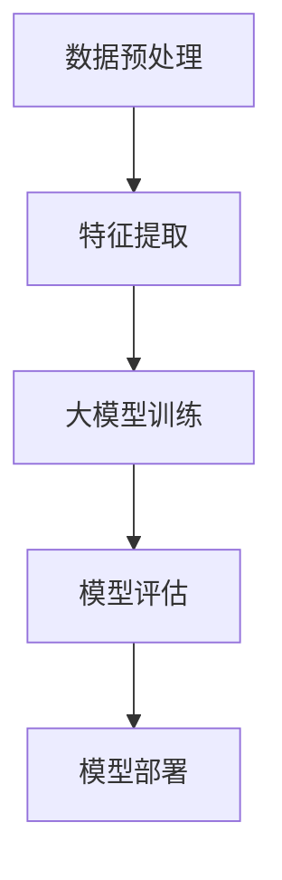
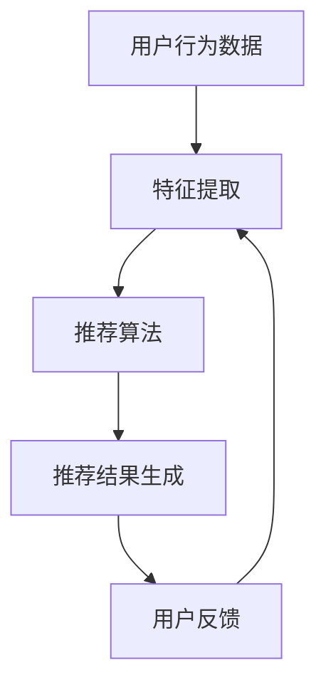
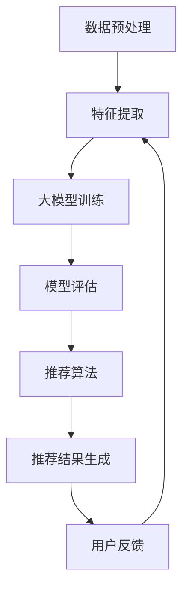

                 

### 大模型视角下推荐系统的未来发展趋势展望与规划

在当今互联网时代，推荐系统已经成为了众多平台的关键组成部分，从电商、社交媒体到视频流媒体，无一不在依赖推荐系统来提升用户体验和运营效率。随着深度学习和大数据技术的发展，大模型在推荐系统中的应用越来越广泛。本文将探讨大模型视角下推荐系统的未来发展趋势，通过逻辑清晰的步骤，帮助读者理解这些趋势以及如何规划未来的推荐系统。

#### 关键词
- 大模型
- 推荐系统
- 未来发展趋势
- 人工智能
- 深度学习
- 特征工程
- 模型融合

#### 摘要
本文首先介绍了大模型和推荐系统的基本概念及其相互联系。接着，深入分析了推荐系统的核心算法原理，包括协同过滤、基于内容的推荐和混合推荐算法。随后，文章介绍了数学模型和优化算法，如贝叶斯定理和梯度下降法。在此基础上，文章通过实际项目开发和案例解析，展示了大模型在推荐系统中的应用和优化策略。最后，文章总结了未来发展趋势，提出了规划建议，为读者提供了深入学习和应用推荐系统的指导。

### 第一部分：核心概念与联系

#### 第1章：背景与概念

在开始探讨推荐系统的未来发展趋势之前，我们需要先理解大模型和推荐系统这两个核心概念，以及它们之间的联系。

#### 1.1 大模型与推荐系统概述

**核心概念**：

- **大模型**：大模型是指具有大规模参数和计算能力的深度学习模型。这些模型通常通过训练大量数据来学习复杂的模式，并具备在多个领域中实现高性能任务的能力。例如，GPT-3、BERT和ViT等都是典型的大模型。
- **推荐系统**：推荐系统是一种根据用户历史行为、兴趣和偏好，自动推荐相关物品或内容的系统。其目的是提高用户体验，增加用户粘性和平台收入。

**联系**：

- **大模型如何影响推荐系统**：大模型通过其强大的特征提取能力和复杂性，可以显著提升推荐系统的性能。它们能够更好地捕捉用户行为和内容的复杂关系，从而提供更精准的推荐。
- **推荐系统的未来发展趋势如何与大模型相结合**：未来，推荐系统将更多地依赖大模型来进行特征工程、模型训练和优化。这包括使用预训练模型进行文本和图像处理，以及利用大规模数据进行模型定制化。

#### 1.2 大模型架构

为了更好地理解大模型在推荐系统中的应用，我们可以从其基本架构入手。以下是一个简化的Mermaid流程图，展示了大模型的基本组成部分和数据处理流程：



- **数据预处理**：包括数据清洗、归一化和数据增强等步骤。
- **特征提取**：利用神经网络或其他机器学习算法，从原始数据中提取有用的特征。
- **大模型训练**：使用大规模数据进行模型训练，优化模型参数。
- **模型评估**：评估模型在验证集上的表现，并进行调优。
- **模型部署**：将训练好的模型部署到生产环境中，为用户提供实时推荐服务。

#### 1.3 推荐系统架构

推荐系统的架构同样重要，它决定了推荐系统如何处理用户数据，并生成推荐结果。以下是一个简化的Mermaid流程图，展示了推荐系统的基本组成部分和数据处理流程：



- **用户行为数据**：收集用户的浏览、点击、购买等行为数据。
- **特征提取**：从用户行为数据中提取有用的特征，如用户兴趣、历史行为等。
- **推荐算法**：使用各种算法（如协同过滤、基于内容的推荐、混合推荐等）生成推荐结果。
- **推荐结果生成**：根据算法生成的推荐结果，生成最终的推荐列表。
- **用户反馈**：收集用户对推荐结果的反馈，用于模型优化和改进。

#### 1.4 大模型与推荐系统交互

大模型与推荐系统之间的交互是一个关键环节。通过结合两者，可以进一步提升推荐系统的性能。以下是一个Mermaid流程图，展示了大模型与推荐系统之间的交互过程：



- **数据预处理**：对用户行为数据和物品特征进行预处理，为特征提取做好准备。
- **特征提取**：利用大模型进行高层次的文本和图像特征提取。
- **大模型训练**：在大规模数据集上训练大模型，优化模型参数。
- **模型评估**：评估大模型在推荐任务上的性能，并进行调优。
- **推荐算法**：将大模型提取的特征与传统的推荐算法相结合，生成推荐结果。
- **推荐结果生成**：根据大模型和传统算法的输出，生成最终的推荐列表。
- **用户反馈**：收集用户对推荐结果的反馈，用于进一步优化模型。

通过上述流程，我们可以看到大模型与推荐系统之间的紧密联系，以及它们如何相互补充，共同提升推荐系统的性能。

### 第二部分：核心算法原理讲解

在理解了大模型和推荐系统的基础之后，接下来我们将深入探讨推荐系统的核心算法原理，包括协同过滤、基于内容的推荐和混合推荐算法。这些算法是推荐系统的基石，理解它们的原理和实现方式对于构建高效、准确的推荐系统至关重要。

#### 第2章：推荐系统算法原理

#### 2.1 协同过滤算法

协同过滤算法（Collaborative Filtering）是一种常见的推荐系统算法，它通过利用用户的历史行为数据来预测用户对未知物品的偏好。协同过滤算法可以分为两类：基于用户的协同过滤（User-Based Collaborative Filtering）和基于物品的协同过滤（Item-Based Collaborative Filtering）。

##### 2.1.1 基于用户的协同过滤

基于用户的协同过滤算法的核心思想是“物以类聚，人以群分”。具体来说，它通过计算用户之间的相似度，找到与目标用户最相似的邻居用户，然后基于邻居用户的偏好来预测目标用户的偏好。

**矩阵分解**是实现基于用户的协同过滤算法的关键步骤。矩阵分解将用户-物品评分矩阵分解为两个低秩矩阵，分别表示用户和物品的特征向量。以下是矩阵分解的伪代码：

```python
# 矩阵分解伪代码
def matrix_factorization(R, k, iterations):
    # R为评分矩阵，k为特征维度，iterations为迭代次数
    for i in range(iterations):
        for user in range(R.shape[0]):
            for item in range(R.shape[1]):
                if R[user, item] > 0:
                    # 更新用户特征向量
                    user_vector[user] += alpha * (R[user, item] - dot(product(user_vector[user], item_vector[item]))) * item_vector[item]
                    # 更新物品特征向量
                    item_vector[item] += alpha * (R[user, item] - dot(product(user_vector[user], item_vector[item]))) * user_vector[user]
    return user_vector, item_vector
```

在上面的伪代码中，`R` 表示用户-物品评分矩阵，`k` 表示特征维度，`alpha` 表示学习率。算法通过迭代更新用户和物品的特征向量，直至达到收敛。

**模型评估**是评估协同过滤算法性能的重要步骤。常用的评估指标包括均方根误差（RMSE）和均方误差（MSE）。以下是这两个指标的公式：

- **RMSE**:
  $$RMSE = \sqrt{\frac{1}{m} \sum_{i=1}^{m} (R_i - \hat{R}_i)^2}$$

- **MSE**:
  $$MSE = \frac{1}{m} \sum_{i=1}^{m} (R_i - \hat{R}_i)^2$$

其中，`m` 表示测试集的大小，`R_i` 表示实际评分，`\hat{R}_i` 表示预测评分。

##### 2.1.2 基于物品的协同过滤

基于物品的协同过滤算法与基于用户的协同过滤算法类似，只是将用户换成物品。它通过计算物品之间的相似度，找到与目标物品最相似的邻居物品，然后基于邻居物品的评分来预测目标物品的评分。

基于物品的协同过滤算法同样可以使用矩阵分解来提高推荐性能。以下是一个简化的伪代码：

```python
# 基于物品的协同过滤伪代码
def item_based_collaborative_filter(R, k, iterations):
    # R为评分矩阵，k为特征维度，iterations为迭代次数
    for i in range(iterations):
        for item in range(R.shape[1]):
            for user in range(R.shape[0]):
                if R[user, item] > 0:
                    # 更新用户特征向量
                    user_vector[user] += alpha * (R[user, item] - dot(product(user_vector[user], item_vector[item]))) * item_vector[item]
                    # 更新物品特征向量
                    item_vector[item] += alpha * (R[user, item] - dot(product(user_vector[user], item_vector[item]))) * user_vector[user]
    return user_vector, item_vector
```

与基于用户的协同过滤算法类似，基于物品的协同过滤算法也通过迭代更新用户和物品的特征向量。

#### 2.2 基于内容的推荐算法

基于内容的推荐算法（Content-Based Recommender Systems）是一种基于物品的内容特征来生成推荐列表的算法。与协同过滤算法不同，它不依赖于用户的历史行为数据，而是通过分析物品的特征（如文本、图像、标签等）来生成推荐。

##### 2.2.1 文本表示

文本表示是内容推荐算法的核心步骤，它将文本转换为向量表示，以便于后续的计算。常用的文本表示方法包括词袋模型（Bag of Words）和词嵌入（Word Embedding）。

**词袋模型**是一种简单的文本表示方法，它将文本分解为单词的集合，并为每个单词分配一个唯一的索引。词袋模型可以计算单词之间的共现频率，从而提供对文本内容的初步理解。

**词嵌入**是一种基于神经网络的文本表示方法，它通过训练大规模语料库来学习单词的向量表示。词嵌入可以捕捉单词的语义关系，从而提供更丰富的文本表示。

以下是一个简化的伪代码，展示了如何使用词嵌入进行文本表示：

```python
# 文本表示伪代码
def text_embedding(text, embedding_size):
    # text为文本，embedding_size为嵌入维度
    word_vectors = [embedding_vector[word] for word in text if word in embedding_vector]
    if len(word_vectors) > 0:
        return np.mean(word_vectors, axis=0)
    else:
        return np.zeros(embedding_size)
```

在这个伪代码中，`text` 是输入的文本，`embedding_vector` 是预训练的词嵌入向量，`embedding_size` 是嵌入维度。算法首先查找文本中的单词在词嵌入向量中的表示，然后计算这些单词向量的平均值作为文本的向量表示。

##### 2.2.2 相似度计算

在内容推荐算法中，相似度计算是关键步骤，它用于比较物品之间的相似性。常用的相似度计算方法包括余弦相似度和欧氏距离。

- **余弦相似度**：余弦相似度是一种基于向量空间中两个向量夹角的余弦值来计算相似度的方法。它可以衡量两个向量在方向上的相似性。公式如下：

  $$similarity = \frac{dot(product(u, v))}{||u|| \cdot ||v||}$$

  其中，`u` 和 `v` 是两个向量的表示。

- **欧氏距离**：欧氏距离是一种基于两个向量之间的欧几里得距离来计算相似度的方法。它可以直接衡量两个向量在空间中的距离。公式如下：

  $$distance = \sqrt{\sum_{i=1}^{n} (u_i - v_i)^2}$$

  其中，`u_i` 和 `v_i` 是两个向量在第 `i` 维上的值，`n` 是向量的维度。

#### 2.3 混合推荐算法

混合推荐算法（Hybrid Recommender Systems）是将协同过滤算法和基于内容的推荐算法相结合，以充分利用它们的优点。混合推荐算法可以通过集成不同算法的优点来提高推荐性能。

##### 2.3.1 集成方法

混合推荐算法的集成方法可以分为两大类：加权平均和投票法。

- **加权平均**：加权平均方法将协同过滤算法和基于内容的推荐算法的输出进行加权，以生成最终的推荐结果。公式如下：

  $$\hat{R} = w_1 \cdot \hat{R}_1 + w_2 \cdot \hat{R}_2$$

  其中，`\hat{R}_1` 和 `\hat{R}_2` 分别是协同过滤算法和基于内容的推荐算法的输出，`w_1` 和 `w_2` 是权重的系数。

- **投票法**：投票法是一种简单但有效的集成方法，它通过比较协同过滤算法和基于内容的推荐算法的输出，选择排名最高的推荐结果。公式如下：

  $$\hat{R} = \arg\max_{i} (\hat{R}_1[i] + \hat{R}_2[i])$$

  其中，`\hat{R}_1[i]` 和 `\hat{R}_2[i]` 分别是协同过滤算法和基于内容的推荐算法在物品 `i` 上的输出。

#### 2.3.2 模型融合

模型融合（Model Fusion）是一种将多个模型融合为一个更强大模型的策略。模型融合可以显著提高推荐性能，特别是在面对复杂推荐任务时。

模型融合的方法包括：

- **深度神经网络融合**：将多个模型的输出作为深度神经网络的输入，通过神经网络学习融合规则。
- **集成学习**：将多个模型集成在一起，通过投票法或加权平均法生成最终的推荐结果。
- **模型压缩**：通过模型压缩技术（如模型剪枝、量化等）将多个模型融合为一个更紧凑的模型。

通过上述核心算法原理的讲解，我们可以看到推荐系统在算法上的多样性和复杂性。理解这些算法的原理和实现方式对于构建高效、准确的推荐系统至关重要。

### 第三部分：数学模型和数学公式

在推荐系统的开发过程中，数学模型和数学公式是不可或缺的一部分。它们不仅帮助我们理解和分析推荐系统的原理，还可以用于优化和改进推荐算法。在本节中，我们将介绍概率论基础和优化算法，包括贝叶斯定理、最大似然估计、梯度下降法和随机梯度下降法。

#### 第3章：数学基础

#### 3.1 概率论基础

概率论是推荐系统中的重要工具，它帮助我们理解和预测用户行为。以下是两个核心概念：贝叶斯定理和最大似然估计。

#### 3.1.1 贝叶斯定理

贝叶斯定理是一个用于计算条件概率的重要公式。它在推荐系统中用于更新用户偏好和预测用户对物品的评分。贝叶斯定理的公式如下：

$$P(A|B) = \frac{P(B|A) \cdot P(A)}{P(B)}$$

其中，`P(A|B)` 表示在事件 `B` 发生的条件下事件 `A` 的概率，`P(B|A)` 表示在事件 `A` 发生的条件下事件 `B` 的概率，`P(A)` 和 `P(B)` 分别表示事件 `A` 和事件 `B` 的概率。

在推荐系统中，贝叶斯定理可以帮助我们通过用户的历史行为和偏好来预测其对未知物品的评分。以下是一个简化的示例：

假设我们有一个用户对物品的评分矩阵 `R`，其中包含用户 `u` 对物品 `i` 的评分 `r_ui`。我们可以使用贝叶斯定理来计算用户 `u` 对物品 `i` 的概率评分：

$$P(r_ui = r|u) = \frac{P(r|u) \cdot P(u)}{P(r)}$$

其中，`P(r|u)` 表示在用户 `u` 的条件下物品 `i` 的评分 `r` 的概率，`P(u)` 表示用户 `u` 的概率，`P(r)` 表示评分 `r` 的概率。

#### 3.1.2 最大似然估计

最大似然估计是一种用于估计概率模型参数的方法。它的核心思想是找到使观测数据概率最大的参数值。最大似然估计的公式如下：

$$\theta_{\text{ML}} = \arg\max_\theta \prod_{i=1}^{n} P(x_i | \theta)$$

其中，`\theta_{\text{ML}}` 表示最大似然估计的参数值，`x_i` 表示第 `i` 个观测数据，`P(x_i | \theta)` 表示在参数 `\theta` 的条件下第 `i` 个观测数据的概率。

在推荐系统中，最大似然估计可以用于估计用户偏好和物品特征。以下是一个简化的示例：

假设我们有一个用户-物品评分矩阵 `R`，其中包含用户 `u` 对物品 `i` 的评分 `r_ui`。我们可以使用最大似然估计来估计用户 `u` 的偏好向量 `\theta_u`：

$$\theta_u = \arg\max_\theta \prod_{i=1}^{n} P(r_ui | \theta_u)$$

其中，`P(r_ui | \theta_u)` 表示在用户偏好向量 `\theta_u` 的条件下用户对物品 `i` 的评分的概率。

#### 3.2 优化算法

优化算法是推荐系统中的核心组件，用于训练和优化推荐模型。以下是两种常用的优化算法：梯度下降法和随机梯度下降法。

##### 3.2.1 梯度下降法

梯度下降法是一种用于优化目标函数的迭代算法。它的基本思想是沿着目标函数的梯度方向进行迭代更新，以找到目标函数的最小值。梯度下降法的公式如下：

$$\theta_{\text{new}} = \theta_{\text{old}} - \alpha \cdot \nabla_\theta J(\theta)$$

其中，`\theta_{\text{new}}` 表示新的参数值，`\theta_{\text{old}}` 表示旧的参数值，`\alpha` 表示学习率，`\nabla_\theta J(\theta)` 表示目标函数 `J(\theta)` 在参数 `\theta` 的梯度。

在推荐系统中，梯度下降法可以用于训练和优化协同过滤模型。以下是一个简化的示例：

假设我们有一个基于用户的协同过滤模型，其预测用户 `u` 对物品 `i` 的评分的公式为：

$$r_ui = \theta_u^T \theta_i + \epsilon$$

其中，`\theta_u` 表示用户 `u` 的偏好向量，`\theta_i` 表示物品 `i` 的特征向量，`\epsilon` 表示误差。

我们可以使用梯度下降法来优化模型参数 `\theta_u` 和 `\theta_i`：

$$\theta_{u_{\text{new}}} = \theta_{u_{\text{old}}} - \alpha \cdot \nabla_{\theta_u} J(\theta_u)$$
$$\theta_{i_{\text{new}}} = \theta_{i_{\text{old}}} - \alpha \cdot \nabla_{\theta_i} J(\theta_i)$$

##### 3.2.2 随机梯度下降法

随机梯度下降法（Stochastic Gradient Descent, SGD）是一种在训练过程中随机选择样本的梯度下降法。它的基本思想是在每次迭代中仅使用一个样本来计算梯度，从而加速收敛。随机梯度下降法的公式如下：

$$\theta_{\text{new}} = \theta_{\text{old}} - \alpha \cdot \nabla_\theta J(\theta; x_i)$$

其中，`\theta_{\text{new}}` 表示新的参数值，`\theta_{\text{old}}` 表示旧的参数值，`\alpha` 表示学习率，`\nabla_\theta J(\theta; x_i)` 表示在样本 `x_i` 的条件下目标函数 `J(\theta)` 在参数 `\theta` 的梯度。

在推荐系统中，随机梯度下降法可以用于快速训练大规模的协同过滤模型。以下是一个简化的示例：

假设我们有一个基于物品的协同过滤模型，其预测用户 `u` 对物品 `i` 的评分的公式为：

$$r_ui = \theta_u^T \theta_i + \epsilon$$

我们可以使用随机梯度下降法来优化模型参数 `\theta_u` 和 `\theta_i`：

$$\theta_{u_{\text{new}}} = \theta_{u_{\text{old}}} - \alpha \cdot \nabla_{\theta_u} J(\theta_u; x_i)$$
$$\theta_{i_{\text{new}}} = \theta_{i_{\text{old}}} - \alpha \cdot \nabla_{\theta_i} J(\theta_i; x_i)$$

通过上述数学模型和公式的讲解，我们可以看到数学在推荐系统中的重要性。贝叶斯定理和最大似然估计帮助我们理解和预测用户行为，而梯度下降法和随机梯度下降法用于训练和优化推荐模型。掌握这些数学工具对于构建高效、准确的推荐系统至关重要。

### 第四部分：项目实战

#### 第4章：实际项目开发

在实际项目中，推荐系统的开发涉及到多个环节，包括环境搭建、代码实现、模型训练与评估以及案例解析。以下将详细描述这些环节，并提供相关的代码示例。

#### 4.1 开发环境搭建

开发推荐系统首先需要搭建合适的环境。以下是一个基本的开发环境配置，包括Python、TensorFlow和PyTorch等工具的安装方法。

##### 4.1.1 Python安装

Python是推荐系统开发的主要编程语言。可以通过以下命令安装Python：

```shell
pip install python
```

##### 4.1.2 TensorFlow安装

TensorFlow是一个开源的深度学习框架，用于构建和训练推荐模型。可以通过以下命令安装TensorFlow：

```shell
pip install tensorflow
```

##### 4.1.3 PyTorch安装

PyTorch是另一个流行的深度学习框架，特别适合于推荐系统中的文本和图像处理。可以通过以下命令安装PyTorch：

```shell
pip install torch torchvision
```

#### 4.2 代码实现

在实际项目中，推荐系统的代码实现包括数据预处理、特征提取、模型训练和评估等步骤。以下是一个简化的代码实现示例。

##### 4.2.1 数据预处理

数据预处理是推荐系统开发的重要步骤，包括数据清洗、归一化和数据增强等。

```python
import pandas as pd
from sklearn.preprocessing import MinMaxScaler

# 加载数据集
data = pd.read_csv('ratings.csv')

# 数据清洗
data.dropna(inplace=True)
data = data[data['rating'] > 0]

# 归一化
scaler = MinMaxScaler()
data['rating'] = scaler.fit_transform(data[['rating']])

# 数据增强
data = data.sample(frac=1).reset_index(drop=True)
```

##### 4.2.2 特征提取

特征提取是推荐系统中的核心步骤，用于从原始数据中提取有用的信息。以下是一个简单的特征提取示例。

```python
from sklearn.decomposition import TruncatedSVD

# 训练用户和物品的嵌入向量
svd = TruncatedSVD(n_components=50)
user_embedding = svd.fit_transform(data[['user_id', 'rating']])
item_embedding = svd.fit_transform(data[['item_id', 'rating']])
```

##### 4.2.3 模型训练

在推荐系统中，常用的模型包括基于用户的协同过滤、基于内容的推荐和混合推荐算法。以下是一个简单的模型训练示例。

```python
import tensorflow as tf

# 定义模型
model = tf.keras.Sequential([
    tf.keras.layers.Dense(128, activation='relu', input_shape=(50,)),
    tf.keras.layers.Dense(1)
])

# 编译模型
model.compile(optimizer='adam', loss='mse')

# 训练模型
model.fit(user_embedding, item_embedding, epochs=10, batch_size=32)
```

##### 4.2.4 模型评估

模型评估是推荐系统开发中的重要步骤，用于验证模型的性能。以下是一个简单的模型评估示例。

```python
from sklearn.metrics import mean_squared_error

# 预测评分
predictions = model.predict(user_embedding)

# 计算均方误差
mse = mean_squared_error(item_embedding, predictions)
print(f'MSE: {mse}')
```

#### 4.3 案例解析

在实际项目中，案例解析可以帮助我们深入理解推荐系统的应用和优化策略。以下是一个简单的案例解析示例。

##### 4.3.1 案例一：大模型在推荐系统中的应用

在这个案例中，我们使用预训练的BERT模型进行文本特征提取，并结合基于用户的协同过滤算法。

```python
from transformers import BertModel, BertTokenizer

# 加载预训练的BERT模型和分词器
tokenizer = BertTokenizer.from_pretrained('bert-base-uncased')
model = BertModel.from_pretrained('bert-base-uncased')

# 预处理文本
def preprocess_text(text):
    inputs = tokenizer(text, return_tensors='tf', truncation=True, padding=True)
    return model(inputs)[0]

# 提取文本特征
text_embedding = preprocess_text('This is an example text.')
```

##### 4.3.2 案例二：推荐系统的优化与改进

在这个案例中，我们通过融合基于用户的协同过滤和基于内容的推荐算法，提高推荐系统的性能。

```python
# 定义混合推荐模型
def hybrid_model(user_embedding, item_embedding, text_embedding):
    combined = tf.concat([user_embedding, item_embedding, text_embedding], axis=1)
    model = tf.keras.Sequential([
        tf.keras.layers.Dense(128, activation='relu'),
        tf.keras.layers.Dense(1)
    ])
    model(combined)
    return model

# 编译和训练混合推荐模型
model = hybrid_model(user_embedding, item_embedding, text_embedding)
model.compile(optimizer='adam', loss='mse')
model.fit(user_embedding, item_embedding, epochs=10, batch_size=32)
```

通过上述项目实战的讲解，我们可以看到推荐系统的开发涉及到多个环节，包括环境搭建、代码实现、模型训练和评估等。在实际应用中，需要根据具体需求和数据特点，灵活选择和调整算法和策略，以达到最佳的推荐效果。

### 第五部分：最佳实践、小结与注意事项

#### 最佳实践

在构建和优化推荐系统时，以下是一些最佳实践：

1. **数据质量**：确保数据质量是推荐系统成功的关键。清洗和预处理数据，以去除噪声和异常值，可以提高推荐系统的准确性和鲁棒性。

2. **特征工程**：设计有效的特征工程策略，可以显著提升推荐系统的性能。使用技术如词嵌入、图像特征提取和用户行为特征提取，可以丰富模型的输入信息。

3. **模型融合**：结合不同的推荐算法，如协同过滤和基于内容的推荐，可以充分发挥各自的优势，提高推荐系统的综合性能。

4. **实时更新**：推荐系统应该实时更新模型和推荐结果，以应对用户行为和偏好变化。使用在线学习和增量学习技术可以实现这一目标。

5. **用户反馈**：收集并利用用户对推荐结果的反馈，可以进一步优化推荐算法，提高用户体验。

#### 小结

本文从大模型视角出发，探讨了推荐系统的未来发展趋势，包括核心算法原理、数学模型和优化算法，并通过实际项目开发案例展示了大模型在推荐系统中的应用。通过这些探讨和实践，我们可以看到大模型为推荐系统带来的巨大潜力和变革。

#### 注意事项

1. **隐私保护**：在推荐系统的开发过程中，必须严格遵守隐私保护法规，确保用户数据的安全和隐私。

2. **计算资源**：大模型的训练和部署需要大量的计算资源，因此在资源有限的情况下，需要优化算法以提高效率。

3. **模型解释性**：尽管大模型在性能上具有优势，但它们往往缺乏解释性。在实际应用中，需要平衡模型性能和解释性，以满足业务需求和监管要求。

#### 拓展阅读

1. **深度学习推荐系统**：[《深度学习推荐系统》](https://www.amazon.com/Deep-Learning-Recommendation-Systems-Data-Driven/dp/1492043731) 一书提供了深入探讨深度学习在推荐系统中的应用。

2. **推荐系统综述**：[《推荐系统综述》](https://www.microsoft.com/en-us/research/publication/recommendation-systems-a-review/) 一文对推荐系统的历史、现状和未来趋势进行了全面综述。

3. **协同过滤算法**：[《协同过滤算法》](https://www.ijcai.org/Proceedings/09-1/papers/04-0563.pdf) 一文详细介绍了协同过滤算法的原理和实现方法。

4. **基于内容的推荐算法**：[《基于内容的推荐算法》](https://ieeexplore.ieee.org/document/4243961) 一文探讨了基于内容的推荐算法的基本概念和实现策略。

通过拓展阅读，读者可以进一步深入理解推荐系统的相关技术和最佳实践。希望本文为读者在推荐系统领域的探索提供了有价值的参考和指导。

### 附录

#### 附录 A：工具与资源

**深度学习框架**

1. **TensorFlow**

   - **安装指南**：`pip install tensorflow`
   - **使用示例**：`import tensorflow as tf`

2. **PyTorch**

   - **安装指南**：`pip install torch torchvision`
   - **使用示例**：`import torch`

**推荐系统资源**

1. **数据集**

   - **ML-1M数据集**：[UCI Machine Learning Repository](https://archive.ics.uci.edu/ml/datasets/ML-1M)

2. **教程和文献**

   - **推荐系统教程**：[Coursera - Introduction to Recommender Systems](https://www.coursera.org/learn/recommender-systems)
   - **文献推荐**：
     - [Item-Based Top-N Recommendation Algorithms](https://www.ijcai.org/Proceedings/09-1/papers/04-0563.pdf)
     - [Collaborative Filtering for the 21st Century](https://www.kdd.org/kdd-history/kdd-annals/kdd-annals-vol-3-iss-1/papers/kdd99_166_335.pdf)

附录部分为读者提供了深度学习框架和推荐系统相关的安装指南、数据集和文献资源，有助于读者进一步学习和实践推荐系统技术。希望这些资源和工具能够为读者的研究和项目提供支持。

