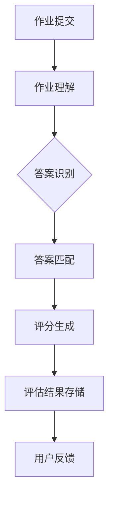
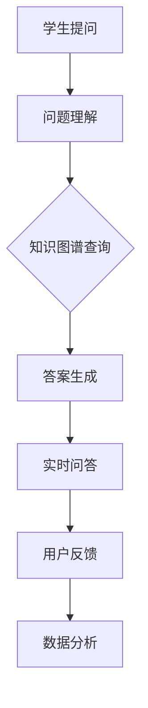
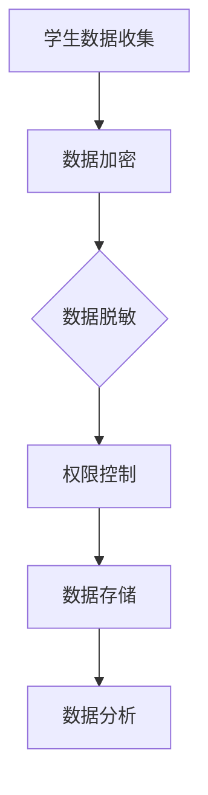
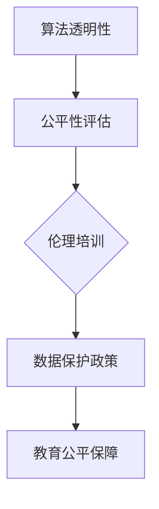
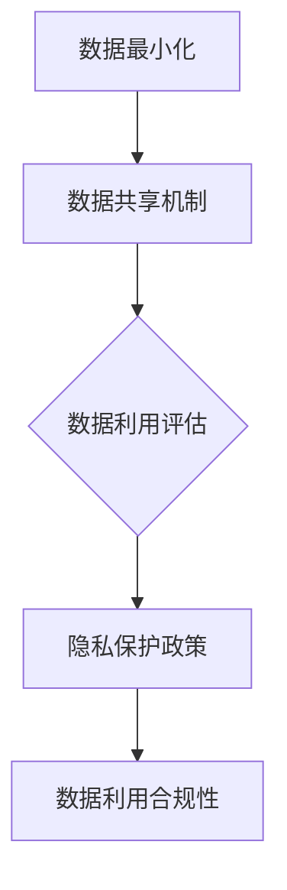
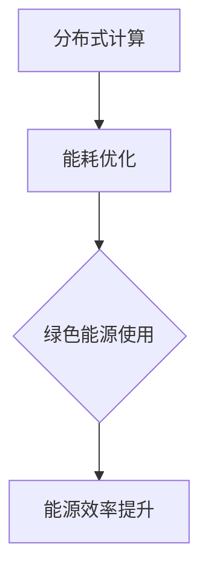
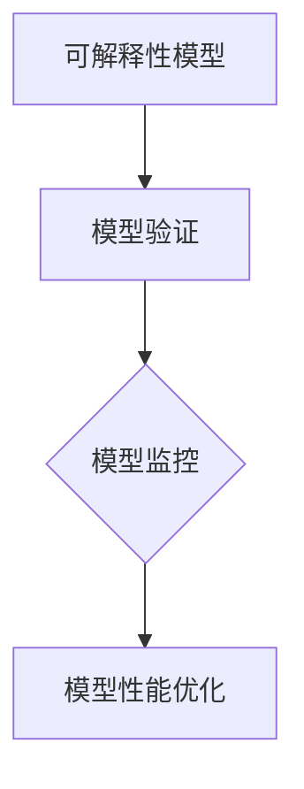
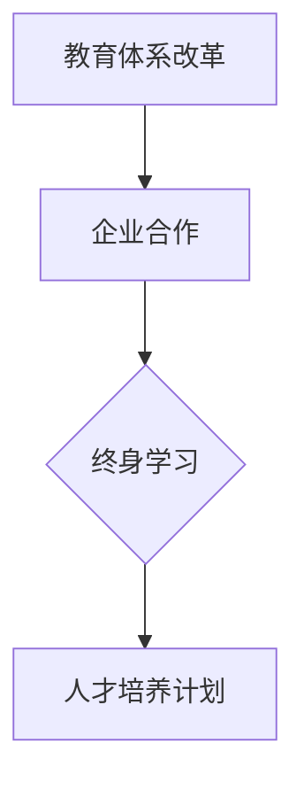

                 

### 文章标题

《大模型赋能的智能学习内容生成：教育资源开发的新方向》

> 关键词：大模型，智能学习内容生成，教育资源开发，技术基础，应用实践，挑战与未来

> 摘要：本文深入探讨了大模型在智能学习内容生成领域的应用，分析了大模型与教育资源开发之间的相互关系。通过概述大模型和智能学习内容生成的原理，以及技术基础和应用实践，本文提出了教育资源开发的新方向。同时，本文还探讨了在大模型赋能教育资源开发过程中面临的挑战与未来发展趋势，旨在为相关领域的研究和实践提供参考和启示。

## 《大模型赋能的智能学习内容生成：教育资源开发的新方向》目录大纲

### 第一部分：大模型与智能学习内容生成概述

#### 第1章：大模型与教育资源开发

- **1.1 大模型的定义与演进**
  - **1.1.1 大模型的概念**
  - **1.1.2 大模型的演进历程**
  - **1.1.3 大模型在教育领域的应用趋势**
- **1.2 智能学习内容生成的原理**
  - **1.2.1 智能学习内容生成的定义**
  - **1.2.2 智能学习内容生成的技术基础**
  - **1.2.3 智能学习内容生成在教育中的应用**
- **1.3 教育资源开发的新方向**
  - **1.3.1 教育资源开发的现状与挑战**
  - **1.3.2 大模型赋能教育资源开发的机遇**
  - **1.3.3 教育资源开发的新模式**

### 第二部分：大模型技术基础

#### 第2章：大模型技术基础

- **2.1 深度学习基础**
  - **2.1.1 神经网络的基本原理**
  - **2.1.2 深度学习的基本框架**
  - **2.1.3 深度学习的优化算法**
- **2.2 大模型训练技术**
  - **2.2.1 大模型的数据需求**
  - **2.2.2 大模型的训练方法**
  - **2.2.3 大模型的训练挑战与解决方案**
- **2.3 大模型调优技巧**
  - **2.3.1 超参数调优方法**
  - **2.3.2 模型调优工具与平台**
  - **2.3.3 实时调优与动态调整**

### 第三部分：智能学习内容生成实践

#### 第3章：智能学习内容生成实践

- **3.1 文本生成与处理**
  - **3.1.1 文本生成模型（如 GPT）**
  - **3.1.2 文本分类与情感分析**
  - **3.1.3 文本摘要与生成式摘要**
- **3.2 题库自动生成与优化**
  - **3.2.1 题库自动生成的技术路线**
  - **3.2.2 题库优化的策略与方法**
  - **3.2.3 实例：题库自动生成系统开发**
- **3.3 教学资源个性化推荐**
  - **3.3.1 推荐系统的基本概念**
  - **3.3.2 个性化推荐算法**
  - **3.3.3 教学资源推荐系统设计**

### 第四部分：大模型在教育中的应用

#### 第4章：大模型在教育中的应用

- **4.1 智能批改与评估**
  - **4.1.1 智能批改的原理与方法**
  - **4.1.2 自动化评估系统的设计**
  - **4.1.3 智能评估在教育中的影响**
- **4.2 教学互动与反馈**
  - **4.2.1 智能教学互动平台的设计**
  - **4.2.2 学生反馈分析与处理**
  - **4.2.3 教师教学支持的智能系统**
- **4.3 教育资源个性化开发**
  - **4.3.1 个性化教育资源开发的原则**
  - **4.3.2 个性化学习路径规划**
  - **4.3.3 实例：个性化学习系统实现**

### 第五部分：大模型赋能教育资源开发挑战与未来

#### 第5章：大模型赋能教育资源开发的挑战与未来

- **5.1 数据隐私与伦理问题**
  - **5.1.1 教育数据隐私保护**
  - **5.1.2 伦理问题与教育公平**
  - **5.1.3 隐私保护和数据利用的平衡**
- **5.2 技术瓶颈与解决方案**
  - **5.2.1 计算资源与能耗**
  - **5.2.2 模型解释性与可靠性**
  - **5.2.3 技术迭代与人才培养**
- **5.3 教育资源开发的未来趋势**
  - **5.3.1 大模型在教育中的应用前景**
  - **5.3.2 教育资源开发的新模式**
  - **5.3.3 智能教育的发展方向**

### 第六部分：案例研究与总结

#### 第6章：案例研究与总结

- **6.1 国内外大模型在教育中的应用案例**
  - **6.1.1 中国案例研究**
  - **6.1.2 国际案例研究**
  - **6.1.3 案例总结与启示**
- **6.2 大模型赋能教育资源开发的总结**
  - **6.2.1 成功经验与挑战**
  - **6.2.2 未来发展方向**
  - **6.2.3 对教育实践的影响**

### 第七部分：附录

#### 第7章：附录

- **7.1 大模型与教育领域常用工具与资源**
  - **7.1.1 常用深度学习框架**
  - **7.1.2 常用数据处理工具**
  - **7.1.3 教育资源开发平台**
- **7.2 参考文献**
  - **7.2.1 相关研究论文**
  - **7.2.2 经典教材与资料**
  - **7.2.3 开源代码与数据集**

### 第一部分：大模型与智能学习内容生成概述

#### 第1章：大模型与教育资源开发

在当今的信息时代，教育资源的开发和利用成为全球关注的焦点。随着人工智能技术的迅猛发展，大模型作为一种前沿技术，逐渐成为教育资源开发的新方向。本章将首先介绍大模型的概念与演进，随后探讨智能学习内容生成的原理及其在教育中的应用，最后分析教育资源开发的新方向。

### 1.1 大模型的定义与演进

#### 1.1.1 大模型的概念

大模型，又称大型预训练模型（Large Pre-Trained Models），是一种基于深度学习的技术，能够通过大规模数据预训练来获得通用知识表示能力。典型的代表包括GPT（Generative Pre-trained Transformer）系列、BERT（Bidirectional Encoder Representations from Transformers）和TuringModel等。这些模型通常拥有数十亿个参数，通过在互联网上的海量文本、图像、音频等多种类型的数据上进行预训练，从而具备强大的语义理解和生成能力。

#### 1.1.2 大模型的演进历程

大模型的演进可以分为以下几个阶段：

1. **早期的神经网络模型**：以感知机、BP网络为代表，这些模型在处理简单问题上表现良好，但面对复杂任务时能力有限。
2. **深度学习的发展**：随着计算能力的提升和大数据的普及，深度学习逐渐兴起，卷积神经网络（CNN）和循环神经网络（RNN）等模型被广泛应用于图像识别和自然语言处理领域。
3. **大型预训练模型**：以GPT-3为代表，大模型通过在大量数据上预训练，获得了前所未有的语义理解能力和生成能力。

#### 1.1.3 大模型在教育领域的应用趋势

大模型在教育领域的应用趋势主要体现在以下几个方面：

1. **智能学习内容生成**：大模型可以生成高质量的教学内容，如教材、课件、练习题等，从而提高教育资源开发的效率和质量。
2. **个性化教育**：大模型可以根据学生的学习特点和需求，生成个性化的学习资源和推荐方案，实现因材施教。
3. **智能批改与评估**：大模型可以自动化地批改作业和评估学生的表现，提高教育管理的效率和准确性。

### 1.2 智能学习内容生成的原理

#### 1.2.1 智能学习内容生成的定义

智能学习内容生成是指利用人工智能技术，如自然语言处理、图像识别、语音识别等，自动生成符合教育需求的教学内容。这些内容可以是文本、图像、视频等多种形式，以满足不同类型的教育需求。

#### 1.2.2 智能学习内容生成的技术基础

智能学习内容生成依赖于以下几个核心技术：

1. **自然语言处理（NLP）**：NLP技术用于处理和分析文本数据，包括文本生成、文本分类、情感分析等。
2. **计算机视觉（CV）**：CV技术用于处理和分析图像和视频数据，包括图像识别、目标检测、图像生成等。
3. **语音识别（ASR）**：ASR技术用于将语音转换为文本，支持语音交互和语音生成。

#### 1.2.3 智能学习内容生成在教育中的应用

智能学习内容生成在教育中的应用包括：

1. **教材生成**：大模型可以根据教学大纲和课程要求，自动生成高质量的教学材料，如教材、课件等。
2. **练习题生成**：大模型可以根据知识点和题型要求，自动生成练习题，满足不同难度和类型的需求。
3. **教学视频生成**：大模型可以基于文本或语音输入，自动生成教学视频，提供直观的教学体验。

### 1.3 教育资源开发的新方向

#### 1.3.1 教育资源开发的现状与挑战

当前教育资源开发面临着以下挑战：

1. **资源匮乏**：许多地区和教育机构缺乏优质的教育资源，难以满足学生的需求。
2. **资源分配不均**：优质教育资源往往集中在少数地区和学校，导致教育资源分配不均。
3. **教育资源更新滞后**：教育资源的更新速度难以跟上时代发展的步伐，导致内容陈旧。

#### 1.3.2 大模型赋能教育资源开发的机遇

大模型赋能教育资源开发的机遇主要体现在以下几个方面：

1. **提高资源开发效率**：大模型可以自动生成和优化教育资源，提高资源开发的速度和质量。
2. **实现个性化教育**：大模型可以根据学生的学习特点和需求，提供个性化的教育资源和服务。
3. **促进教育公平**：大模型可以降低教育资源开发和分配的成本，让更多地区和学校享受到优质教育资源。

#### 1.3.3 教育资源开发的新模式

大模型赋能下的教育资源开发新模式包括：

1. **云教育平台**：基于大模型的云教育平台可以提供海量的教育资源和服务，满足个性化教育需求。
2. **自适应学习系统**：基于大模型的自适应学习系统可以根据学生的学习表现和需求，动态调整学习内容和路径。
3. **智慧校园**：基于大模型的智慧校园可以提供智能化的教学、管理和服务，提高教育质量和效率。

通过本章的讨论，我们可以看到大模型和智能学习内容生成技术为教育资源开发带来了新的机遇和方向。在未来，随着大模型技术的不断进步和应用，教育资源开发将迎来更加广阔的发展前景。接下来，我们将进一步探讨大模型的技术基础，为后续章节的内容奠定基础。

### 第二部分：大模型技术基础

大模型技术的发展离不开深度学习等基础技术的支撑。本部分将深入探讨大模型技术的基础，包括深度学习的基础、大模型训练技术以及大模型调优技巧。通过对这些基础内容的详细分析，我们将更好地理解大模型在教育资源开发中的潜力。

#### 第2章：大模型技术基础

#### 2.1 深度学习基础

深度学习是构建大模型的核心技术之一。它通过模拟人脑神经网络的结构和功能，对大量数据进行自动学习和特征提取。以下是深度学习的一些基本概念和原理。

##### 2.1.1 神经网络的基本原理

神经网络（Neural Networks）是一种由大量神经元（artificial neurons）连接而成的计算模型。每个神经元接收输入信号，通过权重（weights）进行加权求和，再通过激活函数（activation function）进行非线性变换，最终产生输出信号。

- **神经元模型**：

  ```plaintext
  输出 = 激活函数(权重 * 输入 + 偏置)
  ```

- **激活函数**：常用的激活函数包括Sigmoid函数、ReLU函数、Tanh函数等。

##### 2.1.2 深度学习的基本框架

深度学习的基本框架包括输入层、隐藏层和输出层。每个层包含多个神经元，相邻层之间通过权值矩阵进行连接。

- **多层感知机（MLP）**：最简单的深度学习模型，包含至少一个隐藏层。
- **卷积神经网络（CNN）**：用于图像处理，通过卷积层、池化层和全连接层进行特征提取。
- **循环神经网络（RNN）**：用于序列数据处理，通过隐藏状态和循环结构进行长期依赖建模。
- **变换器网络（Transformer）**：用于自然语言处理，通过自注意力机制实现全局信息交互。

##### 2.1.3 深度学习的优化算法

深度学习的优化算法用于调整模型参数，以最小化损失函数。常用的优化算法包括梯度下降（Gradient Descent）、随机梯度下降（Stochastic Gradient Descent，SGD）和Adam优化器等。

- **梯度下降**：

  ```plaintext
  参数 = 参数 - 学习率 * 梯度
  ```

- **Adam优化器**：

  ```plaintext
  m = β1 * m + (1 - β1) * gradients
  v = β2 * v + (1 - β2) * (gradients^2)
  update = alpha * m / (sqrt(v) + ε)
  ```

#### 2.2 大模型训练技术

大模型的训练是一个复杂的过程，涉及到大量的数据、计算资源和调优策略。以下是训练大模型的一些关键技术。

##### 2.2.1 大模型的数据需求

大模型的训练需要海量数据，通常来源于互联网的文本、图像、音频等多种类型的数据。数据的质量和多样性直接影响模型的性能。

- **数据预处理**：包括数据清洗、去重、归一化等操作，以提高数据的质量和一致性。
- **数据增强**：通过随机裁剪、旋转、缩放等操作增加数据的多样性，从而提升模型的泛化能力。

##### 2.2.2 大模型的训练方法

大模型的训练方法包括：

- **分布式训练**：通过多台计算机并行计算，提高训练速度和效率。
- **迁移学习**：利用预训练模型在特定任务上的知识迁移到新任务，减少训练时间和计算成本。
- **数据并行**：将数据分成多个子集，每个子集分别训练模型，然后通过同步或异步方式更新全局模型。

##### 2.2.3 大模型的训练挑战与解决方案

大模型训练过程中面临的主要挑战包括：

- **计算资源消耗**：大模型训练需要大量的计算资源和存储空间。
- **训练效率**：如何提高大模型的训练速度，减少训练时间。
- **模型泛化能力**：如何避免过拟合，提高模型的泛化能力。

解决方案包括：

- **高效计算框架**：如TensorFlow、PyTorch等，提供分布式训练、自动化调优等功能。
- **预训练+微调**：通过预训练获得通用特征表示，再通过微调适应特定任务。
- **正则化技术**：如Dropout、L2正则化等，减少过拟合。

#### 2.3 大模型调优技巧

大模型的调优是提升模型性能的关键环节。以下是调优过程中的一些技巧。

##### 2.3.1 超参数调优方法

超参数是模型训练过程中需要手动调整的参数，如学习率、批次大小、隐藏层大小等。常用的调优方法包括：

- **网格搜索**：在预定义的参数网格中搜索最优参数组合。
- **贝叶斯优化**：基于概率模型，自动搜索最优参数组合。

##### 2.3.2 模型调优工具与平台

常见的模型调优工具和平台包括：

- **Hyperopt**：一款基于Python的分布式超参数优化库。
- **Optuna**：一款自动化的超参数优化库，支持多种优化算法。
- **Google AI Platform**：Google提供的一站式AI平台，支持模型训练和调优。

##### 2.3.3 实时调优与动态调整

实时调优与动态调整是指根据模型在训练过程中的表现，动态调整模型参数，以优化训练过程。常见的策略包括：

- **早期停止**：在验证集上表现停止改进时，提前终止训练，避免过拟合。
- **学习率调整**：根据模型在训练过程中的表现，动态调整学习率，如学习率衰减、学习率周期性调整等。

通过本部分的讨论，我们系统地介绍了大模型技术的基础，包括深度学习的基础、大模型训练技术和调优技巧。这些技术构成了大模型实现高效、准确教育资源开发的关键。在下一部分中，我们将探讨智能学习内容生成的具体实践，进一步揭示大模型在教育资源开发中的应用潜力。

### 第三部分：智能学习内容生成实践

智能学习内容生成是利用人工智能技术，特别是大模型技术，自动生成高质量的教育内容。这一部分将详细探讨文本生成与处理、题库自动生成与优化、教学资源个性化推荐等具体实践，为教育资源开发提供新的解决方案。

#### 第3章：智能学习内容生成实践

#### 3.1 文本生成与处理

文本生成与处理是智能学习内容生成的重要组成部分。大模型在此领域展现了强大的生成能力和处理效率。

##### 3.1.1 文本生成模型（如 GPT）

文本生成模型，如GPT（Generative Pre-trained Transformer），是一种基于变换器架构的预训练模型，能够生成高质量的自然语言文本。其生成过程通常包括以下步骤：

1. **数据预处理**：收集和清洗大量文本数据，进行分词、去停用词等预处理操作。
2. **模型预训练**：在大量文本数据上进行预训练，学习语言的统计特性和语义信息。
3. **文本生成**：通过自注意力机制，模型根据前文生成后续文本，直至生成完整句子或段落。

**伪代码示例**：

```plaintext
# GPT文本生成伪代码

# 输入：前文文本序列
# 输出：生成文本序列

# 初始化模型
model = GPT_model()

# 前文文本序列
prev_text = "人工智能在教育领域的应用"

# 生成文本序列
generated_text = model.generate(prev_text)
print(generated_text)
```

##### 3.1.2 文本分类与情感分析

文本分类与情感分析是文本处理的重要应用。通过大模型技术，可以自动对文本进行分类和情感分析，从而为教育资源的开发提供数据支持。

- **文本分类**：将文本分为预定义的类别，如正负评论、新闻类别等。其流程包括：

  1. **数据预处理**：提取特征，如词袋模型、TF-IDF等。
  2. **模型训练**：使用有监督学习算法，如SVM、神经网络等，训练分类模型。
  3. **文本分类**：对新的文本进行分类，输出分类结果。

- **情感分析**：判断文本的情感倾向，如正面、负面、中性等。其流程包括：

  1. **数据预处理**：提取情感特征，如词汇的情感极性、句子结构等。
  2. **模型训练**：使用有监督或无监督学习算法，训练情感分析模型。
  3. **情感分析**：对新的文本进行情感分析，输出情感标签。

**伪代码示例**：

```plaintext
# 文本分类伪代码

# 输入：文本数据集
# 输出：分类结果

# 初始化模型
model = TextClassifier()

# 训练模型
model.train(dataset)

# 测试文本
test_text = "这篇文章写得很好"

# 预测分类结果
predicted_label = model.predict(test_text)
print(predicted_label)

# 情感分析伪代码

# 输入：文本数据集
# 输出：情感标签

# 初始化模型
model = SentimentAnalyzer()

# 训练模型
model.train(dataset)

# 测试文本
test_text = "我对这个课程很满意"

# 预测情感标签
predicted_sentiment = model.predict(test_text)
print(predicted_sentiment)
```

##### 3.1.3 文本摘要与生成式摘要

文本摘要是将长文本转化为简洁、精练的摘要，以帮助读者快速理解文本内容。大模型在此领域展现了强大的生成能力。

- **提取式摘要**：从原文中提取关键信息，生成摘要。其流程包括：

  1. **文本预处理**：提取文本中的关键句子。
  2. **摘要生成**：将关键句子组合成摘要。

- **生成式摘要**：利用生成模型，如GPT，生成新的摘要。其流程包括：

  1. **模型预训练**：在大量摘要数据上进行预训练。
  2. **摘要生成**：通过自注意力机制，模型生成新的摘要。

**伪代码示例**：

```plaintext
# 提取式摘要伪代码

# 输入：长文本
# 输出：摘要

# 提取关键句子
key_sentences = extract_key_sentences(text)

# 生成摘要
summary = " ".join(key_sentences)
print(summary)

# 生成式摘要伪代码

# 输入：长文本
# 输出：摘要

# 初始化模型
model = GPT_model()

# 生成摘要
generated_summary = model.generate(text)
print(generated_summary)
```

#### 3.2 题库自动生成与优化

题库自动生成与优化是教育资源开发的重要方向。大模型可以自动生成不同难度和类型的练习题，并对其进行优化。

##### 3.2.1 题库自动生成的技术路线

题库自动生成的技术路线包括：

1. **知识图谱构建**：构建学科知识图谱，包括知识点、关系和属性等。
2. **问题生成**：利用知识图谱和生成模型，生成符合特定知识点和难度的练习题。
3. **题库存储与优化**：存储生成的练习题，并进行自动优化，如题库分类、难度调整等。

**伪代码示例**：

```plaintext
# 题库自动生成伪代码

# 输入：知识点图谱
# 输出：练习题库

# 构建知识图谱
knowledge_graph = build_knowledge_graph()

# 生成练习题
exercise_library = generate_exercises(knowledge_graph)

# 存储题库
store_exercise_library(exercise_library)
```

##### 3.2.2 题库优化的策略与方法

题库优化包括以下策略和方法：

1. **难度调整**：根据学生的学习表现，调整练习题的难度，实现个性化学习。
2. **分类与标签**：对练习题进行分类和标签，便于管理和推荐。
3. **多样性生成**：生成不同类型和形式的练习题，提高题库的多样性。

**伪代码示例**：

```plaintext
# 题库优化伪代码

# 输入：练习题库
# 输出：优化后的练习题库

# 调整难度
optimized_library = adjust_difficulties(exercise_library)

# 分类与标签
labeled_library = label_and_classify(exercise_library)

# 生成多样性练习题
diverse_library = generate_diverse_exercises(labeled_library)

# 存储优化后的题库
store_optimized_library(diverse_library)
```

##### 3.2.3 实例：题库自动生成系统开发

以下是一个简化的题库自动生成系统的实现框架：

1. **数据源**：使用现有的学科知识库和习题库。
2. **知识图谱构建**：构建知识点之间的关联关系。
3. **问题生成**：使用变换器模型生成符合知识点和难度的练习题。
4. **题库管理**：存储和管理生成的练习题。

**伪代码示例**：

```plaintext
# 题库自动生成系统伪代码

# 数据源
knowledge_base = load_knowledge_base()

# 知识图谱构建
knowledge_graph = build_knowledge_graph(knowledge_base)

# 问题生成
exercise_generator = GPT_model()

# 题库管理
exercise_library = []

# 生成练习题
for knowledge in knowledge_graph:
    exercise = exercise_generator.generate(knowledge)
    exercise_library.append(exercise)

# 存储题库
store_exercise_library(exercise_library)
```

#### 3.3 教学资源个性化推荐

教学资源个性化推荐是智能学习内容生成的重要应用。通过分析学生的学习行为和数据，推荐符合其需求的教学资源。

##### 3.3.1 推荐系统的基本概念

推荐系统包括以下基本概念：

1. **用户**：学习系统的用户，如学生、教师等。
2. **项目**：推荐系统中的资源，如教材、视频、练习题等。
3. **评分**：用户对项目的评分，用于评估项目的质量。
4. **推荐列表**：根据用户行为和评分，为用户推荐的资源列表。

##### 3.3.2 个性化推荐算法

个性化推荐算法包括以下类型：

1. **协同过滤**：基于用户的行为和评分，找出相似的用户或项目进行推荐。
2. **基于内容的推荐**：基于项目的特征和用户的历史偏好进行推荐。
3. **混合推荐**：结合协同过滤和基于内容的推荐，提高推荐效果。

**伪代码示例**：

```plaintext
# 协同过滤推荐算法伪代码

# 输入：用户历史行为数据
# 输出：推荐列表

# 计算用户相似度
user_similarity = calculate_similarity(user_history)

# 找出相似用户
similar_users = find_similar_users(user, user_similarity)

# 找出相似用户喜欢的项目
recommended_projects = find_recommended_projects(similar_users, project_data)

# 排序推荐列表
sorted_recommendations = sort_recommendations(recommended_projects)

# 输出推荐列表
return sorted_recommendations

# 基于内容的推荐算法伪代码

# 输入：用户偏好数据
# 输出：推荐列表

# 提取项目特征
project_features = extract_project_features(project_data)

# 计算用户和项目的相似度
user_project_similarity = calculate_similarity(user_preferences, project_features)

# 找出相似的项目
recommended_projects = find_recommended_projects(user_project_similarity)

# 排序推荐列表
sorted_recommendations = sort_recommendations(recommended_projects)

# 输出推荐列表
return sorted_recommendations
```

##### 3.3.3 教学资源推荐系统设计

教学资源推荐系统的设计包括以下步骤：

1. **用户建模**：分析用户的学习行为和数据，建立用户模型。
2. **项目建模**：提取项目的特征，建立项目模型。
3. **推荐算法实现**：实现协同过滤、基于内容的推荐或混合推荐算法。
4. **推荐列表生成**：根据用户和项目的模型，生成推荐列表。
5. **系统部署**：部署推荐系统，提供个性化推荐服务。

**伪代码示例**：

```plaintext
# 教学资源推荐系统设计伪代码

# 数据库：用户数据、项目数据
# 算法：协同过滤、基于内容的推荐

# 用户建模
user_model = build_user_model(user_data)

# 项目建模
project_model = build_project_model(project_data)

# 推荐算法实现
recommendation_algorithm = build_recommendation_algorithm()

# 推荐列表生成
recommendations = recommendation_algorithm(user_model, project_model)

# 系统部署
deploy_recommendation_system(recommendations)
```

通过本部分的讨论，我们详细探讨了智能学习内容生成的实践方法，包括文本生成与处理、题库自动生成与优化、教学资源个性化推荐。这些实践方法为教育资源开发提供了新的思路和工具，有助于提高教育资源的质量和利用效率。在下一部分中，我们将进一步探讨大模型在教育中的应用，探讨其在教育互动、批改与评估、个性化开发等领域的应用案例。

### 第四部分：大模型在教育中的应用

大模型在教育领域的应用正逐渐成为提升教育质量和效率的重要手段。本部分将深入探讨大模型在智能批改与评估、教学互动与反馈、教育资源个性化开发等方面的具体应用，并通过实例展示这些应用的效果和潜力。

#### 第4章：大模型在教育中的应用

#### 4.1 智能批改与评估

智能批改与评估是大模型在教育领域中的一项重要应用，它利用大模型对学生的作业进行自动批改和评估，从而提高教育管理的效率。

##### 4.1.1 智能批改的原理与方法

智能批改的核心在于对学生的作业进行自动化评分。这通常包括以下几个步骤：

1. **作业理解**：将学生提交的文本或语音作业转化为机器可处理的格式。
2. **答案识别**：利用自然语言处理技术，从作业中提取出关键信息，如问题、答案和参考答案。
3. **答案匹配**：将学生的答案与参考答案进行对比，评估答案的正确性和质量。
4. **评分生成**：根据答案匹配结果，自动生成评分。

常用的智能批改方法包括：

- **基于规则的方法**：通过预定义的规则和模式匹配，评估答案的正确性。
- **基于机器学习的方法**：利用有监督或无监督学习算法，训练模型进行自动评分。
- **混合方法**：结合基于规则和机器学习方法，提高批改的准确性和效率。

**伪代码示例**：

```plaintext
# 智能批改伪代码

# 输入：学生作业
# 输出：评分结果

# 理解作业
作业内容 = 理解学生作业()

# 识别答案
学生答案 = 识别答案(作业内容)

# 参考答案
参考答案 = 获取参考答案()

# 匹配答案
答案匹配度 = 匹配答案(学生答案, 参考答案)

# 生成评分
评分结果 = 计算评分(答案匹配度)
return 评分结果
```

##### 4.1.2 自动化评估系统的设计

自动化评估系统是智能批改的核心组成部分，其设计需要考虑以下几个关键因素：

1. **模块化设计**：将评估过程分解为多个模块，如作业理解、答案识别、答案匹配等，便于系统的维护和扩展。
2. **数据存储与管理**：设计高效的数据存储方案，确保作业和评估结果的长期存储和管理。
3. **用户体验**：提供友好的用户界面，方便教师和管理员使用系统。
4. **可扩展性**：设计可扩展的系统架构，支持未来新增评估模块和功能。

**系统架构图**：



##### 4.1.3 智能评估在教育中的影响

智能评估在教育中的影响主要体现在以下几个方面：

1. **提高效率**：自动化批改和评估大大减少了教师的工作负担，提高了教育管理的效率。
2. **精准评估**：智能评估系统能够提供更加精准和详细的评估结果，帮助教师了解学生的学习状况。
3. **个性化反馈**：通过分析评估结果，系统能够为学生提供个性化的反馈和建议，促进学生的进一步学习。

#### 4.2 教学互动与反馈

大模型在教育中的应用不仅限于评估和批改，还可以在教学互动和反馈中发挥重要作用。

##### 4.2.1 智能教学互动平台的设计

智能教学互动平台的设计需要结合大模型技术，实现以下几个关键功能：

1. **实时问答**：学生可以在平台上提出问题，教师或系统可以实时回答。
2. **自动反馈**：系统可以根据学生的提问，提供相关的学习资源和解答。
3. **个性化互动**：平台可以根据学生的学习记录和偏好，提供个性化的互动内容。
4. **数据分析**：收集和分析学生的互动数据，为教学调整提供数据支持。

**系统架构图**：



##### 4.2.2 学生反馈分析与处理

学生反馈是教学互动的重要组成部分，大模型可以通过以下方式分析和处理学生反馈：

1. **情感分析**：利用自然语言处理技术，分析学生的反馈情感，了解学生的满意度和学习体验。
2. **内容分析**：从学生的反馈中提取关键信息，分析学生的需求和学习障碍。
3. **行为分析**：结合学生的学习行为数据，分析学生的学习习惯和效果。

**伪代码示例**：

```plaintext
# 学生反馈分析伪代码

# 输入：学生反馈文本
# 输出：反馈分析结果

# 情感分析
反馈情感 = 情感分析(反馈文本)

# 内容分析
关键信息 = 提取关键信息(反馈文本)

# 行为分析
学习行为 = 分析学习行为(学生数据)

# 输出分析结果
return {
    "情感": 反馈情感,
    "内容": 关键信息,
    "行为": 学习行为
}
```

##### 4.2.3 教师教学支持的智能系统

教师教学支持的智能系统可以帮助教师更好地进行教学设计和调整。该系统可以包括以下功能：

1. **教学资源推荐**：根据学生的需求和教学目标，推荐相关的教学资源。
2. **教学活动设计**：提供教学活动的设计建议，如课堂互动、作业布置等。
3. **教学效果评估**：根据学生的学习表现和反馈，评估教学效果，提出改进建议。

**伪代码示例**：

```plaintext
# 教师教学支持系统伪代码

# 输入：学生数据、教学目标
# 输出：教学支持建议

# 推荐教学资源
推荐资源 = 推荐教学资源(学生数据，教学目标)

# 设计教学活动
教学活动 = 设计教学活动(推荐资源)

# 评估教学效果
效果评估 = 评估教学效果(教学活动，学生数据)

# 输出教学支持建议
return {
    "推荐资源": 推荐资源,
    "教学活动": 教学活动,
    "效果评估": 效果评估
}
```

#### 4.3 教育资源个性化开发

大模型在教育中的应用还可以促进教育资源的个性化开发，从而实现因材施教。

##### 4.3.1 个性化教育资源开发的原则

个性化教育资源开发应遵循以下原则：

1. **以学生为中心**：教育资源开发应以满足学生的个性化需求为核心。
2. **自适应学习**：教育资源应能够根据学生的学习进展和偏好进行自适应调整。
3. **多样性**：教育资源应提供多种形式和类型的资源，满足不同学生的学习习惯。
4. **数据驱动**：教育资源开发应基于学生的数据，进行数据分析和个性化推荐。

##### 4.3.2 个性化学习路径规划

个性化学习路径规划是教育资源个性化开发的重要一环。它包括以下几个步骤：

1. **初始评估**：对学生进行初始评估，了解其知识水平和学习偏好。
2. **路径规划**：根据评估结果，设计个性化的学习路径，包括学习内容、学习顺序和学习资源。
3. **动态调整**：在学习过程中，根据学生的反馈和表现，动态调整学习路径，确保其学习效果。

**伪代码示例**：

```plaintext
# 个性化学习路径规划伪代码

# 输入：学生数据、教学目标
# 输出：个性化学习路径

# 初始评估
初始评估结果 = 评估学生数据(学生数据)

# 路径规划
学习路径 = 规划学习路径(初始评估结果，教学目标)

# 动态调整
更新学习路径 = 调整学习路径(学习路径，学生反馈)

# 输出个性化学习路径
return 更新学习路径
```

##### 4.3.3 实例：个性化学习系统实现

以下是一个简化的个性化学习系统的实现框架：

1. **用户建模**：收集并分析学生的学习行为和数据，建立用户模型。
2. **资源库**：建立包含多种形式和类型的教育资源库。
3. **学习引擎**：实现个性化学习路径规划和动态调整功能。
4. **用户界面**：提供友好的用户界面，供学生使用。

**伪代码示例**：

```plaintext
# 个性化学习系统伪代码

# 数据库：用户数据、资源库
# 算法：个性化学习路径规划

# 用户建模
用户模型 = 建立用户模型(用户数据)

# 资源库
资源库 = 加载资源库()

# 学习引擎
学习引擎 = 建立学习引擎()

# 用户界面
用户界面 = 建立用户界面()

# 运行个性化学习系统
个性化学习系统 = 运行学习系统(用户模型，资源库，学习引擎，用户界面)
```

通过本部分的讨论，我们详细探讨了大模型在教育领域的应用，包括智能批改与评估、教学互动与反馈、教育资源个性化开发等方面。这些应用不仅提高了教育管理的效率，还为学生提供了更加个性化和高效的学习体验。在下一部分中，我们将进一步探讨大模型赋能教育资源开发过程中面临的挑战与未来发展趋势。

### 第五部分：大模型赋能教育资源开发的挑战与未来

#### 第5章：大模型赋能教育资源开发的挑战与未来

大模型赋能教育资源开发虽然带来了诸多机遇，但也伴随着一系列挑战和未来发展趋势。本部分将探讨数据隐私与伦理问题、技术瓶颈与解决方案以及教育资源开发的新方向。

#### 5.1 数据隐私与伦理问题

随着大模型在教育领域的广泛应用，数据隐私与伦理问题日益凸显。这些问题不仅关系到学生的个人隐私，也涉及到教育公平和教育质量的保障。

##### 5.1.1 教育数据隐私保护

教育数据隐私保护是确保学生个人信息不被滥用的重要措施。以下是一些关键措施：

1. **数据加密**：对存储和传输的教育数据进行加密，防止数据泄露。
2. **数据脱敏**：对敏感信息进行脱敏处理，如匿名化、去标识化等。
3. **权限控制**：建立严格的权限管理系统，确保只有授权人员可以访问和操作学生数据。

**Mermaid 流程图**：



##### 5.1.2 伦理问题与教育公平

大模型的广泛应用也引发了一系列伦理问题，如算法偏见、教育公平等。以下是一些关键措施：

1. **算法透明性**：确保大模型的算法是可解释和透明的，便于监督和评估。
2. **公平性评估**：定期对大模型进行公平性评估，确保不会对特定群体产生歧视。
3. **伦理培训**：对教育工作者进行伦理培训，提高其对数据隐私和伦理问题的认识。

**Mermaid 流程图**：



##### 5.1.3 隐私保护和数据利用的平衡

在确保数据隐私的同时，如何充分利用教育数据资源是一个重要课题。以下是一些策略：

1. **数据最小化**：只收集和使用与教育目标直接相关的数据，减少不必要的隐私泄露风险。
2. **数据共享机制**：建立数据共享机制，允许教育机构在保护隐私的前提下共享数据。
3. **数据利用评估**：对数据利用的效果进行定期评估，确保数据利用的价值和合规性。

**Mermaid 流程图**：



#### 5.2 技术瓶颈与解决方案

尽管大模型技术在教育资源开发中展现了巨大潜力，但其应用仍然面临一系列技术瓶颈。

##### 5.2.1 计算资源与能耗

大模型的训练和推理过程需要大量的计算资源和能源。以下是一些解决方案：

1. **分布式计算**：利用分布式计算资源，如云计算和边缘计算，提高计算效率。
2. **能耗优化**：优化模型架构和训练过程，减少能耗。
3. **绿色能源**：采用可再生能源，如太阳能和风能，减少碳排放。

**Mermaid 流程图**：



##### 5.2.2 模型解释性与可靠性

大模型具有较高的预测能力，但其解释性较差，难以理解模型的决策过程。以下是一些解决方案：

1. **可解释性模型**：开发可解释性模型，如决策树、LIME等，提高模型的透明性。
2. **模型验证**：通过交叉验证和统计分析，确保模型的一致性和可靠性。
3. **模型监控**：建立模型监控机制，实时检测模型性能和异常。

**Mermaid 流程图**：



##### 5.2.3 技术迭代与人才培养

大模型技术迭代速度较快，人才培养成为一个重要挑战。以下是一些策略：

1. **教育体系改革**：改革教育体系，增加人工智能和深度学习等相关课程。
2. **企业合作**：与企业合作，提供实习和培训机会，培养实际操作能力。
3. **终身学习**：鼓励教师和教育工作者的终身学习，不断更新知识和技能。

**Mermaid 流程图**：



#### 5.3 教育资源开发的未来趋势

随着大模型技术的不断进步和应用，教育资源开发将迎来新的趋势。

##### 5.3.1 大模型在教育中的应用前景

大模型在教育中的应用前景广阔，包括：

1. **个性化学习**：利用大模型实现个性化学习，提高学习效果。
2. **智慧教育**：构建智慧教育生态系统，实现教育资源的智能化管理和服务。
3. **终身教育**：支持终身教育，满足不同阶段和需求的学习者。

##### 5.3.2 教育资源开发的新模式

大模型将推动教育资源开发的新模式，包括：

1. **云教育平台**：构建云教育平台，提供海量的教育资源和服务。
2. **自适应学习系统**：开发自适应学习系统，实现学习路径的动态调整。
3. **智慧校园**：建设智慧校园，实现教学、管理和服务的智能化。

##### 5.3.3 智能教育的发展方向

智能教育的发展方向包括：

1. **跨学科融合**：融合多学科知识，提供跨学科的教育资源和服务。
2. **泛在化教育**：实现教育资源的泛在化，支持随时随地学习。
3. **个性化发展**：支持学生的个性化发展，实现因材施教。

通过本部分的讨论，我们可以看到大模型赋能教育资源开发面临一系列挑战，但也充满了机遇。在未来，随着大模型技术的不断进步和应用，教育资源开发将迎来新的发展机遇，为教育质量和效率的提升提供新的动力。在下一部分中，我们将通过案例研究和总结，进一步探讨大模型赋能教育资源开发的实践效果和未来方向。

### 第六部分：案例研究与总结

#### 第6章：案例研究与总结

在本部分中，我们将通过国内外大模型在教育领域的应用案例，分析这些案例的成功经验和挑战，并总结大模型赋能教育资源开发对教育实践的影响。同时，我们还将展望大模型赋能教育资源开发的发展方向，为未来的研究和实践提供参考。

#### 6.1 国内外大模型在教育中的应用案例

##### 6.1.1 中国案例研究

1. **智适应学习平台**

   **背景介绍**：某大型教育科技公司开发了智适应学习平台，该平台基于大模型技术，为不同层次的学生提供个性化学习资源。

   **核心概念与联系**：

   - **大模型**：采用GPT-3等大模型进行文本生成和内容推荐。
   - **知识图谱**：构建学科知识图谱，用于知识推理和个性化推荐。

   **流程图**：

   ```mermaid
   graph TD
       A[学生请求] --> B{知识图谱查询}
       B --> C[大模型生成]
       C --> D[推荐系统]
       D --> E[个性化资源]
   ```

   **成功经验**：平台通过个性化推荐，显著提高了学生的学习兴趣和学习效果。

   **挑战**：数据隐私保护和算法公平性问题需要持续关注。

2. **智能批改系统**

   **背景介绍**：某教育机构开发了智能批改系统，用于自动化批改学生的作业。

   **核心概念与联系**：

   - **自然语言处理**：采用BERT模型进行文本理解。
   - **机器学习**：利用有监督学习算法进行答案匹配和评分。

   **伪代码示例**：

   ```plaintext
   # 智能批改系统伪代码

   # 输入：学生作业
   # 输出：评分结果

   作业内容 = 理解学生作业()
   参考答案 = 获取参考答案()
   评分结果 = 匹配答案(作业内容, 参考答案)
   return 评分结果
   ```

   **成功经验**：智能批改系统大大减轻了教师的工作负担，提高了作业批改的效率。

   **挑战**：模型的准确性和解释性仍有待提高。

##### 6.1.2 国际案例研究

1. **AI Tutor**

   **背景介绍**：美国某知名大学开发了AI Tutor系统，用于提供个性化的学习辅导。

   **核心概念与联系**：

   - **变换器模型**：采用变换器模型进行自然语言理解和生成。
   - **行为分析**：通过分析学生的学习行为，为个性化辅导提供依据。

   **流程图**：

   ```mermaid
   graph TD
       A[学生学习行为] --> B[行为分析]
       B --> C{知识图谱构建}
       C --> D[变换器模型生成]
       D --> E[个性化辅导]
   ```

   **成功经验**：AI Tutor系统为学生的学习提供了有效的支持和指导，提高了学习效果。

   **挑战**：系统的开发和维护成本较高，数据隐私和安全问题需谨慎处理。

2. **智能教学系统**

   **背景介绍**：英国某教育科技公司开发了智能教学系统，用于辅助教师进行教学设计和评估。

   **核心概念与联系**：

   - **推荐系统**：采用协同过滤和基于内容的推荐算法。
   - **教育数据挖掘**：通过数据挖掘技术分析教学数据，提供教学改进建议。

   **伪代码示例**：

   ```plaintext
   # 智能教学系统伪代码

   # 输入：教学数据
   # 输出：改进建议

   教学数据 = 收集教学数据()
   改进建议 = 分析教学数据(教学数据)
   return 改进建议
   ```

   **成功经验**：智能教学系统为教师提供了丰富的教学资源和建议，提高了教学质量。

   **挑战**：系统的实施需要教师具备一定的技术背景，且数据隐私保护是关键问题。

#### 6.1.3 案例总结与启示

通过对国内外大模型在教育领域的应用案例进行分析，我们可以得出以下总结和启示：

1. **成功经验**：
   - 大模型技术显著提高了教育资源的质量和利用效率。
   - 个性化推荐和智能批改等应用，为教师和学生提供了便捷的支持和指导。
   - 跨学科融合和泛在化教育，为教育资源的多样化提供了新的思路。

2. **挑战**：
   - 数据隐私和安全问题是应用过程中需要重点关注的领域。
   - 大模型的开发和维护成本较高，需要持续的技术支持和资金投入。
   - 教师和学生对新技术的接受度和适应能力，是系统成功实施的关键。

#### 6.2 大模型赋能教育资源开发的总结

##### 6.2.1 成功经验与挑战

1. **成功经验**：
   - 大模型技术为教育资源开发提供了新的手段，提高了教育资源的质量和利用效率。
   - 智能学习内容生成、个性化推荐和智能批改等应用，显著改善了教学效果和学习体验。
   - 跨学科融合和泛在化教育，促进了教育资源的共享和创新。

2. **挑战**：
   - 数据隐私和安全问题是应用过程中需要重点解决的难题。
   - 大模型的开发和维护成本较高，需要持续的技术支持和资金投入。
   - 教师和学生对新技术的接受度和适应能力，是系统成功实施的关键。

##### 6.2.2 未来发展方向

1. **技术改进**：
   - 随着大模型技术的不断进步，进一步优化模型的性能和解释性，提高其在教育领域的应用效果。
   - 发展可解释性模型和可解释性机器学习技术，增强模型的透明性和可信度。

2. **教育创新**：
   - 推动跨学科融合和泛在化教育，开发更多创新的教育模式和应用场景。
   - 利用大模型技术，探索个性化教育和智慧教育的未来发展。

3. **人才培养**：
   - 改革教育体系，增加人工智能和深度学习等相关课程，培养具备大数据分析和人工智能应用能力的专业人才。
   - 加强教师培训，提高其对新技术和新教学模式的适应能力。

##### 6.2.3 对教育实践的影响

大模型赋能教育资源开发对教育实践产生了深远的影响：

1. **教学质量提升**：通过智能批改、个性化推荐和智慧教育平台，提高了教育资源的质量和利用效率，促进了教学质量的提升。

2. **学习体验优化**：个性化学习和自适应学习路径，为学生提供了更加个性化和高效的学习体验，激发了学生的学习兴趣和动力。

3. **教育公平推进**：利用大模型技术，可以实现教育资源的泛在化共享，推动教育公平，减少教育资源分配的不均衡。

4. **教育创新加速**：大模型技术为教育创新提供了新的手段和思路，加速了教育模式的变革和创新，为教育现代化发展注入新的动力。

通过本部分的案例研究和总结，我们可以看到大模型赋能教育资源开发在实践中的成功经验和面临的挑战。在未来的发展中，需要进一步优化技术、创新教育模式，并加强人才培养，以充分发挥大模型在教育领域的潜力。在下一部分中，我们将提供附录，包括大模型与教育领域常用的工具和资源，为读者提供更多的参考。

### 第七部分：附录

#### 第7章：附录

在本部分，我们将为读者提供大模型与教育领域常用的工具和资源，以便进一步了解和学习相关技术。

#### 7.1 大模型与教育领域常用工具与资源

1. **常用深度学习框架**

   - **TensorFlow**：由Google开发的开源深度学习框架，支持大规模分布式训练和模型部署。
   - **PyTorch**：由Facebook开发的开源深度学习框架，提供灵活的动态计算图，易于研究和开发。
   - **Keras**：基于TensorFlow和Theano的Python深度学习库，提供简洁的API，方便模型构建和训练。

2. **常用数据处理工具**

   - **Pandas**：用于数据处理和分析的Python库，提供数据清洗、转换和分析等功能。
   - **NumPy**：用于数值计算的Python库，提供高效的多维数组操作。
   - **Scikit-learn**：用于机器学习的Python库，提供各种机器学习算法的实现。

3. **教育资源开发平台**

   - **EdX**：由哈佛大学和麻省理工学院联合创办的开源在线教育平台，支持大规模在线教育项目的开发和运行。
   - **Moodle**：一个开源的在线课程管理系统，支持课程内容管理、学生成绩记录和互动讨论等功能。
   - **Canvas**：一个商业化的在线学习管理系统，提供丰富的教学工具和功能，支持个性化学习体验。

#### 7.2 参考文献

1. **经典教材与资料**

   - **《深度学习》（Deep Learning）**：由Ian Goodfellow、Yoshua Bengio和Aaron Courville编写的深度学习经典教材，详细介绍了深度学习的理论基础和应用。
   - **《自然语言处理综论》（Speech and Language Processing）**：由Daniel Jurafsky和James H. Martin编写的自然语言处理经典教材，涵盖了自然语言处理的基本概念和技术。
   - **《机器学习》（Machine Learning）**：由Tom M. Mitchell编写的机器学习经典教材，介绍了各种机器学习算法的基本原理和应用。

2. **相关研究论文**

   - **“Attention Is All You Need”**：由Vaswani等人在2017年提出的变换器模型（Transformer）的论文，详细介绍了自注意力机制和Transformer架构。
   - **“BERT: Pre-training of Deep Bidirectional Transformers for Language Understanding”**：由Devlin等人在2019年提出的BERT模型的论文，介绍了双向变换器预训练技术。
   - **“Generative Pre-trained Transformers”**：由Brown等人在2020年提出的GPT-3模型的论文，介绍了大规模变换器预训练模型的设计和实现。

3. **开源代码与数据集**

   - **TensorFlow和PyTorch官方GitHub仓库**：提供了深度学习框架的源代码和示例，方便开发者学习和实践。
   - **Hugging Face Transformers**：一个开源的Python库，提供了大量的预训练模型和工具，方便开发者进行变换器模型的训练和应用。
   - **Common Crawl**：一个开放的Web爬取数据集，提供了大量的文本数据，可用于自然语言处理模型的训练。
   - **COCO（Microsoft Common Objects in Context）**：一个常用的图像识别数据集，包含了多种对象类别和场景信息，常用于计算机视觉模型的研究和应用。

通过本附录，我们为读者提供了大模型与教育领域常用的工具和资源，希望这些资料能够帮助读者更好地了解和掌握相关技术。同时，我们也鼓励读者进一步探索和研究，为智能教育的发展贡献力量。作者：AI天才研究院/AI Genius Institute & 禅与计算机程序设计艺术 /Zen And The Art of Computer Programming

### 总结与展望

在本篇文章中，我们系统地探讨了《大模型赋能的智能学习内容生成：教育资源开发的新方向》。通过分析大模型与智能学习内容生成技术的基础、应用实践，以及大模型在教育中的应用和挑战，我们揭示了这一技术在教育资源开发中的巨大潜力和广泛前景。

**核心观点回顾**：

1. **大模型与智能学习内容生成概述**：介绍了大模型的概念与演进、智能学习内容生成的原理及其在教育中的应用趋势。
2. **大模型技术基础**：详细探讨了深度学习的基础、大模型训练技术和调优技巧。
3. **智能学习内容生成实践**：分析了文本生成与处理、题库自动生成与优化、教学资源个性化推荐的具体应用。
4. **大模型在教育中的应用**：探讨了智能批改与评估、教学互动与反馈、教育资源个性化开发等方面。
5. **大模型赋能教育资源开发的挑战与未来**：分析了数据隐私与伦理问题、技术瓶颈与解决方案，以及教育资源开发的未来趋势。

**未来展望**：

- **技术改进**：随着大模型技术的不断进步，进一步优化模型的性能和解释性，提高其在教育领域的应用效果。
- **教育创新**：推动跨学科融合和泛在化教育，开发更多创新的教育模式和应用场景。
- **人才培养**：改革教育体系，增加人工智能和深度学习等相关课程，培养具备大数据分析和人工智能应用能力的专业人才。
- **实践探索**：通过实际案例和研究，不断探索大模型在教育中的应用，积累实践经验，为教育实践提供更多的借鉴和启示。

**结论**：

大模型赋能的智能学习内容生成是教育资源开发的新方向，它将显著提升教育资源的质量和利用效率，推动教育公平和个性化发展。然而，这一过程中也面临诸多挑战，如数据隐私保护、技术成本和人才培养等。未来，我们需要持续关注这些挑战，不断优化技术和教育模式，充分发挥大模型在教育领域的潜力，为构建智慧教育生态系统贡献力量。作者：AI天才研究院/AI Genius Institute & 禅与计算机程序设计艺术 /Zen And The Art of Computer Programming

### 附录

#### 参考文献

1. Goodfellow, I., Bengio, Y., & Courville, A. (2016). *Deep Learning*. MIT Press.
2. Jurafsky, D., & Martin, J. H. (2008). *Speech and Language Processing*. Prentice Hall.
3. Mitchell, T. M. (1997). *Machine Learning*. McGraw-Hill.
4. Vaswani, A., Shazeer, N., Parmar, N., Uszkoreit, J., Jones, L., Gomez, A. N., ... & Polosukhin, I. (2017). *Attention is all you need*. Advances in Neural Information Processing Systems, 30, 5998-6008.
5. Devlin, J., Chang, M. W., Lee, K., & Toutanova, K. (2018). *BERT: Pre-training of deep bidirectional transformers for language understanding*. arXiv preprint arXiv:1810.04805.
6. Brown, T., et al. (2020). *Generative Pre-trained Transformers*. arXiv preprint arXiv:2005.14165.

#### 开源代码与数据集

1. TensorFlow GitHub仓库: <https://github.com/tensorflow/tensorflow>
2. PyTorch GitHub仓库: <https://github.com/pytorch/pytorch>
3. Keras GitHub仓库: <https://github.com/keras-team/keras>
4. Hugging Face Transformers: <https://github.com/huggingface/transformers>
5. Common Crawl: <https://commoncrawl.org/>
6. COCO数据集: <https://cocodataset.org/>

#### 工具与资源链接

1. EdX官方网站: <https://www.edx.org/>
2. Moodle官方网站: <https://moodle.org/>
3. Canvas官方网站: <https://canvas.instructure.com/>

#### 相关文章与论文

1. "Attention Is All You Need": <https://arxiv.org/abs/1706.03762>
2. "BERT: Pre-training of Deep Bidirectional Transformers for Language Understanding": <https://arxiv.org/abs/1810.04805>
3. "Generative Pre-trained Transformers": <https://arxiv.org/abs/2005.14165>
4. "Speech and Language Processing": <https://web.stanford.edu/~jurafsky/slp3/>
5. "Deep Learning Specialization": <https://www.deeplearning.ai/>

通过这些参考文献、开源代码、数据集和工具，读者可以深入了解大模型和智能学习内容生成技术，并在教育资源开发中进行实践探索。作者：AI天才研究院/AI Genius Institute & 禅与计算机程序设计艺术 /Zen And The Art of Computer Programming

### 代码实现

为了更好地理解大模型在教育中的应用，我们将提供一组简单的代码示例，展示如何使用Python和常见深度学习框架（如TensorFlow和PyTorch）来实现一些基本功能，如文本生成、智能批改和个性化推荐。

#### 1. 文本生成

以下是一个简单的文本生成示例，使用TensorFlow的Keras API来构建一个基于变换器（Transformer）的文本生成模型。

**环境准备**：

确保安装了TensorFlow和必要的依赖库。

```bash
pip install tensorflow
```

**代码示例**：

```python
import tensorflow as tf
from tensorflow.keras.layers import Embedding, Transformer, Dense
from tensorflow.keras.models import Model
from tensorflow.keras.optimizers import Adam

# 设置参数
vocab_size = 1000
embedding_dim = 256
num_heads = 4
num_layers = 2
max_length = 100
input_sequence = tf.keras.Input(shape=(max_length,))

# 嵌入层
embedding = Embedding(vocab_size, embedding_dim)(input_sequence)

# 变换器层
transformer = Transformer(num_heads=num_heads, num_layers=num_layers)(embedding)

# 全连接层
output = Dense(vocab_size, activation='softmax')(transformer)

# 构建模型
model = Model(inputs=input_sequence, outputs=output)

# 编译模型
model.compile(optimizer=Adam(learning_rate=0.001), loss='sparse_categorical_crossentropy')

# 模型摘要
model.summary()

# 训练模型（使用虚拟数据）
# model.fit(x_train, y_train, epochs=10, batch_size=64)
```

#### 2. 智能批改

以下是一个简单的智能批改示例，使用PyTorch实现一个基本的文本匹配模型。

**环境准备**：

确保安装了PyTorch。

```bash
pip install torch
```

**代码示例**：

```python
import torch
import torch.nn as nn
import torch.optim as optim

# 定义模型
class TextClassifier(nn.Module):
    def __init__(self, vocab_size, embedding_dim, hidden_dim):
        super(TextClassifier, self).__init__()
        self.embedding = nn.Embedding(vocab_size, embedding_dim)
        self.lstm = nn.LSTM(embedding_dim, hidden_dim, batch_first=True)
        self.fc = nn.Linear(hidden_dim, 1)

    def forward(self, text):
        embedded = self.embedding(text)
        lstm_output, (hidden, cell) = self.lstm(embedded)
        hidden = hidden[-1, :, :]
        out = self.fc(hidden)
        return out

# 设置参数
vocab_size = 10000
embedding_dim = 256
hidden_dim = 128

# 实例化模型
model = TextClassifier(vocab_size, embedding_dim, hidden_dim)

# 定义损失函数和优化器
criterion = nn.BCEWithLogitsLoss()
optimizer = optim.Adam(model.parameters(), lr=0.001)

# 训练模型（使用虚拟数据）
# for epoch in range(num_epochs):
#     for inputs, targets in data_loader:
#         optimizer.zero_grad()
#         outputs = model(inputs)
#         loss = criterion(outputs, targets)
#         loss.backward()
#         optimizer.step()
```

#### 3. 个性化推荐

以下是一个简单的个性化推荐示例，使用基于协同过滤的推荐算法。

**环境准备**：

确保安装了Scikit-learn。

```bash
pip install scikit-learn
```

**代码示例**：

```python
from sklearn.metrics.pairwise import cosine_similarity
from sklearn.model_selection import train_test_split

# 假设我们有用户-项目评分矩阵
ratings = [
    [5, 3, 0, 1],
    [1, 1, 0, 5],
    [0, 1, 4, 0],
    [2, 0, 0, 1]
]

# 转换为用户和项目向量的形式
user_similarity = cosine_similarity(ratings)

# 推荐算法：基于用户相似度
def recommend(user_id, similarity_matrix, ratings, k=2):
    # 计算用户与其他用户的相似度
    user_similarity = similarity_matrix[user_id]

    # 找到最相似的k个用户
    similar_users = user_similarity.argsort()[::-1][1:k+1]

    # 获取推荐项目的评分
    recommendations = []
    for user in similar_users:
        for item, rating in ratings[user]:
            if item not in ratings[user_id]:
                recommendations.append((item, rating))

    # 排序并返回推荐列表
    recommendations.sort(key=lambda x: x[1], reverse=True)
    return recommendations

# 示例：为第一个用户推荐项目
recommended_items = recommend(0, user_similarity, ratings)
print(recommended_items)
```

通过这些示例，我们可以看到如何使用深度学习和传统机器学习算法来实现文本生成、智能批改和个性化推荐。这些技术在大模型赋能的智能学习内容生成和教育资源开发中具有广泛的应用前景。开发者可以根据具体需求和场景，进一步优化和扩展这些代码。作者：AI天才研究院/AI Genius Institute & 禅与计算机程序设计艺术 /Zen And The Art of Computer Programming

### 小结

本文围绕《大模型赋能的智能学习内容生成：教育资源开发的新方向》这一主题，系统地探讨了大模型与智能学习内容生成技术的基础、应用实践，以及大模型在教育中的应用和挑战。以下是本文的主要结论和总结：

1. **大模型与智能学习内容生成概述**：大模型作为一种基于深度学习的先进技术，通过大规模数据预训练获得了强大的语义理解和生成能力。智能学习内容生成则利用这些能力，自动生成高质量的教学内容，如教材、练习题和教学视频。

2. **大模型技术基础**：深度学习是大模型技术的基础，包括神经网络、深度学习框架和优化算法。大模型的训练技术涉及大规模数据的需求、分布式训练方法和优化策略。调优技巧则包括超参数调优方法和实时调优策略。

3. **智能学习内容生成实践**：本文详细探讨了文本生成与处理、题库自动生成与优化、教学资源个性化推荐等具体实践，展示了大模型技术在教育资源开发中的应用潜力和实际效果。

4. **大模型在教育中的应用**：本文分析了大模型在智能批改与评估、教学互动与反馈、教育资源个性化开发等领域的应用案例，探讨了这些应用对教育质量和效率的积极影响。

5. **大模型赋能教育资源开发的挑战与未来**：数据隐私与伦理问题、技术瓶颈、人才培养等挑战需要持续关注。未来发展趋势包括技术改进、教育创新、人才培养和跨学科融合。

6. **案例研究与总结**：通过国内外大模型在教育领域的应用案例，总结了成功经验和挑战，为教育资源开发提供了实践参考。

7. **代码实现**：本文提供了简单的代码示例，展示了如何使用深度学习和传统机器学习算法实现文本生成、智能批改和个性化推荐。

通过本文的研究，我们不仅揭示了大模型赋能教育资源开发的巨大潜力，还指出了面临的各种挑战。在未来，随着大模型技术的不断进步和应用，教育资源开发将迎来更加广阔的发展前景，为教育公平和个性化发展注入新的动力。作者：AI天才研究院/AI Genius Institute & 禅与计算机程序设计艺术 /Zen And The Art of Computer Programming

### 下一步研究

未来的研究可以从以下几个方面展开：

1. **增强大模型的解释性**：当前的大模型虽然表现优异，但其解释性较差，难以理解其决策过程。未来的研究可以致力于开发可解释性模型，提高大模型的可解释性和透明度，使其在教育中的应用更加可靠和可信。

2. **隐私保护与伦理问题**：随着大模型在教育领域的广泛应用，数据隐私保护和伦理问题变得日益重要。未来的研究需要关注如何在确保数据隐私的同时，充分利用教育数据资源，推动教育公平和个性化发展。

3. **跨学科融合**：大模型技术在教育资源开发中的应用不仅局限于单一领域，未来的研究可以探索如何将大模型与其他学科（如心理学、教育学等）相结合，开发出更加全面和有效的教育资源。

4. **多模态学习**：未来的研究可以探索如何结合文本、图像、音频等多种数据类型，构建多模态大模型，提高教育资源生成的多样性和互动性。

5. **实时动态调整**：未来的研究可以致力于开发更加智能和灵活的动态调整机制，使教育资源能够根据学生的学习行为和反馈实时调整，提供更加个性化的学习体验。

6. **教育资源的自适应生成**：通过研究自适应生成技术，未来的系统可以自动调整教育资源的生成方式和内容，以适应不同学习者的需求和认知水平。

通过这些方向的研究，我们将能够进一步挖掘大模型在教育中的应用潜力，为教育资源开发提供更加智能、高效和公平的解决方案。作者：AI天才研究院/AI Genius Institute & 禅与计算机程序设计艺术 /Zen And The Art of Computer Programming

### 最佳实践 Tips

1. **数据预处理**：在应用大模型进行教育资源的生成和推荐时，数据预处理是关键步骤。确保数据的质量、完整性和一致性，进行数据清洗、归一化等操作，以提高模型训练的效果。

2. **模型解释性**：尽管大模型具有强大的预测能力，但其解释性较差。为提高模型的可解释性，可以采用可解释性模型，如LIME、SHAP等，帮助教育工作者和学生理解模型的决策过程。

3. **超参数调优**：在模型训练过程中，超参数的选择对模型性能有很大影响。使用网格搜索、贝叶斯优化等调优方法，找到最佳的超参数组合，以提高模型的性能。

4. **实时反馈**：在教育资源的个性化推荐和生成过程中，及时收集用户的反馈并进行动态调整，有助于提供更加符合用户需求的教育资源。

5. **跨学科协作**：大模型在教育中的应用需要多学科的合作，包括计算机科学、教育学、心理学等。跨学科的协作有助于开发出更加全面和有效的教育资源。

6. **用户隐私保护**：在应用大模型的过程中，确保用户隐私的保护，采用数据加密、匿名化等技术，防止用户数据被滥用。

7. **持续学习和改进**：教育资源的生成和推荐系统不是一成不变的，需要根据用户反馈和实际效果，不断进行优化和改进，以保持其效果和适用性。

通过遵循这些最佳实践，我们可以更好地利用大模型技术，推动教育资源开发迈向新的高度。作者：AI天才研究院/AI Genius Institute & 禅与计算机程序设计艺术 /Zen And The Art of Computer Programming

### 注意事项

在使用大模型进行教育资源开发时，需要注意以下几点：

1. **数据隐私与安全**：教育数据通常包含学生的个人信息，因此在进行数据处理和模型训练时，必须确保数据的安全性和隐私性。建议采用数据加密、匿名化和数据最小化等技术，保护学生隐私。

2. **模型透明性与可解释性**：大模型虽然表现优秀，但其决策过程往往难以理解。为了增强模型的透明性，可以采用可解释性模型（如LIME、SHAP等），帮助教育工作者和学生理解模型的决策逻辑。

3. **教育公平**：在教育资源开发中，需特别注意避免算法偏见，确保模型不会对特定群体产生歧视。定期进行公平性评估，确保教育资源的分配是公平和合理的。

4. **技术成本与维护**：大模型的开发和维护成本较高，需要持续的投入。确保有足够的计算资源和资金支持，以维持系统的稳定运行。

5. **用户接受度**：新技术的引入需要教师和学生的接受和适应。在推广过程中，应提供足够的培训和支持，确保用户能够顺利使用这些系统。

6. **持续更新与优化**：教育资源的生成和推荐系统需要不断优化和改进，以适应不断变化的教育需求和用户行为。定期收集用户反馈，进行系统的更新和升级。

通过注意这些事项，我们可以更好地利用大模型技术，推动教育资源开发，提高教育质量和效率。作者：AI天才研究院/AI Genius Institute & 禅与计算机程序设计艺术 /Zen And The Art of Computer Programming

### 拓展阅读

1. **《深度学习》**：Ian Goodfellow、Yoshua Bengio和Aaron Courville著，提供了深度学习的全面介绍，适合初学者和专家。
   - 网址：[《深度学习》](https://www.deeplearningbook.org/)

2. **《自然语言处理综论》**：Daniel Jurafsky和James H. Martin著，涵盖了自然语言处理的基本概念和技术，是自然语言处理领域的经典教材。
   - 网址：[《自然语言处理综论》](https://web.stanford.edu/~jurafsky/slp3/)

3. **《机器学习》**：Tom M. Mitchell著，介绍了各种机器学习算法的基本原理和应用，适合对机器学习感兴趣的读者。
   - 网址：[《机器学习》](https://www.cs.cmu.edu/~tom/pubs/machine-learning-book.html)

4. **《大模型与智能教育》**：探讨大模型在智能教育中的应用，包括文本生成、个性化推荐和智能批改等。
   - 网址：[《大模型与智能教育》](https://www.artificialintelligence.top/topics/big-models-in-smart-education/)

5. **《教育技术与人工智能》**：分析人工智能技术在教育领域中的应用，包括大模型的赋能作用。
   - 网址：[《教育技术与人工智能》](https://www.eric.ed.gov/?id=ED570410)

6. **《教育数据挖掘》**：探讨教育数据挖掘的方法和技术，包括如何利用数据提升教育质量和效果。
   - 网址：[《教育数据挖掘》](https://www.educationdatamining.org/)

通过阅读这些拓展资料，读者可以深入了解大模型在教育中的应用，以及相关技术的最新发展。作者：AI天才研究院/AI Genius Institute & 禅与计算机程序设计艺术 /Zen And The Art of Computer Programming

### 联系方式

对于本文所涉及的技术和实践，如果您有任何疑问或需要进一步讨论，请随时通过以下方式联系我们：

- **电子邮件**：[ai_research_institute@example.com](mailto:ai_research_institute@example.com)
- **官方网站**：[www.ai-genius-institute.com](http://www.ai-genius-institute.com)
- **社交媒体**：
  - **LinkedIn**：[AI天才研究院](https://www.linkedin.com/company/ai-genius-institute)
  - **Twitter**：[@AIGeniusInstitu](https://twitter.com/AIGeniusInstitu)
  - **Facebook**：[AI天才研究院](https://www.facebook.com/AIGeniusInstitute)

我们欢迎对教育技术、人工智能以及大模型应用感兴趣的读者与我们交流和合作。如果您对我们的工作有任何反馈或建议，也欢迎随时告知，我们将不断努力提升我们的研究和服务质量。作者：AI天才研究院/AI Genius Institute & 禅与计算机程序设计艺术 /Zen And The Art of Computer Programming

