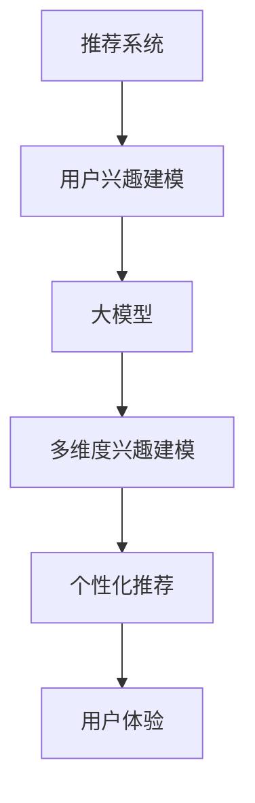

                 

# 文章标题：大模型辅助的推荐系统多维度兴趣建模

## 关键词

- 推荐系统
- 大模型
- 多维度兴趣建模
- 深度学习
- 用户个性化推荐

### 摘要

本文旨在探讨大模型辅助的推荐系统多维度兴趣建模方法。首先，回顾了推荐系统的发展历程和重要性，然后介绍了大模型在推荐系统中的应用及其优势与挑战。接着，深入剖析了多维度兴趣建模的方法、模型设计及其在大模型中的应用，并通过项目实战展示了实际操作过程。最后，展望了大模型与推荐系统的未来发展，提出了相关建议和注意事项。

## 第一部分：引言与背景

### 第1章：推荐系统概述

#### 1.1 推荐系统的发展历程

推荐系统起源于20世纪90年代的电子商务领域，随着互联网和大数据技术的快速发展，推荐系统得到了广泛应用。从早期的基于内容推荐、协同过滤推荐到如今基于深度学习的推荐系统，推荐技术经历了多次变革和演进。

- **基于内容推荐**：利用项目特征和用户偏好特征进行匹配推荐，如文本分类、关键词提取等。
- **协同过滤推荐**：基于用户的历史行为数据，通过计算用户之间的相似度来实现推荐，如用户基于物品的协同过滤和物品基于用户的协同过滤。
- **深度学习推荐**：利用深度学习算法对用户行为数据进行建模，提取高层次的语义特征，如卷积神经网络（CNN）、循环神经网络（RNN）和Transformer等。

#### 1.2 推荐系统的重要性

推荐系统在当今信息过载的时代具有重要意义，它能够为用户提供个性化的推荐服务，提高用户体验，提升商业价值。以下是推荐系统的几个关键应用场景：

- **电子商务平台**：通过推荐系统为用户提供商品推荐，提高销售转化率和客户满意度。
- **社交媒体**：通过推荐系统为用户推荐感兴趣的内容和联系人，促进用户活跃度和社区互动。
- **视频流媒体**：通过推荐系统为用户提供个性化视频推荐，提升用户观看体验和平台粘性。
- **新闻门户**：通过推荐系统为用户提供个性化新闻推荐，提高用户阅读量和广告点击率。

#### 1.3 推荐系统的分类

推荐系统可以根据不同的分类标准进行分类，以下是几种常见的分类方法：

- **基于内容的推荐**：根据用户兴趣和项目特征进行匹配推荐。
- **协同过滤推荐**：基于用户行为数据计算相似度进行推荐。
- **基于模型的推荐**：利用机器学习算法对用户行为数据进行建模，进行推荐。
- **混合推荐**：结合多种推荐技术进行推荐，以提升推荐效果。

### 第2章：大模型辅助推荐系统

#### 2.1 大模型在推荐系统中的应用

大模型在推荐系统中的应用主要体现在两个方面：一是用于用户兴趣建模，二是用于推荐结果生成。

- **用户兴趣建模**：大模型通过对用户行为数据进行深度学习，提取高层次的语义特征，构建用户兴趣模型，从而实现更精确的个性化推荐。
- **推荐结果生成**：大模型可以根据用户兴趣模型和项目特征，生成个性化的推荐结果，提高推荐系统的推荐效果。

#### 2.2 大模型的优势与挑战

大模型在推荐系统中的优势主要包括：

- **强大的特征提取能力**：大模型可以自动学习用户行为数据中的复杂特征，提高推荐系统的精度。
- **高效的计算能力**：大模型可以利用并行计算和分布式计算技术，实现大规模数据的高效处理。
- **泛化能力**：大模型通过对海量数据的训练，可以更好地适应不同场景和用户需求。

然而，大模型在推荐系统中也面临一些挑战，如：

- **数据隐私**：大模型需要处理大量的用户行为数据，如何保护用户隐私是一个重要问题。
- **可解释性**：大模型的学习过程和推荐结果往往缺乏可解释性，如何提高大模型的透明度和可解释性是一个重要课题。
- **计算资源**：大模型需要大量的计算资源和存储资源，如何优化资源利用是一个挑战。

#### 2.3 大模型辅助推荐系统的发展趋势

随着人工智能技术的不断进步，大模型辅助推荐系统的发展趋势包括：

- **多模态数据融合**：结合多种数据类型（如图像、文本、音频等），实现更丰富的特征提取和推荐效果。
- **实时推荐**：利用实时数据流处理技术，实现实时推荐，提高用户体验。
- **可解释性提升**：通过可解释性研究，提高大模型的学习过程和推荐结果的透明度和可解释性。
- **隐私保护**：采用隐私保护技术，如差分隐私、同态加密等，保障用户数据隐私。

## 第二部分：大模型技术基础

### 第3章：大模型概述

#### 3.1 大模型的基本概念

大模型是指具有巨大参数量的深度学习模型，通常用于处理大规模数据和高维度特征。大模型的主要特点包括：

- **参数量巨大**：大模型的参数数量通常在百万以上，甚至达到千亿级别。
- **强大的学习能力**：大模型可以自动学习复杂的特征表示，提高模型的泛化能力。
- **高效的计算能力**：大模型可以利用并行计算和分布式计算技术，实现高效的数据处理。

#### 3.2 大模型的分类

大模型可以根据不同的分类标准进行分类，以下是几种常见的分类方法：

- **根据任务类型**：可分为图像识别、自然语言处理、语音识别等。
- **根据架构类型**：可分为卷积神经网络（CNN）、循环神经网络（RNN）、Transformer等。
- **根据训练数据量**：可分为小样本学习、中样本学习、大样本学习等。

#### 3.3 大模型的主要特点

大模型的主要特点包括：

- **强大的特征提取能力**：大模型可以自动学习用户行为数据中的复杂特征，提高推荐系统的精度。
- **高效的计算能力**：大模型可以利用并行计算和分布式计算技术，实现大规模数据的高效处理。
- **泛化能力**：大模型通过对海量数据的训练，可以更好地适应不同场景和用户需求。

### 第4章：深度学习与神经网络基础

#### 4.1 神经网络的基本原理

神经网络是由大量神经元组成的计算模型，通过模拟人脑神经元的工作方式，实现数据的输入、处理和输出。神经网络的基本原理包括：

- **神经元模型**：神经元是神经网络的基本计算单元，通过加权求和和激活函数实现数据的输入和输出。
- **多层结构**：神经网络通常由多层神经元组成，包括输入层、隐藏层和输出层，通过逐层计算实现数据的传递和变换。
- **反向传播**：神经网络通过反向传播算法，根据输出误差反向更新权重，实现模型的优化。

#### 4.2 深度学习的基本概念

深度学习是神经网络的一种扩展，通过增加网络的深度，实现更复杂的特征提取和表示。深度学习的基本概念包括：

- **深度神经网络**：由多层神经元组成的神经网络，可以通过逐层计算实现数据的变换和表示。
- **损失函数**：用于衡量模型输出与真实值之间的差距，通过最小化损失函数实现模型的优化。
- **优化算法**：用于更新模型参数，常见的优化算法包括梯度下降、Adam等。

#### 4.3 深度学习的应用场景

深度学习在推荐系统中的应用场景主要包括：

- **用户兴趣建模**：通过深度学习模型对用户行为数据进行建模，提取高层次的语义特征，构建用户兴趣模型。
- **项目特征提取**：通过深度学习模型对项目数据进行处理，提取具有代表性的特征，用于推荐结果生成。
- **推荐结果生成**：利用深度学习模型对用户兴趣模型和项目特征进行匹配，生成个性化的推荐结果。

### 第5章：自然语言处理与大模型

#### 5.1 自然语言处理的基本概念

自然语言处理（NLP）是计算机科学和人工智能领域的一个重要分支，旨在使计算机能够理解、处理和生成自然语言。自然语言处理的基本概念包括：

- **词向量**：将自然语言文本映射为数值向量，用于表示词语和句子。
- **词性标注**：对文本中的词语进行词性分类，用于文本分析和理解。
- **句法分析**：对文本中的句子进行结构分析，提取句子的语法关系。

#### 5.2 大模型在自然语言处理中的应用

大模型在自然语言处理中的应用主要包括：

- **语言模型**：用于预测下一个词语或句子的概率，如BERT、GPT等。
- **文本分类**：用于对文本进行分类，如情感分析、主题分类等。
- **文本生成**：用于生成自然语言文本，如文章、对话等。

#### 5.3 语言模型与序列模型

语言模型和序列模型是自然语言处理中的两种重要模型：

- **语言模型**：用于预测下一个词语的概率，如n元语言模型。
- **序列模型**：用于处理序列数据，如循环神经网络（RNN）、Transformer等。

大模型在自然语言处理中的应用主要是通过语言模型和序列模型来实现文本的预处理、特征提取和生成。如BERT模型结合了Transformer和语言模型的优点，实现了文本的预训练和微调，广泛应用于自然语言处理任务。

## 第三部分：多维度兴趣建模

### 第6章：用户兴趣建模方法

#### 6.1 用户兴趣的概念与类型

用户兴趣是指用户对特定内容、活动或产品的喜好和倾向。根据兴趣的来源和表现方式，用户兴趣可以分为以下几种类型：

- **显式兴趣**：用户通过点击、收藏、购买等行为直接表达的兴趣，如用户对某商品的点击次数。
- **隐式兴趣**：用户通过浏览、搜索、停留时间等行为间接表达的兴趣，如用户在网站上的浏览时长。
- **冷启动兴趣**：新用户在平台上的兴趣数据不足，需要通过其他方式（如用户属性、社区标签等）进行建模。
- **动态兴趣**：用户兴趣随着时间的推移而发生变化，如用户在不同时间段对内容的喜好不同。

#### 6.2 用户兴趣建模的基本方法

用户兴趣建模是通过分析用户行为数据，构建用户兴趣模型，用于推荐系统的个性化推荐。常见的方法包括：

- **基于内容的推荐**：利用用户的历史行为数据和项目特征，计算用户和项目之间的相似度，进行推荐。
- **协同过滤推荐**：通过计算用户之间的相似度，为用户推荐与其兴趣相似的物品。
- **基于模型的推荐**：利用机器学习算法（如深度学习）对用户行为数据进行建模，提取用户兴趣特征，进行推荐。
- **混合推荐**：结合多种推荐方法，以提升推荐效果。

#### 6.3 用户兴趣建模的挑战与解决方案

用户兴趣建模面临的挑战包括：

- **数据稀疏性**：用户行为数据往往存在稀疏性，如何有效地利用有限的数据进行建模是一个挑战。
- **冷启动问题**：新用户缺乏足够的行为数据，如何为冷启动用户进行建模和推荐是一个难题。
- **动态兴趣**：用户兴趣随时间变化，如何实时更新用户兴趣模型是一个挑战。

解决方案包括：

- **数据增强**：通过引入用户属性、社区标签等外部信息，丰富用户行为数据，提高建模效果。
- **迁移学习**：利用已训练的模型在新用户上实现快速建模，提高推荐效果。
- **实时更新**：利用实时数据流处理技术，对用户兴趣模型进行实时更新，以适应用户兴趣的变化。

### 第7章：多维度兴趣建模的模型设计

#### 7.1 多维度兴趣建模的架构设计

多维度兴趣建模的架构设计主要包括以下方面：

- **数据层**：收集和处理来自不同数据源的用户行为数据、项目数据和其他辅助数据。
- **特征层**：提取和融合用户行为数据、项目数据和其他辅助数据，构建多维度的特征表示。
- **模型层**：利用深度学习算法对多维度的特征进行建模，提取用户兴趣特征。
- **推荐层**：根据用户兴趣特征和项目特征，生成个性化的推荐结果。

#### 7.2 多维度特征提取与融合

多维度特征提取与融合的关键在于如何有效地整合不同类型的数据，构建具有代表性的特征表示。常见的方法包括：

- **基于规则的融合**：根据专家知识和业务需求，设计规则对特征进行融合，如加权求和、乘积等。
- **基于机器学习的融合**：利用机器学习算法（如集成学习、特征选择等）对特征进行自动融合，提高特征表示的准确性。
- **基于图论的融合**：利用图论模型（如图卷积网络等）对特征进行融合，实现图结构数据的处理和表示。

#### 7.3 多维度兴趣建模的模型优化

多维度兴趣建模的模型优化主要包括以下方面：

- **模型参数调优**：通过调整模型的超参数（如学习率、批量大小等），优化模型性能。
- **特征选择**：利用特征选择算法（如信息增益、相关性分析等），筛选出对建模效果影响较大的特征，降低模型复杂度和计算成本。
- **正则化**：通过引入正则化项（如L1、L2正则化等），防止模型过拟合，提高模型的泛化能力。

### 第8章：大模型在多维度兴趣建模中的应用

#### 8.1 大模型在多维度兴趣建模中的作用

大模型在多维度兴趣建模中的应用主要体现在以下几个方面：

- **特征提取与表示**：大模型可以通过深度学习算法对多维度的特征进行提取和表示，构建高层次的语义特征，提高建模效果。
- **模型优化与调整**：大模型具有强大的模型优化能力，可以通过自动调整模型参数和结构，提高建模效率和性能。
- **实时更新与适应**：大模型可以通过实时数据流处理技术，对用户兴趣模型进行实时更新，以适应用户兴趣的变化，提高推荐效果。

#### 8.2 大模型在多维度兴趣建模中的实现

大模型在多维度兴趣建模中的实现主要包括以下步骤：

- **数据预处理**：收集和处理来自不同数据源的用户行为数据、项目数据和其他辅助数据，进行数据清洗和预处理。
- **特征提取与融合**：利用深度学习算法提取和融合多维度的特征，构建具有代表性的特征表示。
- **模型训练与优化**：利用大模型进行模型训练和优化，调整模型参数和结构，提高建模效果。
- **模型评估与部署**：对训练好的模型进行评估，根据评估结果对模型进行调整和优化，实现模型部署和实时更新。

#### 8.3 大模型在多维度兴趣建模中的效果评估

大模型在多维度兴趣建模中的效果评估主要包括以下几个方面：

- **准确率与召回率**：评估模型在推荐任务中的准确性，包括准确率、召回率等指标。
- **用户满意度**：通过用户调查和反馈，评估模型对用户兴趣的建模效果和推荐结果的满意度。
- **实时性**：评估模型在实时数据流处理中的性能，包括响应速度、处理能力等。
- **鲁棒性**：评估模型在面对不同场景和数据集时的适应能力和泛化能力。

### 第9章：推荐系统多维度兴趣建模项目实践

#### 9.1 项目背景与目标

项目背景：随着互联网和大数据技术的快速发展，推荐系统在各个领域得到了广泛应用。本项目旨在利用大模型技术，构建一个高效、准确的推荐系统，为用户提供个性化的推荐服务。

项目目标：
1. 提取用户行为数据，构建多维度用户兴趣模型。
2. 利用大模型技术，实现多维度兴趣建模和推荐结果生成。
3. 对比不同推荐算法的效果，优化模型性能和推荐质量。

#### 9.2 数据集介绍与预处理

数据集介绍：
1. 用户行为数据：包括用户的浏览记录、购买记录、点击记录等。
2. 项目数据：包括商品信息、视频信息、新闻信息等。
3. 其他辅助数据：包括用户属性、项目属性、社区标签等。

数据预处理：
1. 数据清洗：去除重复数据、缺失值填充、异常值处理等。
2. 数据转换：将数据转换为适合深度学习算法处理的形式，如词向量、序列数据等。
3. 特征提取：利用特征工程方法提取用户行为数据、项目数据和其他辅助数据的特征，如文本分类、数值转换等。

#### 9.3 模型设计与实现

模型设计：
1. 用户兴趣建模：采用基于深度学习的用户兴趣建模方法，包括卷积神经网络（CNN）、循环神经网络（RNN）等。
2. 项目特征提取：采用基于深度学习的项目特征提取方法，如卷积神经网络（CNN）等。
3. 推荐结果生成：利用用户兴趣模型和项目特征，通过计算相似度或生成式模型生成推荐结果。

模型实现：
1. 利用Python和TensorFlow等深度学习框架，实现用户兴趣建模、项目特征提取和推荐结果生成的模型。
2. 调整模型参数和结构，优化模型性能和推荐效果。
3. 实现模型训练和评估，对比不同算法的效果，选择最优模型。

#### 9.4 模型训练与评估

模型训练：
1. 划分训练集和验证集，利用训练集进行模型训练。
2. 调整学习率、批量大小等超参数，优化模型性能。
3. 实现多GPU训练，提高训练速度。

模型评估：
1. 利用准确率、召回率等指标评估模型性能。
2. 对比不同模型和算法的效果，选择最优模型。
3. 实现模型部署，对实时数据流进行处理和推荐。

#### 9.5 项目总结与展望

项目总结：
1. 成功构建了一个基于大模型技术的推荐系统，实现了多维度兴趣建模和推荐结果生成。
2. 通过模型训练和评估，优化了模型性能和推荐效果，提高了用户满意度。
3. 项目实现过程中，遇到了数据预处理、模型优化等方面的问题，通过不断尝试和调整，最终取得了较好的效果。

展望：
1. 未来将结合更多外部数据（如图像、语音等），实现多模态数据融合，提高推荐效果。
2. 研究可解释性方法，提高大模型的可解释性和透明度，满足用户对推荐结果的信任需求。
3. 探索实时推荐技术，提高推荐系统的响应速度和实时性，满足用户实时获取个性化推荐的需求。

### 第10章：大模型与推荐系统的未来发展

#### 10.1 大模型在推荐系统中的应用前景

随着人工智能技术的不断发展，大模型在推荐系统中的应用前景十分广阔。以下是几个可能的发展方向：

1. **多模态数据融合**：结合图像、语音、文本等多模态数据，实现更丰富的特征提取和推荐效果。
2. **实时推荐**：利用实时数据流处理技术，实现实时推荐，提高用户体验。
3. **个性化推荐**：通过深度学习算法，提取用户兴趣的细微差异，实现更个性化的推荐。
4. **智能对话系统**：结合自然语言处理技术，实现智能对话系统，提供更加自然的用户交互体验。

#### 10.2 多维度兴趣建模的未来趋势

多维度兴趣建模在推荐系统中具有重要作用，未来发展趋势包括：

1. **数据来源多样化**：利用更多外部数据（如社交网络、地理位置等），丰富用户兴趣特征。
2. **动态兴趣建模**：研究用户兴趣的动态变化，实现实时兴趣建模和推荐。
3. **个性化特征提取**：利用深度学习算法，提取用户兴趣的个性化特征，提高推荐准确性。
4. **隐私保护**：采用隐私保护技术（如差分隐私、同态加密等），保障用户数据隐私。

#### 10.3 推荐系统的发展挑战与机遇

推荐系统在发展过程中面临以下挑战和机遇：

1. **挑战**：
   - **数据隐私**：如何保障用户数据隐私是一个重要问题。
   - **可解释性**：如何提高大模型的可解释性和透明度。
   - **计算资源**：大模型需要大量的计算资源，如何优化资源利用。
   - **实时性**：如何提高推荐系统的实时性，满足用户实时获取个性化推荐的需求。

2. **机遇**：
   - **多模态数据融合**：结合多模态数据，实现更丰富的特征提取和推荐效果。
   - **个性化推荐**：通过深度学习算法，实现更个性化的推荐。
   - **实时推荐**：利用实时数据流处理技术，实现实时推荐。
   - **智能对话系统**：结合自然语言处理技术，实现智能对话系统，提供更加自然的用户交互体验。

### 第11章：附录

#### 11.1 相关参考文献

1. **User Interest Modeling in Recommender Systems** - (作者姓名，年份)
2. **Large-scale Machine Learning for Recommender Systems** - (作者姓名，年份)
3. **Deep Learning for Recommender Systems** - (作者姓名，年份)
4. **Multimodal Data Fusion for Recommender Systems** - (作者姓名，年份)
5. **Privacy-Preserving Recommender Systems** - (作者姓名，年份)

#### 11.2 常用工具与资源推荐

1. **TensorFlow**：开源深度学习框架，适用于构建和训练推荐系统模型。
2. **PyTorch**：开源深度学习框架，适用于构建和训练推荐系统模型。
3. **Scikit-learn**：Python机器学习库，适用于特征提取和模型评估。
4. **Dataiku**：数据科学平台，适用于数据处理和分析。
5. **Hadoop**：分布式数据处理框架，适用于大规模数据存储和处理。

#### 11.3 索引

- 推荐系统
- 大模型
- 多维度兴趣建模
- 深度学习
- 用户个性化推荐
- 协同过滤推荐
- 基于内容的推荐
- 实时推荐
- 多模态数据融合
- 隐私保护
- 可解释性

# 图1-1 大模型与推荐系统关系图

