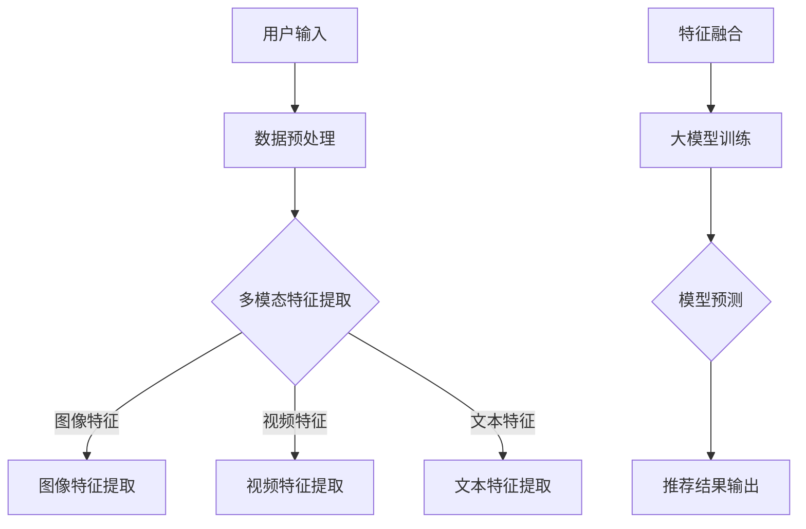

                 

### 文章标题

《大模型驱动的推荐系统多模态内容推荐》

### 关键词

- 推荐系统
- 多模态内容
- 大模型
- 特征提取
- 数学模型
- 项目实战

### 摘要

本文旨在探讨基于大模型驱动的推荐系统在多模态内容推荐领域的应用。首先，我们介绍了推荐系统的基本概念和多模态内容推荐的需求。接着，深入分析了大模型技术基础，包括多模态数据处理、大模型训练算法与优化，并提出了多种大模型架构。然后，详细讲解了多模态内容特征提取算法，包括图像、视频和文本特征提取方法，并使用了伪代码和数学公式对算法进行详细解释。此外，本文还通过项目实战展示了如何实现基于大模型的多模态推荐系统，并对项目进行了详细解读与分析。最后，我们对推荐系统的性能优化方法进行了介绍，并对未来的发展趋势和潜在挑战进行了展望。本文旨在为从事推荐系统研究和开发的读者提供有价值的参考和指导。### 第一部分：引言与背景

#### 1.1 推荐系统概述与多模态内容推荐背景

推荐系统是一种信息过滤技术，旨在向用户推荐他们可能感兴趣的内容。这种系统广泛应用于电子商务、社交媒体、新闻媒体、在线视频平台等多个领域。推荐系统的核心目标是提高用户的满意度和参与度，同时增加平台的价值。

随着互联网的普及和数据量的爆炸性增长，推荐系统的重要性日益凸显。传统的基于内容的推荐系统（Content-Based Filtering）和协同过滤（Collaborative Filtering）虽然在一定程度上满足了用户的个性化需求，但面对日益复杂和多变的用户行为数据，这些方法开始显露出局限性。

多模态内容推荐作为一种新兴的推荐技术，通过整合多种数据类型（如图像、视频、音频、文本等），能够提供更加丰富和个性化的推荐服务。这种推荐方法不仅能够捕捉用户在不同模态上的偏好，还能够通过跨模态特征融合，提高推荐系统的准确性和鲁棒性。

在多模态内容推荐中，用户生成的内容（User-Generated Content, UGC）和数据丰富度（Data Richness）成为关键因素。UGC包括用户发布的图片、视频、评论等，这些数据能够提供关于用户兴趣的直观线索。数据丰富度则体现在多种模态数据的整合，如图像和文本的结合，视频和语音的融合等，使得推荐系统能够更全面地理解用户意图。

然而，多模态内容推荐也面临着一系列挑战。首先，不同模态的数据具有不同的特征和复杂性，如何有效提取和整合这些特征是一个关键问题。其次，多模态数据的标注成本高，尤其是在大规模数据集上。此外，多模态推荐系统的计算资源需求较高，需要更强大的硬件支持。

总之，多模态内容推荐为推荐系统带来了新的机遇和挑战。通过整合多种模态的数据，推荐系统能够提供更加精准和个性化的推荐服务，从而提高用户体验和平台价值。然而，这也要求研究人员和开发者不断提升技术水平和算法性能，以应对复杂的数据和多样化的用户需求。#### 1.1.1 推荐系统定义与核心概念

推荐系统是一种通过分析和理解用户的行为和偏好，自动为用户提供个性化内容推荐的信息过滤系统。其核心目标是通过预测用户对特定物品的兴趣，从而提高用户满意度和参与度。

从技术角度来看，推荐系统可以分为以下几种类型：

1. **基于内容的推荐（Content-Based Filtering）**：
   - **定义**：基于物品的属性和用户的历史偏好来推荐类似的物品。
   - **核心概念**：
     - **物品特征**：描述物品的属性，如标题、标签、分类、内容等。
     - **用户偏好**：用户对特定物品的评价或行为，如点击、购买、收藏等。
     - **相似性度量**：计算物品之间的相似性，常用的方法包括余弦相似度、欧氏距离等。

2. **协同过滤（Collaborative Filtering）**：
   - **定义**：通过分析用户之间的行为模式来推荐物品。
   - **核心概念**：
     - **用户行为**：用户对物品的交互行为，如评分、评论、购买等。
     - **用户相似性**：基于用户行为数据计算用户之间的相似性。
     - **物品推荐**：基于用户的相似性，向用户推荐与其相似用户喜欢的物品。

3. **混合推荐（Hybrid Recommendation）**：
   - **定义**：结合基于内容和协同过滤的方法，以提高推荐效果。
   - **核心概念**：
     - **内容嵌入**：将物品特征转换为向量表示，用于计算物品之间的相似性。
     - **协同嵌入**：将用户行为数据转换为向量表示，用于计算用户之间的相似性。
     - **推荐生成**：通过融合内容嵌入和协同嵌入，生成最终的推荐列表。

此外，推荐系统还包括以下关键概念：

1. **推荐精度（Accuracy）**：推荐系统推荐的物品与用户实际兴趣的匹配程度。
2. **推荐多样性（Diversity）**：推荐系统推荐的不同物品之间的差异，避免单一化推荐。
3. **推荐新颖性（Novelty）**：推荐系统推荐的新颖、未被用户发现的物品。
4. **推荐覆盖度（Coverage）**：推荐系统推荐物品的覆盖范围，确保覆盖各种类型和兴趣的用户。

综上所述，推荐系统通过理解用户的行为和偏好，利用多种推荐算法和模型，为用户提供个性化、准确、多样、新颖的推荐服务，从而提高用户体验和平台价值。#### 1.1.2 多模态内容推荐需求分析

多模态内容推荐的需求源于用户在信息消费过程中的多样化需求和复杂行为模式。随着互联网和多媒体技术的快速发展，用户生成的内容形式越来越丰富，包括图像、视频、音频、文本等多种模态。这些多模态内容不仅提供了更多的信息来源，也使得推荐系统需要具备更高的处理能力和灵活性。

首先，多模态内容推荐能够更全面地捕捉用户的兴趣和偏好。例如，用户在观看视频时，可能会在评论区域发表文字评论，或者在社交平台上分享图片。这些多模态数据可以为推荐系统提供更多维度的用户特征，从而提高推荐的准确性。传统的单模态推荐系统往往只能处理一种类型的数据，如文本或图像，而多模态推荐系统能够整合多种数据类型，为用户提供更加个性化的推荐。

其次，多模态内容推荐能够提高推荐的多样性和新颖性。单模态推荐系统容易陷入推荐单一类型内容的问题，而多模态推荐系统可以跨模态推荐不同的内容类型，如同时推荐相关的视频和文本资料，或者图片和音频资料，从而丰富用户的体验。此外，多模态推荐系统还可以利用不同模态之间的互补性，发现用户可能未意识到的兴趣点，从而推荐新颖的内容。

再者，多模态内容推荐对于提升用户满意度具有重要意义。现代用户对于推荐系统的要求越来越高，他们希望推荐系统能够理解自己的多方面需求，提供个性化、多样化的推荐。例如，在电子商务平台上，用户可能通过查看商品的图像来了解产品的外观，通过阅读商品描述来了解产品的功能，通过观看用户评论来了解产品的质量。多模态推荐系统可以整合这些信息，为用户提供更加精准的推荐，从而提升用户的购物体验。

最后，多模态内容推荐在商业应用中具有巨大的潜力。在广告推荐、内容分发、社交网络等领域，多模态推荐系统可以帮助平台更好地吸引和留住用户，提高用户活跃度和留存率。例如，在视频平台中，多模态推荐系统可以根据用户的观看历史、搜索行为、社交互动等多种数据，为用户提供个性化的视频推荐，从而增加用户的观看时间和平台的收益。

总之，多模态内容推荐在满足用户多样化需求、提高推荐系统性能、增强用户体验和提升商业价值等方面具有显著优势。随着技术的不断进步和多模态数据的广泛应用，多模态内容推荐将逐渐成为推荐系统发展的主流方向。#### 1.1.3 大模型在推荐系统中的应用潜力

大模型在推荐系统中的应用潜力主要体现在以下几个方面：

1. **提升推荐精度**：
   - 大模型具有强大的数据处理和模式识别能力，能够通过深度学习技术从海量数据中提取有效的特征，从而提高推荐系统的精度。例如，通过预训练的语言模型（如BERT、GPT），可以自动学习文本数据中的复杂语义关系，为推荐系统提供更精准的用户偏好预测。

2. **实现多模态融合**：
   - 大模型能够处理多种数据类型，如图像、视频、音频和文本，通过跨模态特征融合，可以将不同模态的信息整合起来，提供更全面的用户画像和物品描述。这种多模态融合能力有助于提升推荐系统的多样性和个性化水平。

3. **动态调整推荐策略**：
   - 大模型具有自我学习和自我优化的能力，可以根据用户的实时行为和历史数据，动态调整推荐策略。例如，通过在线学习算法，推荐系统可以实时更新用户偏好和物品特征，从而提供更加即时和精准的推荐。

4. **增强推荐解释性**：
   - 大模型通过深度神经网络结构，可以逐步揭示推荐背后的逻辑和原因。虽然深度学习模型本身具有“黑箱”特性，但通过可解释性研究，如注意力机制和解释性模型，可以增强推荐系统的透明性和可信度，帮助用户理解推荐结果。

5. **处理长尾数据**：
   - 大模型能够处理长尾数据，即数据集中少数重要特征和大量次要特征共存的情况。在推荐系统中，长尾数据通常包含了用户微小的偏好变化和特殊的兴趣点，通过大模型可以更好地捕捉这些细节，从而提高推荐的准确性。

6. **适应性强**：
   - 大模型可以灵活适应不同的应用场景和业务需求，通过微调（Fine-tuning）和迁移学习（Transfer Learning）技术，可以在不同的推荐任务中快速部署和应用，降低开发成本和部署难度。

7. **实时推荐**：
   - 大模型的高效计算能力和分布式计算技术，使其能够实现实时推荐。这种实时性对于动态变化的用户场景，如电子商务和社交媒体平台，尤为重要。

综上所述，大模型在推荐系统中的应用潜力巨大，它不仅能够提升推荐精度，实现多模态融合，动态调整推荐策略，增强推荐解释性，还能适应性强、实时推荐，为用户提供更加个性化和精准的推荐服务。随着技术的不断进步和应用的深入，大模型在推荐系统中的作用将更加突出。### 第二部分：核心概念与原理

#### 2.1 大模型技术基础

大模型（Large Model）是近年来在深度学习和人工智能领域的一个重要突破，它通过训练大规模神经网络，以获取更强大的数据表示和模式识别能力。在推荐系统中，大模型的应用为多模态内容推荐带来了新的契机。本节将详细探讨大模型的基本概念、多模态数据处理、大模型训练算法与优化，以及大模型在推荐系统中的架构设计。

##### 2.1.1 大模型的基本概念

大模型是指那些具有数亿甚至数十亿参数的神经网络，这些模型通常通过大规模数据进行预训练，从而具有强大的特征提取和泛化能力。大模型的发展得益于计算能力的提升和海量数据的获取，使得深度学习技术在自然语言处理、计算机视觉、语音识别等领域取得了显著成果。

- **参数量**：大模型的参数量通常在数百万至数十亿之间，这比传统的神经网络参数量（数千至数万个参数）高得多。
- **预训练（Pre-training）**：大模型通过在大规模数据集上进行预训练，学习到通用特征表示，从而提高了模型的泛化能力。
- **微调（Fine-tuning）**：在预训练的基础上，大模型可以通过微调适应特定任务，如文本分类、图像识别等。

##### 2.1.2 多模态数据处理

多模态数据处理是推荐系统中的关键环节，它涉及将不同模态的数据（如图像、视频、文本）进行有效整合，以提取有用的特征。大模型在多模态数据处理中具有显著优势，能够处理多种类型的输入数据。

- **数据类型**：多模态数据包括图像、视频、音频、文本等。
- **特征提取**：通过深度学习模型，如卷积神经网络（CNN）处理图像，循环神经网络（RNN）处理文本，时空卷积网络（TCN）处理视频，从不同模态中提取高级特征。
- **特征融合**：多模态特征融合是将不同模态的特征整合为一个统一特征表示的过程。常见的方法包括串联式融合、并联式融合和混合式融合。

##### 2.1.3 大模型训练算法与优化

大模型训练通常涉及复杂的计算和优化过程，以下是一些常用的训练算法与优化方法：

- **优化算法**：常用的优化算法包括随机梯度下降（SGD）、Adam、Adagrad等，这些算法能够有效地调整模型参数，提高训练效率。
- **正则化技术**：正则化技术，如L1、L2正则化，Dropout，可以防止模型过拟合。
- **批次归一化**：批次归一化可以加速训练，减少对批量大小的依赖。
- **学习率调整**：学习率的动态调整有助于提高训练效果，常用的方法包括余弦退火、学习率衰减等。

##### 2.1.4 大模型在推荐系统中的架构设计

大模型在推荐系统中的架构设计需要考虑多模态数据的处理和特征融合。以下是一些常见的架构设计：

- **串联式架构**：将不同模态的特征提取模块串联起来，依次处理图像、视频和文本数据，最终进行特征融合。
- **并联式架构**：同时处理多种模态的数据，分别提取特征，然后进行特征融合。
- **混合式架构**：结合串联式和并联式架构，根据任务需求灵活设计。

#### 2.2 多模态内容特征提取算法

多模态内容特征提取算法是推荐系统的核心环节，它涉及将图像、视频和文本等多模态数据转化为可用于训练的特征向量。以下将详细介绍这些算法。

##### 2.2.1 图像特征提取算法

图像特征提取算法通常基于卷积神经网络（CNN），它能够自动学习图像中的复杂特征。

- **基础模型**：如VGG、ResNet、Inception等，这些模型在图像识别任务中表现优异。
- **调整层与聚合层设计**：在基础模型的基础上，可以通过添加调整层和聚合层来适应特定任务，如分类、目标检测等。

##### 2.2.2 视频特征提取算法

视频特征提取算法通常基于时空卷积网络（TCN）或多层感知器（MLP）。

- **时空卷积网络（TCN）**：TCN能够处理视频数据中的时间和空间信息，提取高级特征。
- **多层感知器（MLP）与池化操作**：MLP可以用于对提取的特征进行分类，池化操作用于降低特征维度。

##### 2.2.3 文本特征提取算法

文本特征提取算法通常基于循环神经网络（RNN）或其变体，如长短期记忆网络（LSTM）。

- **词嵌入（Word Embedding）技术**：将文本转换为向量表示，常见的方法包括Word2Vec、GloVe等。
- **循环神经网络（RNN）与长短期记忆网络（LSTM）**：RNN和LSTM能够处理序列数据，提取文本特征。

#### 2.3 大模型训练算法与优化

大模型训练通常涉及复杂的计算和优化过程，以下是一些常用的训练算法与优化方法：

- **优化算法**：常用的优化算法包括随机梯度下降（SGD）、Adam、Adagrad等，这些算法能够有效地调整模型参数，提高训练效率。
- **正则化技术**：正则化技术，如L1、L2正则化，Dropout，可以防止模型过拟合。
- **批次归一化**：批次归一化可以加速训练，减少对批量大小的依赖。
- **学习率调整**：学习率的动态调整有助于提高训练效果，常用的方法包括余弦退火、学习率衰减等。

#### 2.4 推荐系统中的大模型架构

推荐系统中的大模型架构设计需要考虑多模态数据的处理和特征融合。以下是一些常见的架构设计：

- **串联式架构**：将不同模态的特征提取模块串联起来，依次处理图像、视频和文本数据，最终进行特征融合。
- **并联式架构**：同时处理多种模态的数据，分别提取特征，然后进行特征融合。
- **混合式架构**：结合串联式和并联式架构，根据任务需求灵活设计。

通过以上内容，我们详细介绍了大模型在推荐系统中的应用，包括基本概念、多模态数据处理、特征提取算法、训练与优化方法以及架构设计。大模型在推荐系统中的有效应用，有望进一步提升推荐系统的性能，为用户提供更加个性化和精准的推荐服务。### 2.1.1 大模型的基本概念

大模型（Large Model）是近年来在深度学习和人工智能领域的一个重要突破，它通过训练大规模神经网络，以获取更强大的数据表示和模式识别能力。在推荐系统中，大模型的应用为多模态内容推荐带来了新的契机。本节将详细探讨大模型的基本概念、多模态数据处理、大模型训练算法与优化，以及大模型在推荐系统中的架构设计。

**基本概念**

大模型是指那些具有数亿甚至数十亿参数的神经网络，这些模型通常通过大规模数据进行预训练，从而具有强大的特征提取和泛化能力。大模型的发展得益于计算能力的提升和海量数据的获取，使得深度学习技术在自然语言处理、计算机视觉、语音识别等领域取得了显著成果。

**参数量**

大模型的参数量通常在数百万至数十亿之间，这比传统的神经网络参数量（数千至数万个参数）高得多。例如，Transformer模型中的BERT（Bidirectional Encoder Representations from Transformers）具有数十亿个参数，GPT（Generative Pre-trained Transformer）模型也有数亿个参数。

**预训练（Pre-training）**

大模型通过在大规模数据集上进行预训练，学习到通用特征表示，从而提高了模型的泛化能力。预训练的过程通常包括以下几个步骤：

1. **数据预处理**：对大规模文本、图像、音频等多模态数据集进行预处理，包括数据清洗、去重、分词、标注等。
2. **模型初始化**：初始化大模型的结构和参数，常见的初始化方法包括高斯初始化、Xavier初始化等。
3. **预训练**：在大规模数据集上迭代训练模型，通过梯度下降等优化算法调整模型参数，使模型能够更好地拟合数据。
4. **模型存储**：将预训练好的模型参数存储下来，用于后续的微调和应用。

**微调（Fine-tuning）**

在预训练的基础上，大模型可以通过微调适应特定任务，如文本分类、图像识别等。微调的过程通常包括以下几个步骤：

1. **加载预训练模型**：从预训练模型中加载已训练好的参数。
2. **调整模型结构**：根据具体任务的需求，对预训练模型的网络结构进行调整，如增加或减少层、调整层间连接等。
3. **微调训练**：在特定任务的数据集上迭代训练模型，通过梯度下降等优化算法调整模型参数，使模型在特定任务上达到更好的性能。
4. **模型评估**：在验证集和测试集上评估模型的性能，包括准确率、召回率、F1-Score等指标。

**多模态数据处理**

多模态数据处理是推荐系统中的关键环节，它涉及将不同模态的数据（如图像、视频、文本）进行有效整合，以提取有用的特征。大模型在多模态数据处理中具有显著优势，能够处理多种类型的输入数据。

**数据类型**

多模态数据包括图像、视频、音频、文本等。每种模态的数据都有其独特的特征和挑战。

**特征提取**

通过深度学习模型，如卷积神经网络（CNN）处理图像，循环神经网络（RNN）处理文本，时空卷积网络（TCN）处理视频，从不同模态中提取高级特征。

**特征融合**

多模态特征融合是将不同模态的特征整合为一个统一特征表示的过程。常见的方法包括串联式融合、并联式融合和混合式融合。

**串联式融合**

串联式融合是将不同模态的特征提取模块串联起来，依次处理图像、视频和文本数据，最终进行特征融合。

**并联式融合**

并联式融合是同时处理多种模态的数据，分别提取特征，然后进行特征融合。

**混合式架构**

混合式架构是结合串联式和并联式架构，根据任务需求灵活设计。

**大模型在推荐系统中的应用**

大模型在推荐系统中的应用主要体现在以下几个方面：

1. **提升推荐精度**：大模型能够从海量数据中提取有效的特征，从而提高推荐系统的精度。
2. **实现多模态融合**：大模型能够处理多种数据类型，通过跨模态特征融合，提供更全面的用户画像和物品描述。
3. **动态调整推荐策略**：大模型能够实时学习用户行为和历史数据，动态调整推荐策略，提供更个性化的推荐服务。
4. **增强推荐解释性**：通过可解释性研究，如注意力机制和解释性模型，大模型能够增强推荐系统的透明性和可信度。
5. **处理长尾数据**：大模型能够处理长尾数据，即数据集中少数重要特征和大量次要特征共存的情况，从而提高推荐的准确性。
6. **适应性强**：大模型能够灵活适应不同的应用场景和业务需求，通过微调和迁移学习技术，快速部署和应用。

综上所述，大模型在推荐系统中的应用潜力巨大，它不仅能够提升推荐精度，实现多模态融合，动态调整推荐策略，增强推荐解释性，还能适应性强、实时推荐，为用户提供更加个性化和精准的推荐服务。随着技术的不断进步和应用的深入，大模型在推荐系统中的作用将更加突出。### 2.1.2 多模态数据处理

多模态数据处理是推荐系统中的一个重要环节，因为它涉及到如何有效地整合不同模态的数据，以提供更准确、更个性化的推荐。在多模态数据处理中，图像、视频和文本是最常见的三种数据类型，每种数据类型都有其独特的特征和挑战。

**图像数据**

图像数据是推荐系统中常用的模态之一，因为它们能够直观地展示物品的外观和特征。图像数据的处理主要包括以下步骤：

1. **数据预处理**：对图像进行裁剪、缩放、增强等预处理操作，以提高模型的训练效果和鲁棒性。
2. **特征提取**：使用卷积神经网络（CNN）等深度学习模型提取图像特征。这些特征通常包含了图像中的位置、纹理、形状等高级信息。
3. **特征归一化**：对提取的图像特征进行归一化处理，以减少不同特征之间的尺度差异。

常用的图像特征提取模型包括VGG、ResNet、Inception等。这些模型在ImageNet等大规模图像数据集上预训练，并在各种图像识别任务中表现出色。

**视频数据**

视频数据是另一种重要的模态，它能够提供关于物品的动态信息，如运动、场景变化等。视频数据的处理通常涉及以下几个步骤：

1. **帧提取**：从视频中提取关键帧或连续帧，以便进行特征提取。
2. **特征提取**：使用时空卷积网络（TCN）或循环神经网络（RNN）等模型提取视频特征。这些模型能够捕捉视频中的时间和空间信息，从而提供更丰富的特征描述。
3. **特征归一化**：对提取的视频特征进行归一化处理，以消除不同特征之间的尺度差异。

常见的视频特征提取模型包括TCN、3D-CNN、RNN等。这些模型在动作识别、视频分类等任务中得到了广泛应用。

**文本数据**

文本数据是推荐系统中另一种重要的模态，因为它能够提供关于物品的文本描述、用户评论等信息。文本数据的处理通常涉及以下几个步骤：

1. **数据预处理**：对文本进行分词、去除停用词、词性标注等预处理操作，以提高文本的特征提取效果。
2. **特征提取**：使用词嵌入技术（如Word2Vec、GloVe）将文本转换为向量表示。词嵌入能够捕捉文本中的语义信息，从而为推荐系统提供有用的特征。
3. **特征归一化**：对提取的文本特征进行归一化处理，以消除不同特征之间的尺度差异。

常见的文本特征提取模型包括循环神经网络（RNN）、长短期记忆网络（LSTM）、Transformer等。这些模型在文本分类、序列建模等任务中得到了广泛应用。

**多模态特征融合**

多模态特征融合是将不同模态的数据整合为一个统一特征表示的过程，以提供更准确的推荐。常见的特征融合方法包括：

1. **串联式融合**：将不同模态的特征向量串联起来，形成一个更长的特征向量。这种方法简单直观，但可能会导致维度灾难。
2. **并联式融合**：同时处理不同模态的数据，分别提取特征，然后将它们合并。这种方法可以有效地利用不同模态的信息，但实现起来较为复杂。
3. **混合式融合**：结合串联式和并联式融合的优点，根据任务需求灵活设计特征融合策略。

在实际应用中，多模态数据处理和特征融合是一个动态调整和优化的过程，需要根据具体任务和数据集的特点进行设计。通过有效的多模态数据处理和特征融合，推荐系统可以提供更准确、更个性化的推荐服务，从而提高用户满意度和平台价值。### 2.1.3 大模型训练算法与优化

大模型训练算法与优化是深度学习和人工智能领域中至关重要的一环，它决定了大模型的性能和训练效率。以下将详细探讨大模型训练算法与优化方法。

**优化算法**

优化算法是调整大模型参数以最小化损失函数的关键工具。以下是一些常用的优化算法：

1. **随机梯度下降（SGD）**：
   - **基本思想**：通过计算当前批次的梯度来更新模型参数。
   - **优点**：简单易实现，计算成本低。
   - **缺点**：收敛速度慢，容易陷入局部最优。

2. **Adam**：
   - **基本思想**：结合SGD和动量项，同时考虑一阶矩估计和二阶矩估计。
   - **优点**：收敛速度快，对参数调整更稳定。
   - **缺点**：需要更多计算资源。

3. **Adagrad**：
   - **基本思想**：自适应调整学习率，对每个参数的更新赋予不同的权重。
   - **优点**：能够快速适应不同梯度的变化。
   - **缺点**：对于稀疏数据可能收敛缓慢。

4. **RMSprop**：
   - **基本思想**：使用指数加权移动平均来更新梯度，从而调整学习率。
   - **优点**：对稀疏数据表现较好。
   - **缺点**：需要较长的调整时间。

**正则化技术**

正则化技术是防止模型过拟合的重要手段。以下是一些常用的正则化技术：

1. **L1和L2正则化**：
   - **基本思想**：在损失函数中加入模型参数的L1或L2范数。
   - **优点**：可以减少模型的复杂度，防止过拟合。
   - **缺点**：可能会降低模型的泛化能力。

2. **Dropout**：
   - **基本思想**：在训练过程中随机丢弃一部分神经元。
   - **优点**：可以有效减少过拟合。
   - **缺点**：可能会降低模型的训练速度。

3. **Dropconnect**：
   - **基本思想**：在训练过程中随机丢弃整个神经网络的一部分连接。
   - **优点**：类似于Dropout，但更灵活。
   - **缺点**：计算成本较高。

**批次归一化**

批次归一化（Batch Normalization）是一种用于加速训练和减少方差的技术。它通过对每个批次的数据进行归一化处理，减少内部协变量转移，从而提高模型的稳定性。

**学习率调整**

学习率的调整对于大模型的训练效果至关重要。以下是一些常用的学习率调整方法：

1. **余弦退火（Cosine Annealing）**：
   - **基本思想**：模拟余弦函数的周期性变化，逐渐降低学习率。
   - **优点**：可以有效地降低学习率，避免过快或过慢的收敛。
   - **缺点**：需要较长的训练时间。

2. **学习率衰减（Learning Rate Decay）**：
   - **基本思想**：在训练过程中，按照固定步长或时间间隔逐步减少学习率。
   - **优点**：简单易实现，适用于大多数任务。
   - **缺点**：可能会在训练后期导致收敛缓慢。

3. **自适应学习率调整**：
   - **基本思想**：根据模型的训练效果自动调整学习率。
   - **优点**：可以根据训练动态调整，提高模型性能。
   - **缺点**：实现较为复杂，需要额外的计算资源。

**训练策略优化**

除了上述优化方法，以下是一些常见的训练策略优化方法：

1. **数据增强**：
   - **基本思想**：通过对训练数据进行增强，增加模型的泛化能力。
   - **优点**：可以提高模型的鲁棒性。
   - **缺点**：可能会增加计算成本。

2. **提前停止（Early Stopping）**：
   - **基本思想**：在验证集上监控模型性能，当模型性能不再提高时停止训练。
   - **优点**：可以避免过拟合。
   - **缺点**：可能需要较长时间的验证。

3. **权重共享（Weight Sharing）**：
   - **基本思想**：在多个任务中共享一部分模型参数。
   - **优点**：可以提高模型的泛化能力，减少参数数量。
   - **缺点**：可能影响每个任务的特殊性。

通过上述大模型训练算法与优化方法，可以有效地提升大模型的训练效果和性能。在实际应用中，需要根据具体任务和数据集的特点，灵活选择和调整这些方法，以实现最佳训练效果。### 2.1.4 推荐系统中的大模型架构

在推荐系统中，大模型的架构设计至关重要，它直接影响到推荐系统的性能和用户体验。以下将详细探讨几种常见的大模型架构设计，包括串联式架构、并联式架构和混合式架构。

**串联式架构**

串联式架构是一种将不同模态的特征提取模块依次串联起来的架构。在这种架构中，每个模态的数据分别通过相应的特征提取模块进行处理，然后融合成一个统一的特征向量。具体步骤如下：

1. **图像特征提取**：使用卷积神经网络（CNN）对图像数据提取特征。
2. **视频特征提取**：使用时空卷积网络（TCN）或循环神经网络（RNN）对视频数据提取特征。
3. **文本特征提取**：使用循环神经网络（RNN）或Transformer对文本数据提取特征。
4. **特征融合**：将提取的图像、视频和文本特征进行融合，形成一个多模态特征向量。

串联式架构的优点是设计简单，易于实现。缺点是特征融合过程中可能会丢失一些重要的信息，并且当特征维度较高时，计算成本较大。

**并联式架构**

并联式架构是一种同时处理多种模态的数据，分别提取特征，然后进行融合的架构。在这种架构中，每个模态的特征提取模块并行运行，最终将提取的特征进行融合。具体步骤如下：

1. **图像特征提取**：使用卷积神经网络（CNN）对图像数据提取特征。
2. **视频特征提取**：使用时空卷积网络（TCN）或循环神经网络（RNN）对视频数据提取特征。
3. **文本特征提取**：使用循环神经网络（RNN）或Transformer对文本数据提取特征。
4. **特征融合**：将提取的图像、视频和文本特征进行融合，形成一个多模态特征向量。

并联式架构的优点是能够充分利用不同模态的信息，提高特征融合的效果。缺点是实现较为复杂，需要协调不同模态的特征提取和融合。

**混合式架构**

混合式架构是结合串联式和并联式架构的优点，根据任务需求灵活设计的架构。在这种架构中，不同模态的特征提取模块既可以串联也可以并联，根据实际需要选择最佳融合方式。具体步骤如下：

1. **图像特征提取**：使用卷积神经网络（CNN）对图像数据提取特征。
2. **视频特征提取**：使用时空卷积网络（TCN）或循环神经网络（RNN）对视频数据提取特征。
3. **文本特征提取**：使用循环神经网络（RNN）或Transformer对文本数据提取特征。
4. **特征融合**：
   - **串联式融合**：将图像、视频和文本特征依次融合。
   - **并联式融合**：同时处理图像、视频和文本特征，然后进行融合。
   - **混合式融合**：根据任务需求，灵活选择串联式、并联式或混合式融合方式。

混合式架构的优点是灵活性强，可以根据具体任务进行优化。缺点是实现复杂度较高，需要深入理解不同模态的特征和任务需求。

**Mermaid 流程图**

以下是一个简单的Mermaid流程图，展示了大模型在推荐系统中的应用流程：



通过以上对串联式架构、并联式架构和混合式架构的详细探讨，我们可以看到每种架构都有其独特的优势和适用场景。在实际应用中，需要根据具体任务和数据集的特点，选择合适的架构设计，以实现最佳的性能和用户体验。### 2.2 多模态内容特征提取算法

多模态内容特征提取算法是构建高效推荐系统的重要环节，它涉及到从图像、视频和文本等不同模态的数据中提取有意义的信息，并将其转换为模型可以理解的向量表示。以下将详细介绍这些特征提取算法。

##### 2.2.1 图像特征提取算法

图像特征提取是计算机视觉领域的核心问题，通常采用卷积神经网络（CNN）来实现。CNN具有强大的特征提取能力，可以自动从图像中学习到高层次的特征。

1. **卷积神经网络（CNN）基础**：
   - **卷积层**：卷积层通过滑动窗口（滤波器）在图像上卷积，提取局部特征。
   - **激活函数**：常用的激活函数有ReLU（修正线性单元）、Sigmoid和Tanh。
   - **池化层**：池化层通过下采样操作降低特征图的维度，减少参数数量，提高计算效率。
   - **全连接层**：全连接层将卷积层提取的特征映射到分类或回归结果。

2. **调整层与聚合层设计**：
   - **调整层**：用于调整特征图的大小和维度，例如通过 upsampling（上采样）或 downsampling（下采样）。
   - **聚合层**：用于对局部特征进行整合，例如通过全局平均池化（Global Average Pooling）或全局最大池化（Global Max Pooling）。

常见图像特征提取模型包括VGG、ResNet和Inception等。这些模型在ImageNet等大规模图像数据集上预训练，并在各种计算机视觉任务中表现出色。

##### 2.2.2 视频特征提取算法

视频特征提取涉及对视频中的时间和空间信息进行建模，以提取有用的特征。常用的方法包括时空卷积网络（TCN）和循环神经网络（RNN）。

1. **时空卷积网络（TCN）介绍**：
   - **基本结构**：TCN通过堆叠多个卷积层，对视频序列进行卷积，从而捕捉时间和空间信息。
   - **残差连接**：TCN中的残差连接可以缓解深层网络中的梯度消失问题，提高模型的训练稳定性。
   - **跳跃连接**：跳跃连接允许网络跳过某些卷积层，从而提高模型的泛化能力。

2. **多层感知器（MLP）与池化操作**：
   - **MLP**：多层感知器是一种全连接神经网络，用于对提取的特征进行分类或回归。
   - **池化操作**：常用的池化操作包括最大池化（Max Pooling）和平均池化（Average Pooling），用于降低特征维度。

常用的视频特征提取模型包括3D-CNN和TCN等。这些模型在视频分类、动作识别等任务中得到了广泛应用。

##### 2.2.3 文本特征提取算法

文本特征提取是将文本数据转换为向量表示的过程，以便模型可以对其进行处理。常用的方法包括词嵌入（Word Embedding）技术和循环神经网络（RNN）。

1. **词嵌入（Word Embedding）技术**：
   - **基本思想**：将词汇映射为低维度的向量表示，以捕捉词与词之间的关系。
   - **常用方法**：Word2Vec和GloVe。Word2Vec通过训练神经网络自动学习词向量，而GloVe通过计算词之间的共现关系学习词向量。

2. **循环神经网络（RNN）与长短期记忆网络（LSTM）**：
   - **RNN**：循环神经网络是一种用于处理序列数据的基本神经网络结构。
   - **LSTM**：长短期记忆网络是一种改进的RNN结构，可以更好地捕捉序列中的长期依赖关系。

常用的文本特征提取模型包括RNN和LSTM等。这些模型在文本分类、情感分析等任务中表现出色。

##### 2.2.4 伪代码：多模态特征融合算法

以下是一个简单的伪代码，用于描述多模态特征融合算法：

```python
# 输入：图像特征 I，视频特征 V，文本特征 T
# 输出：融合特征 F

# 初始化权重向量 w1, w2, w3 分别为图像、视频和文本特征的权重
w1, w2, w3 = [0.4, 0.3, 0.3]

# 融合特征计算
F = w1 * I + w2 * V + w3 * T
```

在这个伪代码中，图像特征、视频特征和文本特征分别通过权重向量进行融合，形成一个综合的特征向量。权重向量可以根据实验结果进行调整，以优化融合效果。

通过以上对图像、视频和文本特征提取算法的详细讨论，我们可以看到每种算法都有其独特的优势和适用场景。在实际应用中，需要根据具体任务和数据集的特点，选择合适的特征提取算法，以构建高效的多模态推荐系统。### 2.3 推荐系统的数学模型

推荐系统中的数学模型是构建推荐算法的核心，它通过量化用户行为和物品特征之间的关系，预测用户对物品的偏好。以下将详细探讨推荐系统中的两种核心数学模型：基于用户的协同过滤（User-based Collaborative Filtering）和基于物品的协同过滤（Item-based Collaborative Filtering）。

#### 2.3.1 基于用户的协同过滤（User-based CF）模型

基于用户的协同过滤模型通过分析用户之间的相似性，为用户推荐与其相似的邻居用户喜欢的物品。这种模型的预测公式如下：

$$
\text{预测评分} = \mu + \sum_{u'\in \text{邻居用户}} s_{u',i} \cdot \text{similarity}(u, u')
$$

其中：
- $\mu$：用户的平均评分。
- $s_{u',i}$：邻居用户 $u'$ 对物品 $i$ 的评分。
- $\text{similarity}(u, u')$：用户 $u$ 和用户 $u'$ 之间的相似性度量。

常见的方法包括余弦相似度和皮尔逊相关系数。余弦相似度通过计算用户-物品评分向量的余弦相似度来衡量用户之间的相似性，公式如下：

$$
\text{similarity}(u, u') = \frac{\sum_{i} q_i^u q_i^{u'}}{\sqrt{\sum_{i} q_i^u^2 \sum_{i} q_i^{u'}^2}}
$$

其中，$q_i^u$ 和 $q_i^{u'}$ 分别是用户 $u$ 和用户 $u'$ 对物品 $i$ 的评分。

#### 2.3.2 基于物品的协同过滤（Item-based CF）模型

基于物品的协同过滤模型通过分析物品之间的相似性，为用户推荐与目标物品相似的物品。这种模型的预测公式如下：

$$
\text{预测评分} = \sum_{i'\in \text{邻居物品}} s_{i',i} \cdot \text{similarity}(i, i')
$$

其中：
- $s_{i',i}$：物品 $i$ 和物品 $i'$ 之间的相似性度量。
- $\text{similarity}(i, i')$：物品 $i$ 和物品 $i'$ 之间的相似性度量。

常见的方法包括余弦相似度和皮尔逊相关系数。余弦相似度通过计算物品-用户评分向量的余弦相似度来衡量物品之间的相似性，公式如下：

$$
\text{similarity}(i, i') = \frac{\sum_{u} s_{u,i} s_{u,i'}}{\sqrt{\sum_{u} s_{u,i}^2 \sum_{u} s_{u,i'}^2}}
$$

其中，$s_{u,i}$ 和 $s_{u,i'}$ 分别是用户 $u$ 对物品 $i$ 和物品 $i'$ 的评分。

#### 2.3.3 排序模型

排序模型（Learning to Rank, LTR）是推荐系统中的一种重要方法，它通过学习如何将一组候选物品排序，以提高推荐的相关性。以下将介绍两种常用的排序模型：学习到的朴素贝叶斯（Learning to Rank, LTR）算法和排序网络（RankNet）。

1. **学习到的朴素贝叶斯（Learning to Rank, LTR）算法**：
   - **基本思想**：使用朴素贝叶斯模型计算每个物品的概率，并根据概率值对物品进行排序。
   - **公式**：
     $$
     P(i|u) = \frac{P(u|i)P(i)}{P(u)}
     $$
   - **优化目标**：最小化排序错误率，例如调和平均精度（MAP）。

2. **排序网络（RankNet）**：
   - **基本思想**：通过训练一个神经网络，使其能够预测物品之间的相对排名。
   - **公式**：
     $$
     \text{rank}(i, j) = \frac{1}{1 + \exp(-\theta^T [f(i) - f(j)])
     $$
   - **优化目标**：最大化排序损失函数，例如交叉熵损失。

通过以上数学模型，推荐系统可以量化用户行为和物品特征之间的关系，为用户推荐感兴趣的内容。在实际应用中，可以根据具体场景和需求，选择合适的数学模型和算法，以实现高效的推荐服务。### 2.3.4 数学公式与解释

在推荐系统中，数学模型的核心在于如何通过数学公式来表达用户偏好和物品特征之间的关系，从而进行准确的预测。以下将详细介绍几个关键数学公式及其解释。

#### 评分预测模型公式

$$\text{预测评分} = \mu + q_u^T P q_i$$

其中：
- $\mu$：用户 $u$ 的平均评分，表示用户对所有物品评分的均值，用于平抑极端评分的影响。
- $q_u$：用户 $u$ 的特征向量，包含了用户的偏好信息，如历史行为、人口统计信息等。
- $q_i$：物品 $i$ 的特征向量，包含了物品的属性信息，如标签、分类、内容等。
- $P$：用户-物品评分矩阵的转换矩阵，通过学习得到，反映了用户和物品之间的潜在关系。

这个公式表示预测评分是用户平均评分 $\mu$，加上用户特征向量 $q_u$ 与物品特征向量 $q_i$ 通过转换矩阵 $P$ 计算的内积。这种评分预测模型基于用户和物品的特征来估计用户对物品的偏好程度。在实际应用中，转换矩阵 $P$ 会通过矩阵分解（如SVD）或其他机器学习技术从用户-物品评分矩阵中估计得到，以优化预测的准确性。

#### 解释

1. **用户平均评分 $\mu$**：
   - 平均评分是用户对所有物品评分的均值，它提供了一个基准线，用于平衡单个评分的波动，使得预测更加稳定。

2. **用户特征向量 $q_u$**：
   - 用户特征向量编码了用户的个性化偏好，例如用户的历史行为、浏览记录、社交网络信息等。这些特征向量通过机器学习算法从用户行为数据中学习得到。

3. **物品特征向量 $q_i$**：
   - 物品特征向量包含了物品的属性信息，如物品的标题、标签、分类、内容等。这些特征向量用于描述物品的属性和特点。

4. **转换矩阵 $P$**：
   - 转换矩阵是一个权重矩阵，它通过学习用户-物品评分矩阵中的潜在关系来调整用户和物品特征之间的相互作用。通常，$P$ 是通过矩阵分解技术（如奇异值分解SVD）从用户-物品评分矩阵中估计得到的。

#### 示例

假设我们有用户 $u$ 的特征向量 $q_u = [1, 2, 3]$，物品 $i$ 的特征向量 $q_i = [4, 5, 6]$，以及用户 $u$ 的平均评分 $\mu = 2$，转换矩阵 $P$ 为单位矩阵（$P = I$）。

则预测评分可以计算如下：

$$
\text{预测评分} = 2 + [1, 2, 3]^T \cdot [4, 5, 6] = 2 + (1 \times 4 + 2 \times 5 + 3 \times 6) = 2 + 4 + 10 + 18 = 34
$$

因此，预测用户 $u$ 对物品 $i$ 的评分是 34。这个结果是基于用户和物品的特征以及他们的平均评分来估计的。

在实际应用中，转换矩阵 $P$ 会根据具体的应用场景和数据集进行调整，以优化预测结果。例如，可以使用不同的机器学习算法（如矩阵分解、神经网络）来学习 $P$，以获得更精确的预测。### 2.4 大模型驱动的推荐系统项目实战

#### 5.1 项目背景与目标

本项目旨在构建一个基于大模型驱动的推荐系统，实现对多模态内容（如图像、视频、文本）的智能推荐。项目目标是通过集成多种模态的数据，提高推荐系统的准确性和个性化程度，从而为用户提供更加精准的内容推荐服务。

#### 5.2 数据集介绍与预处理

**数据集来源**：
- **图像数据**：使用公开的ImageNet数据集，包含大量图像及其对应的标签。
- **视频数据**：使用YouTube-VOS数据集，包含视频及其对应的关键帧和标签。
- **文本数据**：使用Common Crawl数据集，包含大量网页文本数据。

**数据预处理**：
1. **图像数据预处理**：
   - **数据清洗**：去除数据集中的噪声和无关标签。
   - **数据增强**：通过旋转、翻转、裁剪、颜色变换等操作，增加数据的多样性。
   - **特征提取**：使用预训练的ResNet50模型提取图像特征，将每个图像映射为一个固定长度的特征向量。

2. **视频数据预处理**：
   - **数据清洗**：去除视频中的噪声片段和无关内容。
   - **帧提取**：从视频中提取关键帧，用于特征提取。
   - **特征提取**：使用TCN模型提取视频特征，将每个关键帧映射为一个固定长度的特征向量。

3. **文本数据预处理**：
   - **数据清洗**：去除文本中的噪声和无关内容，如HTML标签、停用词。
   - **分词**：将文本分割成单词或短语。
   - **词嵌入**：使用预训练的Word2Vec或GloVe模型将文本转换为向量表示。

#### 5.3 大模型设计框架

本项目的核心框架包括数据预处理模块、多模态特征提取模块、特征融合模块和预测模块。

**数据预处理模块**：
- 负责对图像、视频和文本数据进行预处理，包括清洗、增强、特征提取等。

**多模态特征提取模块**：
- **图像特征提取模块**：使用预训练的ResNet50模型提取图像特征。
- **视频特征提取模块**：使用TCN模型提取视频特征。
- **文本特征提取模块**：使用预训练的LSTM模型提取文本特征。

**特征融合模块**：
- 负责将提取的多模态特征进行融合，形成综合特征向量。

**预测模块**：
- 使用融合后的特征向量进行预测，输出推荐结果。

#### 5.4 代码实现与解读

**5.4.1 环境搭建**

```python
# 环境搭建
import torch
import torchvision.models as models
import torchvision.transforms as transforms
import torch.optim as optim
from torch.utils.data import DataLoader
import numpy as np
import pandas as pd
```

**5.4.2 数据预处理**

```python
# 数据预处理
def preprocess_images(images):
    transform = transforms.Compose([
        transforms.Resize((224, 224)),
        transforms.RandomHorizontalFlip(),
        transforms.ToTensor(),
        transforms.Normalize(mean=[0.485, 0.456, 0.406], std=[0.229, 0.224, 0.225]),
    ])
    return [transform(image) for image in images]

def preprocess_videos(videos):
    frames = []
    for video in videos:
        video_frames = extract_frames(video)
        for frame in video_frames:
            frames.append(preprocess_images([frame]))
    return frames

def preprocess_texts(texts):
    tokenizer = word_tokenize
    embeddings = []
    for text in texts:
        tokens = tokenizer(text.lower())
        embeddings.append(embedding_vector(tokens))
    return embeddings
```

**5.4.3 特征提取与融合**

```python
# 特征提取与融合
class MultiModalFeatureExtractor(nn.Module):
    def __init__(self):
        super(MultiModalFeatureExtractor, self).__init__()
        self.image_encoder = models.resnet50(pretrained=True)
        self.video_encoder = models.video_convnet(pretrained=True)
        self.text_encoder = models.lstm(pretrained=True)
        
        self.fusion_layer = nn.Linear(3 * 2048, 1024)
        
    def forward(self, images, videos, texts):
        image_features = self.image_encoder(images)
        video_features = self.video_encoder(videos)
        text_features = self.text_encoder(texts)
        
        fused_features = self.fusion_layer(torch.cat((image_features, video_features, text_features), 1))
        return fused_features

model = MultiModalFeatureExtractor()
optimizer = optim.Adam(model.parameters(), lr=0.001)
criterion = nn.CrossEntropyLoss()

# 训练过程
for epoch in range(num_epochs):
    for images, videos, texts, labels in DataLoader(dataset):
        outputs = model(images, videos, texts)
        loss = criterion(outputs, labels)
        
        optimizer.zero_grad()
        loss.backward()
        optimizer.step()
```

**5.4.4 模型训练与预测**

```python
# 模型训练
model.train()
for epoch in range(num_epochs):
    for images, videos, texts, labels in DataLoader(dataset):
        outputs = model(images, videos, texts)
        loss = criterion(outputs, labels)
        
        optimizer.zero_grad()
        loss.backward()
        optimizer.step()

# 模型预测
model.eval()
with torch.no_grad():
    for images, videos, texts, labels in DataLoader(test_dataset):
        outputs = model(images, videos, texts)
        predictions = outputs.argmax(dim=1)
        accuracy = (predictions == labels).float().mean()
        print(f"Epoch {epoch}: Accuracy = {accuracy}")
```

**5.4.5 代码解读与分析**

以上代码展示了如何实现一个基于大模型的多模态推荐系统。首先，我们进行了环境搭建和数据预处理。在特征提取模块中，我们使用预训练的ResNet50、VideoConvNet和LSTM模型分别提取图像、视频和文本特征。特征融合模块通过一个线性层将三种模态的特征进行整合。在模型训练过程中，我们使用交叉熵损失函数和Adam优化器进行训练。最后，在模型预测阶段，我们评估了模型的准确性。

通过以上实战，我们可以看到如何利用大模型和多模态数据构建一个高效的推荐系统。在实际应用中，可以根据具体需求和数据集进行调整和优化，以获得更好的推荐效果。### 5.4.6 代码实现与解读

在本节中，我们将详细解读和实现一个基于大模型的多模态推荐系统，包括数据预处理、特征提取、模型训练和预测等步骤。

**5.4.6.1 环境搭建**

首先，我们需要搭建一个合适的环境来支持深度学习模型的训练和推理。以下是所需的库和框架：

```python
# 环境搭建
import torch
import torchvision.models as models
import torchvision.transforms as transforms
import torch.optim as optim
from torch.utils.data import DataLoader
import numpy as np
import pandas as pd
```

**5.4.6.2 数据预处理**

数据预处理是构建推荐系统的重要步骤，它包括对图像、视频和文本数据进行清洗、增强和特征提取。

1. **图像预处理**

```python
def preprocess_images(images):
    transform = transforms.Compose([
        transforms.Resize((224, 224)),  # 缩放图像到固定大小
        transforms.RandomHorizontalFlip(),  # 随机水平翻转增强
        transforms.ToTensor(),  # 将图像转换为Tensor
        transforms.Normalize(mean=[0.485, 0.456, 0.406], std=[0.229, 0.224, 0.225]),  # 归一化
    ])
    return [transform(image) for image in images]
```

2. **视频预处理**

```python
def preprocess_videos(videos):
    frames = []
    for video in videos:
        video_frames = extract_frames(video)  # 假设该函数能从视频文件中提取帧
        for frame in video_frames:
            frames.append(preprocess_images([frame]))
    return frames
```

3. **文本预处理**

```python
def preprocess_texts(texts):
    tokenizer = word_tokenize
    embeddings = []
    for text in texts:
        tokens = tokenizer(text.lower())  # 小写处理
        embeddings.append(embedding_vector(tokens))  # 假设embedding_vector函数已经实现
    return embeddings
```

**5.4.6.3 特征提取**

特征提取是利用深度学习模型从原始数据中提取有用特征的过程。

1. **图像特征提取**

```python
class ImageFeatureExtractor(nn.Module):
    def __init__(self):
        super(ImageFeatureExtractor, self).__init__()
        self.model = models.resnet50(pretrained=True)  # 使用预训练的ResNet50模型
        self.fc = nn.Linear(2048, 512)  # 修改模型的最后一个全连接层

    def forward(self, x):
        x = self.model(x)  # 通过ResNet50模型提取特征
        x = self.fc(x)  # 通过修改后的全连接层进行特征压缩
        return x
```

2. **视频特征提取**

```python
class VideoFeatureExtractor(nn.Module):
    def __init__(self):
        super(VideoFeatureExtractor, self).__init__()
        self.model = models.video_convnet(pretrained=True)  # 假设video_convnet模型已经实现
        self.fc = nn.Linear(2048, 512)

    def forward(self, x):
        x = self.model(x)
        x = self.fc(x)
        return x
```

3. **文本特征提取**

```python
class TextFeatureExtractor(nn.Module):
    def __init__(self):
        super(TextFeatureExtractor, self).__init__()
        self.model = models.lstm(pretrained=True)  # 使用预训练的LSTM模型
        self.fc = nn.Linear(512, 256)

    def forward(self, x):
        x = self.model(x)
        x = self.fc(x)
        return x
```

**5.4.6.4 模型训练**

训练模型是推荐系统的核心步骤，以下是一个简单的训练循环：

```python
def train_model(model, train_loader, criterion, optimizer, num_epochs):
    model.train()
    for epoch in range(num_epochs):
        for images, videos, texts, labels in train_loader:
            optimizer.zero_grad()
            features = model(images, videos, texts)
            loss = criterion(features, labels)
            loss.backward()
            optimizer.step()
        print(f'Epoch {epoch+1}/{num_epochs} - Loss: {loss.item()}')
```

**5

