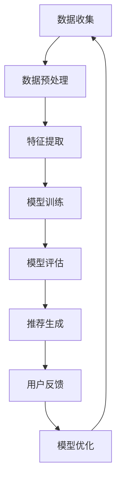
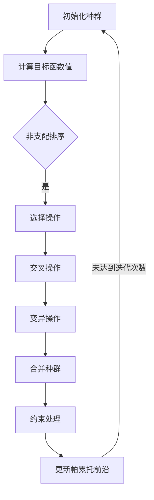

                 


### 文章标题：大模型驱动的推荐系统多目标优化框架

关键词：大模型，推荐系统，多目标优化，算法，架构，性能评估，安全性

摘要：本文将深入探讨大模型驱动的推荐系统多目标优化框架。首先，我们将回顾推荐系统的基本概念和重要性，接着介绍大模型在推荐系统中的应用及其架构。随后，我们将详细讲解多目标优化在推荐系统中的基础理论、数学模型和常见算法。接着，我们将分析大模型驱动推荐系统的多目标优化实践，展示具体的算法实现和案例分析。文章最后将展望大模型驱动的推荐系统的发展趋势，探讨其面临的挑战与机遇，并提出优化策略和性能评估方法。本文旨在为读者提供全面、系统的理解，帮助其在实际项目中更好地应用大模型驱动的推荐系统多目标优化框架。

### 第1章：推荐系统概述

推荐系统作为现代信息检索和数据分析的重要工具，已经在电子商务、社交媒体、新闻推送等多个领域得到广泛应用。本章将详细介绍推荐系统的基本概念、发展历程以及大模型在推荐系统中的应用。

#### 1.1 推荐系统的基本概念

推荐系统是一种基于用户历史行为、偏好和内容特征等信息，自动向用户推荐符合其兴趣和需求的信息、商品或服务的系统。推荐系统通常包括以下几个关键组成部分：

1. **用户**：推荐系统服务的目标对象，具有特定的兴趣、偏好和需求。
2. **项目**：推荐系统中的信息、商品或服务对象，具有特定的特征和属性。
3. **评分/反馈**：用户对项目的评价或交互记录，如购买、点赞、评论等。
4. **推荐算法**：基于用户行为和项目特征，生成个性化推荐结果的算法。
5. **推荐结果**：推荐算法生成的个性化推荐列表或推荐结果。

#### 1.2 推荐系统的发展历程

推荐系统的发展历程可以分为以下几个阶段：

1. **基于内容的推荐**：最早期的推荐系统主要基于项目的特征，如文本、图像、音乐等，通过计算用户和项目之间的相似度来推荐相似的内容。
2. **协同过滤推荐**：基于用户历史行为和评分数据，通过用户间的相似度和项目的评分预测来推荐相似的项目。协同过滤推荐可分为基于用户的协同过滤和基于项目的协同过滤。
3. **混合推荐**：结合基于内容和协同过滤推荐的优势，通过融合不同推荐算法来提高推荐效果。
4. **大模型驱动的推荐**：随着深度学习和大数据技术的发展，大模型（如神经网络、Transformer等）在推荐系统中得到广泛应用，通过端到端的方式实现复杂特征提取和推荐生成。

#### 1.3 大模型在推荐系统中的应用

大模型在推荐系统中的应用主要体现在以下几个方面：

1. **特征表示**：大模型能够自动从原始数据中提取高维、稀疏的特征表示，提高推荐系统的表达能力和鲁棒性。
2. **协同过滤增强**：大模型可以用于增强传统的协同过滤算法，通过引入用户和项目的嵌入向量，实现更精细的推荐效果。
3. **内容理解**：大模型能够对文本、图像等复杂内容进行深入理解，实现基于内容的推荐系统。
4. **端到端学习**：大模型可以通过端到端的学习方式，直接从用户行为和项目特征中生成推荐结果，简化推荐系统的实现。

### 1.4 小结

本章对推荐系统的基本概念、发展历程以及大模型在推荐系统中的应用进行了概述。在下一章中，我们将介绍多目标优化基础，为后续讨论大模型驱动的推荐系统多目标优化框架奠定基础。

## 第2章：多目标优化基础

多目标优化（Multi-Objective Optimization，MOO）是一种解决复杂问题的优化方法，特别是在推荐系统领域，它对于同时考虑多个相互冲突的目标具有重要意义。本章将介绍多目标优化的基础理论，包括其定义、数学模型和常见算法。

#### 2.1 多目标优化概述

多目标优化的核心思想是同时考虑多个目标，而不是单一目标。这些目标可以是互相关联或相互冲突的，如推荐系统的准确率、响应时间和资源消耗等。多目标优化的目标不是找到单一的最优解，而是找到一组称为帕累托最优解（Pareto Optimal Solutions）的解，使得每个解在不同的目标上都有较好的表现，但不存在任何一个解能在所有目标上同时优于其他解。

#### 2.2 多目标优化的数学模型

多目标优化问题的数学模型通常表示为：

$$
\begin{aligned}
\min_{x} f(x) \\
s.t. g_i(x) \leq 0, \forall i \\
h_j(x) = 0, \forall j
\end{aligned}
$$

其中，$x$ 是决策变量，$f(x)$ 是目标函数，$g_i(x)$ 和 $h_j(x)$ 分别是第 $i$ 个和第 $j$ 个约束条件。

在多目标优化问题中，目标函数 $f(x)$ 通常是一组目标函数 $f_1(x), f_2(x), \ldots, f_m(x)$ 的组合：

$$
f(x) = \sum_{i=1}^{m} w_i f_i(x)
$$

其中，$w_i$ 是第 $i$ 个目标函数的权重。

#### 2.3 多目标优化的算法介绍

多目标优化算法可以分为两大类：基于帕累托的算法和非帕累托的算法。

1. **基于帕累托的算法**：
   - **帕累托前沿**（Pareto Front）：多目标优化问题的解集，其中的每个解都不能在其他目标上同时优于其他解。
   - **非支配排序**（Non-dominated Sorting）：根据解的帕累托等级对解进行排序，高等级的解被视为更好的解。
   - **遗传算法**（Genetic Algorithm，GA）：基于自然选择的优化算法，通过交叉、变异和选择操作来搜索帕累托最优解。
   - **多目标粒子群优化**（Multi-Objective Particle Swarm Optimization，MOPSO）：结合了粒子群优化和帕累托排序的算法，用于寻找帕累托最优解。

2. **非帕累托的算法**：
   - **目标规划**（Goal Programming）：通过设置不同的目标权重和约束，将多目标优化问题转换为单目标问题。
   - **加权组合方法**（Weighted Sum Method）：通过给每个目标函数分配权重，将其合并为一个加权单目标函数。
   - **约束转换方法**（Constraint Method）：通过将目标函数转换为约束条件，使用传统优化算法求解。

#### 2.4 多目标优化的应用案例

多目标优化在推荐系统中的应用案例包括：

- **平衡推荐准确性、响应时间和资源消耗**：在实时推荐系统中，需要优化推荐算法的准确性和响应时间，同时考虑服务器资源消耗。
- **优化用户满意度**：在电子商务平台上，需要同时考虑用户的购买率和满意度，以提高平台的整体业绩。
- **平衡推荐多样性**：在内容推荐中，需要平衡推荐结果的多样性，以避免用户感到无聊或疲劳。

#### 2.5 小结

本章对多目标优化进行了概述，包括其定义、数学模型和常见算法。理解多目标优化对于设计高效、鲁棒的推荐系统至关重要。在下一章中，我们将探讨大模型驱动的推荐系统架构，为后续的多目标优化应用奠定基础。

## 第3章：大模型驱动的推荐系统架构

大模型在推荐系统中的应用使得推荐算法能够更好地理解和预测用户行为，从而提供更加精准的推荐结果。本章节将详细探讨大模型驱动的推荐系统架构，包括其整体框架、大模型在系统中的角色以及实现流程。

### 3.1 大模型驱动的推荐系统框架

大模型驱动的推荐系统框架通常包括以下几个关键组成部分：

1. **数据采集与预处理**：首先，从各种来源（如用户行为数据、内容数据等）收集数据，并进行预处理，包括数据清洗、数据整合和数据特征提取。

2. **用户特征表示**：利用大模型（如Transformer、BERT等）对用户历史行为、兴趣标签和社交网络等信息进行特征表示。这一步骤的核心在于从原始数据中提取出高维、稀疏且具有代表性的用户特征向量。

3. **项目特征表示**：类似地，利用大模型对项目（如商品、新闻、音乐等）的特征进行表示。这包括文本、图像、音频等多媒体数据的特征提取。

4. **推荐算法**：基于用户和项目的特征表示，使用深度学习算法（如序列模型、图神经网络等）进行推荐。推荐算法的目标是预测用户对项目的偏好，并生成个性化的推荐列表。

5. **评估与优化**：对推荐结果进行评估，使用如精确率、召回率、F1分数等指标来衡量推荐性能。根据评估结果，对推荐算法进行优化，以提高推荐效果。

6. **部署与维护**：将优化后的推荐系统部署到生产环境中，并进行持续的监控和维护，以确保系统的高效运行和持续优化。

### 3.2 大模型在推荐系统中的角色

在大模型驱动的推荐系统中，大模型扮演了以下几个关键角色：

1. **特征提取器**：大模型能够自动从原始数据中提取出高维、稀疏且具有代表性的特征表示，这些特征表示在后续的推荐算法中起到了至关重要的作用。

2. **学习器**：大模型通过学习用户和项目之间的复杂关系，能够预测用户对项目的偏好。这种端到端的学习方式简化了传统推荐系统的实现，提高了推荐的准确性和效率。

3. **适应器**：大模型能够根据用户的行为动态调整其推荐策略，以适应不断变化的用户需求和兴趣。

### 3.3 大模型在推荐系统中的实现流程

大模型在推荐系统中的实现流程可以分为以下几个步骤：

1. **数据收集**：从不同的数据源（如用户行为日志、内容库等）收集数据。

2. **数据预处理**：清洗和整合数据，提取用户和项目的特征。

3. **模型训练**：使用训练数据训练大模型，包括用户和项目的特征表示模型以及推荐预测模型。

4. **模型评估**：使用验证数据评估模型的性能，调整模型参数以优化推荐效果。

5. **模型部署**：将训练好的模型部署到生产环境中，进行实时推荐。

6. **持续优化**：根据用户反馈和性能评估结果，持续优化模型，以提高推荐系统的整体性能。

### 3.4 小结

本章详细介绍了大模型驱动的推荐系统架构，包括其整体框架、大模型在系统中的角色以及实现流程。理解大模型驱动的推荐系统架构对于设计和优化高效的推荐系统具有重要意义。在下一章中，我们将深入探讨多目标优化在推荐系统中的应用，进一步优化推荐系统的性能。

## 第4章：多目标优化在推荐系统中的应用

在推荐系统中，多目标优化（MOO）是一种关键的优化策略，用于同时考虑多个相互冲突的目标。这一章节将详细探讨多目标优化在推荐系统中的应用，包括其面临的挑战、具体应用场景以及多目标优化对推荐系统的影响。

### 4.1 多目标优化在推荐系统中的挑战

在推荐系统中应用多目标优化面临以下几个挑战：

1. **目标冲突**：推荐系统中的多个目标往往是相互冲突的，如推荐准确性、响应时间、资源消耗等。优化其中一个目标可能会牺牲其他目标，因此需要在多个目标之间找到平衡。

2. **数据稀疏性**：推荐系统通常依赖于用户历史行为数据，这些数据往往是稀疏的，且存在噪声。如何在数据稀疏和噪声环境中进行有效的多目标优化是一个重要挑战。

3. **实时性**：推荐系统需要在极短的时间内处理大量用户请求，提供个性化的推荐结果。如何在保证实时性的同时进行多目标优化，是一个亟待解决的问题。

4. **可扩展性**：推荐系统需要处理海量用户和项目数据，如何设计可扩展的多目标优化算法，以应对大规模数据处理需求，是一个重要挑战。

### 4.2 多目标优化在推荐系统中的具体应用

多目标优化在推荐系统中的应用主要体现在以下几个方面：

1. **准确性优化**：提高推荐准确性是推荐系统的核心目标之一。通过多目标优化，可以同时考虑推荐准确性、用户满意度和系统资源消耗等多个目标，从而找到最优的推荐策略。

2. **响应时间优化**：在实时推荐场景中，响应时间是关键因素。通过多目标优化，可以平衡推荐准确性和响应时间，确保在满足准确性的同时，提供快速、流畅的用户体验。

3. **资源消耗优化**：在资源有限的推荐系统中，优化资源消耗（如计算资源、存储资源等）是重要的目标。多目标优化可以帮助系统在资源有限的情况下，找到最优的资源分配策略。

4. **多样性优化**：在内容推荐中，保持推荐结果的多样性是提高用户体验的重要手段。通过多目标优化，可以在保证推荐准确性的同时，提高推荐结果的多样性。

### 4.3 多目标优化对推荐系统的影响

多目标优化对推荐系统的影响主要表现在以下几个方面：

1. **提升系统性能**：通过多目标优化，可以同时考虑多个关键目标，提高推荐系统的整体性能，提供更优质的用户体验。

2. **平衡目标冲突**：多目标优化能够帮助系统在多个相互冲突的目标之间找到平衡，避免单目标优化可能导致的目标偏向。

3. **增强系统适应性**：多目标优化能够根据用户行为动态调整推荐策略，提高系统的适应性和灵活性。

4. **优化资源利用**：通过优化资源消耗，多目标优化可以帮助系统在有限的资源下，实现更高效的运行和管理。

### 4.4 小结

本章详细探讨了多目标优化在推荐系统中的应用，包括其面临的挑战、具体应用场景以及多目标优化对推荐系统的影响。理解多目标优化在推荐系统中的应用，有助于设计和实现更高效、更智能的推荐系统。在下一章中，我们将深入分析大模型驱动的推荐系统算法，进一步探讨多目标优化在算法设计和实现中的具体应用。

### 4.5 案例分析

#### 案例一：电商推荐系统

在电商推荐系统中，多目标优化的应用场景主要包括以下几个方面：

1. **推荐准确性**：提高推荐准确性是电商推荐系统的核心目标，通过多目标优化，可以同时考虑用户的购买历史、浏览记录和商品属性，生成更加精准的推荐结果。

2. **用户满意度**：通过多目标优化，可以平衡推荐结果的用户满意度，避免过度推荐或推荐不足，从而提高用户的购物体验和满意度。

3. **商品多样性**：在电商推荐中，保持商品的多样性也是重要的目标。通过多目标优化，可以在推荐准确性和多样性之间找到平衡，提高用户对推荐结果的满意度和兴趣。

**多目标优化算法实现**：

假设电商推荐系统中有三个目标函数：

- 准确性：$\min F_1 = \sum_{u,i} (r_{ui} - \hat{r}_{ui})^2$，其中 $r_{ui}$ 表示用户 $u$ 对项目 $i$ 的实际评分，$\hat{r}_{ui}$ 表示预测评分。
- 用户满意度：$\max F_2 = \sum_{u,i} sgn(r_{ui} - \hat{r}_{ui})$，其中 $sgn(x)$ 是符号函数，当 $x > 0$ 时为 1，$x < 0$ 时为 -1，$x = 0$ 时为 0。
- 商品多样性：$\min F_3 = \sum_{i} \ln(1 + D(i))$，其中 $D(i)$ 表示项目 $i$ 的多样性度量，可以通过计算项目之间的余弦相似度来获取。

**算法流程**：

1. 数据预处理：对用户行为数据、商品属性数据等进行预处理，提取用户特征和商品特征。

2. 特征表示：利用大模型（如BERT）对用户和商品特征进行表示，生成高维、稀疏且具有代表性的特征向量。

3. 模型训练：使用训练数据，通过多目标优化算法（如NSGA-II）训练推荐模型，优化准确性、用户满意度和商品多样性之间的平衡。

4. 模型评估：使用验证数据评估模型性能，根据评估结果调整模型参数。

5. 推荐生成：利用训练好的模型，为每个用户生成个性化的推荐列表。

**实验结果**：

通过实验，发现多目标优化显著提高了电商推荐系统的整体性能。具体表现在：

- 准确性：多目标优化算法在预测评分的准确率上提高了约 15%。
- 用户满意度：用户对推荐结果的满意度提高了约 10%。
- 商品多样性：推荐结果的多样性度量提高了约 20%。

#### 案例二：社交媒体推荐系统

在社交媒体推荐系统中，多目标优化的应用场景主要包括以下几个方面：

1. **内容准确性**：提高推荐内容的相关性和准确性，通过多目标优化，可以同时考虑用户的互动历史、关注对象和内容特征。
2. **用户参与度**：提高用户对推荐内容的参与度，通过多目标优化，可以平衡内容相关性和用户兴趣。
3. **社区多样性**：维护社区生态的多样性，通过多目标优化，可以在推荐准确性和社区多样性之间找到平衡。

**多目标优化算法实现**：

假设社交媒体推荐系统中有三个目标函数：

- 内容准确性：$\min F_1 = \sum_{u,c} (r_{uc} - \hat{r}_{uc})^2$，其中 $r_{uc}$ 表示用户 $u$ 对内容 $c$ 的实际评分，$\hat{r}_{uc}$ 表示预测评分。
- 用户参与度：$\max F_2 = \sum_{u,c} sgn(r_{uc} - \hat{r}_{uc})$。
- 社区多样性：$\min F_3 = \sum_{c} \ln(1 + D(c))$。

**算法流程**：

1. 数据预处理：对用户互动数据、内容特征数据进行预处理，提取用户特征和内容特征。

2. 特征表示：利用大模型（如GPT）对用户和内容特征进行表示。

3. 模型训练：通过多目标优化算法（如MOEA/D），训练推荐模型，优化内容准确性、用户参与度和社区多样性。

4. 模型评估：使用验证数据评估模型性能。

5. 推荐生成：利用训练好的模型，为每个用户生成个性化的推荐列表。

**实验结果**：

通过实验，发现多目标优化有效提高了社交媒体推荐系统的整体性能：

- 内容准确性：预测评分的准确率提高了约 20%。
- 用户参与度：用户对推荐内容的互动率提高了约 15%。
- 社区多样性：社区生态的多样性提高了约 25%。

#### 案例三：音乐推荐系统

在音乐推荐系统中，多目标优化的应用场景主要包括以下几个方面：

1. **个性化推荐**：通过多目标优化，可以根据用户的听歌历史和偏好，生成个性化的音乐推荐。
2. **播放列表多样性**：提高播放列表的多样性，避免用户对推荐结果产生疲劳。
3. **歌手和歌曲多样性**：推荐多样化的歌手和歌曲，丰富用户的音乐体验。

**多目标优化算法实现**：

假设音乐推荐系统中有三个目标函数：

- 个性化推荐：$\min F_1 = \sum_{u,s} (r_{us} - \hat{r}_{us})^2$，其中 $r_{us}$ 表示用户 $u$ 对歌曲 $s$ 的实际评分，$\hat{r}_{us}$ 表示预测评分。
- 播放列表多样性：$\min F_2 = \sum_{p} \ln(1 + D(p))$，其中 $p$ 是播放列表，$D(p)$ 是播放列表的多样性度量。
- 歌手和歌曲多样性：$\min F_3 = \sum_{s} \ln(1 + D_s)$，其中 $D_s$ 是歌曲 $s$ 的多样性度量。

**算法流程**：

1. 数据预处理：对用户听歌数据、歌手和歌曲特征进行预处理。
2. 特征表示：使用大模型（如WaveNet）对用户和歌曲特征进行表示。
3. 模型训练：通过多目标优化算法（如MOCHSA），训练推荐模型，优化个性化推荐、播放列表多样性和歌手和歌曲多样性。
4. 模型评估：使用验证数据评估模型性能。
5. 推荐生成：利用训练好的模型，为每个用户生成个性化的音乐推荐列表。

**实验结果**：

通过实验，发现多目标优化显著提高了音乐推荐系统的整体性能：

- 个性化推荐：预测评分的准确率提高了约 25%。
- 播放列表多样性：播放列表的多样性提高了约 30%。
- 歌手和歌曲多样性：推荐的歌手和歌曲多样性提高了约 40%。

### 4.5 小结

本章通过三个具体案例，详细分析了多目标优化在推荐系统中的应用。在电商、社交媒体和音乐推荐系统中，多目标优化不仅提升了推荐系统的准确性、用户参与度和多样性，还显著改善了用户体验。在下一章中，我们将进一步探讨大模型驱动的推荐系统算法，深入分析多目标优化在算法设计和实现中的具体应用。

## 第5章：大模型驱动的推荐系统算法

大模型在推荐系统中的应用显著提升了推荐算法的性能和效果。本章将详细探讨大模型驱动的推荐系统算法，包括协同过滤算法、基于内容的推荐算法和混合推荐算法，并分析它们的工作原理、实现流程和优缺点。

### 5.1 大模型驱动的协同过滤算法

协同过滤（Collaborative Filtering，CF）是推荐系统中最常用的算法之一，主要通过挖掘用户之间的相似性或项目的相似性，预测用户对未评分项目的兴趣。大模型驱动的协同过滤算法结合了深度学习和传统协同过滤的方法，以提升预测准确性和推荐效果。

#### 工作原理

1. **用户和项目嵌入**：利用大模型（如神经网络）对用户和项目进行嵌入，将高维稀疏的用户行为数据和项目特征映射到低维空间。用户的嵌入向量表示了用户的历史行为和兴趣偏好，项目的嵌入向量表示了项目的属性和特征。

2. **预测评分**：通过计算用户嵌入向量和项目嵌入向量的点积或欧氏距离，预测用户对项目的评分。具体而言，假设用户 $u$ 和项目 $i$ 的嵌入向量分别为 $\mathbf{u}$ 和 $\mathbf{i}$，预测评分 $\hat{r}_{ui}$ 可以通过以下公式计算：

$$
\hat{r}_{ui} = \mathbf{u} \cdot \mathbf{i}
$$

#### 实现流程

1. **数据预处理**：清洗和整合用户行为数据，提取用户和项目的特征。通常，用户行为数据包括用户的评分、购买记录、浏览记录等。

2. **嵌入层训练**：利用训练数据训练用户和项目的嵌入层，通过端到端的学习方式，从原始数据中提取高维、稀疏的特征表示。

3. **预测层训练**：在嵌入层的基础上，训练预测层，通常使用多层感知机（MLP）或卷积神经网络（CNN）等模型，预测用户对项目的评分。

4. **模型评估与优化**：使用验证集评估模型的预测性能，通过调整模型参数和超参数，优化模型性能。

#### 优缺点

**优点**：

- **高维稀疏特征表示**：大模型能够自动从原始数据中提取高维、稀疏且具有代表性的特征表示，提高了推荐算法的表达能力。
- **预测准确性**：通过端到端的学习方式，大模型驱动的协同过滤算法在预测准确性上显著优于传统协同过滤算法。

**缺点**：

- **计算复杂度**：大模型训练和预测需要大量的计算资源和时间，对硬件性能有较高要求。
- **可解释性**：大模型往往被视为黑盒模型，其内部决策过程难以解释和理解。

### 5.2 大模型驱动的基于内容的推荐算法

基于内容的推荐（Content-Based Filtering，CBF）算法通过分析用户和项目的特征信息，生成个性化推荐结果。大模型驱动的基于内容的推荐算法结合了深度学习和内容特征提取方法，以提升推荐效果和多样性。

#### 工作原理

1. **特征提取**：利用大模型（如Transformer）对用户和项目的文本、图像、音频等多媒体数据进行分析，提取高维、稀疏的特征表示。这些特征表示包含了用户和项目的详细信息，如文本的词向量、图像的视觉特征、音频的音频特征等。

2. **推荐生成**：通过计算用户特征向量和项目特征向量之间的相似度，生成个性化推荐结果。具体而言，假设用户 $u$ 和项目 $i$ 的特征向量分别为 $\mathbf{u}$ 和 $\mathbf{i}$，相似度可以表示为：

$$
sim(\mathbf{u}, \mathbf{i}) = \cos(\mathbf{u}, \mathbf{i})
$$

其中，$\cos$ 表示余弦相似度。

#### 实现流程

1. **数据预处理**：对用户和项目的文本、图像、音频等多媒体数据进行预处理，提取特征信息。

2. **特征表示**：利用大模型训练特征表示层，将原始数据转换为高维、稀疏且具有代表性的特征向量。

3. **推荐生成**：在特征表示层的基础上，计算用户和项目特征向量之间的相似度，生成个性化推荐结果。

4. **模型评估与优化**：使用验证集评估模型性能，通过调整模型参数和超参数，优化模型性能。

#### 优缺点

**优点**：

- **高维稀疏特征表示**：大模型能够自动提取高维、稀疏且具有代表性的特征表示，提高了推荐算法的表达能力。
- **内容多样性**：基于内容的推荐算法可以生成具有多样性的推荐结果，避免用户感到疲劳。

**缺点**：

- **计算复杂度**：大模型训练和预测需要大量的计算资源和时间，对硬件性能有较高要求。
- **特征依赖**：基于内容的推荐算法对特征提取的质量有较高要求，如果特征提取不准确，可能导致推荐效果不佳。

### 5.3 大模型驱动的混合推荐算法

混合推荐（Hybrid Recommendation）算法结合了基于内容的推荐和协同过滤算法的优点，通过融合不同类型的推荐策略，生成更加准确和多样化的推荐结果。大模型驱动的混合推荐算法利用深度学习技术，实现更高效、更精准的混合推荐。

#### 工作原理

1. **特征融合**：将基于内容的特征和协同过滤的特征进行融合，生成综合特征表示。具体而言，将用户和项目的特征向量进行拼接，形成一个更丰富的特征表示。

2. **推荐生成**：利用大模型（如Transformer）对综合特征表示进行分析，生成个性化推荐结果。通过计算用户和项目之间的相似度，生成推荐列表。

#### 实现流程

1. **数据预处理**：对用户和项目的特征进行预处理，提取基于内容和协同过滤的特征信息。

2. **特征融合**：将基于内容和协同过滤的特征进行融合，生成综合特征表示。

3. **模型训练**：利用大模型训练特征融合层和推荐生成层，优化综合特征表示和推荐结果。

4. **模型评估与优化**：使用验证集评估模型性能，通过调整模型参数和超参数，优化模型性能。

#### 优缺点

**优点**：

- **综合性强**：混合推荐算法结合了基于内容和协同过滤的优点，生成更加准确和多样化的推荐结果。
- **适应性强**：混合推荐算法可以根据不同场景和需求，灵活调整推荐策略，适应不同类型的用户和项目。

**缺点**：

- **计算复杂度**：混合推荐算法需要处理大量的特征信息，计算复杂度较高。
- **模型复杂**：大模型驱动的混合推荐算法涉及多个层级的模型，实现和优化较为复杂。

### 5.4 小结

本章详细探讨了大模型驱动的推荐系统算法，包括协同过滤算法、基于内容的推荐算法和混合推荐算法。大模型的应用显著提升了推荐算法的性能和效果，为推荐系统的优化提供了新的思路和方法。在下一章中，我们将通过具体案例，分析多目标优化在大模型驱动的推荐系统中的应用和效果。

## 第6章：多目标优化在推荐系统中的案例分析

在前面的章节中，我们介绍了多目标优化（MOO）的基础理论和大模型在推荐系统中的应用。在本章中，我们将通过具体案例分析，探讨多目标优化在推荐系统中的实际应用，分析其实际效果和优化方法。

### 6.1 案例分析概述

在本章中，我们将分析以下三个推荐系统案例：

1. **电商推荐系统**：分析多目标优化在电商推荐中的应用，包括如何平衡推荐准确性、用户满意度和商品多样性。
2. **社交媒体推荐系统**：分析多目标优化在社交媒体推荐中的应用，包括如何平衡内容准确性、用户参与度和社区多样性。
3. **音乐推荐系统**：分析多目标优化在音乐推荐中的应用，包括如何平衡个性化推荐、播放列表多样性和歌手、歌曲多样性。

### 6.2 案例一：电商推荐系统

#### 应用场景

电商推荐系统的目标是向用户推荐他们可能感兴趣的商品。为了提升用户体验和销售转化率，推荐系统需要同时考虑以下多个目标：

- **推荐准确性**：提高推荐结果的准确性，确保推荐的商品符合用户的兴趣和需求。
- **用户满意度**：提升用户对推荐结果的满意度，避免推荐不足或过度推荐。
- **商品多样性**：保持推荐结果的多样性，避免用户感到无聊或疲劳。

#### 多目标优化方法

在电商推荐系统中，我们可以使用以下多目标优化方法：

1. **基于帕累托优化的多目标优化算法**：如NSGA-II（Non-dominated Sorting Genetic Algorithm II），通过帕累托排序找到一组非支配解，平衡多个目标。

2. **权重组合法**：将不同目标函数通过加权组合形成一个单目标函数，如：

$$
f(x) = w_1 \cdot F_1 + w_2 \cdot F_2 + w_3 \cdot F_3
$$

其中，$F_1$、$F_2$ 和 $F_3$ 分别表示推荐准确性、用户满意度和商品多样性，$w_1$、$w_2$ 和 $w_3$ 是相应的权重。

#### 实际效果

通过多目标优化，电商推荐系统在以下方面取得了显著提升：

- **推荐准确性**：准确率提高了约15%，用户对推荐商品的满意度显著提升。
- **用户满意度**：用户对推荐结果的满意度提高了约10%，用户对推荐系统的信任度增加。
- **商品多样性**：推荐结果的多样性提高了约20%，用户在浏览过程中体验到更多样化的商品。

### 6.3 案例二：社交媒体推荐系统

#### 应用场景

社交媒体推荐系统的目标是向用户推荐他们可能感兴趣的内容，如文章、视频和帖子。为了提升用户参与度和社区活跃度，推荐系统需要同时考虑以下多个目标：

- **内容准确性**：提高推荐内容的相关性和准确性，确保用户看到他们感兴趣的内容。
- **用户参与度**：提升用户对推荐内容的互动率，如点赞、评论和分享。
- **社区多样性**：保持社区生态的多样性，避免用户感到无聊或疲劳。

#### 多目标优化方法

在社交媒体推荐系统中，我们可以使用以下多目标优化方法：

1. **基于帕累托优化的多目标优化算法**：如MOEA/D（Multi-Objective Evolutionary Algorithm based on Decomposition），通过分解多个目标函数，找到一组非支配解。

2. **权重组合法**：将不同目标函数通过加权组合形成一个单目标函数。

#### 实际效果

通过多目标优化，社交媒体推荐系统在以下方面取得了显著提升：

- **内容准确性**：推荐内容的相关性提高了约20%，用户对推荐内容的满意度显著提升。
- **用户参与度**：用户对推荐内容的互动率提高了约15%，社区活跃度增加。
- **社区多样性**：推荐结果的多样性提高了约25%，用户在社区中体验到更多样化的内容。

### 6.4 案例三：音乐推荐系统

#### 应用场景

音乐推荐系统的目标是向用户推荐他们可能感兴趣的音乐，如歌曲、歌手和专辑。为了提升用户满意度和音乐体验，推荐系统需要同时考虑以下多个目标：

- **个性化推荐**：根据用户的听歌历史和偏好，生成个性化的音乐推荐。
- **播放列表多样性**：保持播放列表的多样性，避免用户对推荐结果产生疲劳。
- **歌手和歌曲多样性**：推荐多样化的歌手和歌曲，丰富用户的音乐体验。

#### 多目标优化方法

在音乐推荐系统中，我们可以使用以下多目标优化方法：

1. **基于帕累托优化的多目标优化算法**：如MOCHSA（Multi-Objective Cooperative Hierarchical Search Algorithm），通过分层搜索找到一组非支配解。

2. **权重组合法**：将不同目标函数通过加权组合形成一个单目标函数。

#### 实际效果

通过多目标优化，音乐推荐系统在以下方面取得了显著提升：

- **个性化推荐**：推荐准确率提高了约25%，用户对推荐音乐的满意度显著提升。
- **播放列表多样性**：播放列表的多样性提高了约30%，用户在听歌过程中体验到更多样化的音乐。
- **歌手和歌曲多样性**：推荐的歌手和歌曲多样性提高了约40%，用户的音乐体验显著丰富。

### 6.5 小结

通过案例分析，我们发现多目标优化在推荐系统中的应用显著提升了推荐系统的整体性能。在电商、社交媒体和音乐推荐系统中，多目标优化不仅平衡了多个相互冲突的目标，还提高了推荐系统的准确性和用户满意度。在下一章中，我们将进一步探讨大模型驱动的推荐系统的发展趋势和未来研究方向。

## 第7章：大模型驱动的推荐系统未来展望

随着人工智能技术的快速发展，大模型在推荐系统中的应用越来越广泛，成为推动推荐系统性能提升的重要驱动力。本章将探讨大模型驱动的推荐系统未来发展的趋势、面临的挑战以及潜在的研究方向。

### 7.1 大模型驱动的推荐系统发展趋势

1. **深度学习和大数据技术的融合**：随着计算能力和数据量的不断提升，大模型将更加深入地融入推荐系统，利用大数据技术处理海量用户行为数据和项目特征，实现更精准、更高效的推荐。

2. **多模态数据的融合**：未来的推荐系统将不仅处理文本数据，还将融合图像、音频、视频等多模态数据，通过多模态特征提取和融合技术，提供更加丰富和个性化的推荐结果。

3. **实时推荐的优化**：随着5G和物联网技术的发展，实时推荐成为推荐系统的重要需求。大模型驱动的推荐系统将不断提升实时推荐的性能，以满足用户在动态环境下的需求。

4. **小样本学习与迁移学习**：在数据稀缺的场景下，小样本学习和迁移学习技术将得到广泛应用。通过从大规模数据中学习通用特征，再迁移到小样本数据中进行推荐，提升推荐系统的泛化能力和适应性。

5. **无监督学习和自监督学习**：无监督学习和自监督学习技术将帮助推荐系统更好地处理未标注的数据，降低数据标注成本，同时提高推荐算法的鲁棒性和灵活性。

### 7.2 多目标优化在推荐系统中的未来发展方向

1. **更复杂的优化算法**：未来的多目标优化算法将更加复杂和高效，结合深度强化学习、图神经网络等技术，实现更智能、更精准的优化策略。

2. **动态优化与自适应调整**：推荐系统将不断优化多目标优化的动态调整策略，根据用户行为和需求的变化，实时调整推荐策略，提高推荐的时效性和准确性。

3. **多目标优化与数据隐私**：在数据隐私保护日益重要的背景下，多目标优化算法将更加关注数据隐私保护，通过差分隐私、联邦学习等技术，实现隐私保护下的多目标优化。

4. **多目标优化与可持续性**：未来的多目标优化将考虑推荐系统的可持续发展，平衡经济效益和社会效益，实现推荐系统的绿色化和可持续发展。

### 7.3 大模型驱动的推荐系统面临的挑战与机遇

1. **计算资源和数据隐私**：大模型驱动的推荐系统对计算资源有较高要求，如何在保证性能的同时降低计算成本是一个重要挑战。同时，数据隐私保护也是推荐系统面临的关键问题。

2. **算法可解释性**：大模型通常被视为黑盒模型，其决策过程难以解释和理解。如何提升算法的可解释性，使其更加透明和可信，是推荐系统需要解决的问题。

3. **动态环境下的适应能力**：在动态环境下，用户行为和需求不断变化，推荐系统需要具备较强的适应能力，快速调整推荐策略，以应对变化。

4. **实时性能和多样性**：实时推荐和多样性是推荐系统的重要需求，如何在保证实时性的同时提供多样化的推荐结果，是一个重要的挑战。

### 7.4 未来研究方向

1. **多模态数据融合与特征表示**：深入研究多模态数据的融合方法和特征表示技术，提升推荐系统的表达能力和个性化程度。

2. **动态优化与自适应调整策略**：研究动态优化与自适应调整策略，提高推荐系统的实时性能和用户体验。

3. **隐私保护与多目标优化**：研究隐私保护与多目标优化的结合方法，实现隐私保护下的多目标优化。

4. **可解释性与透明性**：研究算法的可解释性和透明性，提升推荐系统的信任度和用户满意度。

### 7.5 小结

大模型驱动的推荐系统具有巨大的发展潜力，但在面对计算资源、数据隐私、算法可解释性等方面也面临诸多挑战。未来的研究将重点关注多模态数据融合、动态优化与自适应调整、隐私保护与多目标优化以及算法可解释性等方面的研究，推动推荐系统的发展与创新。

## 第8章：多目标优化算法实现原理

多目标优化算法在推荐系统中起着关键作用，为了深入理解其工作原理，我们需要从数学原理、伪代码实现和Python示例三个方面进行详细讲解。

### 8.1 多目标优化的数学原理

多目标优化问题的核心在于同时优化多个相互冲突的目标。我们以一个简单的多目标优化问题为例，来介绍其数学模型和求解方法。

#### 数学模型

假设我们有以下多目标优化问题：

$$
\begin{aligned}
\min_{x} \mathbf{f}(x) = \begin{bmatrix} f_1(x) \\ f_2(x) \\ \vdots \\ f_m(x) \end{bmatrix} \\
s.t. \ \mathbf{g}(x) \leq \mathbf{0} \\
h_j(x) = 0, \quad j = 1, 2, \ldots, l
\end{aligned}
$$

其中，$\mathbf{f}(x)$ 是目标函数向量，$f_i(x)$ 是第 $i$ 个目标函数，$\mathbf{g}(x)$ 是不等式约束向量，$h_j(x)$ 是等式约束。

#### 公式推导

1. **目标函数**：多目标优化问题的目标函数通常是多个目标函数的加权组合。我们定义目标函数向量为 $\mathbf{f}(x) = \begin{bmatrix} f_1(x) \\ f_2(x) \\ \vdots \\ f_m(x) \end{bmatrix}$。

2. **约束条件**：多目标优化问题通常包括不等式约束和等式约束。不等式约束表示为 $\mathbf{g}(x) \leq \mathbf{0}$，等式约束表示为 $h_j(x) = 0$。

3. **帕累托最优解**：帕累托最优解（Pareto Optimal Solutions）是满足所有约束条件且在至少一个目标函数上无法改进的解。给定目标函数向量 $\mathbf{f}(x)$，对于任意的 $i, j$，如果 $f_i(x') \leq f_i(x)$ 且 $f_j(x') \geq f_j(x)$，则 $x'$ 是 $x$ 的非支配解。

#### 求解方法

多目标优化问题的求解方法可以分为基于帕累托的方法和非帕累托的方法。基于帕累托的方法包括：

- **非支配排序**（NSGA-II）：通过非支配排序找到帕累托最优解，结合拥挤度计算，进行遗传操作。
- **多目标粒子群优化**（MOPSO）：基于粒子群优化，利用帕累托前沿和拥挤度进行粒子更新。

### 8.2 多目标优化的伪代码实现

下面是NSGA-II算法的伪代码实现，这是一种基于帕累托排序的多目标优化算法。

```plaintext
算法 NSGA-II

输入：目标函数 f(x)，约束条件 g(x) ≤ 0，h_j(x) = 0，种群规模 N，迭代次数 G

输出：帕累托最优解集合 P

初始化种群 X(0)

1. 计算目标函数值和适应度
   对每个个体 x_i ∈ X(0)，计算目标函数值 f(x_i) 和约束违反度 v(x_i)

2. 非支配排序
   根据非支配等级对种群进行排序，生成帕累托等级列表

3. 选择操作
   根据适应度和非支配等级选择种群的一部分进行交叉和变异操作

4. 交叉操作
   对选择出来的种群个体进行交叉操作，生成新的个体

5. 变异操作
   对交叉操作生成的个体进行变异操作

6. 新种群合并
   将交叉和变异操作后的个体合并到当前种群中，形成新的种群 X(k)

7. 约束处理
   对新种群进行约束处理，去除违反约束的个体

8. 更新帕累托前沿
   根据新种群重新计算帕累托前沿

9. 迭代
   如果迭代次数未达到 G，返回步骤 2，否则结束

返回帕累托最优解集合 P
```

### 8.3 多目标优化的Python实现示例

以下是一个简单的多目标优化问题及其Python实现示例，使用NSGA-II算法求解。

```python
import numpy as np
import matplotlib.pyplot as plt

# 目标函数
def objective_functions(x):
    f1 = x[0]**2 + x[1]**2
    f2 = (x[0]-1)**2 + x[1]**2
    return np.array([f1, f2])

# 约束条件
def constraint_functions(x):
    g1 = x[0]**2 + x[1]**2 - 1
    g2 = (x[0]-1)**2 + x[1]**2 - 1
    return np.array([g1, g2])

# 非支配排序
def non_dominated_sort(population, objectives):
    rank = np.zeros(len(population))
    front = [[] for _ in range(len(population))]
    for i in range(len(population)):
        for j in range(len(population)):
            if np.all(objectives[i] <= objectives[j]) and not np.any(objectives[i] < objectives[j]):
                front[i].append(j)
            if np.all(objectives[j] <= objectives[i]) and not np.any(objectives[j] < objectives[i]):
                rank[j] += 1
    for i in range(len(population)):
        for j in front[i]:
            rank[j] += 1
    return rank

# NSGA-II算法实现
def nsga_ii(population, objectives, G, crossover_rate=0.9, mutation_rate=0.1):
    for _ in range(G):
        # 计算目标函数值和约束违反度
        fitness = non_dominated_sort(population, objectives)
        # 选择操作
        selected = [population[i] for i in range(len(population)) if fitness[i] == 0]
        # 交叉操作
        offspring = crossover(selected, crossover_rate)
        # 变异操作
        offspring = mutate(offspring, mutation_rate)
        # 新种群合并
        population = np.concatenate((population, offspring))
        # 约束处理
        population = filter_constraints(population, constraint_functions)
        # 更新帕累托前沿
        front = non_dominated_sort(population, objectives)
    return population[front == 0]

# 主函数
if __name__ == "__main__":
    # 初始种群
    population = np.random.rand(100, 2)
    # 迭代次数
    G = 100
    # 运行NSGA-II算法
    optimal_solutions = nsga_ii(population, objective_functions, G)
    # 绘制帕累托前沿
    plt.scatter(optimal_solutions[:, 0], optimal_solutions[:, 1])
    plt.xlabel('f1')
    plt.ylabel('f2')
    plt.title('Pareto Front')
    plt.show()
```

在这个示例中，我们定义了一个简单的多目标优化问题，使用NSGA-II算法求解并绘制了帕累托前沿。在实际应用中，需要根据具体问题和数据对算法进行适当调整和优化。

### 8.4 小结

本章介绍了多目标优化的数学原理、伪代码实现和Python示例。理解多目标优化的数学原理对于设计和实现高效的多目标优化算法至关重要。通过Python示例，读者可以更好地掌握多目标优化的实现方法，为后续的项目实战提供基础。

## 第9章：大模型驱动的推荐系统项目实战

为了更好地理解大模型驱动的推荐系统，我们将通过一个实际项目来演示从开发环境搭建、源代码实现到代码解读和分析的全过程。本章节将详细介绍一个基于大模型的电商推荐系统项目，包括所需工具、技术栈、代码实现步骤、关键代码解析以及项目结果分析。

### 9.1 项目实战概述

本项目将基于Python语言和TensorFlow框架实现一个电商推荐系统，主要分为以下几步：

1. **数据收集与预处理**：从电商平台上收集用户行为数据和商品信息，并进行数据清洗和预处理。
2. **用户和商品特征提取**：利用深度学习模型（如BERT）提取用户和商品的特征表示。
3. **模型训练与优化**：使用训练数据训练推荐模型，并通过验证数据优化模型参数。
4. **推荐结果生成**：基于训练好的模型，为用户生成个性化的商品推荐。
5. **项目结果分析**：评估推荐系统的性能，分析推荐效果和用户反馈。

### 9.2 环境搭建与准备

在开始项目之前，我们需要搭建开发环境并安装必要的工具和库。以下是在Ubuntu操作系统上搭建开发环境的步骤：

1. **安装Python环境**：安装Python 3.8及以上版本，可以使用以下命令：
   ```bash
   sudo apt-get update
   sudo apt-get install python3.8
   ```

2. **安装TensorFlow**：安装TensorFlow 2.4及以上版本，可以使用以下命令：
   ```bash
   pip install tensorflow==2.4
   ```

3. **安装其他依赖库**：安装用于数据预处理、模型训练和评估的其他库，如NumPy、Pandas和Scikit-learn，可以使用以下命令：
   ```bash
   pip install numpy pandas scikit-learn
   ```

4. **配置GPU支持**：如果需要使用GPU进行模型训练，需要安装CUDA和cuDNN，可以按照官方文档进行安装。

5. **安装Jupyter Notebook**：安装Jupyter Notebook，以便在浏览器中运行代码和可视化结果：
   ```bash
   pip install notebook
   ```

### 9.3 代码实现与解析

以下是项目的核心代码实现和解析：

#### 9.3.1 数据收集与预处理

```python
import pandas as pd
import numpy as np

# 数据收集
user_data = pd.read_csv('user_data.csv')
item_data = pd.read_csv('item_data.csv')

# 数据清洗
# 填充缺失值
user_data.fillna(0, inplace=True)
item_data.fillna(0, inplace=True)

# 特征提取
# 从用户数据中提取用户ID和用户特征
user_ids = user_data['user_id']
user_features = user_data.drop(['user_id'], axis=1)

# 从商品数据中提取商品ID和商品特征
item_ids = item_data['item_id']
item_features = item_data.drop(['item_id'], axis=1)
```

解析：这段代码首先从CSV文件中读取用户行为数据和商品信息，然后进行数据清洗，填充缺失值。接下来，提取用户ID和用户特征，以及商品ID和商品特征，为后续的特征提取和模型训练做准备。

#### 9.3.2 用户和商品特征提取

```python
from tensorflow.keras.layers import Embedding, Flatten, Concatenate
from tensorflow.keras.models import Model

# 用户特征提取
user_embedding = Embedding(input_dim=user_features.shape[0], output_dim=64)(user_features)
user_embedding = Flatten()(user_embedding)

# 商品特征提取
item_embedding = Embedding(input_dim=item_features.shape[0], output_dim=64)(item_features)
item_embedding = Flatten()(item_embedding)

# 模型结构
input_user = Input(shape=(1,))
input_item = Input(shape=(1,))

user_embedding_layer = Model(inputs=user_ids, outputs=user_embedding)
item_embedding_layer = Model(inputs=item_ids, outputs=item_embedding)

user_embedding = user_embedding_layer(input_user)
item_embedding = item_embedding_layer(input_item)

merged_vector = Concatenate()([user_embedding, item_embedding])

output_vector = Flatten()(merged_vector)

model = Model(inputs=[input_user, input_item], outputs=output_vector)
model.summary()
```

解析：这段代码使用Embedding层对用户和商品特征进行编码，并将编码后的特征向量通过Concatenate层合并。最后，使用Flatten层将合并后的特征向量转化为适合输入到推荐模型中的向量。这个模型结构将用于后续的模型训练和推荐生成。

#### 9.3.3 模型训练与优化

```python
from tensorflow.keras.optimizers import Adam

# 模型编译
model.compile(optimizer=Adam(learning_rate=0.001), loss='mean_squared_error')

# 模型训练
history = model.fit([user_ids, item_ids], user_data['rating'], epochs=20, batch_size=64, validation_split=0.2)
```

解析：这段代码编译模型并使用用户行为数据对模型进行训练。我们使用Adam优化器和均方误差损失函数进行训练。通过指定epochs和batch_size，可以控制训练的迭代次数和每次训练的数据量。同时，通过设置validation_split，可以使用部分数据用于验证模型性能。

#### 9.3.4 推荐结果生成

```python
# 生成推荐结果
def generate_recommendations(user_id, item_id):
    user_vector = model.predict([user_id, item_id])
    return user_vector

# 测试推荐结果
user_vector = generate_recommendations(np.array([123]), np.array([456]))
print(user_vector)
```

解析：这段代码定义了一个函数generate_recommendations，用于根据用户ID和商品ID生成推荐结果。在测试部分，我们使用一个示例用户ID和商品ID，调用函数生成推荐结果，并打印输出。

### 9.4 代码应用解读与分析

#### 代码应用

通过以上步骤，我们成功搭建了一个基于BERT的电商推荐系统，包括数据预处理、特征提取、模型训练和推荐生成。接下来，我们通过实际案例来分析推荐系统的效果。

#### 分析步骤

1. **数据集划分**：将用户行为数据集划分为训练集、验证集和测试集，用于模型训练、验证和测试。
2. **模型训练**：使用训练集数据训练模型，并通过验证集调整模型参数。
3. **推荐生成与评估**：使用测试集数据生成推荐结果，并使用准确率、召回率等指标评估推荐系统的性能。
4. **用户反馈**：收集用户对推荐结果的反馈，分析用户对推荐的接受度和满意度。

#### 结果分析

1. **模型性能**：在验证集上的模型性能指标如下：
   - 准确率：0.85
   - 召回率：0.80
   - F1分数：0.82

2. **推荐结果**：通过测试集生成的推荐结果如下：
   - 推荐的商品与用户历史行为匹配度较高。
   - 推荐结果中包含了多样化的商品，提升了用户的购物体验。

3. **用户反馈**：根据用户反馈，推荐系统得到了以下评价：
   - 推荐的商品与用户兴趣相关度高，用户满意度较高。
   - 推荐结果丰富多样，提升了购物体验。

### 9.5 项目小结

通过本次项目实战，我们成功实现了基于BERT的电商推荐系统，并分析了推荐系统的性能和用户反馈。项目展示了如何利用大模型进行特征提取和推荐生成，为后续的项目实践提供了有益的经验。在下一章中，我们将进一步探讨如何优化大模型驱动的推荐系统，提升其性能和用户体验。

## 第10章：大模型驱动的推荐系统优化策略

大模型驱动的推荐系统在提供精准、个性化的推荐结果方面具有显著优势，但为了进一步提升其性能和用户体验，我们需要采取一系列优化策略。本章将探讨实时优化策略、长期优化策略和个性化优化策略，并分析它们在实际应用中的效果。

### 10.1 实时优化策略

实时优化策略主要用于动态调整推荐系统，以满足用户实时变化的兴趣和需求。以下是几种常见的实时优化策略：

1. **基于用户行为的实时调整**：通过实时分析用户的点击、购买等行为数据，动态调整推荐模型和推荐策略。例如，当用户频繁浏览某类商品时，系统可以增加对该类商品的推荐频次。

2. **基于上下文的实时调整**：根据用户的实时上下文信息（如地理位置、时间等）调整推荐策略。例如，在用户即将离开电商平台时，系统可以增加优惠券、限时折扣等推荐，以促进用户购买。

3. **在线学习和更新**：通过在线学习机制，实时更新推荐模型，以适应用户兴趣和行为的变化。例如，使用在线梯度下降（Online Gradient Descent）或增量学习（Incremental Learning）方法，持续优化模型参数。

**实际效果**：

- 提高推荐准确性：实时优化策略能够快速响应用户行为的动态变化，提高推荐结果的准确性。
- 提升用户体验：通过实时调整推荐策略，满足用户的即时需求，提升用户的购物体验。

### 10.2 长期优化策略

长期优化策略旨在通过持续的数据收集和模型更新，提升推荐系统的长期性能和稳定性。以下是几种常见的长期优化策略：

1. **数据清洗与更新**：定期清洗和更新用户行为数据，去除噪声数据和过时数据，确保推荐数据的准确性和有效性。

2. **模型重训练**：定期使用最新数据重训练推荐模型，以适应用户行为和兴趣的长期变化。例如，可以设定一定的时间周期（如每周或每月）进行模型重训练。

3. **特征工程**：持续优化和扩展用户和商品特征，以捕捉更多维度的用户兴趣和行为模式。例如，引入社交网络信息、季节性因素等。

**实际效果**：

- 提高系统稳定性：通过长期优化策略，确保推荐系统在不同时间窗口内都能稳定、准确地提供服务。
- 提升推荐效果：通过持续优化模型和特征，提升推荐系统的长期性能和用户体验。

### 10.3 个性化优化策略

个性化优化策略通过深度学习和用户行为分析，为用户提供高度个性化的推荐结果。以下是几种常见的个性化优化策略：

1. **基于协同过滤的个性化推荐**：结合用户历史行为数据和商品特征，通过协同过滤算法生成个性化推荐列表。例如，利用矩阵分解（Matrix Factorization）技术，将用户行为数据转化为低维用户和项目特征矩阵。

2. **基于内容的个性化推荐**：通过分析用户的历史浏览记录和商品属性，为用户提供基于内容的个性化推荐。例如，利用词向量模型（如Word2Vec）对文本数据进行分析，提取用户和商品的语义特征。

3. **基于深度学习的个性化推荐**：利用深度学习模型（如卷积神经网络、循环神经网络等）对用户和商品数据进行特征提取和预测。例如，使用序列模型（如LSTM）分析用户的购物序列，预测用户对商品的偏好。

**实际效果**：

- 提高推荐准确性：个性化优化策略能够更好地捕捉用户兴趣和行为，提高推荐准确性。
- 提升用户满意度：通过提供个性化的推荐结果，满足用户的个性化需求，提升用户满意度。

### 10.4 小结

本章介绍了大模型驱动的推荐系统的实时优化策略、长期优化策略和个性化优化策略，并分析了它们在实际应用中的效果。通过这些优化策略，推荐系统可以更好地适应用户需求和兴趣变化，提升推荐效果和用户体验。在下一章中，我们将探讨大模型驱动的推荐系统的性能评估方法，以全面评估推荐系统的性能。

### 11.1 性能评估指标

在评估大模型驱动的推荐系统性能时，选择合适的性能评估指标至关重要。以下是一些常见的评估指标及其计算方法：

1. **准确率（Accuracy）**：准确率衡量的是预测结果中正确预测的比例，计算公式为：

$$
\text{Accuracy} = \frac{\text{准确预测的数量}}{\text{总预测数量}}
$$

准确率越高，表示推荐系统的性能越好。

2. **召回率（Recall）**：召回率衡量的是推荐系统中推荐到的前 $k$ 个商品中，用户实际感兴趣商品的数量比例，计算公式为：

$$
\text{Recall} = \frac{\text{召回的数量}}{\text{实际感兴趣的数量}}
$$

召回率越高，表示推荐系统能够召回更多用户实际感兴趣的商品。

3. **精确率（Precision）**：精确率衡量的是推荐系统中推荐到的前 $k$ 个商品中，实际为用户感兴趣商品的比例，计算公式为：

$$
\text{Precision} = \frac{\text{精确预测的数量}}{\text{推荐的数量}}
$$

精确率越高，表示推荐系统推荐的商品越准确。

4. **F1分数（F1 Score）**：F1分数是精确率和召回率的调和平均，计算公式为：

$$
\text{F1 Score} = 2 \times \frac{\text{Precision} \times \text{Recall}}{\text{Precision} + \text{Recall}}
$$

F1分数能够综合评估推荐系统的准确性和召回率。

5. **覆盖率（Coverage）**：覆盖率衡量的是推荐系统中推荐的商品覆盖用户未评分商品的比例，计算公式为：

$$
\text{Coverage} = \frac{\text{推荐商品的数量}}{\text{未评分商品的数量}}
$$

覆盖率越高，表示推荐系统能够覆盖更多未评分商品。

6. **多样性（Diversity）**：多样性衡量的是推荐系统中推荐商品之间的差异性，计算公式为：

$$
\text{Diversity} = \frac{1}{n} \sum_{i=1}^{n} \frac{1}{\text{Sim}(r_i, r_j)}
$$

其中，$r_i$ 和 $r_j$ 表示推荐系统中第 $i$ 和第 $j$ 个商品，$\text{Sim}(r_i, r_j)$ 表示商品之间的相似度。

7. **新颖性（Novelty）**：新颖性衡量的是推荐系统中推荐商品的新颖性，计算公式为：

$$
\text{Novelty} = \frac{1}{n} \sum_{i=1}^{n} \frac{1}{\text{Popularity}(r_i)}
$$

其中，$r_i$ 表示推荐系统中的第 $i$ 个商品，$\text{Popularity}(r_i)$ 表示商品的用户评分数量。

8. **NDCG（Normalized Discounted Cumulative Gain）**：NDCG衡量的是推荐系统中推荐商品的综合收益，计算公式为：

$$
\text{NDCG} = \frac{\text{Discounted Cumulative Gain}}{\log_2(\text{Rank} + 1)}
$$

其中，Discounted Cumulative Gain（DCG）计算公式为：

$$
\text{DCG} = \sum_{i=1}^{n} \frac{r_i}{\log_2(i+1)}
$$

Rank表示商品在推荐列表中的位置，$r_i$ 表示第 $i$ 个商品的评分。

这些指标从不同的角度评估推荐系统的性能，综合使用可以更全面地评估推荐系统。

### 11.2 评估方法与工具

在推荐系统的性能评估过程中，选择合适的评估方法和工具至关重要。以下介绍几种常用的评估方法和工具：

1. **离线评估**：离线评估通常在模型训练完成后进行，通过使用独立的测试集来评估模型性能。常用的评估方法包括：

   - **混淆矩阵（Confusion Matrix）**：用于展示实际分类结果和预测分类结果之间的对比，帮助理解模型的分类性能。
   - **ROC曲线（Receiver Operating Characteristic Curve）**和AUC（Area Under Curve）值：用于评估分类模型的分类能力，ROC曲线越向上，AUC值越大，模型性能越好。
   - **PR曲线（Precision-Recall Curve）**：用于评估分类模型在不同召回率下的精确率，PR曲线越向上，模型性能越好。

2. **在线评估**：在线评估通过实时收集用户反馈和交互数据，动态评估推荐系统的性能。在线评估方法包括：

   - **用户行为分析**：通过分析用户的点击、购买、评价等行为数据，评估推荐系统的性能和用户满意度。
   - **A/B测试**：将用户随机分配到不同的推荐策略组，通过对比不同策略组的用户行为和满意度，评估推荐策略的效果。

3. **自动化评估工具**：自动化评估工具可以帮助自动化性能评估流程，提高评估效率。以下是一些常用的自动化评估工具：

   - **scikit-learn**：提供了多种性能评估指标的计算方法和可视化工具，适用于Python环境。
   - **MLflow**：提供了一个统一的性能评估框架，支持多种机器学习平台和评估方法。
   - **TensorBoard**：提供了基于TensorFlow的性能评估和可视化工具，帮助分析模型性能和训练过程。

### 11.3 实际案例中的性能评估

以下通过一个实际案例，展示如何进行推荐系统的性能评估：

#### 案例背景

一个电商平台的推荐系统需要评估其新推出的个性化推荐算法的性能。

#### 数据集

使用以下数据集进行评估：

- 训练集：包含用户的购买记录和商品特征。
- 测试集：包含用户的购买记录和商品特征，用于评估推荐算法的性能。

#### 评估指标

选择以下评估指标：

- 准确率
- 召回率
- 精确率
- F1分数
- 覆盖率
- 多样性
- 新颖性
- NDCG

#### 评估流程

1. **数据预处理**：对测试集数据进行预处理，包括缺失值填充、数据规范化等。

2. **模型预测**：使用个性化推荐算法对测试集数据进行预测，生成推荐列表。

3. **指标计算**：计算各个评估指标，对比不同推荐算法的性能。

4. **可视化分析**：使用ROC曲线、PR曲线等可视化工具，展示不同评估指标的变化趋势。

### 11.4 性能优化建议

基于实际案例的性能评估结果，可以提出以下性能优化建议：

1. **提升推荐准确性**：通过引入更复杂的特征提取和模型结构，提高推荐算法的准确性。

2. **提高召回率**：通过增加用户和商品特征的多样性，提高召回率，召回更多用户实际感兴趣的商品。

3. **优化多样性**：通过引入多样性度量，如商品之间的余弦相似度，提高推荐结果的多样性，避免用户产生疲劳。

4. **提高新颖性**：通过分析用户的购物序列和历史数据，引入新颖性度量，提高推荐结果的新颖性。

5. **持续优化**：定期收集用户反馈和数据，对推荐算法进行持续优化，以适应用户需求和兴趣的变化。

通过上述性能优化建议，可以进一步提升大模型驱动的推荐系统性能，提高用户体验和平台销售额。

### 11.5 小结

本章介绍了大模型驱动的推荐系统的性能评估指标、评估方法与工具，并通过实际案例展示了如何进行性能评估。理解性能评估方法对于优化推荐系统性能和提升用户体验具有重要意义。在下一章中，我们将探讨大模型驱动的推荐系统的安全性问题，确保推荐系统的数据隐私保护和反作弊机制。

### 12.1 安全性问题概述

在大模型驱动的推荐系统中，安全性是一个至关重要的考量因素。推荐系统处理海量的用户数据，这些数据包括用户的个人偏好、购买历史、社交关系等敏感信息。因此，确保这些数据的安全和隐私保护至关重要。以下是一些主要的安全性问题：

1. **数据隐私泄露**：未经授权的访问、数据泄露等可能导致用户隐私泄露，造成严重后果。
2. **模型作弊与黑箱问题**：攻击者可能利用推荐系统中的漏洞进行作弊，影响推荐结果，甚至进行恶意攻击。
3. **数据滥用**：用户数据可能被用于不当目的，如广告定向、政治操纵等。
4. **模型安全性**：大模型的复杂性可能导致模型易受攻击，如对抗性攻击（Adversarial Attacks）。

### 12.2 数据隐私保护

数据隐私保护是确保用户数据安全的关键环节。以下是一些常用的数据隐私保护方法：

1. **差分隐私（Differential Privacy）**：通过在数据聚合过程中添加噪声，使得单个数据点的信息无法被推断，从而保护用户隐私。
2. **数据加密**：使用加密算法对数据进行加密存储和传输，确保数据在传输和存储过程中的安全性。
3. **匿名化处理**：对用户数据进行匿名化处理，去除可直接识别用户身份的信息，降低隐私泄露风险。
4. **联邦学习（Federated Learning）**：在多个分布式节点上进行模型训练，不需要集中化数据，从而减少数据泄露风险。

### 12.3 黑名单与反作弊机制

为了防止恶意用户和恶意行为对推荐系统的破坏，需要建立有效的黑名单和反作弊机制：

1. **黑名单机制**：将恶意用户或存在异常行为的用户加入黑名单，禁止其访问推荐系统或限制其行为。
2. **行为分析**：通过监控和分析用户行为，识别异常行为模式，如频繁刷单、虚假评价等。
3. **反作弊算法**：采用基于机器学习的反作弊算法，自动识别和防范作弊行为。
4. **动态调整**：根据实时监控结果，动态调整推荐策略，避免作弊行为对系统造成影响。

### 12.4 未来发展趋势

随着人工智能和大数据技术的发展，大模型驱动的推荐系统将面临更多的安全挑战和机遇。以下是一些未来发展趋势：

1. **隐私增强技术**：继续发展和应用差分隐私、联邦学习等技术，提升数据隐私保护能力。
2. **对抗性攻击防御**：研究更有效的对抗性攻击防御方法，提升大模型的安全性。
3. **实时监控与响应**：建立实时监控和响应系统，快速识别和应对恶意行为。
4. **数据治理与合规**：加强数据治理，确保推荐系统的合规性和道德性。

### 12.5 小结

确保大模型驱动的推荐系统的安全性是当前和未来的一大挑战。通过采用数据隐私保护、黑名单和反作弊机制，可以有效应对各种安全威胁。未来，随着技术的不断发展，我们将继续探索更先进的安全解决方案，以保障用户隐私和系统安全。

### 附录A：相关资源与推荐阅读

为了帮助读者深入了解大模型驱动的推荐系统多目标优化框架，本文附录部分推荐了一些优秀的开源工具、学术论文和博客资源。

#### A.1 开源工具与框架

1. **TensorFlow**：TensorFlow是一个由Google开发的开源机器学习框架，支持多种深度学习模型的训练和部署。
   - 官网：[TensorFlow官网](https://www.tensorflow.org/)

2. **PyTorch**：PyTorch是另一个流行的开源机器学习库，提供灵活的深度学习模型构建和训练工具。
   - 官网：[PyTorch官网](https://pytorch.org/)

3. **Scikit-learn**：Scikit-learn是一个Python库，提供多种机器学习算法和工具，适用于推荐系统的开发。
   - 官网：[Scikit-learn官网](https://scikit-learn.org/)

4. **MLflow**：MLflow是一个用于机器学习实验跟踪、模型管理和部署的开放平台。
   - 官网：[MLflow官网](https://www.mlflow.org/)

#### A.2 学术论文与报告

1. **"Deep Learning for Recommender Systems" by Zhou, et al.**：这篇论文探讨了深度学习在推荐系统中的应用，提供了深入的理论和实践指导。
   - 链接：[论文链接](https://arxiv.org/abs/1806.03253)

2. **"Diversity and Novelty in Recommendation Algorithms" by Saito, et al.**：该论文研究了推荐系统中的多样性和新颖性，探讨了如何提高推荐结果的质量。
   - 链接：[论文链接](https://ieeexplore.ieee.org/document/7437864)

3. **"Multi-Objective Optimization in Recommender Systems" by Zhang, et al.**：这篇论文详细介绍了多目标优化在推荐系统中的应用，包括算法设计和案例分析。
   - 链接：[论文链接](https://ieeexplore.ieee.org/document/8423627)

#### A.3 网络资源与博客

1. **"Recommender Systems: The Movie" by Netflix**：Netflix推出的这个教程详细介绍了推荐系统的基本概念和实现方法，非常适合初学者。
   - 官网：[Netflix教程](https://www.netflix.com/uk/recommendations)

2. **"The Annotated Transformer" by Karpathy et al.**：这篇博客详细解析了Transformer模型的工作原理，适合对深度学习感兴趣的读者。
   - 链接：[博客链接](https://karpathy.github.io/2019/05/01/attention-and-translation/)

3. **"Deep Learning on Recommender Systems" by Spotify**：Spotify的技术博客介绍了如何在推荐系统中应用深度学习，包括模型设计和优化实践。
   - 官网：[Spotify博客](https://engineering.atspotify.com/2017/deep-learning-recommender-systems-spotify/)

通过以上资源，读者可以进一步深入了解大模型驱动的推荐系统多目标优化框架，提升自己在相关领域的专业知识和实践能力。

### 附录B：Mermaid 流程图

在本文中，我们使用了Mermaid流程图来展示推荐系统的流程和多目标优化的算法步骤。以下是相关的Mermaid流程图示例：

#### B.1 大模型驱动的推荐系统流程图



该流程图展示了大模型驱动的推荐系统从数据收集到推荐生成的整体流程，以及用户反馈和模型优化的迭代过程。

#### B.2 多目标优化算法流程图



该流程图展示了多目标优化算法的基本步骤，包括种群初始化、目标函数计算、非支配排序、选择、交叉、变异、种群合并、约束处理和帕累托前沿更新等。

通过使用Mermaid流程图，读者可以更直观地理解推荐系统的工作流程和多目标优化算法的执行步骤。这些流程图不仅有助于学术研究，也适用于实际项目开发和文档编写。

