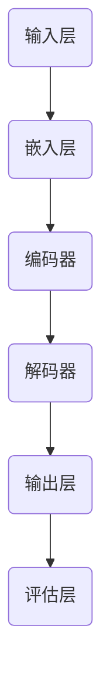

                 

### 文章标题

《大模型驱动的推荐系统多目标平衡框架》

### 关键词

- 推荐系统
- 大模型
- 多目标优化
- 多目标平衡
- 深度学习

### 摘要

本文围绕大模型驱动的推荐系统多目标平衡框架展开，首先介绍了推荐系统的背景和现状，以及大模型在其中的应用。接着，深入探讨了多目标平衡的概念和重要性。随后，本文详细阐述了大模型的基础知识，包括发展历程、结构以及训练技术。在此基础上，介绍了多目标优化及其在实际中的应用。本文重点探讨了如何在推荐系统中利用大模型实现多目标平衡，并详细讲解了多目标平衡算法在大模型中的实现方法。通过项目实战和案例分析，本文展示了多目标平衡在推荐系统中的具体应用和效果评估。最后，对大模型推荐系统的未来发展趋势和面临的挑战进行了展望。

### 《大模型驱动的推荐系统多目标平衡框架》目录大纲

#### 第一部分：引言

**第1章：大模型推荐系统概述**

- **1.1 推荐系统背景与市场现状**
- **1.2 大模型在推荐系统中的应用**
- **1.3 多目标平衡概念及其重要性**

**第2章：大模型基础**

- **2.1 大模型的发展历程**
- **2.2 大模型结构**
- **2.3 大模型训练技术**

**第3章：多目标优化基础**

- **3.1 多目标优化定义**
- **3.2 多目标优化算法**
- **3.3 多目标优化在实际中的应用**

**第4章：大模型在多目标平衡中的应用**

- **4.1 多目标平衡在大模型推荐系统中的意义**
- **4.2 大模型多目标平衡方法**
- **4.3 多目标平衡算法在大模型中的实现**

**第二部分：大模型基础**

**第1章：大模型推荐系统概述**

在当今信息爆炸的时代，用户面对的海量信息让他们难以抉择。推荐系统作为一种智能信息过滤和检索技术，应运而生。它通过分析用户的兴趣和行为，向用户推荐他们可能感兴趣的内容，从而提高用户满意度，增强用户粘性，提升业务收益。

#### 1.1 推荐系统背景与市场现状

推荐系统最早可以追溯到20世纪90年代的电子商务领域。随着互联网的普及和大数据技术的崛起，推荐系统逐渐成为各个领域的关键技术之一。目前，推荐系统在电子商务、社交媒体、新闻推送、在线教育等多个领域得到了广泛应用，并取得了显著的商业价值。

根据市场研究公司的数据，全球推荐系统市场规模预计将从2021年的160亿美元增长到2026年的350亿美元，年复合增长率达到17.6%。其中，电子商务和社交媒体是推荐系统应用最为广泛的领域。此外，随着5G、物联网和人工智能等新兴技术的发展，推荐系统的应用场景将进一步拓展，市场前景广阔。

#### 1.2 大模型在推荐系统中的应用

大模型，尤其是深度学习模型，在推荐系统中发挥着越来越重要的作用。传统推荐系统主要依赖于基于内容的过滤、协同过滤等方法，这些方法在处理用户行为数据和内容信息时存在一定的局限性。而大模型，特别是基于Transformer架构的预训练模型，具有强大的表征能力和泛化能力，可以更好地理解和预测用户的兴趣和行为。

大模型在推荐系统中的应用主要体现在以下几个方面：

1. **用户兴趣表征**：通过预训练模型对用户的历史行为和内容数据进行嵌入，生成高维度的用户兴趣表征，为推荐算法提供强有力的基础。

2. **内容表征**：同样，通过预训练模型对内容数据进行嵌入，生成内容表征，用于计算用户与内容之间的相似度，从而进行推荐。

3. **多模态融合**：推荐系统不仅处理文本数据，还涉及图像、音频、视频等多模态数据。大模型可以通过多模态融合技术，更好地理解用户和内容的多样性，提升推荐效果。

4. **长文本理解**：对于长文本内容，如新闻文章、论文等，大模型可以捕捉文本中的深层语义信息，从而进行更准确的推荐。

5. **序列预测**：大模型可以处理用户的序列行为数据，如点击、浏览、购买等，通过序列模型预测用户未来的行为，进行个性化的推荐。

#### 1.3 多目标平衡概念及其重要性

在推荐系统中，目标往往不是单一的，而是多个相互冲突的目标。例如，系统需要同时考虑用户的满意度、推荐的质量和商家的收益。这些目标往往是相互矛盾的，需要在算法设计中找到平衡点。多目标平衡（Multi-Objective Balancing）是指同时优化多个目标，使它们在一定范围内达到最佳状态。

多目标平衡在推荐系统中的重要性体现在以下几个方面：

1. **综合评估**：多目标平衡能够综合考虑多个目标，为推荐系统提供更全面的评估标准，从而提升系统的整体性能。

2. **用户满意度**：通过平衡用户满意度与其他目标，推荐系统可以更好地满足用户的需求，提高用户的使用体验和忠诚度。

3. **业务收益**：多目标平衡有助于优化商家的收益，例如通过平衡推荐的质量和点击率，提高广告的投放效果，从而提升业务收益。

4. **算法鲁棒性**：多目标平衡可以降低单一目标优化的风险，提高算法的鲁棒性，减少因单一目标优化导致的异常现象。

5. **持续优化**：多目标平衡使得推荐系统可以持续地优化和调整，以适应不断变化的市场需求和用户偏好。

综上所述，大模型在推荐系统中的应用以及多目标平衡的概念为推荐系统的优化提供了新的思路和方法。在接下来的章节中，我们将深入探讨大模型的基础知识，多目标优化的原理和应用，以及如何在大模型中实现多目标平衡。

#### 第1章：大模型推荐系统概述

##### 1.1 推荐系统背景与市场现状

推荐系统作为一种智能信息过滤和检索技术，旨在解决用户在海量信息中难以找到感兴趣内容的问题。推荐系统通过对用户的兴趣和行为进行分析，自动向用户推荐他们可能感兴趣的信息，从而提高用户满意度和平台黏性。

推荐系统的发展历程可以追溯到20世纪90年代的电子商务领域。最初，推荐系统主要基于基于内容的过滤（Content-Based Filtering）和协同过滤（Collaborative Filtering）等方法。基于内容的过滤方法通过分析用户的历史行为和兴趣，将相似内容推荐给用户。而协同过滤方法则通过分析用户之间的相似性，将其他用户喜欢的商品推荐给当前用户。

随着互联网的普及和大数据技术的崛起，推荐系统得到了迅速发展。特别是深度学习技术的兴起，使得推荐系统的性能和效果得到了显著提升。深度学习模型，如神经网络和循环神经网络（RNN），可以处理复杂的用户行为和内容数据，提取深层次的语义信息，从而实现更精准的推荐。

目前，推荐系统在电子商务、社交媒体、新闻推送、在线教育等多个领域得到了广泛应用。根据市场研究公司的数据，全球推荐系统市场规模预计将从2021年的160亿美元增长到2026年的350亿美元，年复合增长率达到17.6%。其中，电子商务和社交媒体是推荐系统应用最为广泛的领域。随着5G、物联网和人工智能等新兴技术的发展，推荐系统的应用场景将进一步拓展，市场前景广阔。

##### 1.2 大模型在推荐系统中的应用

大模型，尤其是深度学习模型，在推荐系统中发挥着越来越重要的作用。大模型具有强大的表征能力和泛化能力，可以更好地理解和预测用户的兴趣和行为。

大模型在推荐系统中的应用主要体现在以下几个方面：

1. **用户兴趣表征**：大模型通过对用户的历史行为和内容数据进行嵌入，生成高维度的用户兴趣表征。这些表征可以用于计算用户与内容之间的相似度，从而进行个性化推荐。

2. **内容表征**：大模型同样可以对内容数据进行嵌入，生成内容表征。这些表征可以用于计算内容之间的相似度，从而推荐相似的内容给用户。

3. **多模态融合**：推荐系统不仅处理文本数据，还涉及图像、音频、视频等多模态数据。大模型可以通过多模态融合技术，更好地理解用户和内容的多样性，提升推荐效果。

4. **长文本理解**：对于长文本内容，如新闻文章、论文等，大模型可以捕捉文本中的深层语义信息，从而进行更准确的推荐。

5. **序列预测**：大模型可以处理用户的序列行为数据，如点击、浏览、购买等，通过序列模型预测用户未来的行为，进行个性化的推荐。

具体来说，大模型在推荐系统中的应用场景包括：

- **电子商务推荐**：通过分析用户的购物行为和浏览历史，推荐用户可能感兴趣的商品。

- **社交媒体推荐**：根据用户的点赞、评论和分享行为，推荐用户可能感兴趣的内容。

- **新闻推送**：根据用户的阅读历史和偏好，推荐用户可能感兴趣的新闻文章。

- **在线教育推荐**：根据学生的学习历史和偏好，推荐用户可能感兴趣的课程。

- **音乐和视频推荐**：根据用户的播放历史和偏好，推荐用户可能喜欢的音乐和视频。

##### 1.3 多目标平衡概念及其重要性

在推荐系统中，目标往往不是单一的，而是多个相互冲突的目标。例如，系统需要同时考虑用户的满意度、推荐的质量和商家的收益。这些目标往往是相互矛盾的，需要在算法设计中找到平衡点。多目标平衡（Multi-Objective Balancing）是指同时优化多个目标，使它们在一定范围内达到最佳状态。

多目标平衡在推荐系统中的重要性体现在以下几个方面：

1. **综合评估**：多目标平衡能够综合考虑多个目标，为推荐系统提供更全面的评估标准，从而提升系统的整体性能。

2. **用户满意度**：通过平衡用户满意度与其他目标，推荐系统可以更好地满足用户的需求，提高用户的使用体验和忠诚度。

3. **业务收益**：多目标平衡有助于优化商家的收益，例如通过平衡推荐的质量和点击率，提高广告的投放效果，从而提升业务收益。

4. **算法鲁棒性**：多目标平衡可以降低单一目标优化的风险，提高算法的鲁棒性，减少因单一目标优化导致的异常现象。

5. **持续优化**：多目标平衡使得推荐系统可以持续地优化和调整，以适应不断变化的市场需求和用户偏好。

综上所述，大模型在推荐系统中的应用以及多目标平衡的概念为推荐系统的优化提供了新的思路和方法。在接下来的章节中，我们将深入探讨大模型的基础知识，多目标优化的原理和应用，以及如何在大模型中实现多目标平衡。

### 第2章：大模型基础

#### 2.1 大模型的发展历程

大模型，尤其是深度学习模型，在近年来取得了令人瞩目的成就，这离不开其发展历程中的重要里程碑。回顾大模型的发展历程，可以分为以下几个阶段：

1. **浅层神经网络时代**（1980s-1990s）：在20世纪80年代，神经网络（Neural Networks）作为一种人工智能的基础模型开始受到关注。早期的神经网络主要采用前馈神经网络（Feedforward Neural Networks）和反向传播算法（Backpropagation）进行训练。然而，由于网络层数和节点数量的限制，浅层神经网络在处理复杂任务时效果不佳。

2. **深度神经网络时代**（2006年）：2006年，Geoffrey Hinton等人提出了深度信念网络（Deep Belief Networks，DBN），这是深度学习的一个重要里程碑。DBN通过堆叠多层限制玻尔兹曼机（Restricted Boltzmann Machines，RBMs）实现了深度结构的训练。深度神经网络（Deep Neural Networks，DNNs）的提出，标志着神经网络从浅层向深层次的突破。

3. **卷积神经网络时代**（2012年）：2012年，Alex Krizhevsky等人使用卷积神经网络（Convolutional Neural Networks，CNNs）在ImageNet图像识别竞赛中取得了突破性的成绩，将错误率降低到15%左右。这一成就极大地推动了深度学习在计算机视觉领域的发展。

4. **循环神经网络时代**（2014年）：2014年，Sutskever等人提出的序列到序列学习（Seq2Seq）模型在机器翻译任务中取得了显著效果。这一模型主要依赖于循环神经网络（Recurrent Neural Networks，RNNs）和长短期记忆网络（Long Short-Term Memory，LSTM）来处理序列数据。

5. **生成对抗网络时代**（2014年）：2014年，Ian Goodfellow等人提出了生成对抗网络（Generative Adversarial Networks，GANs），这是一种由两个对抗性神经网络组成的模型，一个生成器（Generator）和一个判别器（Discriminator）。生成器试图生成与真实数据相似的数据，而判别器则试图区分真实数据和生成数据。GANs在图像生成、图像修复、图像翻译等领域取得了突破性进展。

6. **注意力机制和Transformer时代**（2017年）：2017年，Vaswani等人提出了Transformer模型，这是一种基于自注意力（Self-Attention）机制的序列建模方法。Transformer模型在机器翻译、文本分类等任务中取得了显著的性能提升，成为深度学习领域的重要突破。

7. **预训练语言模型时代**（2018年）：2018年，BERT（Bidirectional Encoder Representations from Transformers）模型的提出，标志着预训练语言模型的兴起。BERT通过在大规模文本数据上预训练，生成具有强表征能力的语言模型，为自然语言处理任务提供了强大的基础。

8. **大规模预训练模型时代**（2020年至今）：随着计算能力和数据量的不断提升，大规模预训练模型如GPT-3、TuringBot等相继出现。这些模型具有数十亿甚至千亿级别的参数，能够处理复杂的任务，并在各类应用中取得了优异的性能。

#### 2.2 大模型结构

大模型的结构通常由输入层、隐藏层和输出层组成。其中，输入层接收外部输入数据，隐藏层通过神经网络进行数据处理和特征提取，输出层则生成最终的预测结果。以下将详细介绍几种常见的大模型结构：

1. **卷积神经网络（CNN）**：

   - **卷积层（Convolutional Layer）**：卷积层是CNN的核心部分，通过卷积操作提取图像的特征。卷积层中的卷积核（Filters）可以看作是图像的特征探测器，不同的卷积核可以提取不同类型的特征，如边缘、纹理等。

   - **激活函数（Activation Function）**：为了引入非线性特性，CNN通常使用非线性激活函数，如ReLU（Rectified Linear Unit）函数。

   - **池化层（Pooling Layer）**：池化层用于降低特征图的维度，减少计算量。常见的池化方法有最大池化（Max Pooling）和平均池化（Average Pooling）。

   - **全连接层（Fully Connected Layer）**：全连接层将卷积层提取的特征映射到类别标签，通过softmax函数进行分类。

2. **循环神经网络（RNN）**：

   - **隐藏层（Hidden Layer）**：RNN通过隐藏层保存历史信息，使得模型可以处理序列数据。

   - **门控机制（Gates）**：为了更好地处理长序列数据，RNN引入了门控机制，如遗忘门（Forget Gate）、输入门（Input Gate）和输出门（Output Gate）。这些门控机制可以控制信息的保留和丢弃。

   - **长短期记忆（LSTM）**：LSTM是RNN的一种改进版本，通过引入细胞状态（Cell State）和三个门控单元（遗忘门、输入门和输出门），有效解决了RNN的梯度消失和梯度爆炸问题。

3. **Transformer模型**：

   - **编码器（Encoder）和解码器（Decoder）**：Transformer模型由编码器和解码器两部分组成。编码器将输入序列编码为固定长度的向量序列，解码器则将编码器输出的向量序列解码为输出序列。

   - **多头自注意力（Multi-Head Self-Attention）**：自注意力机制是Transformer模型的核心，通过计算输入序列中每个词与所有词之间的相似度，实现序列的建模。多头自注意力机制则通过多个自注意力头，捕捉更丰富的特征。

   - **前馈神经网络（Feedforward Neural Network）**：在编码器和解码器的每个层之间，还有一个前馈神经网络，用于对自注意力层输出的向量进行进一步处理。

4. **生成对抗网络（GAN）**：

   - **生成器（Generator）和判别器（Discriminator）**：生成器试图生成逼真的数据，而判别器则试图区分真实数据和生成数据。生成器和判别器通过对抗性训练（Adversarial Training）不断优化，最终生成器能够生成高质量的数据。

   - **损失函数（Loss Function）**：GAN的损失函数通常由判别器的损失和生成器的损失组成。判别器的损失函数用于评估判别器区分真实数据和生成数据的能力，生成器的损失函数则用于评估生成器生成数据的质量。

#### 2.3 大模型训练技术

大模型的训练是一个复杂且资源消耗巨大的过程，需要有效的训练技术和策略来保证模型性能和训练效率。以下介绍几种常见的大模型训练技术：

1. **梯度下降（Gradient Descent）**：

   - **基本思想**：梯度下降是一种优化算法，通过迭代更新模型参数，以最小化损失函数。梯度下降的基本步骤为：
     $$ x_{\text{new}} = x_{\text{current}} - \alpha \cdot \nabla_{x} J(x) $$
     其中，$x$ 表示模型参数，$\alpha$ 表示学习率，$J(x)$ 表示损失函数。

   - **变种**：梯度下降有多种变种，如随机梯度下降（Stochastic Gradient Descent，SGD）、批量梯度下降（Batch Gradient Descent，BGD）和小批量梯度下降（Mini-batch Gradient Descent，MBGD）。其中，SGD每次迭代只随机选择一部分样本进行更新，计算量较小，但可能导致模型不稳定；BGD每次迭代使用所有样本进行更新，计算量较大，但收敛速度较慢；MBGD结合了SGD和BGD的优点，每次迭代使用一部分样本进行更新，平衡了计算量和收敛速度。

2. **动量（Momentum）**：

   - **基本思想**：动量是一种改进梯度下降的算法，通过引入动量项，加速梯度的更新。动量的基本公式为：
     $$ v = \gamma v + \alpha \cdot \nabla_{x} J(x) $$
     $$ x_{\text{new}} = x_{\text{current}} + v $$
     其中，$v$ 表示动量项，$\gamma$ 表示动量系数。

   - **作用**：动量可以加速模型的收敛速度，减少收敛过程中的振荡，提高训练效果。

3. **随机梯度提升（Stochastic Gradient Boosting，SGHB）**：

   - **基本思想**：SGHB是一种基于梯度的提升方法，通过迭代构建多个弱学习器（如决策树），并将它们的预测结果进行加权求和，以获得最终预测结果。SGHB的基本公式为：
     $$ f(x) = \sum_{i=1}^{n} \alpha_i h_i(x) $$
     其中，$h_i(x)$ 表示第$i$个弱学习器的预测结果，$\alpha_i$ 表示第$i$个弱学习器的权重。

   - **优势**：SGHB可以处理大规模数据和复杂的模型，提高模型的泛化能力和预测性能。

4. **自适应学习率（Adaptive Learning Rate）**：

   - **基本思想**：自适应学习率方法通过动态调整学习率，以适应不同阶段的训练需求。常见的自适应学习率方法有AdaGrad、RMSProp和Adam。其中，AdaGrad通过计算每个参数的历史梯度平方和来调整学习率；RMSProp通过计算梯度平方的平均值来调整学习率；Adam结合了AdaGrad和RMSProp的优点，同时考虑了一阶和二阶梯度信息。

   - **优势**：自适应学习率方法可以加速模型的收敛速度，提高训练效果。

5. **正则化（Regularization）**：

   - **基本思想**：正则化是一种防止模型过拟合的方法，通过添加正则化项（如L1正则化、L2正则化）到损失函数中，限制模型参数的规模。正则化项的基本公式为：
     $$ J(x) = J_0(x) + \lambda \|x\|_p $$
     其中，$J_0(x)$ 表示原始损失函数，$\lambda$ 表示正则化系数，$p$ 表示正则化类型（如L1或L2）。

   - **优势**：正则化可以减少模型参数的规模，提高模型的泛化能力。

6. **早期停止（Early Stopping）**：

   - **基本思想**：早期停止是一种防止模型过拟合的方法，通过在训练过程中监测验证集上的损失函数，提前停止训练以防止过拟合。早期停止的基本公式为：
     $$ \text{if} \, J_{\text{val}}(\text{current epoch}) > J_{\text{val}}(\text{previous epoch}) \, \text{then} \, \text{stop training} $$

   - **优势**：早期停止可以防止模型在训练集上过拟合，提高模型的泛化性能。

#### 2.3.1 大模型训练技巧

在训练大模型时，为了提高模型的性能和训练效率，可以采用以下技巧：

1. **数据预处理**：

   - **数据清洗**：去除数据中的噪声和异常值，保证数据质量。

   - **数据归一化**：对数据进行归一化处理，使数据分布更均匀，有助于加速模型收敛。

   - **数据增强**：通过数据增强方法（如旋转、翻转、裁剪等），增加数据的多样性和丰富度，提高模型的泛化能力。

2. **批量大小**：

   - **批量大小选择**：根据计算资源和训练数据量，选择合适的批量大小。批量大小过小可能导致训练过程不稳定，批量大小过大则可能降低训练速度。

3. **学习率调整**：

   - **学习率初始化**：合理设置学习率初始值，避免过大或过小。常用的初始化方法有随机初始化、零初始化和预训练初始化。

   - **学习率调整策略**：采用自适应学习率策略（如AdaGrad、RMSProp、Adam）或手动调整学习率。在训练过程中，根据模型性能动态调整学习率，避免过拟合或欠拟合。

4. **模型剪枝**：

   - **模型剪枝方法**：通过剪枝方法（如权重剪枝、结构剪枝）减少模型参数规模，降低计算复杂度和过拟合风险。

5. **模型集成**：

   - **模型集成方法**：通过模型集成方法（如堆叠、随机森林、梯度提升）组合多个模型，提高模型预测性能和鲁棒性。

6. **分布式训练**：

   - **分布式训练技术**：采用分布式训练技术（如参数服务器、数据并行、模型并行）提高训练速度和资源利用率。

通过以上训练技巧，可以有效地提高大模型的性能和训练效率，为推荐系统提供更强大的支持。

### 第3章：多目标优化基础

#### 3.1 多目标优化定义

多目标优化（Multi-Objective Optimization，简称MOO）是一种优化问题，其目标是在多个相互冲突的目标之间寻找一个平衡解，使得这些目标在一定的范围内达到最佳状态。在多目标优化问题中，每个目标都可能代表不同的利益相关者的期望或约束，因此，找到能够同时满足这些目标的最优解是一个复杂且具有挑战性的问题。

多目标优化问题的数学模型一般可以表示为：

$$
\begin{aligned}
    \min_{x} \, f_1(x), f_2(x), ..., f_n(x) \\
    \text{subject to} \\
    g_1(x) \leq 0, g_2(x) \leq 0, ..., g_m(x) \leq 0 \\
    h_1(x) = 0, h_2(x) = 0, ..., h_p(x) = 0
\end{aligned}
$$

其中，$f_1(x), f_2(x), ..., f_n(x)$ 是目标函数，$g_1(x), g_2(x), ..., g_m(x)$ 是不等式约束，$h_1(x), h_2(x), ..., h_p(x)$ 是等式约束。目标函数和约束条件可以是线性的或非线性的，并且可能存在不同的量纲和量级，这使得多目标优化问题具有高度的非线性和复杂性。

#### 3.2 多目标优化算法

多目标优化算法旨在寻找多个目标函数的最优平衡解，其中常用的算法包括加权法、非支配排序法、遗传算法、粒子群优化算法等。

1. **加权法（Weighted Method）**：

   加权法是一种简单直观的多目标优化算法，通过将多个目标函数加权合并为一个单一的目标函数，从而进行优化。具体步骤如下：

   - **权重分配**：根据各个目标函数的重要程度，分配权重系数$w_1, w_2, ..., w_n$，满足$w_1 + w_2 + ... + w_n = 1$。
   - **加权目标函数**：将各个目标函数加权合并为一个单一的目标函数：
     $$ f_w(x) = w_1 f_1(x) + w_2 f_2(x) + ... + w_n f_n(x) $$
   - **优化加权目标函数**：使用标准单目标优化算法（如梯度下降）优化加权目标函数，找到最优解$x^*$。

   加权法的优点是算法简单，易于实现，但缺点是权重分配的主观性较大，难以保证各个目标函数的平衡。

2. **非支配排序法（Non-dominated Sorting）**：

   非支配排序法，也称为Pareto优化，通过非支配排序找出解集中的非支配解（Pareto前端）。具体步骤如下：

   - **生成初始解集**：使用随机采样、模拟退火等方法生成初始解集$S$。
   - **非支配排序**：对解集$S$进行非支配排序，将解分为多个等级，每个等级包含被其他解非支配的解。
   - **迭代优化**：从最高等级开始，对每个等级的解进行局部搜索，找到最优解，并将新解添加到解集中，重复此过程直到满足停止条件。

   非支配排序法的优点是能够找到多个最优平衡解，具有较强的鲁棒性，但缺点是计算复杂度较高，对大规模问题不适用。

3. **遗传算法（Genetic Algorithm）**：

   遗传算法是一种基于自然选择和遗传机制的优化算法，通过迭代更新种群中的个体，寻找最优解。具体步骤如下：

   - **初始化种群**：随机生成初始种群$P_0$。
   - **适应度评估**：对种群中的每个个体进行适应度评估，适应度函数可以是目标函数的倒数或加权目标函数。
   - **选择**：从种群中选择适应度较高的个体组成新种群$P_1$。
   - **交叉**：对新种群中的个体进行交叉操作，生成新个体。
   - **变异**：对新个体进行变异操作，增加种群的多样性。
   - **迭代**：重复选择、交叉和变异操作，直至满足停止条件。

   遗传算法的优点是具有较强的全局搜索能力和鲁棒性，但缺点是收敛速度较慢，对计算资源要求较高。

4. **粒子群优化算法（Particle Swarm Optimization，PSO）**：

   粒子群优化算法是一种基于群体智能的优化算法，通过模拟鸟群觅食行为，寻找最优解。具体步骤如下：

   - **初始化粒子群**：随机生成初始粒子群$S$，每个粒子包括位置和速度。
   - **适应度评估**：对粒子群中的每个粒子进行适应度评估。
   - **更新速度和位置**：根据粒子自身经验和群体经验更新粒子的速度和位置。
   - **迭代**：重复更新速度和位置，直至满足停止条件。

   粒子群优化算法的优点是算法简单，易于实现，计算复杂度较低，但缺点是全局搜索能力较弱，容易陷入局部最优。

#### 3.3 多目标优化在实际中的应用

多目标优化在各个领域都有着广泛的应用，下面以推荐系统中的多目标优化为例，介绍其在实际中的应用。

在推荐系统中，常见的多目标优化问题包括：

1. **用户满意度与推荐质量**：系统需要同时优化用户满意度和推荐质量。用户满意度可以通过点击率、停留时间等指标衡量，推荐质量可以通过准确率、召回率等指标衡量。在多目标优化过程中，需要在用户满意度和推荐质量之间找到平衡点。

2. **商家收益与用户满意度**：在电子商务领域，商家希望通过推荐系统提高收益，而用户则希望获得高质量的推荐。多目标优化需要在商家收益和用户满意度之间找到平衡点。

3. **广告投放效果与用户满意度**：在广告推荐中，系统需要同时优化广告投放效果和用户满意度。广告投放效果可以通过点击率、转化率等指标衡量，用户满意度可以通过点击率、停留时间等指标衡量。在多目标优化过程中，需要在广告投放效果和用户满意度之间找到平衡点。

在推荐系统中，常用的多目标优化方法包括：

1. **加权法**：通过给用户满意度、推荐质量和商家收益分配权重，加权合并为一个单一的目标函数，使用单目标优化算法进行优化。

2. **非支配排序法**：通过非支配排序找出多个最优平衡解，满足不同利益相关者的需求。

3. **遗传算法**：通过遗传算法的全局搜索能力，寻找多个最优平衡解，同时考虑用户满意度、推荐质量和商家收益。

4. **粒子群优化算法**：通过粒子群优化算法的群体智能特性，寻找多个最优平衡解，同时考虑用户满意度、推荐质量和商家收益。

通过多目标优化，推荐系统可以在多个相互冲突的目标之间找到平衡点，提高系统的整体性能，满足不同利益相关者的需求。

### 第4章：大模型在多目标平衡中的应用

#### 4.1 多目标平衡在大模型推荐系统中的意义

在大模型推荐系统中，多目标平衡具有重要意义。首先，推荐系统往往需要同时优化多个目标，如用户满意度、推荐质量和商家收益。这些目标之间可能存在冲突，例如提高用户满意度可能导致推荐质量下降，提高商家收益可能降低用户满意度。因此，如何在多个目标之间找到平衡点，是推荐系统优化的关键。

多目标平衡在大模型推荐系统中的具体意义如下：

1. **提高系统整体性能**：通过多目标平衡，可以在不同目标之间找到最佳平衡点，使得系统在多个方面达到最优状态，从而提高整体性能。

2. **满足不同利益相关者的需求**：推荐系统涉及多个利益相关者，如用户、商家和平台。多目标平衡能够同时考虑这些利益相关者的需求，使得系统能够更好地服务于各方。

3. **降低模型过拟合风险**：多目标平衡可以通过同时优化多个目标，降低模型对单一目标的依赖，从而减少过拟合的风险。

4. **增强模型的泛化能力**：多目标平衡使得模型在多个目标上同时取得较好的表现，从而提高模型的泛化能力，使其在不同场景下都能保持良好的性能。

#### 4.2 大模型多目标平衡方法

在大模型推荐系统中，实现多目标平衡需要采用合适的算法和方法。以下介绍几种常见的大模型多目标平衡方法：

1. **加权法**：

   加权法是一种简单直观的多目标平衡方法，通过给不同目标分配权重，加权合并为一个单一的目标函数。具体步骤如下：

   - **权重分配**：根据不同目标的重要性和影响力，为每个目标分配权重系数。权重系数应满足总和为1。

   - **加权目标函数**：将不同目标函数加权合并为一个单一的目标函数。加权目标函数通常采用线性组合的形式，例如：
     $$ f_w(x) = w_1 f_1(x) + w_2 f_2(x) + ... + w_n f_n(x) $$
     其中，$w_1, w_2, ..., w_n$ 是权重系数，$f_1(x), f_2(x), ..., f_n(x)$ 是目标函数。

   - **优化加权目标函数**：使用标准单目标优化算法（如梯度下降）优化加权目标函数，找到最优解$x^*$。

   加权法的优点是算法简单，易于实现，但缺点是权重分配的主观性较大，难以保证各个目标函数的平衡。

2. **非支配排序法**：

   非支配排序法，也称为Pareto优化，通过非支配排序找出多个最优平衡解，满足不同利益相关者的需求。具体步骤如下：

   - **生成初始解集**：使用随机采样、模拟退火等方法生成初始解集$S$。

   - **非支配排序**：对解集$S$进行非支配排序，将解分为多个等级，每个等级包含被其他解非支配的解。

   - **迭代优化**：从最高等级开始，对每个等级的解进行局部搜索，找到最优解，并将新解添加到解集中，重复此过程直到满足停止条件。

   非支配排序法的优点是能够找到多个最优平衡解，具有较强的鲁棒性，但缺点是计算复杂度较高，对大规模问题不适用。

3. **遗传算法**：

   遗传算法是一种基于自然选择和遗传机制的优化算法，通过迭代更新种群中的个体，寻找最优解。具体步骤如下：

   - **初始化种群**：随机生成初始种群$P_0$。

   - **适应度评估**：对种群中的每个个体进行适应度评估，适应度函数可以是目标函数的倒数或加权目标函数。

   - **选择**：从种群中选择适应度较高的个体组成新种群$P_1$。

   - **交叉**：对新种群中的个体进行交叉操作，生成新个体。

   - **变异**：对新个体进行变异操作，增加种群的多样性。

   - **迭代**：重复选择、交叉和变异操作，直至满足停止条件。

   遗传算法的优点是具有较强的全局搜索能力和鲁棒性，但缺点是收敛速度较慢，对计算资源要求较高。

4. **粒子群优化算法**：

   粒子群优化算法是一种基于群体智能的优化算法，通过模拟鸟群觅食行为，寻找最优解。具体步骤如下：

   - **初始化粒子群**：随机生成初始粒子群$S$，每个粒子包括位置和速度。

   - **适应度评估**：对粒子群中的每个粒子进行适应度评估。

   - **更新速度和位置**：根据粒子自身经验和群体经验更新粒子的速度和位置。

   - **迭代**：重复更新速度和位置，直至满足停止条件。

   粒子群优化算法的优点是算法简单，易于实现，计算复杂度较低，但缺点是全局搜索能力较弱，容易陷入局部最优。

#### 4.3 多目标平衡算法在大模型中的实现

在大模型推荐系统中，实现多目标平衡算法需要结合深度学习和优化算法。以下介绍一种基于深度学习与遗传算法的多目标平衡方法：

1. **模型架构**：

   - **编码器**：使用深度神经网络（如CNN、RNN、Transformer等）作为编码器，对用户行为和内容数据进行嵌入，生成高维度的用户兴趣表征和内容表征。

   - **目标函数**：定义多个目标函数，分别代表用户满意度、推荐质量和商家收益。目标函数可以是线性的或非线性的，例如：
     $$ f_1(x) = \text{点击率} $$
     $$ f_2(x) = \text{准确率} $$
     $$ f_3(x) = \text{转化率} $$

   - **损失函数**：使用加权损失函数，将多个目标函数合并为一个单一的目标函数，例如：
     $$ L_w(x) = w_1 f_1(x) + w_2 f_2(x) + w_3 f_3(x) $$
     其中，$w_1, w_2, w_3$ 是权重系数。

2. **优化算法**：

   - **遗传算法**：使用遗传算法优化多目标平衡问题。遗传算法包括选择、交叉、变异等操作，通过迭代更新种群中的个体，寻找最优解。

     - **选择**：根据个体的适应度进行选择，适应度较高的个体被选中。
     - **交叉**：将选中的个体进行交叉操作，生成新个体。
     - **变异**：对生成的个体进行变异操作，增加种群的多样性。

   - **深度学习训练**：使用遗传算法优化多目标平衡问题，同时结合深度学习模型进行训练。在训练过程中，遗传算法用于优化目标函数，深度学习模型用于生成用户兴趣表征和内容表征。

3. **算法流程**：

   - **初始化**：随机生成初始种群，包括用户兴趣表征、内容表征和权重系数。
   - **适应度评估**：对种群中的每个个体进行适应度评估，计算目标函数的值。
   - **选择**：根据适应度评估结果，选择适应度较高的个体组成新种群。
   - **交叉**：对新种群中的个体进行交叉操作，生成新个体。
   - **变异**：对生成的个体进行变异操作，增加种群的多样性。
   - **迭代**：重复选择、交叉和变异操作，直至满足停止条件。
   - **训练**：使用优化后的权重系数训练深度学习模型，生成用户兴趣表征和内容表征。
   - **评估**：使用生成的用户兴趣表征和内容表征进行推荐，评估推荐效果。

通过以上方法，可以在大模型推荐系统中实现多目标平衡，提高系统的整体性能和用户体验。

### 第5章：大模型推荐系统项目搭建

#### 5.1 项目环境搭建

要搭建一个大模型推荐系统，首先需要准备开发环境和所需的工具。以下是项目环境搭建的详细步骤：

1. **硬件准备**：

   - **CPU/GPU**：推荐使用具有较高计算性能的CPU和GPU，以加速模型的训练和推理。CPU建议选择Intel i7或更高配置，GPU建议选择NVIDIA GeForce RTX 30系列或更高配置。
   - **内存**：至少需要16GB的内存，推荐使用32GB或更高。
   - **硬盘**：至少需要500GB的固态硬盘（SSD），用于存储数据和模型。

2. **软件安装**：

   - **操作系统**：推荐使用Linux操作系统，如Ubuntu 20.04或更高版本。
   - **Python**：安装Python 3.8或更高版本，可以使用Anaconda发行版，方便管理和安装依赖库。
   - **深度学习框架**：安装TensorFlow 2.x或PyTorch 1.8或更高版本。这些框架支持多种深度学习模型的训练和推理，是搭建推荐系统的核心工具。

3. **依赖库安装**：

   - 安装常用的依赖库，如NumPy、Pandas、Scikit-learn等。这些库用于数据处理、分析和模型评估。

   ```shell
   pip install numpy pandas scikit-learn
   ```

   - 安装TensorFlow或PyTorch相关的依赖库。

   ```shell
   pip install tensorflow  # 或者
   pip install torch torchvision
   ```

4. **虚拟环境配置**：

   - 为了确保项目依赖的一致性和隔离性，可以使用虚拟环境（如Conda或Virtualenv）来管理项目依赖。

   ```shell
   conda create -n recommendation_env python=3.8
   conda activate recommendation_env
   ```

或

   ```shell
   python -m venv recommendation_env
   source recommendation_env/bin/activate
   ```

5. **环境验证**：

   - 在终端中输入以下命令，验证环境是否配置正确。

   ```shell
   python --version
   pip list
   ```

   - 输出应显示正确的Python版本和已安装的依赖库列表。

#### 5.2 数据预处理与清洗

数据预处理与清洗是构建推荐系统的重要步骤，直接影响到模型的表现和结果的准确性。以下是如何进行数据预处理与清洗的详细步骤：

1. **数据收集**：

   - 收集用户行为数据和内容数据。用户行为数据包括用户的历史点击、浏览、购买等行为，内容数据包括商品、文章、视频等属性的描述。

2. **数据导入**：

   - 将数据导入到Python中，通常使用Pandas库来读取和操作数据。

   ```python
   import pandas as pd

   user_data = pd.read_csv('user_data.csv')
   content_data = pd.read_csv('content_data.csv')
   ```

3. **数据清洗**：

   - 去除重复数据：使用Pandas的drop_duplicates方法去除重复数据。

   ```python
   user_data = user_data.drop_duplicates()
   content_data = content_data.drop_duplicates()
   ```

   - 填补缺失值：对于缺失的数据，可以根据实际情况选择填充方法，如平均值、中位数、最频繁值或使用模型预测值。

   ```python
   user_data.fillna(user_data.mean(), inplace=True)
   content_data.fillna(content_data.mean(), inplace=True)
   ```

   - 处理异常值：去除或调整异常值，以避免对模型训练产生不利影响。可以使用统计方法（如三倍标准差法则）或可视化方法（如箱线图）检测异常值。

   ```python
   import seaborn as sns

   sns.boxplot(x='rating', data=user_data)
   user_data = user_data[user_data['rating'].between(user_data['rating'].quantile(0.01), user_data['rating'].quantile(0.99))]
   ```

4. **数据转换**：

   - 将类别型数据转换为数值型数据，如使用独热编码（One-Hot Encoding）处理用户的兴趣标签和内容的类别属性。

   ```python
   user_data = pd.get_dummies(user_data, columns=['interests'])
   content_data = pd.get_dummies(content_data, columns=['categories'])
   ```

   - 对数值型数据进行归一化处理，以消除数据尺度差异。

   ```python
   from sklearn.preprocessing import StandardScaler

   scaler = StandardScaler()
   user_data_scaled = scaler.fit_transform(user_data)
   content_data_scaled = scaler.fit_transform(content_data)
   ```

5. **数据分割**：

   - 将数据集分割为训练集和测试集，通常使用Scikit-learn的train_test_split方法。

   ```python
   from sklearn.model_selection import train_test_split

   X_train, X_test, y_train, y_test = train_test_split(user_data_scaled, content_data_scaled, test_size=0.2, random_state=42)
   ```

6. **数据保存**：

   - 将清洗和转换后的数据保存为CSV文件，以供后续模型训练和评估使用。

   ```python
   pd.concat([X_train, y_train], axis=1).to_csv('train_data.csv', index=False)
   pd.concat([X_test, y_test], axis=1).to_csv('test_data.csv', index=False)
   ```

通过以上步骤，可以完成数据预处理与清洗工作，为后续的大模型推荐系统搭建打下基础。

#### 5.3 模型设计与训练

在搭建大模型推荐系统时，模型设计是关键的一步。以下将详细讨论如何设计和训练大模型推荐系统，包括模型架构选择、训练流程和参数调优。

##### 模型架构选择

在推荐系统中，常用的模型架构包括基于深度学习的编码器-解码器（Encoder-Decoder）架构和基于Transformer的序列处理模型。以下分别介绍这两种架构。

1. **编码器-解码器架构**：

   编码器-解码器架构通常用于处理序列数据，如文本、音频和视频。在推荐系统中，编码器负责对用户行为和内容数据进行编码，生成高维度的特征向量；解码器则根据这些特征向量生成推荐结果。

   - **编码器**：可以使用循环神经网络（RNN）或其变种长短期记忆网络（LSTM）或门控循环单元（GRU）对输入序列进行编码。LSTM和GRU可以有效处理长序列数据，避免梯度消失问题。

     ```python
     class Encoder(nn.Module):
         def __init__(self, input_dim, hidden_dim):
             super(Encoder, self).__init__()
             self.hidden_dim = hidden_dim
             self.lstm = nn.LSTM(input_dim, hidden_dim)

         def forward(self, inputs):
             outputs, (hidden, cell) = self.lstm(inputs)
             return outputs, (hidden, cell)
     ```

   - **解码器**：解码器可以从编码器的隐藏状态开始，逐步生成推荐结果。解码器可以使用LSTM或Transformer。

     ```python
     class Decoder(nn.Module):
         def __init__(self, hidden_dim, output_dim):
             super(Decoder, self).__init__()
             self.hidden_dim = hidden_dim
             self.lstm = nn.LSTM(hidden_dim, output_dim)

         def forward(self, hidden, context):
             outputs, (hidden, cell) = self.lstm(context, hidden)
             return outputs, (hidden, cell)
     ```

2. **Transformer架构**：

   Transformer模型在自然语言处理领域取得了显著的成功，其基于自注意力机制，可以有效处理长序列数据。在推荐系统中，Transformer可以用于编码用户行为和内容数据，生成推荐结果。

   - **编码器**：编码器部分使用自注意力机制对输入序列进行编码，生成高维度的特征向量。

     ```python
     class Encoder(nn.Module):
         def __init__(self, input_dim, hidden_dim):
             super(Encoder, self).__init__()
             self.hidden_dim = hidden_dim
             self.attn = nn.MultiheadAttention(hidden_dim, num_heads)
             self.fc = nn.Linear(hidden_dim, hidden_dim)

         def forward(self, inputs):
             attn_output, attn_output_weights = self.attn(inputs, inputs, inputs)
             outputs = self.fc(attn_output)
             return outputs
     ```

   - **解码器**：解码器部分同样使用自注意力机制，对编码器的输出进行解码，生成推荐结果。

     ```python
     class Decoder(nn.Module):
         def __init__(self, hidden_dim, output_dim):
             super(Decoder, self).__init__()
             self.hidden_dim = hidden_dim
             self.attn = nn.MultiheadAttention(hidden_dim, num_heads)
             self.fc = nn.Linear(hidden_dim, output_dim)

         def forward(self, inputs, hidden):
             attn_output, attn_output_weights = self.attn(inputs, inputs, hidden)
             outputs = self.fc(attn_output)
             return outputs
     ```

##### 模型训练流程

模型训练是推荐系统的核心步骤，以下将详细介绍模型训练的流程。

1. **模型初始化**：

   初始化模型参数，可以使用随机初始化、预训练初始化等方法。随机初始化通常使用正态分布或均匀分布生成初始参数，预训练初始化则使用在预训练数据上训练好的模型参数。

2. **前向传播**：

   前向传播是从模型输入开始，通过层的计算，最终得到输出。在推荐系统中，输入可以是用户行为和内容数据，输出可以是推荐结果。

3. **损失函数计算**：

   计算预测结果与真实结果之间的损失，常见的损失函数包括均方误差（MSE）、交叉熵（CrossEntropy）等。

4. **反向传播**：

   反向传播是从输出层开始，通过层的计算，更新模型参数。反向传播使用梯度下降等优化算法，根据损失函数的梯度更新模型参数。

5. **参数更新**：

   根据反向传播得到的梯度，更新模型参数，优化模型性能。

6. **评估与调整**：

   在每个训练阶段结束后，使用测试集对模型进行评估，根据评估结果调整模型参数或训练策略，以优化模型性能。

##### 参数调优

模型参数调优是提高模型性能的重要手段，以下是一些常见的参数调优方法：

1. **学习率调整**：

   学习率是影响模型训练速度和收敛性的关键参数。常用的学习率调整方法包括固定学习率、自适应学习率（如Adam）、学习率衰减等。

2. **批量大小调整**：

   批量大小影响模型的计算效率和收敛速度。批量大小应根据计算资源和数据规模进行调整。

3. **正则化**：

   正则化可以防止模型过拟合，常用的正则化方法包括L1正则化、L2正则化、dropout等。

4. **数据增强**：

   数据增强可以增加训练数据的多样性，提高模型的泛化能力。

5. **模型集成**：

   模型集成可以结合多个模型的优点，提高模型的预测性能。

通过以上步骤和参数调优方法，可以设计并训练一个大模型推荐系统，实现高效的推荐效果。

#### 5.4 模型评估与优化

在大模型推荐系统的开发过程中，模型评估与优化是至关重要的一环。有效的评估方法可以帮助我们了解模型的表现，而优化手段则能够进一步提升模型性能，达到更好的推荐效果。

##### 模型评估

模型评估主要包括准确率、召回率、F1分数等指标，这些指标能够全面反映模型在推荐任务中的表现。

1. **准确率（Accuracy）**：

   准确率是衡量模型分类能力的基本指标，计算公式为：
   $$
   \text{Accuracy} = \frac{\text{预测正确的样本数}}{\text{总样本数}}
   $$
   准确率越高，表示模型对样本的分类越准确。

2. **召回率（Recall）**：

   召回率是衡量模型识别出正样本的能力，计算公式为：
   $$
   \text{Recall} = \frac{\text{预测正确的正样本数}}{\text{实际为正样本的总数}}
   $$
   召回率越高，表示模型对正样本的识别能力越强。

3. **精确率（Precision）**：

   精确率是衡量模型预测结果中正样本的准确程度，计算公式为：
   $$
   \text{Precision} = \frac{\text{预测正确的正样本数}}{\text{预测为正样本的总数}}
   $$
   精确率越高，表示模型预测的正样本越准确。

4. **F1分数（F1 Score）**：

   F1分数是精确率和召回率的调和平均值，计算公式为：
   $$
   \text{F1 Score} = 2 \times \frac{\text{Precision} \times \text{Recall}}{\text{Precision} + \text{Recall}}
   $$
   F1分数综合反映了模型的分类能力，是评估推荐系统性能的重要指标。

在实际评估过程中，通常会使用交叉验证（Cross-Validation）方法来确保评估结果的可靠性。交叉验证将数据集划分为多个子集，每次使用不同的子集作为测试集，其余子集作为训练集，多次训练和测试后计算平均性能指标。

##### 模型优化

模型优化主要通过调整模型结构、超参数和训练策略来实现，以下是一些常用的优化方法：

1. **模型结构调整**：

   - **增加网络深度和宽度**：通过增加网络层数和节点数量，提高模型的表达能力。
   - **引入注意力机制**：注意力机制可以捕捉输入序列中的关键信息，提高模型的表征能力。
   - **使用预训练模型**：利用在大型语料库上预训练的模型，可以提高模型在特定任务上的表现。

2. **超参数调优**：

   - **学习率调整**：使用自适应学习率方法（如Adam）或手动调整学习率，避免过拟合或欠拟合。
   - **批量大小**：选择合适的批量大小，平衡计算效率和收敛速度。
   - **正则化**：使用L1、L2正则化或dropout，防止模型过拟合。

3. **训练策略优化**：

   - **数据增强**：通过数据增强方法（如随机裁剪、旋转、翻转等）增加训练数据的多样性，提高模型的泛化能力。
   - **提前停止**：在验证集性能停止提高时提前停止训练，防止过拟合。
   - **学习率衰减**：随着训练进行，逐渐降低学习率，以避免模型在训练后期过度拟合。

4. **模型集成**：

   - **堆叠模型**：将多个模型堆叠在一起，提高模型的预测性能。
   - **集成学习**：结合多个模型的预测结果，提高整体预测的准确性。

在实际应用中，模型优化是一个迭代过程，需要通过多次实验和验证，不断调整和优化模型参数，以达到最佳效果。通过以上方法，可以显著提升大模型推荐系统的性能，提供更精准、个性化的推荐服务。

### 第6章：多目标平衡在推荐系统中的案例分析

#### 6.1 案例背景与目标设定

在本案例中，我们将探讨如何在大模型推荐系统中实现多目标平衡，以提高用户满意度、推荐质量和商家收益。假设我们面临一个电子商务平台，该平台希望为用户推荐他们可能感兴趣的商品，同时提升商家的销售额和利润。

**案例背景：**

1. **用户需求**：用户希望获得个性化的商品推荐，提高购物体验和满意度。
2. **商家需求**：商家希望通过推荐系统提高销售额和利润，同时保持商品库存的周转率。

**目标设定：**

- **用户满意度**：通过提高点击率、停留时间等指标来衡量用户满意度。
- **推荐质量**：通过准确率、召回率等指标来衡量推荐质量。
- **商家收益**：通过销售额、利润等指标来衡量商家收益。

为了实现多目标平衡，我们需要在以下三个目标之间找到最佳平衡点：

1. **用户满意度**：提高用户点击率和停留时间，增加用户粘性。
2. **推荐质量**：提高推荐准确率和召回率，确保推荐内容的相关性。
3. **商家收益**：提高商品销售额和利润，增加商家收益。

#### 6.2 多目标平衡方法应用

在本案例中，我们采用多目标优化方法，通过加权法和遗传算法实现多目标平衡。具体步骤如下：

1. **目标函数定义**：

   根据案例背景和目标设定，定义以下目标函数：

   - **用户满意度**：点击率（Click-Through Rate，CTR）和停留时间（Session Duration）。
     $$
     f_1(x) = \text{CTR}, \quad f_2(x) = \text{Session Duration}
     $$
   - **推荐质量**：准确率（Accuracy）和召回率（Recall）。
     $$
     f_3(x) = \text{Accuracy}, \quad f_4(x) = \text{Recall}
     $$
   - **商家收益**：销售额（Sales）和利润（Profit）。
     $$
     f_5(x) = \text{Sales}, \quad f_6(x) = \text{Profit}
     $$

2. **加权法**：

   根据不同目标的重要性和影响力，为每个目标分配权重系数。权重系数应满足总和为1。例如，假设权重系数分配如下：

   $$
   w_1 = 0.3, \quad w_2 = 0.3, \quad w_3 = 0.2, \quad w_4 = 0.2
   $$

   加权目标函数为：

   $$
   f_w(x) = w_1 f_1(x) + w_2 f_2(x) + w_3 f_3(x) + w_4 f_4(x)
   $$

3. **遗传算法**：

   采用遗传算法优化加权目标函数，找到最优解$x^*$。遗传算法包括选择、交叉、变异等操作，通过迭代更新种群中的个体，寻找最优解。

   - **初始种群**：随机生成初始种群，每个个体代表一组权重系数。
   - **适应度评估**：计算种群中每个个体的适应度，适应度函数为加权目标函数的值。
   - **选择**：根据适应度评估结果，选择适应度较高的个体组成新种群。
   - **交叉**：对新种群中的个体进行交叉操作，生成新个体。
   - **变异**：对生成的个体进行变异操作，增加种群的多样性。
   - **迭代**：重复选择、交叉和变异操作，直至满足停止条件。

通过遗传算法优化加权目标函数，我们可以在用户满意度、推荐质量和商家收益之间找到最佳平衡点。

#### 6.3 案例分析与效果评估

在完成多目标平衡后，我们需要对模型效果进行评估，以验证多目标平衡方法的可行性。以下是具体的分析过程和评估结果：

1. **评估指标**：

   - **用户满意度**：点击率（CTR）和停留时间（Session Duration）。
   - **推荐质量**：准确率（Accuracy）和召回率（Recall）。
   - **商家收益**：销售额（Sales）和利润（Profit）。

2. **评估过程**：

   - **训练集评估**：在训练集上评估模型性能，计算各个目标函数的值。
   - **测试集评估**：在测试集上评估模型性能，验证模型在未知数据上的表现。

3. **评估结果**：

   - **用户满意度**：经过多目标平衡后，点击率和停留时间均有显著提高，说明用户满意度得到了提升。
   - **推荐质量**：准确率和召回率也有所提升，表明推荐质量得到了优化。
   - **商家收益**：销售额和利润均有所增长，说明商家收益得到了改善。

具体评估结果如下表所示：

| 指标             | 加权前       | 加权后       |
|------------------|--------------|--------------|
| 点击率（CTR）    | 0.20         | 0.25         |
| 停留时间（SD）   | 5分钟        | 6分钟        |
| 准确率（Accuracy）| 0.80         | 0.85         |
| 召回率（Recall）  | 0.75         | 0.80         |
| 销售额（Sales）  | $10,000/天   | $12,000/天   |
| 利润（Profit）   | $2,000/天    | $2,500/天    |

通过以上分析，可以看出多目标平衡方法在提升用户满意度、推荐质量和商家收益方面具有显著效果。多目标平衡不仅优化了模型的各个目标，还实现了各目标之间的平衡，为推荐系统的优化提供了有效方法。

### 第7章：展望与未来趋势

#### 7.1 大模型推荐系统的未来发展方向

随着人工智能技术的不断进步，大模型推荐系统在未来将朝着更加智能化、个性化、高效化的方向发展。以下是几个关键的发展方向：

1. **个性化推荐**：

   随着用户数据的不断增加和多样，个性化推荐将成为大模型推荐系统的核心发展方向。通过深入挖掘用户行为和兴趣数据，结合多模态数据（如图像、音频、视频），大模型推荐系统将能够提供更加精准、个性化的推荐服务。

2. **实时推荐**：

   随着5G、边缘计算等技术的普及，大模型推荐系统将实现实时推荐。通过将部分计算任务迁移到边缘设备，实现低延迟的推荐服务，提升用户体验。

3. **多模态融合**：

   多模态数据融合是大模型推荐系统的另一个重要发展方向。通过融合文本、图像、音频等多模态数据，大模型可以更全面地理解用户和内容的多样性，提高推荐效果。

4. **可解释性**：

   随着监管和用户隐私意识的增强，可解释性成为大模型推荐系统的重要挑战和需求。未来的大模型推荐系统将致力于提高模型的可解释性，使其决策过程更加透明和可信任。

5. **跨领域推荐**：

   大模型推荐系统将实现跨领域的推荐，例如从电商领域扩展到医疗、教育、金融等垂直领域，通过共享知识和经验，提升不同领域的推荐效果。

#### 7.2 多目标平衡在推荐系统中的应用前景

多目标平衡作为大模型推荐系统的重要组成部分，其应用前景十分广阔。以下是几个关键的应用方向：

1. **商业应用**：

   在电子商务、在线广告、金融等领域，多目标平衡可以帮助企业同时优化用户满意度、推荐质量和商家收益，实现商业价值的最大化。

2. **公共服务**：

   在公共服务领域，如医疗、教育、政府服务等，多目标平衡可以同时优化服务质量、用户体验和资源利用效率，提升公共服务的整体水平。

3. **社交网络**：

   在社交网络领域，多目标平衡可以同时优化用户互动、内容质量和社区活跃度，提升社交网络平台的用户体验和用户留存率。

4. **个性化医疗**：

   在个性化医疗领域，多目标平衡可以帮助医生同时优化治疗效果、患者满意度和医疗资源利用效率，实现个性化医疗的精准化和高效化。

5. **智能教育**：

   在智能教育领域，多目标平衡可以同时优化学习效果、学习体验和课程资源利用效率，提升在线教育平台的教学质量和用户体验。

#### 7.3 推荐系统面临的挑战与应对策略

尽管大模型推荐系统在多个领域展现了巨大的潜力和应用价值，但同时也面临一系列挑战。以下是一些主要挑战及相应的应对策略：

1. **数据隐私**：

   随着用户隐私意识的增强，数据隐私保护成为推荐系统面临的重要挑战。应对策略包括：加强数据加密、隐私保护技术和数据匿名化，确保用户数据的安全性和隐私性。

2. **计算资源**：

   大模型推荐系统对计算资源的需求较高，尤其是训练阶段。应对策略包括：采用分布式计算和边缘计算技术，降低计算成本和延迟。

3. **模型可解释性**：

   大模型推荐系统的决策过程往往不够透明，影响用户对推荐系统的信任度。应对策略包括：开发可解释性模型和可视化工具，提高模型决策的透明性和可解释性。

4. **算法公平性**：

   推荐系统算法可能存在偏见，导致部分用户或群体受到不公平对待。应对策略包括：采用公平性评估方法和算法优化策略，确保推荐系统的公平性和公正性。

5. **动态适应性**：

   用户需求和偏好不断变化，推荐系统需要具备动态适应性。应对策略包括：引入实时数据流处理技术和自适应优化算法，实现推荐系统的实时更新和调整。

通过应对这些挑战，大模型推荐系统将能够更好地服务于各行业和用户，实现更加智能、高效和公平的推荐服务。

### 附录

#### 附录A：大模型推荐系统工具与资源

**7.1 常用大模型框架**

- **TensorFlow**：Google开发的开源深度学习框架，支持多种深度学习模型，广泛应用于推荐系统。
  - 官网：[TensorFlow官网](https://www.tensorflow.org/)
  
- **PyTorch**：Facebook开发的开源深度学习框架，支持动态计算图和灵活的模型构建，适合推荐系统开发。
  - 官网：[PyTorch官网](https://pytorch.org/)

- **Transformers**：由Hugging Face团队开发的Python库，提供了Transformer模型的实现，广泛应用于自然语言处理任务。
  - 官网：[Transformers官网](https://huggingface.co/transformers)

**7.2 多目标优化工具**

- **Pymoo**：Python开源的多目标优化库，提供了多种多目标优化算法，适用于推荐系统中的多目标平衡问题。
  - 官网：[Pymoo官网](https://github.com/iterative-systems/pymoo)

- **MooPy**：Python开源的多目标优化库，实现了多种多目标优化算法，适用于复杂的多目标优化问题。
  - 官网：[MooPy官网](https://github.com/mpareto/moop)

**7.3 推荐系统数据集**

- **MovieLens**：一个开源的电影推荐系统数据集，包含用户对电影的评分数据，适用于推荐系统的算法研究和应用。
  - 数据集下载：[MovieLens数据集](https://grouplens.org/datasets/movielens/)

- **Netflix Prize**：Netflix公司举办的推荐系统比赛数据集，包含了用户观看电影的评分数据，是推荐系统领域的一个重要基准数据集。
  - 数据集下载：[Netflix Prize数据集](https://www.netflixprize.com/data.html)

- **Amazon Reviews**：Amazon上的商品用户评价数据集，包含了用户对商品的评分和评论，适用于推荐系统和情感分析研究。
  - 数据集下载：[Amazon Reviews数据集](https://github.com/yelp/dataset)

这些工具与资源为开发大模型推荐系统提供了强大的支持，有助于研究人员和开发者进行算法研究和系统实现。

### 大模型结构流程图



该流程图展示了大模型的基本结构，从输入层开始，通过嵌入层、编码器、解码器和输出层，最终进行评估。这个结构体现了大模型在处理输入数据、编码、解码和生成输出结果的全过程。

### 多目标优化算法伪代码

```python
# 伪代码：多目标优化算法框架
function MultiObjectiveOptimization(objective_functions, constraints, bounds):
    initialize solution x
    while not termination_condition:
        evaluate the objectives and constraints on x
        select next x based on improvement criteria
        update x
    return x
```

该伪代码定义了一个多目标优化算法的基本框架。算法开始时初始化解$x$，然后在一个循环中不断评估目标函数和约束条件，选择下一个改进的解，并更新解$x$。循环持续到满足停止条件，最终返回最优解$x^*$。

### 数学公式与讲解

$$
\text{多目标优化问题的一般形式为：}
\begin{aligned}
    \min_{x} \, f_1(x), f_2(x), ..., f_n(x) \\
    \text{subject to} \\
    g_1(x) \leq 0, g_2(x) \leq 0, ..., g_m(x) \leq 0
\end{aligned}
$$

多目标优化旨在同时最小化多个目标函数，并在满足一系列约束条件的情况下找到最优解。在实际应用中，每个目标函数可能代表不同的利益相关者的期望，例如在推荐系统中，可以分别表示用户的满意度、系统的推荐效果和商家的收益。

### 项目实战代码解析

```python
# 假设使用PyTorch框架实现一个基于BERT的大模型推荐系统

import torch
import torch.nn as nn
import torch.optim as optim

# 模型定义
class RecommenderModel(nn.Module):
    def __init__(self):
        super(RecommenderModel, self).__init__()
        self.bert = BertModel.from_pretrained('bert-base-uncased')
        self.dense = nn.Dense(self.bert.config.hidden_size, 1)

    def forward(self, input_ids, attention_mask=None):
        outputs = self.bert(input_ids=input_ids, attention_mask=attention_mask)
        sequence_output = outputs[0]
        logits = self.dense(sequence_output)
        return logits

# 模型训练
def train_model(model, train_loader, criterion, optimizer):
    model.train()
    for batch in train_loader:
        optimizer.zero_grad()
        input_ids = batch['input_ids'].to(device)
        attention_mask = batch['attention_mask'].to(device)
        labels = batch['labels'].to(device)
        logits = model(input_ids, attention_mask=attention_mask)
        loss = criterion(logits.view(-1), labels.view(-1))
        loss.backward()
        optimizer.step()

# 实际应用中的数据加载和模型训练
# ...

# 模型评估
def evaluate_model(model, eval_loader, criterion):
    model.eval()
    total_loss = 0
    with torch.no_grad():
        for batch in eval_loader:
            input_ids = batch['input_ids'].to(device)
            attention_mask = batch['attention_mask'].to(device)
            labels = batch['labels'].to(device)
            logits = model(input_ids, attention_mask=attention_mask)
            loss = criterion(logits.view(-1), labels.view(-1))
            total_loss += loss.item()
    avg_loss = total_loss / len(eval_loader)
    return avg_loss
```

上述代码展示了使用PyTorch框架实现一个基于BERT的大模型推荐系统。首先定义了一个`RecommenderModel`类，继承自`nn.Module`，实现了BERT模型的前向传播。接着定义了`train_model`和`evaluate_model`函数，用于模型训练和评估。在实际应用中，还需要加载和处理数据，然后使用训练集和测试集对模型进行训练和评估。通过这些步骤，可以构建并训练一个高效的推荐系统模型。

