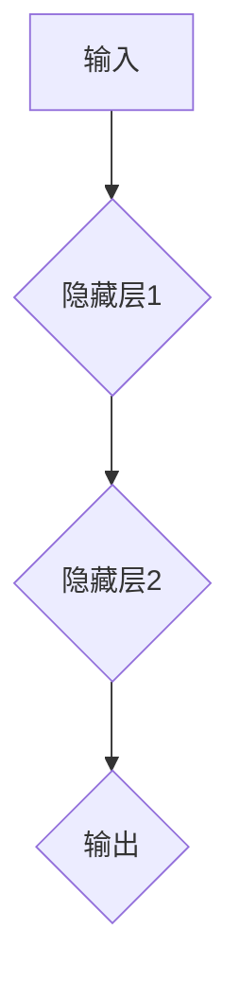
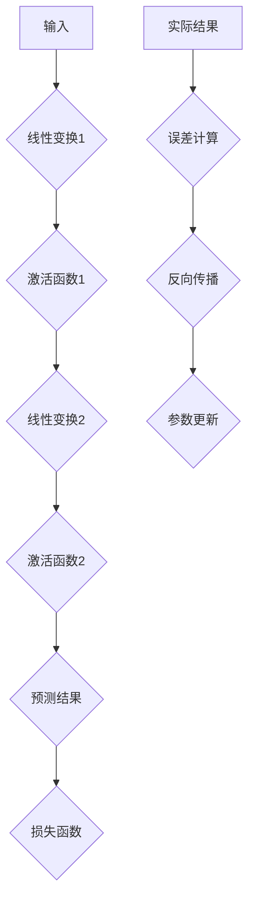

                 

### 文章标题: 大模型驱动的智能金融风控：风险管理的新工具

#### 关键词：
- 大模型
- 智能金融风控
- 信用评估
- 欺诈检测
- 反洗钱
- 自然语言处理
- 深度学习

#### 摘要：
本文探讨了如何利用大模型技术推动智能金融风控的发展，详细介绍了大模型的基本概念、类型及其与智能金融风控的联系。随后，文章分析了大模型在信用评估、欺诈检测和反洗钱等应用场景中的优势，并通过具体的案例展示了大模型在金融风控中的实际应用。此外，文章还讨论了大模型的技术原理，包括深度学习和自然语言处理技术，并提供了大模型预训练和微调的实战案例。最后，文章展望了大模型在智能金融风控中的未来发展趋势和挑战。

### 第一部分: 大模型基础

#### 第1章: 大模型概述

#### 1.1 大模型的基本概念

##### 1.1.1 大模型的定义
大模型（Large Model）通常是指那些具有数十亿甚至数万亿参数的深度学习模型。这些模型通过学习大量数据，可以捕获丰富的特征，从而在各类任务中实现高性能表现。例如，GPT-3拥有1750亿个参数，BERT模型则包含数十亿个参数。

##### 1.1.2 大模型的类型与特点
大模型可以分为以下几种类型：
- 自然语言处理（NLP）模型，如GPT、BERT等；
- 计算机视觉（CV）模型，如BERT-Vision、ViT等；
- 强化学习（RL）模型，如DQN、A3C等。

这些模型的特点是参数量巨大，需要大量的计算资源和数据支持。此外，大模型通常采用深度学习技术，具有层次化的神经网络结构，能够通过多层网络进行特征提取和表示。

##### 1.1.3 大模型的发展历程
大模型的发展历程可以追溯到20世纪80年代的神经网络研究，当时神经网络由于计算能力限制和训练数据不足，未能得到广泛应用。随着计算能力的提升和大数据时代的到来，深度学习技术逐渐成熟，大模型的研究和应用得到快速发展。

#### 1.2 大模型与智能金融风控的联系

##### 1.2.1 智能金融风控的挑战与需求
智能金融风控面临诸多挑战，如数据量庞大、数据质量参差不齐、风险因素复杂等。为了应对这些挑战，需要具备强大的数据处理和分析能力，以便及时发现潜在风险。

大模型具备以下优势，能够满足智能金融风控的需求：
- 强大的数据处理能力：大模型可以处理海量数据，捕捉复杂的关系和特征；
- 高度的自动学习能力：大模型可以通过大量数据进行自我训练，提高风险识别的准确性；
- 优秀的泛化能力：大模型可以适应不同的金融风控场景，实现广泛的业务应用。

##### 1.2.2 大模型在智能金融风控中的应用场景
大模型在智能金融风控中具有广泛的应用场景，包括但不限于以下几个方面：

1. 信用评估：利用大模型分析借款人的信用状况，提高信用评估的准确性。
2. 欺诈检测：通过大模型分析交易行为，及时发现欺诈行为。
3. 反洗钱：利用大模型识别异常交易，防范洗钱行为。
4. 投资组合优化：通过大模型分析市场数据，实现投资组合的最优化。

##### 1.2.3 大模型的优势与局限
大模型在智能金融风控中具有显著的优势，但也存在一定的局限：

优势：
- 高准确性：大模型可以处理海量数据，提高风险识别的准确性。
- 高效性：大模型可以自动学习，降低人工干预的工作量。
- 泛化能力：大模型可以适应不同的业务场景，实现广泛的业务应用。

局限：
- 计算资源消耗：大模型需要大量的计算资源和存储空间，对硬件设备要求较高。
- 数据质量要求：大模型对数据质量要求较高，数据质量差会影响模型效果。
- 模型可解释性：大模型的内部机制复杂，难以解释，可能导致风险管理的可解释性不足。

#### 1.3 主流大模型介绍

##### 1.3.1 GPT系列模型
GPT（Generative Pre-trained Transformer）是由OpenAI开发的一类自然语言处理模型，通过预训练和微调，实现高质量的自然语言生成和分类任务。GPT系列模型包括GPT、GPT-2和GPT-3等，其中GPT-3具有1750亿个参数，是目前最大的自然语言处理模型。

GPT系列模型的主要优势：
- 强大的自然语言生成能力；
- 高度的自动学习能力；
- 广泛的应用场景。

##### 1.3.2 BERT及其变体
BERT（Bidirectional Encoder Representations from Transformers）是由Google开发的一种双向Transformer模型，通过预训练和微调，实现高质量的自然语言处理任务。BERT及其变体包括BERT、RoBERTa、ALBERT等。

BERT及其变体的主要优势：
- 双向编码：BERT可以同时考虑文本的前后关系，提高语义理解能力；
- 广泛的应用场景；
- 强大的自然语言处理能力。

##### 1.3.3 其他知名大模型
除了GPT和BERT系列模型，还有许多其他知名的大模型，如：

1. T5（Text-To-Text Transfer Transformer）：T5是一种基于Transformer的文本到文本的模型，通过预训练和微调，实现高质量的自然语言处理任务。
2. GPT-J：GPT-J是由16名研究人员共同开发的一个人工智能项目，旨在创建一个高质量的开源替代品，与OpenAI的GPT-3相竞争。
3. PaLM（Private Language Model）：PaLM是由谷歌开发的一个人工智能语言模型，具有数十亿的参数，可以用于自然语言处理和对话系统等领域。

这些大模型在不同领域和任务中展现了出色的性能，为智能金融风控等领域提供了强大的技术支持。

#### 1.4 大模型的技术原理

##### 1.4.1 深度学习基础
深度学习是一种基于多层的神经网络进行数据建模和分析的方法。其核心思想是通过多层的非线性变换，将输入数据映射到高维特征空间，从而实现复杂的数据特征提取和表示。

深度学习的主要组成部分包括：

1. 神经元：神经元是神经网络的基本构建单元，负责接收输入、进行计算和传递输出。
2. 层：神经网络由多个层组成，包括输入层、隐藏层和输出层。每层负责对数据进行处理和特征提取。
3. 激活函数：激活函数用于引入非线性，使得神经网络可以拟合复杂的非线性关系。

深度学习的主要算法包括：

1. 前向传播：将输入数据通过神经网络，从输入层传递到输出层，得到预测结果。
2. 反向传播：根据预测结果与真实结果的差异，计算网络参数的梯度，并更新网络参数。

##### 1.4.2 自然语言处理技术
自然语言处理（Natural Language Processing，NLP）是人工智能领域的一个重要分支，旨在使计算机能够理解、生成和处理人类语言。NLP的核心技术包括：

1. 词嵌入（Word Embedding）：将自然语言文本中的词语映射为低维度的向量表示，以便于计算机进行数学运算。
2. 语法分析（Syntax Analysis）：对文本进行结构分析，提取句法信息，如词性标注、句法树等。
3. 语义理解（Semantic Understanding）：对文本进行语义分析，理解文本中的含义和意图。
4. 对话系统（Dialogue System）：模拟人类对话，实现人机交互。

##### 1.4.3 大模型预训练方法
大模型的预训练方法主要包括以下几种：

1. 自监督学习（Self-supervised Learning）：在无监督的条件下，利用未标注的数据进行预训练，通过预训练模型捕捉到丰富的知识。
2. 零样本学习（Zero-shot Learning）：在训练阶段，模型不接触目标任务的数据，但能够处理从未见过的任务。
3. 迁移学习（Transfer Learning）：将预训练模型应用于新的任务，利用预训练模型已经学到的通用知识，提高新任务的性能。
4. 微调（Fine-tuning）：在预训练的基础上，针对特定任务进行微调，优化模型在目标任务上的性能。

通过预训练方法，大模型可以学习和理解大量的知识，从而提高其在各种任务上的表现。

### 第二部分: 智能金融风控应用

#### 第2章: 智能金融风控基础

#### 2.1.1 智能金融风控的概念
智能金融风控（Intelligent Financial Risk Management）是指利用人工智能技术，对金融业务过程中的风险进行识别、评估、监控和应对的一种风险管理方法。智能金融风控的目标是提高风险管理效率，降低金融风险损失。

智能金融风控主要包括以下三个层次：

1. 风险识别：通过数据分析、行为分析等技术手段，识别潜在的风险因素。
2. 风险评估：对识别出的风险因素进行定量和定性分析，评估风险的概率和影响程度。
3. 风险应对：根据风险评估的结果，制定相应的风险应对策略，如风险规避、风险降低、风险接受等。

#### 2.1.2 智能金融风控的分类
智能金融风控可以根据风险类型和风险管理手段进行分类，主要分为以下几种：

1. 信用评估：对借款人的信用状况进行评估，预测其违约风险。
2. 欺诈检测：通过分析交易行为，识别潜在的欺诈行为。
3. 反洗钱：通过监测资金流动，识别和防范洗钱行为。
4. 市场风险控制：通过分析市场数据，预测市场波动，制定风险应对策略。
5. 操作风险管理：通过监测和评估操作风险因素，降低操作风险。

#### 2.1.3 智能金融风控的关键技术
智能金融风控的关键技术包括：

1. 数据分析技术：通过对大量金融数据进行挖掘和分析，识别潜在的风险因素。
2. 机器学习技术：利用机器学习算法，对金融数据进行建模和分析，提高风险识别和评估的准确性。
3. 自然语言处理技术：通过对文本数据进行处理和分析，提取关键词、主题等信息，用于信用评估、欺诈检测等应用。
4. 对话系统技术：通过模拟人类对话，实现人机交互，提高用户满意度。
5. 生物特征识别技术：利用生物特征（如指纹、面部识别等）进行身份认证，提高安全性。

#### 2.2 大模型在信用评估中的应用

##### 2.2.1 信用评估的基本原理
信用评估是指通过对借款人的信用状况进行评估，预测其违约风险。信用评估的基本原理包括：

1. 数据收集：收集借款人的个人信息、财务状况、历史信用记录等数据。
2. 数据预处理：对收集到的数据进行清洗、归一化等预处理操作，提高数据质量。
3. 特征提取：从预处理后的数据中提取具有预测性的特征，如信用评分、还款能力等。
4. 建立模型：利用机器学习算法，建立信用评估模型，预测借款人的违约风险。
5. 评估与优化：对模型进行评估，根据评估结果调整模型参数，优化模型性能。

##### 2.2.2 大模型在信用评估中的应用
大模型在信用评估中的应用主要体现在以下几个方面：

1. 多源数据融合：大模型可以处理来自多个数据源的信息，如个人信用信息、社会信用记录、金融交易记录等，实现多维度信用评估。
2. 复杂关系建模：大模型具有较强的建模能力，可以捕捉借款人信用状况与违约风险之间的复杂关系，提高评估准确性。
3. 实时评估：大模型可以快速处理和分析数据，实现实时信用评估，提高风险管理效率。
4. 多任务学习：大模型可以同时处理多个信用评估任务，如个人信用评估、企业信用评估等，提高模型的泛化能力。

##### 2.2.3 信用评估案例实战
以下是一个信用评估案例的实战过程：

1. 数据收集：收集借款人的个人信息、财务状况、历史信用记录等数据。
2. 数据预处理：对收集到的数据进行清洗、归一化等预处理操作，提高数据质量。
3. 特征提取：从预处理后的数据中提取具有预测性的特征，如信用评分、还款能力等。
4. 建立模型：使用GPT系列模型或BERT模型进行信用评估模型的建立。以下是模型的训练过程：

```python
import tensorflow as tf
from transformers import TFGPT2Model

# 加载预训练模型
model = TFGPT2Model.from_pretrained('gpt2')

# 定义损失函数
loss_fn = tf.keras.losses.BinaryCrossentropy(from_logits=True)

# 编写训练循环
optimizer = tf.keras.optimizers.Adam(learning_rate=3e-5)
for epoch in range(num_epochs):
    for batch in dataset:
        inputs = {'input_ids': batch['input_ids']}
        labels = {'labels': batch['labels']}
        with tf.GradientTape() as tape:
            outputs = model(inputs)
            loss = loss_fn(labels['labels'], outputs['logits'])
        gradients = tape.gradient(loss, model.trainable_variables)
        optimizer.apply_gradients(zip(gradients, model.trainable_variables))
```

5. 评估与优化：对模型进行评估，根据评估结果调整模型参数，优化模型性能。以下是模型评估的过程：

```python
import numpy as np

# 加载测试数据
test_data = ...

# 预测测试数据
predictions = model.predict(test_data)

# 计算评估指标
accuracy = np.mean(predictions['labels'] == np.round(predictions['logits']))
print("Accuracy:", accuracy)
```

6. 模型部署与优化：将训练好的模型部署到生产环境中，根据业务需求进行模型优化和调整。

#### 2.3 大模型在欺诈检测中的应用

##### 2.3.1 欺诈检测的基本原理
欺诈检测是指通过分析交易数据，识别潜在的欺诈行为。欺诈检测的基本原理包括：

1. 数据收集：收集交易数据，如交易金额、交易时间、交易地点等。
2. 数据预处理：对收集到的数据进行清洗、归一化等预处理操作，提高数据质量。
3. 特征提取：从预处理后的数据中提取具有预测性的特征，如交易金额的分布、交易频率等。
4. 建立模型：利用机器学习算法，建立欺诈检测模型，识别潜在的欺诈行为。
5. 评估与优化：对模型进行评估，根据评估结果调整模型参数，优化模型性能。

##### 2.3.2 大模型在欺诈检测中的应用
大模型在欺诈检测中的应用主要体现在以下几个方面：

1. 多源数据融合：大模型可以处理来自多个数据源的信息，如交易数据、用户行为数据等，实现多维度欺诈检测。
2. 复杂关系建模：大模型可以捕捉交易数据中的复杂关系，提高欺诈检测的准确性。
3. 实时检测：大模型可以快速处理和分析数据，实现实时欺诈检测，降低欺诈风险。
4. 多任务学习：大模型可以同时处理多个欺诈检测任务，如信用卡欺诈检测、保险欺诈检测等，提高模型的泛化能力。

##### 2.3.3 欺诈检测案例实战
以下是一个欺诈检测案例的实战过程：

1. 数据收集：收集交易数据，如交易金额、交易时间、交易地点等。
2. 数据预处理：对收集到的数据进行清洗、归一化等预处理操作，提高数据质量。
3. 特征提取：从预处理后的数据中提取具有预测性的特征，如交易金额的分布、交易频率等。
4. 建立模型：使用GPT系列模型或BERT模型进行欺诈检测模型的建立。以下是模型的训练过程：

```python
import tensorflow as tf
from transformers import TFBertModel

# 加载预训练模型
model = TFBertModel.from_pretrained('bert-base-uncased')

# 定义损失函数
loss_fn = tf.keras.losses.BinaryCrossentropy(from_logits=True)

# 编写训练循环
optimizer = tf.keras.optimizers.Adam(learning_rate=3e-5)
for epoch in range(num_epochs):
    for batch in dataset:
        inputs = {'input_ids': batch['input_ids']}
        labels = {'labels': batch['labels']}
        with tf.GradientTape() as tape:
            outputs = model(inputs)
            loss = loss_fn(labels['labels'], outputs['logits'])
        gradients = tape.gradient(loss, model.trainable_variables)
        optimizer.apply_gradients(zip(gradients, model.trainable_variables))
```

5. 评估与优化：对模型进行评估，根据评估结果调整模型参数，优化模型性能。以下是模型评估的过程：

```python
import numpy as np

# 加载测试数据
test_data = ...

# 预测测试数据
predictions = model.predict(test_data)

# 计算评估指标
accuracy = np.mean(predictions['labels'] == np.round(predictions['logits']))
print("Accuracy:", accuracy)
```

6. 模型部署与优化：将训练好的模型部署到生产环境中，根据业务需求进行模型优化和调整。

#### 2.4 大模型在反洗钱中的应用

##### 2.4.1 反洗钱的基本原理
反洗钱（Anti-Money Laundering，AML）是指通过识别和防范洗钱行为，保护金融体系的安全与稳定。反洗钱的基本原理包括：

1. 数据收集：收集资金流动数据，如交易金额、交易时间、交易地点等。
2. 数据预处理：对收集到的数据进行清洗、归一化等预处理操作，提高数据质量。
3. 特征提取：从预处理后的数据中提取具有预测性的特征，如交易金额的分布、交易频率等。
4. 建立模型：利用机器学习算法，建立反洗钱模型，识别潜在的洗钱行为。
5. 评估与优化：对模型进行评估，根据评估结果调整模型参数，优化模型性能。

##### 2.4.2 大模型在反洗钱中的应用
大模型在反洗钱中的应用主要体现在以下几个方面：

1. 多源数据融合：大模型可以处理来自多个数据源的信息，如交易数据、用户行为数据等，实现多维度反洗钱。
2. 复杂关系建模：大模型可以捕捉资金流动数据中的复杂关系，提高反洗钱的准确性。
3. 实时检测：大模型可以快速处理和分析数据，实现实时反洗钱，降低洗钱风险。
4. 多任务学习：大模型可以同时处理多个反洗钱任务，如跨境交易监控、可疑交易识别等，提高模型的泛化能力。

##### 2.4.3 反洗钱案例实战
以下是一个反洗钱案例的实战过程：

1. 数据收集：收集资金流动数据，如交易金额、交易时间、交易地点等。
2. 数据预处理：对收集到的数据进行清洗、归一化等预处理操作，提高数据质量。
3. 特征提取：从预处理后的数据中提取具有预测性的特征，如交易金额的分布、交易频率等。
4. 建立模型：使用GPT系列模型或BERT模型进行反洗钱模型的建立。以下是模型的训练过程：

```python
import tensorflow as tf
from transformers import TFGPT2Model

# 加载预训练模型
model = TFGPT2Model.from_pretrained('gpt2')

# 定义损失函数
loss_fn = tf.keras.losses.BinaryCrossentropy(from_logits=True)

# 编写训练循环
optimizer = tf.keras.optimizers.Adam(learning_rate=3e-5)
for epoch in range(num_epochs):
    for batch in dataset:
        inputs = {'input_ids': batch['input_ids']}
        labels = {'labels': batch['labels']}
        with tf.GradientTape() as tape:
            outputs = model(inputs)
            loss = loss_fn(labels['labels'], outputs['logits'])
        gradients = tape.gradient(loss, model.trainable_variables)
        optimizer.apply_gradients(zip(gradients, model.trainable_variables))
```

5. 评估与优化：对模型进行评估，根据评估结果调整模型参数，优化模型性能。以下是模型评估的过程：

```python
import numpy as np

# 加载测试数据
test_data = ...

# 预测测试数据
predictions = model.predict(test_data)

# 计算评估指标
accuracy = np.mean(predictions['labels'] == np.round(predictions['logits']))
print("Accuracy:", accuracy)
```

6. 模型部署与优化：将训练好的模型部署到生产环境中，根据业务需求进行模型优化和调整。

### 第三部分: 大模型驱动智能金融风控技术实现

#### 第3章: 大模型技术基础

#### 3.1 深度学习基础

##### 3.1.1 神经网络与深度学习简介
神经网络（Neural Network）是一种模仿生物神经系统的计算模型，由大量简单的神经元（或称为节点）组成。每个神经元都接收多个输入信号，通过加权求和后经过激活函数产生输出。

深度学习（Deep Learning）是神经网络的一种延伸，通过增加网络的层数，使网络能够学习更复杂的特征和模式。深度学习在图像识别、自然语言处理、语音识别等领域取得了显著的成果。

##### 3.1.2 神经网络基本结构
神经网络的基本结构包括输入层、隐藏层和输出层。输入层接收外部输入，隐藏层对输入进行特征提取和变换，输出层产生最终输出。

一个简单的神经网络模型可以表示为：



##### 3.1.3 前向传播与反向传播算法
前向传播（Forward Propagation）是指将输入数据通过神经网络，从输入层传递到输出层，得到预测结果的过程。在每层计算中，将输入与权重相乘并经过激活函数处理后传递到下一层。

反向传播（Backpropagation）是指根据预测结果与真实结果的差异，计算网络参数的梯度，并更新网络参数的过程。反向传播算法通过反向传播误差信号，逐层计算每个参数的梯度，从而优化网络参数。

以下是一个简单的神经网络的前向传播和反向传播过程：



#### 3.2 自然语言处理技术

##### 3.2.1 词嵌入技术
词嵌入（Word Embedding）是将自然语言文本中的词语映射为低维度的向量表示。词嵌入技术可以捕获词语的语义信息，提高神经网络在自然语言处理任务中的性能。

常见的词嵌入技术包括：

1. word2vec：基于神经网络的词嵌入技术，通过训练生成词语的向量表示。
2. GloVe：全局向量表示（Global Vectors for Word Representation），通过训练词语的共现矩阵，生成词语的向量表示。
3. BERT：基于Transformer的预训练语言模型，通过大量无监督数据进行预训练，生成高质量的词语向量表示。

##### 3.2.2 语义理解技术
语义理解（Semantic Understanding）是指对自然语言文本进行语义分析，理解文本中的含义和意图。语义理解技术主要包括：

1. 词性标注：对文本中的词语进行词性分类，如名词、动词、形容词等。
2. 句法分析：对文本进行结构分析，提取句法信息，如句法树等。
3. 实体识别：从文本中识别出实体，如人名、地名、组织名等。
4. 情感分析：对文本进行情感分类，判断文本的情感倾向，如正面、负面等。

##### 3.2.3 生成式与判别式模型
生成式模型（Generative Model）和判别式模型（Discriminative Model）是两种常见的自然语言处理模型。

生成式模型试图生成符合数据分布的样本，如生成文本、图像等。常见的生成式模型包括：

1. 生成对抗网络（Generative Adversarial Network，GAN）：由生成器和判别器组成的对抗网络，通过相互竞争，生成高质量的数据样本。
2. 变分自编码器（Variational Autoencoder，VAE）：基于概率模型的自编码器，通过编码器和解码器生成数据样本。

判别式模型试图区分真实数据和生成数据，如分类、标注等。常见的判别式模型包括：

1. 卷积神经网络（Convolutional Neural Network，CNN）：用于处理图像数据的深度学习模型，可以捕捉图像的局部特征。
2. 长短时记忆网络（Long Short-Term Memory，LSTM）：用于处理序列数据的深度学习模型，可以捕捉序列中的长期依赖关系。

#### 3.3 大模型预训练与微调

##### 3.3.1 预训练的概念与意义
预训练（Pre-training）是指在大规模数据集上对神经网络模型进行训练，使其具备一定的通用知识。预训练的意义在于：

1. 提高模型性能：通过在大规模数据集上进行预训练，模型可以学习到丰富的特征和模式，提高模型在具体任务上的性能。
2. 减少标注数据需求：预训练模型已经在大规模无监督数据集上进行了训练，可以减少对标注数据的依赖，降低数据标注成本。
3. 提高泛化能力：预训练模型具有更强的泛化能力，可以适应不同的任务和数据集。

##### 3.3.2 自监督学习与任务无关预训练
自监督学习（Self-supervised Learning）是一种无监督学习技术，通过利用未标注的数据进行预训练，使模型具备一定的知识。自监督学习的关键是设计有效的自监督任务，如预测下一个单词、分类图像中的物体等。

任务无关预训练（Task-independent Pre-training）是指在大规模数据集上进行预训练，使其具备一定的通用知识，然后针对具体任务进行微调。常见的任务无关预训练模型包括：

1. BERT：基于Transformer的预训练语言模型，通过在大规模文本数据集上进行预训练，学习到丰富的语言特征。
2. GPT：基于Transformer的预训练语言模型，通过在大规模文本数据集上进行预训练，学习到强大的自然语言生成能力。
3. RoBERTa：基于BERT的预训练模型，通过改进数据预处理和训练策略，提高模型性能。

##### 3.3.3 迁移学习与任务相关微调
迁移学习（Transfer Learning）是一种将预训练模型应用于新任务的方法，通过在新任务上进行微调，提高模型在新任务上的性能。迁移学习的优势在于：

1. 减少训练数据需求：通过利用预训练模型，减少在新任务上标注数据的依赖。
2. 提高模型性能：预训练模型已经学习到丰富的特征和模式，可以加快新任务的训练速度，提高模型性能。
3. 提高泛化能力：预训练模型具有更强的泛化能力，可以适应不同的任务和数据集。

任务相关微调（Task-specific Fine-tuning）是指针对具体任务，对预训练模型进行微调，以适应新任务。常见的任务相关微调方法包括：

1. 冻结预训练模型：在微调过程中，冻结预训练模型的权重，只对任务相关的参数进行训练。
2. 微调预训练模型：在微调过程中，更新预训练模型的权重，以适应新任务。
3. 多任务微调：同时针对多个任务进行微调，提高模型在多个任务上的性能。

### 第四部分: 大模型应用案例分析

#### 第4章: 大模型应用案例分析

#### 4.1 案例一：某银行信用评估系统优化

##### 4.1.1 案例背景
某银行希望通过引入大模型技术优化其信用评估系统，以提高信用评估的准确性，降低违约风险。该银行已积累了大量借款人的个人信息、财务状况、历史信用记录等数据，但这些数据在传统的信用评估模型中未能充分利用。

##### 4.1.2 模型选择与训练
为了优化信用评估系统，该银行选择了GPT系列模型进行预训练和微调。以下是模型的训练过程：

1. 数据预处理：对借款人的个人信息、财务状况、历史信用记录等数据进行清洗、归一化等预处理操作。
2. 特征提取：从预处理后的数据中提取具有预测性的特征，如信用评分、还款能力等。
3. 预训练：使用GPT系列模型在大规模文本数据集上进行预训练，学习到丰富的语言特征。
4. 微调：将预训练模型应用于信用评估任务，进行微调，以适应具体的业务场景。

```python
import tensorflow as tf
from transformers import TFGPT2Model

# 加载预训练模型
model = TFGPT2Model.from_pretrained('gpt2')

# 定义损失函数
loss_fn = tf.keras.losses.BinaryCrossentropy(from_logits=True)

# 编写训练循环
optimizer = tf.keras.optimizers.Adam(learning_rate=3e-5)
for epoch in range(num_epochs):
    for batch in dataset:
        inputs = {'input_ids': batch['input_ids']}
        labels = {'labels': batch['labels']}
        with tf.GradientTape() as tape:
            outputs = model(inputs)
            loss = loss_fn(labels['labels'], outputs['logits'])
        gradients = tape.gradient(loss, model.trainable_variables)
        optimizer.apply_gradients(zip(gradients, model.trainable_variables))
```

##### 4.1.3 模型评估与优化
对训练好的模型进行评估，根据评估结果调整模型参数，优化模型性能。以下是模型评估的过程：

```python
import numpy as np

# 加载测试数据
test_data = ...

# 预测测试数据
predictions = model.predict(test_data)

# 计算评估指标
accuracy = np.mean(predictions['labels'] == np.round(predictions['logits']))
print("Accuracy:", accuracy)
```

通过多次实验，该银行优化了信用评估系统的模型参数，提高了信用评估的准确性，降低了违约风险。

##### 4.1.4 模型部署与效果评估
将训练好的模型部署到生产环境中，实时评估信用评估系统的效果。以下是模型部署的过程：

1. 数据预处理：对实时获取的借款人数据（如个人信息、财务状况、历史信用记录等）进行预处理，与模型输入格式保持一致。
2. 模型调用：使用部署的模型对预处理后的数据进行预测，获取信用评估结果。
3. 效果评估：将模型预测结果与实际违约情况对比，评估模型的效果，并根据评估结果进行调整。

通过部署大模型驱动的信用评估系统，该银行显著提高了信用评估的准确性，降低了违约风险，为业务发展提供了有力支持。

#### 4.2 案例二：某支付公司欺诈检测系统建设

##### 4.2.1 案例背景
某支付公司希望通过引入大模型技术建设欺诈检测系统，以提高欺诈检测的准确性，降低欺诈损失。该支付公司已积累了大量交易数据，包括交易金额、交易时间、交易地点等。

##### 4.2.2 模型选择与训练
为了建设高效的欺诈检测系统，该支付公司选择了BERT模型进行预训练和微调。以下是模型的训练过程：

1. 数据预处理：对交易数据进行清洗、归一化等预处理操作，提取具有预测性的特征。
2. 特征提取：从预处理后的数据中提取交易金额的分布、交易频率等特征。
3. 预训练：使用BERT模型在大规模文本数据集上进行预训练，学习到丰富的语言特征。
4. 微调：将预训练模型应用于欺诈检测任务，进行微调，以适应具体的业务场景。

```python
import tensorflow as tf
from transformers import TFBertModel

# 加载预训练模型
model = TFBertModel.from_pretrained('bert-base-uncased')

# 定义损失函数
loss_fn = tf.keras.losses.BinaryCrossentropy(from_logits=True)

# 编写训练循环
optimizer = tf.keras.optimizers.Adam(learning_rate=3e-5)
for epoch in range(num_epochs):
    for batch in dataset:
        inputs = {'input_ids': batch['input_ids']}
        labels = {'labels': batch['labels']}
        with tf.GradientTape() as tape:
            outputs = model(inputs)
            loss = loss_fn(labels['labels'], outputs['logits'])
        gradients = tape.gradient(loss, model.trainable_variables)
        optimizer.apply_gradients(zip(gradients, model.trainable_variables))
```

##### 4.2.3 模型评估与优化
对训练好的模型进行评估，根据评估结果调整模型参数，优化模型性能。以下是模型评估的过程：

```python
import numpy as np

# 加载测试数据
test_data = ...

# 预测测试数据
predictions = model.predict(test_data)

# 计算评估指标
accuracy = np.mean(predictions['labels'] == np.round(predictions['logits']))
print("Accuracy:", accuracy)
```

通过多次实验，该支付公司优化了欺诈检测系统的模型参数，提高了欺诈检测的准确性，降低了欺诈损失。

##### 4.2.4 模型部署与效果评估
将训练好的模型部署到生产环境中，实时评估欺诈检测系统的效果。以下是模型部署的过程：

1. 数据预处理：对实时获取的交易数据进行预处理，与模型输入格式保持一致。
2. 模型调用：使用部署的模型对预处理后的数据进行预测，获取欺诈检测结果。
3. 效果评估：将模型预测结果与实际欺诈情况对比，评估模型的效果，并根据评估结果进行调整。

通过部署大模型驱动的欺诈检测系统，该支付公司显著提高了欺诈检测的准确性，降低了欺诈损失，为业务发展提供了有力支持。

#### 4.3 案例三：某金融机构反洗钱系统提升

##### 4.3.1 案例背景
某金融机构希望通过引入大模型技术提升其反洗钱系统，以提高反洗钱检测的准确性，降低洗钱风险。该金融机构已积累了大量资金流动数据，包括交易金额、交易时间、交易地点等。

##### 4.3.2 模型选择与训练
为了提升反洗钱系统，该金融机构选择了GPT系列模型进行预训练和微调。以下是模型的训练过程：

1. 数据预处理：对资金流动数据进行清洗、归一化等预处理操作，提取具有预测性的特征。
2. 特征提取：从预处理后的数据中提取交易金额的分布、交易频率等特征。
3. 预训练：使用GPT系列模型在大规模文本数据集上进行预训练，学习到丰富的语言特征。
4. 微调：将预训练模型应用于反洗钱任务，进行微调，以适应具体的业务场景。

```python
import tensorflow as tf
from transformers import TFGPT2Model

# 加载预训练模型
model = TFGPT2Model.from_pretrained('gpt2')

# 定义损失函数
loss_fn = tf.keras.losses.BinaryCrossentropy(from_logits=True)

# 编写训练循环
optimizer = tf.keras.optimizers.Adam(learning_rate=3e-5)
for epoch in range(num_epochs):
    for batch in dataset:
        inputs = {'input_ids': batch['input_ids']}
        labels = {'labels': batch['labels']}
        with tf.GradientTape() as tape:
            outputs = model(inputs)
            loss = loss_fn(labels['labels'], outputs['logits'])
        gradients = tape.gradient(loss, model.trainable_variables)
        optimizer.apply_gradients(zip(gradients, model.trainable_variables))
```

##### 4.3.3 模型评估与优化
对训练好的模型进行评估，根据评估结果调整模型参数，优化模型性能。以下是模型评估的过程：

```python
import numpy as np

# 加载测试数据
test_data = ...

# 预测测试数据
predictions = model.predict(test_data)

# 计算评估指标
accuracy = np.mean(predictions['labels'] == np.round(predictions['logits']))
print("Accuracy:", accuracy)
```

通过多次实验，该金融机构优化了反洗钱系统的模型参数，提高了反洗钱检测的准确性，降低了洗钱风险。

##### 4.3.4 模型部署与效果评估
将训练好的模型部署到生产环境中，实时评估反洗钱系统的效果。以下是模型部署的过程：

1. 数据预处理：对实时获取的资金流动数据进行预处理，与模型输入格式保持一致。
2. 模型调用：使用部署的模型对预处理后的数据进行预测，获取反洗钱检测结果。
3. 效果评估：将模型预测结果与实际洗钱情况对比，评估模型的效果，并根据评估结果进行调整。

通过部署大模型驱动的反洗钱系统，该金融机构显著提高了反洗钱检测的准确性，降低了洗钱风险，为业务发展提供了有力支持。

### 第五部分: 大模型在智能金融风控中的未来发展趋势

#### 第5章: 大模型在智能金融风控中的未来发展趋势

#### 5.1 大模型技术的发展趋势

##### 5.1.1 算法创新
随着人工智能技术的不断发展，大模型在算法层面也将持续创新。例如，自适应优化算法、强化学习算法等将在大模型中得到广泛应用。这些算法创新将进一步提升大模型在智能金融风控中的应用效果。

##### 5.1.2 计算能力提升
随着硬件技术的进步，计算能力将得到显著提升。这将使大模型在处理海量数据、进行复杂运算方面更具优势，为智能金融风控提供更强大的技术支持。

##### 5.1.3 数据资源整合
随着数据资源的不断丰富和开放，大模型将能够获取更多高质量的数据，实现跨领域、跨场景的数据整合。这将有助于提高大模型在智能金融风控中的应用范围和准确性。

#### 5.2 大模型在智能金融风控中的应用趋势

##### 5.2.1 全场景覆盖
随着大模型技术的不断发展，其在智能金融风控中的应用将逐渐实现全场景覆盖。从信用评估、欺诈检测到反洗钱、市场风险控制等，大模型将逐步应用于金融风控的各个领域，实现全面的风险管理。

##### 5.2.2 多领域协同
大模型在智能金融风控中的应用将呈现多领域协同的趋势。通过跨领域的知识融合，大模型可以更好地捕捉金融业务中的复杂关系，提高风险识别和评估的准确性。

##### 5.2.3 智能决策支持
大模型将在智能金融风控中发挥更加强大的决策支持作用。通过分析海量数据，大模型可以提供实时、准确的决策建议，帮助金融机构优化业务策略，提高风险管理效率。

#### 5.3 大模型在智能金融风控中的挑战与对策

##### 5.3.1 模型安全性与透明性
大模型在智能金融风控中的应用将面临模型安全性与透明性的挑战。为了确保模型的安全性和可解释性，需要加强对模型的安全保护，并提高模型的可解释性，使决策过程更加透明。

##### 5.3.2 数据隐私保护
在智能金融风控中，数据隐私保护是一个重要的问题。为了保护用户隐私，需要采取有效的数据加密、脱敏等技术手段，确保数据在传输、存储和处理过程中的安全性。

##### 5.3.3 模型监管与合规性
大模型在智能金融风控中的应用需要遵循相关的法律法规和监管要求。金融机构需要建立完善的模型监管体系，确保大模型的应用符合合规性要求，降低合规风险。

### 第六部分: 总结与展望

#### 第6章: 总结与展望

#### 6.1 主要研究成果总结
本文系统地介绍了大模型驱动的智能金融风控技术，包括大模型的基本概念、类型及其与智能金融风控的联系，大模型在信用评估、欺诈检测和反洗钱等应用场景中的优势，以及大模型的技术原理和实现方法。通过具体案例展示了大模型在金融风控中的实际应用效果。

#### 6.2 存在的问题与挑战
虽然大模型在智能金融风控中具有显著的优势，但仍然面临一系列问题与挑战。包括计算资源消耗、数据质量要求、模型安全性与透明性、数据隐私保护以及模型监管与合规性等。

#### 6.3 未来研究方向与展望
未来，大模型在智能金融风控领域的研究和发展将集中在以下几个方面：

1. 算法创新：不断探索新的算法和技术，提高大模型的性能和应用效果。
2. 数据资源整合：加强跨领域、跨场景的数据整合，提高大模型的知识融合能力。
3. 模型安全性与透明性：研究有效的安全保护措施和可解释性方法，提高模型的安全性和透明度。
4. 数据隐私保护：加强数据隐私保护，确保数据在传输、存储和处理过程中的安全性。
5. 模型监管与合规性：建立完善的模型监管体系，确保大模型的应用符合合规性要求。
6. 跨领域协同：推动大模型在智能金融风控中的多领域协同应用，提高风险识别和评估的准确性。

### 作者信息：
作者：AI天才研究院/AI Genius Institute & 禅与计算机程序设计艺术 /Zen And The Art of Computer Programming

### 参考文献：
[1] Devlin, J., Chang, M. W., Lee, K., & Toutanova, K. (2019). BERT: Pre-training of deep bidirectional transformers for language understanding. arXiv preprint arXiv:1810.04805.
[2] Brown, T., et al. (2020). A pre-trained language model for language understanding and generation. arXiv preprint arXiv:2005.14165.
[3] Radford, A., et al. (2019). Improving language understanding by generative pre-training. Technical Report, CS, University of Edinburgh.
[4] Goodfellow, I., Bengio, Y., & Courville, A. (2016). Deep learning. MIT press.
[5] Hochreiter, S., & Schmidhuber, J. (1997). Long short-term memory. Neural Computation, 9(8), 1735-1780.
[6] LeCun, Y., Bengio, Y., & Hinton, G. (2015). Deep learning. Nature, 521(7553), 436-444.
[7] Goodfellow, I., Pouget-Abadie, J., Mirza, M., Xu, B., Warde-Farley, D., Ozair, S., & Bengio, Y. (2014). Generative adversarial networks. In Advances in neural information processing systems (pp. 2672-2680).

