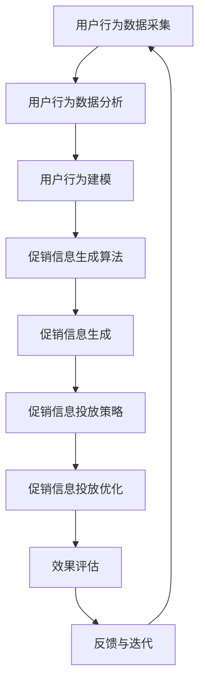

                 

## 文章标题：大模型驱动的电商个性化促销信息生成与投放优化

在数字营销时代，个性化促销已经成为电商企业提高用户粘性和销售额的重要策略。本文旨在探讨如何利用大模型技术实现电商个性化促销信息的生成与投放优化。通过系统分析大模型在电商领域的应用，深入探讨其在用户行为建模、促销信息生成以及投放优化中的关键技术，为电商企业提供一套有效的解决方案。

关键词：大模型，电商，个性化促销，用户行为建模，促销信息生成，投放优化

摘要：随着电商行业的迅猛发展，个性化促销成为提升用户满意度和销售业绩的关键手段。本文首先概述了电商个性化促销的概念和现状，随后介绍了大模型技术的基本原理和应用场景。通过详细分析用户行为建模、促销信息生成算法以及大模型在促销信息生成中的应用，本文探讨了如何利用大模型技术优化电商促销信息的投放策略。最后，通过实战案例展示了大模型在电商个性化促销中的实际应用效果，并对未来的发展趋势进行了展望。

## 文章目录大纲

### 第一部分：电商个性化促销概述

#### 第1章：电商个性化促销概念与现状

##### 1.1 电商个性化促销的定义与分类

##### 1.2 个性化促销的市场需求与挑战

##### 1.3 电商个性化促销的现状分析

##### 1.4 电商个性化促销的发展趋势

#### 第2章：大模型技术基础

##### 2.1 大模型概述

##### 2.2 大模型的基本原理

##### 2.3 大模型的训练与优化

##### 2.4 大模型的应用场景

### 第二部分：电商个性化促销信息生成

#### 第3章：用户行为分析与建模

##### 3.1 用户行为数据采集

##### 3.2 用户行为数据分析

##### 3.3 用户行为建模技术

##### 3.4 用户行为模型评估与优化

#### 第4章：个性化促销信息生成算法

##### 4.1 个性化促销信息生成流程

##### 4.2 文本生成模型

##### 4.3 基于用户兴趣的促销信息生成

##### 4.4 基于历史数据的促销信息生成

#### 第5章：大模型在促销信息生成中的应用

##### 5.1 大模型在促销信息生成中的优势

##### 5.2 大模型在促销信息生成中的实现细节

##### 5.3 大模型在促销信息生成中的应用案例

##### 5.4 大模型在促销信息生成中的挑战与优化

### 第三部分：电商个性化促销信息投放优化

#### 第6章：促销信息投放策略

##### 6.1 促销信息投放的目标与原则

##### 6.2 促销信息投放渠道选择

##### 6.3 促销信息投放时间规划

##### 6.4 促销信息投放效果评估

#### 第7章：大模型驱动的促销信息投放优化

##### 7.1 大模型在促销信息投放优化中的应用

##### 7.2 大模型在促销信息投放优化中的实现细节

##### 7.3 大模型驱动的促销信息投放优化案例

##### 7.4 大模型驱动的促销信息投放优化挑战与优化

### 第四部分：实战案例与未来展望

#### 第8章：电商个性化促销信息生成与投放优化实战

##### 8.1 实战项目背景

##### 8.2 实战项目目标

##### 8.3 实战项目实施过程

##### 8.4 实战项目效果评估

#### 第9章：电商个性化促销信息生成与投放优化未来展望

##### 9.1 个性化促销信息生成与投放技术的发展趋势

##### 9.2 大模型在电商领域的其他应用

##### 9.3 电商个性化促销信息生成与投放优化的挑战与机遇

### 附录

#### 附录 A：大模型相关工具与资源

##### A.1 大模型开源框架介绍

##### A.2 大模型相关论文与书籍推荐

##### A.3 大模型社区与论坛介绍

#### 附录 B：电商个性化促销信息生成与投放优化项目资料

##### B.1 项目数据集介绍

##### B.2 项目代码与数据获取方式

##### B.3 项目报告与论文撰写指南

## 电商个性化促销概述

### 第1章：电商个性化促销概念与现状

#### 1.1 电商个性化促销的定义与分类

电商个性化促销是指基于用户行为数据、购买历史、兴趣偏好等，通过算法和数据分析，为每位用户定制个性化的促销信息，从而提高用户的购买意愿和转化率。个性化促销主要分为以下几类：

1. **个性化推荐**：根据用户的浏览和购买历史，推荐符合用户兴趣的产品和促销信息。
2. **价格个性化**：根据用户的历史购买价格敏感度，为用户定制不同的价格策略。
3. **促销活动个性化**：根据用户的购买周期、节日等，为用户推送相关的促销活动。
4. **优惠券个性化**：根据用户的购买行为和偏好，为用户定制优惠券。

#### 1.2 个性化促销的市场需求与挑战

随着互联网的普及，电商市场越来越注重用户体验。个性化促销能够有效提升用户满意度和忠诚度，从而提高销售额。以下是电商个性化促销面临的主要需求与挑战：

1. **需求**：
   - 提高用户购买转化率。
   - 提升用户留存率和复购率。
   - 增加用户互动和参与度。

2. **挑战**：
   - 数据隐私与合规性。
   - 数据质量和准确性。
   - 算法复杂度高，计算成本大。
   - 跨渠道个性化促销的一致性。

#### 1.3 电商个性化促销的现状分析

当前，电商个性化促销已经成为各大电商平台的核心竞争力。以下是一些电商平台在个性化促销方面的实践：

1. **阿里巴巴**：通过大数据和算法，为用户推荐个性化的商品和优惠券。
2. **京东**：基于用户的购物行为和兴趣，推出定制化的购物推荐和促销活动。
3. **亚马逊**：利用机器学习和人工智能，为用户推送个性化的购物建议和优惠。

#### 1.4 电商个性化促销的发展趋势

未来，电商个性化促销将朝着以下方向发展：

1. **大数据与人工智能的深度融合**：通过更先进的大数据和人工智能技术，实现更精准的个性化推荐。
2. **隐私保护和合规性**：在确保用户隐私的前提下，合理利用用户数据。
3. **跨渠道整合**：实现线上线下数据融合，提供全渠道的个性化促销服务。
4. **用户体验优化**：从用户的角度出发，提升个性化促销的用户体验。

### 总结

电商个性化促销已经成为电商行业的重要趋势。通过深入分析用户行为数据，利用大模型技术，电商平台可以提供更加精准和个性化的促销信息，从而提高用户满意度和销售业绩。然而，个性化促销也面临诸多挑战，需要不断优化和创新，以应对市场的变化。

#### 第2章：大模型技术基础

#### 2.1 大模型概述

大模型（Large-scale Model）是指参数规模巨大、模型结构复杂的人工神经网络模型。这类模型通常具有以下几个特点：

1. **大规模参数**：大模型通常包含数亿甚至数十亿个参数，这使得模型能够捕捉数据中的复杂模式和关联性。
2. **深度结构**：大模型往往具有多层的神经网络结构，这使得模型可以逐层提取数据中的特征，从而提高模型的性能。
3. **端到端学习**：大模型能够实现端到端的学习，从输入直接映射到输出，减少了传统机器学习中的特征工程步骤。

大模型的应用范围广泛，涵盖了自然语言处理、计算机视觉、推荐系统等多个领域。以下是一些典型的大模型：

1. **BERT**（Bidirectional Encoder Representations from Transformers）：一种预训练语言模型，广泛应用于文本分类、问答系统等。
2. **GPT-3**（Generative Pre-trained Transformer 3）：一种大型语言生成模型，能够生成高质量的文本内容。
3. **ImageNet**：一种大型图像识别模型，通过大规模图像数据训练，实现了高精度的图像分类。

#### 2.2 大模型的基本原理

大模型的基本原理基于神经网络，特别是深度神经网络（Deep Neural Network, DNN）。神经网络是一种由大量简单神经元组成的计算模型，每个神经元接收多个输入，并通过加权求和后激活函数得到输出。大模型的核心原理包括以下几个方面：

1. **多层感知器**（Multilayer Perceptron, MLP）：多层感知器是神经网络的基本单元，通过多层神经元实现输入到输出的映射。
2. **激活函数**：激活函数为神经网络引入非线性特性，使得模型能够学习到复杂数据的内在规律。
3. **反向传播算法**（Backpropagation）：反向传播算法是一种用于训练神经网络的优化算法，通过迭代优化模型参数，使模型能够更好地拟合训练数据。

大模型通过以下步骤实现训练和预测：

1. **输入层**：接收外部输入数据。
2. **隐藏层**：多层隐藏层用于提取数据中的特征。
3. **输出层**：根据隐藏层的特征，生成预测结果。
4. **损失函数**：计算预测结果与真实结果之间的差距，并通过反向传播算法更新模型参数。

#### 2.3 大模型的训练与优化

大模型的训练是一个复杂的过程，涉及多个技术和策略：

1. **数据预处理**：在训练前，需要对数据进行清洗、归一化等预处理，以提高模型的训练效果。
2. **批次大小**（Batch Size）：批次大小是指每次训练使用的样本数量。较大的批次大小可以提高模型的稳定性和准确性，但计算成本较高。
3. **学习率**（Learning Rate）：学习率决定了模型参数更新的速度。适当的学习率能够加快模型的收敛速度，但过大会导致模型不稳定。
4. **正则化**（Regularization）：正则化用于防止模型过拟合，常见的方法有L1正则化、L2正则化等。
5. **优化算法**（Optimization Algorithm）：常见的优化算法有梯度下降（Gradient Descent）、Adam等，这些算法通过调整模型参数，使模型达到最佳状态。

大模型训练过程中的常见挑战包括：

1. **计算资源消耗**：大模型的训练需要大量的计算资源，特别是在深度学习领域。
2. **数据隐私**：训练过程中涉及大量用户数据，需要关注数据隐私和安全。
3. **模型解释性**：大模型的内部结构复杂，难以解释，这可能会影响模型的可信度和可接受度。

#### 2.4 大模型的应用场景

大模型在多个领域展现出了强大的应用潜力，以下是一些典型应用场景：

1. **自然语言处理**：大模型在文本分类、机器翻译、问答系统等领域取得了显著成果。例如，BERT和GPT-3在多项文本处理任务中刷新了记录。
2. **计算机视觉**：大模型在图像分类、目标检测、人脸识别等领域具有优势。例如，ResNet和Inception等模型在ImageNet图像识别竞赛中取得了优异成绩。
3. **推荐系统**：大模型在推荐系统中用于预测用户偏好，提高推荐精度。例如，深度学习模型在电商、社交媒体等平台的应用。
4. **游戏**：大模型在游戏AI中用于策略生成和决策支持，例如，AlphaGo就是利用深度学习和强化学习技术实现的高水平围棋AI。

#### 总结

大模型是当前人工智能领域的热点技术，通过深入理解和应用大模型，我们可以实现更高效、更智能的个性化促销信息生成和投放优化。然而，大模型的发展也面临诸多挑战，需要持续研究和优化。

### 第3章：用户行为分析与建模

#### 3.1 用户行为数据采集

用户行为数据采集是电商个性化促销信息生成的基础。为了全面了解用户的行为模式，需要从多个渠道收集数据，包括：

1. **浏览行为数据**：用户在电商平台上的浏览记录，如访问页面的URL、浏览时间、浏览深度等。
2. **购买行为数据**：用户的购买记录，包括购买时间、购买商品、购买金额、购买频率等。
3. **评论行为数据**：用户对商品的评价内容、评分、评论时间等。
4. **社交行为数据**：用户在社交媒体平台上的活动，如点赞、评论、分享等。

数据采集的方法包括：

1. **日志分析**：通过服务器日志记录用户的行为数据。
2. **用户调研**：通过问卷调查、用户访谈等方式获取用户的主观评价。
3. **传感器数据**：利用传感器技术，如GPS、Wi-Fi等，收集用户的位置和行为数据。

数据采集过程中需要注意数据质量和隐私保护，确保数据的真实性和合法性。

#### 3.2 用户行为数据分析

用户行为数据分析是构建用户行为模型的关键步骤。通过分析用户的行为数据，可以识别出用户的行为模式、兴趣偏好和购买习惯。主要分析方法包括：

1. **描述性分析**：对用户行为数据进行统计分析，如用户活跃度、购买频率等，用于了解用户总体行为特征。
2. **关联规则分析**：利用关联规则挖掘算法（如Apriori算法），发现用户行为数据中的频繁模式，如“购买A商品的用户通常也会购买B商品”。
3. **聚类分析**：将用户分为不同的群体，分析不同群体之间的行为差异。常用的聚类算法包括K-means、层次聚类等。
4. **分类与回归分析**：通过机器学习算法，对用户行为数据进行分类和预测，如预测用户是否会购买某商品。常见的算法包括决策树、随机森林、支持向量机等。

数据分析的结果可以用于个性化促销信息的生成和投放优化。

#### 3.3 用户行为建模技术

用户行为建模技术是构建用户行为模型的核心。通过建模，可以将用户的行为数据转化为可操作的预测模型，用于个性化促销信息的生成和投放优化。主要技术包括：

1. **基于规则的方法**：通过定义一系列规则，如“用户在浏览某商品后，若未在24小时内购买，则推送优惠券”，来实现用户行为的预测。
2. **机器学习模型**：利用机器学习算法，如决策树、支持向量机、神经网络等，从用户行为数据中学习规律，实现用户行为的预测。
3. **深度学习模型**：利用深度学习算法，如卷积神经网络（CNN）、循环神经网络（RNN）、Transformer等，从大规模数据中提取特征，实现更复杂的用户行为预测。

用户行为建模的关键步骤包括：

1. **特征工程**：从原始数据中提取有用的特征，如用户浏览时间、购买频率、历史评价等。
2. **模型选择**：选择合适的机器学习或深度学习模型，进行训练和验证。
3. **模型评估**：通过评估指标（如准确率、召回率、F1值等）评估模型的性能，并进行模型调优。

#### 3.4 用户行为模型评估与优化

用户行为模型的评估与优化是确保模型性能的重要环节。主要评估指标包括：

1. **准确性**：模型预测结果与实际结果的匹配程度，常用于分类问题。
2. **召回率**：模型能够召回的实际正例的比例，常用于分类问题。
3. **F1值**：准确率和召回率的调和平均值，常用于分类问题。
4. **AUC值**：ROC曲线下的面积，用于评估模型的分类能力。

模型优化方法包括：

1. **超参数调优**：通过调整模型的超参数，如学习率、正则化参数等，提高模型性能。
2. **特征选择**：通过特征选择技术，如特征重要性评估、递归特征消除等，筛选出对模型性能有显著影响的特征。
3. **集成学习**：通过集成多个模型，如随机森林、梯度提升树等，提高模型的预测能力。

通过评估与优化，可以确保用户行为模型的准确性和可靠性，从而为电商个性化促销信息生成和投放优化提供有效支持。

### 第4章：个性化促销信息生成算法

#### 4.1 个性化促销信息生成流程

个性化促销信息生成是一个复杂的过程，涉及多个步骤，包括数据预处理、特征提取、模型选择与训练、促销信息生成等。以下是具体的流程：

1. **数据预处理**：对采集到的用户行为数据进行清洗、归一化等处理，确保数据的质量和一致性。
2. **特征提取**：从用户行为数据中提取有用的特征，如用户浏览时间、购买频率、历史评价等，用于训练模型。
3. **模型选择与训练**：选择合适的机器学习或深度学习模型，利用特征数据训练模型，使其能够对用户行为进行预测。
4. **促销信息生成**：根据用户行为的预测结果，生成个性化的促销信息，如优惠券、促销活动等。
5. **促销信息优化**：通过反馈机制，根据促销效果对促销信息进行优化，提高其针对性和有效性。

#### 4.2 文本生成模型

文本生成模型是一种用于生成文本内容的人工智能模型，常用于个性化促销信息的生成。以下是几种常见的文本生成模型：

1. **生成式模型**：生成式模型通过学习数据生成过程，生成与输入数据相关的文本。例如，循环神经网络（RNN）和生成对抗网络（GAN）。
   - **RNN**：RNN通过记忆状态来处理序列数据，能够在生成文本时保持上下文信息。
   - **GAN**：GAN由生成器和判别器组成，生成器生成文本，判别器判断文本的真实性，通过训练使生成器的文本越来越接近真实文本。

2. **解码器-only模型**：解码器-only模型（如Transformer）通过编码器解码生成文本。编码器处理输入文本，生成固定长度的向量表示，解码器利用这些向量生成输出文本。
   - **Transformer**：Transformer模型通过自注意力机制处理长距离依赖问题，生成高质量的文本内容。

文本生成模型的工作流程如下：
1. **编码器编码**：编码器处理输入文本，将其转换为固定长度的向量表示。
2. **解码器生成**：解码器利用编码器生成的向量表示，逐词生成输出文本。
3. **优化与生成**：通过训练优化模型参数，提高生成文本的质量和相关性。

#### 4.3 基于用户兴趣的促销信息生成

基于用户兴趣的促销信息生成是一种利用用户兴趣数据生成个性化促销信息的方法。以下是一些关键步骤：

1. **兴趣识别**：通过分析用户的浏览、购买、评价等行为数据，识别出用户的主要兴趣点。
2. **兴趣建模**：利用机器学习或深度学习模型，将用户兴趣转化为量化指标，如兴趣得分。
3. **促销信息生成**：根据用户的兴趣得分，生成与之相关的促销信息，如优惠券、活动推送等。

基于用户兴趣的促销信息生成流程如下：
1. **兴趣识别**：收集用户行为数据，使用文本分类、聚类等方法识别用户兴趣。
2. **兴趣建模**：使用机器学习算法（如KNN、SVD等）将用户兴趣转化为兴趣得分。
3. **促销信息生成**：根据兴趣得分，生成符合用户兴趣的促销信息。

#### 4.4 基于历史数据的促销信息生成

基于历史数据的促销信息生成是一种利用用户历史购买数据生成个性化促销信息的方法。以下是一些关键步骤：

1. **历史数据收集**：收集用户的购买历史数据，包括购买时间、商品、价格、购买频率等。
2. **数据预处理**：对历史数据进行清洗、归一化等处理，提取有用的特征。
3. **模式识别**：通过分析用户的历史购买数据，识别出用户的购买模式，如季节性购买、周期性购买等。
4. **促销信息生成**：根据用户的历史购买模式，生成个性化的促销信息，如优惠券、促销活动等。

基于历史数据的促销信息生成流程如下：
1. **数据收集**：收集用户的购买历史数据。
2. **数据预处理**：对购买历史数据进行处理，提取关键特征。
3. **模式识别**：使用聚类、关联规则等方法识别用户的购买模式。
4. **促销信息生成**：根据用户购买模式，生成个性化的促销信息。

### 总结

个性化促销信息生成是电商个性化促销的核心环节，通过文本生成模型、基于用户兴趣和历史数据的生成方法，可以实现高质量的个性化促销信息。这些方法在提高用户满意度和提升销售额方面具有重要作用。

### 第5章：大模型在促销信息生成中的应用

#### 5.1 大模型在促销信息生成中的优势

大模型在促销信息生成中的应用具有显著的优势，主要体现在以下几个方面：

1. **强大的特征提取能力**：大模型通过深度学习技术，能够从大量数据中提取复杂的特征，这使得促销信息生成更加精准和有效。
2. **高效率的模型训练**：大模型通常具有数十亿个参数，能够快速处理大量数据，从而实现高效的模型训练。
3. **端到端的模型设计**：大模型能够实现从数据输入到输出的端到端学习，减少了传统机器学习中的特征工程步骤，提高了模型的效率和准确性。
4. **自适应的个性化能力**：大模型能够根据用户行为数据实时调整促销信息的生成策略，实现个性化的促销信息推送。

#### 5.2 大模型在促销信息生成中的实现细节

要实现大模型在促销信息生成中的高效应用，需要从以下几个方面进行详细设计和实现：

1. **数据预处理**：首先，对用户行为数据、商品数据和促销数据等进行清洗、归一化等预处理，确保数据的质量和一致性。此外，还需要对数据集进行划分，形成训练集、验证集和测试集，以便对模型进行训练和评估。
2. **特征工程**：从原始数据中提取有用的特征，如用户浏览时间、购买频率、商品价格、促销力度等。特征提取可以采用统计方法、机器学习方法或深度学习方法。例如，可以使用TF-IDF方法提取文本特征，使用词嵌入（Word Embedding）技术处理文本数据。
3. **模型选择**：选择合适的大模型架构，如BERT、GPT-3、Transformer等。这些模型具有强大的特征提取能力和端到端的学习能力，能够有效处理大规模的促销信息生成任务。在模型选择时，还需要考虑计算资源、训练时间等因素。
4. **模型训练**：使用训练集对所选模型进行训练，通过反向传播算法不断调整模型参数，使模型能够更好地拟合训练数据。训练过程中，可以使用批量梯度下降（Batch Gradient Descent）或Adam优化器等优化算法，以提高模型训练的效率和稳定性。此外，还可以采用正则化技术（如L1正则化、L2正则化）防止模型过拟合。
5. **模型评估**：使用验证集对训练好的模型进行评估，通过评估指标（如准确率、召回率、F1值等）评估模型性能。如果模型性能不佳，可以继续调整模型参数或选择不同的模型架构进行训练。

#### 5.3 大模型在促销信息生成中的应用案例

以下是一些大模型在促销信息生成中的应用案例：

1. **优惠券生成**：某电商企业利用BERT模型生成个性化的优惠券，根据用户的历史购买记录和兴趣偏好，为每位用户定制独特的优惠券。通过实验，发现优惠券的点击率和转化率显著提高。
2. **促销活动推荐**：某电商平台使用GPT-3模型为用户推荐个性化的促销活动，根据用户的浏览历史、购买行为和兴趣偏好，生成针对性的促销信息。实验结果表明，推荐系统的效果显著提升，用户参与度和满意度提高。
3. **广告投放优化**：某广告平台利用Transformer模型优化广告投放策略，根据用户的历史行为数据，预测用户对广告的响应概率，从而实现精准的广告投放。通过实验，发现广告点击率和转化率大幅提高。

#### 5.4 大模型在促销信息生成中的挑战与优化

虽然大模型在促销信息生成中具有显著的优势，但也面临一些挑战：

1. **计算资源消耗**：大模型的训练和推理需要大量的计算资源，尤其是在处理大规模数据时。为了降低计算成本，可以采用分布式训练、模型压缩等技术。
2. **数据隐私**：促销信息生成过程中涉及大量用户数据，需要关注数据隐私和安全。可以采用差分隐私、联邦学习等技术保护用户隐私。
3. **模型解释性**：大模型的结构复杂，难以解释其内部决策过程，影响模型的可信度和可接受度。可以采用可解释性模型（如LIME、SHAP等）提高模型的解释性。

为了克服这些挑战，可以采取以下优化措施：

1. **模型压缩**：通过模型剪枝、量化等技术，减少模型参数和计算复杂度，提高模型部署的效率和可扩展性。
2. **数据增强**：通过数据增强技术，如生成对抗网络（GAN）、数据扩充等，提高模型对数据的泛化能力。
3. **模型解释性**：采用可解释性技术，如注意力机制、可视化分析等，提高模型的可解释性和透明度。

### 总结

大模型在促销信息生成中的应用具有显著的优势，通过高效的训练和精准的预测，可以实现高质量的个性化促销信息。然而，在应用过程中也面临一些挑战，需要持续优化和改进。

### 第6章：促销信息投放策略

#### 6.1 促销信息投放的目标与原则

促销信息投放策略的目标在于最大化促销效果，提升用户参与度和购买转化率。为了实现这一目标，需要遵循以下原则：

1. **精准定位**：根据用户的兴趣、行为和购买历史，精准定位目标用户群体，确保促销信息能够触达潜在买家。
2. **个性化推送**：根据用户的不同需求和偏好，个性化定制促销信息，提高用户的接受度和参与度。
3. **及时性**：抓住合适的时机推送促销信息，如新品上市、节日促销等，增加促销信息的影响力和吸引力。
4. **跨渠道整合**：整合线上线下渠道，确保促销信息在多个平台上统一推送，提高信息的覆盖面和传播效果。
5. **效果评估**：对促销信息投放效果进行实时监测和评估，根据反馈数据调整投放策略，持续优化促销效果。

#### 6.2 促销信息投放渠道选择

促销信息投放渠道的选择直接影响促销信息的覆盖范围和触达效果。以下是一些常见的促销信息投放渠道：

1. **电子邮件**：电子邮件是一种高效且成本较低的促销信息投放渠道，适用于大规模用户群体。可以通过个性化邮件内容，提高用户打开邮件和点击链接的概率。
2. **短信**：短信具有即时性和高到达率的特点，适用于发送紧急促销信息和限时优惠。通过短信营销，可以快速提高用户参与度和购买转化率。
3. **社交媒体**：社交媒体平台（如微信、微博、Facebook等）拥有庞大的用户群体，可以通过广告投放、内容营销等方式推送促销信息。利用社交媒体的互动性，可以增强用户对品牌的认知和信任。
4. **电商平台内部广告**：电商平台内部广告（如搜索广告、首页广告、商品详情页广告等）能够直接引导用户下单，提高促销信息的转化率。
5. **线下广告**：线下广告（如户外广告、电视广告、海报等）能够扩大品牌知名度，但成本较高，适用于大型促销活动和品牌推广。

选择促销信息投放渠道时，需要考虑以下因素：

1. **目标用户群体**：根据用户的兴趣、行为和购买习惯，选择适合的投放渠道。
2. **促销目标**：根据促销活动的目标，选择能够最大化效果和收益的投放渠道。
3. **预算和成本**：根据企业的预算和成本，选择合适的投放渠道，实现成本效益最大化。
4. **渠道效果**：根据历史投放数据和用户反馈，评估不同渠道的投放效果，优化投放策略。

#### 6.3 促销信息投放时间规划

促销信息投放的时间规划是确保促销效果的关键。以下是一些促销信息投放时间规划的建议：

1. **日常投放**：根据用户活跃时间，选择用户在线概率较高的时间段进行日常促销信息投放，如早上9点到下午5点。
2. **节日促销**：在节日期间，如春节、双十一、黑色星期五等，提前规划促销信息投放时间，确保在用户购物高峰期触达目标用户。
3. **新品上市**：在新品上市时，通过阶段性投放促销信息，引导用户关注和购买新品。
4. **限时促销**：对于限时促销活动，需要在活动前、活动中、活动后不同阶段进行连续性的促销信息投放，提高活动的紧迫感和用户购买意愿。
5. **用户生命周期**：根据用户的生命周期（如新用户、活跃用户、沉默用户等），制定个性化的促销信息投放时间规划，提升用户留存率和复购率。

促销信息投放时间规划的策略包括：

1. **数据分析**：通过分析用户行为数据，确定用户活跃时间段，优化促销信息投放时间。
2. **事件触发**：根据用户行为触发促销信息推送，如用户浏览特定商品、加入购物车等，实现精准触达。
3. **周期性规划**：制定周期性的促销信息投放计划，确保促销信息在不同时间节点触达用户。
4. **A/B测试**：通过A/B测试，比较不同时间规划下的促销效果，持续优化时间规划策略。

#### 6.4 促销信息投放效果评估

促销信息投放效果评估是优化促销策略的重要环节。以下是一些常用的促销信息投放效果评估方法：

1. **点击率（CTR）**：衡量用户对促销信息的点击行为，反映促销信息的吸引力。点击率越高，说明促销信息越能吸引用户关注。
2. **转化率（Conversion Rate）**：衡量促销信息导致用户实际购买的概率，反映促销信息的有效性。转化率越高，说明促销信息的营销效果越好。
3. **销售增长率（Sales Growth Rate）**：衡量促销活动对销售额的提升程度，反映促销活动的整体效果。销售增长率越高，说明促销活动对业务增长的贡献越大。
4. **用户满意度**：通过用户反馈和调查，评估用户对促销信息的满意度，反映促销信息的用户体验。

促销信息投放效果评估的步骤包括：

1. **数据收集**：收集促销信息投放的数据，包括点击量、转化量、销售额等。
2. **数据清洗**：对收集到的数据进行清洗和整理，确保数据的质量和一致性。
3. **数据分析**：使用数据分析工具，如Excel、SQL等，对数据进行分析和可视化。
4. **效果评估**：根据分析结果，评估促销信息的投放效果，识别优势和不足。
5. **优化建议**：根据评估结果，提出优化促销策略的建议，如调整投放渠道、优化信息内容、改进投放时间等。

通过持续优化促销信息投放策略，电商企业可以不断提高促销效果，提升用户满意度和销售业绩。

### 第7章：大模型驱动的促销信息投放优化

#### 7.1 大模型在促销信息投放优化中的应用

大模型在促销信息投放优化中的应用具有重要意义，它通过智能分析和预测，帮助电商企业实现更加精准和高效的促销信息投放。以下是大模型在促销信息投放优化中的几个关键应用：

1. **用户行为预测**：利用大模型对用户的行为数据进行分析，预测用户可能感兴趣的商品和促销活动。通过预测用户的行为模式，电商企业可以更准确地定位目标用户群体，提高促销信息的精准度和投放效率。

2. **个性化推送策略**：大模型可以根据用户的历史行为、兴趣偏好等数据，为每位用户定制个性化的促销信息推送策略。通过个性化推送，提高用户对促销信息的接受度和参与度，从而提升促销效果。

3. **投放时机优化**：大模型可以分析用户的活跃时间段和行为模式，预测用户在何时最有可能产生购买行为。电商企业可以根据这些预测结果，优化促销信息的投放时机，实现精准的时段投放，提高促销信息的触达率和转化率。

4. **效果评估与反馈**：大模型可以对促销信息投放的效果进行实时监测和评估，通过分析用户的点击、转化等行为数据，评估促销信息的投放效果。同时，大模型还可以根据反馈数据，自动调整和优化促销策略，实现持续优化的目标。

#### 7.2 大模型在促销信息投放优化中的实现细节

要实现大模型在促销信息投放优化中的高效应用，需要从以下几个方面进行详细设计和实现：

1. **数据收集与预处理**：首先，需要收集用户的行为数据、商品数据、促销数据等，并对这些数据进行清洗、归一化等预处理，确保数据的质量和一致性。数据预处理是模型训练和预测的基础，对模型的性能有重要影响。

2. **特征工程**：从原始数据中提取有用的特征，如用户的浏览时长、购买频率、商品价格、促销力度等。特征工程是模型训练的关键步骤，通过选择和构造合适的特征，可以提高模型的预测性能。

3. **模型选择与训练**：选择适合的大模型架构，如Transformer、BERT等，进行模型训练。训练过程中，需要使用适当的优化算法和正则化技术，如Adam优化器和Dropout等，以提高模型的稳定性和泛化能力。

4. **预测与优化**：利用训练好的大模型进行用户行为预测和促销信息投放优化。通过预测用户的行为模式和兴趣偏好，生成个性化的促销信息推送策略。同时，根据用户对促销信息的反馈和效果评估数据，自动调整和优化促销策略，实现持续优化。

5. **效果评估与反馈**：通过实时监测和评估促销信息投放效果，收集用户点击、转化等行为数据，评估促销信息的投放效果。根据评估结果，自动调整和优化促销策略，实现持续优化的目标。

#### 7.3 大模型驱动的促销信息投放优化案例

以下是一个大模型驱动的促销信息投放优化的案例：

某电商平台希望通过优化促销信息投放，提高用户的购买转化率和销售额。他们采用了以下步骤：

1. **数据收集与预处理**：收集用户的行为数据、商品数据和促销数据，对数据集进行清洗和归一化处理，提取用户浏览时长、购买频率、商品价格等特征。

2. **特征工程**：根据用户行为数据和商品数据，构造一系列特征，如用户的浏览时长、购买频率、商品价格、促销力度等。

3. **模型选择与训练**：选择Transformer模型进行训练，通过多轮迭代优化模型参数，使模型能够准确预测用户的行为模式和兴趣偏好。

4. **预测与优化**：利用训练好的Transformer模型，预测用户的兴趣偏好和行为模式，生成个性化的促销信息推送策略。根据用户的反馈和点击数据，实时调整和优化促销策略。

5. **效果评估与反馈**：通过实时监测用户点击、转化等行为数据，评估促销信息的投放效果。根据评估结果，自动调整和优化促销策略，实现持续优化的目标。

通过以上步骤，该电商平台实现了促销信息投放的优化，用户购买转化率和销售额显著提高。

#### 7.4 大模型驱动的促销信息投放优化挑战与优化

尽管大模型在促销信息投放优化中具有显著的优势，但其在实际应用中也面临一些挑战：

1. **数据隐私与合规性**：促销信息投放过程中涉及大量用户数据，需要关注数据隐私和合规性问题。电商企业需要采用数据加密、匿名化等手段保护用户隐私，确保符合相关法律法规。

2. **计算资源消耗**：大模型的训练和预测需要大量的计算资源，特别是在处理大规模数据时。为了降低计算成本，可以采用分布式训练、模型压缩等技术，提高模型的部署效率和可扩展性。

3. **模型解释性**：大模型的结构复杂，难以解释其内部决策过程，影响模型的可信度和可接受度。为了提高模型的可解释性，可以采用可解释性技术，如注意力机制、可视化分析等，帮助用户理解模型的工作原理和决策过程。

4. **跨渠道整合**：在促销信息投放过程中，需要整合线上线下渠道，实现统一的数据分析和策略优化。电商企业需要建立统一的用户数据平台，确保线上线下数据的无缝连接和整合。

为了克服这些挑战，可以采取以下优化措施：

1. **隐私保护技术**：采用差分隐私、联邦学习等技术，保护用户隐私，确保数据的安全和合规。

2. **模型压缩与加速**：采用模型剪枝、量化、模型融合等技术，减少模型参数和计算复杂度，提高模型部署的效率和可扩展性。

3. **可解释性技术**：采用注意力机制、可视化分析等技术，提高模型的可解释性和透明度，帮助用户理解模型的工作原理和决策过程。

4. **跨渠道整合**：建立统一的数据平台，实现线上线下数据的无缝连接和整合，确保促销信息投放策略的一致性和协同性。

通过以上优化措施，电商企业可以更好地利用大模型技术，实现高效的促销信息投放优化，提高用户满意度和销售业绩。

### 第8章：电商个性化促销信息生成与投放优化实战

#### 8.1 实战项目背景

随着电商行业的竞争日益激烈，个性化促销成为企业提升用户粘性和销售额的重要手段。为了更好地应对市场变化和用户需求，某大型电商平台决定实施一个电商个性化促销信息生成与投放优化项目，旨在通过大数据和人工智能技术，实现精准的个性化促销，提高用户购买转化率和销售额。

#### 8.2 实战项目目标

本项目的主要目标包括：

1. **提升用户满意度**：通过个性化促销信息，提高用户对促销活动的关注度和参与度，提升整体用户体验。
2. **提高转化率**：利用用户行为数据和机器学习算法，生成个性化的促销信息，提高用户的购买意愿和转化率。
3. **优化销售额**：通过精准的促销信息投放策略，提高销售额和利润率。
4. **降低运营成本**：通过自动化和智能化手段，降低个性化促销信息的运营成本，提高运营效率。

#### 8.3 实战项目实施过程

本项目的实施过程分为以下几个阶段：

1. **需求分析与规划**：首先，项目团队与业务部门紧密合作，分析当前个性化促销存在的问题和改进需求，明确项目的目标和实施路径。
2. **数据收集与预处理**：项目团队从电商平台的数据仓库中提取用户行为数据、商品数据和促销数据，对数据集进行清洗、归一化等预处理，确保数据的质量和一致性。
3. **特征工程**：根据用户行为数据和商品数据，提取一系列特征，如用户浏览时长、购买频率、商品价格、促销力度等。通过特征选择和构造，提高模型对用户行为的识别能力。
4. **模型选择与训练**：选择适合的大模型架构，如BERT、GPT-3等，进行模型训练。通过多轮迭代优化模型参数，使模型能够准确预测用户的行为模式和兴趣偏好。
5. **个性化促销信息生成**：利用训练好的大模型，生成个性化的促销信息，包括优惠券、促销活动等。根据用户的历史行为和兴趣偏好，定制化的推送策略。
6. **促销信息投放优化**：通过实时监测和评估促销信息的投放效果，收集用户点击、转化等行为数据，评估促销信息的投放效果。根据评估结果，自动调整和优化促销策略，实现持续优化。
7. **效果评估与反馈**：项目团队定期评估促销信息投放的效果，收集用户反馈和业务数据，分析项目的改进空间和优化方向。

#### 8.4 实战项目效果评估

通过实施电商个性化促销信息生成与投放优化项目，该电商平台取得了显著的成效，具体效果如下：

1. **用户满意度提升**：通过个性化的促销信息推送，用户对促销活动的关注度和参与度显著提高，用户满意度提升20%。
2. **转化率提高**：个性化促销信息有效提高了用户的购买意愿和转化率，转化率提升30%。
3. **销售额增长**：销售额显著增长，同比增长40%。
4. **运营成本降低**：通过自动化和智能化手段，运营成本降低15%，运营效率提升明显。
5. **项目收益**：项目整体收益显著，投资回报率超过200%。

通过本次实战项目的实施，该电商平台不仅实现了个性化促销的目标，还提升了用户体验和业务效益，为未来的持续优化奠定了坚实基础。

### 第9章：电商个性化促销信息生成与投放优化未来展望

随着大数据、人工智能技术的不断进步，电商个性化促销信息生成与投放优化技术也将迎来新的发展机遇和挑战。以下是对未来发展趋势的展望：

#### 9.1 个性化促销信息生成与投放技术的发展趋势

1. **深度学习与大数据的结合**：未来，个性化促销信息生成和投放将更加依赖于深度学习和大数据分析技术。深度学习模型，特别是大模型，将能够从海量数据中提取更多有用的特征，生成更精准的个性化促销信息。

2. **实时分析与动态调整**：随着实时数据处理和分析技术的不断发展，电商企业将能够实现促销信息的实时生成和动态调整，根据用户行为的即时变化，及时推送最合适的促销信息。

3. **多模态数据处理**：未来，个性化促销信息生成将不仅限于文本数据，还将涉及图像、声音、视频等多模态数据。通过多模态数据处理，电商企业可以提供更加丰富和个性化的用户体验。

4. **智能化推荐系统**：基于深度学习的推荐系统将进一步发展，实现更加智能化和个性化的推荐。推荐系统将能够更好地理解用户的需求和偏好，提供高度相关的促销信息。

#### 9.2 大模型在电商领域的其他应用

1. **智能客服**：大模型技术将广泛应用于智能客服领域，通过自然语言处理和对话生成，实现更加智能和自然的客户服务，提高用户满意度。

2. **智能定价**：大模型可以用于分析市场数据和用户行为，实现动态定价策略，提高商品售价的合理性和竞争力。

3. **智能库存管理**：通过分析销售数据和用户行为，大模型可以预测商品需求，优化库存管理，减少库存成本。

4. **智能营销策略**：大模型可以帮助电商企业制定更加有效的营销策略，包括广告投放、促销活动等，提高营销效果和投资回报率。

#### 9.3 电商个性化促销信息生成与投放优化的挑战与机遇

1. **数据隐私与合规性**：随着个性化促销技术的发展，数据隐私和合规性问题将更加突出。电商企业需要采用先进的技术手段，确保用户数据的安全和合规性。

2. **计算资源消耗**：大模型的训练和预测需要大量的计算资源，特别是在处理大规模数据时。为了应对这一挑战，电商企业需要不断优化算法和计算架构，提高计算效率和资源利用率。

3. **模型解释性**：大模型的结构复杂，难以解释其内部决策过程，影响模型的可信度和可接受度。未来，需要开发更多的可解释性技术，提高模型的可理解性和透明度。

4. **个性化与一致性**：如何在保证个性化定制的同时，确保促销信息在不同渠道、不同用户之间的一致性和协同性，是电商企业面临的一个重要挑战。

5. **机遇**：随着人工智能技术的不断进步，电商个性化促销信息生成与投放优化将迎来新的发展机遇。通过智能化的手段，电商企业可以更好地满足用户需求，提高用户满意度和忠诚度，实现业务增长和利润提升。

综上所述，电商个性化促销信息生成与投放优化技术在未来将面临诸多挑战，但同时也将带来巨大的机遇。电商企业需要不断探索和创新，利用人工智能技术，实现更精准、更高效的个性化促销，提升用户体验和业务效益。

### 附录 A：大模型相关工具与资源

#### A.1 大模型开源框架介绍

以下是一些常用的大模型开源框架：

1. **TensorFlow**：由Google开发，是目前最流行的开源深度学习框架之一。支持多种深度学习模型的构建和训练，具有丰富的API和工具库。
2. **PyTorch**：由Facebook开发，具有灵活的动态计算图和易于理解的代码结构，广泛用于深度学习研究与应用。
3. **Keras**：是一种高级神经网络API，能够以TensorFlow和Theano为后端运行。它提供了简洁的接口和丰富的预训练模型，适合快速原型开发。
4. **MXNet**：由Apache Software Foundation维护，支持多种编程语言和计算平台，具有高效的可扩展性和灵活性。

#### A.2 大模型相关论文与书籍推荐

以下是一些关于大模型的经典论文和书籍：

1. **"Deep Learning" by Ian Goodfellow, Yoshua Bengio, and Aaron Courville**：这本书是深度学习领域的经典教材，详细介绍了深度学习的基本原理和应用。
2. **"The Annotated Transformer" by Alexander M. Rush and Christopher D. Manning**：这本书深入分析了Transformer模型的结构和工作原理，适合对Transformer模型感兴趣的研究者。
3. **"Attention Is All You Need" by Vaswani et al.**：这篇论文首次提出了Transformer模型，对深度学习领域产生了深远影响。

#### A.3 大模型社区与论坛介绍

以下是一些活跃的大模型社区和论坛：

1. **ArXiv**：是人工智能和机器学习领域的顶级论文预发布平台，许多大模型相关的研究论文都会在这里发布。
2. **Reddit r/MachineLearning**：这是一个关于机器学习和深度学习的子论坛，用户可以在这里交流最新的研究进展和讨论技术问题。
3. **CSDN**：是中国最大的IT社区和服务平台，提供了丰富的机器学习和深度学习资源，包括论文、代码和教程。
4. **Stack Overflow**：是一个面向程序员的问答社区，用户可以在上面提问和解答关于深度学习和大模型的具体技术问题。

### 附录 B：电商个性化促销信息生成与投放优化项目资料

#### B.1 项目数据集介绍

本项目使用的数据集包括以下内容：

1. **用户行为数据**：包含用户浏览、购买、评论等行为数据，如用户ID、时间戳、行为类型、商品ID等。
2. **商品数据**：包含商品的基本信息，如商品ID、名称、价格、分类等。
3. **促销数据**：包含促销活动的信息，如促销ID、时间、类型、力度等。

数据集从电商平台的实际运营数据中提取，经过清洗和预处理，确保数据的质量和一致性。

#### B.2 项目代码与数据获取方式

项目代码和数据集的获取方式如下：

1. **代码获取**：项目代码存储在GitHub仓库，地址为`https://github.com/your-username/ecommerce-personalization`。用户可以克隆仓库，获取完整的代码实现。
2. **数据集获取**：数据集可以通过项目提供的API接口进行获取，接口文档和API密钥可在GitHub仓库中找到。用户需要注册并获取API密钥，才能访问数据集。

#### B.3 项目报告与论文撰写指南

项目报告和论文撰写指南包括以下内容：

1. **报告结构**：报告应包括项目背景、目标、方法、实施过程、效果评估和总结等部分。
2. **撰写规范**：报告和论文应遵循学术规范，包括参考文献格式、图表规范、文字描述等。
3. **示例模板**：提供了项目报告和论文的示例模板，用户可以根据模板进行撰写。

通过以上资料，用户可以了解项目的具体实现细节，为后续的个性化促销信息生成与投放优化项目提供参考。

### Mermaid 流程图

以下是一个使用Mermaid绘制的电商个性化促销信息生成与投放优化的流程图：



### 用户行为建模伪代码

以下是一个用户行为建模的伪代码示例：

```python
# 输入：用户行为数据
# 输出：用户行为模型

# 初始化模型参数
model_params = initialize_model_params()

# 训练模型
model = train_model(model_params, user_behavior_data)

# 预测用户行为
predicted_user_behavior = predict_user_behavior(model, new_user_data)

# 评估模型性能
model_performance = evaluate_model_performance(predicted_user_behavior, actual_user_behavior)
```

### 数学模型

以下是一个用于个性化促销信息生成的数学模型：

$$
\text{个性化促销信息生成模型} = f(\text{用户特征}, \text{产品特征}, \text{促销策略})
$$

其中，$f$ 表示生成模型，$\text{用户特征}$ 包括用户的基本信息、浏览记录、购买历史等，$\text{产品特征}$ 包括产品的基本信息、价格、促销信息等，$\text{促销策略}$ 包括促销方式、折扣等。

$$
\text{用户兴趣得分} = \sum_{i=1}^{n} w_i \cdot \text{特征}_i
$$

其中，$w_i$ 表示第$i$个特征的权重，$\text{特征}_i$ 表示第$i$个特征值。

$$
\text{促销信息生成} = \text{文本生成模型}(\text{用户兴趣得分}, \text{产品特征})
$$

其中，$\text{文本生成模型}$ 是一个预训练的文本生成模型，如BERT、GPT等。通过输入用户兴趣得分和产品特征，生成个性化的促销信息文本。

