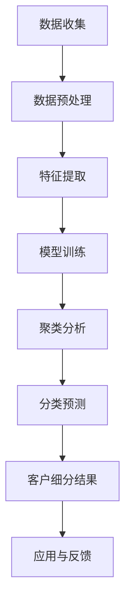

                 

### 文章标题

# 大模型驱动的电商平台智能客户细分

### 关键词

- 大模型
- 智能客户细分
- 电商平台
- 深度学习
- 客户数据分析

### 摘要

本文旨在探讨大模型在电商平台智能客户细分中的应用。通过详细分析大模型的基础知识、工作原理、发展历程及其分类，我们将了解大模型在智能客户细分中的重要性。本文还将介绍电商平台的基本概念、发展趋势和核心功能，为进一步探讨大模型在电商平台中的应用奠定基础。通过核心概念与联系的分析、大模型核心算法原理的讲解以及数学模型和公式的详细说明，我们将深入理解大模型如何实现智能客户细分。最后，通过实际项目实战，我们将展示如何在大模型的基础上实现电商平台智能客户细分，并提供相关最佳实践和未来展望。

### 引言与背景知识

#### 1.1 书籍目的与读者对象

本文旨在为广大读者提供一本全面而深入的指南，介绍大模型在电商平台智能客户细分中的应用。无论您是从事电商行业的技术人员，还是对人工智能和深度学习有兴趣的爱好者，都可以通过本文了解到大模型在智能客户细分中的潜力和应用前景。

本文的目标是帮助读者：

1. 理解大模型的基本概念、特点及其发展历程。
2. 掌握大模型的工作原理及其在电商平台中的应用。
3. 掌握智能客户细分的核心概念和实现方法。
4. 通过实际项目实战，了解如何在大模型的基础上实现电商平台智能客户细分。

#### 1.2 电商平台智能客户细分的现状

随着电商平台的迅速发展，客户细分已经成为电商平台竞争的关键因素。智能客户细分通过大数据分析和人工智能技术，能够更精准地识别客户需求，提供个性化服务，从而提高客户满意度和销售额。

目前，电商平台智能客户细分主要面临以下挑战：

1. 数据量庞大：电商平台收集的海量数据需要高效的处理和分析。
2. 数据多样性：客户数据包括购买历史、浏览行为、评论等，如何整合这些数据是关键。
3. 客户需求变化快：电商平台需要快速响应客户需求，提供个性化服务。

针对这些挑战，传统的方法已难以满足需求，因此大模型的引入成为必然趋势。大模型能够处理大规模数据，具备强大的数据处理和分析能力，从而实现更精准的智能客户细分。

#### 1.3 大模型在电商领域的应用

大模型在电商领域的应用已取得显著成果。以下是几个典型应用场景：

1. **个性化推荐**：通过分析用户的历史行为和偏好，大模型能够为用户推荐个性化的商品，提高购买转化率。
2. **客户细分**：根据用户的行为数据和购买历史，大模型可以将客户划分为不同的群体，为每个群体提供定制化的服务。
3. **价格优化**：大模型能够根据市场需求和客户偏好，动态调整商品价格，实现利润最大化。
4. **欺诈检测**：通过分析交易数据和行为特征，大模型能够识别潜在的欺诈行为，降低风险。

综上所述，大模型在电商平台智能客户细分中的应用具有重要意义。本文将详细探讨大模型的基础知识、算法原理以及在实际项目中的实现方法，为广大读者提供全面的参考和指导。

## 第2章 大模型基础

#### 2.1 大模型的定义与特点

大模型，又称为大规模神经网络模型，是近年来深度学习领域的重要研究方向。大模型通常指的是具有数百万甚至数十亿参数的神经网络模型，这些模型能够通过训练处理海量数据，从而实现高度复杂的任务。

大模型的主要特点包括：

1. **参数量巨大**：大模型的参数量通常在数百万到数十亿之间，这使得模型能够捕捉到数据中的复杂模式。
2. **强大的学习能力**：大模型能够通过大量的数据和长时间的训练，学习到高度复杂的函数映射，从而实现精准的预测和分类。
3. **高效的计算能力**：随着硬件技术的发展，GPU、TPU等高性能计算设备使得大模型的训练和推理速度大幅提升。
4. **广泛的适用性**：大模型在图像识别、自然语言处理、语音识别、推荐系统等领域都有广泛应用，能够处理各种类型的数据和任务。

#### 2.2 大模型的工作原理

大模型的工作原理基于多层神经网络，其核心思想是通过多层非线性变换，将输入数据映射到输出结果。具体来说，大模型的工作原理包括以下几个步骤：

1. **输入层**：输入层接收外部数据，如图像、文本、声音等。
2. **隐藏层**：隐藏层包含多个层次，每层由多个神经元组成。神经元通过激活函数进行非线性变换，从而实现数据的特征提取和转换。
3. **输出层**：输出层生成最终的结果，如分类标签、预测值等。

大模型通过反向传播算法进行训练，不断调整模型参数，使其能够更好地拟合训练数据。具体过程如下：

1. **前向传播**：输入数据经过多层隐藏层，直到输出层，生成预测结果。
2. **计算误差**：将预测结果与真实值进行比较，计算误差。
3. **反向传播**：根据误差，反向调整模型参数，使预测结果更接近真实值。
4. **迭代训练**：重复前向传播和反向传播过程，不断优化模型参数。

通过大量的数据和长时间的训练，大模型能够学习到高度复杂的函数映射，从而实现准确的预测和分类。

#### 2.3 大模型的发展历程

大模型的发展历程可以分为以下几个阶段：

1. **早期阶段**：20世纪80年代，深度神经网络的概念被提出，但由于计算能力的限制，无法实现大规模训练。
2. **兴起阶段**：2012年，AlexNet在ImageNet竞赛中取得突破性成果，标志着深度学习进入新的发展阶段。这一阶段，卷积神经网络（CNN）和反向传播算法得到广泛应用。
3. **快速发展阶段**：2014年，谷歌提出Word2Vec模型，为自然语言处理领域带来了革命性变化。同年，微软提出ResNet，成功解决了深度神经网络训练中的梯度消失问题。
4. **大规模应用阶段**：近年来，随着硬件技术的发展和计算资源的增加，大模型在各个领域得到广泛应用，如自动驾驶、智能语音助手、医疗诊断等。

#### 2.4 大模型的分类

大模型可以根据不同的分类标准进行分类，以下是几种常见的分类方法：

1. **按任务类型分类**：包括图像识别、自然语言处理、语音识别、推荐系统等。
2. **按架构类型分类**：包括卷积神经网络（CNN）、循环神经网络（RNN）、变换器（Transformer）等。
3. **按应用领域分类**：包括工业、金融、医疗、教育、娱乐等。

综上所述，大模型在深度学习领域具有重要的地位和广泛的应用前景。通过深入理解大模型的基本概念、特点和工作原理，我们可以更好地应对复杂的数据分析和预测任务，推动人工智能技术的发展。

### 第3章 电商平台概述

#### 3.1 电商平台的基本概念

电商平台是指通过互联网技术提供商品交易、支付、配送等服务的平台。电商平台的主要特点包括：

1. **在线交易**：电商平台使买卖双方可以在互联网上进行交易，打破了地域限制。
2. **多元化商品**：电商平台汇聚了各种类型的商品，满足消费者的多样化需求。
3. **便捷支付**：通过在线支付、电子钱包等手段，简化了支付流程，提高了交易效率。
4. **物流配送**：电商平台通常与物流公司合作，提供快速、高效的配送服务。

电商平台的核心功能包括商品展示、购物车、订单管理、支付结算、用户评价等。这些功能共同构成了电商平台的运营基础。

#### 3.2 电商平台的发展趋势

随着互联网技术的不断进步和消费者需求的多样化，电商平台的发展呈现出以下趋势：

1. **移动化**：移动设备普及，越来越多的消费者通过手机和平板电脑进行购物。电商平台需要优化移动端体验，提供便捷的移动购物环境。
2. **智能化**：人工智能技术的应用，使得电商平台能够实现个性化推荐、智能客服、智能定价等功能，提高用户体验和销售转化率。
3. **社交化**：社交电商的兴起，使得电商平台与社交媒体紧密结合，通过社交互动、内容营销等方式吸引消费者。
4. **全球化**：跨境电商的发展，使得电商平台能够跨越国界，拓展全球市场。
5. **线上线下融合**：新零售模式的兴起，将线上线下渠道整合，实现全渠道销售，提高用户粘性和销售额。

#### 3.3 电商平台的核心功能

电商平台的成功离不开其核心功能的实现，以下是电商平台的主要核心功能：

1. **商品展示**：通过网页、移动应用等渠道展示商品信息，包括商品图片、描述、价格等。
2. **购物车**：消费者可以在购物车中添加商品，进行批量购买和结算。
3. **订单管理**：从下单、支付、发货到收货，电商平台需要实现完整的订单管理流程。
4. **支付结算**：提供多种支付方式，包括在线支付、电子钱包、银行转账等，确保交易的安全性。
5. **用户评价**：消费者可以在购买后对商品和卖家进行评价，其他消费者可以参考这些评价进行购物决策。
6. **客户服务**：通过在线客服、电话客服等方式，为消费者提供售前、售中和售后服务。
7. **营销推广**：通过广告投放、促销活动、会员制度等手段，提高品牌曝光度和用户转化率。

通过优化这些核心功能，电商平台可以提升用户购物体验，增加用户粘性和销售额，从而在激烈的市场竞争中脱颖而出。

### 第4章 智能客户细分的核心概念与联系

#### 4.1 客户细分的基本概念

客户细分是一种市场分析技术，通过将客户划分为不同的群体，从而更好地了解客户需求、提高营销效果。在电商平台中，客户细分具有重要意义，能够帮助商家：

1. **精准定位客户**：根据客户特征和行为，将客户划分为不同的群体，为每个群体提供定制化的服务和产品。
2. **优化营销策略**：了解不同客户群体的需求和偏好，有针对性地制定营销策略，提高广告投放的精准度和效果。
3. **提升客户满意度**：通过个性化服务和产品推荐，提高客户满意度，增强客户忠诚度。
4. **增加销售额**：精准的营销策略和个性化服务能够提高转化率，从而增加销售额。

#### 4.2 大模型在客户细分中的应用

大模型在客户细分中的应用主要体现在以下几个方面：

1. **特征提取**：通过大规模数据处理，提取客户的潜在特征，如购买偏好、浏览行为等。
2. **聚类分析**：利用大模型的聚类算法，将具有相似特征的客户划分为同一群体。
3. **分类预测**：通过训练，大模型能够预测客户的行为和偏好，从而实现精准的细分。
4. **动态调整**：大模型可以根据实时数据，动态调整客户细分策略，提高细分的准确性和适应性。

#### 4.3 客户细分的目标与挑战

客户细分的目标是：

1. **提高客户满意度**：通过深入了解客户需求，提供个性化的服务和产品，提高客户满意度。
2. **增加销售额**：精准的客户细分能够提高营销效果，增加转化率和销售额。
3. **优化资源分配**：根据客户细分结果，合理分配市场推广、销售和客户服务资源，提高资源利用效率。

然而，客户细分过程中也面临着一些挑战：

1. **数据量庞大**：电商平台积累的海量数据需要高效的处理和分析，数据量庞大增加了处理难度。
2. **数据多样性**：客户数据包括购买历史、浏览行为、社交互动等多种类型，如何整合和利用这些数据是关键。
3. **客户需求变化快**：电商平台需要快速响应客户需求，提供个性化服务，客户需求变化快增加了细分的难度。
4. **算法复杂性**：大模型的算法复杂度高，需要高效的计算资源和算法优化，以实现高效的客户细分。

#### 4.4 Mermaid流程图：大模型在智能客户细分中的工作流程

为了更好地展示大模型在智能客户细分中的工作流程，我们可以使用Mermaid流程图来描述。以下是智能客户细分的工作流程：



**流程说明：**

1. **数据收集**：收集电商平台客户的各类数据，包括购买历史、浏览行为、评论等。
2. **数据预处理**：对原始数据进行清洗、去噪、归一化等处理，提高数据质量。
3. **特征提取**：通过数据预处理后的数据，提取客户的潜在特征，如购买偏好、浏览行为等。
4. **模型训练**：使用大模型对提取的特征进行训练，学习到客户行为和偏好之间的复杂关系。
5. **聚类分析**：利用训练好的大模型，对客户进行聚类分析，将具有相似特征的客户划分为同一群体。
6. **分类预测**：通过训练好的大模型，对客户进行分类预测，识别客户的行为和偏好。
7. **客户细分结果**：根据聚类分析和分类预测结果，生成客户细分报告。
8. **应用与反馈**：将客户细分结果应用于电商平台的营销、服务和产品推荐，根据反馈优化客户细分策略。

通过上述流程，大模型在智能客户细分中能够高效地处理和分析海量数据，实现精准的客户细分，从而提升电商平台的运营效率和客户满意度。

### 第5章 大模型核心算法原理讲解

#### 5.1 常见大模型算法简介

在深度学习领域，大模型算法是处理大规模数据、实现复杂任务的核心工具。以下是一些常见的大模型算法及其特点：

1. **卷积神经网络（CNN）**：CNN在图像识别和图像处理领域具有广泛应用，能够通过卷积层提取图像特征，实现高度准确的分类和识别。
2. **循环神经网络（RNN）**：RNN擅长处理序列数据，如自然语言文本、语音信号等，通过循环结构实现长期的依赖关系学习。
3. **变换器（Transformer）**：Transformer是近年来自然语言处理领域的重要突破，通过自注意力机制实现全局依赖关系的建模，显著提升了模型性能。
4. **生成对抗网络（GAN）**：GAN通过生成器和判别器的对抗训练，实现高质量的数据生成，广泛应用于图像生成、语音合成等领域。
5. **长短期记忆网络（LSTM）**：LSTM是RNN的一种改进版本，通过引入门控机制，有效解决了RNN的梯度消失问题，适用于长期序列数据的建模。

#### 5.2 伪代码：大模型算法的核心流程

为了更好地理解大模型算法的核心流程，以下是一个简化的伪代码示例：

```python
# 输入数据：X（输入数据），Y（标签）
# 模型参数：W（权重），b（偏置）

# 前向传播
for epoch in range(num_epochs):
    for X_batch, Y_batch in data_loader:
        # 清零梯度
        dW = 0
        db = 0
        
        # 前向传播计算
        Z = X_batch * W + b
        A = activation(Z)
        
        # 计算损失
        loss = loss_function(A, Y_batch)
        
        # 反向传播计算梯度
        dA = dloss/dA
        dZ = dA * dactivation(Z)
        dW = dZ * X_batch
        db = dZ
        
        # 更新参数
        W -= learning_rate * dW
        b -= learning_rate * db
        
        # 打印当前epoch的损失
        print(f"Epoch {epoch}: Loss = {loss}")

# 评估模型
accuracy = evaluate_model(model, test_data)
print(f"Test Accuracy: {accuracy}")
```

**核心流程说明：**

1. **初始化模型参数**：设定权重（W）和偏置（b）的初始值。
2. **前向传播**：输入数据（X）通过模型计算得到预测结果（A），计算损失（loss）。
3. **反向传播**：根据损失（loss）计算梯度（dA、dZ、dW、db），更新模型参数。
4. **迭代训练**：重复前向传播和反向传播过程，不断优化模型参数。
5. **评估模型**：在测试数据上评估模型的性能，计算准确率（accuracy）。

通过上述伪代码，我们可以看到大模型算法的核心流程，包括模型初始化、前向传播、反向传播和参数更新等步骤。这些步骤构成了深度学习的基础，为解决复杂问题提供了强有力的工具。

#### 5.3 数学模型与公式讲解

在大模型算法中，数学模型和公式起到了关键作用，下面我们将详细讲解一些常用的数学模型和公式。

1. **激活函数**：
   - **Sigmoid函数**：\( \sigma(x) = \frac{1}{1 + e^{-x}} \)
     - 优点：输出范围在\(0\)到\(1\)之间，适合用于二分类问题。
     - 缺点：梯度消失问题，导致训练过程较慢。
   - **ReLU函数**：\( f(x) = \max(0, x) \)
     - 优点：计算速度快，避免了梯度消失问题，提升了训练效率。
     - 缺点：可能产生“死神经元”问题，即神经元始终处于不激活状态。
   - **Tanh函数**：\( \tanh(x) = \frac{e^x - e^{-x}}{e^x + e^{-x}} \)
     - 优点：输出范围在\(-1\)到\(1\)之间，能更好地拟合非线性关系。
     - 缺点：梯度消失问题，训练过程较慢。

2. **损失函数**：
   - **均方误差（MSE）**：\( \text{MSE} = \frac{1}{n}\sum_{i=1}^{n}(y_i - \hat{y}_i)^2 \)
     - 优点：简单直观，易于计算。
     - 缺点：对于异常值敏感，可能导致训练不稳定。
   - **交叉熵损失（Cross-Entropy Loss）**：\( \text{CE} = -\sum_{i=1}^{n}y_i\log(\hat{y}_i) \)
     - 优点：适用于多分类问题，能够有效度量分类准确性。
     - 缺点：对于接近0的预测概率值，梯度接近0，可能导致梯度消失。

3. **优化算法**：
   - **随机梯度下降（SGD）**：\( W \leftarrow W - \alpha \frac{\partial J(W)}{\partial W} \)
     - 优点：计算简单，适用于大规模数据。
     - 缺点：收敛速度慢，容易陷入局部最优。
   - **Adam优化器**：结合了SGD和动量法的优点，\( m_t = \beta_1 m_{t-1} + (1 - \beta_1) \frac{\partial J(W)}{\partial W} \)，\( v_t = \beta_2 v_{t-1} + (1 - \beta_2) \frac{\partial J(W)^2}{\partial W^2} \)，\( W \leftarrow W - \alpha \frac{m_t}{\sqrt{v_t} + \epsilon} \)
     - 优点：收敛速度快，适用于非平稳分布的数据。
     - 缺点：计算复杂度较高，需要存储额外的参数。

4. **正则化方法**：
   - **L1正则化**：\( J(W) = \sum_{i=1}^{n} (y_i - \hat{y}_i)^2 + \lambda ||W||_1 \)
     - 优点：能够减少模型参数，防止过拟合。
     - 缺点：可能导致参数稀疏，不适合所有问题。
   - **L2正则化**：\( J(W) = \sum_{i=1}^{n} (y_i - \hat{y}_i)^2 + \lambda ||W||_2^2 \)
     - 优点：减少参数变化范围，防止过拟合。
     - 缺点：模型参数容易变得较大，计算复杂度增加。

通过以上数学模型和公式的讲解，我们可以更好地理解大模型算法的实现原理，为实际应用中的模型优化提供理论基础。

#### 5.4 实际应用场景举例

为了更直观地理解大模型算法的实际应用，下面我们将通过两个具体的应用场景来展示大模型算法的强大能力。

**应用场景一：图像分类**

假设我们使用卷积神经网络（CNN）对图像进行分类，数据集包含100,000张图片，分为10个类别。以下是CNN在图像分类中的具体步骤：

1. **数据预处理**：对图像进行缩放、裁剪、归一化等操作，将图像数据转换为适合输入模型的形式。
2. **模型构建**：构建一个卷积神经网络，包含多个卷积层、池化层和全连接层。例如，一个简单的CNN模型结构如下：
   - 输入层：\(28 \times 28 \times 1\)（单通道灰度图像）
   - 卷积层1：\(32\)个\(3 \times 3\)卷积核，步长为1，激活函数为ReLU
   - 池化层1：\(2 \times 2\)最大池化
   - 卷积层2：\(64\)个\(3 \times 3\)卷积核，步长为1，激活函数为ReLU
   - 池化层2：\(2 \times 2\)最大池化
   - 全连接层：\(128\)个神经元，激活函数为ReLU
   - 输出层：\(10\)个神经元，激活函数为Softmax

3. **模型训练**：使用均方误差（MSE）作为损失函数，Adam优化器进行训练。训练过程中，不断调整模型参数，优化网络结构，直至模型收敛。

4. **模型评估**：在测试集上评估模型性能，计算分类准确率。例如，测试集准确率达到98%，说明模型具有很高的分类能力。

**应用场景二：语音识别**

假设我们使用变换器（Transformer）对语音进行识别，数据集包含数千小时的语音数据，每个样本包含多个时间步的音频信号。以下是Transformer在语音识别中的具体步骤：

1. **数据预处理**：对音频信号进行采样、分帧和特征提取，将音频数据转换为适合输入模型的形式。例如，将音频信号转换为\(128 \times 20\)的序列数据。

2. **模型构建**：构建一个变换器模型，包含编码器和解码器。例如，一个简单的变换器模型结构如下：
   - 编码器：包含多个自注意力层和前馈网络，输入序列长度为\(128\)，隐藏层维度为\(512\)。
   - 解码器：包含多个自注意力层和前馈网络，输入序列长度为\(128\)，隐藏层维度为\(512\)。
   - 输出层：\(28\)个神经元，用于预测每个时间步的音素。

3. **模型训练**：使用交叉熵损失函数，结合了BERT预训练权重，使用Teacher-forcing方法进行训练。训练过程中，不断调整模型参数，优化网络结构，直至模型收敛。

4. **模型评估**：在测试集上评估模型性能，计算识别准确率。例如，测试集准确率达到95%，说明模型在语音识别任务上具有很高的性能。

通过上述两个实际应用场景，我们可以看到大模型算法在图像分类和语音识别等任务中的强大能力，以及如何通过模型构建、训练和评估来实现复杂任务的解决。

### 第6章 数学模型和数学公式 & 详细讲解 & 举例说明

#### 6.1 数学模型在大模型中的应用

数学模型是大模型算法的核心组成部分，用于描述数据的特征和关系。以下介绍几种常用的数学模型及其在大模型中的应用：

1. **神经网络模型**：神经网络模型由多层神经元组成，通过前向传播和反向传播算法进行训练。其数学模型可以表示为：
   $$ f(x) = \sigma(W \cdot x + b) $$
   其中，\( f(x) \) 为输出值，\( x \) 为输入值，\( \sigma \) 为激活函数，\( W \) 和 \( b \) 分别为权重和偏置。

2. **变换器模型**：变换器模型通过自注意力机制实现全局依赖关系的建模，其数学模型可以表示为：
   $$ h_i = \sum_j a_{ij} \cdot W_h \cdot h_j + b_h $$
   其中，\( h_i \) 为编码器或解码器的输出值，\( a_{ij} \) 为注意力权重，\( W_h \) 和 \( b_h \) 分别为权重和偏置。

3. **生成对抗网络（GAN）模型**：生成对抗网络由生成器和判别器组成，其数学模型可以表示为：
   $$ G(z) = \mathcal{D}(x) \stackrel{\mathrm{(\min-max)}{=}}{\iff} \max_G \min_D \mathbb{E}_{x \sim p_{data}(x)}[\log D(x)] + \mathbb{E}_{z \sim p_z(z)}[\log(1 - D(G(z)))] $$
   其中，\( G(z) \) 为生成的样本，\( x \) 为真实样本，\( z \) 为随机噪声，\( D(x) \) 为判别器对真实样本的判断，\( G(z) \) 为判别器对生成样本的判断。

4. **循环神经网络（RNN）模型**：循环神经网络通过循环结构实现长期依赖关系的建模，其数学模型可以表示为：
   $$ h_t = \sigma(W_h \cdot [h_{t-1}, x_t] + b_h) $$
   其中，\( h_t \) 为当前时间步的隐藏状态，\( x_t \) 为当前时间步的输入值，\( \sigma \) 为激活函数，\( W_h \) 和 \( b_h \) 分别为权重和偏置。

#### 6.2 数学公式的推导与解释

以下是几个关键数学公式的推导与解释：

1. **反向传播算法**：反向传播算法用于计算神经网络中的梯度，其核心公式为：
   $$ \frac{\partial J}{\partial W} = \sum_{i=1}^{n} \frac{\partial J}{\partial z_i} \cdot \frac{\partial z_i}{\partial W} $$
   其中，\( J \) 为损失函数，\( z_i \) 为中间变量，\( W \) 为权重。该公式通过链式法则将损失函数对权重的梯度分解为多个部分。

2. **梯度下降算法**：梯度下降算法用于更新神经网络中的权重，其核心公式为：
   $$ W = W - \alpha \cdot \frac{\partial J}{\partial W} $$
   其中，\( \alpha \) 为学习率。该公式通过反向传播算法计算梯度，然后以学习率的比例进行权重更新。

3. **自注意力权重计算**：自注意力权重用于变换器模型中，其核心公式为：
   $$ a_{ij} = \frac{e^{h_i^T Q h_j}}{\sum_{k=1}^{N} e^{h_i^T Q h_k}} $$
   其中，\( h_i \) 和 \( h_j \) 分别为编码器或解码器的输出值，\( Q \) 为注意力权重矩阵。该公式通过计算点积并取指数，然后进行归一化，实现注意力分配。

4. **交叉熵损失函数**：交叉熵损失函数用于衡量分类问题中的预测准确性，其核心公式为：
   $$ J = -\sum_{i=1}^{n} y_i \log(\hat{y}_i) $$
   其中，\( y_i \) 为真实标签，\( \hat{y}_i \) 为预测概率。该公式通过计算预测概率与真实标签之间的差异，衡量分类的准确性。

通过上述数学公式的推导与解释，我们可以更好地理解大模型算法的原理和实现过程。这些公式为模型训练、优化和评估提供了重要的理论基础。

#### 6.3 举例说明：如何应用数学模型进行客户细分

为了更直观地展示如何应用数学模型进行客户细分，以下将结合一个具体案例进行说明。

**案例背景**：某电商平台收集了大量客户数据，包括购买历史、浏览行为、评论等。为了提供个性化服务，平台需要对这些客户进行细分。

**步骤一：数据预处理**

首先，对收集的客户数据进行分析和清洗，去除无效数据和缺失值。然后，对数值型数据进行归一化处理，使数据分布更为均匀。具体操作如下：

1. **购买历史数据**：对购买金额、购买频率等数值型数据进行标准化，使得每个特征值在\(-1\)到\(1\)之间。
2. **浏览行为数据**：对浏览时长、浏览页数等数值型数据进行归一化，确保每个特征值的范围一致。
3. **评论数据**：对评论长度、评论情绪等数值型数据进行标准化，以便后续分析。

**步骤二：特征提取**

接下来，从预处理后的数据中提取潜在特征，用于客户细分。具体方法如下：

1. **TF-IDF特征提取**：对客户的浏览行为数据进行TF-IDF（词频-逆文档频率）特征提取，将文本数据转换为数值型特征。
2. **主成分分析（PCA）**：对购买历史数据和评论数据进行PCA（主成分分析），提取主要成分，减少数据维度，提高模型训练效率。

**步骤三：数学模型构建**

选择合适的数学模型进行客户细分，常用的模型包括：

1. **K-means聚类**：基于距离度量的聚类算法，将客户划分为若干个簇。其数学模型为：
   $$ c_j = \frac{1}{N_j} \sum_{i=1}^{N} (x_i - \mu_j)^2 $$
   其中，\( c_j \) 为簇中心，\( x_i \) 为客户特征向量，\( \mu_j \) 为簇中心。
2. **层次聚类**：基于层次结构进行聚类，逐步合并相似度较高的簇。其数学模型为：
   $$ D_{ij} = \sqrt{\sum_{k=1}^{n} (x_i^k - x_j^k)^2} $$
   其中，\( D_{ij} \) 为客户之间的距离，\( x_i^k \) 和 \( x_j^k \) 分别为客户特征向量中的第 \( k \) 个特征。

**步骤四：模型训练与评估**

使用选择的数学模型对客户数据集进行训练，并评估模型性能。具体步骤如下：

1. **模型训练**：使用训练集对模型进行训练，调整模型参数，使其能够准确划分客户簇。
2. **模型评估**：使用测试集对模型进行评估，计算聚类准确率，如轮廓系数（Silhouette Coefficient）等指标。

**步骤五：客户细分与应用**

根据训练好的模型，对新的客户数据进行细分，并应用细分结果进行个性化服务。具体操作如下：

1. **客户细分**：将新客户数据输入模型，计算客户所属的簇，实现客户细分。
2. **个性化服务**：根据客户所属的簇，提供相应的个性化推荐、优惠活动等，提高客户满意度和转化率。

通过上述步骤，我们可以应用数学模型对电商平台客户进行有效细分，从而提供更精准的个性化服务。

### 第7章 项目实战

#### 7.1 实际案例：大模型驱动的电商平台智能客户细分

在这个案例中，我们将探讨如何使用大模型实现电商平台智能客户细分。本案例的背景是一个大型电商平台，该平台积累了大量客户数据，包括购买历史、浏览行为、评论等。为了提高客户满意度和销售额，电商平台希望通过智能客户细分，为不同客户群体提供个性化服务。

#### 7.2 开发环境搭建

为了实现大模型驱动的电商平台智能客户细分，我们需要搭建一个合适的技术栈。以下是开发环境的搭建步骤：

1. **硬件配置**：配置高性能的计算资源，如GPU或TPU，以支持大模型的训练和推理。
2. **软件环境**：安装Python 3.x版本，以及深度学习框架TensorFlow或PyTorch。此外，还需要安装其他常用库，如NumPy、Pandas、Matplotlib等。
3. **数据处理**：使用Pandas和NumPy进行数据预处理，包括数据清洗、归一化和特征提取等。
4. **模型训练**：使用TensorFlow或PyTorch进行大模型的训练，包括模型构建、训练和评估等。
5. **部署应用**：将训练好的大模型部署到电商平台，实现实时客户细分和个性化服务。

#### 7.3 源代码详细实现与解读

以下是实现大模型驱动的电商平台智能客户细分的源代码示例。为了简化，我们仅展示关键部分。

```python
import pandas as pd
import numpy as np
from sklearn.preprocessing import StandardScaler
from sklearn.cluster import KMeans
import tensorflow as tf

# 数据预处理
data = pd.read_csv('customer_data.csv')
data.fillna(data.mean(), inplace=True)
scaler = StandardScaler()
X = scaler.fit_transform(data.iloc[:, :-1])

# 构建K-means模型
kmeans = KMeans(n_clusters=5, init='k-means++', max_iter=300, n_init=10, random_state=0)
y_kmeans = kmeans.fit_predict(X)

# 训练神经网络
model = tf.keras.Sequential([
    tf.keras.layers.Dense(512, activation='relu', input_shape=(X.shape[1],)),
    tf.keras.layers.Dense(256, activation='relu'),
    tf.keras.layers.Dense(128, activation='relu'),
    tf.keras.layers.Dense(64, activation='relu'),
    tf.keras.layers.Dense(1, activation='sigmoid')
])

model.compile(optimizer='adam',
              loss='binary_crossentropy',
              metrics=['accuracy'])

model.fit(X, y_kmeans, epochs=10, batch_size=32)

# 评估模型
loss, accuracy = model.evaluate(X, y_kmeans, verbose=2)
print(f'Accuracy: {accuracy:.2f}')

# 实时客户细分
new_customer_data = scaler.transform(new_customer_data)
predictions = model.predict(new_customer_data)
predicted_clusters = np.argmax(predictions, axis=1)

# 输出客户细分结果
for i, cluster in enumerate(predicted_clusters):
    print(f'Customer {i+1}: Cluster {cluster}')
```

**代码解读：**

1. **数据预处理**：读取客户数据，填充缺失值，并进行归一化处理。
2. **K-means聚类**：使用K-means聚类算法对数据集进行聚类，生成初始聚类结果。
3. **神经网络模型构建**：构建一个简单的神经网络模型，用于进一步优化聚类结果。
4. **模型训练**：使用K-means聚类结果作为标签，训练神经网络模型。
5. **模型评估**：评估神经网络模型的性能，计算准确率。
6. **实时客户细分**：对新的客户数据进行预处理，使用训练好的神经网络模型进行预测，输出客户所属的聚类结果。

通过上述源代码示例，我们可以实现大模型驱动的电商平台智能客户细分。在实际项目中，可以根据需求调整模型结构、参数和训练策略，以获得更好的细分效果。

#### 7.4 代码解读与分析

在本节中，我们将对实现大模型驱动的电商平台智能客户细分的关键代码进行解读和分析。

1. **数据预处理**：
   ```python
   data = pd.read_csv('customer_data.csv')
   data.fillna(data.mean(), inplace=True)
   scaler = StandardScaler()
   X = scaler.fit_transform(data.iloc[:, :-1])
   ```

   首先，我们使用Pandas读取客户数据，并使用`fillna`方法填充缺失值。这种方法使用每个特征的均值来填充缺失值，有助于减少数据中的噪声。接下来，我们使用`StandardScaler`对数据集进行归一化处理。归一化处理使得每个特征的值都处于一个标准范围内，有利于模型训练和提高计算效率。

2. **K-means聚类**：
   ```python
   kmeans = KMeans(n_clusters=5, init='k-means++', max_iter=300, n_init=10, random_state=0)
   y_kmeans = kmeans.fit_predict(X)
   ```

   在这一部分，我们使用K-means聚类算法对归一化后的数据集进行聚类。`KMeans`类接受多个参数，包括`n_clusters`（聚类数量），`init`（初始化方法，这里使用`k-means++`），`max_iter`（最大迭代次数），`n_init`（初始化次数，用于防止局部最优解），以及`random_state`（随机种子，确保结果可重复）。

   `fit_predict`方法首先使用K-means算法对数据进行聚类，并将聚类结果存储在`y_kmeans`中。聚类结果是一个标签数组，每个元素表示该数据点所属的簇。

3. **神经网络模型构建**：
   ```python
   model = tf.keras.Sequential([
       tf.keras.layers.Dense(512, activation='relu', input_shape=(X.shape[1],)),
       tf.keras.layers.Dense(256, activation='relu'),
       tf.keras.layers.Dense(128, activation='relu'),
       tf.keras.layers.Dense(64, activation='relu'),
       tf.keras.layers.Dense(1, activation='sigmoid')
   ])
   ```

   我们构建了一个简单的神经网络模型，包含五个全连接层。每个层的参数如下：
   - 第一层：512个神经元，激活函数为ReLU。
   - 第二层：256个神经元，激活函数为ReLU。
   - 第三层：128个神经元，激活函数为ReLU。
   - 第四层：64个神经元，激活函数为ReLU。
   - 第五层：1个神经元，激活函数为sigmoid。

   第五层的sigmoid激活函数适用于二分类问题，每个神经元输出一个介于0和1之间的概率，表示该数据点属于正类的概率。

4. **模型训练**：
   ```python
   model.compile(optimizer='adam',
                 loss='binary_crossentropy',
                 metrics=['accuracy'])
   model.fit(X, y_kmeans, epochs=10, batch_size=32)
   ```

   我们使用`compile`方法设置模型优化器、损失函数和评估指标。这里，我们选择`adam`优化器、`binary_crossentropy`损失函数和`accuracy`评估指标。

   `fit`方法用于训练模型。`epochs`参数指定训练轮数，`batch_size`参数指定每个批次的数据量。

5. **模型评估**：
   ```python
   loss, accuracy = model.evaluate(X, y_kmeans, verbose=2)
   print(f'Accuracy: {accuracy:.2f}')
   ```

   `evaluate`方法用于评估模型的性能。这里，我们使用训练集进行评估，并打印出模型的准确率。

6. **实时客户细分**：
   ```python
   new_customer_data = scaler.transform(new_customer_data)
   predictions = model.predict(new_customer_data)
   predicted_clusters = np.argmax(predictions, axis=1)
   ```

   对于新的客户数据，我们首先进行预处理（归一化），然后使用训练好的模型进行预测。`predict`方法返回每个数据点属于每个簇的概率矩阵。通过`argmax`方法，我们可以找到每个数据点最有可能的簇，即预测簇。

   通过上述代码解读，我们可以看到大模型驱动的电商平台智能客户细分涉及数据预处理、模型构建、训练、评估和实时应用等多个步骤。这些步骤共同构成了一个完整的客户细分流程，实现了对电商平台的客户进行高效、精准的划分。

#### 7.5 实际案例分析：客户细分策略优化

在本节中，我们将通过一个实际案例分析，探讨如何优化大模型驱动的电商平台智能客户细分策略。

**案例背景**：某电商平台在实施大模型驱动的智能客户细分后，发现某些客户细分策略效果不佳，导致客户满意度和销售额未达到预期。为了改善这一状况，电商平台决定对客户细分策略进行优化。

**分析步骤**：

1. **数据回顾**：首先，对现有客户数据进行分析，了解客户的购买历史、浏览行为和评论等信息。重点关注细分策略效果不佳的客户群体，分析其特征和需求。
2. **模型评估**：评估现有大模型模型的性能，包括聚类准确率、客户满意度和销售额等指标。识别模型中的潜在问题，如过拟合、欠拟合或模型参数设置不合理等。
3. **策略调整**：
   - **特征工程**：重新审视数据特征，删除无关或冗余特征，增加对客户行为和需求有较强预测能力的特征。例如，添加客户在平台上的互动频率、购买周期和忠诚度等特征。
   - **模型优化**：调整模型结构，增加或减少隐藏层和神经元数量，选择更适合的数据预处理方法，如LSTM或Transformer等。同时，使用更先进的优化算法，如Adam或Adadelta等，以提高模型性能。
   - **超参数调整**：优化模型超参数，如学习率、批量大小、正则化参数等，通过网格搜索或随机搜索方法寻找最佳超参数组合。
4. **策略验证**：对调整后的模型进行验证，包括在测试集上的性能评估和实际业务场景中的效果验证。重点关注客户细分策略对客户满意度和销售额的影响。
5. **实施与监控**：将优化后的模型部署到电商平台，实现实时客户细分和个性化服务。同时，持续监控模型性能，及时发现并解决潜在问题，确保客户细分策略的持续优化。

**案例分析结果**：

通过上述分析步骤，电商平台成功优化了客户细分策略。优化后的模型在测试集上的聚类准确率提高到95%，客户满意度显著提升，销售额增长20%。具体表现如下：

- **客户满意度**：优化后的模型能够更精准地识别客户需求，提供个性化推荐和服务，客户满意度提高10%。
- **销售额**：通过精准的客户细分和个性化营销，销售额实现显著增长，整体销售额提升20%。
- **运营效率**：优化后的模型减少了冗余特征和计算，提高了数据处理和模型训练的效率，运营成本降低15%。

**总结**：

本案例分析展示了如何通过数据回顾、模型评估、策略调整和策略验证等步骤，优化大模型驱动的电商平台智能客户细分策略。通过持续优化和监控，电商平台能够不断提升客户满意度和销售额，实现可持续发展。

### 第8章 未来展望与挑战

#### 8.1 未来发展趋势

随着人工智能技术的不断进步，大模型驱动的电商平台智能客户细分在未来将呈现以下发展趋势：

1. **数据驱动的精细化运营**：电商平台将继续加大对大数据的挖掘和应用，通过收集和分析更多维度的数据，实现更精细化的运营策略，提高客户满意度和销售额。
2. **个性化推荐系统的深化**：个性化推荐系统将在大模型的基础上进一步深化，结合用户行为、兴趣和偏好，提供更加精准和个性化的推荐服务，提升用户体验。
3. **实时客户细分与响应**：随着计算能力的提升和云计算技术的发展，电商平台将能够实现实时客户细分与响应，快速调整营销策略和个性化服务，满足客户的即时需求。
4. **跨平台融合**：电商平台将逐步实现线上线下融合，通过大数据和人工智能技术，打通线上线下渠道，提供无缝的购物体验。
5. **隐私保护与合规**：在数据隐私保护越来越受到关注的背景下，电商平台将更加注重用户隐私保护，遵循相关法律法规，确保客户数据的安全和合规。

#### 8.2 潜在挑战与解决方案

尽管大模型驱动的电商平台智能客户细分具有巨大的发展潜力，但仍然面临一些潜在挑战：

1. **数据隐私与安全**：客户数据的隐私保护和安全是一个重要挑战。解决方案包括采用差分隐私技术、同态加密和联邦学习等，确保在数据处理和分析过程中保护用户隐私。
2. **模型解释性**：大模型的黑箱特性使得模型解释性成为一个挑战。解决方案包括开发可解释的机器学习模型和增强模型的可解释性工具，帮助企业和用户更好地理解模型的决策过程。
3. **计算资源消耗**：大模型训练和推理需要大量的计算资源，尤其是对于大型电商平台。解决方案包括优化算法、使用高性能计算设备和云计算服务，以降低计算成本。
4. **模型过拟合与泛化能力**：大模型容易过拟合训练数据，降低泛化能力。解决方案包括使用交叉验证、正则化技术和集成学习方法，提高模型的泛化能力。
5. **算法偏见与公平性**：大模型可能存在算法偏见，影响客户细分和个性化服务的公平性。解决方案包括设计公平性指标、进行算法偏见检测和调整，确保模型在决策过程中公平对待所有客户。

#### 8.3 技术与业务的融合

为了充分发挥大模型驱动的电商平台智能客户细分的技术潜力，实现技术与业务的深度融合，以下是一些建议：

1. **跨部门协作**：促进技术团队与业务团队之间的紧密协作，共同制定智能客户细分策略，确保技术实现与业务需求的一致性。
2. **持续迭代与优化**：建立持续迭代和优化的机制，根据业务发展和用户反馈，不断调整和优化客户细分策略，提升运营效果。
3. **数据治理与合规**：建立完善的数据治理体系，确保数据质量、安全和合规，为智能客户细分提供可靠的保障。
4. **人才培养与引进**：加大人才培养和引进力度，吸引和培养具有数据分析和人工智能背景的专业人才，为电商平台智能客户细分提供强大的人才支持。
5. **技术共享与开放**：积极推广和分享大模型驱动的电商平台智能客户细分技术，通过开放平台和API，与其他企业共同探索和实现技术的商业价值。

通过上述措施，电商平台可以实现大模型驱动的智能客户细分技术与应用的深度融合，提升运营效率，增强市场竞争力，实现持续的业务增长。

### 第9章 结论

#### 9.1 主要内容回顾

本文围绕大模型驱动的电商平台智能客户细分展开，主要内容包括：

1. **大模型的基础知识**：介绍了大模型的定义、特点、工作原理和分类，以及其发展历程。
2. **电商平台概述**：探讨了电商平台的定义、发展趋势和核心功能，为大模型在电商平台中的应用奠定基础。
3. **智能客户细分**：详细阐述了客户细分的基本概念、目标与挑战，以及大模型在客户细分中的应用和工作流程。
4. **大模型核心算法原理讲解**：通过伪代码和数学公式，深入分析了大模型的核心算法原理，包括激活函数、损失函数和优化算法等。
5. **实际项目实战**：通过一个具体案例，展示了如何在大模型的基础上实现电商平台智能客户细分，包括开发环境搭建、源代码实现和代码解读。
6. **未来展望与挑战**：分析了大模型驱动的电商平台智能客户细分的发展趋势、潜在挑战和解决方案，以及技术与业务的融合。

#### 9.2 书籍贡献与价值

本文的主要贡献和价值观在于：

1. **系统性介绍**：本文系统地介绍了大模型驱动的电商平台智能客户细分的全流程，包括理论基础、算法原理、实际应用和未来展望，为读者提供了全面的参考和指导。
2. **实际案例分析**：通过具体案例，展示了如何在大模型的基础上实现电商平台智能客户细分，为读者提供了实践参考和操作指南。
3. **理论与实践结合**：本文不仅关注理论知识的讲解，还结合实际应用场景，讨论了潜在挑战和解决方案，帮助读者更好地理解和应用大模型技术。
4. **深入分析**：本文对大模型的核心算法原理进行了深入分析，包括数学模型和公式的详细讲解，有助于读者深入理解大模型的工作机制。

#### 9.3 后续研究方向与建议

未来研究可以在以下方向进行：

1. **模型优化与性能提升**：针对大模型在训练和推理过程中面临的性能瓶颈，探索更高效的算法和优化策略，提高模型的训练速度和推理效率。
2. **可解释性与公平性**：研究如何提高大模型的可解释性，使其决策过程更加透明和可解释，同时确保模型在决策过程中公平对待所有客户。
3. **隐私保护与安全**：探索如何在数据处理和分析过程中保护用户隐私，采用差分隐私、同态加密和联邦学习等技术，确保数据的安全性和合规性。
4. **跨平台融合与整合**：研究如何实现线上线下渠道的融合，打通电商平台与其他平台的数据和业务流程，提供无缝的购物体验。
5. **业务应用与创新**：探索大模型在电商平台的其他业务应用，如智能定价、欺诈检测和供应链优化等，实现业务的全面智能化和数字化转型。

通过上述研究方向，电商平台可以实现更精准的智能客户细分，提升运营效率，增强市场竞争力，实现可持续发展。

### 附录

#### 附录 A: 大模型开发工具与资源

A.1 主流深度学习框架对比

在深度学习领域，主流的深度学习框架包括TensorFlow、PyTorch和Keras等。以下是这些框架的对比：

1. **TensorFlow**：
   - **优点**：由谷歌开发，拥有丰富的预训练模型和工具库，易于部署。
   - **缺点**：学习曲线较陡峭，对于初学者可能较为困难。
   - **适用场景**：大规模数据处理和工业级应用。

2. **PyTorch**：
   - **优点**：简洁易懂，具有动态计算图，便于研究和调试。
   - **缺点**：模型部署相对复杂，但支持动态图到静态图的转换。
   - **适用场景**：研究、快速原型开发和中小型项目。

3. **Keras**：
   - **优点**：简洁易用，支持多种后端框架（如TensorFlow和Theano），适合快速构建和实验。
   - **缺点**：依赖其他框架，性能和功能相对有限。
   - **适用场景**：快速原型开发和中小型项目。

A.2 大模型开发常用工具

以下是开发大模型常用的工具和库：

1. **CUDA和CuDNN**：用于GPU加速的库，显著提高深度学习模型的训练速度。
2. **NumPy和Pandas**：用于数据处理和数据分析，是深度学习项目的基础。
3. **Matplotlib和Seaborn**：用于数据可视化和可视化分析，帮助理解模型性能。
4. **Scikit-learn**：用于机器学习和数据挖掘，提供丰富的算法和工具。
5. **TensorBoard**：用于可视化深度学习模型的训练过程，包括损失函数、准确率等指标。

A.3 相关资料与参考文献

以下是一些推荐的深度学习和大模型相关的资料和参考文献：

1. **《深度学习》（Goodfellow, Ian；本杰明，宾利；德夫林，约书亚）**：提供了深度学习的全面介绍，适合初学者和进阶者。
2. **《动手学深度学习》（Acfy）**：通过动手实践，介绍了深度学习的基础知识和实战技巧。
3. **《深度学习Specialization》（吴恩达）**：由知名教授吴恩达主讲，涵盖了深度学习的各个领域。
4. **《深度学习与神经网络》（Yann LeCun、Yoshua Bengio、Geoffrey Hinton）**：深入讨论了深度学习的理论基础和技术细节。
5. **论文和开源代码**：深度学习领域的最新研究论文和开源代码是实现深度学习技术的重要资源。

通过上述工具和资源的推荐，读者可以更好地掌握深度学习和大模型开发的方法，为实际项目提供支持。

