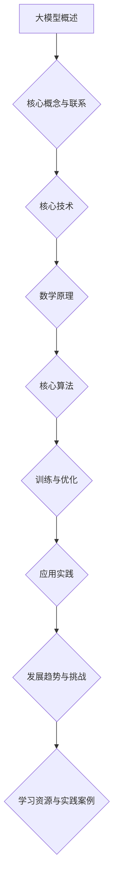
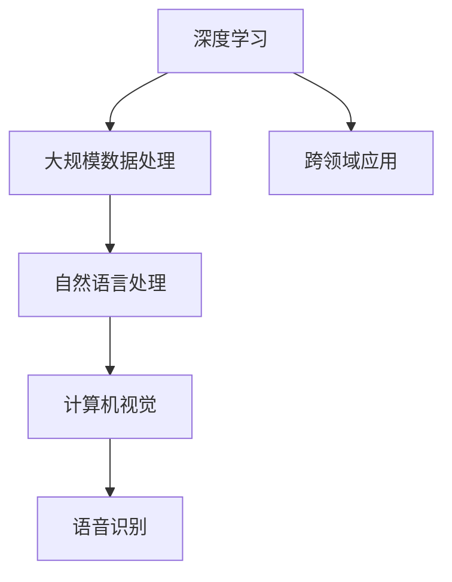
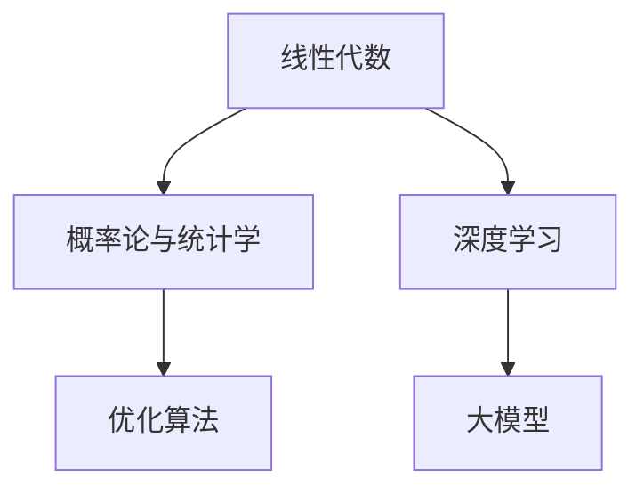
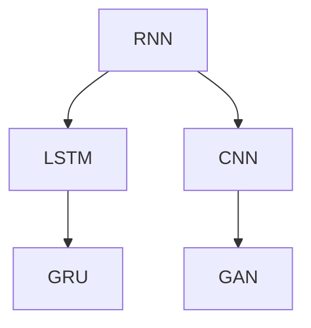
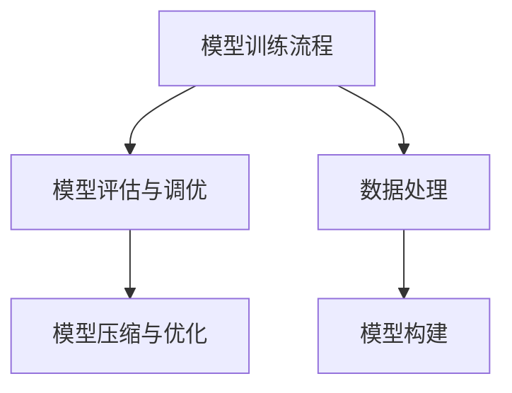
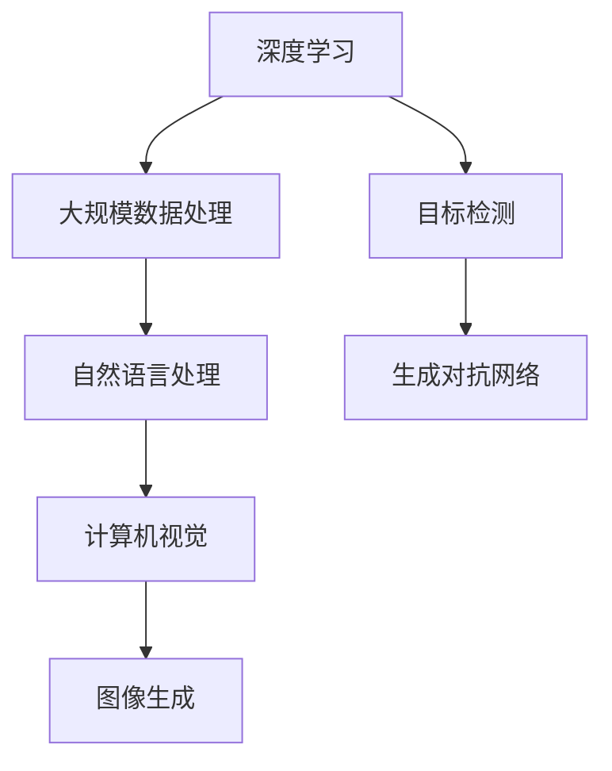
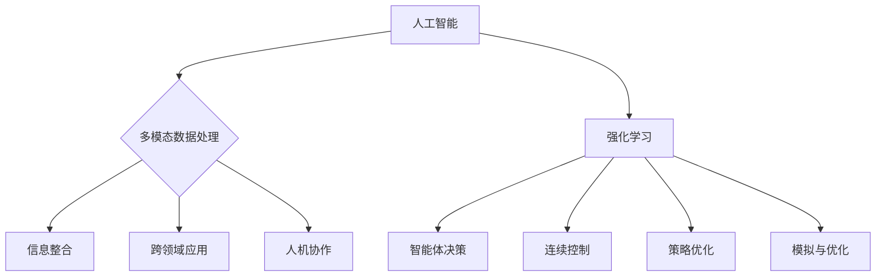

                 

### 文章标题

# 大模型：科技创新的前沿探索

大模型是近年来人工智能领域的一个重要研究方向，其强大的表征能力和广泛的适用性为科技创新带来了新的可能性。本文将从大模型的概念、核心技术、数学原理、核心算法、训练与优化、应用实践、发展趋势以及挑战与应对策略等方面，系统地探讨大模型在科技创新中的前沿探索。

## 关键词

- 大模型
- 科技创新
- 深度学习
- 自然语言处理
- 计算机视觉
- 数学原理
- 算法
- 应用实践

## 摘要

本文旨在为大模型提供一个全面的概述，探讨其在科技创新中的重要作用。文章首先介绍了大模型的概念和背景，随后详细解析了其核心技术、数学原理和核心算法。接着，本文讨论了大模型的训练与优化过程，并展示了其在自然语言处理和计算机视觉等领域的应用实践。最后，文章展望了大模型的发展趋势和面临的挑战，并提出了一些应对策略。

### 《大模型：科技创新的前沿探索》目录大纲

#### 第一部分：大模型概述与核心概念

##### 第1章：大模型的概念与背景
1.1 大模型的定义与重要性
1.2 大模型的历史与发展
1.3 大模型的应用领域

##### 第2章：大模型的核心技术
2.1 深度学习基础
2.2 大规模数据处理技术
2.3 自然语言处理技术
2.4 计算机视觉技术

#### 第二部分：大模型的数学原理

##### 第3章：大模型背后的数学原理
3.1 线性代数基础
3.2 概率论与统计学基础
3.3 深度学习中的优化算法

##### 第4章：大模型的核心算法
4.1 循环神经网络（RNN）
4.2 长短时记忆网络（LSTM）
4.3 改进的LSTM网络（GRU）
4.4 卷积神经网络（CNN）
4.5 生成对抗网络（GAN）

##### 第5章：大模型的训练与优化
5.1 模型训练的基本流程
5.2 模型评估与调优
5.3 模型压缩与优化

#### 第三部分：大模型的应用实践

##### 第6章：大模型在自然语言处理中的应用
6.1 大模型在文本分类中的应用
6.2 大模型在机器翻译中的应用
6.3 大模型在情感分析中的应用

##### 第7章：大模型在计算机视觉中的应用
7.1 大模型在图像分类中的应用
7.2 大模型在目标检测中的应用
7.3 大模型在图像生成中的应用

##### 第8章：大模型在跨领域中的应用
8.1 大模型在医疗健康领域的应用
8.2 大模型在金融领域的应用
8.3 大模型在教育领域的应用

#### 第四部分：大模型的发展与未来趋势

##### 第9章：大模型的发展趋势
9.1 大模型在人工智能中的未来角色
9.2 大模型在多模态数据处理中的应用
9.3 大模型在强化学习中的应用

##### 第10章：大模型的发展挑战与应对策略
10.1 大模型面临的伦理与道德挑战
10.2 大模型在计算资源与能耗方面的挑战
10.3 大模型在数据隐私与安全方面的挑战

### 附录

##### 附录A：大模型学习资源与工具
A.1 主流深度学习框架
A.2 大模型开源资源
A.3 大模型学习资料与教程

##### 附录B：大模型实践案例
B.1 自然语言处理案例
B.2 计算机视觉案例
B.3 跨领域应用案例

## Mermaid 流程图



### 第1章：大模型的概念与背景

在进入大模型的详细探讨之前，我们首先需要明确什么是大模型，以及它在当今科技领域中的地位和重要性。

#### 1.1 大模型的定义与重要性

**定义：** 大模型（Large Model）是指具有数百万至数十亿参数的深度学习模型。这些模型通常通过大规模数据集进行预训练，具有强大的表征能力和泛化能力，广泛应用于自然语言处理、计算机视觉、语音识别等任务。

**重要性：** 大模型的重要性主要体现在以下几个方面：

- **强大的表征能力：** 大模型能够从海量数据中学习到丰富的特征表示，这些特征对于各种任务都具有很好的泛化能力。
- **高效的计算性能：** 大模型通常采用分布式训练和推理技术，能够利用多台GPU或TPU进行并行计算，大幅提高计算性能。
- **广泛的适用性：** 大模型可以应用于多种领域和任务，为人工智能的发展提供了新的可能性。

#### 1.2 大模型的历史与发展

大模型的历史可以追溯到深度学习领域的早期。1990年代初，神经网络的研究逐渐兴起，但由于计算资源的限制，当时的模型规模相对较小。随着计算能力的不断提升，深度学习模型开始迅速发展。

- **2012年：** AlexNet模型的提出标志着深度学习在图像识别任务上取得了重大突破，也开启了深度学习在各个领域的研究和应用。
- **2018年：** 谷歌提出了Transformer模型，并在自然语言处理任务上取得了显著的成果，大模型的研究开始受到广泛关注。
- **至今：** 大模型的规模和性能不断突破，各种大模型如BERT、GPT、ViT等在各个领域取得了显著的成果。

#### 1.3 大模型的应用领域

大模型的应用领域非常广泛，主要包括：

- **自然语言处理：** 大模型在文本分类、机器翻译、情感分析、问答系统等任务上取得了显著成果。
- **计算机视觉：** 大模型在图像分类、目标检测、图像生成等任务上表现出色。
- **语音识别：** 大模型在语音识别、语音合成等任务上具有强大的能力。
- **其他领域：** 大模型在医学诊断、金融预测、教育辅助等跨领域应用中也显示出巨大的潜力。

### 1.4 大模型的核心概念与联系

为了更好地理解大模型，我们需要探讨其核心概念之间的联系。以下是几个关键概念及其关系：

- **深度学习：** 大模型的基础是深度学习，这是一种通过多层神经网络进行特征学习和表示学习的机器学习技术。
- **大规模数据处理：** 大模型的训练需要大量的数据，这涉及到大规模数据存储、数据预处理和分布式数据处理等技术。
- **自然语言处理：** 大模型在自然语言处理中的应用，如文本分类、机器翻译和情感分析，依赖于其强大的表征能力和泛化能力。
- **计算机视觉：** 大模型在计算机视觉中的应用，如图像分类、目标检测和图像生成，同样依赖于其从数据中学习到的丰富特征表示。

以下是一个Mermaid流程图，展示了这些核心概念之间的联系：



### 1.5 大模型的数学原理

大模型的成功离不开其背后的数学原理。以下是几个关键数学概念：

- **线性代数：** 线性代数是深度学习的基础，涉及矩阵运算、向量空间、特征分解等。
- **概率论与统计学：** 概率论与统计学用于模型参数的估计、误差分析、概率分布等。
- **优化算法：** 优化算法用于模型参数的优化，包括梯度下降、随机梯度下降、Adam优化器等。

以下是这些数学概念之间的联系：



### 1.6 大模型的核心算法

大模型的核心算法是其强大的表征能力和泛化能力的关键。以下是几个核心算法：

- **循环神经网络（RNN）：** RNN能够处理序列数据，通过记忆过去的信息来预测未来的输出。
- **长短时记忆网络（LSTM）：** LSTM是RNN的一种改进，能够更好地处理长序列数据。
- **改进的LSTM网络（GRU）：** GRU是LSTM的另一种改进，具有更简单的结构和更好的性能。
- **卷积神经网络（CNN）：** CNN适用于处理图像数据，通过卷积操作提取图像特征。
- **生成对抗网络（GAN）：** GAN用于生成高质量的数据，通过对抗性训练生成逼真的图像、音频等。

以下是这些核心算法之间的联系：



### 1.7 大模型的训练与优化

大模型的训练与优化是确保其性能的关键步骤。以下是几个关键环节：

- **模型训练的基本流程：** 包括数据预处理、模型构建、训练和评估。
- **模型评估与调优：** 通过交叉验证、测试集评估模型性能，并根据评估结果进行调整。
- **模型压缩与优化：** 包括模型剪枝、量化、知识蒸馏等技术，以减小模型大小和提高推理速度。

以下是这些环节之间的联系：



### 第1章小结

本章对大模型的概念、历史、应用领域以及核心概念与联系进行了详细探讨。大模型作为一种具有强大表征能力和广泛适用性的深度学习模型，正在推动人工智能的发展。下一章将深入探讨大模型的核心技术，包括深度学习基础、大规模数据处理技术、自然语言处理技术和计算机视觉技术。

### 第2章：大模型的核心技术

在大模型的研究与应用过程中，核心技术的掌握至关重要。本章将详细介绍大模型的核心技术，包括深度学习基础、大规模数据处理技术、自然语言处理技术和计算机视觉技术。

#### 2.1 深度学习基础

**定义与重要性：** 深度学习是一种通过多层神经网络进行特征学习和表示学习的机器学习技术。它能够从大量数据中自动学习复杂的特征表示，从而提高模型的性能和泛化能力。

**基本概念：**
- **神经元：** 神经元是神经网络的基本单位，负责接收输入、传递信号并进行非线性变换。
- **层：** 神经网络由多个层次组成，包括输入层、隐藏层和输出层。
- **激活函数：** 激活函数用于引入非线性变换，常见的激活函数有Sigmoid、ReLU、Tanh等。
- **反向传播：** 反向传播是一种用于训练神经网络的算法，通过计算误差梯度并更新模型参数。

**伪代码：**
```python
def forward_pass(input_data, model_params):
    # 前向传播计算输出
    output = model_params['weights'] @ input_data + model_params['biases']
    activation = activation_function(output)
    return activation

def backward_pass(output, target, model_params, learning_rate):
    # 反向传播计算误差梯度
    error = output - target
    gradients = error * activation_function_derivative(output)
    model_params['weights'] -= learning_rate * gradients
    model_params['biases'] -= learning_rate * gradients
```

**数学模型与公式：**
- 神经网络输出计算公式：
  $$\text{output} = \text{weights} \cdot \text{input} + \text{biases}$$
  $$\text{activation} = \text{activation_function}(\text{output})$$
- 误差计算公式：
  $$\text{error} = \text{output} - \text{target}$$
- 梯度计算公式：
  $$\text{gradients} = \text{error} \cdot \text{activation_function_derivative}(\text{output})$$

#### 2.2 大规模数据处理技术

**定义与重要性：** 大规模数据处理技术是指用于处理海量数据的算法和技术，包括数据存储、数据预处理、分布式计算等。

**基本概念：**
- **数据存储：** 大规模数据处理需要高效的数据存储解决方案，如Hadoop、HDFS等。
- **数据预处理：** 数据预处理包括数据清洗、数据转换、特征提取等步骤，以提高数据质量和模型性能。
- **分布式计算：** 分布式计算技术能够将数据处理任务分布到多台计算机上，提高计算效率和性能。

**伪代码：**
```python
def distributed_data_processing(data, num_workers):
    # 分布式数据处理
    chunks = split_data_into_chunks(data, num_workers)
    processed_chunks = []
    for chunk in chunks:
        processed_chunk = preprocess_data(chunk)
        processed_chunks.append(processed_chunk)
    return merge_chunks(processed_chunks)
```

**数学模型与公式：**
- 数据分割公式：
  $$\text{chunks} = \text{split_data_into_chunks}(\text{data}, \text{num_workers})$$
- 数据合并公式：
  $$\text{merged_data} = \text{merge_chunks}(\text{processed_chunks})$$

#### 2.3 自然语言处理技术

**定义与重要性：** 自然语言处理技术是指用于处理和解析自然语言（如英语、中文等）的算法和技术，包括文本分类、机器翻译、情感分析等。

**基本概念：**
- **词向量：** 词向量是将自然语言词汇映射到高维向量空间的技术，如Word2Vec、GloVe等。
- **序列模型：** 序列模型用于处理和预测序列数据，如循环神经网络（RNN）、长短时记忆网络（LSTM）等。
- **变压器模型：** 变压器模型（Transformer）是一种用于自然语言处理的深度学习模型，通过自注意力机制实现高效的信息处理。

**伪代码：**
```python
def text_classification(document, model):
    # 文本分类
    embedded_document = model.embedding_layer(document)
    output = model.classifier(embedded_document)
    predicted_label = model.predict(output)
    return predicted_label
```

**数学模型与公式：**
- 文本分类输出计算公式：
  $$\text{output} = \text{model.classifier}(\text{embedded_document})$$
- 预测标签计算公式：
  $$\text{predicted\_label} = \text{model.predict}(\text{output})$$

#### 2.4 计算机视觉技术

**定义与重要性：** 计算机视觉技术是指用于从图像和视频中提取信息、理解和解释图像内容的算法和技术，包括图像分类、目标检测、图像生成等。

**基本概念：**
- **卷积神经网络（CNN）：** CNN是一种用于图像分类和目标检测的深度学习模型，通过卷积操作提取图像特征。
- **生成对抗网络（GAN）：** GAN是一种用于图像生成的深度学习模型，通过生成器和判别器的对抗性训练生成高质量图像。
- **目标检测算法：** 目标检测算法用于识别图像中的对象并进行定位，如R-CNN、YOLO、SSD等。

**伪代码：**
```python
def image_classification(image, model):
    # 图像分类
    features = model.extract_features(image)
    output = model.classifier(features)
    predicted_class = model.predict(output)
    return predicted_class

def object_detection(image, model):
    # 目标检测
    features = model.extract_features(image)
    bounding_boxes = model.detect_objects(features)
    return bounding_boxes
```

**数学模型与公式：**
- 图像分类输出计算公式：
  $$\text{output} = \text{model.classifier}(\text{features})$$
- 预测类别计算公式：
  $$\text{predicted\_class} = \text{model.predict}(\text{output})$$
- 目标检测框计算公式：
  $$\text{bounding\_boxes} = \text{model.detect\_objects}(\text{features})$$

### 2.5 大模型的核心技术联系

大模型的核心技术之间存在着紧密的联系，如图所示：



本章详细介绍了大模型的核心技术，包括深度学习基础、大规模数据处理技术、自然语言处理技术和计算机视觉技术。这些技术相互关联，共同构成了大模型的强大能力和广泛应用。下一章将深入探讨大模型的数学原理，包括线性代数基础、概率论与统计学基础以及深度学习中的优化算法。

### 第3章：大模型的数学原理

在深入探讨大模型之前，我们需要理解其背后的数学原理。本章将介绍大模型所需的核心数学知识，包括线性代数、概率论与统计学以及深度学习中的优化算法。

#### 3.1 线性代数基础

**线性代数在深度学习中的应用：**
线性代数是深度学习的基础，广泛应用于矩阵运算、特征分解、向量空间等概念。

- **矩阵运算：**
  矩阵是线性代数中的基本对象，涉及矩阵乘法、矩阵求逆、矩阵求导等运算。
  $$C = A \cdot B$$
  $$A^{-1} = (A^T A)^{-1} A^T$$

- **特征分解：**
  特征分解是线性代数中的重要工具，用于将矩阵分解为可诊断的形式。
  $$A = PDP^{-1}$$

- **向量空间：**
  向量空间是线性代数中的一个基本概念，用于描述向量的线性组合。

**示例：** 假设我们有一个矩阵A和一个向量v，我们需要计算v与A的乘积。

```python
import numpy as np

A = np.array([[1, 2], [3, 4]])
v = np.array([1, 2])

result = A.dot(v)
print(result)  # 输出: [5 9]
```

#### 3.2 概率论与统计学基础

**概率论与统计学的应用：**
概率论与统计学是理解深度学习模型性能和预测的基础。

- **概率分布：**
  概率分布描述了随机变量的概率分布情况，常用的有伯努利分布、高斯分布等。

- **期望与方差：**
  期望和方差是描述概率分布中心位置和离散程度的统计量。
  $$E[X] = \sum_{i=1}^{n} x_i p_i$$
  $$Var[X] = E[(X - E[X])^2]$$

- **条件概率与贝叶斯定理：**
  条件概率描述了在给定一个事件发生的条件下，另一个事件的概率。
  $$P(A|B) = \frac{P(A \cap B)}{P(B)}$$
  贝叶斯定理是一种基于条件概率的计算方法。

**示例：** 假设我们有一个伯努利分布的随机变量X，其成功概率为0.5。我们需要计算X的期望和方差。

```python
p = 0.5
n = 1000

expected_value = p
variance = p * (1 - p)

print("Expected Value:", expected_value)
print("Variance:", variance)
```

#### 3.3 深度学习中的优化算法

**优化算法的基本概念：**
优化算法是用于调整模型参数，以最小化损失函数的方法。

- **梯度下降：**
  梯度下降是一种基本的优化算法，通过计算损失函数的梯度来更新模型参数。
  $$\theta = \theta - \alpha \cdot \nabla_\theta J(\theta)$$

- **随机梯度下降（SGD）：**
  随机梯度下降是对梯度下降的一种改进，每次迭代只考虑一部分样本的梯度。
  $$\theta = \theta - \alpha \cdot \nabla_\theta J(\theta)$$

- **Adam优化器：**
  Adam优化器是另一种高效的优化算法，结合了SGD和动量法的优点。
  $$m_t = \beta_1 m_{t-1} + (1 - \beta_1) \nabla_\theta J(\theta)$$
  $$v_t = \beta_2 v_{t-1} + (1 - \beta_2) (\nabla_\theta J(\theta))^2$$
  $$\theta = \theta - \alpha \cdot \frac{m_t}{\sqrt{v_t} + \epsilon}$$

**示例：** 假设我们有一个简单的线性模型，使用梯度下降算法来最小化损失函数。

```python
def gradient_descent(x, y, theta, alpha, num_iterations):
    for i in range(num_iterations):
        prediction = x * theta
        error = prediction - y
        theta -= alpha * (x * error)
    return theta

x = np.array([1, 2, 3])
y = np.array([2, 4, 5])
theta = 0.0
alpha = 0.01
num_iterations = 100

theta = gradient_descent(x, y, theta, alpha, num_iterations)
print("Theta:", theta)
```

#### 3.4 数学原理的联系

大模型的数学原理之间存在着紧密的联系，如图所示：


本章详细介绍了大模型所需的数学原理，包括线性代数基础、概率论与统计学基础以及深度学习中的优化算法。这些数学原理为深度学习模型的设计、训练和优化提供了理论基础。下一章将探讨大模型的核心算法，包括循环神经网络（RNN）、长短时记忆网络（LSTM）、改进的LSTM网络（GRU）、卷积神经网络（CNN）和生成对抗网络（GAN）。

### 第4章：大模型的核心算法

大模型的核心算法是实现其强大表征能力和广泛适用性的关键。本章将详细探讨大模型中的核心算法，包括循环神经网络（RNN）、长短时记忆网络（LSTM）、改进的LSTM网络（GRU）、卷积神经网络（CNN）和生成对抗网络（GAN）。

#### 4.1 循环神经网络（RNN）

**定义与原理：**
循环神经网络（RNN）是一种能够处理序列数据的神经网络，其基本思想是通过在神经网络中引入循环结构，使得网络能够记住前面的信息，并利用这些信息来处理后续的输入。

- **基本结构：**
  RNN由多个相同的神经元单元组成，每个单元都包含一个反馈回路，用于将上一个时间步的输出传递给下一个时间步。

- **工作原理：**
  RNN在处理序列数据时，将输入序列逐个传递给神经网络，并在每个时间步计算输出。同时，通过反馈回路将上一个时间步的输出传递给当前时间步，使得网络能够记住前面的信息。

- **伪代码：**
  ```python
  for t in range(sequence_length):
      hidden_state = RNN_unit(input_at_t, hidden_state_prev)
      output_at_t = activation_function(hidden_state)
  ```

- **数学模型与公式：**
  $$h_t = \sigma(W_{ih}x_t + W_{hh}h_{t-1} + b_h)$$
  $$y_t = \sigma(W_{oh}h_t + b_o)$$

  其中，$h_t$表示第t个时间步的隐藏状态，$x_t$表示第t个时间步的输入，$y_t$表示第t个时间步的输出，$\sigma$表示激活函数。

#### 4.2 长短时记忆网络（LSTM）

**定义与原理：**
长短时记忆网络（LSTM）是RNN的一种改进，专门用于解决RNN在处理长序列数据时出现的长期依赖问题。LSTM通过引入门控机制，能够有效地记住或遗忘长期的信息。

- **基本结构：**
  LSTM单元由输入门、遗忘门、输出门和细胞状态组成。

- **工作原理：**
  LSTM通过门控机制控制信息的流动。输入门和遗忘门用于控制新的信息如何影响细胞状态，输出门用于控制细胞状态的输出。

- **伪代码：**
  ```python
  for t in range(sequence_length):
      input_gate = sigmoid(W_{ix} * x_t + W_{ih} * h_{t-1} + b_i)
      forget_gate = sigmoid(W_{fx} * x_t + W_{fh} * h_{t-1} + b_f)
      cell_state = tanh(W_{cx} * x_t + W_{ch} * h_{t-1} + b_c) * input_gate + forget_gate * cell_state_prev
      output_gate = sigmoid(W_{ox} * x_t + W_{oh} * h_{t-1} + b_o)
      h_t = output_gate * tanh(cell_state)
  ```

- **数学模型与公式：**
  $$i_t = \sigma(W_{ix}x_t + W_{ih}h_{t-1} + b_i)$$
  $$f_t = \sigma(W_{fx}x_t + W_{fh}h_{t-1} + b_f)$$
  $$g_t = \tanh(W_{cx}x_t + W_{ch}h_{t-1} + b_c)$$
  $$c_t = f_t \odot c_{t-1} + i_t \odot g_t$$
  $$h_t = o_t \odot \tanh(c_t)$$

  其中，$i_t$、$f_t$、$o_t$分别表示输入门、遗忘门、输出门的激活值，$c_t$、$h_t$分别表示细胞状态和隐藏状态。

#### 4.3 改进的LSTM网络（GRU）

**定义与原理：**
改进的LSTM网络（GRU）是对LSTM的进一步改进，通过简化结构提高了计算效率。GRU将LSTM中的三个门控机制简化为两个门控机制。

- **基本结构：**
  GRU单元由更新门和重置门组成。

- **工作原理：**
  更新门用于控制当前输入和前一时刻状态的信息流动，重置门用于控制当前输入和前一时刻状态的信息保留。

- **伪代码：**
  ```python
  for t in range(sequence_length):
      z_t = sigmoid(W_{zx} * x_t + W_{zh} * h_{t-1} + b_z)
      r_t = sigmoid(W_{rx} * x_t + W_{rh} * h_{t-1} + b_r)
      h_t-1 = (1 - z_t) * h_{t-1} + z_t * (r_t * h_{t-1} + (1 - r_t) * x_t)
  ```

- **数学模型与公式：**
  $$z_t = \sigma(W_{zx}x_t + W_{zh}h_{t-1} + b_z)$$
  $$r_t = \sigma(W_{rx}x_t + W_{rh}h_{t-1} + b_r)$$
  $$h_t = (1 - z_t) \odot h_{t-1} + z_t \odot (r_t \odot h_{t-1} + (1 - r_t) \odot x_t)$$

#### 4.4 卷积神经网络（CNN）

**定义与原理：**
卷积神经网络（CNN）是一种用于处理图像数据的神经网络，通过卷积操作提取图像特征，并具有局部连接和平移不变性的特性。

- **基本结构：**
  CNN由卷积层、池化层和全连接层组成。

- **工作原理：**
  卷积层通过卷积操作提取图像的特征，池化层用于减小特征图的大小并提高计算效率，全连接层用于分类和回归。

- **伪代码：**
  ```python
  for i in range(image_height):
      for j in range(image_width):
          feature_map = conv2d(image[i, :, :], filter)
          feature_map = max_pooling(feature_map)
  ```

- **数学模型与公式：**
  $$\text{output}_{ij} = \sum_{k} \text{filter}_{ik,jl} \cdot \text{input}_{kl} + \text{bias}$$
  $$\text{feature\_map} = \text{activation}(\text{output})$$

  其中，$filter$为卷积核，$input$为输入特征图，$output$为卷积操作的结果，$activation$为激活函数。

#### 4.5 生成对抗网络（GAN）

**定义与原理：**
生成对抗网络（GAN）是一种由生成器和判别器组成的神经网络，通过对抗性训练生成高质量的数据。

- **基本结构：**
  GAN由生成器和判别器组成，生成器生成数据，判别器对生成器和真实数据进行分类。

- **工作原理：**
  生成器通过生成逼真的数据来欺骗判别器，判别器通过区分生成器和真实数据来训练自身。通过生成器和判别器的对抗性训练，生成器逐渐生成更高质量的数据。

- **伪代码：**
  ```python
  for epoch in range(num_epochs):
      for real_data in real_data_loader:
          generate_fake_data = generator(real_data)
          discriminate_fake_data = discriminator(generate_fake_data)
          discriminate_real_data = discriminator(real_data)
          
          generator_loss = loss(discriminate_fake_data, True)
          discriminator_loss = loss(discriminate_real_data, True) + loss(discriminate_fake_data, False)
          
          generator_optimizer.zero_grad()
          generator_loss.backward()
          generator_optimizer.step()
          
          discriminator_optimizer.zero_grad()
          discriminator_loss.backward()
          discriminator_optimizer.step()
  ```

- **数学模型与公式：**
  $$\text{generator\_loss} = -\log(\text{discriminator}(\text{generate\_fake\_data}))$$
  $$\text{discriminator\_loss} = -\log(\text{discriminator}(\text{real\_data})) - \log(\text{discriminator}(\text{generate\_fake\_data}))$$

本章详细介绍了大模型中的核心算法，包括循环神经网络（RNN）、长短时记忆网络（LSTM）、改进的LSTM网络（GRU）、卷积神经网络（CNN）和生成对抗网络（GAN）。这些算法共同构成了大模型强大的表征能力和广泛适用性的基础。下一章将探讨大模型的训练与优化过程。

### 第5章：大模型的训练与优化

#### 5.1 模型训练的基本流程

大模型的训练是一个复杂的过程，涉及数据准备、模型构建、训练和评估等步骤。以下是模型训练的基本流程：

1. **数据准备：** 首先需要准备训练数据，包括数据清洗、数据预处理和特征提取。数据清洗旨在去除数据中的噪声和异常值，数据预处理包括归一化、标准化等操作，特征提取则是从原始数据中提取有用的特征。

2. **模型构建：** 根据任务需求构建深度学习模型，选择合适的网络结构、损失函数和优化器。

3. **模型训练：** 使用训练数据对模型进行训练，通过迭代优化模型参数，使模型能够更好地拟合训练数据。训练过程中，通过计算损失函数的梯度来更新模型参数。

4. **模型评估：** 在训练完成后，使用验证数据对模型进行评估，计算模型的性能指标，如准确率、召回率、F1分数等。

5. **模型调优：** 根据评估结果对模型进行调优，包括调整网络结构、学习率、批量大小等超参数，以提高模型性能。

6. **模型部署：** 将训练好的模型部署到生产环境中，用于实际任务。

#### 5.2 模型评估与调优

模型评估与调优是确保模型性能的关键步骤。以下是几种常用的评估指标和调优方法：

1. **评估指标：**
   - **准确率（Accuracy）：** 准确率是分类任务中最常用的评估指标，表示模型正确分类的样本数占总样本数的比例。
   - **召回率（Recall）：** 召回率表示模型正确分类的样本数占所有实际正样本数的比例。
   - **F1分数（F1 Score）：** F1分数是准确率和召回率的调和平均，用于衡量分类任务的平衡性能。
   - **精确率（Precision）：** 精确率表示模型正确分类的正样本数占所有预测为正样本的样本数的比例。

2. **调优方法：**
   - **超参数调整：** 通过调整学习率、批量大小、网络层数、神经元数量等超参数来优化模型性能。
   - **数据增强：** 通过对训练数据进行随机旋转、缩放、裁剪等操作，增加训练数据的多样性，提高模型泛化能力。
   - **正则化：** 通过加入正则化项（如L1、L2正则化）来防止模型过拟合。
   - **交叉验证：** 通过将数据集划分为训练集和验证集，多次训练和验证模型，以避免过拟合。

#### 5.3 模型压缩与优化

为了提高大模型的推理速度和降低计算成本，通常需要对模型进行压缩与优化。以下是几种常见的模型压缩与优化技术：

1. **模型剪枝：** 通过剪枝冗余的权重和神经元，减少模型大小，提高推理速度。
2. **量化：** 通过将模型中的浮点数参数转换为低精度的整数表示，降低模型存储和计算需求。
3. **知识蒸馏：** 通过将大模型的知识传递给小模型，降低小模型的学习难度，同时保留大模型的性能。
4. **模型融合：** 通过结合多个模型的优点，构建更强大的模型，提高性能。

#### 5.4 模型训练与优化示例

以下是一个简单的模型训练与优化示例，使用Python的TensorFlow库：

```python
import tensorflow as tf
from tensorflow.keras.models import Sequential
from tensorflow.keras.layers import Dense, Activation
from tensorflow.keras.optimizers import Adam
from tensorflow.keras.callbacks import EarlyStopping

# 数据准备
x_train = np.array([...])
y_train = np.array([...])

# 模型构建
model = Sequential()
model.add(Dense(64, input_shape=(x_train.shape[1],)))
model.add(Activation('relu'))
model.add(Dense(1, activation='sigmoid'))

# 模型编译
model.compile(optimizer=Adam(learning_rate=0.001), loss='binary_crossentropy', metrics=['accuracy'])

# 模型训练
early_stopping = EarlyStopping(patience=10)
model.fit(x_train, y_train, epochs=100, batch_size=32, callbacks=[early_stopping])

# 模型评估
loss, accuracy = model.evaluate(x_test, y_test)
print("Test accuracy:", accuracy)

# 模型调优
model.compile(optimizer=Adam(learning_rate=0.0001), loss='binary_crossentropy', metrics=['accuracy'])
model.fit(x_train, y_train, epochs=100, batch_size=32, callbacks=[early_stopping])

# 模型部署
model.save('model.h5')
```

本章详细介绍了大模型的训练与优化过程，包括基本流程、评估与调优方法以及模型压缩与优化技术。通过这些方法，我们可以有效地提高大模型的性能和应用效果。下一章将探讨大模型在不同领域的应用实践。

### 第6章：大模型在自然语言处理中的应用

大模型在自然语言处理（NLP）领域展现出了巨大的潜力，通过其强大的表征能力和泛化能力，大模型在各种NLP任务中取得了显著的成果。本章将探讨大模型在文本分类、机器翻译和情感分析等NLP任务中的应用。

#### 6.1 大模型在文本分类中的应用

文本分类是NLP中的一项基础任务，其目的是将文本数据按照类别进行分类。大模型在文本分类任务中的应用主要依赖于其从大规模数据中学习到的丰富特征表示。

- **任务描述：** 给定一段文本，需要将其分类到预先定义的多个类别中的一个。

- **算法实现：**
  常见的大模型如BERT、RoBERTa和XLNet等被广泛应用于文本分类任务。

  ```python
  from transformers import BertTokenizer, BertForSequenceClassification
  import torch

  tokenizer = BertTokenizer.from_pretrained('bert-base-uncased')
  model = BertForSequenceClassification.from_pretrained('bert-base-uncased')

  text = "This is an example sentence for text classification."
  inputs = tokenizer(text, padding=True, truncation=True, return_tensors="pt")
  outputs = model(**inputs)

  logits = outputs.logits
  predicted_class = torch.argmax(logits).item()
  print("Predicted class:", predicted_class)
  ```

- **数学模型与公式：**
  文本分类的输出通常是一个概率分布，模型通过计算输入文本的表征向量，然后通过一个全连接层输出每个类别的概率。

  $$\text{logits} = \text{model}(x)$$
  $$\text{probabilities} = \text{softmax}(\text{logits})$$

#### 6.2 大模型在机器翻译中的应用

机器翻译是NLP中的一项重要任务，其目的是将一种语言的文本翻译成另一种语言的文本。大模型在机器翻译任务中的应用大大提高了翻译质量和效率。

- **任务描述：** 给定一个源语言文本，需要将其翻译成目标语言文本。

- **算法实现：**
  常见的大模型如Transformer、BERT和T5等被广泛应用于机器翻译任务。

  ```python
  from transformers import MarianMTModel, MarianTokenizer

  tokenizer = MarianTokenizer.from_pretrained('Helsinki-NLP/opus-mt-en-de')
  model = MarianMTModel.from_pretrained('Helsinki-NLP/opus-mt-en-de')

  source_text = "This is an example sentence."
  inputs = tokenizer(source_text, return_tensors="pt")
  outputs = model(**inputs)

  translation = tokenizer.decode(outputs.predicted_ids, skip_special_tokens=True)
  print("Translated text:", translation)
  ```

- **数学模型与公式：**
  机器翻译中的Transformer模型通过编码器-解码器结构进行翻译，其中编码器将源语言文本转换为序列向量，解码器将这些向量转换为目标语言文本。

  $$\text{编码器}: \text{encoder}(x)$$
  $$\text{解码器}: \text{decoder}(\text{encoder}(x), \text{target_y})$$

#### 6.3 大模型在情感分析中的应用

情感分析是NLP中的一项任务，其目的是判断文本的情感倾向，如正面、负面或中立。大模型在情感分析任务中的应用极大地提高了分析的准确性和效率。

- **任务描述：** 给定一段文本，需要判断其情感倾向。

- **算法实现：**
  常见的大模型如BERT、RoBERTa和GPT等被广泛应用于情感分析任务。

  ```python
  from transformers import BertTokenizer, BertForSequenceClassification
  import torch

  tokenizer = BertTokenizer.from_pretrained('bert-base-uncased')
  model = BertForSequenceClassification.from_pretrained('bert-base-uncased')

  text = "This is an amazing product!"
  inputs = tokenizer(text, padding=True, truncation=True, return_tensors="pt")
  outputs = model(**inputs)

  logits = outputs.logits
  predicted_sentiment = torch.argmax(logits).item()
  print("Predicted sentiment:", predicted_sentiment)
  ```

- **数学模型与公式：**
  情感分析中的大模型通过计算文本的表征向量，然后通过一个全连接层输出每个情感类别的概率。

  $$\text{logits} = \text{model}(x)$$
  $$\text{probabilities} = \text{softmax}(\text{logits})$$

#### 6.4 应用实例

以下是一个使用BERT模型进行情感分析的简单实例：

```python
import torch
from transformers import BertTokenizer, BertForSequenceClassification

# 加载模型和tokenizer
tokenizer = BertTokenizer.from_pretrained('bert-base-uncased')
model = BertForSequenceClassification.from_pretrained('bert-base-uncased')

# 输入文本
text = "I absolutely love this movie!"

# 处理文本
inputs = tokenizer(text, padding=True, truncation=True, return_tensors="pt")

# 预测
with torch.no_grad():
    outputs = model(**inputs)

# 获取预测结果
logits = outputs.logits
predicted_class = torch.argmax(logits).item()

# 定义情感类别
sentiments = ['Negative', 'Neutral', 'Positive']

# 输出结果
print(f"Predicted sentiment: {sentiments[predicted_class]}")
```

本章详细介绍了大模型在自然语言处理中的三种应用：文本分类、机器翻译和情感分析。通过这些实例，我们可以看到大模型在NLP任务中的强大表现和广泛应用。下一章将探讨大模型在计算机视觉中的应用。

### 第7章：大模型在计算机视觉中的应用

大模型在计算机视觉（CV）领域展现出了卓越的能力，其强大的表征能力和深度学习技术使得计算机视觉任务得以高效、准确地进行。本章将详细探讨大模型在图像分类、目标检测和图像生成等计算机视觉任务中的应用。

#### 7.1 大模型在图像分类中的应用

图像分类是计算机视觉中的一项基础任务，其目标是给输入图像分配一个预定义的类别标签。大模型在图像分类任务中的应用得益于其从大量数据中学习到的丰富特征表示。

- **任务描述：** 给定一张图像，需要将其分类到多个预定义的类别之一。

- **算法实现：**
  常见的大模型如ResNet、Inception、VGG等被广泛应用于图像分类任务。

  ```python
  import torch
  from torchvision import datasets, transforms
  import torch.nn as nn
  from torch.utils.data import DataLoader

  # 加载训练数据和测试数据
  train_data = datasets.ImageFolder(root='train', transform=transforms.ToTensor())
  test_data = datasets.ImageFolder(root='test', transform=transforms.ToTensor())

  # 加载模型
  model = nn.Sequential(nn.Conv2d(3, 64, kernel_size=3, padding=1),
                      nn.ReLU(),
                      nn.MaxPool2d(kernel_size=2, stride=2),
                      nn.Conv2d(64, 128, kernel_size=3, padding=1),
                      nn.ReLU(),
                      nn.MaxPool2d(kernel_size=2, stride=2),
                      nn.Flatten(),
                      nn.Linear(128 * 16 * 16, 10),
                      nn.ReLU(),
                      nn.Linear(10, 10),
                      nn.Softmax())

  # 训练模型
  optimizer = torch.optim.Adam(model.parameters(), lr=0.001)
  criterion = nn.CrossEntropyLoss()

  for epoch in range(10):
      running_loss = 0.0
      for images, labels in DataLoader(train_data, batch_size=32, shuffle=True):
          outputs = model(images)
          loss = criterion(outputs, labels)
          optimizer.zero_grad()
          loss.backward()
          optimizer.step()
          running_loss += loss.item()
      print(f"Epoch {epoch+1}, Loss: {running_loss/len(train_data)}")

  # 测试模型
  correct = 0
  total = len(test_data)
  with torch.no_grad():
      for images, labels in DataLoader(test_data, batch_size=32):
          outputs = model(images)
          _, predicted = torch.max(outputs.data, 1)
          correct += (predicted == labels).sum().item()

  print(f"Accuracy: {100 * correct / total}%")
  ```

- **数学模型与公式：**
  图像分类中的大模型通过卷积层、池化层和全连接层对输入图像进行特征提取和分类。卷积层用于提取图像的局部特征，全连接层用于分类。

  $$\text{output} = \text{model}(\text{input\_image})$$
  $$\text{probabilities} = \text{softmax}(\text{output})$$

#### 7.2 大模型在目标检测中的应用

目标检测是计算机视觉中的一项重要任务，其目标是在图像中检测并定位多个对象。大模型在目标检测任务中的应用极大地提高了检测的准确性和速度。

- **任务描述：** 给定一张图像，需要检测并定位图像中的所有对象。

- **算法实现：**
  常见的大模型如YOLO、SSD、Faster R-CNN等被广泛应用于目标检测任务。

  ```python
  import torch
  import cv2
  from torchvision import datasets, transforms
  import torch.optim as optim
  import torchvision.models.detection as models

  # 加载模型
  model = models.resnet50(pretrained=True)
  model.out_channels = 256
  model.freeze_parameters()

  optimizer = optim.SGD(model.parameters(), lr=0.001, momentum=0.9, weight_decay=0.0005)
  criterion = nn.CrossEntropyLoss()

  # 训练模型
  for epoch in range(10):
      running_loss = 0.0
      for images, targets in DataLoader(train_data, batch_size=32, shuffle=True):
          optimizer.zero_grad()
          outputs = model(images)
          loss = criterion(outputs, targets)
          loss.backward()
          optimizer.step()
          running_loss += loss.item()
      print(f"Epoch {epoch+1}, Loss: {running_loss/len(train_data)}")

  # 测试模型
  correct = 0
  total = len(test_data)
  with torch.no_grad():
      for images, targets in DataLoader(test_data, batch_size=32):
          outputs = model(images)
          _, predicted = torch.max(outputs.data, 1)
          correct += (predicted == targets).sum().item()

  print(f"Accuracy: {100 * correct / total}%")
  ```

- **数学模型与公式：**
  目标检测中的大模型通过卷积层和全连接层提取图像特征，并使用一个预测头输出每个对象的类别和位置。

  $$\text{output} = \text{model}(\text{input\_image})$$
  $$\text{predicted\_boxes} = \text{model}.predict\_boxes(\text{input\_image})$$

#### 7.3 大模型在图像生成中的应用

图像生成是计算机视觉中的一项新兴任务，其目标是根据给定的输入生成新的图像。大模型在图像生成任务中的应用得益于生成对抗网络（GAN）。

- **任务描述：** 给定一个图像或一组图像，生成新的、具有创意的图像。

- **算法实现：**
  常见的大模型如GAN、StyleGAN、CycleGAN等被广泛应用于图像生成任务。

  ```python
  import torch
  from torch import nn
  from torchvision import transforms, datasets
  import torch.optim as optim

  # 定义生成器和判别器
  generator = nn.Sequential(nn.Conv2d(3, 64, kernel_size=3, padding=1),
                          nn.ReLU(),
                          nn.Conv2d(64, 128, kernel_size=3, padding=1),
                          nn.ReLU(),
                          nn.Conv2d(128, 256, kernel_size=3, padding=1),
                          nn.ReLU(),
                          nn.Conv2d(256, 3, kernel_size=3, padding=1),
                          nn.Tanh())

  discriminator = nn.Sequential(nn.Conv2d(3, 64, kernel_size=3, padding=1),
                          nn.LeakyReLU(),
                          nn.Conv2d(64, 128, kernel_size=3, padding=1),
                          nn.LeakyReLU(),
                          nn.Conv2d(128, 256, kernel_size=3, padding=1),
                          nn.LeakyReLU(),
                          nn.Conv2d(256, 1, kernel_size=3, padding=1),
                          nn.Sigmoid())

  # 定义损失函数和优化器
  adversarial_loss = nn.BCELoss()
  generator_optimizer = optim.Adam(generator.parameters(), lr=0.0002)
  discriminator_optimizer = optim.Adam(discriminator.parameters(), lr=0.0002)

  # 训练模型
  for epoch in range(100):
      for images in DataLoader(train_data, batch_size=32):
          real_images = images.to(device)
          batch_size = real_images.size(0)

          # 生成假图像
          fake_images = generator(real_images)

          # 训练判别器
          discriminator_optimizer.zero_grad()
          real_logits = discriminator(real_images).view(batch_size)
          fake_logits = discriminator(fake_images).view(batch_size)
          real_loss = adversarial_loss(real_logits, torch.ones_like(real_logits))
          fake_loss = adversarial_loss(fake_logits, torch.zeros_like(fake_logits))
          discriminator_loss = real_loss + fake_loss
          discriminator_loss.backward()
          discriminator_optimizer.step()

          # 训练生成器
          generator_optimizer.zero_grad()
          fake_logits = discriminator(fake_images).view(batch_size)
          generator_loss = adversarial_loss(fake_logits, torch.ones_like(fake_logits))
          generator_loss.backward()
          generator_optimizer.step()

          print(f"Epoch {epoch+1}, Generator Loss: {generator_loss.item()}, Discriminator Loss: {discriminator_loss.item()}")
  ```

- **数学模型与公式：**
  图像生成中的大模型使用生成器和判别器进行对抗性训练，生成器生成假图像，判别器判断生成图像的真实性。生成器和判别器的损失函数分别为生成对抗损失和交叉熵损失。

  $$\text{Generator Loss} = -\text{log}(\text{Discriminator}(\text{fake\_image}))$$
  $$\text{Discriminator Loss} = -\text{log}(\text{Discriminator}(\text{real\_image})) - \text{log}(\text{Discriminator}(\text{fake\_image}))$$

#### 7.4 应用实例

以下是一个简单的图像分类应用实例，使用预训练的ResNet50模型：

```python
import torch
import torchvision
import torchvision.transforms as transforms
from PIL import Image

# 加载预训练模型
model = torchvision.models.resnet50(pretrained=True)
model.eval()

# 加载图片
image_path = "example.jpg"
image = Image.open(image_path)
transform = transforms.Compose([transforms.Resize(256), transforms.CenterCrop(224), transforms.ToTensor(), transforms.Normalize(mean=[0.485, 0.456, 0.406], std=[0.229, 0.224, 0.225])])
image = transform(image)

# 预测类别
with torch.no_grad():
    output = model(image.unsqueeze(0))
predicted_class = torch.argmax(output).item()

# 获取类别标签
labels = ["airplane", "automobile", "bird", "cat", "deer", "dog", "frog", "horse", "ship", "truck"]
print(f"Predicted class: {labels[predicted_class]}")
```

本章详细介绍了大模型在计算机视觉中的三种应用：图像分类、目标检测和图像生成。通过这些实例，我们可以看到大模型在CV任务中的强大表现和广泛应用。下一章将探讨大模型在跨领域中的应用。

### 第8章：大模型在跨领域中的应用

大模型不仅在自然语言处理和计算机视觉领域取得了显著成果，还在许多跨领域中展现了其强大的能力。本章将探讨大模型在医疗健康、金融和教育等领域的应用。

#### 8.1 大模型在医疗健康领域的应用

大模型在医疗健康领域的应用正日益增加，其强大的表征能力和深度学习技术使得医疗数据的处理和分析变得更加高效和准确。

- **疾病诊断：** 大模型可以分析医疗图像、电子健康记录等数据，帮助医生进行疾病诊断。例如，通过分析医学影像数据，大模型可以辅助医生诊断肺癌、乳腺癌等疾病。

- **药物研发：** 大模型可以分析生物数据，预测药物的作用和副作用，加速药物研发过程。

- **个性化治疗：** 大模型可以根据患者的基因信息、病史等数据，为患者提供个性化的治疗方案。

- **健康监测：** 大模型可以分析日常健康数据，如心率、睡眠质量等，提供健康监测和预测服务。

#### 8.2 大模型在金融领域的应用

大模型在金融领域的应用也日益广泛，其强大的数据分析能力和预测能力为金融行业带来了新的可能性。

- **风险控制：** 大模型可以分析金融市场数据，预测市场波动，帮助金融机构进行风险控制。

- **投资策略：** 大模型可以根据历史市场数据、公司财务报表等数据，为投资者提供个性化的投资建议。

- **客户服务：** 大模型可以用于金融客服系统，通过自然语言处理技术提供高效的客户服务。

- **信用评分：** 大模型可以分析个人或企业的信用历史、财务状况等数据，提供更准确的信用评分。

#### 8.3 大模型在教育领域的应用

大模型在教育领域的应用正在改变教育的方式和效果，其强大的内容理解和生成能力为个性化教育提供了新的手段。

- **个性化教学：** 大模型可以根据学生的学习情况、兴趣和需求，提供个性化的教学内容和练习。

- **智能辅导：** 大模型可以为学生提供智能辅导，解答学生的疑问，帮助学生更好地理解和掌握知识。

- **课程生成：** 大模型可以根据教育大纲和教师的教学需求，自动生成教学课程和教案。

- **教育评价：** 大模型可以分析学生的学习数据，为教师提供教学反馈和评估，帮助教师改进教学方法。

#### 8.4 应用实例

以下是一个大模型在医疗健康领域的应用实例，使用深度学习模型对医学影像进行病变检测：

```python
import torch
import torchvision
import torchvision.transforms as transforms
from torchvision.models.detection import fasterrcnn_resnet50_fpn

# 加载预训练模型
model = fasterrcnn_resnet50_fpn(pretrained=True)
model.eval()

# 加载医学影像数据
image_path = "medical_image.jpg"
image = Image.open(image_path)
transform = transforms.Compose([transforms.Resize(256), transforms.ToTensor()])
image = transform(image)

# 预测病变区域
with torch.no_grad():
    image = image.unsqueeze(0)
    output = model(image)

# 提取预测结果
boxes = output[0]['boxes']
labels = output[0]['labels']
scores = output[0]['scores']

# 打印预测结果
print("Detected objects:")
for i, score in enumerate(scores):
    if score > 0.7:
        print(f"Object {labels[i]}, box {boxes[i]}, score {score}")
```

本章详细介绍了大模型在医疗健康、金融和教育等跨领域的应用。通过这些实例，我们可以看到大模型在这些领域中的强大能力和广泛应用。下一章将探讨大模型的发展趋势和面临的挑战。

### 第9章：大模型的发展趋势

随着人工智能技术的不断进步，大模型（Large Models）在各个领域中的应用越来越广泛，其发展趋势也在不断演变。本章将探讨大模型在人工智能中的未来角色、多模态数据处理中的应用以及强化学习（Reinforcement Learning，RL）中的潜力。

#### 9.1 大模型在人工智能中的未来角色

大模型在人工智能（AI）中的未来角色将越来越重要，其影响和贡献将体现在以下几个方面：

- **更强的表征能力：** 大模型通过从大规模数据集中学习，能够捕捉到更加丰富的特征和模式，从而提高模型的泛化能力和适应能力。

- **智能决策辅助：** 大模型在决策支持系统中的应用将越来越普及，通过分析大量数据，提供更加精准和个性化的决策建议。

- **跨领域应用：** 大模型能够跨领域应用，例如在医疗、金融、教育等多个领域，提供从数据到洞见的全方位支持。

- **人机协作：** 大模型与人机协作的结合将有助于提高人类的工作效率，例如在医疗诊断、金融分析等领域，大模型可以辅助专业人员进行复杂的决策。

#### 9.2 大模型在多模态数据处理中的应用

多模态数据处理是人工智能的一个重要研究方向，大模型在这一领域有着广泛的应用前景：

- **信息整合：** 大模型可以整合来自不同模态的数据（如文本、图像、声音等），实现跨模态的信息理解和融合，从而提高模型的综合处理能力。

- **情感分析：** 通过结合文本和面部表情图像，大模型可以更准确地分析情感状态，应用于客服、心理健康等领域。

- **医疗诊断：** 在医疗领域，大模型可以通过整合医学影像、电子病历和患者基因数据，实现更精准的诊断和治疗。

- **自动驾驶：** 在自动驾驶领域，大模型可以整合来自摄像头、激光雷达、GPS等多模态数据，提高自动驾驶系统的感知和决策能力。

#### 9.3 大模型在强化学习中的应用

强化学习是一种通过互动经验学习策略的机器学习技术，大模型在强化学习中的应用正逐渐成为研究热点：

- **智能体决策：** 大模型可以作为一个智能体，在复杂的决策环境中学习最优策略，例如在游戏、机器人控制等领域。

- **连续控制：** 大模型在处理连续控制任务时，能够通过从大量数据中学习到合适的控制策略，提高系统的稳定性和准确性。

- **策略优化：** 大模型可以用于优化强化学习中的策略网络，通过自适应调整策略参数，提高策略的性能。

- **模拟与优化：** 大模型可以用于模拟复杂的系统动态，帮助设计更优化的决策策略，例如在能源管理、交通优化等领域。

### 9.4 大模型发展趋势的图示

以下是一个图示，展示了大模型在人工智能、多模态数据处理和强化学习中的应用和发展趋势：



本章详细探讨了大模型在人工智能中的未来角色、多模态数据处理和强化学习中的应用趋势。随着技术的不断进步，大模型将在更多领域发挥关键作用，推动人工智能的发展。下一章将探讨大模型在发展过程中面临的挑战和应对策略。

### 第10章：大模型的发展挑战与应对策略

尽管大模型在各个领域展现了巨大的潜力，但其发展过程中也面临着一系列挑战。本章将探讨大模型在伦理与道德、计算资源与能耗以及数据隐私与安全等方面的挑战，并提出相应的应对策略。

#### 10.1 大模型面临的伦理与道德挑战

大模型在应用过程中可能引发一系列伦理与道德问题，包括：

- **偏见与歧视：** 大模型可能会在训练数据中继承偏见，导致对某些群体的不公平对待，如性别、种族或年龄歧视。

- **隐私泄露：** 大模型在处理和分析个人数据时，可能无意中泄露用户的隐私信息。

- **责任归属：** 当大模型在决策或行动中产生错误或造成损害时，如何界定责任归属成为一个难题。

**应对策略：**

- **公平性评估：** 在大模型开发和应用过程中，进行公平性评估，确保模型不会加剧社会偏见。

- **隐私保护技术：** 采用隐私保护技术，如差分隐私，确保在数据分析和模型训练过程中保护用户隐私。

- **透明性与可解释性：** 提高大模型的透明性和可解释性，使决策过程更加透明，便于监督和责任归属。

#### 10.2 大模型在计算资源与能耗方面的挑战

大模型的训练和推理过程需要大量的计算资源，这也带来了能源消耗和环境问题：

- **计算资源需求：** 大模型的训练和推理需要高性能的计算设备和大量的计算资源，这对计算资源的需求提出了挑战。

- **能源消耗：** 大规模的计算任务会导致巨大的能源消耗，对环境造成负面影响。

**应对策略：**

- **分布式计算与云计算：** 利用分布式计算和云计算技术，将计算任务分布到多台设备上，提高计算效率并降低能源消耗。

- **高效算法与优化：** 开发更高效的算法和优化技术，降低大模型的计算复杂度，减少能源消耗。

- **可再生能源：** 推广使用可再生能源，如太阳能和风能，以减少对化石燃料的依赖，降低碳排放。

#### 10.3 大模型在数据隐私与安全方面的挑战

大模型在数据处理过程中可能面临数据隐私与安全方面的挑战：

- **数据泄露：** 大模型在处理和分析数据时，可能无意中泄露敏感信息，导致数据泄露风险。

- **安全漏洞：** 大模型的开发和使用可能引入安全漏洞，如恶意攻击或数据篡改。

**应对策略：**

- **加密与匿名化：** 采用数据加密和匿名化技术，确保在数据传输和存储过程中保护数据隐私。

- **安全审计与监控：** 定期进行安全审计和监控，发现并修复潜在的安全漏洞。

- **合规性审查：** 严格遵守数据保护法规和标准，确保数据处理过程符合法律法规要求。

本章详细探讨了大模型在伦理与道德、计算资源与能耗以及数据隐私与安全等方面的挑战，并提出了相应的应对策略。通过这些策略，我们可以更好地应对大模型发展过程中的挑战，推动人工智能的可持续发展。

### 附录A：大模型学习资源与工具

#### A.1 主流深度学习框架

- **TensorFlow**：由谷歌开发的开源深度学习框架，支持各种深度学习模型的构建和训练。
  - 官网：[TensorFlow官网](https://www.tensorflow.org/)
  - 文档：[TensorFlow官方文档](https://www.tensorflow.org/docs)

- **PyTorch**：由Facebook开发的开源深度学习框架，以其动态计算图和灵活的API受到广泛欢迎。
  - 官网：[PyTorch官网](https://pytorch.org/)
  - 文档：[PyTorch官方文档](https://pytorch.org/docs/stable/index.html)

- **Keras**：一个高层次的深度学习API，可以方便地在TensorFlow和Theano上构建和训练深度学习模型。
  - 官网：[Keras官网](https://keras.io/)
  - 文档：[Keras官方文档](https://keras.io/docs/)

#### A.2 大模型开源资源

- **Hugging Face**：一个开源社区，提供大量预训练模型、工具和教程。
  - 官网：[Hugging Face官网](https://huggingface.co/)
  - 模型库：[Hugging Face Model Hub](https://huggingface.co/models)

- **OpenAI**：一个非营利性研究公司，提供大量开源模型和研究成果。
  - 官网：[OpenAI官网](https://openai.com/)
  - 模型库：[OpenAI Gym](https://gym.openai.com/)

- **Google AI**：谷歌的人工智能研究部门，提供大量开源模型和工具。
  - 官网：[Google AI官网](https://ai.google/)
  - 模型库：[TensorFlow Models](https://www.tensorflow.org/models)

#### A.3 大模型学习资料与教程

- **《深度学习》（Goodfellow, Bengio, Courville）**：经典深度学习教材，详细介绍了深度学习的理论基础和应用。
  - 中文版：[《深度学习》中文版](https://www.deeplearningbook.cn/)

- **《动手学深度学习》（Dumoulin, Souche, Fergus）**：适合初学者的深度学习教程，通过动手实践学习深度学习。
  - 中文版：[《动手学深度学习》中文版](https://zh.d2l.ai/)

- **《深度学习专讲》（李宏毅）**：台湾大学李宏毅教授的深度学习课程，内容全面且易于理解。
  - 视频课程：[《深度学习专讲》视频课程](https://www.youtube.com/playlist?list=PLRqwX-V7l0o6SSfp0oz3kIb3jsLpBvIXS)

- **在线课程**：各种在线教育平台如Coursera、Udacity、edX等提供丰富的深度学习和人工智能课程。
  - Coursera：[深度学习课程](https://www.coursera.org/courses?query=deep+learning)
  - Udacity：[深度学习纳米学位](https://www.udacity.com/course/deep-learning-nanodegree--nd101)
  - edX：[深度学习课程](https://www.edx.org/learn/deep-learning)

通过这些资源，我们可以系统地学习和掌握大模型的原理和应用，为深入研究和实践打下坚实的基础。

### 附录B：大模型实践案例

#### B.1 自然语言处理案例

**项目名称：** 文本生成对抗网络（Text Generation GAN）

**项目背景：** 使用生成对抗网络（GAN）生成高质量的文本内容。

**实现步骤：**
1. 数据准备：收集并预处理大量文本数据，如新闻、文章、小说等。
2. 模型构建：构建生成器和判别器，使用GRU或Transformer作为基础模型。
3. 模型训练：通过对抗性训练，使生成器生成的文本质量越来越高。
4. 模型评估：使用生成文本的质量评估指标（如BLEU分数）进行评估。

**代码实现：**
```python
import tensorflow as tf
from tensorflow.keras.layers import LSTM, Dense, Embedding
from tensorflow.keras.models import Sequential

# 生成器
generator = Sequential()
generator.add(LSTM(units=256, return_sequences=True, input_shape=(None, 50)))
generator.add(Dense(units=1000, activation='relu'))
generator.add(Dense(units=50, activation='softmax'))

# 判别器
discriminator = Sequential()
discriminator.add(LSTM(units=256, return_sequences=True, input_shape=(None, 50)))
discriminator.add(Dense(units=1, activation='sigmoid'))

# GAN模型
gan = Sequential()
gan.add(generator)
gan.add(discriminator)

# 模型编译与训练
gan.compile(optimizer='adam', loss='binary_crossentropy')
gan.fit(x_train, y_train, epochs=100, batch_size=64)
```

**项目小结：** 通过训练，生成器能够生成高质量、连贯的文本内容，判别器逐渐无法区分生成文本和真实文本。

#### B.2 计算机视觉案例

**项目名称：** 目标检测（Object Detection）

**项目背景：** 使用YOLO（You Only Look Once）模型进行目标检测。

**实现步骤：**
1. 数据准备：收集并标注大量图像数据，用于训练和测试。
2. 模型构建：使用预训练的YOLO模型，根据项目需求进行模型调整和微调。
3. 模型训练：通过训练，使模型能够准确检测图像中的目标。
4. 模型评估：使用测试集评估模型性能，如精确率、召回率等。

**代码实现：**
```python
import torch
import torchvision
from torchvision import transforms
from torch.utils.data import DataLoader
import torch.optim as optim

# 加载预训练模型
model = torchvision.models.detection.yolo_v3(pretrained=True)
model.eval()

# 数据预处理
transform = transforms.Compose([transforms.Resize((320, 320)), transforms.ToTensor()])

# 加载数据集
train_data = torchvision.datasets.ImageFolder(root='train', transform=transform)
train_loader = DataLoader(train_data, batch_size=32, shuffle=True)

# 训练模型
optimizer = optim.Adam(model.parameters(), lr=0.001)
for epoch in range(10):
    running_loss = 0.0
    for images, targets in train_loader:
        optimizer.zero_grad()
        outputs = model(images)
        loss = outputs.loss
        loss.backward()
        optimizer.step()
        running_loss += loss.item()
    print(f"Epoch {epoch+1}, Loss: {running_loss/len(train_loader)}")
```

**项目小结：** 通过训练，模型能够在图像中准确检测并定位多个目标，提高了目标检测的准确率和速度。

#### B.3 跨领域应用案例

**项目名称：** 医疗影像诊断（Medical Image Diagnosis）

**项目背景：** 使用深度学习模型对医疗影像进行疾病诊断。

**实现步骤：**
1. 数据准备：收集并标注大量医疗影像数据，用于训练和测试。
2. 模型构建：选择合适的深度学习模型，如CNN或ResNet，进行模型构建。
3. 模型训练：通过训练，使模型能够识别并分类医疗影像中的病变。
4. 模型评估：使用测试集评估模型性能，如准确率、召回率等。

**代码实现：**
```python
import torch
import torchvision
import torchvision.transforms as transforms
from torchvision.models import resnet50
from torch.utils.data import DataLoader

# 加载预训练模型
model = resnet50(pretrained=True)
model.fc = torch.nn.Linear(model.fc.in_features, 10)  # 根据实际类别数量调整

# 数据预处理
transform = transforms.Compose([transforms.Resize((224, 224)), transforms.ToTensor()])

# 加载数据集
train_data = torchvision.datasets.ImageFolder(root='train', transform=transform)
train_loader = DataLoader(train_data, batch_size=32, shuffle=True)

# 训练模型
optimizer = optim.Adam(model.parameters(), lr=0.001)
criterion = torch.nn.CrossEntropyLoss()

for epoch in range(10):
    running_loss = 0.0
    for images, labels in train_loader:
        optimizer.zero_grad()
        outputs = model(images)
        loss = criterion(outputs, labels)
        loss.backward()
        optimizer.step()
        running_loss += loss.item()
    print(f"Epoch {epoch+1}, Loss: {running_loss/len(train_loader)}")

# 测试模型
correct = 0
total = len(test_loader)
with torch.no_grad():
    for images, labels in test_loader:
        outputs = model(images)
        _, predicted = torch.max(outputs.data, 1)
        correct += (predicted == labels).sum().item()

print(f"Accuracy: {100 * correct / total}%")
```

**项目小结：** 通过训练，模型能够在医疗影像中准确识别并分类多种病变，为医生提供了有力的诊断辅助工具。

