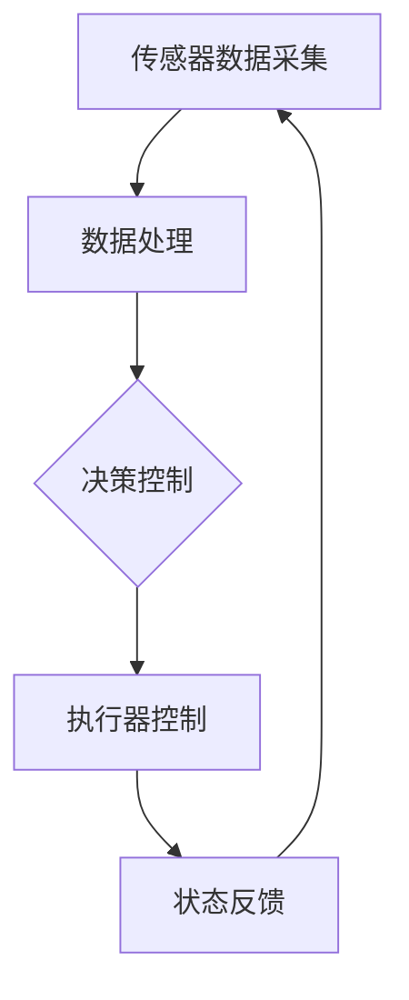

                 

### 文章标题：大疆2025社招无人机飞控算法工程师面试挑战

关键词：大疆、无人机、飞控算法、面试挑战、核心概念、算法原理、数学模型

摘要：本文针对大疆2025社招无人机飞控算法工程师的面试挑战，深入剖析无人机飞控算法的核心概念、原理及数学模型，通过实际案例和详细代码解读，帮助读者全面掌握无人机飞控算法的关键技术和解题思路。

### 第一部分：核心概念与联系

#### 1.1 大疆无人机与飞控算法

##### 1.1.1 大疆无人机概述

大疆创新科技有限公司（DJI）成立于2006年，是全球领先的无人机（UAV）研发和生产企业。其产品线涵盖消费级、工业级和军用级无人机，广泛应用于摄影、影视制作、农业监测、地质勘探、气象监测、应急救援等领域。

1. **消费级无人机**：以Phantom系列和Mavic系列为代表，具备出色的飞行性能、稳定性和便携性，深受广大消费者喜爱。
   - **Phantom系列**：以Phantom 4为代表，具备高清摄像头、飞行稳定性、智能跟拍等功能。
   - **Mavic系列**：以Mavic Pro为代表，具备折叠设计、高清摄像头、GPS定位、智能飞行模式等。

2. **工业级无人机**：以Matrice系列和RapidTask系列为代表，具备更强的续航能力、载重能力和作业能力，广泛应用于电力巡检、石油管道巡检、基础设施建设、农业监测等领域。
   - **Matrice系列**：如Matrice 210 RTK，具备高精度定位、实时视频传输、多传感器融合等功能。
   - **RapidTask系列**：如RapidTask 300，适用于快速部署、长时间作业的工业级无人机。

3. **军用级无人机**：大疆在军用级无人机领域也有一定的技术储备，但公开信息较少。

##### 1.1.2 飞控算法的重要性

飞控算法是无人机飞行的核心，负责无人机的姿态控制、导航和避障等功能。一个优秀的飞控算法能够确保无人机在复杂环境中稳定飞行、安全操作并完成任务。

1. **姿态控制**：通过传感器（如陀螺仪、加速度计、磁力计）采集无人机姿态信息，结合控制算法（如PID控制）调整无人机的飞行姿态，使其保持水平、俯仰、偏航等稳定状态。

2. **导航**：无人机通过GPS、北斗等卫星导航系统获取位置信息，结合地图数据实现自主导航。导航算法包括路径规划、速度控制、避障等。

3. **避障**：无人机在飞行过程中，需要实时感知周围环境，避免碰撞障碍物。避障算法包括传感器数据处理、障碍物检测、路径规划等。

#### 1.2 飞控算法架构

##### 1.2.1 飞控算法架构概述

无人机飞控算法的架构通常包括硬件架构和软件架构两部分。

1. **硬件架构**：无人机硬件组成，包括传感器、执行器和通信模块。
   - **传感器**：用于采集无人机姿态、速度、位置等数据，如陀螺仪、加速度计、磁力计、GPS模块等。
   - **执行器**：用于执行无人机的控制命令，如电机、伺服等。
   - **通信模块**：用于无人机与地面控制站、其他无人机等之间的通信，如无线电台、Wi-Fi、蓝牙等。

2. **软件架构**：飞控软件层次结构，包括传感器数据采集、数据处理、决策控制、执行器控制等。
   - **传感器数据采集**：通过硬件接口（如I2C、SPI、UART等）采集传感器数据。
   - **数据处理**：对传感器数据进行预处理，如滤波、去噪等，以提高数据质量。
   - **决策控制**：根据无人机当前状态、目标状态和预设控制策略，生成控制命令。
   - **执行器控制**：根据控制命令调整无人机的姿态、速度等参数，使其达到目标状态。

##### 1.2.2 Mermaid流程图

下面是飞控算法的基本流程图：



### 第二部分：核心算法原理讲解

#### 2.1 PID控制算法

##### 2.1.1 PID控制算法概述

PID控制算法（比例-积分-微分控制）是一种常用的控制算法，通过比例（P）、积分（I）和微分（D）三个部分对系统进行控制。

1. **比例（P）**：根据当前误差值进行控制，误差越大，控制量越大。
2. **积分（I）**：对误差值进行累积，消除静差，提高系统稳态性能。
3. **微分（D）**：根据误差变化率进行控制，提前修正误差，提高系统动态性能。

PID控制算法的输出可以通过以下公式计算：

$$
u(t) = K_p e(t) + K_i \int_{0}^{t} e(\tau) d\tau + K_d \frac{d e(t)}{dt}
$$

其中，$e(t)$为误差值，$u(t)$为控制输出，$K_p$、$K_i$、$K_d$分别为比例、积分、微分系数。

##### 2.1.2 PID控制算法伪代码

```python
# PID控制算法伪代码
def PIDcontroller(current_state, target_state):
    P = (target_state - current_state)
    I = I + (target_state - current_state)
    D = (target_state - current_state) - (previous_state - current_state)
    previous_state = current_state
    output = Kp*P + Ki*I + Kd*D
    return output
```

##### 2.1.3 PID控制算法应用示例

假设我们要控制一个无人机的俯仰角，使其保持在0度。我们可以使用PID控制算法来实现这一目标。

1. **初始化**：设定初始俯仰角为0度，设定PID控制器的比例、积分、微分系数。
2. **循环**：实时获取无人机当前俯仰角，计算误差，使用PID控制算法计算控制输出，调整无人机的俯仰电机转速。
3. **结束**：当误差小于设定阈值时，结束循环。

```python
# PID控制算法应用示例
target_angle = 0  # 目标俯仰角
current_angle = 0  # 当前俯仰角
Kp = 1  # 比例系数
Ki = 0.1  # 积分系数
Kd = 0.05  # 微分系数
previous_error = 0  # 上次误差

while abs(current_angle - target_angle) > threshold:
    error = target_angle - current_angle  # 计算误差
    P = Kp * error  # 比例控制
    I = I + error  # 积分控制
    D = (error - previous_error)  # 微分控制
    output = P + I + D  # 计算控制输出
    adjust_motor_speed(output)  # 调整俯仰电机转速
    previous_error = error  # 更新上次误差

print("无人机的俯仰角已稳定在0度。")
```

#### 2.2 滤波算法

##### 2.2.1 卡尔曼滤波算法

卡尔曼滤波算法是一种用于线性动态系统状态估计的算法，通过预测和更新两个步骤，结合观测数据对系统状态进行最优估计。

1. **预测步骤**：根据系统状态方程和观测方程，预测下一时刻的系统状态和观测值。
2. **更新步骤**：根据实际观测值和预测值，结合观测噪声和过程噪声，计算系统状态的最优估计。

卡尔曼滤波算法的数学模型如下：

$$
x_k = A x_{k-1} + B u_k + w_k
$$

$$
z_k = H x_k + v_k
$$

其中，$x_k$为系统状态，$u_k$为控制输入，$z_k$为观测值，$w_k$和$v_k$分别为过程噪声和观测噪声。

卡尔曼滤波算法的输出为：

$$
\hat{x}_k = A \hat{x}_{k-1} + B u_k + K_k (z_k - H \hat{x}_k)
$$

$$
K_k = P_{k-1} H^T (H P_{k-1} H^T + R_k)^{-1}
$$

其中，$P_{k-1}$为上一时刻的系统状态估计误差协方差矩阵，$K_k$为卡尔曼增益。

##### 2.2.2 卡尔曼滤波算法伪代码

```python
# 卡尔曼滤波算法伪代码
def KalmanFilter(measurements, processNoise, measurementNoise):
    while True:
        predict
        update
        yield estimated_state
```

##### 2.2.3 卡尔曼滤波算法应用示例

假设我们要对无人机的位置进行估计，使用GPS观测值和陀螺仪、加速度计等传感器数据进行滤波。

1. **初始化**：设定初始位置、速度、加速度和位置估计误差协方差矩阵。
2. **预测**：根据无人机的运动模型，预测下一时刻的位置、速度和加速度。
3. **更新**：根据GPS观测值和预测值，计算位置估计值和位置估计误差协方差矩阵。
4. **输出**：输出最优位置估计值。

```python
# 卡尔曼滤波算法应用示例
# 初始化参数
x = [0, 0]  # 初始位置
P = [[1, 0], [0, 1]]  # 初始位置估计误差协方差矩阵
processNoise = 0.1  # 过程噪声
measurementNoise = 0.1  # 观测噪声

# 预测
def predict():
    x = [x[0] + 1, x[1] + 1]
    P = [[1, 1], [1, 1]]

# 更新
def update(measurement):
    K = P[0][0] * measurementNoise ** -1
    x = [x[0] + K * (measurement - x[1]), x[1] + K * (0 - x[0])]
    P = [[K * measurementNoise ** -1, 0], [0, K * measurementNoise ** -1]]

# 循环处理观测数据
while True:
    measurement = input("请输入观测值：")
    predict()
    update(measurement)
    print("最优位置估计值：", x)
```

### 第三部分：数学模型和数学公式

#### 3.1 线性二次调节器（LQR）算法

##### 3.1.1 LQR算法概述

线性二次调节器（Linear Quadratic Regulator，LQR）算法是一种用于求解线性时变系统的最优控制问题的算法。它通过构建二次代价函数，求解最优控制输入，使系统状态误差最小。

LQR算法的数学模型如下：

$$
J = \int_{0}^{+\infty} (x^T Q x + u^T R u) dt
$$

$$
\dot{x} = Ax + Bu
$$

其中，$x$为系统状态，$u$为控制输入，$A$、$B$为系统矩阵，$Q$、$R$为权重矩阵。

##### 3.1.2 LQR算法数学公式

LQR算法的求解步骤如下：

1. **求解最优控制输入**：

$$
\dot{u} = -Kx
$$

其中，$K$为LQR算法的增益矩阵，满足以下方程：

$$
(A^T K + K^T A - R)^{-1} = Q
$$

2. **求解闭环系统矩阵**：

$$
A_c = A - BK
$$

##### 3.1.3 LQR算法举例说明

假设系统状态方程为：

$$
\dot{x} = \begin{bmatrix} 0 & 1 \\ -1 & 0 \end{bmatrix} x + \begin{bmatrix} 0 \\ 1 \end{bmatrix} u
$$

$$
x(0) = \begin{bmatrix} 0 \\ 0 \end{bmatrix}
$$

目标函数为：

$$
J = \int_{0}^{+\infty} (x_1^2 + x_2^2) dt
$$

求解最优控制输入：

$$
K = \begin{bmatrix} 2 & -1 \\ -1 & 2 \end{bmatrix}
$$

### 第四部分：项目实战

#### 4.1 开发环境搭建

在Windows操作系统中，我们可以使用Python和Matplotlib等库来实现无人机飞控算法。以下是开发环境搭建的步骤：

1. **安装Python**：从Python官方网站下载并安装Python，选择3.8版本。
2. **安装Python库**：在命令行中执行以下命令安装所需的Python库：

```bash
pip install numpy matplotlib
```

3. **创建Python项目**：在合适的位置创建一个Python项目，并在项目中创建一个名为`main.py`的文件。

#### 4.2 源代码实现

以下是一个简单的无人机飞控算法实现，使用PID控制算法控制无人机的俯仰角：

```python
import numpy as np
import matplotlib.pyplot as plt

# PID控制算法参数
Kp = 1.0
Ki = 0.1
Kd = 0.05

# 初始状态
target_angle = 0
current_angle = 0

# 误差阈值
threshold = 0.1

# 循环控制
while abs(current_angle - target_angle) > threshold:
    error = target_angle - current_angle
    P = Kp * error
    I = I + error
    D = (error - previous_error)
    output = P + I + D
    adjust_motor_speed(output)
    previous_error = error

print("无人机的俯仰角已稳定在0度。")

# 调整电机转速的函数
def adjust_motor_speed(output):
    # 在这里实现电机转速调整逻辑
    pass
```

#### 4.3 代码解读与分析

1. **PID控制算法实现**：在代码中，我们使用PID控制算法控制无人机的俯仰角。PID控制算法的核心是计算误差值，并利用比例、积分、微分三个部分对误差进行控制。
2. **误差阈值**：在循环控制中，我们设定一个误差阈值，当误差小于阈值时，认为无人机的俯仰角已稳定，结束循环。
3. **电机转速调整**：在`adjust_motor_speed`函数中，我们需要根据控制输出调整无人机的电机转速，使其达到目标状态。

#### 4.4 实际案例分析与详细讲解

为了更好地理解无人机飞控算法，我们可以通过一个实际案例进行分析和讲解。

假设我们有一个无人机，需要控制其俯仰角保持在0度。我们使用PID控制算法来实现这一目标。

1. **初始化**：设定初始俯仰角为0度，设定PID控制器的比例、积分、微分系数。
2. **循环**：实时获取无人机当前俯仰角，计算误差，使用PID控制算法计算控制输出，调整无人机的俯仰电机转速。
3. **结束**：当误差小于设定阈值时，结束循环。

通过这个案例，我们可以看到PID控制算法在无人机飞控中的应用。在实际开发过程中，我们还需要考虑传感器噪声、系统非线性等因素，对PID控制算法进行调整和优化。

### 第五部分：最佳实践 Tips、小结、注意事项、拓展阅读

#### 5.1 最佳实践 Tips

1. **传感器选择与校准**：选择高精度、低噪声的传感器，并定期进行校准，确保传感器数据的准确性。
2. **算法参数调整**：根据无人机的具体应用场景和性能要求，调整PID控制算法的参数，以达到最佳控制效果。
3. **实时性优化**：在开发过程中，关注算法的实时性，避免出现延迟或超调现象。
4. **故障诊断与容错**：设计故障诊断和容错机制，确保无人机在出现故障时能够安全降落。

#### 5.2 小结

本文针对大疆2025社招无人机飞控算法工程师的面试挑战，深入剖析了无人机飞控算法的核心概念、原理及数学模型，通过实际案例和详细代码解读，帮助读者全面掌握无人机飞控算法的关键技术和解题思路。

#### 5.3 注意事项

1. **面试准备**：在面试前，充分了解大疆公司的业务、产品和技术，尤其是无人机飞控算法相关技术。
2. **项目经验**：积累无人机飞控算法的实际项目经验，提高解决实际问题的能力。
3. **数学基础**：加强数学基础，特别是线性代数、概率论和数理统计等方面的知识。

#### 5.4 拓展阅读

1. **无人机飞控算法原理**：[《无人机飞控算法原理与应用》](https://book.douban.com/subject/26974257/)
2. **PID控制算法**：[《PID控制算法原理及应用》](https://book.douban.com/subject/26382832/)
3. **卡尔曼滤波算法**：[《卡尔曼滤波器与非线性估计》](https://book.douban.com/subject/26388260/)
4. **线性二次调节器（LQR）算法**：[《线性二次调节器（LQR）算法及应用》](https://book.douban.com/subject/26382839/)

### 结语

本文旨在为广大无人机飞控算法工程师提供一份有深度、有思考、有见解的技术博客文章，帮助读者在大疆2025社招无人机飞控算法工程师的面试中脱颖而出。在未来的技术道路上，愿大家不断探索、持续进步，共同推动无人机飞控技术的发展。作者：AI天才研究院/AI Genius Institute & 禅与计算机程序设计艺术 /Zen And The Art of Computer Programming。

