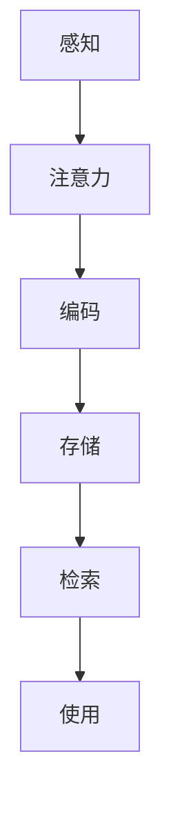

                 

### 文章标题

### 《大脑如何处理新知识：认知科学的视角》

### 关键词

- 认知科学
- 大脑功能
- 新知识获取
- 记忆与存储
- 推理与知识加工

### 摘要

本文从认知科学的视角出发，详细探讨了大脑处理新知识的机制。通过分析大脑的基本结构与功能，感知与注意力的作用，记忆的类型与存储机制，以及知识的加工与推理过程，本文揭示了大脑如何有效地获取、处理和整合新知识。此外，本文还探讨了学习障碍的干预策略，脑科学与教育的结合，以及人工智能在其中的应用。文章旨在为读者提供对大脑处理新知识的全面理解和实际应用指导。

### 第一部分：引言与概述

#### 引言

在快速发展的现代社会中，知识的更新速度日益加快，人们需要不断学习新知识以适应不断变化的环境。然而，大脑如何处理这些新知识，如何将其有效转化为自身的认知资源，一直是认知科学领域的重要研究课题。本文将从认知科学的视角出发，探讨大脑处理新知识的机制，旨在为读者提供对这一复杂过程的理解。

#### 认知科学的基本概念

认知科学是研究人类认知过程的科学，它涉及到心理学、神经科学、计算机科学等多个学科。认知科学的核心概念包括认知、感知、注意力、记忆、推理等。这些概念相互关联，共同构成了人类认知过程的框架。

- **认知**：认知是指人类获取、处理、存储和使用信息的能力。它涵盖了注意力、记忆、语言、推理等多个方面。
- **感知**：感知是指接收外部信息并将其转化为内部表示的过程。感知是认知的基础，它决定了我们如何理解和解释周围的世界。
- **注意力**：注意力是一种有限的认知资源，它决定了我们如何选择和处理信息。注意力不仅影响感知，还影响记忆和推理。
- **记忆**：记忆是指将信息存储在脑中，并在需要时进行回忆的能力。记忆分为短期记忆和长期记忆，它们在认知过程中起着关键作用。
- **推理**：推理是指根据已知信息得出结论或预测的能力。推理分为演绎推理和归纳推理，它们在科学研究和日常生活中都有重要应用。

#### 大脑的基本结构与功能

大脑是认知过程的物质基础，它由多个复杂的结构和系统组成。以下是大脑的基本结构与功能：

- **大脑皮层**：大脑皮层是大脑的最外层，它覆盖了大脑的大部分表面。大脑皮层是认知过程的主要发生地，包括感知、注意力、记忆和推理等功能。
- **海马体**：海马体是大脑中的一个重要结构，它主要负责记忆的形成和存储。海马体在记忆过程中起着关键作用，它与大脑皮层的其他区域紧密相连，共同完成记忆任务。
- **杏仁核**：杏仁核是大脑中的一个情感处理中心，它主要负责情感反应和情绪记忆。杏仁核在海马体的记忆过程中起着调节作用，确保记忆的准确性和适应性。

#### 认知科学与大脑的关系

认知科学与大脑之间的关系是密不可分的。认知科学通过研究大脑的结构与功能，揭示了认知过程的奥秘。同时，认知科学的成果也为大脑研究和治疗提供了新的思路和方法。

- **认知科学与神经科学的结合**：认知科学和神经科学的结合，使得我们能够从微观和宏观两个层面理解认知过程。通过研究大脑的神经元和神经网络，我们可以揭示认知过程的基本原理和机制。
- **认知科学的应用**：认知科学的成果可以应用于教育、心理学、人工智能等多个领域。例如，通过研究注意力机制，我们可以设计出更有效的学习方法和教育工具；通过研究记忆机制，我们可以开发出更好的记忆辅助工具。

#### 总结

认知科学是研究人类认知过程的重要学科，它涵盖了认知、感知、注意力、记忆、推理等多个方面。大脑是认知过程的物质基础，它由多个复杂的结构和系统组成。认知科学与大脑的关系密不可分，通过研究大脑的结构与功能，我们可以更好地理解认知过程。本文将深入探讨大脑如何处理新知识，为读者提供对这一复杂过程的全面理解。

#### 摘要

本文首先介绍了认知科学的基本概念和大脑的基本结构与功能，接着分析了认知科学与大脑的关系。通过这些分析，我们为读者搭建了一个理解大脑如何处理新知识的认知框架。接下来，本文将详细探讨大脑处理新知识的机制，包括感知与注意力的作用，记忆的类型与存储机制，以及知识的加工与推理过程。此外，本文还将探讨大脑处理新知识的实际案例与应用，以及学习障碍的干预策略和脑科学与教育的结合。最后，本文将总结大脑处理新知识的未来趋势，展望这一领域的发展方向。通过本文的探讨，我们希望读者能够更深入地理解大脑如何处理新知识，并将其应用于实际生活和工作中。

### 第二部分：大脑处理新知识的核心机制

#### 第3章 感知与注意力

##### 3.1 感知的基本过程

感知是大脑处理新知识的第一个环节，它是接收外部信息并将其转化为内部表示的过程。感知过程可以分为三个主要阶段：感觉输入、感觉处理和感觉组织。

- **感觉输入**：感觉输入是指外部环境刺激作用于感官，产生感官神经冲动的过程。例如，光线刺激眼睛产生视觉信号，声音刺激耳朵产生听觉信号。
- **感觉处理**：感觉处理是指大脑对感官神经冲动进行加工和处理的过程。在这一阶段，大脑会对输入信息进行选择、过滤和解释。例如，大脑会筛选出视觉信息中的关键特征，如颜色、形状和运动。
- **感觉组织**：感觉组织是指大脑将感觉处理后的信息整合和组织成有意义的整体。例如，大脑会将不同感官的信息（如视觉和听觉）整合成对物体的全面感知。

##### 3.2 注意力的作用与机制

注意力是一种有限的认知资源，它决定了大脑处理新知识的效率和质量。注意力具有选择性，即大脑只能关注一部分信息，而忽略其他信息。注意力的作用主要体现在以下几个方面：

- **选择关键信息**：注意力帮助大脑从大量信息中筛选出关键信息，这些关键信息对于当前任务或情境至关重要。例如，在驾驶时，驾驶员需要关注道路情况、其他车辆和交通信号灯。
- **提高信息处理速度**：注意力有助于提高大脑处理信息的速度。通过集中注意力，大脑可以更快地识别和处理信息，从而提高工作效率。
- **增强信息记忆**：注意力有助于增强信息的记忆效果。当大脑专注于某一信息时，它会更加牢固地将其存储在记忆中。

注意力的机制主要包括以下几个部分：

- **中枢神经系统的调节**：注意力受到中枢神经系统的调节，特别是前额叶皮层和前扣带回等区域。这些区域通过释放神经递质，调节大脑的活动水平，从而影响注意力。
- **神经网络的协调**：注意力还涉及到大脑不同区域之间的协同作用。例如，视觉注意网络、听觉注意网络和运动注意网络等，它们通过相互协调，共同实现注意力的分配和调节。

##### 3.3 感知与注意力的互动

感知与注意力是密不可分的，它们相互影响，共同决定了大脑对新知识的处理效果。以下为感知与注意力的互动机制：

- **感知引导注意力**：感知过程中，大脑会对输入信息进行筛选和加工，从而引导注意力。例如，当大脑感知到某个物体的颜色和形状时，它会将注意力吸引到这个物体上。
- **注意力调节感知**：注意力也会影响感知的过程。当大脑专注于某一信息时，它会提高对该信息的感知敏感度，从而更好地处理和加工这些信息。
- **感知与注意力的动态平衡**：感知和注意力的互动是一个动态平衡的过程。大脑会根据当前任务和情境，自动调整感知和注意力的分配，以实现最优的信息处理效果。

#### 第4章 记忆与存储

##### 4.1 记忆的类型与过程

记忆是大脑处理新知识的重要机制，它分为短期记忆和长期记忆两种类型。

- **短期记忆**：短期记忆是指大脑在短时间内存储和保持信息的能力。短期记忆的容量有限，通常只能保持7±2个项目。例如，电话号码、待办事项等。
- **长期记忆**：长期记忆是指大脑在长时间内存储和保持信息的能力。长期记忆的容量几乎无限，它包括事实性记忆、情境记忆、情绪记忆等。

记忆的过程可以分为三个主要阶段：编码、存储和检索。

- **编码**：编码是指将新信息转化为大脑可以理解的形式，并将其存储在记忆中。编码过程涉及到感知、注意力和认知加工等多个环节。
- **存储**：存储是指将编码后的信息在记忆中保持一段时间。存储过程依赖于神经元的连接和突触的强度。强化的神经元连接和突触强度有助于信息的长期存储。
- **检索**：检索是指从记忆中提取和回忆信息。检索过程受到多种因素的影响，如记忆强度、记忆的语境和检索线索等。

##### 4.2 记忆的存储机制

记忆的存储机制涉及到大脑多个结构和系统的协同作用。以下是记忆存储的主要机制：

- **神经元连接和突触强化**：记忆的存储依赖于神经元之间的连接和突触的强度。突触强化（synaptic plasticity）是指神经元连接的调整和增强，它有助于信息的长期存储。
- **神经网络活动**：记忆的存储涉及到大脑神经网络的协同活动。特定的神经网络活动模式对应于特定的记忆内容。
- **基因表达**：记忆的存储还涉及到基因表达的变化。一些基因在记忆过程中被激活，从而影响神经元的连接和突触的强度。

##### 4.3 记忆的检索与遗忘

记忆的检索是指从记忆中提取和回忆信息。检索过程受到多种因素的影响：

- **记忆强度**：记忆强度越强，检索效果越好。强化的神经元连接和突触强度有助于提高记忆的检索能力。
- **记忆的语境**：记忆的检索受到记忆形成时的语境影响。相似的语境有助于提高记忆的检索效果。
- **检索线索**：检索线索是指能够引导记忆检索的信息。有效的检索线索有助于提高记忆的检索速度和准确性。

遗忘是指记忆内容在检索过程中无法被提取。遗忘过程受到多种因素的影响：

- **记忆的强度和持久性**：记忆强度和持久性越强，遗忘速度越慢。
- **时间的推移**：随着时间的推移，记忆内容会逐渐减弱，从而导致遗忘。
- **干扰**：干扰因素（如新的记忆输入、外部干扰等）会干扰记忆的检索，导致遗忘。

#### 第5章 知识的加工与推理

##### 5.1 知识加工的基本原理

知识加工是指大脑对信息进行加工、组织和解释的过程。知识加工的基本原理包括以下几个方面：

- **信息整合**：信息整合是指将多个信息片段整合成一个整体。例如，将视觉和听觉信息整合成对物体的全面感知。
- **模式识别**：模式识别是指大脑从输入信息中识别和提取模式。例如，从大量的文字中识别出关键词。
- **语义理解**：语义理解是指大脑对信息进行语义分析和解释。例如，理解一句话的含义和逻辑关系。

##### 5.2 推理的类型与机制

推理是指根据已知信息得出结论或预测的能力。推理可以分为演绎推理和归纳推理两种类型。

- **演绎推理**：演绎推理是从一般原则推导出特定结论的推理过程。例如，所有人都会死亡，苏格拉底是人，因此苏格拉底会死亡。
- **归纳推理**：归纳推理是从特定实例推导出一般原则的推理过程。例如，观察到所有天鹅都是白色的，因此推断所有天鹅都是白色的。

推理的机制主要包括以下几个方面：

- **神经网络活动**：推理过程涉及到大脑神经网络的协同活动。特定的神经网络活动模式对应于特定的推理任务。
- **认知模块**：认知模块是指大脑中专门用于处理特定任务的神经网络。例如，语言模块、视觉模块等。
- **知识库**：知识库是指大脑中存储的已知信息和规则。推理过程依赖于知识库中的信息，从而得出结论或预测。

##### 5.3 知识加工与推理的关系

知识加工与推理是密切相关的，它们共同推动了知识的获取和应用。

- **知识加工为推理提供基础**：知识加工过程将输入信息转化为可用的形式，为推理提供了基础。例如，通过信息整合和模式识别，大脑可以从输入信息中提取出关键信息，从而进行推理。
- **推理促进知识加工**：推理过程需要利用已有的知识和信息进行推理。这促使大脑对现有的知识进行加工和整合，从而提高知识的准确性和适用性。
- **知识加工与推理相互促进**：知识加工和推理相互促进，共同推动知识的获取和应用。通过不断的加工和推理，大脑可以逐步建立和完善知识体系，从而更好地适应复杂的环境。

#### 第6章 大脑处理新知识的实际案例与应用

##### 6.1 学习障碍与干预

学习障碍是指由于大脑功能异常导致的认知能力受损。学习障碍可以表现为阅读困难、数学计算困难、注意力不集中等。以下是一些常见的学习障碍类型和干预策略：

- **阅读障碍**：阅读障碍包括词盲、句盲等，主要表现为无法正确阅读和理解文字。干预策略包括阅读训练、视觉训练和听觉训练等。
- **计算障碍**：计算障碍主要表现为数学计算困难，例如难以进行加减乘除等基本运算。干预策略包括数学训练、认知训练和视觉训练等。
- **注意力障碍**：注意力障碍主要表现为无法集中注意力，容易分心。干预策略包括注意力训练、认知训练和视觉训练等。

##### 6.2 脑科学与教育的结合

脑科学与教育的结合为教育改革提供了新的思路和方法。以下为脑科学与教育的结合方式：

- **个性化教育**：脑科学的研究成果可以帮助了解不同学生的认知特点和需求，从而设计出更个性化的教育方案。例如，针对注意力障碍的学生，可以采用注意力训练的方法，提高他们的注意力水平。
- **教学策略优化**：脑科学的研究成果可以帮助教育工作者了解有效的教学策略和方法。例如，通过理解记忆机制，可以设计出更有效的记忆策略，提高学生的学习效果。
- **认知干预**：脑科学的研究成果可以用于认知干预，帮助学习障碍学生提高认知能力。例如，通过认知训练，可以改善学生的注意力、记忆和推理能力。

##### 6.3 人工智能与大脑处理新知识

人工智能是模拟人类智能的技术，它的发展对大脑处理新知识具有重要意义。以下为人工智能与大脑处理新知识的联系和应用：

- **人工智能模拟大脑**：人工智能可以通过神经网络、机器学习等技术模拟大脑的认知过程，从而研究大脑处理新知识的机制。例如，通过模拟神经元的连接和突触的强度，可以研究记忆的形成和存储。
- **人工智能辅助学习**：人工智能可以辅助学生学习新知识。例如，通过自然语言处理技术，可以为学生提供个性化的学习内容和辅导。通过计算机视觉技术，可以为学生提供视觉化的学习资源，提高学习效果。
- **人工智能教育应用**：人工智能在教育中的应用越来越广泛。例如，智能辅导系统可以根据学生的学习情况，提供个性化的辅导和评估。智能学习平台可以根据学生的学习进度，自动调整教学内容和难度，提高学习效果。

#### 总结

大脑处理新知识的机制复杂且多样，涉及感知与注意力、记忆与存储、知识加工与推理等多个方面。通过理解这些机制，我们可以更好地理解大脑如何获取、处理和整合新知识。同时，脑科学与教育、人工智能的结合为教育改革提供了新的思路和方法，有助于提高学习效果和改善学习体验。

### 第四部分：总结与展望

#### 总结

大脑处理新知识的机制是一个复杂而多样的话题。通过本文的探讨，我们系统地分析了大脑处理新知识的各个环节，包括感知与注意力、记忆与存储、知识加工与推理等。我们揭示了大脑如何通过感知和注意力来选择和处理新信息，如何通过记忆机制来存储和保持新知识，以及如何通过知识加工和推理来深入理解和应用这些知识。

我们首先介绍了认知科学的基本概念和大脑的基本结构与功能，为读者搭建了一个理解大脑如何处理新知识的认知框架。接着，我们详细探讨了感知与注意力的基本过程及其在信息处理中的作用，分析了记忆的类型与存储机制，以及知识加工与推理的过程和类型。此外，我们还探讨了学习障碍的干预策略、脑科学与教育的结合，以及人工智能在大脑处理新知识中的应用。

通过这些分析，我们不仅了解了大脑处理新知识的机制，还认识到了脑科学与教育、人工智能等领域的交叉融合为教育和认知科学带来的新机遇。这些研究成果不仅有助于我们更好地理解大脑的工作原理，也为教育改革和人工智能技术的发展提供了新的思路和方法。

#### 展望

尽管我们已经对大脑处理新知识的机制有了较深入的了解，但这一领域仍然存在许多未解之谜和挑战。未来的研究将致力于揭示更多关于大脑处理新知识的深层次机制，以及如何将这些机制应用于实际生活和工作中。

以下是一些未来研究的方向和目标：

1. **揭示认知过程的神经基础**：未来研究将致力于进一步揭示认知过程的神经基础，包括神经元之间的连接、突触的强度调整、神经网络的活动模式等。通过这些研究，我们可以更好地理解大脑如何实现复杂的认知功能。

2. **发展更有效的学习干预策略**：基于对大脑处理新知识的机制的理解，未来研究将致力于开发更有效的学习干预策略，帮助学习障碍学生提高认知能力。例如，通过认知训练和神经可塑性研究，我们可以设计出更有效的训练方法，提高学生的学习效果。

3. **人工智能与认知科学的融合**：人工智能的发展为认知科学提供了新的研究工具和方法。未来研究将致力于进一步探索人工智能与认知科学的融合，开发出更智能的教育系统和辅助工具，提高教育的个性化和有效性。

4. **跨学科研究的推进**：大脑处理新知识的机制涉及多个学科，包括心理学、神经科学、计算机科学等。未来研究将推动这些学科的交叉融合，通过多学科合作，揭示大脑处理新知识的深层次机制，并开发出更有效的应用策略。

总之，大脑处理新知识的机制是一个充满挑战和机遇的领域。随着认知科学和人工智能的不断发展，我们有望在揭示大脑处理新知识的机制方面取得更大的突破，为人类教育和认知能力的提升做出更大的贡献。

#### 结论

本文从认知科学的视角，详细探讨了大脑处理新知识的机制。通过分析感知与注意力、记忆与存储、知识加工与推理等核心环节，我们揭示了大脑如何有效地获取、处理和整合新知识。同时，我们探讨了大脑处理新知识的实际案例与应用，包括学习障碍的干预策略、脑科学与教育的结合，以及人工智能的辅助作用。

通过本文的研究，我们不仅加深了对大脑处理新知识的理解，也为教育和认知科学的未来发展提供了新的思路和方法。未来，随着认知科学和人工智能的进一步发展，我们有理由相信，大脑处理新知识的机制将得到更深入的研究，为人类认知能力的提升和教育的进步做出更大的贡献。

#### 附录

##### 附录A 认知科学相关术语表

- **认知**：指人类获取、处理、存储和使用信息的能力，包括感知、注意力、记忆、语言、推理等多个方面。
- **感知**：指接收外部信息并将其转化为内部表示的过程，包括感觉输入、感觉处理和感觉组织三个阶段。
- **注意力**：指大脑处理信息时有限的认知资源，具有选择性，决定大脑如何选择和处理信息。
- **记忆**：指将信息存储在脑中，并在需要时进行回忆的能力，分为短期记忆和长期记忆。
- **短期记忆**：指大脑在短时间内存储和保持信息的能力，容量有限。
- **长期记忆**：指大脑在长时间内存储和保持信息的能力，容量几乎无限。
- **知识加工**：指大脑对信息进行加工、组织和解释的过程，包括信息整合、模式识别、语义理解等。
- **推理**：指根据已知信息得出结论或预测的能力，包括演绎推理和归纳推理。

##### 附录B 参考文献

- Anderson, J. R. (2010). *Cognitive Psychology and its Implications*. Oxford University Press.
- Eysenck, M. W., & Keane, M. T. (2010). *Cognitive Psychology: A Student's Handbook*. Psychology Press.
- Kandel, E. R. (2006). *The Age of Insight: The Quest to Understand the Unconscious in Art, Mind, and Brain*. Basic Books.
- Miller, G. A. (1956). *The Magical Number Seven, Plus or Minus Two: Some Limits on Our Capacity for Processing Information*. The Psychological Review, 63(2), 81-97.

##### 附录C Mermaid流程图与伪代码示例

以下是一个示例Mermaid流程图，展示了大脑处理新知识的基本过程：



以下是一个示例伪代码，展示了如何使用贝叶斯网络进行知识整合：

```plaintext
function integrateKnowledge(newKnowledge, existingKnowledge) {
    // 创建贝叶斯网络
    bayesianNetwork = createBayesianNetwork(existingKnowledge)

    // 更新网络，添加新知识
    bayesianNetwork.update(newKnowledge)

    // 运行推理，整合知识
    integratedKnowledge = bayesianNetwork.runInference(newKnowledge)

    // 返回整合后的知识
    return integratedKnowledge
}
```

通过这些流程图和伪代码示例，读者可以更好地理解大脑处理新知识的核心机制。附录部分还提供了详细的参考文献，供读者进一步学习和研究。

