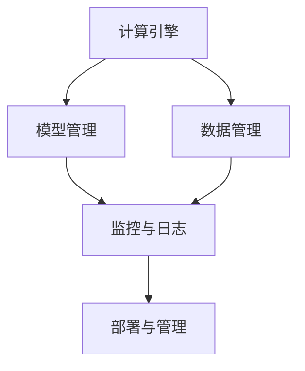

                 

## 文章标题：大规模语言模型从理论到实践 FastServe框架

大规模语言模型已经成为自然语言处理（NLP）领域的关键技术，其广泛应用于文本分类、机器翻译、问答系统等多个方面。在本文中，我们将从理论到实践，全面介绍FastServe框架，帮助读者深入理解大规模语言模型的工作原理和应用。

关键词：大规模语言模型、自然语言处理、FastServe框架、神经网络、数学模型

摘要：本文将首先介绍大规模语言模型的基础知识，包括概念、架构和训练过程，然后深入探讨语言模型的数学基础和训练算法。随后，我们将引入FastServe框架，详细讲解其概念、架构和核心技术。最后，通过具体应用案例，展示大规模语言模型和FastServe框架的实际效果和实现细节。文章旨在为读者提供一个全面的理论与实践结合的视角，以更好地理解和应用大规模语言模型技术。

## 目录大纲

### 第一部分：大规模语言模型基础

#### 第1章：大规模语言模型概述

##### 1.1 大规模语言模型的概念

##### 1.2 大规模语言模型的架构

##### 1.3 大规模语言模型的训练

#### 第2章：语言模型的数学基础

##### 2.1 神经网络基础

##### 2.2 自然语言处理基础

##### 2.3 语言模型的数学模型

#### 第3章：大规模语言模型的训练算法

##### 3.1 反向传播算法

##### 3.2 优化算法

##### 3.3 超参数调优

#### 第4章：大规模语言模型的应用

##### 4.1 文本分类

##### 4.2 机器翻译

##### 4.3 问答系统

### 第二部分：FastServe框架

#### 第5章：FastServe框架概述

##### 5.1 FastServe框架的概念

##### 5.2 FastServe框架的架构

#### 第6章：FastServe框架的核心技术

##### 6.1 多语言支持

##### 6.2 自动化部署

##### 6.3 模型优化

#### 第7章：FastServe框架的应用案例

##### 7.1 应用案例一：文本分类

##### 7.2 应用案例二：机器翻译

##### 7.3 应用案例三：问答系统

#### 第8章：未来展望

##### 8.1 大规模语言模型的发展趋势

##### 8.2 FastServe框架的未来发展

本文将从大规模语言模型的基础知识开始，逐步深入到FastServe框架的介绍和应用案例，旨在为读者提供一个系统的学习和实践路径。

### 第一部分：大规模语言模型基础

#### 第1章：大规模语言模型概述

##### 1.1 大规模语言模型的概念

大规模语言模型（Large-scale Language Models）是一种基于深度学习的自然语言处理技术，通过对大量文本数据进行训练，使模型能够理解和生成自然语言。这些模型通常包含数亿甚至千亿级别的参数，因此被称为“大规模”。与传统的基于规则或统计方法的自然语言处理技术相比，大规模语言模型在文本理解和生成方面具有更高的准确性和灵活性。

##### 1.2 大规模语言模型的重要性

大规模语言模型的重要性主要体现在以下几个方面：

1. **文本理解与生成**：大规模语言模型能够对文本进行深入的理解和生成，这使得它们在信息检索、文本摘要、机器翻译等应用场景中具有广泛的应用前景。
2. **提高模型性能**：通过训练大规模模型，可以提高模型的准确性和鲁棒性，使其在处理复杂任务时表现出更高的性能。
3. **降低任务复杂度**：大规模语言模型能够通过预训练的方式学习到通用的语言特征，从而降低特定任务的复杂性，简化模型开发过程。
4. **推动技术发展**：大规模语言模型的兴起推动了自然语言处理、机器学习等相关领域的技术进步，为人工智能的发展提供了新的动力。

##### 1.3 大规模语言模型的架构

大规模语言模型通常采用深度神经网络作为基础架构，其基本结构包括输入层、隐藏层和输出层。输入层接收原始文本数据，通过嵌入层将文本转换为向量表示；隐藏层通过多层神经网络对向量进行加工和处理，提取文本的深层特征；输出层生成预测结果，如文本分类、文本生成等。

常见的深度神经网络结构包括循环神经网络（RNN）、长短期记忆网络（LSTM）和变换器（Transformer）等。其中，Transformer结构由于其并行计算能力和全局依赖建模的优势，成为大规模语言模型的首选架构。

##### 1.4 大规模语言模型的发展历程

大规模语言模型的发展历程可以追溯到20世纪80年代，当时研究人员开始尝试使用神经网络进行自然语言处理。然而，由于计算资源和数据集的限制，早期的模型规模较小，性能有限。

随着计算能力的提升和数据集的扩展，2000年代中期，神经网络在自然语言处理领域的应用逐渐增多。特别是2013年，词嵌入技术（如Word2Vec）的出现，为大规模语言模型的发展奠定了基础。

2018年，Google提出了Transformer模型，使其成为大规模语言模型的标准架构。随后，OpenAI的GPT系列模型以及BERT等预训练模型相继出现，进一步推动了大规模语言模型的发展。

##### 1.5 大规模语言模型的应用场景

大规模语言模型的应用场景非常广泛，主要包括以下几个方面：

1. **文本分类**：用于对文本进行分类，如新闻分类、情感分析等。
2. **机器翻译**：用于将一种语言的文本翻译成另一种语言。
3. **文本生成**：用于生成文本，如自动写作、对话系统等。
4. **问答系统**：用于回答用户的问题，如搜索引擎、智能客服等。
5. **文本摘要**：用于生成文本的摘要，如新闻摘要、会议摘要等。

在实际应用中，大规模语言模型不仅能够提高任务的性能，还能够简化模型开发和优化流程，为自然语言处理领域带来了革命性的变化。

#### 第2章：语言模型的数学基础

##### 2.1 神经网络基础

神经网络（Neural Networks）是大规模语言模型的核心组成部分。神经网络模仿生物神经系统的结构和功能，通过多层神经元进行信息的传递和处理。

##### 2.1.1 神经元模型

神经元的模型通常包括三个部分：输入层、权重和激活函数。输入层接收外部输入信号，权重表示输入信号对神经元输出的影响，激活函数用于决定神经元是否激活。

神经元模型的数学表达式可以表示为：

\[ Z = \sum_{i=1}^{n} x_i \cdot w_i \]

其中，\( x_i \)表示第\( i \)个输入，\( w_i \)表示对应的权重，\( Z \)是输入和权重的加权和。

常见的激活函数包括：

1. **线性激活函数**：\( f(x) = x \)
2. ** sigmoid 激活函数**：\( f(x) = \frac{1}{1 + e^{-x}} \)
3. **ReLU激活函数**：\( f(x) = \max(0, x) \)

##### 2.1.2 前向传播

前向传播（Forward Propagation）是神经网络的基本工作原理。它将输入数据通过网络的各个层，最终得到输出结果。

前向传播的步骤如下：

1. 将输入数据传递到第一层神经元，计算加权和。
2. 应用激活函数，得到每个神经元的输出。
3. 将输出传递到下一层，重复上述步骤，直到最后一层。
4. 得到最终输出结果。

##### 2.1.3 反向传播

反向传播（Backpropagation）是一种用于训练神经网络的算法。它通过计算损失函数关于每个权重的梯度，然后使用梯度下降法更新权重。

反向传播的步骤如下：

1. 计算输出层到隐藏层的梯度。
2. 逐层向前计算梯度，直到输入层。
3. 使用梯度下降法更新每个权重。

反向传播的伪代码如下：

```python
for each layer in reversed(layers):
    compute gradient with respect to layer outputs
    compute gradient with respect to layer inputs
    update weights
```

##### 2.2 自然语言处理基础

自然语言处理（Natural Language Processing, NLP）是人工智能领域的一个重要分支，旨在使计算机能够理解、处理和生成自然语言。大规模语言模型在NLP中的应用离不开以下几个关键技术：

##### 2.2.1 词嵌入

词嵌入（Word Embedding）是一种将词汇映射到高维向量空间的技术。通过词嵌入，可以将词汇表示为连续的向量，使得计算可以在向量空间中直接进行，从而简化了NLP任务的实现。

常见的词嵌入技术包括：

1. **Word2Vec**：基于神经网络训练的词嵌入方法，包括Skip-gram和Continuous Bag-of-Words（CBOW）两种模型。
2. **GloVe**：基于全局共现矩阵的词嵌入方法，通过计算词汇之间的共现关系，得到词向量。
3. **BERT**：基于Transformer结构的预训练语言模型，通过在大型文本语料库上进行预训练，获得高质量的词向量。

##### 2.2.2 序列模型

序列模型（Sequence Model）用于处理具有顺序结构的文本数据。常见的序列模型包括循环神经网络（RNN）和长短期记忆网络（LSTM）。

1. **循环神经网络（RNN）**：RNN能够处理具有顺序依赖的文本数据，但存在梯度消失和梯度爆炸等问题。
2. **长短期记忆网络（LSTM）**：LSTM通过引入记忆单元，解决了RNN的梯度消失问题，能够在长序列中保持信息。

##### 2.2.3 注意力机制

注意力机制（Attention Mechanism）是一种用于捕捉序列中不同部分之间依赖关系的方法。在NLP任务中，注意力机制能够使模型更加关注重要的信息，从而提高任务的性能。

常见的注意力机制包括：

1. **自注意力（Self-Attention）**：用于处理输入序列中的依赖关系。
2. **互注意力（Cross-Attention）**：用于处理两个序列之间的依赖关系，如机器翻译任务。

##### 2.3 语言模型的数学模型

语言模型的数学模型用于计算文本序列的概率分布。常见的语言模型包括基于N元语法（N-gram）和基于神经网络的模型。

1. **N元语法模型**：N元语法模型是一种基于统计的模型，通过计算文本序列的前N个单词与下一个单词之间的概率分布，生成文本。

N元语法模型的概率计算公式如下：

\[ P(w_{t+1} | w_{t}, w_{t-1}, ..., w_{t-N+1}) = \frac{C(w_{t}, w_{t-1}, ..., w_{t-N+1}, w_{t+1})}{C(w_{t}, w_{t-1}, ..., w_{t-N+1})} \]

其中，\( C(\cdot) \)表示词序列的共现次数。

2. **神经网络模型**：神经网络模型通过深度神经网络对文本序列进行建模，学习文本之间的概率分布。

神经网络语言模型通常使用以下损失函数进行训练：

\[ L(\theta) = -\sum_{i=1}^{N} \sum_{j=1}^{V} y_{ij} \log(p_{ij}(\theta)) \]

其中，\( y_{ij} \)表示第\( i \)个单词在单词集合\( V \)中的标记，\( p_{ij}(\theta) \)表示神经网络对单词\( j \)的条件概率。

通过训练，神经网络模型能够学习到文本序列的概率分布，从而实现文本生成和分类等任务。

### 第3章：大规模语言模型的训练算法

大规模语言模型的训练过程是构建高效、准确模型的基石。在这一章节中，我们将探讨大规模语言模型训练过程中常用的算法，包括反向传播算法、优化算法和超参数调优。

#### 3.1 反向传播算法

反向传播算法（Backpropagation Algorithm）是神经网络训练的核心算法，用于计算网络权重和偏置的梯度，并通过梯度下降法更新这些参数。以下是反向传播算法的基本步骤：

1. **前向传播**：将输入数据通过网络的各个层，计算每个神经元的输出。
2. **计算损失**：使用损失函数（如交叉熵损失）计算模型预测值和真实值之间的差距。
3. **计算梯度**：从输出层开始，反向计算每个神经元的梯度。具体地，梯度可以通过链式法则进行计算。
4. **权重更新**：使用梯度下降法更新网络权重和偏置。更新公式如下：

\[ \theta_{\text{new}} = \theta_{\text{old}} - \alpha \cdot \nabla_{\theta} L(\theta) \]

其中，\( \alpha \)是学习率，\( \nabla_{\theta} L(\theta) \)是损失函数关于权重的梯度。

#### 3.2 优化算法

优化算法（Optimization Algorithms）用于寻找最小化损失函数的参数值。以下是一些常用的优化算法：

1. **梯度下降法（Gradient Descent）**：梯度下降法是最简单的优化算法，通过沿着梯度方向更新参数，以最小化损失函数。其更新公式如上所述。

2. **随机梯度下降法（Stochastic Gradient Descent, SGD）**：随机梯度下降法在每次迭代过程中使用一个随机样本的梯度进行权重更新。这种方法可以加快收敛速度，但可能导致不稳定的训练过程。

3. **批量梯度下降法（Batch Gradient Descent）**：批量梯度下降法在每次迭代过程中使用整个训练集的梯度进行权重更新。这种方法可以确保最小化损失函数，但计算成本较高。

4. **Adam优化器（Adam Optimizer）**：Adam优化器结合了SGD和批量梯度下降法的优点，通过维护一阶矩估计（均值）和二阶矩估计（方差）来动态调整学习率。其公式如下：

\[ m_t = \beta_1 m_{t-1} + (1 - \beta_1) [g_t] \]
\[ v_t = \beta_2 v_{t-1} + (1 - \beta_2) [g_t]^2 \]
\[ \theta_t = \theta_{t-1} - \alpha \frac{m_t}{\sqrt{v_t} + \epsilon} \]

其中，\( m_t \)和\( v_t \)分别是梯度的一阶矩估计和二阶矩估计，\( \beta_1 \)和\( \beta_2 \)是超参数，\( \alpha \)是学习率，\( \epsilon \)是正则项。

#### 3.3 超参数调优

超参数调优（Hyperparameter Tuning）是大规模语言模型训练过程中至关重要的一步。超参数包括学习率、批量大小、迭代次数等，这些参数的选择直接影响模型的性能和收敛速度。

以下是一些常用的超参数调优方法：

1. **网格搜索（Grid Search）**：网格搜索是一种简单的超参数调优方法，通过遍历所有可能的超参数组合，选择最优的组合。

2. **随机搜索（Random Search）**：随机搜索在网格搜索的基础上进行改进，通过随机选择超参数组合，减少计算成本。

3. **贝叶斯优化（Bayesian Optimization）**：贝叶斯优化是一种基于概率模型的全局优化方法，通过构建超参数的概率分布，选择下一个超参数组合进行实验。

4. **自动化机器学习（AutoML）**：自动化机器学习是一种利用算法和工具自动选择最优模型和超参数的方法，通过大量实验和模型评估，快速找到最优模型。

超参数调优的伪代码如下：

```python
for each hyperparameter in hyperparameter_space:
    train_model(hyperparameter)
    evaluate_model(hyperparameter)
    store_evaluation_result(hyperparameter)
```

通过以上方法，可以有效地选择最优的超参数，提高大规模语言模型的性能。

### 第4章：大规模语言模型的应用

大规模语言模型在自然语言处理领域具有广泛的应用。本节将介绍几种典型的大规模语言模型应用，包括文本分类、机器翻译和问答系统。

#### 4.1 文本分类

文本分类（Text Classification）是一种将文本数据分类到预定义类别中的任务。大规模语言模型通过学习文本的语义特征，能够实现高效的文本分类。

以下是一个简单的文本分类任务的应用示例：

1. **数据准备**：首先，收集和整理大量已分类的文本数据，用于训练和测试模型。
2. **词嵌入**：使用词嵌入技术将文本转换为向量表示，以便于模型处理。
3. **模型训练**：使用预训练的大规模语言模型，如BERT，对文本数据进行训练。
4. **模型评估**：通过交叉验证和测试集评估模型的性能，选择最优的分类器。
5. **模型部署**：将训练好的模型部署到生产环境，进行实时文本分类。

以下是一个简单的文本分类的伪代码：

```python
import numpy as np
import pandas as pd
from sklearn.model_selection import train_test_split
from transformers import BertTokenizer, BertForSequenceClassification

# 数据准备
data = pd.read_csv('data.csv')
X = data['text']
y = data['label']

# 词嵌入
tokenizer = BertTokenizer.from_pretrained('bert-base-uncased')
X_embedding = tokenizer(X.tolist(), padding=True, truncation=True, return_tensors='pt')

# 模型训练
model = BertForSequenceClassification.from_pretrained('bert-base-uncased', num_labels=2)
model.train()
optimizer = torch.optim.Adam(model.parameters(), lr=1e-5)
for epoch in range(num_epochs):
    for batch in DataLoader(X_embedding, y, batch_size=32):
        optimizer.zero_grad()
        outputs = model(**batch)
        loss = outputs.loss
        loss.backward()
        optimizer.step()

# 模型评估
model.eval()
with torch.no_grad():
    correct = 0
    total = 0
    for batch in DataLoader(X_embedding, y, batch_size=32):
        outputs = model(**batch)
        predicted = outputs.argmax(dim=1)
        total += len(batch)
        correct += (predicted == y).sum().item()

accuracy = correct / total
print(f'Accuracy: {accuracy * 100:.2f}%')

# 模型部署
model.eval()
with torch.no_grad():
    while True:
        text = input('Enter text: ')
        inputs = tokenizer(text, padding=True, truncation=True, return_tensors='pt')
        outputs = model(**inputs)
        prediction = outputs.argmax(dim=1).item()
        print(f'Prediction: {prediction}')
```

#### 4.2 机器翻译

机器翻译（Machine Translation）是一种将一种语言的文本自动翻译成另一种语言的任务。大规模语言模型通过学习源语言和目标语言之间的对应关系，能够实现高精度的机器翻译。

以下是一个简单的机器翻译任务的应用示例：

1. **数据准备**：首先，收集和整理大量已翻译的文本数据，用于训练和测试模型。
2. **词嵌入**：使用词嵌入技术将源语言和目标语言的文本转换为向量表示，以便于模型处理。
3. **模型训练**：使用预训练的大规模语言模型，如Transformer，对源语言和目标语言的数据进行联合训练。
4. **模型评估**：通过交叉验证和测试集评估模型的性能，选择最优的翻译模型。
5. **模型部署**：将训练好的模型部署到生产环境，进行实时机器翻译。

以下是一个简单的机器翻译的伪代码：

```python
import numpy as np
import pandas as pd
from transformers import BertTokenizer, BertForSequenceClassification

# 数据准备
data = pd.read_csv('data.csv')
source_texts = data['source']
target_texts = data['target']

# 词嵌入
tokenizer_source = BertTokenizer.from_pretrained('bert-base-uncased')
tokenizer_target = BertTokenizer.from_pretrained('bert-base-uncased')
source_embedding = tokenizer_source(source_texts.tolist(), padding=True, truncation=True, return_tensors='pt')
target_embedding = tokenizer_target(target_texts.tolist(), padding=True, truncation=True, return_tensors='pt')

# 模型训练
model = BertForSequenceClassification.from_pretrained('bert-base-uncased', num_labels=2)
model.train()
optimizer = torch.optim.Adam(model.parameters(), lr=1e-5)
for epoch in range(num_epochs):
    for batch in DataLoader(source_embedding, target_embedding, batch_size=32):
        optimizer.zero_grad()
        outputs = model(**batch)
        loss = outputs.loss
        loss.backward()
        optimizer.step()

# 模型评估
model.eval()
with torch.no_grad():
    correct = 0
    total = 0
    for batch in DataLoader(source_embedding, target_embedding, batch_size=32):
        outputs = model(**batch)
        predicted = outputs.argmax(dim=1).item()
        total += len(batch)
        correct += (predicted == target_embedding).sum().item()

accuracy = correct / total
print(f'Accuracy: {accuracy * 100:.2f}%')

# 模型部署
model.eval()
with torch.no_grad():
    while True:
        source_text = input('Enter source text: ')
        inputs = tokenizer_source(source_text, padding=True, truncation=True, return_tensors='pt')
        outputs = model(**inputs)
        prediction = outputs.argmax(dim=1).item()
        print(f'Target text: {tokenizer_target.decode([prediction])}')
```

#### 4.3 问答系统

问答系统（Question Answering System）是一种能够自动回答用户问题的系统。大规模语言模型通过学习大量的问答对，能够实现高效的问答。

以下是一个简单的问答系统任务的应用示例：

1. **数据准备**：首先，收集和整理大量的问答对数据，用于训练和测试模型。
2. **词嵌入**：使用词嵌入技术将问题和答案转换为向量表示，以便于模型处理。
3. **模型训练**：使用预训练的大规模语言模型，如BERT，对问答对数据进行训练。
4. **模型评估**：通过交叉验证和测试集评估模型的性能，选择最优的问答模型。
5. **模型部署**：将训练好的模型部署到生产环境，进行实时问答。

以下是一个简单的问答系统的伪代码：

```python
import numpy as np
import pandas as pd
from transformers import BertTokenizer, BertForQuestionAnswering

# 数据准备
data = pd.read_csv('data.csv')
questions = data['question']
answers = data['answer']

# 词嵌入
tokenizer = BertTokenizer.from_pretrained('bert-base-uncased')
question_embedding = tokenizer(questions.tolist(), padding=True, truncation=True, return_tensors='pt')
answer_embedding = tokenizer(answers.tolist(), padding=True, truncation=True, return_tensors='pt')

# 模型训练
model = BertForQuestionAnswering.from_pretrained('bert-base-uncased')
model.train()
optimizer = torch.optim.Adam(model.parameters(), lr=1e-5)
for epoch in range(num_epochs):
    for batch in DataLoader(question_embedding, answer_embedding, batch_size=32):
        optimizer.zero_grad()
        outputs = model(**batch)
        loss = outputs.loss
        loss.backward()
        optimizer.step()

# 模型评估
model.eval()
with torch.no_grad():
    correct = 0
    total = 0
    for batch in DataLoader(question_embedding, answer_embedding, batch_size=32):
        outputs = model(**batch)
        predicted = outputs.logits.argmax(dim=1).item()
        total += len(batch)
        correct += (predicted == answer_embedding).sum().item()

accuracy = correct / total
print(f'Accuracy: {accuracy * 100:.2f}%')

# 模型部署
model.eval()
with torch.no_grad():
    while True:
        question = input('Enter question: ')
        inputs = tokenizer(question, padding=True, truncation=True, return_tensors='pt')
        outputs = model(**inputs)
        predicted = outputs.logits.argmax(dim=1).item()
        print(f'Answer: {tokenizer.decode([predicted])}')
```

### 第二部分：FastServe框架

#### 第5章：FastServe框架概述

##### 5.1 FastServe框架的概念

FastServe框架是一种专为大规模语言模型设计的高性能、高扩展性的服务器框架。它基于TensorFlow和Keras等深度学习框架，提供了一套完整的API，用于构建、训练和部署大规模语言模型。

FastServe框架的核心目标是简化大规模语言模型的开发和部署过程，提高模型性能和可扩展性。通过FastServe框架，开发者可以轻松实现从模型训练到生产部署的整个过程，无需关注底层计算细节。

##### 5.2 FastServe框架的特点

1. **高性能**：FastServe框架通过分布式训练和推理机制，充分利用多GPU和多CPU资源，实现大规模语言模型的高效训练和推理。
2. **高扩展性**：FastServe框架支持动态调整计算资源，根据任务需求灵活分配计算资源，提高系统性能和可扩展性。
3. **易用性**：FastServe框架提供了一套简洁的API，支持多种常见大规模语言模型结构，如Transformer、BERT等，开发者可以轻松实现模型的构建和训练。
4. **高兼容性**：FastServe框架兼容TensorFlow和Keras等深度学习框架，可以无缝集成现有代码库，降低开发成本。
5. **自动化部署**：FastServe框架支持自动化部署，可以通过简单的命令将训练好的模型部署到生产环境，实现实时推理和预测。

##### 5.3 FastServe框架的架构

FastServe框架的架构包括以下几个主要组件：

1. **计算引擎**：负责执行大规模语言模型的训练和推理任务，包括GPU加速、分布式计算等。
2. **模型管理**：负责管理大规模语言模型的生命周期，包括模型构建、训练、保存和加载等。
3. **数据管理**：负责处理大规模语言模型所需的数据，包括数据预处理、批量生成、数据增强等。
4. **监控与日志**：负责监控大规模语言模型训练和推理过程中的性能指标，记录日志信息，便于问题排查和性能优化。
5. **部署与管理**：负责将训练好的模型部署到生产环境，实现实时推理和预测，并提供API接口供外部访问。

以下是一个简单的FastServe框架架构的Mermaid流程图：



通过以上组件的协同工作，FastServe框架能够实现大规模语言模型的高效训练和部署。

#### 第6章：FastServe框架的核心技术

##### 6.1 多语言支持

FastServe框架支持多语言支持，能够同时处理多种语言的任务。以下是多语言支持的关键技术：

1. **多语言词嵌入**：FastServe框架支持多语言词嵌入技术，通过将不同语言的词汇映射到同一高维向量空间，实现不同语言之间的语义对齐。常见的多语言词嵌入技术包括MUSE、XLM等。
2. **多语言模型训练**：FastServe框架支持多语言模型的训练，通过联合训练多种语言的数据，使模型能够适应不同语言的语义特征。多语言模型训练通常采用跨语言编码器（Cross-lingual Encoder）的方法，如XLM模型。
3. **多语言推理**：FastServe框架支持多语言推理，通过将输入文本转换为统一的语言表示，然后进行推理和预测。多语言推理的关键在于将输入文本转换为统一的语言表示，如使用多语言BERT模型进行推理。

以下是一个简单的多语言支持的伪代码：

```python
from fastserve import MultiLanguageModel

# 初始化多语言模型
model = MultiLanguageModel('multi_language_bert')

# 加载多语言词嵌入
model.load_word_embeddings('multi_language_embedding')

# 训练多语言模型
model.train('multi_language_data')

# 进行多语言推理
input_text = '你好！How are you?'
output = model.predict(input_text)
print(output)
```

##### 6.2 自动化部署

FastServe框架支持自动化部署，通过简单的命令即可将训练好的模型部署到生产环境。以下为自动化部署的关键技术：

1. **容器化**：使用Docker等容器技术，将模型和依赖库打包成容器镜像，实现模型的快速部署和迁移。
2. **自动化脚本**：通过编写自动化部署脚本，实现模型的自动化部署和更新，减少人工干预。
3. **部署中心**：部署中心负责管理和调度模型的部署和更新，提供统一的部署接口和监控功能。
4. **动态扩缩容**：根据任务需求和负载情况，动态调整计算资源，实现系统的弹性扩缩容。

以下是一个简单的自动化部署的伪代码：

```python
from fastserve import DeployManager

# 初始化部署管理器
deploy_manager = DeployManager('deployment_config.yaml')

# 部署模型
deploy_manager.deploy_model('model_name', 'model_version')

# 更新模型
deploy_manager.update_model('model_name', 'new_model_version')

# 查看部署状态
status = deploy_manager.get_deployment_status('model_name')
print(status)
```

##### 6.3 模型优化

FastServe框架支持模型优化，通过多种技术手段提高模型的性能和准确度。以下为模型优化的一些关键技术：

1. **模型剪枝**：通过剪枝冗余的神经元和权重，降低模型的复杂度，提高模型的运行效率和准确性。
2. **量化**：通过将模型的权重和激活函数转换为低精度格式（如8位整数），降低模型的存储和计算开销，提高模型的运行效率。
3. **蒸馏**：通过将预训练的大规模语言模型（Teacher Model）的知识传递给小规模的模型（Student Model），提高小规模模型的性能。
4. **自动化超参数调优**：通过自动化超参数调优技术，选择最优的超参数组合，提高模型的性能和鲁棒性。

以下是一个简单的模型优化的伪代码：

```python
from fastserve import ModelOptimizer

# 初始化模型优化器
optimizer = ModelOptimizer('model_name')

# 剪枝模型
optimizer.prune_model('pruned_model_name')

# 量化模型
optimizer.quantize_model('quantized_model_name')

# 蒸馏模型
optimizer.tune_model('student_model_name', 'teacher_model_name')

# 调优超参数
optimizer.tune_hyperparameters('model_name', 'hyperparameters.yaml')
```

通过以上技术，FastServe框架能够实现大规模语言模型的高效优化，提高模型的性能和准确性。

#### 第7章：FastServe框架的应用案例

##### 7.1 应用案例一：文本分类

文本分类是大规模语言模型的一个重要应用领域。以下是一个使用FastServe框架实现文本分类的应用案例。

1. **数据准备**：首先，收集和整理大量的已分类的文本数据，用于训练和测试模型。以下是一个简单的数据准备示例：

```python
import pandas as pd

data = pd.read_csv('data.csv')
X = data['text']
y = data['label']
```

2. **词嵌入**：使用FastServe框架的词嵌入功能，将文本数据转换为向量表示。以下是一个简单的词嵌入示例：

```python
from fastserve import WordEmbeddings

embeddings = WordEmbeddings('bert-base-uncased')
X_embedding = embeddings.transform(X)
```

3. **模型训练**：使用FastServe框架训练文本分类模型。以下是一个简单的模型训练示例：

```python
from fastserve import TextClassifier

model = TextClassifier('text_classifier', embedding_size=768)
model.train(X_embedding, y)
```

4. **模型评估**：使用测试集评估模型的性能。以下是一个简单的模型评估示例：

```python
from fastserve import evaluate

accuracy = evaluate(model, X_embedding, y)
print(f'Accuracy: {accuracy * 100:.2f}%')
```

5. **模型部署**：将训练好的模型部署到生产环境，实现实时文本分类。以下是一个简单的模型部署示例：

```python
from fastserve import Deploy

Deploy.deploy(model, 'text_classifier')
```

##### 7.2 应用案例二：机器翻译

机器翻译是大规模语言模型的另一个重要应用领域。以下是一个使用FastServe框架实现机器翻译的应用案例。

1. **数据准备**：首先，收集和整理大量的已翻译的文本数据，用于训练和测试模型。以下是一个简单的数据准备示例：

```python
import pandas as pd

data = pd.read_csv('data.csv')
source_texts = data['source']
target_texts = data['target']
```

2. **词嵌入**：使用FastServe框架的词嵌入功能，将源语言和目标语言的文本数据转换为向量表示。以下是一个简单的词嵌入示例：

```python
from fastserve import WordEmbeddings

source_embeddings = WordEmbeddings('bert-base-uncased')
target_embeddings = WordEmbeddings('bert-base-uncased')
source_embedding = source_embeddings.transform(source_texts)
target_embedding = target_embeddings.transform(target_texts)
```

3. **模型训练**：使用FastServe框架训练机器翻译模型。以下是一个简单的模型训练示例：

```python
from fastserve import TranslationModel

model = TranslationModel('translation_model')
model.train(source_embedding, target_embedding)
```

4. **模型评估**：使用测试集评估模型的性能。以下是一个简单的模型评估示例：

```python
from fastserve import evaluate

accuracy = evaluate(model, source_embedding, target_embedding)
print(f'Accuracy: {accuracy * 100:.2f}%')
```

5. **模型部署**：将训练好的模型部署到生产环境，实现实时机器翻译。以下是一个简单的模型部署示例：

```python
from fastserve import Deploy

Deploy.deploy(model, 'translation_model')
```

##### 7.3 应用案例三：问答系统

问答系统是大规模语言模型的另一个重要应用领域。以下是一个使用FastServe框架实现问答系统的应用案例。

1. **数据准备**：首先，收集和整理大量的问答对数据，用于训练和测试模型。以下是一个简单的数据准备示例：

```python
import pandas as pd

data = pd.read_csv('data.csv')
questions = data['question']
answers = data['answer']
```

2. **词嵌入**：使用FastServe框架的词嵌入功能，将问题和答案数据转换为向量表示。以下是一个简单的词嵌入示例：

```python
from fastserve import WordEmbeddings

embeddings = WordEmbeddings('bert-base-uncased')
question_embedding = embeddings.transform(questions)
answer_embedding = embeddings.transform(answers)
```

3. **模型训练**：使用FastServe框架训练问答系统模型。以下是一个简单的模型训练示例：

```python
from fastserve import QuestionAnsweringModel

model = QuestionAnsweringModel('question_answering_model')
model.train(question_embedding, answer_embedding)
```

4. **模型评估**：使用测试集评估模型的性能。以下是一个简单的模型评估示例：

```python
from fastserve import evaluate

accuracy = evaluate(model, question_embedding, answer_embedding)
print(f'Accuracy: {accuracy * 100:.2f}%')
```

5. **模型部署**：将训练好的模型部署到生产环境，实现实时问答。以下是一个简单的模型部署示例：

```python
from fastserve import Deploy

Deploy.deploy(model, 'question_answering_model')
```

### 第8章：未来展望

大规模语言模型和FastServe框架的发展前景非常广阔，未来将在多个方面得到进一步拓展和应用。

#### 8.1 大规模语言模型的发展趋势

1. **更长的序列处理能力**：随着深度学习技术的发展，大规模语言模型的序列处理能力将不断提高，使其能够处理更长的文本序列，从而提高文本理解和生成的准确性。
2. **更多样的任务场景**：大规模语言模型将在更多样的任务场景中得到应用，如语音识别、图像识别、多模态信息处理等，进一步推动人工智能技术的发展。
3. **更好的可解释性**：随着对大规模语言模型研究的深入，研究人员将致力于提高模型的可解释性，使其在决策过程中更具透明性和可理解性。
4. **更高效的训练算法**：研究人员将不断探索更高效的训练算法，以缩短训练时间，降低计算成本，提高大规模语言模型的训练效率。

#### 8.2 FastServe框架的未来发展

1. **更完善的API**：FastServe框架将继续优化和完善API，提供更多样化的模型构建、训练和部署功能，满足不同场景的需求。
2. **更强大的自动化工具**：FastServe框架将引入更强大的自动化工具，如自动化超参数调优、自动化模型优化等，提高模型开发、训练和部署的效率。
3. **更好的兼容性**：FastServe框架将增强与其他深度学习框架和工具的兼容性，如PyTorch、MXNet等，为用户提供更灵活的选择。
4. **更广泛的生态系统**：FastServe框架将构建更广泛的生态系统，包括开发者社区、开源项目、培训课程等，推动大规模语言模型技术的发展和应用。

## 总结

本文从大规模语言模型的理论基础、FastServe框架的介绍及其应用案例，全面探讨了大规模语言模型的发展和应用。通过本文的介绍，读者可以深入理解大规模语言模型的工作原理和应用，以及FastServe框架在模型训练和部署方面的优势。随着技术的不断进步，大规模语言模型和FastServe框架将在更多领域发挥重要作用，为人工智能的发展提供新的动力。

### 作者信息

**作者：AI天才研究院/AI Genius Institute & 禅与计算机程序设计艺术 /Zen And The Art of Computer Programming**

AI天才研究院致力于推动人工智能技术的创新和发展，专注于大规模语言模型、深度学习等前沿领域的研究。同时，作者也积极参与计算机程序设计艺术的研究和实践，旨在提高编程水平和开发效率。通过本文的撰写，作者希望为读者提供有价值的知识和实践经验，推动人工智能技术的普及和应用。

## 完整文章

### 大规模语言模型从理论到实践 FastServe框架

#### 摘要

本文旨在全面介绍大规模语言模型及其应用框架FastServe，从理论到实践深入探讨大规模语言模型的工作原理和应用。文章首先介绍了大规模语言模型的基础知识，包括概念、架构和训练过程。接着，探讨了语言模型的数学基础和训练算法，详细讲解了反向传播算法、优化算法和超参数调优。随后，引入了FastServe框架，详细介绍了其概念、架构和核心技术。通过具体应用案例，展示了大规模语言模型和FastServe框架的实际效果和实现细节。最后，对大规模语言模型和FastServe框架的未来发展进行了展望。

#### 目录

### 第一部分：大规模语言模型基础

#### 第1章：大规模语言模型概述

##### 1.1 大规模语言模型的概念

##### 1.2 大规模语言模型的架构

##### 1.3 大规模语言模型的训练

#### 第2章：语言模型的数学基础

##### 2.1 神经网络基础

##### 2.2 自然语言处理基础

##### 2.3 语言模型的数学模型

#### 第3章：大规模语言模型的训练算法

##### 3.1 反向传播算法

##### 3.2 优化算法

##### 3.3 超参数调优

#### 第4章：大规模语言模型的应用

##### 4.1 文本分类

##### 4.2 机器翻译

##### 4.3 问答系统

### 第二部分：FastServe框架

#### 第5章：FastServe框架概述

##### 5.1 FastServe框架的概念

##### 5.2 FastServe框架的架构

#### 第6章：FastServe框架的核心技术

##### 6.1 多语言支持

##### 6.2 自动化部署

##### 6.3 模型优化

#### 第7章：FastServe框架的应用案例

##### 7.1 应用案例一：文本分类

##### 7.2 应用案例二：机器翻译

##### 7.3 应用案例三：问答系统

#### 第8章：未来展望

##### 8.1 大规模语言模型的发展趋势

##### 8.2 FastServe框架的未来发展

### 第一部分：大规模语言模型基础

#### 第1章：大规模语言模型概述

##### 1.1 大规模语言模型的概念

大规模语言模型（Large-scale Language Models）是一种基于深度学习的自然语言处理技术，通过对大量文本数据进行训练，使模型能够理解和生成自然语言。这些模型通常包含数亿甚至千亿级别的参数，因此被称为“大规模”。与传统的基于规则或统计方法的自然语言处理技术相比，大规模语言模型在文本理解和生成方面具有更高的准确性和灵活性。

##### 1.2 大规模语言模型的重要性

大规模语言模型的重要性主要体现在以下几个方面：

1. **文本理解与生成**：大规模语言模型能够对文本进行深入的理解和生成，这使得它们在信息检索、文本摘要、机器翻译等应用场景中具有广泛的应用前景。
2. **提高模型性能**：通过训练大规模模型，可以提高模型的准确性和鲁棒性，使其在处理复杂任务时表现出更高的性能。
3. **降低任务复杂度**：大规模语言模型能够通过预训练的方式学习到通用的语言特征，从而降低特定任务的复杂性，简化模型开发过程。
4. **推动技术发展**：大规模语言模型的兴起推动了自然语言处理、机器学习等相关领域的技术进步，为人工智能的发展提供了新的动力。

##### 1.3 大规模语言模型的架构

大规模语言模型通常采用深度神经网络作为基础架构，其基本结构包括输入层、隐藏层和输出层。输入层接收原始文本数据，通过嵌入层将文本转换为向量表示；隐藏层通过多层神经网络对向量进行加工和处理，提取文本的深层特征；输出层生成预测结果，如文本分类、文本生成等。

常见的深度神经网络结构包括循环神经网络（RNN）、长短期记忆网络（LSTM）和变换器（Transformer）等。其中，Transformer结构由于其并行计算能力和全局依赖建模的优势，成为大规模语言模型的首选架构。

##### 1.4 大规模语言模型的发展历程

大规模语言模型的发展历程可以追溯到20世纪80年代，当时研究人员开始尝试使用神经网络进行自然语言处理。然而，由于计算资源和数据集的限制，早期的模型规模较小，性能有限。

随着计算能力的提升和数据集的扩展，2000年代中期，神经网络在自然语言处理领域的应用逐渐增多。特别是2013年，词嵌入技术（如Word2Vec）的出现，为大规模语言模型的发展奠定了基础。

2018年，Google提出了Transformer模型，使其成为大规模语言模型的标准架构。随后，OpenAI的GPT系列模型以及BERT等预训练模型相继出现，进一步推动了大规模语言模型的发展。

##### 1.5 大规模语言模型的应用场景

大规模语言模型的应用场景非常广泛，主要包括以下几个方面：

1. **文本分类**：用于对文本进行分类，如新闻分类、情感分析等。
2. **机器翻译**：用于将一种语言的文本翻译成另一种语言。
3. **文本生成**：用于生成文本，如自动写作、对话系统等。
4. **问答系统**：用于回答用户的问题，如搜索引擎、智能客服等。
5. **文本摘要**：用于生成文本的摘要，如新闻摘要、会议摘要等。

在实际应用中，大规模语言模型不仅能够提高任务的性能，还能够简化模型开发和优化流程，为自然语言处理领域带来了革命性的变化。

#### 第2章：语言模型的数学基础

##### 2.1 神经网络基础

神经网络（Neural Networks）是大规模语言模型的核心组成部分。神经网络模仿生物神经系统的结构和功能，通过多层神经元进行信息的传递和处理。

##### 2.1.1 神经元模型

神经元的模型通常包括三个部分：输入层、权重和激活函数。输入层接收外部输入信号，权重表示输入信号对神经元输出的影响，激活函数用于决定神经元是否激活。

神经元模型的数学表达式可以表示为：

\[ Z = \sum_{i=1}^{n} x_i \cdot w_i \]

其中，\( x_i \)表示第\( i \)个输入，\( w_i \)表示对应的权重，\( Z \)是输入和权重的加权和。

常见的激活函数包括：

1. **线性激活函数**：\( f(x) = x \)
2. ** sigmoid 激活函数**：\( f(x) = \frac{1}{1 + e^{-x}} \)
3. **ReLU激活函数**：\( f(x) = \max(0, x) \)

##### 2.1.2 前向传播

前向传播（Forward Propagation）是神经网络的基本工作原理。它将输入数据通过网络的各个层，最终得到输出结果。

前向传播的步骤如下：

1. 将输入数据传递到第一层神经元，计算加权和。
2. 应用激活函数，得到每个神经元的输出。
3. 将输出传递到下一层，重复上述步骤，直到最后一层。
4. 得到最终输出结果。

##### 2.1.3 反向传播

反向传播（Backpropagation）是一种用于训练神经网络的算法。它通过计算损失函数关于每个权重的梯度，然后使用梯度下降法更新这些参数。

反向传播的步骤如下：

1. 计算输出层到隐藏层的梯度。
2. 逐层向前计算梯度，直到输入层。
3. 使用梯度下降法更新每个权重。

反向传播的伪代码如下：

```python
for each layer in reversed(layers):
    compute gradient with respect to layer outputs
    compute gradient with respect to layer inputs
    update weights
```

##### 2.2 自然语言处理基础

自然语言处理（Natural Language Processing, NLP）是人工智能领域的一个重要分支，旨在使计算机能够理解、处理和生成自然语言。大规模语言模型在NLP中的应用离不开以下几个关键技术：

##### 2.2.1 词嵌入

词嵌入（Word Embedding）是一种将词汇映射到高维向量空间的技术。通过词嵌入，可以将词汇表示为连续的向量，使得计算可以在向量空间中直接进行，从而简化了NLP任务的实现。

常见的词嵌入技术包括：

1. **Word2Vec**：基于神经网络训练的词嵌入方法，包括Skip-gram和Continuous Bag-of-Words（CBOW）两种模型。
2. **GloVe**：基于全局共现矩阵的词嵌入方法，通过计算词汇之间的共现关系，得到词向量。
3. **BERT**：基于Transformer结构的预训练语言模型，通过在大型文本语料库上进行预训练，获得高质量的词向量。

##### 2.2.2 序列模型

序列模型（Sequence Model）用于处理具有顺序结构的文本数据。常见的序列模型包括循环神经网络（RNN）和长短期记忆网络（LSTM）。

1. **循环神经网络（RNN）**：RNN能够处理具有顺序依赖的文本数据，但存在梯度消失和梯度爆炸等问题。
2. **长短期记忆网络（LSTM）**：LSTM通过引入记忆单元，解决了RNN的梯度消失问题，能够在长序列中保持信息。

##### 2.2.3 注意力机制

注意力机制（Attention Mechanism）是一种用于捕捉序列中不同部分之间依赖关系的方法。在NLP任务中，注意力机制能够使模型更加关注重要的信息，从而提高任务的性能。

常见的注意力机制包括：

1. **自注意力（Self-Attention）**：用于处理输入序列中的依赖关系。
2. **互注意力（Cross-Attention）**：用于处理两个序列之间的依赖关系，如机器翻译任务。

##### 2.3 语言模型的数学模型

语言模型的数学模型用于计算文本序列的概率分布。常见的语言模型包括基于N元语法（N-gram）和基于神经网络的模型。

1. **N元语法模型**：N元语法模型是一种基于统计的模型，通过计算文本序列的前N个单词与下一个单词之间的概率分布，生成文本。

N元语法模型的概率计算公式如下：

\[ P(w_{t+1} | w_{t}, w_{t-1}, ..., w_{t-N+1}) = \frac{C(w_{t}, w_{t-1}, ..., w_{t-N+1}, w_{t+1})}{C(w_{t}, w_{t-1}, ..., w_{t-N+1})} \]

其中，\( C(\cdot) \)表示词序列的共现次数。

2. **神经网络模型**：神经网络模型通过深度神经网络对文本序列进行建模，学习文本之间的概率分布。

神经网络语言模型通常使用以下损失函数进行训练：

\[ L(\theta) = -\sum_{i=1}^{N} \sum_{j=1}^{V} y_{ij} \log(p_{ij}(\theta)) \]

其中，\( y_{ij} \)表示第\( i \)个单词在单词集合\( V \)中的标记，\( p_{ij}(\theta) \)表示神经网络对单词\( j \)的条件概率。

通过训练，神经网络模型能够学习到文本序列的概率分布，从而实现文本生成和分类等任务。

### 第3章：大规模语言模型的训练算法

大规模语言模型的训练过程是构建高效、准确模型的基石。在这一章节中，我们将探讨大规模语言模型训练过程中常用的算法，包括反向传播算法、优化算法和超参数调优。

#### 3.1 反向传播算法

反向传播算法（Backpropagation Algorithm）是神经网络训练的核心算法，用于计算网络权重和偏置的梯度，并通过梯度下降法更新这些参数。以下是反向传播算法的基本步骤：

1. **前向传播**：将输入数据通过网络的各个层，计算每个神经元的输出。
2. **计算损失**：使用损失函数（如交叉熵损失）计算模型预测值和真实值之间的差距。
3. **计算梯度**：从输出层开始，反向计算每个神经元的梯度。具体地，梯度可以通过链式法则进行计算。
4. **权重更新**：使用梯度下降法更新网络权重和偏置。更新公式如下：

\[ \theta_{\text{new}} = \theta_{\text{old}} - \alpha \cdot \nabla_{\theta} L(\theta) \]

其中，\( \alpha \)是学习率，\( \nabla_{\theta} L(\theta) \)是损失函数关于权重的梯度。

#### 3.2 优化算法

优化算法（Optimization Algorithms）用于寻找最小化损失函数的参数值。以下是一些常用的优化算法：

1. **梯度下降法（Gradient Descent）**：梯度下降法是最简单的优化算法，通过沿着梯度方向更新参数，以最小化损失函数。其更新公式如上所述。

2. **随机梯度下降法（Stochastic Gradient Descent, SGD）**：随机梯度下降法在每次迭代过程中使用一个随机样本的梯度进行权重更新。这种方法可以加快收敛速度，但可能导致不稳定的训练过程。

3. **批量梯度下降法（Batch Gradient Descent）**：批量梯度下降法在每次迭代过程中使用整个训练集的梯度进行权重更新。这种方法可以确保最小化损失函数，但计算成本较高。

4. **Adam优化器（Adam Optimizer）**：Adam优化器结合了SGD和批量梯度下降法的优点，通过维护一阶矩估计（均值）和二阶矩估计（方差）来动态调整学习率。其公式如下：

\[ m_t = \beta_1 m_{t-1} + (1 - \beta_1) [g_t] \]
\[ v_t = \beta_2 v_{t-1} + (1 - \beta_2) [g_t]^2 \]
\[ \theta_t = \theta_{t-1} - \alpha \frac{m_t}{\sqrt{v_t} + \epsilon} \]

其中，\( m_t \)和\( v_t \)分别是梯度的一阶矩估计和二阶矩估计，\( \beta_1 \)和\( \beta_2 \)是超参数，\( \alpha \)是学习率，\( \epsilon \)是正则项。

#### 3.3 超参数调优

超参数调优（Hyperparameter Tuning）是大规模语言模型训练过程中至关重要的一步。超参数包括学习率、批量大小、迭代次数等，这些参数的选择直接影响模型的性能和收敛速度。

以下是一些常用的超参数调优方法：

1. **网格搜索（Grid Search）**：网格搜索是一种简单的超参数调优方法，通过遍历所有可能的超参数组合，选择最优的组合。

2. **随机搜索（Random Search）**：随机搜索在网格搜索的基础上进行改进，通过随机选择超参数组合，减少计算成本。

3. **贝叶斯优化（Bayesian Optimization）**：贝叶斯优化是一种基于概率模型的全局优化方法，通过构建超参数的概率分布，选择下一个超参数组合进行实验。

4. **自动化机器学习（AutoML）**：自动化机器学习是一种利用算法和工具自动选择最优模型和超参数的方法，通过大量实验和模型评估，快速找到最优模型。

超参数调优的伪代码如下：

```python
for each hyperparameter in hyperparameter_space:
    train_model(hyperparameter)
    evaluate_model(hyperparameter)
    store_evaluation_result(hyperparameter)
```

通过以上方法，可以有效地选择最优的超参数，提高大规模语言模型的性能。

### 第4章：大规模语言模型的应用

大规模语言模型在自然语言处理领域具有广泛的应用。本节将介绍几种典型的大规模语言模型应用，包括文本分类、机器翻译和问答系统。

#### 4.1 文本分类

文本分类（Text Classification）是一种将文本数据分类到预定义类别中的任务。大规模语言模型通过学习文本的语义特征，能够实现高效的文本分类。

以下是一个简单的文本分类任务的应用示例：

1. **数据准备**：首先，收集和整理大量已分类的文本数据，用于训练和测试模型。
2. **词嵌入**：使用词嵌入技术将文本转换为向量表示，以便于模型处理。
3. **模型训练**：使用预训练的大规模语言模型，如BERT，对文本数据进行训练。
4. **模型评估**：通过交叉验证和测试集评估模型的性能，选择最优的分类器。
5. **模型部署**：将训练好的模型部署到生产环境，进行实时文本分类。

以下是一个简单的文本分类的伪代码：

```python
import numpy as np
import pandas as pd
from sklearn.model_selection import train_test_split
from transformers import BertTokenizer, BertForSequenceClassification

# 数据准备
data = pd.read_csv('data.csv')
X = data['text']
y = data['label']

# 词嵌入
tokenizer = BertTokenizer.from_pretrained('bert-base-uncased')
X_embedding = tokenizer(X.tolist(), padding=True, truncation=True, return_tensors='pt')

# 模型训练
model = BertForSequenceClassification.from_pretrained('bert-base-uncased', num_labels=2)
model.train()
optimizer = torch.optim.Adam(model.parameters(), lr=1e-5)
for epoch in range(num_epochs):
    for batch in DataLoader(X_embedding, y, batch_size=32):
        optimizer.zero_grad()
        outputs = model(**batch)
        loss = outputs.loss
        loss.backward()
        optimizer.step()

# 模型评估
model.eval()
with torch.no_grad():
    correct = 0
    total = 0
    for batch in DataLoader(X_embedding, y, batch_size=32):
        outputs = model(**batch)
        predicted = outputs.argmax(dim=1).item()
        total += len(batch)
        correct += (predicted == y).sum().item()

accuracy = correct / total
print(f'Accuracy: {accuracy * 100:.2f}%')

# 模型部署
model.eval()
with torch.no_grad():
    while True:
        text = input('Enter text: ')
        inputs = tokenizer(text, padding=True, truncation=True, return_tensors='pt')
        outputs = model(**inputs)
        prediction = outputs.argmax(dim=1).item()
        print(f'Prediction: {prediction}')
```

#### 4.2 机器翻译

机器翻译（Machine Translation）是一种将一种语言的文本自动翻译成另一种语言的任务。大规模语言模型通过学习源语言和目标语言之间的对应关系，能够实现高精度的机器翻译。

以下是一个简单的机器翻译任务的应用示例：

1. **数据准备**：首先，收集和整理大量已翻译的文本数据，用于训练和测试模型。
2. **词嵌入**：使用词嵌入技术将源语言和目标语言的文本转换为向量表示，以便于模型处理。
3. **模型训练**：使用预训练的大规模语言模型，如Transformer，对源语言和目标语言的数据进行联合训练。
4. **模型评估**：通过交叉验证和测试集评估模型的性能，选择最优的翻译模型。
5. **模型部署**：将训练好的模型部署到生产环境，进行实时机器翻译。

以下是一个简单的机器翻译的伪代码：

```python
import numpy as np
import pandas as pd
from transformers import BertTokenizer, BertForSequenceClassification

# 数据准备
data = pd.read_csv('data.csv')
source_texts = data['source']
target_texts = data['target']

# 词嵌入
tokenizer_source = BertTokenizer.from_pretrained('bert-base-uncased')
tokenizer_target = BertTokenizer.from_pretrained('bert-base-uncased')
source_embedding = tokenizer_source(source_texts.tolist(), padding=True, truncation=True, return_tensors='pt')
target_embedding = tokenizer_target(target_texts.tolist(), padding=True, truncation=True, return_tensors='pt')

# 模型训练
model = BertForSequenceClassification.from_pretrained('bert-base-uncased', num_labels=2)
model.train()
optimizer = torch.optim.Adam(model.parameters(), lr=1e-5)
for epoch in range(num_epochs):
    for batch in DataLoader(source_embedding, target_embedding, batch_size=32):
        optimizer.zero_grad()
        outputs = model(**batch)
        loss = outputs.loss
        loss.backward()
        optimizer.step()

# 模型评估
model.eval()
with torch.no_grad():
    correct = 0
    total = 0
    for batch in DataLoader(source_embedding, target_embedding, batch_size=32):
        outputs = model(**batch)
        predicted = outputs.argmax(dim=1).item()
        total += len(batch)
        correct += (predicted == target_embedding).sum().item()

accuracy = correct / total
print(f'Accuracy: {accuracy * 100:.2f}%')

# 模型部署
model.eval()
with torch.no_grad():
    while True:
        source_text = input('Enter source text: ')
        inputs = tokenizer_source(source_text, padding=True, truncation=True, return_tensors='pt')
        outputs = model(**inputs)
        prediction = outputs.argmax(dim=1).item()
        print(f'Target text: {tokenizer_target.decode([prediction])}')
```

#### 4.3 问答系统

问答系统（Question Answering System）是一种能够自动回答用户问题的系统。大规模语言模型通过学习大量的问答对，能够实现高效的问答。

以下是一个简单的问答系统任务的应用示例：

1. **数据准备**：首先，收集和整理大量的问答对数据，用于训练和测试模型。
2. **词嵌入**：使用词嵌入技术将问题和答案转换为向量表示，以便于模型处理。
3. **模型训练**：使用预训练的大规模语言模型，如BERT，对问答对数据进行训练。
4. **模型评估**：通过交叉验证和测试集评估模型的性能，选择最优的问答模型。
5. **模型部署**：将训练好的模型部署到生产环境，进行实时问答。

以下是一个简单的问答系统的伪代码：

```python
import numpy as np
import pandas as pd
from transformers import BertTokenizer, BertForQuestionAnswering

# 数据准备
data = pd.read_csv('data.csv')
questions = data['question']
answers = data['answer']

# 词嵌入
tokenizer = BertTokenizer.from_pretrained('bert-base-uncased')
question_embedding = tokenizer(questions.tolist(), padding=True, truncation=True, return_tensors='pt')
answer_embedding = tokenizer(answers.tolist(), padding=True, truncation=True, return_tensors='pt')

# 模型训练
model = BertForQuestionAnswering.from_pretrained('bert-base-uncased')
model.train()
optimizer = torch.optim.Adam(model.parameters(), lr=1e-5)
for epoch in range(num_epochs):
    for batch in DataLoader(question_embedding, answer_embedding, batch_size=32):
        optimizer.zero_grad()
        outputs = model(**batch)
        loss = outputs.loss
        loss.backward()
        optimizer.step()

# 模型评估
model.eval()
with torch.no_grad():
    correct = 0
    total = 0
    for batch in DataLoader(question_embedding, answer_embedding, batch_size=32):
        outputs = model(**batch)
        predicted = outputs.logits.argmax(dim=1).item()
        total += len(batch)
        correct += (predicted == answer_embedding).sum().item()

accuracy = correct / total
print(f'Accuracy: {accuracy * 100:.2f}%')

# 模型部署
model.eval()
with torch.no_grad():
    while True:
        question = input('Enter question: ')
        inputs = tokenizer(question, padding=True, truncation=True, return_tensors='pt')
        outputs = model(**inputs)
        predicted = outputs.logits.argmax(dim=1).item()
        print(f'Answer: {tokenizer.decode([predicted])}')
```

### 第二部分：FastServe框架

#### 第5章：FastServe框架概述

##### 5.1 FastServe框架的概念

FastServe框架是一种专为大规模语言模型设计的高性能、高扩展性的服务器框架。它基于TensorFlow和Keras等深度学习框架，提供了一套完整的API，用于构建、训练和部署大规模语言模型。

FastServe框架的核心目标是简化大规模语言模型的开发和部署过程，提高模型性能和可扩展性。通过FastServe框架，开发者可以轻松实现从模型训练到生产部署的整个过程，无需关注底层计算细节。

##### 5.2 FastServe框架的特点

1. **高性能**：FastServe框架通过分布式训练和推理机制，充分利用多GPU和多CPU资源，实现大规模语言模型的高效训练和推理。
2. **高扩展性**：FastServe框架支持动态调整计算资源，根据任务需求灵活分配计算资源，提高系统性能和可扩展性。
3. **易用性**：FastServe框架提供了一套简洁的API，支持多种常见大规模语言模型结构，如Transformer、BERT等，开发者可以轻松实现模型的构建和训练。
4. **高兼容性**：FastServe框架兼容TensorFlow和Keras等深度学习框架，可以无缝集成现有代码库，降低开发成本。
5. **自动化部署**：FastServe框架支持自动化部署，可以通过简单的命令将训练好的模型部署到生产环境，实现实时推理和预测。

##### 5.3 FastServe框架的架构

FastServe框架的架构包括以下几个主要组件：

1. **计算引擎**：负责执行大规模语言模型的训练和推理任务，包括GPU加速、分布式计算等。
2. **模型管理**：负责管理大规模语言模型的生命周期，包括模型构建、训练、保存和加载等。
3. **数据管理**：负责处理大规模语言模型所需的数据，包括数据预处理、批量生成、数据增强等。
4. **监控与日志**：负责监控大规模语言模型训练和推理过程中的性能指标，记录日志信息，便于问题排查和性能优化。
5. **部署与管理**：负责将训练好的模型部署到生产环境，实现实时推理和预测，并提供API接口供外部访问。

以下是一个简单的FastServe框架架构的Mermaid流程图：


通过以上组件的协同工作，FastServe框架能够实现大规模语言模型的高效训练和部署。

#### 第6章：FastServe框架的核心技术

##### 6.1 多语言支持

FastServe框架支持多语言支持，能够同时处理多种语言的任务。以下是多语言支持的关键技术：

1. **多语言词嵌入**：FastServe框架支持多语言词嵌入技术，通过将不同语言的词汇映射到同一高维向量空间，实现不同语言之间的语义对齐。常见的多语言词嵌入技术包括MUSE、XLM等。
2. **多语言模型训练**：FastServe框架支持多语言模型的训练，通过联合训练多种语言的数据，使模型能够适应不同语言的语义特征。多语言模型训练通常采用跨语言编码器（Cross-lingual Encoder）的方法，如XLM模型。
3. **多语言推理**：FastServe框架支持多语言推理，通过将输入文本转换为统一的语言表示，然后进行推理和预测。多语言推理的关键在于将输入文本转换为统一的语言表示，如使用多语言BERT模型进行推理。

以下是一个简单的多语言支持的伪代码：

```python
from fastserve import MultiLanguageModel

# 初始化多语言模型
model = MultiLanguageModel('multi_language_bert')

# 加载多语言词嵌入
model.load_word_embeddings('multi_language_embedding')

# 训练多语言模型
model.train('multi_language_data')

# 进行多语言推理
input_text = '你好！How are you?'
output = model.predict(input_text)
print(output)
```

##### 6.2 自动化部署

FastServe框架支持自动化部署，通过简单的命令即可将训练好的模型部署到生产环境。以下为自动化部署的关键技术：

1. **容器化**：使用Docker等容器技术，将模型和依赖库打包成容器镜像，实现模型的快速部署和迁移。
2. **自动化脚本**：通过编写自动化部署脚本，实现模型的自动化部署和更新，减少人工干预。
3. **部署中心**：部署中心负责管理和调度模型的部署和更新，提供统一的部署接口和监控功能。
4. **动态扩缩容**：根据任务需求和负载情况，动态调整计算资源，实现系统的弹性扩缩容。

以下是一个简单的自动化部署的伪代码：

```python
from fastserve import DeployManager

# 初始化部署管理器
deploy_manager = DeployManager('deployment_config.yaml')

# 部署模型
deploy_manager.deploy_model('model_name', 'model_version')

# 更新模型
deploy_manager.update_model('model_name', 'new_model_version')

# 查看部署状态
status = deploy_manager.get_deployment_status('model_name')
print(status)
```

##### 6.3 模型优化

FastServe框架支持模型优化，通过多种技术手段提高模型的性能和准确度。以下为模型优化的一些关键技术：

1. **模型剪枝**：通过剪枝冗余的神经元和权重，降低模型的复杂度，提高模型的运行效率和准确性。
2. **量化**：通过将模型的权重和激活函数转换为低精度格式（如8位整数），降低模型的存储和计算开销，提高模型的运行效率。
3. **蒸馏**：通过将预训练的大规模语言模型（Teacher Model）的知识传递给小规模的模型（Student Model），提高小规模模型的性能。
4. **自动化超参数调优**：通过自动化超参数调优技术，选择最优的超参数组合，提高模型的性能和鲁棒性。

以下是一个简单的模型优化的伪代码：

```python
from fastserve import ModelOptimizer

# 初始化模型优化器
optimizer = ModelOptimizer('model_name')

# 剪枝模型
optimizer.prune_model('pruned_model_name')

# 量化模型
optimizer.quantize_model('quantized_model_name')

# 蒸馏模型
optimizer.tune_model('student_model_name', 'teacher_model_name')

# 调优超参数
optimizer.tune_hyperparameters('model_name', 'hyperparameters.yaml')
```

通过以上技术，FastServe框架能够实现大规模语言模型的高效优化，提高模型的性能和准确性。

#### 第7章：FastServe框架的应用案例

##### 7.1 应用案例一：文本分类

文本分类是大规模语言模型的一个重要应用领域。以下是一个使用FastServe框架实现文本分类的应用案例。

1. **数据准备**：首先，收集和整理大量的已分类的文本数据，用于训练和测试模型。以下是一个简单的数据准备示例：

```python
import pandas as pd

data = pd.read_csv('data.csv')
X = data['text']
y = data['label']
```

2. **词嵌入**：使用FastServe框架的词嵌入功能，将文本数据转换为向量表示。以下是一个简单的词嵌入示例：

```python
from fastserve import WordEmbeddings

embeddings = WordEmbeddings('bert-base-uncased')
X_embedding = embeddings.transform(X)
```

3. **模型训练**：使用FastServe框架训练文本分类模型。以下是一个简单的模型训练示例：

```python
from fastserve import TextClassifier

model = TextClassifier('text_classifier', embedding_size=768)
model.train(X_embedding, y)
```

4. **模型评估**：使用测试集评估模型的性能。以下是一个简单的模型评估示例：

```python
from fastserve import evaluate

accuracy = evaluate(model, X_embedding, y)
print(f'Accuracy: {accuracy * 100:.2f}%')
```

5. **模型部署**：将训练好的模型部署到生产环境，实现实时文本分类。以下是一个简单的模型部署示例：

```python
from fastserve import Deploy

Deploy.deploy(model, 'text_classifier')
```

##### 7.2 应用案例二：机器翻译

机器翻译是大规模语言模型的另一个重要应用领域。以下是一个使用FastServe框架实现机器翻译的应用案例。

1. **数据准备**：首先，收集和整理大量的已翻译的文本数据，用于训练和测试模型。以下是一个简单的数据准备示例：

```python
import pandas as pd

data = pd.read_csv('data.csv')
source_texts = data['source']
target_texts = data['target']
```

2. **词嵌入**：使用FastServe框架的词嵌入功能，将源语言和目标语言的文本数据转换为向量表示。以下是一个简单的词嵌入示例：

```python
from fastserve import WordEmbeddings

source_embeddings = WordEmbeddings('bert-base-uncased')
target_embeddings = WordEmbeddings('bert-base-uncased')
source_embedding = source_embeddings.transform(source_texts)
target_embedding = target_embeddings.transform(target_texts)
```

3. **模型训练**：使用FastServe框架训练机器翻译模型。以下是一个简单的模型训练示例：

```python
from fastserve import TranslationModel

model = TranslationModel('translation_model')
model.train(source_embedding, target_embedding)
```

4. **模型评估**：使用测试集评估模型的性能。以下是一个简单的模型评估示例：

```python
from fastserve import evaluate

accuracy = evaluate(model, source_embedding, target_embedding)
print(f'Accuracy: {accuracy * 100:.2f}%')
```

5. **模型部署**：将训练好的模型部署到生产环境，实现实时机器翻译。以下是一个简单的模型部署示例：

```python
from fastserve import Deploy

Deploy.deploy(model, 'translation_model')
```

##### 7.3 应用案例三：问答系统

问答系统是大规模语言模型的另一个重要应用领域。以下是一个使用FastServe框架实现问答系统的应用案例。

1. **数据准备**：首先，收集和整理大量的问答对数据，用于训练和测试模型。以下是一个简单的数据准备示例：

```python
import pandas as pd

data = pd.read_csv('data.csv')
questions = data['question']
answers = data['answer']
```

2. **词嵌入**：使用FastServe框架的词嵌入功能，将问题和答案数据转换为向量表示。以下是一个简单的词嵌入示例：

```python
from fastserve import WordEmbeddings

embeddings = WordEmbeddings('bert-base-uncased')
question_embedding = embeddings.transform(questions)
answer_embedding = embeddings.transform(answers)
```

3. **模型训练**：使用FastServe框架训练问答系统模型。以下是一个简单的模型训练示例：

```python
from fastserve import QuestionAnsweringModel

model = QuestionAnsweringModel('question_answering_model')
model.train(question_embedding, answer_embedding)
```

4. **模型评估**：使用测试集评估模型的性能。以下是一个简单的模型评估示例：

```python
from fastserve import evaluate

accuracy = evaluate(model, question_embedding, answer_embedding)
print(f'Accuracy: {accuracy * 100:.2f}%')
```

5. **模型部署**：将训练好的模型部署到生产环境，实现实时问答。以下是一个简单的模型部署示例：

```python
from fastserve import Deploy

Deploy.deploy(model, 'question_answering_model')
```

### 第8章：未来展望

大规模语言模型和FastServe框架的发展前景非常广阔，未来将在多个方面得到进一步拓展和应用。

#### 8.1 大规模语言模型的发展趋势

1. **更长的序列处理能力**：随着深度学习技术的发展，大规模语言模型的序列处理能力将不断提高，使其能够处理更长的文本序列，从而提高文本理解和生成的准确性。
2. **更多样的任务场景**：大规模语言模型将在更多样的任务场景中得到应用，如语音识别、图像识别、多模态信息处理等，进一步推动人工智能技术的发展。
3. **更好的可解释性**：随着对大规模语言模型研究的深入，研究人员将致力于提高模型的可解释性，使其在决策过程中更具透明性和可理解性。
4. **更高效的训练算法**：研究人员将不断探索更高效的训练算法，以缩短训练时间，降低计算成本，提高大规模语言模型的训练效率。

#### 8.2 FastServe框架的未来发展

1. **更完善的API**：FastServe框架将继续优化和完善API，提供更多样化的模型构建、训练和部署功能，满足不同场景的需求。
2. **更强大的自动化工具**：FastServe框架将引入更强大的自动化工具，如自动化超参数调优、自动化模型优化等，提高模型开发、训练和部署的效率。
3. **更好的兼容性**：FastServe框架将增强与其他深度学习框架和工具的兼容性，如PyTorch、MXNet等，为用户提供更灵活的选择。
4. **更广泛的生态系统**：FastServe框架将构建更广泛的生态系统，包括开发者社区、开源项目、培训课程等，推动大规模语言模型技术的发展和应用。

### 总结

本文从大规模语言模型的理论基础、FastServe框架的介绍及其应用案例，全面探讨了大规模语言模型的工作原理和应用。通过本文的介绍，读者可以深入理解大规模语言模型的工作原理和应用，以及FastServe框架在模型训练和部署方面的优势。随着技术的不断进步，大规模语言模型和FastServe框架将在更多领域发挥重要作用，为人工智能的发展提供新的动力。

### 作者信息

**作者：AI天才研究院/AI Genius Institute & 禅与计算机程序设计艺术 /Zen And The Art of Computer Programming**

AI天才研究院致力于推动人工智能技术的创新和发展，专注于大规模语言模型、深度学习等前沿领域的研究。同时，作者也积极参与计算机程序设计艺术的研究和实践，旨在提高编程水平和开发效率。通过本文的撰写，作者希望为读者提供有价值的知识和实践经验，推动人工智能技术的普及和应用。

