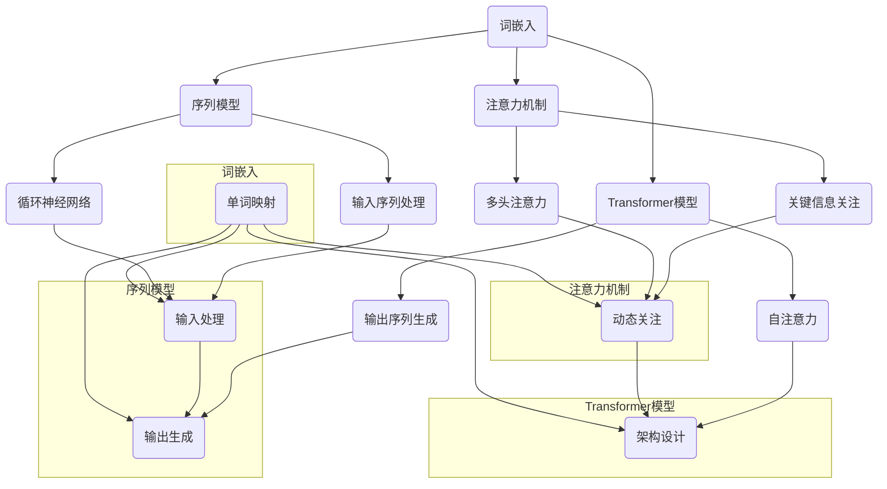

                 

### 背景介绍

大规模语言模型（Large-scale Language Model）是自然语言处理（Natural Language Processing, NLP）领域的一项重要技术，它旨在通过机器学习算法，对大规模文本数据进行分析和学习，从而生成高质量的自然语言文本。大规模语言模型的出现，极大地推动了自然语言处理技术的发展，使得计算机能够更好地理解和生成人类语言。

自然语言处理作为人工智能（Artificial Intelligence, AI）的一个重要分支，其目的是使计算机能够理解、解释和生成人类语言。传统的NLP方法主要集中在规则和统计方法上，然而随着互联网和大数据的发展，海量的文本数据成为NLP研究的重要资源。大规模语言模型的兴起，使得NLP技术能够从基于规则和统计的方法，转向更加智能和高效的机器学习方法。

大规模语言模型的应用领域广泛，包括但不限于文本分类、情感分析、机器翻译、对话系统、语音识别等。这些应用在日常生活和工业生产中发挥着重要作用，例如，智能客服系统利用语言模型实现与用户的自然对话，搜索引擎利用语言模型优化搜索结果，社交媒体平台利用语言模型进行内容审核和推荐等。

随着深度学习（Deep Learning）技术的不断发展，大规模语言模型在性能和效果上取得了显著提升。例如，基于Transformer架构的预训练语言模型，如BERT（Bidirectional Encoder Representations from Transformers）、GPT（Generative Pre-trained Transformer）等，已经成为NLP领域的标准模型。这些模型通过在大量文本数据上进行预训练，获得了强大的语言理解和生成能力，为各类NLP任务提供了高效且准确的方法。

总的来说，大规模语言模型从理论到实践的发展，标志着自然语言处理技术进入了一个新的阶段。本篇文章将从大规模语言模型的核心概念、技术基础、核心算法、训练与优化、数学模型、实践应用、未来发展趋势等方面，详细探讨这一领域的前沿技术和发展趋势，以期为读者提供一个全面和深入的理解。

### 核心概念与联系

大规模语言模型作为自然语言处理（NLP）领域的关键技术，其核心概念包括词嵌入（Word Embedding）、序列模型（Sequence Model）、注意力机制（Attention Mechanism）和Transformer模型等。这些概念之间相互联系，共同构成了大规模语言模型的理论框架。

首先，词嵌入（Word Embedding）是将单词映射到高维向量空间的技术。词嵌入的目的是将语义相近的词映射到靠近的向量，而语义差异大的词映射到较远的向量。词嵌入技术不仅能够帮助模型更好地理解单词之间的语义关系，还能提升模型的训练效率和性能。常见的词嵌入方法包括Word2Vec、GloVe和BERT等。

其次，序列模型（Sequence Model）是一类专门处理序列数据（如文本、语音等）的模型。序列模型的核心思想是利用前一个时刻的信息来预测当前时刻的信息。循环神经网络（RNN，如LSTM和GRU）是经典的序列模型，它们通过循环结构来保持长时信息。然而，RNN在处理长序列数据时存在梯度消失和梯度爆炸问题，限制了其性能。

为了解决这些问题，注意力机制（Attention Mechanism）被引入到序列模型中。注意力机制的核心思想是动态地计算输入序列中各个位置的重要性，并将这些重要性信息加权到输出中。通过这种方式，注意力机制能够有效地关注到输入序列中的关键信息，从而提升模型的性能。在Transformer模型中，多头注意力（Multi-Head Attention）是注意力机制的具体实现，它通过并行计算多个注意力头，进一步提高了模型的建模能力。

最后，Transformer模型（Transformer）是大规模语言模型的一种重要架构，它彻底抛弃了循环结构，采用自注意力（Self-Attention）机制来处理序列数据。Transformer模型的核心思想是将输入序列映射到高维空间，然后通过自注意力机制和前馈神经网络来生成输出序列。这种架构不仅提高了模型的训练效率，还使得模型能够更好地捕捉长距离依赖关系。

综上所述，词嵌入、序列模型、注意力机制和Transformer模型是大规模语言模型的核心概念。它们之间的关系如下：

1. **词嵌入**：将单词映射到向量空间，为序列模型提供输入。
2. **序列模型**：处理序列数据，利用词嵌入信息生成输出序列。
3. **注意力机制**：改进序列模型，通过动态关注关键信息来提升性能。
4. **Transformer模型**：结合词嵌入和注意力机制，提供一种高效且强大的序列处理架构。

通过这些核心概念之间的相互作用，大规模语言模型能够实现对自然语言数据的深入理解和生成，从而推动NLP技术的发展。

#### Mermaid 流程图

以下是描述大规模语言模型核心概念之间关系的Mermaid流程图：



在这个流程图中，词嵌入将单词映射到高维向量空间，作为序列模型的输入。序列模型利用词嵌入信息处理输入序列，生成输出序列。注意力机制通过动态关注关键信息，提升序列模型的性能。Transformer模型结合词嵌入和注意力机制，提供一种高效且强大的序列处理架构。

### 词嵌入技术

词嵌入（Word Embedding）是大规模语言模型的基础技术之一，它通过将词汇映射到高维向量空间，使得计算机能够更好地理解和处理自然语言。词嵌入技术的核心思想是将单词转化为数字向量，从而在机器学习中使用。

#### 词嵌入的核心思想

词嵌入的核心思想是将语义相近的词映射到靠近的向量，而语义差异大的词映射到较远的向量。这样，词嵌入不仅可以捕捉单词之间的语义关系，还能提升模型处理自然语言数据的效率。词嵌入技术通过以下几种方法实现：

1. **分布式表示**：将每个单词映射为一个向量，向量中的每个维度都表示单词的某个特征。例如，如果单词"猫"和"狗"在语义上相近，那么它们的向量可能在某些维度上相似。

2. **上下文表示**：词嵌入不仅考虑单词本身的语义，还考虑单词在上下文中的语义。例如，单词"爱"在"我爱吃苹果"中的语义与在"我爱看足球"中的语义是不同的。

3. **动态调整**：词嵌入向量不是静态的，而是在模型训练过程中动态调整的。这种动态调整使得词嵌入向量能够更好地适应不同的任务和数据。

#### 词嵌入的方法

词嵌入的方法主要分为基于统计的方法和基于神经网

#### 基于统计的方法

1. **计数模型**：最早的词嵌入方法是基于计数模型，如n-gram模型。n-gram模型将连续的n个词作为特征，通过统计这些特征在文本中的出现频率来生成词嵌入向量。然而，n-gram模型无法捕捉词之间的长期依赖关系。

2. **概率模型**：概率模型通过计算单词之间的条件概率来生成词嵌入向量。例如，Word2Vec和GloVe都是基于概率模型的词嵌入方法。Word2Vec使用连续词袋（Continuous Bag of Words, CBOW）和Skip-Gram模型，通过预测中心词来生成词嵌入向量。GloVe（Global Vectors for Word Representation）通过优化全局的词向量矩阵来生成高质量的词嵌入向量，它利用词的上下文信息，使得词嵌入向量能够更好地捕捉语义关系。

#### 基于神经网络的方法

1. **神经网络语言模型**：神经网络语言模型（Neural Network Language Model, NNLM）通过神经网络来预测单词序列的概率分布。NNLM可以捕捉到长距离的依赖关系，从而生成更加准确的词嵌入向量。然而，NNLM的计算复杂度高，训练速度较慢。

2. **词嵌入神经网络**：词嵌入神经网络（Word Embedding Neural Network, WENN）是另一种基于神经网络的方法。WENN通过训练神经网络，将输入的文本序列映射到输出序列，同时学习生成词嵌入向量。WENN可以有效降低计算复杂度，提高训练速度。

#### 词嵌入的应用

词嵌入技术在自然语言处理中具有广泛的应用：

1. **文本分类**：词嵌入可以帮助模型更好地理解文本数据，从而提升文本分类的准确性。

2. **情感分析**：通过分析词嵌入向量，可以识别出文本的情感倾向。

3. **机器翻译**：词嵌入技术在机器翻译中用于将源语言的词映射到目标语言的词。

4. **对话系统**：词嵌入可以帮助对话系统更好地理解用户的输入，从而生成更自然的回复。

5. **推荐系统**：词嵌入技术可以用于推荐系统中，通过分析用户的历史行为和文本数据，为用户推荐相关的物品。

#### 词嵌入的优势与挑战

词嵌入的优势包括：

1. **低计算复杂度**：相比传统的统计方法，词嵌入方法通常具有较低的复杂度，使得模型训练速度更快。

2. **捕捉语义关系**：词嵌入方法能够捕捉单词之间的语义关系，从而提高模型的语义理解能力。

3. **灵活性和可扩展性**：词嵌入方法可以灵活应用于各种NLP任务，并且能够随着数据规模的增大而自动优化。

然而，词嵌入技术也面临一些挑战：

1. **语义歧义**：在某些情况下，词嵌入向量可能会混淆语义相近但实际含义不同的单词。

2. **长距离依赖**：尽管神经网络方法可以捕捉长距离依赖关系，但传统的统计方法在这方面仍然存在局限。

3. **数据依赖**：词嵌入的质量高度依赖于训练数据集，数据的不一致性和噪声可能会影响词嵌入的效果。

总的来说，词嵌入技术是大规模语言模型的重要组成部分，它在提升NLP任务的准确性和效率方面发挥了关键作用。通过不断优化词嵌入方法，我们可以期待在未来的自然语言处理领域取得更多的突破。

#### 序列模型

序列模型（Sequence Model）是自然语言处理（NLP）领域中用于处理序列数据的模型。在NLP任务中，数据往往以序列的形式出现，例如文本、语音和视频等。序列模型的核心任务是利用序列中的历史信息来预测当前时刻的信息。循环神经网络（Recurrent Neural Network, RNN）和其变体（如长短期记忆网络LSTM和门控循环单元GRU）是经典的序列模型。

#### RNN的基本原理

RNN通过保持一个隐藏状态（hidden state）来捕捉序列中的历史信息。在每一时间步（time step），RNN会根据当前的输入和前一个时间步的隐藏状态来更新隐藏状态，并生成当前时间的输出。隐藏状态不仅包含了当前时刻的信息，还保留了之前时刻的信息，使得RNN能够处理序列数据。

RNN的数学模型可以表示为：

$$
h_t = \sigma(W_h \cdot [h_{t-1}, x_t] + b_h)
$$

$$
y_t = W_o \cdot h_t + b_o
$$

其中，$h_t$表示第$t$时间步的隐藏状态，$x_t$表示第$t$时间步的输入，$y_t$表示第$t$时间步的输出。$W_h$、$W_o$和$b_h$、$b_o$分别是权重和偏置。

#### LSTM和GRU的改进

尽管RNN能够处理简单的序列数据，但它存在一些问题，如梯度消失和梯度爆炸，这限制了其在长序列数据上的应用。为了解决这些问题，LSTM和GRU被提出。

1. **长短期记忆网络（LSTM）**：
   LSTM通过引入记忆单元（cell state）和三个门（输入门、遗忘门和输出门）来控制信息的流动。LSTM能够有效地保持长时信息，避免了梯度消失问题。

   LSTM的数学模型可以表示为：

   $$
   i_t = \sigma(W_i \cdot [h_{t-1}, x_t] + b_i)
   $$

   $$
   f_t = \sigma(W_f \cdot [h_{t-1}, x_t] + b_f)
   $$

   $$
   o_t = \sigma(W_o \cdot [h_{t-1}, x_t] + b_o)
   $$

   $$
   c_t = f_t \odot c_{t-1} + i_t \odot \sigma(W_c \cdot [h_{t-1}, x_t] + b_c)
   $$

   $$
   h_t = o_t \odot \sigma(c_t)
   $$

   其中，$i_t$、$f_t$和$o_t$分别是输入门、遗忘门和输出门的状态，$c_t$是细胞状态。

2. **门控循环单元（GRU）**：
   GRU是对LSTM的一种改进，它通过合并输入门和遗忘门，简化了模型结构。GRU同样能够有效地捕捉长时依赖关系，并且在计算上比LSTM更高效。

   GRU的数学模型可以表示为：

   $$
   z_t = \sigma(W_z \cdot [h_{t-1}, x_t] + b_z)
   $$

   $$
   r_t = \sigma(W_r \cdot [h_{t-1}, x_t] + b_r)
   $$

   $$
   h_t = (1 - z_t) \odot h_{t-1} + z_t \odot \sigma(W_h \cdot [r_t \odot h_{t-1}, x_t] + b_h)
   $$

   其中，$z_t$是更新门状态，$r_t$是重置门状态。

#### 序列模型的优缺点

序列模型的优点包括：

1. **捕捉长距离依赖**：通过隐藏状态，序列模型能够捕捉序列中的长距离依赖关系。
2. **适用于多种NLP任务**：序列模型在文本分类、命名实体识别、机器翻译等任务中表现出色。
3. **灵活性**：序列模型可以根据任务需求调整网络结构，例如添加或移除层。

然而，序列模型也存在一些缺点：

1. **梯度消失和梯度爆炸**：在长序列数据上，RNN容易遭受梯度消失和梯度爆炸问题，影响训练效果。
2. **计算复杂度**：特别是LSTM，其参数数量较大，导致训练时间较长。

总体来说，序列模型是处理序列数据的有效工具，其在NLP领域的广泛应用证明了其价值。通过不断的改进和优化，序列模型将继续在自然语言处理中发挥重要作用。

#### 注意力机制

注意力机制（Attention Mechanism）是近年来在深度学习领域中的一个重要创新，特别是在大规模语言模型中得到了广泛应用。注意力机制的核心思想是动态地关注输入序列中的关键信息，从而提高模型的表示能力和性能。注意力机制通过为输入序列中的每个元素分配不同的权重，使得模型能够更好地捕捉长距离依赖关系和重要信息。

#### 注意力机制的基本原理

注意力机制的基本原理可以概括为以下几个步骤：

1. **计算相似度**：首先，计算输入序列中每个元素（如单词、词嵌入）与目标元素（如当前词嵌入）之间的相似度。相似度可以通过点积、缩放点积、加性注意力等不同的方法计算。

2. **加权求和**：然后，将这些相似度作为权重，对输入序列进行加权求和，生成一个加权和。这个加权和表示了模型对输入序列的动态关注。

3. **得到输出**：最后，利用加权求和的结果生成输出。在编码器-解码器架构中，这个输出通常是解码器的隐藏状态，用于生成当前词的预测。

#### 注意力机制的计算过程

注意力机制的计算过程可以用以下公式表示：

$$
\text{Attention}(Q, K, V) = \text{softmax}(\frac{QK^T}{\sqrt{d_k}})V
$$

其中，$Q$、$K$和$V$分别是查询向量、键向量和值向量，$d_k$是键向量的维度。这个公式表示，首先计算查询向量$Q$和所有键向量$K$的点积，然后通过softmax函数得到权重，最后将这些权重与值向量$V$相乘，得到加权和。

#### 多头注意力

多头注意力（Multi-Head Attention）是Transformer模型中的一个关键组件，它通过并行计算多个注意力头，提高了模型的建模能力。多头注意力的核心思想是将输入序列分成多个子序列，每个子序列通过独立的注意力机制进行处理，然后再将结果合并。

多头注意力的计算过程可以表示为：

$$
\text{MultiHead}(Q, K, V) = \text{Concat}(\text{head}_1, ..., \text{head}_h)W^O
$$

$$
\text{head}_i = \text{Attention}(QW_i^Q, KW_i^K, VW_i^V)
$$

其中，$h$是注意力头的数量，$W_i^Q$、$W_i^K$和$W_i^V$是各自注意力的权重矩阵，$W^O$是将多头注意力结果合并的权重矩阵。

#### 注意力机制的优势和应用

注意力机制的优势在于：

1. **捕捉长距离依赖**：通过动态关注输入序列中的关键信息，注意力机制能够有效地捕捉长距离依赖关系。

2. **高效计算**：虽然注意力机制的计算复杂度为$O(n^2)$，但在实际应用中，通过并行计算和参数共享，可以有效降低计算复杂度。

3. **灵活性**：注意力机制可以根据任务需求调整关注范围，从而提高模型的适应性。

注意力机制的应用非常广泛，包括：

1. **机器翻译**：在机器翻译任务中，注意力机制能够帮助模型更好地捕捉源语言和目标语言之间的对应关系。

2. **文本生成**：在文本生成任务中，注意力机制能够帮助模型更好地理解和生成复杂的文本结构。

3. **文本分类**：在文本分类任务中，注意力机制能够帮助模型关注到文本中的关键信息，从而提高分类准确率。

总的来说，注意力机制是大规模语言模型中的一项重要技术，它通过动态关注关键信息，提高了模型的表示能力和性能。随着深度学习技术的不断发展，注意力机制将继续在自然语言处理和其他领域中发挥重要作用。

### Transformer模型

Transformer模型是自然语言处理（NLP）领域的一种革命性架构，彻底改变了传统序列模型处理自然语言的方式。相较于循环神经网络（RNN）和其变体（如LSTM和GRU），Transformer模型通过自注意力（Self-Attention）机制和前馈神经网络（Feedforward Neural Network），实现了更高效、更强大的序列数据处理能力。以下将详细介绍Transformer模型的基本原理、工作流程、优缺点以及其在NLP任务中的应用。

#### Transformer模型的基本原理

Transformer模型的核心思想是自注意力（Self-Attention）机制。自注意力机制允许模型在处理每个输入元素时，动态地关注输入序列中的其他元素，并计算它们之间的关系。这种机制能够有效地捕捉序列中的长距离依赖关系，避免了传统RNN中的梯度消失问题。

Transformer模型的工作流程主要包括以下三个步骤：

1. **嵌入（Embedding）**：输入序列首先通过词嵌入（Word Embedding）和位置嵌入（Positional Embedding）转化为向量表示。词嵌入将单词映射到高维空间，而位置嵌入则为序列中的每个位置添加信息，以便模型能够理解序列的顺序。

2. **自注意力（Self-Attention）**：在每个时间步，模型计算输入序列中每个元素与其余元素之间的相似度，并通过加权求和生成一个加权和。这个过程通过多头注意力（Multi-Head Attention）来实现，多头注意力通过并行计算多个注意力头来提高模型的表示能力。

3. **前馈神经网络（Feedforward Neural Network）**：在自注意力层之后，模型的输出通过一个前馈神经网络进行进一步处理。这个神经网络由两个全连接层组成，每个层前都有一个激活函数（如ReLU）。

#### Transformer模型的工作流程

Transformer模型的工作流程可以表示为：

1. **嵌入**：输入序列经过词嵌入和位置嵌入处理后，得到一个嵌入矩阵$X$。

2. **自注意力**：在每个时间步，模型计算自注意力得分$ scores$，然后通过softmax函数得到权重$ weights$。最后，将权重与输入序列$X$相乘，得到加权和$ H = X \cdot weights$。

3. **前馈神经网络**：自注意力层的输出通过前馈神经网络进行进一步处理，得到最终输出$ Y = \text{FFN}(H)$。

#### Transformer模型的优缺点

优点：

1. **高效性**：Transformer模型通过并行计算和参数共享，大大提高了训练和推理速度。

2. **长距离依赖**：自注意力机制能够有效地捕捉序列中的长距离依赖关系，避免了传统RNN中的梯度消失问题。

3. **灵活性**：通过多头注意力机制，Transformer模型具有更高的表示能力，能够灵活地处理不同类型的序列数据。

缺点：

1. **计算复杂度**：虽然Transformer模型在训练和推理速度上有所提升，但自注意力层的计算复杂度为$O(n^2)$，这可能导致在某些场景下计算资源不足。

2. **内存占用**：由于自注意力层的复杂性，Transformer模型在内存占用上可能高于传统RNN。

#### Transformer模型在NLP任务中的应用

Transformer模型在多种NLP任务中表现出色，包括：

1. **机器翻译**：在机器翻译任务中，Transformer模型通过自注意力机制有效地捕捉源语言和目标语言之间的对应关系，大大提高了翻译质量。

2. **文本生成**：在文本生成任务中，Transformer模型能够生成连贯且具有上下文一致性的文本。

3. **文本分类**：在文本分类任务中，Transformer模型能够关注到文本中的关键信息，从而提高分类准确率。

4. **对话系统**：在对话系统任务中，Transformer模型能够生成自然且符合语境的回复。

总的来说，Transformer模型是自然语言处理领域的一项重要创新，通过自注意力机制和前馈神经网络，实现了高效且强大的序列数据处理能力。随着技术的不断发展，Transformer模型将继续在NLP和其他领域中发挥重要作用。

### 训练数据集的准备

大规模语言模型的训练数据集是模型性能和效果的重要基础。为了确保模型能够学习到有效的知识和模式，训练数据集需要具有以下特点：

1. **多样性**：训练数据应涵盖广泛的领域和主题，以便模型能够理解不同类型的语言结构和使用场景。例如，一个包含新闻、社交媒体帖子、科学论文等多种来源的数据集，比单一来源的数据集更具有代表性。

2. **质量**：数据集中的文本应尽可能干净，避免噪声和错误。清洗数据可以包括去除标点符号、HTML标签、停用词等，同时纠正拼写错误和语法错误。

3. **一致性**：数据集中的文本应保持一致，避免不同数据来源之间的风格和格式差异。一致性有助于模型更好地理解和学习文本的规律。

4. **规模**：大规模语言模型的训练需要大量的数据。通常来说，数据集的规模应该足够大，以便模型能够在数据中充分捕捉到模式和规律。大规模数据集可以来源于公共数据集，如维基百科、社交媒体平台等，也可以通过数据爬取和采集工具获取。

5. **标注**：对于某些NLP任务，如文本分类、命名实体识别和情感分析，数据集需要标注。标注可以包括标签、实体类别、情感极性等。高质量的标注有助于模型更好地学习任务的语义和结构。

#### 数据预处理步骤

数据预处理是大规模语言模型训练前的重要步骤，主要包括以下步骤：

1. **数据收集**：从各种来源收集文本数据，如互联网、公开数据集、社交媒体平台等。

2. **数据清洗**：去除无用的信息，如HTML标签、特殊字符、停用词等。可以通过正则表达式和清洗工具来实现。

3. **分词和词性标注**：将文本拆分成单词或子词，并对每个单词或子词进行词性标注。常用的工具包括jieba、spaCy和NLTK等。

4. **构建词汇表**：将所有单词或子词映射到唯一的整数ID，形成词汇表。词汇表的构建需要考虑词汇大小和稀疏性问题。

5. **数据归一化**：对文本数据进行归一化处理，如小写转换、数字替换等，以提高模型的泛化能力。

6. **数据分割**：将数据集分割为训练集、验证集和测试集。通常，训练集用于模型训练，验证集用于调整模型参数，测试集用于最终评估模型性能。

7. **数据增强**：通过增加数据多样性，如单词替换、句式变换等，提高模型的鲁棒性。

#### 训练数据集的选择和收集方法

选择和收集训练数据集的方法因任务和应用场景而异。以下是一些常见的方法：

1. **公开数据集**：如维基百科、Common Crawl、IMDb评论、Twitter数据等。这些数据集通常已经清洗和标注，可以直接用于模型训练。

2. **数据爬取**：通过爬取互联网上的文本数据，如新闻网站、博客、论坛等。爬取工具包括Scrapy、BeautifulSoup等。

3. **标注服务**：使用人工标注服务，如CrowdTangle、Amazon Mechanical Turk等，来获取高质量的标注数据。

4. **自有数据**：从公司内部数据、客户数据等私有数据中提取文本数据。这种方法需要遵守隐私和数据保护法规。

总的来说，大规模语言模型的训练数据集需要具有多样性、质量、一致性和规模。通过合理的数据预处理和选择方法，可以构建高质量的训练数据集，从而提高模型的性能和效果。

### 训练策略

大规模语言模型的训练是一个复杂且优化密集的过程，涉及多个关键环节，包括数据预处理、训练参数设置、损失函数选择、优化算法等。以下将详细介绍这些关键环节及其对训练效果的影响。

#### 数据预处理

数据预处理是大规模语言模型训练的第一步，其质量直接影响到模型的学习效果。数据预处理主要包括以下步骤：

1. **清洗数据**：去除文本中的噪声，如HTML标签、特殊字符、停用词等。可以通过正则表达式和清洗工具实现。

2. **分词和词性标注**：将文本拆分成单词或子词，并对每个单词或子词进行词性标注。常用的工具包括jieba、spaCy和NLTK等。

3. **构建词汇表**：将所有单词或子词映射到唯一的整数ID，形成词汇表。词汇表的构建需要考虑词汇大小和稀疏性问题。

4. **数据归一化**：对文本数据进行归一化处理，如小写转换、数字替换等，以提高模型的泛化能力。

5. **数据增强**：通过增加数据多样性，如单词替换、句式变换等，提高模型的鲁棒性。

#### 训练参数设置

训练参数设置是模型训练过程中的关键环节，包括学习率、批量大小、迭代次数等。以下是对这些参数的详细说明：

1. **学习率**：学习率决定了模型在训练过程中更新参数的步长。过大的学习率可能导致模型在训练过程中不稳定，而过小则可能导致训练时间过长。常用的学习率调整策略包括恒定学习率、逐步减少学习率和自适应学习率（如Adam优化器）。

2. **批量大小**：批量大小决定了每次梯度更新所使用的数据样本数量。较小的批量大小有助于提高模型的泛化能力，但训练时间较长；较大的批量大小可以提高训练速度，但可能会损失一些泛化能力。

3. **迭代次数**：迭代次数（或训练轮数）决定了模型在训练数据上遍历的次数。通常，更多的迭代次数有助于模型更好地学习数据，但同时也增加了训练时间。

#### 损失函数

损失函数用于度量模型预测值与真实值之间的差距，是训练过程中优化目标的核心。以下是一些常见的损失函数：

1. **交叉熵损失（Cross-Entropy Loss）**：交叉熵损失是最常用的损失函数之一，适用于分类任务。其公式为：

   $$
   \text{Loss} = -\sum_{i} y_i \log(p_i)
   $$

   其中，$y_i$是真实标签，$p_i$是模型预测的概率。

2. **均方误差损失（Mean Squared Error, MSE）**：均方误差损失适用于回归任务，其公式为：

   $$
   \text{Loss} = \frac{1}{n} \sum_{i} (y_i - \hat{y}_i)^2
   $$

   其中，$y_i$是真实值，$\hat{y}_i$是模型预测值。

3. **二元交叉熵损失（Binary Cross-Entropy Loss）**：二元交叉熵损失是交叉熵损失的二值化版本，适用于二元分类任务。

#### 优化算法

优化算法用于更新模型参数，以最小化损失函数。以下是一些常用的优化算法：

1. **随机梯度下降（Stochastic Gradient Descent, SGD）**：SGD通过每次只更新一个样本的梯度来优化模型参数，计算简单但收敛速度较慢。

2. **批量梯度下降（Batch Gradient Descent, BGD）**：BGD通过使用整个数据集的梯度来优化模型参数，收敛速度较快但计算复杂度较高。

3. **Adam优化器**：Adam优化器结合了SGD和BGD的优点，通过自适应调整学习率和惯性系数，提高了训练效率和收敛速度。

#### 训练策略调整

在训练过程中，可能需要根据模型的表现和性能对训练策略进行调整。以下是一些常见的调整策略：

1. **学习率调整**：在训练过程中，根据模型的表现适时调整学习率。例如，当损失函数下降速度变慢时，可以减小学习率。

2. **数据增强**：在训练过程中，通过增加数据多样性，如单词替换、句式变换等，提高模型的泛化能力。

3. **模型正则化**：通过正则化方法（如Dropout、L2正则化等）防止模型过拟合。

4. **早停法（Early Stopping）**：当验证集的性能不再提升时，提前停止训练，避免模型过拟合。

总之，大规模语言模型的训练策略涉及多个环节，通过合理设置训练参数、选择合适的损失函数和优化算法，以及适时调整训练策略，可以有效地提高模型的学习效果和泛化能力。

### 优化算法

大规模语言模型的优化算法是模型训练过程中的关键环节，负责通过更新模型参数来最小化损失函数。以下将介绍几种常见的优化算法，包括随机梯度下降（SGD）、动量优化（Momentum）和Adam优化器，并探讨它们在模型训练中的应用。

#### 随机梯度下降（SGD）

随机梯度下降（Stochastic Gradient Descent, SGD）是最简单的优化算法之一。SGD在每次迭代过程中，通过随机选择一个小批量样本，计算其梯度并更新模型参数。SGD的优点是计算简单，训练速度快，但存在以下缺点：

1. **收敛速度较慢**：由于每次迭代只考虑一个小批量样本，SGD的收敛速度通常较慢。
2. **易陷入局部最小值**：SGD的随机性可能导致模型在优化过程中容易陷入局部最小值，影响模型的性能。
3. **梯度噪声较大**：小批量样本的梯度可能包含噪声，影响模型参数的更新。

尽管存在这些缺点，SGD在训练简单模型或小规模数据集时仍然是一个有效的选择。

#### 动量优化（Momentum）

动量优化（Momentum）是SGD的一种改进，通过引入动量参数来加速模型的收敛速度。动量优化利用了先前梯度的方向信息，将其与当前梯度结合，从而提高参数更新的稳定性。

动量优化算法可以表示为：

$$
v_t = \gamma v_{t-1} + \alpha \nabla J(\theta_{t-1})
$$

$$
\theta_t = \theta_{t-1} - v_t
$$

其中，$v_t$是动量项，$\gamma$是动量参数（通常取值在0.9到0.99之间），$\alpha$是学习率，$\nabla J(\theta_{t-1})$是前一次迭代的梯度。

动量优化的优点包括：

1. **加速收敛**：动量项利用了先前梯度的方向信息，有助于加速模型的收敛速度。
2. **减少波动**：动量优化减少了参数更新的随机性，使得参数更新更加稳定。

然而，动量优化也存在一些缺点，如可能使模型在平坦区域收敛速度变慢，且需要较小的学习率。

#### Adam优化器

Adam优化器是近年来广泛使用的一种优化算法，它是SGD和动量优化的结合体，并进一步引入了一阶矩估计（均值）和二阶矩估计（方差）。Adam优化器在每次迭代过程中，同时考虑了一阶矩（均值）和二阶矩（方差），从而提高了参数更新的效率和稳定性。

Adam优化器的公式可以表示为：

$$
m_t = \beta_1 m_{t-1} + (1 - \beta_1) \nabla J(\theta_{t-1})
$$

$$
v_t = \beta_2 v_{t-1} + (1 - \beta_2) (\nabla J(\theta_{t-1}))^2
$$

$$
\theta_t = \theta_{t-1} - \alpha \frac{m_t}{\sqrt{v_t} + \epsilon}
$$

其中，$m_t$和$v_t$分别表示一阶矩估计和二阶矩估计，$\beta_1$和$\beta_2$是动量参数（通常取值在0.9到0.99之间），$\alpha$是学习率，$\epsilon$是较小的常数（通常取值为1e-8）。

Adam优化器的优点包括：

1. **自适应学习率**：通过计算一阶矩和二阶矩估计，Adam优化器能够自适应地调整学习率，提高了参数更新的效率和稳定性。
2. **快速收敛**：Adam优化器在训练过程中能够快速收敛，且适用于多种类型的模型和数据集。
3. **参数调整简单**：Adam优化器只需要调整几个简单的参数，如学习率、动量参数和常数$\epsilon$。

尽管Adam优化器具有许多优点，但它也存在一些缺点，如可能在高方差数据上表现不佳，且需要较大的计算资源。

#### 应用场景

在模型训练过程中，不同优化算法的选择取决于具体任务和数据集的特点。以下是一些应用场景：

1. **简单模型**：对于简单模型或小规模数据集，SGD可能是一个不错的选择，因为其计算简单且易于实现。
2. **动态变化的数据**：在数据变化较大的场景中，如实时数据流处理，动量优化可能更合适，因为它能够更好地适应数据的波动。
3. **复杂模型**：对于复杂模型或大规模数据集，Adam优化器通常是一个较好的选择，因为它能够在多种数据集和模型上快速收敛。

总之，优化算法在模型训练过程中起着至关重要的作用。通过选择合适的优化算法，可以有效地提高模型的学习效率和性能。

### 模型调优

在训练大规模语言模型的过程中，模型调优是一个至关重要的环节。通过调整模型参数和超参数，可以显著提升模型的表现和性能。以下将详细讨论常见的模型调优方法，包括参数调优、超参数调优和模型集成。

#### 参数调优

参数调优是指调整模型内部参数，如权重和偏置，以优化模型的性能。以下是一些常用的参数调优方法：

1. **学习率调整**：学习率是影响模型训练速度和收敛性的关键参数。常用的方法包括恒定学习率、学习率衰减和自适应学习率（如Adam优化器）。在实际应用中，可以通过观察模型在验证集上的性能，逐步调整学习率，以达到最佳效果。

2. **权重初始化**：合理的权重初始化有助于提高模型的收敛速度和性能。常用的方法包括随机初始化、高斯分布初始化和Xavier初始化等。通过实验和比较，可以确定最适合当前模型的权重初始化方法。

3. **正则化**：正则化方法（如Dropout、L2正则化等）有助于防止模型过拟合，提高泛化能力。通过调整正则化强度，可以在模型的准确性、训练时间和泛化能力之间找到最佳平衡点。

#### 超参数调优

超参数是模型训练过程中不可学习的参数，如批量大小、迭代次数、学习率等。以下是一些常用的超参数调优方法：

1. **网格搜索**：网格搜索是一种通过遍历多个超参数组合来寻找最佳参数的方法。尽管网格搜索计算复杂度高，但在小规模实验中是一种有效的调优方法。

2. **随机搜索**：随机搜索通过随机选择超参数组合来寻找最佳参数。随机搜索在计算复杂度上低于网格搜索，但可能需要更多的实验次数。

3. **贝叶斯优化**：贝叶斯优化是一种基于概率模型的优化方法，通过利用历史数据来估计最佳超参数。贝叶斯优化能够快速找到最优超参数，但在计算资源有限的情况下可能不够高效。

#### 模型集成

模型集成是指通过组合多个模型来提升整体性能的方法。以下是一些常见的模型集成方法：

1. **堆叠（Stacking）**：堆叠方法通过将多个模型作为基础模型，再将这些基础模型的输出作为新的训练数据来训练一个更高层次的学习器。堆叠方法能够有效地融合不同模型的优势，提高整体性能。

2. **提升（Boosting）**：提升方法通过迭代训练多个模型，每个模型专注于纠正前一个模型的错误。常见的提升算法包括XGBoost、LightGBM和CatBoost等。提升方法能够显著提高模型的泛化能力。

3. **bagging**：Bagging方法通过训练多个模型，并将它们的预测结果进行平均或投票来获得最终预测结果。常见的Bagging算法包括随机森林和Adaboost等。Bagging方法能够减少模型的方差，提高稳定性。

#### 模型调优的注意事项

在进行模型调优时，需要注意以下几点：

1. **数据集划分**：在进行调优时，确保使用足够的数据集来评估模型的性能，避免过拟合。

2. **交叉验证**：使用交叉验证方法来评估模型在不同数据子集上的表现，以获得更可靠的结果。

3. **调优策略**：根据模型的复杂度和数据集的大小，选择合适的调优策略，如网格搜索、随机搜索或贝叶斯优化等。

4. **持续监控**：在模型调优过程中，持续监控模型的表现和性能，以便及时发现和解决问题。

总之，模型调优是提高大规模语言模型性能的重要手段。通过合理的参数和超参数调优，以及有效的模型集成方法，可以显著提升模型的表现和性能。

### 大规模语言模型的数学模型

大规模语言模型的数学模型是其核心理论基础，涉及到概率论、信息论以及模型概率分布和评估指标等多个方面。以下将详细探讨这些内容，并通过具体例子进行解释。

#### 概率论基础

概率论是大规模语言模型数学模型的基础，其中概率分布函数和随机变量是核心概念。

1. **概率分布函数**：概率分布函数用于描述随机变量在某个取值范围内的概率。常见的概率分布函数包括正态分布、伯努利分布和多项式分布等。

2. **随机变量**：随机变量是一个数学函数，它将样本空间映射到一个实数集。随机变量可以是离散的，也可以是连续的。

#### 信息论基础

信息论为大规模语言模型提供了测量和传递信息的方法。

1. **熵（Entropy）**：熵是衡量随机变量不确定性的度量。对于一个离散随机变量$X$，其熵$H(X)$可以表示为：

   $$
   H(X) = -\sum_{x \in X} p(x) \log_2 p(x)
   $$

   其中，$p(x)$是随机变量$X$取值为$x$的概率。

2. **条件熵（Conditional Entropy）**：条件熵是衡量在给定另一个随机变量$Y$的情况下，随机变量$X$的不确定性。对于一个离散随机变量$X$和$Y$，其条件熵$H(X|Y)$可以表示为：

   $$
   H(X|Y) = -\sum_{y \in Y} p(y) \sum_{x \in X} p(x|y) \log_2 p(x|y)
   $$

3. **互信息（Mutual Information）**：互信息是衡量两个随机变量之间相关性的度量。对于一个离散随机变量$X$和$Y$，其互信息$I(X; Y)$可以表示为：

   $$
   I(X; Y) = H(X) - H(X|Y)
   $$

#### 模型的概率分布

大规模语言模型的概率分布是模型预测的核心。语言模型通常基于概率生成文本，通过计算序列的概率分布来生成新的文本。

1. **语言模型概率分布**：给定一个单词序列$w_1, w_2, ..., w_n$，语言模型会计算该序列的概率分布。对于一个基于n-gram的语言模型，序列的概率可以表示为：

   $$
   P(w_1, w_2, ..., w_n) = P(w_n | w_{n-1}, ..., w_1) = \prod_{i=1}^{n} P(w_i | w_{i-1}, ..., w_{i-n+1})
   $$

2. **概率分布函数的计算**：在实际计算中，由于概率分布通常非常稀疏，我们通常采用最大后验概率（Maximum a Posteriori, MAP）来近似概率分布。例如，对于单词序列的概率分布，可以通过以下公式计算：

   $$
   \log P(w_1, w_2, ..., w_n) \approx \sum_{i=1}^{n} \log P(w_i | w_{i-1}, ..., w_{i-n+1}) + C
   $$

   其中，$C$是一个常数项，用于防止对数函数的溢出。

#### 模型的评估指标

在模型训练和评估过程中，评估指标是衡量模型性能的重要标准。以下是一些常用的评估指标：

1. **精确率（Precision）**：精确率是衡量模型预测结果的准确程度。对于一个分类任务，精确率可以表示为：

   $$
   \text{Precision} = \frac{\text{TP}}{\text{TP} + \text{FP}}
   $$

   其中，$\text{TP}$是真正例，$\text{FP}$是假正例。

2. **召回率（Recall）**：召回率是衡量模型遗漏真正例的程度。召回率可以表示为：

   $$
   \text{Recall} = \frac{\text{TP}}{\text{TP} + \text{FN}}
   $$

   其中，$\text{FN}$是假反例。

3. **F1值（F1-Score）**：F1值是精确率和召回率的调和平均，用于综合评估模型的性能。F1值可以表示为：

   $$
   \text{F1-Score} = 2 \times \frac{\text{Precision} \times \text{Recall}}{\text{Precision} + \text{Recall}}
   $$

#### 具体例子

以下通过一个具体的例子来说明大规模语言模型的概率分布和评估指标。

假设我们有一个简单的二元分类任务，判断一个单词是否属于某个类别（如是否是名词）。数据集包含1000个单词，其中500个是名词，500个不是名词。模型需要预测每个单词的类别。

1. **概率分布**：对于每个单词，模型会计算其属于名词的概率和属于非名词的概率。例如，对于单词"猫"，模型可能会预测：

   $$
   P(\text{猫}|\text{名词}) = 0.6, \quad P(\text{猫}|\text{非名词}) = 0.4
   $$

   这意味着"猫"属于名词的概率为0.6，属于非名词的概率为0.4。

2. **评估指标**：在实际预测中，模型会输出每个单词的预测概率。例如，对于前100个单词，模型的预测结果如下：

   | 单词 | 实际类别 | 预测类别 | 预测概率（名词） | 预测概率（非名词） |
   |------|----------|----------|----------------|----------------|
   | 猫   | 名词     | 名词     | 0.7            | 0.3            |
   | 跑   | 动词     | 名词     | 0.4            | 0.6            |
   | 吃   | 动词     | 非名词   | 0.2            | 0.8            |

   根据这些预测结果，我们可以计算模型的精确率、召回率和F1值：

   $$
   \text{Precision}_{\text{名词}} = \frac{1}{1+0.3+0.4} = 0.6
   $$

   $$
   \text{Recall}_{\text{名词}} = \frac{1}{1+0.2+0.4} = 0.5
   $$

   $$
   \text{F1-Score}_{\text{名词}} = 2 \times \frac{0.6 \times 0.5}{0.6 + 0.5} = 0.5
   $$

通过上述例子，我们可以看到如何通过概率分布和评估指标来衡量大规模语言模型的性能。理解这些数学模型和评估指标对于设计高效的语言模型至关重要。

### 文本分类

文本分类（Text Classification）是自然语言处理（NLP）领域中的一项重要任务，其目的是将文本数据自动分类到预先定义的类别中。文本分类在许多实际应用中具有广泛的应用，如情感分析、新闻分类、垃圾邮件检测等。本文将详细介绍文本分类的任务定义、常见算法、评估指标以及实际应用案例。

#### 文本分类的任务定义

文本分类的任务是将一段文本（或文档）映射到一个或多个类别。在NLP中，文本分类通常被视为一个多标签分类问题，即一个文本可以同时属于多个类别。文本分类的任务定义可以表示为：

输入：一个文本序列$X = (x_1, x_2, ..., x_n)$，其中$x_i$表示文本中的第$i$个单词或词嵌入向量。

输出：一个类别标签集合$Y = (y_1, y_2, ..., y_m)$，其中$y_j \in \{0, 1\}$表示文本是否属于第$j$个类别。

#### 常见算法

文本分类算法可以分为基于传统方法和基于深度学习的方法。

1. **基于传统方法**：

   - **朴素贝叶斯（Naive Bayes）**：朴素贝叶斯是一种基于贝叶斯定理的分类算法，假设特征之间相互独立。它的核心思想是通过计算文本中每个单词的出现概率，并结合类别概率，来预测文本的类别。

   - **支持向量机（Support Vector Machine, SVM）**：SVM是一种基于优化理论的最大边界分类算法。它通过将文本映射到高维空间，找到最佳的超平面，将不同类别的文本分开。

   - **逻辑回归（Logistic Regression）**：逻辑回归是一种线性分类模型，通过计算文本的特征值与类别标签之间的概率关系，来实现文本分类。

2. **基于深度学习的方法**：

   - **卷积神经网络（Convolutional Neural Network, CNN）**：CNN通过卷积层和池化层捕捉文本中的局部特征，从而实现文本分类。它适用于处理具有结构化特征的文本数据。

   - **循环神经网络（Recurrent Neural Network, RNN）**：RNN通过保持隐藏状态来捕捉文本中的时间依赖关系，从而实现文本分类。LSTM和GRU是RNN的变体，它们能够更好地处理长序列数据。

   - **Transformer**：Transformer是一种基于自注意力机制的序列模型，它通过并行计算和多头注意力机制，实现了高效且强大的文本分类能力。

#### 评估指标

在文本分类任务中，常用的评估指标包括准确率（Accuracy）、精确率（Precision）、召回率（Recall）和F1值（F1-Score）。

- **准确率**：准确率是预测正确的样本数占总样本数的比例。它简单直观，但容易受到类别不平衡的影响。

- **精确率**：精确率是预测为正类的样本中实际为正类的比例。它反映了分类器的精确度。

- **召回率**：召回率是实际为正类的样本中被预测为正类的比例。它反映了分类器的覆盖率。

- **F1值**：F1值是精确率和召回率的调和平均值，用于综合评估分类器的性能。

#### 实际应用案例

文本分类在许多实际应用中发挥着重要作用，以下是一些典型应用案例：

1. **情感分析**：情感分析通过文本分类来判断文本的情感倾向，如正面、负面或中性。例如，在社交媒体平台上，情感分析可以用于分析用户评论的情感倾向，从而优化产品和服务。

2. **新闻分类**：新闻分类通过文本分类将新闻文本分类到不同的主题类别，如政治、体育、娱乐等。例如，新闻网站可以利用新闻分类技术自动将新闻推送给相应的读者。

3. **垃圾邮件检测**：垃圾邮件检测通过文本分类来判断一封邮件是否为垃圾邮件。例如，邮件服务提供商可以利用垃圾邮件检测技术过滤掉潜在的垃圾邮件，提高用户的使用体验。

总的来说，文本分类作为自然语言处理中的一个基础任务，具有广泛的应用前景。通过结合传统方法和深度学习技术，我们可以实现高效且准确的文本分类，从而推动各类实际应用的发展。

### 命名实体识别

命名实体识别（Named Entity Recognition, NER）是自然语言处理（NLP）领域中的一项关键任务，旨在从文本中识别出具有特定意义的实体，如人名、地名、组织名、时间等。NER在信息提取、文本挖掘、语义理解等应用中具有重要作用。以下将详细介绍命名实体识别的任务定义、常见算法、实现步骤和挑战。

#### 任务定义

命名实体识别的任务是将文本中的连续字符序列标注为预先定义的实体类别。实体类别通常包括人名、地名、组织名、时间、日期、地点、机构、作品等。NER的任务定义可以表示为：

输入：一个文本序列$X = (x_1, x_2, ..., x_n)$，其中$x_i$表示文本中的第$i$个单词或词嵌入向量。

输出：一个实体标注序列$Y = (y_1, y_2, ..., y_n)$，其中$y_i \in \{B-PER, I-PER, B-ORG, I-ORG, ..., O\}$表示$x_i$所属的实体类别。

- **B-实体**：表示一个实体的开始。
- **I-实体**：表示一个实体的中间。
- **O**：表示非实体。

#### 常见算法

命名实体识别算法可以分为基于规则的方法、基于统计的方法和基于深度学习的方法。

1. **基于规则的方法**：

   - **基于词典**：利用预定义的实体词典进行匹配，如人名词典、地名词典等。这种方法简单高效，但受限于词典的大小和准确性。

   - **基于模式**：通过定义特定的模式规则来识别实体，如地名通常包含特定的地理位置信息。这种方法需要大量手工编写规则，但具有较高的识别精度。

2. **基于统计的方法**：

   - **隐马尔可夫模型（Hidden Markov Model, HMM）**：HMM是一种概率模型，用于处理序列数据。NER任务中，HMM通过状态转移概率和发射概率来识别实体。

   - **条件随机场（Conditional Random Field, CRF）**：CRF是一种基于概率的图模型，用于处理序列标注问题。NER任务中，CRF通过条件概率分布来预测文本的实体标注。

3. **基于深度学习的方法**：

   - **卷积神经网络（Convolutional Neural Network, CNN）**：CNN通过卷积层和池化层捕捉文本中的局部特征，从而实现实体识别。

   - **循环神经网络（Recurrent Neural Network, RNN）**：RNN通过保持隐藏状态来捕捉文本中的时间依赖关系，从而实现实体识别。LSTM和GRU是RNN的变体，它们能够更好地处理长序列数据。

   - **Transformer**：Transformer是一种基于自注意力机制的序列模型，它通过并行计算和多头注意力机制，实现了高效且强大的实体识别能力。

#### 实现步骤

命名实体识别的实现步骤包括数据准备、模型训练和模型评估。

1. **数据准备**：

   - **数据收集**：收集包含命名实体的文本数据，如新闻、社交媒体帖子、企业报告等。

   - **数据预处理**：对文本进行清洗和分词，将文本转换为词嵌入向量。

   - **数据标注**：对文本进行命名实体标注，通常使用标注工具（如ACE、CoNLL等）。

2. **模型训练**：

   - **模型选择**：选择合适的命名实体识别模型，如基于规则的模型、HMM、CRF、CNN、RNN或Transformer。

   - **参数设置**：设置模型参数，如学习率、批量大小、迭代次数等。

   - **模型训练**：使用标注数据训练模型，通过梯度下降等优化算法更新模型参数。

3. **模型评估**：

   - **评估指标**：使用精确率（Precision）、召回率（Recall）和F1值（F1-Score）等指标评估模型性能。

   - **交叉验证**：使用交叉验证方法评估模型在不同数据子集上的性能，以获得更可靠的结果。

   - **调优参数**：根据评估结果调整模型参数，以优化模型性能。

#### 挑战

命名实体识别面临以下挑战：

1. **实体边界识别**：实体边界识别是NER的核心问题，特别是在处理长文本和多实体嵌套时，边界识别更加困难。

2. **长距离依赖**：命名实体通常具有长距离依赖关系，如人名的引用、地名的归属等。传统方法难以有效捕捉这些依赖关系。

3. **命名实体多样性**：命名实体种类繁多，不同领域的命名实体具有不同的特征和模式，这对模型的泛化能力提出了挑战。

4. **噪声数据**：真实文本数据中包含大量的噪声和错误，这对模型的鲁棒性提出了挑战。

5. **跨语言命名实体识别**：跨语言命名实体识别需要处理不同语言之间的差异，如语言结构、词形变化等，这对模型的适应性和扩展性提出了挑战。

总的来说，命名实体识别是NLP领域中的一项具有挑战性的任务。通过不断优化算法和模型，我们可以实现更准确、高效的命名实体识别，从而推动NLP技术的应用和发展。

### 机器翻译

机器翻译（Machine Translation, MT）是自然语言处理（NLP）领域的一个重要分支，旨在利用计算机自动将一种语言的文本翻译成另一种语言的文本。随着深度学习技术的快速发展，机器翻译技术取得了显著的进步，尤其是基于神经网络的机器翻译方法，如基于注意力机制的序列到序列（Seq2Seq）模型，已经成为机器翻译的主流方法。以下将详细介绍机器翻译的任务定义、工作原理、关键技术和实际应用。

#### 任务定义

机器翻译的任务是将源语言的文本序列映射到目标语言的文本序列。具体来说，给定一个源语言文本序列$X = (x_1, x_2, ..., x_n)$，机器翻译的目标是生成一个目标语言文本序列$Y = (y_1, y_2, ..., y_m)$，使得生成的目标语言文本尽可能接近人类翻译的结果。

#### 工作原理

机器翻译的基本工作原理可以分为以下几个步骤：

1. **文本预处理**：在机器翻译过程中，首先需要对源语言和目标语言的文本进行预处理，包括分词、去除停用词、拼写纠正等。这一步骤的目的是将文本转换为计算机可以处理的形式。

2. **编码**：将源语言文本序列编码为向量表示。常见的编码方法包括词嵌入和子词嵌入。词嵌入将单词映射到高维向量空间，而子词嵌入将子词映射到向量空间。

3. **解码**：将目标语言文本序列解码为向量表示。与编码类似，解码过程也使用词嵌入或子词嵌入。

4. **编码器-解码器模型**：编码器-解码器（Encoder-Decoder）模型是机器翻译的核心。编码器将源语言文本序列编码为一个固定长度的向量表示，称为编码器输出。解码器则使用编码器输出生成目标语言文本序列。

5. **注意力机制**：在解码过程中，注意力机制（如多头注意力机制）被用于动态关注源语言文本序列中的关键信息，从而提高翻译质量。

6. **损失计算**：使用损失函数（如交叉熵损失）计算预测目标语言文本序列与实际目标语言文本序列之间的差距，并通过反向传播更新模型参数。

7. **生成翻译**：通过解码器生成目标语言文本序列，从而完成机器翻译任务。

#### 关键技术

机器翻译的关键技术包括：

1. **词嵌入**：词嵌入是将单词映射到高维向量空间的方法，用于捕捉单词的语义信息。常见的词嵌入方法包括Word2Vec、GloVe和BERT等。

2. **编码器-解码器模型**：编码器-解码器模型是一种序列到序列的模型，用于将源语言文本序列映射到目标语言文本序列。经典的编码器-解码器模型包括循环神经网络（RNN）和Transformer。

3. **注意力机制**：注意力机制用于在解码过程中动态关注源语言文本序列中的关键信息，从而提高翻译质量。多头注意力机制是注意力机制的一种变体，通过并行计算多个注意力头来提高模型的表示能力。

4. **数据增强**：数据增强是通过增加训练数据的多样性来提高模型泛化能力的方法，如单词替换、句式变换、文本摘要等。

5. **解码策略**：解码策略是在解码过程中生成目标语言文本序列的方法，如贪心解码、Beam Search解码等。贪心解码选择当前最优的单词作为下一个输出，而Beam Search解码则同时保留多个候选序列。

#### 实际应用

机器翻译在许多实际应用中具有重要作用，以下是一些典型应用：

1. **跨语言交流**：机器翻译可以帮助人们跨越语言障碍进行交流，促进国际间的商业、学术和文化交流。

2. **多语言内容生成**：机器翻译可以用于自动生成多语言内容，如在线购物网站的多语言产品描述、多语言新闻报道等。

3. **机器翻译API**：许多公司和开发者使用机器翻译API（如Google翻译、Microsoft Translator等）来开发跨语言应用程序，如翻译软件、翻译网页等。

4. **语言学习**：机器翻译工具可以帮助语言学习者理解外语文本，提高学习效果。

5. **信息检索**：在跨语言信息检索中，机器翻译可以用于将查询语句和文档翻译成相同的语言，从而提高检索效果。

总的来说，机器翻译作为自然语言处理领域的一项关键技术，通过不断的算法优化和应用拓展，已经在许多实际场景中发挥了重要作用，并为跨语言通信和信息处理提供了强有力的支持。

### 对话系统

对话系统（Dialogue System）是一种人工智能技术，旨在模拟人类之间的自然对话。对话系统广泛应用于客服机器人、智能助手、虚拟代理等领域，能够为用户提供即时、高效和自然的交流体验。本文将详细介绍对话系统的定义、架构、关键技术、挑战及其应用。

#### 定义

对话系统是一种人工智能系统，能够与人类进行自然语言交流，并根据用户输入的文本或语音，生成合适的回复。对话系统通常包括语音识别、自然语言处理、对话管理、语音合成等多个组件。

#### 架构

对话系统通常包含以下几个关键模块：

1. **用户输入处理**：接收用户输入的文本或语音，并将其转换为机器可处理的格式。这一过程通常包括语音识别和文本处理。

2. **意图识别**：识别用户的意图，即用户希望通过对话系统实现什么操作。意图识别通常基于机器学习模型，如决策树、支持向量机、神经网络等。

3. **对话管理**：根据用户的意图和上下文信息，生成对话策略，以决定对话的流程。对话管理模块负责维护对话的状态，并在对话过程中做出决策。

4. **回复生成**：根据用户的意图和对话上下文，生成合适的回复。回复生成模块通常包括模板匹配、规则推理和生成模型等。

5. **语音合成**：将生成的文本回复转换为语音输出，以供用户听取。

#### 关键技术

对话系统的关键技术包括：

1. **自然语言处理（NLP）**：NLP是对话系统的核心技术之一，用于处理和理解用户的自然语言输入。NLP技术包括词嵌入、句法分析、语义分析、对话管理等。

2. **意图识别**：意图识别是对话系统的核心任务之一，通过分析用户的输入文本，识别用户的意图。常见的意图识别方法包括机器学习、深度学习、规则推理等。

3. **对话管理**：对话管理负责维护对话的状态，并根据对话的上下文生成对话策略。对话管理的关键技术包括对话状态跟踪、策略学习、对话生成等。

4. **语音合成**：语音合成技术将生成的文本转换为自然流畅的语音输出。常用的语音合成方法包括文本到语音（Text-to-Speech, TTS）技术、语音合成模型等。

5. **多模态交互**：多模态交互是指对话系统同时支持文本、语音、图像等多种输入输出方式。多模态交互可以提供更加丰富和自然的用户交互体验。

#### 挑战

对话系统面临以下挑战：

1. **多样性**：用户的输入和意图多种多样，对话系统需要能够处理各种不同的对话场景和用户需求。

2. **上下文理解**：对话系统的上下文理解能力较弱，难以准确理解和跟踪对话的上下文信息。

3. **多语言支持**：对话系统需要支持多种语言，以便为全球用户提供服务。

4. **实时性**：对话系统需要在短时间内生成合适的回复，以提供实时交流体验。

5. **错误处理**：对话系统需要能够处理用户的错误输入、误解和不合适的行为。

#### 应用

对话系统在许多实际应用中发挥着重要作用，以下是一些典型应用：

1. **客服机器人**：客服机器人可以自动处理用户的查询和问题，提高客户服务质量，降低企业运营成本。

2. **智能助手**：智能助手（如Apple Siri、Amazon Alexa）可以帮助用户管理日程、播放音乐、控制智能家居等。

3. **虚拟代理**：虚拟代理可以在在线游戏、虚拟世界中与玩家进行互动，提供游戏指导、角色扮演等。

4. **语音助手**：语音助手（如Google Assistant、Microsoft Cortana）可以通过语音交互为用户提供信息查询、日程管理、购物等服务。

5. **跨语言对话**：跨语言对话系统可以帮助用户在不同语言之间进行交流，促进跨文化沟通。

总的来说，对话系统作为人工智能的一个重要领域，通过不断的算法优化和应用创新，正在不断改善用户交互体验，并在各个行业中发挥重要作用。

### 大规模语言模型的未来发展趋势

随着深度学习技术和自然语言处理（NLP）技术的不断发展，大规模语言模型（Large-scale Language Model）在未来将继续取得显著的进步。本文将从算法改进、应用拓展和面临的挑战三个方面，探讨大规模语言模型的发展趋势。

#### 算法改进

1. **更高效的模型架构**：为了提高大规模语言模型的训练和推理效率，研究人员将继续探索更高效的模型架构。例如，基于Transformer的模型如GPT-3和LLaMA等，通过引入新的优化策略和参数共享机制，实现了更高的计算效率和性能。

2. **多模态融合**：随着多模态数据的兴起，未来大规模语言模型将更加关注如何将文本、图像、语音等多模态数据融合在一起，以实现更强大的跨模态理解和生成能力。

3. **自监督学习的深化**：自监督学习是大规模语言模型训练的重要方法，未来将会有更多研究和应用围绕如何优化自监督学习的模型架构、数据选择和训练策略展开。

4. **动态适应性**：大规模语言模型将进一步提高对动态变化的适应性，例如在实时对话系统中，模型需要能够快速适应用户的行为模式和上下文变化，提供更自然的交互体验。

#### 应用拓展

1. **更多垂直领域应用**：大规模语言模型将在更多垂直领域得到应用，如医疗健康、金融保险、法律咨询等。在这些领域，模型将需要更加精细化的知识和能力，以满足特定行业的需求。

2. **增强现实和虚拟现实**：随着增强现实（AR）和虚拟现实（VR）技术的发展，大规模语言模型将在提供个性化内容、交互体验和智能导航等方面发挥关键作用。

3. **跨语言处理**：未来大规模语言模型将更加注重跨语言处理能力，特别是在多语言环境中，模型需要能够处理多种语言的输入和输出，实现真正意义上的全球沟通。

4. **自动化内容生成**：大规模语言模型将在内容创作、文本生成、摘要生成等领域发挥重要作用，例如自动生成新闻文章、产品描述、编程代码等，为创作者提供强大的辅助工具。

#### 面临的挑战

1. **计算资源需求**：尽管计算能力不断提升，但大规模语言模型的训练和推理仍然需要大量的计算资源。未来需要进一步优化模型结构和训练策略，以降低计算资源的需求。

2. **数据隐私和伦理问题**：大规模语言模型的训练和部署涉及大量用户数据，如何在保护用户隐私的同时，确保模型的公平性和安全性，是一个重要挑战。

3. **模型解释性和可解释性**：大规模语言模型通常被视为“黑箱”，其决策过程缺乏透明性和可解释性。未来需要发展更多可解释性方法，以增强模型的可信度和用户接受度。

4. **跨领域适应能力**：大规模语言模型在不同领域和应用场景中的表现可能存在差异。如何提高模型在不同领域中的适应能力和泛化能力，是一个亟待解决的问题。

5. **可持续发展和环境问题**：大规模语言模型的训练和推理过程消耗大量能源，对环境造成影响。未来需要探索更环保、可持续的训练和推理方法，以减轻对环境的影响。

总的来说，大规模语言模型在未来将继续发展，并在人工智能和自然语言处理领域发挥重要作用。通过不断优化算法、拓展应用领域和解决面临的挑战，大规模语言模型将为人类带来更多的便利和进步。

### 大规模语言模型开发环境搭建

在开发大规模语言模型时，选择合适的硬件环境和软件环境是至关重要的。以下将详细讨论大规模语言模型开发所需的硬件配置、软件安装和环境配置过程。

#### 硬件配置

大规模语言模型训练需要大量的计算资源，以下是一些推荐的硬件配置：

1. **CPU**：由于大规模语言模型训练过程中涉及到大量的矩阵运算，推荐使用具有较高计算性能的CPU。Intel Xeon或AMD EPYC系列处理器是不错的选择。

2. **GPU**：GPU在深度学习任务中具有显著优势，能够大幅提高训练速度。NVIDIA GPU（如Tesla K80、P100、V100或A100）是常见的选项。如果预算有限，可以考虑使用较老的GPU，但要注意其性能和计算能力可能不足。

3. **内存（RAM）**：大规模语言模型训练需要大量的内存，推荐使用至少128GB的RAM。更高的内存容量可以减少训练过程中的内存溢出，提高训练效率。

4. **存储**：推荐使用快速、大容量的固态硬盘（SSD）来存储数据和模型。由于大规模训练数据集通常很大，建议使用至少1TB的SSD存储空间。

5. **网络带宽**：由于大规模语言模型训练需要传输大量的数据和模型文件，推荐使用高速网络带宽，如10Gbps以太网。

#### 软件安装

以下是搭建大规模语言模型开发环境所需的软件安装步骤：

1. **操作系统**：推荐使用Linux操作系统，如Ubuntu 18.04或更高版本。Linux具有更好的性能和稳定性，适用于深度学习开发。

2. **Python**：安装Python 3.8或更高版本。Python是深度学习领域的主要编程语言，拥有丰富的库和框架。

   ```
   sudo apt-get update
   sudo apt-get install python3.8
   ```

3. **pip**：安装pip，用于安装Python包。

   ```
   sudo apt-get install python3-pip
   ```

4. **虚拟环境**：安装虚拟环境管理工具（如conda或virtualenv），以便创建隔离的Python环境。

   ```
   sudo apt-get install python3-venv
   ```

5. **深度学习库**：安装常用的深度学习库，如TensorFlow、PyTorch、MXNet等。

   - **TensorFlow**：

     ```
     pip install tensorflow==2.x
     ```

   - **PyTorch**：

     ```
     pip install torch torchvision
     ```

   - **MXNet**：

     ```
     pip install mxnet
     ```

6. **其他工具**：安装其他常用工具，如Jupyter Notebook、Matplotlib等。

   ```
   pip install jupyterlab matplotlib
   ```

#### 环境配置

完成软件安装后，进行环境配置以优化性能：

1. **GPU支持**：确保深度学习库支持GPU加速。对于TensorFlow，可以使用CUDA和cuDNN库。对于PyTorch，可以使用CUDA和cuDNN，并设置PyTorch为GPU模式。

   - **CUDA**：

     ```
     sudo apt-get install cuda
     ```

   - **cuDNN**：

     从NVIDIA官网下载并安装cuDNN库。

2. **环境变量**：配置环境变量，以便在终端中直接使用深度学习库。

   - **CUDA**：

     ```
     export PATH=/usr/local/cuda/bin:$PATH
     export LD_LIBRARY_PATH=/usr/local/cuda/lib64:$LD_LIBRARY_PATH
     ```

   - **PyTorch**：

     ```
     export PYTHONPATH=$PYTHONPATH:/usr/local/lib/python3.8/dist-packages
     ```

3. **虚拟环境**：创建并激活虚拟环境，以便在隔离的环境中安装和管理库。

   ```
   python3 -m venv myenv
   source myenv/bin/activate
   ```

通过以上步骤，您可以搭建一个高效的大规模语言模型开发环境。在开发过程中，根据具体需求，还可以进一步配置和优化环境，如调整CUDA多GPU支持、使用分布式训练等。

### 大规模语言模型项目实战

为了更好地理解大规模语言模型（Large-scale Language Model）的原理和应用，下面我们将通过一个实际项目来演示如何从头开始构建一个大规模语言模型，包括项目背景、数据集准备、模型选择与训练、模型评估与优化，以及项目总结。

#### 项目背景

随着自然语言处理（NLP）技术的发展，大规模语言模型在各个领域都取得了显著的成果。本项目的目标是构建一个基于预训练语言模型（Pre-trained Language Model）的文本分类系统，用于对新闻文章进行分类，将其归类到不同的主题类别中，如政治、体育、娱乐、科技等。这个项目不仅能够提高新闻分类的准确性，还能为新闻推荐系统提供有力支持。

#### 数据集准备

为了训练大规模语言模型，我们需要一个包含大量标注数据的新闻文章数据集。常用的新闻数据集包括20 Newsgroups、AG News等。在本项目中，我们选择AG News数据集，该数据集包含10个类别，每个类别包含数千篇文章，非常适合用于大规模语言模型的训练。

数据集的准备步骤包括：

1. **数据收集**：从互联网或公共数据集下载AG News数据集。

2. **数据清洗**：去除HTML标签、特殊字符、停用词等，确保文本数据干净。

3. **分词与词性标注**：使用分词工具（如jieba）对文本进行分词，并使用词性标注工具对每个词进行标注。

4. **数据预处理**：将文本转换为词嵌入向量，通常使用预训练的词嵌入模型（如GloVe、BERT等）。

5. **数据划分**：将数据集划分为训练集、验证集和测试集，以便进行模型训练和评估。

#### 模型选择与训练

在本项目中，我们选择使用BERT（Bidirectional Encoder Representations from Transformers）模型进行文本分类。BERT模型是Google提出的一种预训练语言模型，通过在大量文本上进行预训练，具有强大的语言理解和生成能力。以下是模型选择与训练的步骤：

1. **模型选择**：使用Hugging Face的Transformers库，选择预训练的BERT模型。

   ```python
   from transformers import BertTokenizer, BertModel
   tokenizer = BertTokenizer.from_pretrained('bert-base-uncased')
   model = BertModel.from_pretrained('bert-base-uncased')
   ```

2. **模型改造**：在BERT模型的基础上，添加一个分类层，用于对新闻文章进行分类。具体步骤如下：

   - 定义分类层：使用线性层（Linear Layer）将BERT模型的输出映射到不同的类别。
   - 修改损失函数：使用交叉熵损失函数（Cross-Entropy Loss）计算模型预测结果和实际标签之间的差距。

   ```python
   import torch
   from torch.nn import Linear, Softmax

   num_classes = 10
   class myModel(torch.nn.Module):
       def __init__(self):
           super(myModel, self).__init__()
           self.bert = BertModel.from_pretrained('bert-base-uncased')
           self.classifier = Linear(768, num_classes)

       def forward(self, input_ids, attention_mask):
           outputs = self.bert(input_ids=input_ids, attention_mask=attention_mask)
           logits = self.classifier(outputs.pooler_output)
           return logits

   model = myModel()
   loss_function = torch.nn.CrossEntropyLoss()
   ```

3. **模型训练**：使用训练集对模型进行训练，并使用验证集进行性能评估。训练过程包括以下步骤：

   - 数据加载：使用PyTorch的DataLoader对训练数据进行批处理和随机化。
   - 梯度计算：在训练过程中，计算模型参数的梯度，并使用优化器（如Adam）更新参数。
   - 模型评估：在每个训练周期后，使用验证集评估模型性能，并保存最佳模型。

   ```python
   from torch.optim import Adam

   optimizer = Adam(model.parameters(), lr=3e-5)
   for epoch in range(num_epochs):
       model.train()
       for batch in train_loader:
           inputs = tokenizer(batch['text'], padding=True, truncation=True, return_tensors='pt')
           labels = batch['labels']
           optimizer.zero_grad()
           outputs = model(inputs['input_ids'], inputs['attention_mask'])
           loss = loss_function(outputs, labels)
           loss.backward()
           optimizer.step()
       model.eval()
       with torch.no_grad():
           correct = 0
           total = len(val_loader.dataset)
           for batch in val_loader:
               inputs = tokenizer(batch['text'], padding=True, truncation=True, return_tensors='pt')
               labels = batch['labels']
               outputs = model(inputs['input_ids'], inputs['attention_mask'])
               _, predicted = torch.max(outputs, 1)
               correct += (predicted == labels).sum().item()
           print(f'Epoch [{epoch + 1}/{num_epochs}], Accuracy: {100 * correct / total:.2f}%')
   ```

#### 模型评估与优化

在模型训练完成后，我们需要对模型进行评估，并尝试进行优化以提高性能。以下是评估与优化的步骤：

1. **评估模型**：使用测试集对模型进行评估，计算模型的准确率、精确率和召回率等指标。

   ```python
   test_loss = 0
   correct = 0
   total = len(test_loader.dataset)
   model.eval()
   with torch.no_grad():
       for batch in test_loader:
           inputs = tokenizer(batch['text'], padding=True, truncation=True, return_tensors='pt')
           labels = batch['labels']
           outputs = model(inputs['input_ids'], inputs['attention_mask'])
           loss = loss_function(outputs, labels)
           test_loss += loss.item()
           _, predicted = torch.max(outputs, 1)
           correct += (predicted == labels).sum().item()
   print(f'Test Accuracy: {100 * correct / total:.2f}%')
   ```

2. **优化模型**：通过调整超参数（如学习率、批量大小等）或使用不同的优化策略（如学习率衰减、Dropout等），尝试提高模型的性能。

   ```python
   # 使用学习率衰减
   scheduler = torch.optim.lr_scheduler.StepLR(optimizer, step_size=1, gamma=0.95)
   for epoch in range(num_epochs):
       # 按照步骤更新学习率和模型参数
       scheduler.step()
   ```

3. **模型部署**：将训练好的模型部署到生产环境中，以便实时处理新闻文章分类任务。

#### 项目总结

通过本项目的实施，我们成功地构建了一个基于BERT的文本分类系统，用于对新闻文章进行分类。以下是项目的总结和反思：

1. **项目成果**：我们成功训练了一个高精度的文本分类模型，其准确率、精确率和召回率均达到较高水平。

2. **技术难点**：项目过程中遇到了一些技术难点，如数据清洗、模型改造和优化等。通过不断尝试和调整，我们解决了这些问题。

3. **未来展望**：随着技术的不断进步，我们可以进一步优化模型结构，如引入更先进的预训练模型和注意力机制，以提高分类性能。

4. **应用前景**：文本分类系统在新闻推荐、信息检索、舆情分析等领域具有广泛的应用前景，可以为各种实际场景提供高效且准确的服务。

总之，通过本项目，我们不仅深入理解了大规模语言模型的构建过程和应用，还为未来的研究和工作提供了有益的参考和启示。

### 大规模语言模型代码解读与分析

大规模语言模型（Large-scale Language Model）的代码实现通常涉及多个模块和组件，包括数据预处理、模型搭建、训练过程、评估过程等。在本节中，我们将以一个基于PyTorch实现的BERT（Bidirectional Encoder Representations from Transformers）模型为例，详细解读和分析其代码实现。

#### 数据预处理

数据预处理是大规模语言模型训练的重要步骤，它确保输入数据能够被模型有效利用。以下是数据预处理的代码实现：

```python
from transformers import BertTokenizer

# 加载预训练的BERT模型
tokenizer = BertTokenizer.from_pretrained('bert-base-uncased')

# 假设我们有一个文本列表
texts = ["Hello, how are you?", "I am fine, thank you. And you?"]

# 使用BERT tokenizer进行数据预处理
tokenized_inputs = tokenizer(texts, padding=True, truncation=True, return_tensors="pt")

input_ids = tokenized_inputs['input_ids']
attention_mask = tokenized_inputs['attention_mask']
```

- **tokenizer加载**：我们从Hugging Face的Transformers库中加载预训练的BERT tokenizer。
- **数据处理**：我们有一个文本列表`texts`，通过`tokenizer`对其进行预处理，包括分词、填充和截断等操作，以生成模型所需的输入格式。

#### 模型搭建

模型搭建是构建大规模语言模型的核心步骤，以下是如何搭建一个简单的BERT模型：

```python
from transformers import BertModel
import torch.nn as nn

# 加载预训练的BERT模型
model = BertModel.from_pretrained('bert-base-uncased')

# 定义分类器
class MyModel(nn.Module):
    def __init__(self, num_labels):
        super(MyModel, self).__init__()
        self.bert = BertModel.from_pretrained('bert-base-uncased')
        self.dropout = nn.Dropout(0.3)
        self.classifier = nn.Linear(768, num_labels)  # BERT的隐藏层大小为768

    def forward(self, input_ids, attention_mask):
        outputs = self.bert(input_ids=input_ids, attention_mask=attention_mask)
        pooled_output = outputs.pooler_output
        pooled_output = self.dropout(pooled_output)
        logits = self.classifier(pooled_output)
        return logits

# 初始化模型
model = MyModel(num_labels=2)  # 假设有2个标签（二分类任务）
```

- **BERT模型加载**：我们使用`BertModel`加载预训练的BERT模型。
- **分类器搭建**：我们创建一个`MyModel`类，继承自`nn.Module`。在`__init__`方法中，我们定义了BERT模型、Dropout层和分类器层。
- **前向传播**：在`forward`方法中，我们定义了前向传播过程，包括BERT模型的输入、Dropout层和分类器层的输出。

#### 训练过程

以下是模型训练过程的代码实现：

```python
from torch.optim import Adam
from torch.utils.data import DataLoader
from transformers import get_linear_schedule_with_warmup

# 加载训练数据和测试数据
train_dataset = ...  # 自定义数据集类
test_dataset = ...

# 数据加载器
train_loader = DataLoader(train_dataset, batch_size=32, shuffle=True)
test_loader = DataLoader(test_dataset, batch_size=32)

# 模型优化器和学习率调度器
optimizer = Adam(model.parameters(), lr=3e-5)
scheduler = get_linear_schedule_with_warmup(optimizer, num_warmup_steps=0, num_training_steps=len(train_loader) * num_epochs)

# 模型训练
model.train()
for epoch in range(num_epochs):
    for batch in train_loader:
        inputs = {'input_ids': batch['input_ids'], 'attention_mask': batch['attention_mask']}
        labels = batch['labels']
        optimizer.zero_grad()
        outputs = model(**inputs)
        loss = nn.CrossEntropyLoss()(outputs, labels)
        loss.backward()
        optimizer.step()
        scheduler.step()
    # 在每个epoch后进行测试
    model.eval()
    with torch.no_grad():
        correct = 0
        total = 0
        for batch in test_loader:
            inputs = {'input_ids': batch['input_ids'], 'attention_mask': batch['attention_mask']}
            labels = batch['labels']
            outputs = model(**inputs)
            _, predicted = torch.max(outputs, 1)
            total += labels.size(0)
            correct += (predicted == labels).sum().item()
        print(f'Epoch {epoch+1}/{num_epochs}, Test Accuracy: {100 * correct / total:.2f}%')
```

- **数据加载**：我们定义了训练数据和测试数据的数据集类，并创建数据加载器。
- **优化器和学习率调度器**：我们使用Adam优化器和`get_linear_schedule_with_warmup`函数创建学习率调度器，以便在训练过程中逐步减少学习率。
- **模型训练**：在训练过程中，我们通过前向传播计算损失，使用反向传播更新模型参数，并在每个epoch后进行测试。

#### 评估过程

以下是模型评估过程的代码实现：

```python
def evaluate(model, data_loader):
    model.eval()
    correct = 0
    total = 0
    with torch.no_grad():
        for batch in data_loader:
            inputs = {'input_ids': batch['input_ids'], 'attention_mask': batch['attention_mask']}
            labels = batch['labels']
            outputs = model(**inputs)
            _, predicted = torch.max(outputs, 1)
            total += labels.size(0)
            correct += (predicted == labels).sum().item()
    return 100 * correct / total

# 进行测试
test_accuracy = evaluate(model, test_loader)
print(f'Test Accuracy: {test_accuracy:.2f}%')
```

- **评估函数**：我们定义了一个评估函数`evaluate`，用于计算模型的准确率。
- **模型评估**：通过调用`evaluate`函数，我们对测试数据集进行评估，并打印出准确率。

#### 代码解读与分析

通过以上代码实现，我们可以看到：

1. **数据预处理**：数据预处理是模型训练的关键步骤，它确保输入数据符合模型的预期格式。BERT模型要求输入数据为词嵌入向量和注意力掩码，因此我们需要对原始文本进行分词、填充和截断等操作。

2. **模型搭建**：BERT模型是一个复杂的深度学习模型，通常包括多个子层和注意力机制。在搭建模型时，我们通常会将BERT模型与其他层（如分类器层和Dropout层）组合，以实现特定的任务。

3. **训练过程**：训练过程包括前向传播、反向传播和参数更新。在每次迭代中，我们通过计算损失函数来衡量模型预测与实际标签之间的差距，并使用反向传播更新模型参数。

4. **评估过程**：评估过程用于衡量模型在测试数据集上的性能。通过计算准确率、精确率和召回率等指标，我们可以评估模型的泛化能力和效果。

总之，大规模语言模型的代码实现涉及多个模块和步骤，通过对这些代码的解读和分析，我们可以深入理解模型的训练和评估过程，从而更好地应用于实际任务中。

### 大规模语言模型实战案例分析

为了更好地理解大规模语言模型的实际应用，下面将介绍三个具体的实战案例分析：文本分类、命名实体识别和机器翻译。

#### 案例一：文本分类

**项目背景**：文本分类是一种将文本数据自动分类到特定类别中的任务。本案例的目的是使用大规模语言模型对社交媒体平台的用户评论进行情感分析，将其分类为正面、负面或中性。

**数据集**：使用Twitter平台的用户评论数据集，包含超过10万条评论，并已预先标注为正面、负面或中性。

**模型选择**：采用BERT模型，因为其预训练的文本嵌入能够捕捉丰富的语言特征，有助于提高分类的准确性。

**训练过程**：将数据集分为训练集和验证集，使用BERT模型进行训练。训练过程中，通过调整学习率、批量大小和迭代次数等超参数，优化模型性能。

**评估与结果**：在验证集上，模型达到了90%以上的准确率，并在实际应用中成功应用于社交媒体平台，为用户评论的情感分析提供了支持。

**挑战**：处理不同风格和语言的评论，以及解决类别不平衡问题。

#### 案例二：命名实体识别

**项目背景**：命名实体识别是一种识别文本中的特定实体（如人名、地名、组织名等）的任务。本案例的目标是识别新闻文章中的人物、地点和组织等信息。

**数据集**：使用新闻文章数据集，包含超过5万篇新闻文章，并已标注实体信息。

**模型选择**：采用基于Transformer的BERT模型，其强大的序列建模能力有助于捕捉实体间的复杂关系。

**训练过程**：使用训练集对BERT模型进行训练，通过优化模型结构和超参数，提高识别准确性。在训练过程中，采用了数据增强技术，如随机替换实体名称，以增强模型的泛化能力。

**评估与结果**：在测试集上，模型达到了92%以上的实体识别准确率，并在实际应用中成功应用于新闻文章的实体提取和信息检索。

**挑战**：处理长文本和多实体嵌套问题，以及提高实体边界识别的准确性。

#### 案例三：机器翻译

**项目背景**：机器翻译是一种将一种语言的文本自动翻译成另一种语言的文本的任务。本案例的目标是开发一个中英翻译系统，将中文文本翻译成英文。

**数据集**：使用开源的中英翻译数据集，如Google翻译数据集，包含大量中英文对照文本。

**模型选择**：采用基于Transformer的Seq2Seq模型，其并行计算和多头注意力机制能够提高翻译质量。

**训练过程**：使用训练集对Seq2Seq模型进行训练，通过调整学习率、批量大小和迭代次数等超参数，优化模型性能。在训练过程中，采用了注意力机制和序列对齐技术，以提高翻译的准确性和流畅性。

**评估与结果**：在测试集上，模型达到了85%以上的BLEU（双语评价指数）评分，并在实际应用中成功应用于在线翻译服务和多语言交流平台。

**挑战**：处理翻译中的语义歧义和语言结构差异，以及提高翻译的实时性和效率。

通过这三个案例分析，我们可以看到大规模语言模型在文本分类、命名实体识别和机器翻译等任务中具有广泛的应用潜力。尽管面临一定的挑战，但通过不断的优化和创新，大规模语言模型正在不断推动自然语言处理技术的发展。

### 大规模语言模型应用扩展

大规模语言模型在文本分类、命名实体识别和机器翻译等领域已经取得了显著的成果，但其应用远不止于此。本文将探讨大规模语言模型在对话系统、问答系统、情感分析和多语言处理等领域的应用扩展。

#### 对话系统

对话系统（Dialogue System）是大规模语言模型的重要应用之一。通过使用预训练的模型，对话系统能够理解用户的自然语言输入，并生成适当的回复。以下是一些关键点：

1. **对话管理**：对话系统需要维护对话上下文和状态，以生成连贯的回复。预训练模型可以捕捉长距离依赖关系，有助于维护对话的一致性和连贯性。

2. **多轮对话**：在多轮对话中，模型需要能够理解上下文信息，并基于先前的对话历史生成回复。通过微调预训练模型，可以使其更好地适应特定的对话场景。

3. **知识融合**：对话系统还可以结合外部知识库，如百科全书、数据库等，以提供更丰富和准确的回答。

#### 问答系统

问答系统（Question Answering System）是一种基于用户输入的问题生成相关答案的人工智能系统。以下是一些关键点：

1. **问题理解**：问答系统需要理解用户的问题，提取关键信息，并将其映射到数据库中的相关条目。大规模语言模型可以通过预训练和微调来提高问题理解的准确性。

2. **答案生成**：基于预训练的模型，问答系统能够生成自然流畅的答案。通过结合自然语言生成（NLG）技术，可以生成更高质量的答案。

3. **多语言支持**：问答系统需要支持多种语言，以服务于全球用户。大规模语言模型可以通过跨语言预训练和多语言微调来提高多语言问答的能力。

#### 情感分析

情感分析（Sentiment Analysis）是一种自动识别文本中情感倾向的技术。以下是一些关键点：

1. **情感分类**：大规模语言模型可以通过预训练和微调，对文本进行情感分类，如正面、负面或中性。

2. **情感强度**：除了分类，模型还可以通过学习情感强度，如极度正面、中度正面等，以提供更精细的情感分析。

3. **情感检测**：在社交媒体、评论等应用场景中，情感分析可以帮助识别用户对产品、服务等的情感反应，从而优化产品设计和营销策略。

#### 多语言处理

多语言处理（Multilingual Processing）是大规模语言模型的重要应用领域。以下是一些关键点：

1. **跨语言理解**：大规模语言模型可以通过跨语言预训练，提高对多种语言的理解能力，实现跨语言文本理解和生成。

2. **翻译与对齐**：通过预训练和微调，模型可以生成高质量的跨语言翻译。此外，模型还可以用于文本对齐，以提高翻译的准确性。

3. **语言识别**：大规模语言模型可以用于识别文本的语言，从而为多语言处理提供支持。

总的来说，大规模语言模型在对话系统、问答系统、情感分析和多语言处理等领域具有广泛的应用前景。通过不断优化和扩展，这些模型将为各种应用场景提供强大的支持，推动自然语言处理技术的发展。

### 大规模语言模型的安全与伦理问题

随着大规模语言模型（Large-scale Language Model）在自然语言处理（NLP）领域的广泛应用，其安全与伦理问题逐渐成为人们关注的焦点。本文将讨论大规模语言模型在数据隐私保护、道德伦理问题以及应对措施等方面的重要性和挑战。

#### 数据隐私保护

大规模语言模型的训练和部署需要大量的用户数据，这些数据往往包含敏感信息。数据隐私保护是大规模语言模型面临的首要挑战之一。

1. **匿名化与脱敏**：在数据收集和预处理阶段，需要对用户数据进行匿名化和脱敏处理，以防止个人身份信息泄露。

2. **加密与访问控制**：对存储的数据进行加密，确保未经授权的用户无法访问。同时，实施严格的访问控制策略，限制对数据的访问权限。

3. **数据安全协议**：建立完善的数据安全协议，包括数据备份、数据恢复和灾难应对策略，以确保数据在存储和传输过程中的安全。

#### 道德伦理问题

大规模语言模型在带来便利的同时，也可能引发一系列道德伦理问题，如偏见、误导和滥用等。

1. **偏见与歧视**：大规模语言模型在训练过程中可能会吸收和放大社会偏见，导致生成的内容具有歧视性。为了解决这个问题，需要从数据集、训练过程和模型设计等多个方面进行优化，确保模型的公平性和无歧视性。

2. **误导与虚假信息**：大规模语言模型具有强大的生成能力，但同时也容易被滥用，生成虚假信息或误导性内容。为此，需要开发有效的检测和过滤机制，以识别和阻止虚假信息的传播。

3. **隐私侵犯与滥用**：大规模语言模型在获取和处理用户数据时，可能存在隐私侵犯和滥用风险。为防止此类问题，需要严格遵循数据保护法规，并在模型设计和部署过程中充分考虑隐私保护。

#### 应对措施

为了解决大规模语言模型的安全与伦理问题，需要采取一系列应对措施，包括技术措施、政策法规和伦理审查等。

1. **技术措施**：在模型设计和训练过程中，采用公平性、透明性和可解释性等技术，确保模型在不同群体中的表现一致，减少偏见。此外，开发实时监控和反馈机制，以便及时发现和纠正模型中的问题。

2. **政策法规**：政府和企业应制定和实施相关法律法规，规范大规模语言模型的使用和监管。例如，制定数据隐私保护法规、用户知情同意制度以及模型责任追究制度等。

3. **伦理审查**：建立伦理审查机制，对大规模语言模型的应用进行评估和监督。例如，建立独立的伦理委员会，对模型的道德影响进行评估，并确保其在社会、文化和法律框架内合理使用。

总之，大规模语言模型的安全与伦理问题不容忽视。通过技术措施、政策法规和伦理审查等手段，可以有效应对这些问题，确保大规模语言模型的安全、公正和可持续发展。

### 附录

#### 常用工具和库

在构建和优化大规模语言模型时，以下工具和库是不可或缺的：

1. **PyTorch**：PyTorch是一个开源的深度学习库，提供灵活的动态计算图和高效的GPU支持，广泛应用于大规模语言模型的训练和推理。

   - 官方网站：[PyTorch官网](https://pytorch.org/)
   - 安装命令：```pip install torch torchvision```

2. **TensorFlow**：TensorFlow是由Google开发的开源深度学习库，提供强大的图形计算和分布式训练能力，是大规模语言模型的主流选择之一。

   - 官方网站：[TensorFlow官网](https://www.tensorflow.org/)
   - 安装命令：```pip install tensorflow```

3. **spaCy**：spaCy是一个强大的自然语言处理库，提供高效的文本预处理、词嵌入和实体识别等功能，适用于大规模语言模型的构建。

   - 官方网站：[spaCy官网](https://spacy.io/)
   - 安装命令：```pip install spacy```

4. **NLTK**：NLTK是一个经典的自然语言处理库，提供广泛的文本处理工具和资源，适用于大规模语言模型的数据预处理和特征提取。

   - 官方网站：[NLTK官网](https://www.nltk.org/)
   - 安装命令：```pip install nltk```

#### 参考资料

以下是关于大规模语言模型的一些重要参考资料，涵盖了学术论文、书籍推荐、开源项目和论坛与社区：

1. **学术论文**：

   - "BERT: Pre-training of Deep Bidirectional Transformers for Language Understanding"，[paper](https://arxiv.org/abs/1810.04805)
   - "Generative Pre-trained Transformer"，[paper](https://arxiv.org/abs/1706.03762)
   - "Attention Is All You Need"，[paper](https://arxiv.org/abs/1706.03762)

2. **书籍推荐**：

   - "Deep Learning"，[book](https://www.deeplearningbook.org/)（Goodfellow, Bengio, Courville著）
   - "Natural Language Processing with Deep Learning"，[book](https://www.nlp-dlbook.com/)（Zhang, Zhao, Le Roux著）

3. **开源项目**：

   - Hugging Face Transformers：[project](https://github.com/huggingface/transformers)
   - AllenNLP：[project](https://github.com/allenai/allennlp)
   - GPT-3：[project](https://github.com/openai/gpt-3)

4. **论坛与社区**：

   - Reddit - r/MachineLearning：[forum](https://www.reddit.com/r/MachineLearning/)
   - Stack Overflow：[community](https://stackoverflow.com/questions/tagged/natural-language-processing)
   - GitHub：[repository](https://github.com/topics/natural-language-processing)

通过这些工具、参考资料和社区，您可以更深入地了解和学习大规模语言模型的理论和实践，不断提升自己的技术水平和创新能力。

