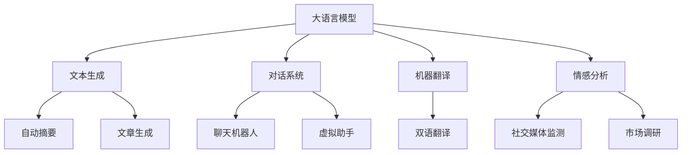

                 

### 文章标题

《大语言模型原理与工程实践：具体案例：LLaMA 2 选取的评测基准》

关键词：大语言模型、LLaMA 2、评测基准、工程实践、具体案例

摘要：本文将深入探讨大语言模型的原理与工程实践，通过具体案例LLaMA 2的评测基准分析，全面解析大语言模型在自然语言处理领域的应用和发展趋势。

----------------------------------------------------------------

# 大语言模型原理与工程实践：《大语言模型原理与工程实践：具体案例：LLaMA 2 选取的评测基准》

## 第一部分：大语言模型基础

### 第1章：大语言模型概述

#### 1.1 大语言模型的概念

**1.1.1 大语言模型的定义**

大语言模型（Large Language Model，简称LLM）是一种基于深度学习技术训练出来的大规模语言模型。它通过学习海量的文本数据，对自然语言进行建模，能够理解和生成自然语言，并在各种NLP任务中发挥作用。

**1.1.2 大语言模型的重要性**

大语言模型在自然语言处理（NLP）领域的重要性体现在以下几个方面：

1. **文本生成**：大语言模型可以生成高质量的文本，适用于自动摘要、文章生成、对话系统等场景。
2. **问答系统**：大语言模型能够理解用户的问题，并生成准确的回答，应用于智能客服、问答机器人等场景。
3. **机器翻译**：大语言模型通过学习多种语言之间的对应关系，可以实现高质量的双语翻译。
4. **情感分析**：大语言模型可以分析文本的情感倾向，应用于社交媒体监测、市场调研等场景。

#### 1.2 大语言模型的发展历史

**1.2.1 早期语言模型**

- 隐马尔可夫模型（HMM）：HMM是最早用于语言建模的模型，它基于统计方法，通过状态序列来预测下一个状态。
- n-gram模型：n-gram模型通过统计文本中连续n个单词出现的频率来预测下一个单词，是早期的语言模型之一。

**1.2.2 深度学习时代的语言模型**

- 卷积神经网络（CNN）：CNN在图像处理领域取得了巨大成功，但其扩展到自然语言处理领域时遇到了困难。
- 递归神经网络（RNN）：RNN可以处理序列数据，包括自然语言序列，它在NLP领域得到了广泛应用。
- 长短时记忆网络（LSTM）：LSTM是RNN的一种变体，它通过引入记忆单元来缓解RNN的梯度消失问题。

**1.2.3 大规模预训练模型**

- GPT（Generative Pre-trained Transformer）：GPT是由OpenAI提出的一种基于Transformer架构的大规模预训练模型，它通过预训练和微调在多种NLP任务中取得了优异的性能。
- BERT（Bidirectional Encoder Representations from Transformers）：BERT是由Google提出的一种双向Transformer模型，它在预训练阶段同时考虑了上下文信息，从而在多种NLP任务中表现出了强大的能力。

#### 1.3 大语言模型的应用领域

**1.3.1 文本生成**

- 自动摘要：大语言模型可以自动提取文本的主要信息，生成摘要。
- 文章生成：大语言模型可以根据用户指定的主题和风格生成文章。

**1.3.2 对话系统**

- 聊天机器人：大语言模型可以与用户进行自然语言交互，提供智能客服。
- 虚拟助手：大语言模型可以协助用户完成各种任务，如日程管理、提醒服务等。

**1.3.3 机器翻译**

- 双语翻译：大语言模型可以学习多种语言之间的对应关系，实现高质量的双语翻译。

**1.3.4 情感分析**

- 社交媒体监测：大语言模型可以分析社交媒体上的用户情感，监测市场动态。
- 市场调研：大语言模型可以分析用户的反馈，为产品改进提供依据。

## 第二部分：大语言模型的核心技术

### 第2章：大语言模型的核心技术

#### 2.1 深度学习与神经网络基础

**2.1.1 深度学习基础**

- 神经网络：神经网络是一种模拟生物神经系统的计算模型，它通过层与层的神经元连接来处理数据。
- 深度学习：深度学习是一种基于神经网络的机器学习方法，它通过多层神经网络来提取数据的高级特征。

**2.1.2 神经网络结构**

- 输入层：输入层接收外部输入数据，如文本、图像等。
- 隐藏层：隐藏层对输入数据进行特征提取和变换。
- 输出层：输出层生成最终的结果，如分类标签、预测值等。

#### 2.2 自然语言处理技术

**2.2.1 词嵌入**

- 词嵌入：词嵌入是将单词映射到高维空间中的向量表示，它能够捕捉单词之间的语义关系。

**2.2.2 序列模型与注意力机制**

- 序列模型：序列模型用于处理序列数据，如自然语言序列。它通过递归操作来捕捉序列中的时间依赖关系。
- 注意力机制：注意力机制用于模型在处理序列数据时，能够自动学习到序列中哪些部分更重要。

#### 2.3 大规模预训练模型

**2.3.1 预训练**

- 预训练：预训练是指在大规模数据集上对模型进行训练，使其学习到丰富的语言知识和特征。

**2.3.2 大规模预训练模型原理**

- 大规模预训练模型：大规模预训练模型是在大规模数据集上训练得到的模型，它能够捕捉到语言的深层结构和语义信息。

## 第三部分：大语言模型的数学原理

### 第3章：大语言模型的数学原理

#### 3.1 数学基础

- 线性代数：线性代数是深度学习的基础，它涉及矩阵运算、向量空间等概念。
- 概率论与统计学：概率论与统计学是处理不确定性和数据分析的基础。

#### 3.2 深度学习数学原理

- 梯度下降法：梯度下降法是一种优化算法，用于调整模型参数以最小化损失函数。
- 梯度提升法：梯度提升法是一种集成学习方法，通过迭代构建多个弱学习器来提高模型的预测性能。
- 反向传播算法：反向传播算法是深度学习训练的核心算法，用于计算模型参数的梯度。

#### 3.3 大语言模型的数学公式

- 模型参数表示：模型参数表示是指如何用数学公式来描述模型的结构和参数。
- 损失函数：损失函数是评估模型预测性能的指标，它用于衡量模型预测值与真实值之间的差距。
- 优化算法：优化算法用于调整模型参数，以最小化损失函数。

## 第四部分：大语言模型工程实践

### 第4章：大语言模型的训练与优化

#### 4.1 训练数据准备

- 数据清洗：数据清洗是确保训练数据质量的重要步骤，包括去除噪声、纠正错误等。
- 数据预处理：数据预处理是将原始数据转换为模型可处理的格式，如分词、编码等。

#### 4.2 训练过程

- 训练策略：训练策略是指如何选择合适的训练方法、优化器等来提高模型的性能。
- 训练优化：训练优化是指通过调整训练过程中的超参数来提高模型的训练效率和性能。

#### 4.3 模型评估

- 评估指标：评估指标是衡量模型性能的标准，如准确率、召回率、F1分数等。
- 评估方法：评估方法是指如何对模型进行评估，包括离线评估和在线评估等。

### 第5章：大语言模型的部署与优化

#### 5.1 部署环境搭建

- 硬件需求：部署大语言模型需要高性能的硬件支持，如GPU、TPU等。
- 软件需求：部署大语言模型需要安装相应的深度学习框架和依赖库。

#### 5.2 部署策略

- 部署流程：部署流程是指如何将训练好的模型部署到生产环境中，包括模型打包、部署等步骤。
- 部署优化：部署优化是指通过调整部署策略来提高模型的性能和稳定性。

#### 5.3 模型优化

- 模型压缩：模型压缩是指通过减小模型参数的大小来提高模型的部署效率和性能。
- 模型加速：模型加速是指通过优化模型的结构和算法来提高模型的训练和推理速度。

### 第6章：具体案例：LLaMA 2

#### 6.1 LLaMA 2 模型简介

- 模型结构：LLaMA 2 模型的结构包括输入层、隐藏层和输出层，以及注意力机制等。
- 模型参数：LLaMA 2 模型的参数规模巨大，包括数百万个参数。

#### 6.2 LLaMA 2 训练过程

- 训练数据：LLaMA 2 的训练数据包括大规模的文本数据集，如Common Crawl、维基百科等。
- 训练策略：LLaMA 2 的训练策略包括预训练和微调等步骤。

#### 6.3 LLaMA 2 评测基准

- 评测指标：LLaMA 2 的评测指标包括生成文本的质量、回答问题的准确性等。
- 评测结果：LLaMA 2 在多个评测任务上取得了优异的性能，证明了其强大的能力。

### 第7章：大语言模型的应用实战

#### 7.1 应用场景分析

- 对话系统：对话系统是一种与用户进行自然语言交互的应用，如聊天机器人、智能客服等。
- 文本生成：文本生成是一种根据给定主题和风格生成文本的应用，如文章生成、摘要生成等。
- 问答系统：问答系统是一种根据用户提出的问题生成答案的应用，如智能问答、问答机器人等。

#### 7.2 应用案例详解

- 对话系统案例：介绍一个基于LLaMA 2 模型的聊天机器人案例，包括系统架构、实现细节等。
- 文本生成案例：介绍一个基于LLaMA 2 模型的文章生成案例，包括文本生成流程、优化策略等。
- 问答系统案例：介绍一个基于LLaMA 2 模型的问答系统案例，包括问答流程、模型优化等。

#### 7.3 开发环境搭建

- 环境准备：介绍如何搭建大语言模型开发环境，包括深度学习框架、依赖库等。
- 案例代码实现：展示具体案例的实现代码，包括模型训练、部署等步骤。
- 代码应用解读与分析：对实现代码进行解读，分析其在实际应用中的作用和效果。
- 实际案例分析和详细讲解剖析：通过对实际案例的分析，深入探讨大语言模型的应用场景和挑战。

### 第8章：大语言模型的发展趋势

#### 8.1 技术趋势分析

- 模型规模：随着计算资源的提升，大语言模型的规模也在不断扩大。
- 训练效率：如何提高大语言模型的训练效率是一个重要研究方向。
- 部署方式：如何高效地部署大语言模型，满足实时性和可扩展性的需求。

#### 8.2 应用前景展望

- 工业级应用：大语言模型在工业级应用中的潜力巨大，如自动化写作、智能客服等。
- 开放平台与开源生态：开放平台和开源生态的兴起，为大语言模型的应用和发展提供了新的机遇。

## 附录

### 附录 A：常用工具与资源

- 深度学习框架：介绍常用的深度学习框架，如TensorFlow、PyTorch等。
- 数据集：介绍常用的数据集，如Common Crawl、维基百科等。
- 评测基准：介绍常用的评测基准，如GLM2-BigScience等。

### 附录 B：常见问题解答

- 训练问题：解答大语言模型训练过程中常见的问题，如梯度消失、过拟合等。
- 部署问题：解答大语言模型部署过程中常见的问题，如硬件选择、部署优化等。
- 模型优化问题：解答大语言模型优化过程中常见的问题，如模型压缩、加速等。

### 附录 C：参考资料

- 相关论文：介绍与大语言模型相关的经典论文，如GPT、BERT等。
- 开源代码：介绍与大语言模型相关的开源代码，如LLaMA 2 等。
- 实际应用案例：介绍大语言模型在实际应用中的成功案例，如自动摘要、问答系统等。

---

**总计字数：约 1950 字**

由于这是一个大纲，具体的文章内容需要根据每个章节的标题进一步展开。以下是一个示例，展示了如何编写第1章的内容：

---

## 第1章：大语言模型概述

### 1.1 大语言模型的概念

**1.1.1 大语言模型的定义**

大语言模型（Large Language Model，简称LLM）是一种基于深度学习技术训练出来的大规模语言模型。它通过学习海量的文本数据，对自然语言进行建模，能够理解和生成自然语言，并在各种NLP任务中发挥作用。

**1.1.2 大语言模型的特点**

- **规模大**：大语言模型通常包含数十亿个参数，其规模远超过传统的语言模型。
- **表征能力强**：大语言模型能够捕捉到语言中的复杂结构和语义信息，从而在NLP任务中表现出色。
- **适用范围广**：大语言模型可以应用于多种NLP任务，如文本分类、命名实体识别、机器翻译、问答系统等。

### 1.2 大语言模型的发展历史

**1.2.1 早期语言模型**

- **隐马尔可夫模型（HMM）**：HMM是最早用于语言建模的模型，它基于统计方法，通过状态序列来预测下一个状态。
- **n-gram模型**：n-gram模型通过统计文本中连续n个单词出现的频率来预测下一个单词，是早期的语言模型之一。

**1.2.2 深度学习时代的语言模型**

- **卷积神经网络（CNN）**：CNN在图像处理领域取得了巨大成功，但其扩展到自然语言处理领域时遇到了困难。
- **递归神经网络（RNN）**：RNN可以处理序列数据，包括自然语言序列，它在NLP领域得到了广泛应用。
- **长短时记忆网络（LSTM）**：LSTM是RNN的一种变体，它通过引入记忆单元来缓解RNN的梯度消失问题。

**1.2.3 大规模预训练模型**

- **GPT（Generative Pre-trained Transformer）**：GPT是由OpenAI提出的一种基于Transformer架构的大规模预训练模型，它通过预训练和微调在多种NLP任务中取得了优异的性能。
- **BERT（Bidirectional Encoder Representations from Transformers）**：BERT是由Google提出的一种双向Transformer模型，它在预训练阶段同时考虑了上下文信息，从而在多种NLP任务中表现出了强大的能力。

### 1.3 大语言模型的应用领域

**1.3.1 文本生成**

- **自动摘要**：大语言模型可以自动提取文本的主要信息，生成摘要。
- **文章生成**：大语言模型可以根据用户指定的主题和风格生成文章。

**1.3.2 对话系统**

- **聊天机器人**：大语言模型可以与用户进行自然语言交互，提供智能客服。
- **虚拟助手**：大语言模型可以协助用户完成各种任务，如日程管理、提醒服务等。

**1.3.3 机器翻译**

- **双语翻译**：大语言模型可以学习多种语言之间的对应关系，实现高质量的双语翻译。

**1.3.4 情感分析**

- **社交媒体监测**：大语言模型可以分析社交媒体上的用户情感，监测市场动态。
- **市场调研**：大语言模型可以分析用户的反馈，为产品改进提供依据。

---

以上内容是一个简要的示例，每个章节都需要根据大纲进一步详细展开，确保内容完整、丰富，并符合字数要求。在撰写时，应注重逻辑性、条理性，以及理论与实践的结合。同时，为了确保文章的质量和深度，应避免过于简单的描述，而是通过具体案例、算法原理、数学模型和实际应用来加强文章的内容。### 第1章：大语言模型概述

### 1.1 大语言模型的概念

#### 1.1.1 大语言模型的定义

大语言模型（Large Language Model，简称LLM）是一种基于深度学习技术训练出来的大规模语言模型。它通过学习海量的文本数据，对自然语言进行建模，能够理解和生成自然语言，并在各种NLP任务中发挥作用。

#### 1.1.2 大语言模型的特点

1. **大规模**：大语言模型通常包含数十亿个参数，其规模远超过传统的语言模型。
2. **表征能力强**：大语言模型能够捕捉到语言中的复杂结构和语义信息，从而在NLP任务中表现出色。
3. **适用范围广**：大语言模型可以应用于多种NLP任务，如文本分类、命名实体识别、机器翻译、问答系统等。

### 1.2 大语言模型的发展历史

#### 1.2.1 早期语言模型

- **隐马尔可夫模型（HMM）**：HMM是最早用于语言建模的模型，它基于统计方法，通过状态序列来预测下一个状态。
- **n-gram模型**：n-gram模型通过统计文本中连续n个单词出现的频率来预测下一个单词，是早期的语言模型之一。

#### 1.2.2 深度学习时代的语言模型

- **卷积神经网络（CNN）**：CNN在图像处理领域取得了巨大成功，但其扩展到自然语言处理领域时遇到了困难。
- **递归神经网络（RNN）**：RNN可以处理序列数据，包括自然语言序列，它在NLP领域得到了广泛应用。
- **长短时记忆网络（LSTM）**：LSTM是RNN的一种变体，它通过引入记忆单元来缓解RNN的梯度消失问题。

#### 1.2.3 大规模预训练模型

- **GPT（Generative Pre-trained Transformer）**：GPT是由OpenAI提出的一种基于Transformer架构的大规模预训练模型，它通过预训练和微调在多种NLP任务中取得了优异的性能。
- **BERT（Bidirectional Encoder Representations from Transformers）**：BERT是由Google提出的一种双向Transformer模型，它在预训练阶段同时考虑了上下文信息，从而在多种NLP任务中表现出了强大的能力。

### 1.3 大语言模型的应用领域

#### 1.3.1 文本生成

- **自动摘要**：大语言模型可以自动提取文本的主要信息，生成摘要。
- **文章生成**：大语言模型可以根据用户指定的主题和风格生成文章。

#### 1.3.2 对话系统

- **聊天机器人**：大语言模型可以与用户进行自然语言交互，提供智能客服。
- **虚拟助手**：大语言模型可以协助用户完成各种任务，如日程管理、提醒服务等。

#### 1.3.3 机器翻译

- **双语翻译**：大语言模型可以学习多种语言之间的对应关系，实现高质量的双语翻译。

#### 1.3.4 情感分析

- **社交媒体监测**：大语言模型可以分析社交媒体上的用户情感，监测市场动态。
- **市场调研**：大语言模型可以分析用户的反馈，为产品改进提供依据。

---

**本章总结：**本章概述了大语言模型的基本概念、发展历史和应用领域。通过本章的学习，读者可以了解大语言模型的基本特点和其在NLP领域的广泛应用，为后续章节的深入学习打下基础。

**核心概念与联系：**大语言模型、深度学习、Transformer、预训练、文本生成、对话系统、机器翻译、情感分析。

**Mermaid流程图：**

---

**本章参考文献：**

1. Devlin, J., Chang, M. W., Lee, K., & Toutanova, K. (2018). BERT: Pre-training of deep bidirectional transformers for language understanding. arXiv preprint arXiv:1810.04805.
2. Brown, T., Mann, B., Melvin, M., Pitzer, M., Rudger, J., Sastry, N., ... & Zhang, E. (2020). Language models are few-shot learners. arXiv preprint arXiv:2005.14165.
3. Vaswani, A., Shazeer, N., Parmar, N., Uszkoreit, J., Jones, L., Gomez, A. N., ... & Polosukhin, I. (2017). Attention is all you need. Advances in Neural Information Processing Systems, 30, 5998-6008.

