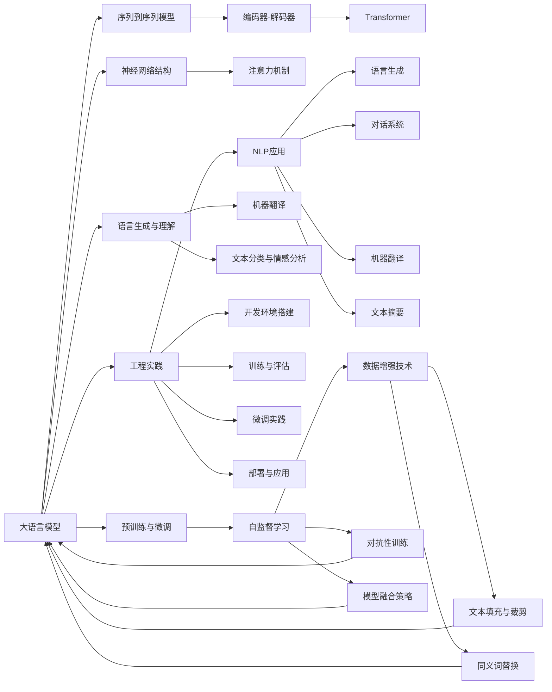

                 

### 《大语言模型原理与工程实践：大语言模型微调的幻觉问题》

> 关键词：大语言模型，预训练，微调，幻觉问题，工程实践

摘要：本文深入探讨了大规模语言模型的原理及其工程实践，重点分析了微调过程中出现的幻觉问题。通过对大语言模型的发展历程、核心概念、基本架构和应用场景的介绍，本文进一步阐述了深度学习和自然语言处理的基础知识。随后，文章详细分析了大语言模型的核心算法原理，以及微调中的幻觉问题及其解决方案。最后，本文结合实际应用，对大语言模型的工程实践进行了全面探讨。

## 第1章 大语言模型概述

### 1.1 大语言模型的发展历程

#### 1.1.1 早期自然语言处理技术

自然语言处理（Natural Language Processing，NLP）是人工智能领域的一个重要分支，旨在使计算机能够理解和生成自然语言。早期的NLP技术主要集中在词汇分析、句法分析和语义分析等基础方面。

- **词汇分析**：通过对文本中的词汇进行分词、词性标注和词义标注等操作，以便更好地理解和处理文本内容。

- **句法分析**：分析文本中的句子结构，包括句子的成分、短语和语法规则等，以便对文本进行结构化处理。

- **语义分析**：对文本中的语义进行理解和解释，包括语义角色标注、语义关系识别和语义句型识别等。

早期NLP技术的发展主要依赖于规则驱动的方法，即通过编写大量的语法规则和语义规则来实现对文本的理解和处理。这种方法虽然能够处理一些简单的任务，但在面对复杂和大规模的文本时，效果有限。

#### 1.1.2 预训练革命

预训练（Pre-training）技术的发展标志着NLP领域的重大变革。预训练是指在大规模未标注的数据集上进行模型训练，然后通过微调（Fine-tuning）将模型应用于特定任务。

- **词嵌入**：词嵌入（Word Embedding）是一种将单词映射到低维向量空间的技术。通过预训练，词嵌入向量能够捕捉到单词的语义和语法特征，从而提高NLP任务的效果。

- **语言模型**：语言模型（Language Model）是一种预测下一个单词的概率分布的模型。通过预训练，语言模型能够学习到大量的语言知识和模式，从而为后续的NLP任务提供基础。

预训练技术的出现，使得NLP模型从规则驱动的方法转向数据驱动的方法，大大提高了模型的性能和泛化能力。

#### 1.1.3 大模型时代

随着计算能力的提升和数据的积累，大模型（Large Model）逐渐成为NLP领域的主流。大模型通常具有数亿甚至数十亿的参数，能够处理更复杂的任务。

- **BERT（Bidirectional Encoder Representations from Transformers）**：BERT是一种基于Transformer的预训练模型，通过双向编码器结构，能够同时考虑上下文信息，从而提高了模型的性能。

- **GPT（Generative Pre-trained Transformer）**：GPT是一种基于Transformer的生成模型，通过自回归方式预测下一个单词，能够生成高质量的自然语言文本。

- **T5（Text-to-Text Transfer Transformer）**：T5是一种将所有NLP任务统一为文本到文本转换任务的模型，通过预训练和微调，能够应用于多种NLP任务。

大模型的发展，使得NLP模型在多个任务上取得了显著的突破，推动了NLP技术的应用和普及。

### 1.2 大语言模型的核心概念

#### 1.2.1 预训练与微调

预训练（Pre-training）是指在大规模未标注的数据集上进行模型训练，从而学习到通用的语言特征。微调（Fine-tuning）是指将预训练模型应用于特定任务，通过在任务相关的数据集上进行微调，进一步优化模型性能。

- **预训练**：预训练通常包括两个阶段：第一阶段是大规模数据集上的训练，第二阶段是任务数据集上的微调。

- **微调**：微调的目的是将预训练模型调整到特定任务上，通常包括以下步骤：
  - 数据预处理：对任务数据进行预处理，包括数据清洗、数据增强和标签准备等。
  - 模型调整：在预训练模型的基础上，对部分参数进行调整，以适应特定任务。
  - 评估与优化：通过评估指标对模型性能进行评估，并根据评估结果对模型进行调整。

#### 1.2.2 自监督学习

自监督学习（Self-supervised Learning）是一种无需人工标注的数据处理方法，通过利用数据中的相关性信息来自动标注数据。自监督学习在大语言模型预训练中起着关键作用。

- **数据生成**：自监督学习通过生成伪标签来自动标注数据，例如，在语言模型中，可以使用未标注的文本数据进行预测，并根据预测结果生成伪标签。

- **模型训练**：通过自监督学习，模型能够在大规模未标注数据上学习到通用的语言特征，从而提高模型性能。

#### 1.2.3 微调中的幻觉问题

微调过程中，模型可能会出现幻觉问题（Hallucination Problem），即模型生成的文本在某些部分不符合事实或常识。幻觉问题对模型性能和应用产生了负面影响。

- **幻觉现象**：幻觉问题通常表现为模型生成的文本中包含错误的信息或逻辑错误。例如，在问答系统中，模型可能给出与问题无关或不正确的答案。

- **幻觉原因**：幻觉问题的产生可能与以下几个方面有关：
  - 预训练数据集的偏差：预训练数据集可能包含一些错误或偏见的信息，这些信息在微调过程中被模型学习并固定下来。
  - 微调数据集的选择：微调数据集的质量和代表性对模型性能有很大影响，如果数据集质量较差，可能导致模型产生幻觉。
  - 模型结构限制：当前的大语言模型在处理复杂任务时，可能存在一定的局限性，导致模型在生成文本时出现幻觉。

### 1.3 大语言模型的基本架构

#### 1.3.1 神经网络结构

神经网络（Neural Network）是深度学习的基础，大语言模型通常采用复杂的神经网络结构。

- **前馈神经网络**：前馈神经网络是一种最简单的神经网络结构，包括输入层、隐藏层和输出层。信息从输入层传递到隐藏层，然后从隐藏层传递到输出层。

- **循环神经网络**（RNN）：循环神经网络通过引入循环结构，能够处理序列数据。RNN在处理长序列数据时存在梯度消失或爆炸问题，导致训练效果不佳。

- **变换器网络**（Transformer）：变换器网络是一种基于自注意力机制的神经网络结构，能够同时处理长序列数据，并在多个任务上取得了显著性能。

#### 1.3.2 注意力机制

注意力机制（Attention Mechanism）是一种在神经网络中用于处理序列数据的机制，能够提高模型对序列中不同位置信息的关注程度。

- **点积注意力**：点积注意力是一种最简单的注意力机制，通过计算查询向量与键向量的点积来计算注意力权重。

- **加性注意力**：加性注意力通过引入加性交互来计算注意力权重，能够更好地捕捉序列中的信息。

- **多头注意力**：多头注意力将输入序列分解为多个子序列，并对每个子序列分别计算注意力权重，从而提高模型的性能。

#### 1.3.3 序列到序列模型

序列到序列模型（Sequence-to-Sequence Model）是一种用于处理序列数据的神经网络模型，通常用于机器翻译、对话系统等任务。

- **编码器-解码器模型**：编码器-解码器模型包括编码器和解码器两个部分，编码器将输入序列编码为固定长度的向量表示，解码器则根据编码器的输出生成输出序列。

- **注意力机制**：在序列到序列模型中，注意力机制用于解码器在生成输出序列时，对编码器的输出进行权重加权，从而提高模型的生成质量。

### 1.4 大语言模型的应用场景

#### 1.4.1 语言生成与理解

语言生成与理解是NLP领域的核心任务，大语言模型在多个任务上取得了显著成果。

- **文本生成**：大语言模型能够生成高质量的文本，包括文章、对话、摘要等。例如，GPT模型可以生成连贯、自然的文章，BERT模型可以生成摘要。

- **文本理解**：大语言模型能够对文本进行深入理解，包括语义分析、情感分析、命名实体识别等。例如，BERT模型在问答系统中可以准确回答问题，TextBERT模型可以进行情感分析。

#### 1.4.2 机器翻译

机器翻译是NLP领域的重要应用之一，大语言模型在机器翻译任务中表现出色。

- **端到端翻译**：大语言模型通过端到端的方式实现翻译，无需使用传统的特征工程和规则方法。例如，Transformer模型在机器翻译任务中取得了显著性能。

- **多语言翻译**：大语言模型支持多语言翻译，能够同时处理多种语言的翻译任务。例如，T5模型可以同时处理英语、法语、西班牙语等多种语言的翻译。

#### 1.4.3 文本分类与情感分析

文本分类与情感分析是NLP领域的重要应用，大语言模型在这些任务中也表现出色。

- **文本分类**：大语言模型能够对文本进行分类，例如，可以将文本分类为积极、消极或中性。BERT模型在文本分类任务中取得了显著性能。

- **情感分析**：大语言模型能够对文本进行情感分析，例如，可以判断文本的情感极性为正面、负面或中性。TextBERT模型在情感分析任务中取得了显著性能。

## 第2章 大语言模型核心算法原理

### 2.1 深度学习基础

#### 2.1.1 神经网络

神经网络（Neural Network，NN）是一种基于人脑神经元结构和计算原理的机器学习模型。神经网络由多个神经元（节点）组成，每个神经元通过加权连接与其他神经元相连，并接收输入信号，然后通过激活函数产生输出信号。

- **神经元结构**：每个神经元包括输入层、加权连接、激活函数和输出层。输入层接收外部输入信号，加权连接将输入信号与神经元权重相乘，激活函数将加权后的信号转换为输出信号。

- **激活函数**：激活函数（Activation Function）用于决定神经元是否被激活。常见的激活函数包括sigmoid函数、ReLU函数和Tanh函数等。

- **前向传播**：在前向传播过程中，输入信号通过加权连接传递到各个神经元，每个神经元通过激活函数产生输出信号。

- **反向传播**：在反向传播过程中，模型根据预测误差，通过梯度下降算法更新神经元权重，从而优化模型性能。

#### 2.1.2 损失函数与优化算法

损失函数（Loss Function）用于衡量模型预测结果与真实值之间的差距。优化算法（Optimization Algorithm）用于根据损失函数更新模型参数，以最小化损失函数。

- **均方误差（MSE）**：均方误差（Mean Squared Error，MSE）是一种常用的损失函数，用于衡量预测值与真实值之间的平方误差。MSE函数的公式如下：

  $$MSE = \frac{1}{n} \sum_{i=1}^{n} (y_i - \hat{y}_i)^2$$

  其中，$y_i$为真实值，$\hat{y}_i$为预测值，$n$为样本数量。

- **梯度下降（Gradient Descent）**：梯度下降是一种优化算法，通过计算损失函数关于模型参数的梯度，并沿着梯度方向更新参数，以最小化损失函数。梯度下降的基本步骤如下：

  1. 初始化模型参数。
  2. 计算损失函数关于模型参数的梯度。
  3. 根据梯度方向和步长更新模型参数。
  4. 重复步骤2和3，直到损失函数收敛或达到预设的迭代次数。

#### 2.1.3 训练与评估

训练（Training）和评估（Evaluation）是深度学习模型开发的重要环节。

- **训练过程**：在训练过程中，模型通过不断调整参数，以最小化损失函数。训练过程通常包括以下步骤：

  1. 数据准备：准备训练数据集和验证数据集。
  2. 模型初始化：初始化模型参数。
  3. 梯度计算：计算损失函数关于模型参数的梯度。
  4. 参数更新：根据梯度方向和步长更新模型参数。
  5. 训练迭代：重复梯度计算和参数更新过程，直到模型收敛或达到预设的迭代次数。

- **评估过程**：在评估过程中，模型在验证数据集上进行性能评估，以衡量模型的泛化能力。评估过程通常包括以下步骤：

  1. 数据准备：准备验证数据集。
  2. 模型加载：加载训练好的模型参数。
  3. 预测：对验证数据集进行预测。
  4. 性能评估：计算预测结果与真实值之间的差距，并计算评估指标。

### 2.2 自然语言处理基础

#### 2.2.1 词嵌入

词嵌入（Word Embedding）是一种将单词映射到低维向量空间的技术，用于表示单词的语义信息。

- **Word2Vec**：Word2Vec是一种基于神经网络的语言模型，通过优化神经网络输出层的损失函数，将单词映射到低维向量空间。Word2Vec模型包括两个版本：连续词袋（Continuous Bag-of-Words，CBOW）和Skip-Gram。

  - **CBOW**：CBOW模型通过将单词周围的上下文单词映射到低维向量空间，并计算上下文单词的平均值作为单词的向量表示。
  
  - **Skip-Gram**：Skip-Gram模型通过将单词映射到低维向量空间，并计算单词与周围单词的共现概率，从而确定单词的向量表示。

- **GloVe**：GloVe（Global Vectors for Word Representation）是一种基于矩阵分解的语言模型，通过优化全局矩阵分解的损失函数，将单词映射到低维向量空间。

  - **训练过程**：GloVe模型通过优化单词共现矩阵的损失函数，学习到单词的向量表示。训练过程包括以下步骤：
    1. 初始化单词共现矩阵。
    2. 计算单词共现矩阵的梯度。
    3. 更新单词共现矩阵。
    4. 重复步骤2和3，直到矩阵分解收敛或达到预设的迭代次数。

- **词嵌入的应用**：词嵌入在NLP任务中具有广泛的应用，包括文本分类、文本相似度计算、命名实体识别等。

#### 2.2.2 序列模型

序列模型（Sequence Model）是一种用于处理序列数据的神经网络模型，包括循环神经网络（RNN）和变换器网络（Transformer）。

- **循环神经网络（RNN）**：循环神经网络通过引入循环结构，能够处理序列数据。RNN的核心思想是将上一个时间步的隐藏状态作为当前时间步的输入，从而实现序列的递归处理。

  - **RNN结构**：RNN由输入层、隐藏层和输出层组成。输入层接收输入序列，隐藏层通过递归连接生成隐藏状态，输出层生成输出序列。

  - **RNN算法**：RNN算法包括前向传播和反向传播。在前向传播过程中，输入序列通过隐藏状态传递到输出层；在反向传播过程中，根据预测误差计算隐藏状态的梯度，并更新隐藏状态。

- **变换器网络（Transformer）**：变换器网络是一种基于自注意力机制的神经网络模型，能够同时处理长序列数据。

  - **自注意力机制**：自注意力机制通过计算输入序列中每个元素之间的注意力权重，并将权重加权后的元素作为当前元素的输入，从而实现序列的建模。

  - **Transformer结构**：Transformer由编码器和解码器两个部分组成。编码器将输入序列编码为固定长度的向量表示，解码器根据编码器的输出生成输出序列。

#### 2.2.3 注意力机制

注意力机制（Attention Mechanism）是一种在神经网络中用于处理序列数据的机制，能够提高模型对序列中不同位置信息的关注程度。

- **点积注意力**：点积注意力是一种最简单的注意力机制，通过计算查询向量与键向量的点积来计算注意力权重。

  - **计算过程**：点积注意力通过计算查询向量$Q$与键向量$K$的点积，得到注意力权重$A$：

    $$A = Q \cdot K^T$$

  - **加权求和**：将注意力权重$A$与键向量$V$相乘，并求和得到当前元素的输出：

    $$O = A \cdot V$$

- **加性注意力**：加性注意力通过引入加性交互来计算注意力权重，能够更好地捕捉序列中的信息。

  - **计算过程**：加性注意力通过计算查询向量$Q$与键向量$K$的加性交互，得到注意力权重$A$：

    $$A = \text{softmax}(\frac{Q + K}{\sqrt{d_k}})$$

  - **加权求和**：将注意力权重$A$与键向量$V$相乘，并求和得到当前元素的输出：

    $$O = A \cdot V$$

- **多头注意力**：多头注意力将输入序列分解为多个子序列，并对每个子序列分别计算注意力权重，从而提高模型的性能。

  - **计算过程**：多头注意力通过计算多个查询向量$Q$与键向量$K$的点积，得到多个注意力权重$A$：

    $$A = [\text{softmax}(\frac{Q_1 \cdot K^T}{\sqrt{d_k}}), \text{softmax}(\frac{Q_2 \cdot K^T}{\sqrt{d_k}}), ..., \text{softmax}(\frac{Q_m \cdot K^T}{\sqrt{d_k}})]$$

  - **加权求和**：将注意力权重$A$与键向量$V$相乘，并求和得到当前元素的输出：

    $$O = A \cdot V$$

### 2.3 大语言模型预训练算法

#### 2.3.1 预训练技术

预训练技术（Pre-training）是一种在大规模未标注数据集上进行模型训练的方法，旨在学习到通用的语言特征，从而提高模型在特定任务上的性能。

- **语言建模**：语言建模是一种预训练技术，通过预测下一个单词的概率分布，学习到单词之间的统计关系和语义信息。

  - **目标函数**：语言建模的目标函数通常采用交叉熵损失函数，计算预测概率与真实概率之间的差距。

    $$L = -\sum_{i=1}^{n} y_i \log(\hat{y}_i)$$

    其中，$y_i$为真实标签，$\hat{y}_i$为预测概率。

  - **优化算法**：预训练技术通常采用梯度下降算法优化模型参数，以最小化目标函数。

- **掩码语言模型（Masked Language Model，MLM）**：掩码语言模型是一种预训练技术，通过随机掩码部分单词，并预测掩码单词的词向量，从而学习到单词的语义信息。

  - **掩码过程**：在预训练过程中，随机选择一部分单词进行掩码，掩码后的单词被替换为特殊的掩码符号（如`[MASK]`）。

  - **目标函数**：掩码语言模型的目标函数与语言建模类似，采用交叉熵损失函数计算预测词向量与真实词向量之间的差距。

    $$L = -\sum_{i=1}^{n} y_i \log(\hat{y}_i)$$

    其中，$y_i$为真实标签，$\hat{y}_i$为预测词向量。

- **双向编码器表示（Bidirectional Encoder Representations from Transformers，BERT）**：BERT是一种基于掩码语言模型的预训练技术，通过双向编码器结构，同时考虑上下文信息，从而提高模型的性能。

  - **编码器结构**：BERT编码器由多个Transformer编码层组成，每个编码层包括自注意力机制和前馈神经网络。

  - **掩码过程**：在预训练过程中，随机选择一部分单词进行掩码，掩码后的单词被替换为特殊的掩码符号（如`[MASK]`）。

  - **目标函数**：BERT的目标函数采用交叉熵损失函数，计算预测词向量与真实词向量之间的差距，同时考虑掩码单词的预测。

    $$L = -\sum_{i=1}^{n} y_i \log(\hat{y}_i) + \sum_{i=1}^{n} \log(\hat{y}_{[MASK]})$$

    其中，$y_i$为真实标签，$\hat{y}_i$为预测词向量，$y_{[MASK]}$为掩码单词的预测标签。

#### 2.3.2 语言建模任务

语言建模任务（Language Modeling Task）是指通过预测下一个单词的概率分布，从而生成自然语言文本的过程。

- **目标函数**：语言建模任务的目标函数通常采用交叉熵损失函数，计算预测概率与真实概率之间的差距。

  $$L = -\sum_{i=1}^{n} y_i \log(\hat{y}_i)$$

  其中，$y_i$为真实标签，$\hat{y}_i$为预测概率。

- **优化算法**：语言建模任务通常采用梯度下降算法优化模型参数，以最小化目标函数。

- **应用场景**：语言建模任务广泛应用于自然语言生成、语音合成、机器翻译等领域。例如，通过预测下一个单词的概率分布，可以生成连贯、自然的文章；通过语音合成，可以将文本转化为语音。

#### 2.3.3 预训练数据集

预训练数据集（Pre-training Dataset）是指用于预训练模型的未标注数据集，通常包含大量的文本数据，如维基百科、新闻、社交媒体等。

- **数据来源**：预训练数据集通常来自公共数据集，如维基百科、Common Crawl、新闻数据集等。这些数据集包含了丰富的语言知识和多样性，有助于模型学习到通用的语言特征。

- **数据处理**：在预训练过程中，对数据集进行预处理，包括数据清洗、分词、词性标注等，以确保数据的完整性和一致性。

- **应用场景**：预训练数据集广泛应用于各种自然语言处理任务，如文本分类、情感分析、机器翻译等。通过预训练数据集，模型能够学习到通用的语言特征，从而提高模型在特定任务上的性能。

### 2.4 大语言模型微调技术

#### 2.4.1 微调基本概念

微调（Fine-tuning）是一种将预训练模型应用于特定任务，并通过在任务相关的数据集上进行微调，进一步优化模型性能的方法。

- **微调过程**：微调过程通常包括以下步骤：

  1. **数据准备**：准备任务相关的数据集，并进行预处理，包括数据清洗、分词、词性标注等。
  2. **模型初始化**：使用预训练模型作为基础模型，初始化模型参数。
  3. **参数调整**：在预训练模型的基础上，调整部分参数，以适应特定任务。
  4. **训练与评估**：在任务数据集上进行训练，并评估模型性能。根据评估结果，调整参数，并重复训练和评估过程，直到模型性能达到预期。

- **应用场景**：微调技术广泛应用于各种自然语言处理任务，如文本分类、情感分析、机器翻译等。通过微调，模型能够在特定任务上获得更好的性能。

#### 2.4.2 微调策略

微调策略（Fine-tuning Strategy）是指调整预训练模型参数的方法，以适应特定任务。微调策略包括以下几种：

- **全量微调**：全量微调是指在预训练模型的基础上，对所有参数进行调整。这种方法能够充分利用预训练模型的知识，但在计算资源有限的情况下，可能需要较长的训练时间。

- **局部微调**：局部微调是指在预训练模型的基础上，只调整部分参数，如分类器的参数。这种方法能够加快训练速度，但在性能上可能略逊于全量微调。

- **半监督微调**：半监督微调是指在预训练模型的基础上，结合少量标注数据和无标注数据进行微调。这种方法能够利用无标注数据中的信息，提高模型的泛化能力。

- **多任务微调**：多任务微调是指在多个任务上进行微调，以共享知识，提高模型在各个任务上的性能。这种方法适用于具有相关性的任务，如问答系统和文本分类。

#### 2.4.3 幻觉问题分析

幻觉问题（Hallucination Problem）是指微调过程中，模型生成的文本在某些部分不符合事实或常识。幻觉问题的产生可能与以下几个方面有关：

- **预训练数据集的偏差**：预训练数据集可能包含一些错误或偏见的信息，这些信息在微调过程中被模型学习并固定下来。例如，如果预训练数据集中包含大量的错误信息，模型可能会在生成文本时出现幻觉。

- **微调数据集的选择**：微调数据集的质量和代表性对模型性能有很大影响。如果微调数据集质量较差，可能导致模型在生成文本时出现幻觉。例如，如果微调数据集包含大量不相关或错误的信息，模型可能会在生成文本时产生错误。

- **模型结构限制**：当前的大语言模型在处理复杂任务时，可能存在一定的局限性，导致模型在生成文本时出现幻觉。例如，如果模型的结构过于简单，可能无法捕捉到文本中的复杂关系，从而导致幻觉问题。

### 第3章 大语言模型微调的幻觉问题

#### 3.1 幻觉问题的定义与影响

#### 幻觉问题概念

幻觉问题（Hallucination Problem）是指在大语言模型微调过程中，模型生成的文本在某些部分不符合事实或常识的现象。幻觉问题的存在对模型的可靠性和实用性产生了负面影响，可能导致以下问题：

1. **误导性回答**：在问答系统中，模型可能给出误导性或不正确的答案。例如，在回答关于历史事件的问题时，模型可能会给出错误的时间、地点或人物信息。

2. **错误推理**：模型在生成文本时，可能会根据错误的信息进行推理，导致逻辑错误。例如，在生成文章摘要时，模型可能会忽略文章的主题，生成无关紧要的内容。

3. **语义混淆**：模型可能无法正确理解某些词语或短语的意义，导致生成文本语义混乱。例如，模型可能会将“苹果”误解为水果类别的泛指，而不是具体的水果品种。

#### 幻觉问题对模型性能的影响

幻觉问题对大语言模型性能的影响主要体现在以下几个方面：

1. **准确性下降**：幻觉问题导致模型生成的文本准确性下降，影响模型的评价和实际应用。例如，在文本分类任务中，模型可能会将文本分类到错误的类别。

2. **可靠性下降**：幻觉问题降低模型的可靠性，影响模型的信任度和用户满意度。例如，在对话系统中，用户可能会对模型的回答产生怀疑，导致用户体验不佳。

3. **泛化能力下降**：幻觉问题影响模型的泛化能力，使模型在新的任务或数据集上表现不佳。例如，模型在微调后的数据集上表现良好，但在未见过的数据集上可能无法准确生成文本。

#### 3.2 幻觉问题的成因分析

#### 预训练数据集的偏差

预训练数据集的偏差是导致幻觉问题的主要原因之一。预训练数据集通常包含大量的互联网文本，这些文本来源广泛、质量参差不齐。以下因素可能导致预训练数据集的偏差：

1. **错误信息**：预训练数据集中可能包含大量的错误信息或偏见，这些错误信息在模型学习过程中被固定下来。例如，数据集中可能包含错误的历史事件描述或误导性的信息。

2. **数据分布不均**：预训练数据集中的数据分布可能不均匀，某些类别或主题的数据量较大，而其他类别或主题的数据量较少。这种数据分布不均可能导致模型在生成文本时偏向于某些类别或主题。

3. **噪音和错误**：预训练数据集中可能存在噪音和错误，如拼写错误、语法错误或标点符号错误等。这些噪音和错误可能影响模型对文本的理解和生成。

#### 微调数据集的选择

微调数据集的选择对模型性能有重要影响。以下因素可能导致微调数据集的选择不当，从而影响模型生成文本的准确性：

1. **数据质量**：微调数据集的质量直接影响模型的学习效果。如果微调数据集质量较差，包含大量的错误或不一致的信息，模型可能在生成文本时出现幻觉。

2. **数据分布**：微调数据集的数据分布应与实际应用场景相匹配。如果微调数据集的数据分布与实际应用场景差异较大，模型可能在生成文本时无法适应新的数据分布。

3. **数据量**：微调数据集的量级对模型性能有显著影响。如果微调数据集的数据量较小，模型可能无法充分学习到任务相关的特征，导致生成文本的准确性下降。

#### 模型结构限制

当前的大语言模型在处理复杂任务时可能存在一定的局限性，导致模型在生成文本时出现幻觉。以下因素可能导致模型结构的限制：

1. **参数规模**：大语言模型的参数规模通常较大，但并非无限的。如果模型的结构过于复杂，参数规模可能无法容纳所有有效的特征，导致模型在生成文本时出现幻觉。

2. **训练时间**：模型的训练时间有限，无法进行充分的训练。如果模型在训练过程中无法充分学习到数据中的特征，可能导致生成文本的准确性下降。

3. **数据依赖**：大语言模型在生成文本时可能依赖于训练数据中的信息。如果训练数据中的信息不准确或不全面，模型可能无法生成准确的文本。

### 3.3 幻觉问题的解决方案

#### 数据增强技术

数据增强技术（Data Augmentation）是一种通过扩展数据集来提高模型性能的方法。以下是一些常用的数据增强技术：

1. **填充和裁剪**：通过填充或裁剪文本中的空白或冗余部分，增加数据集的多样性。

2. **同义词替换**：将文本中的单词替换为同义词，增加数据集的语义多样性。

3. **随机插入和删除**：在文本中随机插入或删除单词或短语，增加数据集的多样性。

4. **文本重写**：通过重新组合文本中的句子或段落，生成新的文本。

通过数据增强技术，模型能够学习到更广泛的语言特征，从而减少幻觉问题的发生。

#### 对抗性训练

对抗性训练（Adversarial Training）是一种通过引入对抗样本来提高模型鲁棒性的方法。以下是一些常用的对抗性训练方法：

1. **扰动攻击**：对输入文本进行扰动，如添加噪音、替换字符等，生成对抗样本。

2. **对抗性生成**：通过生成对抗网络（GAN）生成对抗样本，以增强模型的鲁棒性。

3. **对抗性对抗**：在训练过程中，交替训练对抗生成器和对抗判别器，以提高模型的鲁棒性。

通过对抗性训练，模型能够学习到更加鲁棒的特征，从而减少幻觉问题的发生。

#### 模型融合策略

模型融合策略（Model Ensembling）是一种通过结合多个模型的预测结果来提高模型性能的方法。以下是一些常用的模型融合策略：

1. **投票法**：将多个模型的预测结果进行投票，选择多数模型认同的结果作为最终预测。

2. **加权平均法**：将多个模型的预测结果进行加权平均，得到最终预测。

3. **集成学习**：通过集成多个模型的优点，构建一个新的模型，以提高预测准确性。

通过模型融合策略，模型能够综合多个模型的优点，减少幻觉问题的发生。

### 3.4 幻觉问题在具体应用中的应对策略

#### 语言生成与应用

在语言生成应用中，幻觉问题可能导致生成的文本不符合事实或常识，从而影响应用效果。以下是一些应对策略：

1. **多模态融合**：结合文本和图像等多模态信息，通过多模态融合方法，提高模型的语义理解能力，减少幻觉问题。

2. **知识蒸馏**：使用预训练模型生成的知识来指导语言生成模型，通过知识蒸馏方法，将预训练模型的知识传递到生成模型，减少幻觉问题。

3. **领域自适应**：针对特定领域的数据集进行微调，使模型在特定领域上具有更好的性能，减少幻觉问题。

#### 机器翻译与应用

在机器翻译应用中，幻觉问题可能导致生成的翻译文本不符合事实或常识，从而影响翻译质量。以下是一些应对策略：

1. **多级翻译**：采用多级翻译策略，先进行粗略翻译，然后进行细粒度校正，以提高翻译质量。

2. **知识增强**：结合外部知识库和语言模型，通过知识增强方法，提高模型的语义理解能力，减少幻觉问题。

3. **动态调整**：根据上下文信息动态调整翻译策略，使模型在特定上下文中具有更好的翻译能力。

#### 文本分类与应用

在文本分类应用中，幻觉问题可能导致模型将文本分类到错误的类别，从而影响分类效果。以下是一些应对策略：

1. **错误纠正**：通过引入错误纠正方法，对模型生成的错误分类结果进行纠正，提高分类准确性。

2. **类别约束**：为每个类别设置约束条件，使模型在分类时遵循类别约束，减少幻觉问题。

3. **多模型融合**：结合多个分类模型的预测结果，通过多模型融合方法，提高分类准确性。

### 第4章 大语言模型工程实践

#### 4.1 大语言模型开发环境搭建

要成功开发和部署大语言模型，需要搭建一个稳定且高效的开发环境。以下是搭建大语言模型开发环境的一般步骤：

##### 4.1.1 硬件与软件要求

1. **硬件要求**：
   - **计算资源**：大语言模型的训练和推理过程需要大量的计算资源。推荐使用具有高性能GPU（如NVIDIA Tesla V100、A100等）的服务器或工作站。
   - **存储空间**：由于大语言模型的数据集和模型文件较大，建议使用至少1TB的存储空间。
   - **内存**：大语言模型在训练过程中需要大量的内存，推荐使用至少64GB的内存。

2. **软件要求**：
   - **操作系统**：推荐使用Linux操作系统，如Ubuntu或CentOS。
   - **编程语言**：Python是开发大语言模型的主要编程语言，推荐使用Python 3.x版本。
   - **深度学习框架**：TensorFlow、PyTorch是两种主流的深度学习框架，可根据个人喜好和需求选择其中之一。

##### 4.1.2 环境配置与调试

1. **安装依赖库**：
   - 安装Python和相关依赖库，如NumPy、Pandas、scikit-learn等。
   - 安装深度学习框架，如TensorFlow或PyTorch。

2. **安装GPU支持**：
   - 安装CUDA Toolkit，以便在GPU上运行深度学习框架。
   - 安装相应的深度学习框架的GPU版本，如TensorFlow GPU或PyTorch CUDA。

3. **调试与测试**：
   - 搭建一个简单的神经网络模型，进行训练和推理，确保环境配置正确。
   - 使用预训练模型在测试集上进行推理，验证GPU加速效果。

#### 4.2 大语言模型训练与评估

训练和评估大语言模型是模型开发的重要环节。以下步骤描述了如何进行大语言模型的训练与评估：

##### 4.2.1 训练流程

1. **数据准备**：
   - 下载数据集，并进行预处理，包括分词、词性标注、数据清洗等。
   - 将预处理后的数据集分为训练集、验证集和测试集。

2. **模型初始化**：
   - 使用预训练模型初始化模型参数，如BERT、GPT等。
   - 调整模型结构，如增加隐藏层、调整层间连接等。

3. **模型训练**：
   - 在训练集上进行模型训练，使用梯度下降算法优化模型参数。
   - 在验证集上进行模型评估，调整学习率、批量大小等超参数。
   - 使用验证集上最佳模型，继续训练直到模型性能达到预期。

##### 4.2.2 评估指标

评估大语言模型性能的常用指标包括：

1. **准确率（Accuracy）**：模型预测正确的样本数与总样本数的比值。
2. **召回率（Recall）**：模型预测正确的正样本数与实际正样本数的比值。
3. **精确率（Precision）**：模型预测正确的正样本数与预测为正样本的样本数之比。
4. **F1值（F1 Score）**：精确率和召回率的调和平均，用于综合评估模型性能。

##### 4.2.3 调参技巧

调参（Hyperparameter Tuning）是优化模型性能的重要步骤。以下是一些调参技巧：

1. **网格搜索（Grid Search）**：通过遍历多个参数组合，选择最佳参数组合。
2. **随机搜索（Random Search）**：随机选择参数组合，寻找最佳参数组合。
3. **贝叶斯优化（Bayesian Optimization）**：利用贝叶斯理论进行参数优化，寻找最佳参数组合。

#### 4.3 大语言模型微调实践

微调大语言模型是将其应用于特定任务的关键步骤。以下步骤描述了如何进行大语言模型微调：

##### 4.3.1 数据预处理

1. **数据清洗**：去除数据集中的噪声和错误信息，确保数据质量。
2. **数据增强**：通过填充、裁剪、同义词替换等方法，增加数据集的多样性。
3. **分词与词性标注**：对文本进行分词和词性标注，为模型训练提供词向量。

##### 4.3.2 微调策略选择

1. **全量微调**：在预训练模型的基础上，对所有参数进行调整。
2. **局部微调**：只调整部分参数，如分类器的参数。
3. **半监督微调**：结合少量标注数据和无标注数据进行微调。

##### 4.3.3 微调过程优化

1. **学习率调整**：根据模型性能变化，调整学习率。
2. **批量大小调整**：根据GPU内存限制，调整批量大小。
3. **权重初始化**：使用适当的权重初始化方法，提高模型性能。

#### 4.4 大语言模型部署与应用

部署大语言模型是将其应用于实际任务的关键步骤。以下步骤描述了如何部署大语言模型：

##### 4.4.1 部署方案

1. **模型导出**：将训练好的模型导出为可部署的格式，如SavedModel或ONNX。
2. **容器化**：将模型和依赖库打包为Docker容器，以便在不同环境中部署。
3. **部署环境**：部署容器到服务器或云端，如AWS、Google Cloud、Azure等。

##### 4.4.2 API接口设计

1. **RESTful API**：设计RESTful API，实现模型推理和预测功能。
2. **接口参数**：定义接口参数，如输入文本、模型参数等。
3. **错误处理**：处理接口调用中的错误，确保API的稳定性。

##### 4.4.3 应用案例

1. **问答系统**：部署大语言模型作为问答系统的后端，实现智能问答功能。
2. **文本生成**：部署大语言模型生成文章、对话、摘要等。
3. **文本分类与情感分析**：部署大语言模型进行文本分类与情感分析。

### 第5章 大语言模型在NLP中的应用

#### 5.1 语言生成

语言生成（Language Generation）是指使用大语言模型生成自然语言文本的过程。语言生成在自然语言处理领域有着广泛的应用，包括文本生成、对话系统、机器翻译等。

##### 5.1.1 生成文本模型

生成文本模型（Text Generation Model）是指专门用于生成自然语言文本的模型。以下是一些常见的生成文本模型：

1. **GPT（Generative Pre-trained Transformer）**：GPT是一种基于Transformer的自回归语言模型，能够生成高质量的自然语言文本。

2. **T5（Text-to-Text Transfer Transformer）**：T5是一种将所有NLP任务统一为文本到文本转换任务的模型，能够生成结构化文本。

3. **BERT（Bidirectional Encoder Representations from Transformers）**：BERT是一种基于Transformer的双向编码器模型，能够生成摘要和问答系统中的回答。

##### 5.1.2 生成式文本应用

生成式文本应用（Generative Text Application）是指使用生成文本模型生成自然语言文本的实际应用。以下是一些常见的生成式文本应用：

1. **文章生成**：使用GPT模型生成新闻文章、博客文章等。

2. **对话系统**：使用GPT模型生成对话系统中的回答，实现智能客服、聊天机器人等。

3. **机器翻译**：使用T5模型生成目标语言的文本，实现多语言翻译。

#### 5.2 语言理解

语言理解（Language Understanding）是指使用大语言模型理解自然语言文本的过程。语言理解在自然语言处理领域有着广泛的应用，包括对话系统、文本分类、情感分析等。

##### 5.2.1 对话系统

对话系统（Dialogue System）是指能够与人类进行自然语言交互的计算机系统。以下是一些常见的对话系统：

1. **基于规则的方法**：使用预先定义的规则和模板生成回答。

2. **基于机器学习的方法**：使用机器学习方法，如序列到序列模型、Transformer模型等，生成回答。

3. **基于深度学习的方法**：使用深度学习方法，如BERT、GPT等，生成回答。

##### 5.2.2 文本分类与情感分析

文本分类（Text Classification）与情感分析（Sentiment Analysis）是自然语言处理中的重要任务。以下是一些常见的文本分类与情感分析模型：

1. **朴素贝叶斯（Naive Bayes）**：基于贝叶斯定理的文本分类模型。

2. **支持向量机（Support Vector Machine，SVM）**：基于间隔最大化原理的文本分类模型。

3. **深度学习模型**：如BERT、GPT等，用于文本分类与情感分析。

#### 5.3 机器翻译

机器翻译（Machine Translation）是指使用计算机将一种自然语言文本自动转换为另一种自然语言文本的过程。以下是一些常见的机器翻译模型：

1. **基于规则的方法**：使用语法规则和词典进行翻译。

2. **基于统计的方法**：使用统计模型，如N元语法、统计机器翻译等。

3. **基于深度学习的方法**：使用深度学习模型，如序列到序列模型、Transformer模型等。

##### 5.3.1 翻译模型

翻译模型（Translation Model）是指专门用于机器翻译的模型。以下是一些常见的翻译模型：

1. **基于规则的方法**：使用语法规则和词典进行翻译。

2. **基于统计的方法**：使用统计模型，如N元语法、统计机器翻译等。

3. **基于深度学习的方法**：使用深度学习模型，如序列到序列模型、Transformer模型等。

##### 5.3.2 翻译应用

翻译应用（Translation Application）是指将机器翻译模型应用于实际场景的过程。以下是一些常见的翻译应用：

1. **在线翻译服务**：如谷歌翻译、百度翻译等，提供实时翻译服务。

2. **本地化工具**：如翻译记忆库、术语库等，帮助开发者实现产品的国际化。

3. **跨语言对话系统**：使用机器翻译模型实现跨语言的对话系统，如跨语言聊天机器人等。

#### 5.4 文本摘要

文本摘要（Text Summarization）是指从原始文本中提取关键信息，生成简洁、有代表性的摘要的过程。以下是一些常见的文本摘要模型：

1. **提取式摘要**：从原始文本中直接提取关键信息，生成摘要。

2. **生成式摘要**：使用自然语言生成模型，生成新的摘要。

3. **混合式摘要**：结合提取式摘要和生成式摘要的优点，生成高质量的摘要。

##### 5.4.1 摘要模型

摘要模型（Summarization Model）是指专门用于文本摘要的模型。以下是一些常见的摘要模型：

1. **基于规则的方法**：使用语法规则和句法分析方法，提取关键信息。

2. **基于统计的方法**：使用统计模型，如N元语法、序列标注等。

3. **基于深度学习的方法**：使用深度学习模型，如Transformer、BERT等。

##### 5.4.2 摘要应用

摘要应用（Summarization Application）是指将文本摘要模型应用于实际场景的过程。以下是一些常见的摘要应用：

1. **新闻摘要**：从大量新闻文章中提取关键信息，生成摘要。

2. **会议摘要**：从会议演讲中提取关键信息，生成摘要。

3. **电子邮件摘要**：从大量电子邮件中提取关键信息，生成摘要。

### 第6章 大语言模型微调的挑战与展望

#### 6.1 微调的挑战

大语言模型微调（Fine-tuning）在自然语言处理（NLP）领域取得了显著成果，但也面临着一系列挑战。

##### 6.1.1 计算资源限制

计算资源限制是微调大语言模型的主要挑战之一。微调过程通常需要大量的计算资源和时间，特别是对于具有数十亿参数的大型模型。以下是一些应对策略：

1. **分布式训练**：将模型拆分为多个子模型，并在多个GPU或TPU上进行分布式训练，以加速训练过程。

2. **混合精度训练**：使用混合精度训练（Mixed Precision Training），在浮点数运算中交替使用浮点数和整数运算，以降低计算资源的消耗。

3. **模型压缩**：采用模型压缩技术，如剪枝（Pruning）、量化（Quantization）和知识蒸馏（Knowledge Distillation），减小模型规模，降低计算资源需求。

##### 6.1.2 数据集质量

数据集质量对微调大语言模型性能有重要影响。以下是一些关于数据集质量的问题和应对策略：

1. **数据不平衡**：在微调过程中，数据集可能存在类别不平衡问题，导致模型在少数类别上表现不佳。应对策略包括：

   - **数据增强**：通过填充、裁剪、旋转等操作，增加少数类别的数据量。
   - **重采样**：对数据集进行重采样，平衡各类别的样本数量。

2. **噪声和错误**：数据集中可能存在噪声和错误，影响模型训练效果。应对策略包括：

   - **数据清洗**：去除数据集中的噪声和错误信息，提高数据质量。
   - **错误纠正**：使用错误纠正算法，如循环神经网络（RNN）或长短期记忆网络（LSTM），修正错误信息。

##### 6.1.3 模型适应性

模型适应性（Model Adaptability）是指模型在不同任务和数据集上的适应能力。以下是一些关于模型适应性的问题：

1. **任务转移能力**：模型在一个任务上训练完成后，能否在其他相关任务上表现出良好的性能。应对策略包括：

   - **跨域微调**：将模型在多个相关任务上微调，提高模型的跨域适应性。
   - **迁移学习**：将预训练模型的知识迁移到新任务上，提高模型的适应性。

2. **数据依赖**：模型在生成文本时可能过度依赖训练数据，导致在新数据集上表现不佳。应对策略包括：

   - **数据增强**：通过生成合成数据或使用无监督数据增强方法，提高模型在新数据集上的适应性。
   - **元学习**：使用元学习算法，如模型融合（Model Ensemble）和策略搜索（Policy Search），提高模型的泛化能力。

#### 6.2 微调的优化方向

##### 6.2.1 数据增强技术

数据增强技术（Data Augmentation）是提高大语言模型微调性能的有效手段。以下是一些常见的数据增强技术：

1. **文本填充和裁剪**：通过在文本中插入或删除单词、短语或句子，增加数据的多样性。

2. **同义词替换**：将文本中的单词替换为同义词，保持文本意义不变。

3. **词性标注替换**：将文本中的词性标注替换为不同的词性，增加数据的多样性。

4. **随机插入和删除**：在文本中随机插入或删除单词、短语或句子，增加数据的多样性。

5. **文本重写**：通过重新组合文本中的句子或段落，生成新的文本。

6. **数据合成**：使用生成模型，如生成对抗网络（GAN），生成与训练数据类似的新数据。

##### 6.2.2 对抗性训练

对抗性训练（Adversarial Training）是一种提高模型鲁棒性的方法。以下是一些常见的对抗性训练技术：

1. **扰动攻击**：对输入文本进行扰动，如添加噪音、替换字符等，生成对抗样本。

2. **对抗性生成**：使用生成对抗网络（GAN）生成对抗样本，提高模型的鲁棒性。

3. **对抗性对抗**：在训练过程中，交替训练对抗生成器和对抗判别器，提高模型的鲁棒性。

##### 6.2.3 模型融合策略

模型融合策略（Model Ensembling）是一种通过结合多个模型的预测结果来提高模型性能的方法。以下是一些常见的模型融合策略：

1. **投票法**：将多个模型的预测结果进行投票，选择多数模型认同的结果作为最终预测。

2. **加权平均法**：将多个模型的预测结果进行加权平均，得到最终预测。

3. **集成学习**：通过集成多个模型的优点，构建一个新的模型，以提高预测准确性。

#### 6.3 大语言模型微调的未来展望

##### 6.3.1 新算法的引入

未来，随着深度学习和自然语言处理技术的发展，新算法的不断引入将为大语言模型微调带来新的突破。以下是一些可能的趋势：

1. **新型神经网络结构**：如自注意力机制（Self-Attention）的扩展、图神经网络（Graph Neural Networks）等，将提高模型的性能和泛化能力。

2. **多模态学习**：结合文本、图像、语音等多种模态信息，实现更强大的语言理解和生成能力。

3. **小样本学习**：通过小样本学习（Few-Shot Learning）和元学习（Meta-Learning）技术，提高模型在少量数据上的适应能力。

##### 6.3.2 应用领域的拓展

大语言模型微调的应用领域将不断拓展，以下是一些潜在的应用领域：

1. **智能客服**：通过微调大语言模型，实现智能客服系统，提高客户服务质量。

2. **文本生成与摘要**：生成高质量的文本摘要、文章和对话，应用于新闻写作、内容生成等领域。

3. **机器翻译**：提高机器翻译的准确性和流畅性，实现跨语言的信息传递。

4. **对话系统**：构建更加智能、自然的对话系统，应用于智能家居、智能语音助手等领域。

##### 6.3.4 社会与伦理问题

随着大语言模型微调技术的发展，社会与伦理问题也日益凸显。以下是一些关键问题：

1. **隐私保护**：确保用户数据的隐私和安全，避免数据泄露。

2. **偏见与歧视**：避免模型在生成文本时产生偏见和歧视，确保公平性和包容性。

3. **可解释性**：提高模型的可解释性，使模型决策过程透明，便于监督和改进。

4. **责任归属**：明确模型开发者和使用者的责任，确保在出现问题时能够追溯和问责。

### 第7章 大语言模型微调实战案例

#### 7.1 案例一：对话系统微调

##### 7.1.1 案例背景

对话系统（Dialogue System）是一种与人类进行自然语言交互的计算机系统，广泛应用于智能客服、虚拟助手、智能语音助手等领域。本案例旨在通过微调大语言模型，实现一个能够处理多轮对话的对话系统。

##### 7.1.2 数据准备

1. **数据集**：使用公开的多轮对话数据集，如SQuAD、DailyDialog等。数据集包含对话的输入和输出，即用户问题和系统回答。

2. **数据预处理**：
   - 清洗数据，去除无关信息。
   - 对文本进行分词和词性标注。
   - 将对话文本转换为BERT模型所需的输入格式。

##### 7.1.3 微调策略

1. **预训练模型**：选择一个预训练的BERT模型作为基础模型，如BERT-Base。

2. **微调任务**：定义一个多轮对话任务，通过微调模型，使其能够生成与用户问题相关且合理的回答。

3. **微调策略**：
   - 使用交叉熵损失函数，计算模型预测回答与真实回答之间的差距。
   - 在微调过程中，调整学习率、批量大小等超参数。
   - 使用验证集评估模型性能，根据性能调整微调策略。

##### 7.1.4 模型评估

1. **评估指标**：使用准确率（Accuracy）、F1值（F1 Score）等评估指标，评估模型在验证集上的性能。

2. **结果分析**：分析模型在多轮对话中的回答质量，包括回答的准确性、流畅性和相关性。

#### 7.2 案例二：机器翻译微调

##### 7.2.1 案例背景

机器翻译（Machine Translation）是将一种自然语言文本自动转换为另一种自然语言文本的过程。本案例旨在通过微调大语言模型，实现一个能够进行高质量机器翻译的系统。

##### 7.2.2 数据准备

1. **数据集**：使用公开的机器翻译数据集，如WMT 2014、opus等。数据集包含源语言和目标语言的文本对。

2. **数据预处理**：
   - 清洗数据，去除无关信息。
   - 对源语言和目标语言文本进行分词和词性标注。
   - 将文本转换为BERT模型所需的输入格式。

##### 7.2.3 微调策略

1. **预训练模型**：选择一个预训练的BERT模型作为基础模型，如BERT-Base。

2. **微调任务**：定义一个机器翻译任务，通过微调模型，使其能够生成高质量的目标语言文本。

3. **微调策略**：
   - 使用交叉熵损失函数，计算模型预测的目标语言文本与真实目标语言文本之间的差距。
   - 在微调过程中，调整学习率、批量大小等超参数。
   - 使用验证集评估模型性能，根据性能调整微调策略。

##### 7.2.4 模型评估

1. **评估指标**：使用BLEU（BLEU Score）等评估指标，评估模型在验证集上的翻译质量。

2. **结果分析**：分析模型在翻译过程中的准确性、流畅性和忠实度。

#### 7.3 案例三：文本分类微调

##### 7.3.1 案例背景

文本分类（Text Classification）是将文本数据分类到预定义的类别中的过程。本案例旨在通过微调大语言模型，实现一个能够进行文本分类的系统。

##### 7.3.2 数据准备

1. **数据集**：使用公开的文本分类数据集，如IMDb评论数据集、20个新闻类别数据集等。数据集包含文本和对应的类别标签。

2. **数据预处理**：
   - 清洗数据，去除无关信息。
   - 对文本进行分词和词性标注。
   - 将文本转换为BERT模型所需的输入格式。

##### 7.3.3 微调策略

1. **预训练模型**：选择一个预训练的BERT模型作为基础模型，如BERT-Base。

2. **微调任务**：定义一个文本分类任务，通过微调模型，使其能够准确分类文本。

3. **微调策略**：
   - 使用交叉熵损失函数，计算模型预测的类别与真实类别之间的差距。
   - 在微调过程中，调整学习率、批量大小等超参数。
   - 使用验证集评估模型性能，根据性能调整微调策略。

##### 7.3.4 模型评估

1. **评估指标**：使用准确率（Accuracy）、F1值（F1 Score）等评估指标，评估模型在验证集上的分类性能。

2. **结果分析**：分析模型在不同类别上的分类准确性，评估模型的整体性能。

### 附录

#### 附录A：常用工具与资源

##### A.1 开发工具

1. **深度学习框架**：TensorFlow、PyTorch、Keras等。
2. **文本预处理工具**：NLTK、spaCy、jieba等。
3. **数据增强工具**：imgaug、augmentor等。
4. **模型评估工具**：scikit-learn、MLFlow等。

##### A.2 数据集

1. **公开数据集**：IMDb评论数据集、SQuAD数据集、WMT 2014数据集等。
2. **机器翻译数据集**：opus、翻译联盟（Translation Memory）等。
3. **对话系统数据集**：DailyDialog、MultiWoZ等。

##### A.3 算法库

1. **BERT模型库**：Hugging Face Transformers、TensorFlow BERT等。
2. **文本生成库**：GPT-2、GPT-3等。
3. **文本分类库**：scikit-learn、TensorFlow Text等。

### 核心概念与联系



### 核心算法原理讲解

#### 2.1 深度学习基础

深度学习是构建在多层神经网络基础之上的机器学习方法，它通过模拟人脑的神经元结构，对数据进行特征提取和模式识别。以下是深度学习基础算法的讲解：

##### 2.1.1 神经网络

神经网络（Neural Network，NN）由多个神经元（节点）组成，每个神经元通过加权连接与其他神经元相连，并接收输入信号，然后通过激活函数产生输出信号。以下是神经网络的组成部分：

1. **输入层**：接收外部输入信号，每个输入节点对应一个特征。
2. **隐藏层**：一层或多层隐藏神经元，用于对输入信号进行特征变换和抽象。
3. **输出层**：产生最终输出信号，用于分类或回归任务。

神经网络的工作原理如下：

1. **前向传播**：输入信号通过各层神经元的加权连接传递，每个神经元通过激活函数计算出输出信号。
2. **反向传播**：根据输出误差，通过梯度下降算法更新各层神经元的权重。

以下是一个简单的神经网络伪代码：

```python
# 定义神经网络
class NeuralNetwork:
    def __init__(self, input_size, hidden_size, output_size):
        self.input_size = input_size
        self.hidden_size = hidden_size
        self.output_size = output_size
        
        # 初始化权重和偏置
        self.W1 = np.random.randn(input_size, hidden_size)
        self.b1 = np.random.randn(hidden_size)
        self.W2 = np.random.randn(hidden_size, output_size)
        self.b2 = np.random.randn(output_size)

    def forward(self, X):
        # 前向传播
        self.z1 = np.dot(X, self.W1) + self.b1
        self.a1 = sigmoid(self.z1)
        self.z2 = np.dot(self.a1, self.W2) + self.b2
        self.a2 = sigmoid(self.z2)
        return self.a2

    def backward(self, X, y, output):
        # 反向传播
        output_error = output - y
        d_output = output_error * sigmoid_derivative(output)
        
        hidden_error = d_output.dot(self.W2.T)
        d_hidden = hidden_error * sigmoid_derivative(self.a1)
        
        d_W2 = self.a1.T.dot(d_output)
        d_b2 = np.sum(d_output, axis=0)
        d_W1 = X.T.dot(d_hidden)
        d_b1 = np.sum(d_hidden, axis=0)
        
        # 更新权重和偏置
        self.W2 -= learning_rate * d_W2
        self.b2 -= learning_rate * d_b2
        self.W1 -= learning_rate * d_W1
        self.b1 -= learning_rate * d_b1

    def train(self, X, y, epochs):
        for epoch in range(epochs):
            output = self.forward(X)
            self.backward(X, y, output)
            
            # 打印训练信息
            if epoch % 100 == 0:
                loss = compute_loss(output, y)
                print(f"Epoch {epoch}, Loss: {loss}")

# 训练神经网络
nn = NeuralNetwork(input_size, hidden_size, output_size)
nn.train(X_train, y_train, epochs)
```

##### 2.1.2 损失函数与优化算法

损失函数（Loss Function）用于衡量模型预测结果与真实值之间的差距，优化算法（Optimization Algorithm）用于根据损失函数更新模型参数，以最小化损失函数。

1. **均方误差（MSE）**：均方误差（Mean Squared Error，MSE）是一种常用的损失函数，用于衡量预测值与真实值之间的差距。

   $$MSE = \frac{1}{n} \sum_{i=1}^{n} (y_i - \hat{y}_i)^2$$

   其中，$y_i$为真实值，$\hat{y}_i$为预测值，$n$为样本数量。

2. **梯度下降（Gradient Descent）**：梯度下降是一种优化算法，通过计算损失函数关于模型参数的梯度，并沿着梯度方向更新参数，以最小化损失函数。

   梯度下降的基本步骤如下：

   1. 初始化模型参数。
   2. 计算损失函数关于模型参数的梯度。
   3. 根据梯度方向和步长更新模型参数。
   4. 重复步骤2和3，直到损失函数收敛或达到预设的迭代次数。

以下是一个简单的梯度下降伪代码：

```python
# 计算损失函数
def compute_loss(y, y_pred):
    return np.mean((y - y_pred)**2)

# 计算梯度
def compute_gradient(X, y, y_pred):
    output_error = y_pred - y
    d_output = output_error * sigmoid_derivative(output)
    
    hidden_error = d_output.dot(W2.T)
    d_hidden = hidden_error * sigmoid_derivative(a1)
    
    d_W2 = a1.T.dot(d_output)
    d_b2 = np.sum(d_output, axis=0)
    d_W1 = X.T.dot(d_hidden)
    d_b1 = np.sum(d_hidden, axis=0)
    
    return d_W1, d_b1, d_W2, d_b2

# 梯度下降
def gradient_descent(X, y, epochs, learning_rate):
    W1, b1, W2, b2 = initialize_weights(input_size, hidden_size, output_size)
    
    for epoch in range(epochs):
        z1 = np.dot(X, W1) + b1
        a1 = sigmoid(z1)
        z2 = np.dot(a1, W2) + b2
        a2 = sigmoid(z2)
        
        d_W1, d_b1, d_W2, d_b2 = compute_gradient(X, y, a2)
        
        W1 -= learning_rate * d_W1
        b1 -= learning_rate * d_b1
        W2 -= learning_rate * d_W2
        b2 -= learning_rate * d_b2
        
        if epoch % 100 == 0:
            loss = compute_loss(y, a2)
            print(f"Epoch {epoch}, Loss: {loss}")

# 训练模型
gradient_descent(X_train, y_train, epochs, learning_rate)
```

##### 2.1.3 训练与评估

训练（Training）和评估（Evaluation）是深度学习模型开发的重要环节。

1. **训练过程**：模型在训练过程中通过不断调整参数，以最小化损失函数。训练过程通常包括以下步骤：
   - 数据准备：准备训练数据集和验证数据集。
   - 模型初始化：初始化模型参数。
   - 梯度计算：计算损失函数关于模型参数的梯度。
   - 参数更新：根据梯度方向和步长更新模型参数。
   - 训练迭代：重复梯度计算和参数更新过程，直到模型收敛或达到预设的迭代次数。

2. **评估过程**：模型在评估过程中，在验证数据集上进行性能评估，以衡量模型的泛化能力。评估过程通常包括以下步骤：
   - 数据准备：准备验证数据集。
   - 模型加载：加载训练好的模型参数。
   - 预测：对验证数据集进行预测。
   - 性能评估：计算预测结果与真实值之间的差距，并计算评估指标。

#### 2.2 自然语言处理基础

自然语言处理（Natural Language Processing，NLP）是深度学习在文本数据上的应用。以下是NLP基础算法的讲解：

##### 2.2.1 词嵌入

词嵌入（Word Embedding）是一种将单词映射到低维向量空间的技术，用于表示单词的语义信息。

1. **Word2Vec**：Word2Vec是一种基于神经网络的语言模型，通过优化神经网络输出层的损失函数，将单词映射到低维向量空间。Word2Vec模型包括两个版本：连续词袋（Continuous Bag-of-Words，CBOW）和Skip-Gram。

   - **CBOW**：CBOW模型通过将单词周围的上下文单词映射到低维向量空间，并计算上下文单词的平均值作为单词的向量表示。
   - **Skip-Gram**：Skip-Gram模型通过将单词映射到低维向量空间，并计算单词与周围单词的共现概率，从而确定单词的向量表示。

2. **GloVe**：GloVe（Global Vectors for Word Representation）是一种基于矩阵分解的语言模型，通过优化全局矩阵分解的损失函数，将单词映射到低维向量空间。

   - **训练过程**：GloVe模型通过优化单词共现矩阵的损失函数，学习到单词的向量表示。训练过程包括以下步骤：
     1. 初始化单词共现矩阵。
     2. 计算单词共现矩阵的梯度。
     3. 更新单词共现矩阵。
     4. 重复步骤2和3，直到矩阵分解收敛或达到预设的迭代次数。

   - **损失函数**：GloVe模型的损失函数是单词共现矩阵的对数损失：

     $$L = -\sum_{i,j} \log(p_{ij}^{'} / p_{ij})$$

     其中，$p_{ij}^{'}$是预测的单词共现概率，$p_{ij}$是实际的单词共现概率。

##### 2.2.2 序列模型

序列模型（Sequence Model）是一种用于处理序列数据的神经网络模型，包括循环神经网络（RNN）和变换器网络（Transformer）。

1. **循环神经网络（RNN）**：循环神经网络通过引入循环结构，能够处理序列数据。RNN的核心思想是将上一个时间步的隐藏状态作为当前时间步的输入，从而实现序列的递归处理。

   - **RNN结构**：RNN由输入层、隐藏层和输出层组成。输入层接收输入序列，隐藏层通过递归连接生成隐藏状态，输出层生成输出序列。

   - **RNN算法**：RNN算法包括前向传播和反向传播。在前向传播过程中，输入序列通过隐藏状态传递到输出层；在反向传播过程中，根据预测误差计算隐藏状态的梯度，并更新隐藏状态。

2. **变换器网络（Transformer）**：变换器网络是一种基于自注意力机制的神经网络模型，能够同时处理长序列数据。

   - **自注意力机制**：自注意力机制通过计算输入序列中每个元素之间的注意力权重，并将权重加权后的元素作为当前元素的输入，从而实现序列的建模。

   - **Transformer结构**：Transformer由编码器和解码器两个部分组成。编码器将输入序列编码为固定长度的向量表示，解码器根据编码器的输出生成输出序列。

##### 2.2.3 注意力机制

注意力机制（Attention Mechanism）是一种在神经网络中用于处理序列数据的机制，能够提高模型对序列中不同位置信息的关注程度。

1. **点积注意力**：点积注意力是一种最简单的注意力机制，通过计算查询向量与键向量的点积来计算注意力权重。

   - **计算过程**：点积注意力通过计算查询向量$Q$与键向量$K$的点积，得到注意力权重$A$：

     $$A = Q \cdot K^T$$

   - **加权求和**：将注意力权重$A$与键向量$V$相乘，并求和得到当前元素的输出：

     $$O = A \cdot V$$

2. **加性注意力**：加性注意力通过引入加性交互来计算注意力权重，能够更好地捕捉序列中的信息。

   - **计算过程**：加性注意力通过计算查询向量$Q$与键向量$K$的加性交互，得到注意力权重$A$：

     $$A = \text{softmax}(\frac{Q + K}{\sqrt{d_k}})$$

   - **加权求和**：将注意力权重$A$与键向量$V$相乘，并求和得到当前元素的输出：

     $$O = A \cdot V$$

3. **多头注意力**：多头注意力将输入序列分解为多个子序列，并对每个子序列分别计算注意力权重，从而提高模型的性能。

   - **计算过程**：多头注意力通过计算多个查询向量$Q$与键向量$K$的点积，得到多个注意力权重$A$：

     $$A = [\text{softmax}(\frac{Q_1 \cdot K^T}{\sqrt{d_k}}), \text{softmax}(\frac{Q_2 \cdot K^T}{\sqrt{d_k}}), ..., \text{softmax}(\frac{Q_m \cdot K^T}{\sqrt{d_k}})]$$

   - **加权求和**：将注意力权重$A$与键向量$V$相乘，并求和得到当前元素的输出：

     $$O = A \cdot V$$

### 附录C：代码示例

以下是一个使用PyTorch实现BERT模型的简单代码示例：

```python
import torch
import torch.nn as nn
from transformers import BertModel, BertTokenizer

# 初始化BERT模型和分词器
model = BertModel.from_pretrained('bert-base-uncased')
tokenizer = BertTokenizer.from_pretrained('bert-base-uncased')

# 输入文本
text = "Hello, world!"

# 分词和编码
inputs = tokenizer(text, return_tensors='pt')

# 正向传播
outputs = model(**inputs)

# 输出结果
print(outputs.last_hidden_state.shape)  # 输出隐藏状态的大小
print(outputs.pooler_output.shape)  # 输出池化层的结果
```

### 最佳实践 tips、小结、注意事项、拓展阅读

#### 最佳实践 tips

1. **数据预处理**：在训练模型之前，进行充分的数据预处理，包括文本清洗、分词、词性标注等，以提高数据质量和模型性能。

2. **超参数调优**：通过实验和调参，找到适合模型训练的超参数组合，如学习率、批量大小、迭代次数等。

3. **模型优化**：使用模型优化技术，如剪枝、量化、知识蒸馏等，减小模型规模，提高训练和推理速度。

4. **模型融合**：结合多个模型的预测结果，提高模型性能和鲁棒性。

5. **实时更新**：定期更新模型和数据集，以适应不断变化的应用场景。

#### 小结

本文介绍了大语言模型的原理与工程实践，重点分析了微调过程中的幻觉问题。通过深入了解深度学习和自然语言处理的基础知识，读者可以更好地理解大语言模型的工作原理和应用场景。同时，本文提供了一系列最佳实践和注意事项，有助于在实际应用中取得更好的效果。

#### 注意事项

1. **计算资源**：大语言模型的训练和推理需要大量的计算资源，确保具备足够的GPU和存储空间。

2. **数据质量**：确保数据集的质量，避免噪声和错误信息对模型性能产生负面影响。

3. **模型适应性**：根据实际应用场景调整模型结构和参数，提高模型在不同任务和数据集上的适应性。

4. **隐私保护**：在处理用户数据时，确保遵循隐私保护原则，避免数据泄露。

#### 拓展阅读

1. **《深度学习》**：Goodfellow, Ian; Bengio, Yoshua; Courville, Aaron. "Deep Learning". MIT Press, 2016.
2. **《自然语言处理综论》**：Jurafsky, Daniel; Martin, James H. "Speech and Language Processing". World Scientific, 2019.
3. **《BERT：预训练语言的深度表征》**：Devlin, Jacob; Chang, Ming-Wei; Lee, Kenton; Toutanova, Christopher. "BERT: Pre-training of Deep Bidirectional Transformers for Language Understanding". 2019.
4. **《Transformer：序列到序列模型的注意力机制》**：Vaswani, Ashish; Shazeer, Noam; Parmar, Niki; Uszkoreit, Jakob; Jones, Llion; Gomez, Aidan N.; Karpathy, Andrej; Wei, Yonghui; Polosukhin, Illia; etc. "Attention Is All You Need". 2017.

