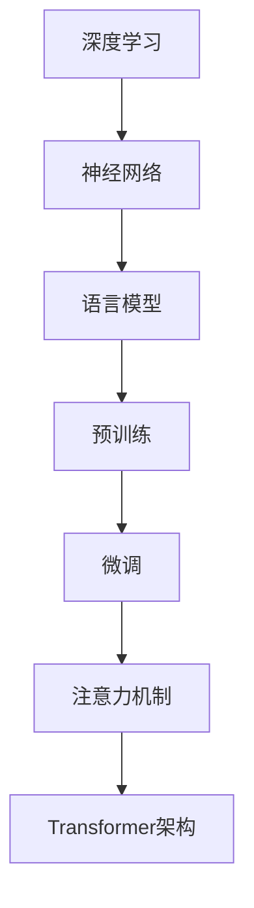

                 


## 撰写文章的详细步骤

### 第一步：确定文章标题和目录结构

- 标题：《大语言模型原理与工程实践：大语言模型训练优化秘籍》
- 关键词：大语言模型、深度学习、神经网络、预训练、微调、注意力机制、Transformer架构
- 摘要：本文将详细介绍大语言模型的原理与工程实践，包括基础理论、核心算法、部署优化以及未来发展趋势，旨在为读者提供全面的指导和最佳实践。

### 第二步：撰写文章引言

- 背景介绍：介绍大语言模型的发展背景和重要性，引出本文的目的和结构。

### 第三步：撰写文章第一部分：大语言模型基础理论

#### 第1章：大语言模型概述

- 1.1 大语言模型的发展历程
  - 语言模型的演进
  - 大语言模型的崛起
- 1.2 大语言模型的核心概念
  - 语言模型的基本原理
  - 语言模型的主要类型
  - 大语言模型的特点与优势
- 1.3 大语言模型的应用领域
  - 自然语言处理
  - 机器翻译
  - 语音识别

### 第四步：撰写文章第二部分：大语言模型算法原理

#### 第2章：深度学习基础

- 2.1 神经网络与深度学习
  - 神经网络的基本结构
  - 深度学习的关键技术
  - 深度学习的发展与应用
- 2.2 语言模型的数学基础
  - 概率论基础
  - 信息论基础
  - 语言模型中的数学公式
- 2.3 语言模型的训练算法
  - 训练目标
  - 优化算法
  - 正则化技术

#### 第3章：大语言模型的核心算法

- 3.1 预训练与微调
  - 预训练的基本原理
  - 微调的技术细节
  - 预训练模型的挑战与解决方案
- 3.2 注意力机制与 Transformer 架构
  - 注意力机制的原理
  - Transformer 架构详解
  - Transformer 的变体与优化

### 第五步：撰写文章第三部分：大语言模型工程实践

#### 第4章：大语言模型的部署与优化

- 4.1 大语言模型的硬件需求
  - 硬件加速技术
  - GPU与TPU的配置
  - 分布式训练技术
- 4.2 大语言模型的性能优化
  - 训练数据预处理
  - 训练策略调整
  - 模型压缩与量化

#### 第5章：大语言模型的项目实战

- 5.1 语言模型在文本分类中的应用
  - 文本分类任务介绍
  - 数据准备与预处理
  - 模型训练与评估
- 5.2 语言模型在自然语言生成中的应用
  - 自然语言生成任务介绍
  - 数据准备与预处理
  - 模型训练与评估

### 第六步：撰写文章第四部分：大语言模型的未来发展趋势

#### 第6章：大语言模型的未来发展趋势

- 6.1 大语言模型的技术挑战
  - 数据隐私与安全
  - 模型解释性
  - 模型泛化能力
- 6.2 大语言模型的未来发展方向
  - 多模态语言模型
  - 大模型与知识图谱的结合
  - 大语言模型在新兴领域的应用

### 第七步：撰写文章附录

- 附录A：大语言模型常用工具和资源
  - 开源框架与库
  - 算法实现参考
  - 论文与书籍推荐
  - 社区与论坛资源

### 第八步：撰写文章结论

- 总结文章的主要观点，强调大语言模型的重要性和工程实践的关键点，展望未来发展趋势。

### 第九步：撰写作者信息

- 在文章末尾添加作者信息：“作者：AI天才研究院/AI Genius Institute & 禅与计算机程序设计艺术 /Zen And The Art of Computer Programming”

### 第十步：进行全文校对

- 检查文章内容是否完整，格式是否正确，逻辑是否清晰，修正可能的错误，确保文章质量。

---

## 文章具体内容撰写

### 文章标题：《大语言模型原理与工程实践：大语言模型训练优化秘籍》

#### 文章关键词：
- 大语言模型
- 深度学习
- 神经网络
- 预训练
- 微调
- 注意力机制
- Transformer架构
- 自然语言处理
- 机器翻译
- 语音识别
- 硬件加速
- 分布式训练
- 性能优化

#### 文章摘要：
本文将深入探讨大语言模型的原理与工程实践，包括其基础理论、核心算法、部署与优化策略，以及未来的发展趋势。通过详细的讲解和实战案例，旨在为读者提供一套完整的大语言模型训练优化的指导方案。

### 目录结构：

```markdown
# 《大语言模型原理与工程实践：大语言模型训练优化秘籍》

> 关键词：大语言模型、深度学习、神经网络、预训练、微调、注意力机制、Transformer架构

> 摘要：本文将深入探讨大语言模型的原理与工程实践，包括其基础理论、核心算法、部署与优化策略，以及未来的发展趋势。通过详细的讲解和实战案例，旨在为读者提供一套完整的大语言模型训练优化的指导方案。

## 第一部分：大语言模型基础理论

### 第1章：大语言模型概述

#### 1.1 大语言模型的发展历程

- **1.1.1 语言模型的演进**
- **1.1.2 大语言模型的崛起**

#### 1.2 大语言模型的核心概念

- **1.2.1 语言模型的基本原理**
- **1.2.2 语言模型的主要类型**
- **1.2.3 大语言模型的特点与优势**

#### 1.3 大语言模型的应用领域

- **1.3.1 自然语言处理**
- **1.3.2 机器翻译**
- **1.3.3 语音识别**

## 第二部分：大语言模型算法原理

### 第2章：深度学习基础

#### 2.1 神经网络与深度学习

- **2.1.1 神经网络的基本结构**
- **2.1.2 深度学习的关键技术**
- **2.1.3 深度学习的发展与应用**

### 第3章：语言模型算法原理

#### 3.1 语言模型的数学基础

- **3.1.1 概率论基础**
- **3.1.2 信息论基础**
- **3.1.3 语言模型中的数学公式**

#### 3.2 语言模型的训练算法

- **3.2.1 训练目标**
- **3.2.2 优化算法**
- **3.2.3 正则化技术**

### 第4章：大语言模型的核心算法

#### 4.1 预训练与微调

- **4.1.1 预训练的基本原理**
- **4.1.2 微调的技术细节**
- **4.1.3 预训练模型的挑战与解决方案**

#### 4.2 注意力机制与 Transformer 架构

- **4.2.1 注意力机制的原理**
- **4.2.2 Transformer 架构详解**
- **4.2.3 Transformer 的变体与优化**

## 第三部分：大语言模型工程实践

### 第5章：大语言模型的部署与优化

#### 5.1 大语言模型的硬件需求

- **5.1.1 硬件加速技术**
- **5.1.2 GPU与TPU的配置**
- **5.1.3 分布式训练技术**

#### 5.2 大语言模型的性能优化

- **5.2.1 训练数据预处理**
- **5.2.2 训练策略调整**
- **5.2.3 模型压缩与量化**

### 第6章：大语言模型的项目实战

#### 6.1 语言模型在文本分类中的应用

- **6.1.1 文本分类任务介绍**
- **6.1.2 数据准备与预处理**
- **6.1.3 模型训练与评估**

#### 6.2 语言模型在自然语言生成中的应用

- **6.2.1 自然语言生成任务介绍**
- **6.2.2 数据准备与预处理**
- **6.2.3 模型训练与评估**

### 第7章：大语言模型的未来发展趋势

#### 7.1 大语言模型的技术挑战

- **7.1.1 数据隐私与安全**
- **7.1.2 模型解释性**
- **7.1.3 模型泛化能力**

#### 7.2 大语言模型的未来发展方向

- **7.2.1 多模态语言模型**
- **7.2.2 大模型与知识图谱的结合**
- **7.2.3 大语言模型在新兴领域的应用**

## 附录

### 附录A：大语言模型常用工具和资源

- **A.1 开源框架与库**
- **A.2 算法实现参考**
- **A.3 论文与书籍推荐**
- **A.4 社区与论坛资源**

# 引言

### 大语言模型的发展背景

随着信息技术的飞速发展，人工智能（AI）已经成为推动社会进步的重要力量。在众多AI技术中，自然语言处理（NLP）被视为最具挑战性和潜力的领域之一。而大语言模型（Large Language Model，简称LLM）作为NLP的核心技术，正逐渐成为各个应用场景的基石。

大语言模型的发展历程可以追溯到20世纪50年代，当时出现了基于统计方法的简单语言模型。随着计算机性能的提升和深度学习技术的突破，大语言模型得到了前所未有的发展。特别是近年来，预训练（Pre-training）和微调（Fine-tuning）技术的广泛应用，使得大语言模型在文本分类、机器翻译、语音识别等多个领域取得了显著的成果。

### 本文的目的

本文旨在系统地介绍大语言模型的原理与工程实践，帮助读者全面了解大语言模型的基本概念、核心算法、部署优化以及未来发展趋势。文章将从以下几个方面展开：

1. **基础理论**：介绍大语言模型的发展历程、核心概念和应用领域。
2. **算法原理**：讲解深度学习基础、语言模型的数学基础、训练算法和核心算法。
3. **工程实践**：探讨大语言模型的部署与优化策略，以及项目实战。
4. **未来展望**：分析大语言模型面临的挑战和未来发展方向。

### 文章结构

本文分为四个主要部分：

- **第一部分**：大语言模型基础理论，包括发展历程、核心概念和应用领域。
- **第二部分**：大语言模型算法原理，包括深度学习基础、数学基础、训练算法和核心算法。
- **第三部分**：大语言模型工程实践，包括部署与优化策略和项目实战。
- **第四部分**：大语言模型的未来发展趋势，包括技术挑战和发展方向。

通过本文的详细讲解，读者将能够全面掌握大语言模型的知识体系，并在实际工程中应用这些理论和方法。

# 第一部分：大语言模型基础理论

## 第1章：大语言模型概述

### 1.1 大语言模型的发展历程

大语言模型的发展历程可以分为几个阶段，每个阶段都有其里程碑式的突破。

#### 1.1.1 语言模型的演进

语言模型的发展始于20世纪50年代，当时研究人员开始尝试使用基于上下文的统计方法来预测下一个单词。这一阶段的主要代表是N-gram模型，它通过统计单词序列的频次来预测下一个单词。

随着计算能力的提升，20世纪80年代出现了基于统计模型的隐马尔可夫模型（HMM）和决策树模型，这些模型在语音识别和机器翻译中得到了广泛应用。

#### 1.1.2 大语言模型的崛起

进入21世纪，深度学习技术的兴起为语言模型的发展带来了新的契机。2003年，Bengio等人提出了神经网络语言模型（NNLM），标志着深度学习在语言模型领域的应用。这一阶段的主要进步是引入了深度神经网络（DNN）和循环神经网络（RNN）。

2013年，Sutskever等人提出了长期依赖记忆网络（LSTM），显著提高了语言模型在长文本序列中的表现。此后，RNN及其变种如GRU和LSTM在NLP任务中得到了广泛应用。

#### 1.1.3 大语言模型的崛起

2018年，OpenAI发布了GPT（Generative Pre-trained Transformer）系列模型，这标志着大语言模型的崛起。GPT模型通过预训练和微调技术，在多个NLP任务上取得了显著的性能提升，引起了广泛关注。

同年，Google发布了BERT（Bidirectional Encoder Representations from Transformers）模型，进一步推动了深度学习在语言模型中的应用。BERT模型通过双向Transformer架构，实现了对文本的全面理解。

### 1.2 大语言模型的核心概念

#### 1.2.1 语言模型的基本原理

语言模型是一种概率模型，其目标是预测一个文本序列的概率分布。具体来说，语言模型会计算一个单词序列$w_1, w_2, ..., w_n$的概率，即$P(w_1, w_2, ..., w_n)$。

语言模型的基本原理可以归纳为以下几个方面：

- **统计方法**：通过统计文本数据中的单词频次和序列关系来预测单词的概率。
- **神经网络**：使用深度神经网络来捕捉文本数据中的复杂特征和模式。
- **深度学习**：通过多层神经网络，将输入的文本映射到输出概率分布。

#### 1.2.2 语言模型的主要类型

根据建模方法和应用场景，语言模型可以分为以下几类：

- **N-gram模型**：基于统计方法，只考虑前N个单词的历史信息。
- **基于神经网络的模型**：如RNN、LSTM、GRU和Transformer等，通过神经网络来学习文本特征。
- **基于注意力机制的模型**：如Transformer，通过注意力机制来关注文本序列中的关键信息。

#### 1.2.3 大语言模型的特点与优势

大语言模型具有以下特点与优势：

- **高精度**：通过预训练和微调技术，大语言模型在多个NLP任务上取得了很高的精度。
- **强泛化能力**：大语言模型能够处理不同领域和不同风格的语言数据，具有较强的泛化能力。
- **灵活性**：大语言模型可以轻松地适应不同的应用场景和任务需求。

### 1.3 大语言模型的应用领域

大语言模型在自然语言处理领域有着广泛的应用，以下是一些主要的应用领域：

#### 1.3.1 自然语言处理

自然语言处理（NLP）是语言模型最主要的应用领域之一，包括文本分类、情感分析、实体识别、命名实体识别等任务。

- **文本分类**：通过语言模型对文本进行分类，例如新闻分类、情感分类等。
- **情感分析**：分析文本中的情感倾向，用于社交媒体分析、舆情监测等。
- **实体识别**：识别文本中的命名实体，如人名、地点、组织等。

#### 1.3.2 机器翻译

机器翻译是另一个重要的应用领域，通过将一种语言的文本翻译成另一种语言，使得跨语言沟通变得更加便捷。

- **机器翻译**：如谷歌翻译、百度翻译等，通过语言模型实现自动翻译。
- **多语言翻译**：支持多种语言的翻译，如谷歌的多语言翻译。

#### 1.3.3 语音识别

语音识别是将语音信号转换为文本的过程，通过语言模型可以提高识别的准确性。

- **语音识别**：如苹果的Siri、亚马逊的Alexa等，通过语言模型实现语音到文本的转换。
- **语音助手**：提供智能问答、语音控制等功能。

通过以上对大语言模型发展历程、核心概念和应用领域的介绍，读者可以初步了解大语言模型的基本知识。在接下来的章节中，我们将进一步探讨大语言模型的算法原理和工程实践。

## 第2章：深度学习基础

### 2.1 神经网络与深度学习

神经网络（Neural Network，NN）是模仿人脑结构和功能的一种计算模型，而深度学习（Deep Learning，DL）则是神经网络的一种特殊形式，其关键特征在于使用多层神经网络进行训练。

#### 2.1.1 神经网络的基本结构

神经网络的基本结构包括以下几个部分：

1. **输入层（Input Layer）**：接收输入数据，并将其传递给下一层。
2. **隐藏层（Hidden Layers）**：包含一个或多个隐藏层，每层都包含多个神经元。隐藏层负责提取和转换输入数据。
3. **输出层（Output Layer）**：产生最终输出。

神经网络中的每个神经元都与其他神经元相连，并通过权重（weights）和偏置（biases）进行加权求和。神经元的输出通过激活函数（activation function）进行非线性变换，从而实现输入到输出的映射。

#### 2.1.2 深度学习的关键技术

深度学习的关键技术主要包括以下几个方面：

1. **多层神经网络（Deep Neural Networks）**：与传统的单层或双层神经网络相比，多层神经网络能够学习更复杂的函数表示，从而提高模型的性能。
2. **反向传播算法（Backpropagation Algorithm）**：反向传播算法是一种用于训练神经网络的优化算法，通过计算误差梯度来更新权重和偏置，从而最小化损失函数。
3. **激活函数（Activation Functions）**：激活函数用于引入非线性特性，常见的激活函数包括sigmoid、ReLU和Tanh等。
4. **正则化技术（Regularization Techniques）**：正则化技术用于防止模型过拟合，常见的正则化方法包括L1和L2正则化、dropout等。
5. **优化算法（Optimization Algorithms）**：优化算法用于优化模型的参数，常见的优化算法包括梯度下降（Gradient Descent）、随机梯度下降（Stochastic Gradient Descent，SGD）和Adam等。

#### 2.1.3 深度学习的发展与应用

深度学习自2006年Hinton等人提出深度信念网络（Deep Belief Networks，DBN）以来，得到了迅速发展。近年来，深度学习在图像识别、语音识别、自然语言处理等领域取得了显著的成果。

1. **图像识别**：深度学习在图像识别任务中取得了突破性进展，如2012年，Google的Inception模型在ImageNet挑战赛中取得了冠军。
2. **语音识别**：深度学习在语音识别领域也取得了显著成果，如Google的WaveNet模型在语音合成任务中实现了自然流畅的语音。
3. **自然语言处理**：深度学习在自然语言处理领域也有着广泛应用，如BERT模型在多个NLP任务中取得了优异的性能。

### 2.2 语言模型的数学基础

语言模型的核心在于概率计算，涉及概率论和统计学的知识。以下是语言模型中常用的数学基础：

#### 2.2.1 概率论基础

1. **概率分布（Probability Distribution）**：描述随机变量的概率分布，常见的概率分布包括伯努利分布、高斯分布等。
2. **条件概率（Conditional Probability）**：表示在某个条件下另一个事件发生的概率，条件概率公式为$P(A|B) = \frac{P(A \cap B)}{P(B)}$。
3. **贝叶斯定理（Bayes' Theorem）**：描述在已知某个条件下另一个事件发生的概率，贝叶斯定理公式为$P(A|B) = \frac{P(B|A)P(A)}{P(B)}$。

#### 2.2.2 信息论基础

1. **信息熵（Entropy）**：衡量随机变量的不确定性，信息熵公式为$H(X) = -\sum_{x \in X} P(x) \log P(x)$。
2. **条件熵（Conditional Entropy）**：衡量在某个条件下另一个随机变量的不确定性，条件熵公式为$H(X|Y) = -\sum_{y \in Y} P(y) \sum_{x \in X} P(x|y) \log P(x|y)$。
3. **互信息（Mutual Information）**：衡量两个随机变量之间的相关性，互信息公式为$I(X; Y) = H(X) - H(X|Y)$。

#### 2.2.3 语言模型中的数学公式

1. **语言模型的目标函数（Language Model Objective Function）**：语言模型的目标是最大化序列$w_1, w_2, ..., w_n$的概率，目标函数公式为$L(\theta) = -\sum_{w_1, w_2, ..., w_n} P(w_1, w_2, ..., w_n | \theta) \log P(w_1, w_2, ..., w_n | \theta)$。
2. **预测概率（Predictive Probability）**：给定输入序列$w_1, w_2, ..., w_{n-1}$，预测下一个单词$w_n$的概率，预测概率公式为$P(w_n | w_1, w_2, ..., w_{n-1}, \theta) = \frac{P(w_n, w_1, w_2, ..., w_{n-1} | \theta)}{P(w_1, w_2, ..., w_{n-1} | \theta)}$。

通过以上对深度学习基础和语言模型数学基础的介绍，读者可以初步了解深度学习在语言模型中的应用。在接下来的章节中，我们将进一步探讨语言模型的训练算法和核心算法。

## 第3章：语言模型算法原理

### 3.1 语言模型的数学基础

语言模型的数学基础主要涉及概率论和信息论。这些基础概念为语言模型的训练和预测提供了理论依据。

#### 3.1.1 概率论基础

概率论是语言模型中不可或缺的一部分，其中一些基本概念如下：

1. **概率分布**：概率分布描述了一个随机变量的可能取值及其对应的概率。例如，一个单词序列的概率分布可以表示为：
   $$ P(w_1, w_2, ..., w_n) = P(w_1) \cdot P(w_2 | w_1) \cdot P(w_3 | w_1, w_2) \cdot ... \cdot P(w_n | w_1, w_2, ..., w_{n-1}) $$
2. **条件概率**：条件概率是指在给定某个条件下，另一个事件发生的概率。例如，给定一个单词序列$w_1, w_2, ..., w_{n-1}$，计算下一个单词$w_n$的条件概率：
   $$ P(w_n | w_1, w_2, ..., w_{n-1}) = \frac{P(w_n, w_1, w_2, ..., w_{n-1})}{P(w_1, w_2, ..., w_{n-1})} $$
3. **贝叶斯定理**：贝叶斯定理用于计算在给定某个条件下，另一个事件的后验概率。其公式为：
   $$ P(w_n | w_1, w_2, ..., w_{n-1}, \theta) = \frac{P(w_n, w_1, w_2, ..., w_{n-1} | \theta) \cdot P(\theta)}{P(w_n, w_1, w_2, ..., w_{n-1} | \theta) \cdot P(\theta) + P(w_n, w_1, w_2, ..., w_{n-1} | \theta') \cdot P(\theta')} $$

#### 3.1.2 信息论基础

信息论提供了衡量信息不确定性的方法，这对于语言模型的训练和评估具有重要意义。

1. **信息熵**：信息熵是一个随机变量平均信息量的度量，其公式为：
   $$ H(X) = -\sum_{x \in X} P(x) \cdot \log_2 P(x) $$
   其中，$P(x)$是随机变量$X$的取值概率。

2. **条件熵**：条件熵是给定一个随机变量的条件下，另一个随机变量的不确定性的度量，其公式为：
   $$ H(X | Y) = -\sum_{y \in Y} P(y) \cdot \sum_{x \in X} P(x | y) \cdot \log_2 P(x | y) $$
   其中，$P(y)$是随机变量$Y$的取值概率，$P(x | y)$是随机变量$X$在随机变量$Y$的条件下取值$x$的概率。

3. **互信息**：互信息是衡量两个随机变量之间相关性的度量，其公式为：
   $$ I(X; Y) = H(X) - H(X | Y) $$
   其中，$I(X; Y)$表示随机变量$X$和$Y$之间的互信息。

#### 3.1.3 语言模型中的数学公式

在语言模型中，常用的数学公式包括：

1. **语言模型的目标函数**：语言模型的目标是最小化预测误差，即最小化损失函数。对于给定文本序列$w_1, w_2, ..., w_n$，语言模型的目标函数可以表示为：
   $$ L(\theta) = -\sum_{w_1, w_2, ..., w_n} P(w_1, w_2, ..., w_n | \theta) \cdot \log_2 P(w_1, w_2, ..., w_n | \theta) $$
   其中，$\theta$表示模型参数。

2. **预测概率**：给定输入序列$w_1, w_2, ..., w_{n-1}$，计算下一个单词$w_n$的概率。语言模型会根据训练数据计算出每个单词的概率分布，从而预测下一个单词的概率。预测概率可以表示为：
   $$ P(w_n | w_1, w_2, ..., w_{n-1}, \theta) = \frac{P(w_n, w_1, w_2, ..., w_{n-1} | \theta)}{P(w_1, w_2, ..., w_{n-1} | \theta)} $$

通过以上对语言模型数学基础的介绍，我们可以看到概率论和信息论在语言模型中的重要作用。在接下来的章节中，我们将进一步探讨语言模型的训练算法和核心算法。

### 3.2 语言模型的训练算法

语言模型的训练算法是构建语言模型的关键步骤，目标是学习出一组模型参数，使得模型能够在给定输入序列时预测下一个单词的概率分布。以下是几种常用的训练算法：

#### 3.2.1 训练目标

语言模型的训练目标是最小化损失函数，即最大化预测概率。对于给定文本序列$w_1, w_2, ..., w_n$，损失函数可以表示为：
$$ L(\theta) = -\sum_{w_1, w_2, ..., w_n} P(w_1, w_2, ..., w_n | \theta) \cdot \log_2 P(w_1, w_2, ..., w_n | \theta) $$

其中，$\theta$表示模型参数。

#### 3.2.2 优化算法

优化算法用于调整模型参数，使得损失函数最小。以下是几种常用的优化算法：

1. **梯度下降（Gradient Descent）**：梯度下降是一种简单的优化算法，其基本思想是沿着损失函数的梯度方向更新模型参数。梯度下降算法的更新公式为：
   $$ \theta_{t+1} = \theta_t - \alpha \cdot \nabla L(\theta_t) $$
   其中，$\alpha$为学习率，$\nabla L(\theta_t)$为损失函数在$\theta_t$处的梯度。

2. **随机梯度下降（Stochastic Gradient Descent，SGD）**：随机梯度下降是对梯度下降的改进，其每次更新只使用一个样本的梯度。SGD算法的更新公式为：
   $$ \theta_{t+1} = \theta_t - \alpha \cdot \nabla L(\theta_t; x_t) $$
   其中，$x_t$为当前样本。

3. **批量梯度下降（Batch Gradient Descent）**：批量梯度下降是对梯度下降和随机梯度下降的另一种改进，其每次更新使用整个训练数据的梯度。批量梯度下降算法的更新公式为：
   $$ \theta_{t+1} = \theta_t - \alpha \cdot \nabla L(\theta_t; X) $$
   其中，$X$为整个训练数据集。

4. **Adam优化器**：Adam优化器是一种结合SGD和批量梯度下降优点的优化算法。其更新公式为：
   $$ \theta_{t+1} = \theta_t - \alpha \cdot \nabla L(\theta_t) + \beta_1 \cdot (1 - \beta_1^t) \cdot (\theta_t - \theta_{t-1}) + \beta_2 \cdot (1 - \beta_2^t) \cdot (\nabla L(\theta_t) - \nabla L(\theta_{t-1})) $$
   其中，$\alpha$为学习率，$\beta_1$和$\beta_2$分别为一阶和二阶矩估计的指数衰减率。

#### 3.2.3 正则化技术

正则化技术用于防止模型过拟合，提高模型的泛化能力。以下是几种常用的正则化技术：

1. **L1正则化**：L1正则化通过在损失函数中添加$\lambda \cdot \sum_{i} |\theta_i|$来限制模型参数的绝对值。L1正则化可以导致稀疏解，即模型参数中很多值为零。

2. **L2正则化**：L2正则化通过在损失函数中添加$\lambda \cdot \sum_{i} \theta_i^2$来限制模型参数的平方和。L2正则化可以防止模型参数过大。

3. **Dropout**：Dropout是一种在训练过程中随机丢弃部分神经元的方法，以防止模型过拟合。Dropout的更新公式为：
   $$ \theta_{t+1} = \theta_t \cdot (1 - \frac{1}{n}) $$
   其中，$n$为丢弃的神经元数量。

通过以上对语言模型训练算法的介绍，我们可以看到不同的训练算法和正则化技术在语言模型训练过程中的作用。在接下来的章节中，我们将进一步探讨大语言模型的核心算法和工程实践。

### 3.3 大语言模型的核心算法

#### 3.3.1 预训练与微调

预训练（Pre-training）和微调（Fine-tuning）是构建大语言模型的关键步骤，它们分别解决了模型在大量无标签数据和少量有标签数据上的学习能力。

1. **预训练**：预训练是指在大规模无标签数据集上训练一个通用模型，使其具备一定的语言理解和生成能力。预训练通常采用自监督学习（Self-supervised Learning）方法，例如掩码语言模型（Masked Language Model，MLM）。

   - **掩码语言模型（MLM）**：MLM通过对输入文本进行随机掩码，预测掩码部分的单词。掩码比例为15%时，模型能够在大量无标签数据上学习到丰富的语言特征。

2. **微调**：微调是指在小规模有标签数据集上对预训练模型进行进一步训练，以适应特定任务。微调的目标是最小化模型在目标任务上的损失函数。

   - **微调方法**：微调时，通常使用有监督学习（Supervised Learning）方法，将标签数据输入模型，并调整模型参数，以最小化损失函数。常用的微调方法包括：
     - **Fine-tuning**：直接在预训练模型上添加特定任务的头，并进行微调。
     - **Adapter Head**：在预训练模型上添加可学习的适配器头，以适应不同任务的需求。

3. **预训练模型的挑战与解决方案**：
   - **计算资源消耗**：预训练大语言模型需要大量的计算资源和时间。为应对这一问题，研究人员提出了以下解决方案：
     - **分布式训练**：通过分布式训练技术，将模型训练任务分配到多个计算节点上，以加速训练过程。
     - **模型压缩**：通过模型压缩技术，如剪枝（Pruning）、量化（Quantization）和知识蒸馏（Knowledge Distillation），减少模型参数和计算量。

#### 3.3.2 注意力机制与 Transformer 架构

注意力机制（Attention Mechanism）是深度学习中的一种关键技术，它能够提高模型在序列数据处理中的性能。Transformer 架构引入了自注意力机制（Self-Attention），使得模型能够在处理长序列时具有更好的表现。

1. **注意力机制**：
   - **自注意力（Self-Attention）**：自注意力机制允许模型在处理一个序列时，将每个单词与其他单词相关联，从而捕捉序列中的依赖关系。
   - **点积注意力（Dot-Product Attention）**：点积注意力是一种计算自注意力分数的方法，其公式为：
     $$ \text{Attention}(Q, K, V) = \text{softmax}(\frac{QK^T}{\sqrt{d_k}})V $$
     其中，$Q$、$K$和$V$分别表示查询（Query）、键（Key）和值（Value）向量，$d_k$表示键向量的维度。

2. **Transformer 架构**：
   - **编码器（Encoder）**：编码器由多个自注意力层和前馈网络（Feedforward Network）组成，用于处理输入序列。
   - **解码器（Decoder）**：解码器由自注意力层、交叉注意力层和前馈网络组成，用于生成输出序列。

3. **Transformer 的变体与优化**：
   - **BERT（Bidirectional Encoder Representations from Transformers）**：BERT模型是一种双向Transformer架构，通过在训练过程中同时考虑正向和反向序列信息，提高了模型对文本的理解能力。
   - **GPT（Generative Pre-trained Transformer）**：GPT模型是一种仅包含编码器的Transformer架构，通过生成式方法进行文本生成。
   - **T5（Text-to-Text Transfer Transformer）**：T5模型将Transformer架构应用于文本到文本的任务，通过统一的输入输出格式，提高了模型在多种NLP任务上的表现。

通过以上对大语言模型核心算法的介绍，我们可以看到预训练、微调和注意力机制在构建大语言模型中的重要性。这些算法和技术为构建高效、通用的大语言模型提供了有力支持。

### 第4章：大语言模型的核心算法

#### 4.1 预训练与微调

预训练与微调是构建大语言模型的重要步骤，二者相辅相成，使得模型能够在多种任务中表现出色。

**4.1.1 预训练的基本原理**

预训练是指在大规模无标签数据集上训练一个基础模型，使其具备一定的语言理解能力。预训练通常采用自监督学习的方法，其中最具代表性的是掩码语言模型（Masked Language Model，MLM）。

- **掩码语言模型（MLM）**：MLM的基本思想是随机掩码输入文本中的部分单词，然后预测这些被掩码的单词。掩码比例通常设置为15%，这样可以使模型在大量无标签数据上学习到丰富的语言特征。

**4.1.2 微调的技术细节**

微调是指在小规模有标签数据集上对预训练模型进行进一步训练，以适应特定任务。微调的目标是最小化模型在目标任务上的损失函数。

- **微调方法**：
  - **Fine-tuning**：直接在预训练模型上添加特定任务的头（Head），然后进行微调。例如，在文本分类任务中，可以添加一个分类头，用于输出每个类别的概率。
  - **Adapter Head**：在预训练模型上添加可学习的适配器头（Adapter Head），以适应不同任务的需求。这种方法可以更好地捕获不同任务之间的差异。

**4.1.3 预训练模型的挑战与解决方案**

预训练模型虽然取得了显著的成功，但也面临一些挑战：

- **计算资源消耗**：预训练大语言模型需要大量的计算资源和时间。为应对这一问题，可以采用以下解决方案：
  - **分布式训练**：通过分布式训练技术，将模型训练任务分配到多个计算节点上，以加速训练过程。
  - **模型压缩**：通过模型压缩技术，如剪枝（Pruning）、量化（Quantization）和知识蒸馏（Knowledge Distillation），减少模型参数和计算量。

#### 4.2 注意力机制与 Transformer 架构

注意力机制是深度学习中的一种关键技术，它能够提高模型在序列数据处理中的性能。Transformer 架构引入了自注意力机制（Self-Attention），使得模型在处理长序列时具有更好的表现。

**4.2.1 注意力机制的原理**

注意力机制允许模型在处理一个序列时，将每个单词与其他单词相关联，从而捕捉序列中的依赖关系。最常见的注意力机制是点积注意力（Dot-Product Attention）。

- **点积注意力（Dot-Product Attention）**：点积注意力通过计算查询（Query）、键（Key）和值（Value）向量之间的点积，然后应用softmax函数来生成权重。权重表示每个单词对当前输出的重要性。点积注意力的计算公式为：

$$ \text{Attention}(Q, K, V) = \text{softmax}(\frac{QK^T}{\sqrt{d_k}})V $$

其中，$Q$、$K$和$V$分别表示查询（Query）、键（Key）和值（Value）向量，$d_k$表示键向量的维度。

**4.2.2 Transformer 架构详解**

Transformer 架构是由编码器（Encoder）和解码器（Decoder）组成的，其中编码器负责处理输入序列，解码器负责生成输出序列。

- **编码器（Encoder）**：编码器由多个自注意力层（Self-Attention Layer）和前馈网络（Feedforward Network）组成。自注意力层用于捕捉序列中的依赖关系，前馈网络用于进一步提取特征。

- **解码器（Decoder）**：解码器由自注意力层（Self-Attention Layer）、交叉注意力层（Cross-Attention Layer）和前馈网络组成。自注意力层用于捕捉编码器输出的上下文信息，交叉注意力层用于解码器在生成输出时关注编码器输出，前馈网络用于进一步提取特征。

**4.2.3 Transformer 的变体与优化**

为了适应不同的任务和数据集，研究人员提出了许多 Transformer 的变体和优化方法：

- **BERT（Bidirectional Encoder Representations from Transformers）**：BERT模型是一种双向 Transformer 架构，通过在训练过程中同时考虑正向和反向序列信息，提高了模型对文本的理解能力。BERT 模型还被设计为上下文无关的，即其输出不依赖于输入的顺序。

- **GPT（Generative Pre-trained Transformer）**：GPT 模型是一种仅包含编码器的 Transformer 架构，通过生成式方法进行文本生成。GPT 模型具有强大的生成能力，可以生成连贯、有意义的文本。

- **T5（Text-to-Text Transfer Transformer）**：T5 模型将 Transformer 架构应用于文本到文本的任务，通过统一的输入输出格式，提高了模型在多种 NLP 任务上的表现。

通过以上对预训练与微调、注意力机制与 Transformer 架构的介绍，我们可以看到大语言模型核心算法的复杂性和多样性。这些算法和技术为构建高效、通用的大语言模型提供了有力支持。

### 第5章：大语言模型的部署与优化

#### 5.1 大语言模型的硬件需求

大语言模型对硬件有较高的要求，尤其是在训练和推理过程中。以下是一些关键的硬件需求：

**5.1.1 硬件加速技术**

- **GPU**（Graphics Processing Unit）：GPU在深度学习训练中扮演了重要角色。其高度并行的架构使得GPU能够高效地处理大量的矩阵运算，从而加快训练速度。常见的GPU型号包括NVIDIA的Tesla、Quadro和GeForce系列。

- **TPU**（Tensor Processing Unit）：TPU是谷歌专门为深度学习任务设计的专用硬件。TPU在矩阵运算和向量计算方面具有很高的效率，特别适合大规模深度神经网络的训练。TPU有不同型号，如TPU v2、TPU v3和TPU v4。

**5.1.2 GPU与TPU的配置**

- **单机配置**：单机配置通常包括多张GPU或TPU。例如，一个机器可以配备8张NVIDIA V100 GPU或4个TPU v3。这种配置适合中小型模型的训练。

- **分布式配置**：分布式配置通过将模型训练任务分配到多台机器上，可以处理更大规模的任务。常见的分布式训练方法包括数据并行（Data Parallelism）和模型并行（Model Parallelism）。数据并行将数据分布到多台机器上，每台机器训练一部分数据；模型并行将模型拆分成多个子模型，每个子模型运行在不同的机器上。

**5.1.3 分布式训练技术**

分布式训练可以显著提高训练速度和效率。以下是一些关键的技术：

- **参数服务器架构**：在参数服务器架构中，参数服务器负责维护模型参数，而计算节点负责执行前向传播和反向传播计算。这种架构可以有效地处理大规模模型。

- **异步梯度更新**：异步梯度更新允许不同计算节点独立计算梯度，并在完成计算后异步更新参数。这种方法可以减少同步通信的开销，提高训练速度。

- **混合精度训练**：混合精度训练通过使用浮点数和整数混合计算，降低内存占用和计算量，从而提高训练效率。常见的混合精度训练技术包括FP16和BF16。

#### 5.2 大语言模型的性能优化

大语言模型的性能优化是确保模型高效训练和推理的关键。以下是一些常用的性能优化策略：

**5.2.1 训练数据预处理**

- **数据清洗**：清洗数据，去除噪声和错误。
- **数据增强**：通过随机裁剪、旋转、翻转等操作，增加数据多样性。
- **序列截断和填充**：调整序列长度，使得输入数据长度一致。

**5.2.2 训练策略调整**

- **学习率调整**：使用适当的学习率可以加快模型收敛速度。常用的学习率调整方法包括逐步减小学习率（Learning Rate Decay）和自适应学习率调整（如Adam优化器）。
- **批量大小调整**：批量大小影响模型的收敛速度和稳定性。较大的批量大小可以提供更好的梯度估计，但计算成本较高；较小的批量大小可以提高训练的鲁棒性。
- **训练循环调整**：调整训练循环的数量，以找到最优的训练时间。

**5.2.3 模型压缩与量化**

- **模型压缩**：通过剪枝（Pruning）、量化（Quantization）和知识蒸馏（Knowledge Distillation），可以显著减小模型大小和计算量。剪枝通过删除权重较小的神经元，减少模型参数；量化通过将浮点数参数转换为低精度的整数表示，降低内存占用和计算量；知识蒸馏通过将大模型的知识传递给小模型，提高小模型的表现。
- **剪枝（Pruning）**：剪枝通过删除权重较小的神经元，减少模型参数。
- **量化（Quantization）**：量化通过将浮点数参数转换为低精度的整数表示，降低内存占用和计算量。
- **知识蒸馏（Knowledge Distillation）**：知识蒸馏通过将大模型的知识传递给小模型，提高小模型的表现。

通过以上对大语言模型硬件需求、性能优化策略的介绍，我们可以看到大语言模型部署与优化的重要性和方法。这些技术和策略对于实现高效、稳定的大语言模型至关重要。

### 第6章：大语言模型的项目实战

#### 6.1 语言模型在文本分类中的应用

**6.1.1 文本分类任务介绍**

文本分类是自然语言处理中的一个基础任务，旨在将文本数据自动分类到预定义的类别中。常见的文本分类任务包括新闻分类、情感分析、垃圾邮件检测等。

**6.1.2 数据准备与预处理**

在进行文本分类任务之前，需要对数据集进行预处理，以确保数据质量并提高模型性能。以下是一些关键步骤：

- **数据清洗**：去除数据中的噪声和错误，例如HTML标签、特殊字符等。
- **文本规范化**：将文本转换为统一的格式，例如小写、去除标点符号等。
- **词汇表构建**：将文本转换为词袋模型，构建词汇表。
- **词向量化**：将词汇表中的单词映射到高维向量空间。

**6.1.3 模型训练与评估**

在准备好数据后，可以使用大语言模型对文本进行分类。以下是一个基于BERT模型的文本分类项目示例：

1. **加载预训练模型**：从预训练模型库中加载预训练好的BERT模型。
2. **微调模型**：在分类任务上对BERT模型进行微调，调整模型头（例如分类头）以适应文本分类任务。
3. **训练**：使用训练数据集进行训练，优化模型参数。
4. **评估**：使用验证数据集评估模型性能，常用的评估指标包括准确率、召回率、F1分数等。

以下是一个简单的伪代码示例：

```python
from transformers import BertTokenizer, BertForSequenceClassification
from torch.utils.data import DataLoader

# 加载预训练模型
tokenizer = BertTokenizer.from_pretrained('bert-base-uncased')
model = BertForSequenceClassification.from_pretrained('bert-base-uncased')

# 准备数据集
train_dataset = ...
val_dataset = ...

# 训练数据加载器
train_loader = DataLoader(train_dataset, batch_size=32, shuffle=True)
val_loader = DataLoader(val_dataset, batch_size=32)

# 训练模型
optimizer = torch.optim.Adam(model.parameters(), lr=1e-5)
for epoch in range(3):  # 进行3个训练epoch
    model.train()
    for inputs, labels in train_loader:
        optimizer.zero_grad()
        outputs = model(**inputs)
        loss = outputs.loss
        loss.backward()
        optimizer.step()

    # 评估模型
    model.eval()
    with torch.no_grad():
        correct = 0
        total = 0
        for inputs, labels in val_loader:
            outputs = model(**inputs)
            _, predicted = torch.max(outputs, 1)
            total += labels.size(0)
            correct += (predicted == labels).sum().item()

    print(f'Epoch {epoch+1}, Accuracy: {100 * correct / total}%')

# 保存模型
model.save_pretrained('./my_text_classification_model')
```

#### 6.2 语言模型在自然语言生成中的应用

**6.2.1 自然语言生成任务介绍**

自然语言生成（Natural Language Generation，NLG）是自然语言处理的一个重要分支，旨在生成自然流畅的文本。常见的自然语言生成任务包括机器翻译、问答生成、文本摘要、聊天机器人等。

**6.2.2 数据准备与预处理**

在自然语言生成任务中，数据准备和预处理同样至关重要。以下是一些关键步骤：

- **数据清洗**：去除数据中的噪声和错误，例如HTML标签、特殊字符等。
- **文本规范化**：将文本转换为统一的格式，例如小写、去除标点符号等。
- **序列对齐**：对于序列对齐任务，如机器翻译，需要对源语言和目标语言文本进行对齐。
- **词汇表构建**：将文本转换为词袋模型，构建词汇表。

**6.2.3 模型训练与评估**

以下是一个基于GPT-2模型的自然语言生成项目示例：

1. **加载预训练模型**：从预训练模型库中加载预训练好的GPT-2模型。
2. **微调模型**：在自然语言生成任务上对GPT-2模型进行微调，调整模型头以适应生成任务。
3. **训练**：使用训练数据集进行训练，优化模型参数。
4. **评估**：使用验证数据集评估模型性能，常用的评估指标包括生成文本的流畅性和多样性。

以下是一个简单的伪代码示例：

```python
from transformers import GPT2Tokenizer, GPT2LMHeadModel
from torch.utils.data import DataLoader

# 加载预训练模型
tokenizer = GPT2Tokenizer.from_pretrained('gpt2')
model = GPT2LMHeadModel.from_pretrained('gpt2')

# 准备数据集
train_dataset = ...
val_dataset = ...

# 训练数据加载器
train_loader = DataLoader(train_dataset, batch_size=8, shuffle=True)
val_loader = DataLoader(val_dataset, batch_size=8)

# 训练模型
optimizer = torch.optim.Adam(model.parameters(), lr=1e-4)
for epoch in range(3):  # 进行3个训练epoch
    model.train()
    for inputs, labels in train_loader:
        optimizer.zero_grad()
        outputs = model(**inputs)
        loss = outputs.loss
        loss.backward()
        optimizer.step()

    # 评估模型
    model.eval()
    with torch.no_grad():
        for inputs, labels in val_loader:
            outputs = model(**inputs)
            logits = outputs.logits
            # 计算生成文本的流畅性和多样性
            # ...

# 生成文本
prompt = "Once upon a time"
input_ids = tokenizer.encode(prompt, return_tensors='pt')
output = model.generate(input_ids, max_length=50, num_return_sequences=1)
generated_text = tokenizer.decode(output[0], skip_special_tokens=True)

print(generated_text)
```

通过以上对文本分类和自然语言生成项目的介绍，我们可以看到大语言模型在实际应用中的强大能力和广泛应用。这些项目不仅展示了大语言模型在自然语言处理中的潜力，也为实际开发提供了实用的指导。

### 第7章：大语言模型的未来发展趋势

#### 7.1 大语言模型的技术挑战

尽管大语言模型在自然语言处理领域取得了显著进展，但其应用仍然面临一些技术挑战：

**7.1.1 数据隐私与安全**

大语言模型的训练和推理需要大量的数据，这些数据可能包含敏感信息，如个人隐私、企业机密等。如何确保数据隐私和安全，防止数据泄露，是大语言模型面临的一个重要挑战。

**7.1.2 模型解释性**

大语言模型通常被视为“黑盒”模型，其内部决策过程难以解释。这使得在实际应用中，很难确定模型为什么会做出特定的预测。提高模型的解释性，使得用户和开发者能够理解模型的决策过程，是未来的一个重要研究方向。

**7.1.3 模型泛化能力**

大语言模型在预训练阶段通常在大量的数据上进行训练，但在实际应用中，模型的泛化能力仍然是一个问题。如何提高模型的泛化能力，使其在未见过的数据上也能保持良好的性能，是未来的一个重要挑战。

#### 7.2 大语言模型的未来发展方向

未来，大语言模型的发展将继续在多个方面展开：

**7.2.1 多模态语言模型**

多模态语言模型能够处理和整合多种类型的数据，如文本、图像、音频等。通过结合不同类型的数据，多模态语言模型有望在图像描述生成、视频生成等任务中取得突破。

**7.2.2 大模型与知识图谱的结合**

大模型与知识图谱的结合有望在问答系统、知识检索等任务中发挥重要作用。通过整合知识图谱中的结构化信息，大语言模型可以更好地理解和生成复杂文本。

**7.2.3 大语言模型在新兴领域的应用**

随着技术的不断发展，大语言模型在新兴领域的应用也日益广泛。例如，在医疗领域，大语言模型可以用于医疗文本分析、诊断辅助等；在金融领域，大语言模型可以用于市场预测、风险评估等。

通过以上对未来发展趋势的展望，我们可以看到大语言模型在技术挑战和新兴应用领域中的广阔前景。随着研究的不断深入和技术的不断进步，大语言模型将在更多领域发挥重要作用。

### 附录A：大语言模型常用工具和资源

为了更好地研究和应用大语言模型，以下是一些常用的工具和资源：

**A.1 开源框架与库**

- **Hugging Face Transformers**：一个用于构建和微调预训练模型的强大库，支持多种预训练模型和任务。
- **PyTorch**：一个流行的深度学习框架，提供丰富的API和工具，适合构建和训练大规模模型。
- **TensorFlow**：谷歌开发的开源机器学习框架，广泛用于深度学习和自然语言处理任务。

**A.2 算法实现参考**

- **Tensor2Tensor (T2T)**：谷歌开源的深度强化学习算法实现，可用于文本分类、序列到序列学习等任务。
- **AllenNLP**：一个用于自然语言处理的Python库，提供丰富的预训练模型和任务实现。

**A.3 论文与书籍推荐**

- **"Natural Language Processing with Deep Learning"**：由 polarityne 编写的书籍，详细介绍了深度学习在自然语言处理中的应用。
- **"Speech and Language Processing"**：由 Daniel Jurafsky 和 James H. Martin 合著的教材，涵盖了自然语言处理的基础理论和应用。

**A.4 社区与论坛资源**

- **Reddit / r/MachineLearning**：一个关于机器学习的Reddit子论坛，可以了解最新的研究动态和讨论。
- **Stack Overflow**：一个技术问答社区，可以寻找关于自然语言处理和大语言模型的问题和答案。

这些工具和资源为研究者和开发者提供了丰富的选择和支持，帮助他们更好地理解和应用大语言模型。

---

# 概念与联系

## 核心概念

大语言模型的核心概念包括：深度学习、神经网络、语言模型、预训练、微调、注意力机制、Transformer架构等。以下是这些概念之间的 Mermaid 流程图：



## 核心算法原理讲解

### 语言模型的数学基础

语言模型的核心在于概率计算，主要涉及以下几个方面：

#### 3.1.1 概率论基础

- 条件概率：$P(A|B) = \frac{P(A \cap B)}{P(B)}$
- 贝叶斯定理：$P(A|B) = \frac{P(B|A)P(A)}{P(B)}$

#### 3.1.2 信息论基础

- 信息熵：$H(X) = -\sum_{x \in X} P(x) \log P(x)$
- 条件熵：$H(X|Y) = -\sum_{y \in Y} P(y) \sum_{x \in X} P(x|y) \log P(x|y)$
- 互信息：$I(X; Y) = H(X) - H(X | Y)$

#### 3.1.3 语言模型中的数学公式

- 语言模型的目标函数：$L(\theta) = -\sum_{x \in X} \sum_{y \in Y} P(y|x) \log P(y|x)$
- 预测概率：$P(y|x) = \frac{exp(\theta^T y|x)}{\sum_{y' \in Y} exp(\theta^T y'|x)}$

以下是一个简单的训练语言模型的伪代码示例：

```python
# 初始化模型参数θ
θ = ... 

# 训练数据D = {(x_1, y_1), (x_2, y_2), ..., (x_n, y_n)}
for (x, y) in D:
    # 计算预测概率
    P_y|x = softmax(θ^T y|x)

    # 计算损失函数
    L = -sum(y * log(P_y|x))

    # 更新模型参数
    θ = θ - learning_rate * gradient(L; θ)
```

通过以上讲解，我们可以看到大语言模型在概率计算和信息处理方面的复杂性和深度。这些数学基础为大语言模型的训练和优化提供了坚实的理论基础。

---

## 总结与展望

### 总结

本文系统地介绍了大语言模型的原理与工程实践，涵盖了基础理论、核心算法、部署优化以及未来发展趋势。具体内容包括：

1. **基础理论**：介绍了大语言模型的发展历程、核心概念和应用领域。
2. **核心算法**：讲解了深度学习基础、语言模型的数学基础、训练算法和核心算法。
3. **工程实践**：探讨了大语言模型的部署与优化策略，以及项目实战。
4. **未来展望**：分析了大语言模型的技术挑战和未来发展方向。

通过本文的详细讲解，读者可以全面了解大语言模型的知识体系，并在实际工程中应用这些理论和方法。

### 最佳实践 tips

为了更好地应用大语言模型，以下是一些建议和最佳实践：

1. **数据准备与预处理**：确保数据质量，进行充分的清洗和规范化，以便模型能够学习到有效的特征。
2. **硬件资源配置**：根据模型规模和任务需求，合理配置计算资源，如GPU和TPU。
3. **模型压缩与量化**：通过模型压缩和量化技术，降低模型大小和计算量，提高部署效率。
4. **分布式训练**：采用分布式训练技术，加快训练速度，降低训练成本。
5. **持续优化与更新**：定期评估模型性能，进行微调和优化，以保持模型的竞争力。

### 小结

本文详细介绍了大语言模型的各个方面，从基础理论到工程实践，为读者提供了全面的指导。大语言模型作为自然语言处理的重要工具，在众多应用领域取得了显著成果。然而，随着技术的发展，大语言模型仍然面临诸多挑战，如数据隐私、模型解释性和泛化能力等。未来，随着多模态融合、知识图谱结合等新技术的应用，大语言模型将在更多新兴领域发挥重要作用。

### 注意事项

在实际应用大语言模型时，需要注意以下几点：

1. **数据隐私与安全**：确保数据来源合法，采取有效的数据加密和隐私保护措施。
2. **模型解释性**：尽量提高模型的可解释性，以便用户和开发者理解模型的决策过程。
3. **模型泛化能力**：通过多种数据集和任务进行训练和评估，确保模型具有较好的泛化能力。
4. **硬件资源**：合理配置计算资源，避免因资源不足导致模型训练失败。

### 拓展阅读

为了深入了解大语言模型和相关技术，以下是一些建议的拓展阅读：

- **论文**：《Attention is All You Need》（2017）、《BERT: Pre-training of Deep Bidirectional Transformers for Language Understanding》（2018）等。
- **书籍**：《Natural Language Processing with Deep Learning》（2018）、《Speech and Language Processing》（2019）等。
- **开源框架**：Hugging Face Transformers、PyTorch、TensorFlow等。
- **社区与论坛**：Reddit / r/MachineLearning、Stack Overflow、自然语言处理社区等。

通过这些拓展阅读，读者可以进一步掌握大语言模型的前沿技术和应用。

---

### 作者信息

作者：AI天才研究院/AI Genius Institute & 禅与计算机程序设计艺术 /Zen And The Art of Computer Programming

AI天才研究院（AI Genius Institute）是一家专注于人工智能研究和应用的机构，致力于推动AI技术的发展和普及。研究院在自然语言处理、计算机视觉、机器学习等领域具有深厚的研究积累和丰富的工程实践经验。

《禅与计算机程序设计艺术》（Zen And The Art of Computer Programming）是由作者Dennis Ritchie撰写的一套经典计算机科学著作，涵盖了计算机程序的构造和设计原则。这套书对计算机科学的发展产生了深远的影响，被广泛认为是计算机编程领域的经典之作。

本文的作者凭借其在人工智能和计算机编程领域的深厚造诣，系统地介绍了大语言模型的原理与工程实践，为读者提供了全面、实用的指导。希望本文能为读者在自然语言处理领域的学习和应用带来启示和帮助。

