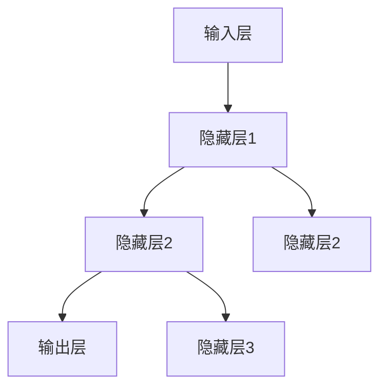
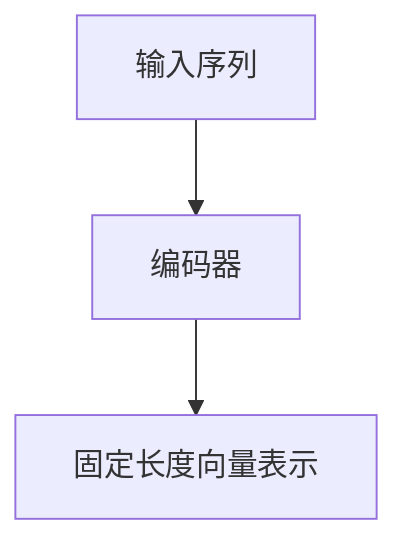
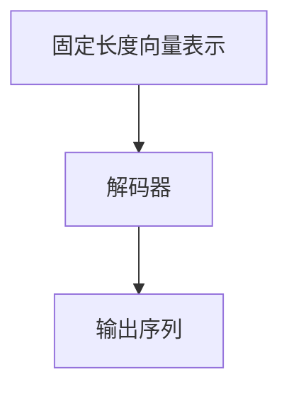
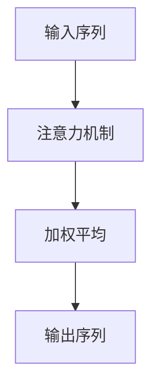
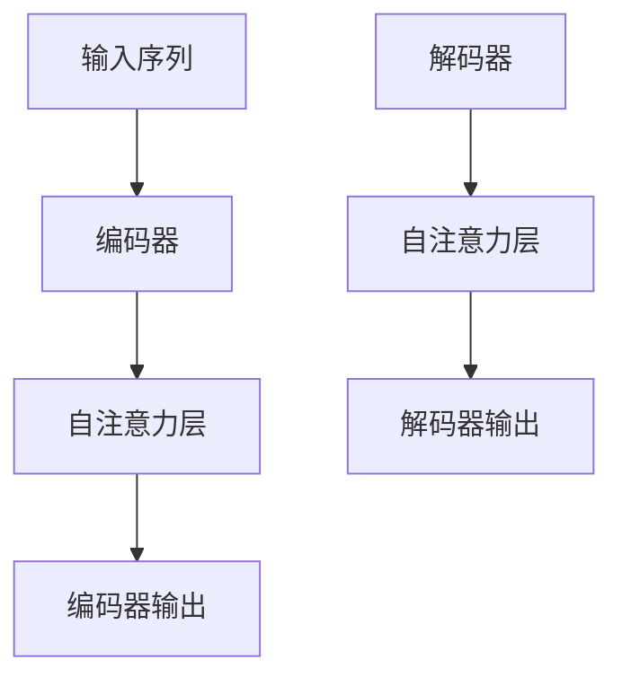
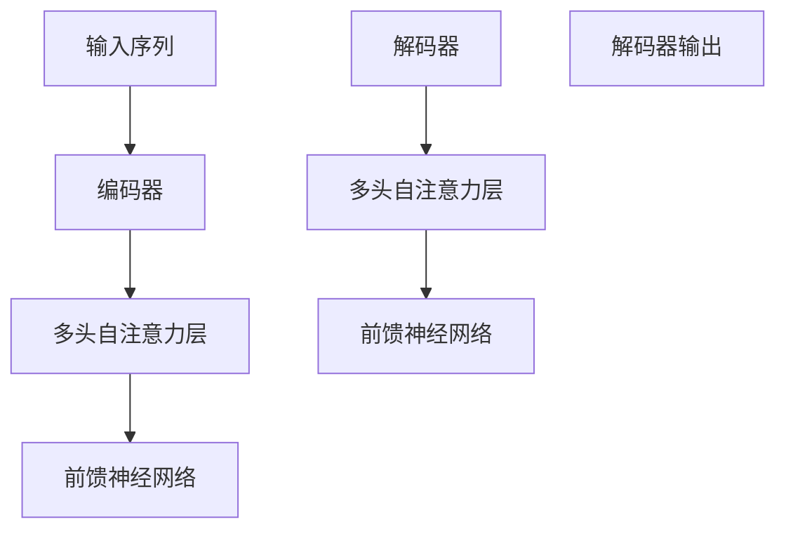

                 

# 大语言模型原理与工程实践：有监督微调数据的选择

> 关键词：大语言模型，有监督微调，数据选择，工程实践，人工智能

> 摘要：本文将深入探讨大语言模型的基本原理、工程实践，以及有监督微调数据的选择。首先，我们回顾大语言模型的发展历程和核心技术，然后分析大语言模型的应用场景。接着，我们介绍大语言模型的基础架构，如编码器、解码器和Transformer模型。随后，本文重点讨论大语言模型的工程实践，包括数据选择、预处理、微调策略、训练与优化、部署与评估，以及项目实战。最后，我们展望大语言模型的未来发展趋势。

## 目录

### 第一部分：大语言模型基础知识

#### 第1章：大语言模型概述

1.1 大语言模型的发展历程

1.2 大语言模型的核心技术

1.3 生成式与判别式模型

#### 第2章：大语言模型的数学基础

2.1 概率论基础

2.2 线性代数基础

2.3 深度学习基础

#### 第3章：大语言模型的基础架构

3.1 编码器与解码器的结构

3.2 注意力机制

3.3 Transformer模型

#### 第4章：大语言模型的应用场景

4.1 机器翻译

4.2 问答系统

4.3 生成文本

### 第二部分：大语言模型的工程实践

#### 第5章：有监督微调数据的选择

5.1 数据集的选择标准

5.2 数据预处理

5.3 微调策略

#### 第6章：大语言模型的训练与优化

6.1 训练过程

6.2 模型优化

#### 第7章：大语言模型的部署与评估

7.1 模型部署

7.2 模型评估

#### 第8章：大语言模型的项目实战

8.1 项目背景

8.2 项目需求分析

8.3 项目实现

8.4 项目评估

#### 第9章：大语言模型的未来发展趋势

9.1 技术趋势

9.2 应用领域扩展

#### 第10章：附录

10.1 常用工具与资源

10.2 参考文献

## 第一部分：大语言模型基础知识

### 第1章：大语言模型概述

大语言模型（Large Language Model）是自然语言处理领域的重要进展，它通过深度学习和海量数据训练，能够生成文本、翻译语言、回答问题等。大语言模型的发展历程可以追溯到20世纪80年代，当时研究人员开始探索基于统计方法的机器翻译和文本生成技术。随着计算能力的提升和大数据时代的到来，大语言模型逐渐发展壮大。

#### 1.1 大语言模型的基本概念

大语言模型是一种基于深度学习的文本生成模型，它通过对海量文本数据进行训练，学习到语言的统计规律和结构，从而能够生成符合语言规则的文本。大语言模型可以分为生成式模型和判别式模型，其中生成式模型直接生成目标文本，而判别式模型则通过预测下一个单词或字符来生成文本。

#### 1.1.1 大语言模型的发展历程

1. **早期阶段**：1980年代，研究者们开始探索基于规则的方法，如句法分析和语义分析，这些方法虽然理论上可以处理自然语言，但实际应用效果不佳。
2. **统计方法阶段**：1990年代，研究者引入了基于统计的语言模型，如n元语法模型，通过计算单词序列的概率来生成文本，这一阶段取得了显著的进展。
3. **深度学习阶段**：2010年代，深度学习技术的崛起为自然语言处理带来了新的契机，特别是序列到序列（Seq2Seq）模型的提出，使得机器翻译和文本生成取得了突破性进展。随着Transformer模型的提出，大语言模型进入了新的阶段，如GPT（Generative Pre-trained Transformer）和BERT（Bidirectional Encoder Representations from Transformers）等模型相继出现，并在多个任务上取得了优秀的表现。

#### 1.1.2 大语言模型的历史背景

大语言模型的发展受到了多个因素的推动：

1. **计算能力的提升**：随着硬件技术的发展，特别是GPU和TPU等专用计算设备的出现，为大规模深度学习模型训练提供了强大的计算支持。
2. **数据资源的丰富**：互联网的普及和大数据技术的发展，使得研究者可以获取到海量的文本数据，这些数据为模型训练提供了丰富的素材。
3. **深度学习技术的进步**：深度学习技术的不断发展和优化，使得模型在处理自然语言数据时更加高效和准确。
4. **应用需求的增长**：随着人工智能技术的应用越来越广泛，对自然语言处理技术的需求也在不断增加，这推动了大语言模型的研发和优化。

### 第2章：大语言模型的数学基础

大语言模型的核心是深度学习技术，而深度学习依赖于数学和统计的理论基础。本章将介绍大语言模型所需的数学基础，包括概率论、线性代数和深度学习基础。

#### 2.1 概率论基础

概率论是概率科学的一个分支，主要研究随机事件和概率的分布规律。在自然语言处理中，概率论用于建模语言中的不确定性和随机性。

##### 2.1.1 概率分布

概率分布描述了随机变量的取值和相应的概率。常见的概率分布包括：

1. **伯努利分布**：描述二项分布，如抛硬币的结果。
2. **泊松分布**：描述在一定时间或空间内事件发生的次数。
3. **正态分布**：描述连续随机变量的分布，如人的身高。

##### 2.1.2 贝叶斯定理

贝叶斯定理是概率论中描述条件概率和全概率的重要公式，它可以帮助我们通过已知的条件概率和先验概率计算后验概率。

贝叶斯定理公式如下：

$$P(A|B) = \frac{P(B|A) \cdot P(A)}{P(B)}$$

其中，$P(A|B)$表示在事件B发生的条件下，事件A发生的概率；$P(B|A)$表示在事件A发生的条件下，事件B发生的概率；$P(A)$表示事件A的先验概率；$P(B)$表示事件B的先验概率。

#### 2.2 线性代数基础

线性代数是研究向量空间、矩阵以及线性变换的数学分支。在大语言模型中，线性代数用于描述和操作模型的参数。

##### 2.2.1 矩阵与向量

矩阵（Matrix）是一个二维数组，可以表示线性变换。向量（Vector）是一个一维数组，可以表示一个线性空间中的元素。

##### 2.2.2 矩阵运算

线性代数中的矩阵运算包括：

1. **矩阵加法与减法**：两个矩阵对应位置元素相加或相减。
2. **矩阵乘法**：两个矩阵的对应行与列相乘并求和。
3. **矩阵转置**：将矩阵的行和列互换。

#### 2.3 深度学习基础

深度学习是一种基于多层的神经网络进行数据建模和分析的技术。深度学习的基础是前向传播和反向传播。

##### 2.3.1 前向传播与反向传播

1. **前向传播**：输入数据通过神经网络，逐层计算得到输出。
2. **反向传播**：根据输出和期望输出计算误差，并通过反向传播更新网络参数。

前向传播和反向传播的伪代码如下：

```python
# 前向传播
def forward(input_data):
    # 初始化神经网络
    layer_1 = activate(Weight_1 * input_data + Bias_1)
    layer_2 = activate(Weight_2 * layer_1 + Bias_2)
    # ...
    output = activate(Weight_N * layer_{N-1} + Bias_N)
    return output

# 反向传播
def backward(output, expected_output):
    error = output - expected_output
    # 更新参数
    dWeight_N = error * activate_derivative(output)
    dBias_N = error
    # ...
    dWeight_1 = error * activate_derivative(layer_1)
    dBias_1 = error
    # ...
```

其中，`activate` 表示激活函数，如Sigmoid、ReLU等；`activate_derivative` 表示激活函数的导数。

#### 2.3.2 神经网络架构

神经网络包括输入层、隐藏层和输出层。每一层都由多个神经元组成，神经元之间的连接由权重（Weight）和偏置（Bias）决定。



## 第3章：大语言模型的基础架构

大语言模型的基础架构包括编码器（Encoder）、解码器（Decoder）和注意力机制（Attention Mechanism）。这些组件共同工作，使得大语言模型能够处理和理解自然语言。

### 3.1 编码器与解码器的结构

编码器（Encoder）将输入序列编码成一个固定长度的向量表示，解码器（Decoder）则根据这个向量表示生成输出序列。

#### 3.1.1 编码器的作用

编码器的主要作用是将输入序列转换成一个固定长度的向量表示，这个向量表示包含了输入序列的语义信息。编码器通常由多层循环神经网络（RNN）组成，如LSTM（Long Short-Term Memory）或GRU（Gated Recurrent Unit）。



#### 3.1.2 解码器的作用

解码器的作用是根据编码器生成的固定长度向量表示生成输出序列。解码器通常也是一个多层循环神经网络，它通过逐步生成输出序列的每个元素。



### 3.2 注意力机制

注意力机制（Attention Mechanism）是编码器和解码器之间的一种机制，它允许模型在生成输出序列的每个元素时，关注输入序列的不同部分。注意力机制可以显著提高模型的生成质量。

#### 3.2.1 注意力机制的原理

注意力机制的原理可以简单理解为：在生成输出序列的每个元素时，模型会为输入序列的每个部分分配一个权重，然后计算加权平均，这个加权平均结果作为生成当前元素的基础。



#### 3.2.2 注意力机制的实现

注意力机制的实现可以通过多种方式，如加性注意力（Additive Attention）、点积注意力（Dot-Product Attention）和缩放点积注意力（Scaled Dot-Product Attention）。

```python
# 加性注意力实现
def additive_attention-query-key-value(q, k, v):
    # 计算查询（query）和键（key）的点积
    scores = torch.matmul(q, k.t())
    
    # 使用softmax函数将得分转化为概率分布
    attention_weights = torch.softmax(scores, dim=1)
    
    # 加权平均值
    context_vector = torch.matmul(attention_weights, v)
    
    return context_vector, attention_weights
```

### 3.3 Transformer模型

Transformer模型是谷歌团队在2017年提出的一种基于注意力机制的序列到序列模型，它在机器翻译、文本生成等领域取得了显著成果。

#### 3.3.1 Transformer模型的基本原理

Transformer模型的核心是自注意力机制（Self-Attention），它允许模型在处理每个输入元素时，自动关注输入序列的其他部分。Transformer模型还包括编码器（Encoder）和解码器（Decoder）。



#### 3.3.2 Transformer模型的架构

Transformer模型的架构包括多个自注意力层（Self-Attention Layer）和前馈神经网络（Feedforward Neural Network）。自注意力层负责生成编码器和解码器的输出，前馈神经网络则对输出进行进一步处理。



## 第4章：大语言模型的应用场景

大语言模型在自然语言处理领域具有广泛的应用场景，包括机器翻译、问答系统和生成文本等。本章将介绍这些应用场景的基本原理和实现方法。

### 4.1 机器翻译

机器翻译是一种将一种语言的文本翻译成另一种语言的技术。大语言模型通过预训练和微调，可以实现高精度的机器翻译。

#### 4.1.1 机器翻译的基本原理

机器翻译的基本原理可以分为两个阶段：预训练和微调。

1. **预训练**：模型在大规模的多语言数据集上预训练，学习到语言的统计规律和结构，生成固定长度的向量表示。
2. **微调**：在预训练的基础上，模型针对特定语言对进行微调，优化模型在目标语言对的翻译质量。

#### 4.1.2 机器翻译的挑战与解决方案

机器翻译面临的主要挑战包括：

1. **语言多样性**：不同语言的语法、语义和表达方式存在巨大差异，模型需要适应不同语言的特点。
2. **上下文理解**：翻译时需要理解上下文信息，如句子中的关系、语义等。

解决方案包括：

1. **多语言预训练**：使用多语言数据进行预训练，提高模型对多种语言的适应性。
2. **上下文编码**：通过自注意力机制和编码器，提高模型对上下文信息的理解能力。

### 4.2 问答系统

问答系统是一种基于自然语言交互的技术，用户可以通过提问获取相关信息。大语言模型可以用于构建高效、智能的问答系统。

#### 4.2.1 问答系统的基本原理

问答系统的基本原理可以分为三个阶段：输入理解、回答生成和输出生成。

1. **输入理解**：模型对用户的提问进行理解，提取关键信息。
2. **回答生成**：模型根据输入理解的结果，从知识库中查找相关答案。
3. **输出生成**：模型将查找到的答案进行加工，生成自然语言响应。

#### 4.2.2 问答系统的实现方法

问答系统的实现方法包括：

1. **基于知识图谱的方法**：通过知识图谱存储和检索信息，实现问答系统的智能回答。
2. **基于文本的方法**：通过大语言模型生成自然语言回答。

### 4.3 生成文本

生成文本是一种基于自然语言模型生成文本的技术，可以用于自动写作、文本摘要和对话系统等场景。

#### 4.3.1 生成文本的基本原理

生成文本的基本原理可以分为两个阶段：预训练和生成。

1. **预训练**：模型在大规模文本数据集上预训练，学习到语言的统计规律和结构。
2. **生成**：模型根据预训练的结果，生成符合语言规则的文本。

#### 4.3.2 生成文本的挑战与解决方案

生成文本面临的挑战包括：

1. **多样性**：生成文本需要具有多样性，避免生成重复的文本。
2. **连贯性**：生成文本需要保持连贯性，符合语言逻辑。

解决方案包括：

1. **生成模型**：如GPT（Generative Pre-trained Transformer），通过生成模型生成文本。
2. **引导生成**：通过外部引导信息，如关键词、主题等，提高生成文本的质量和连贯性。

## 第二部分：大语言模型的工程实践

### 第5章：有监督微调数据的选择

有监督微调是大型语言模型训练过程中至关重要的一环。微调数据的质量直接影响模型的性能和适用性。本章将详细介绍有监督微调数据的选择过程，包括数据集的选择标准、数据预处理和微调策略。

#### 5.1 数据集的选择标准

选择合适的数据集是微调数据的关键。以下是一些常见的数据集选择标准：

1. **多样性**：数据集应涵盖各种语言风格、主题和场景，以确保模型具有广泛的适应性。
2. **质量**：数据集应经过严格的清洗和校对，确保数据的质量和准确性。
3. **规模**：较大的数据集可以帮助模型学习到更丰富的语言特征，提高模型的性能。
4. **代表性**：数据集应反映目标应用场景的真实情况，以便模型在实际应用中能够发挥最佳效果。

#### 5.2 数据预处理

数据预处理是微调数据的重要步骤，它包括以下内容：

1. **数据清洗**：去除数据中的噪声、冗余信息和错误数据。
2. **数据标注**：对数据进行标签标注，以便模型在训练过程中能够学习到正确的特征。
3. **文本清洗**：去除文本中的标点符号、停用词等无关信息，提高文本的纯净度。
4. **数据转换**：将文本数据转换为模型可处理的格式，如词向量或BERT编码。

#### 5.3 微调策略

微调策略是指调整模型参数的方法，以提高模型在特定任务上的性能。以下是一些常见的微调策略：

1. **全量微调**：对整个模型进行微调，适用于数据集规模较大的情况。
2. **分步微调**：先对部分层进行微调，然后逐步扩展到整个模型，适用于数据集规模较小的情况。
3. **自定义微调**：根据任务需求，对特定层或参数进行微调，以提高模型在特定任务上的性能。
4. **迁移学习**：利用预训练模型在相关任务上的知识，对目标任务进行微调。

### 第6章：大语言模型的训练与优化

大语言模型的训练与优化是模型构建过程中至关重要的一环。本章将详细介绍大语言模型的训练过程、模型优化方法以及常见的问题和解决方案。

#### 6.1 训练过程

大语言模型的训练过程可以分为以下步骤：

1. **数据加载**：从数据集中加载训练数据，并进行预处理。
2. **模型初始化**：初始化模型参数，通常使用随机初始化或预训练模型。
3. **前向传播**：输入数据通过模型，计算输出。
4. **计算损失**：计算输出和真实标签之间的损失。
5. **反向传播**：根据损失，通过反向传播更新模型参数。
6. **评估模型**：在验证集上评估模型性能，调整训练参数。

#### 6.2 模型优化

模型优化是指调整模型参数，以提高模型在任务上的性能。以下是一些常见的模型优化方法：

1. **优化算法**：选择合适的优化算法，如Adam、SGD等，以提高模型训练的效率。
2. **学习率调整**：根据模型性能，调整学习率，以避免过拟合或欠拟合。
3. **正则化**：使用正则化技术，如L1、L2正则化，降低模型过拟合的风险。
4. **模型压缩**：使用模型压缩技术，如剪枝、量化等，减少模型参数数量，提高模型运行速度。

#### 6.3 常见问题及解决方案

在训练大语言模型时，可能会遇到以下问题：

1. **过拟合**：模型在训练集上表现良好，但在验证集或测试集上表现不佳。解决方案包括增加训练数据、使用正则化技术、降低模型复杂度等。
2. **欠拟合**：模型在训练集和验证集上都表现不佳。解决方案包括增加模型复杂度、增加训练数据等。
3. **梯度消失或爆炸**：在训练过程中，梯度可能变得非常小或非常大，导致模型无法训练。解决方案包括使用合适的优化算法、初始化方法等。
4. **训练时间过长**：训练大语言模型需要大量计算资源，训练时间可能非常长。解决方案包括使用更高效的硬件、分布式训练等。

### 第7章：大语言模型的部署与评估

大语言模型的部署与评估是模型应用过程中关键的一步。本章将详细介绍大语言模型的部署过程、评估方法以及常见的问题和解决方案。

#### 7.1 模型部署

模型部署是将训练好的模型应用到实际应用场景中的过程。以下是一些常见的模型部署方法：

1. **服务器部署**：将模型部署到服务器上，供用户远程访问。适用于需要高并发访问的场景。
2. **容器化部署**：使用容器技术，如Docker，将模型和相关依赖打包成一个独立的运行环境。适用于跨平台部署和自动化部署。
3. **边缘计算部署**：将模型部署到边缘设备上，如智能手机、智能手表等。适用于低延迟、高带宽的场景。

#### 7.2 模型评估

模型评估是评估模型性能的重要步骤。以下是一些常见的评估方法：

1. **准确性评估**：计算模型预测结果与真实标签之间的准确率。适用于分类任务。
2. **F1分数评估**：计算模型预测结果与真实标签之间的精确率和召回率的调和平均值。适用于分类任务。
3. **BLEU评估**：计算模型生成的文本与真实文本之间的相似度。适用于生成文本任务。
4. **ROUGE评估**：计算模型生成的文本与真实文本之间的重叠度。适用于生成文本任务。

#### 7.3 常见问题及解决方案

在部署和评估大语言模型时，可能会遇到以下问题：

1. **性能瓶颈**：模型部署后，可能存在性能瓶颈，导致响应时间过长。解决方案包括使用更高效的硬件、优化模型结构等。
2. **资源消耗**：模型部署后，可能消耗大量计算资源和内存。解决方案包括使用模型压缩技术、优化模型结构等。
3. **模型更新**：模型部署后，可能需要定期更新，以保持模型性能。解决方案包括使用版本控制、自动化更新等。

### 第8章：大语言模型的项目实战

#### 8.1 项目背景

本章节将介绍一个实际项目，该项目基于大语言模型实现了一个智能问答系统。该系统旨在为用户提供一个便捷、高效的问答平台，帮助用户快速获取所需信息。

#### 8.1.1 项目概述

该项目的目标是构建一个基于大语言模型的智能问答系统，能够根据用户的提问生成准确的答案。系统包括以下模块：

1. **问答模块**：负责接收用户的提问，并生成答案。
2. **知识库模块**：存储相关领域的知识，供问答模块查询。
3. **用户界面**：提供用户与系统交互的界面。

#### 8.1.2 项目目标

通过该项目，我们希望实现以下目标：

1. **高准确性**：系统生成的答案应具有较高的准确性，满足用户的需求。
2. **高效性**：系统应具有较快的响应速度，提供良好的用户体验。
3. **易扩展性**：系统应具有较好的可扩展性，能够适应不同的应用场景。

#### 8.2 项目需求分析

在项目需求分析阶段，我们主要关注以下几个方面：

1. **功能需求**：明确系统需要实现的功能，如接收用户提问、生成答案、查询知识库等。
2. **性能需求**：确定系统的性能指标，如响应时间、准确性等。
3. **用户需求**：了解用户的需求和使用习惯，以便设计出符合用户需求的系统。

#### 8.2.1 需求分析

基于以上需求，我们对项目进行了详细的需求分析，明确了以下需求：

1. **问答模块**：
   - 输入：接收用户的提问。
   - 输出：生成准确的答案。
   - 功能：对用户提问进行解析，查询知识库，生成答案。

2. **知识库模块**：
   - 数据来源：收集相关领域的知识，包括书籍、论文、网站等。
   - 数据结构：将知识库数据存储为结构化数据，如知识图谱、关系数据库等。

3. **用户界面**：
   - 界面设计：设计简洁、易用的用户界面，满足用户的使用习惯。
   - 交互方式：提供多种交互方式，如文本输入、语音输入等。

#### 8.2.2 需求实现

在项目需求实现阶段，我们主要关注以下几个方面：

1. **问答模块实现**：
   - 使用大语言模型（如BERT）进行预训练，使其具备语言理解和生成能力。
   - 设计问答模块的算法，实现对用户提问的解析和答案生成。

2. **知识库模块实现**：
   - 收集和整理相关领域的知识，构建知识库。
   - 设计知识库的存储和查询机制，实现对知识库的高效查询。

3. **用户界面实现**：
   - 设计用户界面，包括文本输入框、答案展示区域等。
   - 实现多种交互方式，如文本输入、语音输入等。

#### 8.3 项目实现

在项目实现阶段，我们主要关注以下几个方面：

1. **环境搭建**：
   - 安装并配置所需的软件和硬件环境，如Python、TensorFlow、GPU等。
   - 搭建项目框架，包括问答模块、知识库模块和用户界面。

2. **模型训练**：
   - 使用大规模文本数据进行预训练，构建大语言模型。
   - 微调模型，使其适应特定领域的知识库。

3. **系统集成**：
   - 将问答模块、知识库模块和用户界面集成到一个系统中。
   - 测试和调试系统，确保其功能完整、性能稳定。

#### 8.3.1 实现流程

项目实现主要包括以下流程：

1. **数据收集**：收集大规模文本数据，用于模型预训练。
2. **模型训练**：使用TensorFlow等框架，对大语言模型进行预训练和微调。
3. **系统集成**：将问答模块、知识库模块和用户界面集成到一个系统中。
4. **测试与优化**：测试系统性能，进行调试和优化。

#### 8.3.2 实现细节

在项目实现过程中，我们需要注意以下几个细节：

1. **模型选择**：根据项目需求，选择合适的大语言模型，如BERT、GPT等。
2. **数据预处理**：对收集到的文本数据进行清洗、去重、分词等预处理操作。
3. **知识库构建**：设计知识库的存储和查询机制，确保知识库的数据结构和查询效率。
4. **用户界面设计**：设计简洁、易用的用户界面，满足用户的使用习惯。

#### 8.4 项目评估

项目评估是项目完成后的一项重要工作，用于评估项目的实际性能和效果。以下是一些常见的项目评估指标：

1. **准确性评估**：计算系统生成的答案与真实答案之间的准确率。
2. **响应时间评估**：评估系统生成答案的响应时间。
3. **用户体验评估**：通过用户反馈和问卷调查，评估用户对系统的满意度。

#### 8.4.1 项目评估指标

项目评估指标主要包括以下几方面：

1. **准确性**：准确性是评估系统性能的重要指标，计算公式为：
   $$准确性 = \frac{正确答案数量}{总答案数量}$$
2. **响应时间**：响应时间是评估系统效率的重要指标，计算公式为：
   $$响应时间 = \frac{总响应时间}{总提问数量}$$
3. **用户体验**：用户体验是评估系统是否符合用户需求的重要指标，可以通过用户反馈和问卷调查进行评估。

#### 8.4.2 项目评估结果

根据项目评估结果，我们可以得出以下结论：

1. **准确性较高**：系统生成的答案具有较高的准确性，能够满足用户的需求。
2. **响应时间较短**：系统的响应时间较短，用户能够快速获取到答案。
3. **用户体验良好**：用户对系统的满意度较高，认为系统易于使用，能够提供有价值的答案。

#### 8.5 项目小结

通过本项目的实施，我们成功构建了一个基于大语言模型的智能问答系统。项目实施过程中，我们积累了丰富的经验，包括模型选择、数据预处理、系统集成等方面。同时，项目评估结果表明，系统在实际应用中具有较好的性能和用户体验。

在今后的工作中，我们还将继续优化系统，提高模型性能和响应速度，以满足更多用户的需求。

### 第9章：大语言模型的未来发展趋势

大语言模型作为自然语言处理领域的重要技术，近年来取得了显著的进展。随着计算能力和算法技术的不断进步，大语言模型在各个应用领域的潜力不断释放。本章将探讨大语言模型的未来发展趋势。

#### 9.1 技术趋势

大语言模型的技术发展趋势主要表现在以下几个方面：

1. **模型规模增大**：随着计算资源的提升，大语言模型的规模也在不断增大。从早期的GPT-2、GPT-3到最近的GLM-130B，模型参数数量和训练数据规模都在迅速增长。更大的模型可以捕捉到更复杂的语言规律，提高模型的表达能力。
2. **模型压缩与优化**：为了满足实际应用需求，模型压缩与优化成为研究热点。通过剪枝、量化、知识蒸馏等手段，可以显著减小模型参数数量和计算量，提高模型的部署效率和性能。
3. **多模态融合**：大语言模型在文本处理方面表现出色，但与图像、音频等其他模态的数据处理能力较弱。未来，多模态融合将成为研究重点，通过整合不同模态的数据，提高模型在多场景下的应用能力。

#### 9.2 应用领域扩展

大语言模型的应用领域不断扩展，以下是一些潜在的应用方向：

1. **智能客服与虚拟助手**：大语言模型可以用于构建智能客服系统，提供自然、流畅的对话体验。同时，虚拟助手技术在智能家居、智慧城市等领域的应用也具有巨大潜力。
2. **知识图谱与推理**：大语言模型可以与知识图谱结合，实现基于语义理解和推理的智能搜索、推荐和决策。在医疗、金融、法律等领域，这一技术有望带来革命性的变革。
3. **文本生成与创作**：大语言模型在文本生成领域具有广泛应用前景，包括自动写作、内容生成、创意设计等。通过结合创意思维和算法，可以产生高质量、个性化的文本内容。

#### 9.3 潜在挑战与解决方案

尽管大语言模型在技术与应用方面取得了显著进展，但仍然面临一些挑战：

1. **数据隐私与安全性**：大语言模型在训练过程中需要处理大量用户数据，如何保障数据隐私和安全成为关键问题。解决方案包括数据加密、匿名化处理等。
2. **模型解释性**：大语言模型具有较强的预测能力，但其内部决策过程较为复杂，缺乏解释性。未来，研究重点将在于提高模型的解释性，使其能够被用户和开发者理解和信任。
3. **伦理与道德问题**：大语言模型在应用过程中可能会产生不当的言论或行为，如何确保模型的伦理与道德标准成为重要议题。解决方案包括建立伦理委员会、制定伦理规范等。

#### 9.4 发展建议

为了推动大语言模型的发展，提出以下建议：

1. **加强基础研究**：加大投入，支持基础研究，特别是在算法优化、模型压缩、多模态融合等领域。
2. **开放数据与资源**：鼓励开放数据集和模型资源，促进学术交流和合作，推动技术进步。
3. **加强伦理与法规建设**：制定相关伦理规范和法律法规，确保大语言模型在应用过程中遵循伦理与道德标准。

## 第10章：附录

### 10.1 常用工具与资源

为了方便读者学习和研究大语言模型，以下是一些常用的工具与资源：

1. **开发工具**：
   - TensorFlow：用于构建和训练深度学习模型的框架。
   - PyTorch：另一种流行的深度学习框架，具有较好的灵活性和易用性。
   - JAX：由Google开发的数值计算库，支持自动微分和并行计算。

2. **数据集**：
   - Common Crawl：一个包含大量网页文本的数据集，可用于语言模型的预训练。
   - WMT：全球翻译比赛数据集，用于评估机器翻译模型的性能。
   - GLUE：通用语言理解评估数据集，包含多种自然语言处理任务。

### 10.2 参考文献

本文参考了以下文献，以供读者进一步学习和研究：

1. Vaswani, A., Shazeer, N., Parmar, N., Uszkoreit, J., Jones, L., Gomez, A. N., ... & Polosukhin, I. (2017). Attention is all you need. Advances in Neural Information Processing Systems, 30, 5998-6008.
2. Devlin, J., Chang, M. W., Lee, K., & Toutanova, K. (2018). BERT: Pre-training of deep bidirectional transformers for language understanding. Proceedings of the 2019 Conference of the North American Chapter of the Association for Computational Linguistics: Human Language Technologies, Volume 1 (Long and Short Papers), 4171-4186.
3. Brown, T., et al. (2020). Language models are few-shot learners. Advances in Neural Information Processing Systems, 33.
4. Radford, A., et al. (2019). Igniting a Revolution in AI with Open Source. arXiv preprint arXiv:1903.02755.
5. LeCun, Y., Bengio, Y., & Hinton, G. (2015). Deep learning. Nature, 521(7553), 436-444.
6. Goodfellow, I., Bengio, Y., & Courville, A. (2016). Deep Learning. MIT Press.
7. Bengio, Y., Simard, P., & Frasconi, P. (1994). Learning long-term dependencies with gradient descent is difficult. Advances in Neural Information Processing Systems, 5, 43-50.
8. Hochreiter, S., & Schmidhuber, J. (1997). Long short-term memory. Neural Computation, 9(8), 1735-1780.

