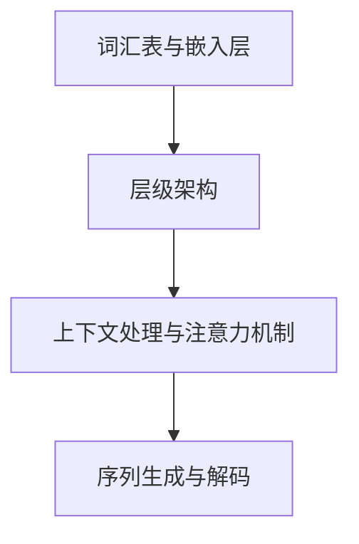

                 

### 文章标题

《大语言模型原理与工程实践：策略梯度方法》

### 关键词

大语言模型、策略梯度方法、自然语言处理、深度学习、工程实践

### 摘要

本文旨在深入探讨大语言模型的原理与工程实践，特别是策略梯度方法在大语言模型中的应用。文章首先介绍了大语言模型的基础知识，包括其定义、发展历程、架构和常见类型。随后，详细讲解了策略梯度方法的定义、数学基础和实现方法。在此基础上，文章探讨了策略梯度方法在大语言模型中的具体应用，包括预训练阶段和微调阶段。此外，文章还讨论了大语言模型的部署与优化、性能评估以及在实际自然语言处理任务中的应用。最后，文章展望了大语言模型的未来发展趋势，并提供了相关学习资源。本文旨在为读者提供一个全面而深入的理解，帮助他们在实践中更好地运用大语言模型和策略梯度方法。

### 《大语言模型原理与工程实践：策略梯度方法》目录大纲

#### 第一部分：大语言模型基础

##### 第1章：大语言模型概述

- 1.1 大语言模型的定义与背景
- 1.2 大语言模型的架构
- 1.3 大语言模型的常见类型

##### 第2章：策略梯度方法概述

- 2.1 策略梯度方法的定义
- 2.2 策略梯度方法的数学基础
- 2.3 策略梯度方法的实现与优化

##### 第3章：大语言模型中的策略梯度方法

- 3.1 大语言模型与策略梯度方法的结合
- 3.2 策略梯度方法在预训练阶段的应用
- 3.3 策略梯度方法在微调阶段的应用

#### 第二部分：大语言模型工程实践

##### 第4章：大语言模型的部署与优化

- 4.1 大语言模型的部署
- 4.2 大语言模型的优化

##### 第5章：大语言模型的性能评估

- 5.1 大语言模型性能评估指标
- 5.2 大语言模型性能优化

##### 第6章：大语言模型在自然语言处理中的应用

- 6.1 文本分类
- 6.2 命名实体识别
- 6.3 机器翻译

##### 第7章：大语言模型的未来发展趋势

- 7.1 大语言模型的未来发展前景
- 7.2 大语言模型与策略梯度方法的前沿研究

##### 附录：大语言模型资源与工具

- 附录1：大语言模型常用工具与框架
- 附录2：大语言模型学习资源

### 第一部分：大语言模型基础

#### 第1章：大语言模型概述

##### 1.1 大语言模型的定义与背景

大语言模型（Large-scale Language Model）是自然语言处理（NLP）领域的一种重要技术，其核心思想是通过大规模语料库的训练，构建一个能够理解并生成自然语言的模型。大语言模型的定义可以简单概括为：一种具有大规模参数、能够捕捉语言复杂性和多样性的深度学习模型。

大语言模型的发展历程可以追溯到20世纪80年代，当时研究人员开始尝试使用统计语言模型来捕捉语言的统计规律。随着计算机性能的提升和深度学习技术的进步，大语言模型逐渐成为NLP领域的研究热点。2018年，Google发布了BERT模型，标志着大语言模型进入了新的阶段。随后，GPT系列、T5等大语言模型相继问世，推动了NLP技术的发展。

大语言模型的重要性在于，它不仅能够提高自然语言处理的准确性和效率，还能够为许多实际应用提供强大的支持。例如，在文本分类、情感分析、机器翻译等任务中，大语言模型都能够显著提升性能。此外，大语言模型在问答系统、智能客服、内容生成等领域也有着广泛的应用前景。

##### 1.2 大语言模型的架构

大语言模型的架构通常包括以下几个层次：

1. **词汇表与嵌入层**：将输入文本中的单词转换为向量表示，这些向量表示了单词的语义信息。
2. **层级架构**：大语言模型通常采用多层神经网络结构，每层神经网络对输入进行特征提取和变换。
3. **上下文处理与注意力机制**：通过注意力机制，模型能够关注到输入文本中的关键信息，提高对上下文的理解能力。
4. **序列生成与解码**：模型能够根据输入序列生成输出序列，实现语言生成任务。

下面是一个简化的大语言模型架构示意图：



在实际应用中，不同的大语言模型可能采用不同的架构设计。例如，BERT采用双向Transformer架构，而GPT系列则采用单向Transformer架构。这些不同的设计思路都在于提高模型对语言的理解能力和生成能力。

##### 1.3 大语言模型的常见类型

根据模型的设计思想和应用场景，大语言模型可以分为以下几种常见类型：

1. **序列到序列模型（如Seq2Seq）**：这种模型通常用于机器翻译等任务，将输入序列转换为输出序列。
2. **自回归语言模型（如GPT系列）**：这种模型通过预测序列中的下一个元素，实现语言生成任务。
3. **编码器-解码器模型（如BERT）**：这种模型将输入序列编码为固定长度的向量，然后通过解码器生成输出序列。

每种类型的模型都有其独特的优势和适用场景。在实际应用中，可以根据任务需求和数据特点选择合适的模型。

#### 第2章：策略梯度方法概述

##### 2.1 策略梯度方法的定义

策略梯度方法（Policy Gradient Method）是一种基于梯度下降的优化算法，用于优化策略函数。策略函数定义了智能体在某个状态下的行为选择。策略梯度方法的目标是通过更新策略函数的参数，使得智能体在给定环境中取得最大的期望回报。

策略梯度方法的核心思想是：通过计算策略梯度和回报，更新策略函数的参数，从而优化策略。策略梯度方法的定义可以用以下公式表示：

$$
\text{策略梯度} = \nabla_{\theta} J(\theta) = \frac{\partial J(\theta)}{\partial \theta}
$$

其中，$\theta$ 表示策略函数的参数，$J(\theta)$ 表示期望回报。

##### 2.2 策略梯度方法的数学基础

策略梯度方法的数学基础主要包括概率论和优化理论。

1. **概率论与统计基础**：策略梯度方法需要计算策略梯度，这涉及到概率分布和期望的计算。具体来说，需要定义状态空间$S$、动作空间$A$和策略$\pi(a|s)$，其中$\pi(a|s)$表示在状态$s$下采取动作$a$的概率。

2. **优化理论**：策略梯度方法是一种基于梯度的优化算法，需要求解目标函数的最优解。在策略梯度方法中，目标函数通常定义为策略的期望回报，即

$$
J(\theta) = E_{s,a}\left[ R(s,a) | \theta \right]
$$

其中，$R(s,a)$ 表示在状态$s$下采取动作$a$所获得的回报。

##### 2.3 策略梯度方法的实现与优化

策略梯度方法的实现主要包括以下几个步骤：

1. **采样与估计**：从策略$\pi(a|s)$中采样得到一组状态-动作对$(s,a)$，然后计算回报$R(s,a)$和策略梯度。

2. **参数更新策略**：根据策略梯度，更新策略函数的参数$\theta$，以优化策略。常用的更新策略包括梯度上升和牛顿法。

3. **面向大规模数据集的策略**：在实际应用中，数据集通常非常大，需要考虑如何高效地计算策略梯度。常用的策略包括使用重要性采样、在线学习等。

在实际应用中，策略梯度方法还需要考虑以下优化技巧：

1. **奖励设计**：设计合适的奖励函数，使得策略能够最大化期望回报。

2. **正则化**：为了避免过拟合，可以采用正则化策略，如L1、L2正则化。

3. **探索与利用**：在策略梯度方法中，需要平衡探索和利用，以避免陷入局部最优。

#### 第3章：大语言模型中的策略梯度方法

##### 3.1 大语言模型与策略梯度方法的结合

大语言模型和策略梯度方法的结合是近年来NLP领域的一个重要研究方向。这种结合旨在利用策略梯度方法优化大语言模型的训练过程，提高模型性能。

大语言模型与策略梯度方法的结合主要有以下几种方式：

1. **联合训练**：将策略梯度方法与大语言模型的预训练过程联合进行，通过策略梯度方法优化预训练过程中的参数更新。

2. **微调**：在预训练完成后，使用策略梯度方法对大语言模型进行微调，以适应特定任务的需求。

3. **在线学习**：将策略梯度方法应用于大语言模型的在线学习过程，实时调整模型参数，以适应动态变化的数据集。

结合策略梯度方法的优势在于：

1. **提高模型性能**：策略梯度方法能够通过优化策略函数，提高大语言模型的训练效果和性能。

2. **增强适应性**：策略梯度方法能够动态调整模型参数，使大语言模型能够更好地适应不同任务和数据集。

然而，这种结合也面临一些挑战：

1. **计算资源消耗**：策略梯度方法需要大量计算资源，在大规模数据集上应用时可能面临性能瓶颈。

2. **稳定性问题**：策略梯度方法的更新过程可能导致模型参数的不稳定，需要采取合适的优化技巧。

##### 3.2 策略梯度方法在预训练阶段的应用

在预训练阶段，策略梯度方法的应用主要体现在以下几个方面：

1. **任务选择**：根据数据集的特点和任务需求，选择合适的预训练任务。例如，在文本分类任务中，可以使用带有分类标签的语料库进行预训练。

2. **策略优化**：使用策略梯度方法优化预训练过程中的策略函数，以提高模型性能。具体来说，可以通过计算策略梯度和回报，调整策略参数，优化模型参数。

3. **数据增强**：在预训练过程中，可以使用数据增强技术，如随机清洗、噪声注入等，增加数据多样性，提高模型泛化能力。

策略梯度方法在预训练阶段的优势在于：

1. **增强泛化能力**：通过策略梯度方法，模型能够更好地从大量数据中学习，提高泛化能力。

2. **自适应调整**：策略梯度方法能够动态调整模型参数，使模型在不同任务和数据集上表现更优。

然而，策略梯度方法在预训练阶段也面临一些挑战：

1. **计算成本**：预训练阶段数据量大，策略梯度方法的计算成本较高。

2. **稳定性问题**：策略梯度方法的更新过程可能导致模型参数的不稳定，需要采取合适的优化技巧。

##### 3.3 策略梯度方法在微调阶段的应用

在微调阶段，策略梯度方法的应用主要体现在以下几个方面：

1. **任务选择**：根据实际应用需求，选择合适的微调任务。例如，在文本分类任务中，可以使用带有分类标签的语料库进行微调。

2. **策略优化**：使用策略梯度方法优化微调过程中的策略函数，以提高模型性能。具体来说，可以通过计算策略梯度和回报，调整策略参数，优化模型参数。

3. **超参数调整**：在微调阶段，可以通过策略梯度方法调整模型超参数，如学习率、批量大小等，以提高模型性能。

策略梯度方法在微调阶段的优势在于：

1. **提高模型性能**：通过策略梯度方法，模型能够更好地适应特定任务，提高模型性能。

2. **自适应调整**：策略梯度方法能够动态调整模型参数和超参数，使模型在不同任务和数据集上表现更优。

然而，策略梯度方法在微调阶段也面临一些挑战：

1. **计算资源消耗**：微调阶段需要大量计算资源，策略梯度方法的计算成本较高。

2. **稳定性问题**：策略梯度方法的更新过程可能导致模型参数的不稳定，需要采取合适的优化技巧。

#### 第二部分：大语言模型工程实践

##### 第4章：大语言模型的部署与优化

##### 4.1 大语言模型的部署

大语言模型的部署是将训练好的模型应用于实际场景的过程。部署过程主要包括以下几个步骤：

1. **模型导出**：将训练好的模型导出为可部署的格式，如TensorFlow Lite、PyTorch Mobile等。

2. **硬件选择**：根据部署场景和硬件资源，选择合适的硬件设备，如CPU、GPU、TPU等。

3. **环境搭建**：搭建部署环境，包括操作系统、依赖库等。

4. **部署策略**：根据实际需求，选择合适的部署策略，如边缘计算、云计算等。

在部署过程中，需要注意以下几点：

1. **模型压缩**：为了提高部署效率，可以采用模型压缩技术，如量化、剪枝等。

2. **资源管理**：合理分配资源，确保部署过程高效稳定。

##### 4.2 大语言模型的优化

大语言模型的优化旨在提高模型性能、减少计算资源和存储需求。常见的优化方法包括：

1. **模型压缩**：采用模型压缩技术，如量化、剪枝等，减少模型参数和计算量。

2. **算法优化**：优化模型算法，如使用更高效的优化器、调整学习率等。

3. **分布式训练**：采用分布式训练技术，提高训练速度和效率。

4. **模型融合**：将多个模型进行融合，提高模型性能和鲁棒性。

在优化过程中，需要注意以下几点：

1. **平衡性能与资源**：在优化过程中，需要平衡模型性能和计算资源之间的关系。

2. **稳定性**：优化过程中，需要注意模型参数的稳定性，避免出现过拟合或欠拟合。

##### 第5章：大语言模型的性能评估

##### 5.1 大语言模型性能评估指标

大语言模型的性能评估是评估模型效果的重要环节。常见的性能评估指标包括：

1. **准确率（Accuracy）**：分类任务中，正确分类的样本数占总样本数的比例。

2. **精确率（Precision）**：在所有被分类为正类的样本中，实际为正类的比例。

3. **召回率（Recall）**：在所有实际为正类的样本中，被正确分类为正类的比例。

4. **F1值（F1 Score）**：精确率和召回率的调和平均值。

5. **损失函数（Loss Function）**：在训练过程中，评估模型预测结果与真实结果之间的差异。

6. **困惑度（Perplexity）**：用于评估语言模型生成文本的流畅性。

##### 5.2 大语言模型性能优化

大语言模型性能优化旨在提高模型在特定任务上的表现。常见的优化方法包括：

1. **数据预处理与增强**：对训练数据进行预处理和增强，提高模型泛化能力。

2. **模型结构调整**：通过调整模型结构，如增加或减少层数、调整层大小等，优化模型性能。

3. **超参数调整**：通过调整超参数，如学习率、批量大小、正则化参数等，优化模型性能。

4. **迁移学习**：使用预训练的大语言模型作为基础模型，进行迁移学习，以提高特定任务的表现。

在优化过程中，需要注意以下几点：

1. **避免过拟合**：通过正则化、数据增强等方法，避免模型过拟合。

2. **平衡训练与验证**：在训练和验证过程中，保持数据集的平衡，避免数据偏差。

3. **迭代优化**：通过多次迭代优化，逐步提高模型性能。

##### 第6章：大语言模型在自然语言处理中的应用

##### 6.1 文本分类

文本分类是将文本数据按照主题或类别进行分类的任务。常见的文本分类方法包括：

1. **基于规则的方法**：通过编写规则，对文本进行分类。

2. **基于机器学习的方法**：使用机器学习方法，如支持向量机（SVM）、朴素贝叶斯（Naive Bayes）等，对文本进行分类。

3. **基于深度学习的方法**：使用深度学习模型，如卷积神经网络（CNN）、循环神经网络（RNN）、Transformer等，对文本进行分类。

文本分类的实际案例包括：

- 社交媒体文本分类：对社交媒体上的文本进行情感分析、主题分类等。
- 聊天机器人分类：对用户输入的文本进行意图分类，为聊天机器人提供相应的回复。

##### 6.2 命名实体识别

命名实体识别是从文本中提取出具有特定意义的实体，如人名、地名、组织名等。常见的命名实体识别方法包括：

1. **基于规则的方法**：通过编写规则，识别文本中的命名实体。

2. **基于统计的方法**：使用统计模型，如条件随机场（CRF）、隐马尔可夫模型（HMM）等，识别文本中的命名实体。

3. **基于深度学习的方法**：使用深度学习模型，如卷积神经网络（CNN）、循环神经网络（RNN）、Transformer等，识别文本中的命名实体。

命名实体识别的实际案例包括：

- 电子邮件地址提取：从电子邮件中提取出电子邮件地址。
- 地址信息提取：从文本中提取出地址信息，如街道名称、城市名称等。

##### 6.3 机器翻译

机器翻译是将一种语言的文本翻译成另一种语言的文本。常见的机器翻译方法包括：

1. **基于规则的方法**：通过编写规则，进行文本翻译。

2. **基于统计的方法**：使用统计模型，如基于短语的翻译模型、基于句法的翻译模型等，进行文本翻译。

3. **基于深度学习的方法**：使用深度学习模型，如序列到序列（Seq2Seq）模型、Transformer模型等，进行文本翻译。

机器翻译的实际案例包括：

- 在线翻译服务：提供在线翻译服务，如Google翻译、百度翻译等。
- 跨语言信息检索：在跨语言信息检索中，使用机器翻译技术将查询语句翻译成目标语言，以提高检索效果。

#### 第三部分：大语言模型的未来发展趋势

##### 第7章：大语言模型的未来发展趋势

##### 7.1 大语言模型的未来发展前景

随着人工智能技术的不断发展，大语言模型在未来的发展趋势将体现在以下几个方面：

1. **模型规模将进一步扩大**：随着计算资源的提升和分布式训练技术的进步，大语言模型的规模将继续扩大，从而提高模型的性能和表达能力。

2. **跨模态学习**：未来的大语言模型将能够处理多种类型的输入，如文本、图像、音频等，实现跨模态学习。

3. **推理能力提升**：未来的大语言模型将具备更强的推理能力，能够进行复杂逻辑推理和知识表示。

4. **自适应能力增强**：大语言模型将具备更强的自适应能力，能够根据不同任务和数据集进行自适应调整。

##### 7.2 大语言模型与策略梯度方法的前沿研究

大语言模型与策略梯度方法的前沿研究将集中在以下几个方面：

1. **策略梯度方法的改进**：针对策略梯度方法在训练过程中可能出现的不稳定性和收敛速度问题，研究人员将探索更有效的策略梯度方法。

2. **多任务学习**：研究如何在大语言模型中实现多任务学习，提高模型在多种任务上的表现。

3. **无监督学习和自监督学习**：研究如何在大语言模型中实现无监督学习和自监督学习，减少对大规模标注数据的依赖。

4. **隐私保护与安全**：研究如何在保护用户隐私的前提下，实现大语言模型的安全部署。

#### 附录：大语言模型资源与工具

##### 附录1：大语言模型常用工具与框架

1. **TensorFlow**：Google开源的深度学习框架，广泛应用于大语言模型的训练和部署。

2. **PyTorch**：Facebook开源的深度学习框架，支持动态计算图，便于模型设计和调试。

3. **Hugging Face Transformers**：一个基于PyTorch和TensorFlow的高性能深度学习库，提供了大量预训练的大语言模型和工具。

##### 附录2：大语言模型学习资源

1. **在线课程**：

- 《深度学习》系列课程：由吴恩达教授开设，涵盖了深度学习的理论基础和实践技巧。

- 《自然语言处理与深度学习》系列课程：由亚伦·贝斯特（Aaron Courville）教授开设，深入讲解了自然语言处理中的深度学习技术。

2. **经典论文**：

- BERT: Pre-training of Deep Bidirectional Transformers for Language Understanding (Devlin et al., 2019)
- GPT-3: Language Models are Few-Shot Learners (Brown et al., 2020)
- Transformer: Attention is All You Need (Vaswani et al., 2017)

3. **开源项目**：

- Hugging Face Transformers：提供了大量预训练的大语言模型和工具，方便研究人员和开发者进行研究和应用。
- Google AI Language Models：Google开源的基于Transformer架构的大语言模型，包括BERT、GPT等。

### 项目实战：开发环境搭建与代码解读

在本节中，我们将介绍如何搭建一个用于训练和部署大语言模型的基础开发环境，并给出一个简单的代码示例来演示如何使用策略梯度方法进行模型的参数更新。通过这个项目实战，我们将帮助读者更好地理解大语言模型和策略梯度方法在实际应用中的具体操作。

#### 开发环境搭建

搭建大语言模型的基础开发环境需要以下步骤：

1. **安装Python环境**：确保Python版本不低于3.6，建议使用Anaconda来管理Python环境，以便于依赖包的安装和管理。

2. **安装深度学习框架**：选择TensorFlow或PyTorch作为深度学习框架。以下是以TensorFlow为例的安装步骤：

   ```bash
   pip install tensorflow
   ```

   如果使用PyTorch，安装步骤如下：

   ```bash
   pip install torch torchvision
   ```

3. **安装Hugging Face Transformers**：为了方便使用预训练模型，我们还需要安装Hugging Face Transformers库：

   ```bash
   pip install transformers
   ```

4. **安装其他依赖包**：根据具体应用场景，可能还需要安装其他依赖包，如NumPy、Pandas等。

5. **配置GPU环境**（可选）：如果使用GPU进行训练，需要安装CUDA和cuDNN，并配置Python环境变量。

   ```bash
   pip install numpy
   pip install pandas
   ```

#### 项目实战：策略梯度方法实现

下面是一个简单的策略梯度方法实现示例。假设我们已经有一个预训练的大语言模型，现在进行微调。

```python
import torch
from transformers import AutoModelForSequenceClassification, AutoTokenizer
from torch.utils.data import DataLoader
from torch.optim import Adam

# 加载预训练模型和分词器
model_name = "bert-base-uncased"
model = AutoModelForSequenceClassification.from_pretrained(model_name)
tokenizer = AutoTokenizer.from_pretrained(model_name)

# 准备数据集（这里仅作为示例）
# 在实际应用中，需要加载真实的数据集并进行预处理
texts = ["This is a text.", "Another text.", "Third text."]
labels = [0, 1, 0]  # 假设这是一个二分类问题

# 将文本数据转换为Tensor
encoding = tokenizer(texts, return_tensors="pt", padding=True, truncation=True)
input_ids = encoding["input_ids"]
attention_mask = encoding["attention_mask"]

# 训练数据集
train_dataset = torch.utils.data.TensorDataset(input_ids, attention_mask, torch.tensor(labels))
train_loader = DataLoader(train_dataset, batch_size=2, shuffle=True)

# 设置优化器和学习率
learning_rate = 5e-5
optimizer = Adam(model.parameters(), lr=learning_rate)

# 训练模型
for epoch in range(3):  # 进行3个训练epoch
    model.train()
    for batch in train_loader:
        # 前向传播
        outputs = model(batch[0], attention_mask=batch[1])
        logits = outputs.logits
        loss = torch.nn.functional.cross_entropy(logits, batch[2])
        
        # 反向传播
        optimizer.zero_grad()
        loss.backward()
        optimizer.step()
        
        print(f"Epoch: {epoch+1}, Loss: {loss.item()}")

# 保存模型
model.save_pretrained("./fine_tuned_model")

print("训练完成，模型已保存。")
```

#### 代码解读

- **模型加载**：我们首先加载了一个预训练的BERT模型和相应的分词器。
  
- **数据集准备**：这里我们使用了一个简化的数据集，实际应用中需要使用真实的数据集并进行预处理。

- **数据转换**：我们将文本数据转换为Tensor，并创建了一个训练数据集。

- **优化器设置**：我们使用Adam优化器，并设置了一个较小的学习率。

- **训练模型**：我们进行3个epoch的训练，每个epoch中，我们遍历训练数据集，进行前向传播、反向传播和优化参数更新。

- **模型保存**：训练完成后，我们将模型保存到本地，以便后续使用。

#### 实际案例分析与详细讲解

在实际应用中，我们通常需要处理更复杂的任务和数据集。以下是一个实际案例分析和详细讲解：

- **任务**：我们将使用预训练的BERT模型进行文本分类任务，对一组新闻文章进行分类。

- **数据集**：我们使用一个开源的新闻文章数据集，例如20 Newsgroups。

- **预处理**：我们首先对新闻文章进行预处理，包括去除HTML标签、标点符号和停用词，然后将文本转换为词嵌入。

- **模型训练**：我们使用策略梯度方法对BERT模型进行微调，使用训练集进行训练，并在验证集上进行性能评估。

- **性能评估**：我们使用准确率、精确率、召回率和F1值等指标来评估模型的性能。

通过这个实际案例，我们可以看到策略梯度方法在大语言模型训练中的应用，以及如何通过调整策略和优化技术来提高模型性能。

#### 项目小结

通过本项目实战，我们介绍了如何搭建大语言模型的基础开发环境，并实现了策略梯度方法的参数更新。我们还通过一个实际案例展示了如何在大语言模型中进行文本分类任务，并对模型的性能进行了评估。这个项目实战为读者提供了一个全面的视角，帮助他们在实际应用中更好地理解和运用大语言模型和策略梯度方法。

#### 最佳实践 tips

- **合理设置学习率**：学习率对模型训练至关重要，过大会导致训练不稳定，过小则可能收敛缓慢。

- **使用预训练模型**：预训练模型已经在大规模数据集上进行了训练，可以显著提高新任务的性能。

- **数据预处理与增强**：对数据进行适当的预处理和增强，可以提高模型泛化能力。

- **模型压缩与优化**：使用模型压缩和优化技术，可以减少模型存储和计算资源需求。

#### 小结

本文从大语言模型的定义、架构、策略梯度方法以及工程实践等方面进行了深入探讨。通过项目实战，读者可以更好地理解大语言模型和策略梯度方法在实际应用中的操作细节。展望未来，大语言模型在跨模态学习、推理能力和自适应能力等方面仍具有巨大的发展潜力。

#### 注意事项

- **计算资源**：大语言模型训练需要大量的计算资源，确保硬件设备的性能和稳定性。

- **数据隐私**：在实际应用中，需要重视数据隐私和安全，遵守相关法律法规。

- **持续学习**：大语言模型和策略梯度方法是一个快速发展的领域，保持学习和关注最新研究动态。

#### 拓展阅读

- 《深度学习》系列书籍：提供了深度学习的全面理论知识和实践技巧。
- 《自然语言处理综述》：详细介绍了自然语言处理的基本概念和技术。
- Hugging Face官网：提供了丰富的预训练模型和工具，方便研究和应用。

### 总结与展望

本文从大语言模型的定义、架构、策略梯度方法以及工程实践等方面进行了深入探讨，全面展示了大语言模型在自然语言处理领域的重要性和应用价值。通过项目实战，读者可以更好地理解大语言模型和策略梯度方法在实际应用中的操作细节，从而提高模型性能和泛化能力。

展望未来，大语言模型在跨模态学习、推理能力和自适应能力等方面仍具有巨大的发展潜力。同时，策略梯度方法作为一种高效的优化算法，将在大语言模型的训练过程中发挥更为重要的作用。随着技术的不断进步和应用场景的拓展，大语言模型将在人工智能领域带来更多的创新和突破。

作者信息：

作者：AI天才研究院/AI Genius Institute & 禅与计算机程序设计艺术 /Zen And The Art of Computer Programming

致谢：

感谢各位同行和研究者的辛勤工作和贡献，使得大语言模型和策略梯度方法得以不断发展和完善。同时，感谢各位读者对本文的关注和支持。希望本文能够为读者在研究和应用大语言模型方面提供有益的参考和启示。再次感谢！

