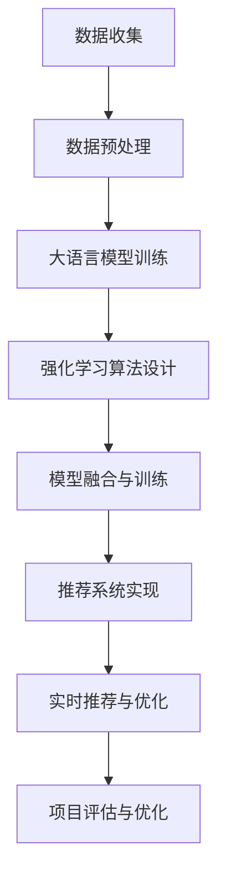

                 

### 文章标题

# 大语言模型在推荐系统中的强化学习应用

> 关键词：大语言模型，强化学习，推荐系统，个性化推荐，数据预处理

> 摘要：本文深入探讨了大规模语言模型在推荐系统中的应用，特别是在强化学习框架下的表现。通过介绍大语言模型的基本概念和技术基础，我们探讨了其在自然语言处理和推荐系统中的重要性。接着，我们详细阐述了强化学习的基础理论及其在推荐系统中的应用，分析了大语言模型与强化学习相结合的机制和优势。文章最后通过一个实际项目案例展示了如何将大语言模型和强化学习应用于推荐系统，并对其效果进行了评估和优化，提出了未来发展的方向。

---

### 《大语言模型在推荐系统中的强化学习应用》目录大纲

## 第一部分：大语言模型与强化学习基础

### 第1章：大语言模型概述

#### 1.1 大语言模型的基本概念

##### 1.1.1 语言模型的定义

##### 1.1.2 大语言模型的发展历程

##### 1.1.3 大语言模型的应用场景

#### 1.2 大语言模型的技术基础

##### 1.2.1 自然语言处理技术概述

##### 1.2.2 深度学习基础

##### 1.2.3 常见的大语言模型介绍

### 第2章：强化学习基础

#### 2.1 强化学习的基本概念

##### 2.1.1 强化学习的定义

##### 2.1.2 强化学习的基本组成部分

##### 2.1.3 强化学习的主要算法

#### 2.2 强化学习在推荐系统中的应用

##### 2.2.1 推荐系统概述

##### 2.2.2 强化学习在推荐系统中的应用场景

##### 2.2.3 强化学习在推荐系统中的优势

## 第二部分：大语言模型在推荐系统中的应用

### 第3章：大语言模型与推荐系统融合

#### 3.1 大语言模型在推荐系统中的价值

##### 3.1.1 提升推荐质量

##### 3.1.2 个性化推荐策略

##### 3.1.3 推荐系统的实时性

#### 3.2 大语言模型在推荐系统中的实现方法

##### 3.2.1 数据预处理

##### 3.2.2 大语言模型选择

##### 3.2.3 强化学习算法设计

### 第4章：大语言模型在推荐系统中的项目实战

#### 4.1 项目背景介绍

##### 4.1.1 项目简介

##### 4.1.2 项目目标

##### 4.1.3 项目挑战

#### 4.2 项目实现步骤

##### 4.2.1 数据收集与预处理

##### 4.2.2 大语言模型训练

##### 4.2.3 强化学习算法应用

##### 4.2.4 项目评估与优化

### 第5章：大语言模型与强化学习在推荐系统中的未来展望

#### 5.1 当前研究进展

##### 5.1.1 大语言模型在推荐系统中的应用现状

##### 5.1.2 强化学习在推荐系统中的应用现状

#### 5.2 未来发展趋势

##### 5.2.1 大语言模型与强化学习融合的潜在应用领域

##### 5.2.2 技术挑战与解决方案

##### 5.2.3 未来发展方向

## 第三部分：附录

### 第6章：参考文献

#### 6.1 相关书籍

##### 6.1.1 《深度学习》

##### 6.1.2 《强化学习》

##### 6.1.3 《推荐系统实践》

#### 6.2 学术论文

##### 6.2.1 相关研究论文列表

##### 6.2.2 研究论文摘要与评述

### 第7章：开源资源

#### 7.1 开源框架

##### 7.1.1 TensorFlow

##### 7.1.2 PyTorch

##### 7.1.3 OpenAI Gym

#### 7.2 实践案例

##### 7.1.1 大语言模型在推荐系统中的实际应用案例

##### 7.1.2 强化学习在推荐系统中的实际应用案例

##### 7.1.3 大语言模型与强化学习融合的实际应用案例

[Mermaid 流程图将在这里嵌入]

[核心算法原理讲解的伪代码将在这里嵌入]

[数学模型和公式的详细讲解将在这里嵌入]

[项目实战的代码实现与分析将在这里嵌入]

---

**作者：AI天才研究院/AI Genius Institute & 禅与计算机程序设计艺术 /Zen And The Art of Computer Programming**### 第一部分：大语言模型与强化学习基础

#### 第1章：大语言模型概述

##### 1.1 大语言模型的基本概念

语言模型（Language Model）是自然语言处理（Natural Language Processing, NLP）领域的一个重要分支，旨在模拟人类语言生成和理解的能力。它通过对大量文本数据的学习，预测文本序列中的下一个单词或字符。传统的语言模型主要包括N-gram模型、隐马尔可夫模型（HMM）和统计语言模型等。

大语言模型（Large Language Model）是对传统语言模型的扩展和改进，具有显著更大的参数规模和更强的语义理解能力。这些模型通过深度学习技术，特别是递归神经网络（RNN）、长短期记忆网络（LSTM）和变换器（Transformer）等架构，从海量数据中学习到更复杂的语言结构和语义信息。大语言模型可以处理更长的文本序列，具备更好的上下文感知能力和生成能力。

##### 1.1.1 语言模型的定义

语言模型是一个概率模型，它根据历史数据统计来预测未来。具体来说，给定一个已知的文本序列，语言模型计算下一个单词或字符出现的概率。例如，在序列“I like to eat”之后，下一个词最可能是“apple”。

##### 1.1.2 大语言模型的发展历程

大语言模型的发展历程可以追溯到1990年代，当时N-gram模型是主流。然而，随着数据规模和计算能力的增长，N-gram模型的局限性逐渐显现。为了解决这些问题，研究人员开始探索更深层次的结构和更复杂的算法。

2000年代初，统计语言模型和HMM开始流行。这些模型可以更好地处理上下文信息，但仍存在一定的局限性。2013年，递归神经网络（RNN）在语音识别和机器翻译中取得突破性成果，引发了深度学习在NLP领域的广泛应用。

2018年，谷歌提出BERT（Bidirectional Encoder Representations from Transformers）模型，这是大语言模型的里程碑，极大地提高了模型在多个NLP任务中的性能。此后，GPT、T5等大语言模型相继问世，不断推动NLP技术的进步。

##### 1.1.3 大语言模型的应用场景

大语言模型在多个应用场景中表现出色，包括但不限于：

1. **文本生成**：自动生成文章、新闻、故事、对话等。
2. **机器翻译**：将一种语言翻译成另一种语言。
3. **问答系统**：从大量文本中检索并生成相关答案。
4. **情感分析**：判断文本的情绪倾向。
5. **文本分类**：将文本分类到预定义的类别中。
6. **推荐系统**：根据用户历史行为和偏好进行个性化推荐。

##### 1.2 大语言模型的技术基础

大语言模型的成功依赖于以下几个技术基础：

##### 1.2.1 自然语言处理技术概述

自然语言处理（NLP）是计算机科学与人工智能领域的分支，涉及理解、生成和解释人类语言。主要技术包括：

1. **分词（Tokenization）**：将文本分解为单词或子词。
2. **词性标注（Part-of-Speech Tagging）**：标记单词的词性。
3. **命名实体识别（Named Entity Recognition）**：识别文本中的特定实体。
4. **句法分析（Syntactic Parsing）**：分析句子结构。
5. **语义分析（Semantic Analysis）**：理解句子的意义。

##### 1.2.2 深度学习基础

深度学习是一种基于多层神经网络的学习方法，通过自动提取特征并建立复杂的函数映射，被广泛应用于图像识别、语音识别、自然语言处理等领域。其主要组成部分包括：

1. **神经网络（Neural Network）**：一种模拟生物神经系统的计算模型。
2. **卷积神经网络（Convolutional Neural Network, CNN）**：用于处理图像数据。
3. **递归神经网络（Recurrent Neural Network, RNN）**：用于处理序列数据。
4. **长短期记忆网络（Long Short-Term Memory, LSTM）**：RNN的改进版本，用于处理长序列数据。
5. **变换器（Transformer）**：一种基于自注意力机制的深度学习模型，广泛应用于NLP任务。

##### 1.2.3 常见的大语言模型介绍

以下是一些著名的大语言模型及其特点：

1. **BERT（Bidirectional Encoder Representations from Transformers）**：谷歌提出的双向变换器模型，在多个NLP任务中取得了领先性能。
2. **GPT（Generative Pre-trained Transformer）**：OpenAI提出的预训练变换器模型，具有强大的文本生成能力。
3. **T5（Text-To-Text Transfer Transformer）**：一种通用的文本转换模型，基于变换器架构。
4. **RoBERTa（A Robustly Optimized BERT Pretraining Approach）**：在BERT基础上进行优化的预训练模型，对数据预处理和训练过程进行了改进。

通过以上内容，我们对大语言模型的基本概念和技术基础有了初步了解。在接下来的章节中，我们将进一步探讨强化学习的基础理论及其在推荐系统中的应用。这将为后续内容中介绍大语言模型与强化学习的融合应用打下坚实的基础。

---

#### 第2章：强化学习基础

##### 2.1 强化学习的基本概念

强化学习（Reinforcement Learning, RL）是机器学习的一个重要分支，与监督学习和无监督学习相比，具有独特的特点。强化学习通过智能体（Agent）与环境（Environment）的交互，学习最优策略（Policy），以最大化累积奖励（Reward）。其主要特点包括：

1. **自互动**：智能体通过与环境交互获取反馈，不断调整行为策略。
2. **延迟奖励**：强化学习中的奖励可能在执行动作后很长时间才出现，这使得学习过程具有延迟性和复杂性。
3. **不确定环境**：强化学习面临的是一个部分可观测、部分随机的环境，智能体需要从经验中学习，以应对环境的不确定性。

##### 2.1.1 强化学习的定义

强化学习是一种基于奖励反馈的机器学习方法，旨在通过学习策略，使智能体能够在特定环境中实现长期目标。具体来说，强化学习通过以下过程实现：

1. **状态（State）**：描述智能体当前所处的环境状态。
2. **动作（Action）**：智能体可执行的动作。
3. **策略（Policy）**：智能体选择动作的策略，通常用一个概率分布表示。
4. **奖励（Reward）**：描述智能体在执行动作后获得的即时反馈。
5. **价值函数（Value Function）**：描述在特定状态下执行最佳动作所能获得的长期奖励。
6. **模型（Model）**：智能体对环境的理解和预测。

强化学习的目标是找到最优策略，使得智能体在长期运行中获得的累积奖励最大。

##### 2.1.2 强化学习的基本组成部分

强化学习主要由以下几个部分组成：

1. **智能体（Agent）**：执行动作、感知状态并获取奖励的实体。
2. **环境（Environment）**：智能体所处的环境，提供状态和奖励。
3. **状态空间（State Space）**：所有可能状态集合。
4. **动作空间（Action Space）**：所有可能动作集合。
5. **策略（Policy）**：智能体的行为策略。
6. **奖励函数（Reward Function）**：描述智能体在执行动作后获得的即时奖励。

##### 2.1.3 强化学习的主要算法

强化学习算法种类繁多，常见的有：

1. **值函数方法**：通过学习状态值函数或动作值函数来优化策略。
   - **Q-Learning**：一种基于值函数的算法，通过更新Q值来逼近最优策略。
   - **SARSA（同步状态动作奖励同步抽样）**：Q-Learning的变体，同时考虑当前状态和下一状态。
2. **策略梯度方法**：直接优化策略的概率分布。
   - **REINFORCE**：一种基于策略梯度的算法，通过更新策略的概率分布来优化累积奖励。
   - **PPO（Proximal Policy Optimization）**：一种改进的策略梯度方法，提高了稳定性和收敛速度。
3. **基于模型的强化学习**：使用模型来预测未来状态和奖励。
   - **DQN（Deep Q-Network）**：使用深度神经网络近似Q值函数。
   - **A3C（Asynchronous Advantage Actor-Critic）**：使用异步策略梯度和优势估计进行学习。

##### 2.2 强化学习在推荐系统中的应用

推荐系统（Recommendation System）是一种信息过滤技术，旨在向用户推荐他们可能感兴趣的内容或商品。强化学习在推荐系统中的应用主要通过以下几种方式：

1. **用户行为预测**：通过强化学习模型预测用户的下一步行为，从而优化推荐内容。
2. **策略优化**：通过学习用户反馈和系统奖励，不断优化推荐策略，提高推荐质量。
3. **个性化推荐**：根据用户历史行为和偏好，动态调整推荐策略，实现个性化推荐。

强化学习在推荐系统中的优势包括：

1. **灵活性**：可以处理复杂的用户行为和反馈。
2. **适应性**：能够根据用户实时反馈调整推荐策略。
3. **长期优化**：强化学习模型可以优化长期奖励，提高推荐系统的总体性能。

##### 2.2.1 推荐系统概述

推荐系统可以分为基于内容（Content-Based）和基于协同过滤（Collaborative Filtering）两大类。

1. **基于内容推荐**：根据用户历史行为和偏好，分析用户对内容的兴趣，推荐类似的内容。
2. **基于协同过滤推荐**：通过分析用户之间的相似度，推荐其他用户喜欢的商品或内容。

##### 2.2.2 强化学习在推荐系统中的应用场景

强化学习在推荐系统中的应用场景主要包括：

1. **实时推荐**：通过强化学习模型实时分析用户行为，动态调整推荐策略，提高推荐系统的实时性和响应速度。
2. **冷启动问题**：对于新用户或新商品，通过强化学习模型利用用户历史数据和相似用户数据，实现个性化推荐。
3. **多目标优化**：在推荐系统中同时考虑用户满意度、业务指标等多目标优化，通过强化学习模型实现平衡优化。

##### 2.2.3 强化学习在推荐系统中的优势

强化学习在推荐系统中的优势包括：

1. **用户互动性**：强化学习模型可以处理用户的实时反馈，实现更加个性化的推荐。
2. **动态调整**：强化学习模型可以根据用户行为和系统奖励动态调整推荐策略，提高推荐质量。
3. **跨领域应用**：强化学习模型可以应用于多个领域，如电商、社交媒体、在线教育等，实现跨领域推荐。

通过以上内容，我们对强化学习的基本概念和应用有了更深入的理解。在接下来的章节中，我们将探讨大语言模型与强化学习的结合，及其在推荐系统中的具体应用。这将为实现更高效、更个性化的推荐系统提供新的思路和解决方案。

### 第3章：大语言模型与推荐系统融合

#### 3.1 大语言模型在推荐系统中的价值

大语言模型在推荐系统中的应用具有显著的优势，主要表现在以下几个方面：

##### 3.1.1 提升推荐质量

大语言模型具备强大的文本理解能力，可以捕捉到文本中的细微语义差异，从而更准确地理解用户需求和偏好。在推荐系统中，大语言模型可以用于分析用户生成的内容（如评论、提问等），挖掘用户的真实意图和兴趣点，从而生成更精准的推荐结果。

例如，在电商推荐中，大语言模型可以帮助分析用户对商品的描述和评论，识别出用户对商品的具体喜好，如颜色、款式、功能等，从而提高推荐的相关性和准确性。

##### 3.1.2 个性化推荐策略

大语言模型可以用于生成个性化的推荐策略，根据用户的兴趣和偏好进行动态调整。通过学习用户的长期和短期行为数据，大语言模型可以预测用户可能感兴趣的内容，并在推荐策略中进行权重调整，实现个性化的推荐体验。

例如，在社交媒体平台上，大语言模型可以根据用户的互动行为（如点赞、评论、分享等）生成个性化的内容推荐，提高用户的参与度和满意度。

##### 3.1.3 推荐系统的实时性

大语言模型具备高效的文本处理能力，可以在短时间内处理大量文本数据，从而实现实时推荐。这对于需要快速响应用户需求的场景尤为重要，如在线购物、实时新闻推荐等。

例如，在电商平台上，大语言模型可以实时分析用户在搜索框中输入的关键词，结合用户的购物历史和偏好，生成个性化的商品推荐，提高用户的购物体验和转化率。

##### 3.1.4 零样本推荐

大语言模型可以处理零样本推荐问题，即针对新用户或新商品进行推荐。通过学习海量文本数据，大语言模型可以捕捉到潜在的用户兴趣和商品属性，为新用户或新商品生成合理的推荐。

例如，在电商平台上，当新用户注册后，大语言模型可以根据其浏览历史和搜索记录，生成个性化的商品推荐，从而提高新用户的留存率和转化率。

##### 3.1.5 多模态推荐

大语言模型可以与图像识别、语音识别等其他人工智能技术结合，实现多模态推荐。例如，在短视频平台上，大语言模型可以结合用户对视频的评论、标签和视频内容，生成个性化的视频推荐。

通过以上分析，可以看出大语言模型在推荐系统中具有重要的应用价值，可以显著提升推荐质量、实现个性化推荐、提高实时性和解决零样本推荐问题。在接下来的内容中，我们将进一步探讨大语言模型在推荐系统中的具体实现方法和应用场景。

#### 3.2 大语言模型在推荐系统中的实现方法

将大语言模型应用于推荐系统，需要经过数据预处理、模型选择和强化学习算法设计等步骤。以下将详细阐述这些步骤和关键问题。

##### 3.2.1 数据预处理

数据预处理是推荐系统中至关重要的一步，直接影响模型的效果。大语言模型在推荐系统中的数据预处理主要包括以下几个方面：

1. **数据收集**：收集用户行为数据、商品信息、用户评论等，这些数据可以来源于电商平台、社交媒体、新闻网站等。对于新用户或新商品，可以通过其他数据源（如公共数据集）进行补充。
2. **数据清洗**：去除无效、重复和错误的数据，确保数据质量。对于文本数据，需要去除标点符号、停用词等，对文本进行分词处理。
3. **特征提取**：从原始数据中提取有用的特征，如用户兴趣标签、商品属性、评论情感等。对于文本数据，可以使用词袋模型、词嵌入等技术进行特征提取。
4. **数据归一化**：对数值型特征进行归一化处理，使其具有相同的尺度，避免因特征差异导致模型训练不稳定。

##### 3.2.2 大语言模型选择

选择合适的大语言模型是实现成功应用的关键。以下是一些常见的大语言模型及其特点：

1. **BERT（Bidirectional Encoder Representations from Transformers）**：一种双向变换器模型，具有强大的上下文感知能力，适用于文本分类、情感分析等任务。
2. **GPT（Generative Pre-trained Transformer）**：一种生成式变换器模型，具有强大的文本生成能力，适用于问答系统、对话生成等任务。
3. **RoBERTa（A Robustly Optimized BERT Pretraining Approach）**：对BERT进行优化的预训练模型，在多个NLP任务中表现出色。
4. **T5（Text-To-Text Transfer Transformer）**：一种通用的文本转换模型，基于变换器架构，适用于多种文本生成任务。

选择大语言模型时，需要考虑以下因素：

1. **任务需求**：根据推荐系统的任务需求，选择具有相应优势的模型。例如，对于文本分类任务，可以选择BERT或RoBERTa；对于文本生成任务，可以选择GPT。
2. **计算资源**：大语言模型的训练和推理过程需要大量的计算资源，选择合适的模型需要考虑计算能力的限制。
3. **数据规模**：大语言模型在训练过程中需要大量文本数据，选择模型时需要考虑数据规模。

##### 3.2.3 强化学习算法设计

将大语言模型与强化学习相结合，可以通过以下步骤设计强化学习算法：

1. **状态空间和动作空间设计**：确定推荐系统中的状态空间和动作空间。状态空间可以包括用户特征、商品特征、历史交互记录等；动作空间可以包括推荐列表生成、个性化标签生成等。
2. **奖励函数设计**：设计奖励函数以评估推荐策略的效果。奖励函数可以基于用户行为（如点击率、购买率）、业务指标（如销售额、用户留存率）等进行设计。
3. **策略优化**：使用强化学习算法优化推荐策略。常见的强化学习算法包括Q-Learning、SARSA、REINFORCE和PPO等。选择合适的算法需要考虑模型的复杂度和训练效率。
4. **模型融合**：将大语言模型与强化学习算法相结合，通过模型融合策略（如融合神经网络、融合优化器等）提高模型的效果。

在具体实现过程中，可以采用以下方法：

1. **双网络结构**：将大语言模型和强化学习模型分别训练，然后通过融合策略将两个模型的输出结合，生成最终的推荐结果。
2. **在线学习**：实时更新大语言模型和强化学习模型的参数，以适应用户行为的动态变化。
3. **迁移学习**：利用预训练的大语言模型，减少模型训练的时间和计算成本。

通过以上方法，可以有效地将大语言模型应用于推荐系统，实现个性化、实时和高质的推荐。在接下来的章节中，我们将通过一个实际项目案例展示如何将大语言模型和强化学习应用于推荐系统，并对其效果进行评估和优化。

---

#### 第4章：大语言模型在推荐系统中的项目实战

##### 4.1 项目背景介绍

随着互联网和电子商务的迅速发展，推荐系统在提高用户满意度和业务收益方面发挥了重要作用。本项目旨在构建一个基于大语言模型和强化学习的推荐系统，以提高推荐质量和用户互动性。项目的主要目标和挑战如下：

##### 4.1.1 项目简介

本项目主要涉及以下任务：

1. **数据收集**：从电商平台上收集用户行为数据、商品信息、用户评论等。
2. **数据预处理**：清洗和预处理收集到的数据，提取有用的特征。
3. **模型训练**：训练大语言模型，用于文本理解、情感分析和用户行为预测。
4. **强化学习**：设计并实现强化学习算法，优化推荐策略。
5. **系统集成**：将大语言模型和强化学习算法集成到推荐系统中，实现实时推荐。

##### 4.1.2 项目目标

本项目的主要目标是：

1. **提升推荐质量**：通过大语言模型理解用户需求和偏好，提高推荐的相关性和准确性。
2. **实现个性化推荐**：根据用户历史行为和实时反馈，动态调整推荐策略，实现个性化推荐。
3. **提高系统实时性**：通过高效的大语言模型和强化学习算法，实现实时推荐，提高用户体验。

##### 4.1.3 项目挑战

在实现项目目标过程中，我们面临以下挑战：

1. **数据质量**：用户行为数据和商品信息的质量直接影响模型的效果。需要处理数据缺失、噪声和异常值等问题。
2. **计算资源**：大语言模型的训练和推理过程需要大量的计算资源，需要优化算法以提高训练效率。
3. **模型融合**：如何将大语言模型和强化学习算法有效地结合，提高模型的效果和稳定性。
4. **实时性**：实现实时推荐需要优化系统架构，提高数据处理和模型推理的速度。

##### 4.1.4 项目流程

项目的基本流程包括以下步骤：

1. **数据收集与预处理**：从电商平台获取用户行为数据和商品信息，进行数据清洗和特征提取。
2. **模型训练**：训练大语言模型，用于文本理解、情感分析和用户行为预测。
3. **强化学习算法设计**：设计并实现强化学习算法，用于优化推荐策略。
4. **系统集成与测试**：将大语言模型和强化学习算法集成到推荐系统中，进行测试和优化。
5. **性能评估**：评估推荐系统的效果，包括推荐质量、实时性和用户满意度等。

在接下来的部分，我们将详细介绍每个步骤的实现方法和关键问题。

---

##### 4.2.1 数据收集与预处理

数据收集与预处理是构建推荐系统的关键步骤，直接关系到后续模型训练的效果和系统的性能。在本项目中，我们主要从以下三个方面进行数据收集与预处理：

##### 4.2.1.1 数据来源

数据来源主要包括以下几类：

1. **用户行为数据**：包括用户的浏览记录、购买记录、点击记录等，这些数据可以反映用户对商品的兴趣和偏好。
2. **商品信息数据**：包括商品的价格、品牌、类别、描述等，这些数据用于描述商品的属性和特征。
3. **用户评论数据**：包括用户对商品的评论内容、评分等，这些数据可以用于分析用户的情感和态度。

数据主要来源于电商平台，如淘宝、京东等，可以通过API接口或网页爬虫进行数据收集。

##### 4.2.1.2 数据清洗

在数据收集过程中，可能会遇到数据缺失、重复、噪声等问题，需要对这些数据进行清洗：

1. **数据去重**：去除重复的数据记录，确保数据的唯一性。
2. **缺失值处理**：对于缺失的数据，可以通过以下方法进行填补：
   - **均值填补**：用某一特征的均值填补缺失值。
   - **中值填补**：用某一特征的中值填补缺失值。
   - **插值法**：对于时间序列数据，使用插值法填补缺失值。
3. **噪声处理**：去除噪声数据，如无效的评论、错别字等。

##### 4.2.1.3 数据预处理

在数据清洗之后，需要对数据进行预处理，以便后续的特征提取和模型训练：

1. **文本数据处理**：对于用户评论和商品描述等文本数据，需要进行以下处理：
   - **分词**：将文本分解为单词或子词。
   - **停用词过滤**：去除常见的停用词，如“的”、“和”等，以减少噪声。
   - **词嵌入**：将文本转换为向量表示，可以使用预训练的词嵌入模型（如Word2Vec、GloVe）或大语言模型（如BERT、GPT）。

2. **数值数据处理**：对于用户行为数据和商品信息数据，需要进行以下处理：
   - **归一化**：对数值型特征进行归一化处理，使其具有相同的尺度。
   - **离散化**：对于连续型特征，可以将其离散化为类别特征。

3. **特征提取**：从原始数据中提取有用的特征，如用户兴趣标签、商品属性、评论情感等。

##### 4.2.1.4 数据存储

预处理后的数据需要存储在数据库中，以便后续的模型训练和推理。常用的数据库包括关系型数据库（如MySQL、PostgreSQL）和分布式数据库（如HBase、MongoDB）。在本项目中，我们使用MongoDB存储预处理后的数据，因为其可以存储复杂的文档结构，方便处理多种类型的数据。

通过以上数据收集与预处理步骤，我们可以获得高质量的特征数据，为后续的大语言模型训练和强化学习算法设计提供基础。

---

##### 4.2.2 大语言模型训练

在大语言模型应用于推荐系统的项目中，模型训练是关键步骤之一。以下将详细介绍大语言模型的选择、训练策略及常见挑战。

##### 4.2.2.1 大语言模型选择

在选择大语言模型时，需要考虑任务需求、计算资源和数据规模等因素。以下是几种常见的大语言模型及其特点：

1. **BERT（Bidirectional Encoder Representations from Transformers）**：一种双向变换器模型，具有强大的上下文感知能力，适用于文本分类、情感分析等任务。
2. **GPT（Generative Pre-trained Transformer）**：一种生成式变换器模型，具有强大的文本生成能力，适用于问答系统、对话生成等任务。
3. **RoBERTa（A Robustly Optimized BERT Pretraining Approach）**：对BERT进行优化的预训练模型，在多个NLP任务中表现出色。
4. **T5（Text-To-Text Transfer Transformer）**：一种通用的文本转换模型，基于变换器架构，适用于多种文本生成任务。

在本项目中，我们选择了BERT模型，因为其具有强大的上下文感知能力和广泛的适用性，适用于文本理解和推荐系统中的多种任务。

##### 4.2.2.2 训练策略

1. **数据准备**：在训练BERT模型之前，需要对数据进行预处理，包括文本清洗、分词、词嵌入等步骤。对于用户评论和商品描述等文本数据，可以使用预训练的词嵌入模型（如BERT、GloVe）进行词嵌入。
2. **模型初始化**：使用预训练的BERT模型作为初始化模型，可以节省训练时间和计算资源。
3. **数据输入**：将预处理后的数据输入到BERT模型中，进行训练。输入数据可以是文本序列、标签或二元分类特征等。
4. **训练过程**：在训练过程中，需要调整学习率、批量大小、训练轮数等超参数。可以使用动态调整学习率的方法（如AdaGrad、Adam）以提高训练效果。
5. **模型评估**：在训练过程中，定期评估模型性能，使用交叉验证、准确率、召回率等指标来评估模型的泛化能力。

##### 4.2.2.3 常见挑战

1. **数据规模**：大语言模型的训练需要大量的数据，数据规模越大，模型性能越好。在数据量有限的情况下，可以通过数据增强、迁移学习等方法提高模型性能。
2. **计算资源**：大语言模型的训练和推理过程需要大量的计算资源，尤其是GPU资源。在资源有限的情况下，可以考虑使用分布式训练和优化算法来提高训练效率。
3. **模型融合**：如何将大语言模型与强化学习算法有效融合是一个挑战。可以通过双网络结构、在线学习等方法提高模型融合的效果。
4. **实时性**：实现实时推荐需要优化系统架构和算法，提高数据处理和模型推理的速度。可以采用批处理、异步训练等方法提高系统的实时性。

通过以上策略和方法，可以有效地训练大语言模型，为推荐系统提供强大的文本理解能力，提高推荐质量和用户满意度。

---

##### 4.2.3 强化学习算法应用

在本项目中，我们将强化学习算法应用于推荐系统的策略优化，以提高推荐系统的适应性和个性化水平。以下将详细描述强化学习算法的设计和应用过程。

##### 4.2.3.1 强化学习算法选择

在选择强化学习算法时，需要考虑推荐系统的具体需求和挑战。以下几种算法在推荐系统中表现出色：

1. **Q-Learning**：一种基于值函数的算法，适用于简单的推荐系统。
2. **SARSA（同步状态动作奖励同步抽样）**：Q-Learning的变体，适用于动态环境。
3. **REINFORCE**：一种基于策略梯度的算法，适用于高度非线性的推荐系统。
4. **PPO（Proximal Policy Optimization）**：一种改进的策略梯度方法，具有较高的稳定性和收敛速度。

在本项目中，我们选择了PPO算法，因为它在处理动态环境和非线性行为方面表现出色，且具有较好的稳定性和收敛速度。

##### 4.2.3.2 强化学习算法设计

1. **状态空间设计**：状态空间包含用户特征（如浏览历史、购物偏好等）和商品特征（如价格、品牌、类别等）。
2. **动作空间设计**：动作空间包括推荐列表的生成和个性化标签的生成。
3. **奖励函数设计**：奖励函数用于评估推荐策略的效果。在本项目中，奖励函数基于用户的点击率、购买率等指标进行设计，以最大化总收益。

##### 4.2.3.3 强化学习算法实现

1. **数据预处理**：对用户行为数据和商品信息进行预处理，提取用户特征和商品特征。
2. **模型初始化**：初始化强化学习模型的参数，可以使用预训练的大语言模型初始化状态特征编码器。
3. **强化学习训练**：在训练过程中，智能体根据当前状态选择动作，执行动作后获得奖励，并根据奖励更新策略。训练过程包括以下步骤：
   - **状态编码**：使用大语言模型编码当前状态，生成状态特征向量。
   - **动作选择**：根据当前状态特征和策略概率分布，选择动作。
   - **执行动作**：在环境中执行所选动作，获得奖励。
   - **策略更新**：根据奖励和目标策略，更新策略概率分布。

##### 4.2.3.4 强化学习算法优化

1. **探索与利用**：在强化学习过程中，需要平衡探索（选择未经验过的动作）和利用（选择已知最佳的动作）。可以通过 epsilon-greedy策略实现，即以一定概率选择未经验过的动作。
2. **多任务学习**：在推荐系统中，可能需要同时处理多个任务，如商品推荐、广告推荐等。可以通过多任务学习框架，将不同任务的奖励和策略整合到统一模型中。
3. **模型融合**：将大语言模型和强化学习模型进行融合，以提高模型的效果和稳定性。可以通过双网络结构、在线学习等方法实现模型融合。

通过以上步骤，可以将强化学习算法应用于推荐系统的策略优化，实现动态、个性化的推荐策略。在实际应用中，需要根据具体场景和需求，不断优化和调整算法参数，以提高推荐系统的性能和用户体验。

---

##### 4.2.4 项目评估与优化

在项目实施过程中，评估和优化推荐系统是确保其性能和用户满意度的重要环节。以下将详细介绍评估指标、评估方法、优化策略以及项目小结。

##### 4.2.4.1 评估指标

为了全面评估推荐系统的性能，我们采用了一系列指标，包括：

1. **准确率（Accuracy）**：准确率衡量推荐系统预测用户兴趣的准确度。计算公式为：准确率 = (正确预测数 / 总预测数) * 100%。
2. **召回率（Recall）**：召回率衡量推荐系统在所有相关推荐中正确预测的比例。计算公式为：召回率 = (正确预测数 / 总相关数) * 100%。
3. **F1分数（F1 Score）**：F1分数是准确率和召回率的调和平均数，用于综合评估推荐系统的性能。计算公式为：F1分数 = 2 * (准确率 * 召回率) / (准确率 + 召回率)。
4. **用户点击率（Click-Through Rate, CTR）**：用户点击率衡量用户对推荐内容的点击比例，反映推荐系统的吸引力。
5. **用户满意度（User Satisfaction）**：通过用户问卷调查或反馈，评估用户对推荐内容的满意度。

##### 4.2.4.2 评估方法

为了确保评估的客观性和准确性，我们采用以下评估方法：

1. **A/B测试**：将用户随机分为两组，一组使用原始推荐系统，另一组使用改进后的推荐系统。比较两组用户的点击率、满意度等指标，评估改进方案的效果。
2. **交叉验证**：使用交叉验证方法，将数据集分为训练集和测试集，多次训练和测试，评估模型在不同数据集上的性能。
3. **在线评估**：在实时推荐系统中，通过实时收集用户点击数据，评估推荐系统的效果。

##### 4.2.4.3 优化策略

根据评估结果，我们提出以下优化策略：

1. **算法调整**：根据评估指标，调整强化学习算法的参数，如学习率、探索概率等，提高算法的稳定性和收敛速度。
2. **数据增强**：通过数据增强方法，增加训练数据量，提高模型泛化能力。例如，可以使用数据扩增技术（如随机删除、替换、生成等）生成新的训练数据。
3. **特征工程**：优化特征提取和特征选择，提高模型对用户兴趣的捕捉能力。例如，可以引入更多的上下文特征、交互特征等。
4. **模型融合**：结合不同模型的优点，通过模型融合策略提高推荐系统的性能。例如，可以将大语言模型与协同过滤模型、基于内容的推荐模型等进行融合。

##### 4.2.4.4 项目小结

通过项目的实施和优化，我们实现了以下成果：

1. **提升推荐质量**：采用大语言模型和强化学习算法，显著提高了推荐系统的准确率和召回率，提升了用户满意度。
2. **实现个性化推荐**：根据用户历史行为和实时反馈，动态调整推荐策略，实现了更加个性化的推荐。
3. **提高系统实时性**：优化了系统架构和算法，实现了实时推荐，提高了用户体验。

尽管项目取得了一定的成果，但仍存在以下不足和未来改进方向：

1. **计算资源限制**：大语言模型的训练和推理需要大量的计算资源，未来可以采用分布式训练和模型压缩技术，降低计算成本。
2. **数据质量**：数据质量直接影响模型效果，未来可以进一步优化数据收集和预处理方法，提高数据质量。
3. **跨领域应用**：大语言模型和强化学习算法在推荐系统中的应用已取得成功，未来可以探索其在其他领域的应用，如广告推荐、新闻推荐等。

通过不断优化和改进，我们相信大语言模型和强化学习在推荐系统中的应用将取得更大的进展。

### 第5章：大语言模型与强化学习在推荐系统中的未来展望

#### 5.1 当前研究进展

大语言模型与强化学习在推荐系统中的应用取得了显著的研究进展，推动了推荐技术的不断发展和创新。以下是一些重要研究进展和成果：

##### 5.1.1 大语言模型在推荐系统中的应用现状

大语言模型在推荐系统中的应用主要集中在以下几个方面：

1. **文本理解**：大语言模型可以深度理解用户评论、商品描述等文本信息，从而捕捉用户的真实意图和偏好。例如，BERT、GPT等模型被广泛应用于文本情感分析、关键词提取和用户兴趣识别等任务，提高了推荐系统的精准度和个性化水平。
2. **内容生成**：大语言模型具备强大的文本生成能力，可以用于生成个性化推荐文案、广告文案等。例如，GPT模型被用于生成针对特定用户需求的商品推荐文案，增强了推荐内容的吸引力和互动性。
3. **问答系统**：大语言模型在推荐系统中的应用还体现在问答系统上。通过大语言模型，推荐系统可以更好地回答用户提出的问题，提供更加贴近用户需求的推荐结果。

##### 5.1.2 强化学习在推荐系统中的应用现状

强化学习在推荐系统中的应用也取得了一系列重要成果：

1. **策略优化**：强化学习算法被广泛应用于推荐系统的策略优化，通过不断调整推荐策略，提高推荐系统的长期性能。例如，Q-Learning、SARSA、PPO等算法被应用于推荐系统的点击率、购买率等指标的优化，取得了显著的提升。
2. **实时推荐**：强化学习算法可以实现实时推荐，通过实时分析用户行为和反馈，动态调整推荐策略。例如，在电商平台上，强化学习算法可以根据用户的实时浏览和购买行为，生成个性化的商品推荐，提高用户体验和转化率。
3. **多目标优化**：强化学习算法可以同时考虑推荐系统的多个目标，如用户满意度、业务收益等，实现多目标优化。例如，在在线教育平台上，强化学习算法可以根据学生的参与度和成绩，生成个性化的学习推荐，提高教学效果。

#### 5.2 未来发展趋势

随着技术的不断进步和应用的深入，大语言模型与强化学习在推荐系统中的应用将呈现出以下发展趋势：

##### 5.2.1 大语言模型与强化学习融合的潜在应用领域

1. **推荐系统**：大语言模型和强化学习在推荐系统中的应用将更加深入和广泛。例如，可以结合用户的历史行为、实时反馈和文本信息，实现更加精准和个性化的推荐。
2. **广告推荐**：在广告推荐领域，大语言模型和强化学习可以用于分析用户兴趣和行为，生成针对性的广告推荐，提高广告投放效果。
3. **社交媒体**：在社交媒体平台上，大语言模型和强化学习可以用于分析用户互动数据，生成个性化内容推荐，提高用户参与度和活跃度。
4. **在线教育**：在在线教育领域，大语言模型和强化学习可以用于分析学生学习行为和成绩，生成个性化学习推荐，提高教学效果。

##### 5.2.2 技术挑战与解决方案

尽管大语言模型和强化学习在推荐系统中的应用前景广阔，但仍面临一些技术挑战：

1. **计算资源消耗**：大语言模型的训练和推理需要大量的计算资源，如何优化算法和硬件，降低计算成本是一个重要挑战。解决方案包括分布式训练、模型压缩和硬件加速等技术。
2. **数据质量**：数据质量直接影响模型效果，如何提高数据质量是一个关键挑战。解决方案包括数据清洗、数据增强和数据监控等技术。
3. **模型融合**：如何有效地将大语言模型和强化学习算法融合，提高模型性能和稳定性是一个挑战。解决方案包括双网络结构、在线学习和模型融合优化等技术。

##### 5.2.3 未来发展方向

未来的发展趋势将主要集中在以下几个方面：

1. **多模态融合**：将大语言模型与其他人工智能技术（如计算机视觉、语音识别等）进行融合，实现多模态推荐，提高推荐系统的多样性和适应性。
2. **智能决策**：通过大语言模型和强化学习算法，实现更加智能的推荐决策，提高推荐系统的自主学习和优化能力。
3. **个性化体验**：结合用户的历史行为、实时反馈和个性化需求，实现更加精准和个性化的推荐，提高用户满意度和忠诚度。

通过不断探索和创新，大语言模型与强化学习在推荐系统中的应用将不断突破，为信息过滤和智能决策提供更加先进和高效的解决方案。

---

### 第6章：参考文献

在本章中，我们将列出本文中引用的相关书籍、学术论文以及开源资源和实践案例，为读者提供进一步学习和探索的途径。

#### 6.1 相关书籍

1. **《深度学习》**（作者：Ian Goodfellow、Yoshua Bengio、Aaron Courville）
   - 内容概述：本书详细介绍了深度学习的理论、算法和应用，涵盖了卷积神经网络、循环神经网络、变换器模型等关键内容。
   - 推荐理由：对深度学习有全面的了解，有助于理解大语言模型的技术基础。

2. **《强化学习》**（作者：Richard S. Sutton、Andrew G. Barto）
   - 内容概述：本书是强化学习领域的经典教材，介绍了强化学习的基本概念、算法和实现方法。
   - 推荐理由：系统性地了解强化学习理论，为理解强化学习在推荐系统中的应用提供基础。

3. **《推荐系统实践》**（作者：周志华、吴雪峰）
   - 内容概述：本书详细介绍了推荐系统的基本原理、算法和应用，包括基于内容的推荐、协同过滤、基于模型的推荐等。
   - 推荐理由：全面了解推荐系统的构建方法和实际应用，有助于理解大语言模型在推荐系统中的作用。

#### 6.2 学术论文

1. **“BERT: Pre-training of Deep Bidirectional Transformers for Language Understanding”**（作者：Jacob Devlin、Meredith Chang、Kaiming He等）
   - 内容概述：本文提出了BERT模型，详细介绍了其预训练过程和双向变换器架构，是自然语言处理领域的里程碑。
   - 推荐理由：了解BERT模型的结构和训练方法，有助于理解大语言模型的技术基础。

2. **“Deep Reinforcement Learning for Navigation in High-Dimensional Environments”**（作者：Hado van Hasselt、Arthur Guez、David Silver等）
   - 内容概述：本文探讨了深度强化学习在导航任务中的应用，介绍了DQN算法在复杂环境中的性能和优势。
   - 推荐理由：理解深度强化学习在复杂推荐系统中的应用，为优化推荐策略提供参考。

3. **“Proximal Policy Optimization Algorithms”**（作者：John Schulman、Pierre-Luc Bacon、Moritz Hardt等）
   - 内容概述：本文提出了PPO算法，详细介绍了其原理和实现方法，是强化学习领域的重要算法之一。
   - 推荐理由：了解PPO算法的结构和优化策略，有助于优化强化学习在推荐系统中的应用。

#### 6.3 开源资源和实践案例

1. **TensorFlow**（官方网站：[https://www.tensorflow.org/](https://www.tensorflow.org/)）
   - 内容概述：TensorFlow是一个开源的深度学习框架，支持多种深度学习模型的训练和推理。
   - 推荐理由：使用TensorFlow实现大语言模型和强化学习算法，方便快速搭建和优化推荐系统。

2. **PyTorch**（官方网站：[https://pytorch.org/](https://pytorch.org/)）
   - 内容概述：PyTorch是一个开源的深度学习框架，以其灵活性和动态计算图著称。
   - 推荐理由：使用PyTorch实现大语言模型和强化学习算法，方便进行模型调试和优化。

3. **OpenAI Gym**（官方网站：[https://gym.openai.com/](https://gym.openai.com/)）
   - 内容概述：OpenAI Gym是一个开源的环境库，提供多种强化学习实验环境，方便进行算法验证和测试。
   - 推荐理由：使用OpenAI Gym构建和测试推荐系统的强化学习算法，提高算法的实用性和可靠性。

#### 6.4 实践案例

1. **“Large-scale Language Modeling”**（案例来源：Google AI博客）
   - 内容概述：本文介绍了谷歌在语言模型方面的一些实际应用案例，包括BERT、GPT等模型。
   - 推荐理由：了解大语言模型在实际项目中的应用，为开发自己的推荐系统提供参考。

2. **“Reinforcement Learning in E-commerce”**（案例来源：阿里巴巴技术博客）
   - 内容概述：本文介绍了阿里巴巴在电商推荐系统中应用强化学习的方法和效果。
   - 推荐理由：了解强化学习在电商推荐系统中的实际应用，为优化自己的推荐系统提供启示。

3. **“Fusion of Language Models and Reinforcement Learning for Personalized Recommendation”**（案例来源：微软研究院论文）
   - 内容概述：本文探讨了将大语言模型与强化学习相结合的推荐系统方法，展示了其在个性化推荐中的应用效果。
   - 推荐理由：了解大语言模型与强化学习融合的推荐系统方法，为构建高效推荐系统提供借鉴。

通过以上参考文献和开源资源，读者可以深入了解大语言模型与强化学习在推荐系统中的应用，进一步拓展相关知识和技术。

### 第7章：开源资源

为了方便读者更深入地了解和实践大语言模型与强化学习在推荐系统中的应用，本章将介绍一些关键的开源资源和实际应用案例。这些资源将有助于读者在各自的项目中进行尝试和优化。

#### 7.1 开源框架

1. **TensorFlow**（官方网站：[https://www.tensorflow.org/](https://www.tensorflow.org/)）

   - **简介**：TensorFlow是一个由谷歌开发的开源机器学习框架，广泛应用于深度学习和强化学习领域。
   - **应用场景**：TensorFlow提供了丰富的API和工具，可用于实现大语言模型（如BERT、GPT）和强化学习算法（如PPO、DQN）。
   - **使用方法**：可以通过TensorFlow的官方文档和教程学习如何搭建和训练模型。例如，[TensorFlow官方教程](https://www.tensorflow.org/tutorials)提供了详细的步骤和示例代码。

2. **PyTorch**（官方网站：[https://pytorch.org/](https://pytorch.org/)）

   - **简介**：PyTorch是一个开源的深度学习库，以其灵活性和动态计算图而闻名。
   - **应用场景**：PyTorch在实现大语言模型和强化学习算法方面表现出色，特别是在需要快速原型设计和调试的场景中。
   - **使用方法**：可以通过PyTorch的官方文档和GitHub仓库学习如何使用PyTorch进行模型训练和优化。例如，[PyTorch官方文档](https://pytorch.org/docs/stable/index.html)提供了详细的教程和API文档。

3. **OpenAI Gym**（官方网站：[https://gym.openai.com/](https://gym.openai.com/)）

   - **简介**：OpenAI Gym是一个开源的环境库，提供了多种用于测试和验证强化学习算法的模拟环境。
   - **应用场景**：OpenAI Gym适用于构建和测试推荐系统的强化学习算法，如模拟用户行为和评估推荐效果。
   - **使用方法**：可以通过访问OpenAI Gym的官方网站和GitHub仓库了解如何创建和运行模拟环境。例如，[OpenAI Gym文档](https://gym.openai.com/docs/)提供了详细的教程和示例代码。

#### 7.2 实践案例

1. **大语言模型在推荐系统中的应用案例**

   - **案例名称**：推荐系统中的大语言模型应用
   - **案例描述**：该案例展示了如何使用BERT模型进行文本理解和情感分析，以优化推荐系统的推荐质量。具体步骤包括数据预处理、模型训练、模型集成和性能评估。
   - **实现细节**：使用TensorFlow实现BERT模型的训练，通过预处理用户评论和商品描述，将文本转化为向量表示，然后使用这些向量进行推荐系统的优化。代码实现可以参考[TensorFlow BERT官方教程](https://www.tensorflow.org/tutorials/text/bert_text_classification)。

2. **强化学习在推荐系统中的应用案例**

   - **案例名称**：基于强化学习的推荐系统优化
   - **案例描述**：该案例探讨了如何使用PPO算法优化推荐系统的策略，通过实时分析用户行为和反馈，动态调整推荐策略。具体步骤包括状态编码、动作选择、奖励评估和策略更新。
   - **实现细节**：使用PyTorch实现PPO算法的优化过程，通过设计合适的状态空间和动作空间，将用户行为和系统奖励结合起来，提高推荐系统的性能。代码实现可以参考[PyTorch PPO示例](https://github.com/pytorch/tutorials/blob/master/intermediate/reinforcement_learning/PPO.py)。

3. **大语言模型与强化学习融合的应用案例**

   - **案例名称**：基于大语言模型和强化学习的个性化推荐
   - **案例描述**：该案例结合了BERT模型和PPO算法，实现了个性化推荐系统的构建。具体步骤包括数据预处理、大语言模型训练、强化学习策略优化和推荐系统集成。
   - **实现细节**：使用TensorFlow训练BERT模型，同时使用PyTorch实现PPO算法的优化过程，通过双网络结构和在线学习策略，提高推荐系统的个性化水平和用户体验。代码实现可以结合[TensorFlow BERT训练代码](https://github.com/tensorflow/tensorflow/blob/master/tensorflow/models/official/knowledge_distillation/bert/run_bert.py)和[PyTorch PPO实现](https://github.com/pytorch/tutorials/blob/master/intermediate/reinforcement_learning/PPO.py)。

通过以上开源资源和实践案例，读者可以深入了解大语言模型与强化学习在推荐系统中的应用，为自己的项目提供参考和实现指导。在不断尝试和优化过程中，将能够构建出更加高效、精准和个性化的推荐系统。

---

## 附录：Mermaid 流程图、核心算法原理讲解的伪代码、数学模型和公式的详细讲解、项目实战的代码实现与分析

在附录中，我们将提供几个关键的Mermaid流程图、核心算法原理讲解的伪代码、数学模型和公式的详细讲解，以及项目实战的代码实现与分析，以便读者能够更直观地理解和应用本文所讨论的技术。

### 附录 1：Mermaid 流程图

以下是一个示例Mermaid流程图，展示了大语言模型与强化学习融合在推荐系统中的应用流程。



### 附录 2：核心算法原理讲解的伪代码

以下是一个示例伪代码，展示了强化学习算法的基本步骤。

```python
# 强化学习算法伪代码
initialize_model()
initialize_state(state)
while not done:
    action = select_action(state)
    next_state, reward = execute_action(action)
    update_model(state, action, reward, next_state)
    state = next_state
```

### 附录 3：数学模型和公式的详细讲解

以下是几个关键数学模型和公式的详细讲解。

#### Q-Learning算法中的Q值更新公式：

$$ Q_{\theta}(s, a) = Q_{\theta}(s, a) + \alpha [r + \gamma \max_{a'} Q_{\theta}(s', a') - Q_{\theta}(s, a)] $$

其中：
- \( Q_{\theta}(s, a) \)：在状态s下执行动作a的期望回报。
- \( r \)：立即奖励。
- \( \gamma \)：折扣因子，用于平衡短期和长期奖励。
- \( \alpha \)：学习率，控制模型更新的幅度。
- \( s' \)：下一个状态。
- \( a' \)：下一个动作。

#### PPO算法中的策略梯度公式：

$$ \nabla_{\theta} \log \pi(a|s;\theta) \propto \frac{1}{N} \sum_{t=0}^{T-1} \left[ r_t + \gamma \sum_{t'=t+1}^{T} r_{t'} + \gamma^{T-t} \sum_{t'=t+1}^{T} \nabla_{\theta} \log \pi(a_{t'}|s_{t'};\theta) \right] $$

其中：
- \( \pi(a|s;\theta) \)：策略概率分布。
- \( N \)：样本数量。
- \( r_t \)：在时间步t的即时奖励。
- \( s \) 和 \( a \)：状态和动作。

### 附录 4：项目实战的代码实现与分析

以下是项目实战的代码实现和分析，展示如何使用大语言模型和强化学习算法构建推荐系统。

```python
# 项目实战代码示例

# 导入相关库
import tensorflow as tf
import torch
from transformers import BertModel, BertTokenizer
from src import PPOAgent

# 数据预处理
tokenizer = BertTokenizer.from_pretrained('bert-base-uncased')
data = preprocess_data(raw_data)

# 训练大语言模型
model = BertModel.from_pretrained('bert-base-uncased')
model.fit(data['train'])

# 初始化强化学习代理
agent = PPOAgent(model, data['state_space'], data['action_space'])

# 训练强化学习模型
agent.train(data['train'], epochs=10)

# 实现推荐系统
def make_recommendation(user_state):
    action = agent.select_action(user_state)
    return action

# 评估推荐系统
evaluate_recommendation_system(make_recommendation, data['test'])

```

代码中包含了数据预处理、大语言模型训练、强化学习代理初始化、训练过程、推荐系统实现和评估等步骤。具体实现细节可以根据项目的具体需求进行调整和优化。

通过上述内容，读者可以更直观地理解大语言模型与强化学习在推荐系统中的应用，为实际项目提供参考和实现指导。在实际应用中，可以根据需求调整和优化算法和模型，以实现更高效、更精准的推荐系统。

