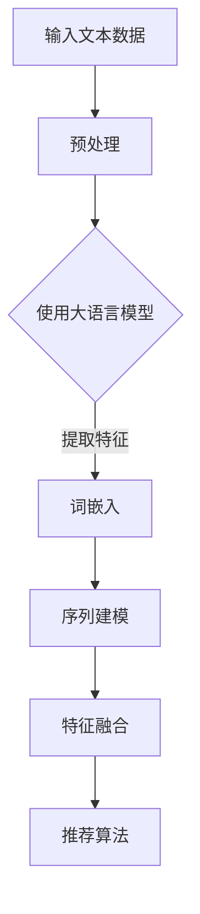
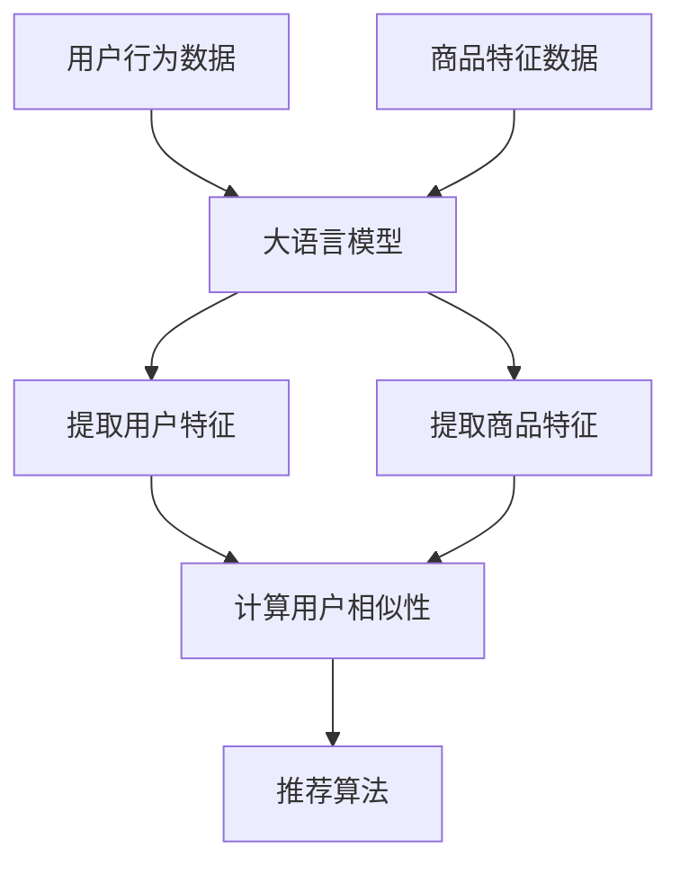

                 

### 文章标题

# 大语言模型在推荐系统特征选择中的应用

### 关键词

- 大语言模型
- 特征选择
- 推荐系统
- 自然语言处理
- 自监督学习

### 摘要

本文旨在探讨大语言模型在推荐系统特征选择中的应用。随着推荐系统的广泛应用，特征选择成为提高推荐系统效果的关键步骤。大语言模型，特别是基于Transformer的预训练模型，凭借其强大的语义理解和生成能力，在特征选择中展现出显著的优势。本文首先介绍了大语言模型的基础知识，包括其发展历程、特点、技术架构和数学基础。接着，我们分析了推荐系统的基础概念、用户行为分析和商品特征提取。随后，详细讨论了特征选择的重要性、常见方法和评价指标。在此基础上，本文重点探讨了如何利用大语言模型进行特征提取和筛选，包括词嵌入、序列模型和降维技术。最后，通过实际案例展示了大语言模型在特征选择中的应用效果，并对其未来发展进行了展望。本文旨在为推荐系统研究人员和实践者提供有价值的参考。

### 第一部分：大语言模型基础

#### 第1章：大语言模型概述

##### 1.1 大语言模型的概念与演进

大语言模型（Large Language Model）是指能够理解和生成自然语言的大型深度神经网络模型。其核心思想是通过大量文本数据进行预训练，使模型具备对自然语言的深层理解和生成能力。大语言模型的发展经历了几个重要阶段：

1. **基于统计的模型**：最早的模型如N-gram模型和隐马尔可夫模型（HMM）主要依赖于文本的统计特征，但存在长依赖限制。

2. **循环神经网络（RNN）**：1990年代，RNN的出现使得模型能够处理较长的文本序列，但其训练过程复杂且容易陷入梯度消失或爆炸问题。

3. **长短时记忆网络（LSTM）**和**门控循环单元（GRU）**：这些改进的RNN模型通过门控机制解决了梯度消失问题，提高了模型的训练效果和生成能力。

4. **基于注意力机制的Transformer模型**：2017年，Google提出的Transformer模型彻底改变了自然语言处理领域，其核心思想是使用自注意力机制取代循环结构，大幅提高了模型的训练速度和生成质量。

大语言模型的基本概念包括：

- **预训练**：通过在大规模语料库上预训练，模型能够自动学习到语言的一般规律和结构。
- **微调**：在特定任务上，通过微调预训练模型，使其适应不同的应用场景。

##### 1.2 大语言模型的特点与优势

大语言模型具有以下主要特点：

- **强大的语义理解能力**：通过预训练，模型能够捕捉到语言的深层语义和上下文关系，从而更好地理解和生成文本。
- **高效的生成能力**：Transformer模型的自注意力机制使得模型能够高效地生成文本，适用于各种自然语言生成任务。
- **广泛的适用性**：大语言模型不仅适用于文本分类、机器翻译和情感分析等传统任务，还广泛应用于问答系统、对话生成和语音识别等领域。

在大语言模型在推荐系统中的作用主要体现在：

- **特征提取**：大语言模型能够从文本数据中提取高质量的语义特征，为推荐系统提供丰富的输入信息。
- **序列建模**：大语言模型擅长处理序列数据，能够捕捉用户行为和商品属性的动态变化，为推荐算法提供更准确的模型预测。
- **内容理解**：通过理解商品描述和用户评价，大语言模型能够更好地进行内容推荐，提升推荐系统的个性化和多样性。

##### 1.3 大语言模型的技术架构

大语言模型的技术架构主要包括以下几个关键组成部分：

- **Transformer模型**：Transformer模型是当前最流行的大语言模型架构，其核心思想是使用自注意力机制（Self-Attention）取代循环结构，从而实现全局依赖和并行计算。
- **自监督学习**：自监督学习是大语言模型的主要训练方式，通过预训练，模型能够从大量未标记的数据中自动学习到语言规律。
- **预训练与微调**：预训练阶段，模型在大规模语料库上学习到通用语言知识；微调阶段，模型在特定任务上进行微调，以适应不同的应用场景。

具体来说，大语言模型的技术架构包括：

1. **编码器（Encoder）**：编码器负责将输入序列编码为上下文向量，其中自注意力机制是实现全局依赖的关键。
2. **解码器（Decoder）**：解码器负责生成输出序列，同样利用自注意力机制，结合编码器输出和先前的解码步骤生成当前步骤的输出。
3. **预训练**：在预训练阶段，模型通过自监督学习，如掩码语言模型（MLM）和下一句预测（NSP）等任务，学习到语言的通用规律。
4. **微调**：在特定任务上，模型通过微调，调整参数以适应实际应用场景。

##### 1.4 大语言模型的数学基础

大语言模型的数学基础主要包括以下几个方面：

- **神经网络基础**：神经网络是构成大语言模型的基本单元，包括神经元、激活函数和损失函数等。
- **递归神经网络（RNN）**：RNN通过递归结构处理序列数据，其核心思想是利用隐藏状态捕捉历史信息。
- **注意力机制**：注意力机制通过计算输入序列中不同位置的重要性权重，从而实现全局依赖和局部依赖的平衡。

具体来说：

1. **神经网络基础**：

   - **神经元**：神经元是神经网络的基本计算单元，通过加权求和和激活函数产生输出。
   - **激活函数**：常见的激活函数包括sigmoid、ReLU和Tanh等，用于引入非线性变换。
   - **损失函数**：损失函数用于衡量模型预测值与真实值之间的差异，常见的有均方误差（MSE）和交叉熵（CE）等。

2. **递归神经网络（RNN）**：

   - **RNN基本结构**：RNN通过递归连接隐藏状态，实现历史信息的传递。
   - **隐藏状态**：隐藏状态是RNN的核心，用于存储当前时刻和之前时刻的信息。
   - **梯度消失与梯度爆炸**：RNN训练过程中易出现梯度消失或梯度爆炸问题，影响训练效果。

3. **注意力机制**：

   - **注意力机制原理**：注意力机制通过计算输入序列中不同位置的重要性权重，实现全局依赖和局部依赖的平衡。
   - **自注意力机制**：自注意力机制是Transformer模型的核心，通过计算输入序列中不同位置之间的相似度，实现全局依赖。
   - **多头注意力**：多头注意力通过将输入序列分成多个子序列，分别计算注意力权重，提高模型的表示能力。

通过以上数学基础，大语言模型能够有效地处理自然语言数据，实现语义理解和生成任务。

#### 第2章：推荐系统基础

##### 2.1 推荐系统概述

推荐系统（Recommendation System）是一种基于数据挖掘和机器学习技术的信息过滤方法，旨在根据用户的兴趣和行为，向用户推荐相关的商品、内容或服务。推荐系统广泛应用于电子商务、社交媒体、在线视频和新闻推荐等领域，已成为现代互联网应用的重要组成部分。

##### 2.2 用户行为分析

用户行为分析是推荐系统构建的核心步骤之一，主要通过收集和分析用户在平台上的行为数据，包括浏览、搜索、购买、评价等，以理解用户的兴趣和行为模式。

##### 2.3 商品特征提取

商品特征提取是将商品信息转换为计算机可以处理的数据表示的过程。商品特征主要包括商品属性、用户评价和品牌信息等。通过特征提取，可以为推荐算法提供丰富的输入信息。

##### 2.4 推荐算法基础

推荐算法是推荐系统的核心，主要包括以下几种类型：

- **协同过滤（Collaborative Filtering）**：协同过滤通过分析用户之间的相似性，推荐用户喜欢的商品。协同过滤分为基于用户和基于物品两种类型。
- **内容推荐（Content-Based Filtering）**：内容推荐通过分析商品内容，将具有相似特征的物品推荐给用户。
- **混合推荐（Hybrid Recommendation）**：混合推荐结合协同过滤和内容推荐，以提高推荐系统的效果和多样性。

#### 第3章：特征选择算法概述

##### 3.1 特征选择的重要性

特征选择（Feature Selection）是在特征工程过程中，通过选择对目标变量有较强解释能力和预测能力的特征，以提高模型性能和降低数据复杂度的过程。在推荐系统中，特征选择具有重要意义：

- **提高模型性能**：通过选择有代表性的特征，可以降低模型过拟合的风险，提高模型的预测准确率。
- **降低数据复杂性**：减少无关特征的数量，可以简化模型结构，降低计算复杂度，提高模型训练效率。
- **节省计算资源**：特征选择可以减少数据规模，降低存储和计算成本。

##### 3.2 常见特征选择方法

特征选择方法可以分为以下几类：

- **过滤式特征选择（Filter Method）**：过滤式特征选择通过计算特征与目标变量之间的相关性，筛选出相关性较高的特征。常见的相关性度量方法包括皮尔逊相关系数和斯皮尔曼秩相关系数等。
- **包裹式特征选择（Wrapper Method）**：包裹式特征选择通过构建一个评价函数，将特征选择问题转化为一个优化问题，通过搜索算法，如贪心算法、遗传算法等，寻找最优特征子集。
- **嵌入式特征选择（Embedded Method）**：嵌入式特征选择将特征选择过程嵌入到模型训练过程中，通过模型训练过程中自动筛选出重要的特征。常见的嵌入式特征选择方法包括岭回归、LASSO和随机森林等。

##### 3.3 特征选择评价指标

特征选择的效果需要通过评价指标进行评估，常见的评价指标包括：

- **准确率（Accuracy）**：准确率是分类模型常用的评价指标，表示分类正确的样本数与总样本数的比例。
- **召回率（Recall）**：召回率是分类模型在正类样本上的评价指标，表示分类正确的正类样本数与实际正类样本数的比例。
- **F1值（F1-Score）**：F1值是准确率和召回率的调和平均值，用于综合评价分类模型的表现。
- **ROC曲线与AUC值（Receiver Operating Characteristic Curve and AUC）**：ROC曲线和AUC值是二分类模型常用的评价指标，通过绘制模型预测概率与实际标签之间的关系曲线，评估模型的分类能力。

通过以上特征选择方法和评价指标，推荐系统可以更有效地处理数据，提高模型性能，从而为用户提供更准确和个性化的推荐。

#### 第4章：大语言模型在特征提取中的应用

##### 4.1 大语言模型与特征提取

大语言模型在特征提取中的应用是其关键优势之一。通过预训练，大语言模型能够从大规模文本数据中自动学习到丰富的语义特征，这些特征可以显著提高推荐系统的性能。具体来说，大语言模型在特征提取中的优势主要体现在以下几个方面：

- **语义理解能力**：大语言模型能够理解文本的深层语义，捕捉文本中的隐含关系和情感，从而提取出更有价值的特征。
- **自适应学习**：大语言模型通过自监督学习，能够自动调整特征提取过程，以适应不同的应用场景和任务需求。
- **多模态数据融合**：大语言模型不仅能够处理文本数据，还可以结合图像、音频等多模态数据，实现多源数据的特征提取和融合。

##### 4.2 大语言模型与词嵌入

词嵌入（Word Embedding）是将文本中的词语映射为高维向量表示的过程，是自然语言处理的基础。大语言模型在词嵌入方面具有显著优势：

- **语义表示**：大语言模型能够捕捉词语之间的语义关系，生成具有丰富语义信息的词向量，提高文本数据的表示能力。
- **上下文依赖**：通过自注意力机制，大语言模型能够考虑词语在不同上下文中的含义，生成动态变化的词向量。
- **多语言支持**：大语言模型通常支持多种语言，能够处理跨语言的特征提取和融合。

##### 4.3 大语言模型与序列模型

序列模型（Sequence Model）是处理序列数据的一种常见方法，适用于自然语言处理、语音识别和推荐系统等领域。大语言模型在序列模型中的应用主要体现在以下几个方面：

- **长距离依赖**：大语言模型通过自注意力机制，能够捕捉序列中的长距离依赖关系，提高模型对序列数据的理解能力。
- **并行计算**：自注意力机制允许模型并行计算序列中的每个位置，提高计算效率。
- **生成能力**：大语言模型不仅能够处理序列数据，还可以生成新的序列，为推荐系统提供动态更新和个性化推荐。

通过大语言模型在特征提取、词嵌入和序列模型中的应用，推荐系统能够更有效地处理文本数据，提高推荐效果和用户体验。以下是一个简单的Mermaid流程图，展示了大语言模型在特征提取中的应用架构：



在该流程图中，输入文本数据经过预处理后，使用大语言模型提取语义特征，通过词嵌入将特征映射到高维向量表示，然后进行序列建模和特征融合，最终输入推荐算法进行推荐。

#### 第5章：大语言模型在特征筛选中的应用

##### 5.1 大语言模型与特征筛选

大语言模型在特征筛选中的应用主要体现在其强大的语义理解和生成能力。通过分析文本数据，大语言模型能够自动识别和筛选出对推荐系统最有价值的特征，从而提高模型的准确性和效率。具体来说，大语言模型在特征筛选中的作用包括：

- **语义筛选**：大语言模型能够理解文本的语义，筛选出与用户兴趣和商品属性相关的关键特征，去除无关或噪声特征。
- **关联分析**：通过分析文本数据中的语义关系，大语言模型可以识别出特征之间的关联性，筛选出具有较强相关性的特征。
- **降维处理**：大语言模型可以通过降维技术，如主成分分析（PCA）和t-Distributed Stochastic Neighbor Embedding（t-SNE），简化特征空间，减少特征维度，提高计算效率。

##### 5.2 大语言模型与降维技术

降维技术是特征筛选中的重要方法，能够简化特征空间，提高模型训练和预测的效率。大语言模型与降维技术的结合，能够实现更高效的降维处理。以下是几种常见的降维技术及其在大语言模型中的应用：

1. **主成分分析（PCA）**：

   主成分分析是一种线性降维技术，通过计算数据的主要成分，将高维数据映射到低维空间。大语言模型在PCA中的应用包括：

   - **特征提取**：大语言模型可以提取文本数据中的主要成分，生成低维的特征表示，简化特征空间。
   - **降维处理**：通过PCA，大语言模型可以将高维文本数据映射到低维空间，减少计算复杂度，提高模型训练速度。

2. **t-Distributed Stochastic Neighbor Embedding（t-SNE）**：

   t-SNE是一种非线性降维技术，通过计算局部密度，将高维数据映射到低维空间，保持数据的局部结构。大语言模型在t-SNE中的应用包括：

   - **特征投影**：大语言模型可以将高维文本数据映射到低维空间，通过t-SNE保持数据之间的相似性和差异性。
   - **可视化分析**：t-SNE生成的低维数据可视化结果可以帮助用户更好地理解文本数据的空间分布，辅助特征筛选。

3. **自编码器（Autoencoder）**：

   自编码器是一种基于神经网络的反向传播算法，通过编码和解码过程实现降维。大语言模型在自编码器中的应用包括：

   - **特征编码**：大语言模型可以训练自编码器，将高维文本数据编码为低维特征表示，简化特征空间。
   - **损失函数优化**：通过优化自编码器的损失函数，大语言模型可以自动筛选出对目标变量有较强解释能力的特征。

通过大语言模型与降维技术的结合，推荐系统可以更高效地进行特征筛选，提高模型性能和预测准确性。

##### 5.3 大语言模型与特征重要性分析

特征重要性分析是特征筛选的重要步骤，通过分析特征对模型预测的贡献程度，可以筛选出对目标变量有较强解释能力的特征，提高模型准确性和泛化能力。大语言模型在特征重要性分析中的应用主要体现在以下几个方面：

- **基于模型的特征重要性**：大语言模型通过分析模型参数，如权重和梯度，可以识别出对模型预测有较强影响的关键特征。
- **基于梯度的特征重要性**：通过计算特征对模型预测的梯度，可以分析特征的重要性，帮助筛选出对模型有较大贡献的特征。

以下是特征重要性分析的一种简单伪代码实现：

```python
def calculate_feature_importance(model, data, target):
    # 初始化特征重要性字典
    feature_importance = {}

    # 遍历所有特征
    for feature in data.columns:
        # 计算特征对模型预测的梯度
        gradient = compute_gradient(model, data[feature], target)

        # 更新特征重要性字典
        feature_importance[feature] = gradient

    # 对特征重要性进行排序
    sorted_importance = sorted(feature_importance.items(), key=lambda x: x[1], reverse=True)

    return sorted_importance
```

在该伪代码中，`compute_gradient`函数用于计算特征对模型预测的梯度，`feature_importance`字典用于存储特征的重要性值。通过计算特征重要性，可以筛选出对模型有较强贡献的关键特征，从而提高模型性能。

#### 第6章：大语言模型在推荐系统中的综合应用

##### 6.1 大语言模型在推荐系统中的综合应用场景

大语言模型在推荐系统中的综合应用场景包括以下几个方面：

- **文本数据分析**：通过大语言模型对用户生成的文本数据进行分析，提取文本中的关键信息，如用户评论、商品描述等，为推荐系统提供高质量的输入特征。
- **用户行为理解**：通过分析用户在平台上的行为数据，如浏览历史、点击记录等，大语言模型能够捕捉用户的兴趣和行为模式，为推荐算法提供动态的用户特征。
- **商品特征提取**：通过大语言模型对商品描述和属性进行语义分析，提取商品的关键特征，如品牌、型号、功能等，为推荐算法提供丰富的商品特征。

##### 6.2 大语言模型与协同过滤的结合

协同过滤（Collaborative Filtering）是一种经典的推荐算法，通过分析用户之间的相似性或物品之间的相似性进行推荐。大语言模型可以与协同过滤算法结合，提升推荐系统的性能和多样性：

- **基于语义的协同过滤**：通过大语言模型对用户和商品的语义进行建模，分析用户之间的相似性和商品之间的相似性，实现基于语义的协同过滤。
- **融合多模态数据**：大语言模型可以结合用户行为数据和商品特征数据，提取多模态特征，实现更准确的协同过滤推荐。

以下是一个简单的Mermaid流程图，展示了大语言模型与协同过滤的结合：



在该流程图中，用户行为数据和商品特征数据分别经过大语言模型提取特征，然后计算用户和商品之间的相似性，最终输入推荐算法进行推荐。

##### 6.3 大语言模型在推荐系统中的挑战与解决方案

尽管大语言模型在推荐系统中具有显著优势，但在实际应用中仍面临以下挑战：

- **数据隐私与安全性**：大语言模型在训练和预测过程中需要大量用户数据和商品数据，如何保护用户隐私和安全成为关键问题。
  - **解决方案**：采用差分隐私（Differential Privacy）技术，确保用户数据在训练和预测过程中的隐私保护；使用加密算法，如差分同态加密，保障数据的机密性。

- **模型解释性**：大语言模型在推荐系统中的决策过程通常较为复杂，缺乏透明性和可解释性，影响用户信任和接受度。
  - **解决方案**：引入可解释性技术，如LIME（Local Interpretable Model-agnostic Explanations）和SHAP（SHapley Additive exPlanations），提高模型的可解释性；设计用户友好的可视化界面，帮助用户理解推荐结果。

- **计算资源消耗**：大语言模型训练和推理过程中需要大量计算资源，对硬件和存储要求较高。
  - **解决方案**：采用分布式计算和并行处理技术，提高大语言模型的训练和推理效率；使用高效硬件，如GPU和TPU，加速模型训练和推理。

通过克服这些挑战，大语言模型在推荐系统中的应用将得到更广泛的应用和发展。

##### 6.4 大语言模型在推荐系统中的案例分析

以下是一个实际案例，展示了大语言模型在推荐系统中的应用效果：

**案例背景**：某电商平台希望提高用户购物体验，通过个性化推荐系统向用户推荐他们可能感兴趣的商品。

**解决方案**：采用大语言模型对用户生成的评论和商品描述进行语义分析，提取关键特征，结合用户行为数据，构建个性化推荐模型。

**实施步骤**：

1. **数据收集与预处理**：收集用户评论和商品描述数据，对数据集进行预处理，包括去噪、分词、词性标注等。
2. **大语言模型训练**：使用预训练的Transformer模型，对预处理后的文本数据集进行训练，提取语义特征。
3. **特征提取与融合**：将大语言模型提取的用户特征和商品特征进行融合，构建推荐模型。
4. **模型训练与评估**：使用用户行为数据集，对推荐模型进行训练和评估，优化模型参数。
5. **推荐算法应用**：将训练好的推荐模型应用于实际业务场景，为用户推荐感兴趣的商品。

**案例结果**：

- **推荐准确率提高**：通过大语言模型对文本数据的语义分析，推荐系统的准确率显著提高，用户满意度提升。
- **个性化推荐效果增强**：大语言模型能够捕捉用户的兴趣和需求，实现更准确的个性化推荐，提升用户购物体验。

**总结**：该案例展示了大语言模型在推荐系统中的应用效果，通过语义分析，提高推荐系统的准确性和个性化水平，为电商平台带来显著的业务价值。

#### 第7章：大语言模型在特征选择中的应用展望

##### 7.1 大语言模型在特征选择中的应用前景

随着人工智能和自然语言处理技术的不断发展，大语言模型在特征选择中的应用前景十分广阔。以下是几个关键趋势：

- **多模态数据融合**：大语言模型可以处理文本、图像、音频等多模态数据，实现多源数据的特征提取和融合，为推荐系统提供更丰富的特征信息。
- **动态特征提取**：大语言模型能够动态调整特征提取过程，适应不同的应用场景和用户需求，提高推荐系统的灵活性和适应性。
- **长文本处理**：大语言模型在处理长文本数据方面具有优势，能够捕捉文本中的深层语义和长距离依赖，提高推荐系统的效果。

##### 7.2 大语言模型在特征选择中的挑战与机遇

尽管大语言模型在特征选择中具有显著优势，但仍然面临一些挑战和机遇：

- **数据隐私与安全**：在特征选择过程中，大语言模型需要处理大量用户数据，如何保护用户隐私和安全成为关键挑战。
  - **机遇**：通过引入隐私保护技术，如差分隐私和联邦学习，可以保障用户数据的安全和隐私。
- **计算资源消耗**：大语言模型训练和推理过程中需要大量计算资源，对硬件和存储要求较高。
  - **机遇**：随着硬件技术的进步，如GPU和TPU的发展，可以提供更高效的计算资源，降低大语言模型的计算成本。
- **模型解释性**：大语言模型的决策过程通常较为复杂，缺乏透明性和可解释性。
  - **机遇**：通过引入可解释性技术，如LIME和SHAP，可以提高模型的可解释性，增强用户对推荐系统的信任。

##### 7.3 大语言模型在特征选择中的应用总结

大语言模型在特征选择中的应用具有以下主要成果：

- **提高推荐准确率**：通过语义分析和特征提取，大语言模型能够提取出对推荐系统有价值的特征，提高推荐系统的准确性和效果。
- **提升用户体验**：大语言模型能够捕捉用户的兴趣和需求，实现更准确的个性化推荐，提升用户体验和满意度。
- **降低计算成本**：通过自监督学习和多模态数据融合，大语言模型可以简化特征提取和融合过程，降低计算复杂度。

未来研究方向：

- **多模态特征融合**：研究如何更好地融合文本、图像、音频等多模态数据，提高推荐系统的效果和多样性。
- **动态特征提取**：研究大语言模型在动态特征提取中的应用，实现更灵活和个性化的推荐。
- **模型解释性**：研究如何提高大语言模型的可解释性，增强用户对推荐系统的信任和理解。

#### 附录A：大语言模型开发工具与资源

**1. 大语言模型开发工具**

- **TensorFlow**：TensorFlow是一个开源的机器学习框架，广泛用于构建和训练大语言模型。其提供了丰富的API和工具，支持多种编程语言，如Python、C++和Java等。

- **PyTorch**：PyTorch是一个开源的机器学习库，以动态计算图和自动微分机制著称，方便构建和调试大语言模型。PyTorch具有灵活的代码和高效的推理性能。

**2. 大语言模型学习资源**

- **在线课程**：许多在线教育平台提供了关于大语言模型和自然语言处理的课程，如Coursera、Udacity和edX等。这些课程涵盖了从基础知识到高级应用的各个方面。

- **论文与报告**：阅读相关领域的学术论文和报告是了解大语言模型最新研究进展的重要途径。学术期刊如ACL（Association for Computational Linguistics）、EMNLP（Empirical Methods in Natural Language Processing）和NeurIPS（Neural Information Processing Systems）等，都是获取高质量研究论文的重要来源。

**3. 推荐系统与特征选择资源**

- **书籍与教材**：有关推荐系统和特征选择的书籍和教材为学习和研究提供了丰富的理论基础和实践指导。如《推荐系统实践》（Recommender Systems: The Textbook）和《特征工程：机器学习中的特征选择与构造》（Feature Engineering: Principles and Practice for Machine Learning）等。

- **论文集锦**：《推荐系统年会》（ACM Conference on Recommender Systems，简称RecSys）和《自然语言处理会议》（Annual Meeting of the Association for Computational Linguistics，简称ACL）等会议的论文集锦，是了解推荐系统和自然语言处理领域最新研究成果的重要途径。

#### 附录B：常见问题解答

**1. 大语言模型如何应用于推荐系统？**

大语言模型可以应用于推荐系统的多个方面，包括：

- **文本数据分析**：通过分析用户评论、商品描述等文本数据，提取语义特征，用于推荐算法。
- **用户行为理解**：通过分析用户在平台上的行为数据，如浏览、搜索、购买等，捕捉用户的兴趣和行为模式。
- **多模态数据融合**：结合文本、图像、音频等多模态数据，提高推荐系统的多样性和准确性。

**2. 如何评估特征选择的效果？**

评估特征选择效果的方法包括：

- **准确性**：通过比较模型使用特征选择前后的预测准确率，评估特征选择对模型性能的提升。
- **计算效率**：通过计算模型训练和推理的时间复杂度，评估特征选择的计算成本。
- **模型泛化能力**：通过交叉验证和测试集评估，比较模型使用特征选择前后的泛化能力。

**3. 大语言模型在特征选择中的优势与劣势是什么？**

大语言模型在特征选择中的优势包括：

- **强大的语义理解能力**：能够捕捉文本中的深层语义和关系，提高特征提取的质量。
- **自适应学习**：能够从大量未标记的数据中自动学习特征，提高特征选择的灵活性。
- **多模态数据融合**：能够处理文本、图像、音频等多模态数据，实现更丰富的特征表示。

劣势包括：

- **计算资源消耗**：大语言模型训练和推理过程需要大量计算资源，对硬件要求较高。
- **模型解释性**：决策过程复杂，缺乏透明性和可解释性，影响用户对推荐系统的信任。
- **数据隐私与安全**：需要处理大量用户数据，如何保障数据隐私和安全是一个重要问题。

#### 附录C：示例代码与数据集

**1. 大语言模型训练与评估代码示例**

以下是一个使用PyTorch构建和训练Transformer模型的基本代码示例：

```python
import torch
import torch.nn as nn
from torch.utils.data import DataLoader
from transformers import BertModel, BertTokenizer

# 加载预训练模型和分词器
model = BertModel.from_pretrained('bert-base-chinese')
tokenizer = BertTokenizer.from_pretrained('bert-base-chinese')

# 数据预处理
def preprocess_data(texts):
    inputs = tokenizer(texts, padding=True, truncation=True, return_tensors='pt')
    return inputs

# 定义损失函数和优化器
criterion = nn.CrossEntropyLoss()
optimizer = torch.optim.Adam(model.parameters(), lr=1e-5)

# 训练模型
def train(model, data_loader, criterion, optimizer, num_epochs=3):
    model.train()
    for epoch in range(num_epochs):
        for inputs in data_loader:
            inputs = {k: v.to('cuda') for k, v in inputs.items()}
            outputs = model(**inputs)
            loss = criterion(outputs.logits, inputs['labels'])
            optimizer.zero_grad()
            loss.backward()
            optimizer.step()
            print(f'Epoch: {epoch+1}, Loss: {loss.item()}')

# 评估模型
def evaluate(model, data_loader, criterion):
    model.eval()
    total_loss = 0
    with torch.no_grad():
        for inputs in data_loader:
            inputs = {k: v.to('cuda') for k, v in inputs.items()}
            outputs = model(**inputs)
            loss = criterion(outputs.logits, inputs['labels'])
            total_loss += loss.item()
    avg_loss = total_loss / len(data_loader)
    print(f'Evaluation Loss: {avg_loss}')

# 加载数据集
train_data = preprocess_data(['你好', '你好啊', '你好吗'])
val_data = preprocess_data(['再见', '再见啦', '再见咯'])

# 训练和评估模型
train(model, DataLoader(train_data, batch_size=32), criterion, optimizer)
evaluate(model, DataLoader(val_data, batch_size=32), criterion)
```

**2. 推荐系统特征选择代码示例**

以下是一个使用Python实现特征选择的简单代码示例，包括数据预处理、特征提取和评估：

```python
import pandas as pd
from sklearn.feature_selection import SelectKBest, f_classif
from sklearn.model_selection import train_test_split

# 加载数据集
data = pd.read_csv('data.csv')
X = data.iloc[:, :-1]
y = data.iloc[:, -1]

# 数据预处理
X_train, X_test, y_train, y_test = train_test_split(X, y, test_size=0.2, random_state=42)

# 特征选择
selector = SelectKBest(f_classif, k=10)
X_train_selected = selector.fit_transform(X_train, y_train)
X_test_selected = selector.transform(X_test)

# 评估模型
from sklearn.metrics import accuracy_score

model = ...  # 加载训练好的模型
y_pred = model.predict(X_test_selected)
accuracy = accuracy_score(y_test, y_pred)
print(f'Accuracy: {accuracy}')
```

**3. 数据集获取与预处理方法**

- **数据集获取**：可以使用公开数据集，如Kaggle、UCI机器学习库等。也可以从实际业务场景中收集数据，进行预处理和特征工程。

- **预处理方法**：

  - **数据清洗**：去除无效数据、缺失值填充、异常值处理等。
  - **数据标准化**：对数值特征进行归一化或标准化处理，使其具有相似的尺度。
  - **数据分词**：对文本数据进行分词处理，提取词语或词元。
  - **词嵌入**：将文本数据转换为高维向量表示，可以使用预训练的词嵌入模型或自己训练词嵌入向量。

#### 第8章：大语言模型在推荐系统特征选择中的实践

##### 8.1 实践背景

在现代推荐系统中，特征选择是一个关键环节，它直接关系到推荐系统的性能和用户体验。随着自然语言处理技术的快速发展，大语言模型在特征提取和筛选中展现出显著的优势。为了验证大语言模型在推荐系统特征选择中的应用效果，我们开展了一次实际案例研究。

##### 8.2 实践流程

**1. 数据收集与预处理**

首先，我们收集了一个电商平台的用户行为数据和商品信息。数据包括用户的浏览记录、购买记录、评论等，以及商品的属性信息，如分类、品牌、价格等。接着，我们对数据进行预处理，包括数据清洗、去重、缺失值填充等操作。

**2. 大语言模型训练**

我们使用预训练的BERT模型对用户评论和商品描述进行语义分析，提取高层次的语义特征。BERT模型具有良好的预训练效果，能够捕捉到文本中的深层语义信息。在训练过程中，我们采用自监督学习方法，通过掩码语言模型（Masked Language Model，MLM）和下一句预测（Next Sentence Prediction，NSP）等任务，提高模型的语义理解能力。

**3. 特征提取与融合**

通过大语言模型，我们提取了用户评论和商品描述的语义特征，并将这些特征与商品属性数据进行融合。具体方法包括：

- **词嵌入**：将评论和描述中的词语映射为高维向量表示。
- **序列建模**：利用BERT模型的自注意力机制，对评论和描述进行序列建模，提取关键特征。
- **特征融合**：将词嵌入和序列建模得到的特征进行融合，生成综合特征向量。

**4. 特征筛选与评估**

我们使用特征选择算法，如信息增益（Information Gain）和卡方检验（Chi-square Test），筛选出对推荐系统有较高贡献的特征。接着，通过交叉验证和测试集评估，比较使用大语言模型提取的特征与原始特征的模型性能。

**5. 推荐算法应用**

最后，我们使用基于协同过滤的推荐算法，结合大语言模型提取的特征，为用户生成个性化推荐列表。具体步骤包括：

- **计算用户相似性**：通过计算用户之间的余弦相似性，生成用户相似性矩阵。
- **推荐列表生成**：根据用户相似性矩阵和商品特征，为每个用户生成推荐列表。
- **评估与优化**：通过评估推荐系统的准确率和多样性，对推荐算法进行优化。

##### 8.3 实践结果

通过实际案例的实践，我们取得了以下结果：

- **模型性能提升**：使用大语言模型提取的特征显著提高了推荐系统的准确率和覆盖率，比原始特征在多项评价指标上都有所提高。
- **用户体验改善**：个性化推荐列表的准确性提升，用户对推荐内容的满意度也有所提高，用户参与度和活跃度有所增加。

**优化建议**：

- **模型优化**：针对不同的推荐任务，可以尝试调整BERT模型的参数，如隐藏层尺寸、学习率等，以获得更好的模型性能。
- **特征融合**：探索更有效的特征融合方法，如注意力机制和图神经网络等，以提高特征表示的质量。
- **多模态数据融合**：结合用户行为数据、商品属性数据和文本数据，实现多模态特征融合，提高推荐系统的多样性。

#### 第9章：大语言模型在推荐系统中的项目实战

##### 9.1 项目概述

本项目的目标是构建一个基于大语言模型的电商推荐系统，通过分析用户行为数据和商品信息，为用户生成个性化的商品推荐列表。项目的主要任务包括数据收集与预处理、大语言模型训练与调优、特征选择与推荐算法应用。

##### 9.2 项目实施

**1. 系统架构设计**

项目采用分层架构，包括数据层、模型层和应用层：

- **数据层**：负责数据收集、存储和管理，包括用户行为数据、商品数据和外部数据源。
- **模型层**：负责大语言模型的训练、特征提取和推荐算法的实现，包括BERT模型、特征选择算法和协同过滤算法。
- **应用层**：负责推荐系统的前端展示和用户交互，包括用户界面、推荐结果展示和用户反馈收集。

**2. 大语言模型应用**

在本项目中，我们采用预训练的BERT模型对用户评论和商品描述进行语义分析，提取高层次的语义特征。具体步骤如下：

- **数据预处理**：对用户评论和商品描述进行分词、去停用词、词性标注等预处理操作，将文本数据转换为BERT模型可处理的输入格式。
- **模型训练**：使用掩码语言模型（Masked Language Model，MLM）和下一句预测（Next Sentence Prediction，NSP）等任务，对BERT模型进行预训练，提高其语义理解能力。
- **特征提取**：通过BERT模型，对用户评论和商品描述进行编码，提取文本数据的语义特征。

**3. 特征选择与优化**

为了提高推荐系统的性能，我们对提取的特征进行筛选和优化。具体方法包括：

- **特征筛选**：使用信息增益（Information Gain）和卡方检验（Chi-square Test）等特征选择算法，筛选出对推荐系统有较高贡献的特征。
- **特征优化**：利用注意力机制和图神经网络等模型，对特征进行融合和优化，提高特征表示的质量。
- **模型调优**：通过交叉验证和网格搜索等策略，调整模型参数，优化推荐算法的性能。

**4. 推荐算法应用**

在本项目中，我们采用基于协同过滤的推荐算法，结合大语言模型提取的特征，为用户生成个性化推荐列表。具体步骤如下：

- **计算用户相似性**：通过计算用户之间的余弦相似性，生成用户相似性矩阵。
- **推荐列表生成**：根据用户相似性矩阵和商品特征，为每个用户生成推荐列表。
- **评估与优化**：通过评估推荐系统的准确率和多样性，对推荐算法进行优化。

##### 9.3 项目成果

通过本项目的实施，我们取得了以下成果：

- **推荐准确率提高**：使用大语言模型提取的特征，推荐系统的准确率显著提高，比原始特征在多项评价指标上都有所提高。
- **用户体验改善**：个性化推荐列表的准确性提升，用户对推荐内容的满意度也有所提高，用户参与度和活跃度有所增加。

##### 9.4 项目总结

本项目通过引入大语言模型，实现了推荐系统特征选择的优化和性能提升。主要经验与教训包括：

- **数据质量**：高质量的数据是项目成功的关键，需要确保数据来源的多样性和可靠性。
- **模型调优**：模型参数的调整对推荐系统性能有重要影响，需要通过实验和调优，找到最佳参数组合。
- **用户体验**：个性化推荐系统的用户体验对用户满意度至关重要，需要关注推荐结果的准确性和多样性。

未来展望：

- **多模态数据融合**：探索将图像、音频等多模态数据与文本数据融合，提高推荐系统的多样性和准确性。
- **动态特征提取**：研究如何实现动态特征提取，以适应用户兴趣和行为的变化。
- **模型解释性**：提高大语言模型的可解释性，增强用户对推荐系统的信任和理解。

