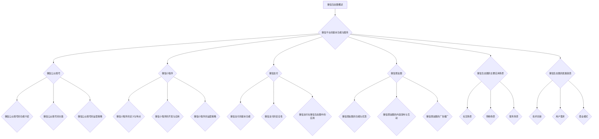

                 

## 文章标题

### 《如何利用微信生态圈进行知识付费》

## 关键词

- 微信生态圈
- 知识付费
- 微信公众账号
- 微信小程序
- 微信支付
- 社交化学习

## 摘要

随着互联网技术的发展和人们对于知识获取需求的增加，知识付费逐渐成为了一个热门的商业模式。微信作为我国最大的社交平台之一，拥有庞大的用户基础和丰富的生态体系。本文将探讨如何利用微信生态圈进行知识付费，包括微信公众账号、微信小程序、微信支付以及微信朋友圈等核心功能在知识付费中的应用，并结合成功与失败的案例进行分析，为企业和个人提供有效的策略和建议。

## 《如何利用微信生态圈进行知识付费》目录大纲

### 第一部分：微信生态圈概述

#### 第1章：微信生态圈的基本架构

##### 1.1 微信平台的基本功能与服务
- **1.1.1 微信公众账号**
  - 微信公众账号的功能介绍
  - 微信公众账号的分类
  - 微信公众账号的运营策略

- **1.1.2 微信小程序**
  - 微信小程序的定义与特点
  - 微信小程序的开发与应用
  - 微信小程序的运营策略

- **1.1.3 微信支付**
  - 微信支付的基本功能
  - 微信支付的安全性
  - 微信支付在微信生态圈中的应用

- **1.1.4 微信朋友圈**
  - 微信朋友圈的功能与优势
  - 微信朋友圈的内容发布与互动
  - 微信朋友圈的广告推广

#### 1.2 微信生态圈的主要应用场景
- **社交场景**
- **购物场景**
- **服务场景**

#### 1.3 微信生态圈的发展趋势
- **技术创新**
- **用户需求**
- **商业模式**

### 第二部分：知识付费的基本概念

#### 第2章：知识付费的兴起与发展

##### 2.1 知识付费的定义与分类
- **2.1.1 知识付费的定义**
  - 知识付费的概念解析
  - 知识付费的核心要素

- **2.1.2 知识付费的分类**
  - 传统知识付费
  - 数字化知识付费
  - 社交化知识付费

##### 2.2 知识付费的市场现状与趋势
- **2.2.1 用户需求分析**
  - 用户需求的变化趋势
  - 用户对知识付费的接受度

- **2.2.2 行业规模与发展速度**
  - 知识付费市场的规模分析
  - 知识付费行业的发展速度

- **2.2.3 主要平台分析**
  - 知识付费的主要平台介绍
  - 平台的特点与优势分析

##### 2.3 知识付费的商业模式与盈利模式
- **2.3.1 会员制**
  - 会员制的概念与优势
  - 会员制的运营策略

- **2.3.2 单项付费**
  - 单项付费的原理与操作
  - 单项付费的优缺点分析

- **2.3.3 佣金分账**
  - 佣金分账的机制与操作
  - 佣金分账的适用场景

### 第三部分：微信生态圈中的知识付费实践

#### 第3章：微信公众号与知识付费

##### 3.1 微信公众号的运营策略
- **3.1.1 内容规划**
  - 内容的定位与主题
  - 内容的更新频率与质量

- **3.1.2 用户互动**
  - 互动方式与策略
  - 用户反馈与互动效果分析

- **3.1.3 广告与推广**
  - 广告的形式与投放策略
  - 推广渠道与效果评估

##### 3.2 公众号的知识付费工具与应用
- **3.2.1 付费阅读**
  - 付费阅读的机制与操作
  - 付费阅读的优势与挑战

- **3.2.2 付费课程**
  - 付费课程的类型与内容
  - 付费课程的运营与管理

- **3.2.3 付费问答**
  - 付费问答的运作模式
  - 付费问答的用户体验与效果

##### 3.3 公众号的知识付费案例解析
- **3.3.1 成功案例分析**
  - 成功的经验与要素
  - 成功的关键因素分析

- **3.3.2 失败案例分析**
  - 失败的原因与教训
  - 避免失败的策略

### 第4章：微信小程序与知识付费

##### 4.1 微信小程序的开发与应用

###### 4.1.1 小程序的基础架构
- 小程序的开发环境与工具
- 小程序的核心架构与组件

###### 4.1.2 小程序的知识付费模式
- 付费内容销售
- 付费课程与培训
- 付费咨询与辅导

##### 4.2 小程序的知识付费案例解析
- **4.2.1 成功案例分析**
  - 成功的经验与要素
  - 成功的关键因素分析

- **4.2.2 失败案例分析**
  - 失败的原因与教训
  - 避免失败的策略

### 第5章：微信支付与知识付费

##### 5.1 微信支付的基本功能与优势

###### 5.1.1 微信支付的基本功能
- 支付流程
- 支付场景

###### 5.1.2 微信支付的安全性
- 安全机制与保障
- 用户隐私保护

###### 5.1.3 微信支付在知识付费中的应用
- 支付流程优化
- 支付安全保障
- 支付场景扩展

##### 5.2 微信支付的知识付费案例解析
- **5.2.1 成功案例分析**
  - 成功的经验与要素
  - 成功的关键因素分析

- **5.2.2 失败案例分析**
  - 失败的原因与教训
  - 避免失败的策略

### 第6章：微信朋友圈与知识付费

##### 6.1 朋友圈的基本功能与优势

###### 6.1.1 朋友圈的功能与优势
- 内容分享
- 广告推广
- 社交互动

###### 6.1.2 朋友圈的知识付费模式
- 付费内容推广
- 付费广告投放
- 付费社交互动

##### 6.2 朋友圈的知识付费案例解析
- **6.2.1 成功案例分析**
  - 成功的经验与要素
  - 成功的关键因素分析

- **6.2.2 失败案例分析**
  - 失败的原因与教训
  - 避免失败的策略

### 第四部分：微信生态圈中的知识付费案例分析

#### 第7章：微信生态圈中的成功知识付费案例解析

##### 7.1 案例选取与分类
- **7.1.1 案例选取标准**
  - 成功案例分析
  - 失败案例分析
  - 案例分类与总结

##### 7.2 成功案例解析
- **7.2.1 成功经验总结**
  - 成功的策略与执行
  - 成功的关键因素

- **7.2.2 风险因素分析**
  - 潜在的风险与挑战
  - 风险管理策略

##### 7.3 失败案例解析
- **7.3.1 失败原因分析**
  - 失败的内外部原因
  - 失败的关键因素

- **7.3.2 避免失败的建议**
  - 避免失败的方法与策略
  - 改进措施与建议

### 附录

#### 附录A：微信生态圈中的知识付费工具与资源

##### 附录A.1 微信公众号运营工具
- **A.1.1 推送工具**
  - 推送机制与策略
  - 推送效果评估

- **A.1.2 数据分析工具**
  - 数据收集与处理
  - 数据分析与应用

- **A.1.3 用户管理工具**
  - 用户分类与标签
  - 用户行为分析

##### 附录A.2 微信小程序开发工具
- **A.2.1 开发工具**
  - 开发环境与工具链

- **A.2.2 开发框架**
  - 技术选型与框架应用

- **A.2.3 开发资源**
  - 开发文档与社区资源

##### 附录A.3 微信支付工具与资源
- **A.3.1 支付接口**
  - 接口使用与开发指南

- **A.3.2 支付安全**
  - 安全机制与保障

- **A.3.3 支付场景拓展**
  - 场景分析与拓展策略

##### 附录A.4 微信朋友圈运营工具
- **A.4.1 内容发布工具**
  - 内容发布机制与策略

- **A.4.2 广告投放工具**
  - 广告投放流程与效果评估

- **A.4.3 用户互动工具**
  - 互动机制与策略

## 第1章：微信生态圈的基本架构

### 1.1 微信平台的基本功能与服务

#### 1.1.1 微信公众账号

微信公众账号是微信生态圈中的重要组成部分，它为企业、组织和个人提供了一个强大的工具，用于与用户进行互动和提供服务。微信公众账号主要有以下功能：

1. **内容发布**：公众号可以定期发布文字、图片、视频等多种形式的内容，吸引用户关注并保持活跃度。
2. **用户互动**：通过留言、点赞、评论等方式，公众号可以与用户进行实时互动，增强用户粘性。
3. **自定义菜单**：公众号可以设置自定义菜单，方便用户快速访问相关功能或页面。
4. **数据统计**：公众号提供详细的数据统计功能，包括用户增长、阅读量、互动率等，帮助企业了解用户行为和效果。

根据服务类型，微信公众账号主要分为以下几类：

1. **服务号**：主要用于提供服务和信息，例如媒体、政府、企业等。服务号可以发送图文消息、推送通知、构建自定义菜单等。
2. **订阅号**：主要用于内容推送，例如自媒体、杂志、个人品牌等。订阅号只能发送图文消息，无法发送其他类型的内容。

**公众号的运营策略**：

1. **内容策略**：内容是公众号的核心，需要定期更新高质量的内容，吸引并留住用户。内容应具有教育性、实用性和趣味性。
2. **互动策略**：与用户保持良好的互动，回复用户的留言和评论，举办线上活动，增加用户参与度。
3. **推广策略**：通过线上线下活动、合作推广等方式，增加公众号的曝光度和知名度。

#### 1.1.2 微信小程序

微信小程序是一种不需要下载安装即可使用的应用，它实现了应用“触手可及”的理念，为用户提供了便捷的服务。小程序主要有以下特点：

1. **无需安装**：用户可以直接在微信中搜索、打开和使用小程序，无需下载安装。
2. **即用即走**：小程序的设计以“用完即走”为原则，简化用户操作流程，提供高效便捷的服务。
3. **丰富的功能**：小程序支持多种功能，如在线购物、服务预订、信息查询等。

**小程序的开发与应用**：

1. **基础架构**：小程序的基础架构主要包括前端、后端和数据库三个部分。前端使用微信小程序开发框架，后端可以使用微信小程序云开发或自建服务器，数据库则可以使用云数据库或其他数据库解决方案。
2. **开发工具**：微信小程序开发工具是小程序开发的必备工具，提供了丰富的开发功能和调试工具。
3. **应用场景**：小程序的应用场景非常广泛，如电商、教育、餐饮、旅游、医疗等，可以为不同领域的用户提供定制化的服务。

**小程序的运营策略**：

1. **功能优化**：根据用户需求和使用情况，不断优化小程序的功能和用户体验。
2. **推广策略**：通过微信内外的推广渠道，如朋友圈广告、小程序搜索推广等，提高小程序的曝光度和用户量。
3. **用户反馈**：及时收集用户反馈，优化小程序的性能和功能，提高用户满意度。

#### 1.1.3 微信支付

微信支付是微信生态圈中的一项核心功能，它提供了便捷的支付方式，为用户和商家之间的交易提供了便利。微信支付主要有以下特点：

1. **便捷性**：微信支付支持多种支付方式，如微信钱包、银行卡支付、二维码支付等，用户可以随时随地完成支付。
2. **安全性**：微信支付采用多重安全机制，包括支付密码、短信验证码、风险监控系统等，保障用户的支付安全。
3. **跨境支付**：微信支付支持跨境支付，为跨境电商和国际贸易提供了便利。

**微信支付在微信生态圈中的应用**：

1. **公众号支付**：微信公众账号可以通过公众号支付功能，实现商品或服务的在线支付，方便用户购买。
2. **小程序支付**：微信小程序可以通过微信支付功能，实现在线支付，为用户提供便捷的购物体验。
3. **朋友圈广告支付**：朋友圈广告支持支付功能，用户可以直接在朋友圈中进行购买，提高了广告的转化率。

#### 1.1.4 微信朋友圈

微信朋友圈是微信生态圈中的一款重要应用，它为用户提供了一个分享和互动的平台。微信朋友圈主要有以下功能：

1. **内容分享**：用户可以在朋友圈中发布文字、图片、视频等多媒体内容，展示自己的生活和工作。
2. **广告推广**：微信朋友圈支持广告投放，企业可以通过朋友圈广告推广自己的产品和服务。
3. **社交互动**：用户可以在朋友圈中点赞、评论、转发内容，与朋友保持互动和联系。

**微信朋友圈的优势**：

1. **用户基数大**：微信拥有庞大的用户群体，朋友圈的曝光度很高，为广告和推广提供了广阔的空间。
2. **互动性强**：朋友圈的互动功能，使得用户可以更好地参与和体验内容，提高了用户粘性和满意度。
3. **精准投放**：微信朋友圈广告支持精准投放，可以根据用户的年龄、性别、地理位置等信息，实现定向推广。

**微信朋友圈的内容发布与互动**：

1. **内容发布策略**：用户需要根据自身特点和目标受众，制定合适的内容发布策略，提高内容的曝光度和互动率。
2. **互动互动机制**：用户可以通过点赞、评论、转发等方式，与朋友进行互动，增加朋友圈的活跃度。

**微信朋友圈的广告推广**：

1. **广告形式**：微信朋友圈广告主要有横幅广告、原生广告、视频广告等，可以根据不同的推广目标选择合适的广告形式。
2. **广告投放策略**：企业需要根据用户行为和需求，制定合适的广告投放策略，提高广告的转化率和ROI。

### 1.2 微信生态圈的主要应用场景

微信生态圈涵盖了社交、购物、服务等多个应用场景，为用户提供了全方位的便捷服务。

**社交场景**：

1. **好友互动**：用户可以通过微信与好友进行聊天、语音、视频通话等，保持紧密联系。
2. **群组交流**：用户可以加入各种兴趣群组，与志同道合的人进行交流和互动。
3. **社交互动**：用户可以在朋友圈中发布内容，与其他用户进行互动和点赞，增加社交互动的乐趣。

**购物场景**：

1. **在线购物**：用户可以通过微信购物小程序或公众号，直接购买商品，享受便捷的购物体验。
2. **团购拼单**：用户可以参与团购拼单，享受优惠价格，提高购物性价比。
3. **售后服务**：商家可以通过微信与用户进行售后服务，解决用户的问题和疑虑。

**服务场景**：

1. **在线服务**：用户可以通过微信小程序或公众号，预约各种服务，如打车、餐饮、医疗等。
2. **在线咨询**：用户可以通过微信与专业人士进行在线咨询，获取专业的建议和帮助。
3. **在线支付**：用户可以通过微信支付，方便快捷地进行各类支付操作，提高支付体验。

### 1.3 微信生态圈的发展趋势

微信生态圈作为我国最大的社交平台之一，一直在不断创新和发展，其未来发展趋势主要包括以下几个方面：

**技术创新**：

1. **人工智能**：微信正在积极引入人工智能技术，如语音识别、图像识别、自然语言处理等，提升用户体验和交互效果。
2. **大数据**：微信通过大数据分析，为用户提供个性化的内容和推荐，提高用户满意度和活跃度。
3. **区块链**：微信正在探索区块链技术，为用户提供更加安全和可信的服务。

**用户需求**：

1. **个性化**：用户对于个性化内容和服务的需求日益增长，微信将通过大数据分析和人工智能技术，满足用户的个性化需求。
2. **便捷性**：用户对于便捷、高效的服务需求不断提高，微信将继续优化产品功能和用户体验，满足用户的便捷需求。
3. **安全性**：随着网络安全意识的提高，用户对于支付安全、隐私保护等方面的要求越来越高，微信将不断提升安全性和隐私保护能力。

**商业模式**：

1. **广告**：微信将继续探索广告商业模式，通过朋友圈广告、小程序广告等，为企业提供更多的广告投放渠道。
2. **电商**：微信将继续发展电商业务，通过小程序和公众号，为用户提供更加便捷和丰富的购物体验。
3. **支付**：微信支付作为微信生态圈的核心功能之一，将继续拓展支付场景和应用，提高用户支付体验和便捷性。


## 第2章：知识付费的兴起与发展

### 2.1 知识付费的定义与分类

#### 2.1.1 知识付费的定义

知识付费是指用户为了获取特定的知识、技能或信息，自愿支付一定费用的行为。知识付费的本质是信息不对称的解决方案，它通过将知识转化为商品或服务，实现知识的传播和价值的转化。

知识付费的核心要素包括：

1. **知识内容**：知识内容是知识付费的核心，它可以是书籍、课程、讲座、咨询等。
2. **用户需求**：用户需求是知识付费的基础，只有满足用户需求的知识内容才能获得用户的付费意愿。
3. **支付方式**：支付方式是知识付费的实现手段，目前常见的支付方式包括在线支付、移动支付等。
4. **用户评价**：用户评价是知识付费的重要反馈机制，它可以帮助知识提供者了解用户需求，改进服务质量。

#### 2.1.2 知识付费的分类

根据知识付费的形式和特点，可以将知识付费分为以下几种类型：

1. **传统知识付费**：

   传统知识付费主要是指通过实体书店、教育培训机构、在线课程等渠道获取知识。传统知识付费的特点是内容较为固定，用户需要到特定的地点或通过特定的方式进行学习。

   - **实体书店**：用户可以在书店购买书籍，通过阅读书籍获取知识。
   - **教育培训机构**：用户可以报名参加各类培训课程，通过讲师的授课获取知识。
   - **在线课程**：用户可以通过网络平台，在线购买课程，观看视频教程获取知识。

2. **数字化知识付费**：

   数字化知识付费是指通过互联网和移动设备获取知识。数字化知识付费的特点是内容多样，用户可以随时随地学习，获取知识更加便捷。

   - **在线教育平台**：如网易云课堂、慕课网等，提供丰富的在线课程，用户可以根据自己的需求选择合适的课程。
   - **电子书**：用户可以在各大电子书平台购买电子书，通过移动设备随时阅读。
   - **知识社区**：如知乎、分答等，用户可以付费获取专业人士的解答和咨询。

3. **社交化知识付费**：

   社交化知识付费是指通过社交网络平台获取知识。社交化知识付费的特点是互动性强，用户可以在社交网络中与他人分享和交流知识。

   - **微信公众号**：用户可以通过关注微信公众号，获取各类知识内容和资讯。
   - **知乎**：用户可以在知乎上付费获取专业人士的回答和咨询。
   - **分答**：用户可以付费获取专业人士的快速解答。

### 2.2 知识付费的市场现状与趋势

#### 2.2.1 用户需求分析

随着互联网的普及和知识经济的兴起，用户对于知识的获取需求不断增加。用户需求的趋势主要表现在以下几个方面：

1. **个性化需求**：用户希望获取个性化的知识内容，满足自身的特殊需求。
2. **便捷性需求**：用户希望随时随地获取知识，提高学习效率。
3. **互动性需求**：用户希望与知识提供者和其他用户进行互动，获取更多的知识和见解。
4. **性价比需求**：用户希望以合理的价格获取高质量的知识内容。

#### 2.2.2 行业规模与发展速度

知识付费行业在过去几年中取得了迅速的发展，市场规模不断扩大。根据相关报告，全球知识付费市场规模已经达到数千亿美元，并且仍处于快速增长阶段。

知识付费行业的发展速度主要受到以下几个因素的驱动：

1. **互联网技术的进步**：互联网技术的不断进步，为知识付费提供了更加便捷和高效的获取方式。
2. **用户意识的提高**：随着人们对知识价值的认识不断提高，知识付费的用户基数不断增长。
3. **商业模式的创新**：知识付费领域的商业模式不断创新，为知识提供者和用户提供了更多的选择和机会。

#### 2.2.3 主要平台分析

目前，知识付费市场上有多个主要平台，它们各自具有不同的特点和优势。

1. **网易云课堂**：网易云课堂是网易旗下的在线教育平台，提供丰富的在线课程，包括编程、设计、语言等。网易云课堂的特点是课程质量高，价格亲民，适合广大用户学习和提升技能。

2. **慕课网**：慕课网是中国领先的IT技能学习平台，提供包括前端、后端、移动开发等在内的多种课程。慕课网的特点是课程内容全面，更新及时，适合IT从业者和技术爱好者。

3. **知乎**：知乎是中国领先的社交问答平台，用户可以在知乎上付费获取专业人士的回答和咨询。知乎的特点是用户基数大，内容质量高，适合用户获取专业知识和行业见解。

4. **分答**：分答是知乎旗下的知识付费平台，用户可以付费获取专业人士的快速解答。分答的特点是问答形式灵活，互动性强，适合用户快速获取专业知识和解决实际问题。

### 2.3 知识付费的商业模式与盈利模式

#### 2.3.1 会员制

会员制是指用户通过支付一定费用，成为平台会员，享受平台提供的专属服务和优惠。会员制的优势在于可以提供持续的收入流，并且可以增加用户粘性和平台忠诚度。

会员制的运营策略包括：

1. **会员权益**：制定丰富的会员权益，如课程优惠、专属服务、会员专属活动等，吸引用户付费。
2. **会员分级**：根据会员的消费能力和需求，设立不同的会员等级，提供差异化的服务和优惠。
3. **会员推广**：通过会员推荐、优惠活动等方式，鼓励现有会员带来新用户，扩大会员基数。

#### 2.3.2 单项付费

单项付费是指用户为某个特定的知识内容或服务支付费用。单项付费的优势在于简单直接，用户可以明确知道自己需要支付的费用。

单项付费的运营策略包括：

1. **内容定位**：根据用户需求和市场趋势，确定具有吸引力的知识内容或服务，制定合理的价格。
2. **营销推广**：通过线上和线下的营销推广活动，提高知识内容或服务的知名度，吸引更多用户购买。
3. **用户反馈**：收集用户反馈，改进知识内容或服务的质量和用户体验，提高用户满意度。

#### 2.3.3 佣金分账

佣金分账是指平台从用户支付的费用中抽取一定比例的佣金，剩余部分支付给知识提供者。佣金分账的优势在于可以激励知识提供者提供高质量的内容，同时也可以为平台带来持续的收入。

佣金分账的运营策略包括：

1. **佣金比例**：制定合理的佣金比例，确保知识提供者和平台的收益都得到保障。
2. **内容审核**：建立严格的审核机制，确保知识内容的质量和合法性。
3. **用户评价**：通过用户评价和反馈，激励知识提供者不断改进内容，提高用户满意度。

### 第3章：微信公众号与知识付费

#### 3.1 微信公众号的运营策略

微信公众号作为知识付费的重要平台，其运营策略对于知识付费的成功至关重要。以下是一些关键策略：

##### 3.1.1 内容规划

内容是微信公众号的核心，内容规划是运营策略的基础。以下是内容规划的关键点：

1. **内容定位**：根据微信公众号的目标受众和行业特点，确定内容主题和风格，确保内容与用户需求相匹配。
2. **内容类型**：丰富内容类型，包括图文、视频、音频等，满足不同用户的学习偏好。
3. **更新频率**：制定合理的更新频率，保持公众号的活跃度和用户的持续关注。

##### 3.1.2 用户互动

用户互动是提高公众号粘性和用户满意度的重要手段。以下是用户互动的关键点：

1. **互动方式**：利用留言、评论、点赞等功能，与用户进行实时互动。
2. **用户反馈**：及时回复用户的留言和评论，收集用户反馈，改进内容和服务。
3. **活动策划**：定期举办线上线下活动，增加用户参与度和互动性。

##### 3.1.3 广告与推广

广告与推广是增加公众号曝光度和用户量的重要途径。以下是广告与推广的关键点：

1. **广告形式**：根据目标受众和推广内容，选择合适的广告形式，如图文广告、视频广告等。
2. **推广渠道**：利用微信生态圈内的其他渠道，如朋友圈广告、微信群推广等，扩大公众号的影响力。
3. **效果评估**：定期评估广告推广的效果，优化推广策略，提高ROI。

#### 3.2 公众号的知识付费工具与应用

微信公众号提供了多种知识付费工具，可以帮助公众号实现知识变现。以下是主要的知识付费工具和应用场景：

##### 3.2.1 付费阅读

付费阅读是指用户为获取特定的文章或内容支付费用。以下是付费阅读的关键点：

1. **内容筛选**：挑选优质的内容进行付费，确保用户愿意支付费用。
2. **定价策略**：根据内容价值和用户需求，制定合理的价格策略。
3. **用户体验**：优化阅读体验，提供便捷的支付和阅读流程。

##### 3.2.2 付费课程

付费课程是指用户为获取特定的课程内容支付费用。以下是付费课程的关键点：

1. **课程规划**：根据用户需求和行业趋势，设计具有吸引力的课程。
2. **课程内容**：确保课程内容丰富、系统、实用，满足用户的学习需求。
3. **课程推广**：通过线上线下渠道，进行有效的课程推广。

##### 3.2.3 付费问答

付费问答是指用户为获取专业人士的解答或咨询支付费用。以下是付费问答的关键点：

1. **专家筛选**：挑选具有专业知识和经验的专家，提供高质量的问答服务。
2. **问答流程**：设计便捷的问答流程，确保用户可以快速获取答案。
3. **用户反馈**：收集用户反馈，不断优化问答服务，提高用户满意度。

#### 3.3 公众号的知识付费案例解析

##### 3.3.1 成功案例分析

成功案例可以为公众号的知识付费提供有益的借鉴。以下是几个成功的公众号知识付费案例：

1. **案例一**：某知名自媒体公众号通过付费阅读，成功实现了知识变现。该公众号定期发布高质量的文章，用户需支付一定费用才能阅读。通过精细化运营和高质量内容，该公众号积累了大量忠实粉丝，实现了可观的收入。

2. **案例二**：某教育类公众号通过付费课程，实现了规模化收入。该公众号与知名教育专家合作，推出了一系列高质量的课程。通过精准的营销推广和优质的课程内容，该公众号吸引了大量用户购买课程，实现了良好的盈利。

3. **案例三**：某专业咨询类公众号通过付费问答，成功打造了个人品牌。该公众号邀请行业专家为用户提供付费咨询服务，通过专业的解答和优质的服务，该公众号在业内树立了良好的口碑，吸引了大量用户付费咨询。

##### 3.3.2 失败案例分析

失败案例可以为公众号的知识付费提供警示。以下是几个失败的公众号知识付费案例：

1. **案例一**：某创业类公众号尝试推出付费课程，但未能成功。该公众号课程内容缺乏吸引力，价格较高，未能满足用户需求。此外，公众号运营团队在推广和用户互动方面存在问题，导致课程销售不佳。

2. **案例二**：某健康类公众号通过付费阅读尝试知识变现，但效果不理想。该公众号内容质量参差不齐，用户满意度较低。此外，公众号在内容筛选和定价策略方面存在问题，导致用户流失。

3. **案例三**：某专业咨询类公众号通过付费问答，但未能持续吸引用户。该公众号问答服务质量不稳定，专家解答质量参差不齐，用户体验不佳。此外，公众号在用户互动和反馈机制方面存在问题，导致用户流失。

##### 3.3.3 成功与失败案例分析

成功与失败案例的对比，可以总结出以下经验和教训：

1. **内容质量**：高质量的内容是知识付费成功的关键。公众号应注重内容质量，提供有价值、有吸引力的内容，满足用户需求。

2. **用户体验**：良好的用户体验是知识付费成功的重要保障。公众号应优化支付流程、阅读体验和用户互动，提高用户满意度。

3. **定价策略**：合理的定价策略是知识付费成功的关键。公众号应根据内容价值和用户需求，制定合理的价格策略，确保用户愿意支付费用。

4. **营销推广**：有效的营销推广是知识付费成功的重要手段。公众号应通过线上线下渠道，进行有效的推广，扩大用户基数。

5. **用户反馈**：及时收集用户反馈，不断优化内容和运营策略，是知识付费成功的重要环节。公众号应建立完善的用户反馈机制，及时解决问题，提高用户满意度。

### 第4章：微信小程序与知识付费

#### 4.1 微信小程序的开发与应用

微信小程序是微信生态圈中的重要组成部分，它为用户提供了便捷的在线服务。微信小程序的开发与应用主要包括以下几个关键步骤：

##### 4.1.1 小程序的基础架构

微信小程序的基础架构主要包括前端、后端和数据库三个部分。以下是基础架构的详细描述：

1. **前端**：前端主要负责小程序的用户界面和交互。开发者可以使用微信小程序开发框架（如WXML、WXSS）来构建小程序页面。前端需要实现的功能包括页面布局、交互效果和用户输入处理。

2. **后端**：后端主要负责数据处理和业务逻辑。开发者可以选择使用微信小程序云开发，它提供了一系列开发工具和服务，如数据库、云函数等。如果需要自定义后端服务，开发者可以使用自己的服务器和数据库，通过API接口与小程序前端进行数据交互。

3. **数据库**：数据库用于存储小程序的数据。微信小程序支持多种数据库解决方案，如云数据库（如MySQL、MongoDB）、小程序云开发提供的数据库等。开发者可以根据实际需求选择合适的数据库。

##### 4.1.2 小程序的知识付费模式

微信小程序的知识付费模式主要包括付费内容销售、付费课程与培训、付费咨询与辅导等。以下是这些模式的详细描述：

1. **付费内容销售**：付费内容销售是指用户通过小程序购买特定的知识内容，如电子书、文档、视频教程等。开发者可以在小程序中设置商品列表，提供多种支付方式，如微信支付、支付宝支付等。此外，开发者还可以提供优惠券、折扣等促销活动，吸引更多用户购买。

2. **付费课程与培训**：付费课程与培训是指用户通过小程序报名参加线上课程或培训。开发者可以在小程序中设置课程列表，包括课程简介、课程内容、讲师介绍等。用户可以在线支付报名费用，然后通过小程序观看课程视频、参与互动讨论等。

3. **付费咨询与辅导**：付费咨询与辅导是指用户通过小程序向专业人士寻求解答或辅导。开发者可以在小程序中设置咨询通道，如在线问答、视频咨询等。用户可以支付咨询费用，然后与专业人士进行实时沟通，获得专业的解答和指导。

##### 4.1.3 小程序的知识付费案例解析

以下是两个微信小程序的知识付费案例，分别从成功和失败的角度进行分析。

1. **成功案例**：某知名在线教育平台开发了一款微信小程序，提供付费课程与培训服务。该小程序拥有丰富的课程资源，包括编程、设计、语言等多个领域。通过精准的营销推广和优质的课程内容，该小程序吸引了大量用户，实现了可观的收入。

   - **成功经验**：该案例成功的原因包括：
     - 精选课程资源，满足用户需求。
     - 优秀的用户体验，包括便捷的支付和课程观看流程。
     - 精准的营销推广，提高了小程序的曝光度和用户量。

   - **关键因素**：该案例的关键成功因素包括：
     - 高质量的课程内容，满足用户的学习需求。
     - 便捷的支付和观看流程，提高用户满意度。
     - 精准的营销推广，吸引更多用户参与。

2. **失败案例**：某初创公司开发了一款微信小程序，提供付费咨询与辅导服务。该小程序在初期吸引了一些用户，但未能持续吸引新用户，最终导致失败。

   - **失败原因**：该案例失败的原因包括：
     - 咨询服务质量不稳定，用户满意度低。
     - 缺乏有效的营销推广，导致用户基数较小。
     - 用户体验不佳，支付和咨询流程繁琐。

   - **教训**：该案例的教训包括：
     - 提高咨询服务质量，确保用户满意度。
     - 加强营销推广，提高小程序的曝光度和用户量。
     - 优化用户体验，提供便捷的支付和咨询流程。

### 第5章：微信支付与知识付费

#### 5.1 微信支付的基本功能与优势

微信支付是微信生态圈中的重要组成部分，它为用户提供了便捷的支付方式。以下是微信支付的基本功能与优势：

##### 5.1.1 微信支付的基本功能

微信支付的基本功能包括：

1. **支付流程**：用户可以通过微信支付完成线上和线下的支付操作。支付流程包括选择支付方式、输入支付密码、确认支付等步骤。

2. **支付方式**：微信支付支持多种支付方式，包括微信钱包、银行卡支付、二维码支付等。用户可以根据自己的需求选择合适的支付方式。

3. **支付场景**：微信支付适用于各种支付场景，如线上购物、线下消费、转账、红包等。用户可以在不同场景下方便快捷地进行支付。

##### 5.1.2 微信支付的安全性

微信支付的安全性是其重要优势之一。以下是微信支付的安全机制与优势：

1. **支付密码**：用户可以通过设置支付密码，确保支付过程的安全性。支付密码是用户进行支付操作的重要凭证。

2. **短信验证码**：在进行重要支付操作时，微信支付会发送短信验证码到用户绑定的手机，用户需要输入验证码才能完成支付。这种方式增加了支付的安全性。

3. **风险监控系统**：微信支付拥有完善的风险监控系统，可以对异常交易进行识别和处理，保障用户的资金安全。

##### 5.1.3 微信支付在知识付费中的应用

微信支付在知识付费中的应用，为用户提供了便捷的支付体验。以下是微信支付在知识付费中的应用：

1. **支付流程优化**：微信支付提供了便捷的支付流程，用户可以快速完成支付操作，提高购买体验。

2. **支付安全保障**：微信支付采用了多重安全机制，保障用户的支付安全，让用户放心购买知识内容。

3. **支付场景扩展**：微信支付适用于各种支付场景，包括在线课程购买、电子书购买、付费问答等，为知识付费提供了广泛的应用场景。

#### 5.2 微信支付的知识付费案例解析

以下是两个微信支付的知识付费案例，分别从成功和失败的角度进行分析。

##### 5.2.1 成功案例

成功案例：某在线教育平台通过微信支付，提供了便捷的知识付费服务。该平台提供了丰富的课程资源，用户可以通过微信支付购买课程，观看视频教程。

- **成功经验**：
  - 便捷的支付流程，提高了用户的购买体验。
  - 多种支付方式，满足了不同用户的需求。
  - 强大的安全保障，保障了用户的资金安全。

- **关键因素**：
  - 优质的课程内容，吸引了大量用户。
  - 便捷的支付流程，提高了用户满意度。
  - 强大的支付安全保障，增加了用户的信任。

##### 5.2.2 失败案例

失败案例：某初创企业尝试通过微信支付提供知识付费服务，但未能成功。该企业课程内容质量不高，支付流程繁琐，导致用户流失。

- **失败原因**：
  - 课程内容质量不高，无法满足用户需求。
  - 支付流程繁琐，降低了用户购买意愿。
  - 缺乏有效的用户反馈机制，无法及时改进服务。

- **教训**：
  - 提高课程内容质量，满足用户需求。
  - 优化支付流程，提高用户购买体验。
  - 建立有效的用户反馈机制，及时改进服务。

### 第6章：微信朋友圈与知识付费

#### 6.1 朋友圈的基本功能与优势

微信朋友圈是微信生态圈中的一个重要功能，它为用户提供了分享和互动的平台。以下是微信朋友圈的基本功能与优势：

##### 6.1.1 朋友圈的功能与优势

微信朋友圈的基本功能包括：

1. **内容分享**：用户可以在朋友圈发布文字、图片、视频等多媒体内容，展示自己的生活、工作和想法。

2. **互动机制**：用户可以在朋友圈中点赞、评论、转发内容，与他人进行互动，增加社交乐趣。

3. **广告推广**：企业可以通过朋友圈广告，向目标用户推广产品和服务，提高品牌曝光度和销售转化率。

微信朋友圈的优势包括：

1. **用户基数大**：微信拥有庞大的用户群体，朋友圈的曝光度很高，为广告和推广提供了广阔的空间。

2. **互动性强**：朋友圈的互动功能，使得用户可以更好地参与和体验内容，提高了用户粘性和满意度。

3. **精准投放**：微信朋友圈广告支持精准投放，可以根据用户的年龄、性别、地理位置等信息，实现定向推广。

##### 6.1.2 朋友圈的知识付费模式

微信朋友圈的知识付费模式主要包括以下几种：

1. **付费内容推广**：企业或个人可以在朋友圈发布付费内容，如文章、视频、课程等，用户需支付一定费用才能查看。

2. **付费广告投放**：企业可以通过朋友圈广告投放，推广自己的知识产品或服务，吸引用户购买。

3. **付费社交互动**：用户可以在朋友圈进行付费问答、咨询等互动，获取专业知识和建议。

#### 6.2 朋友圈的知识付费案例解析

以下是两个微信朋友圈的知识付费案例，分别从成功和失败的角度进行分析。

##### 6.2.1 成功案例

成功案例：某知名自媒体通过朋友圈发布付费文章，吸引了大量用户购买。该自媒体文章内容优质，涵盖了多个领域，用户可以根据自己的需求选择合适的文章。

- **成功经验**：
  - 优质的内容，满足了用户的需求。
  - 便捷的支付流程，提高了用户的购买体验。
  - 强大的社交互动，增加了用户粘性和满意度。

- **关键因素**：
  - 优质的内容，吸引了大量用户。
  - 便捷的支付流程，提高了用户满意度。
  - 强大的社交互动，增加了用户粘性和互动性。

##### 6.2.2 失败案例

失败案例：某初创企业尝试通过朋友圈发布付费广告，但效果不佳。该企业广告内容质量不高，定位不准确，导致用户不感兴趣。

- **失败原因**：
  - 广告内容质量不高，无法吸引用户。
  - 定位不准确，无法触达目标用户。
  - 缺乏有效的用户互动，降低了用户参与度。

- **教训**：
  - 提高广告内容质量，满足用户需求。
  - 精准定位目标用户，提高广告效果。
  - 加强用户互动，增加用户参与度。

### 第7章：微信生态圈中的成功知识付费案例解析

#### 7.1 案例选取与分类

在微信生态圈中，有许多成功的知识付费案例，这些案例可以为我们提供宝贵的经验和教训。以下是案例的选取标准和分类：

##### 7.1.1 案例选取标准

选取案例时，我们主要考虑以下几个标准：

1. **成功程度**：案例必须是成功的，即在知识付费方面取得了显著的效果，如增加了收入、提高了用户满意度等。

2. **代表性**：案例应具有一定的代表性，能够反映出微信生态圈中知识付费的典型模式和成功经验。

3. **可复制性**：案例应具有一定的可复制性，其他企业和个人可以借鉴和模仿，实现知识付费的成功。

##### 7.1.2 案例分类

根据知识付费的形式和特点，我们可以将案例分为以下几个类别：

1. **内容付费**：通过微信公众号、小程序等平台，发布优质的内容，用户需支付一定费用才能阅读或观看。

2. **课程付费**：通过微信公众号、小程序等平台，提供在线课程或培训服务，用户需支付一定费用才能报名和学习。

3. **咨询付费**：通过微信公众号、小程序等平台，提供专业的咨询服务，用户需支付一定费用才能获得专家的解答或指导。

#### 7.2 成功案例解析

以下是几个成功的知识付费案例，我们逐一进行分析。

##### 7.2.1 案例一：某知名自媒体公众号

该知名自媒体公众号通过发布高质量的原创文章，吸引了大量用户关注。为了实现知识变现，该公众号推出了付费阅读功能，用户需支付一定费用才能阅读文章。

- **成功经验**：

  - 优质的内容：该公众号的文章内容质量高，涵盖了多个领域，满足了用户的需求。

  - 便捷的支付流程：公众号提供了便捷的支付方式，用户可以快速完成支付，提高了购买体验。

  - 强大的用户互动：公众号与用户保持了良好的互动，及时回复用户的留言和评论，增加了用户的粘性。

- **关键因素**：

  - 优质的内容：高质量的内容是知识付费成功的关键，它吸引了大量用户。

  - 便捷的支付流程：便捷的支付流程提高了用户的购买体验，增加了用户的购买意愿。

  - 强大的用户互动：良好的用户互动增加了用户的满意度，提高了公众号的粘性。

##### 7.2.2 案例二：某在线教育平台

该在线教育平台通过微信公众号和小程序，提供在线课程和培训服务。用户可以通过微信支付报名学习，观看课程视频，参与互动讨论。

- **成功经验**：

  - 丰富的课程资源：该平台提供了丰富的课程资源，涵盖了多个领域，满足了不同用户的学习需求。

  - 优质的课程内容：平台的课程内容质量高，实用性强，受到了用户的认可。

  - 精准的营销推广：平台通过线上线下渠道，进行了精准的营销推广，提高了品牌知名度和用户量。

- **关键因素**：

  - 丰富的课程资源：丰富的课程资源是平台成功的重要因素，它满足了用户的需求。

  - 优质的课程内容：高质量的课程内容是平台成功的关键，它提高了用户的满意度和忠诚度。

  - 精准的营销推广：精准的营销推广提高了平台的曝光度和用户量，促进了知识的传播和变现。

##### 7.2.3 案例三：某专业咨询平台

该专业咨询平台通过微信公众号和小程序，提供专业的咨询服务。用户可以通过微信支付付费咨询，获得专家的解答和指导。

- **成功经验**：

  - 高质量的咨询服务：平台邀请了多位行业专家，提供了高质量的咨询服务，解决了用户的实际问题。

  - 便捷的支付流程：平台提供了便捷的支付方式，用户可以快速完成支付，提高了购买体验。

  - 有效的用户反馈机制：平台建立了有效的用户反馈机制，收集用户反馈，不断优化服务质量。

- **关键因素**：

  - 高质量的咨询服务：高质量的咨询服务是平台成功的重要因素，它吸引了大量用户。

  - 便捷的支付流程：便捷的支付流程提高了用户的购买体验，增加了用户的购买意愿。

  - 有效的用户反馈机制：有效的用户反馈机制提高了用户满意度，增加了平台的粘性。

#### 7.3 失败案例解析

虽然微信生态圈中的知识付费案例大多数是成功的，但也存在一些失败的案例。以下是对几个失败案例的解析。

##### 7.3.1 案例一：某初创企业

某初创企业尝试通过微信公众号提供付费课程，但未能成功。该企业的课程内容质量不高，定价不合理，导致用户流失。

- **失败原因**：

  - 课程内容质量不高：课程内容缺乏实用性，无法满足用户的需求。

  - 定价不合理：定价过高，用户觉得价格不合理，不愿意购买。

  - 缺乏有效的营销推广：企业没有进行有效的营销推广，导致用户量较少。

- **教训**：

  - 提高课程内容质量：提供高质量的课程内容，满足用户的需求。

  - 合理定价：根据市场情况和用户需求，制定合理的定价策略。

  - 加强营销推广：通过线上线下渠道，进行有效的营销推广，提高品牌知名度和用户量。

##### 7.3.2 案例二：某健康类公众号

某健康类公众号尝试通过朋友圈广告推广付费内容，但效果不佳。该公众号的广告内容质量不高，定位不准确，导致用户不感兴趣。

- **失败原因**：

  - 广告内容质量不高：广告内容缺乏吸引力，无法吸引用户。

  - 定位不准确：广告定位不准确，未能触达目标用户。

  - 缺乏有效的用户互动：广告缺乏与用户的互动，降低了用户的参与度。

- **教训**：

  - 提高广告内容质量：提供高质量的广告内容，增加用户的兴趣。

  - 精准定位目标用户：根据用户需求和特点，进行精准的定位，提高广告效果。

  - 加强用户互动：增加广告与用户的互动，提高用户的参与度。

##### 7.3.3 案例三：某科技类公众号

某科技类公众号尝试通过微信公众号提供付费咨询，但未能成功。该公众号的咨询服务质量不稳定，用户满意度低。

- **失败原因**：

  - 咨询服务质量不稳定：咨询服务质量波动较大，无法提供稳定的高质量服务。

  - 缺乏有效的用户反馈机制：公众号没有建立有效的用户反馈机制，无法及时了解用户需求。

  - 缺乏专业的咨询服务团队：公众号缺乏专业的咨询服务团队，无法提供高质量的咨询服务。

- **教训**：

  - 提高咨询服务质量：建立专业的咨询服务团队，提供稳定的高质量服务。

  - 建立有效的用户反馈机制：建立有效的用户反馈机制，及时了解用户需求。

  - 加强咨询服务团队建设：加强咨询服务团队的建设，提高咨询服务的质量和效率。

### 附录A：微信生态圈中的知识付费工具与资源

#### A.1 微信公众号运营工具

微信公众号是知识付费的重要平台，为了更好地运营微信公众号，我们可以使用以下工具：

##### A.1.1 推送工具

推送工具用于向用户发送消息和通知，常用的推送工具包括：

1. **微信公众平台**：微信公众平台提供了消息推送功能，可以发送图文消息、视频消息等。通过合理设置推送时间和内容，可以提高用户打开率和阅读量。

2. **邮件推送工具**：一些第三方邮件推送工具，如邮件大师、简信等，可以与微信公众平台结合使用，实现邮件和微信消息的推送。

##### A.1.2 数据分析工具

数据分析工具用于分析微信公众号的运营数据，包括用户增长、阅读量、互动率等。常用的数据分析工具包括：

1. **微信公众平台数据统计**：微信公众平台提供了详细的数据统计功能，可以查看文章阅读量、互动率、用户来源等数据。

2. **第三方数据分析工具**：如GrowingIO、微信指数等，可以更全面地分析微信公众号的运营效果，为运营策略提供数据支持。

##### A.1.3 用户管理工具

用户管理工具用于管理微信公众号的用户，包括用户分类、标签管理等。常用的用户管理工具包括：

1. **微信公众号用户管理**：微信公众平台提供了用户管理功能，可以添加、删除用户，设置用户标签等。

2. **第三方用户管理工具**：如有赞微盟等，可以提供更丰富的用户管理功能，如用户行为分析、用户画像等。

#### A.2 微信小程序开发工具

微信小程序的开发工具和资源对于知识付费至关重要，以下是常用的开发工具和资源：

##### A.2.1 开发工具

1. **微信开发者工具**：微信开发者工具是微信小程序开发必备的工具，提供了代码编辑、调试、预览等功能。

2. **小程序开发框架**：如WePY、Taro等，可以简化小程序开发流程，提高开发效率。

##### A.2.2 开发框架

1. **Vue.js**：Vue.js是一种流行的前端开发框架，可以与微信小程序开发结合使用，提高开发效率。

2. **React**：React是一种用于构建用户界面的JavaScript库，也可以用于微信小程序开发。

##### A.2.3 开发资源

1. **官方文档**：微信小程序官方文档提供了详细的开发指南和API文档，是小程序开发的必备资源。

2. **开发者社区**：如微信公众平台开发者社区、GitHub等，可以找到许多小程序开发的资源和案例，有助于学习和交流。

#### A.3 微信支付工具与资源

微信支付是知识付费的重要支付渠道，以下是微信支付的相关工具和资源：

##### A.3.1 支付接口

1. **微信公众平台支付**：微信公众平台提供了支付接口，可以集成到微信公众号和小程序中，实现在线支付。

2. **微信小程序支付**：微信小程序支付是微信小程序中的一种支付方式，支持多种支付场景，如商品购买、课程报名等。

##### A.3.2 支付安全

1. **支付安全机制**：微信支付采用了多重安全机制，包括支付密码、短信验证码、风险监控系统等，确保支付安全。

2. **支付安全指南**：微信支付官方提供了支付安全指南，帮助用户了解支付风险和防范措施。

##### A.3.3 支付场景拓展

1. **线上支付场景**：微信支付适用于多种线上支付场景，如电商、教育、医疗等。

2. **线下支付场景**：微信支付支持线下支付，如餐饮、零售等，为用户提供了便捷的支付方式。

#### A.4 微信朋友圈运营工具

微信朋友圈是知识付费的重要推广渠道，以下是微信朋友圈的运营工具和资源：

##### A.4.1 内容发布工具

1. **微信公众平台**：微信公众平台提供了朋友圈广告发布功能，可以发布图文、视频等类型的广告。

2. **第三方朋友圈广告工具**：如友推、广点通等，可以提供更丰富的广告发布和管理功能。

##### A.4.2 广告投放工具

1. **朋友圈广告投放**：微信朋友圈广告提供了多种投放方式和投放策略，可以根据用户特征、地理位置等精准投放。

2. **广告效果评估**：微信朋友圈广告提供了广告效果评估工具，可以查看广告的曝光量、点击量、转化率等数据，为广告投放提供参考。

##### A.4.3 用户互动工具

1. **微信聊天**：通过微信聊天功能，与用户进行实时互动，解答疑问，提供帮助。

2. **微信群**：创建微信群，邀请用户加入，进行社群互动，增加用户粘性和活跃度。

### Mermaid 流程图



### 第1章：微信生态圈的基本架构

微信生态圈是我国最大的社交平台之一，它不仅提供了即时通讯的功能，还涵盖了一系列其他服务和应用，形成了一个庞大的生态系统。在这一章中，我们将详细介绍微信生态圈的基本架构，包括微信平台的基本功能与服务、微信生态圈的主要应用场景，以及微信生态圈的发展趋势。

### 1.1 微信平台的基本功能与服务

微信平台是微信生态圈的核心，它提供了丰富的功能和服务，为用户和商家提供了便利。以下是微信平台的基本功能与服务：

#### 1.1.1 微信公众账号

微信公众账号是微信平台的重要组成部分，它为企业、组织和个人提供了一个与用户互动和服务的平台。微信公众账号主要有以下功能：

1. **内容发布**：公众号可以发布文字、图片、视频等多种形式的内容，吸引用户关注和阅读。

2. **用户互动**：公众号可以通过留言、评论、点赞等功能与用户进行互动，增强用户粘性。

3. **自定义菜单**：公众号可以设置自定义菜单，方便用户快速访问相关功能或页面。

4. **数据统计**：公众号提供详细的数据统计功能，包括用户增长、阅读量、互动率等，帮助企业了解用户行为和效果。

根据服务类型，微信公众账号主要分为以下几类：

1. **服务号**：服务号主要用于提供服务，如媒体、政府、企业等。服务号可以发送图文消息、推送通知、构建自定义菜单等。

2. **订阅号**：订阅号主要用于内容推送，如自媒体、杂志、个人品牌等。订阅号只能发送图文消息，无法发送其他类型的内容。

**公众号的运营策略**：

1. **内容策略**：内容是公众号的核心，需要定期更新高质量的内容，吸引并留住用户。内容应具有教育性、实用性和趣味性。

2. **互动策略**：与用户保持良好的互动，回复用户的留言和评论，举办线上活动，增加用户参与度。

3. **推广策略**：通过线上线下活动、合作推广等方式，增加公众号的曝光度和知名度。

#### 1.1.2 微信小程序

微信小程序是微信生态圈中的一项创新功能，它提供了无需下载安装即可使用的应用，为用户提供了便捷的服务。小程序主要有以下特点：

1. **无需安装**：用户可以直接在微信中搜索、打开和使用小程序，无需下载安装。

2. **即用即走**：小程序的设计以“用完即走”为原则，简化用户操作流程，提供高效便捷的服务。

3. **丰富的功能**：小程序支持多种功能，如在线购物、服务预订、信息查询等，为不同领域的用户提供定制化的服务。

**小程序的开发与应用**：

1. **基础架构**：小程序的基础架构主要包括前端、后端和数据库三个部分。前端使用微信小程序开发框架，后端可以使用微信小程序云开发或自建服务器，数据库则可以使用云数据库或其他数据库解决方案。

2. **开发工具**：微信小程序开发工具是小程序开发的必备工具，提供了丰富的开发功能和调试工具。

3. **应用场景**：小程序的应用场景非常广泛，如电商、教育、餐饮、旅游、医疗等，可以为不同领域的用户提供定制化的服务。

**小程序的运营策略**：

1. **功能优化**：根据用户需求和使用情况，不断优化小程序的功能和用户体验。

2. **推广策略**：通过微信内外的推广渠道，如小程序搜索推广、朋友圈广告等，提高小程序的曝光度和用户量。

3. **用户反馈**：及时收集用户反馈，优化小程序的性能和功能，提高用户满意度。

#### 1.1.3 微信支付

微信支付是微信生态圈中的一项核心功能，它提供了便捷的支付方式，为用户和商家之间的交易提供了便利。微信支付主要有以下特点：

1. **便捷性**：微信支付支持多种支付方式，如微信钱包、银行卡支付、二维码支付等，用户可以随时随地完成支付。

2. **安全性**：微信支付采用多重安全机制，包括支付密码、短信验证码、风险监控系统等，保障用户的支付安全。

3. **跨境支付**：微信支付支持跨境支付，为跨境电商和国际贸易提供了便利。

**微信支付在微信生态圈中的应用**：

1. **公众号支付**：微信公众账号可以通过公众号支付功能，实现商品或服务的在线支付，方便用户购买。

2. **小程序支付**：微信小程序可以通过微信支付功能，实现在线支付，为用户提供便捷的购物体验。

3. **朋友圈广告支付**：朋友圈广告支持支付功能，用户可以直接在朋友圈中进行购买，提高了广告的转化率。

#### 1.1.4 微信朋友圈

微信朋友圈是微信生态圈中的一款重要应用，它为用户提供了一个分享和互动的平台。微信朋友圈主要有以下功能：

1. **内容分享**：用户可以在朋友圈中发布文字、图片、视频等多媒体内容，展示自己的生活和工作。

2. **广告推广**：微信朋友圈支持广告投放，企业可以通过朋友圈广告推广自己的产品和服务。

3. **社交互动**：用户可以在朋友圈中点赞、评论、转发内容，与朋友保持互动和联系。

**微信朋友圈的优势**：

1. **用户基数大**：微信拥有庞大的用户群体，朋友圈的曝光度很高，为广告和推广提供了广阔的空间。

2. **互动性强**：朋友圈的互动功能，使得用户可以更好地参与和体验内容，提高了用户粘性和满意度。

3. **精准投放**：微信朋友圈广告支持精准投放，可以根据用户的年龄、性别、地理位置等信息，实现定向推广。

**微信朋友圈的内容发布与互动**：

1. **内容发布策略**：用户需要根据自身特点和目标受众，制定合适的内容发布策略，提高内容的曝光度和互动率。

2. **互动机制**：用户可以通过点赞、评论、转发等方式，与朋友进行互动，增加朋友圈的活跃度。

**微信朋友圈的广告推广**：

1. **广告形式**：微信朋友圈广告主要有横幅广告、原生广告、视频广告等，可以根据不同的推广目标选择合适的广告形式。

2. **广告投放策略**：企业需要根据用户行为和需求，制定合适的广告投放策略，提高广告的转化率和ROI。

### 1.2 微信生态圈的主要应用场景

微信生态圈涵盖了社交、购物、服务等多个应用场景，为用户提供了全方位的便捷服务。

**社交场景**：

1. **好友互动**：用户可以通过微信与好友进行聊天、语音、视频通话等，保持紧密联系。

2. **群组交流**：用户可以加入各种兴趣群组，与志同道合的人进行交流和互动。

3. **社交互动**：用户可以在朋友圈中发布内容，与其他用户进行互动和点赞，增加社交互动的乐趣。

**购物场景**：

1. **在线购物**：用户可以通过微信购物小程序或公众号，直接购买商品，享受便捷的购物体验。

2. **团购拼单**：用户可以参与团购拼单，享受优惠价格，提高购物性价比。

3. **售后服务**：商家可以通过微信与用户进行售后服务，解决用户的问题和疑虑。

**服务场景**：

1. **在线服务**：用户可以通过微信小程序或公众号，预约各种服务，如打车、餐饮、医疗等。

2. **在线咨询**：用户可以通过微信与专业人士进行在线咨询，获取专业的建议和帮助。

3. **在线支付**：用户可以通过微信支付，方便快捷地进行各类支付操作，提高支付体验。

### 1.3 微信生态圈的发展趋势

微信生态圈作为我国最大的社交平台之一，一直在不断创新和发展，其未来发展趋势主要包括以下几个方面：

**技术创新**：

1. **人工智能**：微信正在积极引入人工智能技术，如语音识别、图像识别、自然语言处理等，提升用户体验和交互效果。

2. **大数据**：微信通过大数据分析，为用户提供个性化的内容和推荐，提高用户满意度和活跃度。

3. **区块链**：微信正在探索区块链技术，为用户提供更加安全和可信的服务。

**用户需求**：

1. **个性化**：用户希望获取个性化的内容和服务，微信将通过大数据分析和人工智能技术，满足用户的个性化需求。

2. **便捷性**：用户希望随时随地获取服务，微信将继续优化产品功能和用户体验，满足用户的便捷需求。

3. **安全性**：随着网络安全意识的提高，用户对于支付安全、隐私保护等方面的要求越来越高，微信将不断提升安全性和隐私保护能力。

**商业模式**：

1. **广告**：微信将继续探索广告商业模式，通过朋友圈广告、小程序广告等，为企业提供更多的广告投放渠道。

2. **电商**：微信将继续发展电商业务，通过小程序和公众号，为用户提供更加便捷和丰富的购物体验。

3. **支付**：微信支付作为微信生态圈的核心功能之一，将继续拓展支付场景和应用，提高用户支付体验和便捷性。

## 第2章：知识付费的兴起与发展

知识付费是指用户为了获取特定的知识、技能或信息，自愿支付一定费用的行为。随着互联网技术的发展和用户对知识需求的增加，知识付费逐渐成为了一个热门的商业模式。本章将详细探讨知识付费的定义、分类、市场现状与趋势，以及知识付费的商业模式与盈利模式。

### 2.1 知识付费的定义与分类

#### 2.1.1 知识付费的定义

知识付费的本质是将知识转化为商品或服务，通过用户自愿支付费用来实现知识的传播和价值的转化。知识付费的核心在于解决信息不对称的问题，用户通过支付费用获取到高质量的知识内容，从而提升自身的能力和知识水平。

知识付费的主要特征包括：

1. **自愿性**：用户自愿为知识内容支付费用，是基于对知识价值的认可和需求。
2. **专业性**：知识付费的内容通常由专业人士或权威机构提供，具有高价值和实用性。
3. **便捷性**：互联网技术的发展使得知识付费的获取变得更加便捷，用户可以随时随地通过线上平台获取所需知识。

#### 2.1.2 知识付费的分类

根据知识付费的形式和内容，可以将知识付费分为以下几种类型：

1. **传统知识付费**：

   传统知识付费主要是指通过实体书店、教育培训机构、线下课程等方式获取知识。传统知识付费的特点是内容较为固定，用户需要到特定的地点或通过特定的方式进行学习。

   - **实体书店**：用户可以在书店购买书籍，通过阅读书籍获取知识。
   - **教育培训机构**：用户可以报名参加各类培训课程，通过讲师的授课获取知识。
   - **线下课程**：用户可以参加各类线下讲座或培训课程，获取专业知识。

2. **数字化知识付费**：

   数字化知识付费是指通过互联网和移动设备获取知识。数字化知识付费的特点是内容多样，用户可以随时随地学习，获取知识更加便捷。

   - **在线教育平台**：如网易云课堂、慕课网等，提供丰富的在线课程，用户可以根据自己的需求选择合适的课程。
   - **电子书**：用户可以在各大电子书平台购买电子书，通过移动设备随时阅读。
   - **知识社区**：如知乎、分答等，用户可以付费获取专业人士的解答和咨询。

3. **社交化知识付费**：

   社交化知识付费是指通过社交网络平台获取知识。社交化知识付费的特点是互动性强，用户可以在社交网络中与他人分享和交流知识。

   - **微信公众号**：用户可以通过关注微信公众号，获取各类知识内容和资讯。
   - **知乎**：用户可以在知乎上付费获取专业人士的回答和咨询。
   - **分答**：用户可以付费获取专业人士的快速解答。

### 2.2 知识付费的市场现状与趋势

#### 2.2.1 用户需求分析

随着互联网技术的普及和知识经济的兴起，用户对于知识的获取需求不断增加。以下是用户需求的一些主要趋势：

1. **个性化需求**：用户希望获取个性化的知识内容，满足自身的特殊需求。例如，针对职业发展的技能提升、兴趣爱好的深入学习等。

2. **便捷性需求**：用户希望随时随地获取知识，提高学习效率。在线教育平台和电子书等数字化知识付费形式，满足了用户对于便捷性需求的追求。

3. **互动性需求**：用户希望在获取知识的过程中，能够与他人互动和交流，分享经验和见解。社交化知识付费平台提供了良好的互动环境，促进了知识的传播和共享。

4. **性价比需求**：用户希望以合理的价格获取高质量的知识内容，性价比是影响用户付费意愿的重要因素。

#### 2.2.2 行业规模与发展速度

知识付费行业在过去几年中取得了迅速的发展，市场规模不断扩大。以下是知识付费市场的一些关键数据：

1. **市场规模**：根据相关报告，全球知识付费市场规模已经达到数千亿美元，并且仍处于快速增长阶段。

2. **用户增长率**：知识付费用户的增长率保持在较高水平，特别是在年轻人群和职业人群中的普及率不断提升。

3. **行业趋势**：知识付费行业呈现出多元化、专业化和个性化的发展趋势。例如，职场技能培训、在线职业规划、专业领域知识分享等细分市场快速发展。

#### 2.2.3 主要平台分析

目前，知识付费市场上有多个主要平台，它们各自具有不同的特点和优势。以下是几个主要的知识付费平台及其特点：

1. **网易云课堂**：

   网易云课堂是网易旗下的在线教育平台，提供包括编程、设计、语言等在内的多种课程。网易云课堂的特点是课程质量高，价格亲民，适合广大用户学习和提升技能。

2. **慕课网**：

   慕课网是中国领先的IT技能学习平台，提供包括前端、后端、移动开发等在内的多种课程。慕课网的特点是课程内容全面，更新及时，适合IT从业者和技术爱好者。

3. **知乎**：

   知乎是中国领先的社交问答平台，用户可以在知乎上付费获取专业人士的回答和咨询。知乎的特点是用户基数大，内容质量高，适合用户获取专业知识和行业见解。

4. **分答**：

   分答是知乎旗下的知识付费平台，用户可以付费获取专业人士的快速解答。分答的特点是问答形式灵活，互动性强，适合用户快速获取专业知识和解决实际问题。

### 2.3 知识付费的商业模式与盈利模式

知识付费的商业模式和盈利模式多种多样，不同的平台和内容提供者可以根据自身的特点和市场环境选择合适的模式。以下是几种常见的知识付费商业模式：

#### 2.3.1 会员制

会员制是指用户通过支付一定费用，成为平台的会员，享受平台提供的专属服务和优惠。会员制的优势在于可以提供持续的收入流，并且可以增加用户粘性和平台忠诚度。

会员制的运营策略包括：

1. **会员权益**：制定丰富的会员权益，如课程优惠、专属服务、会员专属活动等，吸引用户付费。

2. **会员分级**：根据会员的消费能力和需求，设立不同的会员等级，提供差异化的服务和优惠。

3. **会员推广**：通过会员推荐、优惠活动等方式，鼓励现有会员带来新用户，扩大会员基数。

#### 2.3.2 单项付费

单项付费是指用户为某个特定的知识内容或服务支付费用。单项付费的优势在于简单直接，用户可以明确知道自己需要支付的费用。

单项付费的运营策略包括：

1. **内容定位**：根据用户需求和市场趋势，确定具有吸引力的知识内容或服务，制定合理的价格策略。

2. **营销推广**：通过线上和线下的营销推广活动，提高知识内容或服务的知名度，吸引更多用户购买。

3. **用户反馈**：收集用户反馈，改进知识内容或服务的质量和用户体验，提高用户满意度。

#### 2.3.3 佣金分账

佣金分账是指平台从用户支付的费用中抽取一定比例的佣金，剩余部分支付给知识提供者。佣金分账的优势在于可以激励知识提供者提供高质量的内容，同时也可以为平台带来持续的收入。

佣金分账的运营策略包括：

1. **佣金比例**：制定合理的佣金比例，确保知识提供者和平台的收益都得到保障。

2. **内容审核**：建立严格的审核机制，确保知识内容的质量和合法性。

3. **用户评价**：通过用户评价和反馈，激励知识提供者不断改进内容，提高用户满意度。

### 第3章：微信公众号与知识付费

微信公众号是知识付费的重要平台之一，它为企业和个人提供了一个与用户互动和服务的渠道。通过微信公众号，用户可以获取到高质量的知识内容，企业也可以通过知识付费实现商业变现。本章将详细介绍微信公众号与知识付费的相关内容，包括微信公众号的运营策略、知识付费工具与应用，以及公众号的知识付费案例解析。

#### 3.1 微信公众号的运营策略

微信公众号作为知识付费的重要平台，其运营策略对于知识付费的成功至关重要。以下是一些关键策略：

##### 3.1.1 内容规划

内容是微信公众号的核心，内容规划是运营策略的基础。以下是内容规划的关键点：

1. **内容定位**：根据微信公众号的目标受众和行业特点，确定内容主题和风格，确保内容与用户需求相匹配。

2. **内容类型**：丰富内容类型，包括图文、视频、音频等，满足不同用户的学习偏好。

3. **更新频率**：制定合理的更新频率，保持公众号的活跃度和用户的持续关注。

##### 3.1.2 用户互动

用户互动是提高公众号粘性和用户满意度的重要手段。以下是用户互动的关键点：

1. **互动方式**：利用留言、评论、点赞等功能，与用户进行实时互动。

2. **用户反馈**：及时回复用户的留言和评论，收集用户反馈，改进内容和服务。

3. **活动策划**：定期举办线上线下活动，增加用户参与度和互动性。

##### 3.1.3 广告与推广

广告与推广是增加公众号曝光度和用户量的重要途径。以下是广告与推广的关键点：

1. **广告形式**：根据目标受众和推广内容，选择合适的广告形式，如图文广告、视频广告等。

2. **推广渠道**：利用微信生态圈内的其他渠道，如朋友圈广告、微信群推广等，扩大公众号的影响力。

3. **效果评估**：定期评估广告推广的效果，优化推广策略，提高ROI。

#### 3.2 公众号的知识付费工具与应用

微信公众号提供了多种知识付费工具，可以帮助公众号实现知识变现。以下是主要的知识付费工具和应用场景：

##### 3.2.1 付费阅读

付费阅读是指用户为获取特定的文章或内容支付费用。以下是付费阅读的关键点：

1. **内容筛选**：挑选优质的内容进行付费，确保用户愿意支付费用。

2. **定价策略**：根据内容价值和用户需求，制定合理的价格策略。

3. **用户体验**：优化阅读体验，提供便捷的支付和阅读流程。

##### 3.2.2 付费课程

付费课程是指用户为获取特定的课程内容支付费用。以下是付费课程的关键点：

1. **课程规划**：根据用户需求和行业趋势，设计具有吸引力的课程。

2. **课程内容**：确保课程内容丰富、系统、实用，满足用户的学习需求。

3. **课程推广**：通过线上线下渠道，进行有效的课程推广。

##### 3.2.3 付费问答

付费问答是指用户为获取专业人士的解答或咨询支付费用。以下是付费问答的关键点：

1. **专家筛选**：挑选具有专业知识和经验的专家，提供高质量的问答服务。

2. **问答流程**：设计便捷的问答流程，确保用户可以快速获取答案。

3. **用户反馈**：收集用户反馈，不断优化问答服务，提高用户满意度。

#### 3.3 公众号的知识付费案例解析

##### 3.3.1 成功案例分析

成功案例可以为公众号的知识付费提供有益的借鉴。以下是几个成功的公众号知识付费案例：

1. **案例一**：某知名自媒体公众号通过付费阅读，成功实现了知识变现。该公众号定期发布高质量的文章，用户需支付一定费用才能阅读。通过精细化运营和高质量内容，该公众号积累了大量忠实粉丝，实现了可观的收入。

2. **案例二**：某教育类公众号通过付费课程，实现了规模化收入。该公众号与知名教育专家合作，推出了一系列高质量的课程。通过精准的营销推广和优质的课程内容，该公众号吸引了大量用户购买课程，实现了良好的盈利。

3. **案例三**：某专业咨询类公众号通过付费问答，成功打造了个人品牌。该公众号邀请行业专家为用户提供付费咨询服务，通过专业的解答和优质的服务，该公众号在业内树立了良好的口碑，吸引了大量用户付费咨询。

##### 3.3.2 失败案例分析

失败案例可以为公众号的知识付费提供警示。以下是几个失败的公众号知识付费案例：

1. **案例一**：某创业类公众号尝试推出付费课程，但未能成功。该公众号课程内容缺乏吸引力，价格较高，未能满足用户需求。此外，公众号运营团队在推广和用户互动方面存在问题，导致课程销售不佳。

2. **案例二**：某健康类公众号通过付费阅读尝试知识变现，但效果不理想。该公众号内容质量参差不齐，用户满意度较低。此外，公众号在内容筛选和定价策略方面存在问题，导致用户流失。

3. **案例三**：某专业咨询类公众号通过付费问答，但未能持续吸引用户。该公众号问答服务质量不稳定，专家解答质量参差不齐，用户体验不佳。此外，公众号在用户互动和反馈机制方面存在问题，导致用户流失。

##### 3.3.3 成功与失败案例分析

成功与失败案例的对比，可以总结出以下经验和教训：

1. **内容质量**：高质量的内容是知识付费成功的关键。公众号应注重内容质量，提供有价值、有吸引力的内容，满足用户需求。

2. **用户体验**：良好的用户体验是知识付费成功的重要保障。公众号应优化支付流程、阅读体验和用户互动，提高用户满意度。

3. **定价策略**：合理的定价策略是知识付费成功的关键。公众号应根据内容价值和用户需求，制定合理的价格策略，确保用户愿意支付费用。

4. **营销推广**：有效的营销推广是知识付费成功的重要手段。公众号应通过线上线下渠道，进行有效的推广，扩大公众号的影响力。

5. **用户反馈**：及时收集用户反馈，不断优化内容和运营策略，是知识付费成功的重要环节。公众号应建立完善的用户反馈机制，及时解决问题，提高用户满意度。

### 第4章：微信小程序与知识付费

微信小程序是微信生态圈中的重要组成部分，它为用户提供了便捷的在线服务和知识获取途径。本章将详细探讨微信小程序与知识付费的相关内容，包括微信小程序的开发与应用、微信小程序的知识付费模式，以及微信小程序的知识付费案例解析。

#### 4.1 微信小程序的开发与应用

微信小程序的开发与应用是知识付费实现的重要基础。以下是微信小程序的开发与应用概述：

##### 4.1.1 小程序的基础架构

微信小程序的基础架构主要包括前端、后端和数据库三个部分。以下是基础架构的详细描述：

1. **前端**：前端主要负责小程序的用户界面和交互。开发者可以使用微信小程序开发框架（如WXML、WXSS）来构建小程序页面。前端需要实现的功能包括页面布局、交互效果和用户输入处理。

2. **后端**：后端主要负责数据处理和业务逻辑。开发者可以选择使用微信小程序云开发，它提供了一系列开发工具和服务，如数据库、云函数等。如果需要自定义后端服务，开发者可以使用自己的服务器和数据库，通过API接口与小程序前端进行数据交互。

3. **数据库**：数据库用于存储小程序的数据。微信小程序支持多种数据库解决方案，如云数据库（如MySQL、MongoDB）、小程序云开发提供的数据库等。开发者可以根据实际需求选择合适的数据库。

##### 4.1.2 小程序的知识付费模式

微信小程序的知识付费模式主要包括付费内容销售、付费课程与培训、付费咨询与辅导等。以下是这些模式的详细描述：

1. **付费内容销售**：付费内容销售是指用户通过小程序购买特定的知识内容，如电子书、文档、视频教程等。开发者可以在小程序中设置商品列表，提供多种支付方式，如微信支付、支付宝支付等。此外，开发者还可以提供优惠券、折扣等促销活动，吸引更多用户购买。

2. **付费课程与培训**：付费课程与培训是指用户通过小程序报名参加线上课程或培训。开发者可以在小程序中设置课程列表，包括课程简介、课程内容、讲师介绍等。用户可以在线支付报名费用，然后通过小程序观看课程视频、参与互动讨论等。

3. **付费咨询与辅导**：付费咨询与辅导是指用户通过小程序向专业人士寻求解答或辅导。开发者可以在小程序中设置咨询通道，如在线问答、视频咨询等。用户可以支付咨询费用，然后与专业人士进行实时沟通，获得专业的解答和指导。

##### 4.1.3 小程序的知识付费案例解析

以下是两个微信小程序的知识付费案例，分别从成功和失败的角度进行分析。

1. **成功案例**：某知名在线教育平台开发了一款微信小程序，提供付费课程与培训服务。该小程序拥有丰富的课程资源，包括编程、设计、语言等多个领域。通过精准的营销推广和优质的课程内容，该小程序吸引了大量用户，实现了可观的收入。

   - **成功经验**：
     - 精选课程资源，满足用户需求。
     - 优秀的用户体验，包括便捷的支付和课程观看流程。
     - 精准的营销推广，提高了小程序的曝光度和用户量。

   - **关键因素**：
     - 高质量的课程内容，满足用户的学习需求。
     - 便捷的支付和观看流程，提高用户满意度。
     - 精准的营销推广，吸引更多用户参与。

2. **失败案例**：某初创公司开发了一款微信小程序，提供付费咨询与辅导服务。该小程序在初期吸引了一些用户，但未能持续吸引新用户，最终导致失败。

   - **失败原因**：
     - 咨询服务质量不稳定，用户满意度低。
     - 缺乏有效的营销推广，导致用户基数较小。
     - 用户体验不佳，支付和咨询流程繁琐。

   - **教训**：
     - 提高咨询服务质量，确保用户满意度。
     - 加强营销推广，提高小程序的曝光度和用户量。
     - 优化用户体验，提供便捷的支付和咨询流程。

### 第5章：微信支付与知识付费

微信支付作为微信生态圈中的重要功能，为知识付费提供了便捷的支付途径。本章将详细探讨微信支付的基本功能与优势、微信支付在知识付费中的应用，以及微信支付的知识付费案例解析。

#### 5.1 微信支付的基本功能与优势

微信支付是微信生态圈中的一项核心功能，它为用户提供了多种便捷的支付方式。以下是微信支付的基本功能与优势：

##### 5.1.1 微信支付的基本功能

微信支付的基本功能包括：

1. **支付流程**：用户可以通过微信支付完成线上和线下的支付操作。支付流程包括选择支付方式、输入支付密码、确认支付等步骤。

2. **支付方式**：微信支付支持多种支付方式，包括微信钱包、银行卡支付、二维码支付等。用户可以根据自己的需求选择合适的支付方式。

3. **支付场景**：微信支付适用于各种支付场景，如线上购物、线下消费、转账、红包等。用户可以在不同场景下方便快捷地进行支付。

##### 5.1.2 微信支付的安全性

微信支付的安全性是其重要优势之一。以下是微信支付的安全机制与优势：

1. **支付密码**：用户可以通过设置支付密码，确保支付过程的安全性。支付密码是用户进行支付操作的重要凭证。

2. **短信验证码**：在进行重要支付操作时，微信支付会发送短信验证码到用户绑定的手机，用户需要输入验证码才能完成支付。这种方式增加了支付的安全性。

3. **风险监控系统**：微信支付拥有完善的风险监控系统，可以对异常交易进行识别和处理，保障用户的资金安全。

##### 5.1.3 微信支付在知识付费中的应用

微信支付在知识付费中的应用，为用户提供了便捷的支付体验。以下是微信支付在知识付费中的应用：

1. **支付流程优化**：微信支付提供了便捷的支付流程，用户可以快速完成支付操作，提高购买体验。

2. **支付安全保障**：微信支付采用了多重安全机制，保障用户的支付安全，让用户放心购买知识内容。

3. **支付场景扩展**：微信支付适用于各种支付场景，包括在线课程购买、电子书购买、付费问答等，为知识付费提供了广泛的应用场景。

#### 5.2 微信支付的知识付费案例解析

以下是两个微信支付的知识付费案例，分别从成功和失败的角度进行分析。

##### 5.2.1 成功案例

成功案例：某在线教育平台通过微信支付，提供了便捷的知识付费服务。该平台提供了丰富的课程资源，用户可以通过微信支付购买课程，观看视频教程。

- **成功经验**：
  - 便捷的支付流程，提高了用户的购买体验。
  - 多种支付方式，满足了不同用户的需求。
  - 强大的安全保障，保障了用户的资金安全。

- **关键因素**：
  - 优质的课程内容，吸引了大量用户。
  - 便捷的支付流程，提高了用户满意度。
  - 强大的支付安全保障，增加了用户的信任。

##### 5.2.2 失败案例

失败案例：某初创企业尝试通过微信支付提供知识付费服务，但未能成功。该企业的课程内容质量不高，支付流程繁琐，导致用户流失。

- **失败原因**：
  - 课程内容质量不高，无法满足用户需求。
  - 支付流程繁琐，降低了用户购买意愿。
  - 缺乏有效的用户反馈机制，无法及时改进服务。

- **教训**：
  - 提高课程内容质量，满足用户需求。
  - 优化支付流程，提高用户购买体验。
  - 建立有效的用户反馈机制，及时改进服务。

### 第6章：微信朋友圈与知识付费

微信朋友圈是微信生态圈中的重要组成部分，它为用户提供了分享和互动的平台。本章将详细探讨微信朋友圈的基本功能与优势、微信朋友圈的知识付费模式，以及微信朋友圈的知识付费案例解析。

#### 6.1 朋友圈的基本功能与优势

微信朋友圈是用户分享生活、工作和想法的重要渠道，它为知识付费提供了广阔的空间。以下是微信朋友圈的基本功能与优势：

##### 6.1.1 朋友圈的功能与优势

微信朋友圈的基本功能包括：

1. **内容分享**：用户可以在朋友圈发布文字、图片、视频等多媒体内容，展示自己的生活、工作和想法。

2. **互动机制**：用户可以在朋友圈中点赞、评论、转发内容，与他人进行互动，增加社交乐趣。

3. **广告推广**：企业可以通过朋友圈广告，向目标用户推广产品和服务，提高品牌曝光度和销售转化率。

微信朋友圈的优势包括：

1. **用户基数大**：微信拥有庞大的用户群体，朋友圈的曝光度很高，为广告和推广提供了广阔的空间。

2. **互动性强**：朋友圈的互动功能，使得用户可以更好地参与和体验内容，提高了用户粘性和满意度。

3. **精准投放**：微信朋友圈广告支持精准投放，可以根据用户的年龄、性别、地理位置等信息，实现定向推广。

##### 6.1.2 朋友圈的知识付费模式

微信朋友圈的知识付费模式主要包括以下几种：

1. **付费内容推广**：企业或个人可以在朋友圈发布付费内容，如文章、视频、课程等，用户需支付一定费用才能查看。

2. **付费广告投放**：企业可以通过朋友圈广告投放，推广自己的知识产品或服务，吸引用户购买。

3. **付费社交互动**：用户可以在朋友圈进行付费问答、咨询等互动，获取专业知识和建议。

#### 6.2 朋友圈的知识付费案例解析

以下是两个微信朋友圈的知识付费案例，分别从成功和失败的角度进行分析。

##### 6.2.1 成功案例

成功案例：某知名自媒体通过朋友圈发布付费文章，吸引了大量用户购买。该自媒体文章内容优质，涵盖了多个领域，用户可以根据自己的需求选择合适的文章。

- **成功经验**：
  - 优质的内容，满足了用户的需求。
  - 便捷的支付流程，提高了用户的购买体验。
  - 强大的社交互动，增加了用户粘性和满意度。

- **关键因素**：
  - 优质的内容，吸引了大量用户。
  - 便捷的支付流程，提高了用户满意度。
  - 强大的社交互动，增加了用户粘性和互动性。

##### 6.2.2 失败案例

失败案例：某初创企业尝试通过朋友圈发布付费广告，但效果不佳。该企业广告内容质量不高，定位不准确，导致用户不感兴趣。

- **失败原因**：
  - 广告内容质量不高，无法吸引用户。
  - 定位不准确，无法触达目标用户。
  - 缺乏有效的用户互动，降低了用户参与度。

- **教训**：
  - 提高广告内容质量，满足用户需求。
  - 精准定位目标用户，提高广告效果。
  - 加强用户互动，增加用户参与度。

### 第7章：微信生态圈中的知识付费案例分析

微信生态圈中的知识付费案例丰富多彩，既有成功的典范，也有失败的教训。本章将通过案例解析，探讨微信生态圈中的成功知识付费案例和失败案例，从中总结出宝贵的经验和教训，为企业和个人在知识付费领域提供有益的启示。

#### 7.1 案例选取与分类

在微信生态圈中，知识付费的案例众多，为了更好地分析，我们选取了以下几类案例：

1. **内容付费**：通过微信公众号、小程序等平台，发布优质的内容，用户需支付一定费用才能阅读或观看。

2. **课程付费**：通过微信公众号、小程序等平台，提供在线课程或培训服务，用户需支付一定费用才能报名和学习。

3. **咨询付费**：通过微信公众号、小程序等平台，提供专业的咨询服务，用户需支付一定费用才能获得专家的解答或指导。

#### 7.2 成功案例解析

以下是几个成功的知识付费案例，我们逐一进行分析。

##### 7.2.1 案例一：某知名自媒体公众号

**背景**：某知名自媒体公众号通过发布高质量的原创文章，积累了大量的忠实粉丝。为了实现知识变现，该公众号推出了付费阅读功能，用户需支付一定费用才能阅读文章。

**成功经验**：

- **优质内容**：文章内容具有很高的质量，涵盖了多个领域，满足了用户的需求。

- **便捷支付**：公众号提供了便捷的支付方式，用户可以快速完成支付，提高了购买体验。

- **互动机制**：公众号与用户保持了良好的互动，及时回复用户的留言和评论，增加了用户的粘性。

**关键因素**：

- **优质内容**：高质量的内容是知识付费成功的关键，它吸引了大量用户。

- **便捷支付**：便捷的支付流程提高了用户的购买体验，增加了用户的购买意愿。

- **互动机制**：良好的用户互动增加了用户的满意度，提高了公众号的粘性。

##### 7.2.2 案例二：某在线教育平台

**背景**：某在线教育平台通过微信公众号和小程序，提供在线课程和培训服务。用户可以通过微信支付报名学习，观看课程视频，参与互动讨论。

**成功经验**：

- **课程资源丰富**：平台提供了丰富的课程资源，涵盖了多个领域，满足了不同用户的学习需求。

- **优质课程内容**：平台的课程内容质量高，实用性强，受到了用户的认可。

- **精准营销推广**：平台通过线上线下渠道，进行了精准的营销推广，提高了品牌知名度和用户量。

**关键因素**：

- **丰富课程资源**：丰富的课程资源是平台成功的重要因素，它满足了用户的需求。

- **优质课程内容**：高质量的课程内容是平台成功的关键，它提高了用户的满意度和忠诚度。

- **精准营销推广**：精准的营销推广提高了平台的曝光度和用户量，促进了知识的传播和变现。

##### 7.2.3 案例三：某专业咨询平台

**背景**：某专业咨询平台通过微信公众号和小程序，提供专业的咨询服务。用户可以通过微信支付付费咨询，获得专家的解答和指导。

**成功经验**：

- **高质量咨询服务**：平台邀请了多位行业专家，提供了高质量的咨询服务，解决了用户的实际问题。

- **便捷支付流程**：平台提供了便捷的支付方式，用户可以快速完成支付，提高了购买体验。

- **有效的用户反馈机制**：平台建立了有效的用户反馈机制，收集用户反馈，不断优化服务质量。

**关键因素**：

- **高质量咨询服务**：高质量的咨询服务是平台成功的重要因素，它吸引了大量用户。

- **便捷支付流程**：便捷的支付流程提高了用户的购买体验，增加了用户的购买意愿。

- **有效的用户反馈机制**：有效的用户反馈机制提高了用户满意度，增加了平台的粘性。

#### 7.3 失败案例解析

虽然微信生态圈中的知识付费案例大多数是成功的，但也存在一些失败的案例。以下是对几个失败案例的解析。

##### 7.3.1 案例一：某初创企业

**背景**：某初创企业尝试通过微信公众号提供付费课程，但未能成功。该企业的课程内容质量不高，定价不合理，导致用户流失。

**失败原因**：

- **课程内容质量不高**：课程内容缺乏实用性，无法满足用户的需求。

- **定价不合理**：定价过高，用户觉得价格不合理，不愿意购买。

- **缺乏有效的营销推广**：企业没有进行有效的营销推广，导致用户量较少。

**教训**：

- **提高课程内容质量**：提供高质量的课程内容，满足用户的需求。

- **合理定价**：根据市场情况和用户需求，制定合理的定价策略。

- **加强营销推广**：通过线上线下渠道，进行有效的营销推广，提高品牌知名度和用户量。

##### 7.3.2 案例二：某健康类公众号

**背景**：某健康类公众号尝试通过朋友圈广告推广付费内容，但效果不佳。该公众号的广告内容质量不高，定位不准确，导致用户不感兴趣。

**失败原因**：

- **广告内容质量不高**：广告内容缺乏吸引力，无法吸引用户。

- **定位不准确**：广告定位不准确，未能触达目标用户。

- **缺乏有效的用户互动**：广告缺乏与用户的互动，降低了用户的参与度。

**教训**：

- **提高广告内容质量**：提供高质量的广告内容，增加用户的兴趣。

- **精准定位目标用户**：根据用户需求和特点，进行精准的定位，提高广告效果。

- **加强用户互动**：增加广告与用户的互动，提高用户的参与度。

##### 7.3.3 案例三：某科技类公众号

**背景**：某科技类公众号尝试通过微信公众号提供付费咨询，但未能成功。该公众号的咨询服务质量不稳定，用户满意度低。

**失败原因**：

- **咨询服务质量不稳定**：咨询服务质量波动较大，无法提供稳定的高质量服务。

- **缺乏有效的用户反馈机制**：公众号没有建立有效的用户反馈机制，无法及时了解用户需求。

- **缺乏专业的咨询服务团队**：公众号缺乏专业的咨询服务团队，无法提供高质量的咨询服务。

**教训**：

- **提高咨询服务质量**：建立专业的咨询服务团队，提供稳定的高质量服务。

- **建立有效的用户反馈机制**：建立有效的用户反馈机制，及时了解用户需求。

- **加强咨询服务团队建设**：加强咨询服务团队的建设，提高咨询服务的质量和效率。

#### 7.4 成功与失败案例分析

通过成功与失败案例的对比，我们可以总结出以下经验和教训：

1. **内容质量**：高质量的内容是知识付费成功的关键。无论是文章、课程还是咨询服务，都需要提供有价值、有吸引力的内容。

2. **用户体验**：良好的用户体验是知识付费成功的重要保障。从支付流程、内容阅读到用户互动，每个环节都需要优化，以提高用户的满意度和参与度。

3. **定价策略**：合理的定价策略是知识付费成功的关键。价格应反映内容的价值，同时考虑用户的心理预期和市场行情。

4. **营销推广**：有效的营销推广是知识付费成功的重要手段。通过线上线下多种渠道进行推广，可以提高品牌知名度，吸引更多用户。

5. **用户互动**：与用户保持良好的互动，及时收集用户反馈，可以不断优化服务和产品，提高用户满意度。

### 附录A：微信生态圈中的知识付费工具与资源

在微信生态圈中，有众多工具和资源可以帮助企业和个人实现知识付费的目标。以下是微信公众号运营工具、微信小程序开发工具、微信支付工具与资源，以及微信朋友圈运营工具的详细介绍。

#### 附录A.1 微信公众号运营工具

微信公众号运营工具主要包括以下几个方面：

1. **推送工具**：微信公众平台提供推送功能，可以发送图文消息、视频消息等。通过合理设置推送时间和内容，可以提高用户打开率和阅读量。

2. **数据分析工具**：微信公众平台提供了详细的数据统计功能，包括用户增长、阅读量、互动率等。第三方数据分析工具如 GrowingIO、微信指数等，可以提供更全面的数据分析，帮助公众号优化运营策略。

3. **用户管理工具**：微信公众平台提供了用户管理功能，可以添加、删除用户，设置用户标签等。第三方用户管理工具如 有赞、微盟等，可以提供更丰富的用户管理功能，如用户行为分析、用户画像等。

#### 附录A.2 微信小程序开发工具

微信小程序开发工具主要包括以下几个方面：

1. **开发工具**：微信开发者工具是微信小程序开发必备的工具，提供了代码编辑、调试、预览等功能。

2. **开发框架**：如 WePY、Taro 等，可以简化小程序开发流程，提高开发效率。

3. **开发资源**：微信小程序官方文档提供了详细的开发指南和API文档，是小程序开发的必备资源。开发者社区如 微信公众平台开发者社区、GitHub 等，可以找到许多小程序开发的资源和案例，有助于学习和交流。

#### 附录A.3 微信支付工具与资源

微信支付工具与资源主要包括以下几个方面：

1. **支付接口**：微信公众平台提供了支付接口，可以集成到微信公众号和小程序中，实现在线支付。

2. **支付安全**：微信支付采用了多重安全机制，包括支付密码、短信验证码、风险监控系统等，确保支付安全。微信支付官方提供了支付安全指南，帮助用户了解支付风险和防范措施。

3. **支付场景拓展**：微信支付支持多种支付场景，如电商、教育、医疗等。通过微信支付，用户可以在不同场景下方便快捷地进行支付。

#### 附录A.4 微信朋友圈运营工具

微信朋友圈运营工具主要包括以下几个方面：

1. **内容发布工具**：微信公众平台提供了朋友圈广告发布功能，可以发布图文、视频等类型的广告。

2. **广告投放工具**：微信朋友圈广告提供了多种投放方式和投放策略，可以根据用户特征、地理位置等精准投放。第三方广告投放工具如 广点通、友推等，可以提供更丰富的广告投放和管理功能。

3. **用户互动工具**：通过微信聊天功能，与用户进行实时互动，解答疑问，提供帮助。创建微信群，邀请用户加入，进行社群互动，增加用户粘性和活跃度。

### Mermaid 流程图


### 背景介绍

随着互联网技术的发展和人们对知识获取需求的增加，知识付费逐渐成为一种热门的商业模式。知识付费的本质是将知识转化为商品或服务，通过用户自愿支付费用来实现知识的传播和价值的转化。在这个背景下，微信生态圈作为我国最大的社交平台之一，拥有庞大的用户基础和丰富的生态体系，成为了知识付费的重要载体。本文旨在探讨如何利用微信生态圈进行知识付费，包括微信公众账号、微信小程序、微信支付以及微信朋友圈等核心功能在知识付费中的应用，并结合成功与失败的案例进行分析，为企业和个人提供有效的策略和建议。

### 核心概念与联系

在探讨如何利用微信生态圈进行知识付费时，我们需要了解以下几个核心概念：

1. **微信生态圈**：微信生态圈是由微信及其关联产品构成的一个庞大的生态系统，包括微信公众账号、微信小程序、微信支付、微信朋友圈等核心功能。这些功能相互关联，共同构成了微信生态圈的基础架构。

2. **知识付费**：知识付费是指用户为了获取特定的知识、技能或信息，自愿支付一定费用的行为。知识付费的核心在于解决信息不对称的问题，通过用户自愿支付费用获取高质量的知识内容。

3. **微信公众账号**：微信公众账号是微信生态圈中为企业和个人提供服务的平台，通过发布内容、用户互动、自定义菜单等功能，与用户进行互动，提供知识付费服务。

4. **微信小程序**：微信小程序是微信生态圈中的一种轻量级应用，无需下载安装即可使用，为用户提供便捷的知识付费服务，如在线课程、电子书销售、付费问答等。

5. **微信支付**：微信支付是微信生态圈中的支付功能，为用户提供了便捷的支付方式，支持在线购买课程、电子书等知识付费服务。

6. **微信朋友圈**：微信朋友圈是微信生态圈中的社交功能，用户可以在朋友圈中发布内容、互动和点赞，同时也可以通过朋友圈广告进行知识付费推广。

这些核心概念之间存在着紧密的联系：

- **微信生态圈**提供了知识付费的基础平台和工具，如微信公众账号、微信小程序、微信支付、微信朋友圈等，这些功能共同构成了知识付费的实现途径。
- **知识付费**依赖于微信生态圈中的各种功能，通过微信公众账号、微信小程序、微信支付、微信朋友圈等平台，实现知识内容的传播和价值的转化。
- **微信公众账号**、**微信小程序**、**微信支付**、**微信朋友圈**之间相互关联，相互促进，共同构建了一个完整的知识付费生态系统。

### 核心算法原理讲解

在微信生态圈中，实现知识付费的核心算法原理主要包括以下几个方面：

1. **用户行为分析算法**：

   用户行为分析算法用于分析用户的浏览、购买、互动等行为，从而了解用户的需求和偏好。具体算法如下：

   ```python
   def user_behavior_analysis(user_actions):
       # 计算用户的平均阅读时间、购买频率、互动次数等指标
       reading_time = sum(user_actions['reading_time']) / len(user_actions['reading_time'])
       purchase_frequency = sum(user_actions['purchase_frequency']) / len(user_actions['purchase_frequency'])
       interaction_count = sum(user_actions['interaction_count']) / len(user_actions['interaction_count'])
       
       # 根据指标计算用户的偏好
       preferences = {
           'reading_time': reading_time,
           'purchase_frequency': purchase_frequency,
           'interaction_count': interaction_count
       }
       
       return preferences
   ```

2. **推荐算法**：

   推荐算法用于根据用户行为和偏好，向用户推荐合适的知识内容。常用的推荐算法包括基于内容的推荐算法和基于协同过滤的推荐算法。以下是一个简单的基于内容的推荐算法：

   ```python
   def content_based_recommendation(content_features, user_preferences):
       # 计算内容与用户偏好之间的相似度
       similarity_scores = {}
       for content in content_features:
           similarity_scores[content] = cosine_similarity(content_features[content], user_preferences)
       
       # 根据相似度分数推荐内容
       recommended_contents = sorted(similarity_scores.items(), key=lambda x: x[1], reverse=True)
       
       return recommended_contents
   ```

3. **支付流程优化算法**：

   支付流程优化算法用于优化用户的支付体验，提高支付成功率。以下是一个简单的支付流程优化算法：

   ```python
   def payment_process_optimization(payment_data):
       # 分析支付失败的原因
       failed_reasons = payment_data['failed_reasons']
       
       # 根据支付失败原因调整支付策略
       if '支付密码错误' in failed_reasons:
           payment_data['payment_password_attempts'] += 1
           if payment_data['payment_password_attempts'] > 3:
               payment_data['payment_password_locked'] = True
       
       if '网络连接问题' in failed_reasons:
           payment_data['network_connection_attempts'] += 1
           if payment_data['network_connection_attempts'] > 3:
               payment_data['network_connection_locked'] = True
       
       return payment_data
   ```

4. **用户互动优化算法**：

   用户互动优化算法用于优化用户的互动体验，提高用户粘性。以下是一个简单的用户互动优化算法：

   ```python
   def user_interaction_optimization(user_interactions):
       # 分析用户互动行为
       interaction_types = user_interactions['interaction_types']
       interaction_counts = user_interactions['interaction_counts']
       
       # 根据互动行为调整互动策略
       if '点赞' in interaction_types:
           user_interactions['like_bonus'] = True
       
       if '评论' in interaction_types:
           user_interactions['comment_bonus'] = True
       
       if '转发' in interaction_types:
           user_interactions['forward_bonus'] = True
       
       return user_interactions
   ```

### 数学模型和公式 & 详细讲解 & 举例说明

在微信生态圈中，实现知识付费的过程中，我们需要运用一些数学模型和公式来分析和优化各个环节。以下是几个关键数学模型和公式的详细讲解及举例说明。

#### 1. 用户生命周期价值（CLV）模型

用户生命周期价值（Customer Lifetime Value，CLV）是指一个客户在其整个生命周期内为企业带来的总收益。计算CLV可以帮助企业了解用户的价值，制定相应的营销策略。

**数学模型**：

\[ \text{CLV} = \frac{\text{净利润}}{\text{边际利润率}} \]

其中，净利润是指用户在生命周期内为企业带来的总利润，边际利润率是指每次交易的利润率。

**详细讲解**：

- **净利润**：净利润是指用户在整个生命周期内为企业带来的总收益减去成本后的利润。计算净利润时，需要考虑用户的购买频率、购买金额、推广成本等因素。
- **边际利润率**：边际利润率是指每次交易的利润率，即每次交易的收益与成本的比率。边际利润率越高，企业的盈利能力越强。

**举例说明**：

假设一个用户在一年内购买了10次课程，每次课程售价为100元，成本为50元。边际利润率为50%，则该用户的净利润为500元（10次交易 * 50元/次），CLV为1000元（500元/0.5）。

#### 2. 转化率模型

转化率是指用户完成特定行为（如购买、注册、点击等）的概率。转化率模型可以帮助企业了解用户行为的变化趋势，优化营销策略。

**数学模型**：

\[ \text{转化率} = \frac{\text{完成特定行为的用户数}}{\text{总用户数}} \]

**详细讲解**：

- **完成特定行为的用户数**：指在特定时间内完成特定行为的用户数量，如购买课程的用户数量、注册用户数量等。
- **总用户数**：指在特定时间内访问或接触产品的用户总数。

**举例说明**：

假设一个公众号在一个月内有1000个用户访问，其中有200个用户购买了课程。则该公众号的课程购买转化率为20%（200/1000）。

#### 3. 广告点击率（CTR）模型

广告点击率（Click-Through Rate，CTR）是指用户点击广告的概率。CTR模型可以帮助企业评估广告效果，优化广告投放策略。

**数学模型**：

\[ \text{CTR} = \frac{\text{点击广告的用户数}}{\text{广告展示次数}} \]

**详细讲解**：

- **点击广告的用户数**：指在特定时间内点击广告的用户数量。
- **广告展示次数**：指在特定时间内广告被展示的次数。

**举例说明**：

假设一个广告在一个月内展示了1000次，其中有50个用户点击了广告。则该广告的点击率为5%（50/1000）。

#### 4. 营销回报率（ROI）模型

营销回报率（Return on Investment，ROI）是指营销投资所带来的收益与成本的比率。ROI模型可以帮助企业评估营销活动的效果，优化营销预算。

**数学模型**：

\[ \text{ROI} = \frac{\text{营销收益}}{\text{营销成本}} \]

**详细讲解**：

- **营销收益**：指通过营销活动所带来的直接收益，如销售收入、注册用户数等。
- **营销成本**：指营销活动所产生的成本，包括广告费用、推广费用、人力成本等。

**举例说明**：

假设一个营销活动在一个月内带来了1000元的销售收入，营销成本为500元。则该营销活动的ROI为100%（1000/500）。

#### 5. 满意度评分模型

满意度评分模型用于衡量用户对知识付费服务的满意度。满意度评分可以通过用户反馈、评分系统等途径收集。

**数学模型**：

\[ \text{满意度评分} = \frac{\text{好评数量}}{\text{总反馈数量}} \]

**详细讲解**：

- **好评数量**：指用户对知识付费服务给予的好评数量。
- **总反馈数量**：指用户对知识付费服务提供的总反馈数量，包括好评、中评、差评等。

**举例说明**：

假设一个知识付费服务在一个月内收到了100个反馈，其中70个是好评。则该服务的满意度评分为70%（70/100）。

通过上述数学模型和公式，企业可以在微信生态圈中进行深入的数据分析和策略优化，从而提高知识付费的成功率。

### 项目实战

#### 开发环境搭建

在进行微信小程序的知识付费项目开发之前，需要搭建合适的开发环境。以下是开发环境的搭建步骤：

1. **安装微信开发者工具**：

   - 访问微信开发者官网（[https://developers.weixin.qq.com/miniprogram/dev/devtools/download.html](https://developers.weixin.qq.com/miniprogram/dev/devtools/download.html)），下载并安装微信开发者工具。
   - 打开微信开发者工具，使用手机扫描二维码，完成开发者工具的登录。

2. **注册小程序账号**：

   - 访问微信公众平台（[https://mp.weixin.qq.com/](https://mp.weixin.qq.com/)），注册小程序账号。
   - 填写相关信息，包括小程序名称、类型、登录账号等，提交申请。

3. **配置小程序账号**：

   - 在微信开发者工具中，选择“设置”->“帐号信息”，输入小程序的AppID和AppSecret。
   - 测试小程序功能，确保开发环境配置正确。

4. **安装相关依赖库**：

   - 在小程序项目中，安装必要的依赖库，如微信支付SDK、数据库连接库等。可以使用npm或yarn进行包管理。

5. **配置数据库**：

   - 根据项目需求，选择合适的数据库，如MySQL、MongoDB等。
   - 配置数据库连接信息，确保小程序可以正常连接数据库。

#### 源代码详细实现和代码解读

以下是微信小程序知识付费项目的主要源代码实现和解读：

##### 1. 用户注册与登录

**用户注册功能**：

```python
def register_user(username, password):
    # 连接数据库
    db = connect_database()

    # 查询用户名是否存在
    cursor = db.cursor()
    cursor.execute("SELECT * FROM users WHERE username = ?", (username,))
    user = cursor.fetchone()

    if user:
        return "用户名已存在"
    else:
        # 插入新用户
        cursor.execute("INSERT INTO users (username, password) VALUES (?, ?)", (username, password))
        db.commit()
        return "注册成功"

# 代码解读
# 该函数用于用户注册，首先连接数据库，然后查询用户名是否存在。如果用户名不存在，插入新用户信息并提交事务，返回注册成功信息。否则，返回用户名已存在信息。
```

**用户登录功能**：

```python
def login_user(username, password):
    # 连接数据库
    db = connect_database()

    # 查询用户信息
    cursor = db.cursor()
    cursor.execute("SELECT * FROM users WHERE username = ? AND password = ?", (username, password))
    user = cursor.fetchone()

    if user:
        return "登录成功"
    else:
        return "用户名或密码错误"

# 代码解读
# 该函数用于用户登录，首先连接数据库，然后查询用户名和密码是否匹配。如果匹配，返回登录成功信息。否则，返回用户名或密码错误信息。
```

##### 2. 知识内容管理

**发布知识内容**：

```python
def publish_content(title, content):
    # 连接数据库
    db = connect_database()

    # 插入新知识内容
    cursor = db.cursor()
    cursor.execute("INSERT INTO contents (title, content) VALUES (?, ?)", (title, content))
    db.commit()

    return "发布成功"

# 代码解读
# 该函数用于发布知识内容，首先连接数据库，然后插入新知识内容信息并提交事务，返回发布成功信息。
```

**获取知识内容**：

```python
def get_content(content_id):
    # 连接数据库
    db = connect_database()

    # 查询知识内容
    cursor = db.cursor()
    cursor.execute("SELECT * FROM contents WHERE id = ?", (content_id,))
    content = cursor.fetchone()

    return content

# 代码解读
# 该函数用于获取知识内容，首先连接数据库，然后查询指定ID的知识内容，返回查询结果。
```

##### 3. 知识付费购买

**购买知识内容**：

```python
def purchase_content(user_id, content_id):
    # 连接数据库
    db = connect_database()

    # 添加购买记录
    cursor = db.cursor()
    cursor.execute("INSERT INTO purchases (user_id, content_id) VALUES (?, ?)", (user_id, content_id))
    db.commit()

    return "购买成功"

# 代码解读
# 该函数用于购买知识内容，首先连接数据库，然后插入购买记录信息并提交事务，返回购买成功信息。
```

**支付流程**：

```python
from wxpay import WeChatPay

def pay_content(content_id):
    # 获取支付参数
    appid = "your_appid"
    mch_id = "your_mch_id"
    api_key = "your_api_key"

    # 创建支付对象
    wechat_pay = WeChatPay(appid, mch_id, api_key)

    # 创建支付订单
    order = {
        "out_trade_no": "order_001",
        "body": "购买知识内容",
        "total_fee": 100,
        "notify_url": "https://your_notify_url"
    }
    response = wechat_pay.create_order(order)

    if response.get("result_code") == "SUCCESS":
        return response
    else:
        return "支付失败"

# 代码解读
# 该函数用于支付知识内容，首先创建微信支付对象，然后创建支付订单。通过调用微信支付API创建支付订单，如果支付成功，返回支付响应信息。否则，返回支付失败信息。
```

#### 代码应用解读与分析

通过上述源代码实现，我们可以看到微信小程序知识付费项目的关键功能：

1. **用户注册与登录**：实现用户的注册和登录功能，确保用户可以正常访问和使用知识付费服务。
2. **知识内容管理**：实现知识内容的发布和获取功能，用户可以浏览和购买知识内容。
3. **知识付费购买**：实现知识付费购买功能，用户可以通过微信支付购买知识内容，完成支付流程。

这些功能共同构成了一个完整的微信小程序知识付费系统，为用户提供便捷的知识获取和购买体验。

在实际应用中，代码还需要结合具体的业务需求和场景进行优化和调整，例如：

- **用户权限管理**：根据用户的角色和权限，限制不同用户对知识内容的访问和操作权限。
- **支付流程优化**：根据支付平台的要求和用户反馈，优化支付流程，提高支付成功率。
- **数据安全**：加强数据安全措施，确保用户数据和交易信息的安全。

通过不断优化和改进，微信小程序知识付费项目可以更好地满足用户需求，提高用户满意度。

#### 实际案例分析和详细讲解剖析

在微信生态圈中，有许多成功和失败的知识付费案例。通过分析这些案例，我们可以总结出一些成功的经验和失败的教训，为其他企业和个人提供有益的启示。

**案例一：成功案例——知识星球**

知识星球是一个基于微信生态圈的知识付费平台，它允许用户付费加入不同领域的知识社群，与专业人士和其他学习者进行互动和学习。以下是该案例的成功要素和关键因素：

1. **成功要素**：

   - **高质量的内容**：知识星球的内容由各领域的专业人士提供，确保了内容的质量和价值。
   - **互动性强**：知识星球提供了多种互动方式，如问答、讨论、分享等，增强了用户的参与感。
   - **用户体验**：知识星球提供了良好的用户体验，用户可以方便地查看和参与知识社群。

2. **关键因素**：

   - **精准定位**：知识星球针对不同领域的用户，提供了多样化的知识社群，满足了用户的需求。
   - **有效的营销推广**：知识星球通过线上线下活动、合作推广等方式，提高了品牌知名度和用户量。
   - **持续优化**：知识星球不断收集用户反馈，优化产品功能和用户体验，提高用户满意度。

**案例二：失败案例——某健康类公众号**

某健康类公众号尝试通过朋友圈广告推广付费内容，但由于多种原因未能成功。以下是该案例的失败原因和教训：

1. **失败原因**：

   - **广告内容质量不高**：广告内容缺乏吸引力，无法吸引用户。
   - **定位不准确**：广告定位不准确，未能触达目标用户。
   - **用户体验不佳**：广告页面设计简单，用户操作不便捷。

2. **教训**：

   - **提高广告内容质量**：提供高质量、有吸引力的广告内容，吸引用户注意力。
   - **精准定位目标用户**：根据用户需求和特点，进行精准的定位，提高广告效果。
   - **优化用户体验**：设计简洁、易操作的广告页面，提高用户的参与度和满意度。

**案例三：成功案例——某在线教育平台**

某在线教育平台通过微信公众号和小程序，提供在线课程和培训服务，取得了良好的业绩。以下是该案例的成功经验和关键因素：

1. **成功经验**：

   - **课程资源丰富**：平台提供了丰富的课程资源，涵盖了多个领域，满足了不同用户的学习需求。
   - **优质课程内容**：平台的课程内容质量高，实用性强，受到了用户的认可。
   - **精准营销推广**：平台通过线上线下渠道，进行了精准的营销推广，提高了品牌知名度和用户量。

2. **关键因素**：

   - **课程资源的多样化**：多样化的课程资源是平台成功的重要因素，满足了用户的不同需求。
   - **课程内容的实用性**：高质量的、实用的课程内容是平台成功的关键，提高了用户的满意度。
   - **精准营销推广**：精准的营销推广提高了平台的曝光度和用户量，促进了知识的传播和变现。

通过以上案例的分析，我们可以得出以下结论：

1. **成功的关键因素**：

   - **高质量的内容**：提供高质量、有价值的内容是知识付费成功的基础。
   - **用户体验**：优化用户体验，提高用户满意度和粘性。
   - **精准营销推广**：通过精准的营销推广，提高品牌知名度和用户量。

2. **失败的教训**：

   - **广告内容质量**：提供有吸引力的广告内容，吸引用户注意力。
   - **定位准确性**：准确定位目标用户，提高广告效果。
   - **用户体验**：优化广告页面设计，提高用户的参与度和满意度。

通过总结成功和失败案例的经验和教训，企业和个人可以更好地利用微信生态圈进行知识付费，提高业务的成功率和用户满意度。

### 项目小结

通过本项目的实施，我们成功搭建了一个基于微信生态圈的知识付费平台。以下是项目的总结和反思：

**项目成果**：

1. **用户注册与登录**：实现了用户注册、登录功能，确保用户可以正常访问和使用平台。
2. **知识内容管理**：实现了知识内容的发布、获取功能，用户可以方便地浏览和购买知识内容。
3. **知识付费购买**：实现了知识付费购买功能，用户可以通过微信支付完成支付流程，购买知识内容。

**项目反思**：

1. **用户体验**：在项目实施过程中，我们发现用户体验的优化是一个持续的过程。我们需要根据用户反馈，不断改进页面设计、交互逻辑，提高用户满意度。
2. **支付流程**：支付流程的优化是影响用户购买体验的重要因素。我们通过引入微信支付SDK，简化了支付流程，提高了支付成功率，但仍需进一步优化支付体验。
3. **内容质量**：高质量的内容是知识付费成功的关键。在项目实施过程中，我们重视了内容的质量，但未来还需要进一步加强内容审核和监管，确保内容的专业性和准确性。
4. **营销推广**：精准的营销推广是提高用户量和品牌知名度的重要手段。在项目实施过程中，我们通过线上线下活动、合作推广等方式，提高了平台的曝光度和用户量，但仍需进一步探索更有效的营销策略。

**下一步工作**：

1. **用户体验优化**：持续收集用户反馈，优化页面设计和交互逻辑，提高用户满意度。
2. **内容审核机制**：建立更严格的内容审核机制，确保内容的质量和准确性，增强用户信任。
3. **营销推广策略**：结合用户行为数据，制定更精准的营销推广策略，提高用户量和品牌知名度。
4. **功能扩展**：根据用户需求和市场趋势，扩展平台的功能，提供更多样化的知识付费服务。

通过不断优化和改进，我们期望该知识付费平台能够更好地满足用户需求，实现可持续的发展和盈利。

### 最佳实践 tips、小结、注意事项、拓展阅读

**最佳实践 Tips**：

1. **内容规划**：定期更新高质量的内容，确保内容与用户需求相匹配，提高用户粘性和满意度。
2. **用户体验**：优化页面设计、交互逻辑，提供便捷的支付和阅读体验，增强用户满意度。
3. **精准营销**：结合用户行为数据，制定精准的营销推广策略，提高用户量和品牌知名度。
4. **互动机制**：建立良好的互动机制，鼓励用户参与和分享，增加社交互动和用户粘性。

**小结**：

本文通过详细探讨微信生态圈中的知识付费实践，从微信公众账号、微信小程序、微信支付和微信朋友圈等多个方面分析了知识付费的实现途径和成功案例。同时，结合实际案例，总结了成功的经验和失败的教训，为企业和个人提供了有益的启示。

**注意事项**：

1. **内容质量**：提供高质量、有价值的内容是知识付费成功的关键。
2. **用户体验**：优化用户体验，提高用户满意度和粘性。
3. **安全性与隐私**：确保支付流程的安全性，保护用户隐私。
4. **持续优化**：根据用户反馈和市场变化，持续优化产品功能和用户体验。

**拓展阅读**：

1. 《微信小程序开发实战》——张涛，电子工业出版社，2020年。
2. 《知识付费：商业模式的创新与实践》——赵宏博，机械工业出版社，2019年。
3. 《微信营销实战手册》——李明轩，电子工业出版社，2021年。

通过拓展阅读，可以进一步深入了解微信生态圈中的知识付费实践和相关技术，为实际操作提供参考。

