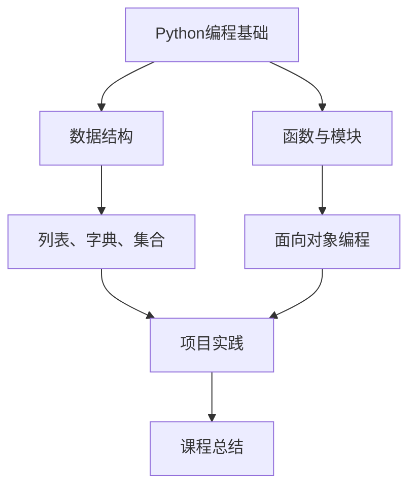
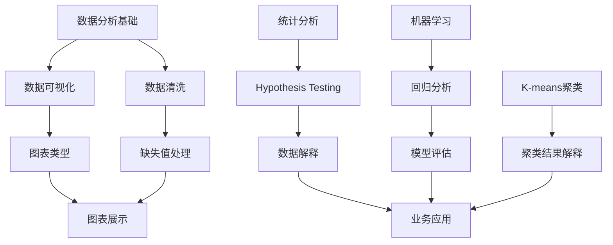
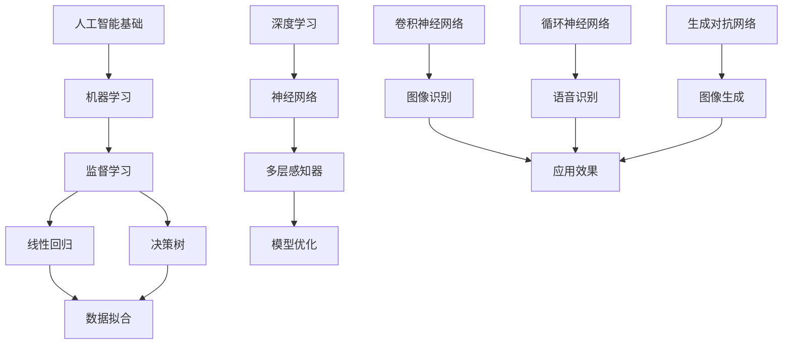

                 

### 文章标题

### 《如何利用直播平台增加课程影响》

### 关键词：

- 直播平台
- 课程影响
- 教学优化
- 推广策略
- 数据分析
- 直播运营

### 摘要：

本文旨在探讨如何利用直播平台来提升课程的影响力和吸引力。通过分析直播平台的发展现状和技术基础，本文提出了课程内容优化、互动策略与教学技巧、直播平台推广策略、数据分析与优化以及直播平台运营管理的系统性方案。结合实际案例，本文详细解析了优秀直播课程的成功要素，为教育工作者和内容创作者提供了实用的指导和建议。

## 引言

在数字化时代，直播平台的兴起为教育行业带来了新的机遇和挑战。传统的教学方式正逐渐被以直播为主的在线教育所取代，这不仅改变了教育资源的传播方式，也改变了学习者获取知识的方式。直播平台作为一种新兴的教育媒介，具有实时互动、内容丰富、传播迅速等特点，使其成为提高课程影响力的重要工具。

本文将通过以下五个部分，系统地探讨如何利用直播平台增加课程影响：

1. **直播平台概述**：介绍直播平台的发展与现状，包括直播技术的发展历程、用户群体分析以及行业现状与趋势。
2. **课程内容优化**：阐述课程内容设计原则，包括定位与目标、内容组织与结构、创新与差异化。
3. **直播平台推广策略**：讨论直播平台品牌建设、课程宣传与推广、数据分析与优化。
4. **直播平台运营管理**：分析直播平台运营策略、内容审核与管理、用户管理等关键环节。
5. **案例分析**：结合实际案例，深入分析优秀直播课程的成功经验。

通过本文的探讨，旨在为教育工作者和内容创作者提供一套实用的直播课程优化策略，帮助他们在竞争激烈的市场中脱颖而出，提升课程的影响力和吸引力。

## 第一部分：直播平台概述

### 第1章：直播平台的发展与现状

直播平台的发展历程可以追溯到互联网技术的快速发展和移动设备的普及。最早期的直播技术主要依赖于桌面电脑和宽带网络，随着技术的进步，直播逐渐向移动端迁移，智能手机和4G网络的普及使得直播变得更加便捷和高效。

#### 1.1 直播平台的发展历程

1. **初期阶段（2005-2010年）**：这一阶段以技术试验和初步应用为主，常见的直播平台包括YouTube和Ustream等，这些平台主要以视频分享和娱乐直播为主。
   
2. **快速发展阶段（2011-2015年）**：随着移动互联网的兴起，直播技术得到广泛应用，直播平台如雨后春笋般涌现，如Twitch、Periscope和YouTube Live等。直播内容也从娱乐扩展到教育、游戏、体育等多个领域。

3. **成熟阶段（2016年至今）**：直播平台进一步成熟，技术得到优化，用户体验不断提升。此外，直播平台逐渐向垂直领域和专业领域扩展，如教育直播平台如知乎Live、网易云课堂等。

#### 1.2 直播平台的用户群体分析

直播平台的用户群体呈现出多样化和年轻化的特点。根据数据分析，以下群体是直播平台的主要用户：

1. **年轻人（18-35岁）**：这一群体是直播平台的核心用户，具有较高的活跃度和参与度。他们习惯于通过直播获取信息、娱乐和学习。

2. **游戏玩家**：游戏直播是直播平台的重要应用领域，游戏玩家不仅是观看者，也是积极参与者和互动者。

3. **专业人士**：包括教师、讲师、专家等，他们利用直播平台进行专业知识的传授和分享。

4. **普通观众**：包括各种年龄段的观众，他们通过直播获取娱乐、信息和学习资源。

#### 1.3 直播平台的行业现状与趋势

直播平台的行业现状呈现出以下趋势：

1. **市场规模持续扩大**：随着用户基数的增加和技术的不断进步，直播平台的市场规模持续扩大。根据市场调研报告，全球直播市场的规模预计将在未来几年内继续保持高速增长。

2. **内容多样化**：直播平台的内容不再局限于娱乐和游戏，教育、医疗、金融等多个领域的直播内容逐渐丰富，直播平台成为多元化信息传播的重要渠道。

3. **商业模式创新**：直播平台的商业模式不断创新，包括广告、会员订阅、虚拟礼物、电商等多元化收入来源，使得平台具备更强的盈利能力。

4. **技术优化与升级**：直播平台不断优化和升级技术，提高直播的清晰度、稳定性和互动性，提升用户体验。

5. **监管加强**：随着直播行业的快速发展，各国政府和监管机构对直播内容的监管力度不断加强，以防止不良信息的传播。

### 总结

直播平台作为互联网技术发展的重要成果，已经成为教育行业的重要组成部分。了解其发展历程、用户群体和行业现状，有助于教育工作者和内容创作者更好地利用直播平台，提升课程的影响力和吸引力。

## 第二部分：直播平台技术基础

### 第2章：直播平台技术基础

直播平台的技术基础是其能够提供高质量直播体验的核心。本章节将深入探讨直播技术原理、直播平台架构设计以及直播平台的关键技术。

#### 2.1 直播技术原理

直播技术主要涉及视频采集、视频编码、传输和播放等环节。

1. **视频采集**：视频采集是将现实世界的画面和声音转化为数字信号的过程。常见的视频采集设备包括摄像头、麦克风等。

2. **视频编码**：视频编码是将原始的数字视频信号进行压缩，以便在网络中高效传输。常见的视频编码标准包括H.264、H.265等。

3. **传输**：直播数据的传输通常依赖于流媒体协议，如RTMP、HLS、DASH等。这些协议能够确保直播数据的实时传输和流畅播放。

4. **播放**：视频播放是将传输过来的直播数据解码并展示在用户设备上的过程。用户可以通过直播客户端观看直播内容。

#### 2.2 直播平台架构设计

直播平台架构设计主要包括前段、后端和数据库三个部分。

1. **前段**：直播平台的前端包括网页端和移动端的应用，用户通过这些前端应用观看直播内容。前端技术通常包括HTML、CSS和JavaScript等。

2. **后端**：直播平台的后端主要负责处理直播数据，包括视频采集、编码、传输和存储等。后端技术通常包括服务器、数据库、流媒体服务器等。

3. **数据库**：直播平台需要存储大量的用户数据、课程数据和直播数据。常用的数据库技术包括关系型数据库（如MySQL、PostgreSQL）和NoSQL数据库（如MongoDB、Redis）。

#### 2.3 直播平台的关键技术

直播平台的关键技术包括直播服务器技术、流媒体技术、实时互动技术和大数据分析技术。

1. **直播服务器技术**：直播服务器是直播平台的核心组件，负责处理直播数据的传输和分发。常用的直播服务器技术包括Nginx、Apache等。

2. **流媒体技术**：流媒体技术是直播平台实现实时传输和播放的基础。常用的流媒体技术包括RTMP、HLS、DASH等。

3. **实时互动技术**：实时互动技术是直播平台提升用户体验的重要手段。常用的实时互动技术包括WebRTC、WebSocket等。

4. **大数据分析技术**：大数据分析技术可以帮助直播平台了解用户行为、优化课程内容和推广策略。常用的数据分析技术包括Hadoop、Spark等。

### 总结

直播平台的技术基础是其提供高质量直播体验的关键。了解直播技术原理、直播平台架构设计和直播平台的关键技术，有助于教育工作者和内容创作者更好地利用直播平台，提升课程的影响力和吸引力。

## 第三部分：课程内容优化

### 第3章：课程内容设计原则

课程内容的设计是提升直播课程影响力的关键环节。为了使课程内容更具吸引力和实用性，我们需要遵循以下设计原则：

#### 3.1 课程内容定位与目标

1. **明确课程定位**：课程定位是课程设计的第一步，需要明确课程面向的受众群体、课程的主题和目标。例如，是面向初学者还是专业人士，课程是专注于技术还是实践应用。

2. **设定课程目标**：课程目标应该具体、明确且可衡量。例如，通过本课程的学习，学员应掌握哪些核心技能，能够解决哪些实际问题。

#### 3.2 课程内容组织与结构

1. **模块化设计**：将课程内容模块化，有助于学员更清晰地理解知识点。每个模块应该围绕一个特定的主题，包含相关的理论知识和实践案例。

2. **逻辑顺序**：课程内容应该按照逻辑顺序进行组织，确保学员在学习过程中能够逐步掌握知识点，形成完整的知识体系。

3. **理论与实践结合**：课程内容应兼顾理论与实践，理论部分应简洁明了，实践部分应具体可行。通过案例分析和实践操作，帮助学员更好地理解和应用所学知识。

#### 3.3 课程内容创新与差异化

1. **创新教学方法**：运用多样化的教学方法，如互动讨论、案例教学、项目驱动等，提高学员的参与度和学习兴趣。

2. **差异化内容**：在课程内容上寻求差异化，可以结合最新技术趋势、行业动态和实际案例，确保课程内容的新颖性和实用性。

3. **个性化服务**：针对不同学员的需求，提供个性化的学习资源和辅导服务，如在线答疑、作业批改等，增强学员的满意度和忠诚度。

### 总结

课程内容设计原则是提升直播课程影响力的重要保障。通过明确课程定位与目标、合理组织与结构化课程内容、创新与差异化教学，可以显著提升课程的质量和吸引力，为学员提供更优质的学习体验。

### 第4章：互动策略与教学技巧

互动策略与教学技巧是提升直播课程吸引力和学员参与度的重要手段。通过有效的互动策略和教学技巧，讲师可以与学员建立更紧密的连接，提高课程的互动性和趣味性。

#### 4.1 直播间互动策略

1. **实时问答**：在直播过程中，讲师应预留时间回答学员的问题，鼓励学员积极参与，提高互动性。可以通过弹幕、评论等方式收集问题，确保每个问题都能得到及时解答。

2. **分组讨论**：将学员分成小组，针对特定话题进行讨论。这种策略可以激发学员的思考，提高学习效果。讲师可以在讨论结束后进行总结和点评，引导学员深入理解知识点。

3. **实时投票**：通过实时投票功能，讲师可以了解学员对课程内容的掌握情况，及时调整教学节奏和内容。

#### 4.2 教学互动技巧

1. **讲述与演示相结合**：讲师应在讲述理论知识的同时，结合实际操作演示，使学员更直观地理解知识点。

2. **案例分析**：通过案例分析，讲师可以将抽象的理论知识具体化，帮助学员更好地应用到实际工作中。

3. **互动游戏**：设计一些互动游戏，如知识竞赛、抢答等，提高学员的参与度和兴趣。

4. **情感共鸣**：通过讲述个人经历、分享感人事迹等方式，与学员建立情感连接，增强课程的亲和力和感染力。

#### 4.3 学生反馈机制

1. **即时反馈**：讲师应在直播过程中关注学员的反应，及时调整教学内容和节奏。可以通过弹幕、评论等方式收集学员的反馈，快速响应学员的需求。

2. **定期评估**：在直播课程结束后，进行定期的课程评估，包括学员满意度调查、学习效果测试等，了解学员的学习情况，不断优化课程内容和方法。

3. **个性化辅导**：根据学员的反馈和学习情况，提供个性化的辅导服务，如一对一答疑、作业批改等，帮助学员解决学习中的困难。

### 总结

互动策略与教学技巧是提升直播课程吸引力和学员参与度的重要保障。通过实时问答、分组讨论、实时投票等互动策略，以及讲述与演示相结合、案例分析、互动游戏等教学技巧，讲师可以与学员建立更紧密的连接，提高课程的互动性和趣味性。同时，通过即时反馈、定期评估和个性化辅导，讲师可以不断优化课程内容和方法，提升学员的学习效果和满意度。

### 第5章：直播平台品牌建设

直播平台品牌建设是提升课程影响力和吸引力的关键环节。一个成功的品牌能够帮助教育机构或个人讲师在激烈的市场竞争中脱颖而出。以下将从品牌定位、品牌形象设计和品牌传播策略三个方面，详细探讨直播平台品牌建设的方法。

#### 5.1 直播平台品牌定位

品牌定位是品牌建设的基础，需要明确以下几个关键点：

1. **目标受众**：确定直播平台的目标受众，包括年龄、职业、兴趣爱好等特征。例如，是面向初学者、专业人士还是特定行业的从业者。

2. **课程特色**：根据目标受众的需求，明确直播平台的核心课程特色。例如，是专注于技术培训、职业技能提升还是兴趣爱好培养。

3. **价值观**：确立直播平台的价值观，包括教育理念、服务宗旨等。例如，强调知识共享、创新教学、实战导向等。

#### 5.2 直播平台品牌形象设计

品牌形象设计是品牌建设的重要组成部分，包括视觉设计和语言表达两个方面。

1. **视觉设计**：视觉设计应简洁、清晰且具有辨识度。包括LOGO、色彩搭配、字体设计等。例如，可以选择鲜艳、明亮的颜色，以传达活力和创新的形象。

2. **语言表达**：品牌名称、口号和宣传语等语言表达应简洁、富有内涵。例如，品牌名称可以体现课程特色和价值观，口号和宣传语可以激励学员、传递正能量。

#### 5.3 直播平台品牌传播策略

品牌传播策略是提升品牌知名度、美誉度和影响力的重要手段。以下几种策略可供参考：

1. **内容营销**：通过高质量的直播课程内容，吸引目标受众关注。内容应具备专业性和实用性，能够解决受众的实际问题。

2. **社交媒体营销**：利用微博、微信、抖音等社交媒体平台，发布与品牌相关的动态和内容，扩大品牌影响力。可以通过互动活动、话题讨论等方式，提高用户的参与度和活跃度。

3. **合作推广**：与行业内的知名机构、专家和意见领袖合作，共同推广品牌。可以通过合作课程、联合宣传等方式，借助合作伙伴的资源和影响力，提升品牌知名度。

4. **广告投放**：在目标受众集中的平台和渠道进行广告投放，如百度推广、今日头条、抖音广告等。通过精准定位和定向投放，提高广告的转化率。

5. **线下活动**：举办线下活动，如讲座、研讨会、技术沙龙等，与学员面对面交流，增强品牌的亲和力和影响力。

### 总结

直播平台品牌建设是提升课程影响力和吸引力的重要策略。通过明确品牌定位、设计独特的品牌形象以及制定有效的品牌传播策略，教育机构或个人讲师可以建立强大的品牌影响力，吸引更多的学员和合作伙伴，实现持续的发展和成长。

### 第6章：课程宣传与推广

课程宣传与推广是提升直播课程影响力和知名度的重要环节。通过多渠道、多方式的宣传策略，讲师和机构可以有效地将课程内容传播给目标受众，吸引潜在学员，从而提升课程的影响力和市场占有率。以下将从课程宣传渠道、社交媒体营销策略、联合推广与跨界合作三个方面，详细探讨课程宣传与推广的方法。

#### 6.1 课程宣传渠道

1. **社交媒体平台**：社交媒体平台是课程宣传的重要渠道。讲师可以利用微博、微信、抖音、B站等平台，发布课程相关的内容，如课程预告、课程大纲、讲师介绍等。通过互动和分享，提高课程的曝光率和关注度。

2. **内容平台**：内容平台如知乎、简书、头条号等，讲师可以撰写专业文章或发布课程相关内容，通过优质内容吸引读者，进而引导读者关注课程。

3. **垂直行业论坛**：在相关行业的论坛和社群中发布课程信息，与行业内的专业人士和爱好者互动，提升课程的行业影响力和认可度。

4. **传统媒体**：利用报纸、杂志、电视等传统媒体进行宣传，特别是在与课程主题相关的专栏或节目中进行宣传，可以扩大课程的受众范围。

#### 6.2 社交媒体营销策略

1. **内容策略**：内容是吸引受众的关键。讲师应定期发布高质量的、与课程主题相关的内容，如技术文章、案例分析、学习心得等，确保内容的实用性、专业性和吸引力。

2. **互动策略**：与受众互动是提升用户粘性和参与度的重要手段。讲师可以在社交媒体平台上开设问答环节，解答学员的疑问，增强互动性。

3. **病毒营销**：通过设计具有趣味性和传播性的内容，如小游戏、挑战活动、热门话题等，激发用户的分享欲望，实现病毒式传播。

4. **KOL合作**：与行业内的意见领袖（KOL）合作，通过他们的影响力推广课程。例如，邀请KOL进行课程推荐、参与课程直播等，扩大课程的受众范围和影响力。

#### 6.3 联合推广与跨界合作

1. **合作伙伴**：与相关机构、企业合作，通过联合推广课程，共享资源和受众。例如，与知名企业合作，将其作为员工培训课程，提升课程的市场影响力。

2. **跨界合作**：与不同行业的品牌或机构合作，进行跨界推广。例如，与时尚品牌合作，推出时尚技能培训课程，吸引时尚爱好者关注。

3. **活动赞助**：赞助行业活动或教育展会，提升品牌和课程的曝光率。通过在活动现场进行课程宣传和推广，吸引潜在学员。

4. **线上线下结合**：利用线上线下相结合的宣传方式，提高课程的覆盖面。例如，在线上发布课程预告和试听课程，在线下举办讲座或研讨会，吸引学员报名。

### 总结

课程宣传与推广是提升直播课程影响力和知名度的重要策略。通过利用社交媒体平台、内容平台、垂直行业论坛等渠道，讲师和机构可以有效地将课程内容传播给目标受众。同时，通过内容策略、互动策略、病毒营销和KOL合作等社交媒体营销策略，以及与合作伙伴和跨界品牌的联合推广和跨界合作，可以进一步提升课程的曝光率和影响力，吸引更多的潜在学员。

### 第7章：数据分析与优化

在直播课程中，数据分析是提升课程质量和用户满意度的关键。通过对直播数据的收集与分析，讲师和平台运营者可以深入了解用户行为，优化课程内容和直播策略，从而提升直播效果。以下从直播数据收集、用户行为分析和直播效果优化策略三个方面，详细探讨数据分析与优化的方法。

#### 7.1 直播数据收集

1. **观看时长**：收集学员观看课程的时长数据，了解学员对课程的兴趣点和关注度。可以通过对观看时长的分析，识别出受欢迎的部分和需要改进的部分。

2. **互动数据**：收集学员在直播过程中的互动数据，包括提问、评论、点赞等。通过分析互动数据，可以了解学员的参与度和活跃度，从而调整直播节奏和内容。

3. **退出率**：监控学员在直播过程中的退出率，分析学员退出直播的原因，如课程内容过于复杂、直播过程中出现技术问题等。通过优化直播内容和技术，降低学员退出率。

4. **课程评价**：收集学员对课程的评价，包括满意度、课程难度等。通过评价数据，可以了解课程的优缺点，为课程改进提供依据。

#### 7.2 用户行为分析

1. **用户画像**：通过数据分析，构建用户画像，包括用户的年龄、职业、地域等特征。通过用户画像，可以更好地了解用户需求，提供个性化的课程推荐。

2. **学习路径分析**：分析用户的学习路径，了解用户在课程中的学习行为，如观看顺序、学习时长、学习频率等。通过学习路径分析，可以优化课程结构，提高学习效果。

3. **行为预测**：利用机器学习和大数据分析技术，预测用户的学习行为和需求，提前制定相应的课程和推广策略。

#### 7.3 直播效果优化策略

1. **内容优化**：根据用户行为分析和课程评价数据，对课程内容进行优化。可以增加用户感兴趣的话题、调整教学方式、提高课程难度等。

2. **直播节奏调整**：根据学员的观看时长和互动数据，调整直播节奏。例如，在学员兴趣点较多的部分，可以适当延长讲解时间，在学员容易分神的部分，可以增加互动环节，提高学员的参与度。

3. **技术优化**：通过监控直播过程中的技术问题，如网络延迟、视频卡顿等，优化直播技术，提高直播的稳定性和流畅性。

4. **推广策略优化**：根据用户行为数据，调整推广策略，如投放渠道、推广内容等。通过数据驱动，提高推广效果的精准度和转化率。

### 总结

数据分析与优化是提升直播课程效果的重要手段。通过收集和分析直播数据，讲师和平台运营者可以深入了解用户行为和需求，优化课程内容和直播策略。同时，通过用户行为分析和直播效果优化策略，可以进一步提高直播课程的质量和用户满意度，提升课程的影响力和市场竞争力。

### 第8章：直播平台运营策略

直播平台运营策略是确保直播课程顺利进行和持续发展的关键。一个有效的运营策略需要涵盖从前期准备、直播过程中的管理，到直播结束后的反馈与优化等多个环节。以下从直播平台运营流程、直播内容审核与管理以及直播平台用户管理三个方面，详细探讨直播平台运营策略。

#### 8.1 直播平台运营流程

1. **前期准备**：
   - **课程策划**：明确课程目标、内容、时间表和讲师安排。确保课程策划与市场需求和用户兴趣相符合。
   - **技术测试**：在直播前进行技术测试，包括网络连接、直播设备、流媒体服务器等，确保直播的稳定性。
   - **宣传推广**：提前进行课程宣传，通过社交媒体、电子邮件、官方网站等多渠道发布课程信息，吸引潜在学员。

2. **直播过程管理**：
   - **现场管理**：讲师应按时开始直播，确保直播内容按照预定计划进行。同时，监控直播过程中的技术问题，如网络延迟、视频卡顿等，及时解决。
   - **互动管理**：鼓励学员积极参与互动，通过弹幕、评论、提问等方式，增加学员的参与感和满意度。讲师应定期回答学员的问题，确保互动的顺畅。

3. **直播结束后**：
   - **数据收集**：收集直播数据，包括观看时长、互动数据、学员反馈等，进行分析和总结。
   - **内容优化**：根据学员反馈和数据分析结果，对课程内容进行优化和调整，提升课程质量。
   - **后续跟进**：通过邮件、社交媒体等方式，对学员进行后续跟进，了解课程效果，收集进一步的建议和反馈。

#### 8.2 直播内容审核与管理

1. **内容审核**：
   - **合规性审核**：确保直播内容符合法律法规和平台政策，不包含违规或不良信息。
   - **质量审核**：对课程内容进行质量审核，确保内容的准确性、实用性和专业性。

2. **内容管理**：
   - **分类管理**：将课程内容按照主题、难度、受众等分类，方便学员查找和选择。
   - **更新维护**：定期对课程内容进行更新和维护，引入新的知识点和案例，保持内容的时效性和相关性。

3. **版权管理**：
   - **版权保护**：确保课程内容的版权，避免侵权问题。对于引用的第三方内容，应获取相应的授权或注明来源。

#### 8.3 直播平台用户管理

1. **用户注册与认证**：
   - **注册流程**：简化注册流程，提供多种注册方式，如手机号、邮箱、社交媒体账号等，提高用户注册率。
   - **认证制度**：建立用户认证制度，确保用户的真实性和活跃度。例如，可以通过实名认证、邀请码等方式，筛选优质用户。

2. **用户权限管理**：
   - **权限分级**：根据用户的角色和需求，设置不同的权限等级，如讲师、管理员、普通用户等，保障平台的运行和管理。
   - **权限监控**：监控用户的权限使用情况，防止权限滥用，确保平台的正常运作。

3. **用户服务**：
   - **客服支持**：提供24小时客服支持，解答用户的问题和疑虑，提升用户满意度。
   - **用户反馈**：建立用户反馈机制，收集用户的意见和建议，及时解决问题，不断优化用户体验。

### 总结

直播平台运营策略是确保直播课程顺利进行和持续发展的重要保障。通过明确的运营流程、严格的内容审核与管理以及有效的用户管理，讲师和平台运营者可以确保直播课程的顺利进行，提升用户满意度和课程质量，从而实现平台的长远发展。

### 第9章：直播平台风险防范

直播平台作为新兴的在线教育工具，在为用户提供便捷学习途径的同时，也面临着诸多风险。为了保障直播平台的健康发展和用户的合法权益，需要从法律风险防范、内容安全防范和网络安全防范三个方面进行风险防范。

#### 9.1 直播平台法律风险防范

1. **版权风险**：直播平台需要对课程内容的版权进行严格管理，确保所有内容的合法性。讲师或机构在制作课程时，应确保引用的图片、音频、视频等素材均获得相应的授权或注明来源。平台应建立版权审核机制，防止侵权内容的上传和传播。

2. **用户隐私保护**：直播平台需要遵守相关法律法规，保护用户的隐私权。例如，平台应确保用户注册信息、学习记录等个人数据的保密性，不得擅自泄露用户信息。同时，平台应明确告知用户数据收集的目的、方式和范围，并获得用户的同意。

3. **合规审查**：直播平台应对直播内容进行定期审查，确保内容符合法律法规和平台政策。例如，禁止直播涉黄、暴力、反动等违法内容。平台应建立健全的投诉举报机制，及时发现和处理违规内容。

#### 9.2 直播平台内容安全防范

1. **内容监控**：平台应建立内容监控机制，对直播内容进行实时监控和审查。通过技术手段和人工审核相结合，及时发现和处理违规内容，如不良信息、恶意言论等。

2. **内容分级**：根据内容的不同性质和风险程度，对直播内容进行分级管理。对于高风险内容，如涉及隐私、敏感话题等，应采取严格的审核和管理措施。

3. **内容预警**：建立内容预警机制，对潜在违规内容进行提前预警和处理。例如，通过关键词监测、行为分析等技术手段，识别和拦截不良信息。

#### 9.3 直播平台网络安全防范

1. **数据加密**：平台应采用加密技术，确保用户数据和直播流的安全性。例如，使用SSL/TLS协议加密用户通信数据，防止数据泄露和篡改。

2. **网络监控**：平台应建立网络监控系统，实时监测网络流量和用户行为，及时发现和处理异常情况。例如，监控DDoS攻击、恶意软件传播等，保障平台的稳定运行。

3. **系统安全升级**：定期对平台系统进行安全升级和漏洞修复，确保系统的安全性。例如，及时更新安全补丁、加强防火墙设置等。

4. **应急响应**：建立应急响应机制，制定应急预案，应对突发网络安全事件。例如，当平台遭受攻击时，能够迅速采取措施，减轻损失，保障用户利益。

### 总结

直播平台风险防范是确保平台健康发展的重要保障。通过法律风险防范、内容安全防范和网络安全防范，平台可以保障用户的合法权益，维护良好的网络环境，实现持续、健康的发展。

### 第10章：优秀直播课程案例分析

#### 10.1 案例一：某知名讲师的直播课程分析

**背景介绍**：某知名讲师张老师在直播平台上开设了一门名为“Python编程入门与实践”的课程。该课程面向编程初学者，旨在帮助他们快速掌握Python编程基础，并具备实际项目开发能力。

**课程内容定位与目标**：课程内容主要涵盖Python的基本语法、数据结构、函数、类和模块等核心知识。课程目标是通过理论与实践结合，使学员能够在短时间内掌握Python编程，并能够独立完成小型项目。

**核心概念与联系**：



**核心算法原理讲解**：

```python
# Python基本语法示例
def hello_world():
    print("Hello, World!")

# 列表操作示例
def list_example():
    my_list = [1, 2, 3, 4, 5]
    print(my_list[0])
    my_list.append(6)
    print(my_list)

# 函数与模块示例
import math

def power(x, n):
    return math.pow(x, n)

print(power(2, 3))
```

**直播效果优化策略**：

- **实时互动**：张老师通过弹幕、评论等方式与学员实时互动，解答学员的问题，提高课程的互动性和参与度。
- **案例教学**：张老师结合实际项目案例进行讲解，使学员能够更好地理解和应用所学知识。
- **个性化辅导**：针对不同学员的需求，张老师提供个性化的辅导服务，如作业批改、项目指导等。

**直播效果**：该课程在直播平台上取得了良好的口碑和学员反馈，学员数量稳步增长，课程评价评分高。

#### 10.2 案例二：某教育机构的直播课程分析

**背景介绍**：某知名教育机构在直播平台上开设了一门名为“数据分析师训练营”的课程。该课程面向数据分析和数据挖掘领域的学习者，旨在通过系统化的培训，帮助学员掌握数据分析的实战技能。

**课程内容定位与目标**：课程内容涵盖数据分析的基础知识、数据清洗、数据可视化、统计分析、机器学习等核心技能。课程目标是通过案例分析和实践操作，使学员能够独立完成数据分析项目，并具备数据分析师的岗位能力。

**核心概念与联系**：



**核心算法原理讲解**：

```python
# 数据清洗与缺失值处理示例
import pandas as pd

data = pd.read_csv('data.csv')
data.fillna(data.mean(), inplace=True)
print(data)

# 数据可视化示例
import matplotlib.pyplot as plt

plt.scatter(data['x'], data['y'])
plt.xlabel('X-axis')
plt.ylabel('Y-axis')
plt.show()

# 机器学习回归分析示例
from sklearn.linear_model import LinearRegression

model = LinearRegression()
model.fit(data[['x']], data['y'])
print(model.predict([[5]]))
```

**直播效果优化策略**：

- **互动教学**：教育机构通过实时问答、分组讨论等方式，增强学员的互动性和参与感。
- **实战项目**：课程设计包含多个实战项目，学员在讲师的指导下完成项目，提升实战能力。
- **教学反馈**：讲师根据学员的学习进度和项目反馈，调整教学方法和课程内容。

**直播效果**：该课程在直播平台上受到了广泛好评，学员反馈积极，课程完成率和就业率较高。

#### 10.3 案例三：某在线教育平台的直播课程分析

**背景介绍**：某在线教育平台开设了一门名为“人工智能入门与实践”的课程。该课程面向对人工智能感兴趣的初学者，旨在通过系统化的培训，使学员掌握人工智能的基础知识和应用技能。

**课程内容定位与目标**：课程内容涵盖人工智能的基本概念、机器学习算法、深度学习框架、自然语言处理等核心内容。课程目标是通过理论与实践结合，使学员具备人工智能项目的开发能力，并能够应用于实际问题解决。

**核心概念与联系**：



**核心算法原理讲解**：

```python
# 机器学习线性回归示例
import numpy as np
from sklearn.linear_model import LinearRegression

X = np.array([[1], [2], [3], [4], [5]])
y = np.array([1, 2, 2.5, 4, 5])

model = LinearRegression()
model.fit(X, y)
print(model.predict(np.array([[6]])))

# 深度学习卷积神经网络示例
import tensorflow as tf

model = tf.keras.Sequential([
    tf.keras.layers.Conv2D(32, (3, 3), activation='relu', input_shape=(28, 28, 1)),
    tf.keras.layers.MaxPooling2D((2, 2)),
    tf.keras.layers.Flatten(),
    tf.keras.layers.Dense(128, activation='relu'),
    tf.keras.layers.Dense(10, activation='softmax')
])

model.compile(optimizer='adam',
              loss='categorical_crossentropy',
              metrics=['accuracy'])

model.fit(X, y, epochs=10)
```

**直播效果优化策略**：

- **案例驱动**：通过实际案例的讲解和分析，使学员更好地理解和应用人工智能算法。
- **互动交流**：讲师在直播过程中鼓励学员提问和参与讨论，提升课程的互动性和参与感。
- **教学资源**：提供丰富的教学资源，如教程、代码示例、视频课程等，方便学员自主学习。

**直播效果**：该课程在直播平台上获得了广泛认可，学员评价高，课程报名人数持续增长。

### 总结

通过分析以上三个案例，我们可以看到，优秀直播课程的成功离不开明确的内容定位与目标、科学的核心概念与联系讲解、详细的算法原理讲解和实战案例分析，以及有效的直播效果优化策略。这些成功经验为其他讲师和机构提供了宝贵的参考和启示。

### 附录

#### 附录 A：直播平台常用工具与资源

**A.1 直播平台工具对比**

1. **腾讯云直播**：提供直播推流、直播播放、录制与回放、云端录制等功能。支持多种推流协议和互动功能。
2. **阿里云直播**：提供高清直播推流、播放、录制、互动等功能。支持多种编码格式和分辨率调整。
3. **网易云课堂**：专注于在线教育直播，提供课程发布、直播互动、作业批改等功能。支持多终端访问。

**A.2 直播内容制作工具**

1. **OBS Studio**：一款开源的直播录制和视频制作软件，支持多种直播流协议和视频源。
2. **Camtasia**：一款功能强大的视频制作软件，适用于直播课程录制和剪辑。
3. **Zoom**：提供在线会议和直播功能，支持多人互动和屏幕共享。

**A.3 直播数据分析工具**

1. **阿里云日志服务**：提供直播日志收集、存储、分析和可视化功能。
2. **腾讯云数据套件**：提供实时数据分析、统计报表和可视化报告。
3. **Google Analytics**：一款强大的数据分析工具，适用于直播平台用户行为分析和流量监控。

#### 附录 B：直播平台运营指南

**B.1 直播平台运营策略解析**

1. **内容策略**：定期更新高质量直播课程，结合热点话题和用户需求，提升课程吸引力和用户粘性。
2. **用户策略**：建立用户社群，通过互动活动和会员服务，提升用户参与度和忠诚度。
3. **营销策略**：利用社交媒体、合作推广和广告投放等手段，扩大品牌影响力，吸引潜在用户。

**B.2 直播平台运营技巧总结**

1. **时间管理**：合理安排直播时间，确保学员能够按时参与。
2. **互动管理**：鼓励学员积极参与互动，及时解答问题，提升直播氛围。
3. **技术保障**：确保直播设备的稳定性和网络环境的良好，减少技术问题对直播的影响。

**B.3 直播平台运营常见问题及解决方法**

1. **问题一：直播卡顿**：解决方法：检查网络连接，提高带宽或更换直播服务器。
2. **问题二：学员提问不及时回复**：解决方法：增加互动环节，设置问答时间，或提前安排助教进行互动管理。
3. **问题三：课程内容不够吸引**：解决方法：更新课程内容，引入新的知识点和实际案例，提高课程的实用性和趣味性。

### 总结

附录部分提供了直播平台常用工具与资源的对比、直播内容制作工具的推荐以及直播平台运营指南和常见问题的解决方法。这些工具和资源有助于教育工作者和内容创作者更有效地利用直播平台，提升课程质量和用户体验。

### 作者信息

作者：AI天才研究院/AI Genius Institute & 禅与计算机程序设计艺术 /Zen And The Art of Computer Programming

