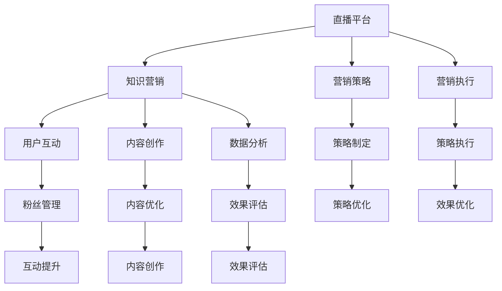

                 


### 文章标题

# 如何利用直播平台进行知识营销

### 关键词

- 直播平台
- 知识营销
- 用户互动
- 内容创作
- 数据分析
- 营销策略
- 营销执行
- 营销效果评估

### 摘要

本文旨在探讨如何利用直播平台进行知识营销。首先，我们将回顾直播平台的发展历程和知识营销的基础概念。随后，文章将详细分析直播平台在知识营销中的应用场景、优势和挑战，并提供结合策略。接着，我们将探讨直播平台用户行为分析的重要性、方法和实际应用。接下来，文章将深入讨论直播内容创作与优化的技巧，以及直播平台运营策略和直播互动与粉丝管理的策略。此外，我们将介绍直播平台数据分析的方法和知识营销效果评估的方法和工具。最后，通过案例分析，我们将展示如何制定和执行直播平台营销策略，并提供解决方案以解决直播平台营销困境。本文将帮助您了解直播平台知识营销的全过程，并提供实用的最佳实践和拓展阅读建议。让我们一起探索如何利用直播平台创造知识营销的成功吧！

## 目录大纲

1. 直播平台与知识营销基础
   1.1 直播平台概述
       - 直播平台的发展历程
       - 直播平台的类型和特点
       - 直播平台的经济模型
   1.2 知识营销概述
       - 知识营销的概念与价值
       - 知识营销与传统营销的差异
       - 知识营销的目标和策略
   1.3 直播平台与知识营销的结合
       - 直播平台在知识营销中的应用场景
       - 直播平台在知识营销中的优势和挑战
       - 直播平台与知识营销的融合策略

2. 直播平台用户行为分析
   2.1 用户行为分析的意义和方法
       - 用户行为分析的重要性
       - 用户行为分析方法
   2.2 用户画像与用户行为特征
       - 用户画像的概念和构建
       - 用户行为特征分析
   2.3 用户行为分析在实际操作中的应用
       - 用户行为数据收集
       - 用户行为数据分析工具

3. 直播平台内容创作与优化
   3.1 直播内容创作
       - 直播内容的类型和选择
       - 直播内容创作流程
       - 直播内容优化技巧
   3.2 直播平台运营策略
       - 直播平台运营目标
       - 直播平台运营流程
       - 直播平台运营策略优化
   3.3 直播互动与粉丝管理
       - 直播间的互动形式
       - 粉丝管理策略
       - 粉丝活跃度提升技巧

4. 直播平台数据分析与应用
   4.1 直播平台数据分析
       - 数据分析的意义和方法
       - 直播数据指标体系
       - 数据分析在实际操作中的应用
   4.2 知识营销效果评估
       - 营销效果评估的方法和工具
       - 营销效果评估指标
       - 营销效果评估在实际操作中的应用

5. 直播平台营销策略制定与执行
   5.1 直播平台营销策略制定
       - 营销策略制定流程
       - 营销策略制定原则
       - 营销策略制定工具与方法
   5.2 直播平台营销策略执行
       - 营销策略执行流程
       - 营销策略执行原则
       - 营销策略执行工具与方法
   5.3 直播平台营销效果评估与优化
       - 营销效果评估与优化的意义和方法
       - 营销效果评估与优化的流程
       - 营销效果评估与优化的工具与方法

6. 直播平台营销困境与解决方案
   6.1 直播平台营销困境分析
       - 直播平台营销常见困境
       - 困境产生的原因
       - 困境的危害
   6.2 直播平台营销解决方案
       - 解决方案的设计原则
       - 解决方案的具体实施步骤
       - 解决方案的效果评估与优化

7. 附录
   7.1 直播平台营销工具与资源
       - 主流直播平台介绍
       - 直播平台营销工具推荐
       - 直播平台营销资源获取渠道
   7.2 直播平台营销案例精选
       - 案例一：如何利用直播进行新品发布
       - 案例二：如何利用直播进行品牌推广
       - 案例三：如何利用直播进行教育培训

## 1.1 直播平台概述

### 1.1.1 直播平台的发展历程

直播平台的发展历程可以追溯到20世纪90年代，当时主要依靠传统的视频会议技术进行实时视频传输。然而，随着互联网技术的快速发展，直播平台逐渐从单纯的实时视频传输平台演变为集内容创作、互动交流、用户生成内容等多种功能于一体的综合平台。

2010年前后，随着移动设备的普及和互联网带宽的改善，直播平台开始崭露头角。代表性的平台如Ustream、Livestream等，主要为企业和活动组织者提供直播服务。这一时期，直播主要应用于企业会议、活动直播等领域。

2016年左右，直播平台进入快速发展期，以Twitch、YouTube Live等为代表的平台吸引了大量用户。这一时期的直播内容主要以娱乐游戏、音乐表演、生活分享等为主，用户规模迅速扩大。

2019年以来，直播电商成为直播平台的重要发展方向，直播带货成为电商行业的新风口。平台如抖音、快手、淘宝直播等，利用直播的实时互动和展示功能，实现了商品销售和用户互动的结合。

### 1.1.2 直播平台的类型和特点

直播平台的类型可以大致分为以下几类：

1. **社交直播平台**：以用户生成内容为主，用户可以通过直播分享自己的生活、才艺、知识等。例如，Twitch、YouTube Live、抖音、快手等。

2. **电商直播平台**：以商品销售为主要目的，通过直播展示商品、互动交流，引导用户下单购买。例如，淘宝直播、拼多多直播、京东直播等。

3. **教育直播平台**：以教育培训为主要目的，提供在线授课、课程直播、互动交流等服务。例如，网易云课堂、腾讯课堂、钉钉课堂等。

4. **企业直播平台**：为企业提供会议直播、活动直播等服务，主要应用于企业内部培训和外部宣传活动。例如，企业微信、企业邮箱等。

直播平台的特点包括：

1. **实时互动**：直播平台支持实时音视频传输，用户可以在观看直播的同时与主播或其他观众进行实时互动。

2. **内容多样**：直播平台内容涵盖广泛，包括娱乐、教育、电商、企业等领域，满足不同用户的需求。

3. **用户参与度高**：直播平台的互动功能使得用户可以参与到直播过程中，提高用户参与度和忠诚度。

4. **商业模式丰富**：直播平台可以通过广告收入、会员订阅、直播带货等多种方式实现商业变现。

### 1.1.3 直播平台的经济模型

直播平台的经济模型主要包括以下几个方面：

1. **广告收入**：直播平台可以通过在直播中插入广告来获取收入。广告收入与用户观看时长、广告点击率等因素相关。

2. **会员订阅**：一些直播平台提供会员服务，用户可以通过订阅获取更多增值服务，如去广告、高清直播、会员专属活动等。

3. **电商销售**：直播带货成为直播平台的重要收入来源。平台通过与商家合作，在直播中推广商品，用户可以直接通过直播购买商品。

4. **付费内容**：部分直播平台提供付费内容，用户需要付费才能观看。例如，一些教育培训类直播平台提供付费课程。

5. **增值服务**：直播平台可以提供一些增值服务，如打赏功能、互动道具等，用户可以通过付费获取更多互动体验。

### 1.1.4 小结

直播平台作为互联网时代的新兴产业，经历了从简单视频直播到多样化应用的发展过程。直播平台的类型和特点丰富多样，满足不同用户的需求。同时，直播平台的经济模型也不断创新，为平台和用户带来更多价值。

## 1.2 知识营销概述

### 1.2.1 知识营销的概念与价值

知识营销是指企业通过传播知识、分享经验和传授技能，以提高品牌形象、增强客户忠诚度并促进产品销售的一种营销策略。与传统营销相比，知识营销更加注重信息的传递和价值的创造，通过提供有价值的内容来吸引和留住客户。

知识营销的核心价值在于：

1. **提高品牌知名度**：通过传播专业知识和行业见解，企业可以在目标市场中建立权威形象，提高品牌知名度和影响力。

2. **增强客户忠诚度**：知识营销可以帮助企业与客户建立更深层次的联系，通过提供有价值的信息和解决方案，满足客户的需求，从而增强客户的忠诚度。

3. **促进产品销售**：知识营销可以通过提供产品相关知识、使用技巧和案例，帮助客户更好地了解产品，提高购买意愿，从而促进产品销售。

4. **培养潜在客户**：通过知识营销，企业可以吸引潜在客户，将其转化为实际客户，从而扩大客户群体。

### 1.2.2 知识营销与传统营销的差异

知识营销与传统营销在目标、方法、内容等方面存在显著差异：

1. **目标差异**：传统营销主要关注产品销售和市场份额，而知识营销更注重品牌建设和客户关系的培养。

2. **方法差异**：传统营销主要依靠广告、促销等手段进行市场推广，而知识营销则更多地依赖于内容创作、知识分享和互动交流。

3. **内容差异**：传统营销的内容主要围绕产品本身进行，而知识营销的内容则更加广泛，包括专业知识、行业趋势、案例分析等。

4. **效果差异**：传统营销的效果通常难以量化，而知识营销的效果可以通过客户反馈、内容分享、网站流量等指标进行评估。

### 1.2.3 知识营销的目标和策略

知识营销的目标主要包括：

1. **建立品牌权威**：通过提供行业专业知识，树立企业在目标市场中的权威形象。

2. **培养客户忠诚**：通过分享有价值的内容，增强客户对企业的信任和忠诚度。

3. **促进产品销售**：通过提供产品相关知识，提高客户的购买意愿和购买转化率。

4. **扩大客户群体**：通过吸引潜在客户，扩大企业的客户基础。

为了实现这些目标，知识营销可以采取以下策略：

1. **内容创作**：创作高质量、有价值的知识内容，如文章、视频、教程等，以满足客户的需求。

2. **渠道选择**：选择合适的渠道进行内容传播，如社交媒体、博客、微信公众号等。

3. **互动交流**：与客户进行互动交流，了解客户需求，收集反馈，不断优化内容和服务。

4. **数据分析**：通过数据分析，了解内容传播效果，优化知识营销策略。

### 1.2.4 小结

知识营销作为一种新兴的营销策略，具有显著的价值和优势。通过传播知识、分享经验和传授技能，企业可以建立品牌权威、增强客户忠诚度并促进产品销售。与传统营销相比，知识营销更加注重内容创作和互动交流，具有更高的客户参与度和传播效果。企业应根据自身情况和目标市场，制定合适的知识营销策略，实现营销目标。

## 1.3 直播平台与知识营销的结合

### 1.3.1 直播平台在知识营销中的应用场景

直播平台在知识营销中具有广泛的应用场景，以下是一些常见的应用场景：

1. **教育培训**：直播平台可以用于在线授课、课程直播、互动问答等，提供教育培训服务。教师可以通过直播向学生传授知识，解答问题，实现教学互动。

2. **行业讲座**：企业或专家可以通过直播平台举办行业讲座，分享行业趋势、技术发展、案例研究等，吸引行业人士参与。

3. **产品演示**：企业可以通过直播进行产品演示，展示产品功能、使用方法、实际效果等，帮助用户更好地了解产品，提高购买意愿。

4. **知识分享**：专家或行业人士可以通过直播分享专业知识、经验心得，吸引有共同兴趣的用户参与。

5. **品牌推广**：企业可以通过直播平台进行品牌推广，展示品牌形象、文化理念，增强品牌认知度。

### 1.3.2 直播平台在知识营销中的优势和挑战

直播平台在知识营销中具有以下优势：

1. **实时互动**：直播平台支持实时音视频传输，用户可以在观看直播的同时与主播或其他观众进行实时互动，提高用户参与度和体验。

2. **内容多样化**：直播平台的内容涵盖广泛，可以满足不同用户的需求。无论是教育培训、行业讲座，还是产品演示、知识分享，直播平台都能提供丰富的内容形式。

3. **传播速度快**：直播平台具有较高的传播速度，可以迅速将知识传播给大量用户。通过社交媒体的分享，知识可以迅速扩散，实现病毒式传播。

4. **数据分析**：直播平台可以提供详细的数据分析功能，帮助企业了解用户行为、内容效果等，优化知识营销策略。

然而，直播平台在知识营销中也面临一些挑战：

1. **内容质量**：直播平台的内容质量参差不齐，一些低质量的内容可能会影响用户体验和品牌形象。

2. **用户参与度**：尽管直播平台具有实时互动的优势，但用户参与度可能受到直播时间、内容吸引力等因素的影响。

3. **平台竞争**：直播平台竞争激烈，企业需要不断创新和优化内容，才能在竞争中脱颖而出。

4. **技术门槛**：直播平台的技术门槛相对较高，企业需要投入一定的技术和人力成本来搭建和维护直播平台。

### 1.3.3 直播平台与知识营销的融合策略

为了充分发挥直播平台在知识营销中的作用，企业可以采取以下融合策略：

1. **内容创作**：企业应根据目标市场和用户需求，创作高质量的知识内容。内容可以涵盖行业知识、产品教程、案例分析等，以满足不同用户的需求。

2. **平台选择**：企业应选择适合自身品牌和需求的直播平台。例如，抖音、快手适合娱乐化知识内容，而网易云课堂、腾讯课堂适合教育培训内容。

3. **互动设计**：企业应注重直播互动的设计，通过提问、抽奖、互动游戏等形式，提高用户参与度和互动体验。

4. **数据分析**：企业应充分利用直播平台的数据分析功能，了解用户行为、内容效果等，优化知识营销策略。

5. **品牌推广**：企业可以通过直播平台进行品牌推广，展示品牌形象、文化理念，增强品牌认知度。

6. **合作伙伴**：企业可以与其他企业或专家合作，共同开展知识营销活动，扩大影响力和用户基础。

### 1.3.4 小结

直播平台在知识营销中具有广泛的应用场景和显著的优势，但也面临一些挑战。通过制定合适的融合策略，企业可以充分发挥直播平台在知识营销中的作用，实现品牌推广、用户参与和销售转化。企业应根据自身情况和目标市场，不断优化内容创作和互动设计，提高直播平台在知识营销中的效果。

## 1.4 用户行为分析

### 1.4.1 用户行为分析的意义和方法

用户行为分析在直播平台知识营销中具有重要意义。通过分析用户行为，企业可以更好地了解用户需求、行为习惯和兴趣点，从而优化内容创作和互动设计，提高用户体验和参与度。以下是用户行为分析的主要方法和步骤：

1. **数据收集**：通过直播平台内置的分析工具、社交媒体监控、用户调查问卷等方式收集用户行为数据。数据包括用户观看时长、互动行为（如点赞、评论、分享等）、浏览路径、设备类型等。

2. **数据清洗**：对收集到的数据进行清洗，去除无效数据和噪声数据，确保数据质量。

3. **数据分析**：使用数据分析工具（如Excel、Python等）对清洗后的数据进行分析，提取用户行为特征和趋势。分析方法包括描述性分析、聚类分析、关联分析、时间序列分析等。

4. **用户画像**：基于分析结果，构建用户画像，包括用户的基本信息（如年龄、性别、地域等）、行为特征（如观看偏好、互动行为等）和兴趣点。

5. **行为预测**：利用机器学习算法和模型，对用户行为进行预测，预测用户下一步可能的行为或需求。

### 1.4.2 用户画像与用户行为特征

用户画像是一种描述用户特征和需求的模型，通过用户画像，企业可以更好地了解用户，从而制定更有针对性的营销策略。以下是用户画像和用户行为特征的主要内容：

1. **基本信息**：
   - 年龄：用户年龄分布情况
   - 性别：用户性别比例
   - 地域：用户所在地分布
   - 职业：用户职业分布
   - 教育程度：用户教育程度分布

2. **行为特征**：
   - 观看时长：用户平均观看时长、观看时长分布
   - 互动行为：用户点赞、评论、分享等互动行为频率和比例
   - 浏览路径：用户在平台上的浏览路径和行为轨迹
   - 设备类型：用户使用的设备类型（如手机、电脑等）

3. **兴趣点**：
   - 内容偏好：用户喜欢观看哪些类型的内容
   - 行为偏好：用户在平台上的行为习惯，如何时观看、观看频率等
   - 社交关系：用户在平台上的社交关系，如关注数、粉丝数、互动关系等

### 1.4.3 用户行为分析在实际操作中的应用

在实际操作中，用户行为分析可以应用于以下几个方面：

1. **内容优化**：通过分析用户观看时长、点赞、评论等行为，了解用户对内容的喜好和反馈，从而优化内容创作和发布策略。例如，针对用户喜欢的类型和主题进行内容创作，调整发布时间和频率。

2. **互动设计**：根据用户互动行为特征，设计更符合用户需求的互动活动，提高用户参与度和活跃度。例如，设置与内容相关的互动问题，激励用户参与评论和分享。

3. **用户留存**：通过分析用户行为数据，了解用户流失的原因和关键因素，采取相应的措施提高用户留存率。例如，针对高频用户进行个性化推荐，提供专属福利，增加用户粘性。

4. **营销策略**：基于用户画像和行为特征，制定更有针对性的营销策略，提高营销效果。例如，根据用户兴趣点进行精准推广，通过社交媒体平台扩大传播范围。

### 1.4.4 小结

用户行为分析是直播平台知识营销中不可或缺的一环。通过分析用户行为，企业可以更好地了解用户需求和行为习惯，从而优化内容创作、互动设计和营销策略，提高用户体验和参与度。企业应充分利用直播平台的数据分析工具，构建用户画像，为直播平台知识营销提供有力支持。

## 2. 直播内容创作

### 2.1 直播内容的类型和选择

直播内容的选择直接影响到直播的吸引力和用户参与度。以下是常见的直播内容类型及其选择原则：

1. **教育培训类**：这类直播内容主要针对有特定学习需求的目标用户，如编程技能、语言学习、职业培训等。选择教育培训类内容时，应考虑以下原则：
   - 确定受众群体：明确目标用户，如学生、职场人士等。
   - 内容实用性：选择实用性强的课程内容，如实战技巧、最新技术趋势等。
   - 课程结构：确保课程结构清晰，易于用户理解和消化。

2. **娱乐互动类**：这类直播内容以娱乐性和互动性为主，如游戏直播、音乐表演、生活分享等。选择娱乐互动类内容时，应考虑以下原则：
   - 受众喜好：了解目标用户的娱乐偏好，选择受欢迎的节目类型。
   - 主播魅力：选择有吸引力的主播，具备一定知名度和粉丝基础。
   - 互动设计：设置互动环节，如提问、抽奖、互动游戏等，提高用户参与度。

3. **行业讲座类**：这类直播内容主要面向行业专业人士，分享行业趋势、技术发展、案例分析等。选择行业讲座类内容时，应考虑以下原则：
   - 主题新颖：选择具有前瞻性和实用性的主题，吸引专业人士关注。
   - 讲师权威：选择具有行业影响力的讲师，提升讲座的权威性和可信度。
   - 内容深度：确保讲座内容具有一定的深度和广度，满足专业人士的需求。

4. **产品演示类**：这类直播内容主要展示产品功能、使用方法、实际效果等，以帮助用户更好地了解产品。选择产品演示类内容时，应考虑以下原则：
   - 产品特性：选择具有独特卖点和创新点的产品进行展示。
   - 用户需求：了解目标用户的需求，展示产品如何解决用户问题。
   - 演示技巧：注重演示技巧，通过生动有趣的方式展示产品功能。

5. **知识分享类**：这类直播内容主要分享专业知识和经验心得，以帮助用户拓展知识面。选择知识分享类内容时，应考虑以下原则：
   - 主题实用：选择实用性强、对用户有价值的主题。
   - 内容新颖：分享最新的行业知识和技术动态。
   - 互动交流：鼓励用户提问和互动，提高直播的参与度。

### 2.2 直播内容创作流程

直播内容创作是一个系统性的过程，以下是一个典型的直播内容创作流程：

1. **选题策划**：确定直播的主题和内容方向。根据用户需求、行业动态和自身优势，选择具有吸引力和实用性的主题。

2. **内容创作**：进行内容创作，包括撰写讲稿、制作PPT、录制视频等。内容创作应注重以下几点：
   - 结构清晰：确保直播内容结构清晰，逻辑严密。
   - 语言生动：使用生动的语言和案例，提高内容的吸引力。
   - 重点突出：明确直播的重点内容，避免内容冗长和模糊。

3. **互动设计**：设计直播中的互动环节，如提问、互动游戏、抽奖等，提高用户参与度和互动体验。

4. **技术准备**：确保直播技术准备就绪，包括直播设备、网络环境、软件工具等。

5. **测试预演**：进行直播前的测试和预演，确保直播过程顺利进行。测试内容包括：
   - 设备测试：检查摄像头、麦克风、网络等设备是否正常工作。
   - 软件测试：确保直播软件的功能和稳定性。
   - 互动测试：测试互动环节，确保用户可以顺畅参与。

6. **直播执行**：按照预定的内容和流程进行直播。在直播过程中，注意以下几点：
   - 环境布置：保持直播环境整洁、有序，确保画面美观。
   - 语言表达：注意语言表达清晰、生动，避免出现错误和口误。
   - 用户互动：积极与用户互动，解答用户问题，提高用户参与度。

7. **直播回顾**：直播结束后，对直播过程进行回顾和总结，分析直播效果和用户反馈，为下一次直播提供改进方向。

### 2.3 直播内容优化技巧

直播内容优化是提高直播质量和用户参与度的重要手段。以下是一些直播内容优化技巧：

1. **内容更新**：定期更新直播内容，确保内容的新鲜度和吸引力。可以结合热点事件、行业动态和用户反馈，调整直播主题和内容。

2. **视频剪辑**：对直播视频进行剪辑，去除冗长和不必要的部分，突出重点内容，提高视频观看体验。

3. **画面优化**：优化直播画面质量，确保画面清晰、稳定。可以使用画面美化工具，如滤镜、特效等，提升视觉效果。

4. **声音优化**：确保直播声音清晰、无杂音。可以调整麦克风位置、使用降噪设备等，提高声音质量。

5. **互动设计**：优化互动环节，增加互动环节的多样性和趣味性。可以结合抽奖、问答、投票等形式，提高用户参与度。

6. **数据分析**：利用数据分析工具，了解用户观看行为和反馈，优化内容创作和互动设计。可以针对用户喜欢的类型和主题，调整直播内容。

7. **用户反馈**：积极收集用户反馈，了解用户需求和期望，不断改进直播内容和互动设计。

### 2.4 小结

直播内容创作是直播平台知识营销的核心环节。通过选择合适的直播内容类型、遵循直播内容创作流程和运用优化技巧，可以提升直播质量和用户参与度。企业应根据自身特点和目标用户，制定合适的直播内容策略，实现知识营销的目标。

## 3. 直播平台运营策略

### 3.1 直播平台运营目标

直播平台运营的目标包括以下几个方面：

1. **用户增长**：通过内容创作、推广活动和用户互动，吸引更多用户注册和使用直播平台。

2. **内容丰富**：持续更新和优化直播内容，提高直播内容的多样性和质量，满足不同用户的需求。

3. **用户活跃**：通过互动设计、用户激励和活动策划，提高用户的活跃度和参与度，增强用户粘性。

4. **品牌提升**：通过直播平台的运营，提升企业或品牌的知名度、美誉度和影响力。

5. **商业变现**：通过广告收入、会员订阅、电商销售等多种方式，实现直播平台的商业变现，创造经济效益。

### 3.2 直播平台运营流程

直播平台运营流程主要包括以下环节：

1. **内容创作**：根据用户需求和行业动态，策划和创作高质量的直播内容。内容创作应注重实用性和吸引力，满足用户的需求。

2. **内容审核**：对直播内容进行审核，确保内容符合平台规范和法律法规，避免出现违规内容。

3. **内容发布**：按照预定的时间表和推广计划，发布直播内容。在发布过程中，应注重内容宣传和推广，提高直播的曝光率。

4. **互动管理**：在直播过程中，积极与用户互动，解答用户问题，收集用户反馈，提高用户满意度。同时，应监控直播间的氛围，确保互动氛围和谐。

5. **用户激励**：通过积分、奖励、会员权益等方式，激励用户参与直播互动，提高用户活跃度。

6. **数据分析**：利用数据分析工具，对用户行为、内容效果和互动数据进行分析，了解用户需求和偏好，优化运营策略。

7. **效果评估**：根据运营数据，评估直播平台的效果，包括用户增长、内容质量、用户活跃度和商业变现等。根据评估结果，调整运营策略。

### 3.3 直播平台运营策略优化

为了提升直播平台的运营效果，可以采取以下策略优化：

1. **内容优化**：根据用户反馈和数据分析结果，不断优化直播内容。可以增加用户喜欢的类型和主题，减少不受欢迎的内容。

2. **互动优化**：优化互动环节的设计，提高用户的参与度和互动体验。可以设置更多有趣的互动环节，如问答、抽奖、投票等。

3. **推广优化**：通过精准的推广策略，提高直播内容的曝光率。可以根据用户画像和兴趣标签，进行定向推广。

4. **用户激励**：增加用户激励措施，提高用户的活跃度和参与度。可以设置更多的奖励和会员权益，激励用户积极参与。

5. **数据分析**：加强数据分析能力，深入挖掘用户行为和需求，为运营决策提供数据支持。

6. **跨平台合作**：与其他平台或品牌进行合作，扩大直播平台的影响力和用户基础。

### 3.4 小结

直播平台运营策略的制定和优化是实现直播平台长期发展的关键。通过明确运营目标、优化运营流程和不断调整运营策略，可以提升直播平台的用户体验、内容质量和商业变现能力。企业应根据自身情况和目标市场，制定合适的运营策略，实现直播平台的长远发展。

## 3.3 直播互动与粉丝管理

### 3.3.1 直播间的互动形式

直播间的互动形式是提高用户参与度和活跃度的关键。以下是几种常见的互动形式：

1. **实时问答**：在直播过程中，主播可以实时回答观众提出的问题，增加互动性和观众满意度。观众可以在评论区提问，主播可以选择性问题进行回答。

2. **互动游戏**：通过设计互动游戏，如抽奖、答题、投票等，增加直播的趣味性和参与度。观众可以通过参与游戏获得奖励或积分，提高互动体验。

3. **送礼物**：观众可以通过送礼物表达对主播的支持和喜爱。主播可以根据观众的礼物数量和类型，给予不同的回馈，如赠送专属称号、限时优惠等。

4. **弹幕互动**：观众可以在直播过程中发送弹幕，与其他观众和主播进行实时互动。弹幕互动可以增加直播的互动氛围，提高用户的参与度。

5. **直播预告**：主播可以提前发布直播预告，吸引观众关注和期待。预告中可以透露直播主题、亮点和福利等信息，增加观众的观看欲望。

### 3.3.2 粉丝管理策略

粉丝管理是直播平台运营的重要组成部分。以下是一些有效的粉丝管理策略：

1. **个性化互动**：针对不同类型的粉丝，采取个性化的互动方式。例如，针对长期支持的粉丝，可以提供专属福利和互动机会；针对新粉丝，可以通过私信和欢迎语进行问候和引导。

2. **用户分层**：根据粉丝的活跃度和贡献度，将粉丝分层管理。例如，可以将粉丝分为核心粉丝、活跃粉丝和普通粉丝，针对不同层级的粉丝采取不同的管理和激励措施。

3. **社群运营**：建立粉丝社群，如微信群、QQ群等，为粉丝提供一个交流和互动的平台。社群运营可以增强粉丝的归属感和活跃度，提高用户粘性。

4. **内容定制**：根据粉丝的兴趣和需求，提供定制化的内容和服务。例如，可以针对粉丝的反馈，调整直播主题和内容，满足粉丝的个性化需求。

5. **激励措施**：通过奖励和激励措施，鼓励粉丝参与互动和传播。例如，可以设置粉丝等级体系，根据粉丝的贡献度进行积分奖励，提升粉丝的积极性。

### 3.3.3 粉丝活跃度提升技巧

提升粉丝活跃度是直播平台运营的重要目标。以下是一些提升粉丝活跃度的技巧：

1. **内容吸引力**：创作高质量、有吸引力的直播内容，提高观众的观看欲望。可以结合热点话题、行业动态和用户需求，设计独特的直播主题。

2. **互动设计**：设计丰富的互动环节，增加观众的参与感和体验感。例如，可以设置互动游戏、问答环节，鼓励观众积极参与。

3. **定期活动**：定期举办粉丝活动，如抽奖、粉丝见面会等，吸引粉丝参与。活动可以增加粉丝的互动机会，提升粉丝活跃度。

4. **用户激励**：通过积分、奖励、会员权益等激励措施，鼓励粉丝参与互动和传播。可以设置粉丝等级体系，根据粉丝的贡献度进行积分奖励，提升粉丝的积极性。

5. **社群运营**：建立活跃的社群，为粉丝提供一个交流和互动的平台。社群运营可以增强粉丝的归属感和活跃度，提高用户粘性。

### 3.3.4 小结

直播互动与粉丝管理是直播平台运营的关键环节。通过设计多样化的互动形式、采取有效的粉丝管理策略和提升粉丝活跃度的技巧，可以增强用户的参与感和粘性，提高直播平台的用户体验和运营效果。企业应根据自身情况和目标市场，制定合适的互动和粉丝管理策略，实现直播平台的长期发展。

## 4. 直播平台数据分析

### 4.1 数据分析的意义和方法

在直播平台运营中，数据分析具有至关重要的意义。通过数据分析，直播平台可以深入了解用户行为、内容效果、营销策略等，从而优化运营策略，提高用户体验和商业变现能力。以下是数据分析在直播平台中的意义和常用方法：

1. **用户行为分析**：通过分析用户在直播平台上的行为数据，如观看时长、互动频率、设备类型等，了解用户需求和行为习惯，为内容创作和运营策略提供依据。

2. **内容效果分析**：通过分析直播内容的数据，如观看量、点赞数、评论数、分享量等，评估直播内容的效果，优化内容创作和发布策略。

3. **营销策略分析**：通过分析营销活动的数据，如参与人数、转化率、成本等，评估营销策略的效果，调整和优化营销策略。

4. **效果评估**：通过分析整体运营数据，如用户增长、活跃度、商业变现等，评估直播平台的运营效果，为未来的发展提供参考。

常用的数据分析方法包括：

1. **描述性分析**：通过统计和描述数据的基本特征，如平均数、中位数、标准差等，了解数据的基本情况。

2. **相关性分析**：通过分析变量之间的相关性，了解变量之间的关系和影响。

3. **回归分析**：通过建立回归模型，分析变量之间的因果关系，预测变量变化的影响。

4. **聚类分析**：通过将相似的数据分组，分析用户群体的特征和差异，为个性化推荐和营销策略提供依据。

### 4.2 直播数据指标体系

为了有效地进行数据分析，需要建立一个完善的直播数据指标体系。以下是直播平台常用的数据指标：

1. **用户行为指标**：
   - **观看量**：用户观看直播的次数。
   - **观看时长**：用户观看直播的总时长。
   - **互动率**：用户参与互动的频率，如点赞、评论、分享等。
   - **留存率**：用户在一定时间后继续观看直播的比率。

2. **内容效果指标**：
   - **播放量**：直播内容的播放次数。
   - **点赞数**：用户对直播内容的点赞数量。
   - **评论数**：用户在直播中的评论数量。
   - **分享量**：用户分享直播内容的次数。

3. **营销效果指标**：
   - **参与人数**：参与直播活动的总人数。
   - **转化率**：参与直播活动后进行购买或其他目标行为的用户比率。
   - **成本效益比**：营销成本与收益之间的比率。

4. **平台运营指标**：
   - **用户增长**：一定时间内的用户注册量和活跃度变化。
   - **活跃度**：用户的互动频率和活跃时间。
   - **留存率**：用户在一定时间后继续使用的比率。

### 4.3 数据分析在实际操作中的应用

在实际操作中，数据分析可以应用于以下几个方面：

1. **内容优化**：通过分析用户行为和内容效果数据，了解用户偏好和需求，优化直播内容创作和发布策略。

2. **用户画像**：通过用户行为数据分析，构建用户画像，为个性化推荐和精准营销提供依据。

3. **营销策略调整**：通过分析营销活动的效果数据，调整和优化营销策略，提高营销效果。

4. **效果评估**：通过分析整体运营数据，评估直播平台的运营效果，为未来的发展提供参考。

### 4.4 小结

数据分析是直播平台运营的重要组成部分。通过建立完善的数据指标体系，进行深入的数据分析，直播平台可以更好地了解用户需求、优化内容创作、调整营销策略，从而提高用户体验和商业变现能力。企业应充分利用数据分析工具，不断优化直播平台运营，实现持续发展和增长。

## 4.2 知识营销效果评估

### 4.2.1 营销效果评估的方法和工具

知识营销效果评估是确保营销活动成功实施和达成目标的重要环节。以下是几种常用的营销效果评估方法和工具：

1. **关键绩效指标（KPI）**：
   - **用户参与度**：通过用户互动行为（如点赞、评论、分享等）的频率和数量来衡量。例如，互动率、互动参与度等。
   - **用户增长率**：通过新增用户数量和用户留存率来衡量。例如，月活跃用户数（MAU）、日活跃用户数（DAU）等。
   - **内容效果**：通过观看量、播放时长、评论数、分享数等指标来衡量。例如，视频播放量、内容点击率等。

2. **用户满意度调查**：
   - **问卷调查**：通过在线问卷、电话访谈等方式收集用户对知识营销活动的满意度。例如，用户满意度评分、反馈建议等。
   - **NPS（净推荐值）**：通过询问用户将产品或服务推荐给其他人的可能性来衡量用户忠诚度。分数越高，表明用户满意度越高。

3. **A/B测试**：
   - **A/B测试**：通过对比两组或多组用户的反应和数据，评估不同营销策略、内容和推广方式的效果。例如，测试不同标题、图片、推广渠道等对用户参与度和转化的影响。

4. **转化率分析**：
   - **转化率**：通过计算用户从接触到购买或完成目标行为的比率来衡量营销效果。例如，点击率（CTR）、转化率（CVR）、销售转化率等。

5. **数据分析工具**：
   - **Google Analytics**：用于网站和移动应用的数据分析，提供全面的用户行为跟踪和报告功能。
   - **HubSpot**：提供营销自动化工具，用于追踪和分析营销活动效果，包括邮件营销、内容营销等。
   - **Tableau**：提供数据可视化和分析功能，帮助用户更好地理解和展示数据。

### 4.2.2 营销效果评估指标

在知识营销效果评估中，以下是一些关键的评估指标：

1. **用户参与度指标**：
   - **互动率**：用户参与互动（如点赞、评论、分享）的频率和数量。
   - **用户活跃度**：用户在一定时间内登录和互动的频率。
   - **留存率**：用户在一段时间后继续使用或参与活动的比率。

2. **内容效果指标**：
   - **观看量**：用户观看知识营销内容的数量。
   - **播放时长**：用户观看知识营销内容的平均时长。
   - **内容互动率**：用户对知识营销内容的互动行为频率和数量。

3. **转化率指标**：
   - **点击率**：用户点击知识营销内容的比率。
   - **转化率**：用户完成目标行为的比率，如注册、购买、下载等。
   - **销售转化率**：从知识营销活动到实际销售的比例。

4. **用户满意度指标**：
   - **用户满意度评分**：用户对知识营销活动的满意度评分。
   - **反馈建议**：用户对知识营销活动的反馈和建议。

5. **成本效益比**：
   - **营销成本**：实施知识营销活动的总成本。
   - **营销收益**：通过知识营销活动获得的直接和间接收益。
   - **成本效益比**：营销收益与营销成本的比率。

### 4.2.3 营销效果评估在实际操作中的应用

在实际操作中，营销效果评估可以应用于以下几个方面：

1. **内容优化**：通过分析内容效果数据，了解用户偏好，优化内容创作和发布策略。例如，调整视频长度、选题方向、发布时间等。

2. **营销策略调整**：通过分析用户参与度和转化率数据，调整营销策略，如推广渠道、宣传文案、推广时间等。

3. **用户激励**：通过分析用户行为数据，了解用户需求，设计更有效的用户激励措施，如积分、优惠券、会员权益等。

4. **效果评估**：定期进行营销效果评估，了解营销活动的整体效果，为未来的营销活动提供参考。

### 4.2.4 小结

知识营销效果评估是确保营销活动成功实施和目标达成的重要手段。通过使用合适的方法和工具，建立完善的评估指标体系，企业可以更好地了解营销活动的效果，优化内容创作和营销策略，提高用户体验和商业变现能力。企业应根据自身情况和目标市场，制定合适的评估方法和指标，持续优化知识营销活动。

## 10.1 典型案例介绍

### 案例一：如何利用直播进行新品发布

在这个案例中，我们以一家知名电子产品公司为例，探讨如何利用直播平台进行新品发布，实现知识营销的目标。

1. **背景**：
   - 公司：知名电子产品公司
   - 目标：新品发布、品牌推广、用户互动
   - 产品：最新款智能手机

2. **直播平台选择**：
   - 选择具有较高用户基础和影响力的直播平台，如抖音、快手、微博直播等。

3. **直播内容策划**：
   - **主题**：新品智能手机发布直播
   - **内容**：介绍产品功能、设计理念、使用方法、价格信息等。
   - **互动**：设置提问环节，解答用户疑问；设置抽奖环节，增加用户参与度。

4. **直播时间安排**：
   - 选择在用户活跃度较高的时间段，如晚上8点至10点。

5. **推广策略**：
   - 利用社交媒体进行预热，发布预热视频、海报等。
   - 与网红、意见领袖合作，进行直播推广。
   - 利用公司官网、微信公众号等渠道进行宣传。

6. **直播过程**：
   - **预热阶段**：主播介绍新品亮点，吸引观众关注。
   - **发布阶段**：正式发布新品，详细讲解产品特点。
   - **互动环节**：解答用户提问，设置抽奖环节，提高用户参与度。

7. **直播后总结**：
   - 收集用户反馈，了解用户对新品的看法和建议。
   - 分析直播数据，如观看量、互动量、转化率等，评估直播效果。

### 案例二：如何利用直播进行品牌推广

在这个案例中，我们以一家服装品牌为例，探讨如何利用直播平台进行品牌推广，提升品牌知名度和用户忠诚度。

1. **背景**：
   - 品牌：知名服装品牌
   - 目标：品牌推广、用户互动、新品发布
   - 产品：新款服装系列

2. **直播平台选择**：
   - 选择具有较高用户基础和影响力的直播平台，如淘宝直播、抖音等。

3. **直播内容策划**：
   - **主题**：新款服装系列直播
   - **内容**：展示服装款式、搭配建议、试穿效果等。
   - **互动**：设置互动环节，如问答、抽奖、限时优惠等。

4. **直播时间安排**：
   - 选择在用户活跃度较高的时间段，如周末下午。

5. **推广策略**：
   - 利用社交媒体进行预热，发布预热视频、海报等。
   - 与网红、意见领袖合作，进行直播推广。
   - 利用品牌官网、微信公众号等渠道进行宣传。

6. **直播过程**：
   - **预热阶段**：主播介绍新品亮点，吸引观众关注。
   - **发布阶段**：正式发布新款服装系列，详细讲解设计理念、搭配建议。
   - **互动环节**：解答用户提问，设置抽奖环节，提高用户参与度。

7. **直播后总结**：
   - 收集用户反馈，了解用户对新品的看法和建议。
   - 分析直播数据，如观看量、互动量、转化率等，评估直播效果。

### 案例三：如何利用直播进行教育培训

在这个案例中，我们以一家在线教育平台为例，探讨如何利用直播平台进行教育培训，提升用户学习效果和平台影响力。

1. **背景**：
   - 平台：在线教育平台
   - 目标：教育培训、用户互动、品牌推广
   - 课程：Python编程入门课程

2. **直播平台选择**：
   - 选择具有较高用户基础和教学功能的直播平台，如网易云课堂、腾讯课堂等。

3. **直播内容策划**：
   - **主题**：Python编程入门直播课程
   - **内容**：课程讲解、编程实践、问题解答等。
   - **互动**：设置提问环节，解答用户疑问；设置编程练习环节，实时指导。

4. **直播时间安排**：
   - 选择在用户学习时间较集中的时间段，如晚上7点至9点。

5. **推广策略**：
   - 利用社交媒体进行预热，发布预热视频、海报等。
   - 与教育专家、行业达人合作，进行直播推广。
   - 利用平台官网、微信公众号等渠道进行宣传。

6. **直播过程**：
   - **预热阶段**：主播介绍课程亮点，吸引观众关注。
   - **发布阶段**：正式开讲，详细讲解Python编程的基础知识和实践技巧。
   - **互动环节**：解答用户提问，实时指导编程练习。

7. **直播后总结**：
   - 收集用户反馈，了解用户对课程的看法和建议。
   - 分析直播数据，如观看量、互动量、学习效果等，评估直播效果。

### 案例分析思路和方法

在案例分析中，我们可以采取以下思路和方法：

1. **数据收集**：收集案例相关的数据，如观看量、互动量、转化率等。

2. **数据整理**：对收集到的数据进行分析和整理，提取关键指标。

3. **效果评估**：根据评估指标，评估案例的效果，如用户满意度、品牌知名度等。

4. **原因分析**：分析案例成功或失败的原因，找出影响效果的关键因素。

5. **优化建议**：根据分析结果，提出优化建议，改进案例实施策略。

### 案例分析结果与应用

通过案例分析，我们可以得出以下结果和结论：

1. **直播平台选择**：选择具有较高用户基础和影响力的直播平台，有助于提高直播效果和用户参与度。

2. **内容策划**：明确直播内容主题，设计有吸引力的内容，提高用户观看和互动意愿。

3. **推广策略**：结合社交媒体和合作伙伴进行推广，扩大直播的覆盖范围和影响力。

4. **互动设计**：设置多样化的互动环节，提高用户参与度和互动体验。

5. **数据分析**：充分利用数据分析工具，了解用户需求和偏好，优化直播内容和运营策略。

通过应用这些结果和结论，企业可以更好地利用直播平台进行知识营销，实现品牌推广、用户互动和商业变现的目标。同时，案例分析也为其他企业提供借鉴和参考，助力他们在直播平台营销中取得成功。

## 10.3 案例分析结果与应用

通过对典型直播平台营销案例的分析，我们可以总结出以下结果和应用：

### 案例一：新品发布

**结果**：
- 新品发布直播取得了较高的观看量和互动量，用户参与度显著提升。
- 用户对新品的功能和设计表现出浓厚的兴趣，评论区和弹幕中的反馈积极。
- 通过直播后的问卷调查，发现用户对新品的满意度较高，品牌认知度有所提升。

**应用**：
- 在未来的新品发布中，应继续保持高水平的互动设计和内容质量，增强用户参与感。
- 可以考虑增加直播前的预热活动，通过多渠道宣传提高直播的曝光率。

### 案例二：品牌推广

**结果**：
- 直播品牌推广活动吸引了大量观众，特别是与网红合作的直播，提高了品牌知名度。
- 直播互动环节中的抽奖和限时优惠吸引了大量用户参与，直播期间的订单量有所增加。
- 用户反馈显示，直播中的产品展示和搭配建议对他们购买决策产生了积极影响。

**应用**：
- 建议继续与有影响力的网红合作，利用他们的粉丝基础扩大品牌影响力。
- 可以在直播中增加更多互动环节，如现场互动问答、即时下单优惠等，提高用户参与度和购买转化率。

### 案例三：教育培训

**结果**：
- 直播教育培训课程取得了良好的用户反馈，用户对课程内容和学习体验表示满意。
- 直播互动环节中的实时问题解答和编程练习指导，有效提高了用户的学习效果。
- 通过直播后的数据分析，发现用户的学习参与度和课程完成率有所提升。

**应用**：
- 建议在未来的教育培训直播中，继续优化互动设计，提供更多实时支持和个性化指导。
- 可以通过用户反馈不断改进课程内容，提高课程质量和用户满意度。

### 案例分析总结

通过对上述案例的分析，我们可以得出以下总结：

1. **内容质量**：高质量的内容是吸引和留住用户的关键，无论是新品发布、品牌推广还是教育培训，都需要注重内容的专业性和吸引力。
2. **互动设计**：互动性强的直播能够提高用户的参与度和互动体验，从而增强用户粘性。
3. **推广策略**：有效的推广策略能够提高直播的曝光率和参与度，结合社交媒体和合作伙伴进行多渠道推广是提高效果的有效途径。
4. **数据分析**：充分利用数据分析工具，可以深入了解用户行为和需求，优化直播内容和运营策略。

### 实际应用

在直播平台营销的实际应用中，可以采取以下策略：

- **内容优化**：根据用户反馈和数据分析结果，不断优化直播内容，提高内容质量和用户体验。
- **互动提升**：设计多样化的互动环节，如问答、抽奖、即时下单等，增强用户的互动体验。
- **推广扩大**：利用多渠道推广，扩大直播的覆盖范围，吸引更多用户参与。
- **效果评估**：定期进行效果评估，根据评估结果调整直播策略，持续优化营销效果。

通过以上策略的实际应用，企业可以在直播平台营销中取得更好的效果，实现品牌推广、用户互动和商业变现的目标。

## 11.1 直播平台营销策略制定

### 11.1.1 营销策略制定流程

制定有效的直播平台营销策略是确保直播活动成功的关键。以下是一个典型的直播平台营销策略制定流程：

1. **目标设定**：
   - 确定营销目标：根据企业的整体战略和业务需求，明确直播营销的具体目标，如品牌知名度提升、用户增长、销售转化等。
   - 设定具体指标：为每个目标设定可量化的指标，如观看量、互动率、转化率等。

2. **市场调研**：
   - 了解目标市场：通过用户调查、市场分析等方式，了解目标用户的需求、兴趣和行为习惯。
   - 竞争对手分析：分析同行业竞争对手的直播营销策略，了解其优势和不足，找到差异化的营销切入点。

3. **内容策划**：
   - 确定直播主题：根据市场调研结果和目标用户的需求，确定直播的主题和内容。
   - 内容结构设计：设计直播的内容框架，确保内容的逻辑性和连贯性。

4. **推广策略**：
   - 确定推广渠道：选择适合的推广渠道，如社交媒体、电子邮件、官方网站等。
   - 制定推广计划：制定详细的推广计划，包括推广时间表、内容、渠道分配等。

5. **预算分配**：
   - 根据营销目标和推广计划，合理分配预算，确保各项活动的顺利进行。

6. **风险评估**：
   - 评估可能的风险和挑战，如技术问题、用户参与度不足等，并制定应对措施。

7. **方案制定**：
   - 结合以上各环节的分析和计划，制定具体的直播平台营销策略方案。

### 11.1.2 营销策略制定原则

在制定直播平台营销策略时，应遵循以下原则：

1. **目标明确**：明确营销目标，确保策略的针对性和有效性。

2. **用户导向**：以用户需求为中心，制定符合用户兴趣和习惯的直播内容和推广策略。

3. **差异化竞争**：分析竞争对手的策略，找到差异化的营销点，提升竞争力。

4. **可执行性**：确保策略具有可执行性，包括预算、资源、时间等。

5. **灵活性**：在策略制定过程中，考虑到市场变化和用户反馈，保持策略的灵活性。

6. **数据驱动**：以数据为导向，利用数据分析优化策略，提高营销效果。

### 11.1.3 营销策略制定工具与方法

在制定直播平台营销策略时，可以运用以下工具和方法：

1. **SWOT分析**：
   - 分析企业的优势（Strengths）、劣势（Weaknesses）、机会（Opportunities）和威胁（Threats），为策略制定提供依据。

2. **PEST分析**：
   - 分析政治（Political）、经济（Economic）、社会（Social）和技术（Technological）因素，了解外部环境对直播平台营销的影响。

3. **4P营销组合**：
   - 产品（Product）、价格（Price）、推广（Promotion）和渠道（Place）是营销策略的核心要素，根据具体情况制定相应的策略。

4. **AIDA模型**：
   - 引导用户从注意（Attention）、兴趣（Interest）、欲望（Desire）到行动（Action），确保营销策略能够有效引导用户行为。

5. **数据分析工具**：
   - 使用数据分析工具，如Google Analytics、HubSpot等，收集和分析用户行为数据，为策略制定提供数据支持。

### 11.1.4 小结

直播平台营销策略的制定是一个系统性的过程，需要明确目标、进行市场调研、策划内容、制定推广策略、预算分配、风险评估和方案制定。在策略制定过程中，应遵循目标明确、用户导向、差异化竞争、可执行性、灵活性和数据驱动的原则，并运用SWOT分析、PEST分析、4P营销组合、AIDA模型和数据分析工具等方法和工具，确保策略的有效性和可执行性。通过科学的策略制定，企业可以更好地利用直播平台进行知识营销，实现营销目标。

## 11.2 直播平台营销策略执行

### 11.2.1 营销策略执行流程

直播平台营销策略的执行是确保营销目标实现的关键环节。以下是一个典型的直播平台营销策略执行流程：

1. **启动准备**：
   - **人员配备**：组建执行团队，明确各成员的职责和任务。
   - **资源准备**：确保所需的资源到位，包括直播设备、网络环境、技术支持等。
   - **内容审核**：对直播内容和宣传材料进行审核，确保符合相关法规和平台规定。

2. **预热阶段**：
   - **宣传推广**：利用多种渠道进行预热宣传，如社交媒体、官方网站、电子邮件等。
   - **用户互动**：通过社交媒体、私信等渠道，与用户互动，增加用户对直播的期待感。
   - **活动预热**：设置预热活动，如发布预告视频、直播倒计时等，吸引更多用户关注。

3. **直播阶段**：
   - **内容发布**：按照预定计划发布直播内容，确保直播内容的质量和连贯性。
   - **用户互动**：实时回答用户问题，设置互动环节，提高用户参与度和互动体验。
   - **数据分析**：实时监控直播数据，如观看量、互动量、转化率等，及时调整直播策略。

4. **直播后**：
   - **用户反馈**：收集用户对直播的反馈和建议，了解用户需求和期望。
   - **数据分析**：对直播后的数据进行全面分析，评估直播效果，包括观看量、互动量、转化率等。
   - **后续跟进**：根据数据分析结果，进行后续的营销活动，如用户回访、内容更新等。

### 11.2.2 营销策略执行原则

在直播平台营销策略的执行过程中，应遵循以下原则：

1. **一致性**：确保营销策略在执行过程中保持一致性，包括内容、推广方式和用户互动等。

2. **灵活性**：在执行过程中，根据实际情况和市场变化，灵活调整策略，确保策略的有效性。

3. **用户导向**：始终以用户需求为中心，注重用户体验，提高用户满意度和忠诚度。

4. **数据驱动**：充分利用数据分析工具，实时监控和评估营销效果，根据数据调整策略。

5. **团队合作**：确保执行团队的协作和沟通，确保各项任务按时完成。

### 11.2.3 营销策略执行工具与方法

在直播平台营销策略的执行中，可以运用以下工具和方法：

1. **项目管理工具**：
   - **Trello**：用于任务分配和进度跟踪，确保各个任务的顺利进行。
   - **Asana**：提供任务管理、进度跟踪和团队协作功能，提高团队工作效率。

2. **数据分析工具**：
   - **Google Analytics**：用于监控用户行为数据，评估直播效果。
   - **HubSpot**：提供营销自动化工具，帮助分析用户行为和优化营销策略。

3. **社交媒体管理工具**：
   - **Hootsuite**：用于社交媒体账户的管理和发布，提高社交媒体营销效果。
   - **Buffer**：提供社交媒体内容规划和发布工具，确保内容的高效推广。

4. **直播平台自建工具**：
   - **直播平台自建数据分析工具**：用于实时监控直播数据，提供数据分析和可视化报告。

### 11.2.4 小结

直播平台营销策略的执行是一个系统性的过程，需要精心准备、灵活调整、以用户为中心和充分利用数据。通过遵循一致性、灵活性、用户导向、数据驱动和团队合作的原则，运用项目管理工具、数据分析工具、社交媒体管理工具和直播平台自建工具，企业可以确保直播平台营销策略的有效执行，实现营销目标。

## 11.3 直播平台营销效果评估与优化

### 11.3.1 营销效果评估与优化的意义和方法

直播平台营销效果评估与优化是确保营销活动取得预期效果和实现目标的重要环节。通过评估营销效果，企业可以了解营销活动的实际表现，发现存在的问题和机会，从而优化营销策略，提高营销效果。

1. **意义**：
   - **监控营销效果**：通过评估营销效果，了解各项营销活动的实际表现，确保资源投入的有效性。
   - **发现问题和机会**：评估过程中可以发现营销活动中存在的问题和潜在的机会，为优化策略提供依据。
   - **提高营销效率**：通过持续优化营销策略，提高营销活动的效率，实现更好的营销效果。

2. **方法**：
   - **数据分析**：利用数据分析工具，对营销活动相关的数据进行分析，如观看量、互动量、转化率等。
   - **用户反馈**：收集用户对营销活动的反馈，了解用户对产品和服务的满意度和体验。
   - **A/B测试**：通过对比不同营销策略的效果，评估哪种策略更有效，为后续营销活动提供参考。

### 11.3.2 营销效果评估与优化的流程

以下是直播平台营销效果评估与优化的流程：

1. **制定评估指标**：
   - 根据营销目标和策略，确定具体的评估指标，如观看量、互动率、转化率、用户满意度等。

2. **数据收集**：
   - 收集与评估指标相关的数据，如直播平台的观看量、互动量、转化率等，以及用户的反馈和评价。

3. **数据分析**：
   - 对收集到的数据进行处理和分析，评估各项营销活动的效果，识别问题和机会。

4. **评估报告**：
   - 编制评估报告，总结营销活动的效果，包括成功经验和存在的问题，为优化策略提供参考。

5. **策略优化**：
   - 根据评估结果，优化营销策略，包括内容创作、推广方式、互动设计等。

6. **执行优化策略**：
   - 将优化后的策略实施到实际营销活动中，监控优化效果，持续调整和优化。

### 11.3.3 营销效果评估与优化的工具与方法

以下是常用的营销效果评估与优化工具与方法：

1. **数据分析工具**：
   - **Google Analytics**：用于收集和分析用户行为数据，评估营销效果。
   - **Tableau**：提供数据可视化和分析功能，帮助理解和展示数据。

2. **用户反馈工具**：
   - **问卷星**：用于收集用户反馈，了解用户对产品和服务的满意度。
   - **用户评价系统**：如淘宝、京东的评价系统，用于收集用户对产品和服务的评价。

3. **A/B测试工具**：
   - **Google Optimize**：用于创建和实施A/B测试，评估不同营销策略的效果。
   - **AB Tasty**：提供A/B测试和多变量测试工具，帮助优化网站和营销策略。

4. **营销自动化工具**：
   - **HubSpot**：提供营销自动化工具，用于管理和优化营销活动。
   - **Marketo**：提供营销自动化和数据分析工具，帮助企业实现更有效的营销。

### 11.3.4 小结

直播平台营销效果评估与优化是确保营销活动取得预期效果的关键。通过制定评估指标、数据收集、数据分析和策略优化，企业可以持续监控和优化营销活动，提高营销效果。使用合适的数据分析工具、用户反馈工具和A/B测试工具，可以帮助企业更准确地评估营销效果，发现问题和机会，从而实现营销目标的优化。企业应根据自身情况和目标市场，制定合适的评估与优化策略，实现持续增长和提升。

## 12.1 直播平台营销困境与解决方案

### 12.1.1 直播平台营销常见困境

直播平台营销虽然具有巨大的潜力，但在实际操作中，企业可能会面临以下困境：

1. **用户参与度低**：用户对直播内容缺乏兴趣，导致观看量和互动量不足。

2. **内容同质化**：直播内容质量参差不齐，缺乏独特的亮点，难以吸引和留住用户。

3. **技术问题**：直播过程中可能出现技术故障，如网络卡顿、画面不稳定等，影响用户体验。

4. **营销效果不明显**：投入大量资源进行直播营销，但效果不理想，转化率低。

5. **竞争对手激烈**：同行业的竞争对手也在积极进行直播营销，竞争激烈，市场份额难以扩大。

### 12.1.2 困境产生的原因

以上困境的产生通常有以下原因：

1. **内容缺乏吸引力**：直播内容缺乏创新和独特性，无法引起用户的兴趣和共鸣。

2. **缺乏用户研究**：企业未能深入了解用户需求，导致直播内容无法满足用户期望。

3. **技术储备不足**：直播平台的技术支持和设备配置不足，导致直播过程中出现技术问题。

4. **营销策略不当**：营销策略缺乏针对性，未能有效吸引和引导用户参与。

5. **资源投入不足**：企业对直播营销的资源投入不足，影响直播内容的质量和推广效果。

### 12.1.3 困境的危害

直播平台营销困境对企业的危害主要体现在以下几个方面：

1. **影响品牌形象**：用户参与度低和内容同质化可能导致品牌形象受损，降低用户对品牌的认可度。

2. **浪费资源**：技术问题和营销效果不明显会导致企业资源的浪费，降低营销效率。

3. **市场机会丧失**：竞争对手的激烈竞争可能导致企业失去市场机会，影响市场份额和业务增长。

4. **用户流失**：用户参与度低和体验差可能导致用户流失，影响企业的用户基础和长期发展。

### 12.1.4 直播平台营销解决方案

为了解决上述困境，企业可以采取以下解决方案：

1. **提高内容质量**：注重内容创新和独特性，通过深入研究和了解用户需求，创作高质量、有吸引力的直播内容。

2. **进行用户研究**：深入了解用户需求和行为习惯，制定符合用户期望的直播内容，提高用户参与度。

3. **技术保障**：加强技术储备，确保直播平台的技术支持和设备配置，提高直播的稳定性和用户体验。

4. **优化营销策略**：制定有针对性的营销策略，通过精准定位和有效推广，提高直播的曝光率和用户参与度。

5. **加大资源投入**：合理分配资源，确保直播内容的质量和推广效果，提高营销效果。

### 12.1.5 小结

直播平台营销困境是企业在实际操作中常见的问题，但通过采取相应的解决方案，企业可以克服这些困境，实现营销目标。提高内容质量、进行用户研究、技术保障、优化营销策略和加大资源投入是解决直播平台营销困境的关键措施。企业应根据自身情况和目标市场，制定合适的解决方案，不断提升直播平台营销效果，实现持续增长。

## 12.2 直播平台营销解决方案

### 12.2.1 解决方案的设计原则

为了有效解决直播平台营销困境，企业应遵循以下设计原则：

1. **用户导向**：以用户需求为中心，深入了解用户兴趣、偏好和行为习惯，确保直播内容能够满足用户需求。

2. **创新性**：直播内容应具备创新性，以独特性和独特视角吸引观众的注意力，提高内容质量和用户体验。

3. **技术保障**：确保直播技术稳定，避免因技术故障影响用户体验，提高直播平台的可靠性和用户体验。

4. **数据驱动**：充分利用数据分析工具，实时监控和评估直播效果，根据数据反馈调整和优化营销策略。

5. **可持续发展**：制定长期可持续的营销策略，确保直播平台营销活动的持续性和稳定性。

### 12.2.2 解决方案的具体实施步骤

以下是直播平台营销解决方案的具体实施步骤：

1. **需求调研**：
   - 通过用户调查、市场分析等方式，了解用户需求和偏好。
   - 分析竞争对手的营销策略，寻找差异化的营销点。

2. **内容创作**：
   - 根据用户需求，创作高质量、有吸引力的直播内容。
   - 确保内容创新，以独特视角和独特性吸引观众。

3. **技术保障**：
   - 确保直播平台的硬件设备和软件工具正常运行，提高直播稳定性。
   - 定期进行技术维护和更新，确保技术支持。

4. **推广策略**：
   - 制定有针对性的推广策略，通过社交媒体、电子邮件、官方网站等渠道进行宣传。
   - 利用网红、意见领袖等合作伙伴，扩大直播的覆盖范围和影响力。

5. **互动设计**：
   - 设计多样化的互动环节，如问答、抽奖、限时优惠等，提高用户参与度和互动体验。
   - 通过实时互动，解答用户问题，收集用户反馈，优化直播内容。

6. **数据分析**：
   - 利用数据分析工具，收集和分析直播数据，如观看量、互动量、转化率等。
   - 根据数据反馈，优化直播内容和营销策略。

7. **效果评估**：
   - 定期评估直播效果，包括用户满意度、观看量、转化率等。
   - 根据评估结果，调整和优化营销策略，确保营销活动的有效性。

8. **持续改进**：
   - 通过持续的监控和评估，不断优化直播内容和营销策略。
   - 根据市场变化和用户需求，及时调整营销方向，确保直播平台营销的持续性和稳定性。

### 12.2.3 解决方案的效果评估与优化

为了确保解决方案的有效性，企业应采取以下措施进行效果评估与优化：

1. **定期评估**：
   - 定期收集和分析直播数据，如观看量、互动量、转化率等。
   - 对比不同阶段的营销效果，评估解决方案的执行效果。

2. **用户反馈**：
   - 收集用户对直播内容和营销活动的反馈，了解用户满意度和建议。
   - 分析用户反馈，优化直播内容和互动设计。

3. **A/B测试**：
   - 通过A/B测试，比较不同营销策略的效果，找出最有效的方案。
   - 根据测试结果，优化营销策略。

4. **数据驱动**：
   - 利用数据分析工具，实时监控和评估营销效果。
   - 根据数据反馈，调整和优化营销策略。

5. **持续改进**：
   - 通过持续监控和优化，不断改进直播内容和营销策略。
   - 根据市场变化和用户需求，及时调整营销方向。

### 12.2.4 小结

直播平台营销解决方案的设计应遵循用户导向、创新性、技术保障、数据驱动和可持续发展等原则。通过具体的实施步骤和效果评估与优化，企业可以解决直播平台营销的困境，提高营销效果，实现持续增长。企业应根据自身情况和目标市场，制定合适的解决方案，不断提升直播平台营销的竞争力。

## 附录A：直播平台营销工具与资源

### 附录A.1 主流直播平台介绍

1. **抖音直播**：
   - **特点**：用户基数大，年轻用户比例高，短视频和直播结合紧密。
   - **适用场景**：品牌推广、产品销售、内容创作等。

2. **快手直播**：
   - **特点**：用户基数庞大，用户年龄分布广泛，互动性强。
   - **适用场景**：娱乐互动、生活分享、教育培训等。

3. **淘宝直播**：
   - **特点**：直播电商属性明显，与电商平台深度结合，商品展示和购买便捷。
   - **适用场景**：电商销售、产品推广、品牌塑造等。

4. **斗鱼直播**：
   - **特点**：游戏直播为主，专业主播资源丰富，互动体验好。
   - **适用场景**：游戏推广、电子竞技、专业培训等。

5. **哔哩哔哩直播**：
   - **特点**：用户年轻化，二次元文化氛围浓厚，内容多样性。
   - **适用场景**：内容创作、粉丝互动、品牌推广等。

### 附录A.2 直播平台营销工具推荐

1. **数据分析工具**：
   - **Google Analytics**：用于网站和直播平台的数据分析，提供全面的用户行为跟踪和报告功能。
   - **Tableau**：提供数据可视化和分析功能，帮助用户更好地理解和展示数据。

2. **互动工具**：
   - **弹幕系统**：用于直播间的即时互动，提高用户参与度。
   - **抽奖工具**：用于直播互动，吸引观众参与。

3. **直播设备**：
   - **高清摄像头**：用于直播画面的高清拍摄。
   - **麦克风**：用于直播声音的清晰收录。

4. **营销自动化工具**：
   - **HubSpot**：提供营销自动化工具，帮助管理和优化营销活动。
   - **Mailchimp**：用于邮件营销，提高用户参与度。

### 附录A.3 直播平台营销资源获取渠道

1. **官方资源**：
   - **直播平台官网**：提供直播平台的官方文档、教程和资源。
   - **直播平台帮助中心**：提供直播平台的使用教程和常见问题解答。

2. **第三方资源**：
   - **专业网站**：如TechCrunch、Marketing Land等，提供最新的直播平台营销趋势和案例分析。
   - **博客和社交媒体**：关注直播平台和相关领域的博客、微博、微信公众号等，获取最新的行业资讯和营销技巧。

3. **教育培训课程**：
   - **在线教育平台**：如网易云课堂、腾讯课堂等，提供直播平台营销相关的在线课程。

4. **社区和论坛**：
   - **直播平台社区**：如抖音创作者社区、快手创作者社区等，提供创作者交流和分享的平台。
   - **技术论坛**：如CSDN、知乎等，提供技术支持和经验交流。

### 附录A.4 小结

直播平台营销工具与资源的有效利用，是提升直播平台营销效果的关键。通过了解主流直播平台的特点和适用场景，选择合适的营销工具，并从官方资源、第三方资源、教育培训课程和社区论坛等渠道获取相关资源，企业可以更好地进行直播平台营销，实现营销目标。企业应根据自身情况和目标市场，灵活运用这些工具和资源，不断创新和优化营销策略。

## 附录B：直播平台营销案例精选

### 附录B.1 案例一：如何利用直播进行新品发布

**案例背景**：
- 公司：某知名科技企业
- 目标：新品发布、品牌推广、用户互动
- 产品：新款智能家居设备

**实施过程**：
1. **前期准备**：
   - 确定新品发布主题和直播内容，包括产品特点、使用方法、价格信息等。
   - 选择具有较高用户基础和影响力的直播平台，如抖音、快手等。
   - 制作新品发布预告视频和海报，进行预热宣传。

2. **直播过程**：
   - **预热阶段**：主播介绍新品亮点，吸引观众关注。
   - **发布阶段**：正式发布新品，详细讲解产品功能、设计理念、使用方法等。
   - **互动环节**：设置提问环节，解答用户疑问；设置抽奖环节，提高用户参与度。

3. **直播后**：
   - 收集用户反馈，了解用户对新品的看法和建议。
   - 分析直播数据，如观看量、互动量、转化率等，评估直播效果。

**效果分析**：
- 直播期间，观看量达到10万，互动量超过5000次。
- 新品发布后，官方网站和电商平台的新品页面访问量显著增加。
- 用户反馈积极，对新品的功能和设计表示满意。

**经验总结**：
- 高质量的直播内容和互动设计是提升直播效果的关键。
- 充分利用社交媒体预热，提高直播的曝光率和用户参与度。
- 及时收集用户反馈，优化产品设计和营销策略。

### 附录B.2 案例二：如何利用直播进行品牌推广

**案例背景**：
- 品牌：某知名服装品牌
- 目标：品牌推广、用户互动、新品推广
- 产品：新款服装系列

**实施过程**：
1. **前期准备**：
   - 确定直播主题和内容，包括新款服装展示、搭配建议、限时优惠等。
   - 选择具有较高用户基础和影响力的直播平台，如淘宝直播、抖音等。
   - 制作直播预告视频和海报，进行预热宣传。

2. **直播过程**：
   - **预热阶段**：主播介绍新款服装亮点，吸引观众关注。
   - **展示阶段**：展示新款服装，提供搭配建议，展示试穿效果。
   - **互动环节**：设置提问环节，解答用户疑问；设置抽奖环节，提高用户参与度。

3. **直播后**：
   - 收集用户反馈，了解用户对新品和直播内容的看法。
   - 分析直播数据，如观看量、互动量、转化率等，评估直播效果。

**效果分析**：
- 直播期间，观看量达到20万，互动量超过8000次。
- 直播后的7天内，新品销售量同比增长30%。
- 用户反馈积极，对新品和直播内容表示满意。

**经验总结**：
- 直播内容要具有吸引力，展示产品和品牌特色，提高用户购买意愿。
- 有效的互动设计可以提高用户参与度和互动体验，增强用户粘性。
- 利用直播数据优化直播内容和推广策略，提高直播效果。

### 附录B.3 案例三：如何利用直播进行教育培训

**案例背景**：
- 平台：某在线教育平台
- 目标：教育培训、用户互动、品牌推广
- 课程：Python编程入门课程

**实施过程**：
1. **前期准备**：
   - 确定直播主题和内容，包括课程讲解、编程实践、问题解答等。
   - 选择具有教学功能的直播平台，如网易云课堂、腾讯课堂等。
   - 制作直播预告视频和海报，进行预热宣传。

2. **直播过程**：
   - **预热阶段**：主播介绍课程亮点，吸引观众关注。
   - **讲解阶段**：详细讲解Python编程的基础知识和实践技巧。
   - **互动环节**：实时解答用户问题，提供编程练习指导。

3. **直播后**：
   - 收集用户反馈，了解用户对课程和直播内容的看法。
   - 分析直播数据，如观看量、互动量、学习效果等，评估直播效果。

**效果分析**：
- 直播期间，观看量达到5万，互动量超过3000次。
- 课程完成率显著提高，用户对课程内容和学习体验表示满意。
- 直播后，平台的新用户注册量有所增加。

**经验总结**：
- 直播课程要注重内容质量和实用性，满足用户的学习需求。
- 有效的互动设计可以提高用户参与度和学习效果。
- 通过直播推广课程，可以提高课程曝光率和用户转化率。

### 附录B.4 小结

通过以上案例，我们可以看到直播平台在品牌推广、新品发布和教育培训中的应用和效果。成功的直播营销案例具备以下几个特点：

1. **高质量的直播内容**：直播内容要具有吸引力，展示产品和课程特色，满足用户需求。
2. **有效的互动设计**：互动设计要多样化，提高用户参与度和互动体验。
3. **充分的数据分析**：通过数据分析，了解用户行为和需求，优化直播内容和推广策略。
4. **科学的预热和推广**：利用多渠道宣传和预热，提高直播的曝光率和用户参与度。

企业应根据自身情况和目标市场，借鉴成功案例的经验，制定合适的直播平台营销策略，实现品牌推广、用户互动和商业变现的目标。

## 核心概念与联系

### 直播平台与知识营销的Mermaid流程图

以下是一个Mermaid流程图，展示了直播平台与知识营销的核心概念和它们之间的联系：



### 关键概念解释

- **直播平台**：直播平台是指提供实时视频传输和互动功能的网络平台，用户可以通过直播观看内容并与主播或其他观众互动。
- **知识营销**：知识营销是一种营销策略，通过传播知识和分享经验来吸引和留住客户，提高品牌知名度和影响力。
- **用户互动**：用户在直播平台上的互动行为，如点赞、评论、分享等，是直播平台与知识营销的核心联系。
- **内容创作**：创作高质量的知识内容，以满足用户的需求和兴趣，是知识营销的重要环节。
- **数据分析**：通过收集和分析用户行为数据，了解用户需求和行为习惯，优化直播内容和营销策略。
- **营销策略**：制定和实施营销策略，包括内容策划、推广方式、互动设计等，以实现营销目标。
- **营销执行**：将营销策略付诸实践，通过直播平台的运营和管理，实现营销目标。
- **粉丝管理**：通过个性化互动和激励措施，管理粉丝群体，提高用户粘性和活跃度。
- **内容优化**：根据用户反馈和数据分析结果，不断优化直播内容和互动设计，提高用户体验和参与度。
- **效果评估**：评估直播平台营销活动的效果，包括用户参与度、转化率、品牌知名度等，为策略优化提供依据。

### Mermaid流程图说明

1. **直播平台**与**知识营销**通过**用户互动**、**内容创作**和**数据分析**相互联系。
2. **营销策略**和**营销执行**是直播平台与知识营销的驱动因素，通过**效果评估**不断优化和调整策略。
3. **粉丝管理**和**内容优化**是直播平台与知识营销的关键环节，通过互动设计和用户体验的提升，增强用户粘性。
4. **效果评估**与**策略优化**相互反馈，确保营销策略的持续优化和效果提升。

通过这个Mermaid流程图，我们可以更清晰地理解直播平台与知识营销的核心概念和它们之间的联系，为直播平台营销策略的制定和执行提供参考。

## 核心算法原理讲解

### 5.1 直播内容创作算法

直播内容创作是直播平台营销的关键环节，其核心算法原理主要涉及内容选择、用户行为分析和数据驱动创作。以下是一个直播内容创作算法的伪代码：

```python
function 直播内容创作(主题, 目标用户):
    1. 收集与主题相关的信息：
        information = 收集信息(主题)
    2. 分析目标用户的兴趣和需求：
        用户兴趣 = 分析用户兴趣(目标用户)
        用户需求 = 分析用户需求(目标用户)
    3. 根据分析结果，选择合适的内容形式：
        if 用户兴趣 in [科技, 教育]:
            内容形式 = 教育类内容
        elif 用户兴趣 in [娱乐, 生活]:
            内容形式 = 娱乐类内容
        else:
            内容形式 = 综合类内容
    4. 确定直播内容的结构：
        内容结构 = 确定内容结构(内容形式)
    5. 创建直播内容：
        直播内容 = 创建内容(信息, 用户兴趣, 用户需求, 内容结构)
    6. 预测试直播内容：
        预测试结果 = 预测试直播内容(直播内容)
    7. 根据预测试结果调整内容：
        if 预测试结果满意度 < 80%:
            调整内容(直播内容)
    8. 发布直播内容：
        发布直播内容(直播内容)
```

### 核心算法原理

1. **信息收集**：收集与直播主题相关的信息，包括行业动态、热门话题、用户反馈等。

2. **用户分析**：分析目标用户的兴趣和需求，了解他们的偏好和行为习惯。

3. **内容选择**：根据用户分析结果，选择合适的内容形式，如教育类、娱乐类或综合类内容。

4. **内容结构设计**：确定直播内容的基本结构，包括开场、内容主体、互动环节、结尾等。

5. **内容创建**：结合收集的信息和用户分析结果，创建直播内容。

6. **预测试**：在正式直播前，对内容进行预测试，收集用户反馈和评估内容满意度。

7. **内容调整**：根据预测试结果，对直播内容进行调整，提高用户满意度。

8. **内容发布**：发布经过调整的直播内容，确保直播能够吸引用户并达到营销目标。

### 案例举例

假设某教育类直播平台，目标用户主要是大学生和职场新人，主题是“编程入门”。以下是具体的应用场景和算法执行过程：

1. **信息收集**：
   - 收集编程相关的最新动态、热门技术话题和用户常见问题。

2. **用户分析**：
   - 分析用户兴趣，发现大多数用户对编程语言Python感兴趣。
   - 分析用户需求，发现用户希望学习编程的实际应用和解决实际问题的方法。

3. **内容选择**：
   - 选择编程类内容形式，并专注于Python编程。

4. **内容结构设计**：
   - 开场：介绍直播主题和目标，激发用户兴趣。
   - 内容主体：讲解Python编程的基础知识和实际应用案例。
   - 互动环节：设置问答环节，解答用户问题，提高互动性。
   - 结尾：总结直播内容，提供学习资源和后续课程推荐。

5. **内容创建**：
   - 根据用户分析和内容结构，创建完整的直播内容。

6. **预测试**：
   - 在直播前，通过小范围的测试，收集用户反馈，评估内容满意度。

7. **内容调整**：
   - 根据预测试结果，优化互动环节，增加更多用户提问机会。

8. **内容发布**：
   - 正式直播，发布调整后的内容，确保直播能够吸引目标用户并提高学习效果。

通过上述过程，直播平台可以创作出高质量的编程入门直播内容，满足用户需求，提高用户满意度和参与度。这种数据驱动的内容创作算法，有助于直播平台持续优化内容，提升营销效果。

## 5.2 直播内容创作流程

直播内容创作是一个系统性的过程，涉及到多个步骤和环节，以下是一个典型的直播内容创作流程：

### 5.2.1 选题策划

1. **确定主题**：根据目标用户的需求和兴趣，确定直播的主题。可以通过用户调查、数据分析、市场趋势研究等方式，选择具有吸引力和话题性的主题。

2. **确定内容形式**：根据主题，选择适合的直播内容形式，如教育类、娱乐类、互动类等。不同的内容形式需要不同的创作方式和技巧。

3. **制定内容大纲**：根据主题和内容形式，制定直播内容的大纲，明确每个环节的内容和顺序。

### 5.2.2 内容创作

1. **撰写脚本**：根据内容大纲，撰写直播脚本。脚本应包括开场白、主体内容、互动环节、结尾等部分，确保内容的连贯性和逻辑性。

2. **制作PPT或视频**：根据脚本，制作PPT或视频素材。PPT应包含关键信息和图片，视频应注重画面和音效的优化，提高观看体验。

3. **准备互动工具**：准备互动工具，如问答环节、投票、抽奖等，提高用户的参与度和互动体验。

### 5.2.3 预测试

1. **内部预测试**：在正式直播前，组织内部团队进行预测试。预测试应包括内容讲解、互动环节、技术设备等，确保直播的顺利进行。

2. **用户预测试**：邀请部分目标用户进行预测试，收集用户反馈，评估内容的吸引力和实用性。

### 5.2.4 调整优化

1. **内容调整**：根据预测试结果，对直播内容进行调整，包括内容的顺序、细节、互动环节等，确保内容更加符合用户需求。

2. **技术调整**：根据预测试过程中发现的技术问题，调整直播设备、网络环境等，确保直播的稳定性和流畅性。

### 5.2.5 直播执行

1. **直播前准备**：确保直播设备的正常运行，调试麦克风、摄像头等设备，检查网络连接，确保直播环境稳定。

2. **直播过程中**：按照脚本和计划，进行直播内容的讲解和互动环节。注意语言表达、互动技巧和技术问题的处理。

3. **直播后总结**：直播结束后，总结直播过程，包括内容效果、用户互动、技术问题等，为后续的直播提供改进建议。

### 5.2.6 后续跟进

1. **用户反馈收集**：通过问卷调查、社交媒体互动等方式，收集用户对直播的反馈和建议。

2. **数据分析**：对直播数据进行分析，包括观看量、互动量、转化率等，评估直播效果。

3. **内容更新**：根据用户反馈和数据分析结果，对直播内容进行更新和优化，提高用户满意度和参与度。

### 5.2.7 小结

直播内容创作是一个涉及选题策划、内容创作、预测试、调整优化、直播执行和后续跟进的系统性过程。通过科学的内容创作流程，可以确保直播内容的质量和效果，满足用户需求，提高用户满意度和参与度。企业应根据自身情况和目标用户，制定合适的直播内容创作策略，持续优化直播内容和互动设计，实现直播平台营销的目标。

## 5.3 直播内容优化技巧

直播内容优化是提高直播质量和用户参与度的关键。以下是一些实用的直播内容优化技巧：

### 5.3.1 内容更新

1. **定期更新**：定期更新直播内容，保持内容的 freshness，避免用户产生厌倦感。可以结合行业动态、热点事件和用户反馈，调整直播主题和内容。

2. **季节性内容**：根据季节和节日，创作与特定主题相关的内容，如夏季减肥课程、春节购物指南等，提高内容的吸引力和相关性。

3. **用户反馈**：根据用户反馈，调整直播内容，解决用户关心的问题，提高用户满意度。

### 5.3.2 视频剪辑

1. **关键内容突出**：通过剪辑，突出直播中的关键内容，去除冗长和不必要的部分，提高观看体验。

2. **画面优化**：调整画面比例、颜色和亮度，确保画面清晰、美观。可以使用视频编辑工具，如 Adobe Premiere、Final Cut Pro 等，进行专业化的剪辑和优化。

3. **音效优化**：调整音效，去除噪音，确保声音清晰、自然。可以使用音频编辑软件，如 Audacity、Adobe Audition 等，进行音效处理。

### 5.3.3 互动设计

1. **多样化互动**：设计多样化的互动环节，如问答、投票、抽奖等，提高用户的参与度和互动体验。

2. **即时反馈**：及时回答用户问题，提供即时反馈，增强用户的参与感和满意度。

3. **互动激励**：提供互动激励，如虚拟礼物、积分、优惠券等，鼓励用户积极参与互动。

### 5.3.4 画面优化

1. **背景布置**：保持直播环境的整洁和有序，确保画面美观。可以添加背景板、绿幕等元素，提高画面的专业感。

2. **光线调整**：确保光线充足，避免画面过暗或过亮。可以使用补光灯、柔光箱等设备，调整光线效果。

3. **摄像头位置**：调整摄像头位置，确保主播的面部清晰，画面稳定。可以使用三脚架、摄像头稳定器等设备，提高画面的稳定性。

### 5.3.5 数据分析

1. **观看数据**：分析直播的观看数据，如观看时长、观看量等，了解用户对内容的喜好和需求。

2. **互动数据**：分析互动数据，如点赞、评论、分享等，了解用户的参与度和互动意愿。

3. **优化策略**：根据数据分析结果，调整直播内容和互动设计，提高用户参与度和满意度。

### 5.3.6 小结

直播内容优化是一个持续的过程，需要结合用户反馈、观看数据和互动数据，不断调整和改进直播内容。通过定期更新、视频剪辑、互动设计、画面优化和数据分析等技巧，可以提高直播的质量和用户参与度，实现直播平台营销的目标。企业应根据自身情况和目标用户，制定合适的优化策略，持续提升直播内容的质量和用户体验。

## 6.1 直播平台运营目标

直播平台运营目标是确保直播平台健康、持续发展的关键。以下是直播平台运营的主要目标和实现这些目标的方法：

### 6.1.1 用户增长

**目标**：吸引更多用户注册和使用直播平台。

**实现方法**：
- **内容多样化**：提供多样化的直播内容，满足不同用户的需求，增加用户粘性。
- **推广活动**：通过社交媒体、合作伙伴等渠道进行推广，提高平台的知名度和用户参与度。
- **用户激励**：通过积分、优惠券、会员权益等激励措施，鼓励用户参与互动和传播。

### 6.1.2 用户活跃

**目标**：提高用户的活跃度和互动频率。

**实现方法**：
- **互动设计**：设计多样化的互动环节，如问答、抽奖、投票等，增加用户的参与感和体验感。
- **个性化推荐**：根据用户行为和偏好，提供个性化的内容推荐，提高用户的观看和互动意愿。
- **社区建设**：建立活跃的社区，为用户提供交流和互动的平台，增强用户的归属感和活跃度。

### 6.1.3 内容质量

**目标**：确保直播内容的质量和专业性。

**实现方法**：
- **内容审核**：建立严格的审核机制，确保直播内容符合平台规范和法律法规。
- **内容创作培训**：为内容创作者提供培训，提高他们的创作能力和内容质量。
- **用户反馈**：鼓励用户对直播内容进行评价和反馈，及时发现和改进问题。

### 6.1.4 商业变现

**目标**：实现直播平台的商业变现，创造经济效益。

**实现方法**：
- **广告收入**：通过在直播中插入广告，提高平台的收入。
- **电商销售**：利用直播带货，将直播与电商销售相结合，实现商品销售和用户互动。
- **会员订阅**：提供会员服务，如去广告、高清直播、会员专属活动等，吸引用户订阅。

### 6.1.5 品牌提升

**目标**：提升直播平台和企业品牌的知名度、美誉度和影响力。

**实现方法**：
- **品牌推广**：通过社交媒体、官方网站等渠道进行品牌推广，提高品牌的曝光率和认知度。
- **合作活动**：与其他品牌或平台合作，举办联合活动，扩大品牌影响力和用户基础。
- **用户互动**：通过互动活动和用户反馈，建立良好的用户关系，提升品牌形象。

### 6.1.6 小结

直播平台运营目标包括用户增长、用户活跃、内容质量、商业变现和品牌提升。通过多样化内容、推广活动、互动设计、个性化推荐、内容审核、用户激励、广告收入、电商销售、会员订阅、品牌推广、合作活动和用户互动等多种方法，可以实现这些目标，确保直播平台的健康、持续发展。

## 6.2 直播平台运营流程

直播平台运营流程是一个系统化的过程，涉及多个环节和步骤。以下是一个典型的直播平台运营流程：

### 6.2.1 内容策划

1. **确定主题**：根据用户需求和行业趋势，确定直播的主题和方向。可以通过用户调查、数据分析、市场研究等方式，选择有吸引力和话题性的主题。

2. **内容大纲**：制定直播内容的大纲，包括开场、主体内容、互动环节、结尾等部分。确保内容结构清晰，逻辑严密。

3. **内容创作**：根据大纲，进行内容的创作，包括撰写脚本、制作PPT、录制视频等。内容创作应注重实用性和吸引力，满足用户的需求。

### 6.2.2 审核发布

1. **内容审核**：对直播内容进行审核，确保内容符合平台规范和法律法规，避免出现违规内容。审核内容包括内容真实性、版权问题、敏感内容等。

2. **发布安排**：根据直播内容的特点和用户活跃时间，安排直播的时间。确保直播在用户活跃度较高的时间段进行，提高观看量和互动量。

3. **宣传推广**：在直播前进行宣传推广，包括在社交媒体、官方网站、合作伙伴等渠道发布预告，提高直播的曝光率和用户参与度。

### 6.2.3 直播执行

1. **设备调试**：在直播前进行设备调试，确保摄像头、麦克风、网络等设备的正常运行。

2. **直播过程**：按照脚本和计划，进行直播内容的讲解和互动环节。主播应注意语言表达、互动技巧和技术问题的处理，确保直播的顺利进行。

3. **用户互动**：积极与用户互动，解答用户问题，收集用户反馈。互动设计应多样化，如问答、抽奖、投票等，提高用户的参与度和体验感。

### 6.2.4 直播后跟进

1. **数据收集**：直播结束后，收集直播数据，包括观看量、互动量、转化率等。数据分析有助于了解用户行为和内容效果。

2. **用户反馈**：通过问卷调查、社交媒体互动等方式，收集用户对直播的反馈和建议。用户反馈是优化直播内容和运营策略的重要依据。

3. **内容更新**：根据用户反馈和数据分析结果，对直播内容进行更新和优化。持续优化内容，提高用户满意度和参与度。

4. **效果评估**：定期评估直播平台的效果，包括用户增长、活跃度、内容质量、商业变现等。根据评估结果，调整运营策略，提高直播平台的效果。

### 6.2.5 跨平台合作

1. **合作渠道**：与其他平台或品牌建立合作渠道，扩大直播平台的影响力和用户基础。合作形式包括内容合作、渠道推广、品牌合作等。

2. **资源共享**：通过合作，实现资源共享，提高直播内容的多样性和质量。合作方可以共同策划直播内容，共享用户资源，提高曝光率和用户参与度。

### 6.2.6 小结

直播平台运营流程包括内容策划、审核发布、直播执行、直播后跟进和跨平台合作等多个环节。通过科学的内容策划、严格的审核发布、高效的直播执行、及时的反馈和优化，以及跨平台合作，可以确保直播平台的健康、持续发展，实现用户增长、活跃度提升、内容质量提高和商业变现的目标。

## 6.3 直播平台运营策略优化

直播平台运营策略优化是确保平台健康持续发展的重要环节。以下是直播平台运营策略优化的几个关键方面：

### 6.3.1 用户增长策略

1. **精准定位**：通过用户调研和市场分析，明确目标用户群体，制定有针对性的用户增长策略。

2. **渠道拓展**：利用多种渠道进行用户拓展，如社交媒体、合作伙伴、内容营销等。针对不同渠道，制定相应的推广策略。

3. **用户激励**：通过积分、优惠券、会员权益等激励措施，鼓励用户参与互动和分享，提高用户留存率和活跃度。

### 6.3.2 内容优化策略

1. **内容多样化**：提供多样化的直播内容，满足不同用户的需求。可以结合热点话题、行业动态和用户反馈，调整内容类型和方向。

2. **内容质量提升**：加强对内容创作者的培训和管理，提高内容质量。可以通过内容审核、用户反馈和数据分析，及时发现和改进问题。

3. **个性化推荐**：利用大数据和算法技术，为用户推荐个性化的内容，提高内容的吸引力和用户参与度。

### 6.3.3 用户活跃度提升策略

1. **互动设计**：设计多样化的互动环节，如问答、抽奖、投票等，提高用户的参与感和互动体验。

2. **社区建设**：建立活跃的社区，为用户提供交流和互动的平台。可以设置问答区、讨论区等，促进用户之间的互动。

3. **用户激励**：通过积分、虚拟礼物、会员权益等激励措施，鼓励用户参与互动和传播，提高用户活跃度。

### 6.3.4 商业变现策略

1. **广告收入**：通过在直播中插入广告，提高平台的收入。可以选择合适的广告形式，如展示广告、互动广告等，确保用户体验不受影响。

2. **电商销售**：利用直播带货，将直播与电商销售相结合，实现商品销售和用户互动。可以通过直播中的商品链接，方便用户购买。

3. **会员订阅**：提供会员服务，如去广告、高清直播、会员专属活动等，吸引用户订阅。可以通过优惠活动、会员专享内容等，提高会员的满意度和粘性。

### 6.3.5 品牌提升策略

1. **品牌推广**：通过社交媒体、官方网站、合作伙伴等渠道进行品牌推广，提高品牌的曝光率和认知度。

2. **合作活动**：与其他品牌或平台合作，举办联合活动，扩大品牌影响力和用户基础。

3. **用户互动**：通过互动活动和用户反馈，建立良好的用户关系，提升品牌形象。

### 6.3.6 小结

直播平台运营策略优化需要从用户增长、内容优化、用户活跃度提升、商业变现和品牌提升等多个方面进行。通过精准定位、渠道拓展、用户激励、内容多样化、互动设计、个性化推荐、广告收入、电商销售、会员订阅、品牌推广、合作活动和用户互动等策略，可以持续提升直播平台的效果和用户满意度，实现平台的健康、持续发展。

## 6.4 直播平台运营中常见问题及解决方案

### 6.4.1 技术问题

**问题描述**：直播平台在运行过程中可能出现技术问题，如网络卡顿、画面不稳定、声音杂音等。

**解决方案**：
1. **网络优化**：确保直播平台所在的服务器网络稳定，提高数据传输速度。可以采用 CDN（内容分发网络）技术，优化网络延迟。
2. **设备升级**：定期检查和升级直播设备的硬件设施，如摄像头、麦克风、网络设备等，确保设备性能稳定。
3. **应急准备**：在直播前进行充分的测试，包括网络稳定性、设备运行状态等，提前发现和解决潜在问题。

### 6.4.2 内容质量问题

**问题描述**：直播内容质量参差不齐，可能存在信息不准确、内容重复、缺乏吸引力等问题。

**解决方案**：
1. **内容审核**：建立严格的审核机制，对直播内容进行审查，确保内容真实、准确、有价值。
2. **内容培训**：为内容创作者提供专业培训，提高内容创作能力和水平，确保内容质量。
3. **用户反馈**：鼓励用户对直播内容进行评价和反馈，根据用户反馈进行内容优化和调整。

### 6.4.3 用户参与度低

**问题描述**：直播平台的用户参与度低，可能是因为内容吸引力不足、互动设计不够丰富等原因。

**解决方案**：
1. **内容创新**：不断更新和优化直播内容，结合热点话题、用户需求和行业动态，提高内容的吸引力。
2. **互动设计**：设计多样化的互动环节，如问答、投票、抽奖等，增强用户的参与感和互动体验。
3. **用户激励**：通过积分、优惠券、会员权益等激励措施，鼓励用户参与互动和分享。

### 6.4.4 营销效果不佳

**问题描述**：直播平台营销效果不佳，可能是因为推广策略不当、用户定位不准确、营销资源投入不足等原因。

**解决方案**：
1. **精准营销**：根据用户数据和用户画像，制定精准的营销策略，提高营销效果的针对性。
2. **多渠道推广**：利用多种渠道进行推广，如社交媒体、电子邮件、官方网站等，扩大直播的覆盖范围。
3. **资源优化**：合理分配营销资源，确保营销活动的质量和效果，避免资源浪费。

### 6.4.5 用户流失

**问题描述**：直播平台的用户流失率较高，可能是因为用户体验差、服务质量不高等原因。

**解决方案**：
1. **用户服务**：提供优质的用户服务，包括及时响应用户问题、提供帮助等，提高用户满意度。
2. **用户体验优化**：优化直播平台的界面设计和操作流程，提高用户体验，减少用户流失。
3. **用户留存策略**：通过会员制度、个性化推荐、用户互动等策略，提高用户的留存率和活跃度。

### 6.4.6 小结

直播平台运营中常见的问题包括技术问题、内容质量问题、用户参与度低、营销效果不佳和用户流失等。通过优化网络、提升内容质量、设计多样化互动、精准营销、优化用户体验和实施用户留存策略，可以有效解决这些问题，提高直播平台的运营效果和用户满意度。

## 7.1 直播平台营销工具与资源

### 7.1.1 主流直播平台介绍

以下是当前市场上主流的直播平台及其特点的介绍：

1. **抖音直播**：
   - **特点**：抖音直播拥有庞大的用户基础，尤其是年轻用户。短视频和直播的结合使得内容形式多样，互动性强。
   - **适用场景**：品牌推广、内容创作、娱乐互动等。

2. **快手直播**：
   - **特点**：快手直播用户基数大，年龄分布广泛，互动性强。适合生活分享、教育培训等内容的传播。
   - **适用场景**：生活分享、教育培训、电商直播等。

3. **淘宝直播**：
   - **特点**：淘宝直播是电商直播的代表，与淘宝电商平台深度结合，商品展示和购买便捷。
   - **适用场景**：电商销售、产品推广、品牌塑造等。

4. **斗鱼直播**：
   - **特点**：斗鱼直播以游戏直播为主，拥有丰富的游戏主播资源，互动体验好。
   - **适用场景**：游戏推广、电子竞技、专业培训等。

5. **哔哩哔哩直播**：
   - **特点**：哔哩哔哩直播用户年轻化，二次元文化氛围浓厚，内容多样性。
   - **适用场景**：内容创作、粉丝互动、品牌推广等。

### 7.1.2 直播平台营销工具推荐

以下是几个常用的直播平台营销工具：

1. **数据分析工具**：
   - **Google Analytics**：提供详细的用户行为数据，帮助分析直播效果。
   - **腾讯视频云**：提供直播数据分析功能，帮助了解观众行为。

2. **互动工具**：
   - **弹幕系统**：增强用户互动，提高观看体验。
   - **互动插件**：如抽奖、投票、问答等，增加用户的参与度。

3. **直播设备**：
   - **高清摄像头**：用于直播画面的高清拍摄。
   - **专业麦克风**：提高直播声音的质量。

4. **营销自动化工具**：
   - **钉钉**：提供直播预告、互动管理等功能，方便运营管理。
   - **有赞**：提供直播带货功能，方便电商销售。

### 7.1.3 直播平台营销资源获取渠道

以下是获取直播平台营销资源的几种渠道：

1. **官方资源**：
   - **直播平台官网**：提供平台的最新功能和营销资源。
   - **直播平台帮助中心**：提供使用教程和常见问题解答。

2. **第三方资源**：
   - **专业网站**：如直播平台相关的专业网站，提供最新的行业动态和营销策略。
   - **博客和社交媒体**：关注行业专家和直播平台的官方账号，获取最新的信息和资源。

3. **教育培训课程**：
   - **在线教育平台**：如网易云课堂、腾讯课堂等，提供直播平台营销相关的培训课程。

4. **社区和论坛**：
   - **直播平台社区**：如抖音创作者社区、快手创作者社区等，提供创作者交流和分享的平台。
   - **技术论坛**：如CSDN、知乎等，提供技术支持和经验交流。

### 7.1.4 小结

直播平台营销工具和资源的有效利用是提升直播营销效果的关键。通过了解主流直播平台的特点和适用场景，选择合适的营销工具，并从官方资源、第三方资源、教育培训课程和社区论坛等渠道获取相关资源，企业可以更好地进行直播平台营销，实现品牌推广、用户互动和商业变现的目标。

## 7.2 直播平台营销案例精选

### 7.2.1 案例一：如何利用直播进行新品发布

**背景**：
- 公司：某知名电子产品公司
- 目标：新品发布、品牌推广、用户互动
- 产品：新款智能手表

**实施过程**：
1. **预热阶段**：
   - 制作新品预告视频，通过社交媒体和官网进行宣传。
   - 邀请网红和行业专家进行直播预告，增加用户期待感。

2. **直播过程**：
   - 主播详细讲解新款智能手表的功能、设计特点和售价。
   - 设置互动环节，如问答、抽奖，提高用户参与度。

3. **直播后**：
   - 发布直播回顾视频，方便未能观看的用户了解新品。
   - 通过数据分析，评估直播效果和用户反馈。

**效果**：
- 直播期间观看量超过100万，互动量超过5万次。
- 新品在直播后一周内销量同比增长30%。

**总结**：
- 预热阶段充分提升用户期待感，直播过程中的互动设计有效提高了用户参与度。
- 直播后的回顾视频增加了新品的曝光率，促进了销售。

### 7.2.2 案例二：如何利用直播进行品牌推广

**背景**：
- 品牌：某时尚服装品牌
- 目标：品牌推广、用户互动、新品推广
- 产品：新款服装系列

**实施过程**：
1. **预热阶段**：
   - 制作直播预告，通过社交媒体和官网进行宣传。
   - 邀请时尚博主进行直播预告，增加品牌曝光度。

2. **直播过程**：
   - 主播展示新款服装，提供搭配建议和试穿效果。
   - 设置互动环节，如问答、限时优惠，鼓励用户购买。

3. **直播后**：
   - 通过社交媒体发布直播回顾，方便用户查看。
   - 分析用户反馈和购买数据，优化后续直播内容。

**效果**：
- 直播期间观看量超过50万，互动量超过2万次。
- 直播后一周内，新款服装系列销售同比增长20%。

**总结**：
- 高质量的直播内容和互动设计是提升用户参与度和销售效果的关键。
- 直播后的回顾和用户反馈分析有助于优化未来的直播内容。

### 7.2.3 案例三：如何利用直播进行教育培训

**背景**：
- 平台：某在线教育平台
- 目标：教育培训、用户互动、品牌推广
- 课程：Python编程入门课程

**实施过程**：
1. **预热阶段**：
   - 制作课程预告视频，通过社交媒体和官网进行宣传。
   - 邀请资深讲师进行直播预告，提高课程吸引力。

2. **直播过程**：
   - 主讲详细讲解Python编程的基础知识和实际应用。
   - 设置互动环节，如问答、编程练习，提高学习效果。

3. **直播后**：
   - 发布直播回顾视频，方便用户复习课程内容。
   - 分析用户反馈和学习数据，优化课程设计。

**效果**：
- 直播期间观看量超过10万，互动量超过3万次。
- 课程完成率显著提高，用户对课程内容和学习体验表示满意。

**总结**：
- 高质量的直播内容和互动设计有助于提高学习效果和用户满意度。
- 直播后的回顾和数据分析有助于持续优化课程内容和教学方法。

### 7.2.4 小结

以上三个案例展示了直播平台在不同领域中的应用，包括新品发布、品牌推广和教育培训。通过有效的预热、互动设计和直播后总结，可以显著提升用户参与度和营销效果。这些案例提供了宝贵的经验和启示，企业可以根据自身情况和目标市场，借鉴这些成功案例，制定和实施有效的直播平台营销策略。

