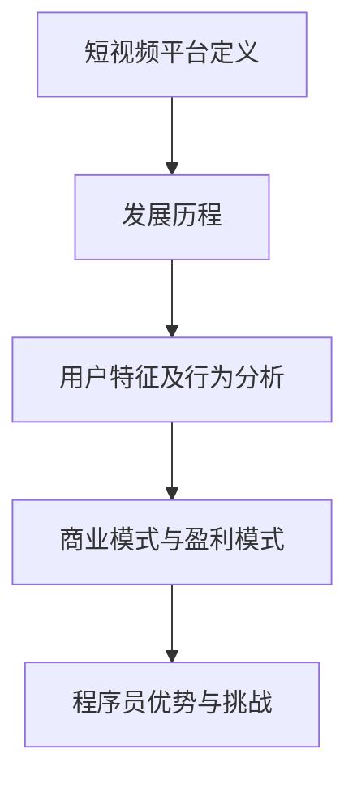
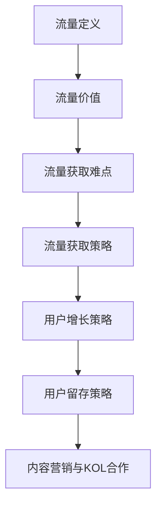
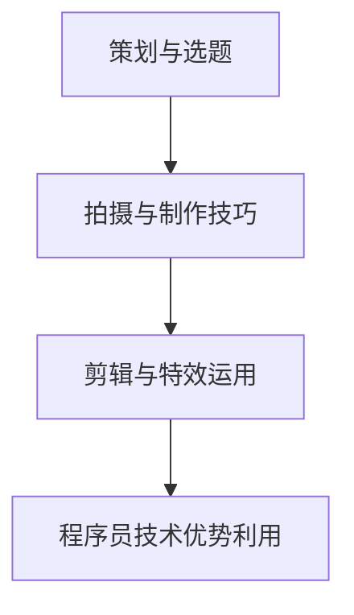
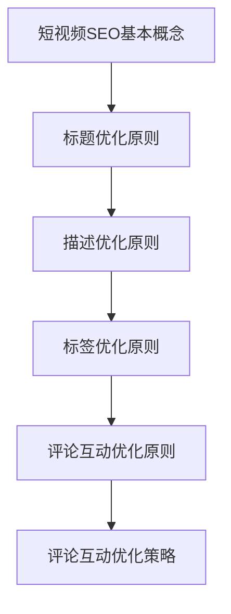

                 

### 第1章：短视频平台概述

#### 1.1 短视频平台的定义与发展历程

**短视频平台定义：** 短视频平台是一种基于移动设备的视频分享平台，用户可以上传、观看、分享时长一般在15秒到几分钟以内的短视频内容。这种形式的视频内容具有信息传递快速、娱乐性强、互动性高等特点，满足了用户在碎片化时间内的需求。

**发展历程：** 短视频平台起源于2006年的YouTube，随后在2010年后，随着智能手机和移动互联网的普及，短视频平台在全球范围内迅速兴起。在中国，短视频平台的兴起可追溯到2016年的“短视频元年”，以快手、抖音为代表的平台迅速占领市场。抖音在2016年9月上线，短短几个月内用户量迅速增长，成为全球用户数量最多的短视频平台之一。快手的崛起同样迅猛，凭借其在农村和三四线城市的市场优势，迅速成为中国最受欢迎的短视频平台之一。

短视频平台的发展历程可以概括为以下几个阶段：

1. **萌芽期（2006-2010年）：** 短视频概念初现，以YouTube为代表的平台开始兴起。
2. **成长期（2010-2015年）：** 移动互联网和智能手机普及，短视频逐渐成为用户日常娱乐的重要组成部分。
3. **爆发期（2016-2020年）：** 中国短视频平台迎来爆发式增长，大量用户涌入，形成激烈的市场竞争。
4. **成熟期（2020年至今）：** 短视频平台在内容、技术、商业模式等方面不断优化，市场逐渐趋于稳定。

#### 1.2 短视频平台的用户特征及行为分析

**用户特征：**
- **年龄层：** 以年轻人为主，18-35岁用户占比最大。这个年龄段用户具有强烈的娱乐需求和对新事物的接受能力。
- **性别分布：** 男女比例相对均衡，但女性用户在美妆、时尚等领域活跃度更高，男性用户在游戏、科技等领域活跃度更高。
- **地域分布：** 一线和二线城市用户占比高，但三线及以下城市用户增长迅速。这表明短视频平台的用户群体正在向低线城市扩展。

**用户行为：**
- **观看习惯：** 用户更倾向于在碎片化时间内观看短视频，多为刷视频形式。这种观看习惯促进了短视频平台的信息传播效率和用户粘性。
- **互动行为：** 点赞、评论、分享是主要的互动方式，其中点赞是最常见的互动行为。这些互动行为不仅增强了用户间的互动，也为平台提供了丰富的用户数据。
- **消费行为：** 短视频平台的广告和电商功能使用户消费行为更加便捷，用户对短视频购物具有较高的接受度。这为平台创造了新的收入来源。

#### 1.3 短视频平台的商业模式与盈利模式

**商业模式：**
- **广告收入：** 短视频平台通过展示广告来获取主要收入来源，包括品牌广告、展示广告、视频贴片广告等。广告商可以根据用户的兴趣和行为进行精准投放，提高广告效果。
- **电商收入：** 平台内植入电商功能，通过销售商品获取佣金。用户在观看短视频时可以直接购买商品，方便快捷的购物体验提高了用户的购买意愿。
- **内容付费：** 部分平台推出会员制，提供付费内容或去除广告等服务。用户可以通过付费获得更好的观看体验，平台也可以通过会员费增加收入。
- **数据服务：** 利用用户数据开展数据分析服务，为商家提供市场洞察和精准营销。这些数据服务可以为平台带来额外的收入来源。

**盈利模式：**
- **广告收入：** 广告收入是短视频平台最主要的盈利模式，平台通过展示广告和点击广告等方式获得收入。
- **电商收入：** 电商平台的发展为短视频平台带来了新的盈利模式。平台通过销售商品获取佣金，同时也提高了用户的粘性。
- **内容付费：** 内容付费是短视频平台的另一种盈利模式，用户可以通过付费获得更好的观看体验，平台也可以通过会员费增加收入。
- **数据服务：** 平台通过数据分析服务为商家提供市场洞察和精准营销，这些数据服务可以为平台带来额外的收入来源。

#### 1.4 程序员在短视频平台的优势与挑战

**优势：**
- **技术背景：** 程序员具备一定的技术优势，能制作高质量的视频内容和进行技术分享，满足用户对技术内容的需求。
- **创意能力：** 程序员在编程和算法方面有丰富的经验，可以利用这些知识创作出独特的短视频内容，吸引用户关注。
- **编程知识：** 程序员可以分享编程知识，帮助用户学习编程技能，提升自己的技能水平。

**挑战：**
- **内容创作：** 短视频内容创作需要一定的创意和表达能力，程序员可能在这方面存在一定的短板。
- **平台规则：** 短视频平台有严格的规则和审核标准，程序员需要遵守这些规则，确保内容符合平台要求。
- **流量获取：** 短视频平台的竞争激烈，程序员需要学会如何获取流量，提高自己的曝光度和影响力。

### Mermaid 流程图

### 总结

短视频平台作为一种新兴的媒体形式，已经深刻地改变了人们的娱乐和消费方式。程序员在短视频平台上有其独特的优势，如技术背景、创意能力和编程知识，但也面临着内容创作、平台规则和流量获取等挑战。了解短视频平台的定义、发展历程、用户特征、商业模式和程序员的优势与挑战，是程序员在短视频平台取得成功的关键。

## 第2章：流量获取的核心概念

#### 2.1 流量与流量的价值

**流量定义：** 流量是指在特定时间内，访问某个网站或应用的用户数量。流量是衡量网站或应用受欢迎程度和影响力的一个重要指标。

**流量价值：**
- **广告收入：** 流量是广告商关注的核心，广告商愿意为高流量网站或应用支付更高的广告费用，从而获得更好的广告效果。
- **电商转化：** 高流量可以为电商网站带来更多的潜在客户，提高销售额。
- **品牌影响力：** 流量高意味着更多的用户关注和互动，有助于提升品牌知名度和影响力。
- **数据分析：** 流量数据是进行市场分析、用户行为分析和产品优化的宝贵资源。

#### 2.2 短视频平台流量获取的难点与策略

**难点：**
- **竞争激烈：** 短视频平台上的内容繁多，竞争激烈，获取流量需要出色的内容创意和营销策略。
- **用户注意力分散：** 短视频平台用户通常处于碎片化时间，容易分散注意力，需要高质量的内容来吸引用户停留。
- **算法变化：** 短视频平台的推荐算法不断更新，内容创作者需要适应算法变化，确保内容能被推荐给目标用户。

**策略：**
- **内容创新：** 创造独特的、有吸引力的内容，满足用户的需求，提高内容的分享和传播率。
- **SEO优化：** 优化短视频的标题、描述和标签，提高内容在平台上的搜索排名和推荐概率。
- **用户互动：** 增加与用户的互动，如点赞、评论和分享，提高内容的曝光度和活跃度。
- **数据分析：** 利用数据工具分析用户行为，优化内容创作和推广策略，提高流量获取效果。

#### 2.3 用户增长与留存策略

**用户增长策略：**
- **内容营销：** 发布高质量、有价值的内容，吸引潜在用户关注。
- **KOL合作：** 与知名内容创作者或意见领袖合作，借助其影响力扩大品牌知名度。
- **社交媒体推广：** 在其他社交媒体平台上推广短视频内容，吸引更多用户关注。
- **优惠活动：** 开展优惠活动，如免费试用、折扣等，吸引用户注册和使用。

**用户留存策略：**
- **优质内容：** 持续发布高质量的内容，满足用户需求，提高用户粘性。
- **互动体验：** 提供良好的用户互动体验，如评论、私信、直播等，增强用户归属感。
- **个性化推荐：** 利用算法和数据分析，为用户提供个性化的内容推荐，提高用户满意度。
- **会员制度：** 推出会员制度，提供专属服务和特权，提高用户留存率。

#### 2.4 内容营销与KOL合作

**内容营销：**
- **定义：** 内容营销是通过创建和分享有价值的内容来吸引潜在客户、建立品牌信任和促进销售的过程。
- **策略：**
  - **内容策划：** 确定内容主题、形式和发布频率，确保内容有价值、有趣、有吸引力。
  - **内容创作：** 提高内容创作质量，包括文案、图片、视频等多媒体形式。
  - **内容传播：** 利用社交媒体、邮件营销、SEO等手段，扩大内容传播范围。

**KOL合作：**
- **定义：** KOL（Key Opinion Leader）即关键意见领袖，是指在某个领域拥有较高影响力和话语权的人。
- **策略：**
  - **选择合适KOL：** 根据目标受众和内容特点，选择与品牌定位和价值观相符的KOL。
  - **合作方式：** 合作形式多样，如联合制作内容、品牌代言、产品试用等。
  - **效果评估：** 关注合作效果，如粉丝增长、内容传播量、销售转化等，优化合作策略。

### Mermaid 流程图

### 总结

流量是短视频平台获取收益和影响用户的关键。了解流量的定义和价值，以及短视频平台流量获取的难点和策略，对于程序员创作者来说至关重要。通过内容创新、SEO优化、用户互动和数据分析等策略，可以有效地获取和留住用户，从而实现流量价值的最大化。

## 第3章：短视频内容创作原则

### 3.1 短视频内容策划与选题

**策划原则：**
- **目标受众分析：** 了解目标受众的兴趣、需求和行为，确保内容能够吸引和满足目标用户。
- **热点话题追踪：** 关注时事热点、行业动态和热门话题，制作相关内容，提高内容的时效性和吸引力。
- **内容形式多样化：** 结合视频、图片、动画等多种形式，丰富内容表现力，提升用户体验。

**选题原则：**
- **用户需求：** 选择用户感兴趣、有需求的话题，如科技、编程、生活技巧等。
- **创意新颖：** 创意新颖的内容更容易吸引用户的注意，提高内容传播效果。
- **价值传递：** 选题应具备一定的教育性、娱乐性和实用性，为用户提供有价值的信息。

### 3.2 短视频拍摄与制作技巧

**拍摄技巧：**
- **构图：** 使用简洁、对称、层次分明的构图方式，提升视频美感。
- **光线：** 选择合适的光线条件，避免逆光和阴影，确保画面清晰明亮。
- **拍摄角度：** 利用不同的拍摄角度，展示不同的场景和内容，增加视频的视觉冲击力。

**制作技巧：**
- **剪辑：** 剪辑是短视频制作的关键，通过剪辑技巧，如切换、转场、特效等，使视频更加流畅、有趣。
- **音效：** 添加背景音乐、音效等，增强视频氛围，提升用户体验。
- **特效：** 使用特效工具，如滤镜、动画、文字等，丰富视频内容，提高视觉吸引力。

### 3.3 短视频剪辑与特效运用

**剪辑技巧：**
- **场景切换：** 使用过渡效果，如淡入淡出、滑动等，使视频场景切换更加平滑。
- **时间调整：** 调整视频播放速度，如慢动作、快动作等，创造独特的视觉体验。
- **音频处理：** 剪辑音频，如调整音量、添加背景音乐、去除杂音等，提升视频音质。

**特效运用：**
- **滤镜效果：** 使用滤镜，如黑白、复古、锐化等，改变视频色调和风格。
- **动画效果：** 添加动画效果，如文字动画、图标动画等，增强视频趣味性。
- **特效插件：** 使用特效插件，如粒子系统、光效等，提升视频的视觉效果。

### 3.4 程序员如何利用技术优势创作短视频

**技术优势：**
- **编程知识：** 程序员具备编程知识，可以制作技术性较强的短视频，如编程教学、算法讲解等。
- **数据处理：** 程序员擅长数据处理和分析，可以制作数据分析相关的短视频，如数据可视化、机器学习应用等。
- **特效制作：** 程序员可以使用编程语言和工具，如Python、OpenGL等，制作复杂的特效视频。

**创作方法：**
- **算法可视化：** 将算法原理和流程通过动画或图形形式展示，使观众更容易理解。
- **技术教学：** 制作编程教学视频，通过实例演示和代码讲解，帮助观众学习编程技能。
- **数据分析：** 制作数据分析视频，利用Python、R等工具进行数据处理和可视化，展示数据分析过程和结果。

### Mermaid 流程图

### 总结

短视频内容创作是短视频平台成功的关键。了解内容策划与选题的原则、拍摄与制作技巧、剪辑与特效运用，以及如何利用技术优势创作短视频，对于程序员创作者来说至关重要。通过这些方法，程序员可以创作出高质量、有吸引力的短视频内容，提升自己的影响力和粉丝量。

## 第4章：短视频SEO优化

### 4.1 短视频SEO的基本概念

**短视频SEO（Search Engine Optimization）** 是指通过优化短视频的各个方面，以提高视频在搜索引擎结果页面（Search Engine Results Page，简称SERP）中的排名和曝光度。短视频SEO的核心目标是吸引更多的用户观看和互动，从而实现流量的增加。

**短视频SEO的重要性：**
- **提升曝光度：** 通过SEO优化，可以使短视频更容易被用户搜索到，从而增加曝光度和访问量。
- **增加流量：** 提高视频在搜索引擎中的排名，可以吸引更多的用户点击观看，从而带来更多的流量。
- **增强品牌影响力：** 通过SEO优化，可以提高品牌知名度，增强用户对品牌的信任和好感度。

### 4.2 短视频标题优化

**标题优化原则：**
- **精准描述：** 标题应准确描述视频内容，让用户一眼就能了解视频的主题。
- **关键词密度：** 合理使用关键词，确保关键词在标题中的合理分布，避免堆砌关键词。
- **吸引力：** 标题应具有吸引力，激发用户的好奇心和兴趣，提高点击率。

**标题优化策略：**
- **利用数字：** 数字可以增加标题的可读性和吸引力，如“5个编程技巧”、“10分钟学会Python”等。
- **疑问句形式：** 提出问题可以激发用户的兴趣，如“如何提高编程效率？”、“Python新手必看！”等。
- **利用热点：** 结合时事热点和热门话题，制作相关内容，提高视频的曝光度。

### 4.3 短视频描述优化

**描述优化原则：**
- **丰富信息：** 描述应提供丰富的信息，帮助用户更好地了解视频内容，增加点击率。
- **关键词布局：** 在描述中合理布局关键词，提高视频在搜索引擎中的排名。
- **简洁明了：** 描述应简洁明了，避免冗长和复杂的句子，确保用户能够快速阅读和理解。

**描述优化策略：**
- **详细阐述：** 在描述中详细阐述视频内容，包括主题、目的、亮点等，提高内容的可读性和吸引力。
- **添加关键词：** 根据视频内容，添加相关的关键词，提高视频在搜索引擎中的排名。
- **利用标签：** 使用适当的标签，将视频归类到相关主题，提高视频的曝光度。

### 4.4 短视频标签优化

**标签优化原则：**
- **相关性：** 标签应与视频内容高度相关，确保标签准确反映视频的主题和内容。
- **多样性：** 使用多样化的标签，涵盖视频的多个方面，提高视频的曝光度和访问量。
- **适度性：** 标签数量应适度，避免过多或过少，确保标签的有效性。

**标签优化策略：**
- **关键词分析：** 通过关键词分析工具，确定与视频内容相关的关键词，合理使用这些关键词作为标签。
- **用户搜索习惯：** 了解用户搜索习惯，选择用户常用的高频词作为标签。
- **更新标签：** 定期更新标签，确保标签与视频内容保持一致，提高标签的有效性。

### 4.5 短视频评论互动优化

**评论互动优化原则：**
- **积极互动：** 与用户积极互动，回复评论和私信，增加用户参与感和忠诚度。
- **质量保证：** 回复评论时应保证质量，避免机械式的回复，提供有价值的信息和建议。
- **正面引导：** 引导用户正面评论，鼓励用户分享心得和体验，提高视频的互动度和好评率。

**评论互动优化策略：**
- **及时回复：** 及时回复用户评论和私信，提高用户的满意度。
- **互动性内容：** 制作互动性强的内容，如问答、投票、抽奖等，激发用户参与热情。
- **用户反馈：** 关注用户反馈，根据用户意见和建议优化视频内容和互动方式。

### Mermaid 流程图

### 总结

短视频SEO是提高短视频曝光度和流量的重要手段。了解短视频SEO的基本概念、标题优化、描述优化、标签优化和评论互动优化原则和策略，对于程序员创作者来说至关重要。通过这些方法，程序员可以优化短视频的各个方面，提高视频在搜索引擎中的排名和曝光度，从而实现流量的增加和品牌的提升。

## 第5章：短视频数据分析与优化

### 5.1 短视频数据分析的重要性

短视频数据分析是内容优化和营销策略制定的基础。通过对短视频的观看数据、互动数据等进行分析，创作者可以了解用户行为、内容效果和市场趋势，从而优化内容创作和推广策略，提高视频的曝光率和用户参与度。

### 5.2 短视频观看数据解读

**观看数据解析：**
- **观看时长：** 观看时长是衡量视频吸引力和用户兴趣的重要指标。通过分析观看时长数据，创作者可以了解哪些视频内容更能吸引用户，进而优化内容创作。
- **播放量：** 播放量是衡量视频曝光度的重要指标。高播放量表明视频内容受到用户的关注，但同时也需要关注播放量的来源，以了解哪些推广渠道和策略更有效。
- **观看完成率：** 观看完成率是衡量视频质量的重要指标。高完成率表明视频内容质量好，用户愿意观看完整，反之则需要优化内容。

**数据分析工具：**
- **平台自带工具：** 大多数短视频平台都提供数据分析工具，如抖音的数据分析中心，快手的数据分析平台等，创作者可以使用这些工具进行数据分析和优化。
- **第三方工具：** 第三方数据分析工具如诸葛IO、GrowingIO等，提供了更全面和深入的数据分析功能，创作者可以根据需要选择合适的数据分析工具。

### 5.3 短视频互动数据解读

**互动数据解析：**
- **点赞数：** 点赞数是衡量视频受欢迎程度的重要指标。高点赞数表明视频内容受到了用户的认可和喜爱，创作者可以通过分析点赞数数据，了解哪些内容更受欢迎，从而优化创作策略。
- **评论数：** 评论数是衡量用户参与度的重要指标。高评论数表明用户对视频内容有较强的兴趣和互动意愿，创作者可以通过分析评论数据，了解用户的反馈和需求，进一步优化内容。
- **分享数：** 分享数是衡量视频传播力的重要指标。高分享数表明视频内容具有很高的价值，创作者可以通过分析分享数据，了解哪些内容更容易传播，从而优化内容创作和推广策略。

### 5.4 数据驱动的短视频优化策略

**策略制定：**
- **内容优化：** 根据数据分析结果，优化视频内容创作。例如，如果某些类型的视频观看时长较高，创作者可以增加这类视频的产量；如果某些关键词的搜索量较高，创作者可以在描述和标签中增加这些关键词。
- **推广优化：** 根据数据分析结果，优化视频推广策略。例如，如果某些推广渠道的播放量和点赞数较高，创作者可以增加在这些渠道的推广力度。
- **用户互动：** 根据互动数据，优化用户互动策略。例如，如果某些视频的评论数较高，创作者可以积极参与评论互动，提高用户参与度和忠诚度。

### 5.5 实际案例剖析

**案例一：** 程序员小张通过分析自己的短视频观看数据，发现某些编程教学视频的观看时长和点赞数较高。于是，他决定增加这类视频的产量，并通过优化视频标题、描述和标签，提高视频的曝光度和点击率。

**案例二：** 程序员小李通过分析自己的短视频互动数据，发现用户对某些编程问题有较高的讨论热情。他决定在后续视频中增加这些问题，并通过互动引导，促进用户参与和讨论，从而提高视频的互动度和用户忠诚度。

### 总结

短视频数据分析是优化内容创作和营销策略的重要手段。通过解读观看数据和互动数据，创作者可以了解用户行为和市场趋势，从而制定数据驱动的优化策略。结合实际案例分析，程序员创作者可以通过数据分析，提高视频的曝光度和用户参与度，实现短视频营销的成功。

## 第6章：程序员如何打造个人品牌

### 6.1 个人品牌的重要性

个人品牌是个人在特定领域内建立的专业形象和声誉。对于程序员来说，打造个人品牌不仅可以提升个人在职场中的竞争力，还能扩大影响力、提升职业地位，甚至创造额外收入。以下是打造个人品牌的重要性：

**提高职业竞争力：** 一个强大的个人品牌可以帮助程序员在众多候选人中脱颖而出，获得更好的工作机会和更高的薪资待遇。

**扩大影响力：** 个人品牌可以增强程序员在行业内的知名度和认可度，使其成为行业内的意见领袖，吸引更多的关注和合作机会。

**提升职业地位：** 建立个人品牌可以提升程序员的职业地位，使其在职场中具有更高的话语权和影响力。

**创造额外收入：** 个人品牌可以为程序员带来各种商业合作机会，如技术咨询、演讲、书籍出版等，从而创造额外的收入来源。

### 6.2 个人品牌的构建与传播

**构建个人品牌的原则：**
- **明确目标受众：** 了解自己的目标受众，包括他们的需求和兴趣，以便制定针对性的内容策略。

- **专注领域：** 选择自己擅长的领域进行深耕，建立专业形象，如编程语言、开发框架、算法等。

- **持续输出：** 定期发布高质量的内容，如技术博客、视频教程、开源项目等，保持品牌活跃度。

- **差异化定位：** 在个人品牌中体现自己的独特性，如个人风格、价值观念等，以区别于其他竞争者。

**传播个人品牌的方法：**
- **社交媒体：** 利用微博、知乎、微信等社交媒体平台，发布专业内容，扩大影响力。

- **内容营销：** 制作高质量的技术博客、视频教程等，通过平台推广和分享，吸引潜在粉丝。

- **在线课程与讲座：** 开设在线课程或举办讲座，分享专业知识和经验，提升个人品牌。

- **合作与互动：** 与同行或行业专家建立合作关系，进行互推，扩大品牌影响力。

### 6.3 程序员个人品牌案例分享

**案例一：** 程序员A是某个知名编程语言的专家，他在GitHub上发布了大量高质量的开源项目，并在各大技术社区活跃分享。通过不断输出专业内容，他吸引了大量粉丝，成功建立了个人品牌，并受邀成为多个技术会议的讲师。

**案例二：** 程序员B专注于大数据和机器学习领域，他在YouTube上发布了一系列机器学习教程，通过生动的讲解和实用的案例，吸引了大量观众。他的视频教程在业界获得了广泛认可，为他带来了丰富的商业合作机会，成功打造了个人品牌。

### 总结

程序员通过打造个人品牌，可以提升自身在职场中的竞争力，扩大影响力，提升职业地位，并创造额外的收入来源。构建个人品牌需要明确目标受众、专注领域、持续输出和差异化定位。通过社交媒体、内容营销、在线课程和合作与互动等方法，程序员可以有效地传播个人品牌，实现个人品牌价值的最大化。

## 第7章：程序员短视频营销实战

### 7.1 程序员短视频营销案例分析

**案例一：** 程序员小明是一位Python编程爱好者，他在抖音上发布了一系列Python编程教程视频。通过简洁明了的讲解和实用的案例，他的视频迅速获得了大量关注。小明在视频中加入了自己的编程心得和技巧，使内容更加丰富和有趣。经过一段时间的努力，他的粉丝量从几百增长到了几万，不少粉丝表示受益匪浅。

**案例二：** 程序员小红专注于大数据技术，她在Bilibili上发布了一系列关于大数据处理的教程视频。小红通过生动的动画和图表，详细讲解了数据处理流程和算法实现。她还针对不同层次的用户，制作了从入门到进阶的教程，满足了不同用户的需求。这些视频在Bilibili上获得了极高的播放量和点赞数，小红也因此成为了一位知名的大数据技术博主。

### 7.2 程序员短视频营销策略制定

**内容策略：**
- **定位明确：** 确定目标受众，如编程初学者、大数据爱好者等，确保内容能够满足他们的需求。
- **内容多样化：** 结合视频、动画、图表等多种形式，丰富内容表现形式，提高用户观看体验。
- **教程与实战结合：** 制作既有理论知识又有实战操作的教程，帮助用户更好地理解和应用所学内容。

**推广策略：**
- **社交媒体：** 利用微博、知乎、微信等社交媒体平台，发布短视频链接和宣传文案，吸引更多用户关注。
- **合作互推：** 与其他程序员博主或行业专家合作，互相推广，扩大受众范围。
- **平台推广：** 利用平台自带的推广工具，如抖音的dou+、Bilibili的会员购等，提高视频曝光度和点击率。

**互动策略：**
- **积极回复：** 及时回复用户评论和私信，提高用户参与度和忠诚度。
- **互动活动：** 定期举办问答、抽奖等活动，增加用户互动，提高用户粘性。
- **内容更新：** 定期发布新视频，保持品牌活跃度，吸引用户持续关注。

### 7.3 程序员短视频营销工具与平台选择

**工具选择：**
- **视频制作工具：** 选择如Adobe Premiere Pro、Final Cut Pro等专业视频编辑软件，或使用如剪映、快剪辑等简单易用的短视频编辑工具，制作高质量的视频内容。
- **数据分析工具：** 使用如诸葛IO、GrowingIO等第三方数据分析工具，分析视频观看数据、互动数据等，优化营销策略。

**平台选择：**
- **主流短视频平台：** 选择如抖音、Bilibili、快手等主流短视频平台，这些平台用户基数大，推广效果较好。
- **专业技术社区：** 选择如GitHub、Stack Overflow等专业技术社区，发布开源项目和技术博客，吸引同行业用户关注。

### 7.4 程序员短视频营销效果评估与优化

**评估指标：**
- **观看量：** 观看量是衡量视频曝光度的重要指标，通过对比不同视频的观看量，可以了解哪些内容更受欢迎。
- **点赞数和评论数：** 点赞数和评论数是衡量用户互动度的重要指标，通过分析这些数据，可以了解用户对内容的反馈和兴趣点。
- **转化率：** 转化率是衡量营销效果的重要指标，如用户通过观看视频注册课程、购买书籍等，通过数据对比，可以优化推广策略。

**优化方法：**
- **内容优化：** 根据评估结果，对内容进行优化，如调整视频时长、增加动画效果、改进讲解方式等，提高用户观看体验。
- **推广策略优化：** 根据评估结果，优化推广策略，如增加推广渠道、调整推广时间、优化宣传文案等，提高视频曝光度和点击率。
- **用户互动优化：** 根据评估结果，优化用户互动策略，如增加互动活动、提高回复速度、改进互动方式等，提高用户参与度和忠诚度。

### 总结

程序员通过短视频营销，可以有效地传播专业知识，提升个人品牌，吸引更多粉丝和商业机会。通过案例分析，制定合适的营销策略，选择合适的工具和平台，以及不断评估和优化营销效果，程序员可以不断提高短视频营销的成功率，实现个人品牌价值的最大化。

## 第8章：短视频平台合作与扩展

### 8.1 平台合作模式与策略

**合作模式：**
- **内容合作：** 与其他内容创作者合作，共同制作高质量的视频内容，互相推广，扩大受众范围。
- **广告合作：** 与品牌商合作，在其短视频中进行广告植入，获取广告收益。
- **技术合作：** 与技术公司合作，利用其先进的技术和工具，提升视频制作和数据分析能力。

**合作策略：**
- **选择合适合作伙伴：** 根据自身定位和目标受众，选择与自身品牌和内容风格相符的合作伙伴，确保合作效果。
- **互利共赢：** 在合作中，确保双方都能获得利益，如共同提升内容质量、扩大粉丝群体、提高广告收益等。
- **持续合作：** 建立长期稳定的合作关系，定期沟通和调整合作策略，确保合作的持续性和有效性。

### 8.2 跨平台运营与内容分发

**跨平台运营：**
- **内容同步：** 在不同短视频平台上发布相同或相似的视频内容，扩大受众范围。
- **平台特色化：** 根据不同平台的用户特点和平台规则，制定特色化的内容策略，提高用户粘性。
- **资源整合：** 利用不同平台的资源和优势，如抖音的流量、Bilibili的社区氛围等，提升整体运营效果。

**内容分发策略：**
- **平台选择：** 根据目标受众和内容特点，选择合适的平台进行内容分发，如技术内容适合在Bilibili等平台发布。
- **时间策略：** 分析不同平台的用户活跃时间，选择合适的发布时间，提高视频的曝光率和点击率。
- **内容优化：** 根据不同平台的用户需求，对内容进行适当调整，如增加动画效果、优化标题和描述等，提高用户接受度。

### 8.3 短视频合作案例解析

**案例一：** 程序员小王与某知名编程语言社区合作，共同制作编程教程视频。通过小王的知名度和社区的资源，视频在短时间内获得了大量观看和点赞，小王的粉丝量也实现了显著增长。

**案例二：** 程序员小李与某科技品牌合作，在其短视频中进行产品评测和广告植入。小李通过专业的评测和真实的用户体验，赢得了用户的信任和好评，品牌也通过小李的影响力，成功推广了产品。

### 总结

短视频平台合作与扩展是程序员扩大影响力、提升品牌价值的重要手段。通过选择合适的合作伙伴、制定有效的合作策略，以及跨平台运营与内容分发，程序员可以充分利用不同平台的优势，实现资源整合和互利共赢。结合实际案例，程序员可以更好地理解合作与扩展的策略和方法，从而实现个人品牌的持续增长和影响力的提升。

## 第9章：短视频广告与商业化

### 9.1 短视频广告类型与特点

**短视频广告类型：**
- **贴片广告：** 在短视频播放前或播放过程中插入的广告，通常时长较短，一般在5-15秒。
- **植入广告：** 将广告内容巧妙地融入短视频中，使广告内容与视频内容紧密相连，提高用户对广告的接受度。
- **信息流广告：** 在短视频内容流中随机出现的广告，用户在浏览视频时可能会看到这类广告。
- **互动广告：** 利用短视频互动性强的特点，通过用户参与互动（如点赞、评论、分享等）来展示广告。

**短视频广告特点：**
- **短时高效：** 短视频广告时长短，信息传递速度快，能够迅速吸引用户的注意力。
- **形式多样：** 短视频广告形式多样，可以根据广告内容选择合适的广告形式，提高广告效果。
- **精准投放：** 短视频平台具有丰富的用户数据，可以通过大数据分析，实现广告的精准投放，提高广告的转化率。
- **互动性强：** 短视频广告具有互动性，用户可以通过点赞、评论、分享等方式参与广告互动，提高用户参与度和品牌认知度。

### 9.2 短视频广告投放策略

**目标受众分析：**
- **确定目标受众：** 明确广告的目标受众，如年龄、性别、地域、兴趣爱好等，以便进行精准投放。
- **用户行为分析：** 通过分析用户的行为数据，如观看时长、互动行为等，了解用户需求和偏好，优化广告投放策略。

**广告内容创作：**
- **创意新颖：** 创意是短视频广告成功的关键，应确保广告内容新颖、有趣，能够吸引用户的注意力。
- **情感共鸣：** 短视频广告应与用户产生情感共鸣，提高用户的参与度和记忆度。
- **信息简洁：** 短视频广告时长有限，应确保广告信息简洁明了，突出广告的核心卖点。

**广告投放时间：**
- **高峰时段：** 选择用户活跃度较高的时间段进行广告投放，如下午下班时间、晚上休息时间等，提高广告的曝光率。
- **频次控制：** 控制广告投放频次，避免过度投放造成用户反感，影响广告效果。

**广告效果评估：**
- **数据分析：** 通过数据工具，如广告后台、第三方数据分析平台等，对广告投放效果进行实时监控和评估。
- **优化调整：** 根据数据分析结果，及时调整广告投放策略，如优化广告内容、调整投放时间等，提高广告效果。

### 9.3 短视频商业化路径与模式

**商业化路径：**
- **广告收入：** 通过投放广告，获取广告收入，如品牌广告、展示广告、视频贴片广告等。
- **电商收入：** 通过短视频平台内的电商功能，销售商品获取佣金，如商品植入、直播带货等。
- **内容付费：** 提供高质量的内容，如付费课程、会员服务等，获取内容付费收入。
- **数据服务：** 利用用户数据，开展数据分析服务，为商家提供市场洞察和精准营销，获取数据服务收入。

**商业化模式：**
- **广告模式：** 通过广告收入实现商业化，如平台广告、商家广告、联盟广告等。
- **电商模式：** 通过电商收入实现商业化，如平台内电商、直播电商、社群电商等。
- **内容付费模式：** 通过内容付费收入实现商业化，如付费课程、会员服务、电子书等。
- **数据服务模式：** 通过数据服务收入实现商业化，如数据分析、市场调研、精准营销等。

### 总结

短视频广告作为一种新兴的广告形式，具有短时高效、形式多样、精准投放和互动性强等特点。通过分析目标受众、创作创意新颖的广告内容、选择合适的投放时间和频次，以及实时监控和优化广告效果，程序员创作者可以实现短视频广告的成功投放。同时，通过广告收入、电商收入、内容付费和数据服务等多种商业化路径和模式，程序员创作者可以实现短视频平台的商业化运营，提升收入和品牌价值。

## 第10章：短视频营销趋势与未来展望

### 10.1 短视频营销行业趋势

**短视频营销的发展趋势：**
- **用户规模持续扩大：** 随着智能手机和移动互联网的普及，短视频用户的规模持续扩大，预计未来用户数量将保持稳定增长。
- **内容形式多样化：** 短视频内容形式将更加多样化，包括动画、直播、VR/AR等新技术将应用于短视频制作和传播，为用户带来更加丰富的观看体验。
- **商业化路径拓展：** 短视频平台的商业化路径将不断拓展，包括广告收入、电商收入、内容付费和数据服务等，为创作者提供更多变现渠道。
- **品牌营销重视度提升：** 随着短视频营销效果的凸显，品牌对短视频营销的重视度将不断提升，短视频将成为品牌营销的重要手段。

### 10.2 短视频营销的未来方向

**技术赋能短视频营销：**
- **人工智能：** 人工智能技术在短视频营销中的应用将更加广泛，如通过AI算法优化内容推荐、提高广告投放精准度等。
- **大数据：** 大数据技术将在短视频营销中发挥重要作用，通过数据分析，了解用户行为、需求和市场趋势，为创作者提供精准的营销策略。
- **VR/AR：** 虚拟现实和增强现实技术将提升短视频内容的互动性和沉浸感，为用户带来更加逼真的观看体验。

**内容个性化与细分市场：**
- **个性化内容：** 随着用户需求的多样化，短视频内容将更加个性化，创作者将根据用户喜好和需求，定制化创作内容，提高用户满意度和忠诚度。
- **细分市场：** 短视频营销将更加细分市场，创作者将针对特定用户群体，如编程爱好者、游戏玩家等，提供专业的、定制化的内容，满足他们的需求。

**跨平台运营与整合营销：**
- **跨平台运营：** 随着短视频平台的多样化，创作者将更加重视跨平台运营，通过在不同平台发布和推广内容，扩大影响力。
- **整合营销：** 创作者将采用整合营销策略，结合短视频、社交媒体、线下活动等多种营销手段，实现品牌的全方位传播。

### 10.3 程序员在短视频营销中的机遇与挑战

**机遇：**
- **技术优势：** 程序员具备编程和技术背景，能够创作出具有技术含量和专业性的短视频内容，满足用户对技术知识的渴求。
- **创新空间：** 短视频营销领域的创新空间巨大，程序员可以通过技术创新和内容创新，打造独特的个人品牌和营销策略。
- **变现渠道：** 短视频平台的商业化路径多样化，程序员可以通过广告收入、电商收入、内容付费等多种方式实现变现。

**挑战：**
- **内容创作难度：** 短视频内容创作需要较高的创意和表达能力，程序员在内容创作方面可能面临一定的挑战。
- **竞争激烈：** 短视频营销领域竞争激烈，程序员需要不断提高内容质量和营销策略，以在激烈的市场竞争中脱颖而出。
- **技术更新：** 技术更新速度快，程序员需要不断学习和适应新技术，确保自身技能与行业趋势保持同步。

### 总结

短视频营销行业正处于快速发展阶段，未来将呈现用户规模扩大、内容形式多样化、商业化路径拓展和品牌营销重视度提升等趋势。程序员在短视频营销中具有技术优势和创新空间，但同时也面临内容创作难度、竞争激烈和技术更新等挑战。通过抓住机遇、应对挑战，程序员可以在短视频营销领域取得成功，实现个人品牌价值的最大化。

## 附录A：短视频平台技术详解

### A.1 短视频平台后台技术架构

**技术架构概述：**
短视频平台的后台技术架构通常包括以下几个核心模块：

- **用户服务模块：** 负责处理用户注册、登录、个人信息管理等功能，采用RESTful API设计，支持JSON数据格式。
- **内容管理模块：** 负责视频的上传、存储、分类、检索等功能，使用分布式存储系统，如HDFS或对象存储服务，确保高效的数据处理和存储。
- **推荐系统模块：** 负责根据用户行为和兴趣进行内容推荐，采用协同过滤、基于内容的推荐算法等，以提高用户满意度和内容个性化。
- **广告系统模块：** 负责广告投放、展示、计费等功能，实现广告与内容的无缝融合，提高广告效果和用户体验。
- **数据分析与监控模块：** 负责收集、存储、分析和监控平台的各项运营数据，采用大数据技术，如Hadoop、Spark等，实现实时数据分析和处理。

**关键技术细节：**
- **分布式系统：** 使用分布式架构，如Kubernetes，实现服务的弹性扩展和高可用性。
- **缓存技术：** 使用Redis等缓存技术，提高数据访问速度和系统响应性能。
- **消息队列：** 使用Kafka等消息队列技术，实现异步消息处理和系统解耦。

### A.2 短视频处理与编辑技术

**视频处理技术：**
- **编码解码：** 使用H.264、HEVC等视频编码标准，实现视频的高效压缩和播放。
- **视频剪辑：** 使用FFmpeg等视频处理库，实现视频的裁剪、拼接、特效添加等功能。
- **图像处理：** 使用OpenCV等图像处理库，实现视频图像的滤镜、特效、人脸识别等操作。

**编辑技术：**
- **实时渲染：** 使用OpenGL、WebGL等技术，实现视频的实时渲染和特效处理。
- **特效库：** 使用Unity、Unreal Engine等游戏引擎，创建丰富的视频特效和动画效果。
- **音频处理：** 使用音频处理库，如Audacity，实现音频的混音、降噪、音效添加等功能。

### A.3 短视频内容推荐算法

**推荐算法概述：**
短视频平台的推荐算法旨在根据用户行为和兴趣，为用户推荐个性化内容，提高用户满意度和平台粘性。

**常用算法：**
- **协同过滤：** 基于用户的历史行为和相似用户的行为，推荐相似的内容。
- **基于内容的推荐：** 基于视频的标签、关键词、内容特征，推荐相似的内容。
- **混合推荐：** 结合协同过滤和基于内容的推荐，实现更加准确的个性化推荐。

**关键技术：**
- **数据挖掘：** 使用大数据技术，如Hadoop、Spark，对用户行为数据进行分析和挖掘，提取有效的特征和模式。
- **机器学习：** 使用机器学习算法，如决策树、神经网络等，对推荐模型进行训练和优化，提高推荐效果。
- **实时计算：** 使用实时计算技术，如Flink、Storm，实现实时推荐和动态调整。

### 总结

短视频平台的技术架构涉及用户服务、内容管理、推荐系统、广告系统和数据分析等多个模块，采用分布式系统、缓存技术、消息队列等关键技术，确保系统的高效运行。短视频处理与编辑技术包括编码解码、视频剪辑、图像处理和音频处理等，为用户带来丰富的视听体验。推荐算法通过协同过滤、基于内容的推荐和混合推荐等方法，实现个性化内容推荐，提高用户满意度和平台粘性。掌握这些技术细节，对于程序员在短视频平台的技术开发和创新具有重要意义。

## 附录B：短视频营销工具推荐

### B.1 视频制作与剪辑工具

**视频制作工具：**
- **Adobe Premiere Pro：** 专业视频编辑软件，提供丰富的特效、调色和音频处理功能，适用于高级视频制作。
- **Final Cut Pro：** 苹果公司开发的视频编辑软件，适用于Mac用户，具有高效的视频剪辑和调色功能。
- **DaVinci Resolve：** 免费的视频编辑和调色软件，功能强大，适合专业视频制作。

**视频剪辑工具：**
- **剪映：** 简单易用的短视频编辑工具，支持多种视频格式，适用于快速剪辑。
- **快剪辑：** 微信官方推出的短视频编辑工具，支持视频剪辑、特效添加等功能。
- **Filmora：** 适合初学者和中级用户，提供丰富的视频编辑功能，包括特效、转场和音频处理。

### B.2 数据分析与报告工具

**数据分析工具：**
- **Google Analytics：** Google提供的免费网站和移动应用数据分析工具，用于跟踪用户行为、流量来源和转化率等。
- **百度统计：** 百度提供的网站分析工具，提供丰富的报告和可视化数据，帮助网站和移动应用优化用户体验。
- **诸葛IO：** 提供用户行为分析和运营数据分析，支持实时监控和数据处理。

**报告工具：**
- **Tableau：** 数据可视化工具，可以将复杂的数据转化为易于理解的图表和报告。
- **Power BI：** 微软提供的企业级数据分析和报告工具，支持多种数据源和报表格式。
- **Excel：** 适用于中小型数据分析和报表生成，功能强大且易于使用。

### B.3 社交媒体管理工具

**社交媒体管理工具：**
- **Hootsuite：** 社交媒体管理工具，支持多平台管理、日程安排和社交媒体分析。
- **Sprout Social：** 社交媒体管理平台，提供社交聆听、内容规划和报告功能。
- **Buffer：** 社交媒体管理工具，支持自动化发布、社交分析和管理。
- **Later：** 社交媒体日程安排工具，帮助用户规划和管理社交媒体发布内容。

### 总结

短视频营销工具的选择对于内容制作、数据分析和管理具有重要意义。视频制作与剪辑工具如Adobe Premiere Pro、Final Cut Pro和剪映等，能够帮助创作者制作高质量的短视频内容。数据分析和报告工具如Google Analytics、Tableau等，可以提供全面的用户行为和运营数据，帮助优化营销策略。社交媒体管理工具如Hootsuite、Buffer等，可以简化社交媒体的运营和管理，提高效率和效果。合理选择和利用这些工具，可以提升短视频营销的效率和质量。

## 附录C：短视频营销资源汇总

### C.1 行业报告与白皮书

**短视频营销行业报告：**
- **艾瑞咨询：** 《2022年中国短视频营销行业报告》
- **腾讯广告：** 《2022年中国短视频营销洞察报告》
- **快手数据研究院：** 《2021年中国短视频营销报告》

**相关白皮书：**
- **阿里文娱：** 《短视频内容创作与运营白皮书》
- **字节跳动：** 《短视频广告投放策略白皮书》

### C.2 教程与案例分析

**短视频营销教程：**
- **知乎：** 《短视频营销入门教程》
- **抖音学院：** 《抖音短视频营销教程》
- **快手营销学院：** 《快手短视频营销教程》

**案例分析：**
- **36氪：** 《程序员如何通过短视频营销成功打造个人品牌》
- **简书：** 《短视频营销实战案例分析》
- **虎嗅网：** 《短视频广告投放案例解析》

### C.3 短视频营销社区与论坛

**短视频营销社区：**
- **短视频营销基地：** 短视频营销从业者交流平台
- **短视频营销圈：** 短视频营销相关知识和资源分享社区
- **短视频运营者联盟：** 短视频营销和运营者交流互动平台

**论坛与讨论区：**
- **站长论坛：** 短视频营销相关讨论区
- **虎扑论坛：** 短视频创作与运营相关讨论区
- **天涯论坛：** 短视频营销交流讨论区

### 总结

行业报告与白皮书提供了短视频营销的市场趋势、用户行为和策略分析，帮助创作者了解行业动态和制定营销策略。教程与案例分析为创作者提供了具体的操作指南和成功经验，帮助提升短视频营销能力。短视频营销社区与论坛则是创作者交流互动的平台，可以获取最新资讯、学习经验、分享心得，共同推动短视频营销的发展。合理利用这些资源，创作者可以更好地掌握短视频营销知识，提升营销效果。

