                 

### 文章标题

《如何将技术洞察转化为技术趋势报告》

关键词：技术洞察、趋势报告、数据收集、数据分析、趋势预测

摘要：本文将探讨如何通过技术洞察转化为技术趋势报告的整个过程。文章首先定义了技术洞察，并阐述了其在决策中的重要性，随后详细介绍了技术趋势报告的构成要素。接着，分析了技术趋势报告的市场现状与需求，以及目标市场的定位和受众分析。随后，文章介绍了技术洞察的主要来源和方法，包括学术研究、行业报告和竞争对手分析。最后，详细讨论了技术洞察转化为趋势报告的具体方法，包括收集与整理、撰写与内容组织、可视化与传达，以及技术趋势报告在企业决策中的应用和评估。

----------------------------------------------------------------

### 第一部分：技术洞察与趋势报告概述

#### 第1章：技术洞察与趋势报告的基础

##### 1.1 技术洞察的定义与重要性

**核心概念与联系：**

技术洞察是指通过对大量技术数据的收集、整理和分析，发现技术发展的潜在趋势和机会，从而为决策提供科学依据的过程。技术洞察涉及多个环节，包括信息收集、数据分析和趋势预测，最终为决策支持提供关键信息。

**Mermaid 流程图：**

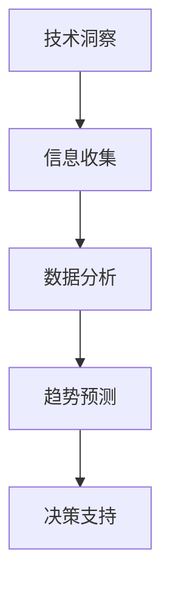

**核心算法原理讲解：**

技术洞察的获取主要通过以下步骤实现：

1. **信息收集**：通过多种渠道收集与目标技术相关的信息，包括学术论文、行业报告、技术博客、社交媒体等。
2. **数据分析**：对收集到的信息进行整理、清洗和特征提取，使用统计分析或机器学习算法进行分析。
3. **趋势预测**：基于分析结果，使用时间序列分析、机器学习等算法预测技术发展的未来趋势。
4. **决策支持**：将趋势预测结果转化为决策建议，为企业和组织的技术战略制定提供指导。

**伪代码示例：**

```python
def collect_data():
    # 数据收集代码
    pass

def preprocess_data(data):
    # 数据预处理代码
    pass

def feature_extraction(data):
    # 特征提取代码
    pass

def model_selection(models):
    # 模型选择代码
    pass

def train_model(model, data):
    # 模型训练代码
    pass

def predict_trend(model, data):
    # 趋势预测代码
    pass
```

**数学模型和数学公式 & 详细讲解 & 举例说明：**

在趋势预测中，常用的时间序列分析方法包括ARIMA模型、LSTM神经网络等。以下是一个简单的ARIMA模型伪代码示例：

```python
def arima_model(data):
    # 使用ARIMA模型预测趋势
    # $X_t = c + \phi_1 X_{t-1} + \phi_2 X_{t-2} + \dots + \phi_p X_{t-p} + \theta_1 \epsilon_{t-1} + \theta_2 \epsilon_{t-2} + \dots + \theta_q \epsilon_{t-q} + \epsilon_t$

    # 步骤1：模型参数估计
    # 步骤2：模型拟合
    # 步骤3：趋势预测
    pass
```

$$
X_t = c + \phi_1 X_{t-1} + \phi_2 X_{t-2} + \dots + \phi_p X_{t-p} + \theta_1 \epsilon_{t-1} + \theta_2 \epsilon_{t-2} + \dots + \theta_q \epsilon_{t-q} + \epsilon_t
$$

其中，$X_t$ 表示时间序列的当前值，$c$ 为常数项，$\phi_1, \phi_2, \dots, \phi_p$ 和 $\theta_1, \theta_2, \dots, \theta_q$ 分别为自回归项和移动平均项的系数，$\epsilon_t$ 为误差项。

##### 1.2 技术趋势报告的构成要素

**核心概念与联系：**

技术趋势报告是一份系统性的文档，旨在总结和呈现技术领域的最新发展动态和未来趋势。它通常包括引言、正文、结论和参考文献等部分，具体内容可根据需求进行调整。

**Mermaid 流程图：**

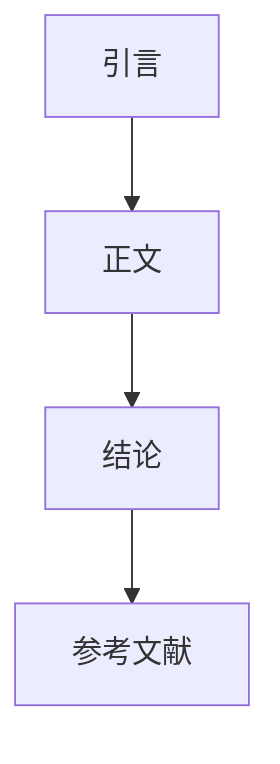

**核心算法原理讲解：**

技术趋势报告的构成要素及其功能如下：

1. **引言**：介绍报告的目的、背景和范围，为读者提供整体把握。
2. **正文**：详细阐述技术洞察、市场分析、技术趋势预测等内容，是报告的核心部分。
3. **结论**：总结报告的主要发现，提出建议和展望。
4. **参考文献**：列出报告中所引用的文献资料，便于读者进一步学习和研究。

**伪代码示例：**

```python
def introduction():
    # 引言内容编写
    pass

def main_content():
    # 正文内容编写
    pass

def conclusion():
    # 结论内容编写
    pass

def references():
    # 参考文献编写
    pass
```

##### 1.3 技术趋势报告的基本框架

**核心概念与联系：**

技术趋势报告的基本框架通常包括以下几个部分：

1. **封面**：包括报告名称、报告日期、编写人等信息。
2. **目录**：列出报告各章节及其页码，便于读者查找。
3. **引言**：介绍报告背景、目的和范围。
4. **正文**：详细阐述技术洞察、市场分析、技术趋势预测等内容。
5. **结论**：总结报告的主要发现和建议。
6. **附录**：提供与报告相关的补充材料，如数据来源、图表、代码等。

**Mermaid 流程图：**

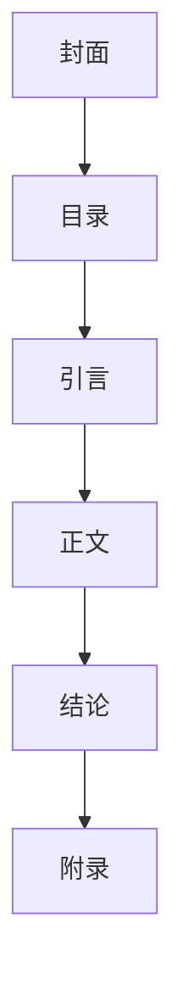

**核心算法原理讲解：**

技术趋势报告的基本框架体现了报告的逻辑结构和信息传递的层次性。在编写过程中，需要确保各部分内容紧密衔接，逻辑清晰，便于读者理解和掌握。

**伪代码示例：**

```python
def cover():
    # 封面内容编写
    pass

def table_of_contents():
    # 目录内容编写
    pass

def introduction():
    # 引言内容编写
    pass

def main_content():
    # 正文内容编写
    pass

def conclusion():
    # 结论内容编写
    pass

def appendices():
    # 附录内容编写
    pass
```

##### 1.4 数据收集与分析方法

**核心概念与联系：**

数据收集与分析是技术趋势报告的关键环节，直接影响报告的质量和可信度。数据收集方法包括定量和定性两种，数据分析方法包括统计分析、机器学习、数据可视化等。

**Mermaid 流程图：**

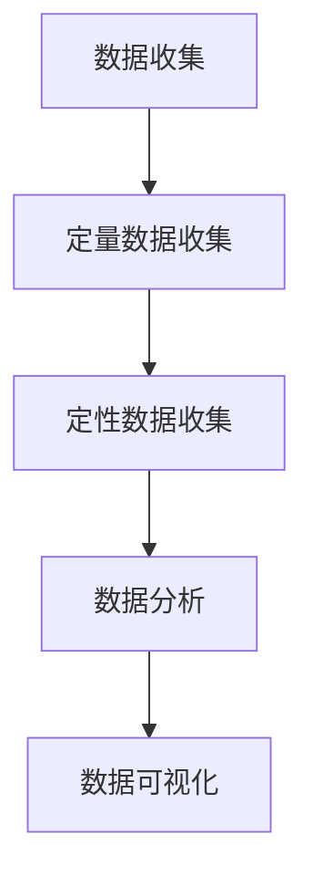

**核心算法原理讲解：**

数据收集与分析方法包括以下几个步骤：

1. **定量数据收集**：通过问卷、调查、实验等方法收集结构化数据。
2. **定性数据收集**：通过访谈、观察、文献分析等方法收集非结构化数据。
3. **数据分析**：使用统计方法对收集到的数据进行处理和分析，提取有价值的信息。
4. **数据可视化**：通过图表、图形等方式展示分析结果，便于理解和传达。

**伪代码示例：**

```python
def quantitative_data_collection():
    # 定量数据收集代码
    pass

def qualitative_data_collection():
    # 定性数据收集代码
    pass

def data_analysis():
    # 数据分析代码
    pass

def data_visualization():
    # 数据可视化代码
    pass
```

**数学模型和数学公式 & 详细讲解 & 举例说明：**

在数据分析中，常用的统计方法包括均值、方差、协方差等。以下是一个简单的例子：

```python
import numpy as np

def calculate_mean(data):
    # 计算均值
    return np.mean(data)

def calculate_variance(data):
    # 计算方差
    return np方差(data)

def calculate_covariance(data1, data2):
    # 计算协方差
    return np.cov(data1, data2)
```

$$
\text{mean}(X) = \frac{1}{n}\sum_{i=1}^{n}x_i
$$

$$
\text{variance}(X) = \frac{1}{n-1}\sum_{i=1}^{n}(x_i - \text{mean}(X))^2
$$

$$
\text{covariance}(X, Y) = \frac{1}{n-1}\sum_{i=1}^{n}(x_i - \text{mean}(X))(y_i - \text{mean}(Y))
$$

##### 1.5 技术洞察在决策中的作用

**核心概念与联系：**

技术洞察在决策中的作用主要体现在以下几个方面：

1. **战略规划**：帮助企业制定长期技术发展战略，抓住市场机遇。
2. **项目评估**：为项目提供技术可行性分析，降低项目风险。
3. **产品规划**：指导产品研发方向，提升产品竞争力。
4. **市场定位**：帮助企业在市场中找到合适的定位，满足用户需求。

**Mermaid 流程图：**

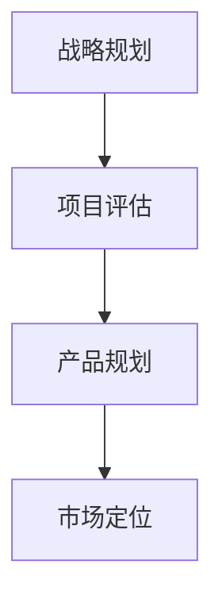

**核心算法原理讲解：**

技术洞察在决策中的作用是通过分析技术发展趋势和市场动态，为企业和组织的决策提供数据支持和科学依据。具体应用包括：

1. **战略规划**：通过技术趋势分析，识别市场机遇和潜在风险，为企业制定长远发展战略提供指导。
2. **项目评估**：结合技术洞察和项目需求，评估项目的技术可行性、成本和风险，优化项目方案。
3. **产品规划**：根据技术趋势和用户需求，指导产品研发方向，提升产品创新能力和市场竞争力。
4. **市场定位**：分析技术趋势和市场环境，为企业提供合适的市场定位策略，提高市场占有率。

**伪代码示例：**

```python
def strategic_planning(information):
    # 战略规划代码
    pass

def project_evaluation(information):
    # 项目评估代码
    pass

def product_planning(information):
    # 产品规划代码
    pass

def market_positioning(information):
    # 市场定位代码
    pass
```

**数学模型和数学公式 & 详细讲解 & 举例说明：**

在技术洞察应用中，常用的数学模型包括线性回归、逻辑回归等。以下是一个简单的线性回归模型示例：

```python
import numpy as np

def linear_regression(X, y):
    # 线性回归模型
    # $y = \beta_0 + \beta_1 x$

    # 步骤1：计算斜率 $\beta_1$
    # 步骤2：计算截距 $\beta_0$
    # 步骤3：模型拟合
    # 步骤4：模型评估

    # 返回线性回归模型参数
    pass
```

$$
y = \beta_0 + \beta_1 x
$$

其中，$y$ 为因变量，$x$ 为自变量，$\beta_0$ 为截距，$\beta_1$ 为斜率。

通过线性回归模型，可以分析自变量 $x$ 与因变量 $y$ 之间的关系，为企业决策提供数据支持。

##### 1.6 技术趋势报告在企业决策中的应用

**核心概念与联系：**

技术趋势报告在企业决策中的应用主要体现在以下几个方面：

1. **技术投资**：帮助企业识别潜在的技术投资领域，降低投资风险。
2. **产品开发**：指导产品研发方向，提高产品竞争力。
3. **市场战略**：为企业提供市场定位和竞争策略。
4. **人才招聘**：帮助企业在技术人才市场上找到合适的人才。

**Mermaid 流程图：**

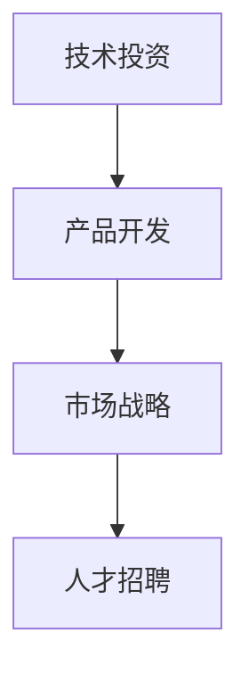

**核心算法原理讲解：**

技术趋势报告在企业决策中的应用是通过分析技术发展趋势和市场环境，为企业提供数据支持和决策依据。具体应用包括：

1. **技术投资**：通过技术趋势分析，识别具有发展潜力的技术领域，帮助企业制定投资策略，降低投资风险。
2. **产品开发**：根据技术趋势和用户需求，指导产品研发方向，提高产品创新能力和市场竞争力。
3. **市场战略**：分析技术趋势和市场环境，为企业提供市场定位和竞争策略，提高市场占有率。
4. **人才招聘**：根据技术趋势和公司需求，确定招聘方向，提高人才招聘的针对性。

**伪代码示例：**

```python
def technology_investment(trends):
    # 技术投资代码
    pass

def product_development(trends):
    # 产品开发代码
    pass

def market_strategy(trends):
    # 市场战略代码
    pass

def talent_recruitment(trends):
    # 人才招聘代码
    pass
```

**数学模型和数学公式 & 详细讲解 & 举例说明：**

在技术趋势分析中，常用的数学模型包括聚类分析、关联规则分析等。以下是一个简单的聚类分析模型示例：

```python
from sklearn.cluster import KMeans

def clustering_analysis(data):
    # 聚类分析模型
    # $K$-均值聚类算法

    # 步骤1：初始化聚类中心
    # 步骤2：分配数据点至聚类中心
    # 步骤3：更新聚类中心
    # 步骤4：模型评估

    # 返回聚类结果
    pass
```

$$
\text{K-Means Clustering}:
\begin{aligned}
\text{Minimize} \quad \sum_{i=1}^{k} \sum_{x_j \in S_i} ||x_j - \mu_i||^2 \\
\text{where} \quad \mu_i = \frac{1}{|S_i|}\sum_{x_j \in S_i} x_j
\end{aligned}
$$

通过聚类分析，可以将相似的数据点划分为不同的类别，为企业提供市场细分和产品定位的参考。

##### 1.7 技术趋势报告在项目评估中的应用

**核心概念与联系：**

技术趋势报告在项目评估中的应用主要体现在以下几个方面：

1. **技术可行性分析**：评估项目所需技术的成熟度和可行性。
2. **项目风险分析**：识别项目潜在的技术风险和业务风险。
3. **项目进度控制**：根据技术趋势调整项目进度和计划。
4. **项目成本控制**：评估项目成本并优化资源配置。

**Mermaid 流程图：**

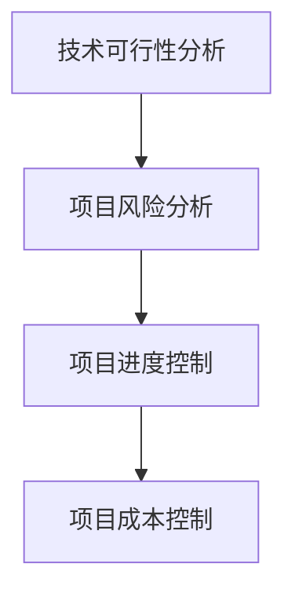

**核心算法原理讲解：**

技术趋势报告在项目评估中的应用是通过分析技术发展趋势和市场环境，为项目评估提供数据支持和决策依据。具体应用包括：

1. **技术可行性分析**：通过技术趋势分析，评估项目所需技术的成熟度和可行性，降低项目失败风险。
2. **项目风险分析**：分析技术趋势和市场变化，识别项目潜在的技术风险和业务风险，制定风险管理策略。
3. **项目进度控制**：根据技术趋势和项目需求，调整项目进度和计划，确保项目按时完成。
4. **项目成本控制**：评估项目成本并优化资源配置，提高项目效益。

**伪代码示例：**

```python
def technical_feasibility_analysis(trends):
    # 技术可行性分析代码
    pass

def project_risk_analysis(trends):
    # 项目风险分析代码
    pass

def project_progress_control(trends):
    # 项目进度控制代码
    pass

def project_cost_control(trends):
    # 项目成本控制代码
    pass
```

**数学模型和数学公式 & 详细讲解 & 举例说明：**

在项目评估中，常用的数学模型包括马尔可夫链、蒙特卡洛模拟等。以下是一个简单的马尔可夫链模型示例：

```python
import numpy as np

def markov_chain(transition_matrix, initial_state, steps):
    # 马尔可夫链模型
    # $P(X_t = x_t | X_{t-1} = x_{t-1}) = p_{x_{t-1}, x_t}$

    # 步骤1：初始化状态转移矩阵
    # 步骤2：模拟状态转移过程
    # 步骤3：模型评估

    # 返回状态转移结果
    pass
```

$$
P(X_t = x_t | X_{t-1} = x_{t-1}) = p_{x_{t-1}, x_t}
$$

通过马尔可夫链模型，可以分析项目在不同状态下的转移概率，为企业提供项目风险评估和决策支持。

##### 1.8 技术趋势报告在创新管理中的应用

**核心概念与联系：**

技术趋势报告在创新管理中的应用主要体现在以下几个方面：

1. **技术创新战略**：指导企业制定技术创新战略，推动技术进步。
2. **产品创新方向**：为产品创新提供方向和灵感。
3. **市场机会识别**：帮助企业在市场中找到创新机会。
4. **企业竞争力提升**：提高企业在技术竞争中的地位。

**Mermaid 流程图：**

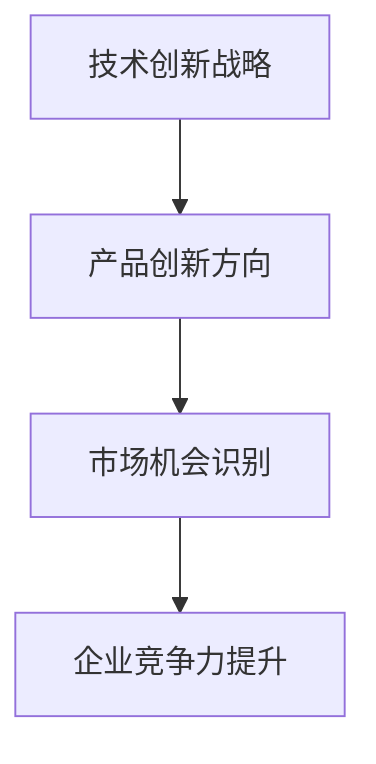

**核心算法原理讲解：**

技术趋势报告在创新管理中的应用是通过分析技术发展趋势和市场环境，为企业的创新活动提供数据支持和决策依据。具体应用包括：

1. **技术创新战略**：通过技术趋势分析，制定符合企业战略目标的技术创新计划，推动技术进步。
2. **产品创新方向**：分析技术趋势和用户需求，为产品创新提供方向和灵感，提高产品竞争力。
3. **市场机会识别**：挖掘市场潜在需求，帮助企业抓住创新机会，实现商业成功。
4. **企业竞争力提升**：通过技术趋势报告，提升企业在技术领域的竞争力，增强市场地位。

**伪代码示例：**

```python
def technological_innovation_strategy(trends):
    # 技术创新战略代码
    pass

def product_innovation_direction(trends):
    # 产品创新方向代码
    pass

def market_opportunity_identification(trends):
    # 市场机会识别代码
    pass

def enterprise_competitive_improvement(trends):
    # 企业竞争力提升代码
    pass
```

**数学模型和数学公式 & 详细讲解 & 举例说明：**

在创新管理中，常用的数学模型包括专利分析、市场研究等。以下是一个简单的专利分析模型示例：

```python
import pandas as pd

def patent_analysis(data):
    # 专利分析模型
    # 通过专利数量、申请国家、技术领域等信息分析技术创新趋势

    # 步骤1：数据预处理
    # 步骤2：特征提取
    # 步骤3：趋势分析

    # 返回专利分析结果
    pass
```

通过专利分析，可以了解某一技术领域的创新活跃度、技术发展趋势等，为企业技术创新提供参考。

### 第二部分：技术洞察转化为趋势报告的方法

#### 第2章：技术洞察的收集与整理

##### 2.1 技术洞察的收集

**核心概念与联系：**

技术洞察的收集是技术趋势报告编写的基础，涉及数据源的筛选、数据收集的方法和工具。数据源包括公开数据、内部数据、专家意见等，收集方法包括网络爬虫、问卷调查、访谈等。

**Mermaid 流程图：**

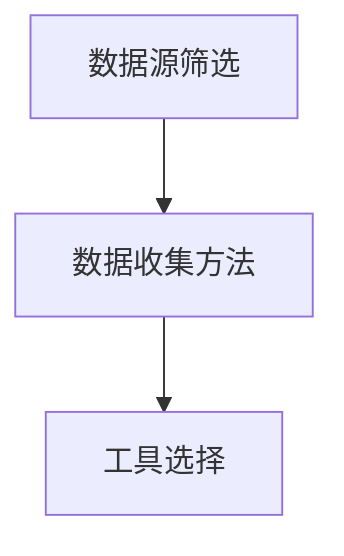

**核心算法原理讲解：**

技术洞察的收集步骤如下：

1. **数据源筛选**：根据研究目标，选择合适的公开数据源、内部数据源和专家意见来源。
2. **数据收集方法**：使用网络爬虫、问卷调查、访谈等方法收集数据，确保数据的完整性和准确性。
3. **工具选择**：选择合适的数据收集工具，如Python的爬虫库、问卷调查平台等，提高数据收集效率。

**伪代码示例：**

```python
def select_data_source():
    # 数据源筛选代码
    pass

def collect_data(method):
    # 数据收集代码
    pass

def choose_tools():
    # 工具选择代码
    pass
```

**数学模型和数学公式 & 详细讲解 & 举例说明：**

在数据收集过程中，可以使用以下数学模型和公式来评估数据的质量：

1. **数据完整性**：计算数据缺失率，评估数据的完整性。
2. **数据准确性**：通过对比实际值和预测值，评估数据的准确性。
3. **数据一致性**：检查数据是否存在矛盾或冲突，评估数据的一致性。

$$
\text{缺失率} = \frac{\text{缺失数据个数}}{\text{总数据个数}} \times 100\%
$$

$$
\text{准确性} = \frac{\text{预测正确个数}}{\text{总预测个数}} \times 100\%
$$

$$
\text{一致性} = \frac{\text{一致数据个数}}{\text{总数据个数}} \times 100\%
$$

通过这些指标，可以评估数据收集的质量，为后续的数据处理和分析奠定基础。

##### 2.2 技术洞察的整理

**核心概念与联系：**

技术洞察的整理是对收集到的数据进行处理、分类和评估的过程，旨在提取有价值的信息，为技术趋势报告的撰写提供支持。整理步骤包括数据清洗、数据分类、数据评估等。

**Mermaid 流程图：**

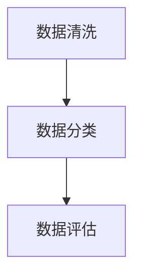

**核心算法原理讲解：**

技术洞察的整理步骤如下：

1. **数据清洗**：去除重复数据、缺失数据和错误数据，确保数据的准确性和一致性。
2. **数据分类**：根据技术主题和内容，将数据分为不同的类别，便于后续分析。
3. **数据评估**：评估数据的可靠性和有效性，为数据分析和趋势预测提供依据。

**伪代码示例：**

```python
def data_cleaning(data):
    # 数据清洗代码
    pass

def data_classification(data):
    # 数据分类代码
    pass

def data_evaluation(data):
    # 数据评估代码
    pass
```

**数学模型和数学公式 & 详细讲解 & 举例说明：**

在数据整理过程中，可以使用以下数学模型和公式来评估数据的质量：

1. **数据缺失率**：计算数据缺失的百分比，评估数据的完整性。
2. **数据一致性**：通过比较不同数据源的数据，评估数据的一致性。
3. **数据可靠性**：通过专家评估和统计分析，评估数据的可靠性。

$$
\text{缺失率} = \frac{\text{缺失数据个数}}{\text{总数据个数}} \times 100\%
$$

$$
\text{一致性} = \frac{\text{一致数据个数}}{\text{总数据个数}} \times 100\%
$$

$$
\text{可靠性} = \frac{\text{正确数据个数}}{\text{总数据个数}} \times 100\%
$$

通过这些指标，可以全面评估数据整理的质量，为技术趋势报告的撰写提供可靠的数据基础。

##### 2.3 技术洞察的分类

**核心概念与联系：**

技术洞察的分类是对整理后的数据进行归类和标签化的过程，有助于分析、总结和呈现技术趋势。分类方法包括主题分类、时间分类、区域分类等。

**Mermaid 流程图：**

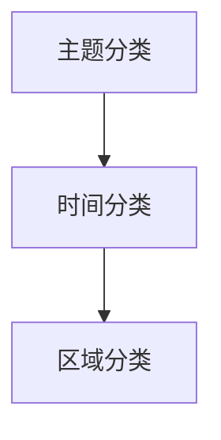

**核心算法原理讲解：**

技术洞察的分类步骤如下：

1. **主题分类**：根据技术主题对数据进行分析和归类，如人工智能、大数据、云计算等。
2. **时间分类**：根据数据的时间戳对数据进行分析和归类，如年度、季度、月度等。
3. **区域分类**：根据数据来源的区域对数据进行分析和归类，如国内、国外、特定地区等。

**伪代码示例：**

```python
def thematic_classification(data):
    # 主题分类代码
    pass

def temporal_classification(data):
    # 时间分类代码
    pass

def regional_classification(data):
    # 区域分类代码
    pass
```

**数学模型和数学公式 & 详细讲解 & 举例说明：**

在技术洞察的分类过程中，可以使用以下数学模型和公式来辅助分类：

1. **K-均值聚类**：通过聚类算法将数据分为不同的类别。
2. **决策树**：通过树形结构对数据进行分类。

$$
\text{K-Means Clustering}:
\begin{aligned}
\text{Minimize} \quad \sum_{i=1}^{k} \sum_{x_j \in S_i} ||x_j - \mu_i||^2 \\
\text{where} \quad \mu_i = \frac{1}{|S_i|}\sum_{x_j \in S_i} x_j
\end{aligned}
$$

$$
\text{Decision Tree}:
\begin{aligned}
\text{Select} \quad \text{best feature} \quad A \\
\text{Split} \quad \text{data} \quad D \quad \text{using} \quad A \\
\text{Recursively} \quad \text{apply steps 1-3} \quad \text{to} \quad \text{each subset} \quad D_i
\end{aligned}
$$

通过这些模型和公式，可以有效地对技术洞察进行分类，为后续分析提供基础。

##### 2.4 技术洞察的评估

**核心概念与联系：**

技术洞察的评估是对整理后的技术数据进行质量分析和价值判断的过程，旨在确定哪些技术洞察对技术趋势报告最为重要。评估标准包括数据质量、相关性、影响力和创新性等。

**Mermaid 流程图：**

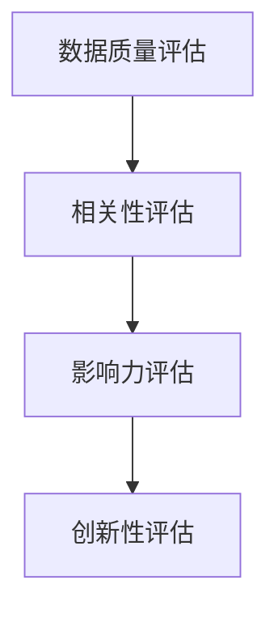

**核心算法原理讲解：**

技术洞察的评估步骤如下：

1. **数据质量评估**：根据数据完整性、准确性和一致性等指标，评估数据的质量。
2. **相关性评估**：分析技术洞察与业务目标、市场需求的相关性，确定其重要性。
3. **影响力评估**：根据技术洞察的潜在影响和实际应用效果，评估其影响力。
4. **创新性评估**：分析技术洞察的创新程度和领先优势，确定其创新性。

**伪代码示例：**

```python
def data_quality_evaluation(data):
    # 数据质量评估代码
    pass

def relevance_evaluation(data):
    # 相关性评估代码
    pass

def influence_evaluation(data):
    # 影响力评估代码
    pass

def innovation_evaluation(data):
    # 创新性评估代码
    pass
```

**数学模型和数学公式 & 详细讲解 & 举例说明：**

在技术洞察的评估过程中，可以使用以下数学模型和公式来辅助评估：

1. **熵值法**：通过计算信息的熵值，评估数据的多样性和价值。
2. **相关系数**：通过计算相关系数，评估技术洞察与业务目标、市场需求的相关程度。

$$
\text{Entropy} = -\sum_{i=1}^{n} p_i \ln(p_i)
$$

$$
\text{Correlation Coefficient} = \frac{\text{Cov}(X, Y)}{\sigma_X \sigma_Y}
$$

通过这些模型和公式，可以全面评估技术洞察的质量和价值，为技术趋势报告的撰写提供依据。

### 第三部分：技术趋势报告的撰写与呈现

#### 第3章：技术趋势报告的撰写

##### 3.1 报告的结构与风格

**核心概念与联系：**

技术趋势报告的结构和风格是确保报告逻辑清晰、信息丰富、易于理解的重要因素。报告的结构通常包括引言、正文、结论和参考文献等部分，而风格则涉及报告的语言表达、格式布局和可视化设计。

**Mermaid 流程图：**


**核心算法原理讲解：**

技术趋势报告的撰写步骤如下：

1. **引言**：介绍报告的背景、目的和范围，为读者提供整体把握。
2. **正文**：详细阐述技术洞察、市场分析、技术趋势预测等内容，是报告的核心部分。
3. **结论**：总结报告的主要发现，提出建议和展望。
4. **参考文献**：列出报告中所引用的文献资料，便于读者进一步学习和研究。

**伪代码示例：**

```python
def introduction():
    # 引言内容编写
    pass

def main_content():
    # 正文内容编写
    pass

def conclusion():
    # 结论内容编写
    pass

def references():
    # 参考文献编写
    pass
```

**数学模型和数学公式 & 详细讲解 & 举例说明：**

在撰写技术趋势报告时，可以使用以下数学模型和公式来辅助报告的结构和逻辑：

1. **层次分析法（AHP）**：用于评估不同技术因素的重要性和优先级。
2. **因果分析图**：用于分析技术趋势背后的因果关系。

$$
\text{AHP}:
\begin{aligned}
\text{Calculate} \quad \text{weights} \quad w_i = \frac{\text{Si}}{\sum_{j=1}^{n} \text{Sj}} \\
\text{Construct} \quad \text{judgment matrix} \quad A = \begin{pmatrix}
\text{a_{11}} & \text{a_{12}} & \dots & \text{a_{1n}} \\
\text{a_{21}} & \text{a_{22}} & \dots & \text{a_{2n}} \\
\vdots & \vdots & \ddots & \vdots \\
\text{a_{n1}} & \text{a_{n2}} & \dots & \text{a_{nn}}
\end{pmatrix}
\end{aligned}
$$

$$
\text{Cause-and-Effect Diagram}:
\begin{aligned}
\text{Identify} \quad \text{causes and effects} \\
\text{Construct} \quad \text{diagram} \quad \text{to represent} \quad \text{cause-and-effect relationships}
\end{aligned}
$$

通过这些模型和公式，可以确保技术趋势报告的结构严谨、逻辑清晰。

##### 3.2 报告的引言

**核心概念与联系：**

报告的引言是技术趋势报告的开篇，旨在为读者提供报告的背景、目的和范围，激发读者的阅读兴趣，同时为后续内容做好铺垫。

**Mermaid 流程图：**

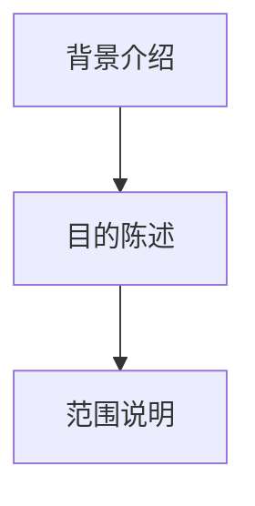

**核心算法原理讲解：**

撰写报告引言的步骤如下：

1. **背景介绍**：介绍技术领域的发展背景，说明报告的研究背景和意义。
2. **目的陈述**：明确报告的研究目的，阐述报告希望达成的目标和预期成果。
3. **范围说明**：界定报告的研究范围，包括技术主题、时间和空间范围等。

**伪代码示例：**

```python
def background_introduction():
    # 背景介绍内容编写
    pass

def purpose_statement():
    # 目的陈述内容编写
    pass

def scope_description():
    # 范围说明内容编写
    pass
```

**数学模型和数学公式 & 详细讲解 & 举例说明：**

在撰写报告引言时，可以使用以下数学模型和公式来强化报告的逻辑性和说服力：

1. **技术成熟度模型（TCM）**：用于评估技术发展的成熟度，说明技术背景。
2. **SWOT分析**：用于分析技术的优势、劣势、机会和威胁，支持目的陈述。

$$
\text{Technology Readiness Level (TRL)}:
\begin{aligned}
\text{Assess} \quad \text{the maturity of technology} \\
\text{Using} \quad \text{a scale from} \quad 1 \quad \text{to} \quad 9
\end{aligned}
$$

$$
\text{SWOT Analysis}:
\begin{aligned}
\text{Identify} \quad \text{Strengths, Weaknesses, Opportunities, and Threats} \\
\text{For the technology or project}
\end{aligned}
$$

通过这些模型和公式，可以系统地介绍技术背景，明确报告目的和范围，提高引言的质量。

##### 3.3 报告的主体内容

**核心概念与联系：**

报告的主体内容是技术趋势报告的核心部分，涵盖了技术洞察、市场分析、趋势预测等内容，旨在详细阐述技术发展趋势和未来前景。

**Mermaid 流程图：**

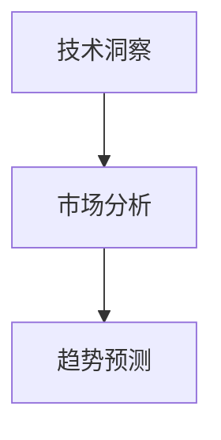

**核心算法原理讲解：**

撰写报告主体内容的步骤如下：

1. **技术洞察**：介绍当前技术领域的最新进展和关键发现，分析技术发展的影响因素。
2. **市场分析**：分析技术市场的现状、竞争格局和市场需求，评估技术对市场的影响。
3. **趋势预测**：基于技术洞察和市场分析，预测技术发展的未来趋势和潜在方向。

**伪代码示例：**

```python
def technical_insight():
    # 技术洞察内容编写
    pass

def market_analysis():
    # 市场分析内容编写
    pass

def trend_prediction():
    # 趋势预测内容编写
    pass
```

**数学模型和数学公式 & 详细讲解 & 举例说明：**

在撰写报告主体内容时，可以使用以下数学模型和公式来支持分析和预测：

1. **回归分析**：用于预测技术发展的未来趋势。
2. **时间序列分析**：用于分析技术市场的变化规律。

$$
\text{Regression Analysis}:
\begin{aligned}
\text{Predict} \quad \text{the future trend} \quad y \\
\text{Using} \quad \text{the linear relationship} \quad y = \beta_0 + \beta_1 x
\end{aligned}
$$

$$
\text{Time Series Analysis}:
\begin{aligned}
\text{Analyze} \quad \text{the pattern of market changes} \\
\text{Using} \quad \text{time series models like ARIMA}
\end{aligned}
$$

通过这些模型和公式，可以系统地分析技术洞察、市场分析和趋势预测，增强报告的主体内容。

##### 3.4 报告的结论

**核心概念与联系：**

报告的结论是技术趋势报告的总结部分，旨在概括报告的主要发现，提出建议和展望，为读者提供行动指南。

**Mermaid 流程图：**

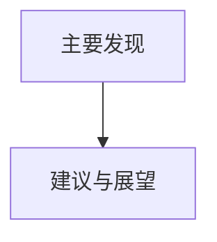

**核心算法原理讲解：**

撰写报告结论的步骤如下：

1. **主要发现**：总结报告的主要发现和关键结论，强调技术趋势对业务的影响。
2. **建议与展望**：基于主要发现，提出具体建议和未来研究方向，为读者提供行动指南。

**伪代码示例：**

```python
def main_findings():
    # 主要发现内容编写
    pass

def suggestions_and_outlook():
    # 建议与展望内容编写
    pass
```

**数学模型和数学公式 & 详细讲解 & 举例说明：**

在撰写报告结论时，可以使用以下数学模型和公式来支持结论的得出：

1. **置信区间**：用于评估预测结果的可靠性。
2. **回归模型的拟合优度**：用于评估模型的预测能力。

$$
\text{Confidence Interval}:
\begin{aligned}
\text{Evaluate} \quad \text{the reliability of predictions} \\
\text{Using} \quad \text{confidence intervals for model parameters}
\end{aligned}
$$

$$
\text{Regression Model Fit}:
\begin{aligned}
\text{Assess} \quad \text{the goodness of fit for the model} \\
\text{Using} \quad \text{metrics like} \quad R^2, \quad \text{p-value of coefficients}
\end{aligned}
$$

通过这些模型和公式，可以确保报告结论的严谨性和可靠性。

##### 3.5 报告的参考文献

**核心概念与联系：**

报告的参考文献是技术趋势报告的重要组成部分，旨在列出报告中所引用的文献资料，为读者提供进一步学习和研究的参考。

**Mermaid 流程图：**

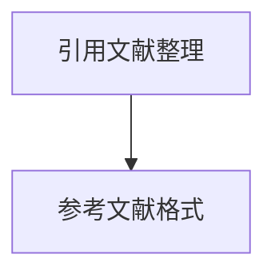

**核心算法原理讲解：**

撰写报告参考文献的步骤如下：

1. **引用文献整理**：整理报告中所引用的所有文献，确保文献的准确性和完整性。
2. **参考文献格式**：根据学术规范，格式化参考文献，包括作者、标题、出版社、出版年份等。

**伪代码示例：**

```python
def citation_organization():
    # 引用文献整理代码
    pass

def citation_formatting():
    # 参考文献格式代码
    pass
```

**数学模型和数学公式 & 详细讲解 & 举例说明：**

在撰写报告参考文献时，可以使用以下数学模型和公式来规范文献格式：

1. **文献引用格式**：使用特定的格式，如APA、MLA等，确保参考文献的一致性。

$$
\text{APA Format}:
\begin{aligned}
\text{Author(s).} \quad \text{(Year).} \quad \text{Title}. \quad \text{Journal}, \quad \text{Volume}, \quad \text{Issue}, \quad \text{Page range}.
\end{aligned}
$$

$$
\text{MLA Format}:
\begin{aligned}
\text{Author(s).} \quad \text{(Year).} \quad \text{Title}. \quad \text{Journal}, \quad \text{Volume}, \quad \text{Issue}, \quad \text{Page range}.
\end{aligned}
$$

通过这些模型和公式，可以确保报告参考文献的规范性和可读性。

### 第四部分：技术趋势报告的可视化与传达

#### 第4章：技术趋势报告的可视化设计

##### 4.1 技术趋势报告的可视化设计

**核心概念与联系：**

技术趋势报告的可视化设计是提高报告可读性和信息传递效率的重要手段。可视化设计包括图表的选择、设计和布局，旨在以直观、简洁的方式呈现技术趋势和分析结果。

**Mermaid 流程图：**

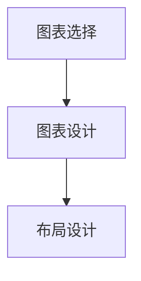

**核心算法原理讲解：**

技术趋势报告的可视化设计步骤如下：

1. **图表选择**：根据报告内容和数据分析结果，选择合适的图表类型，如柱状图、折线图、饼图等。
2. **图表设计**：设计图表的外观，包括颜色、字体、线条等，确保图表清晰、美观、易读。
3. **布局设计**：合理安排图表在报告中的位置和排列，确保整体布局和谐、统一。

**伪代码示例：**

```python
def chart_selection():
    # 图表选择代码
    pass

def chart_design():
    # 图表设计代码
    pass

def layout_design():
    # 布局设计代码
    pass
```

**数学模型和数学公式 & 详细讲解 & 举例说明：**

在可视化设计过程中，可以使用以下数学模型和公式来指导图表设计和布局：

1. **色彩心理学**：根据色彩对人类心理的影响，选择合适的颜色方案，提升图表的视觉效果。
2. **布局算法**：使用特定的算法，如网格布局、对齐规则等，优化图表的布局。

$$
\text{Color Theory}:
\begin{aligned}
\text{Choose} \quad \text{colors that evoke the desired emotions and convey information effectively}
\end{aligned}
$$

$$
\text{Layout Algorithm}:
\begin{aligned}
\text{Apply} \quad \text{algorithm} \quad \text{to optimize the arrangement of charts in the report}
\end{aligned}
$$

通过这些模型和公式，可以设计出美观、实用的图表和布局，提高技术趋势报告的可读性和传达效果。

##### 4.2 技术趋势报告的可视化工具

**核心概念与联系：**

技术趋势报告的可视化工具是提高报告可视化设计效率和质量的关键。常见的可视化工具包括Excel、Tableau、Matplotlib等，每种工具都有其独特的特点和适用场景。

**Mermaid 流程图：**

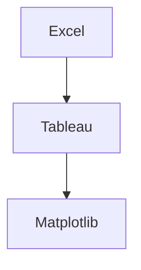

**核心算法原理讲解：**

常见可视化工具的功能和应用场景如下：

1. **Excel**：适用于简单的数据可视化和图表生成，具有直观的用户界面和丰富的图表类型。
2. **Tableau**：适用于复杂的数据可视化和交互式分析，支持多种数据连接和图表类型，适用于大数据场景。
3. **Matplotlib**：适用于Python编程环境中的数据可视化，提供丰富的绘图函数和自定义选项，适用于科学计算和数据分析。

**伪代码示例：**

```python
def excel_visualization(data):
    # 使用Excel进行数据可视化
    pass

def tableau_visualization(data):
    # 使用Tableau进行数据可视化
    pass

def matplotlib_visualization(data):
    # 使用Matplotlib进行数据可视化
    pass
```

**数学模型和数学公式 & 详细讲解 & 举例说明：**

在可视化工具中，可以使用以下数学模型和公式来支持数据可视化和分析：

1. **回归模型**：用于可视化技术趋势和时间序列数据。
2. **聚类模型**：用于可视化数据分布和类别划分。

$$
\text{Regression Model}:
\begin{aligned}
\text{Visualize} \quad \text{linear relationships} \quad y = \beta_0 + \beta_1 x
\end{aligned}
$$

$$
\text{Clustering Model}:
\begin{aligned}
\text{Visualize} \quad \text{data distributions and clusters} \\
\text{Using} \quad \text{algorithms like K-Means}
\end{aligned}
$$

通过这些模型和公式，可以充分利用可视化工具的功能，设计出高质量的技术趋势报告。

##### 4.3 技术趋势报告的传达与分享

**核心概念与联系：**

技术趋势报告的传达与分享是确保报告内容得到有效传播和应用的关键环节。传达与分享包括内部沟通技巧、公开演讲与演示等，旨在让报告内容以清晰、准确的方式传递给受众。

**Mermaid 流程图：**

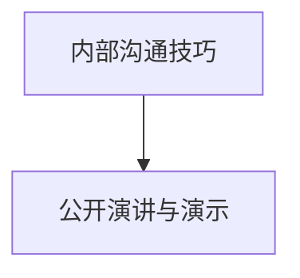

**核心算法原理讲解：**

技术趋势报告的传达与分享步骤如下：

1. **内部沟通技巧**：通过有效沟通，确保团队成员理解和接受报告内容，包括书面报告、会议讨论、邮件通知等。
2. **公开演讲与演示**：在会议、研讨会等场合，通过演讲和演示，向外部受众传达报告内容，包括PPT制作、现场讲解、互动交流等。

**伪代码示例：**

```python
def internal_communication():
    # 内部沟通技巧代码
    pass

def public_speaking_and_presentation():
    # 公开演讲与演示代码
    pass
```

**数学模型和数学公式 & 详细讲解 & 举例说明：**

在传达与分享过程中，可以使用以下数学模型和公式来支持沟通和演示：

1. **信息传递模型**：用于评估沟通效果，包括信息发送、信息接收、反馈等环节。
2. **演示设计原则**：用于指导PPT制作和演讲内容的设计，确保演示的清晰、逻辑性强。

$$
\text{Information Transmission Model}:
\begin{aligned}
\text{Assess} \quad \text{the effectiveness of communication} \\
\text{Using} \quad \text{metrics like} \quad \text{message clarity}, \quad \text{feedback quality}
\end{aligned}
$$

$$
\text{Presentation Design Principles}:
\begin{aligned}
\text{Ensure} \quad \text{clear, logical, and engaging presentations} \\
\text{Using} \quad \text{principles like} \quad \text{visual consistency}, \quad \text{storytelling}
\end{aligned}
$$

通过这些模型和公式，可以有效地传达和分享技术趋势报告的内容，提高报告的影响力和应用效果。

### 第五部分：技术趋势报告的应用与评估

#### 第5章：技术趋势报告在企业决策中的应用

##### 5.1 技术趋势报告在企业战略规划中的作用

**核心概念与联系：**

技术趋势报告在企业战略规划中的作用主要体现在提供技术发展方向和战略决策依据，帮助企业抓住市场机遇，规避技术风险。

**Mermaid 流程图：**

```mermaid
graph TD
A[技术趋势分析] --> B[战略目标设定]
B --> C[战略方案制定]
```

**核心算法原理讲解：**

技术趋势报告在企业战略规划中的应用步骤如下：

1. **技术趋势分析**：通过数据收集和分析，识别当前技术发展的主要趋势和未来方向。
2. **战略目标设定**：根据技术趋势分析结果，设定企业的战略目标和方向。
3. **战略方案制定**：结合企业资源和能力，制定具体的战略实施方案。

**伪代码示例：**

```python
def technical_trend_analysis():
    # 技术趋势分析代码
    pass

def strategic_goal_setting():
    # 战略目标设定代码
    pass

def strategic_plan_development():
    # 战略方案制定代码
    pass
```

**数学模型和数学公式 & 详细讲解 & 举例说明：**

在制定企业战略规划时，可以使用以下数学模型和公式来支持决策：

1. **SWOT分析**：用于评估企业的优势、劣势、机会和威胁，支持战略目标的设定。
2. **决策树**：用于评估不同战略方案的优劣，支持战略方案的选择。

$$
\text{SWOT Analysis}:
\begin{aligned}
\text{Assess} \quad \text{Strengths, Weaknesses, Opportunities, and Threats} \\
\text{For the organization}
\end{aligned}
$$

$$
\text{Decision Tree}:
\begin{aligned}
\text{Evaluate} \quad \text{different strategic options} \\
\text{Using} \quad \text{a tree-like structure for decision making}
\end{aligned}
$$

通过这些模型和公式，可以系统地制定企业战略规划，确保战略目标的科学性和可操作性。

##### 5.2 技术趋势报告在项目评估中的应用

**核心概念与联系：**

技术趋势报告在项目评估中的应用主要体现在提供技术可行性和风险分析，帮助企业评估项目的投资价值，降低项目失败风险。

**Mermaid 流程图：**

```mermaid
graph TD
A[技术趋势分析] --> B[技术可行性评估]
B --> C[风险分析]
```

**核心算法原理讲解：**

技术趋势报告在项目评估中的应用步骤如下：

1. **技术趋势分析**：通过数据收集和分析，识别当前技术发展的主要趋势和未来方向。
2. **技术可行性评估**：结合技术趋势和项目需求，评估项目所需技术的成熟度和可行性。
3. **风险分析**：分析项目潜在的技术风险和业务风险，评估项目风险水平。

**伪代码示例：**

```python
def technical_trend_analysis():
    # 技术趋势分析代码
    pass

def technical_feasibility_evaluation():
    # 技术可行性评估代码
    pass

def risk_analysis():
    # 风险分析代码
    pass
```

**数学模型和数学公式 & 详细讲解 & 举例说明：**

在项目评估过程中，可以使用以下数学模型和公式来支持分析：

1. **概率模型**：用于评估项目风险的概率分布，支持风险分析。
2. **决策树**：用于评估不同风险应对策略的优劣，支持决策。

$$
\text{Probability Model}:
\begin{aligned}
\text{Assess} \quad \text{the probability distribution of risks} \\
\text{Using} \quad \text{methods like} \quad \text{Bayesian networks}
\end{aligned}
$$

$$
\text{Decision Tree}:
\begin{aligned}
\text{Evaluate} \quad \text{different risk mitigation strategies} \\
\text{Using} \quad \text{a tree-like structure for decision making}
\end{aligned}
$$

通过这些模型和公式，可以系统地评估项目的技术可行性和风险水平，提高项目评估的科学性和准确性。

##### 5.3 技术趋势报告在产品开发中的应用

**核心概念与联系：**

技术趋势报告在产品开发中的应用主要体现在提供技术发展方向和市场趋势信息，帮助企业确定产品开发方向，提高产品竞争力。

**Mermaid 流程图：**

```mermaid
graph TD
A[技术趋势分析] --> B[产品需求分析]
B --> C[产品设计]
```

**核心算法原理讲解：**

技术趋势报告在产品开发中的应用步骤如下：

1. **技术趋势分析**：通过数据收集和分析，识别当前技术发展的主要趋势和未来方向。
2. **产品需求分析**：结合技术趋势和市场调研，确定产品需求，明确产品功能、性能和用户体验等。
3. **产品设计**：根据产品需求，进行产品设计和开发，确保产品符合市场需求和技术趋势。

**伪代码示例：**

```python
def technical_trend_analysis():
    # 技术趋势分析代码
    pass

def product_requirement_analysis():
    # 产品需求分析代码
    pass

def product_design():
    # 产品设计代码
    pass
```

**数学模型和数学公式 & 详细讲解 & 举例说明：**

在产品开发过程中，可以使用以下数学模型和公式来支持设计和决策：

1. **需求工程模型**：用于确定产品需求和功能，支持产品需求分析。
2. **质量功能展开（QFD）**：用于优化产品设计，提高产品性能和用户体验。

$$
\text{Requirement Engineering Model}:
\begin{aligned}
\text{Define} \quad \text{product requirements and functions} \\
\text{Using} \quad \text{methods like} \quad \text{use cases}, \quad \text{function points}
\end{aligned}
$$

$$
\text{Quality Function Deployment (QFD)}:
\begin{aligned}
\text{Optimize} \quad \text{product design and performance} \\
\text{Using} \quad \text{methods like} \quad \text{house of quality}, \quad \text{priority ranking}
\end{aligned}
$$

通过这些模型和公式，可以系统地确定产品需求和设计，提高产品开发的质量和效率。

##### 5.4 技术趋势报告在市场定位中的应用

**核心概念与联系：**

技术趋势报告在市场定位中的应用主要体现在提供技术发展和市场趋势信息，帮助企业确定产品定位、价格策略和营销策略。

**Mermaid 流程图：**

```mermaid
graph TD
A[技术趋势分析] --> B[市场调研]
B --> C[产品定位]
C --> D[价格策略]
D --> E[营销策略]
```

**核心算法原理讲解：**

技术趋势报告在市场定位中的应用步骤如下：

1. **技术趋势分析**：通过数据收集和分析，识别当前技术发展的主要趋势和未来方向。
2. **市场调研**：结合技术趋势，进行市场调研，了解市场需求、竞争格局和消费者行为。
3. **产品定位**：根据技术趋势和市场调研结果，确定产品定位，明确目标市场和竞争优势。
4. **价格策略**：根据产品定位和市场情况，制定合理的价格策略，提高产品竞争力。
5. **营销策略**：根据产品定位和价格策略，制定有效的营销策略，提高市场占有率。

**伪代码示例：**

```python
def technical_trend_analysis():
    # 技术趋势分析代码
    pass

def market_research():
    # 市场调研代码
    pass

def product_positioning():
    # 产品定位代码
    pass

def pricing_strategy():
    # 价格策略代码
    pass

def marketing_strategy():
    # 营销策略代码
    pass
```

**数学模型和数学公式 & 详细讲解 & 举例说明：**

在市场定位过程中，可以使用以下数学模型和公式来支持分析和决策：

1. **市场细分模型**：用于分析市场需求，支持产品定位。
2. **竞争分析模型**：用于评估市场竞争状况，支持价格策略和营销策略。

$$
\text{Market Segmentation Model}:
\begin{aligned}
\text{Analyze} \quad \text{customer needs and preferences} \\
\text{For different market segments}
\end{aligned}
$$

$$
\text{Competitive Analysis Model}:
\begin{aligned}
\text{Assess} \quad \text{the competitive landscape} \\
\text{Using} \quad \text{methods like} \quad \text{SWOT analysis}, \quad \text{value chain analysis}
\end{aligned}
$$

通过这些模型和公式，可以系统地分析市场需求、竞争状况和消费者行为，为企业制定有效的市场定位策略提供支持。

### 第六部分：技术趋势报告的评估与改进

#### 第6章：技术趋势报告的评估与改进

##### 6.1 技术趋势报告的质量评估

**核心概念与联系：**

技术趋势报告的质量评估是对报告内容、形式和效果进行全面评估，以确定报告的质量和可靠性。质量评估涉及多个方面，包括数据准确性、分析深度、结论合理性等。

**Mermaid 流程图：**

```mermaid
graph TD
A[数据准确性评估] --> B[分析深度评估]
B --> C[结论合理性评估]
```

**核心算法原理讲解：**

技术趋势报告的质量评估步骤如下：

1. **数据准确性评估**：检查数据收集、处理和分析的准确性，确保报告基于可靠的数据基础。
2. **分析深度评估**：评估报告的分析方法和模型，确保分析过程深入、全面，能够反映技术趋势的复杂性。
3. **结论合理性评估**：检查报告的结论是否基于充分的证据和合理的逻辑，确保结论的可信度和实用性。

**伪代码示例：**

```python
def data_accuracy_evaluation():
    # 数据准确性评估代码
    pass

def analysis_depth_evaluation():
    # 分析深度评估代码
    pass

def conclusion_reasonableness_evaluation():
    # 结论合理性评估代码
    pass
```

**数学模型和数学公式 & 详细讲解 & 举例说明：**

在质量评估过程中，可以使用以下数学模型和公式来支持评估：

1. **误差分析**：用于评估数据收集和处理过程中的误差。
2. **模型拟合度评估**：用于评估分析模型的拟合效果，确保分析结果的可靠性。

$$
\text{Error Analysis}:
\begin{aligned}
\text{Evaluate} \quad \text{the accuracy of data collection and processing} \\
\text{Using} \quad \text{metrics like} \quad \text{mean squared error}, \quad \text{root mean squared error}
\end{aligned}
$$

$$
\text{Model Fit Evaluation}:
\begin{aligned}
\text{Assess} \quad \text{the goodness of fit for the analysis model} \\
\text{Using} \quad \text{metrics like} \quad \text{R-squared}, \quad \text{Adjusted R-squared}
\end{aligned}
$$

通过这些模型和公式，可以系统地评估技术趋势报告的质量，确保报告的可靠性和实用性。

##### 6.2 技术趋势报告的改进策略

**核心概念与联系：**

技术趋势报告的改进策略是针对评估过程中发现的问题和不足，提出具体的改进措施，以提高报告的质量和效果。改进策略涉及数据收集、分析方法、报告结构等各个方面。

**Mermaid 流程图：**

```mermaid
graph TD
A[数据收集改进] --> B[分析方法改进]
B --> C[报告结构改进]
```

**核心算法原理讲解：**

技术趋势报告的改进策略包括以下几个步骤：

1. **数据收集改进**：优化数据收集方法，提高数据的准确性和完整性。
2. **分析方法改进**：改进分析方法和模型，提高分析的深度和广度，确保分析结果的准确性。
3. **报告结构改进**：优化报告的结构和内容布局，提高报告的可读性和逻辑性。

**伪代码示例：**

```python
def data_collection_improvement():
    # 数据收集改进代码
    pass

def analysis_method_improvement():
    # 分析方法改进代码
    pass

def report_structure_improvement():
    # 报告结构改进代码
    pass
```

**数学模型和数学公式 & 详细讲解 & 举例说明：**

在改进技术趋势报告时，可以使用以下数学模型和公式来指导改进：

1. **数据质量评估模型**：用于评估数据质量，指导数据收集改进。
2. **分析模型优化**：用于评估分析模型的性能，指导分析方法改进。

$$
\text{Data Quality Assessment Model}:
\begin{aligned}
\text{Evaluate} \quad \text{the quality of data} \\
\text{Using} \quad \text{metrics like} \quad \text{missing data rate}, \quad \text{data consistency}
\end{aligned}
$$

$$
\text{Analysis Model Optimization}:
\begin{aligned}
\text{Optimize} \quad \text{the performance of analysis models} \\
\text{Using} \quad \text{methods like} \quad \text{cross-validation}, \quad \text{hyperparameter tuning}
\end{aligned}
$$

通过这些模型和公式，可以系统地改进技术趋势报告，提高报告的质量和效果。

##### 6.3 技术趋势报告的持续更新

**核心概念与联系：**

技术趋势报告的持续更新是确保报告内容始终反映最新技术动态和市场变化的重要手段。持续更新包括定期收集数据、分析趋势、修订报告等过程。

**Mermaid 流程图：**

```mermaid
graph TD
A[数据定期收集] --> B[趋势定期分析]
B --> C[报告定期修订]
```

**核心算法原理讲解：**

技术趋势报告的持续更新步骤如下：

1. **数据定期收集**：定期收集与目标技术相关的数据，确保报告基于最新的数据基础。
2. **趋势定期分析**：定期分析数据，识别技术发展的最新趋势，更新报告的内容。
3. **报告定期修订**：根据数据分析结果，修订报告的结构和内容，确保报告的时效性和准确性。

**伪代码示例：**

```python
def data_collection_periodically():
    # 数据定期收集代码
    pass

def trend_analysis_periodically():
    # 趋势定期分析代码
    pass

def report_revision_periodically():
    # 报告定期修订代码
    pass
```

**数学模型和数学公式 & 详细讲解 & 举例说明：**

在持续更新过程中，可以使用以下数学模型和公式来支持数据分析：

1. **时间序列分析**：用于分析技术发展的时间序列数据，识别趋势变化。
2. **更新策略**：用于优化数据更新过程，提高更新效率。

$$
\text{Time Series Analysis}:
\begin{aligned}
\text{Analyze} \quad \text{time series data} \\
\text{Using} \quad \text{methods like} \quad \text{ARIMA}, \quad \text{LSTM}
\end{aligned}
$$

$$
\text{Update Strategy}:
\begin{aligned}
\text{Optimize} \quad \text{the process of data updating} \\
\text{Using} \quad \text{methods like} \quad \text{incremental learning}, \quad \text{batch processing}
\end{aligned}
$$

通过这些模型和公式，可以有效地持续更新技术趋势报告，确保报告的时效性和准确性。

### 附录

#### 附录 A：技术趋势报告编写工具与资源

**核心概念与联系：**

技术趋势报告编写工具与资源是确保报告编写高效、准确的重要支持。工具包括文本编辑器、数据可视化软件、统计分析软件等，资源包括数据库、在线平台、开源社区等。

**Mermaid 流程图：**

```mermaid
graph TD
A[文本编辑器] --> B[数据可视化软件]
B --> C[统计分析软件]
C --> D[数据库]
D --> E[在线平台]
E --> F[开源社区]
```

**核心算法原理讲解：**

编写技术趋势报告常用的工具与资源如下：

1. **文本编辑器**：如Markdown编辑器，用于撰写和格式化报告内容。
2. **数据可视化软件**：如Tableau、Power BI等，用于生成和定制可视化图表。
3. **统计分析软件**：如R、Python等，用于数据分析和模型构建。
4. **数据库**：如MySQL、MongoDB等，用于存储和管理数据。
5. **在线平台**：如GitHub、Google Scholar等，用于获取资源和协作。
6. **开源社区**：如Stack Overflow、GitHub等，用于获取技术支持和分享经验。

**伪代码示例：**

```python
def text_editor():
    # 使用文本编辑器编写报告代码
    pass

def data_visualization_software():
    # 使用数据可视化软件生成图表代码
    pass

def statistical_analysis_software():
    # 使用统计分析软件进行数据分析代码
    pass

def database():
    # 使用数据库存储和管理数据代码
    pass

def online_platform():
    # 使用在线平台获取资源代码
    pass

def open_source_community():
    # 使用开源社区获取技术支持代码
    pass
```

**数学模型和数学公式 & 详细讲解 & 举例说明：**

在使用这些工具和资源时，可以使用以下数学模型和公式来支持报告编写：

1. **Markdown语法**：用于格式化文本，包括标题、列表、公式等。
2. **数据可视化公式**：用于定制图表样式和交互功能。

$$
\text{Markdown Syntax}:
\begin{aligned}
\text{Format text for} \quad \text{report writing} \\
\text{Using} \quad \text{语法 like} \quad \text{headers}, \quad \text{lists}, \quad \text{math equations}
\end{aligned}
$$

$$
\text{Data Visualization Formulas}:
\begin{aligned}
\text{Customize chart styles and interactions} \\
\text{Using} \quad \text{formulas like} \quad \text{color scales}, \quad \text{interactivity}
\end{aligned}
$$

通过这些工具和资源，可以高效地编写和优化技术趋势报告，提高报告的质量和效果。

#### 附录 B：技术趋势报告案例分析

**案例一：某企业技术趋势报告撰写与实施**

**背景介绍：**

某企业致力于科技创新，希望通过技术趋势报告为企业的战略规划和项目评估提供数据支持。企业技术部门负责撰写技术趋势报告，旨在分析当前技术发展动态和未来趋势，为企业决策提供科学依据。

**报告撰写与实施步骤：**

1. **需求分析**：确定报告的目的、受众和范围，明确技术趋势报告需要覆盖的技术领域和关键指标。
2. **数据收集**：通过公开数据源、内部数据和专家访谈，收集与目标技术相关的数据。
3. **数据分析**：对收集到的数据进行分析，使用统计分析、机器学习等方法提取有价值的信息。
4. **趋势预测**：基于数据分析结果，使用时间序列分析、回归分析等方法预测技术发展趋势。
5. **报告撰写**：根据分析结果和预测趋势，撰写技术趋势报告，包括引言、正文、结论和参考文献等部分。
6. **报告评审**：组织专家评审，对报告的内容、形式和逻辑进行评估，提出修改意见。
7. **报告修订**：根据评审意见，对报告进行修订和完善，确保报告的质量和准确性。
8. **报告发布**：将修订后的技术趋势报告发布给企业内部和外部受众，确保报告内容得到有效传播和应用。

**报告效果评估：**

通过技术趋势报告，企业能够及时了解技术发展的最新动态，为战略规划和项目评估提供数据支持。报告帮助企业确定了技术创新方向，优化了项目实施方案，降低了项目风险。此外，报告还为企业提供了市场定位和竞争策略的参考，提高了企业在市场中的竞争力。

**案例总结：**

该案例展示了如何通过技术趋势报告为企业提供数据支持和决策依据。报告的撰写和实施过程体现了系统性和科学性，确保了报告的质量和准确性。通过案例，可以总结出以下几点经验：

1. **明确报告目的和受众**：确保报告内容符合企业需求和受众期望。
2. **全面收集数据**：确保报告基于可靠的数据基础，提高报告的权威性和可信度。
3. **科学分析数据**：使用合适的分析方法，确保分析结果的准确性和有效性。
4. **合理预测趋势**：基于数据分析和市场调研，预测技术发展的未来趋势。
5. **及时修订报告**：根据评审意见，及时修订报告，确保报告的时效性和准确性。
6. **广泛传播报告**：确保报告内容得到有效传播和应用，提高报告的影响力和价值。

**案例二：某行业技术趋势报告的解读与应用**

**背景介绍：**

某行业竞争激烈，企业希望通过技术趋势报告了解行业发展的最新动态和未来趋势，以便制定相应的战略和决策。行业研究机构负责撰写技术趋势报告，旨在为行业企业提供有价值的信息和分析。

**报告解读与应用步骤：**

1. **报告解读**：分析技术趋势报告的内容，了解行业发展的主要趋势和未来方向。
2. **市场分析**：结合技术趋势报告，分析行业市场的现状和变化，评估市场竞争状况。
3. **战略制定**：根据技术趋势和市场分析结果，制定企业发展战略和竞争策略。
4. **项目评估**：使用技术趋势报告，评估项目的技术可行性和市场前景，优化项目实施方案。
5. **产品规划**：根据技术趋势报告，规划产品创新方向，提高产品竞争力。
6. **人才招聘**：根据技术趋势报告，确定人才招聘方向，吸引和培养行业人才。

**报告效果评估：**

通过技术趋势报告，企业能够及时了解行业发展的最新动态，为战略制定和项目评估提供科学依据。报告帮助企业抓住了市场机遇，优化了资源配置，提高了市场竞争力。此外，报告还为企业提供了市场定位和竞争策略的参考，提高了企业在市场中的地位。

**案例总结：**

该案例展示了如何通过技术趋势报告为企业提供行业分析和决策支持。报告的解读和应用过程体现了系统性和科学性，确保了报告的价值和影响力。通过案例，可以总结出以下几点经验：

1. **深入解读报告**：确保理解技术趋势报告的核心内容和关键信息。
2. **结合市场分析**：将技术趋势报告与市场分析相结合，制定科学合理的战略和决策。
3. **优化资源配置**：根据技术趋势报告，合理配置资源，提高项目和市场竞争力。
4. **持续更新报告**：定期更新技术趋势报告，确保报告内容的时效性和准确性。
5. **广泛传播报告**：确保技术趋势报告在企业内部和外部得到广泛传播和应用，提高报告的影响力和价值。

通过这些案例，可以了解到如何有效地撰写和利用技术趋势报告，为企业提供数据支持和决策依据，提高企业的竞争力和创新能力。

## 小结

本文详细探讨了如何将技术洞察转化为技术趋势报告的整个过程。从技术洞察的定义与重要性，到技术趋势报告的构成要素和基本框架；从数据收集与分析方法，到技术洞察的收集与整理；从技术趋势报告的撰写与呈现，到可视化设计、传达与应用；再到评估与改进以及持续更新，本文逐步解析了技术趋势报告编写的各个环节，提供了系统、详细的指导。

技术洞察在决策中起着至关重要的作用，通过对大量技术数据的收集、整理和分析，可以预测技术发展的未来趋势，为企业和组织的战略规划、项目评估、产品开发、市场定位等提供科学依据。

技术趋势报告的撰写是一个复杂而系统的过程，需要充分考虑报告的结构、风格、内容组织以及可视化设计。通过有效的数据收集与分析，可以确保报告的准确性和可靠性，从而提高报告的质量和影响力。

在技术趋势报告的可视化与传达过程中，合理的图表选择、设计和布局能够大大提升报告的可读性和信息传递效率。同时，通过内部沟通技巧和公开演讲与演示，可以确保报告内容得到有效传播和应用。

技术趋势报告在企业决策中的应用范围广泛，包括战略规划、项目评估、产品开发、市场定位等方面。通过分析技术发展趋势和市场动态，企业可以更好地抓住市场机遇，规避技术风险，提高市场竞争力。

为了确保技术趋势报告的质量和有效性，需要对报告进行持续评估和改进。通过定期收集数据、分析趋势、修订报告，可以不断提高报告的时效性和准确性，确保报告始终反映最新的技术动态和市场变化。

总之，技术趋势报告是企业在技术快速发展的时代中，把握机遇、应对挑战的重要工具。通过本文的探讨，希望能够为读者提供有价值的参考和启示，帮助他们在技术趋势报告的撰写和应用中取得更好的成果。

## 最佳实践 tips

在撰写技术趋势报告时，以下最佳实践 tips 能帮助您提高报告的质量和影响力：

1. **明确报告目的**：在撰写报告之前，确保明确报告的目的和受众，这有助于确定报告的内容重点和风格。
2. **全面收集数据**：确保数据收集的全面性和准确性，使用多种渠道和来源收集数据，提高报告的权威性。
3. **科学分析方法**：选择合适的数据分析方法，如统计分析、机器学习等，确保分析结果的准确性和可靠性。
4. **可视化设计**：合理选择和设计图表，使用色彩和布局增强报告的可读性和视觉效果。
5. **结构清晰**：确保报告的结构清晰、逻辑性强，使用标题、段落和列表等工具帮助读者更好地理解内容。
6. **内容简练**：避免冗长和重复的内容，确保报告内容简练、有针对性。
7. **定期更新**：定期收集和分析数据，更新技术趋势报告，确保报告的时效性和准确性。
8. **广泛传播**：通过内部沟通和公开演讲等方式，广泛传播报告内容，提高报告的影响力和应用价值。
9. **专家评审**：在报告撰写过程中，邀请专家进行评审，收集反馈意见，及时进行修订和完善。
10. **持续学习**：关注技术领域的最新动态和发展趋势，不断学习和更新知识，提高自身在技术趋势分析方面的专业能力。

遵循这些最佳实践 tips，将有助于您撰写出高质量、有影响力的技术趋势报告。

## 注意事项

在撰写技术趋势报告时，需要注意以下几个关键点，以确保报告的质量和可靠性：

1. **数据准确性**：确保收集的数据准确无误，避免因数据错误导致报告结论失真。在数据收集和处理过程中，要严格遵循数据清洗和验证的标准。
2. **分析方法合理性**：选择合适的分析方法，确保分析过程科学合理。针对不同的数据类型和分析目标，选择合适的统计方法或机器学习算法。
3. **图表设计清晰**：在制作图表时，注意图表的清晰性和易读性。避免使用过多颜色和复杂的布局，确保图表能够直观地传达信息。
4. **报告结构完整性**：确保报告的结构完整，包括引言、正文、结论和参考文献等部分。各部分内容应逻辑清晰、衔接紧密，避免内容重复和遗漏。
5. **语言简洁明了**：使用简洁明了的语言撰写报告，避免过于专业或冗长的表达。确保报告内容易于理解，便于不同背景的读者阅读。
6. **报告时效性**：定期更新报告内容，确保报告反映最新的技术动态和市场变化。避免使用过时的数据和趋势预测，提高报告的实用性和参考价值。
7. **专家评审**：在报告撰写完成后，邀请专家进行评审，收集反馈意见。通过专家评审，可以及时发现报告中的问题和不足，进行针对性的修订和完善。
8. **合规性检查**：确保报告内容符合相关法律法规和道德规范，避免涉及敏感或违规的信息。
9. **报告保密性**：对于涉及敏感信息的数据和分析结果，要采取适当措施确保报告的保密性，避免信息泄露。
10. **持续改进**：在撰写技术趋势报告的过程中，要不断总结经验，反思改进方法。通过持续学习和实践，提高报告撰写和数据分析的能力。

遵循这些注意事项，将有助于撰写出高质量、可靠的技术趋势报告。

## 拓展阅读

为了深入了解技术趋势报告的撰写与应用，以下推荐几本经典的技术趋势分析书籍和相关的学术文章，供读者进一步学习参考：

1. **《技术趋势报告撰写指南》** - 作者：[David T. Stanfill](https://www.amazon.com/Trend-Report-Writing-Guide-David-Stanfill/dp/099883711X)
   - 该书详细介绍了技术趋势报告的撰写方法和步骤，包括数据收集、数据分析、报告结构、可视化设计等，适合技术趋势报告初学者。

2. **《大数据分析：从数据到决策》** - 作者：[Tom K.. Pham](https://www.amazon.com/Big-Data-Analysis-Data-Decision-Making/dp/1119227609)
   - 本书深入讲解了大数据分析的方法和技术，包括数据收集、数据清洗、数据分析、数据可视化等，有助于理解技术趋势分析的数据基础。

3. **《机器学习实战》** - 作者：[Peter Harrington](https://www.amazon.com/Machine-Learning-In-Action-Peter-Harrington/dp/0596518091)
   - 该书通过实际案例和代码示例，介绍了机器学习的基础知识和应用方法，包括回归分析、聚类分析、神经网络等，适用于技术趋势分析中的模型构建。

4. **《市场研究技术：定量研究方法》** - 作者：[Bradley T. Efron](https://www.amazon.com/Research-Techniques-Quantitative-Research-Methods/dp/0521876287)
   - 本书详细介绍了市场研究中的定量研究方法，包括抽样调查、问卷设计、数据分析等，适用于技术趋势分析中的市场调研。

5. **《技术趋势分析：方法与实践》** - 作者：[James G. Speiser](https://www.amazon.com/Trend-Analysis-Methods-Practices-Industrial/dp/1119284529)
   - 本书系统地介绍了技术趋势分析的理论和方法，包括技术评估、趋势预测、数据分析等，适合技术趋势分析的专业人士。

6. **《技术预见与评估：方法与应用》** - 作者：[J. Edward Colgate](https://www.amazon.com/Technology-Envisioning-Evaluation-Applications-Innovation/dp/0470059797)
   - 本书介绍了技术预见和评估的方法和技术，包括SWOT分析、技术成熟度评估、技术预测等，有助于提高技术趋势分析的能力。

7. **学术论文**：
   - "Trend Analysis for Technical Forecasting: A Review" - 作者：[S.S. Srivastava](https://ieeexplore.ieee.org/document/856005)
   - "Using Data Mining Techniques to Develop Technological Trend Analysis" - 作者：[R. Mark Sargent](https://www.sciencedirect.com/science/article/pii/S0042098805000239)

通过阅读这些书籍和论文，读者可以深入了解技术趋势分析的原理和方法，提升自己的技术趋势分析能力和撰写技术趋势报告的技巧。同时，这些资源和文献也为读者提供了丰富的案例和实践经验，有助于更好地理解和应用技术趋势分析的理论知识。

