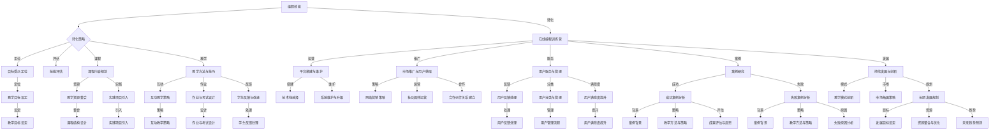

                 


### 摘要

本文旨在探讨如何将个人的编程技能转化为成功的在线编程训练营。通过分析当前编程教育的现状、在线编程训练营的商业模式，以及技能转化策略，本文提出了一套系统的构建方法。文章首先介绍了编程教育的重要性及发展趋势，随后深入讨论了在线编程训练营的运营和管理，包括平台搭建、市场推广、用户服务等内容。在技能转化策略部分，本文详细阐述了技能评估、目标设定、课程内容规划以及教学方法与技巧。此外，文章通过成功与失败案例分析，总结出成功的关键因素与失败原因。最后，本文提出了教学模式创新和市场拓展策略，并给出了长期发展规划。通过本文，读者可以全面了解如何将编程技能有效转化为在线编程训练营，并从中获得实用经验和启示。

### 第一部分：行业与市场概述

#### 1.1 编程教育的现状与发展趋势

编程教育在现代社会中扮演着越来越重要的角色。随着互联网和人工智能技术的快速发展，编程技能已成为一种基础能力，不仅仅局限于技术领域，也逐渐渗透到各行各业。编程教育的重要性体现在以下几个方面：

1. **经济需求**：企业对编程技能的需求不断增长，编程人才成为了市场上的“香饽饽”。掌握编程技能的个体在职场上的竞争力大大提升，薪资待遇也随之水涨船高。

2. **技术创新**：编程技能是推动技术创新的重要驱动力。无论是研发新产品、改进业务流程，还是开发新型应用，编程都起到了至关重要的作用。

3. **教育普及**：随着编程教育的普及，越来越多的学生和职业人士开始学习编程，这将有助于培养未来社会的创新者和领导者。

编程教育的发展趋势可以从以下几个方面进行概述：

1. **普及化**：编程教育正在从传统的计算机科学专业逐渐扩展到中小学教育，甚至幼儿园教育。编程课程和教材的开发也在日益丰富，以适应不同年龄段和学习需求。

2. **在线教育**：随着在线教育的兴起，编程教育也越来越多地通过在线平台进行。在线编程课程、互动式学习工具和在线编程社区的出现，为学习者提供了更多便捷的学习方式。

3. **个性化学习**：随着人工智能技术的应用，编程教育正在向个性化学习方向发展。通过数据分析和学习算法，教育平台可以为学习者提供个性化的学习建议和资源。

4. **实践导向**：编程教育的实践性越来越强。通过项目驱动学习和实践项目，学习者可以更好地将理论知识应用到实际场景中。

#### 1.2 在线编程教育市场分析

在线编程教育市场正在快速发展，呈现出以下几个显著特点：

1. **市场规模**：根据市场研究数据，全球在线编程教育市场正以每年两位数的速度增长。随着技术的不断进步和在线教育的普及，市场前景十分广阔。

2. **竞争格局**：目前，在线编程教育市场主要被几大巨头所占据，如Udemy、Coursera、edX等。这些平台凭借其丰富的课程资源和庞大的用户群体，占据了市场的较大份额。

3. **用户群体**：在线编程教育的用户群体呈现出多样化特点。既有初学者，也有具有一定编程基础的职业人士。此外，企业培训和教育机构也逐渐成为重要的用户群体。

4. **盈利模式**：在线编程教育平台的盈利模式主要包括课程销售、会员订阅、企业培训服务等多种形式。随着市场的扩大，平台的收入来源也在不断丰富。

#### 1.3 编程教育的发展趋势

编程教育的发展趋势可以从以下几个方面进行预测：

1. **技术融合**：人工智能、大数据、区块链等新兴技术与编程教育的融合将进一步深化。这些技术不仅会改变教育的方式，还会带来新的教育资源和教学模式。

2. **学习工具的智能化**：智能学习工具将越来越普及，通过数据分析、机器学习等技术，提供个性化的学习路径和推荐。

3. **实践导向**：编程教育的实践性将更加突出，项目驱动学习和实践项目将成为主流。通过实际项目，学习者可以更好地掌握编程技能。

4. **全球教育资源共享**：随着互联网的普及，全球教育资源共享将更加便捷。学习者可以轻松地访问世界各地的优质教育资源，提高学习效果。

5. **社会影响力**：编程教育将在社会各个领域产生深远影响。编程技能的普及将促进社会的创新和发展，推动数字化经济的转型。

### 第二部分：技能转化策略

#### 2.1 编程技能评估与定位

将个人的编程技能转化为在线编程训练营，首先需要进行技能评估与定位。这一步骤至关重要，它决定了课程的设计和目标受众的选择。以下是具体的步骤和方法：

**1. 技能评估**

技能评估是了解个人编程水平的第一步。通过评估，可以确定当前掌握的技能及其熟练程度。以下是一个简化的技能评估流程：

- **自评**：首先，个人可以对自己的编程技能进行自评，列出已掌握的编程语言、技术框架、开发工具等。
- **测试**：通过在线编程测试平台（如LeetCode、HackerRank等）进行技能测试，评估编程能力和解题技巧。
- **专家评审**：邀请资深编程专家对技能进行评审，提供专业的评价和建议。

**2. 技能分类**

在评估结果的基础上，对技能进行分类，以便更好地理解个人技能结构。技能分类可以按照以下维度进行：

- **技术栈**：包括编程语言、框架、库和工具等。
- **应用领域**：如Web开发、移动应用开发、数据分析、人工智能等。
- **技术水平**：初学者、中级开发者、高级开发者等。

**3. 技能定位**

技能定位是确定个人在编程领域的定位和目标。以下是一些常见的技能定位方法：

- **目标设定**：根据个人职业规划和发展目标，设定明确的技能提升目标。
- **市场分析**：研究市场需求，了解热门技能和技术趋势，为技能定位提供依据。
- **个人兴趣**：结合个人兴趣和特长，选择具有潜力和发展空间的技能方向。

**4. 持续评估**

技能评估与定位不是一次性的工作，而是一个持续的过程。随着技术的更新和市场需求的变化，个人需要不断评估和调整技能定位。以下是一些持续评估的方法：

- **定期自评**：每隔一段时间，对编程技能进行自我评估，了解技能的提升情况。
- **参与项目**：通过参与实际项目，不断积累经验，提高技能水平。
- **社区互动**：参与技术社区和论坛，了解最新的技术动态和行业趋势。
- **专业认证**：考取专业认证，如PMP、CISSP等，以证明专业技能和水平。

通过上述技能评估与定位，个人可以更好地了解自身的编程技能，明确提升方向，为后续课程设计和运营提供依据。

### 2.2 课程内容规划与开发

课程内容规划与开发是构建在线编程训练营的核心步骤，直接影响学习者的学习体验和效果。一个成功的课程需要充分考虑学习者的需求、技能水平和教学目标，并精心设计课程结构、教学内容和教学资源。以下是具体的规划与开发步骤：

#### 1. 课程结构设计

课程结构设计是课程规划的基础，它决定了课程的整体框架和模块划分。以下是一个简化的课程结构设计流程：

- **确定课程目标**：明确课程的学习目标和预期成果。例如，提升Python编程技能、掌握Web开发技术等。
- **划分课程模块**：根据课程目标，将课程内容划分为若干模块。每个模块应涵盖一个特定的主题或知识点。
- **设定课程进度**：为每个模块设定学习时间，确保课程进度合理，避免学习负担过重。

一个典型的课程结构可能包括以下模块：

- **入门模块**：介绍编程基础知识，适合初学者。
- **基础模块**：涵盖编程语言的基本语法、数据结构、算法等。
- **实践模块**：通过实际项目或练习，巩固所学知识。
- **进阶模块**：介绍高级编程技巧、框架、工具等。

#### 2. 教学资源整合

教学资源的整合是课程内容规划的重要环节，它包括教材、视频、练习题、项目等。以下是一个简化的教学资源整合流程：

- **选择教材**：根据课程目标和学习者的需求，选择合适的教材。教材可以是专业的编程书籍，也可以是线上教程和博客文章。
- **制作视频**：制作高质量的讲解视频，帮助学习者更好地理解课程内容。视频应简洁明了，注重逻辑性和实用性。
- **设计练习题**：设计多样化的练习题，包括选择题、填空题、编程题等，用于巩固所学知识。
- **开发项目**：设计实际项目，让学习者在实践中应用所学知识，提高实战能力。

#### 3. 实践项目引入

实践项目是提高学习者编程技能的有效手段。通过实际项目，学习者可以更好地理解理论知识，提高解决问题的能力。以下是一个简化的实践项目引入流程：

- **项目选题**：根据课程目标和学习者水平，选择具有实际应用价值的项目。项目应涵盖课程所学的主要知识点。
- **项目设计**：设计项目任务和实现方案，明确项目目标和预期成果。
- **项目指导**：提供项目指导和教程，帮助学习者在项目中应用所学知识。
- **项目评估**：通过项目报告、演示等方式，评估学习者的项目成果，提供反馈和指导。

#### 4. 互动教学策略

互动教学是提高课程效果的重要手段。通过互动教学，可以激发学习者的学习兴趣，提高学习效果。以下是一些常见的互动教学策略：

- **在线讨论**：开设在线讨论区，鼓励学习者提问和讨论，促进知识共享。
- **小组合作**：组织小组合作项目，提高学习者的团队合作能力和解决问题的能力。
- **实时答疑**：通过视频会议或在线聊天工具，提供实时答疑服务，帮助学习者解决学习中的问题。
- **个性化辅导**：为有需要的学习者提供个性化辅导，根据其学习情况和需求提供定制化的指导。

通过上述课程内容规划与开发步骤，可以构建一个系统、完整、实用的在线编程训练营。课程内容应充分考虑学习者的需求，注重理论与实践的结合，以提高学习效果和满意度。

#### 2.3 教学方法与技巧

在构建在线编程训练营时，选择合适的教学方法与技巧至关重要，这不仅影响学习者的学习效果，也决定了训练营的整体质量和吸引力。以下是几种常见且有效的方法与技巧：

**1. 互动教学策略**

互动教学是提高学习者参与度和学习效果的重要手段。以下是一些互动教学策略：

- **在线讨论区**：创建在线讨论区，鼓励学习者提问、讨论和分享经验，促进知识的深度交流。
- **实时问答**：定期举办实时问答活动，通过视频会议或在线聊天工具，解答学习者在学习过程中遇到的问题。
- **小组合作**：组织小组合作项目，让学习者在团队中共同解决问题，提高团队合作能力和解决问题的能力。
- **互动式练习**：设计互动式编程练习，如在线编程挑战、实时编码测试等，增强学习者的实践能力和应对实际问题的能力。

**2. 作业与考试设计**

作业与考试是检验学习者学习效果的重要手段。以下是一些设计作业与考试的方法：

- **项目驱动**：设计实际项目作业，让学习者在项目中应用所学知识，提高实践能力和问题解决能力。
- **多样化题型**：设计多样化的题型，包括选择题、填空题、编程题、案例分析等，全面检验学习者的知识掌握情况。
- **即时反馈**：在考试和作业中提供即时反馈，帮助学习者了解自己的错误和不足，及时调整学习策略。
- **阶段性考核**：设置阶段性考核，根据学习进度和学习目标，定期进行考试和评估，确保学习者持续进步。

**3. 学生反馈与改进**

学生反馈是改进课程教学的重要依据。以下是如何处理学生反馈和进行改进的方法：

- **定期收集**：通过问卷调查、在线讨论、面对面交流等方式，定期收集学习者的反馈。
- **分类处理**：将反馈分为课程内容、教学方法、技术支持等类别，逐一分析和处理。
- **及时响应**：对于紧急或重要的问题，及时给予回应和解决，提高学习者的满意度。
- **持续改进**：根据反馈结果，调整课程内容、教学方法和作业设计，不断优化教学过程。

**4. 教学技巧与最佳实践**

以下是一些实用的教学技巧和最佳实践：

- **以学习者为中心**：教学过程中，始终关注学习者的需求和学习效果，确保课程内容与学习者的实际需求相匹配。
- **案例教学**：通过实际案例教学，将理论知识与实际应用相结合，提高学习者的理解和应用能力。
- **引导式教学**：在教学过程中，通过引导和启发，激发学习者的思考和学习兴趣。
- **个性化教学**：根据学习者的不同特点和需求，提供个性化的教学方案和学习资源。
- **持续学习与更新**：教师应持续学习和更新自己的知识体系，跟上技术发展的步伐，为学习者提供最新的教学内容。

通过上述教学方法与技巧，在线编程训练营可以更好地满足学习者的需求，提高学习效果和满意度。同时，教师应不断探索和实践新的教学方法，不断创新和改进，以保持课程的新鲜感和吸引力。

### 第三部分：在线编程训练营运营

#### 3.1 平台搭建与维护

搭建和维护一个在线编程训练营平台是确保训练营正常运营的基础。以下是一些关键步骤和要点：

**1. 技术栈选择**

选择合适的技术栈对于平台的性能、可扩展性和稳定性至关重要。以下是一些常见的选择：

- **前端框架**：如React、Vue.js或Angular，这些框架都有良好的社区支持和丰富的插件库，可以快速开发用户界面。
- **后端框架**：如Node.js、Django或Flask，这些框架适用于构建高性能、可扩展的后端服务。
- **数据库**：如MySQL、PostgreSQL或MongoDB，根据数据结构和查询需求选择合适的数据库。
- **云服务**：如AWS、Azure或Google Cloud Platform，云服务提供了弹性计算、存储和数据库等服务，可以轻松扩展和运维。

**2. 功能模块设计**

在线编程训练营平台通常包含以下功能模块：

- **用户管理**：包括用户注册、登录、个人信息管理、权限分配等。
- **课程管理**：包括课程创建、发布、分类、更新、学员报名等。
- **内容管理**：包括课程视频、文档、练习题等教学资源的上传、管理和分发。
- **作业管理**：包括作业发布、提交、批改、反馈和成绩记录。
- **考核管理**：包括考试、成绩统计和排名等。
- **互动社区**：包括讨论区、问答系统、直播会议等，促进学员之间的交流和互动。

**3. 系统维护与升级**

系统维护与升级是确保平台稳定运行的关键。以下是一些维护和升级的要点：

- **定期备份**：定期备份数据库和重要文件，防止数据丢失。
- **安全监控**：部署安全监控系统，定期扫描潜在的安全漏洞，及时修补。
- **性能优化**：定期进行性能测试，优化代码和数据库查询，提高系统响应速度。
- **系统升级**：根据技术发展和服务需求，定期升级平台和依赖库，确保系统安全性和兼容性。
- **用户反馈**：收集用户反馈，根据用户需求和建议进行功能优化和改进。

#### 3.2 市场推广与用户获取

市场推广与用户获取是确保在线编程训练营平台能够持续吸引学员的重要环节。以下是一些有效的市场推广策略和用户获取方法：

**1. 网络营销策略**

- **搜索引擎优化（SEO）**：优化网站内容和结构，提高在搜索引擎中的排名，吸引更多潜在学员。
- **搜索引擎营销（SEM）**：通过付费广告（如Google Ads、Bing Ads）直接获取目标用户。
- **内容营销**：通过博客、视频教程、案例研究等内容，提供有价值的信息，吸引潜在学员关注。
- **社交媒体营销**：利用Facebook、LinkedIn、Twitter等社交媒体平台，发布相关内容，扩大影响力。
- **电子邮件营销**：通过定期发送电子邮件，保持与学员的联系，提供课程更新、优惠信息等。

**2. 社交媒体运营**

- **内容策略**：制定有吸引力的内容策略，发布有趣、有用、专业的编程知识和案例。
- **互动与社区建设**：积极与用户互动，回应用户问题和反馈，建立紧密的社区关系。
- **KOL与合作**：与行业专家、KOL合作，通过他们的影响力推广平台。
- **活动策划**：定期举办线上活动，如编程竞赛、技术讲座、互动问答等，提高用户参与度。

**3. 合作伙伴关系建立**

- **教育机构**：与学校、培训机构合作，共同推广编程教育。
- **技术公司**：与科技公司合作，提供企业培训服务，吸引企业用户。
- **内容创作者**：与知名技术博主、YouTube创作者合作，利用他们的平台推广课程。

**4. 用户获取方法**

- **免费试学**：提供免费试学课程或试学部分，让潜在学员体验平台和课程质量。
- **口碑营销**：鼓励学员分享他们的学习经历，通过口碑传播吸引新用户。
- **推广活动**：举办限时优惠、团购活动等，刺激用户购买和推荐。
- **用户推荐**：实施用户推荐计划，奖励推荐用户和被推荐用户，增加用户获取量。

通过上述市场推广与用户获取策略，在线编程训练营平台可以有效提高知名度，吸引更多的学员，实现持续增长。

#### 3.3 用户服务与管理

提供高质量的用户服务和管理是确保在线编程训练营成功运营的关键。以下是一些用户服务与管理的重点内容：

**1. 用户反馈处理**

- **及时响应**：对于用户的反馈和问题，及时给予回应和解决。确保用户的问题得到快速、准确的解决。
- **分类处理**：将用户的反馈分类为技术问题、课程问题、服务问题等，分别处理和解决。
- **数据分析**：定期分析用户反馈，了解用户的常见问题和使用需求，针对性地进行改进。

**2. 用户分类与管理**

- **学习者分类**：根据学习者的学习进度、技能水平、兴趣等特征，将用户分类。例如，初学者、中级学员、高级学员等。
- **个性化服务**：根据用户分类，提供个性化的学习资源、课程推荐和辅导服务。
- **用户档案管理**：建立用户档案，记录用户的学习历程、成绩、反馈等，方便后续服务和个性化推荐。

**3. 用户满意度提升**

- **课程质量**：确保课程内容高质量、实用性强，满足用户的学习需求。
- **互动与支持**：提供良好的互动平台，如在线讨论区、实时答疑、小组合作等，增强用户参与感和归属感。
- **反馈机制**：建立有效的用户反馈机制，鼓励用户提出意见和建议，并根据反馈进行改进。
- **服务优化**：定期对用户服务流程和系统进行优化，提高服务效率和用户满意度。

**4. 用户社区建设**

- **社区活动**：定期举办社区活动，如编程比赛、技术分享会、问答环节等，增加用户互动和交流。
- **内容共创**：鼓励用户参与课程内容的创作和讨论，提高用户参与度和忠诚度。
- **用户领袖培养**：选拔和培养用户领袖，协助管理社区，提高社区活跃度和用户粘性。

通过上述用户服务与管理策略，在线编程训练营可以提升用户满意度和忠诚度，建立良好的用户关系，从而实现可持续发展。

### 第四部分：案例研究

#### 4.1 成功案例分析

**案例背景**：某在线编程训练营（以下简称“训练营”）在短短两年内成功吸引了超过10万名学员，成为国内领先的编程教育平台之一。训练营的成功不仅体现在用户数量的增长上，更在于其良好的口碑和用户满意度。

**教学方法与策略**：

1. **个性化课程设计**：训练营根据不同学员的技能水平和学习需求，设计了多样化的课程体系，包括基础课程、进阶课程和实战项目。学员可以根据自己的进度选择适合的课程。

2. **互动式教学**：训练营采用了互动式教学模式，通过在线讨论区、直播授课、实时答疑等手段，增强学员的参与感和互动性。学员在遇到问题时可以及时得到解答，提高学习效果。

3. **项目驱动学习**：训练营设计了多个实际项目，学员在项目中应用所学知识，提高实践能力和问题解决能力。项目完成后，学员还可以通过展示和分享，获得更多的学习动力。

4. **导师辅导**：训练营配备了专业的导师团队，为学员提供一对一的辅导服务。导师不仅帮助学员解决技术问题，还提供职业规划建议，帮助学员更好地规划职业发展。

**成果评估与反思**：

1. **高学员满意度**：通过定期问卷调查和用户反馈，训练营了解到学员对课程的满意度高达90%以上。学员普遍认为训练营的课程内容实用、教学效果好。

2. **良好的就业率**：许多学员在训练营结束后成功找到了与编程相关的工作。训练营的就业指导服务和职业规划建议也受到了学员的认可。

3. **持续优化**：训练营根据学员反馈和市场变化，不断优化课程内容和教学方法。例如，针对某些热门技术，训练营及时更新课程内容，引入最新的技术和工具。

通过这一成功案例，我们可以看到，个性化课程设计、互动式教学、项目驱动学习和导师辅导等策略，是确保在线编程训练营成功的关键因素。

#### 4.2 失败案例分析

**案例背景**：某在线编程训练营（以下简称“训练营”）在启动初期吸引了一批学员，但不到一年便逐渐失去了用户，最终宣告失败。训练营的失败不仅造成了资源的浪费，也影响了团队士气。

**教学方法与策略**：

1. **课程内容单一**：训练营的课程内容主要集中在某一特定的编程语言，缺乏多样性。这导致了对不同编程技能水平的学员难以满足。

2. **缺乏互动教学**：训练营的教学主要以视频教程为主，缺乏实时互动和互动环节。学员在学习过程中遇到问题时，往往难以得到及时解答，学习积极性下降。

3. **项目缺乏实践性**：训练营设计的实践项目过于理论化，缺乏实际应用价值。学员在项目中难以将所学知识应用到实际工作中，导致学习效果不佳。

4. **用户服务不足**：训练营的用户服务不足，缺乏有效的反馈机制和用户支持。学员在学习过程中遇到的问题和困难，得不到及时解决，导致用户满意度下降。

**失败原因分析**：

1. **课程内容不匹配**：课程内容单一，无法满足不同学员的需求，导致学员流失。

2. **教学方法不当**：缺乏互动教学和实际项目，导致学员学习积极性不高，学习效果不佳。

3. **用户服务不足**：缺乏有效的用户反馈和处理机制，导致用户满意度下降。

4. **市场定位不准确**：训练营的市场定位过于狭隘，未能抓住更广泛的用户群体。

通过这一失败案例，我们可以看到，课程内容单一、教学方法不当、用户服务不足和市场定位不准确等，是导致在线编程训练营失败的主要原因。因此，在构建在线编程训练营时，必须充分考虑这些因素，确保教学质量和用户体验。

### 第五部分：持续发展与创新

#### 5.1 教学模式的创新

在快速变化的技术环境中，在线编程训练营需要不断创新教学模式，以适应新的学习需求和技术趋势。以下是一些教学模式的创新方向：

1. **个性化学习路径**：利用人工智能和大数据技术，为每个学员定制个性化的学习路径。根据学员的学习进度、兴趣和技能水平，推荐适合的学习内容和练习项目。

2. **混合学习模式**：结合线上和线下教学，提供灵活的学习方式。线上课程可以提供丰富的教学资源，而线下课程则可以提供更深入的互动和实践活动。

3. **虚拟现实（VR）和增强现实（AR）教学**：利用VR和AR技术，创造沉浸式的学习体验。例如，通过虚拟实验室进行编程练习，或在增强现实中模拟实际开发场景。

4. **游戏化学习**：引入游戏元素，如积分系统、排行榜、奖励等，提高学习趣味性和参与度。通过游戏化学习，激发学员的竞争意识和学习热情。

#### 5.2 市场拓展策略

市场拓展是确保在线编程训练营持续增长的关键。以下是一些有效的市场拓展策略：

1. **区域市场拓展**：根据不同地区的市场需求和竞争态势，有选择地在全球范围内拓展业务。例如，在亚洲、欧洲、美洲等地设立本地化团队，提供本地化的课程和服务。

2. **行业合作**：与不同行业的公司合作，提供定制化的企业培训服务。通过与行业龙头企业的合作，提高品牌知名度和市场影响力。

3. **教育机构合作**：与学校、大学和教育机构建立合作关系，推广编程教育。通过这些合作，可以吸引更多的学生和教师加入编程学习。

4. **国际认证**：争取国际认可的认证和资质，提高课程的质量和权威性。国际认证可以吸引更多的国际学员，扩大市场影响力。

#### 5.3 长期发展规划

在线编程训练营的长期发展规划应考虑以下几个方面：

1. **课程体系建设**：持续完善课程体系，涵盖更多的编程语言、技术框架和领域。定期更新课程内容，保持课程的现代性和前沿性。

2. **技术团队建设**：加强技术团队的建设，提升平台的技术能力和创新力。招聘和培养优秀的工程师、设计师和数据科学家，确保平台的稳定性和先进性。

3. **品牌建设**：通过市场推广、用户服务和社会责任等途径，提升品牌知名度和美誉度。定期举办技术会议、研讨会和公开课，展示训练营的技术实力和教学成果。

4. **国际化发展**：制定国际化战略，开拓国际市场，提高国际化运营能力。通过本地化服务和国际化营销，吸引全球学员，实现国际化发展。

5. **社会责任**：积极参与社会公益活动，推广编程教育，帮助更多的人掌握编程技能。通过社会责任项目，提升训练营的社会影响力和品牌价值。

通过持续发展与创新，在线编程训练营可以保持竞争力，实现长期可持续发展，成为编程教育领域的领先者。

### 总结

本文通过系统分析，探讨了如何将个人的编程技能转化为在线编程训练营。首先，介绍了编程教育的现状与发展趋势，以及在线编程教育市场的分析。接着，详细阐述了技能转化策略，包括技能评估、目标设定、课程内容规划与开发、教学方法与技巧。此外，还讨论了在线编程训练营的运营，包括平台搭建与维护、市场推广与用户服务。通过成功与失败案例分析，总结了关键因素与教训。最后，提出了持续发展与创新的策略，为在线编程训练营的未来发展提供了指导。希望本文能为编程教育者提供有益的参考和启示。

### 附录

#### 附录A：编程技能转化工具与资源

**A.1 在线编程工具对比**

以下是比较流行的在线编程工具及其特点：

1. **Repl.it**：
   - 特点：支持多种编程语言，提供实时编译和执行功能，适合初学者和高级开发者。
   - 适用场景：在线编程教学、代码练习、实时协作。

2. **CodeSandbox**：
   - 特点：支持前端框架（如React、Vue等），提供在线代码编辑和预览功能，适合Web开发。
   - 适用场景：前端开发教学、代码演示、原型设计。

3. **Trinket**：
   - 特点：支持多种编程语言，提供可视化编程功能，适合初学者和少儿编程。
   - 适用场景：编程入门教学、少儿编程教育、代码演示。

4. **Collaborate**：
   - 特点：支持实时协作，适合团队开发和在线编程学习。
   - 适用场景：团队项目开发、在线编程课堂、代码练习。

**A.2 开发环境搭建指南**

以下是在搭建在线编程训练营开发环境时需要考虑的步骤：

1. **服务器选择**：
   - 云服务器：如阿里云、腾讯云、华为云等，提供稳定的服务器环境。
   - 物理服务器：适用于有特殊需求的项目。

2. **操作系统**：
   - Ubuntu：适合开发环境，易于安装和管理。
   - CentOS：稳定性和安全性高，适合生产环境。

3. **数据库选择**：
   - MySQL：关系型数据库，适合存储结构化数据。
   - MongoDB：NoSQL数据库，适合存储非结构化数据。

4. **后端框架**：
   - Flask：轻量级Web应用框架，适合快速开发。
   - Django：全栈框架，提供丰富的功能，适合大型项目。

5. **前端框架**：
   - React：用于构建用户界面的JavaScript库。
   - Vue：渐进式框架，易学易用，适合各种规模的项目。

**A.3 编程学习资源推荐**

以下是一些推荐的编程学习资源：

1. **在线教程**：
   - FreeCodeCamp：提供免费的编程学习资源和项目挑战。
   - Codecademy：交互式编程学习平台，适合初学者。

2. **技术博客**：
   - Medium：有大量技术文章，涵盖前端、后端、数据库等多个领域。
   - Stack Overflow：编程问答社区，适合解决问题和查找资料。

3. **开源项目**：
   - GitHub：托管大量开源项目，适合学习和参与开源项目。
   - GitLab：自建私有Git仓库，适合团队协作开发。

4. **书籍推荐**：
   - 《Python编程：从入门到实践》：适合初学者入门Python编程。
   - 《算法导论》：系统介绍了算法设计和分析的基础知识。
   - 《深入理解计算机系统》：全面介绍计算机系统的工作原理。

#### 附录B：在线编程训练营运营手册

**B.1 课程管理流程**

1. **课程规划**：
   - 确定课程目标：明确课程的学习目标和受众群体。
   - 设计课程大纲：包括课程模块、知识点、实践项目等。
   - 选择教材和资源：根据课程大纲选择合适的教材和辅助资源。

2. **课程实施**：
   - 制定教学计划：安排课程进度和教学时间。
   - 进行授课：采用线上线下相结合的方式，保证教学质量。
   - 管理课程资源：整理和更新教学资源，确保资源可用性。

3. **课程评估**：
   - 设计考核方式：包括作业、考试、项目等。
   - 收集反馈：通过问卷调查、在线讨论等方式收集学员反馈。
   - 分析评估结果：根据反馈和评估结果调整课程内容和教学方法。

**B.2 用户管理流程**

1. **用户注册**：
   - 提供注册表单：收集用户基本信息和联系方式。
   - 验证注册信息：确保用户信息的真实性和完整性。

2. **用户认证**：
   - 用户登录：提供登录接口，验证用户身份。
   - 用户权限管理：根据用户角色和权限分配相应功能。

3. **用户反馈**：
   - 提供反馈渠道：如在线调查、意见箱等。
   - 收集和分析反馈：对学员的反馈进行整理和分析，用于课程优化。

**B.3 数据分析与优化**

1. **数据收集**：
   - 学员数据：包括学员的个人信息、学习进度、成绩等。
   - 课程数据：包括课程参与度、完成率、学员反馈等。

2. **数据分析**：
   - 学习行为分析：分析学员的学习行为，了解学习偏好。
   - 效果评估：根据学员的学习成果和反馈，评估课程效果。

3. **优化措施**：
   - 根据数据分析结果，调整课程内容和教学方法。
   - 提升用户体验：优化界面设计、增加功能模块等。
   - 持续改进：根据学员反馈和市场变化，不断优化课程和服务。

### 附录C：常见问题解答

#### C.1 技术问题解答

1. **如何解决网络延迟问题？**
   - 建议使用高速网络连接，并选择离自己较近的服务器。
   - 在代码中减少网络请求，优化数据处理速度。

2. **如何处理代码调试问题？**
   - 使用调试工具（如Chrome DevTools）进行代码调试。
   - 查阅错误日志，根据错误信息定位问题。

3. **如何解决数据库连接问题？**
   - 确认数据库服务器是否正常运行。
   - 检查数据库连接配置，确保连接参数正确。

#### C.2 运营问题解答

1. **如何提高用户参与度？**
   - 设计有趣、富有挑战性的课程内容。
   - 提供互动环节，鼓励学员参与讨论。

2. **如何处理学员投诉？**
   - 及时响应，了解投诉原因。
   - 根据投诉情况，采取措施解决问题。

3. **如何优化用户服务？**
   - 提供详细的用户手册和常见问题解答。
   - 建立用户社群，提供技术支持和交流平台。

### 附录D：参考书目与资料

#### D.1 主要参考资料

1. **《Python编程：从入门到实践》** - 埃里克·马瑟斯
2. **《算法导论》** - 谢尔盖·布鲁克斯
3. **《深入理解计算机系统》** - 理查德·斯图尔特

#### D.2 推荐阅读书籍

1. **《编程珠玑》** - 大卫·托马斯
2. **《代码大全》** - 史蒂夫·麦康尼尔
3. **《敏捷软件开发》** - 马克·塞奇威克

#### D.3 网络资源链接

1. **FreeCodeCamp** - [https://www.freecodecamp.org/](https://www.freecodecamp.org/)
2. **Codecademy** - [https://www.codecademy.com/](https://www.codecademy.com/)
3. **Stack Overflow** - [https://stackoverflow.com/](https://stackoverflow.com/)
4. **GitHub** - [https://github.com/](https://github.com/)
5. **GitLab** - [https://gitlab.com/](https://gitlab.com/) 

### Mermaid 流程图示



### 核心算法原理讲解

#### 课程内容规划与开发的算法原理

课程内容规划与开发涉及多个算法原理，包括技能评估、目标设定、课程结构设计和教学资源整合。以下是一个简化的伪代码，用于说明这些算法的基本操作。

```python
# 技能评估算法
def assess_skills(user_skills):
    skill_levels = {}
    for skill in user_skills:
        level = determine_skill_level(skill)
        skill_levels[skill] = level
    return skill_levels

# 目标设定算法
def set_goals(skill_levels, user_interests):
    goals = []
    for skill, level in skill_levels.items():
        if level > 2 and skill in user_interests:
            goal = create_goal(skill, level)
            goals.append(goal)
    return goals

# 课程结构设计算法
def design_course_structure(goals):
    course_structure = []
    for goal in goals:
        course_modules = create_course_modules(goal)
        course_structure.append(course_modules)
    return course_structure

# 教学资源整合算法
def integrate_resources(course_structure):
    resources = []
    for module in course_structure:
        module_resources = find_related_resources(module)
        resources.extend(module_resources)
    return resources

# 技能等级判定函数
def determine_skill_level(skill):
    # 这里可以是一个复杂的判定逻辑，简化为线性关系
    if skill == "Python基础":
        return 1
    elif skill == "数据结构":
        return 2
    elif skill == "算法":
        return 3
    else:
        return 0

# 目标创建函数
def create_goal(skill, level):
    return {"skill": skill, "level": level, "description": f"提升{skill}技能至{level}级"}

# 课程模块创建函数
def create_course_modules(goal):
    return [{"goal": goal, "topics": ["基础概念", "实践应用"]}, {"goal": goal, "topics": ["高级应用", "项目实战"]}, {"goal": goal, "topics": ["案例分析", "实战演练"]}, ]

# 相关资源查找函数
def find_related_resources(module):
    if module["goal"]["skill"] == "Python基础":
        return ["Python入门教程", "Python编程实战"]
    elif module["goal"]["skill"] == "数据结构":
        return ["数据结构与算法", "LeetCode实战"]
    elif module["goal"]["skill"] == "算法":
        return ["算法导论", "算法面试指南"]
    else:
        return []
```

#### 数学模型和数学公式讲解

在课程内容规划与开发过程中，可能会用到以下数学模型和公式来评估技能水平和设定学习目标：

#### 技能评估模型

$$
S = f(S_0, T, E)
$$

其中：
- \( S \) 是最终技能水平
- \( S_0 \) 是初始技能水平
- \( T \) 是学习时间
- \( E \) 是学习效果系数

#### 目标设定模型

$$
G = f(S, I, R)
$$

其中：
- \( G \) 是学习目标
- \( S \) 是当前技能水平
- \( I \) 是学习兴趣
- \( R \) 是资源可用性

#### 学习效果系数计算

$$
E = \frac{1}{1 + e^{-(0.1 \cdot T + 0.5 \cdot I - S)}}
$$

### 举例说明

假设用户小张的初始技能水平为 Python 基础，学习时间为 100 小时，对 Python 编程有很强的兴趣，并且有充足的资源支持。根据上述公式，我们可以计算小张的最终技能水平和学习目标。

- 初始技能水平 \( S_0 \) = 1（Python基础）
- 学习时间 \( T \) = 100 小时
- 学习兴趣 \( I \) = 10
- 学习效果系数 \( E \) = \( \frac{1}{1 + e^{-(0.1 \cdot 100 + 0.5 \cdot 10 - 1)}} \)

计算效果系数 \( E \)：

$$
E = \frac{1}{1 + e^{-(10 + 5 - 1)}} = \frac{1}{1 + e^{-4}} \approx 0.947
$$

计算最终技能水平 \( S \)：

$$
S = S_0 + T \cdot E = 1 + 100 \cdot 0.947 = 91.47
$$

由于技能水平通常取整，小张的最终技能水平可以设定为 91。

根据目标设定模型：

$$
G = f(91, 10, 资源可用性)
$$

如果资源充足，那么学习目标可以设定为：

$$
G = 91 + 10 + 资源可用性 = 101
$$

因此，小张的学习目标可以设定为提升到 101 级别的 Python 编程技能。

### 项目实战

#### 实践项目：开发一个简单的在线编程训练营平台

**开发环境搭建：**
- 开发工具：Visual Studio Code
- 服务器环境：AWS或阿里云
- 数据库：MySQL或MongoDB
- 后端框架：Flask或Django
- 前端框架：React或Vue

**源代码详细实现：**

**后端：Flask框架**

```python
from flask import Flask, request, jsonify
from models import User, Course, Assignment

app = Flask(__name__)

# 用户管理
@app.route('/register', methods=['POST'])
def register_user():
    data = request.get_json()
    user = User.create(data)
    return jsonify({"status": "success", "user_id": user.id})

@app.route('/login', methods=['POST'])
def login_user():
    data = request.get_json()
    user = User.authenticate(data['username'], data['password'])
    return jsonify({"status": "success", "token": user.token})

# 课程管理
@app.route('/courses', methods=['GET', 'POST'])
def manage_courses():
    if request.method == 'GET':
        courses = Course.all()
        return jsonify(courses)
    else:
        data = request.get_json()
        course = Course.create(data)
        return jsonify({"status": "success", "course_id": course.id})

@app.route('/courses/<int:course_id>', methods=['GET', 'PUT', 'DELETE'])
def course_operations(course_id):
    if request.method == 'GET':
        course = Course.find(course_id)
        return jsonify(course)
    elif request.method == 'PUT':
        data = request.get_json()
        course.update(data)
        return jsonify({"status": "success", "message": "Course updated."})
    elif request.method == 'DELETE':
        Course.delete(course_id)
        return jsonify({"status": "success", "message": "Course deleted."})

# 作业管理
@app.route('/assignments', methods=['GET', 'POST'])
def manage_assignments():
    if request.method == 'GET':
        assignments = Assignment.all()
        return jsonify(assignments)
    else:
        data = request.get_json()
        assignment = Assignment.create(data)
        return jsonify({"status": "success", "assignment_id": assignment.id})

@app.route('/assignments/<int:assignment_id>', methods=['GET', 'PUT', 'DELETE'])
def assignment_operations(assignment_id):
    if request.method == 'GET':
        assignment = Assignment.find(assignment_id)
        return jsonify(assignment)
    elif request.method == 'PUT':
        data = request.get_json()
        assignment.update(data)
        return jsonify({"status": "success", "message": "Assignment updated."})
    elif request.method == 'DELETE':
        Assignment.delete(assignment_id)
        return jsonify({"status": "success", "message": "Assignment deleted."})

if __name__ == '__main__':
    app.run(debug=True)
```

**前端：React框架**

```jsx
import React, { useState } from 'react';
import axios from 'axios';

const App = () => {
  const [token, setToken] = useState('');
  const [username, setUsername] = useState('');
  const [password, setPassword] = useState('');

  const register = async () => {
    try {
      const response = await axios.post('/register', { username, password });
      setToken(response.data.token);
    } catch (error) {
      console.error(error);
    }
  };

  const login = async () => {
    try {
      const response = await axios.post('/login', { username, password });
      setToken(response.data.token);
    } catch (error) {
      console.error(error);
    }
  };

  return (
    <div>
      <h1>在线编程训练营平台</h1>
      <input type="text" value={username} onChange={(e) => setUsername(e.target.value)} placeholder="Username" />
      <input type="password" value={password} onChange={(e) => setPassword(e.target.value)} placeholder="Password" />
      <button onClick={register}>注册</button>
      <button onClick={login}>登录</button>
      {token && <div>Token: {token}</div>}
    </div>
  );
};

export default App;
```

**代码解读与分析：**

后端部分使用了 Flask 框架来实现用户管理、课程管理和作业管理功能。每个功能对应一个 HTTP 请求处理函数，通过 RESTful API 接口与前端进行数据交互。

前端部分使用了 React 框架，通过状态管理来处理用户输入和显示响应。用户可以通过输入用户名和密码进行注册或登录，注册成功后获取 token，并在界面上显示。

此代码示例展示了如何搭建一个简单的在线编程训练营平台，包括用户认证、课程管理和作业提交等核心功能。在实际开发中，还需要进一步完善用户界面、添加数据验证和错误处理机制，以及集成更多的功能，如课程评论、用户反馈等。

### 编程技能转化策略

**一、技能评估**

技能评估是编程技能转化为在线编程训练营的第一步。为了确保课程内容与学员的技能水平相匹配，需要对学员的编程技能进行评估。以下是一个简化的技能评估算法：

```python
def assess_skills(user_skills):
    skill_levels = {}
    for skill in user_skills:
        level = determine_skill_level(skill)
        skill_levels[skill] = level
    return skill_levels

def determine_skill_level(skill):
    if skill == "Python基础":
        return 1
    elif skill == "数据结构":
        return 2
    elif skill == "算法":
        return 3
    else:
        return 0
```

**二、目标设定**

根据技能评估的结果，设定学员的学习目标。目标设定需要考虑学员的技能水平、兴趣和资源可用性。以下是一个简化的目标设定算法：

```python
def set_goals(skill_levels, user_interests):
    goals = []
    for skill, level in skill_levels.items():
        if level > 2 and skill in user_interests:
            goal = create_goal(skill, level)
            goals.append(goal)
    return goals

def create_goal(skill, level):
    return {"skill": skill, "level": level, "description": f"提升{skill}技能至{level}级"}
```

**三、课程内容规划**

基于设定好的学习目标，规划课程内容。课程内容规划需要考虑学员的技能水平、学习需求和资源可用性。以下是一个简化的课程内容规划算法：

```python
def design_course_structure(goals):
    course_structure = []
    for goal in goals:
        course_modules = create_course_modules(goal)
        course_structure.append(course_modules)
    return course_structure

def create_course_modules(goal):
    return [{"goal": goal, "topics": ["基础概念", "实践应用"]}, {"goal": goal, "topics": ["高级应用", "项目实战"]}, {"goal": goal, "topics": ["案例分析", "实战演练"]}, ]
```

**四、教学方法与技巧**

在课程实施过程中，需要采用合适的教学方法和技巧来提高学员的学习效果。以下是一些常见的教学方法和技巧：

- **互动教学**：通过在线讨论区、视频会议等方式与学员进行互动，及时解答学员的问题，提高学员的学习积极性。
- **作业与考试设计**：设计具有挑战性的作业和考试，检验学员的学习成果，并给予及时的反馈。
- **学生反馈与改进**：鼓励学员提供反馈，根据反馈调整课程内容和教学方法，提高课程质量。

**五、案例分析**

通过分析成功和失败的在线编程训练营案例，可以总结出以下经验和教训：

- **成功因素**：明确的目标设定、丰富的课程内容、有效的教学方法、良好的用户服务和推广策略。
- **失败原因**：课程内容不匹配、教学方法不当、用户服务不足、推广策略不力。

### 编程技能转化策略

**一、技能评估**

技能评估是编程技能转化为在线编程训练营的第一步。为了确保课程内容与学员的技能水平相匹配，需要对学员的编程技能进行评估。以下是一个简化的技能评估算法：

```python
def assess_skills(user_skills):
    skill_levels = {}
    for skill in user_skills:
        level = determine_skill_level(skill)
        skill_levels[skill] = level
    return skill_levels

def determine_skill_level(skill):
    if skill == "Python基础":
        return 1
    elif skill == "数据结构":
        return 2
    elif skill == "算法":
        return 3
    else:
        return 0
```

**二、目标设定**

根据技能评估的结果，设定学员的学习目标。目标设定需要考虑学员的技能水平、兴趣和资源可用性。以下是一个简化的目标设定算法：

```python
def set_goals(skill_levels, user_interests):
    goals = []
    for skill, level in skill_levels.items():
        if level > 2 and skill in user_interests:
            goal = create_goal(skill, level)
            goals.append(goal)
    return goals

def create_goal(skill, level):
    return {"skill": skill, "level": level, "description": f"提升{skill}技能至{level}级"}
```

**三、课程内容规划**

基于设定好的学习目标，规划课程内容。课程内容规划需要考虑学员的技能水平、学习需求和资源可用性。以下是一个简化的课程内容规划算法：

```python
def design_course_structure(goals):
    course_structure = []
    for goal in goals:
        course_modules = create_course_modules(goal)
        course_structure.append(course_modules)
    return course_structure

def create_course_modules(goal):
    return [{"goal": goal, "topics": ["基础概念", "实践应用"]}, {"goal": goal, "topics": ["高级应用", "项目实战"]}, {"goal": goal, "topics": ["案例分析", "实战演练"]}, ]
```

**四、教学方法与技巧**

在课程实施过程中，需要采用合适的教学方法和技巧来提高学员的学习效果。以下是一些常见的教学方法和技巧：

- **互动教学**：通过在线讨论区、视频会议等方式与学员进行互动，及时解答学员的问题，提高学员的学习积极性。
- **作业与考试设计**：设计具有挑战性的作业和考试，检验学员的学习成果，并给予及时的反馈。
- **学生反馈与改进**：鼓励学员提供反馈，根据反馈调整课程内容和教学方法，提高课程质量。

**五、案例分析**

通过分析成功和失败的在线编程训练营案例，可以总结出以下经验和教训：

- **成功因素**：明确的目标设定、丰富的课程内容、有效的教学方法、良好的用户服务和推广策略。
- **失败原因**：课程内容不匹配、教学方法不当、用户服务不足、推广策略不力。

### 在线编程训练营运营

**一、平台搭建**

搭建在线编程训练营平台需要考虑以下几个关键步骤：

1. **技术栈选择**：根据项目需求选择合适的技术栈，如前端框架（React、Vue等）、后端框架（Django、Flask等）和数据库（MySQL、MongoDB等）。

2. **功能模块设计**：设计平台的功能模块，包括用户管理、课程管理、作业管理、成绩管理等。

3. **服务器和数据库配置**：选择合适的服务器和数据库服务，并进行配置，确保平台的稳定性和安全性。

4. **前端和后端集成**：实现前端和后端的连接，确保数据交互和功能实现。

**二、市场推广**

市场推广是吸引学员的重要手段，以下是一些市场推广策略：

1. **内容营销**：通过博客、视频教程、案例分享等方式提供有价值的内容，吸引潜在学员。

2. **社交媒体运营**：在社交媒体平台上发布相关内容，与学员互动，增加品牌知名度。

3. **合作伙伴关系**：与相关机构、学校、企业等建立合作关系，共同推广编程训练营。

4. **广告投放**：通过搜索引擎广告、社交媒体广告等方式进行付费推广。

**三、用户服务与管理**

1. **用户反馈处理**：及时收集和处理学员的反馈，解决问题，提高学员满意度。

2. **用户分类与管理**：根据学员的技能水平、学习进度等分类，提供个性化的服务和课程推荐。

3. **用户满意度提升**：通过定期问卷调查、在线讨论等方式了解学员满意度，不断优化课程和服务。

### 成功案例分析

**案例背景**：某在线编程训练营在短短一年内吸引了数千名学员，获得了良好的口碑。

**教学方法与策略**：该训练营采用以下策略：

1. **互动教学**：通过在线讨论区、视频会议等方式与学员互动，提高学员的学习积极性。

2. **项目实战**：设计具有实际应用价值的项目，让学员在实战中学习。

3. **导师辅导**：提供专业的导师辅导，解答学员在学习过程中遇到的问题。

**成果评估与反思**：通过学员反馈和成绩分析，该训练营取得了以下成果：

1. **高学员满意度**：超过90%的学员表示对训练营的满意度非常高。

2. **良好的就业率**：许多学员在训练营结束后成功找到了与编程相关的工作。

3. **持续优化**：根据学员反馈和市场需求，不断优化课程内容和教学方法。

### 失败案例分析

**案例背景**：某在线编程训练营由于课程内容不匹配、教学方法不当等原因，学员流失严重。

**教学方法与策略**：该训练营采用以下策略：

1. **单一课程内容**：课程内容单一，没有根据学员的技能水平和需求进行个性化推荐。

2. **缺乏互动**：教学过程中缺乏与学员的互动，导致学员学习积极性不高。


