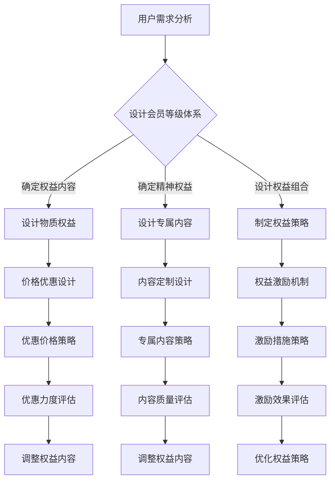

                 

### 1. 设计有吸引力的知识付费会员权益的重要性

在当前信息化时代，知识付费已经逐渐成为主流消费模式之一。无论是在线教育、专业咨询，还是技能培训，知识付费平台都需要设计出有吸引力的会员权益，以吸引并留住用户。然而，如何设计出既有吸引力又能满足用户需求的会员权益，成为各大知识付费平台面临的挑战。

#### 1.1 知识付费的兴起与发展

知识付费的兴起可以追溯到互联网的普及和人们对知识渴求的增长。随着互联网技术的发展，知识的获取变得更加便捷，但也导致了信息过载的问题。为了解决这一问题，知识付费平台应运而生。这些平台通过专业的内容生产和精细的用户运营，为用户提供高质量的知识内容和服务，从而获得了市场的认可。

#### 1.2 会员权益的概念与重要性

会员权益是指知识付费平台为会员提供的一系列特殊服务和福利。这些权益可以是物质上的，如优惠价格、礼品赠送等；也可以是精神上的，如专属内容、优先服务等。会员权益的设计不仅关系到用户的付费意愿，还直接影响用户的留存率和忠诚度。

#### 1.3 会员权益设计的原则

设计有吸引力的会员权益需要遵循以下原则：

- **满足用户需求**：会员权益的设计应基于对用户需求的深入挖掘和分析，确保权益能够真正满足用户的需求。
- **差异化**：会员权益应体现出不同会员等级之间的差异，提升会员之间的竞争感和优越感。
- **持续创新**：知识付费市场不断变化，会员权益的设计也应不断创新，以适应市场的变化和用户的需求。
- **易于理解**：会员权益的设计应简洁明了，让用户一眼就能看懂，避免造成使用上的困扰。

### 2. 用户需求的挖掘与定位

#### 2.1 用户画像与用户行为分析

用户画像是指通过对用户的基本信息、行为习惯、兴趣爱好等多维度数据进行收集和分析，构建出一个用户的基本轮廓。用户画像可以帮助知识付费平台了解用户的需求和偏好，从而为会员权益的设计提供数据支持。

#### 2.2 用户需求分析的方法与工具

用户需求分析的方法包括问卷调查、用户访谈、数据分析等。问卷调查和用户访谈可以直接获取用户的需求和反馈，而数据分析则可以从用户行为中挖掘出潜在的需求。

#### 2.3 会员权益与用户需求的匹配

在了解用户需求的基础上，知识付费平台需要将会员权益与用户需求进行匹配。这包括：

- **权益内容与用户需求的匹配**：确保会员权益的内容能够满足用户的需求。
- **权益等级与用户需求的匹配**：不同等级的会员应享有不同层次的权益，以体现用户的价值和忠诚度。
- **权益设计策略与用户需求的匹配**：根据用户需求制定相应的权益设计策略，如提供专属内容、定制服务、优惠活动等。

### 3. 核心概念原理与架构

#### 3.1 会员等级体系设计

会员等级体系是会员权益设计的重要组成部分。一个完善的会员等级体系应包括多个等级，每个等级对应不同的权益。会员等级体系的设计应遵循以下原则：

- **层次清晰**：等级之间的差异应明显，以便用户一目了然。
- **权益丰富**：每个等级的权益应丰富多样，以满足不同用户的需求。
- **激励性强**：等级晋升机制应设置合理，以激励用户不断提升等级。

#### 3.2 会员权益的分类与组合

会员权益可以分为物质权益和精神权益两大类。物质权益包括价格优惠、礼品赠送等；精神权益包括专属内容、优先服务等。在设计会员权益时，应根据用户需求和平台特点进行分类与组合。

#### 3.3 会员权益的Mermaid流程图

为了更好地理解会员权益的设计过程，可以使用Mermaid流程图来描述。以下是会员权益设计的基本流程：

### 4. 会员权益设计的核心算法原理

#### 4.1 用户行为预测算法

用户行为预测是会员权益设计的重要基础。通过预测用户的行为，可以更好地制定会员权益策略，提高用户满意度和留存率。以下是用户行为预测的基本算法原理：

- **数据收集与处理**：收集用户的基本信息、行为数据、偏好数据等，并进行清洗和处理。
- **特征工程**：对收集到的数据进行特征提取，构建用户行为的特征向量。
- **模型选择与训练**：选择合适的预测模型，如决策树、支持向量机、神经网络等，并进行训练。
- **预测与评估**：使用训练好的模型对用户行为进行预测，并对预测结果进行评估和调整。

#### 4.2 会员权益优化算法

会员权益优化算法旨在提高会员权益的吸引力和用户体验。以下是一种简单的会员权益优化算法原理：

- **会员权益评价模型**：构建会员权益的评价模型，包括权益满意度、权益价值、权益吸引力等指标。
- **优化目标**：根据评价模型，确定优化目标，如最大化会员满意度、最小化权益成本等。
- **优化算法**：选择合适的优化算法，如线性规划、遗传算法、模拟退火算法等，进行会员权益的优化。
- **优化评估**：对优化结果进行评估，如权益满意度、权益价值等，并根据评估结果进行调整。

### 5. 会员权益设计案例分析

#### 5.1 案例一：某在线教育平台会员权益设计

某在线教育平台在会员权益设计方面进行了深入的研究和实践，取得了显著的效果。以下是该平台的会员权益设计思路：

- **用户需求分析**：通过对用户进行问卷调查和访谈，了解用户对会员权益的需求和期望。
- **会员等级体系设计**：根据用户需求，设计了不同等级的会员体系，每个等级对应不同的权益。
- **权益内容设计**：结合用户需求和平台特点，设计了物质权益和精神权益，包括价格优惠、专属内容、定制服务、优先服务等。
- **权益优化算法**：基于用户行为预测和会员权益评价模型，使用优化算法对会员权益进行优化，以提高会员满意度和留存率。

#### 5.2 案例二：某专业咨询公司会员权益设计

某专业咨询公司在会员权益设计方面也进行了深入的探索。以下是该公司的会员权益设计思路：

- **用户需求分析**：通过用户访谈和数据分析，了解用户对会员权益的需求和偏好。
- **会员等级体系设计**：根据用户需求，设计了不同等级的会员体系，每个等级对应不同的权益。
- **权益内容设计**：结合用户需求和公司特点，设计了物质权益和精神权益，包括价格优惠、专属报告、定制咨询、优先咨询等。
- **权益优化算法**：基于用户行为预测和会员权益评价模型，使用优化算法对会员权益进行优化，以提高会员满意度和留存率。

### 6. 会员权益设计与营销策略

#### 6.1 会员权益与营销策略的关系

会员权益和营销策略是相辅相成的。会员权益是营销策略的重要组成部分，而营销策略也直接影响会员权益的设计和实施。

- **会员权益在营销中的作用**：会员权益可以增强用户的付费意愿，提高用户的忠诚度和留存率，从而提升平台的营销效果。
- **营销策略对会员权益设计的影响**：营销策略的不同，如优惠活动、会员推广等，会对会员权益的设计产生重要影响。会员权益设计应与营销策略相匹配，以达到最佳的营销效果。

#### 6.2 会员权益营销策略案例分析

- **案例一：某在线内容平台会员权益营销策略**：该平台通过设计多样化的会员权益，如价格优惠、专属内容、优先体验等，结合各类营销活动，如优惠券、推荐奖励等，成功吸引了大量用户，提升了会员转化率和留存率。
- **案例二：某企业知识库平台会员权益营销策略**：该平台通过会员权益的差异化设计，如高级会员享有独家报告、定制咨询等，结合企业用户的特定需求，通过线上线下活动推广，有效提高了企业用户的满意度和忠诚度。

### 7. 会员权益设计与用户体验优化

#### 7.1 用户体验与会员权益的关系

用户体验是会员权益设计的重要考虑因素。良好的用户体验可以提升用户满意度和忠诚度，从而促进会员权益的实现。

- **用户体验的定义与重要性**：用户体验是指用户在使用产品或服务过程中的感受和体验。用户体验对会员权益的影响至关重要，直接影响用户的付费意愿和留存率。
- **会员权益对用户体验的影响**：会员权益的设计应考虑用户体验，如权益的易用性、内容的实用性、服务的及时性等。

#### 7.2 会员权益设计与用户体验优化策略

- **简洁明了的设计**：会员权益的设计应简洁明了，避免复杂和繁琐的操作，提高用户的满意度。
- **个性化服务**：根据用户需求和偏好，提供个性化的会员权益，提升用户的个性化体验。
- **反馈机制**：建立有效的反馈机制，收集用户对会员权益的意见和建议，不断优化会员权益设计。

### 8. 会员权益设计与数据分析

#### 8.1 数据分析在会员权益设计中的作用

数据分析是会员权益设计的重要工具。通过数据分析，可以深入了解用户需求和行为，从而制定更有效的会员权益策略。

- **数据分析的基本概念与工具**：数据分析包括数据收集、数据清洗、数据挖掘、数据分析等环节，常用的工具包括Excel、Python、R等。
- **数据分析在会员权益设计中的应用**：通过数据分析，可以挖掘用户需求、评估会员权益效果、优化会员权益设计等。

#### 8.2 会员权益数据分析案例

- **案例一：某医疗知识付费平台会员权益数据分析**：该平台通过对用户行为数据的分析，发现用户对健康咨询和诊断服务的需求较高，因此针对性地设计了相关会员权益，如健康咨询套餐、在线诊断服务等，取得了良好的效果。
- **案例二：某金融知识付费平台会员权益数据分析**：该平台通过对用户行为数据的分析，发现用户对投资理财知识的需求较高，因此针对性地设计了相关会员权益，如投资指南、专家直播等，提升了用户满意度和留存率。

### 9. 会员权益设计趋势与挑战

#### 9.1 会员权益设计的未来趋势

随着人工智能、大数据等技术的不断发展，会员权益设计也将呈现以下趋势：

- **智能化**：利用人工智能技术，实现个性化、智能化的会员权益设计。
- **多样化**：随着用户需求的多样化，会员权益也将呈现多样化的发展趋势。
- **社群化**：会员权益设计将更加注重社群化运营，增强用户的归属感和参与感。

#### 9.2 会员权益设计面临的挑战

会员权益设计面临以下挑战：

- **数据隐私与安全**：随着用户数据量的增加，数据隐私和安全成为会员权益设计的重要挑战。
- **用户体验与商业利益的平衡**：在保证用户体验的同时，如何实现商业利益的最大化，是会员权益设计面临的挑战。
- **可持续性**：随着会员权益的不断创新和优化，如何保证会员权益的可持续性，也是会员权益设计的重要挑战。

### 10. 附录

#### 10.1 会员权益设计工具与资源

- **工具介绍**：会员权益设计工具包括用户画像分析工具、数据分析工具、会员权益管理系统等。
- **资源推荐**：推荐一些优秀的会员权益设计书籍、博客、论坛等，供读者进一步学习和交流。

作者：AI天才研究院/AI Genius Institute & 禅与计算机程序设计艺术 /Zen And The Art of Computer Programming

