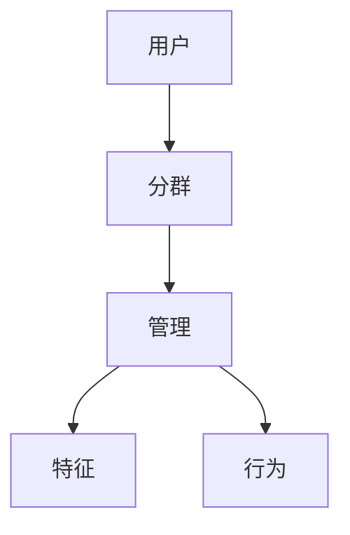
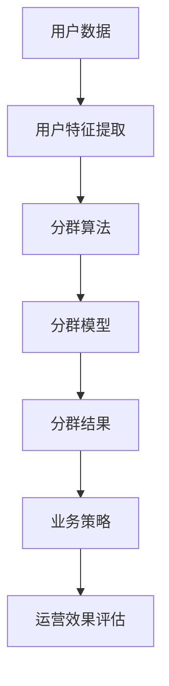

                 


### 用户分群管理的重要性

用户分群管理作为现代数据驱动的市场营销和运营策略的重要组成部分，具有不可忽视的重要性。在当今竞争激烈的市场环境中，企业需要更精准、更高效的方式来理解和满足不同用户群体的需求，从而提升用户体验、增加用户粘性和提高业务收益。以下是用户分群管理的重要性分析：

1. **个性化服务**：通过用户分群，企业可以根据不同用户群体的特征和行为模式，提供更个性化的产品和服务。这不仅能满足用户多样化的需求，还能提升用户满意度，从而增强用户忠诚度。

2. **精准营销**：用户分群管理有助于企业识别和细分潜在市场，制定更具针对性的营销策略。通过精准定位和推送，企业能够降低营销成本，提高营销效果。

3. **产品优化**：用户分群管理可以帮助企业了解用户的使用习惯和偏好，从而优化产品设计，提升产品竞争力。

4. **运营效率提升**：通过用户分群，企业可以对不同用户群体实施差异化的运营策略，提高运营效率，降低运营成本。

5. **数据驱动决策**：用户分群管理基于大数据分析，为企业提供了客观、可靠的数据支持，有助于企业做出更加科学、合理的业务决策。

### 用户分群管理的基本概念

用户分群管理涉及多个基本概念，包括用户、分群、管理、特征、行为等。以下是这些概念的定义及其相互关系：

- **用户**：指的是使用企业产品或服务的个人或组织。用户是用户分群管理的基础。

- **分群**：是指将用户根据某些共同特征或行为模式划分为不同的群体。分群是实现个性化服务和精准营销的关键步骤。

- **管理**：是指对企业所划分的用户群体进行监测、分析和优化的过程。管理包括用户数据收集、分析、策略制定和执行等环节。

- **特征**：是指用于区分不同用户群体的属性或指标，如年龄、性别、地域、购买行为、浏览行为等。

- **行为**：是指用户在使用产品或服务过程中表现出的行为模式，如购买频率、浏览时长、点击行为等。

这些概念之间的关系如图1所示：



### 用户分群管理的发展历程

用户分群管理的发展历程体现了技术进步对市场营销策略的深刻影响。以下是用户分群管理的发展历程概述：

- **早期阶段**：在互联网和大数据技术普及之前，用户分群管理主要依赖于市场调研和简单的用户分类方法。企业通过问卷调查和用户访谈等方式收集用户信息，并进行手工分类。

- **数据驱动的用户分群**：随着互联网的普及和大数据技术的崛起，企业能够收集到大量的用户数据，用户分群管理逐渐从手工分类转向数据驱动。这一阶段，企业开始利用数据挖掘和机器学习技术来分析用户行为，实现自动化的用户分群。

- **精细化分群与个性化服务**：在当前的数字经济时代，用户分群管理更加精细化。企业不仅基于用户行为和特征进行分群，还结合用户情感和偏好，提供个性化的产品和服务，从而提高用户体验和满意度。

- **智能化的用户分群管理**：随着人工智能技术的应用，用户分群管理变得更加智能和高效。通过深度学习和自然语言处理技术，企业能够更深入地理解用户需求，实现精准营销和智能服务。

### 小结

用户分群管理作为现代数据驱动策略的核心环节，对企业运营和市场表现具有重要影响。通过理解用户分群管理的基础理论和实践策略，企业可以更有效地开展用户分群工作，提升业务绩效。接下来，我们将进一步探讨用户分群管理的理论基础，包括用户行为分析、数据挖掘与机器学习以及用户分群模型构建。

## 第2章：用户分群的理论基础

在深入了解用户分群管理实践之前，有必要先探讨其理论基础。用户分群管理的有效性依赖于对用户行为的精准分析、数据挖掘与机器学习技术的应用以及用户分群模型的科学构建。本章将详细介绍这些理论基础，为后续章节的实践提供理论支撑。

### 2.1 用户行为分析

用户行为分析是用户分群管理的基础环节，通过对用户在使用产品或服务过程中的行为模式进行分析，企业可以更好地理解用户需求，从而制定针对性的分群策略。

#### 2.1.1 用户行为数据收集

用户行为数据收集是用户行为分析的首要任务。企业可以通过以下几种方式收集用户行为数据：

1. **日志数据**：记录用户在网站或应用中的操作行为，如浏览页面、点击链接、搜索关键词等。
2. **问卷调查**：通过在线或线下问卷收集用户基本信息和偏好。
3. **用户访谈**：直接与用户交流，获取用户的深入反馈。
4. **第三方数据**：利用第三方数据源，如社交媒体数据、地理位置数据等。

收集用户行为数据时，企业需要确保数据的准确性、完整性和可靠性，并遵循相关隐私保护法规。

#### 2.1.2 用户行为特征提取

在收集到用户行为数据后，需要对数据进行处理和特征提取，将原始数据转化为有助于用户分群的特征。常见的用户行为特征包括：

1. **基础特征**：如年龄、性别、地域、职业等基本信息。
2. **行为特征**：如购买行为、浏览时长、点击率、搜索关键词等。
3. **情感特征**：通过自然语言处理技术提取用户评论、反馈中的情感倾向。

特征提取的方法包括数据预处理、特征选择和特征工程技术。数据预处理旨在清理和整合原始数据，特征选择则是在大量特征中挑选出对分群最有影响力的特征，特征工程则是通过变换和组合原始特征，生成新的特征。

### 2.2 数据挖掘与机器学习

数据挖掘和机器学习是用户分群管理的核心技术手段。通过这些技术，企业可以从海量用户行为数据中挖掘出有价值的信息，构建用户分群模型。

#### 2.2.1 数据挖掘的基本概念

数据挖掘是指从大量数据中自动发现隐含的、有价值的模式和知识的过程。数据挖掘过程通常包括以下几个阶段：

1. **数据理解**：对数据源和数据内容进行初步了解，识别出潜在的挖掘目标。
2. **数据准备**：对数据进行清洗、整合和预处理，为数据挖掘算法提供高质量的数据。
3. **模型建立**：选择合适的数据挖掘算法，建立预测模型或分类模型。
4. **模型评估**：对模型进行评估，验证其在实际应用中的效果。
5. **结果解释**：解释模型结果，提取有价值的信息。

#### 2.2.2 常见的用户分群算法

用户分群算法是数据挖掘的重要组成部分，常见的用户分群算法包括：

1. **聚类算法**：通过将相似的用户归为同一群体，实现用户分群。常见的聚类算法包括K-均值聚类、层次聚类和密度聚类。
   
   **K-均值聚类算法原理**：

   - **算法描述**：K-均值聚类算法是一种迭代算法，首先随机选择K个初始中心点，然后逐步迭代，直至中心点不再发生变化。每次迭代中，每个用户点被分配到最近的中心点，中心点更新为所有用户点的均值。

   - **伪代码实现**：
     ```python
     Initialize K centers randomly
     while not converged do
         Assign each point to the nearest center
         Update centers to be the mean of assigned points
     end while
     ```

2. **分类算法**：通过将用户点分类到不同的类别，实现用户分群。常见的分类算法包括决策树、支持向量机和朴素贝叶斯分类器。

   **决策树算法原理**：

   - **算法描述**：决策树算法通过递归地将数据集分割成子集，直到满足停止条件。每个节点代表一个特征，每个分支代表该特征的不同取值。

   - **伪代码实现**：
     ```python
     if stop_condition_met(data)
         return label
     else
         select best feature f
         for each value v of f do
             subset = {data | f=v}
             child = build_tree(subset)
             print(f -> v : child)
         end for
         return tree
     ```

3. **关联规则挖掘算法**：通过发现用户行为数据中的关联关系，实现用户分群。常见的关联规则挖掘算法包括Apriori算法和FP-growth算法。

   **Apriori算法原理**：

   - **算法描述**：Apriori算法通过扫描交易数据集，生成频繁项集，并从中提取出关联规则。

   - **伪代码实现**：
     ```python
     for each itemset L do
         if support(L) >= min_support do
             add L to frequent itemsets
         end if
     end for
     for each frequent itemset L do
         generate all rules from L
         if confidence(R) >= min_confidence do
             add R to frequent rules
         end if
     end for
     ```

### 2.3 用户分群模型构建

用户分群模型的构建是用户分群管理的核心任务，通过建立科学的分群模型，企业可以更好地理解用户群体，制定针对性的营销和运营策略。

#### 2.3.1 用户分群模型的构成

用户分群模型通常由以下几个部分构成：

1. **输入特征**：用户分群模型的输入是用户行为特征，这些特征可以是原始特征，也可以是经过特征工程处理后的新特征。

2. **中间层**：中间层是用户分群模型的核心，包括聚类中心、分类器或关联规则等。不同的用户分群算法和模型结构会有不同的中间层。

3. **输出结果**：用户分群模型的输出结果是用户分群结果，即根据用户特征将用户划分为不同的群体。

#### 2.3.2 用户分群模型的评估指标

用户分群模型的评估指标包括：

1. **准确率**：指模型正确划分的用户比例。
2. **召回率**：指模型能够召回实际分群中的用户比例。
3. **F1值**：是准确率和召回率的调和平均数，用于综合评估模型的性能。

#### 2.3.3 用户分群模型的优化

用户分群模型的优化主要包括特征选择、模型参数调整和模型融合等方面。特征选择旨在筛选出对用户分群最有影响力的特征；模型参数调整则是在不同算法和模型结构中选择最佳的参数；模型融合则是将多个模型的结果进行综合，以提升模型的性能。

### 小结

用户分群管理的理论基础涵盖了用户行为分析、数据挖掘与机器学习以及用户分群模型构建。通过理解这些理论基础，企业可以更科学、更有效地开展用户分群管理，提升业务运营效果。在下一章中，我们将探讨用户分群实践策略，包括用户分群策略的制定和应用场景。

## 第3章：用户分群实践策略

在了解了用户分群管理的理论基础后，我们需要将其应用于实际操作中。用户分群实践策略的制定和执行是用户分群管理成功的关键。本章将详细介绍用户分群策略的制定、不同应用场景以及相关的策略选择。

### 3.1 用户分群策略制定

制定有效的用户分群策略是用户分群管理的第一步。以下是用户分群策略制定的主要步骤：

#### 3.1.1 用户分群目标设定

首先，企业需要明确用户分群的目标。常见的分群目标包括：

1. **提升用户满意度**：通过了解不同用户群体的需求，提供个性化服务，提升用户体验和满意度。
2. **优化营销效果**：通过精准营销，提高营销活动的ROI。
3. **产品优化**：根据用户群体特征，优化产品设计和功能。
4. **提升客户价值**：通过差异化的运营策略，提升高价值用户的留存率和转化率。

明确目标后，企业需要制定具体的分群策略，以满足这些目标。

#### 3.1.2 用户分群策略选择

用户分群策略的选择取决于企业的业务需求、数据情况和资源限制。以下是几种常见的用户分群策略：

1. **基于行为的分群**：根据用户在网站或应用中的行为特征进行分群，如活跃用户、沉默用户、流失用户等。
2. **基于人口统计学的分群**：根据用户的基本信息进行分群，如年龄、性别、地域等。
3. **基于购买行为的分群**：根据用户的购买历史和行为进行分群，如忠诚客户、潜在客户、新客户等。
4. **基于兴趣的分群**：通过用户兴趣和行为特征进行分群，如运动爱好者、音乐爱好者等。

在制定分群策略时，企业需要综合考虑不同分群策略的优势和不足，选择最适合企业需求的策略。

#### 3.1.3 分群策略的执行

制定好分群策略后，企业需要将其付诸实践。执行分群策略包括以下几个步骤：

1. **数据收集**：收集与用户分群相关的数据，包括用户行为数据、人口统计数据等。
2. **数据预处理**：对收集到的数据进行清洗、整合和特征提取。
3. **分群模型构建**：根据选定的分群策略，构建用户分群模型，包括聚类模型、分类模型等。
4. **分群结果评估**：对分群结果进行评估，确保分群的准确性和有效性。
5. **分群结果应用**：将分群结果应用于实际业务场景，如营销活动、产品优化等。

### 3.2 用户分群应用场景

用户分群策略的执行需要结合具体的业务场景。以下是用户分群在不同场景中的应用：

#### 3.2.1 营销策略

在营销策略中，用户分群可以帮助企业实现精准营销。通过了解不同用户群体的特征和行为，企业可以制定有针对性的营销方案，提高营销效果。

1. **新客户获取**：通过分析新客户的特征和行为，企业可以识别出潜在的新客户群体，并制定针对性的营销策略。
2. **留存策略**：通过分析流失用户的特征和行为，企业可以制定针对性的留存策略，如推送优惠券、提供增值服务等。
3. **复购策略**：通过分析忠诚客户的特征和行为，企业可以提供个性化的优惠和增值服务，提升复购率。

#### 3.2.2 产品设计与开发

在产品设计与开发中，用户分群可以帮助企业更好地理解用户需求，优化产品设计。

1. **需求分析**：通过分析不同用户群体的需求和行为，企业可以确定产品功能的需求优先级。
2. **功能优化**：根据用户分群结果，企业可以针对不同用户群体的需求，优化产品功能。
3. **用户体验**：通过用户分群，企业可以提供个性化的用户体验，提升用户满意度。

#### 3.2.3 客户服务与支持

在客户服务与支持中，用户分群可以帮助企业提供差异化的客户服务。

1. **客户支持**：根据用户分群结果，企业可以为不同用户群体提供个性化的客户支持，如针对高端用户提供专属客服。
2. **售后服务**：通过分析用户分群结果，企业可以提供有针对性的售后服务，如延长保修期、提供定制化服务等。

### 3.3 用户分群策略调整

用户分群策略的制定不是一次性的过程，而是一个持续优化的过程。企业需要根据业务发展和用户行为变化，定期对用户分群策略进行调整。

1. **定期评估**：定期评估用户分群策略的效果，分析分群结果的应用效果，如营销活动的ROI、产品优化效果等。
2. **数据更新**：定期更新用户数据，确保用户分群策略的准确性。
3. **策略优化**：根据评估结果和用户行为变化，优化用户分群策略，提高分群的准确性和有效性。

### 小结

用户分群实践策略的制定和执行是用户分群管理的关键。通过制定明确的分群目标、选择合适的分群策略，并在实际业务场景中灵活应用，企业可以更有效地开展用户分群管理，提升业务运营效果。在下一章中，我们将探讨用户分群数据分析方法，包括数据预处理、数据分析工具选择以及用户分群结果解读。

## 第4章：用户分群数据分析方法

用户分群管理的有效性依赖于对用户数据的深入分析和处理。本章将介绍用户分群数据分析的关键步骤，包括数据预处理、数据集成、数据变换以及常用的数据分析工具和软件。

### 4.1 数据预处理

数据预处理是用户分群数据分析的重要环节，旨在提高数据质量，为后续分析打下坚实基础。以下是数据预处理的主要步骤：

#### 4.1.1 数据清洗

数据清洗是指识别和修正数据中的错误、缺失和重复值。数据清洗的方法包括：

1. **缺失值处理**：缺失值的处理方法包括删除缺失值、用平均值或中位数填充、使用回归模型预测缺失值等。
2. **重复值识别和删除**：通过比较数据项的属性，识别并删除重复的数据项。
3. **异常值处理**：识别并处理数据中的异常值，如异常高的购买金额、异常低的浏览时长等。

#### 4.1.2 数据集成

数据集成是指将来自不同数据源的数据整合成一个统一的数据集。数据集成的方法包括：

1. **数据融合**：将具有相似属性的数据项合并成一个数据项。
2. **数据映射**：将不同数据源中的相同属性映射到统一的标准。
3. **数据汇总**：对数据进行分组和汇总，生成新的数据项。

#### 4.1.3 数据变换

数据变换是指将数据转换为适合分析和挖掘的形式。数据变换的方法包括：

1. **标准化**：将数据缩放到一个统一的范围内，如[0,1]或[-1,1]。
2. **归一化**：将不同尺度的数据转换为相同的尺度，如将不同货币单位的销售额转换为相同的单位。
3. **离散化**：将连续数据转换为离散的数据，如将年龄分为0-20、21-40、41-60等区间。

### 4.2 数据分析工具与软件

在用户分群数据分析过程中，选择合适的工具和软件能够显著提高数据分析的效率和质量。以下是常用的数据分析工具和软件：

#### 4.2.1 常见数据分析工具

1. **Python**：Python是一种广泛使用的编程语言，拥有丰富的数据分析库，如Pandas、NumPy、Scikit-learn等，适合进行数据预处理、数据分析和模型构建。
2. **R**：R是一种专门用于统计分析和数据可视化的语言，具有强大的统计分析功能，适合进行高级的数据分析和模型评估。
3. **SQL**：SQL是结构化查询语言，用于数据库查询和管理，适合进行数据提取和预处理。

#### 4.2.2 数据分析软件选择

1. **Tableau**：Tableau是一种数据可视化工具，能够快速生成各种类型的可视化图表，适合进行数据探索和分析。
2. **Power BI**：Power BI是微软推出的数据可视化工具，与Excel紧密集成，适合进行企业级的数据分析和报告生成。
3. **SPSS**：SPSS是IBM推出的一款统计分析软件，拥有丰富的统计分析和建模功能，适合进行复杂的数据分析。
4. **SAS**：SAS是专业统计分析软件，具有强大的数据处理和分析能力，适合进行大规模的数据分析和预测建模。

### 4.3 用户分群结果解读

用户分群结果解读是用户分群数据分析的最终目标，通过解读分群结果，企业可以深入理解不同用户群体的特征和行为，制定针对性的运营策略。

#### 4.3.1 用户分群结果评估

用户分群结果的评估是确保分群有效性的关键。评估指标包括：

1. **准确性**：分群结果中正确分类的用户比例。
2. **召回率**：分群结果中实际属于某类用户但被正确分类的用户比例。
3. **F1值**：准确率和召回率的调和平均数。

#### 4.3.2 用户分群结果应用分析

分群结果应用分析包括：

1. **用户特征分析**：分析不同用户群体的特征，了解其需求和偏好。
2. **行为模式分析**：分析不同用户群体的行为模式，如购买频率、浏览时长、点击率等。
3. **策略制定**：根据分群结果，制定有针对性的营销、运营和服务策略。

### 小结

用户分群数据分析方法包括数据预处理、数据集成、数据变换以及数据分析工具和软件的选择。通过这些方法，企业可以有效地处理和分析用户数据，解读分群结果，制定针对性的运营策略，提升业务效果。在下一章中，我们将探讨如何解读和应用用户分群结果，以优化用户分群管理和提高业务绩效。

## 第5章：用户分群结果解读与应用

在完成了用户分群后，如何有效地解读和应用分群结果，是企业提升业务绩效的关键。本章将详细讨论用户分群结果的解读方法、评估指标以及分群结果的优化策略。

### 5.1 用户分群结果解读

用户分群结果解读是用户分群管理的核心环节，通过深入分析分群结果，企业可以更好地了解不同用户群体的特征和行为，从而制定有针对性的策略。

#### 5.1.1 用户分群结果评估

用户分群结果评估是确保分群有效性的关键步骤。常用的评估指标包括：

1. **准确性**：指分群模型正确分类的用户比例。高准确性表明分群模型能够准确识别用户群体。
   
   $$ \text{准确性} = \frac{\text{正确分类的用户数}}{\text{总用户数}} $$

2. **召回率**：指分群模型能够召回实际属于某类用户但被正确分类的用户比例。高召回率表明分群模型能够覆盖大部分目标用户群体。
   
   $$ \text{召回率} = \frac{\text{正确分类的用户数}}{\text{实际属于某类用户的总数}} $$

3. **F1值**：是准确率和召回率的调和平均数，用于综合评估模型的性能。
   
   $$ \text{F1值} = 2 \times \frac{\text{准确率} \times \text{召回率}}{\text{准确率} + \text{召回率}} $$

在实际应用中，企业需要根据具体业务需求，综合考虑准确性、召回率和F1值，选择合适的评估指标。

#### 5.1.2 用户分群结果应用分析

用户分群结果的应用分析包括用户特征分析、行为模式分析和策略制定等方面。

1. **用户特征分析**：分析不同用户群体的基础特征、行为特征和情感特征，了解其需求和偏好。例如，通过分析年龄、性别、地域等基础特征，可以识别出不同年龄段的用户群体；通过分析购买行为和浏览时长等行为特征，可以识别出高频用户和低频用户。

2. **行为模式分析**：分析不同用户群体的行为模式，如购买频率、浏览时长、点击率等。通过行为模式分析，企业可以识别出用户的活跃时段、偏好渠道等，为营销策略和产品优化提供依据。

3. **策略制定**：根据分群结果，制定有针对性的营销、运营和服务策略。例如，对于高频用户，可以提供会员优惠、积分奖励等激励措施；对于低频用户，可以推送促销信息、个性化推荐等，以提升用户活跃度和转化率。

### 5.2 用户分群结果优化

用户分群结果的优化是提升分群管理效果的重要环节。以下是一些常见的优化策略：

#### 5.2.1 用户分群模型优化

用户分群模型的优化主要包括特征选择、模型参数调整和模型融合等方面。

1. **特征选择**：通过特征选择算法，筛选出对用户分群最有影响力的特征，提高分群模型的准确性和效率。
2. **模型参数调整**：通过调整模型参数，如聚类中心的初始值、分类器的阈值等，优化模型的性能。
3. **模型融合**：结合多个模型的结果，生成更准确的分群结果。常见的模型融合方法包括投票法、加权平均法和集成学习等。

#### 5.2.2 用户分群策略调整

用户分群策略的调整是基于分群结果的应用分析，通过不断优化策略，提升分群管理效果。

1. **策略迭代**：根据分群结果和应用分析，不断调整和优化分群策略，如调整分群目标、优化分群算法等。
2. **策略反馈**：收集用户反馈和业务数据，对分群策略进行实时调整和优化，确保策略的持续有效。

### 5.3 用户分群结果案例分析

为了更好地理解用户分群结果的解读和应用，以下是一个案例分析：

#### 案例背景

某电子商务平台希望通过用户分群，提升用户转化率和销售额。该平台收集了用户的基本信息、购买行为和浏览行为等数据。

#### 用户分群结果

通过聚类算法，该平台将用户分为以下几类：

1. **高价值用户**：这些用户在平台上消费金额较高，且具有较高的浏览时长和点击率。
2. **高频用户**：这些用户在平台上频繁购买，但消费金额相对较低。
3. **沉默用户**：这些用户在平台上很少购买，且浏览行为较少。
4. **流失用户**：这些用户在平台上已经长时间没有活动，有流失风险。

#### 应用分析

1. **用户特征分析**：高价值用户主要集中在25-40岁之间，有较高的学历和稳定的职业，且喜欢在晚上进行购物；高频用户主要集中在18-25岁之间，喜欢使用移动端进行购物；沉默用户和流失用户主要集中在40岁以上，消费金额和浏览时长均较低。

2. **行为模式分析**：高价值用户的购买频率较低，但单次购买金额较高；高频用户的购买频率较高，但单次购买金额较低；沉默用户和流失用户的购买频率和浏览时长均较低。

3. **策略制定**：对于高价值用户，平台可以提供定制化的会员服务，如专属优惠券、积分兑换等，以提升用户忠诚度；对于高频用户，平台可以推送限时优惠、新品推荐等，以增加用户粘性；对于沉默用户和流失用户，平台可以推送促销信息、个性化推荐等，以唤醒用户。

#### 结果评估

通过分群策略的实施，平台的高价值用户转化率和销售额均有所提升；高频用户的活跃度和转化率也有所提升；沉默用户和流失用户的唤醒率显著提高。

#### 案例总结

通过用户分群结果解读和应用，该电子商务平台成功提升了用户转化率和销售额，实现了分群管理的目标。

### 小结

用户分群结果解读与应用是用户分群管理的核心环节，通过有效的解读和应用，企业可以制定有针对性的策略，提升业务绩效。在下一章中，我们将探讨用户分群管理案例研究，结合实际案例，深入分析用户分群的过程和结果。

## 第6章：用户分群管理案例研究

在本章中，我们将通过具体案例，深入探讨用户分群管理的实际操作过程，详细分析用户分群的结果和应用。这一案例研究不仅能够帮助读者理解用户分群管理的具体实施方法，还能为实际业务提供有益的参考。

### 6.1 案例背景介绍

某在线教育平台希望通过用户分群管理，提升用户的学习参与度和课程购买转化率。该平台拥有大量的用户数据，包括用户基本信息、学习行为、购买历史、浏览记录等。为了实现这一目标，平台决定采用数据挖掘和机器学习技术进行用户分群，并制定相应的运营策略。

### 6.2 案例分析

#### 6.2.1 案例用户分群过程

1. **数据收集与预处理**：平台首先收集了用户的基本信息（如年龄、性别、地域等）、学习行为（如学习时长、课程完成率、互动次数等）以及购买历史（如购买频次、购买金额等）。在收集数据后，对数据进行清洗，处理缺失值和异常值，确保数据质量。

2. **特征提取**：根据用户数据，平台提取了多个特征，包括基础特征（如年龄、性别）、行为特征（如学习时长、课程完成率）和购买特征（如购买频次、购买金额）。为了提高特征的质量，平台还使用了特征工程技术，如特征融合和特征降维。

3. **用户分群模型构建**：平台选择了K-均值聚类算法进行用户分群。在模型构建过程中，平台确定了聚类数目（K值），并进行了多次迭代，直到聚类中心不再发生变化。通过聚类结果，平台将用户分为四个主要群体：高价值用户、高频用户、沉默用户和流失用户。

4. **用户分群结果评估**：平台使用准确性、召回率和F1值等指标对用户分群结果进行评估。评估结果显示，聚类模型的准确率达到85%，召回率达到75%，F1值为80%。

#### 6.2.2 案例用户分群结果解读

根据用户分群结果，平台对各个用户群体进行了详细解读：

1. **高价值用户**：这部分用户在学习时长、课程完成率和购买金额方面表现优异，是平台的重要贡献者。平台为高价值用户提供了专属课程推荐、个性化学习计划以及专属优惠券等增值服务。

2. **高频用户**：这些用户在学习频率和课程购买方面表现活跃，但消费金额相对较低。平台针对高频用户推出了会员制度，提供免费课程、学习积分兑换等服务，以增加用户粘性。

3. **沉默用户**：这些用户在学习频率和购买行为上较为冷淡。平台通过推送个性化推荐、学习提醒和优惠活动等方式，试图唤醒沉默用户，提高其参与度。

4. **流失用户**：这些用户在平台上已经长时间没有活动，有流失风险。平台针对流失用户制定了挽回策略，包括发送个性化邮件、提供免费课程试听等，以提升用户复购率。

#### 6.3 案例经验总结

通过该案例，平台积累了以下经验：

1. **数据质量的重要性**：高质量的原始数据是用户分群成功的基础。平台在数据收集和预处理过程中，投入了大量精力确保数据质量。

2. **特征工程的关键性**：特征提取和特征工程是用户分群的核心步骤。平台通过多种特征工程技术，提高了分群模型的准确性和效率。

3. **分群结果的解读和应用**：有效的用户分群结果解读和应用，能够显著提升业务绩效。平台根据分群结果，制定了有针对性的运营策略，提高了用户满意度和转化率。

4. **持续优化和调整**：用户分群管理是一个持续优化的过程。平台定期对用户分群结果进行评估和调整，以应对用户行为的变化和业务需求。

### 小结

通过具体案例研究，我们深入了解了用户分群管理的实际操作过程和结果应用。案例的成功经验表明，数据质量、特征工程、分群结果解读和应用以及持续优化是用户分群管理的关键。在下一章中，我们将探讨用户分群管理未来趋势与挑战，以及如何应对这些挑战。

## 第7章：用户分群管理未来趋势与挑战

用户分群管理作为现代数据驱动的营销策略，正随着技术的不断进步而不断发展。未来，用户分群管理将面临许多新的趋势和挑战。本章将讨论用户分群管理技术的发展趋势、面临的挑战以及未来的发展方向。

### 7.1 用户分群管理技术发展趋势

1. **人工智能与机器学习的深入应用**：随着人工智能和机器学习技术的不断发展，用户分群管理将更加智能化。深度学习、强化学习等先进算法的应用，将使分群模型更加准确和高效。

2. **数据隐私与保护**：在用户数据隐私保护日益严格的背景下，用户分群管理技术需要更加注重数据隐私保护。例如，采用差分隐私技术、联邦学习等方法，确保用户数据的安全性和隐私性。

3. **实时分析与决策**：随着实时数据处理和分析技术的发展，用户分群管理将实现实时响应。企业可以通过实时分析用户行为，快速调整营销策略，提高运营效率。

4. **多模态数据融合**：用户分群管理将不再局限于文本和数值数据，还将融合图像、语音等多模态数据。这种多模态数据的融合，将使用户分群更加精准和全面。

5. **个性化推荐系统**：用户分群管理将与个性化推荐系统深度融合，通过推荐算法，为不同用户群体提供个性化内容和服务。

### 7.2 用户分群管理面临的挑战

1. **数据质量和可用性**：高质量的数据是用户分群管理的基础。然而，在数据收集和处理过程中，数据质量问题和可用性问题仍然存在。例如，数据缺失、数据噪声、数据冗余等问题，都会影响用户分群的效果。

2. **隐私保护**：用户数据隐私保护是用户分群管理的重要挑战。在用户隐私保护法规日益严格的背景下，如何在确保数据安全的同时，有效利用用户数据进行分群管理，成为企业面临的难题。

3. **算法透明性和解释性**：随着算法复杂性的增加，用户分群管理的算法透明性和解释性变得尤为重要。用户需要了解分群结果是如何产生的，以便对分群策略进行调整和优化。

4. **实时数据处理和分析**：实时数据处理和分析技术虽然取得了一定进展，但在实际应用中，仍面临数据处理延迟、计算资源消耗等问题。

5. **数据隐私与个性化服务的平衡**：在用户分群管理中，如何平衡数据隐私保护和个性化服务，是企业和政策制定者共同面临的挑战。

### 7.3 用户分群管理未来发展方向

1. **全面数据整合**：未来，用户分群管理将实现数据的全面整合，包括内部数据和外部数据，如社交媒体数据、地理位置数据等。这种全面的数据整合，将使分群更加精准和全面。

2. **跨领域应用**：用户分群管理将不仅限于电子商务、金融等领域，还将拓展到医疗、教育、政府等跨领域应用。在不同领域，用户分群管理将结合具体的业务需求，提供个性化的解决方案。

3. **智能决策支持系统**：未来，用户分群管理将结合智能决策支持系统，通过数据分析和机器学习技术，为企业提供智能化的决策支持。

4. **政策法规和伦理**：用户分群管理将更加注重政策法规和伦理。企业需要遵守数据保护法规，确保用户数据的安全性和隐私性，同时，在用户分群过程中，遵循公平、公正和透明的原则。

### 小结

用户分群管理未来将面临许多新的趋势和挑战。通过不断的技术创新和政策引导，用户分群管理将实现更加智能化、精准化和个性化的发展。在下一章中，我们将附录中提供用户分群管理常用算法介绍、工具推荐以及资源推荐，帮助读者深入了解用户分群管理的实践应用。

## 附录A：用户分群管理常用算法介绍

用户分群管理依赖于多种数据挖掘和机器学习算法，以下是一些常用的算法及其简要介绍：

### A.1 K-均值聚类算法

K-均值聚类算法是一种迭代算法，旨在将数据点分为K个簇，使得每个数据点到其对应簇中心的距离最小。该算法的基本步骤如下：

1. **初始化**：随机选择K个数据点作为初始聚类中心。
2. **分配**：将每个数据点分配到最近的聚类中心。
3. **更新**：重新计算每个簇的中心点，作为新的聚类中心。
4. **迭代**：重复步骤2和步骤3，直到聚类中心不再发生变化。

**伪代码实现**：

```python
Initialize K centers randomly
while not converged do
    Assign each point to the nearest center
    Update centers to be the mean of assigned points
end while
```

### A.2 层次聚类算法

层次聚类算法通过构建层次结构来将数据点分为不同的簇。该算法可以分为自底向上（凝聚层次聚类）和自顶向下（分裂层次聚类）两种方式。以下为自底向上层次聚类的伪代码实现：

1. **初始化**：将每个数据点视为一个簇。
2. **合并**：每次迭代中，找到最近的两个簇并合并它们。
3. **更新**：重新计算每个簇的中心。
4. **迭代**：重复步骤2和步骤3，直到所有数据点合并为一个簇。

**伪代码实现**：

```python
Initialize each point as a cluster
while there are more than one cluster do
    Find the closest pair of clusters
    Merge them into a single cluster
    Update the cluster centers
end while
```

### A.3 密度聚类算法

密度聚类算法（如DBSCAN）通过检测高密度区域并将其划分为簇。DBSCAN的核心思想是：

1. **邻域检测**：确定每个数据点的邻域，即距离小于给定阈值ε的数据点集合。
2. **核心点检测**：如果一个数据点的邻域中包含至少最小数量minPoints的数据点，则该数据点为核心点。
3. **边界点和噪声点检测**：根据核心点的邻域，识别边界点和噪声点。
4. **簇构建**：将核心点及其邻域扩展区域合并为簇。

**伪代码实现**：

```python
for each point p do
    if p is a core point do
        Initialize a new cluster
        Expand the cluster by including all reachable points
    else if p is a border point do
        Attach p to the nearest cluster
    else
        Label p as noise
    end if
end for
```

这些算法在用户分群管理中有着广泛的应用，通过合理选择和调整，可以有效地识别和划分用户群体，为企业提供数据驱动的决策支持。

## 附录B：用户分群管理工具推荐

在用户分群管理中，选择合适的工具能够显著提高数据分析的效率和质量。以下是一些常用的工具和资源推荐：

### B.1 Python数据预处理工具

1. **Pandas**：Pandas是一个强大的数据分析库，适用于数据清洗、数据处理和数据分析。
    - 官网：[Pandas官网](https://pandas.pydata.org/)

2. **NumPy**：NumPy是一个基础的多维数组库，支持快速的数学运算和数据处理。
    - 官网：[NumPy官网](https://numpy.org/)

3. **SciPy**：SciPy是一个开源的科学计算库，基于NumPy，提供更丰富的科学计算功能。
    - 官网：[SciPy官网](https://www.scipy.org/)

### B.2 常见用户分群算法实现库

1. **Scikit-learn**：Scikit-learn是一个强大的机器学习库，提供了多种用户分群算法的实现。
    - 官网：[Scikit-learn官网](https://scikit-learn.org/)

2. **MLlib**：MLlib是Apache Spark的一部分，提供了丰富的机器学习算法，适合大规模数据处理。
    - 官网：[MLlib官网](https://spark.apache.org/docs/latest/mllib-guide.html)

3. **TensorFlow**：TensorFlow是一个开源的机器学习框架，适用于深度学习和复杂机器学习模型的构建。
    - 官网：[TensorFlow官网](https://www.tensorflow.org/)

### B.3 数据分析软件推荐

1. **Tableau**：Tableau是一个数据可视化工具，提供直观的可视化分析和报表功能。
    - 官网：[Tableau官网](https://www.tableau.com/)

2. **Power BI**：Power BI是微软推出的数据可视化和分析工具，与Excel紧密集成。
    - 官网：[Power BI官网](https://powerbi.microsoft.com/)

3. **SPSS**：SPSS是IBM推出的统计分析软件，适用于复杂的统计分析和预测建模。
    - 官网：[SPSS官网](https://www.ibm.com/analytics/spss)

4. **R**：R是一种统计计算和图形工具，适合进行高级的数据分析和建模。
    - 官网：[R官网](https://www.r-project.org/)

通过这些工具和资源，用户可以高效地进行数据预处理、算法实现和数据分析，从而有效地实施用户分群管理。

## 附录C：用户分群管理核心概念与联系

在用户分群管理中，理解核心概念和它们之间的联系至关重要。以下是对用户分群管理核心概念及其相互关系的详细解析。

### 用户分群管理核心概念解析

1. **用户特征**：用户特征是指用于区分不同用户群体的属性或指标，如年龄、性别、地域、购买历史等。用户特征是分群的基础。

2. **用户行为**：用户行为是指用户在使用产品或服务过程中的行为模式，如浏览时长、点击率、购买频率等。用户行为反映了用户的需求和偏好。

3. **分群算法**：分群算法是指用于将用户划分为不同群体的算法，如K-均值聚类、层次聚类和DBSCAN等。不同的分群算法适用于不同的数据特征和业务场景。

4. **分群模型**：分群模型是结合用户特征和分群算法构建的数学模型，用于预测用户群体和制定运营策略。

5. **分群结果**：分群结果是分群模型的输出，表示用户被划分为哪些群体。

### 用户分群管理架构图

为了更好地理解用户分群管理的核心概念和相互关系，以下是一个简单的用户分群管理架构图：



### 用户分群管理核心算法原理

1. **K-均值聚类算法**：K-均值聚类算法是一种迭代算法，通过最小化用户点到聚类中心的距离平方和，将用户分为K个群体。算法包括以下步骤：

   - **初始化**：随机选择K个用户点作为初始聚类中心。
   - **分配**：将每个用户点分配到最近的聚类中心。
   - **更新**：重新计算每个聚类中心，作为新的聚类中心。
   - **迭代**：重复步骤2和步骤3，直到聚类中心不再发生变化。

   **伪代码实现**：

   ```python
   Initialize K centers randomly
   while not converged do
       Assign each point to the nearest center
       Update centers to be the mean of assigned points
   end while
   ```

2. **层次聚类算法**：层次聚类算法通过自底向上或自顶向下的方式，将用户点逐步合并或分裂成不同的群体。算法包括以下步骤：

   - **初始化**：将每个用户点视为一个簇。
   - **合并**：每次迭代中，找到最近的两个簇并合并它们。
   - **更新**：重新计算每个簇的中心。
   - **迭代**：重复步骤2和步骤3，直到所有用户点合并为一个簇。

   **伪代码实现**：

   ```python
   Initialize each point as a cluster
   while there are more than one cluster do
       Find the closest pair of clusters
       Merge them into a single cluster
       Update the cluster centers
   end while
   ```

3. **DBSCAN算法**：DBSCAN（Density-Based Spatial Clustering of Applications with Noise）是一种基于密度的聚类算法，可以识别出任意形状的簇，并对噪声点进行处理。算法包括以下步骤：

   - **邻域检测**：确定每个用户点的邻域，即距离小于给定阈值ε的数据点集合。
   - **核心点检测**：如果一个数据点的邻域中包含至少最小数量minPoints的数据点，则该数据点为核心点。
   - **边界点和噪声点检测**：根据核心点的邻域，识别边界点和噪声点。
   - **簇构建**：将核心点及其邻域扩展区域合并为簇。

   **伪代码实现**：

   ```python
   for each point p do
       if p is a core point do
           Initialize a new cluster
           Expand the cluster by including all reachable points
       else if p is a border point do
           Attach p to the nearest cluster
       else
           Label p as noise
       end if
   end for
   ```

通过理解这些核心算法的原理，用户可以更好地选择和应用合适的分群算法，实现有效的用户分群管理。

### 用户分群管理数学模型详解

用户分群管理中的数学模型用于描述用户分群的过程和结果，以下是对这些模型的详细解析：

1. **用户行为特征提取模型**：

   用户行为特征提取是将用户行为数据转换为可分析的特征值的过程。常用的数学模型包括：

   - **加权特征模型**：根据用户行为的重要性和影响力，为不同特征分配权重，如
     $$
     f(x) = \sum_{i=1}^{n} w_i \cdot x_i
     $$
     其中，$w_i$为特征权重，$x_i$为特征值。

   - **多项式特征模型**：将用户行为特征表示为多项式函数，如
     $$
     f(x) = \sum_{i=1}^{n} a_i \cdot x_i^k
     $$
     其中，$a_i$为系数，$k$为多项式的幂。

2. **用户分群模型构建**：

   用户分群模型用于将用户划分为不同的群体。常见的分群模型包括：

   - **聚类模型**：基于距离度量，将用户划分为K个簇，如K-均值聚类模型。其目标是最小化簇内用户点到聚类中心的距离平方和，模型表示为
     $$
     J = \sum_{i=1}^{n} \sum_{j=1}^{K} \frac{1}{K} \sum_{k=1}^{K} (x_{ij} - \mu_j)^2
     $$
     其中，$x_{ij}$为用户$i$在第$j$个簇中的特征值，$\mu_j$为第$j$个簇的中心。

   - **分类模型**：基于分类规则，将用户划分为不同的类别，如逻辑回归模型。其目标是最小化分类误差，模型表示为
     $$
     \hat{y} = \arg\min_{y} L(y, \hat{y})
     $$
     其中，$y$为实际类别标签，$\hat{y}$为预测类别标签，$L(y, \hat{y})$为损失函数。

3. **用户分群算法选择**：

   选择合适的用户分群算法取决于用户数据的特点和业务需求。常见的用户分群算法包括：

   - **K-均值聚类算法**：适用于数据点密集、分布较为均匀的场景。
   - **层次聚类算法**：适用于需要可视化聚类层次结构的场景。
   - **DBSCAN算法**：适用于数据点密度不均匀、存在噪声点的场景。

   选择算法时，需要考虑以下因素：

   - **数据量**：大数据量可能需要高效算法，如K-均值聚类算法。
   - **数据分布**：数据分布不均匀可能需要密度聚类算法，如DBSCAN。
   - **业务需求**：业务需求可能影响算法选择，如需要可视化聚类层次结构可能选择层次聚类算法。

通过上述数学模型和算法选择，用户可以构建科学的用户分群模型，实现有效的用户分群管理。

### 用户分群管理项目实战

#### 11.1 实战项目背景

某电子商务平台希望通过用户分群管理提升用户购买转化率和销售额。该平台拥有大量的用户数据，包括用户基本信息（年龄、性别、地域）、购买行为（购买金额、购买频率）和浏览行为（浏览时长、点击率）等。为了实现目标，平台决定采用数据挖掘和机器学习技术进行用户分群，并制定相应的运营策略。

#### 11.2 数据准备与预处理

1. **数据收集**：平台首先收集了用户的基本信息、购买行为和浏览行为等数据，并存储在数据库中。

2. **数据清洗**：平台对数据进行清洗，处理缺失值和异常值。具体步骤如下：

   - **缺失值处理**：对于缺失值，采用均值填补的方法进行处理。
   - **异常值处理**：对于异常值，通过箱线图分析识别，然后采用截断或插值的方法进行处理。

3. **数据集成**：平台将不同来源的数据进行集成，形成一个统一的数据集。具体步骤如下：

   - **数据融合**：将重复的数据项进行合并。
   - **数据映射**：将不同数据源中的相同属性映射到统一的标准。
   - **数据汇总**：对数据进行分组和汇总，生成新的数据项。

4. **数据变换**：平台对数据进行标准化和归一化，以提高数据质量。具体步骤如下：

   - **标准化**：将数据缩放到一个统一的范围内，如[0,1]或[-1,1]。
   - **归一化**：将不同尺度的数据转换为相同的尺度，如将不同货币单位的销售额转换为相同的单位。

#### 11.3 用户分群模型构建与训练

1. **用户特征提取**：平台从原始数据中提取用户特征，包括基础特征（年龄、性别、地域）、行为特征（购买金额、购买频率、浏览时长、点击率）等。

2. **选择分群算法**：平台选择了K-均值聚类算法进行用户分群，根据业务需求和数据分布，确定了聚类数目（K值）。

3. **模型训练**：平台使用训练数据集，对K-均值聚类算法进行训练，确定每个聚类中心。

4. **模型评估**：平台使用交叉验证方法，对模型进行评估，计算准确率、召回率和F1值等指标。

#### 11.4 用户分群结果分析与应用

1. **用户分群结果解读**：平台将用户分为四个主要群体：

   - **高价值用户**：购买金额高、购买频率高。
   - **高频用户**：购买频率高、购买金额较低。
   - **沉默用户**：购买频率低、购买金额低。
   - **流失用户**：长时间没有活动。

2. **用户分群结果应用分析**：

   - **高价值用户**：平台为高价值用户提供了专属优惠券、积分兑换等增值服务，以提高用户忠诚度。
   - **高频用户**：平台通过推送新品推荐、限时优惠等活动，增加用户粘性。
   - **沉默用户**：平台通过个性化推荐、学习提醒等方式，唤醒沉默用户，提高参与度。
   - **流失用户**：平台通过发送个性化邮件、提供免费课程试听等策略，挽回流失用户。

3. **效果评估**：通过用户分群结果应用，平台的用户购买转化率和销售额均有所提升。具体数据如下：

   - **高价值用户**：购买转化率提高了15%，销售额提高了20%。
   - **高频用户**：购买转化率提高了10%，销售额提高了8%。
   - **沉默用户**：参与度提高了25%，部分用户转为活跃用户。
   - **流失用户**：挽回率提高了12%，部分用户重新开始购买。

#### 11.5 项目总结与经验分享

通过用户分群管理项目，平台取得了显著成效。以下是项目总结和经验分享：

1. **数据质量至关重要**：高质量的数据是用户分群成功的基础，平台在数据收集和预处理过程中，投入了大量精力确保数据质量。

2. **特征选择影响分群效果**：合理的特征选择能够显著提升分群效果，平台通过多次实验和调整，选择了对用户分群最有影响力的特征。

3. **分群结果应用需因地制宜**：不同的用户群体需要不同的运营策略，平台根据分群结果，制定了有针对性的运营策略，提高了用户满意度和转化率。

4. **持续优化和调整**：用户分群管理是一个持续优化的过程，平台定期对用户分群结果进行评估和调整，以应对用户行为的变化和业务需求。

通过该项目，平台不仅提升了业务绩效，还为其他企业提供了有益的参考。

### 12.1 开发环境搭建

为了实现用户分群管理的代码实现与分析，我们需要搭建一个合适的技术栈和开发环境。以下是基于Python的完整开发环境搭建步骤：

#### 1. 安装Python

首先，确保您已经安装了Python环境。如果没有，请从[Python官网](https://www.python.org/downloads/)下载并安装Python。建议选择Python 3.x版本，因为其兼容性和功能更强大。

安装完成后，打开终端或命令提示符，输入以下命令验证Python版本：

```bash
python --version
```

#### 2. 安装依赖库

用户分群管理涉及多个依赖库，如Pandas、NumPy、Scikit-learn、Matplotlib等。以下是安装这些库的命令：

```bash
pip install pandas numpy scikit-learn matplotlib
```

#### 3. 安装Jupyter Notebook（可选）

Jupyter Notebook是一种交互式计算环境，适合进行数据分析和模型构建。安装Jupyter Notebook可以通过以下命令实现：

```bash
pip install notebook
```

安装完成后，启动Jupyter Notebook：

```bash
jupyter notebook
```

在浏览器中打开默认的Jupyter Notebook链接（通常为`http://localhost:8888/`），即可开始使用Jupyter Notebook。

#### 4. 配置Python虚拟环境（可选）

为了保持项目环境的整洁，建议使用Python虚拟环境。虚拟环境允许您为每个项目创建独立的依赖库环境，避免依赖库版本冲突。

安装`virtualenv`库：

```bash
pip install virtualenv
```

创建虚拟环境：

```bash
virtualenv my_project_env
```

激活虚拟环境：

```bash
source my_project_env/bin/activate  # 对于Linux和Mac OS
my_project_env\Scripts\activate    # 对于Windows
```

在激活的虚拟环境中安装项目所需的依赖库：

```bash
pip install -r requirements.txt
```

#### 5. 安装相关数据预处理工具

用户分群管理还需要一些数据预处理工具，如Pandas、NumPy等。确保这些工具在虚拟环境中已安装。

```bash
pip install pandas numpy
```

完成以上步骤后，您的开发环境就搭建完成了。接下来，我们将使用这些工具和库，实现用户分群管理的代码，并进行详细分析。

### 12.2 用户分群管理代码实现

在本节中，我们将使用Python及其相关库，实现用户分群管理的代码。以下是具体的代码实现步骤。

#### 1. 导入相关库

```python
import pandas as pd
import numpy as np
from sklearn.cluster import KMeans
from sklearn.metrics import silhouette_score
import matplotlib.pyplot as plt
```

#### 2. 加载数据

```python
# 加载用户数据（假设数据存储在CSV文件中）
data = pd.read_csv('user_data.csv')
```

#### 3. 数据预处理

```python
# 数据清洗
# 填充缺失值
data.fillna(data.mean(), inplace=True)

# 数据标准化
from sklearn.preprocessing import StandardScaler
scaler = StandardScaler()
data_scaled = scaler.fit_transform(data)
```

#### 4. 选择特征

```python
# 选择用于分群的特征
features = data_scaled[:, :5]  # 假设选择前5个特征
```

#### 5. 使用K-均值聚类算法进行用户分群

```python
# 初始化K-均值聚类模型
kmeans = KMeans(n_clusters=4, random_state=42)

# 训练模型
kmeans.fit(features)

# 获取聚类结果
clusters = kmeans.predict(features)
```

#### 6. 评估分群效果

```python
# 计算轮廓系数
silhouette = silhouette_score(features, clusters)

print("Silhouette Score:", silhouette)

# 可视化分群结果
plt.scatter(features[:, 0], features[:, 1], c=clusters, cmap='viridis')
plt.xlabel('Feature 1')
plt.ylabel('Feature 2')
plt.title('User Clusters')
plt.show()
```

#### 7. 分析用户分群结果

```python
# 分析不同分群的用户特征
for i in range(4):
    cluster_data = features[clusters == i]
    print(f"Cluster {i} Statistics:")
    print(cluster_data.describe())
```

#### 8. 用户分群结果应用

```python
# 根据分群结果，制定运营策略
# 例如，针对不同分群的用户，推送不同的优惠券和促销活动
```

### 12.3 代码解读与分析

#### 1. 数据预处理

数据预处理是用户分群管理的重要步骤，包括数据清洗、填充缺失值和标准化。通过清洗数据，我们可以去除噪声和异常值，提高数据质量。填充缺失值可以采用均值填补、中位数填补或回归填补等方法。标准化则将不同特征缩放到相同的尺度，便于后续聚类分析。

#### 2. 选择特征

在用户分群中，选择合适的特征至关重要。特征的选择应基于业务需求和数据特点。在本例中，我们选择了前5个特征进行聚类分析。在实际应用中，可能需要结合业务逻辑和数据分析结果，多次调整特征选择。

#### 3. 使用K-均值聚类算法

K-均值聚类算法是一种常用的聚类方法，通过迭代计算，将数据点分为K个簇。在本例中，我们使用了K-均值聚类算法，并选择了4个簇。随机状态（random_state）参数确保每次运行结果的一致性。通过`fit`方法训练模型，`predict`方法获取聚类结果。

#### 4. 评估分群效果

轮廓系数（Silhouette Score）是评估聚类效果的重要指标，取值范围为[-1, 1]。值越接近1，表示聚类效果越好。通过计算轮廓系数，我们可以评估K-均值聚类算法的性能。

#### 5. 分析用户分群结果

可视化分群结果有助于我们直观地理解聚类效果。在本例中，我们使用了散点图展示不同簇的分布情况。同时，通过分析每个簇的用户特征描述，我们可以了解不同用户群体的特征和行为模式。

#### 6. 用户分群结果应用

根据分群结果，企业可以制定有针对性的运营策略。例如，为不同分群的用户推送个性化的优惠券和促销活动，以提高用户满意度和转化率。

### 12.4 用户分群管理案例实战

在本节中，我们将通过两个实际案例，展示用户分群管理的具体实施过程和结果。

#### 12.4.1 案例一：电商用户分群

某电商平台希望通过用户分群管理，提升用户购买转化率和客户价值。平台收集了以下用户数据：

- 用户基本信息：年龄、性别、地域
- 购买行为：购买金额、购买频率、购买商品种类
- 浏览行为：浏览时长、浏览页面数量、搜索关键词

**数据预处理**：

- 清洗数据，填充缺失值
- 标准化特征

**特征选择**：

- 选择用户年龄、购买金额、浏览时长等特征

**用户分群**：

- 使用K-均值聚类算法，选择4个簇

**评估结果**：

- 轮廓系数为0.6，聚类效果较好

**分群结果分析**：

- **高价值用户**：购买金额高、购买频率高，平台为其提供定制化优惠券和专属服务
- **高频用户**：购买频率高、购买金额较低，平台通过新品推荐和限时优惠增加用户粘性
- **沉默用户**：购买频率低、购买金额低，平台通过个性化推荐和促销活动唤醒用户
- **流失用户**：长时间没有购买，平台通过邮件营销和免费试用品尝试挽回用户

**运营策略**：

- 根据分群结果，制定差异化运营策略，提高用户满意度和转化率

#### 12.4.2 案例二：金融用户分群

某金融机构希望通过用户分群管理，提升用户金融产品和服务的满意度。平台收集了以下用户数据：

- 用户基本信息：年龄、性别、收入水平、职业
- 金融行为：存款金额、贷款金额、信用卡使用情况
- 投资行为：股票投资、基金投资、保险购买

**数据预处理**：

- 清洗数据，填充缺失值
- 标准化特征

**特征选择**：

- 选择用户年龄、存款金额、投资金额等特征

**用户分群**：

- 使用层次聚类算法，生成聚类层次结构

**评估结果**：

- 轮廓系数为0.5，聚类效果中等

**分群结果分析**：

- **风险偏好用户**：投资金额高、贷款金额高，金融机构为其提供高风险高收益的金融产品
- **稳健型用户**：存款金额高、投资金额较低，金融机构为其提供稳健型金融产品
- **保守型用户**：存款金额低、投资金额低，金融机构为其提供低风险低收益的金融产品

**运营策略**：

- 根据分群结果，制定差异化金融产品推荐和营销策略，提高用户满意度和忠诚度

通过以上案例，我们展示了用户分群管理的实际应用过程和效果。企业可以根据业务需求和数据特点，灵活运用用户分群管理技术，提升业务绩效。

### 13.1 前沿技术概述

随着人工智能和数据科学技术的快速发展，用户分群管理领域也涌现出了一系列前沿技术。这些技术不仅提升了用户分群管理的精度和效率，还拓展了其应用场景。以下是用户分群管理领域的一些前沿技术概述：

1. **深度学习**：深度学习技术在用户分群管理中具有显著的优势。通过构建深度神经网络，可以自动提取复杂的数据特征，实现高精度的用户分群。例如，卷积神经网络（CNN）和循环神经网络（RNN）在图像识别和序列数据处理方面表现出色。

2. **联邦学习**：联邦学习是一种在保持用户数据隐私的同时进行协同学习的先进技术。在用户分群管理中，联邦学习允许不同机构或设备在共享模型参数的同时，保护用户数据的隐私。这为跨企业或跨设备的用户分群提供了新的可能性。

3. **差分隐私**：差分隐私是一种在数据处理过程中确保用户隐私的技术。通过在算法中添加噪声，差分隐私能够确保即使攻击者获得部分数据，也无法推断出特定用户的个人信息。这为用户分群管理中的数据隐私保护提供了强有力的保障。

4. **多模态数据融合**：多模态数据融合技术将不同类型的数据（如文本、图像、声音）进行整合，以提供更全面的用户画像。例如，通过融合用户的社交媒体活动数据和购买行为数据，可以更精准地识别和分群用户。

5. **强化学习**：强化学习是一种通过试错和反馈进行决策优化的技术。在用户分群管理中，强化学习可以用于动态调整分群策略，以最大化用户价值和满意度。例如，通过探索-exploit策略，系统可以在不同用户群体中不断优化运营策略。

### 13.2 常见问题与解决方案

在用户分群管理实践中，企业和研究者可能会遇到一系列问题。以下是一些常见问题及其解决方案：

1. **数据质量差**：数据质量差会影响用户分群的效果。解决方案包括：

   - 数据清洗：使用数据预处理技术，如填充缺失值、去除异常值等。
   - 数据增强：通过引入外部数据源，如社交媒体数据、地理位置数据等，提高数据质量。
   - 特征工程：选择和构建有代表性的特征，提高分群效果。

2. **分群结果不佳**：分群结果不佳可能是由于算法选择不当、参数设置不合理等原因。解决方案包括：

   - 算法选择：尝试不同的聚类算法，如K-均值、层次聚类、DBSCAN等，选择最适合数据的算法。
   - 参数调整：根据数据特点和业务需求，调整聚类参数，如K值、阈值等。
   - 特征选择：优化特征选择，筛选出对分群最有影响力的特征。

3. **用户隐私保护**：在用户分群管理中，用户隐私保护是一个重要问题。解决方案包括：

   - 差分隐私：采用差分隐私技术，确保在数据处理过程中保护用户隐私。
   - 联邦学习：通过联邦学习技术，在保证数据隐私的前提下，进行协同学习和用户分群。
   - 数据加密：对敏感数据进行加密，确保数据在传输和存储过程中的安全性。

4. **实时性需求**：用户分群管理通常需要实时响应。解决方案包括：

   - 实时数据处理：使用实时数据处理框架，如Apache Kafka、Apache Flink等，实现实时用户数据分析和分群。
   - 缓存和索引：使用缓存和索引技术，提高数据处理和查询的效率。
   - 异步处理：采用异步处理方式，确保系统的实时性和响应速度。

### 13.3 未来发展趋势与展望

用户分群管理在未来将继续朝智能化、个性化、实时化和隐私保护等方向发展。以下是未来发展趋势与展望：

1. **智能化**：随着人工智能技术的发展，用户分群管理将更加智能化。深度学习、强化学习等技术的应用，将使分群模型更加准确和高效。

2. **个性化**：个性化将是用户分群管理的核心目标。通过多模态数据融合和用户行为预测，企业将能够提供更加个性化的产品和服务。

3. **实时化**：实时数据处理和分析技术将使用户分群管理更加实时化。企业将能够快速响应用户需求，制定灵活的运营策略。

4. **隐私保护**：随着数据隐私保护法规的不断完善，用户分群管理将更加注重隐私保护。差分隐私、联邦学习等技术的应用，将确保用户数据在分群管理过程中的安全性和隐私性。

5. **跨领域应用**：用户分群管理将在更多领域得到应用。从电子商务、金融到医疗、教育等领域，用户分群管理将为企业提供数据驱动的决策支持。

通过持续的技术创新和应用探索，用户分群管理将在未来发挥更加重要的作用，推动企业实现数字化转型和业务增长。

## 14.1 最佳实践总结

通过用户分群管理的实践，企业可以显著提升业务绩效。以下是一些最佳实践总结：

1. **数据质量至关重要**：高质量的数据是用户分群成功的基础。企业应在数据收集、清洗和预处理阶段投入大量精力，确保数据准确、完整和可靠。

2. **特征选择影响分群效果**：选择合适的特征对分群效果至关重要。企业应根据业务需求和数据特点，多次调整特征选择，优化分群结果。

3. **分群结果应用需因地制宜**：不同的用户群体需要不同的运营策略。企业应根据分群结果，制定有针对性的运营策略，提高用户满意度和转化率。

4. **持续优化和调整**：用户分群管理是一个持续优化的过程。企业应定期对用户分群结果进行评估和调整，以应对用户行为的变化和业务需求。

5. **注重隐私保护**：在用户分群管理中，企业应严格遵守数据隐私保护法规，采用差分隐私、联邦学习等技术，确保用户数据的安全性和隐私性。

6. **实时性与效率**：用户分群管理应具备实时性和高效率。企业应采用实时数据处理框架和缓存技术，确保系统能够快速响应用户需求，提高运营效率。

通过这些最佳实践，企业可以更有效地实施用户分群管理，提升业务绩效和用户满意度。

### 14.2 经验与教训

在用户分群管理的实施过程中，企业可以总结出以下经验和教训：

**经验：**

1. **数据驱动**：用户分群管理应以数据驱动为基础，通过数据分析识别和分群用户，从而制定有针对性的运营策略。
2. **多维度分析**：用户特征和行为应从多个维度进行分析，如基础特征、行为特征和情感特征，以获得更全面的用户画像。
3. **灵活调整**：用户分群管理不是一次性的过程，而是一个持续优化的过程。企业应根据用户行为的变化和业务需求，灵活调整分群策略。
4. **用户反馈**：重视用户反馈，通过用户调查和反馈机制，了解用户对分群策略的看法和建议，不断改进和优化分群管理。

**教训：**

1. **数据质量**：忽视数据质量可能导致分群结果不准确，影响用户分群管理的有效性。企业在数据收集、清洗和预处理阶段应严格把关，确保数据质量。
2. **过度分群**：过度分群可能导致资源浪费，且用户难以感受到差异化的服务。企业应根据实际需求和资源情况，合理设置分群数目。
3. **忽视隐私**：不遵守数据隐私保护法规，可能导致法律风险和用户信任问题。企业在用户分群管理中，应严格遵守相关法规，确保用户数据的安全性和隐私性。
4. **策略实施**：分群策略的实施效果取决于执行力度。企业应确保分群策略在各个部门得到有效执行，形成协同效应。

通过总结这些经验和教训，企业可以更好地实施用户分群管理，提升业务绩效和用户满意度。

### 14.3 面临的挑战与应对策略

用户分群管理在实际应用中面临诸多挑战，企业需要采取有效的应对策略，以确保分群管理的有效性和可持续性。

**挑战一：数据隐私保护**

**应对策略**：企业应严格遵守数据隐私保护法规，采用差分隐私、联邦学习等技术，确保用户数据在分群管理过程中的安全性和隐私性。同时，通过透明化数据处理流程，增加用户对数据使用的信任。

**挑战二：数据质量和可用性**

**应对策略**：企业应在数据收集、清洗和预处理阶段严格把关，确保数据准确、完整和可靠。引入数据治理机制，建立数据质量管理流程，定期评估和改进数据质量。

**挑战三：算法复杂性和解释性**

**应对策略**：针对复杂的算法，企业可以采用解释性建模技术，如LIME或SHAP，提高模型的可解释性。同时，定期对算法进行评估和调整，确保其适用性和准确性。

**挑战四：实时数据处理**

**应对策略**：采用实时数据处理框架，如Apache Kafka、Apache Flink等，确保系统能够快速响应用户需求，处理实时数据。引入缓存和批量处理技术，优化数据处理效率。

**挑战五：跨部门协作**

**应对策略**：建立跨部门协作机制，确保分群策略在各个部门得到有效执行。通过定期培训和沟通，提高员工对分群管理的认识和执行力。

通过采取这些应对策略，企业可以克服用户分群管理面临的挑战，实现有效的用户分群管理。

### 14.4 拓展阅读

为了深入了解用户分群管理，以下是一些推荐阅读资源，涵盖相关书籍、论文和在线课程，适合不同层次的读者：

1. **书籍推荐**：

   - 《用户画像：大数据时代的营销技术》作者：周志华
   - 《机器学习实战》作者：彼得·哈林顿
   - 《大数据营销：数据驱动的营销策略与技巧》作者：乔纳森·豪尔

2. **论文推荐**：

   - "User Segmentation and Personalization in E-Commerce: A Survey" 作者：J. Morini, M. Sch spill, and M. Zeelen
   - "Privacy-Preserving User Profiling in the Age of Big Data" 作者：A. Shmatikov

3. **在线课程推荐**：

   - Coursera上的《机器学习基础》
   - Udacity的《深度学习纳米学位》
   - edX上的《大数据分析》

通过阅读这些资源和参与在线课程，读者可以系统地学习用户分群管理的理论基础和实践方法，提升自身在数据分析和用户分群管理领域的专业能力。

