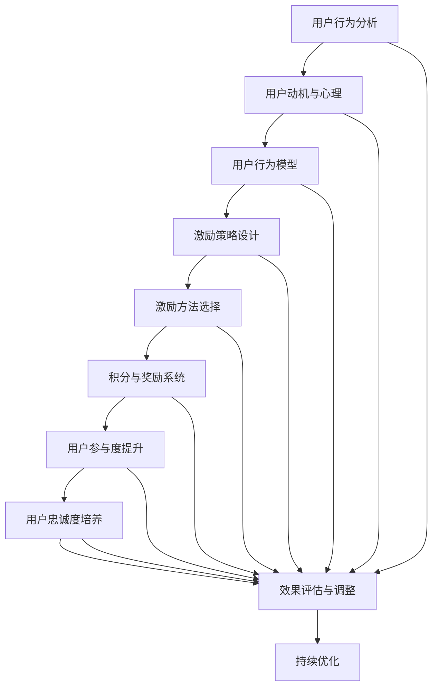

                 

# 文章标题：如何进行有效的用户激励计划

## 关键词：
- 用户激励计划
- 用户行为分析
- 积分与奖励系统
- 用户参与度
- 用户忠诚度

## 摘要：
用户激励计划是提高用户参与度和忠诚度的关键策略。本文从用户激励计划的基础知识入手，详细探讨了用户行为分析、激励策略设计、积分与奖励系统、用户参与度提升和用户忠诚度培养等方面的内容。通过实际案例分析和未来趋势展望，为企业和开发者提供了一套系统的用户激励计划方法论。

---

## 第一部分：用户激励计划的基础知识

### 第1章：用户激励计划的定义与重要性

#### 1.1 用户激励计划的定义

用户激励计划是指企业或组织通过奖励、积分、促销等方式，激发和引导用户行为，提高用户满意度和忠诚度的策略。

#### 1.2 用户激励计划的重要性

用户激励计划对于提高用户参与度和忠诚度具有重要作用。它不仅可以增加用户活跃度，提高用户留存率，还能促进产品口碑传播，提升企业竞争力。

#### 1.3 用户激励计划的目标

用户激励计划的主要目标包括：
1. 提高用户参与度，增强用户互动。
2. 培养用户忠诚度，提升用户满意度和品牌认知度。
3. 促进产品或服务的销售和推广。

### 第2章：理解用户行为

#### 2.1 用户行为分析

用户行为分析是用户激励计划的基础。通过分析用户的行为数据，可以了解用户的需求、偏好和行为模式，为激励策略设计提供依据。

#### 2.2 用户动机与心理

了解用户的动机和心理是设计有效激励策略的关键。用户的行为往往受到内在动机和外在激励的共同驱动。

#### 2.3 用户行为模型构建

基于用户行为分析和动机研究，可以构建用户行为模型，为激励策略的实施提供指导。

### 第3章：用户激励计划的策略与方法

#### 3.1 激励策略设计

激励策略设计是用户激励计划的核心。根据用户行为模型和动机分析，设计符合用户需求的激励策略。

#### 3.2 激励方法选择

激励方法包括奖励、积分、促销等。选择合适的激励方法，可以提高用户参与度和忠诚度。

#### 3.3 用户激励计划的实施步骤

用户激励计划的实施包括以下几个步骤：
1. 制定激励计划目标。
2. 分析用户行为和需求。
3. 设计激励策略。
4. 制定激励方案。
5. 实施和推广。
6. 监控和评估。

---

## 第二部分：用户激励计划的具体实施

### 第4章：用户细分与个性化激励

#### 4.1 用户细分方法

用户细分是根据用户的特征和行为，将用户划分为不同群体，以便制定个性化的激励策略。

#### 4.2 个性化激励策略

个性化激励策略是根据用户细分结果，为不同用户群体提供差异化的激励措施。

#### 4.3 个性化激励案例分析

通过实际案例，分析个性化激励策略的有效性和实施方法。

### 第5章：积分与奖励系统

#### 5.1 积分系统的设计原则

积分系统的设计原则包括积分获取方式、积分兑换规则等。

#### 5.2 奖励系统的构建

奖励系统的构建包括奖励项目设计、奖励规则制定等。

#### 5.3 积分与奖励系统在实际中的应用

通过实际案例，展示积分与奖励系统在提高用户参与度和忠诚度方面的作用。

### 第6章：用户参与度提升

#### 6.1 提升用户参与度的策略

提升用户参与度的策略包括互动活动设计、社区运营等。

#### 6.2 互动活动设计

互动活动设计是提高用户参与度的有效手段。通过设计有趣的互动活动，激发用户参与热情。

#### 6.3 用户参与度评估与优化

用户参与度评估是用户激励计划的重要环节。通过评估用户参与度，优化激励策略，提高激励效果。

### 第7章：用户忠诚度培养

#### 7.1 忠诚度定义与衡量

用户忠诚度是用户对产品或服务的长期依赖和信任。通过衡量用户忠诚度，评估用户激励计划的效果。

#### 7.2 忠诚度提升策略

忠诚度提升策略包括提供优质服务、关注用户反馈等。

#### 7.3 忠诚度案例分析

通过实际案例，分析忠诚度提升策略的有效性和实施方法。

---

## 第三部分：用户激励计划的优化与效果评估

### 第8章：用户激励计划的监控与评估

#### 8.1 激励计划监控指标

激励计划监控指标包括用户参与度、忠诚度、转化率等。

#### 8.2 激励计划效果评估方法

激励计划效果评估方法包括数据分析、用户反馈等。

#### 8.3 激励计划调整与优化

根据激励计划效果评估结果，调整和优化激励策略，提高激励效果。

### 第9章：案例分析：成功与失败的用户激励计划

#### 9.1 成功的用户激励计划案例分析

通过成功案例，分析成功原因和经验教训。

#### 9.2 失败的用户激励计划案例分析

通过失败案例，分析失败原因和改进建议。

#### 9.3 案例启示与总结

总结成功与失败案例的启示，为企业和开发者提供有益的参考。

### 第10章：用户激励计划的未来趋势

#### 10.1 新技术对用户激励计划的影响

新技术的发展对用户激励计划带来新的机遇和挑战。

#### 10.2 用户激励计划的未来发展

探讨用户激励计划的未来发展趋势和前景。

#### 10.3 挑战与机遇

分析用户激励计划面临的挑战和机遇，为企业和开发者提供指导。

---

## 附录

### 附录 A：用户激励计划相关工具与资源

#### A.1 用户行为分析工具

介绍常用的用户行为分析工具及其特点。

#### A.2 积分与奖励系统开发平台

介绍积分与奖励系统开发平台及其应用场景。

#### A.3 用户参与度评估工具

介绍用户参与度评估工具及其功能。

#### A.4 用户激励计划参考资料

推荐用户激励计划相关的书籍、文章和网站资源。

---

# 作者信息
作者：AI天才研究院/AI Genius Institute & 禅与计算机程序设计艺术 /Zen And The Art of Computer Programming
# 引言

在当今数字化时代，用户激励计划已成为企业竞争中的重要策略之一。随着互联网技术的迅猛发展和用户需求的不断变化，如何进行有效的用户激励计划，提高用户参与度和忠诚度，成为企业和开发者亟待解决的关键问题。本文将从用户激励计划的基础知识、具体实施和优化评估三个方面，系统地探讨如何制定和实施有效的用户激励计划。

## 用户激励计划的定义与重要性

### 用户激励计划的定义

用户激励计划是指企业或组织通过奖励、积分、促销等方式，激发和引导用户行为，提高用户满意度和忠诚度的策略。这种计划旨在通过奖励机制，鼓励用户积极参与产品或服务的使用，提升用户的黏性和忠诚度，从而实现企业的长期发展目标。

### 用户激励计划的重要性

用户激励计划在提高用户参与度和忠诚度方面具有重要意义。首先，它能够增加用户的活跃度，使产品或服务的使用频率和时长得到显著提升。其次，激励计划能够增强用户对品牌的认知和信任，提高用户满意度和忠诚度。最后，用户激励计划还可以促进产品或服务的销售和推广，提升企业的市场竞争力。

### 用户激励计划的目标

用户激励计划的主要目标包括以下几个方面：

1. 提高用户参与度：通过奖励机制激发用户的兴趣和参与热情，增加用户在产品或服务中的互动和交流。

2. 培养用户忠诚度：通过持续的激励措施，使用户对产品或服务形成依赖和信任，提高用户的长期使用意愿。

3. 促进产品或服务的销售和推广：通过激励计划，鼓励用户分享和推荐产品或服务，扩大品牌影响力。

4. 提升用户满意度和品牌认知度：通过优质的激励体验，提高用户对产品或服务的满意度，增强品牌形象。

## 用户行为分析

### 用户行为分析的重要性

用户行为分析是用户激励计划的基础。通过分析用户的行为数据，企业可以深入了解用户的需求、偏好和行为模式，从而为激励策略的设计提供科学依据。用户行为分析可以帮助企业识别出潜在的高价值用户群体，制定个性化的激励策略，提高激励效果。

### 用户行为分析的方法

1. 数据收集：通过用户行为跟踪、问卷调查、用户访谈等方式收集用户数据。

2. 数据处理：对收集到的用户数据进行清洗、整合和分析，提取有价值的信息。

3. 用户行为模型构建：基于用户行为数据，构建用户行为模型，预测用户未来的行为趋势。

4. 用户需求分析：通过分析用户行为数据，了解用户的需求和偏好，为激励策略设计提供依据。

### 用户行为分析工具

1. Google Analytics：一款强大的网站分析工具，可以帮助企业追踪和分析用户在网站上的行为。

2. Mixpanel：一款实时用户行为分析工具，适用于移动端和Web端应用。

3. Heap Analytics：一款无需代码即可追踪和分析用户行为的工具，适用于小型企业。

## 用户动机与心理

### 用户动机

用户动机是驱动用户行为的核心因素。了解用户的动机，可以帮助企业设计出更符合用户需求的激励策略。

1. 获得价值：用户希望通过产品或服务获得实际的价值，如功能、便利性等。

2. 社交认同：用户希望通过参与产品或服务，获得社交认同和归属感。

3. 获得奖励：用户希望通过参与激励计划，获得奖励和认可。

4. 学习与成长：用户希望通过参与产品或服务，学习新知识、提升技能。

### 用户心理

用户心理是用户行为的内在驱动。了解用户心理，可以帮助企业更好地设计激励策略。

1. 动机理论：了解用户的内在动机，如需求、欲望、目标等。

2. 情绪理论：了解用户在参与产品或服务过程中的情绪变化，如愉悦、焦虑、失望等。

3. 行为理论：了解用户的决策过程和行为模式，如从众、信任、习惯等。

## 用户行为模型构建

### 用户行为模型的作用

用户行为模型是用户激励计划的核心组成部分。通过构建用户行为模型，企业可以更好地了解用户的行为规律，预测用户的行为趋势，为激励策略设计提供科学依据。

### 用户行为模型构建方法

1. 数据驱动的建模：基于用户行为数据，利用统计学方法和机器学习算法，构建用户行为模型。

2. 概念驱动的建模：基于用户动机和心理理论，构建用户行为模型，如需求驱动模型、动机驱动模型等。

3. 实证研究的建模：通过实证研究，验证用户行为模型的有效性和适用性。

### 用户行为模型的应用

1. 激励策略设计：基于用户行为模型，设计出更符合用户需求的激励策略。

2. 用户细分：根据用户行为特征，将用户划分为不同群体，制定个性化的激励策略。

3. 用户预测：预测用户的未来行为趋势，提前做好激励策略调整。

## 总结

用户激励计划是提高用户参与度和忠诚度的关键策略。通过用户行为分析、用户动机与心理研究，构建用户行为模型，企业可以制定出更有效的激励策略。在实际实施过程中，需要关注用户细分、积分与奖励系统、用户参与度提升和用户忠诚度培养等方面。通过不断优化和调整激励策略，企业可以不断提升用户满意度和品牌认知度，实现长期发展目标。

---

### 文章关键词
- 用户激励计划
- 用户行为分析
- 用户动机
- 用户心理
- 用户参与度
- 用户忠诚度
- 激励策略
- 积分与奖励系统
- 用户细分

### 文章摘要
本文详细探讨了用户激励计划的基础知识、具体实施和优化评估。通过分析用户行为、动机与心理，构建用户行为模型，为企业提供科学依据，以设计出更有效的激励策略。文章涵盖了用户细分、积分与奖励系统、用户参与度提升和用户忠诚度培养等方面的内容，并结合实际案例进行分析，为企业和开发者提供了实用的指导。本文旨在帮助企业提高用户满意度和品牌认知度，实现长期发展目标。

## 背景介绍

随着互联网的普及和数字化进程的加速，用户激励计划逐渐成为企业和开发者提高用户参与度和忠诚度的关键策略。传统的营销手段已经无法满足现代用户的需求，企业需要通过更加个性化、互动化和具有吸引力的方式来吸引和留住用户。用户激励计划正是基于这一背景应运而生，它通过奖励、积分、促销等方式，激发用户的兴趣和参与热情，从而提高用户满意度和忠诚度。

### 用户激励计划的起源与发展

用户激励计划的起源可以追溯到20世纪中期，当时商家和零售商开始使用积分、优惠券和折扣等手段来吸引消费者。随着互联网的发展，用户激励计划逐渐从线下扩展到线上，并得到了进一步的发展和完善。近年来，随着大数据、人工智能和区块链等新技术的应用，用户激励计划变得更加智能和精准，可以更好地满足用户的需求。

### 用户激励计划的现状与挑战

当前，用户激励计划已经成为许多企业和开发者提升用户参与度和忠诚度的重要手段。然而，随着用户需求的多样化和市场竞争的加剧，用户激励计划也面临着一系列挑战：

1. **用户需求多样化**：现代用户需求越来越多样化，单一的激励手段可能无法满足不同用户的需求，企业需要制定更加个性化和差异化的激励策略。

2. **激励效果评估困难**：用户激励计划的效果评估是一个复杂的过程，企业需要通过数据分析等手段来评估激励计划的成效，以便及时调整和优化。

3. **技术实施难度**：用户激励计划涉及到用户数据的收集、处理和分析，需要强大的技术支持，对于许多企业来说，技术实施是一个难题。

4. **用户忠诚度培养**：用户激励计划不仅要提高用户参与度，还要培养用户的忠诚度，这是一个长期的过程，需要持续的投入和策略调整。

### 用户激励计划的现实意义

用户激励计划的现实意义在于：

1. **提高用户满意度和忠诚度**：通过有效的激励策略，提高用户的满意度和忠诚度，从而增强用户对品牌的认同感和依赖性。

2. **促进产品销售和推广**：用户激励计划可以激发用户的购买欲望和分享意愿，从而促进产品的销售和推广。

3. **提升品牌形象**：良好的用户激励计划可以提升企业的品牌形象，增强用户对品牌的认知和信任。

4. **增强市场竞争能力**：通过用户激励计划，企业可以更好地满足用户需求，提高用户满意度，从而在激烈的市场竞争中脱颖而出。

### 用户激励计划的基本原则

为了实现用户激励计划的目标，企业需要遵循以下基本原则：

1. **目标明确**：明确激励计划的目标，确保激励策略与业务目标一致。

2. **用户为中心**：以用户需求为导向，制定符合用户期望的激励策略。

3. **数据驱动**：利用数据分析，了解用户行为和偏好，优化激励策略。

4. **持续优化**：根据用户反馈和数据分析，不断调整和优化激励策略。

5. **公平合理**：确保激励计划的公平性和合理性，避免用户产生不公平感。

通过遵循这些基本原则，企业可以制定出更加有效的用户激励计划，提高用户参与度和忠诚度，实现长期发展目标。

## 核心概念与联系

用户激励计划的成功实施依赖于一系列核心概念之间的紧密联系。为了更好地理解这些概念，我们可以通过Mermaid流程图来展示它们之间的关系架构。



### 用户行为分析

用户行为分析是用户激励计划的基础。通过分析用户的行为数据，企业可以深入了解用户的行为模式、需求和偏好。这包括用户在产品或服务中的互动、停留时间、购买行为等。用户行为分析为激励策略的设计提供了关键数据支持。

### 用户动机与心理

用户动机与心理是驱动用户行为的核心因素。用户的行为不仅仅受到外部激励的影响，还受到内在动机和心理状态的驱动。了解用户的动机和心态，可以帮助企业设计出更加有效的激励策略，以满足用户的需求和期望。

### 用户行为模型

基于用户行为分析和动机研究，用户行为模型可以被构建出来。这个模型可以帮助企业预测用户未来的行为趋势，从而制定出更加精准的激励策略。用户行为模型通常包括用户分群、行为路径、行为周期等关键要素。

### 激励策略设计

激励策略设计是用户激励计划的核心步骤。根据用户行为模型和分析结果，企业可以设计出一系列激励策略，包括奖励、积分、促销等。这些策略需要与用户的动机和心理相匹配，以最大限度地激发用户的兴趣和参与热情。

### 激励方法选择

在确定了激励策略后，企业需要选择具体的激励方法。这些方法可以是积分系统、优惠券、折扣、活动参与等。选择合适的激励方法，需要考虑用户的接受度、成本效益以及激励效果的预期。

### 积分与奖励系统

积分与奖励系统是用户激励计划的重要组成部分。通过积分系统，用户可以在使用产品或服务的过程中积累积分，然后通过奖励系统兑换奖品或优惠。这种系统能够增强用户的参与感和归属感，提高用户的忠诚度。

### 用户参与度提升

用户参与度提升是激励计划的重要目标之一。企业可以通过设计互动活动、社区讨论、用户反馈等方式，增加用户的参与感和互动性。有效的用户参与度提升策略能够增强用户的粘性和忠诚度。

### 用户忠诚度培养

用户忠诚度培养是用户激励计划的长期目标。通过持续的激励措施和优质服务，企业可以培养用户的忠诚度，使其成为品牌的长期支持者。忠诚度培养包括提供个性化服务、关注用户反馈、提供优质内容等。

### 效果评估与调整

效果评估是用户激励计划的重要组成部分。通过监控用户参与度、忠诚度、转化率等关键指标，企业可以评估激励计划的效果，并及时进行调整和优化。有效的效果评估能够确保激励计划的持续改进和优化。

### 持续优化

持续优化是用户激励计划成功的关键。通过不断收集用户反馈、分析数据、调整策略，企业可以确保激励计划始终与用户需求和市场环境保持一致。持续优化能够确保激励计划的长效性和有效性。

通过Mermaid流程图，我们可以清晰地看到这些核心概念之间的相互作用和联系。每个环节都是用户激励计划成功实施的重要组成部分，相互支持和补充，共同推动用户参与度和忠诚度的提升。

### 核心算法原理讲解

用户激励计划的核心算法原理主要涉及用户行为分析和激励策略优化。以下是这些核心算法的详细讲解和伪代码实现。

#### 用户行为分析算法

用户行为分析算法主要用于收集和解析用户在产品或服务中的互动数据，以便更好地理解用户行为模式。

1. **数据收集**：通过API接口或日志收集用户行为数据，包括访问时间、页面浏览、点击事件、购买记录等。

```python
def collect_user_data():
    # 收集用户行为数据
    user_data = fetch_data_from_api()
    return user_data
```

2. **数据预处理**：清洗和格式化收集到的数据，去除无效和重复数据。

```python
def preprocess_data(user_data):
    # 清洗和格式化数据
    clean_data = remove_duplicates_and_invalid_entries(user_data)
    return clean_data
```

3. **行为模式识别**：利用机器学习算法，分析用户行为数据，识别用户行为模式。

```python
from sklearn.cluster import KMeans

def identify_behavior_patterns(clean_data):
    # 识别用户行为模式
    kmeans = KMeans(n_clusters=5)
    clusters = kmeans.fit_predict(clean_data)
    return clusters
```

4. **用户画像构建**：基于行为模式，构建用户画像，为激励策略设计提供依据。

```python
def build_user_profile(clusters, user_data):
    # 构建用户画像
    user_profiles = {
        cluster: [] for cluster in set(clusters)
    }
    for cluster, user in enumerate(clusters):
        user_profiles[cluster].append(user_data[cluster])
    return user_profiles
```

#### 激励策略优化算法

激励策略优化算法主要用于根据用户行为数据和反馈，调整和优化激励策略，以提高用户参与度和忠诚度。

1. **目标函数定义**：定义优化目标函数，通常为最大化用户参与度和忠诚度。

```python
def objective_function(user_profiles, reward_settings):
    # 定义目标函数
    user_involvement = sum([profile['involvement'] for profile in user_profiles])
    customer_loyalty = sum([profile['loyalty'] for profile in user_profiles])
    return user_involvement + customer_loyalty
```

2. **激励策略调整**：基于用户画像和目标函数，调整激励策略。

```python
def adjust_reward_strategy(user_profiles, reward_settings):
    # 调整激励策略
    for profile in user_profiles:
        if profile['behavior'] == 'active':
            reward_settings['reward_rate'] += 0.05
        elif profile['behavior'] == 'inactive':
            reward_settings['reminder_frequency'] += 1
    return reward_settings
```

3. **策略评估**：评估调整后的激励策略效果，进行反馈循环。

```python
def evaluate_strategy-effect(reward_settings, user_profiles):
    # 评估策略效果
    new_involvement = objective_function(user_profiles, reward_settings)
    if new_involvement > old_involvement:
        print("策略优化成功")
    else:
        print("策略优化失败，需要进一步调整")
```

通过上述核心算法，企业可以系统地分析用户行为、设计激励策略、调整优化策略，从而实现用户激励计划的有效实施。

### 数学模型和公式

在用户激励计划的优化过程中，数学模型和公式发挥着至关重要的作用。以下将详细讲解几个关键的数学模型和公式，并举例说明。

#### 1. 多项式回归模型

多项式回归模型用于预测用户的参与度和忠诚度。其公式如下：

$$
\hat{Y} = \beta_0 + \beta_1X_1 + \beta_2X_2 + ... + \beta_nX_n
$$

其中，\( \hat{Y} \) 是预测的用户参与度或忠诚度，\( \beta_0 \) 是常数项，\( \beta_1, \beta_2, ..., \beta_n \) 是系数，\( X_1, X_2, ..., X_n \) 是影响参与度或忠诚度的特征变量。

**例子**：
假设我们有两个特征变量：用户的活跃度和品牌忠诚度，多项式回归模型如下：

$$
\hat{User\ Activity} = \beta_0 + \beta_1(User\ Activity) + \beta_2(Brand\ Loyalty)
$$

通过拟合数据，得到系数为 \( \beta_0 = 10, \beta_1 = 0.5, \beta_2 = 0.3 \)。

#### 2. 贝叶斯优化模型

贝叶斯优化模型用于调整激励策略，以最大化用户参与度和忠诚度。其公式如下：

$$
P(\theta|\data) \propto P(\data|\theta)P(\theta)
$$

其中，\( P(\theta|\data) \) 是后验概率，表示在给定数据的情况下，参数 \( \theta \) 的概率分布；\( P(\data|\theta) \) 是似然函数，表示数据在参数 \( \theta \) 下生成的概率；\( P(\theta) \) 是先验概率，表示参数 \( \theta \) 的初始概率分布。

**例子**：
假设我们希望调整奖励力度 \( \theta \) 来提高用户参与度。先验概率 \( P(\theta) \) 可以设置为均匀分布，似然函数 \( P(\data|\theta) \) 通过用户参与度数据计算。通过贝叶斯优化，可以更新参数 \( \theta \) 的概率分布，从而实现策略的优化。

#### 3. 平均绝对误差（MAE）

平均绝对误差用于评估激励策略的效果。其公式如下：

$$
MAE = \frac{1}{n}\sum_{i=1}^{n}|y_i - \hat{y}_i|
$$

其中，\( y_i \) 是实际的用户参与度或忠诚度，\( \hat{y}_i \) 是预测的用户参与度或忠诚度，\( n \) 是数据样本数量。

**例子**：
假设我们有10个用户的数据，预测的参与度分别为 \( \hat{y}_1, \hat{y}_2, ..., \hat{y}_{10} \)，实际的参与度分别为 \( y_1, y_2, ..., y_{10} \)。计算平均绝对误差如下：

$$
MAE = \frac{1}{10}\sum_{i=1}^{10}|\hat{y}_i - y_i|
$$

通过这些数学模型和公式，企业可以更科学地分析用户行为，优化激励策略，从而提高用户参与度和忠诚度。以上例子展示了如何使用这些模型和公式进行实际计算，为企业提供有力的决策支持。

### 用户激励计划的实施步骤

用户激励计划的实施是一个系统性的过程，需要从以下几个方面进行详细规划和执行：

#### 1. 制定激励计划目标

在实施用户激励计划之前，首先要明确激励计划的目标。这些目标可以包括提高用户参与度、提升用户忠诚度、促进产品销售和推广等。明确的目标有助于指导后续的激励策略设计和实施。

#### 2. 分析用户行为和需求

通过用户行为分析，了解用户的行为模式、需求和偏好。这一步骤包括收集用户数据、进行数据预处理、构建用户行为模型等。通过分析用户行为，可以识别出高价值用户群体和潜在的用户需求。

#### 3. 设计激励策略

根据用户行为分析和需求分析的结果，设计激励策略。激励策略的设计需要考虑以下几个方面：

- **奖励类型**：选择合适的奖励类型，如积分、优惠券、实物奖励等。
- **奖励规则**：制定奖励的获取和兑换规则，确保规则的公平性和合理性。
- **奖励频率**：确定奖励发放的频率，以保证用户持续参与。
- **奖励价值**：确保奖励的价值与用户的投入成正比，以提高用户的满意度和忠诚度。

#### 4. 制定激励方案

在激励策略设计完成后，需要制定具体的激励方案。激励方案包括激励计划的具体细节，如奖励项目、活动安排、时间表等。激励方案应尽可能详细，以确保实施过程中不会出现偏差。

#### 5. 实施和推广

实施激励计划是整个过程中最重要的环节。在这一阶段，企业需要：

- **启动活动**：根据激励方案，启动各种激励活动，确保用户能够及时了解和参与。
- **监控执行**：通过监控系统，实时跟踪激励计划的执行情况，确保各个环节按照计划进行。
- **用户引导**：通过多种渠道，如邮件、短信、推送等，引导用户参与激励活动。

#### 6. 监控和评估

在激励计划实施过程中，需要持续监控和评估激励计划的效果。这包括：

- **用户参与度**：通过数据监控，了解用户参与度的情况，如参与率、互动频率等。
- **用户忠诚度**：评估用户忠诚度，如用户留存率、推荐率等。
- **转化率**：监控激励计划对产品销售和推广的贡献。

#### 7. 调整和优化

根据监控和评估结果，及时调整和优化激励计划。这可能包括调整奖励规则、增加新的奖励项目、优化活动设计等。调整和优化的目的是确保激励计划始终与用户需求和市场环境保持一致，提高激励效果。

#### 8. 持续改进

用户激励计划是一个持续的过程，需要不断收集用户反馈、分析数据、优化策略。通过持续改进，企业可以不断提高用户满意度和忠诚度，实现长期发展目标。

### 实施案例

#### 案例一：电商平台的积分奖励系统

某电商平台通过积分奖励系统激励用户参与购物和分享活动。用户每次购物都能获得相应积分，积分可以兑换优惠券、礼品等。该平台还定期举办促销活动，鼓励用户在特定时间内购买更多商品。通过积分奖励系统，该电商平台成功提高了用户的购物频率和参与度，同时促进了产品销售。

#### 案例二：在线教育平台的用户激励计划

某在线教育平台推出用户激励计划，鼓励用户学习课程并分享学习心得。用户完成课程学习后，可以获得积分，积分可以兑换课程优惠券、学习资料等。此外，平台还设立排行榜，奖励学习进度最快和分享最多的用户。通过这一激励计划，该平台成功提升了用户的参与度和学习积极性，提高了课程完成率和用户满意度。

### 注意事项

在实施用户激励计划时，需要注意以下几点：

- **目标明确**：确保激励计划的目标与业务目标一致，避免分散资源。
- **用户需求导向**：以用户需求为导向，设计符合用户期望的激励策略。
- **公平合理**：确保激励计划的公平性和合理性，避免用户产生不公平感。
- **数据驱动**：利用数据分析，不断优化和调整激励策略。
- **持续改进**：激励计划需要持续改进，以适应用户需求和市场变化。

通过遵循上述实施步骤和注意事项，企业可以制定和实施有效的用户激励计划，提高用户参与度和忠诚度，实现业务目标。

### 用户细分与个性化激励

在用户激励计划中，用户细分与个性化激励是提高用户参与度和忠诚度的关键策略。通过将用户划分为不同的群体，并针对每个群体提供个性化的激励措施，企业可以更有效地满足用户需求，提升用户体验。

#### 用户细分方法

1. **行为细分**：根据用户在平台上的行为数据，如浏览时长、购买频率、互动频率等，将用户划分为不同群体。例如，可以将用户分为“高频用户”、“中频用户”和“低频用户”。

2. **需求细分**：通过分析用户的需求和偏好，将用户划分为不同群体。例如，可以将用户分为“价格敏感型”、“质量优先型”和“体验追求型”。

3. **价值细分**：根据用户对企业的价值，如生命周期价值、购买贡献等，将用户划分为不同群体。例如，可以将用户分为“高价值用户”、“中价值用户”和“低价值用户”。

4. **情境细分**：根据用户所处的情境，如节假日、促销活动等，将用户划分为不同群体。例如，可以将用户分为“促销季用户”、“日常用户”。

#### 个性化激励策略

1. **行为激励**：针对不同行为群体，提供相应的激励措施。例如，对于高频用户，可以提供积分奖励、优惠券等；对于低频用户，可以提供提醒服务、优惠活动等。

2. **需求激励**：根据用户需求，提供个性化的激励措施。例如，对于价格敏感型用户，可以提供折扣优惠；对于质量优先型用户，可以提供高质量的内容或服务。

3. **价值激励**：针对不同价值群体，提供差异化的激励措施。例如，对于高价值用户，可以提供专属客服、定制服务等；对于低价值用户，可以提供入门级优惠或试用机会。

4. **情境激励**：根据不同情境，提供相应的激励措施。例如，在促销活动期间，可以提供限时折扣、赠品等；在节假日，可以提供节日礼品、特别优惠等。

#### 个性化激励案例分析

**案例一：电商平台**

某电商平台通过行为细分和需求细分，将用户划分为“价格敏感型”、“质量优先型”和“体验追求型”三个群体。对于价格敏感型用户，平台提供优惠券、折扣优惠等；对于质量优先型用户，平台提供优质商品推荐、售后服务保证；对于体验追求型用户，平台提供个性化推荐、专属客服等。通过这种个性化激励策略，该电商平台成功提升了用户的满意度和忠诚度。

**案例二：在线教育平台**

某在线教育平台通过价值细分和情境细分，将用户划分为“高价值用户”、“中价值用户”和“新用户”。对于高价值用户，平台提供专属课程、定制服务等；对于中价值用户，平台提供优惠券、学习资料等；对于新用户，平台提供入门课程、免费试读等。此外，在线教育平台还根据不同情境，如节假日、促销活动等，提供相应的激励措施，如限时折扣、赠品等。通过这种个性化激励策略，该在线教育平台成功提高了用户的参与度和留存率。

#### 注意事项

1. **数据准确性**：用户细分和个性化激励依赖于准确的数据分析。确保数据收集和处理过程的准确性，以提供可靠的细分和激励依据。

2. **用户反馈**：定期收集用户反馈，了解用户对激励措施的接受度和满意度，以便及时调整和优化激励策略。

3. **公平性**：在实施个性化激励策略时，要确保激励措施的公平性，避免产生用户不满或歧视。

4. **持续优化**：用户需求和市场环境不断变化，需要持续收集用户数据，分析市场趋势，不断优化个性化激励策略。

通过用户细分和个性化激励，企业可以更好地满足用户需求，提高用户满意度和忠诚度，从而实现业务目标。

### 积分与奖励系统的设计原则

积分与奖励系统是用户激励计划的重要组成部分，其设计原则直接影响到系统的有效性和用户体验。以下将详细探讨积分与奖励系统的设计原则，并提供实际案例进行分析。

#### 1. 设计原则

**公平性**：积分与奖励系统应确保公平性，避免用户产生不公平感。例如，用户在获取积分和兑换奖励时应遵循统一的规则，避免特权用户的存在。

**透明性**：积分与奖励系统的规则和流程应透明，用户可以清楚地了解积分获取和兑换的规则。这有助于提高用户的信任度和参与度。

**灵活性**：积分与奖励系统应具有灵活性，以适应不同的业务需求和用户需求。例如，可以根据用户行为动态调整积分获取和兑换规则。

**吸引力**：积分与奖励系统应设计出具有吸引力的奖励项目，以提高用户的参与兴趣。奖励项目应多样化，包括实物奖励、优惠券、虚拟物品等。

**可持续性**：积分与奖励系统应具有可持续性，能够长期激励用户。通过定期更新奖励项目和规则，保持系统的活力和吸引力。

**用户友好性**：积分与奖励系统的界面设计应简洁易懂，用户可以轻松操作和了解积分状态。此外，系统应提供实时反馈，让用户及时了解积分变动和奖励状态。

#### 2. 实际案例

**案例一：某电商平台的积分系统**

该电商平台通过积分系统激励用户参与购物和分享。用户每次购物都可以获得相应积分，积分可以兑换优惠券、礼品等。以下是其设计原则分析：

- **公平性**：平台对所有用户实行统一的积分规则，确保公平性。
- **透明性**：积分获取和兑换规则清晰明了，用户可以随时查看积分状态。
- **灵活性**：平台根据用户行为动态调整积分获取和兑换规则，如特定时间段的双倍积分活动。
- **吸引力**：提供多种奖励项目，包括优惠券、实物礼品、会员特权等，提高用户参与兴趣。
- **可持续性**：定期更新奖励项目和规则，保持系统活力。

**案例二：某在线教育平台的奖励系统**

该在线教育平台通过奖励系统激励用户学习课程并分享心得。用户完成课程学习后可以获得积分，积分可以兑换课程优惠券、学习资料等。以下是其设计原则分析：

- **公平性**：平台对所有用户实行统一的奖励规则，确保公平性。
- **透明性**：奖励规则和兑换流程透明，用户可以随时了解积分状态和奖励情况。
- **灵活性**：平台根据用户行为和学习进度动态调整奖励规则，如连续学习奖励、分享奖励等。
- **吸引力**：提供多样化的奖励项目，包括课程优惠券、学习资料、社区积分等，提高用户参与兴趣。
- **可持续性**：平台定期更新奖励项目和规则，以保持系统的吸引力。

#### 3. 分析

通过上述案例，我们可以看到积分与奖励系统的设计原则在实际应用中的重要性。公平性和透明性是系统成功的关键，能够提高用户的信任度和参与度。灵活性和吸引力是系统持续激励用户的关键，能够保持用户的兴趣和活跃度。可持续性则确保系统能够长期运行，为企业带来持续的收益。

总之，在设计积分与奖励系统时，企业应遵循上述原则，并结合自身业务特点和用户需求，制定出科学、合理的系统方案。通过有效的积分与奖励系统，企业可以更好地激励用户，提高用户参与度和忠诚度，实现业务目标。

### 奖励系统的构建

奖励系统是用户激励计划的核心组成部分，其构建需要考虑多个关键要素，包括奖励项目设计、奖励规则制定和奖励发放流程等。以下将详细探讨这些要素，并提供实际案例进行说明。

#### 奖励项目设计

奖励项目设计是奖励系统的关键一步。企业需要根据用户需求和业务目标，设计出具有吸引力且能够激发用户兴趣的奖励项目。以下是一些常见的奖励项目设计策略：

1. **实物奖励**：如电子产品、礼品卡、周边产品等，这些奖励通常具有很高的吸引力，能够有效激励用户参与。

2. **虚拟奖励**：如虚拟货币、游戏道具、虚拟商品等，这些奖励可以在数字平台中直接使用，适用于线上业务。

3. **服务奖励**：如免费会员、优先服务、定制服务等，这些奖励能够提供独特的用户体验，增强用户忠诚度。

4. **优惠奖励**：如优惠券、折扣券、免邮券等，这些奖励能够直接降低用户购买成本，提高购买意愿。

5. **体验奖励**：如免费体验活动、参观工厂等，这些奖励能够提供独特体验，增强用户对品牌的认知和好感。

#### 奖励规则制定

奖励规则制定是确保奖励系统公平、透明和可操作性的重要环节。以下是一些关键的奖励规则制定策略：

1. **积分获取规则**：制定明确的积分获取规则，包括积分计算方式、积分有效期、积分兑换门槛等。确保用户清楚如何获取积分和兑换奖励。

2. **奖励发放规则**：制定明确的奖励发放规则，包括奖励发放时间、发放方式、发放范围等。确保奖励的发放过程透明、公正。

3. **兑换规则**：制定详细的兑换规则，包括兑换途径、兑换流程、兑换限额等。确保用户可以轻松兑换奖励，提高用户体验。

4. **反作弊规则**：制定反作弊规则，防止用户恶意刷积分、刷奖励等行为，确保奖励系统的公平性和可持续性。

#### 奖励发放流程

奖励发放流程是奖励系统实施的重要环节，需要确保奖励的及时性和有效性。以下是一些常见的奖励发放流程策略：

1. **积分获取**：用户通过参与平台活动、完成任务、购买产品等方式获取积分。

2. **积分查询**：用户可以随时查询自己的积分状态，了解积分获取和兑换情况。

3. **奖励兑换**：用户根据积分余额和兑换规则，选择合适的奖励项目进行兑换。

4. **奖励发放**：平台根据兑换请求，及时发放奖励，如实物奖励通过物流送达，虚拟奖励通过平台账户发放。

5. **用户反馈**：用户在收到奖励后，可以通过反馈机制提出意见和建议，平台根据反馈进行改进。

#### 实际案例

**案例一：某电商平台的积分奖励系统**

该电商平台通过积分奖励系统激励用户购物和分享。用户每次购物都可以获得相应积分，积分可以兑换优惠券、礼品卡等。以下是其奖励系统构建分析：

- **奖励项目设计**：设计多种奖励项目，包括优惠券、礼品卡、会员特权等，满足不同用户的需求。
- **积分获取规则**：每次购物可以获得积分，积分计算方式明确，用户可以清晰了解积分获取情况。
- **奖励发放规则**：积分达到一定额度后，用户可以兑换奖励，发放过程透明，用户可以实时查询积分状态。
- **兑换规则**：用户可以随时兑换奖励，兑换流程简便，提高用户体验。
- **奖励发放流程**：平台及时发放奖励，用户可以通过物流或平台账户收到奖励。

**案例二：某游戏平台的虚拟奖励系统**

该游戏平台通过虚拟奖励系统激励用户玩游戏和分享游戏体验。用户玩游戏可以获得虚拟货币、游戏道具等。以下是其奖励系统构建分析：

- **奖励项目设计**：设计多种虚拟奖励，包括虚拟货币、游戏道具、特权角色等，提高用户游戏体验。
- **积分获取规则**：用户通过完成任务、参与活动等方式获取虚拟货币，积分获取规则明确。
- **奖励发放规则**：虚拟货币可以通过游戏内商店直接兑换奖励，发放过程透明。
- **兑换规则**：用户可以根据游戏进度和需求兑换不同奖励，兑换流程简便。
- **奖励发放流程**：平台通过游戏内系统及时发放虚拟奖励，用户可以直接在游戏中使用。

通过上述案例，我们可以看到奖励系统的构建需要考虑多个关键要素，包括奖励项目设计、奖励规则制定和奖励发放流程等。企业应根据自身业务特点和用户需求，制定出科学、合理的奖励系统方案，以提高用户参与度和忠诚度。

### 用户参与度提升策略

提升用户参与度是用户激励计划的关键目标之一。通过有效的策略，企业可以激发用户的兴趣和参与热情，从而提高用户的活跃度和忠诚度。以下将详细探讨几种提升用户参与度的策略，并列举实际案例。

#### 1. 互动活动设计

互动活动是提升用户参与度的重要手段。通过设计有趣、有吸引力的互动活动，企业可以增加用户在平台上的互动和交流。

**策略**：
- **主题活动**：根据节日、季节、重大事件等，设计具有针对性的主题活动，如春节抽奖、双十一促销等。
- **竞赛活动**：组织线上竞赛，如知识竞赛、创意大赛等，激发用户的竞争意识和参与热情。
- **社区互动**：构建社区平台，鼓励用户在社区内分享心得、提问、评论，提高用户的互动频率。

**案例**：
- **某电商平台的“双十一”活动**：该平台在双十一期间，推出了一系列互动活动，如购物抽奖、限时秒杀、用户评价晒单等。这些活动吸引了大量用户参与，提高了平台的活跃度和销售额。

#### 2. 用户反馈机制

用户反馈机制是了解用户需求和改进产品服务的重要途径。通过建立有效的用户反馈机制，企业可以及时了解用户的需求和意见，从而优化产品和服务，提高用户满意度。

**策略**：
- **在线反馈表**：提供在线反馈表，方便用户提交意见和建议。
- **客服互动**：通过客服渠道，如电话、邮件、在线聊天等，与用户互动，了解用户反馈。
- **用户调研**：定期进行用户调研，收集用户对产品服务的反馈。

**案例**：
- **某社交平台的用户反馈机制**：该平台设立了在线反馈表和客服渠道，用户可以通过这些途径提交问题和建议。平台会定期分析用户反馈，并根据反馈进行改进。这种做法提高了用户的满意度和忠诚度。

#### 3. 用户激励机制

激励机制是提升用户参与度的重要手段。通过设立激励机制，企业可以激励用户积极参与平台活动，提高用户活跃度。

**策略**：
- **积分奖励**：通过积分系统，激励用户参与平台活动，如签到、评价、分享等。
- **优惠券和折扣**：提供优惠券和折扣，激励用户购买产品或服务。
- **排名和奖励**：设立排名系统，对积极参与的用户进行奖励，如排名奖励、积分奖励等。

**案例**：
- **某运动应用的用户激励机制**：该应用通过积分奖励机制，激励用户每天签到、完成运动目标等。用户可以通过积分兑换优惠券、免费课程等。这种激励机制提高了用户的活跃度和参与度。

#### 4. 用户体验优化

优化用户体验是提升用户参与度的根本途径。通过不断优化产品和服务，提高用户的满意度，企业可以增加用户的参与度和忠诚度。

**策略**：
- **界面设计**：设计简洁、美观的界面，提高用户的使用体验。
- **服务效率**：提高客服响应速度，解决用户问题，提升用户满意度。
- **内容质量**：提供高质量的内容，如教程、资讯等，满足用户需求。

**案例**：
- **某内容平台的用户体验优化**：该平台通过优化界面设计和内容质量，提高了用户的使用体验。用户可以轻松找到所需内容，界面设计美观简洁，提高了用户的满意度和参与度。

#### 总结

通过互动活动设计、用户反馈机制、用户激励机制和用户体验优化等策略，企业可以有效地提升用户参与度。这些策略不仅能够激发用户的兴趣和参与热情，还能提高用户满意度和忠诚度，从而实现业务目标。在实际应用中，企业应根据自身业务特点和用户需求，灵活运用这些策略，制定出科学、合理的用户参与度提升方案。

### 互动活动设计

互动活动设计是提升用户参与度和忠诚度的关键策略之一。通过精心设计的互动活动，企业可以吸引更多用户参与，增强用户对品牌的认同感。以下将详细探讨互动活动设计的原则、常见类型以及如何提高用户互动性。

#### 活动设计原则

1. **目标明确**：明确互动活动的目标，确保活动设计与业务目标一致。目标可以是提高用户参与度、提升品牌知名度、增加销售量等。

2. **用户需求导向**：以用户需求为导向，设计符合用户兴趣和期望的活动。了解用户喜好，才能设计出用户感兴趣的活动。

3. **创新性**：互动活动应具有创新性，能够吸引用户的眼球。新颖的活动形式和内容可以增加用户的参与热情。

4. **参与便捷**：确保活动参与便捷，用户可以轻松参与。提供多种参与方式，如线上、线下、社交平台等，以适应不同用户的需求。

5. **公平性**：活动规则应公平，避免用户产生不公平感。例如，活动奖励应公平分配，避免特权用户的存在。

6. **可持续性**：互动活动应具有可持续性，可以长期激励用户。定期更新活动内容和形式，保持活动的活力。

#### 常见类型

1. **竞赛类活动**：通过竞赛形式，如知识竞赛、技能竞赛等，激发用户的竞争意识和参与热情。

2. **抽奖类活动**：通过抽奖形式，如幸运大转盘、抽奖箱等，提供随机奖励，吸引用户参与。

3. **互动游戏**：通过设计互动游戏，如答题游戏、抽奖游戏等，增加用户的趣味性和参与感。

4. **社区活动**：在社交平台或社区中，组织用户讨论、分享、问答等活动，增强用户互动和社区氛围。

5. **线下活动**：组织线下活动，如讲座、聚会、展览等，吸引更多用户参与，提高用户对品牌的认知。

#### 提高用户互动性

1. **激励措施**：提供丰富的激励措施，如积分、优惠券、实物奖励等，提高用户参与积极性。

2. **互动环节设计**：在活动中设计多个互动环节，如问答、投票、讨论等，增强用户的参与感和互动性。

3. **用户反馈**：及时收集用户反馈，了解用户需求和意见，优化活动设计和执行。

4. **用户引导**：通过多种渠道，如推送通知、邮件、社交媒体等，引导用户参与活动，提高活动参与率。

5. **互动体验**：优化活动界面和流程，提供良好的互动体验，使用户能够轻松参与和完成任务。

#### 实际案例

**案例一：某电商平台的“双十一”购物狂欢节**

该电商平台通过“双十一”购物狂欢节，吸引了大量用户参与。活动期间，平台推出了抽奖活动、限时秒杀、用户评价晒单等多种互动活动。这些活动不仅提高了用户的参与度，还促进了销售增长。

**案例二：某运动应用的用户互动挑战**

该运动应用通过用户互动挑战活动，鼓励用户每天坚持运动。用户可以参与每日挑战，如完成一定公里数、达到指定运动时长等。活动期间，平台还会发布实时排名，奖励前几名的用户。这种活动设计提高了用户的参与度和运动积极性。

#### 总结

互动活动设计在提升用户参与度和忠诚度方面具有重要意义。通过明确活动目标、以用户需求为导向、创新活动形式和提高互动体验，企业可以设计出有效的互动活动。在实际应用中，企业应根据自身业务特点和用户需求，灵活运用这些策略，制定出科学、合理的互动活动方案。

### 用户参与度评估与优化

用户参与度评估是用户激励计划的重要环节，通过科学有效的评估方法，企业可以了解用户参与度的现状，发现潜在问题，并制定相应的优化策略。以下将详细探讨用户参与度的评估方法、优化策略以及实际案例。

#### 用户参与度评估方法

1. **指标体系**：建立全面的用户参与度指标体系，包括用户活跃度、互动频率、留存率、转化率等。这些指标可以全面反映用户参与度的各个方面。

2. **数据分析**：利用数据分析工具，如Google Analytics、Mixpanel等，对用户行为数据进行分析，了解用户的参与模式和趋势。

3. **用户调查**：通过用户调查问卷，收集用户对激励计划的意见和建议，了解用户的真实体验和满意度。

4. **用户访谈**：与用户进行一对一访谈，深入了解用户的参与动机、行为模式和需求。

5. **A/B测试**：通过A/B测试，比较不同激励策略的效果，找出最优方案。

#### 用户参与度优化策略

1. **数据驱动**：根据用户参与度评估结果，采用数据驱动的优化策略，持续改进激励计划。例如，根据用户活跃度数据，调整奖励频率和奖励力度。

2. **个性化定制**：根据用户需求和偏好，提供个性化的激励措施，提高用户参与度。例如，针对不同用户群体，设计差异化的互动活动和奖励方案。

3. **互动体验优化**：优化互动活动的界面和流程，提供良好的用户体验。例如，简化参与流程，增加互动环节，提高用户互动体验。

4. **持续反馈**：建立持续的反馈机制，及时收集用户意见和建议，优化激励计划。通过用户调查、访谈等方式，了解用户对激励计划的反馈，及时调整策略。

5. **跨渠道整合**：整合线上线下渠道，提供统一的用户参与体验。例如，在线上活动中引入线下互动环节，提高用户的整体参与度。

#### 实际案例

**案例一：某电商平台的用户参与度优化**

该电商平台通过分析用户活跃度和互动频率数据，发现用户在周末的参与度较低。为提高周末用户参与度，平台推出了一系列周末特别活动，如限时折扣、抽奖活动等。同时，平台还通过推送通知和邮件提醒，引导用户参与周末活动。这些策略显著提高了周末用户的参与度。

**案例二：某运动应用的用户参与度优化**

该运动应用通过用户调查和访谈，发现用户对积分兑换的奖品不感兴趣。为了优化用户参与度，平台调整了积分兑换规则，增加了用户更感兴趣的奖品选项，如免费课程、健身装备等。同时，平台还通过A/B测试，不断优化积分获取和兑换流程，提高用户参与体验。这些优化策略显著提升了用户的参与度和满意度。

#### 总结

用户参与度评估与优化是用户激励计划的重要组成部分。通过建立全面的评估方法，采用数据驱动的优化策略，企业可以持续提升用户参与度，提高用户满意度和忠诚度。在实际应用中，企业应根据自身业务特点和用户需求，灵活运用这些评估和优化策略，制定出科学、合理的用户参与度提升方案。

### 用户忠诚度培养

用户忠诚度是用户激励计划的重要目标之一。培养用户忠诚度不仅有助于提高用户满意度和品牌认知度，还能为企业带来长期收益。以下将详细探讨用户忠诚度的定义与衡量、培养策略及实际案例。

#### 用户忠诚度的定义与衡量

1. **定义**：用户忠诚度是指用户对产品或服务的长期依赖和信任，表现为用户在未来的使用意愿、重复购买行为和推荐行为。

2. **衡量指标**：用户忠诚度可以通过以下指标进行衡量：
   - **重复购买率**：用户在一定时间内重复购买产品的频率。
   - **留存率**：用户在一段时间内持续使用产品或服务的比例。
   - **推荐率**：用户向他人推荐产品或服务的意愿和实际行为。
   - **客户满意度**：用户对产品或服务的满意程度。
   - **品牌忠诚度**：用户对品牌的信任和忠诚程度。

#### 用户忠诚度培养策略

1. **优质服务**：提供优质的客户服务，包括快速响应、解决问题和个性化服务。优质服务能够增强用户的满意度和信任感，从而培养用户忠诚度。

2. **个性化体验**：根据用户需求和偏好，提供个性化的产品和服务。例如，推荐个性化内容、定制化产品等。个性化体验能够提高用户的参与感和忠诚度。

3. **持续激励**：通过持续的激励措施，如积分奖励、优惠券、会员特权等，激励用户持续参与和使用产品。持续的激励能够增强用户的黏性和忠诚度。

4. **互动与沟通**：建立有效的互动与沟通机制，如用户社区、在线客服、用户调研等，与用户保持密切联系。互动与沟通能够增强用户对品牌的认同感和归属感。

5. **品牌价值观传递**：传递与用户价值观相符的品牌理念，建立品牌与用户之间的共同价值观。这有助于增强用户的忠诚度和品牌认同感。

6. **用户参与**：鼓励用户参与产品开发和品牌推广，如用户调研、产品测试、品牌活动等。用户参与能够提高用户的归属感和忠诚度。

#### 实际案例

**案例一：某电商平台的会员忠诚度培养**

该电商平台通过会员制度培养用户忠诚度。会员享有多种特权，如积分兑换、会员专享优惠、优先客服等。此外，平台定期举办会员专属活动，如会员日、生日特惠等。通过这些措施，平台成功提高了会员的忠诚度和重复购买率。

**案例二：某在线教育平台的用户忠诚度培养**

该在线教育平台通过一系列措施培养用户忠诚度。平台提供优质的课程内容，并定期更新课程。此外，平台还建立用户社区，鼓励用户在社区内互动和分享学习心得。平台还通过定期用户调研，了解用户需求，优化课程和服务。这些措施有效提高了用户的满意度和忠诚度。

#### 总结

用户忠诚度培养是用户激励计划的重要组成部分。通过提供优质服务、个性化体验、持续激励、互动与沟通、品牌价值观传递和用户参与等策略，企业可以培养用户的忠诚度，提高用户满意度和品牌认知度。在实际应用中，企业应根据自身业务特点和用户需求，灵活运用这些策略，制定出科学、合理的用户忠诚度培养方案。

### 用户忠诚度提升策略

提升用户忠诚度是用户激励计划中的关键环节。通过一系列有效的策略，企业可以增强用户对品牌的依赖和信任，从而提高用户满意度和市场份额。以下将详细探讨提升用户忠诚度的几种策略，并结合实际案例进行分析。

#### 1. 提供优质服务

优质的服务是提升用户忠诚度的基石。企业需要关注用户在使用产品或服务过程中的每一个细节，确保用户得到及时、高效和专业的服务。

**策略**：
- **快速响应**：建立快速响应机制，如24/7在线客服、紧急问题快速处理等。
- **解决问题**：积极解决用户遇到的问题，确保用户问题得到有效解决。
- **个性化服务**：根据用户的历史数据和需求，提供个性化的服务和建议。

**案例**：
- **某电商平台的客户服务**：该平台通过建立多渠道的客户服务系统，包括在线客服、电话客服和邮件支持，确保用户问题能够快速解决。同时，平台还通过大数据分析，为用户提供个性化的购物建议和推荐，提升了用户的满意度。

#### 2. 定期互动和反馈

与用户的定期互动和反馈是建立信任和忠诚度的关键。通过定期沟通，企业可以了解用户的真实需求和意见，不断优化产品和服务。

**策略**：
- **用户调研**：定期开展用户满意度调查，收集用户对产品或服务的反馈。
- **互动活动**：举办定期的互动活动，如在线问答、用户论坛等，增加用户参与感。
- **个性化沟通**：根据用户偏好，通过邮件、短信等渠道，与用户保持定期沟通。

**案例**：
- **某金融科技平台的用户互动**：该平台定期通过电子邮件发送用户满意度调查问卷，收集用户对金融产品和服务反馈。同时，平台还通过在线问答环节，解答用户关于金融产品的疑问。通过这些互动活动，平台成功提升了用户的满意度和忠诚度。

#### 3. 个性化奖励和优惠

提供个性化奖励和优惠是激励用户持续参与和提升忠诚度的有效策略。通过差异化的奖励和优惠，企业可以满足不同用户的需求，增强用户的黏性。

**策略**：
- **积分奖励**：根据用户的使用行为和消费金额，提供积分奖励，用户可以兑换商品或服务。
- **专属优惠**：为高频用户或长期用户提供专属优惠，如折扣券、免邮券等。
- **会员权益**：建立会员制度，为会员提供更丰富的奖励和特权，如积分加速、优先服务、专享活动等。

**案例**：
- **某连锁餐饮企业的会员计划**：该企业通过会员制度，为会员提供积分奖励和专属优惠。会员每次消费都可以获得积分，积分可以兑换免费餐券或礼品。此外，会员还可以享受生日优惠、会员专属活动等。这些措施有效提升了会员的忠诚度。

#### 4. 增强用户参与感

增强用户参与感可以培养用户的归属感和忠诚度。通过让用户参与到产品开发、品牌推广等过程中，企业可以提升用户的参与度和忠诚度。

**策略**：
- **用户调研**：邀请用户参与产品测试和市场调研，收集用户反馈。
- **共创活动**：举办用户共创活动，鼓励用户提出建议和创意，参与到产品开发中。
- **用户社区**：建立用户社区，提供平台供用户分享经验和交流想法。

**案例**：
- **某科技公司的用户共创项目**：该公司在推出新产品前，通过用户共创活动，邀请用户参与产品设计和功能测试。用户可以提出建议和反馈，公司的产品团队会根据用户反馈进行优化。这种参与感提升了用户的忠诚度和品牌的认同感。

#### 总结

提升用户忠诚度需要从多个方面进行策略设计。通过提供优质服务、定期互动和反馈、个性化奖励和优惠以及增强用户参与感等策略，企业可以有效地提升用户忠诚度，提高用户满意度和市场份额。在实际操作中，企业应根据自身业务特点和用户需求，灵活运用这些策略，制定出科学、合理的用户忠诚度提升方案。

### 成功的用户激励计划案例分析

在用户激励计划的实施过程中，许多企业通过成功案例证明了其有效性和重要性。以下将分析几个具有代表性的成功案例，探讨其成功原因和实施效果。

#### 案例一：某电商平台的积分奖励系统

该电商平台通过积分奖励系统，极大地提高了用户的参与度和忠诚度。系统设计简洁明了，用户每次购物都能获得相应的积分，积分可以兑换优惠券、礼品等。以下是该案例的成功原因：

1. **公平性和透明性**：积分获取和兑换规则清晰明确，用户可以清楚地了解积分获取方式和兑换条件，增强了用户对系统的信任感。

2. **灵活性和多样性**：平台提供了多种奖励项目，包括优惠券、实物奖励、会员特权等，满足了不同用户的需求。

3. **激励效果显著**：通过积分奖励，用户在购物过程中获得了实际的价值，提高了购物体验和满意度。

4. **用户参与度提升**：积分奖励系统激发了用户的购物热情，用户在参与过程中体验到了成就感，从而提高了用户的活跃度和忠诚度。

**实施效果**：该平台的用户参与度和忠诚度显著提升，购物频率和用户留存率均有所增加，销售额也实现了显著增长。

#### 案例二：某在线教育平台的用户激励计划

某在线教育平台通过一系列用户激励计划，提高了用户的学习积极性和平台活跃度。以下是该案例的成功原因：

1. **目标明确**：平台明确了激励计划的目标，即提高用户的学习参与度和平台活跃度。

2. **个性化激励**：根据用户的学习进度和参与度，平台为不同的用户群体提供了个性化的激励措施，如学习积分、课程优惠券等。

3. **互动活动丰富**：平台举办了多种互动活动，如知识竞赛、学习分享会等，增加了用户的互动机会和参与感。

4. **用户反馈及时**：平台建立了用户反馈机制，及时收集用户意见和建议，并根据反馈进行改进。

**实施效果**：通过用户激励计划，平台的学习参与度和用户活跃度显著提升，用户留存率和满意度也得到提高，平台整体运营效果得到优化。

#### 案例三：某运动应用的积分挑战活动

某运动应用通过积分挑战活动，鼓励用户坚持运动，提升了用户的参与度和健康意识。以下是该案例的成功原因：

1. **趣味性**：积分挑战活动设置了有趣的游戏规则和奖励机制，吸引了大量用户参与。

2. **社交互动**：活动设置了排行榜，用户可以查看自己和其他用户的运动数据，增加了互动和竞争的乐趣。

3. **持续激励**：通过定期更新挑战内容和奖励机制，保持了用户的参与兴趣和动力。

4. **健康意识提升**：通过积分挑战，用户不仅提高了运动频率，还增强了健康意识。

**实施效果**：通过积分挑战活动，用户的运动频率和参与度显著提升，平台的用户留存率和活跃度也有所增加，用户对平台的好评度和忠诚度得到提升。

### 总结

以上成功案例表明，用户激励计划在提高用户参与度和忠诚度方面具有显著作用。通过公平透明的激励机制、个性化激励措施、丰富多样的互动活动以及及时的用户反馈，企业可以设计出有效的用户激励计划，提升用户满意度和品牌认知度。在实际操作中，企业应根据自身业务特点和用户需求，灵活运用这些成功经验，制定出科学、合理的用户激励计划。

### 失败的用户激励计划案例分析

尽管用户激励计划在许多情况下都能取得显著成效，但也有一些案例由于设计不合理或执行不当而失败。以下将分析几个典型的失败案例，探讨其失败原因及教训。

#### 案例一：某电商平台的过度激励

某电商平台在推出新用户激励计划时，设置了高额的优惠券和折扣奖励，以吸引新用户注册和使用。然而，这一策略在实施过程中却遭遇了失败。

1. **激励过高导致成本失控**：为了吸引新用户，平台提供了过高的优惠券和折扣，导致营销成本大幅上升，超出预算。

2. **用户依赖性增强**：由于优惠力度过大，用户逐渐形成了依赖心理，即使优惠券到期后，购买意愿依然不强。

3. **用户留存率下降**：过度激励导致用户对平台的忠诚度降低，用户在享受完优惠后，便转向其他平台。

**教训**：企业在设计激励计划时，需充分考虑成本和用户的心理，避免过度激励导致成本失控和用户依赖性增强。

#### 案例二：某社交平台的奖励失衡

某社交平台推出积分奖励计划，鼓励用户在平台内活跃互动。然而，由于奖励分配失衡，导致用户不满和参与度下降。

1. **奖励分配不公**：平台对活跃用户的奖励过少，而一些边缘用户却获得了过多的奖励，导致用户感到不公平。

2. **用户流失**：由于奖励分配不公，一些活跃用户感到被忽视，从而选择离开平台。

3. **社区氛围恶化**：不公的奖励机制导致社区氛围恶化，用户之间的互动减少，平台活跃度下降。

**教训**：激励计划的奖励分配应公平合理，确保所有用户都能感受到公平对待，以维护社区氛围和用户忠诚度。

#### 案例三：某健身应用的激励不足

某健身应用在推出积分系统时，未能充分激励用户参与运动。结果，许多用户在完成目标后，对积分奖励感到失望，参与度明显下降。

1. **奖励力度不足**：平台提供的积分奖励不足以激励用户，用户在完成任务后感到无趣。

2. **用户反馈缺失**：平台未及时收集用户对奖励机制的反馈，导致奖励方案未能满足用户需求。

3. **用户流失风险**：由于奖励机制不足，用户参与度下降，存在用户流失的风险。

**教训**：企业在设计激励计划时，应充分了解用户需求，确保奖励力度足够，以提高用户参与度和忠诚度。

### 总结

通过以上失败案例，我们可以看到，失败的用户激励计划往往源于激励过度、奖励分配失衡、激励不足等问题。这些案例提醒我们，在设计和实施用户激励计划时，需充分考虑成本、用户心理和公平性，确保激励计划的合理性和有效性。同时，及时收集用户反馈并进行调整，是避免失败的关键。

### 案例启示与总结

通过分析成功与失败的用户激励计划案例，我们可以得出以下启示和总结：

#### 成功案例的启示

1. **公平性和透明性**：成功的激励计划通常具有明确的规则和公平的奖励机制，确保用户能够清晰地了解积分获取和奖励兑换过程。

2. **个性化与多样化**：成功的激励计划会根据用户需求和偏好，提供个性化的奖励项目和多样化的奖励形式，以满足不同用户的需求。

3. **用户参与感**：成功的激励计划通过互动活动和用户参与，增强了用户的参与感和归属感，提高了用户忠诚度。

4. **数据驱动**：成功的激励计划通过数据分析，了解用户行为和需求，不断优化激励策略，确保激励计划的有效性。

#### 失败案例的教训

1. **成本控制**：过度激励会导致成本失控，影响企业盈利。企业需在激励力度和成本之间找到平衡。

2. **公平性**：奖励分配不公会损害用户满意度和忠诚度。企业应确保奖励机制的公平性，避免用户产生不公平感。

3. **用户需求理解**：忽视用户需求和反馈是导致激励计划失败的主要原因。企业需深入了解用户需求，及时调整激励策略。

#### 总结

用户激励计划在提高用户参与度和忠诚度方面具有重要作用。成功的激励计划依赖于公平透明的规则、个性化多样化的奖励、用户参与感和数据驱动的优化。企业应在设计和实施用户激励计划时，充分考虑成本、公平性和用户需求，确保激励计划的有效性和可持续性。同时，通过不断收集用户反馈和数据分析，优化激励策略，以实现长期发展目标。

### 用户激励计划的未来趋势

随着技术的不断进步和用户需求的日益变化，用户激励计划也在不断演变和升级。以下将探讨用户激励计划的未来趋势，以及新技术对其可能产生的影响。

#### 1. 数据驱动的个性化激励

随着大数据和人工智能技术的发展，用户激励计划将更加依赖数据分析和用户行为预测。企业可以通过分析海量数据，了解用户的个性化需求和行为模式，从而提供更加精准的激励措施。例如，通过个性化推荐系统，为不同用户群体提供定制化的奖励方案。

#### 2. 区块链技术的应用

区块链技术的引入将使用户激励计划更加透明和可验证。通过区块链，企业可以确保积分和奖励的发放和兑换过程透明、不可篡改。此外，区块链技术还可以用于建立去中心化的积分和奖励系统，减少对中心化平台的依赖，提高系统的安全性和可靠性。

#### 3. 虚拟现实和增强现实的融合

虚拟现实（VR）和增强现实（AR）技术的进步将为用户激励计划带来新的可能性。通过VR和AR技术，企业可以创造更加沉浸式的互动体验，激发用户的参与热情。例如，用户可以在虚拟环境中参与互动游戏，通过完成任务获得奖励。

#### 4. 社交化和社区化的趋势

社交媒体和用户社区的发展将使用户激励计划更加社交化和社区化。企业可以通过社交媒体平台和用户社区，鼓励用户之间的互动和分享，从而增强用户参与度和忠诚度。例如，通过用户社区的活动和排行榜，激励用户积极参与和分享经验。

#### 5. 可持续性和环境意识的融合

随着环保意识的提高，用户激励计划将更加注重可持续性和环境意识。企业可以通过奖励环保行为，如减少碳排放、回收废弃物等，鼓励用户参与到环境保护中来。此外，企业还可以通过绿色产品和服务的推广，提升品牌形象。

#### 挑战与机遇

用户激励计划的未来发展趋势也伴随着一系列挑战和机遇：

- **数据隐私与安全**：随着数据量的增加，数据隐私和安全问题将成为重要挑战。企业需确保用户数据的安全和隐私，遵守相关法律法规。
- **技术实施成本**：新技术的发展和应用将带来较高的技术实施成本。企业需在技术投资和效益之间找到平衡，确保激励计划的可持续性。
- **用户需求的多样性**：用户需求的多样性和变化速度将不断加大，企业需不断调整和优化激励策略，以满足不同用户的需求。
- **可持续性**：激励计划的长期可持续性是企业面临的重要挑战。企业需通过不断创新和优化，确保激励计划能够长期有效。

总之，用户激励计划的未来将充满机遇和挑战。通过利用新技术和深入了解用户需求，企业可以设计出更加有效和可持续的用户激励计划，提升用户参与度和忠诚度，实现长期发展目标。

### 附录

#### 附录 A：用户激励计划相关工具与资源

**A.1 用户行为分析工具**

- **Google Analytics**：一款强大的网站分析工具，提供详细的用户行为数据，帮助企业和开发者深入了解用户行为。
- **Mixpanel**：一款适用于移动端和Web端的应用分析工具，提供实时用户行为追踪和分析功能。
- **Heap Analytics**：一款无需代码即可追踪和分析用户行为的工具，特别适用于小型企业和初创公司。

**A.2 积分与奖励系统开发平台**

- **Apptentive**：一款提供用户反馈和积分奖励系统的开发平台，帮助企业构建个性化的用户激励机制。
- **Kahuna**：一款提供全面用户激励和推送通知服务的平台，帮助企业提高用户参与度和忠诚度。
- **Gamify**：一款提供基于游戏的积分和奖励系统开发平台，适用于各种类型的应用和网站。

**A.3 用户参与度评估工具**

- **Qualaroo**：一款用户调研工具，帮助企业通过问卷和弹窗收集用户反馈，评估用户参与度。
- **Userfeel**：一款提供用户反馈视频的工具，帮助企业了解用户对产品或服务的真实感受。
- **Crazy Egg**：一款热图分析工具，帮助企业和开发者了解用户的点击和浏览行为，优化用户体验。

**A.4 用户激励计划参考资料**

- **《用户激励计划：如何设计有效的用户参与和忠诚度策略》**：一本关于用户激励计划的经典教材，详细介绍了用户激励计划的原理和实践方法。
- **《数字营销实战手册：如何利用数据驱动用户激励计划》**：一本关于数字营销和用户激励计划的实用指南，涵盖了数据分析、用户行为分析和激励策略设计等方面的内容。
- **《激励用户：如何通过游戏化提升用户体验和忠诚度》**：一本关于游戏化设计和用户激励的书籍，介绍了如何通过游戏化手段提高用户参与度和忠诚度。

以上工具和资源为企业和开发者提供了丰富的选择，帮助他们在设计和实施用户激励计划时，更好地了解用户行为、评估参与度、优化激励策略。通过这些工具和资源，企业可以更加科学、有效地提升用户满意度和忠诚度，实现业务目标。

