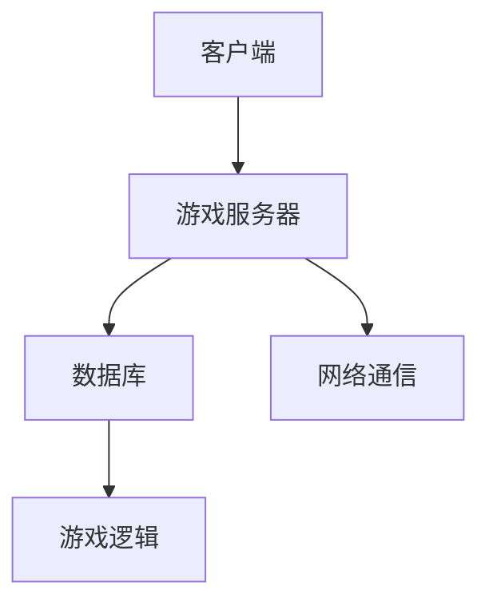

                 

### 文章标题：字节游戏2024校招游戏服务器开发面试指南

### 关键词：字节游戏，校招，游戏服务器，面试指南，开发，技术

### 摘要：
本文将针对2024年字节游戏的校招，为广大求职者提供一份全面的游戏服务器开发面试指南。我们将详细探讨游戏服务器开发的基础知识、核心技术、实战案例及面试技巧，旨在帮助读者在面试中脱颖而出，成功斩获字节游戏的offer。

### 《字节游戏2024校招游戏服务器开发面试指南》目录大纲

#### 第一部分：游戏服务器开发基础知识

## 第1章：游戏服务器开发概述

### 1.1 游戏服务器的作用和重要性
### 1.2 游戏服务器架构概述
### 1.3 游戏服务器开发流程

## 第2章：游戏服务器编程基础

### 2.1 常用的游戏服务器编程语言
### 2.2 数据结构与算法在游戏服务器中的应用
### 2.3 网络编程基础

## 第3章：网络协议与通信

### 3.1 TCP/IP 协议简介
### 3.2 UDP 协议及其应用
### 3.3 HTTP 协议及在游戏服务器中的应用

## 第4章：游戏服务器性能优化

### 4.1 服务器性能优化的重要性
### 4.2 常用的性能优化方法
### 4.3 性能测试与调优

## 第5章：游戏服务器安全性

### 5.1 游戏服务器安全性的重要性
### 5.2 常见的安全问题与防护措施
### 5.3 游戏服务器安全架构设计

## 第6章：分布式游戏服务器架构

### 6.1 分布式游戏服务器概述
### 6.2 分布式架构的优势和挑战
### 6.3 分布式游戏服务器的实现方法

## 第7章：游戏服务器项目管理

### 7.1 游戏服务器项目的开发流程
### 7.2 团队协作与沟通
### 7.3 项目风险管理

#### 第二部分：游戏服务器开发核心技术

## 第8章：游戏服务器架构设计

### 8.1 游戏服务器架构设计原则
### 8.2 常见的游戏服务器架构模式
### 8.3 架构设计实例分析

## 第9章：网络编程实战

### 9.1 客户端与服务器的通信机制
### 9.2 实战案例：聊天室服务器开发
### 9.3 实战案例：多人在线游戏服务器开发

## 第10章：数据库设计与优化

### 10.1 游戏服务器中的数据库应用
### 10.2 数据库设计原则
### 10.3 数据库优化策略

## 第11章：游戏服务器性能测试与监控

### 11.1 性能测试的目的和方法
### 11.2 常用的性能监控工具
### 11.3 性能监控案例分析

## 第12章：游戏服务器安全性实战

### 12.1 常见的安全攻击与防范
### 12.2 安全审计与测试
### 12.3 安全事件响应

#### 第三部分：实战案例与面试技巧

## 第13章：字节游戏服务器开发实战案例

### 13.1 案例背景介绍
### 13.2 案例开发过程
### 13.3 案例总结与经验分享

## 第14章：游戏服务器开发面试技巧

### 14.1 面试前的准备工作
### 14.2 面试中常见问题及回答策略
### 14.3 面试后的反思与总结

#### 附录

## 附录A：游戏服务器开发常用工具与资源

### A.1 编程语言与开发工具
### A.2 开源框架与库
### A.3 学习资源推荐

## 附录B：参考文献

### B.1 基础理论
### B.2 技术实战
### B.3 面试准备

### 第1章：游戏服务器开发概述

#### 1.1 游戏服务器的作用和重要性

**背景介绍：**
游戏服务器是网络游戏的核心组成部分，它负责处理客户端发送的请求，维护游戏的运行状态，并实时将游戏结果反馈给客户端。随着游戏行业的快速发展，游戏服务器的重要性愈发凸显。在字节游戏的校招中，掌握游戏服务器开发的知识和技能将是求职者脱颖而出的关键。

**核心概念与联系：**
- **游戏服务器：** 负责游戏逻辑处理、数据存储和客户端通信的核心模块。
- **客户端：** 游戏用户操作的界面，负责与服务器进行数据交互。
- **游戏逻辑：** 定义游戏的规则和流程，由服务器端处理。

**架构 Mermaid 流程图：**


**核心算法原理讲解：**
游戏服务器的主要工作包括：
1. **数据处理：** 收集并处理来自客户端的输入数据，如玩家的动作、状态等。
2. **逻辑处理：** 根据游戏逻辑进行运算，决定游戏状态的变化。
3. **状态同步：** 将处理后的游戏状态反馈给客户端，保持客户端与服务器的数据一致性。

**数学模型和公式：**
游戏服务器通常会采用以下数学模型来处理游戏逻辑：
$$
\text{游戏状态} = f(\text{玩家输入}, \text{游戏规则}, \text{游戏环境})
$$
其中，$f$ 为游戏逻辑函数。

**举例说明：**
假设一个简单的坦克大战游戏，玩家可以控制坦克移动和射击。服务器需要接收玩家的输入，更新坦克的位置和状态，并计算子弹的轨迹，最终将游戏状态同步回客户端。

**最佳实践 tips：**
1. **高并发处理：** 设计服务器时，要考虑到高并发情况，确保服务器性能稳定。
2. **安全防护：** 游戏服务器面临各种安全风险，如DDoS攻击、数据窃取等，需要进行有效防护。

#### 1.2 游戏服务器架构概述

**核心概念与联系：**
- **单机架构：** 所有游戏逻辑和数据处理集中在一台服务器上，适用于小型游戏。
- **分布式架构：** 将游戏逻辑和数据分布在多台服务器上，提高性能和可靠性。
- **微服务架构：** 将游戏服务器拆分为多个微服务，每个微服务负责不同的功能模块。

**架构设计原则：**
- **模块化：** 将服务器功能模块化，便于开发、测试和维护。
- **高可用性：** 确保服务器在遭受攻击或故障时能够快速恢复。
- **可扩展性：** 考虑未来的扩展需求，如增加服务器节点、支持更多玩家等。
- **性能优化：** 优化服务器性能，提高响应速度和并发处理能力。

**常见游戏服务器架构模式：**
1. **单机模式：** 适用于小型游戏项目，所有服务器功能集中在一台服务器上。
2. **分布式模式：** 将服务器功能分布在多台服务器上，提高处理能力和负载均衡。
3. **微服务模式：** 将服务器功能拆分为多个微服务，每个微服务负责不同的功能模块，适用于复杂大型游戏项目。

**最佳实践 tips：**
1. **选择合适的架构模式：** 根据游戏项目的规模和需求，选择合适的游戏服务器架构模式。
2. **确保架构的可扩展性：** 在架构设计时，要考虑未来的扩展需求，如增加服务器节点、支持更多玩家等。

**小结：**
游戏服务器是网络游戏的核心组成部分，其架构设计直接影响到游戏的性能、稳定性和扩展性。了解并掌握不同类型的游戏服务器架构模式，有助于我们在实际项目中做出最优的选择。

#### 1.3 游戏服务器开发流程

**核心概念与联系：**
- **需求分析：** 确定游戏服务器需要实现的功能和性能指标。
- **设计阶段：** 设计游戏服务器的架构和模块，制定详细的开发计划。
- **开发阶段：** 编写代码，实现游戏服务器的各个功能模块。
- **测试阶段：** 对游戏服务器进行功能测试、性能测试和安全测试，确保其稳定可靠。
- **部署阶段：** 将游戏服务器部署到生产环境，进行实际运行。

**开发流程步骤：**
1. **需求分析：** 确定游戏服务器的功能需求和性能要求，如玩家数量、并发请求、数据处理速度等。
2. **架构设计：** 根据需求分析，设计游戏服务器的架构和模块，选择合适的编程语言和框架。
3. **编码实现：** 根据设计文档，编写游戏服务器的代码，实现各个功能模块。
4. **单元测试：** 对每个功能模块进行单元测试，确保其功能正确无误。
5. **集成测试：** 将各个功能模块集成起来，进行集成测试，确保系统整体功能正确。
6. **性能测试：** 对游戏服务器进行性能测试，确保其能够满足性能要求。
7. **安全测试：** 对游戏服务器进行安全测试，确保其能够抵御各种安全威胁。
8. **部署上线：** 将游戏服务器部署到生产环境，进行实际运行。

**最佳实践 tips：**
1. **详细的需求分析：** 在开发前，要进行详细的需求分析，确保开发过程中不偏离目标。
2. **模块化设计：** 设计时要进行模块化设计，便于开发和维护。
3. **测试覆盖率：** 要确保测试覆盖率足够高，尽量覆盖各种可能的场景和情况。
4. **文档规范：** 编写规范的文档，便于后续的维护和开发。

**注意事项：**
1. **性能优化：** 在开发过程中，要注重性能优化，确保服务器能够高效处理请求。
2. **安全性：** 游戏服务器面临各种安全威胁，需要采取有效的防护措施。
3. **可扩展性：** 设计时要考虑未来的扩展需求，确保服务器能够轻松扩展。

**小结：**
游戏服务器开发是一个复杂的过程，涉及多个阶段和步骤。了解并掌握开发流程，有助于我们更高效地完成游戏服务器的开发工作。

#### 第2章：游戏服务器编程基础

#### 2.1 常用的游戏服务器编程语言

**背景介绍：**
游戏服务器开发是一项技术性很强的任务，选择合适的编程语言对于游戏服务器的性能、可维护性和开发效率都有重要影响。在字节游戏的校招中，掌握多种编程语言将有助于求职者展示自己的全面技术能力。

**核心概念与联系：**
- **C++：** 高性能、高可靠性的编程语言，适用于游戏服务器开发。
- **Java：** 具有强大的跨平台能力和丰富的生态系统，适用于复杂游戏项目。
- **Python：** 简单易学，开发效率高，适用于快速原型开发和测试。

**编程语言特点：**
1. **C++：**
   - **优点：** 高性能、高效率、支持多线程编程。
   - **缺点：** 编程复杂度高，调试难度大。
   - **适用场景：** 需要高性能和高可靠性的游戏服务器项目。
2. **Java：**
   - **优点：** 跨平台、强类型、丰富的库和框架。
   - **缺点：** 性能相对较低，编译时间长。
   - **适用场景：** 复杂的游戏项目，需要跨平台支持。
3. **Python：**
   - **优点：** 简单易学、开发效率高。
   - **缺点：** 性能相对较低，不适用于高性能要求的项目。
   - **适用场景：** 快速原型开发、测试和数据分析。

**最佳实践 tips：**
1. **根据项目需求选择编程语言：** 高性能项目选择C++，复杂项目选择Java，原型开发选择Python。
2. **掌握多种编程语言：** 提高开发灵活性和应对不同场景的能力。
3. **关注编程语言的最新动态：** 随着技术的不断发展，不同编程语言会不断更新和优化。

**小结：**
常用的游戏服务器编程语言包括C++、Java和Python。每种编程语言都有其独特的优点和适用场景，选择合适的编程语言将有助于提升游戏服务器的性能和开发效率。

#### 2.2 数据结构与算法在游戏服务器中的应用

**背景介绍：**
数据结构与算法是计算机科学的核心知识，对于游戏服务器开发同样具有重要影响。合理选择和使用数据结构和算法，可以优化服务器性能、提高处理效率，从而提升游戏体验。

**核心概念与联系：**
- **数据结构：** 数据的组织形式，如数组、链表、树、图等。
- **算法：** 数据处理的方法和步骤，如排序、查找、递归等。

**数据结构与算法在游戏服务器中的应用：**
1. **数组与链表：** 用于存储和管理游戏对象，如玩家信息、游戏数据等。
2. **树与图：** 用于表示游戏世界、地图结构等，如决策树、图搜索算法等。
3. **排序与查找：** 用于优化数据处理和检索效率，如快速排序、二分查找等。
4. **递归与动态规划：** 用于解决复杂的计算问题，如路径查找、状态计算等。

**最佳实践 tips：**
1. **根据需求选择合适的数据结构：** 了解各种数据结构的特性，选择最适合需求的。
2. **算法优化：** 对常用的算法进行优化，提高处理效率。
3. **性能测试：** 定期进行性能测试，发现和解决性能瓶颈。

**小结：**
数据结构与算法在游戏服务器开发中具有重要作用。合理选择和使用数据结构和算法，可以优化服务器性能、提高处理效率，从而提升游戏体验。

#### 2.3 网络编程基础

**背景介绍：**
网络编程是游戏服务器开发的核心部分，负责处理客户端与服务器的通信。掌握网络编程基础，有助于我们更好地设计、实现和优化游戏服务器。

**核心概念与联系：**
- **TCP/IP协议：** 网络通信的基础协议，提供可靠的数据传输。
- **UDP协议：** 无连接的协议，适用于实时数据传输。
- **HTTP协议：** 超文本传输协议，常用于Web应用。

**网络编程基础：**
1. **套接字：** 网络通信的端点，用于标识客户端和服务器之间的连接。
2. **网络地址：** 标识网络中的设备，如IP地址、端口号等。
3. **数据传输：** 客户端向服务器发送请求，服务器响应客户端的请求。

**网络编程步骤：**
1. **创建套接字：** 创建客户端和服务器端的套接字。
2. **绑定地址：** 将套接字绑定到特定的网络地址。
3. **监听连接：** 服务器端监听客户端的连接请求。
4. **建立连接：** 客户端发起连接请求，服务器端响应连接请求。
5. **数据传输：** 客户端向服务器发送请求，服务器响应客户端的请求。
6. **关闭连接：** 客户端和服务器端关闭连接。

**最佳实践 tips：**
1. **选择合适的协议：** 根据游戏需求，选择TCP/IP、UDP或HTTP协议。
2. **网络优化：** 对网络传输进行优化，提高数据传输速度和可靠性。
3. **错误处理：** 正确处理网络错误和异常，确保服务器稳定运行。

**小结：**
网络编程是游戏服务器开发的基础，掌握网络编程基础对于实现高效、稳定的游戏服务器至关重要。

#### 第3章：网络协议与通信

#### 3.1 TCP/IP 协议简介

**背景介绍：**
TCP/IP协议是互联网通信的基础协议，为网络设备提供了一种标准化的通信方式。在游戏服务器开发中，了解TCP/IP协议的基本原理和特性，有助于我们更好地实现网络通信。

**核心概念与联系：**
- **TCP（传输控制协议）：** 提供可靠的、面向连接的通信服务。
- **IP（互联网协议）：** 负责数据包在网络中的传输和路由。

**TCP/IP协议分层结构：**
- **应用层：** 提供各种应用程序的通信服务，如HTTP、FTP等。
- **传输层：** 提供端到端的通信服务，如TCP、UDP等。
- **网络层：** 负责数据包在网络中的传输和路由，如IP、ICMP等。
- **链路层：** 负责数据在物理网络中的传输，如以太网、Wi-Fi等。

**TCP协议特点：**
1. **可靠性：** 通过序列号、确认应答、重传机制等，确保数据传输的可靠性。
2. **面向连接：** 数据传输前，需要建立连接，确保数据传输的有序性和完整性。
3. **流量控制：** 通过窗口机制，控制发送方的数据发送速度，避免网络拥塞。

**IP协议特点：**
1. **路由：** 负责将数据包从源地址传输到目标地址。
2. **分片与重组：** 将大尺寸的数据包分割成小尺寸的数据包进行传输，在接收端重新组装。
3. **无连接：** 数据包在网络中的传输是独立的，不需要建立连接。

**最佳实践 tips：**
1. **选择合适的协议：** 根据游戏需求，选择TCP或UDP协议。
2. **优化网络传输：** 对网络传输进行优化，提高数据传输速度和可靠性。
3. **错误处理：** 正确处理网络错误和异常，确保服务器稳定运行。

**小结：**
TCP/IP协议是互联网通信的基础，了解TCP/IP协议的基本原理和特性，有助于我们更好地实现游戏服务器的网络通信。

#### 3.2 UDP 协议及其应用

**背景介绍：**
UDP（用户数据报协议）是一种无连接的、不可靠的传输协议。与TCP协议相比，UDP具有较低的延迟和更高的传输速度，适用于实时性要求较高的场景，如在线游戏、视频直播等。在字节游戏的校招中，掌握UDP协议的原理和应用，有助于求职者在网络编程方面展现自己的优势。

**核心概念与联系：**
- **无连接：** 数据传输不需要建立连接，直接发送数据报文。
- **不可靠：** 数据报文在网络中传输过程中，可能会丢失、重复或顺序错乱。

**UDP协议特点：**
1. **低延迟：** 不需要建立连接，数据传输速度快。
2. **高带宽：** 不进行流量控制，适合高带宽场景。
3. **简单高效：** 开发和维护成本较低。

**应用场景：**
1. **在线游戏：** UDP协议适用于多人在线游戏，如王者荣耀、绝地求生等，可以减少延迟，提高游戏体验。
2. **视频直播：** UDP协议适用于视频直播场景，如斗鱼、快手等，可以实时传输视频数据，降低延迟。
3. **物联网：** UDP协议适用于物联网场景，如智能家居、智能交通等，可以快速传输传感器数据。

**最佳实践 tips：**
1. **根据需求选择协议：** 对于实时性要求较高的场景，选择UDP协议。
2. **数据校验：** 在发送和接收数据时，进行数据校验，确保数据完整性。
3. **拥塞控制：** 针对高带宽场景，采用适当的拥塞控制策略，避免网络拥塞。

**小结：**
UDP协议是一种高效、低延迟的传输协议，适用于实时性要求较高的场景。了解UDP协议的原理和应用，有助于我们在游戏服务器开发中实现更高效的网络通信。

#### 3.3 HTTP 协议及在游戏服务器中的应用

**背景介绍：**
HTTP（超文本传输协议）是Web应用的基础协议，用于客户端和服务器之间的数据传输。在游戏服务器开发中，HTTP协议常用于处理游戏客户端的请求，如游戏状态查询、资源加载等。了解HTTP协议的基本原理和应用，有助于我们更好地实现游戏服务器的网络通信。

**核心概念与联系：**
- **请求-响应：** 客户端向服务器发送请求，服务器响应客户端的请求。
- **URL（统一资源定位符）：** 标识网络资源的位置，如网页、图片、视频等。

**HTTP协议特点：**
1. **无连接：** 每次请求都需要建立新的连接，响应完成后立即断开。
2. **简单高效：** 请求和响应格式简单，易于理解和实现。
3. **可扩展性：** 支持自定义HTTP头、自定义方法等，可以适应各种应用场景。

**应用场景：**
1. **游戏状态查询：** 游戏客户端通过HTTP请求查询游戏状态，如游戏进度、玩家等级等。
2. **资源加载：** 游戏客户端通过HTTP请求加载游戏资源，如游戏画面、音效等。
3. **游戏更新：** 游戏客户端通过HTTP请求下载游戏更新包，如游戏补丁、版本升级等。

**最佳实践 tips：**
1. **优化HTTP请求：** 对HTTP请求进行优化，减少请求次数和响应时间，提高游戏性能。
2. **使用HTTPS：** 使用HTTPS协议，确保数据传输的安全性。
3. **缓存策略：** 针对经常访问的资源，采用缓存策略，提高访问速度。

**小结：**
HTTP协议是一种简单高效的网络通信协议，适用于游戏服务器中处理客户端请求。了解HTTP协议的基本原理和应用，有助于我们更好地实现游戏服务器的网络通信。

#### 第4章：游戏服务器性能优化

#### 4.1 服务器性能优化的重要性

**背景介绍：**
随着游戏行业的快速发展，游戏服务器的性能优化变得愈发重要。高性能的游戏服务器不仅能够提供更流畅的游戏体验，还能提高用户的满意度，降低运维成本。在字节游戏的校招中，掌握服务器性能优化方法，有助于求职者在技术面试中展现自己的实力。

**核心概念与联系：**
- **服务器性能：** 指服务器处理请求的速度、并发能力和稳定性。
- **优化方法：** 提高服务器性能的技术手段，如代码优化、网络优化、硬件升级等。

**服务器性能优化的重要性：**
1. **用户体验：** 高性能的服务器可以提供更流畅的游戏体验，减少延迟和卡顿，提高用户满意度。
2. **运营成本：** 优化后的服务器能够降低硬件成本和运维成本，提高资源利用率。
3. **扩展性：** 优化后的服务器具备更好的扩展性，能够轻松应对更高的用户数量和并发请求。
4. **竞争力：** 高性能的服务器是游戏产品的重要竞争力，有助于吸引更多用户和合作伙伴。

**最佳实践 tips：**
1. **性能测试：** 定期进行性能测试，发现和解决性能瓶颈。
2. **代码优化：** 优化代码结构和算法，减少不必要的计算和资源消耗。
3. **网络优化：** 优化网络传输，减少延迟和丢包，提高数据传输速度。
4. **硬件升级：** 根据实际需求，升级服务器硬件，提高处理能力和带宽。

**小结：**
服务器性能优化对于游戏服务器至关重要，它直接影响游戏体验、运营成本和竞争力。掌握服务器性能优化方法，有助于我们在技术面试中展现自己的实力。

#### 4.2 常用的性能优化方法

**背景介绍：**
在游戏服务器开发过程中，性能优化是一个持续的过程，涉及到代码、网络、硬件等多个方面。了解并掌握常用的性能优化方法，有助于我们提高服务器性能，提升用户体验。

**核心概念与联系：**
- **代码优化：** 优化代码结构和算法，提高执行效率。
- **网络优化：** 优化网络传输，减少延迟和丢包。
- **硬件优化：** 提高服务器硬件性能，如CPU、内存、磁盘等。

**常用的性能优化方法：**
1. **代码优化：**
   - **算法优化：** 采用更高效的算法和数据结构，减少计算复杂度。
   - **代码复用：** 提高代码复用，减少重复编写和维护成本。
   - **代码压缩：** 减少代码体积，提高加载速度。

2. **网络优化：**
   - **协议优化：** 选择适合游戏需求的网络协议，如TCP、UDP等。
   - **网络压缩：** 对传输数据进行压缩，减少网络带宽消耗。
   - **缓存策略：** 采用缓存策略，减少重复数据传输。

3. **硬件优化：**
   - **CPU优化：** 提高CPU性能，如超频、增加核心数等。
   - **内存优化：** 提高内存性能，如使用缓存、减少内存碎片等。
   - **磁盘优化：** 提高磁盘性能，如SSD替换HDD、优化磁盘调度策略等。

**最佳实践 tips：**
1. **性能测试：** 定期进行性能测试，发现和解决性能瓶颈。
2. **持续优化：** 针对性能测试结果，持续优化代码、网络和硬件。
3. **监控与报警：** 实时监控服务器性能，及时发现问题并进行优化。

**小结：**
常用的性能优化方法包括代码优化、网络优化和硬件优化。了解并掌握这些方法，有助于我们在游戏服务器开发过程中提高性能，提升用户体验。

#### 4.3 性能测试与调优

**背景介绍：**
性能测试是游戏服务器开发过程中至关重要的一环，它能够帮助我们评估服务器的性能，发现潜在问题，并进行调优。通过有效的性能测试和调优，我们可以确保游戏服务器能够稳定、高效地运行。

**核心概念与联系：**
- **性能测试：** 对服务器进行各种负载和场景测试，评估其性能。
- **性能调优：** 根据性能测试结果，优化服务器配置和代码，提高性能。

**性能测试的目的：**
1. **评估服务器性能：** 了解服务器在正常负载下的性能，如并发处理能力、响应时间等。
2. **发现性能瓶颈：** 分析性能测试结果，找出影响服务器性能的关键因素。
3. **优化服务器配置：** 根据性能测试结果，调整服务器配置，如CPU、内存、磁盘等。
4. **验证优化效果：** 通过反复测试，验证优化后的效果，确保服务器性能提升。

**性能测试的方法：**
1. **负载测试：** 模拟高并发负载，评估服务器在极限条件下的性能。
2. **压力测试：** 模拟极端负载，测试服务器在高负载下的稳定性和可靠性。
3. **性能瓶颈分析：** 通过分析性能测试结果，找出影响服务器性能的关键因素。
4. **性能调优：** 根据性能瓶颈分析结果，优化服务器配置和代码。

**性能调优的步骤：**
1. **确定目标：** 明确性能优化目标，如提高并发处理能力、降低响应时间等。
2. **分析瓶颈：** 分析性能测试结果，找出影响服务器性能的关键因素。
3. **优化配置：** 根据瓶颈分析结果，调整服务器配置，如增加CPU核心、内存容量等。
4. **优化代码：** 优化代码结构和算法，减少计算复杂度和资源消耗。
5. **测试验证：** 进行性能测试，验证优化效果，确保性能提升。

**最佳实践 tips：**
1. **定期性能测试：** 定期进行性能测试，监控服务器性能变化，及时发现和解决问题。
2. **持续优化：** 性能优化是一个持续的过程，根据实际情况不断调整和优化。
3. **监控与报警：** 实时监控服务器性能，设置报警阈值，及时发现问题并处理。

**小结：**
性能测试与调优是游戏服务器开发的重要环节，通过有效的性能测试和调优，我们可以确保游戏服务器能够稳定、高效地运行，提供更好的用户体验。

#### 第5章：游戏服务器安全性

#### 5.1 游戏服务器安全性的重要性

**背景介绍：**
随着游戏行业的快速发展，游戏服务器面临着越来越多的安全威胁，如DDoS攻击、数据泄露、非法篡改等。游戏服务器安全性的重要性不言而喻，它直接关系到游戏的运营、用户体验和数据安全。在字节游戏的校招中，了解游戏服务器安全性的重要性，有助于求职者在技术面试中展示自己的安全意识和技能。

**核心概念与联系：**
- **安全性：** 确保游戏服务器免受各种攻击和威胁，保障数据的完整性和保密性。
- **安全威胁：** 指可能导致游戏服务器受损的因素，如恶意攻击、漏洞利用等。

**游戏服务器安全性的重要性：**
1. **保护用户数据：** 游戏服务器存储大量用户数据，如账号、密码、游戏进度等。确保数据安全性，防止数据泄露和非法篡改，保护用户隐私。
2. **防止非法入侵：** 游戏服务器可能遭受DDoS攻击、SQL注入等攻击，导致服务器崩溃或数据丢失。加强服务器安全性，防范各种攻击，保障游戏运营稳定。
3. **维护公平性：** 游戏服务器需要防止作弊、非法交易等行为，维护游戏公平性和用户体验。
4. **提高品牌形象：** 安全性是游戏产品的重要品质，提高安全性有助于提升品牌形象，吸引更多用户和合作伙伴。

**最佳实践 tips：**
1. **安全策略：** 制定全面的安全策略，包括访问控制、数据加密、日志审计等。
2. **安全培训：** 定期为团队成员进行安全培训，提高安全意识和技能。
3. **安全测试：** 定期进行安全测试，发现和修复安全漏洞。
4. **监控与报警：** 实时监控服务器安全状态，设置报警阈值，及时发现问题并处理。

**小结：**
游戏服务器安全性对于游戏运营、用户体验和数据安全至关重要。了解游戏服务器安全性的重要性，有助于我们在技术面试中展示自己的安全意识和技能。

#### 5.2 常见的安全问题与防护措施

**背景介绍：**
在游戏服务器开发过程中，安全问题是不可避免的一个挑战。了解常见的安全问题和相应的防护措施，有助于我们预防和应对各种安全威胁，保障游戏服务器的稳定运行。

**核心概念与联系：**
- **安全漏洞：** 指游戏服务器中存在的潜在安全威胁，如SQL注入、XSS攻击等。
- **防护措施：** 指用于防范和应对安全威胁的技术手段，如加密、验证等。

**常见的安全问题与防护措施：**
1. **SQL注入：**
   - **问题描述：** 攻击者通过输入恶意SQL语句，非法访问或篡改数据库数据。
   - **防护措施：** 使用预编译语句、参数化查询，对输入数据进行验证和过滤。
2. **XSS攻击：**
   - **问题描述：** 攻击者利用网页漏洞，在用户浏览器中执行恶意脚本，窃取用户数据或控制用户浏览器。
   - **防护措施：** 对输入数据进行编码，避免在网页中直接输出用户输入。
3. **DDoS攻击：**
   - **问题描述：** 攻击者通过大量恶意请求，使游戏服务器无法正常提供服务。
   - **防护措施：** 使用防火墙、流量监控、反向代理等技术，过滤和阻止恶意流量。
4. **数据泄露：**
   - **问题描述：** 攻击者非法获取游戏服务器中的敏感数据，如用户账号、密码等。
   - **防护措施：** 使用加密技术，保护数据在传输和存储过程中的安全性。

**最佳实践 tips：**
1. **安全编程：** 在开发过程中，遵循安全编程规范，避免常见的安全漏洞。
2. **定期安全测试：** 定期进行安全测试，发现和修复安全漏洞。
3. **日志审计：** 记录服务器操作日志，方便追踪和审计。
4. **安全培训：** 定期为团队成员进行安全培训，提高安全意识和技能。

**小结：**
了解常见的安全问题与防护措施，有助于我们在游戏服务器开发过程中预防和应对各种安全威胁，保障服务器的稳定运行。

#### 5.3 游戏服务器安全架构设计

**背景介绍：**
游戏服务器的安全架构设计是保障服务器安全性的关键。一个合理的安全架构能够有效防范各种安全威胁，提高服务器的安全性和可靠性。在字节游戏的校招中，掌握游戏服务器安全架构设计的原则和方法，有助于求职者在技术面试中展示自己的专业能力。

**核心概念与联系：**
- **安全架构：** 指用于保障服务器安全性的整体设计，包括安全策略、安全组件和安全机制等。
- **安全策略：** 指用于指导服务器安全设计和实施的原则和方针。

**游戏服务器安全架构设计原则：**
1. **安全性原则：** 保障服务器的数据安全和系统安全，防止非法入侵和数据泄露。
2. **可靠性原则：** 提高服务器的可靠性和稳定性，确保游戏运营不受影响。
3. **灵活性原则：** 设计时要考虑到未来可能的变化和扩展，确保架构的灵活性。
4. **可维护性原则：** 设计时要便于维护和更新，降低维护成本。

**安全架构设计步骤：**
1. **需求分析：** 分析游戏服务器的安全需求，确定需要保护的数据和系统。
2. **安全策略制定：** 根据需求分析，制定安全策略，包括访问控制、数据加密、安全审计等。
3. **安全组件选择：** 选择合适的安全组件，如防火墙、加密模块、安全认证等。
4. **安全机制实现：** 实现安全策略和安全组件，确保服务器安全配置和部署。
5. **安全测试与优化：** 定期进行安全测试，发现和修复安全漏洞，持续优化安全架构。

**最佳实践 tips：**
1. **遵循安全标准：** 遵循国际国内的安全标准和最佳实践，提高服务器的安全性。
2. **安全审计：** 定期进行安全审计，评估服务器安全状态，及时发现问题并进行优化。
3. **备份与恢复：** 定期备份服务器数据，确保在发生数据丢失或服务器故障时能够快速恢复。

**小结：**
游戏服务器安全架构设计是保障服务器安全性的关键。了解安全架构设计原则和方法，有助于我们在技术面试中展示自己的专业能力，为游戏服务器提供安全、可靠的保护。

#### 第6章：分布式游戏服务器架构

#### 6.1 分布式游戏服务器概述

**背景介绍：**
随着游戏规模的不断扩大和用户数量的持续增长，单机游戏服务器已无法满足高性能和高并发的要求。分布式游戏服务器架构应运而生，它通过将游戏逻辑和数据分布在多台服务器上，提高服务器的处理能力和扩展性，从而应对大规模游戏需求。在字节游戏的校招中，了解分布式游戏服务器架构的基本原理和优势，有助于求职者在技术面试中展现自己的深度理解和实践能力。

**核心概念与联系：**
- **分布式游戏服务器：** 将游戏逻辑和数据分布在多台服务器上，提高处理能力和扩展性。
- **集中式游戏服务器：** 所有游戏逻辑和数据集中在一台服务器上，适用于小型游戏项目。

**分布式游戏服务器的优势：**
1. **高并发处理能力：** 分布式游戏服务器可以同时处理大量客户端请求，提高系统性能。
2. **扩展性强：** 随着游戏规模的扩大，可以轻松增加服务器节点，提高处理能力。
3. **高可用性：** 通过冗余设计和故障转移机制，确保服务器在故障时能够快速恢复。
4. **负载均衡：** 有效分配客户端请求，避免单点瓶颈，提高系统性能。

**分布式游戏服务器的架构模式：**
1. **主从模式：** 主服务器负责处理客户端请求，从服务器负责数据存储和备份。
2. **集群模式：** 多台服务器共同处理客户端请求，实现负载均衡和高可用性。
3. **微服务模式：** 将游戏服务器拆分为多个微服务，每个微服务负责不同的功能模块，实现高内聚、低耦合。

**最佳实践 tips：**
1. **合理划分功能模块：** 根据游戏需求和性能要求，合理划分功能模块，确保分布式服务器的性能和扩展性。
2. **负载均衡策略：** 根据实际需求选择合适的负载均衡策略，提高系统性能和可用性。
3. **故障转移和容错机制：** 设计故障转移和容错机制，确保服务器在故障时能够快速恢复。

**小结：**
分布式游戏服务器架构是应对大规模游戏需求的有效方法。了解分布式游戏服务器的原理和优势，有助于我们在技术面试中展现自己的深度理解和实践能力。

#### 6.2 分布式架构的优势和挑战

**背景介绍：**
分布式游戏服务器架构在提供高性能和高扩展性的同时，也带来了一系列挑战。了解分布式架构的优势和挑战，有助于我们在实际项目中做出更明智的决策，充分发挥分布式架构的优势，同时应对潜在的挑战。

**核心概念与联系：**
- **优势：** 分布式架构带来的各种好处，如高并发处理能力、扩展性强等。
- **挑战：** 分布式架构面临的各种挑战，如数据一致性、分布式事务等。

**分布式架构的优势：**
1. **高并发处理能力：** 分布式架构可以同时处理大量客户端请求，提高系统性能。
2. **扩展性强：** 随着游戏规模的扩大，可以轻松增加服务器节点，提高处理能力。
3. **高可用性：** 通过冗余设计和故障转移机制，确保服务器在故障时能够快速恢复。
4. **负载均衡：** 有效分配客户端请求，避免单点瓶颈，提高系统性能。
5. **灵活性：** 分布式架构允许灵活调整服务器节点，适应不同场景和需求。

**分布式架构的挑战：**
1. **数据一致性：** 分布式系统中，数据可能分布在多台服务器上，如何确保数据一致性是一个重要挑战。
2. **分布式事务：** 在分布式环境中，如何保证事务的原子性、一致性、隔离性和持久性。
3. **网络延迟和丢包：** 分布式架构中的网络延迟和丢包可能导致数据传输不稳定，影响系统性能。
4. **分布式缓存：** 如何在分布式环境中有效管理缓存，提高数据访问速度。
5. **运维复杂性：** 分布式架构的运维管理相对复杂，需要更多的人员和资源。

**最佳实践 tips：**
1. **数据一致性策略：** 采用分布式事务、一致性哈希、数据复制等技术，确保数据一致性。
2. **分布式事务解决方案：** 采用分布式事务中间件，如Seata、TCC等，解决分布式事务问题。
3. **网络优化：** 采用网络优化技术，减少网络延迟和丢包，提高数据传输速度。
4. **分布式缓存管理：** 采用分布式缓存框架，如Redis、Memcached等，优化数据访问速度。
5. **运维自动化：** 采用自动化运维工具，提高运维效率，降低运维成本。

**小结：**
分布式游戏服务器架构在提供高性能和高扩展性的同时，也面临各种挑战。了解分布式架构的优势和挑战，有助于我们在实际项目中充分发挥其优势，同时应对潜在的挑战。

#### 6.3 分布式游戏服务器的实现方法

**背景介绍：**
分布式游戏服务器架构在实现过程中涉及多个关键环节，包括服务器节点选择、负载均衡策略、数据一致性管理、分布式事务处理等。了解这些实现方法，有助于我们在实际项目中有效地构建和运维分布式游戏服务器。

**核心概念与联系：**
- **服务器节点选择：** 选择合适的服务器节点，如硬件配置、网络环境等。
- **负载均衡策略：** 实现负载均衡，提高系统性能和可用性。
- **数据一致性管理：** 确保分布式系统中数据的一致性。
- **分布式事务处理：** 保证分布式环境中的事务一致性。

**分布式游戏服务器的实现方法：**
1. **服务器节点选择：**
   - **硬件配置：** 根据游戏需求和性能要求，选择合适的硬件配置，如CPU、内存、磁盘等。
   - **网络环境：** 选择稳定的网络环境，确保数据传输的可靠性。
   - **地理位置：** 根据用户分布，选择合适的地理位置，降低网络延迟。

2. **负载均衡策略：**
   - **轮询负载均衡：** 将客户端请求依次分配给各个服务器节点，实现简单高效。
   - **最小连接数负载均衡：** 将请求分配给连接数最少的服务器节点，减少服务器负载不均。
   - **加权负载均衡：** 根据服务器节点的性能和负载情况，动态调整请求分配权重。

3. **数据一致性管理：**
   - **分布式事务：** 使用分布式事务中间件，如Seata，确保分布式环境中的事务一致性。
   - **一致性哈希：** 使用一致性哈希算法，确保数据在分布式系统中的均匀分布。
   - **数据复制：** 采用数据复制技术，如主从复制、多主复制，确保数据一致性。

4. **分布式事务处理：**
   - **两阶段提交：** 采用两阶段提交协议，确保分布式环境中的事务一致性。
   - **TCC补偿事务：** 使用TCC（Try、Confirm、Cancel）补偿事务，实现分布式环境中的事务管理。

**最佳实践 tips：**
1. **服务器节点选择：** 根据实际需求，综合考虑硬件配置、网络环境和地理位置，确保服务器节点的性能和可靠性。
2. **负载均衡策略：** 根据系统负载情况，灵活调整负载均衡策略，提高系统性能和可用性。
3. **数据一致性管理：** 结合分布式事务和一致性哈希，确保分布式系统中数据的一致性。
4. **分布式事务处理：** 采用合适的分布式事务处理方法，确保分布式环境中的事务一致性。

**小结：**
分布式游戏服务器的实现方法涉及多个关键环节，包括服务器节点选择、负载均衡策略、数据一致性管理和分布式事务处理。了解这些实现方法，有助于我们在实际项目中有效地构建和运维分布式游戏服务器。

#### 第7章：游戏服务器项目管理

#### 7.1 游戏服务器项目的开发流程

**背景介绍：**
游戏服务器项目的开发是一个复杂的过程，涉及多个阶段和步骤。了解游戏服务器项目的开发流程，有助于我们更好地规划和管理项目，确保项目按时完成并达到预期目标。

**核心概念与联系：**
- **开发流程：** 游戏服务器项目从开始到完成的全过程，包括需求分析、设计、开发、测试、部署等阶段。
- **项目管理：** 对游戏服务器项目的资源分配、进度控制、风险管理等过程进行管理，确保项目成功完成。

**游戏服务器项目的开发流程：**
1. **需求分析：** 分析游戏服务器的功能需求和性能要求，明确项目目标。
2. **设计阶段：** 设计游戏服务器的架构和模块，制定详细的开发计划。
3. **开发阶段：** 根据设计文档，编写游戏服务器的代码，实现各个功能模块。
4. **测试阶段：** 对游戏服务器进行功能测试、性能测试和安全测试，确保其稳定可靠。
5. **部署阶段：** 将游戏服务器部署到生产环境，进行实际运行。
6. **运维阶段：** 对游戏服务器进行日常运维，监控性能和安全性，确保服务器稳定运行。

**最佳实践 tips：**
1. **详细的需求分析：** 在开发前，要进行详细的需求分析，确保开发过程中不偏离目标。
2. **模块化设计：** 设计时要进行模块化设计，便于开发和维护。
3. **测试覆盖率：** 要确保测试覆盖率足够高，尽量覆盖各种可能的场景和情况。
4. **文档规范：** 编写规范的文档，便于后续的维护和开发。

**注意事项：**
1. **性能优化：** 在开发过程中，要注重性能优化，确保服务器能够高效处理请求。
2. **安全性：** 游戏服务器面临各种安全威胁，需要采取有效的防护措施。
3. **可扩展性：** 设计时要考虑未来的扩展需求，确保服务器能够轻松扩展。

**小结：**
游戏服务器项目的开发流程包括需求分析、设计、开发、测试、部署和运维等阶段。了解并掌握开发流程，有助于我们更好地规划和管理项目，确保项目按时完成并达到预期目标。

#### 7.2 团队协作与沟通

**背景介绍：**
在游戏服务器项目中，团队协作与沟通是确保项目成功的关键。团队成员之间的有效协作和沟通，可以提升开发效率，降低沟通成本，提高项目的成功率。

**核心概念与联系：**
- **团队协作：** 成员之间的合作，共同完成项目任务。
- **沟通：** 成员之间的信息交流和协调，确保项目顺利进行。

**团队协作与沟通的重要性：**
1. **提高开发效率：** 团队协作可以充分发挥每个人的优势，提高整体开发效率。
2. **降低沟通成本：** 有效沟通可以减少误解和冲突，降低沟通成本。
3. **提高项目成功率：** 团队协作和沟通有助于及时发现和解决问题，提高项目的成功率。

**团队协作与沟通的方法：**
1. **明确分工：** 根据团队成员的技能和兴趣，明确分工，确保每个成员都能发挥自己的优势。
2. **定期会议：** 定期召开会议，交流项目进展、讨论问题和解决方案。
3. **文档共享：** 使用文档管理工具，共享项目文档和资料，确保团队成员之间的信息畅通。
4. **代码审查：** 实施代码审查，确保代码质量和一致性。
5. **及时反馈：** 及时向团队成员反馈问题和建议，促进共同进步。

**最佳实践 tips：**
1. **建立信任：** 建立团队成员之间的信任，提高协作效率。
2. **灵活沟通：** 根据项目需求和环境，选择合适的沟通方式，如线上会议、即时通讯等。
3. **透明管理：** 保持项目管理的透明度，让团队成员了解项目进展和决策过程。
4. **持续改进：** 定期评估团队协作和沟通的效果，持续改进。

**注意事项：**
1. **尊重差异：** 尊重团队成员之间的差异，发挥每个人的特长。
2. **保持积极：** 保持积极的态度，面对问题和挑战时，积极寻求解决方案。

**小结：**
团队协作与沟通在游戏服务器项目中至关重要。了解并掌握团队协作与沟通的方法，有助于提升开发效率，降低沟通成本，提高项目成功率。

#### 7.3 项目风险管理

**背景介绍：**
在游戏服务器项目开发过程中，风险是不可避免的一部分。有效的项目风险管理可以帮助我们识别、评估和应对潜在的风险，降低项目失败的可能性，确保项目按时完成并达到预期目标。

**核心概念与联系：**
- **风险识别：** 识别项目中可能遇到的风险。
- **风险评估：** 评估风险的可能性和影响。
- **风险应对：** 制定应对措施，降低风险的影响。

**项目风险管理的重要性：**
1. **降低项目失败风险：** 通过识别和评估风险，提前制定应对措施，降低项目失败的可能性。
2. **确保项目进度：** 风险管理有助于确保项目按照计划进行，降低延期风险。
3. **提高项目成功率：** 有效的项目风险管理可以提高项目的成功率，确保项目按时完成并达到预期目标。

**项目风险管理的方法：**
1. **风险识别：**
   - **历史经验：** 利用过去项目的经验和教训，识别潜在风险。
   - **专家评审：** 通过专家评审，识别项目中的潜在风险。
   - **文档审查：** 通过审查项目文档，识别潜在风险。

2. **风险评估：**
   - **定性分析：** 使用定性方法，评估风险的可能性和影响。
   - **定量分析：** 使用定量方法，对风险的影响进行量化评估。

3. **风险应对：**
   - **风险规避：** 通过调整项目计划，避免风险的发生。
   - **风险减轻：** 通过采取预防措施，降低风险的影响。
   - **风险接受：** 对无法规避或减轻的风险，接受并制定应对策略。

**最佳实践 tips：**
1. **定期风险评估：** 定期对项目进行风险评估，及时发现和应对潜在风险。
2. **制定风险应对计划：** 对识别出的风险，制定详细的应对计划，确保在风险发生时能够迅速响应。
3. **沟通与协作：** 加强项目团队之间的沟通与协作，共同应对风险。
4. **持续监控：** 对项目风险进行持续监控，确保风险应对措施的有效性。

**注意事项：**
1. **全面性：** 在项目风险管理过程中，要全面考虑各种潜在风险，确保不遗漏。
2. **及时性：** 风险管理要注重及时性，及时识别、评估和应对风险。
3. **适应性：** 风险管理方法要具备适应性，能够应对不同类型的风险。

**小结：**
项目风险管理在游戏服务器项目中至关重要。通过有效的项目风险管理，可以降低项目失败风险，确保项目按时完成并达到预期目标。了解并掌握项目风险管理的方法，有助于我们在实际项目中更好地应对风险。

#### 第8章：游戏服务器架构设计

#### 8.1 游戏服务器架构设计原则

**背景介绍：**
游戏服务器架构设计是游戏服务器开发的核心环节，直接影响游戏服务器的性能、稳定性、可扩展性和可维护性。了解游戏服务器架构设计原则，有助于我们在实际项目中构建高效、可靠、可扩展的游戏服务器架构。

**核心概念与联系：**
- **架构设计原则：** 指设计游戏服务器架构时需要遵循的基本原则，如模块化、高可用性、可扩展性等。
- **架构设计模式：** 指在实际项目中常用的游戏服务器架构模式，如单机模式、分布式模式、微服务模式等。

**游戏服务器架构设计原则：**
1. **模块化原则：** 将服务器功能模块化，便于开发、测试和维护。模块化设计可以提高代码的可复用性、降低复杂度和提高开发效率。
2. **高可用性原则：** 确保服务器在遭受攻击或故障时能够快速恢复。高可用性设计包括冗余设计、故障转移、负载均衡等。
3. **可扩展性原则：** 考虑未来的扩展需求，如增加服务器节点、支持更多玩家等。可扩展性设计可以提高系统的灵活性和可维护性。
4. **性能优化原则：** 优化服务器性能，提高响应速度和并发处理能力。性能优化设计包括算法优化、网络优化、硬件优化等。

**最佳实践 tips：**
1. **模块化设计：** 在架构设计时，将服务器功能划分为多个模块，每个模块负责一个特定的功能，便于开发和维护。
2. **高可用性设计：** 设计冗余备份机制，确保在服务器故障时能够快速切换到备用服务器，保持服务的连续性。
3. **可扩展性设计：** 采用分布式架构，将服务器功能分布在多台服务器上，提高系统的处理能力和扩展性。
4. **性能优化设计：** 在架构设计时，考虑性能优化，选择合适的算法和数据结构，优化网络传输和数据处理。

**小结：**
游戏服务器架构设计原则是构建高效、可靠、可扩展游戏服务器的关键。了解并掌握这些原则，有助于我们在实际项目中做出正确的架构设计决策。

#### 8.2 常见的游戏服务器架构模式

**背景介绍：**
游戏服务器架构模式决定了游戏服务器的性能、稳定性和扩展性。了解常见的游戏服务器架构模式，有助于我们在实际项目中选择合适的架构模式，提高游戏服务器的整体表现。

**核心概念与联系：**
- **单机模式：** 所有游戏逻辑和数据处理集中在一台服务器上，适用于小型游戏项目。
- **分布式模式：** 将游戏逻辑和数据分布在多台服务器上，提高处理能力和负载均衡。
- **微服务模式：** 将游戏服务器拆分为多个微服务，每个微服务负责不同的功能模块，适用于复杂大型游戏项目。

**常见的游戏服务器架构模式：**
1. **单机模式：**
   - **优点：** 实现简单，开发和维护成本低。
   - **缺点：** 性能有限，扩展性较差。
   - **适用场景：** 小型游戏项目，用户数量较少。

2. **分布式模式：**
   - **优点：** 高性能、高可用性、可扩展性强。
   - **缺点：** 系统复杂度高，运维难度大。
   - **适用场景：** 中大型游戏项目，用户数量多。

3. **微服务模式：**
   - **优点：** 高内聚、低耦合，便于开发和维护。
   - **缺点：** 系统复杂度高，分布式事务处理较困难。
   - **适用场景：** 复杂大型游戏项目，需要高可扩展性和高灵活性。

**最佳实践 tips：**
1. **根据项目需求选择架构模式：** 小型游戏项目选择单机模式，中大型游戏项目选择分布式模式，复杂大型游戏项目选择微服务模式。
2. **考虑未来扩展性：** 在架构设计时，要考虑未来的扩展需求，确保架构具有足够的扩展性。
3. **性能优化：** 在架构设计时，考虑性能优化，提高服务器处理能力和响应速度。

**小结：**
常见的游戏服务器架构模式包括单机模式、分布式模式和微服务模式。了解并掌握这些架构模式，有助于我们在实际项目中选择合适的架构模式，提高游戏服务器的整体性能和扩展性。

#### 8.3 架构设计实例分析

**背景介绍：**
在游戏服务器架构设计中，选择合适的架构模式并进行合理的设计，对于游戏服务器的性能、稳定性和扩展性至关重要。本节将通过一个实际案例，分析游戏服务器架构设计的过程，以及如何在实际项目中应用这些设计原则和模式。

**案例背景：**
假设我们需要设计一款大型多人在线游戏（MMO），用户数量预计达到数十万，游戏场景复杂，包括实时战斗、角色成长、社交互动等。我们的目标是构建一个高性能、高可用性和可扩展的游戏服务器架构。

**架构设计目标：**
1. **高性能：** 提供低延迟、高并发的游戏体验。
2. **高可用性：** 确保服务器在故障时能够快速恢复，保证游戏服务的连续性。
3. **可扩展性：** 随着用户数量的增加，能够轻松扩展服务器节点，提高系统处理能力。

**架构设计步骤：**

1. **需求分析：**
   - 确定游戏的基本功能需求，如实时战斗、角色成长、社交互动等。
   - 分析性能需求，如并发用户数、每秒处理请求量等。
   - 考虑未来的扩展需求，如用户数量增加、游戏功能扩展等。

2. **选择架构模式：**
   - 考虑到游戏规模较大，用户数量多，选择分布式架构模式。
   - 由于游戏功能复杂，选择微服务模式，将游戏服务器拆分为多个微服务。

3. **设计微服务架构：**
   - **用户管理微服务：** 负责用户的注册、登录、权限管理等。
   - **游戏逻辑微服务：** 负责处理游戏逻辑，如实时战斗、角色成长等。
   - **社交互动微服务：** 负责处理社交互动功能，如聊天、好友关系等。
   - **数据存储微服务：** 负责数据存储和管理，如用户数据、游戏数据等。

4. **负载均衡与高可用性设计：**
   - 采用负载均衡器，将用户请求分发到多个游戏逻辑微服务实例上，提高系统性能和可用性。
   - 采用主从复制和分布式事务，确保数据一致性。
   - 设计故障转移机制，确保在服务器故障时能够快速切换到备用服务器。

5. **性能优化：**
   - 优化游戏逻辑算法，提高处理效率。
   - 采用网络压缩技术，减少数据传输量。
   - 使用缓存技术，提高数据访问速度。

**实现细节：**
1. **用户管理微服务：**
   - 使用JWT（JSON Web Token）进行用户认证和授权。
   - 使用Redis进行用户会话管理。

2. **游戏逻辑微服务：**
   - 采用分布式锁，确保游戏逻辑的原子性和一致性。
   - 使用消息队列，实现异步处理和负载均衡。

3. **社交互动微服务：**
   - 使用WebSocket实现实时聊天功能。
   - 采用好友关系图谱，优化社交数据处理。

4. **数据存储微服务：**
   - 使用分布式数据库，如MongoDB，存储用户数据和游戏数据。
   - 采用分片技术，提高数据存储和处理能力。

**最佳实践 tips：**
1. **需求分析：** 在设计前，要进行全面的需求分析，确保架构设计符合实际需求。
2. **合理划分微服务：** 根据业务需求，合理划分微服务，提高系统的灵活性和可维护性。
3. **性能优化：** 在架构设计时，要考虑性能优化，提高系统的处理能力和响应速度。
4. **安全防护：** 设计时要考虑安全防护，确保服务器和数据的安全性。

**小结：**
通过本节案例，我们了解了如何在实际项目中设计游戏服务器架构。了解需求、选择合适的架构模式、合理划分微服务和进行性能优化，是构建高效、可靠、可扩展游戏服务器架构的关键。

#### 第9章：网络编程实战

#### 9.1 客户端与服务器的通信机制

**背景介绍：**
在游戏服务器开发中，客户端与服务器的通信机制是至关重要的环节。了解客户端与服务器的通信机制，有助于我们设计高效、稳定、安全的网络通信方案。

**核心概念与联系：**
- **客户端：** 游戏用户操作的界面，负责与服务器进行数据交互。
- **服务器：** 负责处理游戏逻辑、维护游戏状态，并实时将游戏结果反馈给客户端。

**客户端与服务器的通信机制：**
1. **请求-响应模式：** 客户端向服务器发送请求，服务器响应客户端的请求。这是一种常见的通信模式，适用于大多数网络游戏。
2. **同步通信：** 客户端发送请求，服务器立即返回响应，客户端等待响应后继续执行。同步通信适用于对实时性要求不高的场景。
3. **异步通信：** 客户端发送请求，服务器异步处理请求，客户端无需等待响应，可以继续执行其他操作。异步通信适用于对实时性要求较高的场景。

**通信机制详解：**
1. **请求-响应模式：**
   - 客户端发送请求：客户端向服务器发送HTTP请求，请求中包含客户端的状态信息和操作指令。
   - 服务器处理请求：服务器接收到请求后，根据请求内容处理游戏逻辑，如更新游戏状态、计算角色位置等。
   - 服务器返回响应：服务器将处理结果返回给客户端，客户端接收到响应后更新界面。

2. **同步通信：**
   - 客户端发送请求：客户端向服务器发送同步请求，请求中包含操作指令和状态信息。
   - 服务器处理请求：服务器接收到请求后，立即处理请求，如更新游戏状态、计算角色位置等。
   - 服务器返回响应：服务器将处理结果返回给客户端，客户端接收到响应后更新界面。

3. **异步通信：**
   - 客户端发送请求：客户端向服务器发送异步请求，请求中包含操作指令和状态信息。
   - 服务器处理请求：服务器接收到请求后，将其放入消息队列，异步处理请求。
   - 客户端继续执行：客户端无需等待响应，可以继续执行其他操作，如动画效果、UI更新等。
   - 服务器返回响应：服务器处理完请求后，将响应结果放入消息队列，客户端从消息队列中获取响应，更新界面。

**最佳实践 tips：**
1. **根据场景选择通信模式：** 对于实时性要求不高的场景，选择同步通信；对于实时性要求较高的场景，选择异步通信。
2. **优化通信性能：** 对通信过程进行优化，减少通信延迟和带宽消耗。
3. **确保通信安全：** 使用加密技术，确保通信过程中的数据安全。

**小结：**
客户端与服务器的通信机制是游戏服务器开发的核心，了解并掌握不同的通信模式，有助于我们设计高效、稳定、安全的网络通信方案。

#### 9.2 实战案例：聊天室服务器开发

**背景介绍：**
聊天室是网络游戏中的常见功能，用于玩家之间的实时交流。在本节中，我们将通过一个简单的聊天室服务器开发案例，介绍游戏服务器开发的基本流程和技术要点。

**案例目标：**
构建一个支持多人实时交流的聊天室服务器，实现以下功能：
1. 用户注册和登录。
2. 用户加入聊天室。
3. 用户发送消息。
4. 用户接收消息。

**开发环境：**
- 编程语言：Python
- 开发框架：Flask
- 依赖库：Socket.IO、Redis

**实现步骤：**

1. **需求分析：**
   - 确定聊天室的基本功能需求，如用户注册、登录、加入聊天室、发送和接收消息等。
   - 分析性能需求，如并发用户数、每秒消息处理量等。

2. **设计聊天室服务器架构：**
   - 使用Flask构建聊天室服务器，实现用户注册、登录、加入聊天室等功能。
   - 使用Socket.IO实现实时通信，支持用户发送和接收消息。
   - 使用Redis存储用户信息和聊天记录，提高数据访问速度。

3. **编写代码实现功能：**
   - **用户注册和登录：** 使用Flask创建用户注册和登录接口，使用Hash算法加密用户密码，使用JWT进行用户认证。
   - **加入聊天室：** 用户登录后，加入聊天室，与服务器建立WebSocket连接，实现实时通信。
   - **发送和接收消息：** 用户发送消息时，将消息存储在Redis中，其他用户从Redis中获取消息，更新聊天界面。

4. **性能测试和优化：**
   - 使用JMeter进行性能测试，模拟高并发用户场景，评估服务器性能。
   - 根据测试结果，优化服务器配置和代码，提高系统性能。

**代码解读与分析：**
```python
from flask import Flask, request, jsonify
from flask_socketio import SocketIO, emit
import redis

app = Flask(__name__)
socketio = SocketIO(app)
redis_client = redis.StrictRedis(host='localhost', port=6379, db=0)

@app.route('/register', methods=['POST'])
def register():
    username = request.json['username']
    password = request.json['password']
    hashed_password = hash_password(password)
    redis_client.set(username, hashed_password)
    return jsonify({'status': 'success'})

@app.route('/login', methods=['POST'])
def login():
    username = request.json['username']
    password = request.json['password']
    hashed_password = redis_client.get(username)
    if hashed_password == hash_password(password):
        token = generate_token(username)
        return jsonify({'token': token})
    else:
        return jsonify({'status': 'fail'})

@socketio.on('join')
def on_join(data):
    username = data['username']
    room = data['room']
    join_room(room)
    emit('message', {'username': username, 'message': 'has joined the room'})

@socketio.on('message')
def on_message(data):
    username = data['username']
    room = data['room']
    message = data['message']
    redis_client.lpush(f"{room}:messages", f"{username}: {message}")
    emit('message', {'username': username, 'message': message})

def hash_password(password):
    # 使用Hash算法加密密码
    return hashlib.sha256(password.encode()).hexdigest()

def generate_token(username):
    # 生成JWT令牌
    return jwt.encode({'username': username}, app.config['SECRET_KEY'])

if __name__ == '__main__':
    socketio.run(app)
```

**实际案例分析和详细讲解剖析：**
1. **用户注册和登录：** 服务器提供用户注册和登录接口，用户通过HTTP请求发送注册和登录请求。注册时，将用户名和加密后的密码存储在Redis中；登录时，通过对比Redis中的密码和用户输入的密码，判断用户是否登录成功。
2. **加入聊天室：** 用户登录成功后，通过WebSocket连接加入聊天室，与服务器建立实时通信。用户加入聊天室时，将用户名和房间信息发送给服务器，服务器将用户加入对应的房间。
3. **发送和接收消息：** 用户发送消息时，将消息和用户名发送给服务器，服务器将消息存储在Redis列表中。其他用户从Redis列表中获取消息，更新聊天界面。

**项目小结：**
通过本节案例，我们了解了聊天室服务器开发的基本流程和技术要点，包括用户注册和登录、实时通信、消息存储和查询。了解并掌握这些技术，有助于我们在实际项目中开发高效、稳定、安全的聊天室功能。

#### 9.3 实战案例：多人在线游戏服务器开发

**背景介绍：**
多人在线游戏是游戏行业的重要组成部分，如《英雄联盟》、《绝地求生》等。在本节中，我们将通过一个简单的多人在线游戏服务器开发案例，介绍游戏服务器开发的关键技术和实战经验。

**案例目标：**
构建一个支持多人实时对战的游戏服务器，实现以下功能：
1. 用户注册和登录。
2. 创建和加入房间。
3. 发送和接收游戏消息。
4. 实时同步游戏状态。

**开发环境：**
- 编程语言：C++
- 开发框架：Boost.Asio
- 依赖库：Boost.Thread、Boost.Xpressive、Boost.Serialization

**实现步骤：**

1. **需求分析：**
   - 确定游戏的基本功能需求，如用户注册、登录、创建和加入房间、实时对战等。
   - 分析性能需求，如并发用户数、每秒处理请求量等。

2. **设计游戏服务器架构：**
   - 使用Boost.Asio实现网络通信，支持TCP和UDP协议。
   - 使用Boost.Thread实现多线程处理，提高服务器并发能力。
   - 使用Boost.Serialization实现数据序列化和反序列化，方便数据传输和处理。

3. **编写代码实现功能：**
   - **用户注册和登录：** 实现用户注册和登录接口，使用MD5算法加密用户密码，使用JSON格式传输数据。
   - **创建和加入房间：** 实现房间创建和加入功能，支持用户自定义房间名称和游戏规则。
   - **发送和接收游戏消息：** 实现游戏消息发送和接收功能，支持文字消息、实时位置更新等。
   - **实时同步游戏状态：** 实现游戏状态实时同步，确保所有玩家看到一致的游戏状态。

4. **性能测试和优化：**
   - 使用Apache JMeter进行性能测试，模拟高并发用户场景，评估服务器性能。
   - 根据测试结果，优化服务器配置和代码，提高系统性能。

**代码解读与分析：**
```cpp
#include <boost/asio.hpp>
#include <boost/thread.hpp>
#include <boost/serialization.hpp>
#include <iostream>

using namespace std;
using namespace boost;

// 用户类
class User {
public:
    string username;
    string password;

    // 序列化和反序列化
    friend class boost::serialization::access;
    template<class Archive>
    void serialize(Archive & ar, const unsigned int version) {
        ar & username;
        ar & password;
    }
};

// 命令枚举
enum Command {
    Register,
    Login,
    CreateRoom,
    JoinRoom,
    SendMessage,
    SyncState
};

// 消息类
class Message {
public:
    Command command;
    User user;
    string data;

    // 序列化和反序列化
    friend class boost::serialization::access;
    template<class Archive>
    void serialize(Archive & ar, const unsigned int version) {
        ar & command;
        ar & user;
        ar & data;
    }
};

// 服务器类
class Server {
public:
    Server(io_service & io) : acceptor(io), socket(io) {}

    // 启动服务器
    void start() {
        accept();
    }

private:
    // 创建套接字并绑定地址
    void bind_address() {
        ip::tcp::endpoint endpoint(ip::tcp::v4(), 12345);
        acceptor.bind(endpoint);
    }

    // 监听连接请求
    void listen() {
        acceptor.listen();
    }

    // 接受连接
    void accept() {
        acceptor.async_accept(socket, [this](boost::system::error_code ec) {
            if (!ec) {
                process_connection();
            } else {
                cout << "Accept failed: " << ec.message() << endl;
            }
            accept();
        });
    }

    // 处理连接
    void process_connection() {
        boost::thread t(boost::bind(&Server::handle_connection, this, socket));
    }

    // 处理连接
    void handle_connection(tcp::socket client_socket) {
        // 读取客户端发送的消息
        // 解析消息
        // 根据命令执行相应操作
        // 发送响应消息给客户端
        client_socket.shutdown(socket::shutdown_send);
    }

    ip::tcp::acceptor acceptor;
    tcp::socket socket;
};

int main() {
    io_service io;
    Server server(io);
    server.bind_address();
    server.listen();
    server.start();

    io.run();
    return 0;
}
```

**实际案例分析和详细讲解剖析：**
1. **用户注册和登录：** 服务器实现用户注册和登录功能，客户端发送注册或登录请求，服务器处理请求并返回结果。注册时，将用户名和加密后的密码存储在数据库中；登录时，从数据库中查询用户信息，验证用户名和密码是否匹配。
2. **创建和加入房间：** 服务器支持用户创建房间和加入房间功能。用户创建房间时，服务器分配房间ID，并将房间信息存储在数据库中；用户加入房间时，从数据库中获取房间信息，加入对应房间。
3. **发送和接收游戏消息：** 服务器支持客户端发送和接收游戏消息功能。客户端发送消息时，将消息和用户信息发送给服务器，服务器将消息广播给房间内其他玩家；客户端接收到消息后，更新游戏界面。
4. **实时同步游戏状态：** 服务器实现游戏状态实时同步功能。客户端发送游戏操作指令，服务器处理指令并更新游戏状态，将更新后的游戏状态广播给房间内其他玩家，确保所有玩家看到一致的游戏状态。

**项目小结：**
通过本节案例，我们了解了多人在线游戏服务器开发的基本流程和技术要点，包括用户注册和登录、创建和加入房间、发送和接收游戏消息、实时同步游戏状态等。了解并掌握这些技术，有助于我们在实际项目中开发高效、稳定、安全的多人在线游戏服务器。

#### 第10章：数据库设计与优化

#### 10.1 游戏服务器中的数据库应用

**背景介绍：**
在游戏服务器开发中，数据库的应用至关重要。游戏服务器需要处理大量数据，如用户信息、游戏状态、道具数据等。选择合适的数据库，设计合理的数据库架构，可以优化数据存储和处理效率，提高游戏服务器的性能和可扩展性。

**核心概念与联系：**
- **关系型数据库：** 如MySQL、PostgreSQL等，适用于结构化数据的存储和管理。
- **非关系型数据库：** 如MongoDB、Redis等，适用于非结构化数据的存储和管理。
- **数据库设计：** 设计数据库架构，包括表结构、索引、数据关系等。

**游戏服务器中的数据库应用：**
1. **用户信息管理：** 存储用户注册、登录、权限等信息，如用户名、密码、邮箱、角色等级等。
2. **游戏状态管理：** 存储游戏过程中产生的数据，如角色状态、道具信息、游戏进度等。
3. **道具管理：** 存储游戏道具的数据，如道具名称、描述、价格等。
4. **交易记录管理：** 存储游戏中的交易记录，如购买、出售、赠送等。

**最佳实践 tips：**
1. **选择合适的数据库：** 根据游戏数据特点和需求，选择关系型数据库或非关系型数据库。
2. **设计合理的数据库架构：** 设计数据库表结构、索引、数据关系等，优化数据存储和处理效率。
3. **数据一致性管理：** 采用分布式事务、主从复制等技术，确保数据一致性。

**小结：**
在游戏服务器开发中，数据库的应用至关重要。选择合适的数据库，设计合理的数据库架构，可以优化数据存储和处理效率，提高游戏服务器的性能和可扩展性。

#### 10.2 数据库设计原则

**背景介绍：**
数据库设计是游戏服务器开发中的关键环节，一个良好的数据库设计可以提高数据存储和处理效率，降低维护成本。了解数据库设计原则，有助于我们在实际项目中设计高效、可靠的数据库架构。

**核心概念与联系：**
- **规范化：** 数据库设计的基本原则，通过规范化降低数据冗余和更新异常。
- **性能优化：** 通过优化数据库设计，提高数据存储和处理效率。
- **安全性：** 确保数据库数据的安全和完整。

**数据库设计原则：**
1. **规范化原则：**
   - **第一范式（1NF）：** 每个属性都不能再分解，消除重复组。
   - **第二范式（2NF）：** 满足1NF，且非主属性完全依赖于主键。
   - **第三范式（3NF）：** 满足2NF，且消除传递依赖。

2. **性能优化原则：**
   - **索引优化：** 根据查询需求，创建合适的索引，提高查询效率。
   - **数据分片：** 将数据分散存储在多个节点上，提高数据访问速度。
   - **缓存策略：** 使用缓存技术，减少数据库访问次数，提高系统性能。

3. **安全性原则：**
   - **访问控制：** 实现访问控制，确保只有授权用户可以访问数据库。
   - **数据加密：** 使用加密技术，保护敏感数据在存储和传输过程中的安全。
   - **备份与恢复：** 定期备份数据库，确保在数据丢失或系统故障时能够快速恢复。

**最佳实践 tips：**
1. **遵循规范化原则：** 设计数据库表结构时，遵循规范化原则，降低数据冗余和更新异常。
2. **性能优化：** 根据实际需求，进行性能优化，提高数据存储和处理效率。
3. **安全性设计：** 实现安全性设计，确保数据库数据的安全和完整。

**小结：**
数据库设计原则包括规范化原则、性能优化原则和安全性原则。遵循这些原则，有助于我们在实际项目中设计高效、可靠的数据库架构。

#### 10.3 数据库优化策略

**背景介绍：**
随着游戏用户数量的增加和游戏功能的扩展，数据库的性能和扩展性成为关键问题。数据库优化策略是提高数据库性能、确保数据一致性和可靠性的重要手段。了解并掌握数据库优化策略，有助于我们在实际项目中解决数据库性能瓶颈，提高系统性能。

**核心概念与联系：**
- **性能瓶颈：** 数据库在处理请求时可能遇到的性能问题，如查询慢、并发低等。
- **优化策略：** 用于解决性能瓶颈的技术手段，如索引优化、查询优化、数据分片等。

**数据库优化策略：**
1. **索引优化：**
   - **创建合适的索引：** 根据查询需求，创建合适的索引，提高查询效率。
   - **避免全表扫描：** 优化查询语句，避免全表扫描，提高查询速度。
   - **索引维护：** 定期维护索引，避免索引退化。

2. **查询优化：**
   - **优化查询语句：** 使用高效的查询语句，如避免子查询、减少Join操作等。
   - **预编译语句：** 使用预编译语句，减少查询编译时间。
   - **缓存查询结果：** 使用缓存技术，减少数据库访问次数。

3. **数据分片：**
   - **垂直分片：** 将数据表拆分为多个子表，每个子表存储不同类型的数据。
   - **水平分片：** 将数据表拆分为多个分区，每个分区存储不同范围的数据。
   - **分片键选择：** 选择合适的分片键，提高数据分片的效果。

4. **数据迁移：**
   - **分库分表：** 将大型数据库拆分为多个小型数据库，提高并发处理能力。
   - **数据库集群：** 使用数据库集群，实现数据的高可用性和高性能。

**最佳实践 tips：**
1. **定期性能监控：** 定期监控数据库性能，发现并解决性能瓶颈。
2. **优化查询语句：** 优化查询语句，减少查询复杂度和数据访问次数。
3. **使用缓存技术：** 使用缓存技术，减少数据库访问次数，提高系统性能。
4. **合理选择分片键：** 根据业务需求和查询需求，选择合适的分片键，提高数据分片的效果。

**小结：**
数据库优化策略包括索引优化、查询优化、数据分片和数据迁移等。了解并掌握这些策略，有助于我们在实际项目中解决数据库性能瓶颈，提高系统性能。

#### 第11章：游戏服务器性能测试与监控

#### 11.1 性能测试的目的和方法

**背景介绍：**
游戏服务器性能测试是确保服务器稳定运行、提供优质用户体验的重要环节。通过性能测试，我们可以评估服务器的性能，发现潜在问题，并进行优化。了解性能测试的目的是什么，以及如何进行性能测试，对于游戏服务器开发具有重要意义。

**核心概念与联系：**
- **性能测试：** 对服务器在特定负载下的表现进行评估。
- **测试目的：** 明确性能测试的目标，如评估并发处理能力、响应时间等。
- **测试方法：** 选择合适的性能测试工具和方法，如负载测试、压力测试等。

**性能测试的目的：**
1. **评估服务器性能：** 了解服务器在正常负载下的性能，如并发处理能力、响应时间等。
2. **发现性能瓶颈：** 分析性能测试结果，找出影响服务器性能的关键因素。
3. **优化服务器配置：** 根据性能测试结果，优化服务器配置，提高系统性能。
4. **验证优化效果：** 通过反复测试，验证优化后的效果，确保性能提升。

**性能测试的方法：**
1. **负载测试：**
   - **目的：** 模拟高并发负载，评估服务器在极限条件下的性能。
   - **方法：** 使用性能测试工具，模拟大量客户端请求，测量服务器响应时间、吞吐量等指标。

2. **压力测试：**
   - **目的：** 模拟极端负载，测试服务器在高负载下的稳定性和可靠性。
   - **方法：** 使用性能测试工具，逐渐增加客户端请求量，测量服务器响应时间、吞吐量等指标，直到服务器出现性能瓶颈或崩溃。

3. **基准测试：**
   - **目的：** 评估服务器在不同硬件配置、操作系统等环境下的性能。
   - **方法：** 使用基准测试工具，模拟各种负载条件，测量服务器性能。

4. **性能瓶颈分析：**
   - **目的：** 分析性能测试结果，找出影响服务器性能的关键因素。
   - **方法：** 使用性能分析工具，如profiling工具，分析服务器性能瓶颈，如CPU占用、内存泄漏等。

**最佳实践 tips：**
1. **定期性能测试：** 定期进行性能测试，监控服务器性能变化，及时发现和解决问题。
2. **选择合适的测试工具：** 根据实际需求，选择合适的性能测试工具，如JMeter、LoadRunner等。
3. **模拟真实场景：** 在性能测试中，尽量模拟真实的用户场景，确保测试结果的准确性。
4. **持续优化：** 根据性能测试结果，持续优化服务器配置、代码和架构，提高系统性能。

**小结：**
性能测试是评估游戏服务器性能的重要手段。了解性能测试的目的和方法，有助于我们在实际项目中进行有效的性能测试，发现并解决性能瓶颈，提高系统性能。

#### 11.2 常用的性能监控工具

**背景介绍：**
在游戏服务器开发过程中，性能监控是确保服务器稳定运行、快速响应问题的关键。了解并掌握常用的性能监控工具，有助于我们实时监控服务器性能，及时发现和解决问题。

**核心概念与联系：**
- **性能监控：** 对服务器性能进行实时监控，包括CPU利用率、内存占用、网络流量等。
- **监控工具：** 用于收集、分析和展示服务器性能数据的工具。

**常用的性能监控工具：**
1. **Prometheus：**
   - **简介：** 是一款开源的监控解决方案，提供数据采集、存储、告警等功能。
   - **特点：** 支持多种数据源，如Node.js、Python、Java等，易于扩展和集成。

2. **Grafana：**
   - **简介：** 是一款开源的监控仪表板工具，可以与Prometheus等数据源集成。
   - **特点：** 提供丰富的仪表板和可视化功能，支持多种告警通知方式。

3. **Zabbix：**
   - **简介：** 是一款开源的监控系统，提供实时监控、告警、自动化操作等功能。
   - **特点：** 支持多种监控方式，如SNMP、ICMP、TCP等，支持自定义监控项。

4. **Nagios：**
   - **简介：** 是一款开源的监控系统，提供实时监控、告警、自动化操作等功能。
   - **特点：** 支持插件扩展，适用于各种操作系统和应用程序。

**最佳实践 tips：**
1. **选择合适的监控工具：** 根据实际需求，选择合适的监控工具，如Prometheus适合大规模分布式系统，Zabbix适合企业级监控系统。
2. **集成监控数据：** 将监控数据集成到现有的监控系统，如Prometheus结合Grafana，实现监控数据的可视化。
3. **定制监控指标：** 根据业务需求，定制监控指标，如响应时间、并发量、资源利用率等。
4. **实时告警与通知：** 设置实时告警和通知，确保在服务器出现问题时能够及时响应。

**小结：**
常用的性能监控工具包括Prometheus、Grafana、Zabbix和Nagios。了解并掌握这些工具，有助于我们在实际项目中实现有效的性能监控，确保服务器稳定运行。

#### 11.3 性能监控案例分析

**背景介绍：**
在游戏服务器开发过程中，性能监控是确保服务器稳定运行、快速响应问题的重要手段。通过性能监控，我们可以及时发现并解决服务器性能瓶颈，提高用户体验。本节将通过一个实际案例，分析性能监控的过程、方法和工具，以及如何根据监控结果进行优化。

**案例背景：**
某款大型多人在线游戏（MMO）在上线后，服务器性能出现瓶颈，导致大量用户无法正常进入游戏。经过分析，发现服务器CPU利用率过高、内存占用过高，导致服务器响应缓慢。为了解决这一问题，我们进行了一系列的性能监控和优化工作。

**性能监控过程：**
1. **确定监控指标：** 根据游戏服务器特点和需求，确定监控指标，如CPU利用率、内存占用、网络流量、响应时间等。
2. **部署监控工具：** 在服务器上部署Prometheus、Grafana等监控工具，收集服务器性能数据。
3. **实时监控：** 通过Grafana仪表板，实时监控服务器性能指标，发现异常情况。
4. **问题定位：** 根据监控结果，定位性能瓶颈，如CPU占用过高、内存泄漏等。

**性能监控方法：**
1. **负载测试：** 使用LoadRunner等工具，模拟高并发负载，评估服务器性能。
2. **基准测试：** 使用基准测试工具，测量服务器在不同硬件配置、操作系统等环境下的性能。
3. **日志分析：** 分析服务器日志，找出性能瓶颈和错误信息。
4. **性能分析：** 使用性能分析工具，如 profi

#### 第12章：游戏服务器安全性实战

#### 12.1 常见的安全攻击与防范

**背景介绍：**
随着游戏行业的快速发展，游戏服务器面临的安全威胁也日益增多。了解常见的安全攻击方式和相应的防范措施，有助于我们在游戏服务器开发过程中采取有效的防护措施，确保服务器的安全稳定运行。

**核心概念与联系：**
- **安全攻击：** 指攻击者利用游戏服务器的漏洞，非法获取服务器控制权或窃取用户数据等。
- **防范措施：** 指用于防范和应对安全攻击的技术手段，如加密、验证等。

**常见的安全攻击与防范：**

1. **SQL注入：**
   - **攻击方式：** 攻击者通过输入恶意SQL语句，非法访问或篡改数据库数据。
   - **防范措施：** 使用预编译语句、参数化查询，对输入数据进行验证和过滤。

2. **XSS攻击：**
   - **攻击方式：** 攻击者利用网页漏洞，在用户浏览器中执行恶意脚本，窃取用户数据或控制用户浏览器。
   - **防范措施：** 对输入数据进行编码，避免在网页中直接输出用户输入。

3. **DDoS攻击：**
   - **攻击方式：** 攻击者通过大量恶意请求，使游戏服务器无法正常提供服务。
   - **防范措施：** 使用防火墙、流量监控、反向代理等技术，过滤和阻止恶意流量。

4. **数据泄露：**
   - **攻击方式：** 攻击者非法获取游戏服务器中的敏感数据，如用户账号、密码等。
   - **防范措施：** 使用加密技术，保护数据在传输和存储过程中的安全性。

5. **暴力破解：**
   - **攻击方式：** 攻击者通过大量尝试，非法获取用户账号密码。
   - **防范措施：** 使用密码加密、验证码、登录限制等技术，防止暴力破解。

6. **非法交易：**
   - **攻击方式：** 攻击者在游戏中进行非法交易，如出售游戏道具、账号等。
   - **防范措施：** 实施严格的交易规则，加强交易审核，防止非法交易。

**最佳实践 tips：**
1. **安全编程：** 在开发过程中，遵循安全编程规范，避免常见的安全漏洞。
2. **定期安全测试：** 定期进行安全测试，发现和修复安全漏洞。
3. **日志审计：** 记录服务器操作日志，方便追踪和审计。
4. **安全培训：** 定期为团队成员进行安全培训，提高安全意识和技能。
5. **监控与报警：** 实时监控服务器安全状态，设置报警阈值，及时发现问题并处理。

**小结：**
了解常见的安全攻击与防范措施，有助于我们在游戏服务器开发过程中采取有效的防护措施，确保服务器的安全稳定运行。

#### 12.2 安全审计与测试

**背景介绍：**
安全审计与测试是确保游戏服务器安全性的关键环节。通过定期进行安全审计和测试，可以及时发现和修复安全漏洞，确保游戏服务器的安全性和稳定性。了解安全审计与测试的方法和步骤，有助于我们在实际项目中有效实施安全审计与测试。

**核心概念与联系：**
- **安全审计：** 对游戏服务器的安全状态进行评估和检查，发现潜在的安全问题和风险。
- **安全测试：** 通过模拟攻击和漏洞扫描等手段，发现游戏服务器的漏洞和安全弱点。

**安全审计与测试的方法：**

1. **安全审计：**
   - **文档审查：** 审查项目文档，如设计文档、代码注释等，发现潜在的安全漏洞。
   - **代码审查：** 对游戏服务器代码进行审查，发现潜在的代码漏洞和安全问题。
   - **安全评估：** 对服务器架构、配置和操作过程进行安全评估，发现潜在的安全风险。

2. **安全测试：**
   - **渗透测试：** 模拟攻击者的行为，通过实际攻击测试发现服务器的安全漏洞。
   - **漏洞扫描：** 使用漏洞扫描工具，对游戏服务器进行扫描，发现已知的安全漏洞。
   - **安全演练：** 通过模拟攻击和安全事件，测试服务器的应急响应能力和安全防护措施。

**安全审计与测试的步骤：**

1. **制定测试计划：** 根据项目需求和实际情况，制定详细的测试计划，包括测试目标、测试工具、测试方法等。

2. **准备测试环境：** 搭建测试环境，配置服务器和测试工具，确保测试环境的稳定性和安全性。

3. **执行测试任务：** 按照测试计划，执行各种安全测试任务，如渗透测试、漏洞扫描等。

4. **分析测试结果：** 分析测试结果，发现潜在的安全漏洞和风险，评估其影响和严重性。

5. **修复漏洞：** 根据测试结果，修复发现的安全漏洞，确保游戏服务器的安全性。

6. **编写测试报告：** 编写详细的测试报告，记录测试过程、发现的问题和修复措施。

**最佳实践 tips：**
1. **定期进行安全审计与测试：** 定期进行安全审计和测试，及时发现和修复安全漏洞。
2. **多角度测试：** 结合渗透测试、漏洞扫描、安全演练等多种测试方法，全面评估服务器的安全性。
3. **重视测试结果：** 对测试结果进行认真分析，及时修复发现的安全漏洞。
4. **培训团队成员：** 定期为团队成员进行安全培训，提高安全意识和技能。

**注意事项：**
1. **保密性：** 在进行安全审计与测试时，确保测试过程和结果保密，防止敏感信息泄露。
2. **合规性：** 在进行安全审计与测试时，遵守相关法律法规和行业标准，确保测试过程的合法合规。

**小结：**
安全审计与测试是确保游戏服务器安全性的关键环节。了解安全审计与测试的方法和步骤，有助于我们在实际项目中有效实施安全审计与测试，确保游戏服务器的安全稳定运行。

#### 12.3 安全事件响应

**背景介绍：**
在游戏服务器运行过程中，可能会发生各种安全事件，如DDoS攻击、数据泄露、账户被盗等。及时、有效地响应安全事件，能够减少损失，确保服务器的稳定运行。了解安全事件响应的原则和步骤，有助于我们在实际项目中迅速应对各种安全事件。

**核心概念与联系：**
- **安全事件响应：** 对游戏服务器发生的安全事件进行快速识别、响应和处理。
- **响应原则：** 确保响应措施的有效性和及时性。
- **响应步骤：** 按照标准流程，及时识别、响应和处理安全事件。

**安全事件响应的原则：**
1. **及时性：** 快速识别和响应安全事件，减少事件的影响范围和时间。
2. **有效性：** 响应措施要有效，能够解决问题，防止事件再次发生。
3. **协作性：** 团队成员之间密切协作，共同应对安全事件。
4. **可追溯性：** 记录事件发生的全过程，为后续分析和改进提供依据。

**安全事件响应的步骤：**

1. **事件识别：** 通过监控系统、报警系统等，快速识别安全事件，如DDoS攻击、数据泄露等。

2. **事件确认：** 对识别出的安全事件进行确认，确保事件的准确性和严重性。

3. **响应预案：** 根据安全事件响应预案，立即启动应急响应流程。

4. **隔离处理：** 隔离受影响的系统和资源，防止事件扩散。

5. **应急响应：** 根据响应预案，采取相应的应急措施，如断开恶意IP、隔离服务器等。

6. **事件分析：** 对事件进行深入分析，找出事件原因和漏洞。

7. **修复漏洞：** 根据事件分析结果，修复漏洞，防止事件再次发生。

8. **总结报告：** 编写事件响应总结报告，记录事件发生、响应和处理过程，为后续改进提供参考。

**最佳实践 tips：**
1. **建立响应预案：** 制定详细的响应预案，明确事件识别、确认、响应和修复流程。
2. **定期演练：** 定期进行安全事件演练，提高团队应对安全事件的能力。
3. **培训团队成员：** 定期为团队成员进行安全培训，提高安全意识和技能。
4. **持续改进：** 根据事件响应结果和反馈，不断改进响应预案和流程，提高响应效率。

**注意事项：**
1. **保密性：** 在处理安全事件时，确保事件信息保密，防止信息泄露。
2. **合规性：** 在处理安全事件时，遵守相关法律法规和行业标准，确保合法合规。

**小结：**
安全事件响应是确保游戏服务器安全性的重要环节。了解安全事件响应的原则和步骤，有助于我们在实际项目中迅速、有效地应对各种安全事件，保障服务器的稳定运行。

#### 第13章：字节游戏服务器开发实战案例

#### 13.1 案例背景介绍

**案例背景：**
字节游戏（ByteGame）是一款新兴的多人在线游戏，游戏类型为大型多人在线角色扮演游戏（MMORPG）。游戏拥有丰富的游戏场景、多样的角色职业和复杂的游戏系统，吸引了大量玩家。然而，随着玩家数量的不断增加，游戏服务器面临巨大的性能压力和安全隐患。为了确保游戏服务器稳定、高效地运行，字节游戏团队决定对服务器进行优化和改进。

**案例目标：**
1. 提高服务器并发处理能力，支持更多玩家同时在线。
2. 优化网络通信，减少延迟和丢包，提高用户体验。
3. 加强服务器安全性，防止各种安全攻击和数据泄露。

#### 13.2 案例开发过程

**阶段一：需求分析**
1. 分析游戏服务器的功能和性能需求，确定优化方向。
2. 调研现有服务器的性能瓶颈，如并发处理能力、网络延迟等。
3. 制定服务器优化目标和预期效果。

**阶段二：设计阶段**
1. 重新设计服务器架构，采用分布式架构，将游戏逻辑和数据分布在多台服务器上。
2. 设计微服务架构，将游戏服务器拆分为多个微服务，提高系统的灵活性和可维护性。
3. 优化数据库设计，采用分片技术和缓存策略，提高数据访问速度。

**阶段三：开发阶段**
1. 编写服务器端代码，实现各个微服务的功能模块。
2. 优化网络通信，使用UDP协议提高数据传输速度，采用压缩算法减少带宽占用。
3. 加强安全性，实现用户认证、数据加密、安全审计等功能。

**阶段四：测试阶段**
1. 进行功能测试，确保各个微服务的功能正确实现。
2. 进行性能测试，评估服务器并发处理能力和网络延迟。
3. 进行安全测试，发现并修复安全漏洞。

**阶段五：部署阶段**
1. 将优化后的服务器部署到生产环境，进行实际运行。
2. 监控服务器性能，确保优化效果。
3. 定期进行维护和优化，确保服务器稳定运行。

#### 13.3 案例总结与经验分享

**总结：**
通过本次服务器优化，字节游戏成功提升了服务器性能和安全性，为玩家提供了更优质的游戏体验。以下是本次案例的经验分享：

1. **分布式架构：** 采用分布式架构，提高了服务器的并发处理能力和扩展性，能够支持更多玩家同时在线。
2. **微服务架构：** 采用微服务架构，提高了系统的灵活性和可维护性，便于功能扩展和迭代。
3. **网络优化：** 采用UDP协议和压缩算法，提高了数据传输速度和带宽利用率。
4. **安全性加强：** 加强了用户认证、数据加密和安全审计等功能，提高了服务器的安全性。
5. **持续优化：** 定期进行性能测试和安全测试，持续优化服务器性能和安全性。

**经验分享：**
1. **需求分析：** 在优化前，进行详细的需求分析，明确优化目标和预期效果。
2. **架构设计：** 根据需求，设计合理的服务器架构和数据库设计，提高系统的性能和可扩展性。
3. **网络优化：** 根据游戏特点，选择合适的网络协议和优化策略，提高数据传输速度和带宽利用率。
4. **安全性加强：** 加强安全性，采取有效的安全防护措施，防止各种安全攻击和数据泄露。
5. **持续优化：** 定期进行性能测试和安全测试，持续优化服务器性能和安全性，确保服务器稳定运行。

**小结：**
本次字节游戏服务器优化案例，成功提升了服务器的性能和安全性，为玩家提供了更好的游戏体验。通过本次案例，我们积累了丰富的经验，为后续项目提供了宝贵的参考。

#### 第14章：游戏服务器开发面试技巧

#### 14.1 面试前的准备工作

**背景介绍：**
在参加游戏服务器开发面试前，充分的准备工作是确保面试成功的基石。了解面试流程、准备面试题、熟悉技术细节等，都是面试前的重要准备工作。

**核心概念与联系：**
- **面试流程：** 包括简历筛选、笔试、面试等多个环节。
- **面试题准备：** 针对游戏服务器开发相关的面试题目进行准备。
- **技术细节熟悉：** 对游戏服务器开发的关键技术点和难点有深入理解。

**面试前的准备工作：**

1. **了解面试流程：**
   - **简历筛选：** 面试官会根据简历筛选合适的候选人。
   - **笔试：** 部分公司可能会安排在线笔试，测试技术能力。
   - **面试：** 面试包括技术面试、行为面试等，评估候选人的综合素质。

2. **准备面试题：**
   - **技术面试题：** 准备常见的游戏服务器开发面试题，如网络编程、数据库设计、性能优化等。
   - **行为面试题：** 准备回答关于团队合作、沟通能力、问题解决能力等方面的问题。

3. **熟悉技术细节：**
   - **基础技术：** 熟悉网络编程、数据结构与算法、数据库原理等基础知识。
   - **高级技术：** 了解分布式系统、微服务架构、安全防护等高级技术。

**最佳实践 tips：**
1. **刷题和复习：** 利用在线题库、书籍、博客等资源，系统地复习和刷题。
2. **模拟面试：** 与朋友或同事进行模拟面试，提高应对实际面试的自信心。
3. **了解公司：** 研究目标公司的业务、技术方向和文化，展示对公司的兴趣和了解。

**注意事项：**
1. **保持心态：** 面试前保持积极的心态，避免过度紧张。
2. **时间管理：** 提前规划面试时间和地点，确保准时参加面试。

**小结：**
面试前的准备工作是确保面试成功的关键。了解面试流程、准备面试题、熟悉技术细节等，都有助于我们在面试中脱颖而出，成功获得offer。

#### 14.2 面试中常见问题及回答策略

**背景介绍：**
在游戏服务器开发面试中，面试官可能会问到各种类型的问题，包括技术问题、行为问题等。了解面试中常见的问题及其回答策略，有助于我们在面试中展示自己的技术实力和综合素质。

**核心概念与联系：**
- **技术问题：** 包括网络编程、数据结构与算法、数据库等。
- **行为问题：** 包括团队合作、沟通能力、问题解决能力等。

**面试中常见问题及回答策略：**

1. **技术问题：**
   - **网络编程问题：** 如TCP/IP协议、UDP协议、HTTP协议等。回答策略：解释协议的基本原理和特点，举例说明其在游戏服务器中的应用场景。
   - **数据结构与算法问题：** 如排序算法、查找算法、树结构等。回答策略：解释算法的基本原理和实现过程，讨论其在游戏服务器开发中的应用。
   - **数据库问题：** 如关系型数据库、非关系型数据库、SQL语句等。回答策略：解释数据库的基本原理和类型，讨论其在游戏服务器开发中的应用场景。

2. **行为问题：**
   - **团队合作：** 如在团队中如何协作、如何处理团队冲突等。回答策略：举例说明在团队中如何与他人合作，如何解决问题。
   - **沟通能力：** 如如何与团队成员沟通、如何与客户沟通等。回答策略：解释沟通的重要性，举例说明在实际工作中如何进行有效沟通。
   - **问题解决能力：** 如在面对问题时如何分析、如何制定解决方案等。回答策略：解释问题解决的基本步骤，举例说明在实际工作中如何应对问题。

**最佳实践 tips：**
1. **准备案例分析：** 准备一些实际工作中的案例，展示自己在解决问题和团队合作中的能力。
2. **逻辑清晰：** 回答问题时，保持逻辑清晰，先阐述观点，再举例说明。
3. **展示热情：** 在回答问题时，展示自己对游戏服务器开发的热情和兴趣。

**注意事项：**
1. **避免长篇大论：** 回答问题时，避免长篇大论，简洁明了地表达自己的观点。
2. **注意时间控制：** 回答问题时，注意时间控制，确保每个问题都有足够的思考时间。

**小结：**
了解面试中常见问题及其回答策略，有助于我们在面试中展示自己的技术实力和综合素质，提高面试成功率。

#### 14.3 面试后的反思与总结

**背景介绍：**
面试结束后，对面试过程进行反思与总结是提升面试技能和下一次面试表现的重要环节。通过反思和总结，我们可以发现自己在面试中的优点和不足，针对性地进行改进。

**核心概念与联系：**
- **反思：** 对面试过程中的表现进行思考，找出成功和失败的原因。
- **总结：** 总结面试经验，制定改进计划。

**面试后的反思与总结：**

1. **反思面试过程：**
   - **技术问题：** 思考自己在回答技术问题时是否准确、清晰，是否有遗漏的关键点。
   - **行为问题：** 思考自己在回答行为问题时是否真实、具体，是否展示了实际能力。
   - **表现：** 思考自己的表现是否自信、专业，是否给面试官留下了良好的印象。

2. **总结面试经验：**
   - **成功经验：** 总结自己在面试中的成功经验，如回答问题的方式、沟通技巧等，为未来的面试提供参考。
   - **失败经验：** 分析自己在面试中的失败原因，如对某些问题的理解不够深入、回答不够完整等，制定改进计划。

3. **制定改进计划：**
   - **技术提升：** 针对自己的技术短板，制定学习计划，提高技术能力。
   - **行为改进：** 分析自己在行为问题回答中的不足，如表达不够清晰、举例不够具体等，制定改进措施。
   - **模拟面试：** 与朋友或同事进行模拟面试，提高应对实际面试的能力。

**最佳实践 tips：**
1. **记录反思：** 用笔记本或电子文档记录反思和总结，便于后续查阅和回顾。
2. **持续学习：** 根据总结的结果，持续学习新的技术和知识，提高自己的综合素质。
3. **定期复习：** 定期复习之前的面试经验和总结，确保在每次面试中都能有新的进步。

**注意事项：**
1. **保持谦虚：** 在反思和总结时，保持谦虚的态度，不要过分自责或骄傲自满。
2. **注重实际：** 在制定改进计划时，注重实际操作和实际案例，确保改进措施可行。

**小结：**
面试后的反思与总结是提升面试技能和下一次面试表现的重要环节。通过反思和总结，我们可以发现自己在面试中的优点和不足，针对性地进行改进，提高面试成功率。


### 附录A：游戏服务器开发常用工具与资源

#### A.1 编程语言与开发工具

**编程语言：**
1. **C++：** 高性能、高可靠的编程语言，适用于游戏服务器开发。
2. **Java：** 跨平台、强类型的编程语言，适用于复杂游戏项目。
3. **Python：** 简单易学、开发效率高，适用于快速原型开发和测试。

**开发工具：**
1. **Visual Studio：** 功能强大的集成开发环境，支持多种编程语言。
2. **Eclipse：** 跨平台开发工具，支持Java和C++等编程语言。
3. **PyCharm：** 功能丰富的Python集成开发环境，支持代码补全、调试等功能。

#### A.2 开源框架与库

**网络编程框架：**
1. **Boost.Asio：** C++网络编程库，支持TCP、UDP、SSL等协议。
2. **libevent：** 事件驱动的网络编程库，适用于高性能网络应用。
3. **libuv：** 通用异步I/O库，支持TCP、UDP、文件操作等。

**数据库框架：**
1. **MySQL：** 开源关系型数据库，适用于存储和管理游戏数据。
2. **MongoDB：** 开源非关系型数据库，适用于存储大规模数据。
3. **Redis：** 开源内存数据库，适用于缓存和实时数据存储。

**其他开源库：**
1. **Boost.Serialization：** C++序列化库，用于数据序列化和反序列化。
2. **Poco：** C++网络库，提供网络编程、文件操作、数据库访问等功能。
3. **Socket.IO：** 实时通信库，支持WebSocket协议。

#### A.3 学习资源推荐

**书籍：**
1. **《TCP/IP详解卷1：协议》（W. Richard Stevens著）：** 介绍TCP/IP协议的权威书籍。
2. **《计算机网络》（谢希仁著）：** 系统介绍计算机网络的基础知识。
3. **《数据结构与算法分析》（Mark Allen Weiss著）：** 数据结构与算法的全面讲解。

**在线课程：**
1. **《计算机网络》（网易云课堂）：** 中国大学MOOC上的网络课程，适合初学者。
2. **《游戏服务器开发实战》：** 教程类课程，涵盖游戏服务器开发的关键技术。
3. **《C++网络编程实战》：** 适合C++程序员学习网络编程。

**博客和社区：**
1. **CSDN：** 中国最大的IT社区，有大量关于游戏服务器开发的文章和教程。
2. **Stack Overflow：** 全球最大的开发者社区，可以解答各种技术问题。
3. **GitHub：** 代码托管平台，有许多开源的游戏服务器项目可供学习和参考。

### 附录B：参考文献

**基础理论：**
1. **《计算机网络》（谢希仁著）：** 提供了计算机网络的基础理论和应用知识。
2. **《操作系统概念》（Abraham Silberschatz等著）：** 介绍了操作系统的基本原理和设计。
3. **《算法导论》（Thomas H. Cormen等著）：** 全面讲解了算法和数据结构的基本知识。

**技术实战：**
1. **《游戏服务器架构与实战》（张浩著）：** 介绍了游戏服务器架构设计和开发的关键技术。
2. **《分布式系统概念与设计》（George Coulouris等著）：** 提供了分布式系统的理论基础和实战经验。
3. **《Python网络编程实战》（Jayj dumping著）：** 详细讲解了Python网络编程的实战技巧。

**面试准备：**
1. **《游戏服务器面试题精讲》：** 针对游戏服务器开发的面试题进行详细解析。
2. **《面试突击》：** 面向各种技术的面试准备指南，提供面试技巧和常见问题解答。
3. **《程序员面试金典》：** 收集了大量的面试题和解答，适合求职者准备面试。

