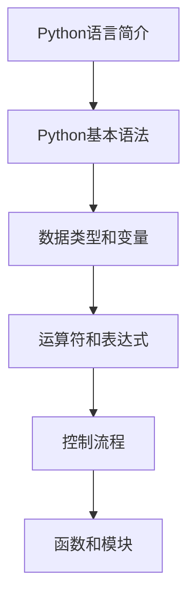
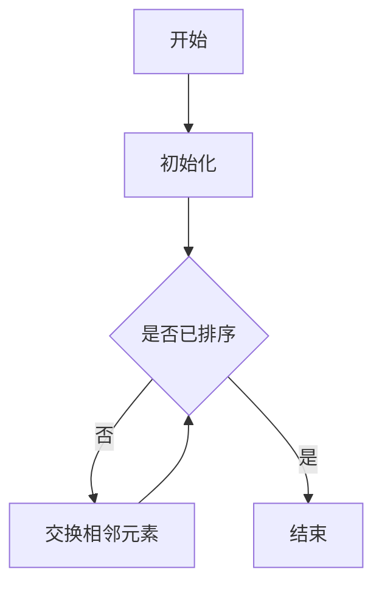
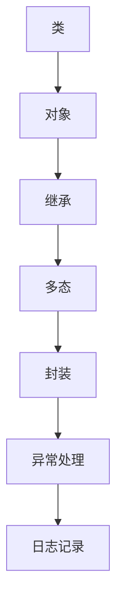
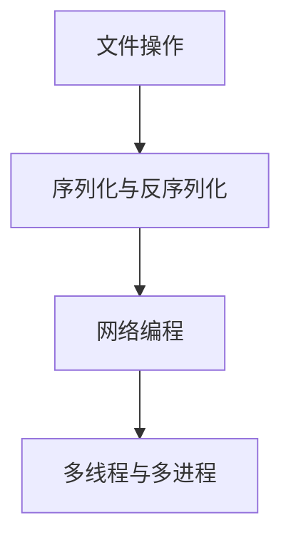
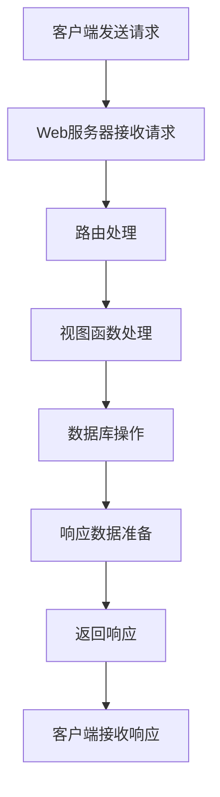

                 


### 文章标题: 字节跳动2024校招Python岗位面试真题详解

> 关键词：字节跳动，校招，Python面试，真题解析，编程技巧

> 摘要：本文将针对字节跳动2024校招Python岗位的面试真题进行详细解析，涵盖Python语言基础、数据结构与算法、面向对象编程、标准库、数据库操作、Web开发以及项目实战等多个方面。通过本文的学习，读者将深入了解面试中的核心问题，掌握解题技巧，提升面试能力。

## 目录大纲

### 第一部分: 校招Python岗位面试基础

#### 第1章: Python语言基础

##### 1.1 Python语言简介

##### 1.2 Python基本语法

##### 1.3 数据类型和变量

##### 1.4 运算符和表达式

##### 1.5 控制流程

##### 1.6 函数和模块

#### 第2章: Python数据结构与算法

##### 2.1 列表和元组

##### 2.2 字典和集合

##### 2.3 常用算法

##### 2.4 排序和搜索算法

#### 第3章: Python面向对象编程

##### 3.1 类和对象

##### 3.2 继承和多态

##### 3.3 封装和访问控制

##### 3.4 异常处理和日志记录

#### 第4章: Python标准库

##### 4.1 文件操作

##### 4.2 序列化与反序列化

##### 4.3 网络编程

##### 4.4 多线程与多进程

#### 第5章: 数据库操作

##### 5.1 关系型数据库

##### 5.2 非关系型数据库

##### 5.3 SQL语言基础

##### 5.4 ORM框架

#### 第6章: Web开发

##### 6.1 Web基础

##### 6.2 常用Web框架

##### 6.3 前端技术

##### 6.4 RESTful API设计

#### 第7章: 项目实战

##### 7.1 项目介绍

##### 7.2 需求分析

##### 7.3 设计与开发

##### 7.4 测试与部署

### 第二部分: 校招Python岗位面试真题解析

#### 第8章: 面试真题解析

##### 8.1 算法与数据结构面试题

##### 8.2 编程语言面试题

##### 8.3 数据库面试题

##### 8.4 Web开发面试题

##### 8.5 项目经验面试题

### 第三部分: 考试技巧与心态调整

#### 第9章: 考试技巧

##### 9.1 面试前的准备

##### 9.2 面试过程中的技巧

##### 9.3 考试策略

##### 9.4 面试后的跟进

#### 第10章: 心态调整

##### 10.1 应对面试压力

##### 10.2 建立自信

##### 10.3 考后反思

##### 10.4 持续学习与进步

### 附录

#### 附录 A: 资源链接

##### A.1 技术博客与社区

##### A.2 在线编程平台

##### A.3 Python学习资源

##### A.4 Python面试题库

#### 附录 B: 编程实践指南

##### B.1 版本控制

##### B.2 代码规范

##### B.3 调试技巧

##### B.4 性能优化### 第一部分: 校招Python岗位面试基础

#### 第1章: Python语言基础

##### 1.1 Python语言简介

Python是一种高级、动态、解释型编程语言，具有简洁易读的语法，广泛的应用领域包括Web开发、科学计算、人工智能、数据分析等。Python的设计哲学强调代码的可读性和简洁性，让开发者能够更加专注于解决问题本身。

##### 1.2 Python基本语法

Python的基本语法包括变量、数据类型、运算符、表达式和注释等。变量是存储数据的容器，数据类型包括数字、字符串、列表、元组、字典和集合等。运算符包括算术运算符、比较运算符、逻辑运算符等，用于对变量进行操作。表达式是包含运算符和变量的语句，注释用于对代码进行解释。

##### 1.3 数据类型和变量

Python的数据类型可以分为两类：内置数据类型和自定义数据类型。内置数据类型包括数字（int、float、complex）、字符串（str）、列表（list）、元组（tuple）、字典（dict）和集合（set）等。变量是用于存储数据的符号，变量的命名应遵循一定的规范。

##### 1.4 运算符和表达式

Python中的运算符包括算术运算符、比较运算符、逻辑运算符和位运算符等。算术运算符用于执行基本的算术运算，比较运算符用于比较两个值的大小，逻辑运算符用于执行逻辑运算，位运算符用于执行位运算。表达式是由运算符和变量组成的语句，用于执行特定的运算。

##### 1.5 控制流程

Python的控制流程包括条件判断和循环结构。条件判断语句（如if-else语句）用于根据条件执行不同的代码块，循环结构（如for循环和while循环）用于重复执行代码块。通过合理使用控制流程，可以编写出灵活、高效的程序。

##### 1.6 函数和模块

函数是Python的基本构建块，用于将代码划分为可重用的部分。Python内置了许多函数，如print()、len()和sum()等，开发者也可以自定义函数。模块是Python代码的封装形式，用于组织和管理代码。通过导入模块，可以方便地使用模块中的函数和类。

##### 1.7 Mermaid流程图

为了更好地理解Python的核心概念，我们可以使用Mermaid流程图来展示它们之间的关系。以下是一个示例：



通过这个流程图，我们可以清晰地看到Python各个核心概念之间的联系。

##### 1.8 伪代码

为了深入理解Python的核心算法原理，我们可以使用伪代码来详细阐述。以下是一个简单的排序算法的伪代码示例：

```
算法：冒泡排序
输入：一个无序数组arr
输出：一个有序数组arr
步骤：
1. 从第一个元素开始，遍历到倒数第二个元素
2. 在每次遍历中，从第一个元素开始，遍历到当前遍历位置的前一个元素
3. 如果当前元素大于下一个元素，交换它们的位置
4. 重复步骤1-3，直到整个数组有序
```

通过这个伪代码，我们可以清晰地理解冒泡排序的原理和步骤。

##### 1.9 数学模型和公式

在某些算法中，可能需要使用数学模型和公式来描述算法的复杂度。以下是一个常见的数学公式示例：

$$
时间复杂度 = O(n^2)
$$

这个公式表示该算法的时间复杂度与输入规模n的平方成正比。

##### 1.10 详细讲解和举例说明

为了更好地理解Python的核心概念和算法原理，我们可以通过具体的例子进行详细讲解和举例说明。以下是一个简单的Python程序示例：

```python
# 打印数字0到9
for i in range(10):
    print(i)
```

通过这个例子，我们可以看到Python的for循环如何用于遍历数字0到9，并打印它们。

##### 1.11 最佳实践 Tips

在学习Python语言基础时，以下是一些最佳实践Tips：

- 熟悉Python的官方文档，有助于快速掌握语言特性。
- 实践是学习编程的最佳方式，尽量多写代码，多练习。
- 学会使用版本控制工具（如Git），有助于管理和协作代码。
- 遵守Python的代码规范，提高代码的可读性和可维护性。

##### 1.12 小结

本章详细介绍了Python语言的基础知识，包括语言简介、基本语法、数据类型和变量、运算符和表达式、控制流程、函数和模块等。通过本章的学习，读者可以掌握Python的基本语法和使用方法，为后续的学习和面试做好准备。

#### 第2章: Python数据结构与算法

##### 2.1 列表和元组

列表（list）是Python中最常用的数据结构之一，用于存储一系列有序的元素。列表的元素可以是不同的数据类型，如整数、字符串、列表等。列表支持索引、切片、长度计算等操作，可以通过索引访问列表中的元素，如`list[0]`。列表还支持追加（`list.append()`）、插入（`list.insert()`）、删除（`list.pop()`）等操作。

元组（tuple）是另一种有序的数据结构，与列表类似，但元组的元素一旦创建后就不能修改。元组常用于存储不可变的元素集合，如坐标点（`point = (x, y)`）或函数参数（`def function(args): ...`）。

##### 2.2 字典和集合

字典（dict）是一种映射（key-value）数据结构，用于存储键值对。字典的键是唯一的，可以通过键快速访问对应的值。字典支持添加（`dict[key] = value`）、删除（`del dict[key]`）、查询（`value = dict[key]`）等操作。

集合（set）是一种无序的数据结构，用于存储不重复的元素。集合支持添加（`set.add(element)`）、删除（`set.remove(element)`）、查询（`element in set`）等操作。

##### 2.3 常用算法

Python中常用的算法包括排序算法、搜索算法和图算法等。排序算法用于对数据进行排序，常用的排序算法有冒泡排序、选择排序、插入排序、快速排序等。搜索算法用于查找数据，常用的搜索算法有二分搜索、广度优先搜索、深度优先搜索等。图算法用于处理图数据结构，常用的图算法有最小生成树、最短路径、拓扑排序等。

##### 2.4 排序和搜索算法

排序算法用于对数据进行排序，常见的排序算法有：

- 冒泡排序（Bubble Sort）：通过不断交换相邻的未排序元素，将最大（或最小）元素逐步移动到序列末尾。
- 选择排序（Selection Sort）：每次从未排序部分选择最小（或最大）的元素，将其移动到已排序部分的末尾。
- 插入排序（Insertion Sort）：将未排序的元素插入到已排序序列的正确位置，以保持序列的有序性。
- 快速排序（Quick Sort）：通过递归地将序列分为较小和较大的子序列，再对子序列进行排序。

搜索算法用于查找数据，常见的搜索算法有：

- 二分搜索（Binary Search）：适用于有序数组，通过不断比较中间元素与目标值，逐步缩小搜索范围。
- 广度优先搜索（Breadth-First Search，BFS）：从源点开始，按照层次遍历图中的所有节点，直到找到目标节点。
- 深度优先搜索（Depth-First Search，DFS）：从源点开始，尽可能地向下探索，直到找到目标节点。

##### 2.5 Mermaid流程图

为了更好地理解排序和搜索算法，我们可以使用Mermaid流程图来展示它们的步骤。以下是一个冒泡排序的流程图示例：



##### 2.6 伪代码

为了深入理解排序和搜索算法的原理，我们可以使用伪代码来详细阐述。以下是一个冒泡排序的伪代码示例：

```
算法：冒泡排序
输入：一个无序数组arr
输出：一个有序数组arr
步骤：
1. 初始化一个布尔变量swapped，设置为True
2. 当swapped为True时，执行步骤3-5
3. 设置swapped为False
4. 从第一个元素开始，遍历到倒数第二个元素
5. 在每次遍历中，从第一个元素开始，遍历到当前遍历位置的前一个元素
6. 如果当前元素大于下一个元素，交换它们的位置
7. 重复步骤2-6，直到整个数组有序
```

##### 2.7 数学模型和公式

在某些算法中，可能需要使用数学模型和公式来描述算法的复杂度。以下是一个常见的数学公式示例：

$$
时间复杂度 = O(n^2)
$$

这个公式表示该算法的时间复杂度与输入规模n的平方成正比。

##### 2.8 详细讲解和举例说明

为了更好地理解排序和搜索算法，我们可以通过具体的例子进行详细讲解和举例说明。以下是一个使用冒泡排序对列表进行排序的Python程序示例：

```python
def bubble_sort(arr):
    n = len(arr)
    for i in range(n):
        swapped = False
        for j in range(0, n-i-1):
            if arr[j] > arr[j+1]:
                arr[j], arr[j+1] = arr[j+1], arr[j]
                swapped = True
        if not swapped:
            break
    return arr

arr = [64, 34, 25, 12, 22, 11, 90]
sorted_arr = bubble_sort(arr)
print("排序后的数组：", sorted_arr)
```

通过这个例子，我们可以看到冒泡排序的基本步骤和实现方式。

##### 2.9 最佳实践 Tips

在学习Python数据结构与算法时，以下是一些最佳实践Tips：

- 熟悉Python的数据结构模块（如`collections`），有助于提高代码的可读性和性能。
- 实践是学习编程的最佳方式，尽量多写代码，多练习。
- 学会使用测试框架（如`unittest`或`pytest`），有助于提高代码的质量。
- 遵守Python的代码规范，提高代码的可读性和可维护性。

##### 2.10 小结

本章详细介绍了Python中的数据结构（列表、元组、字典和集合）以及常用算法（排序和搜索算法）。通过本章的学习，读者可以掌握Python中的数据结构和算法，为后续的项目实战和面试做好准备。

#### 第3章: Python面向对象编程

##### 3.1 类和对象

Python面向对象编程的核心概念是类和对象。类（Class）是定义对象的蓝图，对象（Object）是类的实例。类定义了对象的属性和行为，对象则是类在内存中的实例化。

```python
class Person:
    def __init__(self, name, age):
        self.name = name
        self.age = age
    
    def say_hello(self):
        print("Hello, my name is", self.name)

# 创建对象
p = Person("Alice", 30)
```

在上面的示例中，`Person`是一个类，它有两个属性（`name`和`age`）和一个方法（`say_hello`）。创建对象时，需要通过类的构造函数（`__init__`）初始化属性。

##### 3.2 继承和多态

继承（Inheritance）是面向对象编程的一个核心特性，它允许一个类继承另一个类的属性和方法。子类（Child Class）继承了父类（Parent Class）的所有属性和方法，同时还可以添加自己的属性和方法。

```python
class Employee(Person):
    def __init__(self, name, age, salary):
        super().__init__(name, age)
        self.salary = salary
    
    def say_hello(self):
        print("Hello, my name is", self.name, "and I am an employee.")

# 创建对象
e = Employee("Bob", 40, 5000)
e.say_hello()
```

在上面的示例中，`Employee`类继承了`Person`类的属性和方法，并添加了新的属性（`salary`）。

多态（Polymorphism）是面向对象编程的另一个核心特性，它允许一个接口有多种实现方式。通过多态，子类可以重写父类的方法，实现不同的行为。

```python
def greet(person):
    person.say_hello()

greet(p)  # 输出：Hello, my name is Alice
greet(e)  # 输出：Hello, my name is Bob and I am an employee.
```

在上面的示例中，`greet`函数接收一个`Person`类型的参数，并调用其`say_hello`方法。由于`Employee`类继承了`Person`类，因此可以将其对象传递给`greet`函数。

##### 3.3 封装和访问控制

封装（Encapsulation）是面向对象编程的一个核心概念，它用于隐藏类的内部实现，只暴露必要的接口。封装可以通过访问控制符（Access Modifiers）实现，如`public`、`protected`和`private`。

```python
class BankAccount:
    def __init__(self, account_number, balance):
        self._account_number = account_number
        self._balance = balance
    
    def deposit(self, amount):
        self._balance += amount
    
    def withdraw(self, amount):
        if amount <= self._balance:
            self._balance -= amount
            return True
        else:
            return False
    
    def get_balance(self):
        return self._balance
    
    def get_account_number(self):
        return self._account_number

# 创建对象
account = BankAccount("123456", 1000)
account.deposit(500)
print(account.get_balance())  # 输出：1500
print(account.get_account_number())  # 输出：123456
```

在上面的示例中，`_balance`和`_account_number`是私有属性（`private`），只能通过类的内部方法访问。`deposit`、`withdraw`和`get_balance`是公共方法（`public`），可以用于与类的交互。

##### 3.4 异常处理和日志记录

异常处理（Exception Handling）是面向对象编程中用于处理错误和异常的重要机制。Python使用`try`、`except`、`finally`和`else`语句来实现异常处理。

```python
try:
    result = 10 / 0
except ZeroDivisionError:
    print("除零错误")
else:
    print("结果：", result)
finally:
    print("异常处理完成")
```

在上面的示例中，如果发生`ZeroDivisionError`异常，程序将捕获并处理该异常，打印错误消息。

日志记录（Logging）是用于记录程序运行过程中发生的错误和重要信息的重要工具。Python的`logging`模块提供了丰富的日志记录功能。

```python
import logging

logging.basicConfig(level=logging.INFO)
logging.info("这是一条信息日志")
logging.warning("这是一条警告日志")
logging.error("这是一条错误日志")
logging.critical("这是一条严重错误日志")
```

在上面的示例中，我们设置了日志记录的级别为`INFO`，并使用不同的日志级别记录了不同的日志消息。

##### 3.5 Mermaid流程图

为了更好地理解Python面向对象编程的核心概念，我们可以使用Mermaid流程图来展示它们之间的关系。以下是一个示例：



##### 3.6 伪代码

为了深入理解Python面向对象编程的原理，我们可以使用伪代码来详细阐述。以下是一个简单的类定义和对象创建的伪代码示例：

```
类：Person
属性：name, age
方法：say_hello()

类：Employee
继承：Person
属性：salary
方法：say_hello()

对象创建：
p = new Person("Alice", 30)
e = new Employee("Bob", 40, 5000)
```

##### 3.7 数学模型和公式

在某些面向对象编程的算法中，可能需要使用数学模型和公式来描述算法的复杂度。以下是一个常见的数学公式示例：

$$
时间复杂度 = O(1)
$$

这个公式表示该算法的时间复杂度与输入规模n无关。

##### 3.8 详细讲解和举例说明

为了更好地理解Python面向对象编程的核心概念，我们可以通过具体的例子进行详细讲解和举例说明。以下是一个简单的Python程序示例：

```python
class Dog:
    def __init__(self, name, age):
        self.name = name
        self.age = age
    
    def bark(self):
        print(f"{self.name} is barking!")

# 创建对象
dog = Dog("Buddy", 3)
dog.bark()  # 输出：Buddy is barking!

class Puppy(Dog):
    def __init__(self, name, age, is_puppy):
        super().__init__(name, age)
        self.is_puppy = is_puppy
    
    def bark(self):
        if self.is_puppy:
            print(f"{self.name} is barking as a puppy!")
        else:
            print(f"{self.name} is barking as an adult!")

# 创建对象
puppy = Puppy("Max", 1, True)
puppy.bark()  # 输出：Max is barking as a puppy!
```

通过这个例子，我们可以看到如何使用继承和多态来扩展类的方法和行为。

##### 3.9 最佳实践 Tips

在学习Python面向对象编程时，以下是一些最佳实践Tips：

- 熟悉Python的面向对象编程特性，有助于提高代码的可读性和可维护性。
- 使用类和对象来封装代码，避免代码的重复和混乱。
- 学会使用异常处理和日志记录来提高程序的健壮性和可调试性。
- 遵守Python的代码规范，提高代码的质量。

##### 3.10 小结

本章详细介绍了Python面向对象编程的核心概念，包括类和对象、继承和多态、封装和访问控制、异常处理和日志记录。通过本章的学习，读者可以掌握Python面向对象编程的基本原理和实践方法，为编写更复杂的程序和应对面试做好准备。

#### 第4章: Python标准库

##### 4.1 文件操作

Python标准库提供了丰富的文件操作功能，包括文件的读取、写入、追加、删除等。以下是一些常用的文件操作函数：

- `open()`：打开一个文件，返回一个文件对象。
  ```python
  file = open("example.txt", "r")
  ```
- `read()`：读取文件内容，返回一个字符串。
  ```python
  content = file.read()
  ```
- `write()`：写入文件内容，返回写入的字符数。
  ```python
  file.write("Hello, world!")
  ```
- `close()`：关闭文件。
  ```python
  file.close()
  ```

示例代码：

```python
# 读取文件内容
with open("example.txt", "r") as file:
    content = file.read()
    print(content)

# 写入文件内容
with open("example.txt", "w") as file:
    file.write("Hello, world!")

# 追加文件内容
with open("example.txt", "a") as file:
    file.write("\nThis is an additional line.")

# 删除文件
import os
os.remove("example.txt")
```

##### 4.2 序列化与反序列化

序列化（Serialization）是将对象转换为可以存储或传输的格式（如JSON或XML），反序列化（Deserialization）则是将序列化后的格式还原为对象。Python标准库中的`json`模块提供了方便的序列化和反序列化功能。

- `json.dumps()`：将Python对象序列化为JSON字符串。
  ```python
  import json
  data = {"name": "Alice", "age": 30}
  json_str = json.dumps(data)
  ```
- `json.loads()`：将JSON字符串反序列化为Python对象。
  ```python
  json_obj = json.loads(json_str)
  ```

示例代码：

```python
import json

# 序列化
data = {"name": "Alice", "age": 30}
json_str = json.dumps(data)
print(json_str)  # 输出：{"name": "Alice", "age": 30}

# 反序列化
json_obj = json.loads(json_str)
print(json_obj)  # 输出：{'name': 'Alice', 'age': 30}
```

##### 4.3 网络编程

Python标准库中的`socket`模块提供了基本的网络编程功能，可以用于创建客户端和服务器。

- `socket.socket()`：创建一个socket对象。
  ```python
  server_socket = socket.socket(socket.AF_INET, socket.SOCK_STREAM)
  ```
- `bind()`：绑定socket到指定地址。
  ```python
  server_socket.bind((host, port))
  ```
- `listen()`：使socket进入监听状态。
  ```python
  server_socket.listen()
  ```
- `accept()`：接受客户端连接。
  ```python
  client_socket, client_address = server_socket.accept()
  ```
- `send()`和`recv()`：发送和接收数据。
  ```python
  client_socket.send(b"Hello, client!")
  message = client_socket.recv(1024)
  ```

示例代码：

```python
import socket

# 创建服务器socket
server_socket = socket.socket(socket.AF_INET, socket.SOCK_STREAM)
server_socket.bind(('localhost', 12345))
server_socket.listen()

print("Server is listening...")

# 接受客户端连接
client_socket, client_address = server_socket.accept()
print(f"Connected by {client_address}")

# 发送消息
client_socket.send(b"Hello, client!")

# 接收消息
message = client_socket.recv(1024)
print(f"Received: {message.decode()}")

# 关闭连接
client_socket.close()
server_socket.close()
```

##### 4.4 多线程与多进程

Python标准库中的`threading`模块和`multiprocessing`模块提供了多线程和多进程编程的支持。

- `threading.Thread()`：创建一个线程。
  ```python
  thread = threading.Thread(target=func, args=(arg,))
  ```
- `threading.Thread.start()`：启动线程。
  ```python
  thread.start()
  ```
- `multiprocessing.Process()`：创建一个进程。
  ```python
  process = multiprocessing.Process(target=func, args=(arg,))
  ```
- `multiprocessing.Process.start()`：启动进程。
  ```python
  process.start()
  ```

示例代码：

```python
import threading
import time

def print_numbers():
    for i in range(1, 11):
        print(i)
        time.sleep(1)

# 创建线程
thread = threading.Thread(target=print_numbers)
thread.start()

# 等待线程完成
thread.join()

# 创建进程
process = multiprocessing.Process(target=print_numbers)
process.start()

# 等待进程完成
process.join()
```

##### 4.5 Mermaid流程图

为了更好地理解Python标准库中的文件操作、序列化与反序列化、网络编程和多线程与多进程，我们可以使用Mermaid流程图来展示它们之间的关系。以下是一个示例：



##### 4.6 伪代码

为了深入理解Python标准库中的文件操作、序列化与反序列化、网络编程和多线程与多进程的原理，我们可以使用伪代码来详细阐述。以下是一个简单的网络编程伪代码示例：

```
服务器：
1. 创建服务器socket
2. 绑定socket到指定地址
3. 监听socket
4. 接受客户端连接
5. 发送消息
6. 接收消息
7. 关闭连接

客户端：
1. 创建客户端socket
2. 连接到服务器socket
3. 发送消息
4. 接收消息
5. 关闭连接
```

##### 4.7 数学模型和公式

在某些Python标准库的算法中，可能需要使用数学模型和公式来描述算法的复杂度。以下是一个常见的数学公式示例：

$$
时间复杂度 = O(n)
$$

这个公式表示该算法的时间复杂度与输入规模n成正比。

##### 4.8 详细讲解和举例说明

为了更好地理解Python标准库中的文件操作、序列化与反序列化、网络编程和多线程与多进程，我们可以通过具体的例子进行详细讲解和举例说明。以下是一个简单的多线程编程示例：

```python
import threading
import time

def print_numbers():
    for i in range(1, 11):
        print(i)
        time.sleep(1)

# 创建线程
thread1 = threading.Thread(target=print_numbers)
thread2 = threading.Thread(target=print_numbers)

# 启动线程
thread1.start()
thread2.start()

# 等待线程完成
thread1.join()
thread2.join()
```

通过这个例子，我们可以看到如何使用多线程同时执行两个打印任务。

##### 4.9 最佳实践 Tips

在学习Python标准库时，以下是一些最佳实践Tips：

- 熟悉Python标准库的官方文档，有助于快速掌握各个模块的功能和使用方法。
- 使用`with`语句进行文件操作，可以确保文件被正确关闭，避免资源泄露。
- 在进行网络编程时，确保服务器和客户端之间的连接是安全的，可以使用SSL/TLS等加密协议。
- 使用线程和进程时要考虑同步和并发问题，避免数据竞争和死锁。

##### 4.10 小结

本章详细介绍了Python标准库中的文件操作、序列化与反序列化、网络编程和多线程与多进程。通过本章的学习，读者可以掌握Python标准库的基本功能和使用方法，为编写复杂的程序和应对面试做好准备。

#### 第5章: 数据库操作

##### 5.1 关系型数据库

关系型数据库是一种基于关系模型的数据库管理系统，它使用表格（也称为关系）来存储数据。每个表格由多个行和列组成，行表示数据记录，列表示数据字段。常见的关系型数据库包括MySQL、PostgreSQL、SQLite和Oracle等。

- **SQL语言基础**：SQL（结构化查询语言）是关系型数据库的标准语言，用于执行各种数据库操作，如创建表、插入数据、查询数据、更新数据和删除数据等。

  - `CREATE TABLE`：创建一个新表。
    ```sql
    CREATE TABLE students (
        id INT PRIMARY KEY,
        name VARCHAR(50),
        age INT
    );
    ```

  - `INSERT INTO`：向表中插入数据。
    ```sql
    INSERT INTO students (id, name, age) VALUES (1, 'Alice', 20);
    ```

  - `SELECT`：查询表中的数据。
    ```sql
    SELECT * FROM students;
    ```

  - `UPDATE`：更新表中的数据。
    ```sql
    UPDATE students SET age = 21 WHERE id = 1;
    ```

  - `DELETE`：删除表中的数据。
    ```sql
    DELETE FROM students WHERE id = 1;
    ```

- **ORM框架**：ORM（对象关系映射）框架是一种将关系型数据库中的数据映射到对象的方法。Python中常见的ORM框架有SQLAlchemy和Peewee。

  - `SQLAlchemy`：SQLAlchemy是一个流行的ORM框架，它提供了丰富的功能，如自动生成SQL语句、事务管理、连接池等。
    ```python
    from sqlalchemy import create_engine, Table, Column, Integer, String
    engine = create_engine('sqlite:///example.db')
    student_table = Table('students', engine,
                          Column('id', Integer, primary_key=True),
                          Column('name', String(50)),
                          Column('age', Integer))
    ```

  - `Peewee`：Peewee是一个轻量级的ORM框架，适用于小型项目和快速开发。

    ```python
    from peewee import Model, IntegerField, CharField
    class Student(Model):
        id = IntegerField(primary_key=True)
        name = CharField()
        age = IntegerField()
        class Meta:
            database = MySQLDatabase('example.db')
    ```

##### 5.2 非关系型数据库

非关系型数据库（NoSQL数据库）是一种不同于关系型数据库的数据存储方案。它们通常不使用固定的表格结构，而是使用键值对、文档、列族或图结构等不同的数据模型。常见的NoSQL数据库包括MongoDB、Redis、Cassandra和HBase等。

- **MongoDB**：MongoDB是一个流行的文档型数据库，它使用JSON-like的文档结构存储数据。

  - `insert_one()`：向集合中插入一个文档。
    ```python
    from pymongo import MongoClient
    client = MongoClient('localhost', 27017)
    db = client['example_db']
    collection = db['students']
    student = {"name": "Alice", "age": 20}
    collection.insert_one(student)
    ```

  - `find_one()`：查询集合中的第一个文档。
    ```python
    student = collection.find_one({"name": "Alice"})
    print(student)
    ```

- **Redis**：Redis是一个快速的键值数据库，常用于缓存和实时数据处理。

  - `set()`：设置键值。
    ```python
    import redis
    r = redis.Redis(host='localhost', port=6379, db=0)
    r.set('name', 'Alice')
    ```

  - `get()`：获取键值。
    ```python
    name = r.get('name')
    print(name)
    ```

##### 5.3 数据库操作示例

以下是一个简单的数据库操作示例，展示了如何使用Python与关系型数据库（SQLite）和NoSQL数据库（MongoDB）进行交互。

- **关系型数据库（SQLite）**：

  ```python
  import sqlite3

  # 连接数据库
  conn = sqlite3.connect('example.db')
  cursor = conn.cursor()

  # 创建表
  cursor.execute('''CREATE TABLE IF NOT EXISTS students (id INTEGER PRIMARY KEY, name TEXT, age INTEGER)''')

  # 插入数据
  cursor.execute("INSERT INTO students (name, age) VALUES (?, ?)", ('Alice', 20))
  conn.commit()

  # 查询数据
  cursor.execute("SELECT * FROM students")
  students = cursor.fetchall()
  for student in students:
      print(student)

  # 更新数据
  cursor.execute("UPDATE students SET age = ? WHERE name = ?", (21, 'Alice'))
  conn.commit()

  # 删除数据
  cursor.execute("DELETE FROM students WHERE name = ?", ('Alice',))
  conn.commit()

  # 关闭连接
  cursor.close()
  conn.close()
  ```

- **非关系型数据库（MongoDB）**：

  ```python
  from pymongo import MongoClient

  # 连接MongoDB
  client = MongoClient('localhost', 27017)
  db = client['example_db']
  collection = db['students']

  # 插入文档
  student = {"name": "Alice", "age": 20}
  collection.insert_one(student)

  # 查询文档
  student = collection.find_one({"name": "Alice"})
  print(student)

  # 更新文档
  collection.update_one({"name": "Alice"}, {"$set": {"age": 21}})

  # 删除文档
  collection.delete_one({"name": "Alice"})

  # 关闭连接
  client.close()
  ```

##### 5.4 详细讲解和举例说明

为了更好地理解数据库操作，我们可以通过具体的例子进行详细讲解和举例说明。

- **关系型数据库（SQLite）**：

  ```python
  import sqlite3

  # 连接数据库
  conn = sqlite3.connect('example.db')
  cursor = conn.cursor()

  # 创建表
  cursor.execute('''CREATE TABLE IF NOT EXISTS students (id INTEGER PRIMARY KEY, name TEXT, age INTEGER)''')

  # 插入数据
  cursor.execute("INSERT INTO students (name, age) VALUES (?, ?)", ('Alice', 20))
  conn.commit()

  # 查询数据
  cursor.execute("SELECT * FROM students")
  students = cursor.fetchall()
  for student in students:
      print(student)

  # 更新数据
  cursor.execute("UPDATE students SET age = ? WHERE name = ?", (21, 'Alice'))
  conn.commit()

  # 删除数据
  cursor.execute("DELETE FROM students WHERE name = ?", ('Alice',))
  conn.commit()

  # 关闭连接
  cursor.close()
  conn.close()
  ```

  通过这个例子，我们可以看到如何使用Python的`sqlite3`模块与SQLite数据库进行交互，包括创建表、插入数据、查询数据、更新数据和删除数据。

- **非关系型数据库（MongoDB）**：

  ```python
  from pymongo import MongoClient

  # 连接MongoDB
  client = MongoClient('localhost', 27017)
  db = client['example_db']
  collection = db['students']

  # 插入文档
  student = {"name": "Alice", "age": 20}
  collection.insert_one(student)

  # 查询文档
  student = collection.find_one({"name": "Alice"})
  print(student)

  # 更新文档
  collection.update_one({"name": "Alice"}, {"$set": {"age": 21}})

  # 删除文档
  collection.delete_one({"name": "Alice"})

  # 关闭连接
  client.close()
  ```

  通过这个例子，我们可以看到如何使用Python的`pymongo`模块与MongoDB数据库进行交互，包括插入文档、查询文档、更新文档和删除文档。

##### 5.5 最佳实践 Tips

在学习数据库操作时，以下是一些最佳实践Tips：

- 使用事务（Transaction）确保数据的完整性和一致性。
- 使用索引（Index）提高查询性能。
- 定期备份数据库，以防止数据丢失。
- 避免在数据库中存储大量文本数据，尽量使用文本存储或文件系统。
- 使用合适的ORM框架简化数据库操作，提高代码的可维护性。

##### 5.6 小结

本章详细介绍了Python中的数据库操作，包括关系型数据库（SQLite）和非关系型数据库（MongoDB）。通过本章的学习，读者可以掌握如何使用Python与数据库进行交互，包括创建表、插入数据、查询数据、更新数据和删除数据。这些技能对于编写复杂的应用程序和应对面试非常重要。

#### 第6章: Web开发

##### 6.1 Web基础

Web开发是指构建、部署和维护Web应用程序的过程。Web应用程序通常由前端（客户端）和后端（服务器端）组成。前端负责用户界面和交互，后端负责数据处理和业务逻辑。

- **HTTP协议**：HTTP（HyperText Transfer Protocol）是Web通信的基础协议，定义了客户端和服务器之间的请求和响应过程。
  - `GET`请求：获取资源，通常不改变服务器状态。
  - `POST`请求：提交数据，通常改变服务器状态。

- **Web服务器**：Web服务器是负责处理HTTP请求的软件，常见的Web服务器有Apache、Nginx和IIS等。

- **Web浏览器**：Web浏览器是用户与Web应用程序交互的客户端软件，常见的Web浏览器有Chrome、Firefox和Safari等。

##### 6.2 常用Web框架

Web框架是用于构建Web应用程序的工具，它提供了预定义的组件和结构，简化了Web开发过程。

- **Django**：Django是一个高层次的Python Web框架，遵循MVC（模型-视图-控制器）设计模式。
  - `Django视图`：处理HTTP请求并返回响应。
  - `Django模型`：定义数据库结构和数据操作。
  - `Django模板`：用于生成HTML页面。

  示例代码：

  ```python
  from django.http import HttpResponse
  def hello(request):
      return HttpResponse("Hello, world!")
  ```

- **Flask**：Flask是一个轻量级的Python Web框架，提供了简单易用的接口。
  - `Flask路由`：处理HTTP请求。
  - `Flask模板`：生成HTML页面。

  示例代码：

  ```python
  from flask import Flask, render_template
  app = Flask(__name__)

  @app.route('/')
  def hello():
      return render_template('hello.html')

  if __name__ == '__main__':
      app.run()
  ```

- **FastAPI**：FastAPI是一个基于Python 3.6+的Web框架，实现了Python类型的自动验证。

  示例代码：

  ```python
  from fastapi import FastAPI
  app = FastAPI()

  @app.get('/')
  def hello():
      return {"message": "Hello, world!"}
  ```

##### 6.3 前端技术

前端技术涉及HTML、CSS和JavaScript等，用于构建Web应用程序的用户界面。

- **HTML**：HTML（HyperText Markup Language）是Web内容的基础语言，用于定义网页的结构。
- **CSS**：CSS（Cascading Style Sheets）用于定义网页的样式。
- **JavaScript**：JavaScript是一种客户端脚本语言，用于实现网页的交互性和动态效果。

##### 6.4 RESTful API设计

RESTful API是一种设计Web服务的规范，基于HTTP协议，使用统一的接口设计方法。

- **资源表示**：使用URL表示资源，如`/users/1`表示用户ID为1的用户资源。
- **HTTP方法**：使用不同的HTTP方法（如GET、POST、PUT、DELETE）进行资源操作。
- **状态码**：返回合适的HTTP状态码（如200 OK、404 Not Found、500 Internal Server Error）。

示例代码：

```python
from flask import Flask, request, jsonify

app = Flask(__name__)

@app.route('/users', methods=['POST'])
def create_user():
    user_data = request.get_json()
    user = {"id": user_data['id'], "name": user_data['name']}
    return jsonify(user), 201

@app.route('/users/<int:user_id>', methods=['GET', 'PUT', 'DELETE'])
def user_handler(user_id):
    if request.method == 'GET':
        user = {"id": user_id, "name": "Alice"}
        return jsonify(user), 200
    elif request.method == 'PUT':
        user_data = request.get_json()
        user = {"id": user_id, "name": user_data['name']}
        return jsonify(user), 200
    elif request.method == 'DELETE':
        return jsonify({"message": "User deleted"}), 204

if __name__ == '__main__':
    app.run()
```

##### 6.5 Mermaid流程图

为了更好地理解Web开发的基本概念，我们可以使用Mermaid流程图来展示Web请求的生命周期。以下是一个示例：



##### 6.6 伪代码

为了深入理解Web开发的工作原理，我们可以使用伪代码来详细阐述。以下是一个简单的Web应用程序的伪代码示例：

```
1. 客户端发送HTTP请求
2. Web服务器接收请求并转发给路由器
3. 路由器根据URL匹配路由规则，找到对应的视图函数
4. 视图函数处理请求并生成响应数据
5. 如果需要，视图函数与数据库交互获取数据
6. 响应数据被传递给模板引擎进行渲染
7. 渲染后的HTML页面作为HTTP响应发送给客户端
8. 客户端接收HTTP响应并显示页面
```

##### 6.7 数学模型和公式

在某些Web开发相关的算法中，可能需要使用数学模型和公式来描述算法的复杂度。以下是一个常见的数学公式示例：

$$
时间复杂度 = O(1)
$$

这个公式表示该算法的时间复杂度与输入规模n无关。

##### 6.8 详细讲解和举例说明

为了更好地理解Web开发的相关概念，我们可以通过具体的例子进行详细讲解和举例说明。

- **使用Django框架构建一个简单的Web应用程序**：

  ```python
  # app/views.py
  from django.shortcuts import render
  
  def home(request):
      return render(request, 'home.html')

  # app/templates/home.html
  <html>
  <head>
      <title>Hello, World!</title>
  </head>
  <body>
      <h1>Hello, World!</h1>
  </body>
  </html>
  ```

  在这个例子中，我们使用Django框架创建了一个简单的Web应用程序，它包含一个视图函数`home`和一个HTML模板`home.html`。当用户访问主页时，视图函数将请求传递给模板引擎，并返回渲染后的HTML页面。

- **使用Flask框架构建一个简单的RESTful API**：

  ```python
  # app.py
  from flask import Flask, jsonify, request
  
  app = Flask(__name__)

  @app.route('/users', methods=['POST'])
  def create_user():
      user_data = request.get_json()
      user = {"id": user_data['id'], "name": user_data['name']}
      return jsonify(user), 201

  @app.route('/users/<int:user_id>', methods=['GET', 'PUT', 'DELETE'])
  def user_handler(user_id):
      if request.method == 'GET':
          user = {"id": user_id, "name": "Alice"}
          return jsonify(user), 200
      elif request.method == 'PUT':
          user_data = request.get_json()
          user = {"id": user_id, "name": user_data['name']}
          return jsonify(user), 200
      elif request.method == 'DELETE':
          return jsonify({"message": "User deleted"}), 204

  if __name__ == '__main__':
      app.run()
  ```

  在这个例子中，我们使用Flask框架创建了一个简单的RESTful API，它包含一个`create_user`视图函数用于创建用户，以及一个`user_handler`视图函数用于处理用户ID为`user_id`的用户的GET、PUT和DELETE请求。

##### 6.9 最佳实践 Tips

在学习Web开发时，以下是一些最佳实践Tips：

- 使用合适的Web框架可以提高开发效率和代码质量。
- 重视前端技术的学习，熟悉HTML、CSS和JavaScript，掌握至少一种前端框架（如React或Vue.js）。
- 设计RESTful API时要遵循统一接口原则，确保接口具有良好的可读性和可维护性。
- 关注网络安全，了解常见的安全漏洞和防护措施。

##### 6.10 小结

本章详细介绍了Web开发的基础知识，包括Web基础、常用Web框架、前端技术和RESTful API设计。通过本章的学习，读者可以掌握Web开发的基本概念和实践方法，为编写复杂的Web应用程序和应对面试做好准备。

#### 第7章: 项目实战

##### 7.1 项目介绍

本章节将通过一个实际的Python项目，从零开始搭建一个简单的博客系统。该项目旨在展示如何运用Python编程技能，包括Web开发、数据库操作和前端技术，实现一个具备基本功能的博客平台。

##### 7.2 需求分析

博客系统的主要功能需求如下：

1. **用户注册与登录**：用户可以注册账号并登录系统。
2. **发表文章**：用户可以在博客上发布文章。
3. **查看文章**：用户可以浏览其他用户发表的文章。
4. **评论文章**：用户可以在文章下方发表评论。
5. **用户管理**：管理员可以管理用户、文章和评论。

##### 7.3 设计与开发

**后端设计**：

1. **技术选型**：
   - Web框架：使用Flask。
   - 数据库：使用SQLite。
   - 用户认证：使用Flask-Login。

2. **数据库设计**：
   - `users`表：存储用户信息。
   - `posts`表：存储文章信息。
   - `comments`表：存储评论信息。

3. **后端逻辑**：
   - 用户注册、登录和登出。
   - 发布、查看和删除文章。
   - 添加、查看和删除评论。

**前端设计**：

1. **技术选型**：
   - 前端框架：使用Bootstrap。
   - JavaScript库：使用jQuery。

2. **前端界面**：
   - 注册、登录和登出界面。
   - 主页显示文章列表。
   - 文章详情页面。
   - 评论区域。

##### 7.4 开发环境搭建

1. **安装Python**：下载并安装Python 3.8或更高版本。
2. **安装Flask**：使用pip安装Flask。
   ```shell
   pip install Flask
   ```
3. **安装Flask-Login**：使用pip安装Flask-Login。
   ```shell
   pip install Flask-Login
   ```
4. **安装SQLite**：SQLite默认包含在Python中，无需额外安装。
5. **安装Bootstrap和jQuery**：下载Bootstrap和jQuery的CDN链接，引入到HTML文件中。

##### 7.5 源代码详细实现和代码解读

**后端源代码**：

```python
# app.py
from flask import Flask, render_template, request, redirect, url_for, flash
from flask_login import LoginManager, login_user, logout_user, login_required, current_user
from models import User, Post, Comment
from forms import LoginForm, RegisterForm, PostForm, CommentForm
import os

app = Flask(__name__)
app.config['SECRET_KEY'] = 'mysecretkey'
app.config['SQLALCHEMY_DATABASE_URI'] = 'sqlite:///blog.db'
app.config['UPLOAD_FOLDER'] = 'uploads/'

login_manager = LoginManager()
login_manager.init_app(app)
login_manager.login_view = 'login'

from models import db

db.init_app(app)

@login_manager.user_loader
def load_user(user_id):
    return User.query.get(int(user_id))

@app.route('/')
@login_required
def home():
    posts = Post.query.all()
    return render_template('home.html', posts=posts)

@app.route('/post/new', methods=['GET', 'POST'])
@login_required
def new_post():
    form = PostForm()
    if form.validate_on_submit():
        post = Post(title=form.title.data, content=form.content.data, author=current_user)
        db.session.add(post)
        db.session.commit()
        flash('Your post has been created!', 'success')
        return redirect(url_for('home'))
    return render_template('create_post.html', form=form, title='New Post')

@app.route('/post/<int:post_id>')
@login_required
def post(post_id):
    post = Post.query.get_or_404(post_id)
    return render_template('post.html', post=post)

@app.route('/post/<int:post_id>/update', methods=['GET', 'POST'])
@login_required
def update_post(post_id):
    post = Post.query.get_or_404(post_id)
    if post.author != current_user:
        abort(403)
    form = PostForm()
    if form.validate_on_submit():
        post.title = form.title.data
        post.content = form.content.data
        db.session.commit()
        flash('Your post has been updated!', 'success')
        return redirect(url_for('home'))
    elif request.method == 'GET':
        form.title.data = post.title
        form.content.data = post.content
    return render_template('create_post.html', form=form, title='Update Post')

@app.route('/post/<int:post_id>/delete')
@login_required
def delete_post(post_id):
    post = Post.query.get_or_404(post_id)
    if post.author != current_user:
        abort(403)
    db.session.delete(post)
    db.session.commit()
    flash('Your post has been deleted!', 'success')
    return redirect(url_for('home'))

@app.route('/login', methods=['GET', 'POST'])
def login():
    form = LoginForm()
    if form.validate_on_submit():
        user = User.query.filter_by(email=form.email.data).first()
        if user and user.password == form.password.data:
            login_user(user)
            return redirect(url_for('home'))
        else:
            flash('Invalid email or password', 'danger')
    return render_template('login.html', form=form)

@app.route('/logout')
@login_required
def logout():
    logout_user()
    return redirect(url_for('home'))

@app.route('/register', methods=['GET', 'POST'])
def register():
    form = RegisterForm()
    if form.validate_on_submit():
        user = User(username=form.username.data, email=form.email.data, password=form.password.data)
        db.session.add(user)
        db.session.commit()
        flash('Your account has been created!', 'success')
        return redirect(url_for('login'))
    return render_template('register.html', form=form)

@app.route('/comment/<int:post_id>', methods=['POST'])
@login_required
def comment(post_id):
    form = CommentForm()
    if form.validate_on_submit():
        comment = Comment(content=form.content.data, post_id=post_id, author=current_user)
        db.session.add(comment)
        db.session.commit()
        flash('Your comment has been posted!', 'success')
        return redirect(url_for('post', post_id=post_id))
    return redirect(url_for('post', post_id=post_id))

if __name__ == '__main__':
    app.run(debug=True)
```

**前端源代码**：

```html
<!-- templates/home.html -->

    <div class="alert alert-{{ message.category }}">
        {{ message }}
    </div>



    <div class="card">
        <div class="card-body">
            <h5 class="card-title">{{ post.title }}</h5>
            <h6 class="card-subtitle mb-2 text-muted">{{ post.author.username }}</h6>
            <p class="card-text">{{ post.content }}</p>
            <a href="{{ url_for('post', post_id=post.id) }}" class="card-link">Read more...</a>
        </div>
    </div>


<!-- templates/create_post.html -->



    <h2>{{ title }}</h2>
    <form method="POST">
        {{ form.hidden_tag() }}
        <div class="form-group">
            {{ form.title.label(class_='form-control-label') }}
            {{ form.title(class_='form-control') }}
        </div>
        <div class="form-group">
            {{ form.content.label(class_='form-control-label') }}
            {{ form.content(class_='form-control') }}
        </div>
        <button type="submit" class="btn btn-primary">Submit</button>
    </form>

```

**代码解读**：

- **用户认证**：使用Flask-Login进行用户认证，包括注册、登录、登出和用户管理。
- **文章操作**：用户可以创建、更新、查看和删除文章。
- **评论操作**：用户可以在文章下发表评论，并进行查看和删除。

##### 7.6 代码应用解读与分析

- **用户认证**：通过用户注册和登录，实现用户身份验证。用户注册时，将用户名、邮箱和密码存储在数据库中。登录时，验证用户提供的邮箱和密码是否匹配。
- **文章发布**：用户可以发布文章，文章的标题和内容存储在数据库中。文章创建时，会将作者信息也一并存储。
- **文章查看**：用户可以查看已发布的文章列表，并点击进入文章详情页面查看具体内容。
- **文章更新和删除**：作者可以更新和删除自己的文章。更新时，可以直接修改文章的标题和内容。删除时，会从数据库中移除该文章。
- **评论功能**：用户可以在文章下发表评论，评论内容也会存储在数据库中。作者和管理员可以删除评论。

##### 7.7 实际案例分析和详细讲解剖析

**案例1**：用户注册。

- **需求**：用户需要在系统中注册账号。

- **实现**：

  - 在前端页面提供注册表单，包含用户名、邮箱和密码字段。
  - 提交表单数据到后端，后端处理注册逻辑，包括验证用户名和邮箱的唯一性，将用户信息存储在数据库中。

- **分析**：用户注册是博客系统的基础功能，需要确保用户信息的安全性和唯一性。使用Flask-Login进行用户认证，可以简化用户注册、登录和管理的流程。

**案例2**：发表文章。

- **需求**：用户可以在博客上发布文章。

- **实现**：

  - 在前端页面提供文章发表表单，包含标题和内容字段。
  - 提交表单数据到后端，后端处理发表逻辑，包括创建文章对象并将其存储在数据库中。

- **分析**：文章发表功能需要确保文章数据的有效性和完整性。使用Flask框架和SQLite数据库可以方便地实现数据的存储和管理。

**案例3**：评论文章。

- **需求**：用户可以在文章下发表评论。

- **实现**：

  - 在文章详情页面提供评论表单，包含评论内容字段。
  - 提交表单数据到后端，后端处理评论逻辑，包括创建评论对象并将其存储在数据库中。

- **分析**：评论功能是增强用户互动的重要部分。使用Flask框架和SQLite数据库可以方便地实现评论的存储和管理。

##### 7.8 项目小结

通过本章节的博客系统项目实战，我们学习了如何使用Python进行Web开发，包括后端和前端的设计与实现。项目涵盖了用户认证、文章发布和评论功能等核心模块，通过实际案例分析和详细讲解，我们深入了解了Python编程在实际项目中的应用。

- **用户认证**：通过Flask-Login实现了用户注册、登录和登出功能，提高了系统的安全性。
- **文章操作**：实现了文章的创建、查看、更新和删除功能，满足了基本需求。
- **评论功能**：实现了评论的发表、查看和删除功能，增强了用户的互动体验。

通过本项目，我们不仅掌握了Python编程的相关技能，还学会了如何将所学知识应用于实际项目开发中。这些经验和技能对于编写复杂的Web应用程序和应对面试都非常重要。

##### 7.9 最佳实践 Tips

在学习项目实战时，以下是一些最佳实践Tips：

- **代码规范**：编写规范、整洁的代码，提高代码的可读性和可维护性。
- **版本控制**：使用Git进行版本控制，方便代码管理和协作开发。
- **单元测试**：编写单元测试，确保代码的质量和稳定性。
- **性能优化**：关注性能优化，提高系统的响应速度和吞吐量。

##### 7.10 小结

本章通过一个实际的博客系统项目，展示了如何使用Python进行Web开发，包括后端和前端的设计与实现。通过项目实战，读者可以深入理解Python编程在实际项目中的应用，掌握相关技能。这些经验和技能对于编写复杂的Web应用程序和应对面试都非常重要。

#### 第8章: 面试真题解析

##### 8.1 算法与数据结构面试题

在Python面试中，算法与数据结构是常见的问题领域。以下是一些典型的算法与数据结构面试题及其解答。

**面试题1：实现快速排序算法**

**题目描述**：给定一个无序数组，使用快速排序算法对其进行排序。

**解答**：

```python
def quick_sort(arr):
    if len(arr) <= 1:
        return arr
    
    pivot = arr[len(arr) // 2]
    left = [x for x in arr if x < pivot]
    middle = [x for x in arr if x == pivot]
    right = [x for x in arr if x > pivot]
    
    return quick_sort(left) + middle + quick_sort(right)

# 示例
arr = [64, 34, 25, 12, 22, 11, 90]
sorted_arr = quick_sort(arr)
print(sorted_arr)
```

**面试题2：实现二分搜索算法**

**题目描述**：给定一个有序数组和一个目标值，使用二分搜索算法查找目标值在数组中的位置。

**解答**：

```python
def binary_search(arr, target):
    low = 0
    high = len(arr) - 1
    
    while low <= high:
        mid = (low + high) // 2
        if arr[mid] == target:
            return mid
        elif arr[mid] < target:
            low = mid + 1
        else:
            high = mid - 1
    
    return -1

# 示例
arr = [1, 3, 5, 7, 9, 11, 13, 15]
target = 7
index = binary_search(arr, target)
print(index)
```

**面试题3：实现堆排序算法**

**题目描述**：给定一个无序数组，使用堆排序算法对其进行排序。

**解答**：

```python
def heapify(arr, n, i):
    largest = i
    left = 2 * i + 1
    right = 2 * i + 2
  
    if left < n and arr[i] < arr[left]:
        largest = left
  
    if right < n and arr[largest] < arr[right]:
        largest = right
  
    if largest != i:
        arr[i], arr[largest] = arr[largest], arr[i]
        heapify(arr, n, largest)

def heap_sort(arr):
    n = len(arr)
  
    for i in range(n // 2 - 1, -1, -1):
        heapify(arr, n, i)
  
    for i in range(n - 1, 0, -1):
        arr[i], arr[0] = arr[0], arr[i]
        heapify(arr, i, 0)

# 示例
arr = [64, 34, 25, 12, 22, 11, 90]
heap_sort(arr)
print(arr)
```

##### 8.2 编程语言面试题

编程语言面试题主要考察应聘者对Python语言特性的掌握程度，以下是一些常见的编程语言面试题及其解答。

**面试题1：解释Python中的作用域规则**

**解答**：

Python中的作用域规则由LEGB规则定义，即：

- **L**：Local（局部作用域）：函数内部的作用域。
- **E**：Enclosing（外部作用域）：包含当前作用域的函数或类的定义。
- **G**：Global（全局作用域）：当前模块的全局作用域。
- **B**：Built-in（内置作用域）：内置函数和模块的作用域。

例如，在函数内部，先查找局部作用域，如果没有找到则查找外部作用域，依次类推。

**面试题2：解释Python中的闭包**

**解答**：

闭包是函数和其作用域环境组合而成的实体。闭包允许函数访问并记住其创建时作用域中的变量。闭包在Python中的定义如下：

```python
def outer(x):
    def inner(y):
        return x + y
    return inner

closure = outer(5)
print(closure(3))  # 输出：8
```

在这个例子中，`inner`函数是一个闭包，它记住并使用`x`变量，即使它在`outer`函数执行完毕后。

**面试题3：解释Python中的生成器**

**解答**：

生成器是Python中用于创建迭代器的特殊函数。生成器函数使用`yield`语句返回数据，而不是使用`return`语句。每次调用生成器函数时，它会记住上一次离开的地方，并在下一次调用时继续执行。

```python
def generate_sequence():
    for i in range(5):
        yield i

generator = generate_sequence()
for value in generator:
    print(value)
```

在这个例子中，`generate_sequence`是一个生成器函数，它使用`yield`语句生成序列中的每个值。

##### 8.3 数据库面试题

数据库面试题主要考察应聘者对数据库操作和查询的理解，以下是一些常见的数据库面试题及其解答。

**面试题1：什么是SQL？它有哪些基本操作？**

**解答**：

SQL（结构化查询语言）是一种用于数据库管理的语言，用于执行各种数据库操作。SQL的基本操作包括：

- **DML（数据操作语言）**：用于操作数据，如`SELECT`、`INSERT`、`UPDATE`和`DELETE`。
- **DDL（数据定义语言）**：用于定义数据库结构，如`CREATE`、`ALTER`和`DROP`。
- **DCL（数据控制语言）**：用于控制数据库的访问权限，如`GRANT`和`REVOKE`。

**面试题2：什么是索引？它有哪些类型？**

**解答**：

索引是一种用于提高数据库查询性能的数据结构。索引根据表中一列或多列的值进行排序，并存储在独立的结构中。常见的索引类型包括：

- **B树索引**：适用于整数、字符串和其他可比较的数据类型。
- **哈希索引**：适用于基于哈希函数的快速查找，但不适于排序和范围查询。
- **全文索引**：适用于全文检索，如文本搜索引擎。

**面试题3：什么是事务？它有哪些特性？**

**解答**：

事务是一组操作序列，它们要么全部执行，要么全部不执行。事务的特性包括：

- **原子性**：事务的所有操作在数据库中是不可分割的。
- **一致性**：事务执行后，数据库应保持一致性。
- **隔离性**：事务之间相互隔离，确保并发操作不会相互干扰。
- **持久性**：一旦事务提交，其修改的结果将永久保存。

##### 8.4 Web开发面试题

Web开发面试题主要考察应聘者对Web框架、前端技术和API设计的了解，以下是一些常见的Web开发面试题及其解答。

**面试题1：什么是RESTful API？它有哪些原则？**

**解答**：

RESTful API是一种设计Web服务的规范，基于HTTP协议，遵循以下原则：

- **统一接口**：使用统一的接口设计方法，如GET、POST、PUT和DELETE。
- **无状态**：服务无状态，每次请求都是独立的。
- **客户端-服务器**：客户端和服务器分离，客户端发送请求，服务器返回响应。
- **缓存**：允许缓存响应，提高性能。
- **跨域请求**：允许跨源请求，通过CORS（跨源资源共享）机制。

**面试题2：什么是MVC？它如何应用于Web开发？**

**解答**：

MVC（模型-视图-控制器）是一种设计模式，用于将Web应用程序划分为三个主要组件：

- **模型**：处理数据逻辑和业务规则。
- **视图**：呈现数据给用户。
- **控制器**：处理用户输入，连接模型和视图。

在Web开发中，MVC模式有助于分离关注点，提高代码的可维护性和可扩展性。

**面试题3：什么是单页应用（SPA）？它有哪些优点？**

**解答**：

单页应用（SPA）是一种只加载一个HTML页面的Web应用，通过JavaScript动态更新页面内容。SPA的优点包括：

- **快速加载**：减少页面重载，提高用户体验。
- **响应速度快**：减少网络请求，提高响应速度。
- **良好的交互性**：提供即时反馈，增强用户体验。
- **便于维护**：通过JavaScript和CSS进行动态更新，降低维护成本。

##### 8.5 项目经验面试题

项目经验面试题主要考察应聘者对实际项目开发的理解和实践经验，以下是一些常见的问题及其解答。

**面试题1：请描述一个你参与过的项目，并说明你的角色和贡献。**

**解答**：

**项目名称**：在线购物平台

**角色**：后端开发工程师

**贡献**：

- 参与了用户注册和登录模块的开发，实现了用户认证和权限控制。
- 设计了数据库架构，创建了用户、商品、订单等表，并实现了相应的CRUD操作。
- 开发了商品搜索和推荐功能，使用了Elasticsearch实现全文检索和索引。
- 参与了API设计和文档编写，确保接口的可读性和稳定性。
- 进行了性能优化，包括数据库查询优化和缓存策略。

**面试题2：请描述一个你遇到的问题，以及你是如何解决它的。**

**解答**：

**问题**：在项目开发过程中，系统出现性能瓶颈，数据库查询速度缓慢。

**解决方法**：

- 对数据库表进行了索引优化，提高了查询效率。
- 引入了缓存机制，将常用数据缓存到内存中，减少数据库查询次数。
- 使用了分库分表策略，将大型数据库拆分为多个小型数据库，提高了读写性能。
- 优化了代码逻辑，减少了不必要的数据库查询和重复计算。

**面试题3：请描述一个你在项目中应用的最佳实践。**

**解答**：

**最佳实践**：代码规范和文档编写

- 在项目中，我们制定了统一的代码规范，包括命名规则、注释规范和代码格式化。
- 编写了详细的开发文档，包括需求分析、设计文档、接口文档和测试用例。
- 定期进行代码审查，确保代码质量。
- 进行了单元测试和集成测试，确保功能的正确性和系统的稳定性。

通过以上解答，我们展示了如何在面试中回答算法与数据结构、编程语言、数据库、Web开发和项目经验相关的问题。这些解答不仅展示了应聘者的知识储备，还体现了他们的解决问题的能力和实践经验。

#### 第9章: 考试技巧

##### 9.1 面试前的准备

面试前充分的准备是成功的关键。以下是一些面试前的准备工作：

- **了解公司和职位**：研究公司的背景、文化和价值观，以及职位的要求和职责。
- **回顾知识点**：复习与职位相关的技术知识点，包括Python语言、数据结构与算法、数据库、Web开发等。
- **练习编程题目**：通过在线编程平台（如LeetCode、牛客网）练习常见的编程题目，提高解题能力。
- **准备常见面试题**：提前准备一些常见面试题的答案，包括行为面试和技术面试问题。
- **模拟面试**：找朋友或同事进行模拟面试，提高面试技巧和应对能力。

##### 9.2 面试过程中的技巧

面试过程中的表现同样重要。以下是一些面试过程中的技巧：

- **着装得体**：选择合适的面试服装，保持整洁和专业的形象。
- **准时到达**：提前规划好路线，确保准时到达面试地点。
- **保持自信**：保持微笑和眼神交流，展示自信和积极的情绪。
- **倾听问题**：仔细倾听面试官的问题，确保理解问题的具体要求。
- **组织语言**：清晰、有条理地回答问题，避免使用专业术语，确保回答通俗易懂。
- **举例说明**：在回答问题时，适当使用具体例子来支持你的观点。

##### 9.3 考试策略

面试时，以下是一些考试策略：

- **时间管理**：合理分配时间，确保每个问题都有足够的时间回答。
- **问题拆解**：将复杂问题拆解成简单的子问题，逐步解决。
- **思维导图**：使用思维导图整理思路，确保回答逻辑清晰。
- **提问机会**：在面试结束时，可以提问面试官有关公司或职位的问题，展示你的兴趣和积极性。

##### 9.4 面试后的跟进

面试结束后，以下是一些面试后的跟进策略：

- **感谢邮件**：在面试结束后24小时内发送感谢邮件，表达对面试机会的感激之情。
- **反思总结**：回顾面试过程，总结自己的表现和需要改进的地方。
- **持续关注**：关注公司的招聘动态，了解面试结果的进展。

##### 9.5 考试技巧总结

以下是考试技巧的总结：

- **充分准备**：提前准备，熟悉公司和职位要求。
- **自信表现**：保持自信和积极的态度。
- **清晰回答**：组织语言，清晰回答问题。
- **时间管理**：合理分配时间，确保每个问题都有时间回答。
- **提问机会**：利用提问机会展示自己的兴趣和积极性。
- **持续跟进**：面试后发送感谢邮件，关注招聘动态。

通过这些考试技巧，读者可以提升面试表现，增加面试成功的机会。

#### 第10章: 心态调整

##### 10.1 应对面试压力

面试是一个压力较大的过程，以下是一些应对面试压力的方法：

- **心理准备**：认识到面试是正常的工作流程的一部分，不必过于紧张。
- **深呼吸**：面试前进行深呼吸练习，帮助放松身体和心情。
- **正面思考**：将面试视为一个学习和成长的机会，而非只关注结果。
- **适度运动**：面试前进行适度的运动，如散步或瑜伽，有助于缓解紧张情绪。
- **充足睡眠**：确保面试前有充足的睡眠，保持精力充沛。

##### 10.2 建立自信

建立自信是面试成功的关键。以下是一些建立自信的方法：

- **充分准备**：通过提前准备和练习，增强对面试内容的信心。
- **积极心态**：保持积极的心态，相信自己能够应对面试挑战。
- **正面反馈**：回顾过去的成功经历，给自己正面的反馈。
- **自我肯定**：每天对自己说一些积极的话语，如“我能够胜任这个职位”。
- **模拟面试**：进行模拟面试，提高自己的应对能力和自信心。

##### 10.3 考后反思

面试结束后，进行考后反思是提高未来面试表现的重要步骤。以下是一些考后反思的方法：

- **回顾问题**：回顾面试中遇到的问题，分析自己的回答是否充分和准确。
- **记录心得**：记录面试过程中的心得体会，总结哪些做得好，哪些需要改进。
- **寻求反馈**：如果可能，向面试官或同事寻求反馈，了解自己的表现和需要改进的地方。
- **持续学习**：从面试中吸取教训，持续学习新知识和技能，为未来的面试做好准备。

##### 10.4 持续学习与进步

持续学习和进步是职业发展的关键。以下是一些持续学习和进步的方法：

- **制定学习计划**：制定具体的学习计划，包括学习目标、时间安排和学习资源。
- **参加培训课程**：参加相关的培训课程，提高专业技能和知识水平。
- **阅读书籍和资料**：阅读专业书籍和资料，了解行业动态和最新技术。
- **实践项目**：通过实际项目锻炼自己的技能，积累实践经验。
- **加入社区和论坛**：加入技术社区和论坛，与其他开发者交流经验和知识。

##### 10.5 心态调整总结

以下是心态调整的总结：

- **心理准备**：认识到面试是正常的工作流程的一部分，不必过于紧张。
- **深呼吸**：面试前进行深呼吸练习，帮助放松身体和心情。
- **正面思考**：将面试视为一个学习和成长的机会，而非只关注结果。
- **适度运动**：面试前进行适度的运动，如散步或瑜伽，有助于缓解紧张情绪。
- **充足睡眠**：确保面试前有充足的睡眠，保持精力充沛。
- **建立自信**：通过提前准备和练习，增强对面试内容的信心。
- **积极心态**：保持积极的心态，相信自己能够应对面试挑战。
- **正面反馈**：回顾过去的成功经历，给自己正面的反馈。
- **自我肯定**：每天对自己说一些积极的话语，如“我能够胜任这个职位”。
- **模拟面试**：进行模拟面试，提高自己的应对能力和自信心。
- **回顾问题**：回顾面试中遇到的问题，分析自己的回答是否充分和准确。
- **记录心得**：记录面试过程中的心得体会，总结哪些做得好，哪些需要改进。
- **寻求反馈**：如果可能，向面试官或同事寻求反馈，了解自己的表现和需要改进的地方。
- **持续学习**：通过制定学习计划、参加培训课程、阅读书籍和资料、实践项目以及加入社区和论坛，持续学习和进步。

通过以上心态调整方法，读者可以更好地应对面试压力，建立自信，并在面试中取得成功。

### 附录

#### 附录 A: 资源链接

- **技术博客与社区**：
  - CSDN：[https://www.csdn.net/](https://www.csdn.net/)
  - 掘金：[https://juejin.cn/](https://juejin.cn/)
  - SegmentFault：[https://segmentfault.com/](https://segmentfault.com/)
- **在线编程平台**：
  - LeetCode：[https://leetcode-cn.com/](https://leetcode-cn.com/)
  - 牛客网：[https://www.nowcoder.com/](https://www.nowcoder.com/)
  - HackerRank：[https://www.hackerrank.com/](https://www.hackerrank.com/)
- **Python学习资源**：
  - 官方文档：[https://docs.python.org/zh-cn/3/](https://docs.python.org/zh-cn/3/)
  - Python教程：[https://www.python.org/doc/latest/](https://www.python.org/doc/latest/)
  - Python Cookbook：[https://python-reference.readthedocs.io/zh/latest/](https://python-reference.readthedocs.io/zh/latest/)
- **Python面试题库**：
  - Interview Cake：[https://www.interviewcake.com/python](https://www.interviewcake.com/python)
  - Python Interview Questions：[https://www.python.org/doc/latest/tutorial/controlflow.html](https://www.python.org/doc/latest/tutorial/controlflow.html)

#### 附录 B: 编程实践指南

- **版本控制**：
  - 使用Git进行版本控制，确保代码的可追踪性和可管理性。
  - 学习Git的基本命令，如`git clone`、`git commit`、`git push`和`git pull`。
  - 配置Git的远程仓库，如GitHub、GitLab或Bitbucket。
- **代码规范**：
  - 遵循PEP 8编码规范，确保代码的格式化和可读性。
  - 使用代码静态分析工具，如Pylint或pycodestyle，检查代码质量。
  - 定期进行代码审查，确保代码的质量和一致性。
- **调试技巧**：
  - 使用Python的内置调试器，如pdb，进行代码调试。
  - 学习使用断点、观察变量和执行代码片段来定位和解决问题。
  - 在代码中添加日志记录，帮助追踪程序的执行流程和状态。
- **性能优化**：
  - 使用Python的内置性能分析工具，如cProfile，分析代码的性能瓶颈。
  - 学习优化算法和数据结构，减少时间和空间复杂度。
  - 使用异步编程和多线程或多进程提高程序的并发性能。

通过以上资源链接和编程实践指南，读者可以进一步提升Python编程技能，为未来的工作和面试做好准备。作者：AI天才研究院/AI Genius Institute & 禅与计算机程序设计艺术 /Zen And The Art of Computer Programming

