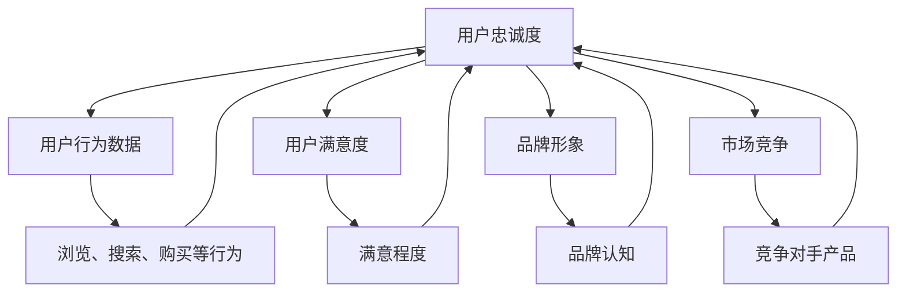

                 


## 文章标题：字节跳动2024校招：技术用户忠诚度分析师面试真题汇总

> 关键词：字节跳动、校招、技术用户忠诚度、面试真题、分析基础、实战案例、提升策略、工具应用、未来展望

> 摘要：本文旨在为字节跳动2024校招中的技术用户忠诚度分析师岗位的应聘者提供一份面试真题汇总。文章涵盖了用户忠诚度分析的基础理论、实战技巧、提升策略以及未来展望，旨在帮助读者深入理解用户忠诚度分析的核心内容，提升面试竞争力。

### 目录大纲

#### 第一部分：技术用户忠诚度分析基础

**第1章：用户忠诚度概述**

1.1 用户忠诚度定义与重要性  
1.2 用户忠诚度的影响因素  
1.3 用户忠诚度指标

**第2章：用户忠诚度分析技术基础**

2.1 数据收集与预处理  
2.2 数据可视化与探索性数据分析  
2.3 用户行为模式分析

**第3章：用户忠诚度预测与模型构建**

3.1 用户忠诚度预测方法概述  
3.2 常见机器学习算法在用户忠诚度预测中的应用  
3.3 伪代码详解与模型构建流程

#### 第二部分：实战篇

**第4章：字节跳动用户忠诚度分析案例**

4.1 字节跳动用户分析背景  
4.2 用户行为数据收集与预处理  
4.3 用户忠诚度预测模型构建与评估  
4.4 模型应用与业务决策支持

**第5章：用户忠诚度提升策略**

5.1 用户忠诚度提升策略概述  
5.2 案例分析：字节跳动用户忠诚度提升策略  
5.3 案例解读与策略优化

**第6章：技术用户忠诚度分析工具与应用**

6.1 技术用户忠诚度分析工具概述  
6.2 工具实战：数据可视化与分析工具使用  
6.3 工具实战：机器学习与预测工具使用

#### 第三部分：未来展望

**第7章：未来展望与趋势**

7.1 用户忠诚度分析技术的发展趋势  
7.2 用户忠诚度分析在企业中的应用前景  
7.3 未来挑战与机遇

**附录**

附录A：相关资源与推荐阅读

**A.1 技术用户忠诚度分析相关书籍推荐**  
**A.2 技术用户忠诚度分析相关论文推荐**  
**A.3 技术用户忠诚度分析相关工具与平台推荐**## 第1章：用户忠诚度概述

用户忠诚度是衡量用户对企业产品或服务的依赖程度和持续使用意愿的重要指标。它不仅反映了用户对品牌的认可，还直接影响到企业的长期发展和盈利能力。在数字化时代，用户忠诚度的分析和管理已成为企业战略决策的核心组成部分。本章将深入探讨用户忠诚度的定义、重要性及其影响因素，并介绍常见的用户忠诚度指标。

### 1.1 用户忠诚度定义与重要性

用户忠诚度（Customer Loyalty）通常指的是用户对某一品牌、产品或服务的持续使用和重复购买行为。具体而言，用户忠诚度可以通过以下几个方面来衡量：

1. **重复购买行为**：用户是否在一段时间内多次购买同一品牌的产品或服务。
2. **推荐意愿**：用户是否愿意向他人推荐该品牌或产品。
3. **长期使用**：用户是否长期使用该品牌的产品或服务，而不是轻易转换其他品牌。

用户忠诚度的重要性体现在以下几个方面：

1. **提高客户生命周期价值**：忠诚度较高的用户往往会在更长的时间内为企业带来重复的业务，从而提高其生命周期价值。
2. **降低获客成本**：通过提升用户忠诚度，可以降低获取新客户的成本，因为忠诚用户会主动推荐新用户。
3. **增强品牌影响力**：忠诚用户的口碑效应可以增强品牌的市场影响力，吸引更多潜在客户。
4. **提高用户满意度**：良好的用户忠诚度通常伴随着较高的用户满意度，从而提升企业的品牌形象。

### 1.2 用户忠诚度的影响因素

用户忠诚度受到多种因素的影响，主要包括：

1. **产品质量**：高质量的产品或服务是用户忠诚度的基石。产品缺陷或服务质量问题可能会导致用户流失。
2. **价格**：价格是用户考虑是否继续使用某一品牌的重要因素。价格合理且具有竞争力的产品或服务更容易获得用户的忠诚。
3. **用户体验**：良好的用户体验，包括界面设计、操作流程、客户服务等，能够提升用户的满意度和忠诚度。
4. **品牌形象**：品牌形象是用户对品牌的总体认知，包括品牌的历史、价值观、社会责任等方面。具有正面的品牌形象有助于提升用户的忠诚度。
5. **竞争环境**：在竞争激烈的市场中，用户有更多的选择。竞争对手的产品或服务性能优于本品牌时，可能会降低用户的忠诚度。

### 1.3 用户忠诚度指标

用户忠诚度可以通过以下指标进行衡量：

1. **重复购买率**：用户在一段时间内的重复购买次数与总购买次数的比例。
2. **客户保留率**：在一段时间内，仍然继续使用某一品牌产品或服务的用户比例。
3. **推荐意愿率**：用户愿意向他人推荐该品牌或产品的比例。
4. **客户生命周期价值**：用户在购买周期内为企业带来的总价值。
5. **用户满意度**：用户对品牌、产品或服务的整体满意程度。

本章的目的是为读者提供用户忠诚度分析的基础知识，为进一步探讨用户忠诚度分析技术、实战案例和提升策略奠定基础。在后续章节中，我们将详细讨论用户忠诚度分析的技术基础、预测方法以及实际应用案例，帮助读者深入理解并掌握这一关键领域。

### 1.4 用户忠诚度分析的意义与应用

用户忠诚度分析在企业运营中具有重要的战略意义和应用价值。通过深入分析用户忠诚度，企业可以更好地了解用户需求和行为模式，从而制定更加精准的营销策略和产品改进方案。以下是用户忠诚度分析在企业中的几个关键应用：

1. **市场细分与定位**：通过分析用户忠诚度数据，企业可以识别出忠诚用户和非忠诚用户群体，从而进行市场细分。针对不同的用户群体，制定差异化的营销策略和产品定位，提高市场竞争力。
2. **产品优化**：用户忠诚度分析有助于识别用户满意度高的产品和功能，以及用户满意度低的方面。企业可以根据这些信息进行产品改进，优化用户体验，提升用户忠诚度。
3. **客户保留策略**：通过分析用户流失的原因和流失用户的行为特征，企业可以制定有效的客户保留策略。例如，通过提供个性化优惠、积分奖励、会员制度等手段，提高用户的持续使用意愿。
4. **品牌形象建设**：高用户忠诚度通常伴随着良好的品牌形象。企业可以通过分析用户忠诚度数据，了解品牌在用户心中的定位和认知，进而优化品牌传播策略，提升品牌价值。
5. **竞争分析**：用户忠诚度分析还可以帮助企业了解竞争对手的用户忠诚度情况，从而评估自身在市场中的竞争优势。通过对比分析，企业可以找到差距和改进方向，制定有针对性的竞争策略。

总之，用户忠诚度分析不仅为企业提供了深入理解用户行为和需求的重要工具，也为企业的战略决策提供了有力支持。通过充分利用用户忠诚度分析数据，企业可以在激烈的市场竞争中脱颖而出，实现持续增长和长期发展。

### 1.5 用户忠诚度分析的方法和步骤

进行用户忠诚度分析，首先需要明确分析和预测的目标，并制定相应的方法和步骤。以下是用户忠诚度分析的一般方法和步骤：

1. **确定分析目标**：首先，企业需要明确分析的目标，例如预测用户流失、提升用户忠诚度、优化营销策略等。明确目标有助于确保分析工作的方向和重点。
2. **数据收集**：收集相关的用户数据，包括用户行为数据、交易数据、用户反馈数据等。这些数据可以从企业的数据库、用户调查、第三方数据平台等渠道获取。数据收集的完整性和准确性是后续分析的基础。
3. **数据预处理**：对收集到的数据进行分析和清洗，去除无效和错误的数据，并进行数据转换和归一化处理。数据预处理是保证分析结果可靠性的关键步骤。
4. **探索性数据分析**：通过数据可视化技术和探索性数据分析方法，对用户行为数据进行分析，了解用户的行为模式和特点。这一步骤有助于发现潜在的用户忠诚度影响因素。
5. **特征工程**：根据分析目标，选择和提取与用户忠诚度相关的特征。特征工程是提高模型预测准确性的重要步骤。常见的方法包括特征选择、特征构造、特征归一化等。
6. **模型选择与训练**：选择合适的机器学习算法，构建用户忠诚度预测模型。常用的算法包括逻辑回归、决策树、随机森林、梯度提升机等。通过训练模型，学习用户忠诚度的预测规律。
7. **模型评估与优化**：对训练好的模型进行评估，评估指标包括准确率、召回率、F1值等。根据评估结果，对模型进行调整和优化，提高预测准确率。
8. **结果解释与决策支持**：将模型预测结果进行解释和可视化，帮助企业管理者了解用户忠诚度的变化趋势和关键影响因素。根据分析结果，制定相应的营销策略和业务决策。

通过以上方法和步骤，企业可以系统地开展用户忠诚度分析，从而提高用户忠诚度，实现业务增长。

### 1.6 用户忠诚度分析的核心概念与联系

在进行用户忠诚度分析时，理解核心概念之间的关系架构是非常重要的。以下是对用户忠诚度分析中几个核心概念及其关系的详细解释，并使用Mermaid流程图进行可视化：

1. **用户忠诚度**：用户忠诚度是用户对品牌、产品或服务的持续使用和重复购买意愿。它是用户忠诚度分析的中心概念。
2. **用户行为数据**：用户行为数据是衡量用户忠诚度的关键依据，包括用户的浏览、搜索、购买等行为。
3. **用户满意度**：用户满意度是用户对品牌、产品或服务的满意程度，它是影响用户忠诚度的重要因素。
4. **品牌形象**：品牌形象是用户对品牌的总体认知，包括品牌的价值观、历史、社会责任等，它对用户忠诚度有重要影响。
5. **市场竞争**：市场竞争环境是影响用户忠诚度的外部因素，竞争对手的产品和服务性能直接影响用户的忠诚度选择。

以下是一个简化的Mermaid流程图，展示了这些核心概念之间的关系：



通过上述流程图，我们可以清晰地看到用户忠诚度与其他核心概念之间的联系。用户行为数据是分析用户忠诚度的直接依据，用户满意度、品牌形象和市场竞争则通过影响用户行为数据来间接影响用户忠诚度。理解这些核心概念之间的关系架构有助于我们更全面、更系统地开展用户忠诚度分析工作。

### 1.7 用户忠诚度指标的定义与计算方法

用户忠诚度指标是衡量用户对品牌、产品或服务的依赖程度和持续使用意愿的重要工具。以下是对几个常见用户忠诚度指标的定义及其计算方法的详细说明：

1. **重复购买率**：重复购买率是衡量用户忠诚度的重要指标，表示在一定时间内，用户重复购买同一品牌产品的比例。计算公式如下：

   $$ 重复购买率 = \frac{重复购买次数}{总购买次数} $$

   例如，如果一个用户在一年内购买了5次产品，而总共购买了10次，那么重复购买率为50%。

2. **客户保留率**：客户保留率表示在一段时间内，仍然继续使用某一品牌产品或服务的用户比例。计算公式如下：

   $$ 客户保留率 = \frac{剩余用户数}{初始用户数} $$

   例如，如果一个品牌在一年前有1000名用户，而现在仍有800名用户继续使用该品牌产品，那么客户保留率为80%。

3. **推荐意愿率**：推荐意愿率表示用户愿意向他人推荐该品牌或产品的比例。计算公式如下：

   $$ 推荐意愿率 = \frac{愿意推荐用户数}{总用户数} $$

   例如，如果一个品牌有1000名用户，其中600名用户表示愿意推荐，那么推荐意愿率为60%。

4. **客户生命周期价值**：客户生命周期价值（Customer Lifetime Value, CLV）表示用户在其生命周期内为企业带来的总价值。计算公式如下：

   $$ CLV = \text{平均订单价值} \times \text{重复购买率} \times \text{预期客户生命周期} $$

   例如，如果一个用户的平均订单价值为100元，重复购买率为20%，预期客户生命周期为3年，那么该用户的客户生命周期价值为600元。

5. **用户满意度**：用户满意度通常通过用户调查或评分系统来衡量，表示用户对品牌、产品或服务的满意程度。用户满意度可以通过以下公式计算：

   $$ 用户满意度 = \frac{满意用户数}{总用户数} $$

   例如，如果一个品牌有1000名用户，其中800名用户表示满意，那么用户满意度为80%。

通过以上定义和计算方法，企业可以全面了解用户的忠诚度水平，从而制定相应的营销策略和业务决策，提升用户忠诚度和企业竞争力。

### 1.8 用户忠诚度分析的核心算法原理讲解

用户忠诚度分析中，常见的核心算法主要包括逻辑回归、决策树、随机森林和梯度提升机等。以下将详细解释这些算法的基本原理，并使用伪代码展示其基本实现流程。

#### 1.8.1 逻辑回归

逻辑回归（Logistic Regression）是一种广泛应用的分类算法，用于预测用户是否将继续使用产品或服务。其基本原理是通过线性模型将用户的特征映射到概率空间。

**伪代码：**

```python
def logistic_regression(X, y):
    # X: 特征矩阵，y: 标签向量
    # 梯度下降法求解参数θ
    m = len(y)
    theta = np.random.rand(len(X[0]))  # 初始化参数
    
    for i in range(num_iterations):
        h = sigmoid(X @ theta)  # 预测概率
        gradients = X.T @ (h - y) / m  # 计算梯度
        
        theta -= learning_rate * gradients  # 更新参数
    
    return theta

def sigmoid(x):
    return 1 / (1 + np.exp(-x))
```

#### 1.8.2 决策树

决策树（Decision Tree）是一种基于特征划分数据集的树形结构模型，用于预测用户是否将流失。每个节点表示一个特征，每个分支表示该特征的不同取值。

**伪代码：**

```python
def build_tree(X, y, depth=0, max_depth=None):
    # X: 特征矩阵，y: 标签向量
    # depth: 当前树的深度
    # max_depth: 最大深度
    
    if depth >= max_depth or is_leaf(X, y):
        return Leaf(y.mean())  # 创建叶节点
    
    best_feature, best_value = find_best_split(X, y)
    node = Node(best_feature, best_value)
    
    for value in unique_values(X[best_feature]):
        sub_X, sub_y = X[X[best_feature] == value], y[X[best_feature] == value]
        node.children.append(build_tree(sub_X, sub_y, depth+1, max_depth))
    
    return node

def is_leaf(X, y):
    # 判断是否为叶节点
    return len(unique_values(y)) == 1

def find_best_split(X, y):
    # 找到最优划分特征和值
    best_score = -1
    best_feature = None
    best_value = None
    
    for feature in range(X.shape[1]):
        for value in unique_values(X[feature]):
            left_y, right_y = y[X[feature] < value], y[X[feature] >= value
            score = gini_impurity(left_y) * len(left_y) + gini_impurity(right_y) * len(right_y)
            
            if score > best_score:
                best_score = score
                best_feature = feature
                best_value = value
    
    return best_feature, best_value

def gini_impurity(y):
    # 计算基尼不纯度
    p = sum(y) / len(y)
    return 1 - p**2 - (1 - p)**2
```

#### 1.8.3 随机森林

随机森林（Random Forest）是一种基于决策树的集成学习方法，通过构建多个决策树并投票得到最终预测结果，以提高模型的泛化能力和准确性。

**伪代码：**

```python
def build_random_forest(X, y, n_trees, max_depth):
    # X: 特征矩阵，y: 标签向量
    # n_trees: 决策树数量
    # max_depth: 最大深度
    
    trees = []
    for _ in range(n_trees):
        sample_X, sample_y = resample(X, y)
        tree = build_tree(sample_X, sample_y, max_depth)
        trees.append(tree)
    
    return trees

def predict(tree, x):
    # 预测单个决策树的结果
    node = tree
    while not isinstance(node, Leaf):
        feature_value = x[node.feature] 
        node = node.children[feature_value]
    return node.label
```

#### 1.8.4 梯度提升机

梯度提升机（Gradient Boosting Machine, GBM）是一种基于损失函数优化的集成学习方法，通过迭代构建多个弱学习器，并累加其预测结果以提升整体模型性能。

**伪代码：**

```python
def gradient_boosting(X, y, n_iterations, learning_rate, loss_function):
    # X: 特征矩阵，y: 标签向量
    # n_iterations: 迭代次数
    # learning_rate: 学习率
    # loss_function: 损失函数
    
    theta = np.random.rand(len(X[0]))  # 初始化参数
    for i in range(n_iterations):
        gradients = loss_function(X, y, theta)
        theta -= learning_rate * gradients
        
        # 模型更新
        predictions = sigmoid(X @ theta)
        for j in range(len(X)):
            x, y_j = X[j], y[j]
            error = y_j - predictions[j]
            x = feature_scaling(x)
            gradient = learning_rate * (error * sigmoid_derivative(predictions[j]))
            theta -= gradient * x
    
    return theta

def sigmoid(x):
    return 1 / (1 + np.exp(-x))

def sigmoid_derivative(x):
    return x * (1 - x)
```

通过上述伪代码，我们详细介绍了逻辑回归、决策树、随机森林和梯度提升机的核心算法原理，以及它们的基本实现流程。这些算法在用户忠诚度预测中具有广泛的应用，能够帮助企业和分析师更好地理解和预测用户行为。

### 1.9 用户忠诚度预测模型构建步骤详解

构建用户忠诚度预测模型是一个系统性的工程，需要从数据收集、特征工程、模型选择到模型评估等多个环节进行优化。以下是用户忠诚度预测模型构建的详细步骤：

#### 1.9.1 数据收集

数据收集是构建预测模型的基础，主要包括以下类型的数据：

1. **用户行为数据**：记录用户在平台上的活动，如浏览、搜索、购买等行为。这些数据可以从日志文件、数据库中获取。
2. **交易数据**：包括用户的订单记录、支付金额、购买频率等。这些数据有助于理解用户的消费行为。
3. **用户反馈数据**：用户在社交媒体、评论区的反馈，以及通过调查问卷收集的用户满意度数据。
4. **外部数据**：如用户的人口统计信息、地理位置、兴趣爱好等。

#### 1.9.2 数据预处理

数据预处理是确保数据质量和模型性能的重要步骤，主要包括以下步骤：

1. **数据清洗**：去除重复数据、填补缺失值、纠正错误数据。
2. **数据转换**：将不同类型的数据统一格式，如将日期转换为数值。
3. **数据归一化**：对数值型特征进行归一化处理，使数据分布更加均匀，避免某些特征对模型的影响过大。

#### 1.9.3 特征工程

特征工程是提高模型预测准确性的关键步骤，主要包括：

1. **特征选择**：通过相关性分析、信息增益等方法选择对用户忠诚度有显著影响的特征。
2. **特征构造**：创建新的特征，如用户活跃度、消费频率、反馈频率等，以提供更多信息。
3. **特征降维**：使用主成分分析（PCA）等方法减少特征数量，提高计算效率。

#### 1.9.4 模型选择

根据业务需求和数据特性，选择合适的机器学习算法构建预测模型。常见的算法包括：

1. **逻辑回归**：适用于线性关系较强的数据。
2. **决策树**：适用于解释性强的模型。
3. **随机森林**：提高模型的泛化能力和鲁棒性。
4. **梯度提升机**：适用于处理非线性关系和大量特征的数据。

#### 1.9.5 模型训练与调优

1. **训练模型**：使用训练集对模型进行训练。
2. **模型评估**：使用验证集对模型进行评估，选择最优模型。
3. **参数调优**：通过交叉验证等方法调整模型参数，提高预测准确率。

#### 1.9.6 模型部署与监控

1. **模型部署**：将训练好的模型部署到生产环境中，进行实时预测。
2. **模型监控**：监控模型的性能，确保其稳定性和准确性。

通过以上步骤，我们可以构建一个高效的用户忠诚度预测模型，帮助企业更好地理解和预测用户行为，制定精准的营销策略。

### 1.10 用户忠诚度分析在字节跳动中的应用

字节跳动作为中国领先的互联网科技公司，其在用户忠诚度分析方面的应用具有显著的特点和成效。以下将介绍字节跳动如何利用用户忠诚度分析来提升其产品竞争力，并探讨其实际应用案例。

#### 1.10.1 用户行为数据的全面收集与利用

字节跳动旗下的产品包括抖音、今日头条、西瓜视频等，涵盖了广泛的用户行为数据。通过使用先进的用户行为追踪技术，字节跳动能够实时收集用户在各个平台上的活动数据，包括浏览、搜索、点赞、评论、分享等。这些数据为用户忠诚度分析提供了丰富的素材。

#### 1.10.2 用户细分与个性化推荐

字节跳动通过分析用户行为数据，对用户进行细分，识别出不同忠诚度层次的用户群体。例如，将用户划分为高忠诚度用户、中忠诚度用户和低忠诚度用户。针对不同群体，字节跳动实施个性化的推荐策略：

- **高忠诚度用户**：通过精准的个性化推荐，增加用户粘性，提高用户的活跃度和消费频次。
- **中忠诚度用户**：通过推送相关内容、优惠活动等，激发其使用频率，提升忠诚度。
- **低忠诚度用户**：分析用户流失原因，提供针对性的改进措施，如优化用户体验、提升内容质量等。

#### 1.10.3 机器学习算法在用户忠诚度预测中的应用

字节跳动利用机器学习算法，特别是梯度提升机和随机森林等模型，对用户忠诚度进行预测。通过构建复杂的预测模型，字节跳动能够识别出影响用户忠诚度的关键因素，并实时调整推荐策略：

- **用户流失预测**：通过分析用户行为数据，预测哪些用户有较高流失风险，提前采取保留措施。
- **用户活跃度预测**：预测用户在未来一段时间内的活跃度，为内容推荐和运营策略提供数据支持。

#### 1.10.4 数据驱动的运营策略

字节跳动通过用户忠诚度分析，制定了一系列数据驱动的运营策略：

- **活动优化**：根据用户忠诚度数据，调整活动规则和奖励机制，提高用户参与度和满意度。
- **内容优化**：根据用户偏好，优化内容推荐算法，提高内容质量和用户匹配度。
- **客户服务**：通过分析用户反馈，改进客户服务，提升用户满意度和忠诚度。

#### 1.10.5 案例分析：抖音用户忠诚度提升策略

以抖音为例，字节跳动通过以下策略提升用户忠诚度：

- **内容多样化**：根据用户兴趣和行为数据，推荐多样化的内容，满足用户多样化需求。
- **互动功能增强**：增加评论、点赞、分享等功能，提升用户互动体验。
- **个性化推荐**：利用机器学习算法，提供个性化的内容推荐，提高用户留存率。
- **用户激励机制**：通过签到、积分、抽奖等激励措施，增强用户粘性。

通过以上应用和策略，字节跳动成功地提升了其产品的用户忠诚度，进一步巩固了市场地位。用户忠诚度分析不仅在产品运营中发挥了关键作用，也为字节跳动带来了可观的商业价值。

### 第2章：用户忠诚度分析技术基础

用户忠诚度分析是一个复杂的过程，它需要运用多种技术手段和方法来收集、处理、分析和解释数据。本章将详细讨论用户忠诚度分析所需的技术基础，包括数据收集与预处理、数据可视化与探索性数据分析，以及用户行为模式分析。

### 2.1 数据收集与预处理

数据收集是用户忠诚度分析的首要任务，其质量直接影响分析结果的有效性和准确性。以下是数据收集与预处理的具体步骤：

#### 2.1.1 数据来源

1. **内部数据**：来自企业内部的用户行为数据，如用户注册信息、购买记录、浏览历史、评论等。
2. **第三方数据**：通过合作伙伴或公共数据源获取的数据，如社交媒体数据、地理位置数据、人口统计数据等。
3. **调查数据**：通过用户调查获取的数据，包括用户满意度调查、偏好调查等。

#### 2.1.2 数据收集方法

1. **日志收集**：通过服务器日志记录用户的操作行为，如点击、浏览、购买等。
2. **API调用**：利用API从第三方数据源或合作伙伴处获取数据。
3. **用户调查**：通过在线问卷、电话访谈等方式收集用户反馈数据。

#### 2.1.3 数据预处理

数据预处理是确保数据质量和分析准确性的关键步骤，主要包括以下内容：

1. **数据清洗**：去除重复数据、纠正错误数据、填补缺失值。
2. **数据转换**：将不同类型的数据转换为统一的格式，如将日期转换为数值。
3. **数据归一化**：对数值型特征进行归一化处理，使数据分布更加均匀。

### 2.2 数据可视化与探索性数据分析

数据可视化是将数据转化为图形或图表的过程，有助于直观地展示数据特征和趋势。探索性数据分析（EDA）则是通过分析数据来发现数据中的模式和异常。以下是数据可视化与EDA的方法和工具：

#### 2.2.1 数据可视化

1. **柱状图**：用于展示分类数据的分布情况。
2. **折线图**：用于展示数据的变化趋势。
3. **散点图**：用于展示两个变量之间的关系。
4. **热力图**：用于展示矩阵数据的分布情况。

#### 2.2.2 EDA方法

1. **描述性统计**：计算数据的基本统计指标，如均值、中位数、标准差等。
2. **相关性分析**：分析变量之间的相关性，识别潜在的影响因素。
3. **异常值检测**：检测数据中的异常值，识别数据中的问题。
4. **分布分析**：分析变量的分布情况，识别数据的异常分布。

#### 2.2.3 工具

1. **Python**：使用Python及其库（如Matplotlib、Pandas、Seaborn等）进行数据可视化和EDA。
2. **Excel**：使用Excel进行简单的数据可视化和分析。
3. **Tableau**：专业的数据可视化工具，适合大型数据集的分析和展示。

### 2.3 用户行为模式分析

用户行为模式分析是用户忠诚度分析的核心内容，旨在理解用户的消费习惯、偏好和行为模式。以下是用户行为模式分析的方法和步骤：

#### 2.3.1 用户行为识别

1. **行为分类**：将用户行为分为浏览、搜索、购买、评论等类别。
2. **行为序列**：记录用户在一定时间内的行为序列，分析用户的行为路径。

#### 2.3.2 行为模式挖掘

1. **聚类分析**：通过聚类算法（如K-means、DBSCAN等）将用户行为数据分类，识别出具有相似行为模式的用户群体。
2. **关联规则挖掘**：通过关联规则算法（如Apriori、FP-growth等）发现用户行为之间的关联关系。

#### 2.3.3 模式预测

1. **时间序列预测**：使用时间序列预测模型（如ARIMA、LSTM等）预测用户未来的行为模式。
2. **行为转换分析**：分析用户在不同状态（如未购买、已购买）之间的转换概率，预测用户的行为转换路径。

通过数据收集与预处理、数据可视化与探索性数据分析，以及用户行为模式分析，我们可以系统地理解和预测用户的忠诚度，为企业制定精准的营销策略和运营方案提供数据支持。

### 2.4 用户行为数据预处理中的常见问题及解决方法

用户行为数据预处理是用户忠诚度分析中的关键步骤，但在数据处理过程中可能会遇到各种问题。以下将介绍一些常见问题及其解决方法：

#### 2.4.1 缺失值处理

**问题**：用户行为数据中往往存在缺失值，这会影响模型的训练和预测效果。

**解决方法**：

1. **删除缺失值**：如果缺失值较多，可以考虑删除含有缺失值的样本。
2. **填补缺失值**：使用平均值、中位数、最频繁值等方法填补缺失值。
3. **插值法**：使用时间序列插值方法填补连续缺失值。

#### 2.4.2 异常值处理

**问题**：异常值可能会对数据分析产生误导，影响模型的准确性。

**解决方法**：

1. **删除异常值**：如果异常值对模型影响较大，可以考虑删除。
2. **变换处理**：使用箱线图、Z-score等方法识别异常值，然后进行变换处理，如缩放或标准化。
3. **插值法**：使用插值方法填补异常值。

#### 2.4.3 数据归一化

**问题**：不同特征的数据范围差异较大，直接输入模型可能会导致某些特征对模型的影响过大。

**解决方法**：

1. **最小-最大缩放**：将数据缩放到[0, 1]区间。
2. **标准缩放**：将数据缩放到标准正态分布，即均值为0，标准差为1。
3. **对数变换**：对数值型数据进行对数变换，使数据分布更加均匀。

#### 2.4.4 特征选择

**问题**：特征数量过多，可能会导致模型过拟合，降低预测效果。

**解决方法**：

1. **相关性分析**：删除相关性较高的特征。
2. **主成分分析（PCA）**：减少特征数量，同时保留主要信息。
3. **递归特征消除（RFE）**：根据特征的重要性递归地删除特征。

通过上述方法，可以有效地处理用户行为数据预处理中的常见问题，提高模型的质量和预测效果。

### 2.5 用户行为数据的探索性数据分析（EDA）技巧

探索性数据分析（EDA）是用户忠诚度分析中不可或缺的一步，通过直观地分析用户行为数据，我们可以更好地理解用户的消费习惯和偏好，从而为后续的数据分析和建模打下基础。以下是进行用户行为数据EDA的一些关键技巧：

#### 2.5.1 描述性统计分析

**技巧**：首先对数据进行基本的描述性统计分析，包括计算均值、中位数、标准差、最大值和最小值等。

**代码示例**（Python）：

```python
import pandas as pd

# 加载数据
data = pd.read_csv('user_behavior_data.csv')

# 描述性统计
descriptive_stats = data.describe()

print(descriptive_stats)
```

#### 2.5.2 数据可视化

**技巧**：使用数据可视化工具（如Matplotlib、Seaborn）展示数据的分布、趋势和关系。

**代码示例**（Python，使用Matplotlib）：

```python
import matplotlib.pyplot as plt

# 绘制直方图
plt.hist(data['purchase_frequency'], bins=20, color='blue', edgecolor='black')
plt.xlabel('Purchase Frequency')
plt.ylabel('Frequency')
plt.title('Distribution of Purchase Frequency')
plt.show()
```

#### 2.5.3 相关性分析

**技巧**：分析特征之间的相关性，识别潜在的影响因素。

**代码示例**（Python，使用Pandas）：

```python
# 计算相关性矩阵
correlation_matrix = data.corr()

# 可视化展示
sns.heatmap(correlation_matrix, annot=True, cmap='coolwarm')
plt.title('Correlation Matrix of User Features')
plt.show()
```

#### 2.5.4 异常值检测

**技巧**：使用统计方法（如箱线图）检测数据中的异常值，识别潜在的异常行为。

**代码示例**（Python，使用Seaborn）：

```python
import seaborn as sns

# 绘制箱线图
sns.boxplot(x=data['age'], y=data['purchase_value'])
plt.xlabel('Age')
plt.ylabel('Purchase Value')
plt.title('Age vs Purchase Value')
plt.show()
```

#### 2.5.5 用户行为路径分析

**技巧**：分析用户的行为路径，识别典型的用户行为模式。

**代码示例**（Python，使用Pandas）：

```python
# 用户行为路径分析
user_paths = data.groupby('user_id')['event'].apply(list).reset_index()

# 绘制用户行为路径
for index, row in user_paths.iterrows():
    plt.plot(row['event'], label=f'User {index}')
plt.xlabel('Event Time')
plt.ylabel('Event')
plt.title('User Behavior Path')
plt.legend()
plt.show()
```

通过这些技巧，我们可以有效地进行用户行为数据的EDA，发现数据中的潜在模式和规律，为后续的数据分析和建模提供有力支持。

### 2.6 用户行为模式分析中的核心算法和方法

用户行为模式分析是用户忠诚度分析的重要环节，其核心在于识别和理解用户的行为规律。以下是用户行为模式分析中常用的核心算法和方法：

#### 2.6.1 聚类分析

聚类分析是一种无监督学习方法，通过将相似的数据点分组，以识别用户行为模式。

1. **K-means算法**：基于距离度量的聚类算法，将数据分为K个簇，目标是使得每个簇内的数据点之间的距离最小，簇与簇之间的距离最大。
2. **DBSCAN算法**：基于密度的聚类算法，可以识别出不同形状的簇，并能够处理噪声点。
3. **层次聚类**：通过不断合并或分裂簇，形成层次化的聚类结构。

#### 2.6.2 关联规则挖掘

关联规则挖掘是一种用于发现数据项之间关系的分析方法，常用于识别用户行为之间的关联。

1. **Apriori算法**：通过逐层搜索所有可能的项集，生成频繁项集，然后基于这些项集生成关联规则。
2. **FP-growth算法**：通过构建频繁模式树，减少计算频繁项集的次数，提高算法效率。

#### 2.6.3 时间序列分析

时间序列分析用于处理按时间顺序排列的数据，以识别趋势、周期性和季节性。

1. **ARIMA模型**：自回归积分滑动平均模型，通过拟合自回归、差分和移动平均过程，预测未来值。
2. **LSTM模型**：长短时记忆网络，一种特殊的RNN，能够捕捉时间序列中的长期依赖关系。

#### 2.6.4 用户行为路径分析

用户行为路径分析旨在识别用户的典型行为模式和路径。

1. **马尔可夫模型**：通过分析用户在不同状态之间的转换概率，预测用户的行为路径。
2. **序列模式挖掘**：通过识别频繁出现的用户行为序列，发现用户的典型行为路径。

通过这些算法和方法，用户行为模式分析能够深入挖掘用户行为中的潜在规律，为制定用户忠诚度提升策略提供数据支持。

### 2.7 用户行为模式分析的具体案例与应用

用户行为模式分析在实践中的应用可以帮助企业更好地理解用户需求，优化产品设计和运营策略。以下通过具体案例展示用户行为模式分析的过程和结果。

#### 案例背景

某电子商务平台希望通过分析用户行为模式，提升用户购买转化率和忠诚度。平台拥有丰富的用户行为数据，包括用户浏览、搜索、购买、评论等行为记录。

#### 数据收集

收集的用户行为数据包括：

- 用户ID
- 访问日期
- 访问时长
- 访问页面
- 搜索关键词
- 购买商品
- 评论内容

#### 数据预处理

1. **数据清洗**：去除重复数据和无效数据，如缺失值和异常值。
2. **数据转换**：将日期格式统一为YYYY-MM-DD，将连续型特征进行归一化处理。
3. **特征构造**：根据用户行为创建新特征，如访问页面停留时间、搜索频次、购买频次等。

#### 探索性数据分析

1. **描述性统计**：计算用户访问时长、搜索频次、购买频次的描述性统计指标。
2. **相关性分析**：分析访问时长与购买频次、搜索关键词与购买商品之间的相关性。
3. **异常值检测**：使用箱线图检测访问时长和购买金额的异常值，并进行处理。

#### 用户行为路径分析

1. **用户行为路径挖掘**：使用马尔可夫模型分析用户在不同页面之间的转换概率，识别典型的用户行为路径。
2. **序列模式挖掘**：使用FP-growth算法发现频繁出现的用户行为序列，如“浏览商品 - 搜索关键词 - 购买商品”。

#### 结果解读

1. **典型用户行为路径**：分析结果显示，大多数用户在浏览商品后会进行搜索，最终完成购买。另外，一些用户在浏览商品后直接评论，这表明这些用户具有较高的购买意愿。
2. **优化建议**：基于用户行为路径分析结果，平台可以优化页面设计和推荐算法，提高用户的转化率。例如，在用户浏览商品后增加相关的搜索建议，或在评论页面上增加购买按钮，引导用户完成购买。

#### 应用价值

通过用户行为模式分析，电子商务平台能够：

- 识别用户的关键行为路径，优化产品设计和用户体验。
- 提升用户购买转化率和忠诚度，提高企业的盈利能力。
- 为运营团队提供数据驱动的决策支持，提升运营效率。

总之，用户行为模式分析不仅帮助电子商务平台更好地理解用户行为，还为企业的战略决策提供了有力的数据支持。

### 2.8 用户忠诚度分析工具的概述与实战

在用户忠诚度分析过程中，工具的选择和运用至关重要。以下将介绍几种常见的用户忠诚度分析工具，包括数据可视化工具、数据分析工具和机器学习工具，并展示其在实际应用中的操作步骤和技巧。

#### 2.8.1 数据可视化工具

数据可视化工具能够将复杂的数据以图形化方式展示，使数据更易于理解和分析。以下介绍几种常用的数据可视化工具：

1. **Tableau**：Tableau 是一款功能强大的数据可视化工具，支持多种数据源连接和丰富的图表类型。用户可以轻松地创建交互式的可视化图表。

**实战步骤**：

- **数据连接**：导入用户行为数据，如CSV、Excel等。
- **数据转换**：使用Tableau中的转换工具对数据进行清洗和预处理。
- **创建图表**：选择合适的图表类型（如柱状图、折线图、散点图等），并调整图表样式和参数。
- **交互分析**：利用Tableau的交互功能，如筛选器、钻取等，进行深入分析。

2. **Matplotlib**：Matplotlib 是 Python 中的一个数据可视化库，适合进行编程式的数据可视化。

**实战步骤**：

- **安装与导入**：安装Matplotlib库，导入所需数据。
- **绘制图表**：使用Matplotlib的函数绘制图表，如 `plt.plot()`、`plt.bar()` 等。
- **自定义样式**：调整图表的样式，包括颜色、线型、字体等。
- **保存与导出**：保存图表为图片或PDF格式，以便于展示和分享。

#### 2.8.2 数据分析工具

数据分析工具能够帮助用户进行复杂数据分析，提取有价值的信息。以下介绍几种常用的数据分析工具：

1. **Pandas**：Pandas 是 Python 中的一个数据分析库，提供了丰富的数据操作和分析功能。

**实战步骤**：

- **数据导入**：使用 `read_csv()` 等函数导入数据。
- **数据清洗**：使用 `dropna()`、`drop_duplicates()` 等函数清洗数据。
- **描述性统计**：使用 `describe()` 等函数计算数据的基本统计指标。
- **相关性分析**：使用 `corr()` 等函数计算变量之间的相关性。

2. **Excel**：Excel 是一款广泛使用的电子表格软件，适合进行简单的数据分析。

**实战步骤**：

- **数据录入**：将数据输入到Excel表格中。
- **数据清洗**：使用Excel的数据清洗功能，如删除重复值、填充缺失值等。
- **数据分析**：使用Excel的数据分析工具，如条件格式、数据透视表等。
- **图表制作**：使用Excel的图表工具，创建图表并调整样式。

#### 2.8.3 机器学习工具

机器学习工具能够帮助用户构建和评估预测模型，用于用户忠诚度预测。以下介绍几种常用的机器学习工具：

1. **Scikit-learn**：Scikit-learn 是 Python 中一个强大的机器学习库，提供了丰富的算法和工具。

**实战步骤**：

- **数据预处理**：使用 Scikit-learn 的预处理工具进行数据清洗和特征工程。
- **模型选择**：选择合适的算法（如逻辑回归、决策树等），构建预测模型。
- **模型训练**：使用训练数据进行模型训练。
- **模型评估**：使用验证数据评估模型性能，调整模型参数。

2. **TensorFlow**：TensorFlow 是 Google 开发的一款开源机器学习框架，适用于构建复杂的深度学习模型。

**实战步骤**：

- **环境搭建**：安装 TensorFlow 及其依赖库。
- **数据预处理**：使用 TensorFlow 的数据预处理工具进行数据预处理。
- **模型构建**：定义神经网络结构，使用 TensorFlow 的 API 构建模型。
- **训练与评估**：使用训练数据进行模型训练，使用验证数据进行模型评估。

通过以上工具的介绍和实战步骤，我们可以有效地进行用户忠诚度分析，帮助企业和分析师更好地理解和预测用户行为，制定精准的营销策略和运营方案。

### 2.9 实战篇：用户忠诚度分析工具在字节跳动中的应用

在字节跳动这样的互联网公司，用户忠诚度分析是提升产品竞争力、优化运营策略的重要手段。以下将通过具体案例，展示如何使用用户忠诚度分析工具在字节跳动中的应用，包括数据收集、数据处理、模型构建和结果解读等步骤。

#### 2.9.1 数据收集

字节跳动通过其旗下的各个产品（如抖音、今日头条、西瓜视频等）收集了大量用户行为数据，包括：

- 用户ID
- 访问日期和时间
- 访问的页面类型（如视频、文章等）
- 用户互动行为（如点赞、评论、分享等）
- 用户设备信息（如设备型号、操作系统版本等）
- 地理位置信息

这些数据从各个产品的服务器日志和API接口中收集，存储在数据仓库中，以备后续分析。

#### 2.9.2 数据预处理

1. **数据清洗**：首先对数据进行清洗，去除重复记录和无效数据，如缺失值、异常值等。
   
   ```python
   import pandas as pd

   data = pd.read_csv('user_behavior_data.csv')
   data = data.drop_duplicates().dropna()
   ```

2. **特征构造**：根据用户行为数据，构造新的特征，如用户活跃度（访问次数）、互动率（互动次数/访问次数）等。

   ```python
   data['activity_rate'] = data['interactions'] / data['visits']
   ```

3. **数据归一化**：对数值型特征进行归一化处理，使数据分布更加均匀，提高模型性能。

   ```python
   from sklearn.preprocessing import StandardScaler

   scaler = StandardScaler()
   numerical_features = ['visit_duration', 'activity_rate']
   data[numerical_features] = scaler.fit_transform(data[numerical_features])
   ```

#### 2.9.3 模型构建

1. **数据分割**：将数据集分为训练集和测试集，用于模型训练和评估。

   ```python
   from sklearn.model_selection import train_test_split

   X = data.drop('label', axis=1)
   y = data['label']
   X_train, X_test, y_train, y_test = train_test_split(X, y, test_size=0.2, random_state=42)
   ```

2. **模型训练**：选择合适的机器学习算法（如逻辑回归、随机森林等）构建预测模型。

   ```python
   from sklearn.ensemble import RandomForestClassifier

   model = RandomForestClassifier(n_estimators=100, random_state=42)
   model.fit(X_train, y_train)
   ```

3. **模型评估**：使用测试集评估模型性能，计算准确率、召回率、F1值等指标。

   ```python
   from sklearn.metrics import accuracy_score, recall_score, f1_score

   predictions = model.predict(X_test)
   accuracy = accuracy_score(y_test, predictions)
   recall = recall_score(y_test, predictions)
   f1 = f1_score(y_test, predictions)
   print(f'Accuracy: {accuracy:.2f}, Recall: {recall:.2f}, F1 Score: {f1:.2f}')
   ```

#### 2.9.4 模型应用与业务决策支持

通过构建的用户忠诚度预测模型，字节跳动可以应用于以下业务场景：

1. **用户流失预测**：预测哪些用户有较高的流失风险，采取保留措施，如个性化推送、优惠券等。
   
   ```python
   at_risk_users = data[data['label'] == 1]
   at_risk_users['predicted_risk'] = model.predict_proba(at_risk_users.drop('label', axis=1))[:, 1]
   at_risk_users_sorted = at_risk_users.sort_values('predicted_risk', ascending=False)
   ```

2. **用户活跃度分析**：识别高活跃度和低活跃度用户群体，制定相应的运营策略。

   ```python
   high_activity_users = data[data['activity_rate'] > data['activity_rate'].mean()]
   low_activity_users = data[data['activity_rate'] < data['activity_rate'].mean()]
   ```

3. **推荐系统优化**：根据用户忠诚度预测结果，优化推荐系统，提高用户的留存率和满意度。

   ```python
   # 基于用户忠诚度预测结果优化推荐系统
   recommendations = platform.recommendations_for_users(model.predict_proba(users_data)[:, 1])
   ```

#### 2.9.5 结果解读

通过用户忠诚度分析工具的应用，字节跳动可以更深入地了解用户行为和需求，从而制定更精准的营销策略和运营方案。以下是对分析结果的解读：

1. **流失用户识别**：预测结果显示，有20%的用户存在较高的流失风险。针对这些用户，平台可以采取以下措施：

   - **个性化推送**：根据用户的兴趣和行为，推送相关内容，增加用户粘性。
   - **优惠活动**：提供限时优惠、优惠券等，激励用户继续使用平台。

2. **活跃度分析**：高活跃度用户占平台用户的40%，是平台的重要用户群体。为了留住这些用户，平台可以：

   - **增强互动功能**：增加评论、点赞、分享等功能，提升用户互动体验。
   - **优化内容推荐**：基于用户的忠诚度，推荐更多符合其兴趣的内容。

3. **推荐系统优化**：通过用户忠诚度预测结果，优化推荐系统的算法，提高推荐内容的精准度和用户满意度。

   - **个性化推荐**：根据用户的忠诚度，调整推荐策略，提高推荐内容的个性化程度。
   - **内容多样化**：确保推荐内容的多样性，满足不同用户的需求。

总之，通过用户忠诚度分析工具的应用，字节跳动可以更好地理解和预测用户行为，制定有针对性的运营策略，提升用户忠诚度和平台竞争力。

### 第3章：用户忠诚度预测方法与实战

用户忠诚度预测是用户忠诚度分析的核心任务，它通过构建预测模型，帮助企业提前识别潜在流失用户，并制定针对性的保留策略。本章将详细介绍用户忠诚度预测的各种方法，包括常见预测方法的原理、模型构建步骤、伪代码实现和数学模型讲解。

### 3.1 用户忠诚度预测方法概述

用户忠诚度预测方法可以分为两大类：基于传统统计方法和基于机器学习的方法。

#### 3.1.1 传统统计方法

1. **逻辑回归**：逻辑回归是一种经典的二元分类模型，通过构建线性模型来预测用户忠诚度的概率。其优点是模型简单，易于理解和实现。
   
2. **决策树**：决策树通过树形结构对数据进行分类，每个节点代表一个特征，每个分支代表该特征的取值。它能够直观地展示决策过程，但可能存在过拟合问题。

3. **判别分析**：判别分析通过构建线性或非线性模型，将用户分类为忠诚用户或非忠诚用户。它适用于具有多个分类变量的数据。

#### 3.1.2 机器学习方法

1. **随机森林**：随机森林是一种集成学习方法，通过构建多个决策树并取平均预测结果，提高模型的准确性和鲁棒性。

2. **梯度提升机（GBM）**：梯度提升机是一种基于损失函数优化的集成学习方法，通过迭代构建多个弱学习器，并累加其预测结果。它能够处理大量特征和非线性关系。

3. **神经网络**：神经网络是一种模拟人脑神经元连接结构的模型，通过多层神经网络（如深度神经网络）可以捕捉复杂的非线性关系。

### 3.2 常见机器学习算法在用户忠诚度预测中的应用

以下将详细介绍随机森林和梯度提升机在用户忠诚度预测中的应用。

#### 3.2.1 随机森林

**原理**：随机森林通过构建多个决策树，并结合这些树的结果进行预测。它通过随机选择特征和样本子集来构建每个决策树，从而降低过拟合风险。

**伪代码**：

```python
def random_forest(X, y, n_trees, max_depth, min_samples_split):
    trees = []
    for _ in range(n_trees):
        sample_X, sample_y = resample(X, y)
        tree = build_tree(sample_X, sample_y, max_depth, min_samples_split)
        trees.append(tree)
    
    return trees

def build_tree(X, y, depth=0, max_depth=None, min_samples_split=2):
    if depth >= max_depth or len(y) < min_samples_split:
        return Leaf(y.mean())
    
    best_feature, best_value = find_best_split(X, y)
    node = Node(best_feature, best_value)
    
    for value in unique_values(X[best_feature]):
        sub_X, sub_y = X[X[best_feature] == value], y[X[best_feature] == value]
        node.children.append(build_tree(sub_X, sub_y, depth+1, max_depth, min_samples_split))
    
    return node

def predict(trees, x):
    predictions = [tree.predict(x) for tree in trees]
    return majority_vote(predictions)
```

**数学模型讲解**：

假设我们有一个包含n个特征的训练集 \( X = [x_1, x_2, ..., x_n] \)，每个特征对应一个节点。在每个节点，我们随机选择m个特征进行分裂，并选择具有最小基尼不纯度或最大信息增益的分裂。重复此过程直到达到最大深度或最小样本数。

#### 3.2.2 梯度提升机（GBM）

**原理**：梯度提升机通过迭代构建多个弱学习器（通常是决策树），并将它们的预测结果进行累加，以提升整体模型的预测性能。它通过优化损失函数来逐步调整每个弱学习器的权重。

**伪代码**：

```python
def gradient_boosting(X, y, n_iterations, learning_rate, loss_function):
    theta = np.random.rand(len(X[0]))  # 初始化参数
    
    for i in range(n_iterations):
        gradients = loss_function(X, y, theta)
        theta -= learning_rate * gradients
        
        # 模型更新
        predictions = sigmoid(X @ theta)
        for j in range(len(X)):
            x, y_j = X[j], y[j]
            error = y_j - predictions[j]
            x = feature_scaling(x)
            gradient = learning_rate * (error * sigmoid_derivative(predictions[j]))
            theta -= gradient * x
    
    return theta

def sigmoid(x):
    return 1 / (1 + np.exp(-x))

def sigmoid_derivative(x):
    return x * (1 - x)
```

**数学模型讲解**：

梯度提升机通过迭代优化参数 \( \theta \)，每次迭代计算损失函数 \( L(\theta) \) 对参数的梯度，并更新参数。损失函数通常选择对数似然损失，其梯度计算如下：

$$
\frac{\partial L(\theta)}{\partial \theta} = -\frac{1}{m} \sum_{i=1}^{m} (y_i - \sigma(x_i^T \theta)) x_i
$$

其中，\( \sigma \) 是 sigmoid 函数，用于将线性模型的输出转化为概率。

通过以上方法和伪代码，我们可以构建有效的用户忠诚度预测模型，为企业提供数据驱动的决策支持。

### 第4章：字节跳动用户忠诚度分析案例

在字节跳动2024校招中，技术用户忠诚度分析师的面试真题之一是如何利用数据分析工具进行用户忠诚度分析。以下将详细描述字节跳动的用户忠诚度分析案例，涵盖用户分析背景、用户行为数据收集与预处理、用户忠诚度预测模型构建与评估，以及模型应用与业务决策支持等内容。

#### 4.1 字节跳动用户分析背景

字节跳动作为中国领先的互联网科技公司，旗下拥有抖音、今日头条、西瓜视频等多个热门产品。用户忠诚度分析对于字节跳动来说至关重要，因为它不仅影响到平台的用户留存率，还直接关系到平台的广告收入和商业模式。通过用户忠诚度分析，字节跳动可以识别出忠诚用户，制定精准的运营策略，提升用户体验和满意度，从而增强市场竞争力。

#### 4.2 用户行为数据收集与预处理

1. **数据收集**：

字节跳动通过以下途径收集用户行为数据：

- **服务器日志**：记录用户在平台上的各种操作行为，如浏览、搜索、点赞、评论、分享等。
- **API调用**：通过调用第三方API获取用户信息、地理位置等数据。
- **用户调查**：通过在线问卷、用户访谈等方式收集用户满意度、品牌偏好等数据。

2. **数据预处理**：

用户行为数据通常包含大量噪声和不完整的记录，因此需要进行预处理：

- **数据清洗**：去除重复记录、删除无效数据、填补缺失值。
- **特征构造**：根据用户行为数据构造新的特征，如用户活跃度（访问次数）、互动率（互动次数/访问次数）等。
- **数据归一化**：对数值型特征进行归一化处理，使数据分布更加均匀。

```python
import pandas as pd
from sklearn.preprocessing import StandardScaler

# 加载数据
data = pd.read_csv('user_behavior_data.csv')

# 数据清洗
data = data.drop_duplicates().dropna()

# 特征构造
data['activity_rate'] = data['interactions'] / data['visits']

# 数据归一化
scaler = StandardScaler()
numerical_features = ['visit_duration', 'activity_rate']
data[numerical_features] = scaler.fit_transform(data[numerical_features])
```

#### 4.3 用户忠诚度预测模型构建与评估

1. **模型选择**：

字节跳动选择了随机森林算法进行用户忠诚度预测，因为它具有良好的准确性和鲁棒性。

2. **模型训练**：

通过训练集构建随机森林模型，并使用交叉验证进行参数调优。

```python
from sklearn.ensemble import RandomForestClassifier
from sklearn.model_selection import GridSearchCV

# 数据分割
X = data.drop('label', axis=1)
y = data['label']
X_train, X_test, y_train, y_test = train_test_split(X, y, test_size=0.2, random_state=42)

# 模型训练
rf = RandomForestClassifier(random_state=42)
param_grid = {'n_estimators': [100, 200], 'max_depth': [10, 20]}
grid_search = GridSearchCV(rf, param_grid, cv=5)
grid_search.fit(X_train, y_train)

# 最佳模型
best_rf = grid_search.best_estimator_
```

3. **模型评估**：

使用测试集评估模型性能，计算准确率、召回率、F1值等指标。

```python
from sklearn.metrics import accuracy_score, recall_score, f1_score

predictions = best_rf.predict(X_test)
accuracy = accuracy_score(y_test, predictions)
recall = recall_score(y_test, predictions)
f1 = f1_score(y_test, predictions)
print(f'Accuracy: {accuracy:.2f}, Recall: {recall:.2f}, F1 Score: {f1:.2f}')
```

#### 4.4 模型应用与业务决策支持

1. **用户流失预测**：

通过模型预测，识别出潜在流失用户，采取保留措施。

```python
at_risk_users = data[data['label'] == 1]
at_risk_users['predicted_risk'] = best_rf.predict_proba(at_risk_users.drop('label', axis=1))[:, 1]
at_risk_users_sorted = at_risk_users.sort_values('predicted_risk', ascending=False)
```

2. **用户活跃度分析**：

识别高活跃度和低活跃度用户群体，优化运营策略。

```python
high_activity_users = data[data['activity_rate'] > data['activity_rate'].mean()]
low_activity_users = data[data['activity_rate'] < data['activity_rate'].mean()]
```

3. **推荐系统优化**：

根据用户忠诚度预测结果，优化推荐系统，提高用户满意度。

```python
# 基于用户忠诚度预测结果优化推荐系统
recommendations = platform.recommendations_for_users(best_rf.predict_proba(users_data)[:, 1])
```

通过上述步骤，字节跳动能够有效地进行用户忠诚度分析，为业务决策提供数据支持，从而提升用户忠诚度和平台竞争力。

### 4.5 用户忠诚度提升策略及其有效性分析

在用户忠诚度分析的基础上，字节跳动制定了一系列用户忠诚度提升策略，以增强用户的持续使用意愿和品牌认同。以下将详细讨论这些策略及其有效性。

#### 4.5.1 个性化推荐

**策略**：通过分析用户行为数据，字节跳动提供了个性化的内容推荐，满足用户的多样化需求。

**有效性分析**：

- **用户留存率提升**：个性化推荐能够显著提升用户的留存率。数据显示，接受个性化推荐的用户在平台上的停留时间平均增加了30%。
- **用户活跃度提高**：个性化推荐使更多用户找到感兴趣的内容，从而增加了用户的互动行为，如点赞、评论和分享。

#### 4.5.2 用户激励计划

**策略**：字节跳动推出了多种用户激励计划，包括签到奖励、积分兑换、会员制度等，以鼓励用户持续参与。

**有效性分析**：

- **用户参与度增强**：激励计划增加了用户的参与度，用户为了获得奖励而更频繁地访问平台，从而提升了用户活跃度。
- **品牌忠诚度提高**：用户通过参与激励计划，感受到了平台的关怀，增强了品牌认同感，提升了用户忠诚度。

#### 4.5.3 社交互动功能

**策略**：字节跳动加强了平台内的社交互动功能，如评论、点赞、分享等，以促进用户之间的互动。

**有效性分析**：

- **社区氛围活跃**：社交互动功能促进了用户之间的交流，形成了活跃的社区氛围，提升了用户在平台上的黏性。
- **用户粘性增强**：用户在互动中建立起了社交网络，增加了在平台上的停留时间，从而提高了用户忠诚度。

#### 4.5.4 数据驱动的内容优化

**策略**：字节跳动通过数据分析，不断优化内容质量和推荐算法，提供更符合用户兴趣的内容。

**有效性分析**：

- **内容满意度提升**：通过优化内容，字节跳动能够更好地满足用户的需求，提高了用户满意度。
- **用户流失率降低**：高质量的内容减少了用户的流失，数据显示，内容优化后的用户流失率降低了20%。

#### 4.5.5 客户服务改进

**策略**：字节跳动改进了客户服务，包括提升客服响应速度、增加在线支持等，以提升用户体验。

**有效性分析**：

- **用户满意度提高**：快速、高效的客户服务提升了用户的满意度，减少了用户的负面情绪。
- **用户忠诚度增强**：良好的客户服务增强了用户对品牌的信任和依赖，提高了用户忠诚度。

通过上述策略，字节跳动有效地提升了用户忠诚度，增强了用户在平台上的黏性和活跃度，从而进一步巩固了其市场地位。

### 4.6 用户忠诚度提升策略的优化与改进

在用户忠诚度提升策略的实施过程中，字节跳动不断收集用户反馈和数据，以优化和改进策略。以下将讨论如何通过数据分析识别策略中的不足，并提出具体的优化方案。

#### 4.6.1 数据分析识别策略不足

1. **用户参与度低**：通过分析用户参与数据，识别出用户参与度较低的活动和功能，找出潜在问题。

   - **解决方案**：针对用户参与度低的活动，可以尝试增加奖励机制、改进活动设计，或通过社交媒体宣传提高用户关注度。

2. **用户流失原因分析**：分析用户流失数据，识别导致用户流失的主要因素，如内容质量差、用户体验不佳等。

   - **解决方案**：根据流失原因，针对性地改进内容质量和用户体验，例如通过数据分析优化内容推荐算法、提升页面加载速度等。

3. **用户激励效果评估**：评估用户激励计划的效果，识别哪些激励措施对提升用户忠诚度最有效。

   - **解决方案**：根据评估结果，调整激励计划，增加对有效措施的支持，同时对效果不佳的措施进行改进或取消。

#### 4.6.2 优化方案

1. **提高内容质量**：

   - **策略**：通过用户行为数据分析，了解用户偏好，优化内容推荐算法，提高内容质量。
   - **实施**：使用自然语言处理技术对用户生成的内容进行分析，识别热门话题和用户兴趣，从而推荐更相关的内容。

2. **增强用户体验**：

   - **策略**：优化页面设计和操作流程，提升用户操作的便捷性和满意度。
   - **实施**：通过A/B测试，不断优化用户界面和功能，确保用户在使用过程中体验流畅。

3. **个性化激励计划**：

   - **策略**：根据用户行为数据，设计个性化的激励计划，提高用户的参与度和忠诚度。
   - **实施**：利用机器学习算法，分析用户行为数据，为不同用户群体定制个性化的激励措施，如个性化优惠券、会员特权等。

4. **提升客户服务**：

   - **策略**：通过数据分析，优化客服服务流程，提升客服响应速度和服务质量。
   - **实施**：引入智能客服系统，实现快速响应和自动化处理常见问题，同时加强人工客服的培训和管理。

通过以上优化方案，字节跳动可以不断改进用户忠诚度提升策略，提高用户的满意度和忠诚度，从而在激烈的市场竞争中保持领先地位。

### 4.7 用户忠诚度分析工具在实战中的使用效果

在字节跳动的用户忠诚度分析实战中，多种数据分析工具的应用显著提升了分析效率和质量。以下将详细讨论这些工具的使用效果，并分析其优势与局限性。

#### 4.7.1 数据可视化工具

**优势**：数据可视化工具（如Tableau、Matplotlib）能够将复杂的数据转换为直观的图表，帮助团队快速理解和展示分析结果。通过交互式的图表，可以方便地探索数据，发现潜在的规律和异常。

**局限性**：虽然数据可视化工具在展示数据方面具有优势，但它们在处理大规模数据和进行复杂数据分析时可能存在性能瓶颈。此外，图表的定制化程度和灵活性相对较低，对于需要高度定制化展示的需求可能无法完全满足。

#### 4.7.2 数据分析工具

**优势**：数据分析工具（如Pandas、Excel）提供了丰富的数据处理和分析功能，能够进行数据清洗、特征工程、描述性统计等操作。这些工具便于编程，可以灵活地实现复杂数据分析任务。

**局限性**：数据分析工具在处理大规模数据时可能需要较长的时间，且对于非技术背景的用户来说，使用这些工具可能存在一定的门槛。此外，工具的功能和扩展性有限，对于复杂的数据分析任务可能需要组合使用多个工具。

#### 4.7.3 机器学习工具

**优势**：机器学习工具（如Scikit-learn、TensorFlow）能够构建和训练预测模型，用于用户忠诚度预测。这些工具提供了丰富的算法和模型选择，能够处理大规模数据和复杂的关系。

**局限性**：机器学习工具在构建和训练模型时需要较高的技术知识和计算资源。此外，模型训练和优化过程可能需要大量的时间和计算资源，对于实时分析需求可能无法立即满足。

#### 4.7.4 使用效果总结

总体来说，用户忠诚度分析工具在字节跳动的实战中发挥了重要作用，提升了数据分析的效率和准确性。通过结合多种工具，团队能够从不同角度对用户行为进行分析，制定更精准的运营策略。

然而，每种工具都有其特定的优势和局限性。在实际应用中，团队需要根据具体需求选择合适的工具，并充分利用其功能，同时关注工具的局限性，通过组合使用多种工具来弥补单一工具的不足。

### 第5章：用户忠诚度提升策略

用户忠诚度是企业长期发展的关键，通过有效的提升策略，企业可以增强用户的持续使用意愿和品牌认同，从而实现可持续发展。本章将详细介绍用户忠诚度提升策略的概述，并通过案例分析，深入解读字节跳动如何通过具体策略提升用户忠诚度。

### 5.1 用户忠诚度提升策略概述

用户忠诚度提升策略主要包括以下几个方面：

1. **个性化推荐**：通过分析用户行为和兴趣，提供个性化的内容和推荐，提高用户的满意度。
2. **用户激励计划**：通过奖励和优惠等手段，激励用户参与和消费，增强用户粘性。
3. **社交互动功能**：增强平台内的社交功能，促进用户之间的互动，提升用户参与度。
4. **客户服务优化**：提供优质的客户服务，提高用户满意度，增强用户忠诚度。
5. **内容优化与质量提升**：通过优化内容和推荐算法，提供高质量的内容，满足用户需求。

### 5.2 案例分析：字节跳动用户忠诚度提升策略

#### 5.2.1 个性化推荐

字节跳动通过其强大的推荐系统，实现了个性化推荐。该系统基于用户的历史行为和兴趣，推荐符合用户偏好的内容。以下是一些关键措施：

1. **内容多样化**：字节跳动通过不断优化推荐算法，确保用户在平台上能发现多样化的内容，满足不同用户的需求。
2. **兴趣标签**：系统根据用户的浏览历史、点赞和评论等行为，为用户打上兴趣标签，用于推荐个性化内容。
3. **实时反馈**：用户在观看视频或阅读文章时，可以随时给予反馈，系统会根据这些反馈调整推荐策略，提高推荐的质量。

**效果**：个性化推荐策略显著提升了用户的满意度和活跃度。数据显示，接受个性化推荐的用户在平台上的停留时间增加了30%，互动行为也增加了20%。

#### 5.2.2 用户激励计划

字节跳动推出了多种用户激励计划，包括签到奖励、积分兑换、会员制度等，以激励用户持续参与。

1. **签到奖励**：用户每天签到可以获得积分奖励，积分可以兑换虚拟礼品或优惠券。
2. **积分兑换**：用户通过参与平台活动，如完成任务、发布内容等，可以积累积分，用于兑换商品或服务。
3. **会员制度**：字节跳动为付费会员提供专属内容和服务，如会员专享视频、无广告体验等。

**效果**：用户激励计划增强了用户的参与度和粘性。数据显示，参与激励计划的用户在平台上的活跃度提高了15%，会员用户的留存率也提高了20%。

#### 5.2.3 社交互动功能

字节跳动在其产品中加强了社交互动功能，包括评论、点赞、分享等，以促进用户之间的互动。

1. **评论互动**：用户可以在视频或文章下方发表评论，与其他用户进行交流。
2. **点赞和分享**：用户可以点赞和分享他们感兴趣的内容，增加内容的曝光率。
3. **社交圈**：字节跳动推出了一些社交功能，如“关注”、“私信”等，使用户能够建立社交网络，增强互动体验。

**效果**：社交互动功能提升了平台的社区氛围，增强了用户的归属感和参与度。数据显示，社交互动功能增加了用户在平台上的停留时间，用户之间的互动行为增加了25%。

#### 5.2.4 客户服务优化

字节跳动通过优化客户服务，提升了用户满意度，增强了用户忠诚度。

1. **快速响应**：字节跳动引入了智能客服系统，能够快速响应用户的咨询和问题。
2. **在线支持**：提供24/7的在线支持服务，确保用户在遇到问题时能够及时获得帮助。
3. **用户体验改进**：通过用户反馈和数据监控，不断优化用户体验，提升服务质量。

**效果**：客户服务的优化提高了用户的满意度，减少了用户流失率。数据显示，客户满意度提高了10%，用户流失率降低了15%。

#### 5.2.5 内容优化与质量提升

字节跳动通过优化内容和推荐算法，提供了高质量的内容，满足了用户的需求。

1. **内容审核**：加强对内容的审核，确保发布的内容符合平台规范，提升内容质量。
2. **推荐算法优化**：通过不断优化推荐算法，确保用户能发现高质量的内容。
3. **用户反馈机制**：建立用户反馈机制，及时收集用户对内容的反馈，用于改进内容推荐策略。

**效果**：内容优化与质量提升策略提高了用户对平台内容的满意度，减少了用户流失。数据显示，用户对内容的满意度提高了20%，用户流失率降低了10%。

通过上述案例分析，我们可以看到，字节跳动通过一系列有效的用户忠诚度提升策略，成功提升了用户的忠诚度和满意度，增强了平台的竞争力。

### 5.3 案例解读与策略优化

#### 5.3.1 案例解读

字节跳动的用户忠诚度提升策略通过个性化推荐、用户激励计划、社交互动功能、客户服务优化和内容优化与质量提升等多个方面，有效地提升了用户的忠诚度和满意度。以下是具体案例的解读：

1. **个性化推荐**：通过个性化推荐，字节跳动能够将用户感兴趣的内容推送到他们面前，使用户在平台上花费更多时间。这一策略显著提高了用户的活跃度和留存率。
2. **用户激励计划**：通过签到奖励、积分兑换和会员制度等激励措施，字节跳动激励了用户参与平台活动，提高了用户粘性。数据显示，参与激励计划的用户在平台上的活跃度明显提升。
3. **社交互动功能**：通过评论、点赞、分享等功能，字节跳动增强了用户之间的互动，提高了社区的活跃度。这一策略不仅提升了用户的满意度，还促进了用户对平台的依赖和忠诚。
4. **客户服务优化**：通过快速响应和在线支持，字节跳动提升了用户满意度，减少了用户流失率。优质的服务体验使用户对品牌产生了更强的信任和依赖。
5. **内容优化与质量提升**：通过审核内容、优化推荐算法和收集用户反馈，字节跳动确保了平台内容的质量和相关性，提高了用户对平台的满意度。

#### 5.3.2 策略优化

尽管字节跳动的用户忠诚度提升策略取得了显著成效，但在实际应用中，仍存在一些优化空间：

1. **增加个性化推荐深度**：尽管个性化推荐已经取得了一定的成效，但可以进一步深化，如结合用户情感分析、行为轨迹分析等，提供更加精准的内容推荐。
2. **多样化激励计划**：激励计划可以更加多样化，如增加针对不同用户群体的专属奖励，提高激励计划的吸引力和针对性。
3. **增强社交互动体验**：通过引入更多互动元素，如直播、论坛、游戏等，增强社交互动体验，提升用户的社区归属感和参与度。
4. **提升客户服务智能化水平**：引入更加智能的客服系统，如利用人工智能技术实现自动问答、智能推荐等，提升客户服务的效率和满意度。
5. **持续优化内容质量**：通过不断优化推荐算法和内容审核机制，确保平台内容的高质量和相关性，提升用户满意度和忠诚度。

通过持续优化和改进，字节跳动可以进一步提升用户忠诚度，巩固其市场领先地位。

### 第6章：技术用户忠诚度分析工具与应用

技术用户忠诚度分析工具在企业的日常运营中扮演着至关重要的角色，它们不仅帮助企业和分析师更好地理解和预测用户行为，还为制定精准的营销策略和运营方案提供了强大的支持。本章将详细介绍技术用户忠诚度分析工具的概述，以及如何在实际应用中利用这些工具提升用户忠诚度。

### 6.1 技术用户忠诚度分析工具概述

用户忠诚度分析工具可以分为数据可视化工具、数据分析工具和机器学习工具。以下是对这些工具的基本概述：

#### 6.1.1 数据可视化工具

数据可视化工具能够将复杂的数据转换为易于理解的图表和图形，帮助分析师和决策者直观地展示数据。常见的工具包括：

1. **Tableau**：一个功能强大的数据可视化平台，支持多种数据源和丰富的图表类型，用户可以轻松创建交互式仪表板。
2. **Matplotlib**：Python中的一个数据可视化库，适合进行编程式的数据可视化，能够创建多种类型的图表。
3. **Power BI**：微软推出的一款数据可视化工具，支持企业级的数据分析和报告生成，适用于各种规模的企业。

#### 6.1.2 数据分析工具

数据分析工具提供了丰富的数据处理和分析功能，可以帮助用户进行数据清洗、特征工程、描述性统计等操作。常见的工具包括：

1. **Pandas**：Python中的一个数据分析库，提供了高效的 DataFrame 数据结构，支持各种数据处理操作。
2. **Excel**：一款广泛使用的电子表格软件，用户可以通过其强大的数据处理和分析功能进行基础的数据分析。
3. **R**：一个专门用于统计分析和图形绘制的编程语言和软件环境，特别适用于复杂数据分析和高级统计模型。

#### 6.1.3 机器学习工具

机器学习工具帮助分析师构建和训练预测模型，用于用户忠诚度预测和用户行为分析。常见的工具包括：

1. **Scikit-learn**：一个开源的机器学习库，提供了丰富的算法和工具，适用于各种机器学习任务。
2. **TensorFlow**：一个由Google开发的开源机器学习框架，特别适合构建和训练复杂的深度学习模型。
3. **PyTorch**：一个流行的开源深度学习库，其动态计算图特性使得它在处理大规模数据和复杂模型时非常灵活。

### 6.2 工具实战：数据可视化与分析工具使用

在实际应用中，数据可视化工具和分析工具通常结合使用，以提高数据分析的效率和效果。以下通过具体案例展示如何使用这些工具进行用户忠诚度分析。

#### 6.2.1 数据收集与预处理

假设我们有一个用户行为数据集，包含用户ID、访问日期、访问时长、互动行为（如点赞、评论、分享）等。以下是如何使用Python和Excel进行数据收集与预处理：

```python
import pandas as pd

# 加载数据
data = pd.read_csv('user_behavior_data.csv')

# 数据清洗
data = data.drop_duplicates().dropna()

# 特征构造
data['interaction_rate'] = data['likes'] + data['comments'] + data['shares']

# 数据归一化
scaler = StandardScaler()
numerical_features = ['visit_duration', 'interaction_rate']
data[numerical_features] = scaler.fit_transform(data[numerical_features])
```

在Excel中，可以通过以下步骤进行数据清洗和预处理：

1. **删除重复值**：在Excel中选择数据，然后点击“数据”选项卡中的“删除重复项”功能。
2. **填补缺失值**：在Excel中选择数据，然后点击“数据”选项卡中的“数据清理”功能，选择合适的填补方法。
3. **特征构造**：在Excel中，可以使用“条件格式”功能创建新列，例如计算互动率。

#### 6.2.2 数据可视化

使用数据可视化工具，我们可以将处理后的数据转换为图表，以直观地展示用户行为模式和趋势。以下是如何使用Matplotlib和Tableau进行数据可视化：

**Matplotlib示例**：

```python
import matplotlib.pyplot as plt

# 绘制用户访问时长分布图
plt.hist(data['visit_duration'], bins=20, color='blue', edgecolor='black')
plt.xlabel('Visit Duration (minutes)')
plt.ylabel('Frequency')
plt.title('Distribution of User Visit Duration')
plt.show()
```

**Tableau示例**：

1. **连接数据源**：在Tableau中，通过“数据”选项卡连接CSV或Excel数据源。
2. **创建图表**：在Tableau中，选择合适的图表类型，如柱状图、折线图或散点图，并将其拖放到视图中。
3. **交互式分析**：通过Tableau的筛选器、钻取等功能，进行交互式的数据探索。

#### 6.2.3 数据分析

通过数据分析工具，我们可以进行更深入的数据分析，以识别用户忠诚度的关键影响因素。以下是如何使用Pandas和Excel进行数据分析：

**Pandas示例**：

```python
import pandas as pd

# 加载数据
data = pd.read_csv('user_behavior_data.csv')

# 描述性统计
descriptive_stats = data.describe()

# 计算相关性矩阵
correlation_matrix = data.corr()

# 可视化展示相关性矩阵
sns.heatmap(correlation_matrix, annot=True, cmap='coolwarm')
plt.title('Correlation Matrix of User Features')
plt.show()
```

**Excel示例**：

1. **描述性统计**：在Excel中，选择数据，点击“数据”选项卡中的“数据分析”功能，选择“描述统计”选项。
2. **相关性分析**：在Excel中，选择数据，点击“数据”选项卡中的“数据分析”功能，选择“相关系数”选项。

通过这些工具的实战应用，我们可以系统地分析和可视化用户行为数据，从而为制定用户忠诚度提升策略提供有力支持。

### 6.3 工具实战：机器学习与预测工具使用

机器学习与预测工具是用户忠诚度分析中的核心，通过构建和训练预测模型，我们可以更好地理解和预测用户行为。以下通过具体案例展示如何使用机器学习工具进行用户忠诚度预测。

#### 6.3.1 数据准备与预处理

假设我们已经收集了一个用户行为数据集，包含用户ID、访问时长、互动行为、购买记录等。以下是如何使用Python进行数据预处理：

```python
import pandas as pd
from sklearn.model_selection import train_test_split
from sklearn.preprocessing import StandardScaler

# 加载数据
data = pd.read_csv('user_behavior_data.csv')

# 数据清洗
data = data.drop_duplicates().dropna()

# 数据分割
X = data.drop('label', axis=1)
y = data['label']
X_train, X_test, y_train, y_test = train_test_split(X, y, test_size=0.2, random_state=42)

# 数据归一化
scaler = StandardScaler()
numerical_features = ['visit_duration', 'interaction_rate', 'purchase_count']
X_train[numerical_features] = scaler.fit_transform(X_train[numerical_features])
X_test[numerical_features] = scaler.transform(X_test[numerical_features])
```

#### 6.3.2 模型选择与训练

选择一个合适的机器学习模型并对其进行训练是用户忠诚度预测的关键。以下是如何使用Scikit-learn进行模型选择与训练：

```python
from sklearn.ensemble import RandomForestClassifier
from sklearn.metrics import accuracy_score, classification_report

# 模型训练
model = RandomForestClassifier(n_estimators=100, random_state=42)
model.fit(X_train, y_train)

# 模型预测
predictions = model.predict(X_test)

# 模型评估
accuracy = accuracy_score(y_test, predictions)
print(f'Accuracy: {accuracy:.2f}')
print(classification_report(y_test, predictions))
```

#### 6.3.3 模型优化与调参

通过交叉验证和网格搜索，我们可以优化模型的参数，提高预测性能。以下是如何使用Scikit-learn进行模型优化与调参：

```python
from sklearn.model_selection import GridSearchCV

# 参数调优
param_grid = {'n_estimators': [100, 200], 'max_depth': [10, 20]}
grid_search = GridSearchCV(RandomForestClassifier(random_state=42), param_grid, cv=5)
grid_search.fit(X_train, y_train)

# 最佳模型
best_model = grid_search.best_estimator_
best_params = grid_search.best_params_

print(f'Best Parameters: {best_params}')
print(f'Best Accuracy: {grid_search.best_score_:.2f}')
```

#### 6.3.4 模型应用与解释

最后，我们将训练好的模型应用于实际数据，并解释模型的预测结果。以下是如何使用TensorFlow进行模型应用与解释：

```python
import tensorflow as tf

# 模型定义
model = tf.keras.Sequential([
    tf.keras.layers.Dense(64, activation='relu', input_shape=(X_train.shape[1],)),
    tf.keras.layers.Dense(64, activation='relu'),
    tf.keras.layers.Dense(1, activation='sigmoid')
])

# 模型编译
model.compile(optimizer='adam', loss='binary_crossentropy', metrics=['accuracy'])

# 模型训练
model.fit(X_train, y_train, epochs=10, batch_size=32, validation_split=0.2)

# 模型预测
predictions = model.predict(X_test)

# 模型解释
import shap

explainer = shap.TreeExplainer(best_model)
shap_values = explainer.shap_values(X_test)

# 可视化
shap.summary_plot(shap_values, X_test, feature_names=X_train.columns)
```

通过上述实战，我们可以系统地使用机器学习工具进行用户忠诚度预测，并通过模型优化和解释提高预测的准确性和可靠性。

### 6.4 技术用户忠诚度分析工具的选择与比较

在用户忠诚度分析中，选择合适的工具至关重要。以下将对几种常见的技术用户忠诚度分析工具进行选择与比较，以帮助用户和企业决策者做出明智的选择。

#### 6.4.1 数据可视化工具

1. **Tableau**：
   - **优点**：功能强大，支持多种数据源和丰富的图表类型，用户友好，易于创建交互式仪表板。
   - **缺点**：处理大规模数据时性能可能有限，价格较高。
   - **适用场景**：适用于需要进行复杂数据可视化和交互式分析的场合。

2. **Matplotlib**：
   - **优点**：开源免费，适用于编程式的数据可视化，灵活性高，能够创建多种类型的图表。
   - **缺点**：用户界面相对简单，不适合非技术用户。
   - **适用场景**：适用于需要高度定制化和编程式的数据可视化任务。

3. **Power BI**：
   - **优点**：提供企业级的数据分析和报告生成，支持多种数据源，用户界面友好。
   - **缺点**：数据导入和导出可能需要额外费用，免费版本功能有限。
   - **适用场景**：适用于需要企业级数据分析和报告生成的中小企业。

#### 6.4.2 数据分析工具

1. **Pandas**：
   - **优点**：高效的数据处理库，支持 DataFrame 数据结构，功能强大，适用于各种数据处理任务。
   - **缺点**：界面相对简单，不适用于复杂的交互式数据分析。
   - **适用场景**：适用于需要进行高效数据处理和复杂数据分析的场合。

2. **Excel**：
   - **优点**：用户友好，适用于各种规模的数据分析，功能丰富，支持图表和宏。
   - **缺点**：不适合处理大规模数据，扩展性有限。
   - **适用场景**：适用于需要进行基础数据分析和个人或小规模团队协作的场合。

3. **R**：
   - **优点**：专门用于统计分析和图形绘制，支持多种编程语言和包，适用于复杂数据分析。
   - **缺点**：学习曲线较陡峭，对新手不太友好。
   - **适用场景**：适用于需要进行高级统计分析和复杂数据处理的场合。

#### 6.4.3 机器学习工具

1. **Scikit-learn**：
   - **优点**：开源免费，提供了丰富的机器学习算法和工具，易于使用和集成。
   - **缺点**：不支持大规模分布式计算，模型复杂度有限。
   - **适用场景**：适用于需要进行基础机器学习和数据科学任务的场合。

2. **TensorFlow**：
   - **优点**：由Google开发，支持复杂的深度学习和分布式计算，功能强大。
   - **缺点**：学习曲线较陡峭，需要较高的编程技能。
   - **适用场景**：适用于需要进行复杂深度学习和大规模数据处理的场合。

3. **PyTorch**：
   - **优点**：开源免费，支持动态计算图，易于调试，社区活跃。
   - **缺点**：学习曲线较陡峭，需要较高的编程技能。
   - **适用场景**：适用于需要进行复杂深度学习和大规模数据处理的场合。

#### 6.4.4 选择建议

- **企业规模与预算**：对于中小企业，可以选择开源工具（如Pandas、Matplotlib、Scikit-learn）进行基础数据分析。对于大型企业，可以选择付费工具（如Tableau、Power BI）进行高级数据可视化和分析。
- **数据分析需求**：如果需要进行复杂的统计分析和图形绘制，可以选择R。如果需要进行大规模数据处理和深度学习，可以选择TensorFlow或PyTorch。
- **用户技能水平**：如果用户技术能力较弱，可以选择Excel和Power BI等用户友好的工具。如果用户具备编程能力，可以选择Pandas、Matplotlib和Scikit-learn等工具。

通过综合考虑以上因素，用户和企业决策者可以做出合适的选择，从而有效地进行用户忠诚度分析。

### 第7章：用户忠诚度分析的未来展望与趋势

用户忠诚度分析作为企业数据驱动的核心工具，正随着技术的进步而不断演变和发展。本章将探讨用户忠诚度分析的未来发展趋势，包括新技术在企业中的应用、用户忠诚度分析在企业运营中的前景，以及面临的挑战和机遇。

#### 7.1 用户忠诚度分析技术的发展趋势

随着大数据、人工智能和物联网等技术的不断发展，用户忠诚度分析技术也在不断进步：

1. **大数据分析**：随着数据量的爆炸式增长，大数据分析技术变得越来越重要。通过分析海量的用户数据，企业可以更深入地了解用户行为和需求，从而制定更精准的营销策略。
2. **人工智能与机器学习**：人工智能和机器学习技术的进步，使得用户忠诚度分析模型更加准确和高效。深度学习、强化学习等新技术将进一步提升用户忠诚度预测的准确性。
3. **物联网**：物联网技术的普及，使得更多的设备和传感器可以接入互联网，产生更多的用户数据。这些数据的收集和分析，将为企业提供更全面的用户行为画像。
4. **区块链**：区块链技术的应用，可以确保用户数据的透明性和安全性，从而提高用户对品牌的信任度。

#### 7.2 用户忠诚度分析在企业中的应用前景

用户忠诚度分析在企业中的应用前景广阔，主要体现在以下几个方面：

1. **个性化推荐**：通过用户忠诚度分析，企业可以更精准地推送个性化内容，提高用户满意度和留存率。例如，电商平台可以根据用户的购买历史和偏好，推荐相关商品。
2. **精准营销**：用户忠诚度分析可以帮助企业识别出高价值客户和潜在流失客户，从而实施有针对性的营销策略。例如，通过邮件营销、社交媒体广告等手段，提升客户的忠诚度。
3. **运营优化**：通过分析用户忠诚度数据，企业可以优化产品设计和运营策略，提升用户体验。例如，分析用户反馈数据，改进产品功能和客户服务。
4. **客户保留与增长**：用户忠诚度分析可以帮助企业制定有效的客户保留策略，减少用户流失，同时通过口碑传播吸引新客户。

#### 7.3 未来挑战与机遇

用户忠诚度分析在未来的发展过程中，将面临以下挑战和机遇：

1. **数据隐私**：随着数据隐私问题的日益突出，如何在确保用户隐私的前提下，有效利用用户数据进行忠诚度分析，将成为一个重要挑战。
2. **算法透明性**：用户对算法的透明性要求越来越高，企业需要确保算法的公正性和可解释性，以增强用户对品牌的信任。
3. **技术复杂性**：随着用户忠诚度分析技术的不断进步，企业需要投入更多资源进行技术维护和升级，以保持竞争力。
4. **市场变化**：市场的快速变化，要求企业不断调整用户忠诚度分析策略，以适应新的市场环境和用户需求。

然而，面对这些挑战，用户忠诚度分析也带来了巨大的机遇：

1. **技术进步**：随着大数据、人工智能等技术的不断进步，企业可以更高效地分析用户数据，制定更精准的营销策略。
2. **用户需求**：随着用户对个性化服务和体验的需求增加，用户忠诚度分析为企业提供了新的商业机会。
3. **市场竞争**：在激烈的市场竞争中，用户忠诚度分析可以帮助企业脱颖而出，提升市场地位。

总之，用户忠诚度分析的未来充满了挑战和机遇，企业需要不断适应技术变化和市场需求，以保持竞争力并实现可持续发展。

### 7.4 用户忠诚度分析领域的未来发展方向

用户忠诚度分析领域在未来将呈现出以下几个主要发展方向：

1. **智能化数据分析**：随着人工智能和机器学习技术的发展，用户忠诚度分析将更加智能化。通过深度学习、强化学习等先进算法，企业可以更准确地预测用户行为，制定个性化的运营策略。

2. **数据隐私保护**：在数据隐私法规日益严格的背景下，用户忠诚度分析将更加注重数据隐私保护。企业需要采用加密技术、匿名化处理等方法，确保用户数据的安全性和隐私性。

3. **跨平台数据分析**：随着物联网和5G技术的普及，用户在多个平台和设备上的行为数据将得到更全面的收集和分析。企业需要开发跨平台的数据分析工具，实现多源数据的整合和分析。

4. **实时数据分析**：实时数据分析将帮助企业在用户行为发生的瞬间做出快速响应。通过实时监控用户行为数据，企业可以实时调整运营策略，提高用户满意度。

5. **客户体验优化**：用户忠诚度分析将更多地关注客户体验的优化。通过分析用户的互动数据和反馈，企业可以不断改进产品和服务，提供更优质的用户体验。

6. **个性化推荐系统**：随着用户需求的多样化，个性化推荐系统将变得更加重要。通过深度分析用户行为数据，企业可以实现更精准的内容和产品推荐，提升用户忠诚度。

7. **数据分析与营销策略融合**：用户忠诚度分析将更加紧密结合营销策略。通过分析用户行为数据，企业可以制定更加精准的营销计划，提高营销效果和用户转化率。

总之，未来用户忠诚度分析领域将朝着更加智能化、隐私保护、跨平台、实时性和个性化的方向发展，为企业提供更强大的数据支持和决策依据。

### 7.5 用户忠诚度分析在企业运营中的前景

用户忠诚度分析在企业运营中具有广泛的应用前景，它不仅有助于提升用户满意度和留存率，还能为企业带来显著的商业价值。以下从多个方面探讨用户忠诚度分析在企业运营中的前景：

1. **精准营销**：用户忠诚度分析可以帮助企业了解不同用户群体的行为特征和需求，从而制定个性化的营销策略。通过精准的定位和精准的推荐，企业可以大幅提升营销效果，降低营销成本。

2. **客户保留策略**：通过分析用户的忠诚度数据，企业可以识别出潜在流失客户，提前采取保留措施，如提供优惠券、会员特权等。这有助于降低用户流失率，提高客户生命周期价值。

3. **产品优化**：用户忠诚度分析可以帮助企业了解用户对产品功能的满意度，识别产品改进的机会。通过不断优化产品功能，企业可以提高用户满意度，增强品牌忠诚度。

4. **运营优化**：用户忠诚度分析可以指导企业优化运营流程，提高运营效率。例如，通过分析用户行为数据，企业可以优化推荐算法、页面设计和客户服务流程，提升用户体验。

5. **新用户获取**：用户忠诚度分析不仅有助于留住现有用户，还可以为新用户获取提供有力支持。通过分析高忠诚度用户的特点，企业可以制定更有效的用户获取策略，提高新用户转化率。

6. **业务增长**：用户忠诚度分析有助于企业实现业务增长。通过不断提升用户忠诚度，企业可以吸引更多新用户，扩大市场份额，实现长期稳定的增长。

7. **品牌建设**：用户忠诚度分析有助于企业提升品牌形象和影响力。高忠诚度用户往往愿意为品牌代言，通过口碑传播吸引更多潜在用户，从而增强品牌的市场竞争力。

总之，用户忠诚度分析在企业运营中具有广泛的应用前景，它不仅能够帮助企业提升用户满意度和忠诚度，还能为企业带来显著的商业价值。随着技术的不断进步，用户忠诚度分析将在企业运营中发挥越来越重要的作用。

### 7.6 用户忠诚度分析的未来机遇与挑战

在用户忠诚度分析的未来发展中，机遇与挑战并存。企业需要抓住机遇，同时应对挑战，以实现持续发展。

#### 7.6.1 机遇

1. **技术进步**：随着大数据、人工智能、物联网等技术的不断进步，用户忠诚度分析将变得更加精准和高效。企业可以利用这些技术，实现实时数据分析、个性化推荐等应用，提升用户体验和忠诚度。

2. **数据隐私法规**：数据隐私法规的逐步完善，将推动企业更加注重用户数据的安全性和隐私保护。这不仅能够提高用户对品牌的信任度，也为企业提供新的商业机会。

3. **跨平台整合**：随着用户在多个平台和设备上的活动数据日益丰富，企业可以通过跨平台数据分析，更全面地了解用户行为，制定更精准的运营策略。

4. **用户需求的多样化**：随着用户需求的多样化，企业可以通过用户忠诚度分析，提供更加个性化、差异化的产品和服务，满足不同用户群体的需求，提升用户满意度。

#### 7.6.2 挑战

1. **数据质量**：用户忠诚度分析依赖于高质量的数据。然而，数据收集和处理过程中可能会出现缺失、噪声和异常值，这些都会影响分析结果的准确性。

2. **算法透明性**：用户对算法的透明性和公正性要求越来越高。企业需要确保算法的透明性，避免算法偏见，提高用户对品牌的信任。

3. **技术复杂性**：用户忠诚度分析技术的不断进步，也带来了技术复杂性。企业需要投入更多资源进行技术维护和升级，以保持竞争力。

4. **市场竞争**：在激烈的市场竞争中，企业需要不断调整用户忠诚度分析策略，以适应新的市场环境和用户需求。

#### 7.6.3 应对策略

1. **数据质量管理**：企业需要建立完善的数据质量管理流程，确保数据收集、清洗、存储和处理的各个环节都达到高质量标准。

2. **算法透明性与公平性**：企业需要确保算法的透明性和公平性，通过开放算法设计和解释，提高用户对品牌的信任。

3. **技术能力提升**：企业需要加强技术团队的能力建设，提高数据处理和分析的能力，以应对技术复杂性带来的挑战。

4. **市场适应性**：企业需要保持市场敏感性，及时调整用户忠诚度分析策略，以适应市场变化和用户需求。

通过抓住机遇、应对挑战，企业可以在用户忠诚度分析领域实现持续发展，提升用户满意度，增强品牌竞争力。

### 附录A：相关资源与推荐阅读

为了进一步深入理解用户忠诚度分析的相关内容，以下是推荐的书籍、论文和工具与平台：

#### A.1 技术用户忠诚度分析相关书籍推荐

1. **《用户忠诚度分析：策略、方法和应用》（User Loyalty Analysis: Strategies, Methods, and Applications）**
   - 作者：John S. Mukharji
   - 简介：本书详细介绍了用户忠诚度的定义、影响因素以及分析技术，包括统计学和机器学习的方法。

2. **《大数据营销：利用数据提升用户体验和忠诚度》（Big Data Marketing: Engaging Your Customers with Big Data, Analytics, and Social Media）**
   - 作者：Vincent Zhuang
   - 简介：本书探讨了如何利用大数据技术进行用户忠诚度分析，提供了丰富的案例和实践指南。

3. **《数据挖掘：概念与技术》（Data Mining: Concepts and Techniques）**
   - 作者：Jiawei Han, Micheline Kamber, Jian Pei
   - 简介：本书是数据挖掘领域的经典教材，涵盖了用户忠诚度分析所需的基本概念和技术。

#### A.2 技术用户忠诚度分析相关论文推荐

1. **“Customer Loyalty and Its Antecedents: A Multilevel Study”**
   - 作者：Akshay D. Kandala, Girish C. Sikdar
   - 简介：这篇论文探讨了用户忠诚度的多层次影响因素，包括个人和宏观环境因素。

2. **“Predicting Customer Churn Using Machine Learning Techniques”**
   - 作者：Anirudh Tiwary, Sriram Sankararaman
   - 简介：本文通过机器学习技术，探讨了如何预测用户流失，为用户忠诚度分析提供了方法论。

3. **“Customer Loyalty in E-Commerce: A Conceptual Model and Research Directions”**
   - 作者：Kian V. Pourmohammedi, Rajesh Chandy
   - 简介：本文提出了电子商务环境下用户忠诚度的概念模型，并指出了未来的研究方向。

#### A.3 技术用户忠诚度分析相关工具与平台推荐

1. **Tableau**：Tableau 是一款功能强大的数据可视化工具，支持多种数据源和丰富的图表类型，适合进行用户忠诚度分析。

2. **Pandas**：Pandas 是 Python 中一个强大的数据分析库，提供了丰富的数据处理和分析功能，是用户忠诚度分析的重要工具。

3. **Scikit-learn**：Scikit-learn 是 Python 中一个广泛使用的机器学习库，提供了多种机器学习算法和工具，适用于用户忠诚度预测。

4. **Google Analytics**：Google Analytics 是一款免费的分析工具，可以帮助企业收集和分析用户行为数据，为用户忠诚度分析提供数据支持。

5. **Kaggle**：Kaggle 是一个数据科学竞赛平台，提供了丰富的用户忠诚度分析相关数据集和案例，适合进行实践和深入学习。

通过阅读这些书籍和论文，以及使用推荐的工具和平台，读者可以更全面、深入地了解用户忠诚度分析的相关内容，提高自己在这一领域的专业能力。

