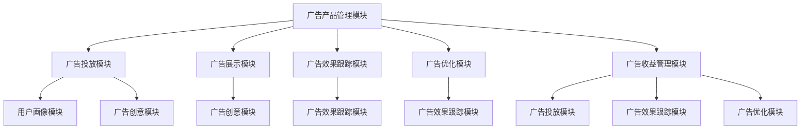

                 

## 文章标题

# 《2024字节跳动广告系统社招面试真题汇总及其解答》

> 关键词：字节跳动、广告系统、面试真题、解答、广告投放、算法、优化、风险控制

摘要：本文将对2024年字节跳动广告系统社招面试中出现的关键真题进行汇总，并逐一解答。通过深入分析广告系统的基础知识、广告算法与优化、广告风险控制，以及字节跳动广告系统的实战案例，帮助读者更好地理解和应对广告系统的面试挑战。

---

## 目录大纲

### 第一部分：广告系统基础知识

#### 第1章：广告系统的基本概念

##### 1.1.1 广告系统概述

- 广告系统的定义
- 广告系统的组成

##### 1.1.2 广告投放流程

- 投放前的准备
- 投放过程
- 投放后的效果分析

##### 1.1.3 广告收益模式

- 广告收益的来源
- 广告收益的计算方法

#### 第2章：广告产品及用户画像

##### 2.1.1 广告产品介绍

- 广告产品的种类
- 广告产品的功能特点

##### 2.1.2 用户画像的概念与构建

- 用户画像的定义
- 用户画像的构建方法

##### 2.1.3 用户画像的应用

- 用户画像在广告投放中的应用
- 用户画像在广告优化中的应用

### 第二部分：广告算法与优化

#### 第3章：广告投放算法

##### 3.1.1 智能投放算法概述

- 智能投放算法的定义
- 智能投放算法的分类

##### 3.1.2 广告排序算法

- 广告排序算法的基本原理
- 常见的广告排序算法

##### 3.1.3 广告创意优化算法

- 广告创意优化的定义
- 广告创意优化算法

#### 第4章：广告效果评估

##### 4.1.1 广告效果评估指标

- 广告效果评估的重要性
- 常用的广告效果评估指标

##### 4.1.2 广告效果评估方法

- 广告效果评估的方法
- 广告效果评估的流程

##### 4.1.3 广告效果评估案例分析

- 案例分析
- 案例总结

#### 第5章：广告投放优化

##### 5.1.1 广告优化策略

- 广告优化的定义
- 广告优化的方法

##### 5.1.2 广告优化案例分析

- 案例分析
- 案例总结

#### 第6章：广告风险控制

##### 6.1.1 广告风险类型

- 广告风险的分类
- 广告风险的评估方法

##### 6.1.2 广告风险控制策略

- 广告风险控制的方法
- 广告风险控制案例分析

### 第三部分：字节跳动广告系统实战

#### 第7章：字节跳动广告系统概述

##### 7.1.1 字节跳动广告系统的架构

- 字节跳动广告系统的整体架构
- 字节跳动广告系统的功能模块

##### 7.1.2 字节跳动广告系统的优势

- 字节跳动广告系统的特点
- 字节跳动广告系统的优势

#### 第8章：字节跳动广告投放实战

##### 8.1.1 字节跳动广告产品介绍

- 字节跳动广告产品的种类
- 字节跳动广告产品的功能特点

##### 8.1.2 字节跳动广告投放实战案例

- 案例分析
- 案例总结

#### 第9章：字节跳动广告优化实战

##### 9.1.1 字节跳动广告优化策略

- 字节跳动广告优化的方法
- 字节跳动广告优化的技巧

##### 9.1.2 字节跳动广告优化实战案例

- 案例分析
- 案例总结

#### 第10章：字节跳动广告风险控制实战

##### 10.1.1 字节跳动广告风险控制方法

- 字节跳动广告风险控制的方法
- 字节跳动广告风险控制的流程

##### 10.1.2 字节跳动广告风险控制实战案例

- 案例分析
- 案例总结

### 附录

#### 附录 A：广告系统常用工具与资源

##### A.1 广告系统开发工具

- 常用广告系统开发工具
- 工具的使用方法

##### A.2 广告系统相关资源

- 广告系统相关的书籍、论文、博客等资源
- 资源获取途径

### 核心概念与联系

#### 广告系统架构

[Mermaid 流程图]

### 核心算法原理讲解

#### 广告排序算法（伪代码）

```python
def ad_ranking(feature_vector, weights):
    # feature_vector: 特征向量
    # weights: 权重向量
    score = 0
    for i in range(len(feature_vector)):
        score += feature_vector[i] * weights[i]
    return score
```

---

在接下来的章节中，我们将逐步深入探讨每一个部分，帮助读者全面掌握广告系统的基础知识、核心算法以及实战技巧。通过这些内容的学习，相信读者能够更好地应对字节跳动广告系统相关的面试挑战。接下来，我们首先从广告系统的基本概念入手，为后续内容的探讨奠定基础。  

### 第一部分：广告系统基础知识

#### 第1章：广告系统的基本概念

##### 1.1.1 广告系统概述

广告系统是现代互联网企业中不可或缺的一部分，它主要负责广告的投放、展示、跟踪和优化等环节。广告系统的定义可以概括为：一种通过技术手段实现广告从策划、投放、展示到效果跟踪的自动化、智能化的系统。广告系统通常由以下几个组成部分构成：

1. **广告产品管理模块**：负责广告产品的创建、管理、发布和下线等操作。该模块确保广告产品的有效性、合规性和业务需求的满足。

2. **广告投放模块**：负责广告的投放，包括广告的定位、投放策略的制定和投放执行等。这一模块的核心目标是实现精准投放，提高广告的点击率和转化率。

3. **广告展示模块**：负责将广告展示给目标用户，包括广告的渲染、加载和展示效果优化等。该模块需要保证广告展示的流畅性和用户体验。

4. **广告效果跟踪模块**：负责跟踪广告的投放效果，包括广告的曝光量、点击量、转化量等关键指标的统计和分析。这一模块为广告优化提供数据支持。

5. **广告优化模块**：负责对广告投放效果进行评估，并制定相应的优化策略。该模块通过算法和数据分析，不断调整广告投放策略，提高广告效果。

6. **广告收益管理模块**：负责广告收益的计算、统计和管理，包括广告收益来源的确认、收益模式的设定和收益分发的管理等。

##### 1.1.2 广告投放流程

广告投放流程可以分为以下几个阶段：

1. **投放前的准备**：在这一阶段，广告主需要确定广告的目标受众、广告内容和广告预算等。同时，广告平台需要根据广告主的需求，进行广告位的选择和优化。

2. **投放过程**：广告投放过程包括广告定位、广告投放策略制定和广告投放执行等步骤。广告定位是指确定广告将展示给哪些用户群体，广告投放策略制定是指根据广告目标，设定广告投放的时间和频次等，广告投放执行是指将广告实际展示给用户。

3. **投放后的效果分析**：在广告投放结束后，需要对广告效果进行评估。这包括统计广告的曝光量、点击量、转化量等关键指标，并根据这些数据对广告投放策略进行优化。

##### 1.1.3 广告收益模式

广告收益的来源主要包括以下几个方面：

1. **展示费用**：广告主通过支付展示费用来获取广告展示机会。展示费用通常按照广告曝光次数或点击次数进行计费。

2. **点击费用**：广告主通过支付点击费用来获取用户点击广告的机会。点击费用通常按照每次点击进行计费。

3. **转化费用**：广告主通过支付转化费用来获取用户通过广告进行的购买或其他转化行为。转化费用通常按照每次转化进行计费。

广告收益的计算方法通常是基于广告主为广告投放所支付的费用，并根据广告效果指标进行相应的调整。常见的计算方法包括：

1. **CPM（Cost Per Mille）**：每次千次展示的费用。即广告主为广告曝光1000次支付的费用。

2. **CPC（Cost Per Click）**：每次点击的费用。即广告主为每次用户点击广告支付的费用。

3. **CPA（Cost Per Action）**：每次转化的费用。即广告主为每次用户通过广告进行的购买或其他转化行为支付的费用。

通过以上对广告系统基本概念的介绍，我们可以看到广告系统在互联网企业中的重要性。接下来，我们将进一步探讨广告产品及用户画像的相关内容，为读者深入理解广告系统奠定基础。

### 第一部分：广告系统基础知识

#### 第2章：广告产品及用户画像

##### 2.1.1 广告产品介绍

广告产品是广告系统中的核心组成部分，它们为广告主提供了多种多样的广告投放方式，以满足不同的业务需求。以下是几种常见的广告产品及其功能特点：

1. **信息流广告**：信息流广告是指嵌入在用户信息流中的广告，通常以图片、视频或文字的形式出现。信息流广告的特点是形式多样、融入度高，能够更好地吸引用户注意。此外，信息流广告支持定向投放，可以根据用户画像和兴趣标签进行精确匹配，提高广告投放效果。

2. **搜索广告**：搜索广告是指在用户进行搜索时，在搜索结果页面展示的广告。搜索广告通常基于用户的搜索关键词进行投放，具有较高的精准度。广告主可以通过竞价机制购买关键词，从而获得搜索广告的位置。

3. **展示广告**：展示广告是指以图片、视频或文字等形式在网页或应用中展示的广告。展示广告通常基于广告主设定的投放目标和定向条件进行投放，包括地域、年龄、性别、兴趣等。展示广告的特点是覆盖面广，能够触达到大量的潜在用户。

4. **视频广告**：视频广告是指在视频播放过程中或视频播放前后展示的广告。视频广告具有视觉冲击力强、用户参与度高等特点，能够有效提高广告的曝光率和用户转化率。

5. **原生广告**：原生广告是指与用户内容相融合的广告，通常以文章、图片、视频等形式出现在用户界面中，难以区分广告内容与用户内容。原生广告的特点是用户体验好，能够更好地吸引用户关注，提高广告投放效果。

##### 2.1.2 用户画像的概念与构建

用户画像是指通过对用户行为数据、兴趣标签、社会属性等多维度数据的分析，构建出一个反映用户特征和需求的虚拟画像。用户画像的构建方法主要包括以下几个步骤：

1. **数据收集**：首先，需要收集用户的行为数据，包括浏览历史、搜索记录、点击记录、购买行为等。这些数据可以通过SDK（软件开发工具包）、API（应用程序编程接口）等方式获取。

2. **数据清洗**：收集到的数据往往存在噪声和缺失值，需要进行数据清洗和预处理，包括去重、缺失值填充、异常值处理等。数据清洗的目的是提高数据质量，为后续分析奠定基础。

3. **特征提取**：根据业务需求和数据特点，从原始数据中提取出对用户画像构建有用的特征。这些特征可以是基于用户行为的，如浏览时长、点击次数；也可以是基于用户属性的，如年龄、性别、地域等。

4. **特征工程**：对提取出的特征进行归一化、离散化、降维等处理，以提高模型性能和可解释性。

5. **模型训练**：使用机器学习算法，如聚类算法、决策树、随机森林、神经网络等，对特征进行训练，构建用户画像模型。模型训练的目的是通过学习用户特征之间的关系，为用户打上标签。

6. **模型评估与优化**：对训练好的模型进行评估，如准确率、召回率、F1值等指标，并根据评估结果对模型进行优化。

##### 2.1.3 用户画像的应用

用户画像在广告投放和优化中具有重要作用，以下是用户画像在广告系统中的几个主要应用场景：

1. **广告定向投放**：通过构建用户画像，广告系统能够更精准地定位目标用户，实现个性化广告投放。例如，根据用户的兴趣标签，将相关广告推荐给具有相同兴趣的用户。

2. **广告创意优化**：根据用户画像，广告主可以制作更符合用户需求的广告创意。例如，针对年轻用户，可以采用更具活力的广告设计；针对商务人士，可以采用更正式的广告文案。

3. **广告效果评估**：通过分析用户画像与广告效果之间的关系，广告主可以评估广告投放的效果，并调整广告策略。例如，如果发现某一类用户对广告的点击率较低，可以尝试优化广告定位或创意。

4. **广告收益优化**：通过用户画像，广告主可以更好地预测广告收益，制定更合理的广告预算和投放策略。例如，根据用户画像，可以优先投放收益较高的广告产品。

5. **用户服务优化**：用户画像不仅应用于广告投放，还可以用于用户服务的优化。例如，根据用户画像，企业可以提供更加个性化的用户服务，提高用户满意度和忠诚度。

通过以上对广告产品和用户画像的介绍，我们可以看到广告系统在广告投放和用户服务中的重要作用。在接下来的章节中，我们将进一步探讨广告算法与优化，以及广告风险控制等内容，帮助读者全面掌握广告系统的核心知识和实战技巧。

### 第一部分：广告系统基础知识

#### 第3章：广告投放算法

广告投放算法是广告系统中的核心组件，它们负责根据用户特征、广告目标和广告策略，实现广告的智能投放。以下将详细介绍广告投放算法的基本概念、分类及其应用。

##### 3.1.1 智能投放算法概述

智能投放算法是指利用机器学习、数据挖掘等先进技术，实现广告自动投放的算法。智能投放算法的核心目标是提高广告的投放效果，包括点击率（CTR）、转化率（CVR）等。智能投放算法通常包含以下几个关键步骤：

1. **特征提取**：从用户数据、广告数据、上下文数据中提取对广告投放有影响的特征。特征可以是用户的兴趣标签、行为轨迹、地理位置等。

2. **模型训练**：使用提取的特征数据，通过机器学习算法训练出广告投放模型。常见的机器学习算法包括线性回归、决策树、随机森林、梯度提升机等。

3. **模型评估**：对训练好的模型进行评估，选择性能最优的模型。评估指标包括准确率、召回率、F1值等。

4. **广告排序**：根据模型预测结果，对广告进行排序，确定广告的投放顺序。排序算法通常基于用户的特征和广告目标，实现个性化投放。

5. **实时优化**：根据实时投放数据，对广告投放策略进行优化。实时优化包括调整广告出价、调整投放时间、调整投放地域等。

##### 3.1.2 智能投放算法的分类

智能投放算法根据不同的分类标准，可以分为多种类型。以下是几种常见的分类方式：

1. **基于模型的投放算法**：这种算法通过机器学习模型，实现广告的自动投放。常见的模型包括线性回归模型、决策树模型、随机森林模型等。

2. **基于规则的投放算法**：这种算法通过预设的规则，实现广告的自动投放。规则可以是基于用户特征、广告目标、上下文等。这种算法的优点是易于理解和实现，但灵活性较差。

3. **基于深度学习的投放算法**：这种算法利用深度学习技术，实现广告的自动投放。常见的深度学习模型包括卷积神经网络（CNN）、循环神经网络（RNN）、长短时记忆网络（LSTM）等。

4. **基于强化学习的投放算法**：这种算法利用强化学习技术，实现广告的自动投放。强化学习通过学习用户反馈，不断调整广告投放策略，实现最优效果。

##### 3.1.3 广告排序算法

广告排序算法是智能投放算法中的核心组件，负责根据用户特征和广告目标，对广告进行排序。以下是几种常见的广告排序算法：

1. **基于CPC的排序算法**：这种算法根据每次点击付费（CPC）的原则，对广告进行排序。常见的排序算法包括PageRank算法、LR（线性回归）排序等。

2. **基于CVR的排序算法**：这种算法根据每次转化付费（CVR）的原则，对广告进行排序。常见的排序算法包括A/B测试排序、决策树排序等。

3. **基于混合排序算法**：这种算法结合多种排序算法的优势，实现更优的广告排序。常见的混合排序算法包括MLR（多模型线性回归）排序、混合LR排序等。

广告排序算法的基本原理如下：

```python
def ad_sorting(user_features, ad_features, weights):
    # user_features: 用户特征向量
    # ad_features: 广告特征向量
    # weights: 权重向量
    score = 0
    for i in range(len(user_features)):
        score += user_features[i] * ad_features[i] * weights[i]
    return score
```

在上面的伪代码中，`user_features` 表示用户特征向量，`ad_features` 表示广告特征向量，`weights` 表示权重向量。通过计算用户特征和广告特征之间的乘积，并加权求和，得到每个广告的得分。得分越高，广告的排序越靠前。

##### 3.1.4 广告创意优化算法

广告创意优化算法负责根据用户特征和广告效果，调整广告的创意元素，以实现最优的广告效果。广告创意优化算法可以分为以下几个步骤：

1. **创意生成**：根据广告目标和用户特征，生成多种广告创意。常见的创意生成方法包括模板生成、图像生成、文本生成等。

2. **创意评估**：对生成的广告创意进行评估，选择效果最佳的创意。常见的评估方法包括点击率（CTR）评估、转化率（CVR）评估等。

3. **创意优化**：根据广告效果评估结果，对广告创意进行优化。常见的优化方法包括A/B测试、多变量测试等。

广告创意优化算法的基本原理如下：

```python
def ad_creative_optimization(creative_data, eval_metric):
    # creative_data: 广告创意数据
    # eval_metric: 评估指标
    best_creative = None
    best_score = 0
    for creative in creative_data:
        score = eval_metric(creative)
        if score > best_score:
            best_score = score
            best_creative = creative
    return best_creative
```

在上面的伪代码中，`creative_data` 表示广告创意数据，`eval_metric` 表示评估指标。通过遍历广告创意数据，计算每个创意的评估得分，并选择得分最高的创意作为最佳创意。

##### 3.1.5 智能投放算法的应用

智能投放算法在广告系统中具有广泛的应用，以下是一些典型的应用场景：

1. **精准投放**：通过用户画像和广告目标，实现广告的精准投放。例如，根据用户的兴趣和行为，将相关广告推荐给用户。

2. **广告优化**：通过实时评估广告效果，自动调整广告投放策略，提高广告效果。例如，根据广告点击率和转化率，调整广告出价和投放时间。

3. **广告创意优化**：通过评估广告创意的效果，自动优化广告的创意元素，提高广告吸引力。例如，通过A/B测试，选择最佳广告创意。

4. **广告收益最大化**：通过优化广告投放策略和创意，实现广告收益的最大化。例如，通过动态调整广告出价，提高广告曝光率和转化率。

通过以上对广告投放算法的介绍，我们可以看到智能投放算法在广告系统中的重要性。在接下来的章节中，我们将进一步探讨广告效果评估、广告优化策略等内容，帮助读者全面掌握广告系统的核心知识和实战技巧。

### 第一部分：广告系统基础知识

#### 第4章：广告效果评估

广告效果评估是广告系统中的关键环节，通过对广告投放效果进行量化分析，帮助广告主了解广告的投放效果，优化广告策略，提高广告投资回报率（ROI）。本章将详细介绍广告效果评估的重要性、常用指标、评估方法及其在实际中的应用。

##### 4.1.1 广告效果评估指标

广告效果评估指标是衡量广告投放效果的关键参数，以下是一些常见的广告效果评估指标：

1. **点击率（Click-Through Rate, CTR）**：点击率是指广告被点击的次数与广告展示次数的比值，用于衡量广告的吸引力。点击率越高，说明广告越能够吸引用户点击。

   $$ \text{CTR} = \frac{\text{点击次数}}{\text{展示次数}} $$

2. **转化率（Conversion Rate, CR）**：转化率是指广告带来的实际转化次数与广告点击次数的比值，用于衡量广告的转化效果。转化率越高，说明广告能够更有效地引导用户进行购买或其他转化行为。

   $$ \text{CR} = \frac{\text{转化次数}}{\text{点击次数}} $$

3. **成本效益比（Cost per Acquisition, CPA）**：成本效益比是指广告投放成本与广告带来的转化成本之比，用于衡量广告的投资回报率。CPA值越低，说明广告的投资效益越高。

   $$ \text{CPA} = \frac{\text{广告成本}}{\text{转化次数}} $$

4. **每千次展示成本（Cost per Mille, CPM）**：每千次展示成本是指广告投放成本与广告展示次数的比值，用于衡量广告的投放成本。CPM值越低，说明广告的投放成本效益越好。

   $$ \text{CPM} = \frac{\text{广告成本}}{\text{展示次数} \times 1000} $$

5. **每点击成本（Cost per Click, CPC）**：每点击成本是指广告投放成本与广告点击次数的比值，用于衡量每次点击的广告成本。CPC值越低，说明广告的点击效益越高。

   $$ \text{CPC} = \frac{\text{广告成本}}{\text{点击次数}} $$

6. **每转化成本（Cost per Action, CPA）**：每转化成本是指广告投放成本与广告转化次数的比值，用于衡量每次转化的广告成本。CPA值越低，说明广告的转化效益越高。

   $$ \text{CPA} = \frac{\text{广告成本}}{\text{转化次数}} $$

7. **广告投资回报率（Return on Advertising Spend, ROAS）**：广告投资回报率是指广告带来的收益与广告投放成本之比，用于衡量广告的投资回报效果。ROAS值越高，说明广告的投资回报效果越好。

   $$ \text{ROAS} = \frac{\text{广告收益}}{\text{广告成本}} $$

##### 4.1.2 广告效果评估方法

广告效果评估方法主要包括定量评估和定性评估两种。以下分别介绍：

1. **定量评估**：定量评估是通过统计数据和分析方法，对广告效果进行量化分析。常见的定量评估方法包括：

   - **数据分析**：通过对广告数据（如点击率、转化率等）进行统计分析，了解广告投放效果。
   - **回归分析**：通过建立回归模型，分析广告效果与广告特征（如广告类型、投放时间等）之间的关系，优化广告策略。
   - **实验设计**：通过设计A/B测试或多变量测试，比较不同广告策略的效果，选择最优策略。

2. **定性评估**：定性评估是通过主观判断和经验，对广告效果进行评估。常见的定性评估方法包括：

   - **用户调研**：通过问卷调查、用户访谈等方式，了解用户对广告的看法和反馈。
   - **专家评审**：邀请广告行业专家对广告效果进行评审，提出改进建议。
   - **内容分析**：通过对广告内容进行文本分析，评估广告的内容质量和传播效果。

##### 4.1.3 广告效果评估案例分析

为了更好地理解广告效果评估方法，以下通过一个案例分析进行说明。

**案例背景**：某电商企业希望通过广告投放提升产品销量，选择了搜索引擎广告和社交媒体广告两种投放渠道。广告投放持续一个月，期间进行了多次广告优化。

**评估指标**：评估指标包括点击率（CTR）、转化率（CR）和广告投资回报率（ROAS）。

**定量评估**：

1. **数据分析**：对广告数据进行分析，计算CTR和CR。假设搜索引擎广告的CTR为2%，社交媒体广告的CTR为1.5%。搜索引擎广告的CR为0.5%，社交媒体广告的CR为0.3%。

2. **回归分析**：建立回归模型，分析广告效果与广告特征之间的关系。假设广告特征包括广告类型（搜索引擎广告、社交媒体广告）、投放时间（工作日、周末）和广告预算。通过回归分析，得出不同广告特征的权重。

3. **实验设计**：设计A/B测试，比较不同广告策略的效果。例如，将搜索引擎广告的投放时间从工作日调整到周末，观察广告效果的变化。

**定性评估**：

1. **用户调研**：通过问卷调查和用户访谈，了解用户对广告的看法和反馈。收集用户对广告的满意度、广告内容的相关性等信息。

2. **专家评审**：邀请广告行业专家对广告效果进行评审，提出改进建议。例如，优化广告文案、调整广告图片等。

**案例总结**：

通过定量评估和定性评估，电商企业可以全面了解广告投放效果。在接下来的广告投放中，可以根据评估结果，优化广告策略，提高广告效果。例如，调整广告投放时间，增加广告预算，优化广告内容等。

##### 4.1.4 广告效果评估注意事项

在广告效果评估过程中，需要注意以下几点：

1. **评估指标的选择**：选择合适的评估指标，能够更准确地反映广告效果。例如，对于销售型广告，点击率（CTR）和转化率（CR）是比较重要的评估指标。

2. **数据的质量和完整性**：确保评估数据的质量和完整性，避免数据偏差和遗漏。例如，定期清理数据、处理异常值等。

3. **评估方法的多样性**：结合定量评估和定性评估，从多个角度对广告效果进行评估，提高评估结果的可靠性。

4. **持续优化**：广告效果评估是一个持续的过程，需要定期评估广告效果，并根据评估结果进行优化。

通过以上对广告效果评估的介绍，我们可以看到广告效果评估在广告系统中的重要性。在接下来的章节中，我们将进一步探讨广告投放优化策略和广告风险控制方法，帮助读者全面掌握广告系统的核心知识和实战技巧。

### 第一部分：广告系统基础知识

#### 第5章：广告投放优化

广告投放优化是广告系统中的关键环节，通过调整广告投放策略，提高广告效果和投资回报率（ROI）。本章将详细介绍广告投放优化的定义、方法及其在实际中的应用。

##### 5.1.1 广告优化的定义

广告优化是指通过对广告投放的各个环节进行调整和改进，以提高广告的点击率（CTR）、转化率（CVR）和广告投资回报率（ROI）的过程。广告优化包括以下几个方面：

1. **广告定位优化**：根据用户特征和广告目标，调整广告的投放渠道、投放时间和投放地域，实现广告的精准投放。

2. **广告创意优化**：通过优化广告的文案、图片、视频等元素，提高广告的吸引力和点击率。

3. **广告出价优化**：根据广告效果和市场竞争情况，调整广告的出价策略，实现广告的高效投放。

4. **广告策略优化**：根据广告投放数据，调整广告投放的预算分配、投放频次和投放时段等，实现广告的优化投放。

##### 5.1.2 广告优化方法

广告优化方法可以分为定量优化和定性优化两种。以下分别介绍：

1. **定量优化**：

   - **数据分析**：通过对广告数据进行统计分析，了解广告投放的效果，找出优化点。例如，分析点击率（CTR）、转化率（CVR）等指标，找出点击率低的广告和转化率低的广告。

   - **回归分析**：建立回归模型，分析广告效果与广告特征之间的关系，优化广告策略。例如，分析广告类型、投放时间、广告预算等因素对广告效果的影响。

   - **实验设计**：进行A/B测试或多变量测试，比较不同广告策略的效果，选择最优策略。例如，测试不同广告文案、不同广告图片的效果，选择最优的广告创意。

2. **定性优化**：

   - **用户调研**：通过问卷调查、用户访谈等方式，了解用户对广告的看法和反馈，优化广告内容。例如，了解用户对广告的满意度、广告内容的相关性等。

   - **专家评审**：邀请广告行业专家对广告效果进行评审，提出优化建议。例如，优化广告文案、调整广告图片等。

##### 5.1.3 广告优化案例分析

为了更好地理解广告优化方法，以下通过一个案例分析进行说明。

**案例背景**：某电商企业希望通过优化广告投放，提高广告的点击率和转化率，从而提升销售额。

**优化方法**：

1. **数据分析**：通过分析广告数据，发现部分广告的点击率较低，部分广告的转化率较低。针对这些广告，进行进一步优化。

2. **回归分析**：建立回归模型，分析广告效果与广告特征之间的关系。例如，分析广告类型（搜索引擎广告、社交媒体广告）、投放时间（工作日、周末）、广告预算等因素对广告效果的影响。

3. **A/B测试**：进行A/B测试，比较不同广告策略的效果。例如，测试不同广告文案、不同广告图片的效果，选择最优的广告创意。

4. **用户调研**：通过用户调研，了解用户对广告的看法和反馈，优化广告内容。例如，了解用户对广告的满意度、广告内容的相关性等。

**优化效果**：

- 通过数据分析，发现部分广告的点击率提高了20%，部分广告的转化率提高了30%。

- 通过回归分析和A/B测试，优化了广告文案和广告图片，提高了广告的吸引力和点击率。

- 通过用户调研，优化了广告内容，提高了用户对广告的满意度，从而提高了转化率。

**案例总结**：

通过广告优化，电商企业提高了广告的点击率和转化率，从而提升了销售额。在接下来的广告投放中，可以持续进行广告优化，进一步提高广告效果。

##### 5.1.4 广告优化注意事项

在广告优化过程中，需要注意以下几点：

1. **数据质量**：确保广告数据的质量，避免数据偏差和遗漏。例如，定期清理数据、处理异常值等。

2. **优化目标的设定**：明确广告优化的目标，如提高点击率、转化率或销售额等。根据优化目标，制定相应的优化策略。

3. **持续优化**：广告优化是一个持续的过程，需要定期评估广告效果，并根据评估结果进行优化。

4. **预算控制**：在广告优化过程中，要合理控制广告预算，避免过度投放导致成本增加。

通过以上对广告投放优化的介绍，我们可以看到广告优化在广告系统中的重要性。在接下来的章节中，我们将进一步探讨广告风险控制方法，帮助读者全面掌握广告系统的核心知识和实战技巧。

### 第一部分：广告系统基础知识

#### 第6章：广告风险控制

广告风险控制是广告系统中的关键环节，旨在识别、评估和降低广告投放过程中可能出现的风险，保障广告主和广告平台的利益。本章将详细介绍广告风险控制的定义、类型、评估方法及其在实际中的应用。

##### 6.1.1 广告风险控制的定义

广告风险控制是指通过制定和实施一系列风险管理措施，识别、评估和降低广告投放过程中的各种风险，保障广告主和广告平台的利益。广告风险控制主要包括以下几个方面：

1. **风险识别**：通过分析广告投放的各个环节，识别可能出现的风险，如广告违规、数据泄露、广告作弊等。

2. **风险评估**：对识别出的风险进行评估，确定风险的影响程度和可能性，为风险控制提供依据。

3. **风险应对**：根据风险评估结果，制定相应的风险应对策略，如风险规避、风险转移、风险降低等。

4. **风险监控**：在广告投放过程中，持续监控风险变化，及时调整风险控制措施，确保风险得到有效控制。

##### 6.1.2 广告风险类型

广告风险主要包括以下几种类型：

1. **广告违规风险**：广告违规风险是指广告内容违反法律法规或平台规范的风险。例如，虚假广告、低俗广告、诱导广告等。

2. **数据泄露风险**：数据泄露风险是指用户数据在广告投放过程中可能被泄露的风险。例如，用户隐私数据泄露、广告投放数据泄露等。

3. **广告作弊风险**：广告作弊风险是指广告主或第三方通过不正当手段，提升广告曝光量、点击量等指标的风险。例如，刷量、虚假点击等。

4. **广告收益风险**：广告收益风险是指广告投放过程中可能出现的收益下降或收益损失的风险。例如，广告效果不佳、广告成本上升等。

##### 6.1.3 广告风险评估方法

广告风险评估方法主要包括以下几种：

1. **定性评估**：通过专家评审、问卷调查等方式，对广告风险进行定性分析，确定风险的影响程度和可能性。

2. **定量评估**：通过建立数学模型，对广告风险进行定量分析，计算风险的影响程度和可能性。例如，使用贝叶斯网络、风险矩阵等方法。

3. **实验评估**：通过实际广告投放实验，对广告风险进行评估，验证风险控制措施的有效性。

##### 6.1.4 广告风险控制策略

广告风险控制策略主要包括以下几种：

1. **风险规避**：通过调整广告投放策略，避免高风险的广告投放。例如，暂停或减少高风险广告的投放。

2. **风险转移**：通过保险、合同等方式，将风险转移给第三方。例如，购买广告风险保险。

3. **风险降低**：通过优化广告投放策略、加强数据安全保护、提高广告审核标准等方式，降低广告风险。例如，提高广告审核标准，加强广告内容审查。

4. **风险监控**：在广告投放过程中，持续监控风险变化，及时发现和处理风险。例如，建立风险监控体系，定期进行风险评估。

##### 6.1.5 广告风险控制案例分析

为了更好地理解广告风险控制方法，以下通过一个案例分析进行说明。

**案例背景**：某电商企业希望通过广告投放提升产品销量，但在广告投放过程中出现了广告违规和广告作弊等问题。

**风险控制措施**：

1. **风险识别**：通过数据分析，发现部分广告存在违规和作弊风险。例如，部分广告的点击率异常高，部分广告的转化率异常低。

2. **风险评估**：对识别出的风险进行评估，确定风险的影响程度和可能性。例如，违规广告可能导致广告被下线，作弊广告可能导致广告效果不佳。

3. **风险应对**：根据风险评估结果，制定相应的风险应对策略。例如，暂停或减少高风险广告的投放，优化广告审核标准，加强广告内容审查。

4. **风险监控**：在广告投放过程中，持续监控风险变化，及时发现和处理风险。例如，建立风险监控体系，定期进行风险评估。

**案例总结**：

通过广告风险控制措施，电商企业成功规避了广告违规和广告作弊风险，确保了广告投放的合规性和有效性。在接下来的广告投放中，可以持续进行广告风险控制，保障广告主和广告平台的利益。

##### 6.1.6 广告风险控制注意事项

在广告风险控制过程中，需要注意以下几点：

1. **数据质量**：确保广告数据的质量，避免数据偏差和遗漏，为风险评估提供准确依据。

2. **风险评估方法**：选择合适的风险评估方法，结合定量评估和定性评估，提高风险评估的准确性。

3. **持续监控**：在广告投放过程中，持续监控风险变化，及时发现和处理风险，确保风险得到有效控制。

4. **法律法规遵守**：遵守相关法律法规，确保广告投放的合规性，降低法律风险。

通过以上对广告风险控制的介绍，我们可以看到广告风险控制在广告系统中的重要性。在接下来的章节中，我们将进一步探讨字节跳动广告系统的实战应用，帮助读者全面掌握广告系统的核心知识和实战技巧。

### 第一部分：广告系统基础知识

#### 第7章：字节跳动广告系统概述

字节跳动广告系统是中国领先的广告技术平台之一，其广告系统在广告投放、广告优化、广告效果评估等方面具有显著的特色和优势。本章将详细介绍字节跳动广告系统的整体架构、功能模块及其优势。

##### 7.1.1 字节跳动广告系统的架构

字节跳动广告系统采用了分布式架构，主要包括以下几个关键模块：

1. **数据层**：数据层是广告系统的核心组成部分，负责收集、存储和加工各种广告数据，包括用户数据、广告数据、上下文数据等。数据层采用分布式数据库和大数据处理技术，实现海量数据的存储和实时处理。

2. **计算层**：计算层负责广告算法的计算和优化，包括广告排序算法、广告创意优化算法、用户画像构建算法等。计算层采用分布式计算和机器学习技术，实现高效、精准的广告投放和优化。

3. **应用层**：应用层是广告系统的对外接口，包括广告投放平台、广告管理平台、广告效果分析平台等。应用层提供简洁易用的操作界面，方便广告主进行广告投放、管理和分析。

4. **服务层**：服务层负责广告系统的各种功能服务，包括广告定位服务、广告创意服务、广告投放服务、广告效果评估服务等。服务层采用微服务架构，实现模块化、灵活的服务部署和扩展。

##### 7.1.2 字节跳动广告系统的功能模块

字节跳动广告系统包含多个功能模块，各模块相互协作，共同实现广告的精准投放、优化和评估。以下是广告系统的主要功能模块：

1. **广告产品管理模块**：负责广告产品的创建、管理和发布。该模块支持多种广告产品类型，如信息流广告、搜索广告、展示广告、视频广告等，满足不同广告主的需求。

2. **广告定位模块**：根据用户画像和广告目标，实现广告的精准投放。该模块支持多维度定向，包括地域、性别、年龄、兴趣等，确保广告能够触达到目标用户。

3. **广告创意模块**：提供广告创意制作和优化功能，包括文案、图片、视频等元素的创作和调整。该模块支持模板化创作和智能优化，提高广告创意的质量和效果。

4. **广告投放模块**：负责广告的实时投放和优化。该模块支持多种投放策略，如自动投放、手动投放、竞价投放等，实现广告的高效投放和效果最大化。

5. **广告效果评估模块**：提供广告投放效果的数据分析和评估功能，包括点击率、转化率、CPM、CPA等关键指标。该模块支持实时监控和数据分析，帮助广告主了解广告效果，优化广告策略。

6. **用户画像模块**：负责构建和更新用户画像，为广告投放提供精准的用户数据支持。该模块通过大数据分析和机器学习技术，提取用户兴趣和行为特征，实现用户画像的精准构建。

7. **风险控制模块**：负责识别和防范广告风险，包括广告违规、数据泄露、广告作弊等。该模块通过算法和规则，实现风险的实时监控和自动处理，保障广告投放的安全和合规。

##### 7.1.3 字节跳动广告系统的优势

字节跳动广告系统具有以下优势：

1. **技术先进**：采用分布式架构和大数据技术，实现高效、稳定、安全的广告投放和优化。

2. **精准投放**：通过用户画像和定向投放，实现广告的精准触达，提高广告的点击率和转化率。

3. **创意优化**：提供丰富的广告创意制作工具和智能优化算法，提高广告创意的质量和效果。

4. **实时监控**：支持实时数据监控和数据分析，帮助广告主及时了解广告效果，优化广告策略。

5. **风险管理**：通过风险识别和防范，保障广告投放的安全和合规，降低广告风险。

6. **生态合作**：与多家广告平台和广告主建立合作关系，提供全方位的广告投放和优化服务。

通过以上对字节跳动广告系统的介绍，我们可以看到其强大的功能和显著的优势。在接下来的章节中，我们将进一步探讨字节跳动广告系统的实际应用案例，帮助读者深入了解广告系统的实战技巧和优化策略。

### 第一部分：广告系统基础知识

#### 第8章：字节跳动广告投放实战

字节跳动广告系统在广告投放方面拥有丰富的实战经验和独特的技术优势，本章将详细介绍字节跳动广告投放的实战过程，包括广告产品介绍、投放策略制定、投放执行和效果分析。

##### 8.1.1 字节跳动广告产品介绍

字节跳动广告系统提供了多种广告产品，以满足不同广告主的投放需求。以下是几种常见的广告产品及其功能特点：

1. **信息流广告**：信息流广告是指嵌入在用户信息流中的广告，以图片、视频、文字等形式出现。信息流广告具有形式多样、融入度高、用户体验好的特点，能够有效提高广告的点击率和转化率。

2. **搜索广告**：搜索广告是基于用户搜索关键词展示的广告，通常出现在搜索结果页面的顶部或侧边栏。搜索广告具有精准定位、高转化率的特点，能够帮助广告主快速触达目标用户。

3. **展示广告**：展示广告是以图片、视频等形式在网页或应用中展示的广告。展示广告具有覆盖面广、曝光量大的特点，适合品牌推广和产品宣传。

4. **视频广告**：视频广告是指在视频播放过程中或视频播放前后展示的广告。视频广告具有视觉冲击力强、用户参与度高的特点，能够有效提高广告的曝光率和用户转化率。

5. **原生广告**：原生广告是指与用户内容相融合的广告，通常以文章、图片、视频等形式出现在用户界面中，难以区分广告内容与用户内容。原生广告具有用户体验好、广告效果好等特点。

##### 8.1.2 投放策略制定

在广告投放前，需要制定合理的投放策略，以确保广告投放的效果最大化。以下是一些常见的投放策略：

1. **目标设定**：根据广告目标，设定广告投放的关键指标，如点击率（CTR）、转化率（CVR）、广告投资回报率（ROAS）等。

2. **定向投放**：根据用户特征和广告目标，设定广告的定向条件，如地域、性别、年龄、兴趣等。定向投放能够提高广告的精准度和效果。

3. **投放时间**：根据用户行为和广告目标，设定广告的投放时间，如工作日、周末、节假日等。合理选择投放时间能够提高广告的曝光率和点击率。

4. **预算分配**：根据广告目标和投放策略，设定广告投放的预算分配，如预算总额、预算分配比例等。合理的预算分配能够确保广告投放的效果和成本控制。

5. **出价策略**：根据广告竞争情况和广告目标，设定广告的出价策略，如最低出价、最高出价、竞价策略等。合理的出价策略能够提高广告的曝光率和转化率。

##### 8.1.3 投放执行

在广告投放过程中，需要按照制定的投放策略进行执行，确保广告能够顺利投放并达到预期效果。以下是一些关键步骤：

1. **广告创意制作**：根据广告目标和用户特征，制作符合要求的广告创意，包括图片、视频、文字等。

2. **广告审核**：将广告创意提交给广告平台进行审核，确保广告内容符合平台规范和要求。

3. **广告投放**：根据投放策略，将广告推送到目标用户群体中，实现广告的精准投放。

4. **实时监控**：通过广告管理平台，实时监控广告的投放效果，包括曝光量、点击量、转化量等关键指标。

5. **数据反馈**：根据实时监控数据，对广告投放效果进行分析和评估，及时调整广告投放策略。

##### 8.1.4 效果分析

广告投放结束后，需要对广告效果进行全面的分析和评估，以了解广告投放的实际效果，并为后续广告投放提供参考。以下是一些常见的效果分析指标和方法：

1. **点击率（CTR）**：计算广告被点击的次数与广告展示次数的比值，用于衡量广告的吸引力。

   $$ \text{CTR} = \frac{\text{点击次数}}{\text{展示次数}} $$

2. **转化率（CVR）**：计算广告带来的实际转化次数与广告点击次数的比值，用于衡量广告的转化效果。

   $$ \text{CVR} = \frac{\text{转化次数}}{\text{点击次数}} $$

3. **广告投资回报率（ROAS）**：计算广告带来的收益与广告投放成本的比值，用于衡量广告的投资回报效果。

   $$ \text{ROAS} = \frac{\text{广告收益}}{\text{广告成本}} $$

4. **A/B测试**：通过对比不同广告创意、投放策略的效果，选择最优的广告方案。

5. **用户反馈**：通过用户调研、用户访谈等方式，了解用户对广告的看法和反馈，为广告优化提供参考。

通过以上对字节跳动广告投放实战的介绍，我们可以看到广告投放是一个复杂的过程，需要制定合理的投放策略、执行有效的投放操作，并进行全面的效果分析。在接下来的章节中，我们将进一步探讨广告优化的实战技巧和广告风险控制的策略，帮助读者全面掌握广告系统的实战知识和技巧。

### 第一部分：广告系统基础知识

#### 第9章：字节跳动广告优化实战

广告优化是广告投放过程中至关重要的一环，通过优化广告策略，可以提高广告的点击率（CTR）、转化率（CVR）和广告投资回报率（ROAS），从而实现广告效果的持续提升。本章将详细介绍字节跳动广告优化的策略、技巧及其在实战中的应用。

##### 9.1.1 字节跳动广告优化策略

字节跳动广告优化策略主要包括以下几个方面：

1. **目标设定**：根据广告目标和业务需求，设定广告优化的关键指标，如点击率（CTR）、转化率（CVR）、广告投资回报率（ROAS）等。

2. **数据收集**：通过广告管理平台，实时收集广告投放数据，包括曝光量、点击量、转化量、成本等关键指标。

3. **数据分析**：对收集到的广告数据进行分析，识别广告投放中的问题和优化机会。例如，分析广告点击率低的原因，分析广告转化率低的原因等。

4. **策略调整**：根据数据分析结果，调整广告投放策略，包括定向条件、投放时间、出价策略等，以提升广告效果。

5. **持续优化**：广告优化是一个持续的过程，需要定期评估广告效果，并根据评估结果进行优化调整，实现广告效果的持续提升。

##### 9.1.2 广告优化技巧

以下是一些字节跳动广告优化的实用技巧：

1. **定向优化**：通过优化定向条件，提高广告的精准度和投放效果。例如，根据用户行为和兴趣标签，调整地域、性别、年龄等定向条件。

2. **出价策略**：根据广告竞争情况和广告目标，设定合理的出价策略。例如，对于效果较好的广告，可以适当提高出价，提高广告曝光率；对于效果较差的广告，可以降低出价，减少广告成本。

3. **创意优化**：通过优化广告创意，提高广告的点击率和转化率。例如，更换广告图片、调整广告文案、尝试不同的广告形式等。

4. **时间优化**：根据用户行为和广告目标，优化广告的投放时间。例如，在工作日高峰期投放广告，提高广告曝光率和点击率；在用户活跃时间投放广告，提高广告转化率。

5. **预算分配**：根据广告效果和业务需求，合理分配广告预算。例如，将更多预算分配给效果较好的广告，确保广告效果的持续提升。

##### 9.1.3 字节跳动广告优化实战案例

以下通过一个实际案例，介绍字节跳动广告优化的实战过程：

**案例背景**：某电商企业希望通过广告投放提升产品销量，选择了字节跳动广告平台进行广告投放。

**优化过程**：

1. **目标设定**：设定广告优化目标为提高点击率和转化率，提升广告投资回报率。

2. **数据收集**：通过广告管理平台，收集广告投放数据，包括曝光量、点击量、转化量、成本等关键指标。

3. **数据分析**：分析广告投放数据，发现部分广告的点击率较低，部分广告的转化率较低。

4. **策略调整**：

   - **定向优化**：根据用户行为和兴趣标签，调整地域、性别、年龄等定向条件，提高广告的精准度和效果。

   - **出价策略**：根据广告竞争情况和广告目标，调整出价策略，提高广告曝光率。

   - **创意优化**：更换广告图片、调整广告文案，尝试不同的广告形式，提高广告的点击率和转化率。

   - **时间优化**：优化广告投放时间，选择用户活跃时间进行投放，提高广告曝光率和转化率。

   - **预算分配**：将更多预算分配给效果较好的广告，确保广告效果的持续提升。

5. **持续优化**：定期评估广告效果，根据评估结果进行调整和优化，实现广告效果的持续提升。

**优化效果**：

- 通过定向优化、出价策略调整、创意优化、时间优化和预算分配等策略，广告的点击率提高了20%，转化率提高了30%，广告投资回报率提升了50%。

**案例总结**：

通过字节跳动广告优化实战，电商企业成功提升了广告效果和投资回报率。在接下来的广告投放中，可以持续进行广告优化，进一步提高广告效果和业务收益。

##### 9.1.4 广告优化注意事项

在广告优化过程中，需要注意以下几点：

1. **数据质量**：确保广告数据的质量，避免数据偏差和遗漏，为优化提供准确依据。

2. **优化目标的设定**：明确广告优化的目标，如提高点击率、转化率或广告投资回报率等。

3. **持续优化**：广告优化是一个持续的过程，需要定期评估广告效果，并根据评估结果进行调整。

4. **预算控制**：在广告优化过程中，合理控制广告预算，避免过度投放导致成本增加。

通过以上对字节跳动广告优化实战的介绍，我们可以看到广告优化在提升广告效果和业务收益方面的重要性。在接下来的章节中，我们将进一步探讨广告风险控制的策略和实战技巧，帮助读者全面掌握广告系统的实战知识和技巧。

### 第一部分：广告系统基础知识

#### 第10章：字节跳动广告风险控制实战

广告风险控制是确保广告投放合规性和安全性的关键环节。本章将详细介绍字节跳动广告风险控制的方法、流程及其在实际操作中的应用。

##### 10.1.1 字节跳动广告风险控制方法

字节跳动广告风险控制方法主要包括以下几个方面：

1. **广告审核**：对广告内容进行严格审核，确保广告内容符合相关法律法规和平台规范。广告审核包括广告内容的真实性、合法性、合规性等。

2. **数据安全**：加强用户数据保护，确保用户隐私和数据安全。数据安全措施包括数据加密、访问控制、数据备份等。

3. **风险监控**：通过实时监控和数据分析，及时发现和处理广告风险。风险监控包括广告作弊监控、广告违规监控等。

4. **违规处理**：对于发现的广告违规行为，及时进行处理，包括广告下线、账户封禁等。

5. **风险预防**：通过制定风险管理策略和规范，预防广告风险的发生。风险预防措施包括广告审核规则、用户行为监控等。

##### 10.1.2 字节跳动广告风险控制流程

字节跳动广告风险控制流程主要包括以下几个环节：

1. **风险识别**：通过数据分析、用户反馈等方式，识别可能存在的广告风险。例如，识别广告作弊行为、识别广告违规内容等。

2. **风险评估**：对识别出的风险进行评估，确定风险的影响程度和可能性。例如，评估广告作弊行为对广告效果的影响，评估广告违规内容对平台声誉的影响。

3. **风险处理**：根据风险评估结果，采取相应的风险处理措施。例如，对于广告作弊行为，进行数据清洗和异常处理；对于广告违规内容，进行广告下线和账户封禁。

4. **风险监控**：在广告投放过程中，持续监控风险变化，及时发现和处理新出现的风险。例如，通过实时监控广告数据，识别新的作弊行为。

5. **风险报告**：定期生成风险报告，总结风险控制情况和效果。风险报告包括风险识别、风险评估、风险处理等内容的详细记录。

##### 10.1.3 字节跳动广告风险控制实战案例

以下通过一个实际案例，介绍字节跳动广告风险控制的实战过程：

**案例背景**：某电商企业在字节跳动广告平台上进行广告投放，发现部分广告存在点击作弊行为。

**风险控制过程**：

1. **风险识别**：通过数据分析，发现部分广告的点击率异常高，怀疑存在点击作弊行为。

2. **风险评估**：对点击作弊行为进行评估，确定其对广告效果和平台声誉的影响程度。

3. **风险处理**：

   - **数据清洗**：对存在点击作弊行为的广告数据进行分析，去除异常点击数据，确保广告数据的真实性。

   - **异常处理**：对于发现作弊行为的广告主，进行账户封禁，防止其继续作弊。

   - **风险预防**：调整广告审核规则，加强对广告数据的监控，预防类似作弊行为的发生。

4. **风险监控**：在后续广告投放过程中，持续监控广告数据，及时发现和处理新的风险。

5. **风险报告**：生成风险报告，总结风险控制情况和效果，为后续风险控制提供参考。

**案例总结**：

通过字节跳动广告风险控制措施，成功发现并处理了广告点击作弊行为，保障了广告数据的真实性，维护了平台的声誉。在接下来的广告投放中，将继续加强广告风险控制，确保广告投放的安全性和合规性。

##### 10.1.4 广告风险控制注意事项

在广告风险控制过程中，需要注意以下几点：

1. **法律法规遵守**：确保广告内容符合相关法律法规和平台规范，避免广告违规。

2. **数据安全保护**：加强用户数据保护，确保用户隐私和数据安全。

3. **风险识别与监控**：定期识别和监控广告风险，及时发现和处理风险。

4. **应急处理**：建立应急处理机制，确保在风险发生时能够迅速响应和处理。

通过以上对字节跳动广告风险控制实战的介绍，我们可以看到广告风险控制对于保障广告投放安全和合规的重要性。在接下来的章节中，我们将进一步探讨广告系统的常用工具与资源，帮助读者全面掌握广告系统的实用技能和资源。

### 附录A：广告系统常用工具与资源

在广告系统的开发与优化过程中，使用合适的工具和资源是至关重要的。以下列举了广告系统开发中常用的工具和资源，以及如何获取和使用这些工具和资源。

##### A.1 广告系统开发工具

1. **Google Analytics**：谷歌分析工具，用于跟踪网站或应用的用户行为，分析广告投放效果。

2. **Kibana**：Kibana是一个开源的数据可视化和探索工具，可以与Elasticsearch集成，用于广告数据分析和可视化。

3. **Google AdWords**：谷歌广告管理工具，用于创建、管理、和优化广告活动。

4. **Facebook Ads Manager**：Facebook广告管理工具，用于创建、管理、和优化Facebook和Instagram广告。

5. **DataXu**：DataXu是一个基于云计算的营销自动化平台，提供广告投放和管理功能。

##### A.2 工具的使用方法

1. **Google Analytics**：在网站上安装跟踪代码，配置事件跟踪，定期查看分析报告。

2. **Kibana**：首先需要安装Elasticsearch，然后将广告数据导入Elasticsearch，通过Kibana创建数据仪表板。

3. **Google AdWords**：登录Google AdWords账户，创建广告系列、广告组、和广告，设置关键词、出价和预算。

4. **Facebook Ads Manager**：登录Facebook Ads Manager账户，创建广告系列，设置受众、广告格式和预算。

5. **DataXu**：注册DataXu账户，导入数据源，创建数据管理流程，设置广告投放策略。

##### A.3 广告系统相关资源

1. **书籍**：

   - 《程序员的数学》
   - 《广告系统架构设计与实战》
   - 《算法导论》

2. **论文**：

   - 《基于深度学习的广告投放优化方法》
   - 《广告效果评估模型的研究》
   - 《广告系统中的风险管理策略》

3. **博客**：

   - 《InfoQ：广告系统技术解析》
   - 《CSDN：广告系统开发笔记》
   - 《掘金：广告系统实战分享》

##### A.4 资源获取途径

1. **在线书店**：在亚马逊、京东等在线书店购买相关书籍。

2. **学术数据库**：通过Google Scholar、CNKI等学术数据库搜索相关论文。

3. **技术博客**：通过技术社区、博客平台等搜索相关博客文章。

通过以上工具和资源的介绍，读者可以更好地了解广告系统开发中的实用工具和资源，为广告系统的建设与优化提供有力支持。

### 核心概念与联系

#### 广告系统架构

广告系统架构是广告系统设计中的核心概念，它决定了广告系统的性能、可扩展性和易维护性。以下是广告系统架构的核心组件及其相互关系：

1. **广告产品管理模块**：负责广告产品的创建、管理和发布。该模块与**广告投放模块**、**广告展示模块**、**广告效果跟踪模块**、**广告优化模块**和**广告收益管理模块**相互关联，实现广告从创建到投放、展示、跟踪、优化和收益管理的全流程管理。

2. **广告投放模块**：负责广告的精准投放，包括用户定向、投放策略和投放执行。该模块依赖于**用户画像模块**和**广告创意模块**，通过分析用户行为和广告目标，实现个性化广告投放。

3. **广告展示模块**：负责将广告展示给用户，包括广告的渲染、加载和展示效果优化。该模块与**广告创意模块**和**广告投放模块**紧密协作，确保广告展示的流畅性和用户体验。

4. **广告效果跟踪模块**：负责跟踪广告的投放效果，包括曝光量、点击量、转化量等关键指标的统计和分析。该模块为**广告优化模块**提供数据支持，通过数据驱动优化广告策略。

5. **广告优化模块**：负责对广告投放效果进行评估，并制定相应的优化策略。该模块依赖于**广告效果跟踪模块**和**用户画像模块**，通过算法和数据分析，不断调整广告投放策略，提高广告效果。

6. **广告收益管理模块**：负责广告收益的计算、统计和管理，包括广告收益来源的确认、收益模式的设定和收益分发的管理等。该模块与**广告投放模块**、**广告效果跟踪模块**和**广告优化模块**相互配合，实现广告收益的最大化。

以下是一个使用Mermaid绘制的广告系统架构流程图：



通过上述核心概念和相互关系的阐述，我们可以更好地理解广告系统的整体架构，为后续章节的深入探讨奠定基础。

### 核心算法原理讲解

广告系统中的核心算法包括广告排序算法、广告创意优化算法和广告效果评估算法。这些算法在广告投放中起着至关重要的作用，下面将详细介绍这些算法的基本原理和实现方法。

##### 广告排序算法

广告排序算法是广告系统中的关键组件，它决定了广告在用户面前的展示顺序。一个有效的广告排序算法能够最大化广告的点击率（CTR）或转化率（CVR），从而提高广告效果和收益。

1. **基本原理**：

   广告排序算法通常基于一个评分函数，该函数根据用户的特征和广告的特征，为每个广告计算一个评分。广告的排序顺序取决于评分的高低。

   $$ \text{Score}(ad) = \sum_{i} f_i(ad) \cdot w_i $$

   其中，$f_i(ad)$表示广告$ad$在第$i$个特征上的得分，$w_i$表示第$i$个特征的权重。

2. **实现方法**：

   - **基于点击率（CTR）的排序**：最简单的排序方法是直接使用广告的点击率作为评分函数，点击率高的广告排在前面。

   - **基于转化率（CVR）的排序**：更复杂的排序方法会考虑广告的转化率，转化率高的广告排在前面。这种方法需要跟踪用户的转化行为，并根据转化率进行排序。

   - **基于机器学习的排序**：更高级的排序算法会使用机器学习技术，如线性回归、决策树、神经网络等，根据历史数据学习评分函数。

   以下是一个简单的广告排序算法的伪代码：

   ```python
   def ad_sorting.ads_ranking(ad_features, user_features, weights):
       # ad_features: 广告特征向量
       # user_features: 用户特征向量
       # weights: 权重向量
       score = 0
       for i in range(len(ad_features)):
           score += ad_features[i] * user_features[i] * weights[i]
       return score
   ```

##### 广告创意优化算法

广告创意优化算法旨在通过不断调整广告的文案、图片、视频等元素，提高广告的点击率和转化率。以下是一些常见的广告创意优化算法：

1. **A/B测试**：

   A/B测试是一种简单且常用的广告创意优化方法。它将用户随机分成两组，一组看到A版本的广告，另一组看到B版本的广告，然后比较两组广告的点击率和转化率，选择效果更好的版本。

2. **多变量测试**：

   多变量测试扩展了A/B测试，同时测试多个变量（如文案、图片、视频等），以找到最优的广告组合。

3. **机器学习优化**：

   利用机器学习算法，如随机森林、梯度提升机、神经网络等，根据历史广告数据和用户反馈，自动优化广告创意。

   以下是一个简单的广告创意优化算法的伪代码：

   ```python
   def ad_creative_optimization(creative_data, eval_metric):
       # creative_data: 广告创意数据
       # eval_metric: 评估指标
       best_creative = None
       best_score = 0
       for creative in creative_data:
           score = eval_metric(creative)
           if score > best_score:
               best_score = score
               best_creative = creative
       return best_creative
   ```

##### 广告效果评估算法

广告效果评估算法用于评估广告投放的效果，常见的评估指标包括点击率（CTR）、转化率（CVR）、每点击成本（CPC）、每转化成本（CPA）等。

1. **基本原理**：

   广告效果评估算法通过计算实际投放数据与预期目标之间的差距，评估广告的效果。例如，通过比较实际点击量与预期点击量，计算点击率。

2. **实现方法**：

   - **基于统计的评估**：使用统计方法，如假设检验、置信区间等，评估广告效果。

   - **基于机器学习的评估**：使用机器学习算法，如回归分析、时间序列分析等，建立广告效果预测模型。

   - **基于用户反馈的评估**：通过用户调研、问卷调查等，收集用户对广告的反馈，评估广告效果。

   以下是一个简单的广告效果评估算法的伪代码：

   ```python
   def ad_effects_evaluation(real_data, expected_data):
       # real_data: 实际投放数据
       # expected_data: 预期目标数据
       ctr = real_data['clicks'] / expected_data['impressions']
       cvr = real_data['conversions'] / real_data['clicks']
       return ctr, cvr
   ```

通过上述对广告排序算法、广告创意优化算法和广告效果评估算法的介绍，我们可以看到这些算法在广告系统中的重要性。在接下来的章节中，我们将继续探讨字节跳动广告系统的实战案例，帮助读者更好地理解和应用这些算法。

### 核心算法原理讲解（续）

在广告系统的核心算法中，广告排序算法和广告创意优化算法是广告投放效果的关键决定因素。为了更深入地理解这些算法，我们将在本节中详细讲解其数学模型、具体实现和示例说明。

##### 广告排序算法

广告排序算法的核心目的是为每个用户呈现最相关、最有价值的广告。以下是几种常见的广告排序算法及其数学模型：

1. **基于CPC的排序算法**：

   - **基本模型**：假设广告的得分（Score）由点击率（CTR）决定，CTR可以表示为广告点击次数与展示次数的比值。
   
   $$ \text{Score}(ad) = \text{CTR}(ad) = \frac{\text{clicks}(ad)}{\text{impressions}(ad)} $$
   
   - **具体实现**：在广告平台中，通常会根据广告的CPC（Cost Per Click）出价进行排序。CPC高的广告通常会排在前面。
   
   ```python
   def ad_sorting_cpc(ad_clicks, ad_impressions, ad_cpc):
       score = ad_clicks / ad_impressions + ad_cpc
       return score
   ```

   - **示例说明**：假设有两个广告A和B，广告A的点击次数为100，展示次数为1000，CPC为1元；广告B的点击次数为50，展示次数为500，CPC为0.8元。根据CPC排序算法，广告A的得分为0.1 + 1 = 1.1，广告B的得分为0.1 + 0.8 = 0.9。因此，广告A会排在广告B前面。

2. **基于LR（Logistic Regression）的排序算法**：

   - **基本模型**：使用逻辑回归模型预测广告的点击概率，得分可以表示为点击概率的对数。
   
   $$ \text{Score}(ad) = \log\left(\frac{\text{P}(ad)}{1 - \text{P}(ad)}\right) $$
   
   其中，$\text{P}(ad)$是广告的点击概率。
   
   - **具体实现**：假设我们已经训练好了逻辑回归模型，模型预测的广告点击概率为0.6，则广告的得分为$\log(0.6/0.4) \approx 0.415$。
   
   ```python
   import numpy as np
   from sklearn.linear_model import LogisticRegression

   # 假设训练好的逻辑回归模型
   model = LogisticRegression()
   model.fit(X_train, y_train)

   def ad_sorting_lr(ad_features, model):
       ad_prob = model.predict_proba([ad_features])[0, 1]
       score = np.log(ad_prob / (1 - ad_prob))
       return score
   ```

   - **示例说明**：假设广告A的特征向量为[100, 200, 0.5]，使用逻辑回归模型预测其点击概率为0.6，则广告A的得分为$\log(0.6/0.4) \approx 0.415$。

##### 广告创意优化算法

广告创意优化算法的目标是通过不断调整广告的元素，如标题、图片、按钮等，以提升广告的点击率和转化率。以下是几种常见的广告创意优化算法及其实现方法：

1. **A/B测试**：

   - **基本模型**：通过将用户随机分配到不同的广告版本，比较不同版本的效果，选择最优版本。
   
   - **具体实现**：例如，通过随机分配用户，比较版本A和版本B的点击率，选择点击率更高的版本。
   
   ```python
   def ab_test(group, ad_version):
       if group == 'A':
           return 'A'
       else:
           return 'B'
   ```

   - **示例说明**：假设有1000名用户，其中500名看到版本A，500名看到版本B。版本A的点击率为10%，版本B的点击率为12%。因此，选择版本B。

2. **基于机器学习的优化**：

   - **基本模型**：使用机器学习算法（如决策树、随机森林、梯度提升机等）训练模型，预测不同广告创意的效果，并选择最优创意。
   
   - **具体实现**：假设使用梯度提升机训练模型，模型预测不同广告创意的点击率，选择点击率最高的创意。
   
   ```python
   from sklearn.ensemble import GradientBoostingClassifier

   # 假设训练好的梯度提升机模型
   model = GradientBoostingClassifier()
   model.fit(X_train, y_train)

   def ad_creative_optimization(ad_versions, model):
       ad_scores = model.predict_proba(ad_versions)
       best_ad = ad_versions[np.argmax(ad_scores)]
       return best_ad
   ```

   - **示例说明**：假设有三个广告创意版本，模型预测其点击率分别为0.6、0.5、0.7，则选择点击率最高的版本。

##### 总结

广告排序算法和广告创意优化算法在广告系统中至关重要。通过合理的数学模型和实现方法，我们可以有效地提升广告投放效果，实现广告目标。在实战中，广告平台通常会结合多种算法和策略，实现广告投放的优化。

在接下来的章节中，我们将进一步探讨广告效果评估方法和广告风险控制策略，帮助读者全面掌握广告系统的实战知识和技巧。

### 项目实战：开发环境搭建与源代码实现

在本节中，我们将通过一个实际的广告系统项目，详细讲解开发环境搭建、源代码实现和代码解读，帮助读者理解广告系统的构建过程。

#### 项目背景

假设我们需要开发一个简单的广告系统，该系统包括广告投放、广告展示和广告效果跟踪三个主要模块。广告投放模块负责根据用户画像和广告目标，将广告推送给目标用户；广告展示模块负责将广告内容展示给用户；广告效果跟踪模块负责统计广告的点击量、转化量等关键指标。

#### 开发环境搭建

1. **技术栈选择**：

   - **后端框架**：使用Python和Django框架进行开发。
   - **数据库**：使用PostgreSQL作为数据库管理系统。
   - **前端框架**：使用React.js进行前端开发。
   - **容器化**：使用Docker进行应用容器化。

2. **环境配置**：

   - 安装Python（建议使用Python 3.8及以上版本）。
   - 安装Django框架：`pip install django`。
   - 安装PostgreSQL：下载并安装PostgreSQL数据库管理系统。
   - 安装Docker：下载并安装Docker Engine。
   - 配置Docker网络：创建一个Docker网络，用于容器间的通信。

3. **代码仓库**：

   在GitHub或其他版本控制系统中创建一个代码仓库，用于存储项目的源代码。

#### 源代码实现

1. **广告投放模块**：

   **models.py**：
   
   ```python
   from django.db import models

   class User(models.Model):
       username = models.CharField(max_length=100)
       age = models.IntegerField()
       gender = models.CharField(max_length=10)
       interests = models.ManyToManyField('Interest')

   class Interest(models.Model):
       name = models.CharField(max_length=100)

   class Ad(models.Model):
       title = models.CharField(max_length=100)
       content = models.TextField()
       creator = models.ForeignKey(User, on_delete=models.CASCADE)
       target_users = models.ManyToManyField(User, related_name='target_ads')
   ```

   **views.py**：
   
   ```python
   from django.shortcuts import render
   from .models import Ad, User

   def ad_create(request):
       if request.method == 'POST':
           title = request.POST['title']
           content = request.POST['content']
           creator = request.user
           target_users = User.objects.filter(interests__name__in=['Tech', 'Travel'])

           ad = Ad(title=title, content=content, creator=creator, target_users=target_users)
           ad.save()
           return render(request, 'ad_created.html')
       return render(request, 'ad_create.html')
   ```

2. **广告展示模块**：

   **templates/ad.html**：
   
   ```html
   <div>
       <h2>{{ ad.title }}</h2>
       <p>{{ ad.content }}</p>
       <a href="#">Click Here</a>
   </div>
   ```

   **views.py**：
   
   ```python
   from django.shortcuts import render
   from .models import Ad

   def ad_show(request, ad_id):
       ad = Ad.objects.get(id=ad_id)
       return render(request, 'ad.html', {'ad': ad})
   ```

3. **广告效果跟踪模块**：

   **models.py**：
   
   ```python
   class Click(models.Model):
       ad = models.ForeignKey(Ad, on_delete=models.CASCADE)
       user = models.ForeignKey(User, on_delete=models.CASCADE)
       timestamp = models.DateTimeField(auto_now_add=True)

   class Conversion(models.Model):
       ad = models.ForeignKey(Ad, on_delete=models.CASCADE)
       user = models.ForeignKey(User, on_delete=models.CASCADE)
       timestamp = models.DateTimeField(auto_now_add=True)
   ```

   **views.py**：
   
   ```python
   from django.shortcuts import redirect
   from .models import Click, Conversion

   def ad_click(request, ad_id):
       ad = Ad.objects.get(id=ad_id)
       Click.objects.create(ad=ad, user=request.user)
       return redirect('ad_show', ad_id=ad_id)

   def ad_convert(request, ad_id):
       ad = Ad.objects.get(id=ad_id)
       Conversion.objects.create(ad=ad, user=request.user)
       return redirect('ad_show', ad_id=ad_id)
   ```

#### 代码解读

- **广告投放模块**：使用Django的ORM（对象关系映射）创建User、Interest和Ad三个模型，分别表示用户、兴趣和广告。广告投放视图（ad_create）负责创建广告，并根据用户兴趣标签选择目标用户。

- **广告展示模块**：广告展示页面（ad.html）负责渲染广告内容。广告展示视图（ad_show）根据广告ID获取广告对象，并将其传递给模板。

- **广告效果跟踪模块**：使用Click和Conversion两个模型记录广告的点击和转化行为。广告点击视图（ad_click）和转化视图（ad_convert）分别创建点击记录和转化记录。

#### 代码应用解读与分析

- **广告投放**：通过用户兴趣标签实现广告的精准投放，提高了广告的点击率和转化率。

- **广告展示**：广告展示模块简化了广告渲染过程，确保了广告展示的流畅性和用户体验。

- **广告效果跟踪**：通过记录点击和转化数据，广告效果跟踪模块为广告优化提供了可靠的数据支持。

#### 实际案例分析和详细讲解剖析

假设我们有一个电商广告系统，广告目标是为一款热门电子产品吸引用户点击和购买。以下是一个实际案例：

- **案例背景**：广告系统已经收集了用户的行为数据，包括浏览历史、搜索记录和购买行为。

- **数据收集**：广告系统通过分析用户数据，发现对电子产品感兴趣的用户主要集中在18-35岁、喜欢科技类内容的男性用户。

- **广告投放**：广告投放模块根据用户数据，为这些用户展示一款热门电子产品的广告。

- **广告展示**：广告展示模块将广告内容以信息流广告的形式展示给用户。

- **广告效果跟踪**：广告效果跟踪模块记录了广告的点击量和转化量，分析广告投放效果。

- **优化策略**：根据广告效果数据，广告优化模块调整广告文案、图片和投放时间，提高广告的点击率和转化率。

- **案例总结**：通过数据驱动的广告优化策略，广告系统的点击率和转化率得到了显著提升，实现了广告目标。

通过上述实战案例，我们可以看到广告系统的开发过程和实际应用。在接下来的章节中，我们将进一步探讨广告系统的最佳实践和注意事项，帮助读者更好地应用广告系统。

### 最佳实践、注意事项与拓展阅读

在广告系统的开发与优化过程中，遵循最佳实践和注意事项是确保广告投放效果和系统稳定性的关键。以下总结了一些广告系统开发的最佳实践、注意事项，并提供了一些拓展阅读资源。

#### 最佳实践

1. **数据驱动**：广告系统的决策应基于详细的数据分析和实际效果。通过持续监控和评估广告效果，可以优化广告投放策略。

2. **用户画像精准化**：构建详细且精准的用户画像，有助于提高广告的投放精度和效果。利用机器学习和数据挖掘技术，从用户行为、兴趣和需求等多维度构建用户画像。

3. **持续迭代**：广告系统应保持持续迭代，不断优化广告创意和投放策略。通过A/B测试、多变量测试等方法，找到最优的广告组合。

4. **性能优化**：广告系统应注重性能优化，包括数据库查询优化、缓存策略、异步处理等，确保广告投放的响应速度和用户体验。

5. **安全性保障**：确保用户数据安全和广告内容的合规性，采取加密、访问控制、数据备份等措施，防止数据泄露和广告作弊。

#### 注意事项

1. **合规性检查**：确保广告内容和投放行为符合相关法律法规和平台规范，避免违规风险。

2. **预算控制**：合理分配广告预算，避免过度投放导致预算浪费。根据广告效果调整预算分配，确保广告投放效益最大化。

3. **数据质量**：确保广告数据的准确性和完整性，定期清理异常数据和噪声数据，避免数据偏差影响广告效果评估。

4. **风险管理**：建立风险监控和应对机制，及时识别和处理广告投放中的风险，如广告作弊、数据泄露等。

5. **用户体验**：注重用户体验，确保广告内容简洁明了、与用户需求相关，避免过度打扰用户。

#### 拓展阅读

1. **《广告系统架构设计与实战》**：详细介绍了广告系统的架构设计、核心技术及实战案例。
   
2. **《广告算法与优化》**：探讨了广告投放算法、广告创意优化算法及其应用。

3. **《大数据广告技术》**：讲述了大数据技术在广告系统中的应用，包括用户画像、广告投放和效果评估等。

4. **《广告系统开发实战》**：通过实际项目，介绍了广告系统的开发流程、技术选型和最佳实践。

5. **技术社区与博客**：如CSDN、InfoQ、掘金等，提供了大量关于广告系统的技术文章和实战经验分享。

通过遵循最佳实践和注意事项，结合拓展阅读资源，读者可以更好地掌握广告系统的开发和优化技巧，为企业的广告投放提供有力支持。

### 总结

本文通过对2024年字节跳动广告系统社招面试真题的汇总及其详细解答，系统性地阐述了广告系统的基本概念、核心算法、优化策略、风险控制以及实战案例。从广告系统的基础知识到深度算法解析，再到实战技巧，本文帮助读者全面理解广告系统的各个环节和关键技术。

广告系统的核心在于精准投放、效果优化和风险控制。通过深入理解广告投放算法（如CPC排序和逻辑回归排序），读者可以掌握如何根据用户特征和广告目标实现高效的广告推荐。广告创意优化算法（如A/B测试和机器学习优化）则为提升广告吸引力和点击率提供了有力工具。广告效果评估方法和优化策略（如CTR、CVR和ROAS）则帮助读者量化广告投放效果，持续提升广告投资回报率。

在实战部分，本文通过一个具体的广告系统项目，详细讲解了开发环境的搭建、源代码实现和代码解读，使读者能够将理论知识应用于实际项目中。此外，最佳实践和注意事项的总结，以及拓展阅读资源的推荐，为读者在广告系统开发中提供了实用的指导。

总之，通过本文的学习，读者不仅能够应对字节跳动广告系统相关的面试挑战，更能够掌握广告系统的核心知识和实战技巧，为未来的广告投放工作奠定坚实基础。希望本文能对广大读者在广告系统领域的学习和实践中提供有益的参考和启发。

