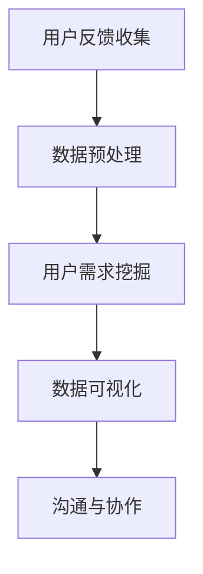
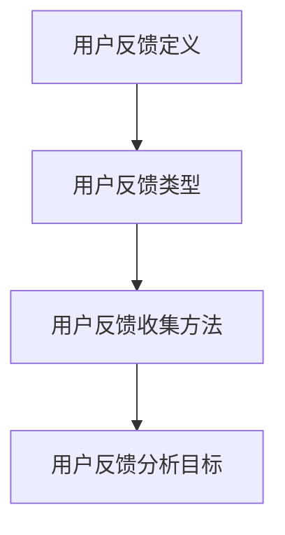
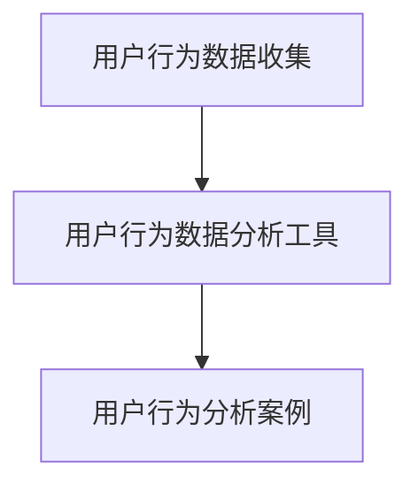
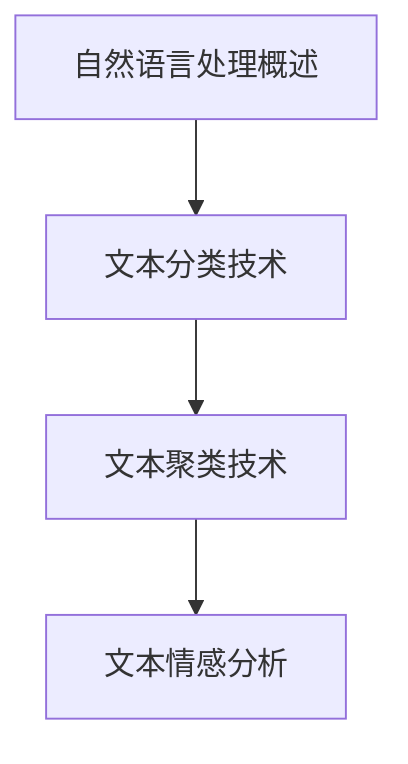
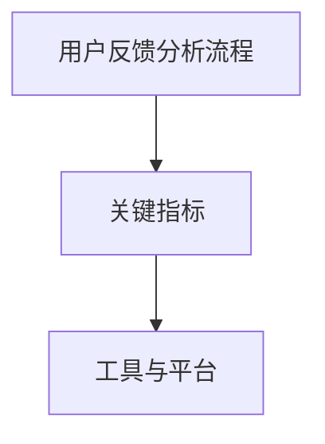
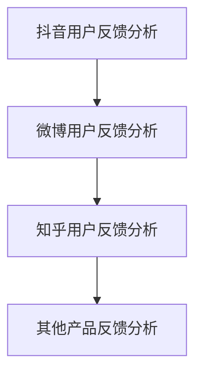
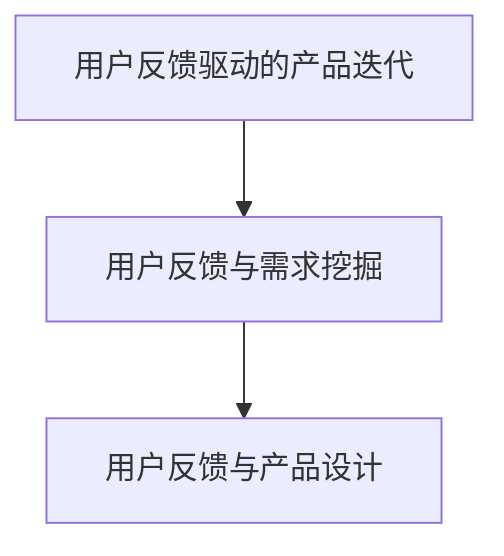
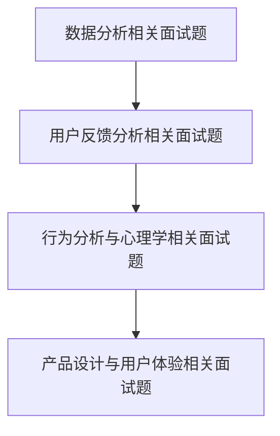

                 

### 文章标题：2024字节跳动技术用户反馈分析师面试真题汇总（附答案）

#### 关键词：字节跳动，用户反馈分析，面试真题，答案解析，技术博客

> 摘要：本文旨在汇总2024年字节跳动技术用户反馈分析师面试真题，并附上详细答案解析，帮助准备面试的读者更好地理解和掌握用户反馈分析的核心技术和方法。文章将从用户反馈分析师的角色与职责、基本概念、用户行为数据分析、文本分析技术等多个方面进行深入探讨，并通过实战案例和数学模型，详细解析面试题目，助力读者在面试中脱颖而出。

---

# 2024字节跳动技术用户反馈分析师面试真题汇总（附答案）

## 第一部分：用户反馈分析师入门

### 第1章：用户反馈分析师的角色与职责

用户反馈分析师是字节跳动等互联网公司中不可或缺的角色。他们负责收集、分析用户反馈，提炼用户需求，为产品优化提供数据支持。用户反馈分析师的角色与职责如下：

1. **用户反馈收集**：通过各种渠道收集用户的反馈信息，包括用户评价、社区讨论、用户反馈表单等。
2. **数据预处理**：对收集到的用户反馈进行清洗、整理，为后续分析做好准备。
3. **用户需求挖掘**：通过对用户反馈的分析，挖掘用户的需求和痛点，为产品改进提供依据。
4. **数据可视化**：将分析结果通过图表、报表等形式进行可视化展示，便于团队成员理解和决策。
5. **沟通与协作**：与产品经理、工程师等团队成员密切沟通，确保分析结果能够转化为实际的产品改进措施。

**Mermaid 流程图：**

### 第2章：用户反馈分析的基本概念

用户反馈分析是通过对用户反馈的系统性分析，了解用户需求、产品问题及改进方向的过程。以下是用户反馈分析的基本概念：

1. **用户反馈定义**：用户在使用产品过程中，通过评价、评论、反馈表单等形式表达的产品体验和意见。
2. **用户反馈类型**：根据反馈的形式和内容，可分为文本反馈、图片反馈、视频反馈等。
3. **用户反馈收集方法**：包括在线调查、用户访谈、用户反馈表单、社交媒体监测等。
4. **用户反馈分析目标**：了解用户需求、识别产品问题、评估产品性能、优化用户体验。

**Mermaid 流程图：**

### 第3章：用户行为数据分析

用户行为数据是用户在使用产品过程中产生的行为记录，包括点击、浏览、搜索、评论等。用户行为数据分析是用户反馈分析的重要组成部分，以下是相关内容：

1. **用户行为数据收集**：通过日志收集、数据分析平台等手段，收集用户行为数据。
2. **用户行为数据分析工具**：包括Google Analytics、Mixpanel、Facebook Insights等。
3. **用户行为分析案例**：通过实际案例，分析用户行为数据，了解用户行为特点，为产品优化提供依据。

**Mermaid 流程图：**

### 第4章：文本分析技术

文本分析技术是对用户反馈文本进行结构化处理的技术，包括文本分类、文本聚类、情感分析等。以下是相关内容：

1. **自然语言处理概述**：介绍自然语言处理的基本概念和技术。
2. **文本分类技术**：介绍文本分类算法的原理和应用。
3. **文本聚类技术**：介绍文本聚类算法的原理和应用。
4. **文本情感分析**：介绍文本情感分析算法的原理和应用。

**Mermaid 流程图：**

## 第二部分：字节跳动用户反馈分析实战

### 第5章：字节跳动用户反馈分析框架

字节跳动用户反馈分析框架包括数据收集、预处理、分析、可视化、决策等环节。以下是相关内容：

1. **字节跳动用户反馈分析流程**：介绍用户反馈分析的基本流程和步骤。
2. **用户反馈分析的关键指标**：介绍用户反馈分析中常用的关键指标和衡量标准。
3. **用户反馈分析工具与平台**：介绍字节跳动用户反馈分析所使用的工具和平台。

**Mermaid 流程图：**

### 第6章：字节跳动核心产品用户反馈分析

字节跳动拥有多个核心产品，如抖音、微博、知乎等。以下是针对这些产品的用户反馈分析：

1. **抖音用户反馈分析**：分析抖音用户的使用情况、喜好和问题。
2. **微博用户反馈分析**：分析微博用户的使用情况、喜好和问题。
3. **知乎用户反馈分析**：分析知乎用户的使用情况、喜好和问题。
4. **其他字节跳动产品用户反馈分析**：分析其他字节跳动产品的用户反馈情况。

**Mermaid 流程图：**

### 第7章：用户反馈分析在产品优化中的应用

用户反馈分析在产品优化中起着至关重要的作用。以下是相关内容：

1. **用户反馈驱动的产品迭代**：介绍用户反馈如何驱动产品迭代和优化。
2. **用户反馈与需求挖掘**：介绍如何通过用户反馈挖掘用户需求，为产品优化提供依据。
3. **用户反馈与产品设计**：介绍如何基于用户反馈进行产品设计，提高用户体验。

**Mermaid 流程图：**

### 第8章：用户反馈分析师面试真题汇总

本章节将汇总2024年字节跳动用户反馈分析师面试真题，并附上详细答案解析。内容包括：

1. **数据分析相关面试题**：介绍用户反馈分析中常见的数据分析相关面试题。
2. **用户反馈分析相关面试题**：介绍用户反馈分析相关面试题，如用户反馈分类、文本分析等。
3. **行为分析与心理学相关面试题**：介绍用户行为分析与心理学相关面试题。
4. **产品设计与用户体验相关面试题**：介绍产品设计与用户体验相关面试题。

**Mermaid 流�程图：**

## 附录

### 附录A：常用数据分析工具与资源

本附录将介绍常用的数据分析工具和资源，包括数据分析工具、用户反馈分析资源、相关文献与资料推荐等。

### 附录B：用户反馈分析实践项目

本附录将介绍一个用户反馈分析实践项目，包括项目介绍、目标与指标、实施步骤、成果与经验总结等。

### 附录C：用户反馈分析师面试真题及答案

本附录将汇总用户反馈分析师面试真题，并提供详细的答案解析，帮助读者更好地应对面试挑战。

---

**核心概念与联系：**

- **用户反馈分析师**：负责收集、分析用户反馈，提炼用户需求，为产品优化提供数据支持的职位。
- **用户反馈分析**：通过对用户反馈的系统性分析，了解用户需求、产品问题及改进方向的过程。
- **用户行为数据**：用户在使用产品过程中产生的行为记录，包括点击、浏览、搜索、评论等。
- **文本分析技术**：对用户反馈文本进行结构化处理的技术，包括文本分类、文本聚类、情感分析等。
- **用户反馈分析框架**：用于指导用户反馈分析过程的一系列方法和工具，包括数据收集、预处理、分析、可视化、决策等环节。

**核心算法原理讲解：**

1. **文本分类算法**：将文本数据按照类别进行划分的方法。常用的文本分类算法包括朴素贝叶斯、支持向量机、随机森林等。
2. **文本聚类算法**：将文本数据按照相似度进行分组的方法。常用的文本聚类算法包括K-means、层次聚类等。
3. **情感分析算法**：判断文本情感倾向的方法。常用的情感分析算法包括基于规则的方法、基于机器学习的方法等。

**常用数学公式 & 详细讲解 & 举例说明：**

1. **朴素贝叶斯分类公式**：$$ P(C|X) = \frac{P(X|C)P(C)}{P(X)} $$
2. **支持向量机分类公式**：$$ w^T x + b = 0 $$
3. **K-means聚类公式**：$$ C = \{c_1, c_2, ..., c_k\} $$

### 附录

#### 附录A：常用数据分析工具与资源

**数据分析工具介绍**

1. **Google Analytics**：一款强大的网站分析工具，可用于追踪用户行为、分析流量来源等。
2. **Mixpanel**：一款用户行为分析工具，可用于追踪用户行为、分析用户留存率等。
3. **Facebook Insights**：一款社交媒体分析工具，可用于分析用户在社交媒体平台上的行为。

**用户反馈分析资源**

1. **用户访谈指南**：介绍如何进行用户访谈，获取有价值的信息。
2. **在线调查工具**：如SurveyMonkey、Typeform等，用于收集用户反馈。
3. **文本分析工具**：如NLTK、spaCy等，用于处理和分析文本数据。

**相关文献与资料推荐**

1. 《用户反馈分析：技术、方法与实践》
2. 《数据分析实战：从入门到精通》
3. 《Python数据科学手册》

#### 附录B：用户反馈分析实践项目

**实践项目介绍**

本实践项目旨在通过用户反馈分析，提高某款互联网产品的用户体验。项目目标包括：

1. 挖掘用户需求，为产品优化提供依据。
2. 识别产品问题，并提出改进方案。
3. 提高用户满意度，降低用户流失率。

**项目目标与指标**

1. 目标：提高用户满意度，降低用户流失率。
2. 指标：用户满意度评分、用户留存率、用户活跃度等。

**实践项目实施步骤**

1. 收集用户反馈：通过用户访谈、在线调查等方式收集用户反馈。
2. 数据预处理：清洗、整理用户反馈数据，为后续分析做好准备。
3. 用户需求挖掘：通过文本分析技术，提取用户需求。
4. 识别产品问题：分析用户反馈，识别产品问题。
5. 提出改进方案：针对识别出的问题，提出改进方案。
6. 实施改进方案：将改进方案转化为实际的产品优化措施。
7. 评估效果：通过数据指标评估改进方案的效果。

**项目成果与经验总结**

1. 成果：通过用户反馈分析，成功挖掘出用户需求，提出并实施了多项产品优化措施。
2. 经验总结：用户反馈分析在产品优化中具有重要作用，应重视用户需求挖掘和问题识别。

#### 附录C：用户反馈分析师面试真题及答案

**数据分析相关面试题**

1. 什么是用户留存率？如何计算？
2. 什么是用户活跃度？如何衡量？
3. 请简要介绍常用的用户行为分析工具。

**答案解析：**

1. 用户留存率是指在一定时间内，继续使用产品的用户比例。计算公式为：留存率 = （n日内继续使用产品的用户数 / 初始使用产品的用户数）× 100%。其中，n表示天数。

2. 用户活跃度是指用户在产品中的互动程度。衡量指标包括：每日活跃用户数（DAU）、每月活跃用户数（MAU）、用户平均在线时长等。

3. 常用的用户行为分析工具包括：Google Analytics、Mixpanel、Firebase Analytics、Flurry Analytics等。

**用户反馈分析相关面试题**

1. 什么是文本分类？请简要介绍常见的文本分类算法。
2. 什么是文本聚类？请简要介绍常见的文本聚类算法。
3. 请说明情感分析的定义及应用场景。

**答案解析：**

1. 文本分类是将文本数据按照类别进行划分的过程。常见的文本分类算法包括：朴素贝叶斯分类器、支持向量机（SVM）、K最近邻（KNN）等。

2. 文本聚类是将文本数据按照相似度进行分组的过程。常见的文本聚类算法包括：K-means、层次聚类、DBSCAN等。

3. 情感分析是指判断文本情感倾向的方法。应用场景包括：社交媒体监测、产品评价分析、用户情绪预测等。

**行为分析与心理学相关面试题**

1. 什么是用户体验（UX）？请简要介绍用户体验设计的原则。
2. 什么是用户画像？请简要介绍用户画像的构建方法。

**答案解析：**

1. 用户体验（UX）是指用户在使用产品过程中的感受和体验。用户体验设计的原则包括：简洁、一致、直观、可用等。

2. 用户画像是对用户特征和需求的抽象描述。构建方法包括：用户访谈、问卷调查、数据挖掘等。

**产品设计与用户体验相关面试题**

1. 请说明敏捷开发的方法及其优点。
2. 请简要介绍A/B测试的定义和应用场景。

**答案解析：**

1. 敏捷开发是一种迭代、增量的软件开发方法。优点包括：快速响应变化、提高团队协作效率、提高产品质量等。

2. A/B测试是一种将产品功能或页面设计进行对比测试的方法。应用场景包括：优化产品功能、提升用户转化率、改进用户体验等。

### 作者：AI天才研究院/AI Genius Institute & 禅与计算机程序设计艺术 /Zen And The Art of Computer Programming

---

本文以2024年字节跳动技术用户反馈分析师面试真题为线索，系统地介绍了用户反馈分析师的角色与职责、基本概念、用户行为数据分析、文本分析技术等内容。通过实战案例和数学模型，本文详细解析了面试题目，帮助读者更好地理解和掌握用户反馈分析的核心技术和方法。希望本文能对准备面试的读者提供有益的指导，助力大家在字节跳动技术用户反馈分析师面试中脱颖而出。在用户反馈分析的道路上，让我们共同探索、进步！

