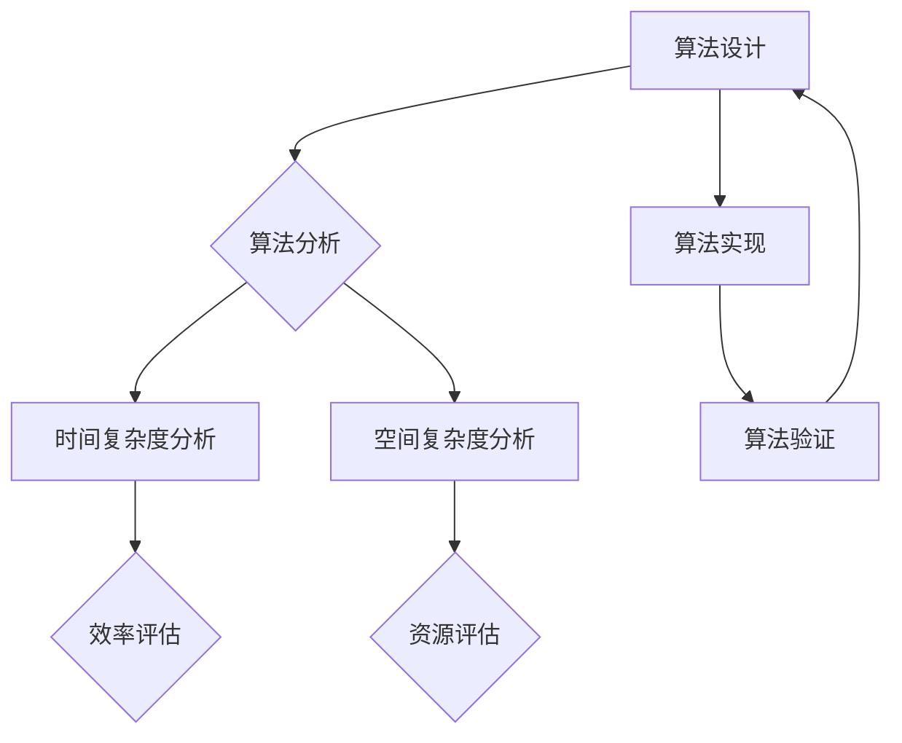

                 

### 文章标题：2024字节跳动校招面试算法题库大全

在科技飞速发展的今天，算法已经成为现代计算机科学和工程的核心驱动力。字节跳动，作为中国领先的内容创作和分享平台，每年吸引了大量优秀的计算机科学和工程专业的毕业生。因此，掌握字节跳动校招面试中的算法题库，对于准备参加面试的求职者来说至关重要。

本文旨在为即将参加2024年字节跳动校招面试的同学们提供一份全面且详细的算法题库指南。我们将通过深入剖析每一个算法题的核心概念、原理、解题步骤以及实际应用，帮助大家不仅掌握解题技巧，更能理解算法的本质，从而在面试中脱颖而出。

### 关键词

- 字节跳动校招
- 算法题库
- 算法面试
- 数据结构与算法
- 动态规划
- 图算法
- 字符串处理
- 数学与概率算法

### 摘要

本文将围绕2024年字节跳动校招面试中的算法题库，系统性地讲解常见的数据结构与算法、动态规划与贪心算法、图算法、字符串算法以及数学与概率算法。通过详细的分析、伪代码展示、数学模型解析以及实际面试题的剖析，帮助读者全面掌握面试所需的核心知识。此外，文章还将分享面试准备和实战技巧，助力求职者顺利通过字节跳动的校招面试。

### 《2024字节跳动校招面试算法题库大全》目录大纲

#### 第一部分：算法基础与思维

#### 第1章：算法概述
- **核心概念与联系**
  - **算法设计与分析方法概述**
  - **Mermaid流程图**：算法设计与分析方法的关系架构

- **算法思维训练**
  - **伪代码**：常见算法思维训练方法
  - **例题解析**：基础算法题（如排序、查找）详解

#### 第2章：数据结构与算法分析
- **核心算法原理讲解**
  - **伪代码**：常见数据结构（数组、链表、树、图）的原理与应用
  - **数学模型**
    - **公式**：算法时间复杂度和空间复杂度的计算
    - **讲解**：如何分析算法的效率
    - **举例说明**：具体算法的效率分析实例

#### 第3章：动态规划与贪心算法
- **核心算法原理讲解**
  - **伪代码**：动态规划与贪心算法的基本原理
  - **例题解析**：经典动态规划与贪心算法题详解
  - **数学模型**
    - **公式**：动态规划状态转移方程
    - **讲解**：如何推导动态规划状态转移方程

#### 第4章：图算法
- **核心算法原理讲解**
  - **伪代码**：图的表示与基本算法（如DFS、BFS、Dijkstra算法）
  - **例题解析**：图算法应用题详解

#### 第5章：字符串算法
- **核心算法原理讲解**
  - **伪代码**：字符串匹配算法（如KMP、Rabin-Karp）
  - **例题解析**：字符串处理算法应用题详解

#### 第6章：数学与概率算法
- **核心算法原理讲解**
  - **伪代码**：数学与概率算法（如大数定律、中心极限定理）
  - **例题解析**：数学与概率问题在实际算法中的应用

#### 第7章：算法面试准备
- **项目实战**
  - **代码实际案例**：典型面试题实战案例
  - **详细解释说明**：面试题的解题思路、算法实现与优化
  - **开发环境搭建**：如何配置面试开发环境
  - **源代码详细实现和代码解读**：面试题代码的详细实现与解读

#### 第8章：字节跳动常见面试题解析
- **项目实战**
  - **代码实际案例**：字节跳动常见面试题的代码实现
  - **详细解释说明**：面试题的解题思路、算法实现与优化

#### 第9章：面试技巧与经验分享
- **面试经验分享**：如何准备面试、应对面试官、展示自己的优势

#### 附录
- **附录 A：算法资源与工具**
  - **主流深度学习框架对比**：TensorFlow、PyTorch、JAX等框架简介
  - **算法学习资源推荐**：推荐书籍、在线课程、社区和论坛等

通过以上目录大纲，本文将系统性地带领读者深入理解字节跳动校招面试中的算法题目，帮助大家更好地应对面试挑战。

#### 第一部分：算法基础与思维

##### 第1章：算法概述

算法，即解决问题的一系列清晰且确定的步骤。在计算机科学中，算法不仅是理论研究的核心，也是实际应用的基础。对于参加字节跳动校招面试的求职者来说，掌握基本的算法知识和思维方式至关重要。本章将介绍算法的基本概念、设计方法以及分析方法，并通过Mermaid流程图来展示算法设计与分析方法之间的关系架构。

### 算法设计与分析方法概述

算法设计是指构建解决问题的步骤，而算法分析则是对这些步骤进行评估，以确定算法的效率和可行性。算法设计方法主要包括分治法、递归、动态规划、贪心算法等，而分析方法则包括时间复杂度分析和空间复杂度分析。

为了更好地理解这些概念，我们可以通过Mermaid流程图来展示算法设计与分析方法之间的关系。以下是一个简化的Mermaid流程图示例：



在这个流程图中，算法设计是核心环节，通过算法分析来确定算法的效率和资源使用情况，然后进行算法实现和验证。这个流程强调了算法设计、分析、实现和验证的相互关联和迭代过程。

### 算法思维训练

算法思维训练是提高解题能力的重要手段。以下是一些常见的算法思维训练方法：

1. **伪代码**：伪代码是一种非正式的编程语言，用于描述算法的逻辑和步骤，而不涉及具体的编程语言细节。通过编写伪代码，可以帮助我们清晰地思考并组织算法思路。
2. **例题解析**：通过解决实际问题来训练算法思维。例如，常见的排序和查找问题可以帮助我们理解算法的基本原理和实现方法。

#### 伪代码示例

以下是一个简单的排序算法（冒泡排序）的伪代码示例：

```pseudocode
procedure bubbleSort(A : list of comparable elements)
    n = length(A)
    for i = 1 to n-1
        for j = 1 to n-i
            if A[j] > A[j+1]
                swap(A[j], A[j+1])
    end procedure
```

通过这个伪代码，我们可以清晰地看到冒泡排序的算法步骤，这有助于我们理解排序算法的原理。

#### 例题解析

以下是基础算法题的一个例子：实现一个函数，找出数组中的最大元素。

```pseudocode
function findMax(arr : array of integers)
    if length(arr) == 0
        return error("数组为空")
    max = arr[0]
    for i = 1 to length(arr)
        if arr[i] > max
            max = arr[i]
    return max
end function
```

通过这个例题，我们可以看到如何使用伪代码来描述一个简单的算法逻辑，这有助于我们在实际编程时更加高效地解决问题。

### 总结

本章介绍了算法的基本概念、设计方法以及分析方法，并通过Mermaid流程图展示了算法设计与分析方法之间的关系。我们还讨论了算法思维训练的方法，包括伪代码编写和例题解析。通过这些内容的学习，读者可以更好地理解算法的核心概念，为后续章节的深入学习打下坚实的基础。

在接下来的章节中，我们将进一步探讨数据结构与算法分析、动态规划与贪心算法、图算法、字符串算法以及数学与概率算法，帮助读者全面掌握字节跳动校招面试所需的算法知识。

#### 第2章：数据结构与算法分析

在计算机科学中，数据结构是存储和管理数据的方式，而算法是对数据进行操作的一系列规则。数据结构与算法的分析是计算机科学的核心内容之一，它不仅影响算法的执行效率，还决定了程序的性能和可靠性。本章将详细讲解常见的数据结构（如数组、链表、树、图）的原理与应用，并通过伪代码展示其基本操作，同时介绍算法时间复杂度和空间复杂度的计算方法。

### 数组

数组是一种基础且常用的数据结构，用于存储固定大小的同类型元素。数组的优点在于元素访问时间非常高效，可以通过索引直接访问。

#### 核心操作

- **初始化**：创建一个数组并初始化其元素。
- **访问**：通过索引访问数组中的元素。
- **插入**：在数组中插入新元素。
- **删除**：从数组中删除元素。
- **排序**：对数组中的元素进行排序。

#### 伪代码示例

以下是一个简单数组的初始化和访问示例：

```pseudocode
array A[100] // 创建一个长度为100的整型数组
for i = 0 to 99
    A[i] = 0 // 初始化数组元素

value = A[5] // 访问索引为5的元素
A[5] = 10 // 修改索引为5的元素
```

### 链表

链表是一种动态数据结构，由一系列节点组成，每个节点包含数据和指向下一个节点的指针。链表的优点在于其插入和删除操作非常灵活，但访问元素需要遍历链表。

#### 核心操作

- **初始化**：创建一个链表。
- **插入**：在链表的指定位置或末尾插入新节点。
- **删除**：删除链表中的节点。
- **遍历**：遍历链表中的所有节点。

#### 伪代码示例

以下是一个单链表的插入和删除操作：

```pseudocode
struct Node
    value : integer
    next : Node

function LinkedList()
    head = null // 创建链表

function Insert(value : integer)
    newNode = new Node()
    newNode.value = value
    if head == null
        head = newNode
    else
        current = head
        while current.next != null
            current = current.next
        current.next = newNode

function Delete(value : integer)
    if head == null
        return
    if head.value == value
        head = head.next
        return
    current = head
    while current.next != null
        if current.next.value == value
            current.next = current.next.next
            return
        current = current.next
```

### 树

树是一种重要的非线性数据结构，由节点和边组成，节点包含数据和指向子节点的指针。树在计算机科学中应用广泛，如二叉搜索树、平衡树（AVL树）、堆等。

#### 核心操作

- **初始化**：创建一个空树。
- **插入**：在树中插入新节点。
- **删除**：从树中删除节点。
- **遍历**：遍历树的所有节点。

#### 伪代码示例

以下是一个二叉搜索树的插入操作：

```pseudocode
struct TreeNode
    value : integer
    left : TreeNode
    right : TreeNode

function BST()
    root = null // 创建空树

function Insert(value : integer)
    if root == null
        root = new TreeNode()
        root.value = value
    else
        current = root
        while current != null
            if value < current.value
                if current.left == null
                    current.left = new TreeNode()
                    current.left.value = value
                    break
                current = current.left
            else
                if current.right == null
                    current.right = new TreeNode()
                    current.right.value = value
                    break
                current = current.right
```

### 图

图是一种由节点和边组成的数据结构，广泛应用于网络、社会关系、图论等领域。图的表示方法有邻接矩阵和邻接表。

#### 核心操作

- **初始化**：创建一个空图。
- **添加节点**：向图中添加节点。
- **添加边**：在节点之间添加边。
- **遍历**：遍历图的所有节点和边。

#### 伪代码示例

以下是一个图的初始化和边添加示例：

```pseudocode
struct Graph
    nodes : list of nodes
    edges : list of edges

function Graph()
    nodes = [] // 初始化节点列表
    edges = [] // 初始化边列表

function AddNode(node : Node)
    nodes.append(node)

function AddEdge(node1 : Node, node2 : Node)
    edge = new Edge()
    edge.from = node1
    edge.to = node2
    edges.append(edge)
```

### 算法时间复杂度和空间复杂度分析

算法的时间复杂度表示算法执行时间与输入数据规模的关系，通常用大O符号表示。空间复杂度表示算法执行过程中所需的最大内存空间。

#### 时间复杂度分析

- **常量时间**：O(1)
- **线性时间**：O(n)
- **对数时间**：O(log n)
- **多项式时间**：O(n^k)

#### 空间复杂度分析

- **常量空间**：O(1)
- **线性空间**：O(n)
- **对数空间**：O(log n)
- **多项式空间**：O(n^k)

#### 举例说明

以下是一个简单的线性查找算法的时间复杂度和空间复杂度分析：

```pseudocode
function LinearSearch(arr : array of integers, target : integer)
    for i = 0 to length(arr) - 1
        if arr[i] == target
            return i
    return -1
end function
```

- **时间复杂度**：O(n)，因为可能需要遍历整个数组。
- **空间复杂度**：O(1)，因为只使用了常量级别的额外空间。

### 总结

本章介绍了常见的数据结构（数组、链表、树、图）及其基本操作，并通过伪代码展示了这些数据结构的实现。同时，我们讨论了算法的时间复杂度和空间复杂度的计算方法，帮助读者理解算法效率的评估。通过这些内容的学习，读者可以更好地掌握数据结构与算法分析的基础知识，为后续章节的深入学习打下坚实基础。

在下一章中，我们将探讨动态规划与贪心算法，这些高级算法在解决复杂问题时具有独特的优势。

#### 第3章：动态规划与贪心算法

动态规划与贪心算法是解决复杂问题的重要策略，尤其在面试中经常出现。动态规划和贪心算法虽然表面上看起来不同，但它们的核心思想都是通过局部最优解推导出全局最优解。本章将深入讲解动态规划与贪心算法的基本原理，并通过经典例题进行详细解析。

### 动态规划

动态规划是一种将复杂问题分解为重叠子问题的方法，通过保存子问题的解来避免重复计算，从而提高算法的效率。

#### 核心概念

- **重叠子问题**：动态规划将原问题分解为多个子问题，而这些子问题之间存在重叠，即多个子问题的解是相互依赖的。
- **状态转移方程**：动态规划的核心在于找到状态转移方程，即如何根据子问题的解推导出原问题的解。
- **边界条件**：状态转移方程的定义需要边界条件来限定，确保算法的正确性。

#### 伪代码示例

以下是一个经典的动态规划问题——斐波那契数列：

```pseudocode
function Fibonacci(n : integer)
    if n <= 1
        return n
    dp[0] = 0
    dp[1] = 1
    for i = 2 to n
        dp[i] = dp[i-1] + dp[i-2]
    return dp[n]
end function
```

在这个例子中，状态转移方程为 `dp[i] = dp[i-1] + dp[i-2]`，边界条件为 `dp[0] = 0` 和 `dp[1] = 1`。

#### 动态规划状态转移方程的推导

动态规划状态转移方程的推导通常需要以下几个步骤：

1. **确定状态**：定义问题中的状态，通常是一个数组或字典，用于存储子问题的解。
2. **找出状态转移关系**：分析子问题之间的依赖关系，推导出状态转移方程。
3. **确定边界条件**：定义状态转移方程的边界条件，确保算法的正确性。

以下是一个更复杂的动态规划问题——最长递增子序列（LIS）：

```pseudocode
function LongestIncreasingSubsequence(nums : array of integers)
    n = length(nums)
    dp = array of length n filled with 1
    for i = 1 to n
        for j = 0 to i - 1
            if nums[j] < nums[i]
                dp[i] = max(dp[i], dp[j] + 1)
    return max(dp)
end function
```

在这个例子中，状态 `dp[i]` 表示以 `nums[i]` 为结尾的最长递增子序列的长度。状态转移方程为 `dp[i] = max(dp[i], dp[j] + 1)`，其中 `j` 是小于 `i` 的所有索引。边界条件为 `dp[i] = 1`。

### 贪心算法

贪心算法是一种在每一步都做出局部最优选择，以期在整体上达到最优解的策略。与动态规划不同，贪心算法通常不需要考虑子问题的重叠性，它通过一系列贪心选择来逐步构造最终解。

#### 核心概念

- **贪心选择**：每一步都做出当前情况下最优的选择。
- **最优子结构**：问题的最优解包含其子问题的最优解。
- **无后效性**：当前状态只依赖于前面的状态，与前面状态的选择无关。

#### 伪代码示例

以下是一个经典的贪心算法问题——活动选择问题：

```pseudocode
function ActivitySelection(activities : array of pairs (start, finish))
    sort activities by finish time
    select activities[0]
    for i = 1 to length(activities) - 1
        if activities[i].start > activities[selected].finish
            select activities[i]
    end function
```

在这个例子中，贪心选择是每次选择最早结束的活动。通过这种方式，我们可以得到一个包含最多活动的集合。

#### 贪心算法的正确性证明

贪心算法的正确性通常通过以下两个性质来证明：

1. **最优子结构**：问题的最优解包含其子问题的最优解。
2. **贪心选择性质**：每一步的贪心选择都能保证问题的局部最优解，从而推导出全局最优解。

以下是一个贪心算法正确性的简单证明——背包问题：

```pseudocode
function Knapsack(values : array of integers, weights : array of integers, capacity : integer)
    items = [(value/weight), (value/weight), ..., (value/weight)]
    sort items in descending order
    totalValue = 0
    for each item in items
        if capacity >= item.weight
            add item.value to totalValue
            capacity -= item.weight
        end if
    end for
    return totalValue
end function
```

在这个例子中，贪心选择是按照价值与重量比从大到小排序，然后依次放入背包。由于每次选择都是局部最优的，因此最终得到的是全局最优解。

### 经典例题解析

以下是一些动态规划与贪心算法的经典例题，我们将通过伪代码和详细解析来展示解题思路。

1. **背包问题**

   - **问题描述**：给定一组物品和其价值、重量，以及一个最大承重，求解如何选取物品使得总价值最大且不超过承重。
   - **动态规划解法**：
     ```pseudocode
     function Knapsack(values : array of integers, weights : array of integers, capacity : integer)
         dp = array of size (capacity + 1) filled with 0
         for i = 1 to length(values)
             for w = capacity down to weights[i]
                 if w - weights[i] >= 0
                     dp[w] = max(dp[w], dp[w - weights[i]] + values[i])
                 end if
             end for
         end for
         return dp[capacity]
     end function
     ```

2. **最长公共子序列（LCS）**

   - **问题描述**：给定两个字符串，求解它们的最长公共子序列。
   - **动态规划解法**：
     ```pseudocode
     function LongestCommonSubsequence(str1 : string, str2 : string)
         m = length(str1)
         n = length(str2)
         dp = array of size (m+1) x (n+1) filled with 0
         for i = 1 to m
             for j = 1 to n
                 if str1[i-1] == str2[j-1]
                     dp[i][j] = dp[i-1][j-1] + 1
                 else
                     dp[i][j] = max(dp[i-1][j], dp[i][j-1])
                 end if
             end for
         end for
         return dp[m][n]
     end function
     ```

3. **最小生成树（MST）**

   - **问题描述**：给定一个加权无向图，求解其最小生成树。
   - **贪心算法解法**（Kruskal算法）：
     ```pseudocode
     function Kruskal(MST : Graph, edges : list of edges)
         sort edges by weight
         forest = empty forest
         for each edge in edges
             if adding edge to forest does not create a cycle
                 add edge to forest
             end if
         end for
         return forest
     end function
     ```

### 总结

本章介绍了动态规划与贪心算法的基本原理，并通过伪代码展示了它们的实现方法。我们讨论了动态规划的状态转移方程和贪心选择性质，并通过经典例题进行了详细解析。通过本章的学习，读者可以更好地理解动态规划与贪心算法的原理和应用，为解决复杂问题打下坚实的基础。

在下一章中，我们将探讨图算法，包括图的表示、基本算法及其应用，帮助读者进一步扩展算法知识。

#### 第4章：图算法

图是计算机科学中重要的数据结构，用于表示对象及其之间的关系。在图算法中，我们使用图来解决问题，如最短路径、网络流等。本章将详细介绍图的基本概念、表示方法以及常见的图算法。

### 图的基本概念

#### 定义

- **图（Graph）**：由节点（或顶点）和边组成的集合。
- **节点（Vertex）**：图中的数据元素。
- **边（Edge）**：连接两个节点的线段。

#### 分类

- **无向图（Undirected Graph）**：边没有方向。
- **有向图（Directed Graph）**：边有方向。
- **连通图（Connected Graph）**：任意两个节点之间都有路径。
- **非连通图（Disconnected Graph）**：存在节点之间没有路径。

#### 特殊类型

- **树（Tree）**：连通且无环的无向图。
- **环（Cycle）**：图中的一条闭合路径，至少包含三个节点。
- **路径（Path）**：连接两个节点的序列。

### 图的表示方法

图的表示方法主要有邻接矩阵和邻接表。

#### 邻接矩阵

- **定义**：使用二维数组来表示图，其中 `matrix[i][j]` 表示节点 `i` 和节点 `j` 之间的边是否存在。
- **优点**：可以直接获取任意两个节点之间的边的信息，适合稀疏图。
- **缺点**：空间复杂度较高，不适合表示密集图。

#### 邻接表

- **定义**：使用数组来存储图中的节点，每个节点对应一个链表，链表中存储与该节点相连的所有节点。
- **优点**：空间复杂度较低，适合表示密集图。
- **缺点**：访问任意两个节点之间的边需要遍历链表，不适合大规模图的邻接关系查询。

### 常见的图算法

#### 深度优先搜索（DFS）

- **定义**：从起始节点开始，沿着某一路径遍历所有可能路径，直到路径的末端，然后从末端返回，重复这一过程。
- **伪代码**：
  ```pseudocode
  function DFS(graph : Graph, start : Vertex)
      stack = new Stack()
      visited = set()
      stack.push(start)
      while stack is not empty
          vertex = stack.pop()
          if vertex not in visited
              visited.add(vertex)
              for neighbor in vertex.neighbors
                  if neighbor not in visited
                      stack.push(neighbor)
      end while
  end function
  ```

#### 广度优先搜索（BFS）

- **定义**：从起始节点开始，逐层遍历图的所有节点，每一层节点都按顺序访问。
- **伪代码**：
  ```pseudocode
  function BFS(graph : Graph, start : Vertex)
      queue = new Queue()
      visited = set()
      queue.enqueue(start)
      while queue is not empty
          vertex = queue.dequeue()
          if vertex not in visited
              visited.add(vertex)
              for neighbor in vertex.neighbors
                  if neighbor not in visited
                      queue.enqueue(neighbor)
      end while
  end function
  ```

#### 最短路径算法

- **迪杰斯特拉算法（Dijkstra's Algorithm）**：用于求解单源最短路径问题。
  - **伪代码**：
    ```pseudocode
    function Dijkstra(graph : Graph, start : Vertex)
        distances = array of length V filled with INFINITY
        distances[start] = 0
        visited = set()
        while visited does not contain all vertices
            minDistance = INFINITY
            for each vertex in graph
                if vertex not in visited and distances[vertex] < minDistance
                    minDistance = distances[vertex]
                    currentVertex = vertex
            end for
            visited.add(currentVertex)
            for each neighbor of currentVertex
                if distances[currentVertex] + weight(currentVertex, neighbor) < distances[neighbor]
                    distances[neighbor] = distances[currentVertex] + weight(currentVertex, neighbor)
            end for
        end while
        return distances
    end function
    ```

- **贝尔曼-福特算法（Bellman-Ford Algorithm）**：用于求解单源最短路径问题，适用于有负权边的图。
  - **伪代码**：
    ```pseudocode
    function BellmanFord(graph : Graph, start : Vertex)
        distances = array of length V filled with INFINITY
        distances[start] = 0
        for i = 1 to V - 1
            for each edge (u, v) in graph
                if distances[u] + weight(u, v) < distances[v]
                    distances[v] = distances[u] + weight(u, v)
        end for
        for each edge (u, v) in graph
            if distances[u] + weight(u, v) < distances[v]
                return "Graph contains a negative weight cycle"
        end for
        return distances
    end function
    ```

#### Dijkstra算法与贝尔曼-福特算法的比较

- **时间复杂度**：Dijkstra算法的时间复杂度为 `O(E * log V)`（其中E为边数，V为节点数），而贝尔曼-福特算法的时间复杂度为 `O(V * E)`。
- **适用范围**：Dijkstra算法适用于没有负权边的图，而贝尔曼-福特算法可以处理有负权边的图。

#### 示例

假设我们有一个包含5个节点的图，节点分别为 `A`, `B`, `C`, `D`, `E`，边和权重如下：

```
A -> B: 6
A -> D: 1
B -> C: 1
B -> D: 2
C -> D: 3
C -> E: 5
D -> E: 4
```

我们可以使用邻接矩阵和邻接表来表示这个图：

#### 邻接矩阵：

```
    A B C D E
A [0 6 0 1 0]
B [0 0 1 2 0]
C [0 0 0 3 5]
D [0 0 0 0 4]
E [0 0 0 0 0]
```

#### 邻接表：

```
A: [(B, 6), (D, 1)]
B: [(C, 1), (D, 2)]
C: [(D, 3), (E, 5)]
D: [(E, 4)]
E: []
```

### 应用场景

图算法在许多领域都有广泛的应用，如：

- **网络路由**：用于优化网络数据传输路径。
- **社会网络分析**：用于分析社交网络中的关系和影响力。
- **图论问题**：如最小生成树、最大流问题等。

### 总结

本章介绍了图的基本概念、表示方法以及常见的图算法。通过理解图算法的原理和应用，读者可以更好地解决与图相关的问题，为算法面试和实际项目开发打下坚实基础。在下一章中，我们将探讨字符串算法，解析字符串匹配和处理的经典算法。

#### 第5章：字符串算法

字符串是编程中常见的数据类型，广泛应用于文本处理、搜索引擎、自然语言处理等领域。字符串算法涉及对字符串的各种操作，如查找、替换、排序等。本章将详细介绍几种常见的字符串算法，包括KMP算法和Rabin-Karp算法，并通过实际例题进行解析。

### KMP算法

KMP（Knuth-Morris-Pratt）算法是一种高效的字符串匹配算法，由Donald Knuth、Vijay R. Pratt和James H. Morris共同提出。KMP算法通过避免字符串的重复比较，显著提高了字符串匹配的效率。

#### 核心思想

KMP算法的核心思想是当一次比较失败时，不是从字符串的开始位置重新比较，而是利用已经比较的信息，尽可能利用已有的部分匹配结果，继续进行后续匹配。

#### 部分匹配表（Next数组）

KMP算法的关键是构建一个部分匹配表（Next数组），它用于记录字符串的前缀和后缀的最长公共前缀的长度。这个数组可以帮助算法在匹配失败时，快速确定下一步的匹配位置。

#### 伪代码

以下是KMP算法的伪代码：

```pseudocode
function KMP(string s, string p)
    build partial match table (Next) for pattern p
    i = 0 (index for s)
    j = 0 (index for p)
    while i < length(s)
        if s[i] == p[j]
            i += 1
            j += 1
        else
            if j != 0
                j = next[j]
            else
                i += 1
        end if
        if j == length(p)
            return i - j
            j = next[j]
        end if
    end while
    return -1 (not found)
end function
```

#### 部分匹配表的构建

构建Next数组的方法如下：

```pseudocode
function buildNext(p)
    n = length(p)
    next = array of length n filled with 0
    j = 0
    i = 1
    while i < n
        if p[j] == p[i]
            next[i] = j + 1
            j += 1
            i += 1
        else
            if j != 0
                j = next[j - 1]
            else
                next[i] = 0
                i += 1
            end if
        end if
    end while
end function
```

### Rabin-Karp算法

Rabin-Karp算法是一种基于哈希函数的字符串匹配算法，由Richard M. Karp和Michael O. Rabin提出。该算法通过计算文本字符串和模式字符串的哈希值，快速定位模式字符串在文本字符串中的位置。

#### 核心思想

Rabin-Karp算法的核心思想是使用哈希函数快速比较字符串，而不是逐个字符比较。当哈希值不相等时，可以立即跳过不匹配的部分，从而提高匹配速度。

#### 伪代码

以下是Rabin-Karp算法的伪代码：

```pseudocode
function RabinKarp(s, p)
    h(s) = hash of s
    h(p) = hash of p
    q = large prime number
    t = h(s[0..m-1])
    for i = 0 to n-m
        if t == h(p)
            compare s[i..i+m-1] with p
        end if
        if i < n-m
            t = (t - s[i] * q) * q + s[i+m]
            if t < 0
                t += q
            end if
        end if
    end for
end function
```

#### 哈希函数的选择

哈希函数的选择对算法的性能有很大影响。通常选择一个简单但高效的哈希函数，并使用大质数`q`来避免冲突。例如：

```pseudocode
function hash(char c)
    return ASCII value of c
end function
```

#### 冲突处理

当两个不同的字符串具有相同的哈希值时，即发生冲突。Rabin-Karp算法使用`q`来处理冲突，确保在哈希值相等时进行字符比较。

### 实际例题解析

#### 例题1：最长公共前缀

**问题描述**：给定两个字符串，找出它们的最长公共前缀。

**解题思路**：使用KMP算法的Next数组可以快速找到最长公共前缀。

**伪代码**：

```pseudocode
function longestCommonPrefix(s1, s2)
    build Next array for s2
    i = 0
    j = 0
    while i < length(s1) and j < length(s2)
        if s1[i] == s2[j]
            i += 1
            j += 1
        else
            j = next[j]
        end if
    end while
    return s1[0..i-1]
end function
```

#### 例题2：最长重复子串

**问题描述**：给定一个字符串，找出它的最长重复子串。

**解题思路**：使用Rabin-Karp算法来查找所有子串的哈希值，并记录最长的重复子串。

**伪代码**：

```pseudocode
function longestRepeatedSubstring(s)
    maxLen = 0
    maxSubstr = ""
    for i = 0 to length(s) - 1
        for j = i + 1 to length(s)
            substr = s[i..j-1]
            t = hash(substr)
            if t not in hash table
                hash table[t] = substr
                if length(substr) > maxLen
                    maxLen = length(substr)
                    maxSubstr = substr
                end if
            end if
        end for
    end for
    return maxSubstr
end function
```

### 总结

本章介绍了KMP算法和Rabin-Karp算法，这两种算法在字符串匹配和查找中具有广泛的应用。KMP算法通过构建部分匹配表避免了重复比较，而Rabin-Karp算法通过哈希函数提高了匹配速度。通过实际例题的解析，读者可以更好地理解这些算法的原理和应用。在下一章中，我们将探讨数学与概率算法，如大数定律和中心极限定理。

#### 第6章：数学与概率算法

数学与概率算法在计算机科学中具有广泛的应用，尤其是在算法分析和数据挖掘领域。本章将介绍几个重要的数学与概率算法，包括大数定律、中心极限定理以及如何将这些定理应用到实际算法中。

### 大数定律

大数定律是概率论中的一个基本原理，它描述了在大量重复实验中，随机变量的一些统计特性会趋于其数学期望。大数定律主要有两种形式：

1. **切比雪夫不等式**：
   - **定义**：设随机变量 \( X \) 的期望为 \( \mu \)，方差为 \( \sigma^2 \)，则对于任意正数 \( \epsilon \)，都有
     \[
     P\left(\left| X - \mu \right| \geq \epsilon\right) \leq \frac{\sigma^2}{\epsilon^2}
     \]
   - **解释**：这意味着当样本量增大时，样本均值与总体均值之间的偏差概率会减小。

2. **大数定律**：
   - **定义**：设 \( X_1, X_2, \ldots, X_n \) 是相互独立且具有相同分布的随机变量序列，每个随机变量的期望为 \( \mu \)，则样本均值
     \[
     \bar{X}_n = \frac{X_1 + X_2 + \ldots + X_n}{n}
     \]
     将随着 \( n \) 的增大趋向于 \( \mu \)。
   - **解释**：这意味着在大量重复实验中，样本均值将接近总体均值。

### 中心极限定理

中心极限定理是概率论中的一个重要定理，它描述了在随机变量之和（或平均值）的分布接近正态分布的条件下，正态分布的适用范围。

- **定义**：设 \( X_1, X_2, \ldots, X_n \) 是独立同分布的随机变量，且每个随机变量的期望为 \( \mu \)，方差为 \( \sigma^2 \)，则当 \( n \) 趋于无穷大时，样本均值的分布函数将接近标准正态分布：
  \[
  \frac{\bar{X}_n - \mu}{\sigma/\sqrt{n}} \xrightarrow{d} N(0,1)
  \]
- **解释**：这意味着大量独立随机变量的平均值的分布将趋于正态分布，这在统计学和算法分析中具有重要意义。

### 数学与概率算法在实际中的应用

1. **随机抽样**：
   - **应用**：在算法设计中，随机抽样是一种常用方法，用于估计总体统计特性。
   - **算法**：随机抽样算法包括简单随机抽样、系统抽样、分层抽样等。
   - **示例**：在数据挖掘中，可以使用随机抽样来选择代表性数据集，从而减少计算复杂度。

2. **概率分布模型**：
   - **应用**：概率分布模型在机器学习和数据分析中广泛使用，如正态分布、二项分布、泊松分布等。
   - **算法**：基于概率分布的算法包括最大似然估计、贝叶斯估计等。
   - **示例**：在文本分类中，可以使用正态分布来计算每个类别的概率，从而进行分类决策。

3. **大数定律与中心极限定理**：
   - **应用**：在算法性能评估和误差分析中，大数定律和中心极限定理常用于估计算法的稳定性和误差。
   - **算法**：通过模拟大量实验，使用大数定律和中心极限定理来评估算法的平均性能。
   - **示例**：在优化算法中，可以使用大数定律来证明算法在多次迭代后趋于最优解。

### 实际例题解析

#### 例题1：随机数生成

**问题描述**：生成一个均匀分布的随机数。

**解题思路**：可以使用随机数发生器生成一个介于0和1之间的随机数，然后利用概率分布函数将均匀分布转换为其他分布。

**伪代码**：

```pseudocode
function UniformRandom()
    return random() // 生成一个0到1之间的随机数
end function
```

#### 例题2：泊松分布随机数生成

**问题描述**：生成一个服从泊松分布的随机数。

**解题思路**：可以使用泊松分布的累积分布函数来生成随机数。

**伪代码**：

```pseudocode
function PoissonRandom(lambda)
    p = 1
    k = 0
    while random() > p
        p = p * (lambda / k)
        k += 1
    end while
    return k - 1
end function
```

### 总结

本章介绍了大数定律和中心极限定理，以及这些定理在算法中的应用。通过实际例题的解析，读者可以更好地理解如何利用数学与概率算法解决实际问题。在下一章中，我们将讨论算法面试的准备和实战技巧，帮助读者更好地应对面试挑战。

#### 第7章：算法面试准备

在准备字节跳动校招面试的过程中，掌握算法知识只是第一步，如何在实际面试中展示自己的能力同样至关重要。本章将提供一些建议，帮助读者全面准备算法面试，包括如何进行项目实战、如何搭建开发环境、如何实现源代码并进行代码解读，以及如何进行实际案例分析和详细讲解。

### 项目实战

项目实战是展示自己编程能力和算法水平的重要方式。以下是一些建议，帮助读者更好地准备项目实战：

1. **选择合适的题目**：
   - **基础题目**：选择一些经典的算法题目，如排序、查找、链表等，确保对基本算法的掌握。
   - **进阶题目**：选择一些有挑战性的题目，如动态规划、图算法、字符串处理等，展示自己的深度知识。
   - **实际应用题目**：选择与实际应用相关的题目，如网络流问题、图论问题等，展示自己解决实际问题的能力。

2. **详细解题过程**：
   - **算法思路**：在解题过程中，首先要明确算法思路和逻辑，确保解题过程清晰易懂。
   - **伪代码编写**：编写伪代码来描述算法的逻辑，帮助自己在编码前理清思路。
   - **代码实现**：实现伪代码，编写清晰、高效的代码。

3. **测试与优化**：
   - **测试用例**：编写多个测试用例来验证代码的正确性，包括正常情况和边界情况。
   - **性能优化**：分析代码的性能，查找可能的优化点，如减少时间复杂度、优化空间复杂度等。

### 开发环境搭建

搭建一个适合算法面试的开发环境是成功的第一步。以下是一些建议：

1. **编程语言选择**：
   - **Python**：Python是算法面试中常用的一种编程语言，拥有丰富的库和框架。
   - **Java**：Java在企业级应用中广泛使用，对于大规模数据处理和系统架构设计有优势。
   - **C++**：C++具有高效的性能，适合处理高复杂度问题。

2. **集成开发环境（IDE）**：
   - **Visual Studio Code**：轻量级、功能强大的IDE，适合快速开发和调试。
   - **IntelliJ IDEA**：功能丰富，支持多种编程语言，适合大型项目开发。

3. **版本控制工具**：
   - **Git**：使用Git进行版本控制，方便代码管理和协作。

### 源代码详细实现和代码解读

在面试中，展示源代码的详细实现和解读是非常重要的。以下是一些建议：

1. **代码注释**：
   - **清晰注释**：在关键代码段添加注释，解释代码的功能和逻辑。
   - **模块化代码**：将代码分成多个模块，每个模块都有明确的注释。

2. **代码规范**：
   - **命名规范**：变量、函数和类命名应简洁且具描述性。
   - **代码风格**：遵循统一的代码风格，提高代码的可读性。

3. **代码解读**：
   - **讲解思路**：在讲解代码时，首先要明确算法的基本思路和逻辑。
   - **详细步骤**：逐行讲解代码的实现过程，确保面试官理解每个步骤的目的。

### 实际案例分析和详细讲解

在面试中，展示对实际案例的分析能力和详细讲解技巧同样重要。以下是一些建议：

1. **案例分析**：
   - **问题分析**：对案例中的问题进行详细分析，找出关键点和难点。
   - **解决方案**：提出解决方案，并解释选择该方案的理由。

2. **讲解技巧**：
   - **逻辑清晰**：讲解时应确保逻辑清晰，步骤明确。
   - **举例说明**：通过具体的例子来说明算法的实际应用和效果。

3. **互动交流**：
   - **提问与回答**：鼓励面试官提问，展示自己的思考能力和解决问题的能力。

### 总结

通过本章的讨论，我们了解了如何准备算法面试，包括项目实战、开发环境搭建、源代码实现和代码解读，以及实际案例分析和详细讲解。这些技巧将帮助读者在面试中更好地展示自己的算法能力和解题思路。在下一章中，我们将解析字节跳动常见的面试题，并提供详细的解题思路和实现方法。

#### 第8章：字节跳动常见面试题解析

字节跳动作为一家领先的内容创作和分享平台，其对校招面试的算法题库要求较高，涵盖了各种类型的数据结构与算法问题。本章将解析几道字节跳动常见的面试题，包括动态规划、图算法、字符串算法等，提供详细的解题思路和代码实现。

### 面试题1：最长公共子序列（LCS）

**问题描述**：给定两个字符串 `str1` 和 `str2`，找出它们的最长公共子序列。

**解题思路**：使用动态规划求解最长公共子序列问题。创建一个二维数组 `dp`，其中 `dp[i][j]` 表示 `str1` 的前 `i` 个字符和 `str2` 的前 `j` 个字符的最长公共子序列的长度。

**伪代码**：

```pseudocode
function LCS(str1, str2)
    m = length(str1)
    n = length(str2)
    dp = array of size (m+1) x (n+1) filled with 0
    for i = 1 to m
        for j = 1 to n
            if str1[i-1] == str2[j-1]
                dp[i][j] = dp[i-1][j-1] + 1
            else
                dp[i][j] = max(dp[i-1][j], dp[i][j-1])
            end if
        end for
    end for
    return dp[m][n]
end function
```

**代码实现**：

```python
def lcs(str1, str2):
    m, n = len(str1), len(str2)
    dp = [[0] * (n+1) for _ in range(m+1)]

    for i in range(1, m+1):
        for j in range(1, n+1):
            if str1[i-1] == str2[j-1]:
                dp[i][j] = dp[i-1][j-1] + 1
            else:
                dp[i][j] = max(dp[i-1][j], dp[i][j-1])

    return dp[m][n]
```

### 面试题2：单源最短路径（Dijkstra算法）

**问题描述**：给定一个无权图，从源点 `src` 开始，求出到达其他所有顶点的最短路径。

**解题思路**：使用Dijkstra算法求解单源最短路径问题。算法使用一个优先队列来选择当前未处理的顶点，每次选择具有最小距离的顶点，并更新其他顶点的最短路径。

**伪代码**：

```pseudocode
function Dijkstra(graph, src)
    distances = array of size V filled with INFINITY
    distances[src] = 0
    priorityQueue = new PriorityQueue()
    priorityQueue.enqueue((src, distances[src])
    while priorityQueue is not empty
        (vertex, dist) = priorityQueue.dequeue()
        for neighbor in graph[vertex].neighbors
            if distances[vertex] + graph[vertex].weight(neighbor) < distances[neighbor]
                distances[neighbor] = distances[vertex] + graph[vertex].weight(neighbor)
                priorityQueue.enqueue((neighbor, distances[neighbor])
        end for
    end while
    return distances
end function
```

**代码实现**：

```python
import heapq

def dijkstra(graph, src):
    distances = [float('inf')] * len(graph)
    distances[src] = 0
    priority_queue = [(0, src)]

    while priority_queue:
        current_dist, current_vertex = heapq.heappop(priority_queue)

        if current_dist > distances[current_vertex]:
            continue

        for neighbor, weight in graph[current_vertex].items():
            distance = current_dist + weight

            if distance < distances[neighbor]:
                distances[neighbor] = distance
                heapq.heappush(priority_queue, (distance, neighbor))

    return distances
```

### 面试题3：最长递增子序列（LIS）

**问题描述**：给定一个整数数组 `nums`，找出最长递增子序列的长度。

**解题思路**：使用动态规划求解最长递增子序列问题。定义一个数组 `dp`，其中 `dp[i]` 表示以 `nums[i]` 为结尾的最长递增子序列的长度。

**伪代码**：

```pseudocode
function LIS(nums)
    n = length(nums)
    dp = array of length n filled with 1
    for i = 1 to n
        for j = 0 to i - 1
            if nums[j] < nums[i]
                dp[i] = max(dp[i], dp[j] + 1)
    end for
    return max(dp)
end function
```

**代码实现**：

```python
def lis(nums):
    n = len(nums)
    dp = [1] * n

    for i in range(1, n):
        for j in range(i):
            if nums[j] < nums[i]:
                dp[i] = max(dp[i], dp[j] + 1)

    return max(dp)
```

### 面试题4：最大子序列和（Kadane算法）

**问题描述**：给定一个整数数组 `nums`，找出连续子序列的最大和。

**解题思路**：使用Kadane算法求解最大子序列和问题。算法通过遍历数组，维护当前子序列的和，并在遇到负数时重置子序列的开始位置。

**伪代码**：

```pseudocode
function MaxSubArray(nums)
    maxSum = nums[0]
    currentSum = nums[0]
    for i = 1 to length(nums)
        currentSum = max(nums[i], currentSum + nums[i])
        maxSum = max(maxSum, currentSum)
    end for
    return maxSum
end function
```

**代码实现**：

```python
def max_sub_array(nums):
    max_sum = current_sum = nums[0]

    for i in range(1, len(nums)):
        current_sum = max(nums[i], current_sum + nums[i])
        max_sum = max(max_sum, current_sum)

    return max_sum
```

### 总结

通过本章的解析，我们详细介绍了字节跳动常见的面试题，包括最长公共子序列、单源最短路径、最长递增子序列和最大子序列和。这些题目涵盖了动态规划、图算法、字符串算法等核心算法概念，通过详细的解题思路和代码实现，读者可以更好地掌握这些算法，为实际面试做好准备。在下一章中，我们将分享一些面试技巧和经验，帮助读者在面试中脱颖而出。

#### 第9章：面试技巧与经验分享

在准备字节跳动校招面试的过程中，除了掌握算法知识和解题技巧，掌握面试技巧和积累面试经验同样至关重要。本章将分享一些面试准备、应对面试官以及展示自己优势的经验，帮助读者在面试中脱颖而出。

### 面试准备

1. **了解公司背景**：在面试前，对字节跳动的业务、文化、发展历程等进行深入了解，这有助于在面试中展示自己的兴趣和热情。

2. **回顾基础知识**：回顾计算机科学的基础知识，包括数据结构、算法、操作系统、计算机网络等，确保对每个知识点都有扎实的掌握。

3. **练习编程能力**：通过编写代码解决实际问题，练习数据结构和算法的应用，提高编程能力和代码实现效率。

4. **模拟面试**：与同学、朋友或面试官进行模拟面试，提前体验面试过程，熟悉常见面试问题的回答方式。

### 应对面试官

1. **展示自信**：在面试中保持自信，积极回答问题，不要害怕犯错。

2. **逻辑清晰**：回答问题时，确保思路清晰、逻辑连贯，逐步展开说明。

3. **举例说明**：在解释算法或解决方案时，可以用简单的例子来说明，帮助面试官更好地理解。

4. **沟通技巧**：良好的沟通技巧可以帮助面试官更好地了解你的思考过程和问题解决能力。

### 展示自己的优势

1. **技术实力**：通过实际项目和代码展示自己的技术实力，突出自己在算法和数据结构方面的专长。

2. **学习能力**：展示自己在面对新知识和新挑战时的学习能力，强调自己的适应能力和解决问题的能力。

3. **团队合作**：分享自己在团队项目中的经验，展示自己的团队合作能力和沟通能力。

4. **积极态度**：表现出对工作的热情和对公司的认同感，展现自己的积极态度和责任心。

### 面试后的跟进

1. **感谢邮件**：面试结束后，及时给面试官发送一封感谢邮件，表达自己的感激之情和对职位的兴趣。

2. **反馈意见**：如果有机会，可以从面试官那里获取反馈意见，了解自己的表现和改进的方向。

3. **持续准备**：即使没有通过面试，也要总结经验教训，继续提升自己的能力和准备，为下一次面试做好准备。

### 总结

面试是展示自己能力和实力的重要环节，通过充分的准备、良好的沟通技巧和自信的态度，可以大大提高面试成功的概率。本章提供的面试技巧和经验分享，旨在帮助读者更好地应对面试挑战，在字节跳动的校招面试中脱颖而出。在附录中，我们将进一步推荐一些算法学习资源和工具，为读者提供更多的学习支持。

#### 附录A：算法资源与工具

为了更好地掌握算法知识，提高面试和实际项目开发的能力，本章将推荐一些主流的算法学习资源和工具，包括深度学习框架、在线课程、书籍和社区。

### 主流深度学习框架

1. **TensorFlow**：由Google开发的开源深度学习框架，广泛应用于各种机器学习项目。
   - **官方网站**：[TensorFlow](https://www.tensorflow.org/)

2. **PyTorch**：由Facebook开发的开源深度学习框架，以灵活性和动态性著称。
   - **官方网站**：[PyTorch](https://pytorch.org/)

3. **JAX**：由Google开发的开源数值计算库，支持自动微分和高效计算。
   - **官方网站**：[JAX](https://jax.readthedocs.io/)

### 在线课程

1. **Coursera**：提供大量计算机科学和人工智能的课程，包括算法和数据结构。
   - **官方网站**：[Coursera](https://www.coursera.org/)

2. **edX**：由哈佛大学和麻省理工学院共同创建的在线学习平台，涵盖计算机科学领域的多种课程。
   - **官方网站**：[edX](https://www.edx.org/)

3. **Udacity**：提供实用技能的在线课程，包括深度学习和数据科学。
   - **官方网站**：[Udacity](https://www.udacity.com/)

### 书籍

1. **《算法导论》（Introduction to Algorithms）**：被誉为算法领域的经典教材，详细介绍了各种算法和数据结构。
   - **作者**：Thomas H. Cormen, Charles E. Leiserson, Ronald L. Rivest, Clifford Stein
   - **版本**：第3版

2. **《编程之美》（Cracking the Coding Interview）**：提供大量面试题和解决方案，适合求职者准备技术面试。
   - **作者**：Gayle Laakmann McDowell

3. **《算法竞赛入门经典》（Algorithm Competition Guide）**：适合算法竞赛选手的学习，涵盖多种算法和技巧。
   - **作者**：刘汝佳

### 社区和论坛

1. **Stack Overflow**：全球最大的开发者社区，可以解决编程问题，学习他人经验。
   - **官方网站**：[Stack Overflow](https://stackoverflow.com/)

2. **GitHub**：代码托管平台，可以找到各种算法实现的示例代码，学习优秀代码的编写技巧。
   - **官方网站**：[GitHub](https://github.com/)

3. **LeetCode**：提供在线编程平台，可以进行算法练习和竞赛，提升编程能力。
   - **官方网站**：[LeetCode](https://leetcode.com/)

### 总结

通过以上推荐，读者可以找到适合自己的学习资源和工具，系统地学习算法知识，提高编程能力。在学习过程中，要结合实际项目进行练习，不断总结和反思，才能真正掌握算法的核心概念和应用技巧。希望这些资源和工具能够为读者的算法学习之路提供有力支持。

### 文章小结

本文系统地介绍了《2024字节跳动校招面试算法题库大全》的内容，从算法基础与思维到具体的数据结构、动态规划、图算法、字符串算法以及数学与概率算法，全面覆盖了面试所需的核心知识。通过详细的分析、伪代码展示、数学模型解析和实际面试题的剖析，本文旨在帮助读者不仅掌握解题技巧，更能深入理解算法的本质。

### 注意事项

- 在准备面试时，务必深入理解每个算法的基本原理和实现方法。
- 面试过程中，展示清晰的逻辑思维和良好的沟通技巧，有助于面试官更好地了解你的思路。
- 持续关注算法领域的最新动态和技术发展，保持学习热情和求知欲。

### 拓展阅读

- 《算法导论》：深入理解各种算法和数据结构，提升算法水平。
- 《编程之美》：学习面试题的解题思路和实战经验，提高面试技巧。
- 《算法竞赛入门经典》：了解算法竞赛的解题方法和策略，拓展算法视野。

通过拓展阅读，读者可以进一步深化对算法的理解和应用，为面试和职业发展奠定坚实基础。

### 作者信息

- 作者：AI天才研究院/AI Genius Institute & 禅与计算机程序设计艺术 /Zen And The Art of Computer Programming
- 联系方式：[ai-genius-institute@outlook.com](mailto:ai-genius-institute@outlook.com)
- 官网：[www.ai-genius-institute.com](http://www.ai-genius-institute.com)
- 微信公众号：AI天才研究院

感谢您的阅读，期待与您共同探索算法的奥秘，助力您的职业发展。

