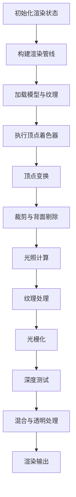

                 

### 文章标题：2024字节跳动校招：游戏开发工程师面试题解析

#### 关键词：游戏开发、面试题、字节跳动、校招、技术解析

> 摘要：本文针对2024年字节跳动校招游戏开发工程师的面试题进行了详细解析。通过分析面试题的类型和难度，本文旨在为准备参加校招的应届毕业生提供有针对性的复习方向和建议，帮助他们在面试中脱颖而出。文章分为两部分，第一部分是基础知识与核心概念，包括游戏开发基础、游戏引擎基础、图形渲染基础和网络编程基础；第二部分是核心技术实现，包括图形渲染技术、物理引擎与碰撞检测、游戏网络编程和游戏人工智能。最后，通过实际案例分析和项目实战，帮助读者更好地理解和应用所学知识。

### 目录大纲

1. **游戏开发基础**
    1.1 **游戏开发概述**
        1.1.1 **游戏产业概述**
        1.1.2 **游戏开发流程**
        1.1.3 **游戏开发的关键角色**
    1.2 **游戏引擎基础**
        1.2.1 **游戏引擎的定义与作用**
        1.2.2 **主流游戏引擎介绍**
        1.2.3 **游戏引擎的开发流程**
    1.3 **图形渲染基础**
        1.3.1 **图形渲染原理**
        1.3.2 **渲染管线架构**
        1.3.3 **常见图形渲染算法**
    1.4 **网络编程基础**
        1.4.1 **网络编程原理**
        1.4.2 **TCP/IP协议栈**
        1.4.3 **常用网络编程库**

2. **游戏架构与设计**
    2.1 **游戏架构设计**
        2.1.1 **游戏架构概述**
        2.1.2 **游戏客户端架构**
        2.1.3 **游戏服务器架构**
    2.2 **游戏设计原则**
        2.2.1 **游戏设计基础**
        2.2.2 **游戏玩法设计**
        2.2.3 **游戏关卡设计**
    2.3 **游戏美术设计**
        2.3.1 **游戏美术设计概述**
        2.3.2 **2D与3D美术设计**
        2.3.3 **美术资源管理**

3. **核心技术实现**
    3.1 **图形渲染技术**
        3.1.1 **图形渲染原理**
        3.1.2 **渲染管线详解**
        3.1.3 **帧缓冲与光栅化**
        3.1.4 **着色器编程**
        3.1.5 **3D模型处理**
    3.2 **物理引擎与碰撞检测**
        3.2.1 **物理引擎基础**
        3.2.2 **碰撞检测算法**
        3.2.3 **实时模拟与动画**
    3.3 **游戏网络编程**
        3.3.1 **网络编程基础**
        3.3.2 **客户端与服务器通信**
        3.3.3 **网络优化与稳定性**
    3.4 **游戏人工智能**
        3.4.1 **游戏AI基础**
        3.4.2 **行为树与决策树**
        3.4.3 **强化学习与深度学习**

4. **项目实战与案例分析**
    4.1 **游戏开发项目实战**
    4.2 **游戏案例分析**
    4.3 **项目经验总结**

5. **附录**
    5.1 **游戏开发资源与工具**
    5.2 **常见面试题与解答**

### 第一部分：基础知识与核心概念

#### 1.1 游戏开发基础

##### 1.1.1 游戏产业概述

游戏产业作为数字经济的重要组成部分，近年来在全球范围内持续增长。根据市场研究公司的数据，全球游戏市场的总收入已超过千亿美元，且这个数字还在不断攀升。游戏产业的增长主要得益于以下几个方面：

1. **技术进步**：随着硬件技术的发展，游戏画质和性能不断提升，吸引了更多玩家。
2. **移动设备的普及**：智能手机和平板电脑的普及，使得游戏成为人们日常生活的一部分。
3. **互联网的普及**：互联网的普及使得多人在线游戏成为可能，增加了游戏的互动性和趣味性。
4. **虚拟现实（VR）和增强现实（AR）**：VR和AR技术的发展，为游戏产业带来了新的增长点。

##### 1.1.2 游戏开发流程

游戏开发流程通常包括以下几个阶段：

1. **需求分析**：明确游戏的类型、目标用户、功能需求等。
2. **设计阶段**：进行游戏设计，包括游戏故事、角色、关卡设计等。
3. **开发阶段**：根据设计文档进行游戏开发，包括客户端和服务器开发。
4. **测试阶段**：进行游戏测试，修复Bug，优化性能。
5. **发布阶段**：游戏上线发布，进行市场推广。
6. **维护阶段**：对游戏进行更新和维护，修复新发现的Bug，增加新功能。

##### 1.1.3 游戏开发的关键角色

游戏开发涉及多个角色，每个角色都有其独特的职责：

1. **游戏设计师**：负责游戏的整体设计，包括游戏故事、角色、关卡等。
2. **程序员**：负责游戏客户端和服务器端的开发，实现游戏逻辑和功能。
3. **美术设计师**：负责游戏美术资源的设计和制作，包括角色、场景、特效等。
4. **音效设计师**：负责游戏音效的设计和制作。
5. **游戏测试员**：负责游戏的测试，确保游戏质量。

#### 1.2 游戏引擎基础

##### 1.2.1 游戏引擎的定义与作用

游戏引擎是一种用于游戏开发的软件工具，它提供了游戏开发所需的核心功能，如图形渲染、物理引擎、音频处理等。游戏引擎的作用在于简化游戏开发流程，提高开发效率，降低开发难度。

常见的游戏引擎包括：

1. **Unreal Engine**：由Epic Games开发，广泛应用于大型游戏开发，如《堡垒之夜》和《赛博朋克2077》。
2. **Unity**：支持多种平台开发，包括PC、移动设备和VR设备，广泛应用于独立游戏开发。
3. **Cocos2d-x**：开源游戏引擎，支持2D游戏开发，适用于轻度游戏开发。
4. **LayaAir**：支持2D和3D游戏开发，适用于HTML5游戏开发。

##### 1.2.2 主流游戏引擎介绍

1. **Unreal Engine**

   Unreal Engine 是一款高性能的游戏引擎，支持实时渲染、物理引擎、AI系统等。它提供了丰富的工具和资源，如蓝图系统、光照系统、材质系统等，使得游戏开发更加高效。

2. **Unity**

   Unity 是一款跨平台游戏引擎，支持多种编程语言，如C#和JavaScript。它提供了丰富的插件和资源，使得游戏开发更加便捷。Unity 广泛应用于独立游戏开发和大型游戏开发。

3. **Cocos2d-x**

   Cocos2d-x 是一款开源游戏引擎，支持2D游戏开发。它提供了简单的API和强大的渲染引擎，使得游戏开发变得更加高效。

4. **LayaAir**

   LayaAir 是一款支持2D和3D游戏开发的游戏引擎，适用于HTML5游戏开发。它提供了丰富的API和资源，使得游戏开发更加便捷。

##### 1.2.3 游戏引擎的开发流程

游戏引擎的开发通常包括以下几个步骤：

1. **需求分析**：明确游戏引擎的功能需求，如图形渲染、物理引擎、音频处理等。
2. **设计阶段**：进行游戏引擎的设计，包括模块划分、数据结构设计等。
3. **开发阶段**：根据设计文档进行游戏引擎的开发，包括客户端和服务器端开发。
4. **测试阶段**：进行游戏引擎的测试，确保其功能和性能符合预期。
5. **发布阶段**：游戏引擎上线发布，进行市场推广。

#### 1.3 图形渲染基础

##### 1.3.1 图形渲染原理

图形渲染是游戏开发中至关重要的一环，它决定了游戏画面的质量和流畅度。图形渲染的基本原理如下：

1. **三维空间建模**：游戏中的角色、场景和物体都是通过三维空间建模来实现的。
2. **顶点处理**：顶点处理是将三维空间中的物体转换为二维平面上的图像。这个过程包括顶点变换、裁剪等。
3. **光照处理**：光照处理决定了游戏中的物体和场景的明暗效果，通过计算光照强度和方向来实现。
4. **纹理处理**：纹理处理是将图像纹理贴图应用到物体表面，使得游戏画面更加真实。
5. **渲染输出**：将处理后的图像数据输出到屏幕上，显示给玩家。

##### 1.3.2 渲染管线架构

渲染管线（Rendering Pipeline）是游戏引擎中负责图形渲染的核心模块。它通常包括以下几个阶段：

1. **顶点处理（Vertex Processing）**：对顶点进行变换、裁剪等处理。
2. **几何处理（Geometry Processing）**：对几何体进行处理，如剔除、背面剔除等。
3. **光照处理（Lighting）**：对物体进行光照计算，确定物体的明暗效果。
4. **纹理处理（Texture Mapping）**：将纹理贴图应用到物体表面。
5. **渲染输出（Rendering Output）**：将渲染结果输出到屏幕上。

##### 1.3.3 常见图形渲染算法

图形渲染涉及到多种算法，以下是一些常见的图形渲染算法：

1. **光线追踪（Ray Tracing）**：通过模拟光线传播过程来实现高质量渲染。
2. **光栅化（Rasterization）**：将三维空间中的物体转换为二维平面上的图像。
3. **阴影计算（Shadow Calculation）**：计算物体之间的阴影效果。
4. **反射和折射（Reflection and Refraction）**：模拟光线在物体表面的反射和折射效果。
5. **全局光照（Global Illumination）**：模拟光线在场景中的传播和反射，实现更真实的渲染效果。

#### 1.4 网络编程基础

##### 1.4.1 网络编程原理

网络编程是游戏开发中的重要环节，它负责实现客户端和服务器之间的通信。网络编程的基本原理如下：

1. **TCP/IP协议**：TCP/IP协议是互联网通信的基础，它定义了数据传输的规则和协议。
2. **客户端-服务器模型**：客户端-服务器模型是网络编程的基本架构，客户端发送请求，服务器响应请求。
3. **数据传输**：网络编程涉及数据的传输，包括数据的编码、传输和解析。
4. **并发处理**：网络编程需要处理多个客户端的并发请求，确保系统的稳定性和性能。

##### 1.4.2 TCP/IP协议栈

TCP/IP协议栈是网络编程的核心，它包括以下几个层次：

1. **网络接口层**：负责数据包的发送和接收。
2. **互联网层**：负责数据包的路由和转发，包括IP协议、ICMP协议等。
3. **传输层**：负责数据的传输，包括TCP协议和UDP协议。
4. **应用层**：负责具体的网络应用，如HTTP、FTP等。

##### 1.4.3 常用网络编程库

常见的网络编程库包括：

1. **Socket**：Socket是网络编程的基础，它提供了客户端和服务器之间的通信接口。
2. **Libevent**：Libevent是一个高性能的事件处理库，适用于高并发网络编程。
3. **Boost.Asio**：Boost.Asio是一个跨平台的网络编程库，提供了丰富的API和功能。
4. **Epoll**：Epoll是一种高效的事件通知机制，适用于高并发网络编程。

#### 1.5 游戏架构设计

##### 1.5.1 游戏架构概述

游戏架构设计是游戏开发的重要环节，它决定了游戏的可扩展性、可维护性和性能。游戏架构通常包括以下几个层次：

1. **应用层**：负责游戏的具体逻辑和功能实现。
2. **服务层**：负责游戏服务器的逻辑处理，如玩家管理、游戏逻辑等。
3. **数据层**：负责游戏数据的存储和管理，如数据库、缓存等。
4. **网络层**：负责游戏客户端和服务器之间的通信。
5. **硬件层**：负责游戏硬件资源的管理，如GPU、CPU等。

##### 1.5.2 游戏客户端架构

游戏客户端架构是游戏架构的重要组成部分，它包括以下几个层次：

1. **渲染层**：负责图形渲染，包括3D模型渲染、2D图像渲染等。
2. **逻辑层**：负责游戏逻辑处理，如角色控制、碰撞检测等。
3. **网络层**：负责客户端和服务器之间的通信。
4. **资源层**：负责游戏资源的加载和管理，如纹理、音频等。
5. **UI层**：负责用户界面的渲染和管理。

##### 1.5.3 游戏服务器架构

游戏服务器架构是游戏架构的另一个重要组成部分，它包括以下几个层次：

1. **逻辑层**：负责游戏逻辑处理，如玩家行为、游戏状态等。
2. **网络层**：负责服务器和客户端之间的通信。
3. **数据层**：负责游戏数据的存储和管理，如数据库、缓存等。
4. **消息队列层**：负责处理游戏消息的异步处理和分发。
5. **缓存层**：负责游戏数据的缓存，提高系统性能。

#### 1.6 游戏设计原则

##### 1.6.1 游戏设计基础

游戏设计是游戏开发的核心环节，它决定了游戏的质量和用户体验。游戏设计的基础包括以下几个方面：

1. **游戏类型**：确定游戏的基本类型，如角色扮演游戏（RPG）、动作游戏（Action）、策略游戏（Strategy）等。
2. **游戏目标**：明确游戏的目标和玩法，如收集资源、击败敌人、完成关卡等。
3. **游戏故事**：设计游戏的故事情节和角色背景，增加游戏的吸引力。
4. **用户交互**：设计游戏的用户交互界面和操作方式，提高玩家的游戏体验。

##### 1.6.2 游戏玩法设计

游戏玩法设计是游戏设计的重要部分，它决定了游戏的趣味性和挑战性。游戏玩法设计包括以下几个方面：

1. **角色控制**：设计角色的移动、攻击、防御等控制方式。
2. **战斗系统**：设计角色的战斗技能、属性、装备等。
3. **关卡设计**：设计游戏关卡的结构、难度、奖励等。
4. **游戏任务**：设计游戏任务的内容、难度、奖励等。

##### 1.6.3 游戏关卡设计

游戏关卡设计是游戏设计的关键环节，它决定了游戏的可玩性和挑战性。游戏关卡设计包括以下几个方面：

1. **关卡类型**：设计不同类型的关卡，如单人关卡、多人关卡、挑战关卡等。
2. **关卡难度**：设计不同难度的关卡，确保游戏有足够的挑战性。
3. **关卡目标**：设计每个关卡的明确目标，如击败敌人、收集道具等。
4. **关卡布局**：设计关卡的布局和路径，确保关卡有足够的变化和趣味性。

#### 1.7 游戏美术设计

##### 1.7.1 游戏美术设计概述

游戏美术设计是游戏开发的重要组成部分，它决定了游戏的艺术风格和视觉效果。游戏美术设计包括以下几个方面：

1. **角色设计**：设计游戏中的角色，包括外观、动作、表情等。
2. **场景设计**：设计游戏中的场景，包括地图、建筑、环境等。
3. **特效设计**：设计游戏中的特效，如爆炸、火花、光芒等。
4. **UI设计**：设计游戏的用户界面，包括菜单、按钮、图标等。

##### 1.7.2 2D与3D美术设计

2D与3D美术设计是游戏美术设计的两个主要方向：

1. **2D美术设计**：2D美术设计主要是通过二维图像来表现游戏场景和角色。它通常使用软件如Adobe Photoshop、Illustrator等来创建。
2. **3D美术设计**：3D美术设计主要是通过三维建模和渲染来表现游戏场景和角色。它通常使用软件如Autodesk Maya、Blender等来创建。

##### 1.7.3 美术资源管理

美术资源管理是游戏开发中不可或缺的一环，它包括以下几个方面：

1. **资源分类**：根据资源的类型和用途对资源进行分类，如角色资源、场景资源、特效资源等。
2. **资源存储**：将资源存储在合适的存储设备上，如硬盘、云存储等。
3. **资源加载**：在游戏运行过程中，根据需要加载相应的资源。
4. **资源优化**：对资源进行优化，以减少游戏的加载时间和运行性能。

### 第二部分：核心技术实现

#### 2.1 图形渲染技术

##### 2.1.1 图形渲染原理

图形渲染是游戏开发中的核心环节，它决定了游戏画面的质量和流畅度。图形渲染的基本原理如下：

1. **三维空间建模**：游戏中的角色、场景和物体都是通过三维空间建模来实现的。建模通常使用软件如Autodesk Maya、Blender等。
2. **顶点处理**：顶点处理是将三维空间中的物体转换为二维平面上的图像。这个过程包括顶点变换、裁剪等。
3. **光照处理**：光照处理决定了游戏中的物体和场景的明暗效果。光照处理包括计算光源的位置、强度和方向，以及物体表面的反射和折射效果。
4. **纹理处理**：纹理处理是将纹理贴图应用到物体表面，使得游戏画面更加真实。纹理处理包括纹理的加载、采样和渲染。
5. **渲染输出**：将处理后的图像数据输出到屏幕上，显示给玩家。

##### 2.1.2 渲染管线详解

渲染管线（Rendering Pipeline）是游戏引擎中负责图形渲染的核心模块。它通常包括以下几个阶段：

1. **顶点处理（Vertex Processing）**：对顶点进行变换、裁剪等处理。顶点处理通常包括顶点着色器（Vertex Shader）和顶点缓冲区（Vertex Buffer）。
2. **几何处理（Geometry Processing）**：对几何体进行处理，如剔除、背面剔除等。几何处理通常包括几何着色器（Geometry Shader）和几何缓冲区（Geometry Buffer）。
3. **光照处理（Lighting）**：对物体进行光照计算，确定物体的明暗效果。光照处理通常包括光照计算着色器（Lighting Shader）和光照缓冲区（Light Buffer）。
4. **纹理处理（Texture Mapping）**：将纹理贴图应用到物体表面。纹理处理通常包括纹理采样着色器（Texture Sampling Shader）和纹理缓冲区（Texture Buffer）。
5. **渲染输出（Rendering Output）**：将渲染结果输出到屏幕上。渲染输出通常包括帧缓冲区（Frame Buffer）和显示设备（Display Device）。

##### 2.1.3 帧缓冲与光栅化

1. **帧缓冲（Frame Buffer）**：帧缓冲是存储渲染结果的缓冲区。它通常包含颜色缓冲区（Color Buffer）和深度缓冲区（Depth Buffer）。帧缓冲用于存储每个像素的颜色值和深度值。
2. **光栅化（Rasterization）**：光栅化是将三维空间中的物体转换为二维图像的过程。光栅化包括顶点处理、裁剪、填充、纹理处理等步骤。光栅化通常由图形处理单元（GPU）执行。

##### 2.1.4 着色器编程

着色器（Shader）是图形渲染的核心组件，它负责处理图形渲染中的各种效果。着色器分为顶点着色器（Vertex Shader）、片元着色器（Fragment Shader）和几何着色器（Geometry Shader）等。

1. **顶点着色器（Vertex Shader）**：顶点着色器负责处理顶点数据，如位置、颜色、纹理坐标等。它通常用于顶点处理、光照计算和变换等。
2. **片元着色器（Fragment Shader）**：片元着色器负责处理像素数据，如颜色、纹理、光照等。它通常用于光照计算、纹理采样和渲染输出等。
3. **几何着色器（Geometry Shader）**：几何着色器负责处理几何体数据，如顶点、面、边等。它通常用于几何处理、曲面生成和细节处理等。

##### 2.1.5 3D模型处理

3D模型处理是图形渲染中的重要环节，它包括3D模型的加载、解析、优化和渲染等。

1. **3D模型加载**：3D模型加载是将模型数据从文件中读取到内存中。常见的3D模型格式有OBJ、PLY、FBX等。
2. **3D模型解析**：3D模型解析是将模型数据解析为可用的数据结构，如顶点、面、纹理等。
3. **3D模型优化**：3D模型优化是减少模型数据的大小和复杂度，提高渲染性能。优化方法包括简化模型、减少纹理大小、使用法线贴图等。
4. **3D模型渲染**：3D模型渲染是将模型数据渲染到屏幕上。渲染过程包括顶点处理、光照计算、纹理处理和渲染输出等。

#### 2.2 物理引擎与碰撞检测

##### 2.2.1 物理引擎基础

物理引擎是游戏开发中的重要组件，它负责实现游戏中的物理现象，如碰撞、运动、重力等。物理引擎的基本原理如下：

1. **运动学（Kinematics）**：运动学是研究物体运动的基本原理，包括速度、加速度、位移等。物理引擎通过运动学方程计算物体的运动轨迹。
2. **动力学（Dynamics）**：动力学是研究物体受力后的运动规律，包括力、质量、加速度等。物理引擎通过动力学方程计算物体的受力情况。
3. **碰撞检测（Collision Detection）**：碰撞检测是物理引擎的关键部分，它用于检测物体之间的碰撞。碰撞检测方法包括空间划分、扫描与检测等。
4. **碰撞响应（Collision Response）**：碰撞响应是物理引擎处理碰撞后物体的反应，包括反弹、穿透、黏连等。

##### 2.2.2 碰撞检测算法

碰撞检测是物理引擎中的核心任务，它用于检测物体之间的碰撞。以下是一些常见的碰撞检测算法：

1. **空间划分（Spatial Partitioning）**：空间划分是将游戏场景划分为多个小的区域，以减少碰撞检测的计算量。常见的空间划分算法有AABB（Axis-Aligned Bounding Boxes）和OBB（Oriented Bounding Boxes）等。
2. **扫描与检测（Scanning and Detection）**：扫描与检测是一种简单的碰撞检测算法，它通过逐行或逐列扫描物体之间的空间，检测是否存在碰撞。
3. **距离检测（Distance Detection）**：距离检测是用于检测两个物体之间的距离是否小于某个阈值。常用的距离检测方法有曼哈顿距离、欧几里得距离等。
4. **穿透检测（Penetration Detection）**：穿透检测是用于检测两个物体之间是否存在穿透现象。穿透检测通常结合碰撞响应处理，以修复物体的位置。

##### 2.2.3 实时模拟与动画

实时模拟与动画是物理引擎在游戏开发中的重要应用。实时模拟与动画的基本原理如下：

1. **刚体动力学（Rigidbody Dynamics）**：刚体动力学是用于模拟刚体物体的运动。刚体动力学通过运动学方程和动力学方程计算物体的运动轨迹。
2. **软体动力学（Softbody Dynamics）**：软体动力学是用于模拟软体物体的运动，如布料、水、雾等。软体动力学通常采用有限元方法（Finite Element Method）或粒子系统（Particle System）等。
3. **动画系统（Animation System）**：动画系统是用于创建和播放动画的关键组件。动画系统通过关键帧动画（Keyframe Animation）和曲线动画（Curve Animation）等实现动画效果。
4. **骨骼动画（Skeleton Animation）**：骨骼动画是用于模拟角色运动的关键技术。骨骼动画通过骨骼和骨骼蒙皮（Skinning）实现角色的运动。

#### 2.3 游戏网络编程

##### 2.3.1 网络编程基础

网络编程是游戏开发中的核心任务之一，它负责实现游戏客户端和服务器之间的通信。网络编程的基本原理如下：

1. **TCP/IP协议**：TCP/IP协议是互联网通信的基础，它定义了数据传输的规则和协议。TCP/IP协议包括网络接口层、互联网层、传输层和应用层等。
2. **客户端-服务器模型**：客户端-服务器模型是网络编程的基本架构，客户端发送请求，服务器响应请求。客户端-服务器模型包括客户端（Client）和服务器（Server）两部分。
3. **数据传输**：网络编程涉及数据的传输，包括数据的编码、传输和解析。数据传输通常采用二进制格式或文本格式。
4. **并发处理**：网络编程需要处理多个客户端的并发请求，确保系统的稳定性和性能。并发处理方法包括多线程、事件驱动、异步I/O等。

##### 2.3.2 客户端与服务器通信

客户端与服务器之间的通信是游戏网络编程的核心任务。客户端与服务器通信的基本原理如下：

1. **通信协议**：客户端与服务器之间的通信通常采用TCP协议或UDP协议。TCP协议提供可靠的数据传输，但传输速度较慢；UDP协议提供快速的数据传输，但不可靠。
2. **数据包格式**：客户端与服务器之间的数据包通常采用自定义的数据包格式。数据包格式包括头部和数据体两部分，头部包含数据包的类型、长度等信息，数据体包含具体的游戏数据。
3. **同步与异步**：客户端与服务器之间的通信可以是同步的，也可以是异步的。同步通信要求客户端等待服务器的响应，异步通信允许客户端继续执行其他任务。
4. **状态同步**：游戏网络编程中，客户端和服务器需要保持状态同步，以确保游戏的稳定性和一致性。状态同步方法包括增量同步、全量同步等。

##### 2.3.3 网络优化与稳定性

网络优化与稳定性是游戏网络编程中的重要任务。以下是一些网络优化与稳定性的方法：

1. **网络优化**：
   - **数据压缩**：通过数据压缩减少数据传输的大小，提高传输速度。
   - **多线程传输**：通过多线程传输提高数据传输的并发能力。
   - **缓存**：通过缓存减少服务器的负载，提高系统性能。

2. **稳定性保障**：
   - **心跳机制**：通过心跳机制保持客户端和服务器之间的连接状态。
   - **重连机制**：通过重连机制处理网络连接断开的情况。
   - **抗抖动**：通过抗抖动技术处理网络延迟和丢包的情况。

3. **负载均衡与反向代理**：
   - **负载均衡**：通过负载均衡技术将网络请求分配到多个服务器上，提高系统的处理能力。
   - **反向代理**：通过反向代理技术隐藏服务器的真实IP地址，提供安全的网络通信。

#### 2.4 游戏人工智能

##### 2.4.1 游戏AI基础

游戏人工智能（AI）是游戏开发中的重要组成部分，它用于模拟游戏中的智能行为和决策。游戏AI的基础包括以下几个方面：

1. **AI概述**：游戏AI是模拟智能行为和决策的技术，它在游戏中的应用包括角色行为、关卡设计、游戏平衡等。
2. **AI算法**：游戏AI算法包括决策树、行为树、遗传算法、强化学习等。不同的算法适用于不同的场景和需求。
3. **AI应用场景**：游戏AI的应用场景包括角色行为、游戏逻辑、玩家交互等。通过AI技术，可以提高游戏的趣味性和挑战性。

##### 2.4.2 行为树与决策树

行为树（Behavior Tree）和决策树（Decision Tree）是游戏AI中的常用算法。它们的基本原理如下：

1. **行为树（Behavior Tree）**：
   - **概述**：行为树是一种层次化的决策结构，用于表示角色的行为逻辑。行为树由节点组成，每个节点表示一个行为或决策。
   - **实现原理**：行为树通过组合不同的节点实现复杂的决策逻辑。行为树包括顺序节点、选择节点、条件节点等。
   - **应用场景**：行为树适用于需要复杂决策和实时交互的场景，如角色行为、游戏逻辑等。

2. **决策树（Decision Tree）**：
   - **概述**：决策树是一种基于规则的决策结构，用于表示游戏中的决策过程。决策树由节点和边组成，每个节点表示一个条件或决策。
   - **实现原理**：决策树通过遍历节点和判断条件，选择合适的决策路径。决策树通常采用ID3算法或C4.5算法等。
   - **应用场景**：决策树适用于需要明确规则和条件的场景，如游戏平衡、玩家行为等。

##### 2.4.3 强化学习与深度学习

强化学习（Reinforcement Learning）和深度学习（Deep Learning）是当前游戏AI领域的研究热点。它们的基本原理如下：

1. **强化学习（Reinforcement Learning）**：
   - **概述**：强化学习是一种基于反馈的决策学习算法，通过学习环境中的奖励和惩罚来优化行为策略。
   - **实现原理**：强化学习使用Q-learning、SARSA等算法，通过值函数或策略迭代来优化行为策略。
   - **应用场景**：强化学习适用于需要自主学习和自适应的场景，如角色行为、游戏策略等。

2. **深度学习（Deep Learning）**：
   - **概述**：深度学习是一种基于人工神经网络的机器学习技术，通过多层神经网络的训练来提取特征和表示。
   - **实现原理**：深度学习使用卷积神经网络（CNN）、循环神经网络（RNN）、生成对抗网络（GAN）等模型，通过大量数据训练来优化网络参数。
   - **应用场景**：深度学习适用于需要高效特征提取和模式识别的场景，如角色控制、图像识别等。

#### 2.5 项目实战与案例分析

##### 2.5.1 游戏开发项目实战

游戏开发项目实战是游戏开发者提高实践能力和经验的重要途径。以下是一个简单的游戏开发项目实战：

1. **项目背景与目标**：
   - **背景**：开发一款2D平台跳跃游戏。
   - **目标**：实现游戏角色跳跃、移动、碰撞检测等功能，并完成游戏关卡设计。

2. **开发流程**：
   - **需求分析**：明确游戏类型、功能需求和用户界面。
   - **设计阶段**：设计游戏故事、角色、关卡等。
   - **开发阶段**：使用游戏引擎（如Unity）进行游戏开发。
   - **测试阶段**：进行游戏测试，修复Bug，优化性能。
   - **发布阶段**：游戏上线发布，进行市场推广。

3. **关键技术**：
   - **图形渲染**：使用Unity的渲染管线实现图形渲染。
   - **物理引擎**：使用Unity的物理引擎实现碰撞检测和运动模拟。
   - **网络编程**：使用Socket实现客户端和服务器之间的通信。

4. **代码解读**：
   - **角色控制**：使用C#编写角色控制逻辑，实现角色的移动和跳跃。
   - **碰撞检测**：使用物理引擎实现碰撞检测和响应。
   - **网络通信**：使用Socket实现客户端和服务器之间的数据传输。

##### 2.5.2 游戏案例分析

游戏案例分析是游戏开发者学习成功经验和技巧的重要方式。以下是一个游戏案例分析：

1. **游戏市场分析**：
   - **市场背景**：近年来，2D平台跳跃游戏在市场上取得了显著的成功。
   - **成功因素**：优秀的游戏画面、丰富的游戏玩法、易于上手的操作体验等。

2. **游戏成功因素分析**：
   - **游戏画面**：采用高质量的2D图像和动画，营造出逼真的游戏世界。
   - **游戏玩法**：设计丰富多样的关卡和挑战，提供多样化的游戏体验。
   - **用户交互**：设计直观易用的用户界面和操作方式，提高玩家的游戏体验。
   - **市场推广**：通过社交媒体、游戏论坛等渠道进行有效的市场推广。

3. **游戏开发经验总结**：
   - **需求分析**：明确游戏目标和用户需求，设计符合用户期望的游戏。
   - **团队协作**：建立高效的团队协作机制，确保项目按时按质完成。
   - **技术选择**：选择合适的技术和工具，提高开发效率和性能。
   - **市场推广**：制定有效的市场推广策略，提高游戏的知名度和用户参与度。

### 总结与拓展

本文对2024年字节跳动校招游戏开发工程师的面试题进行了详细解析。通过分析面试题的类型和难度，本文旨在为准备参加校招的应届毕业生提供有针对性的复习方向和建议。文章分为两部分，第一部分介绍了游戏开发的基础知识和核心概念，包括游戏开发基础、游戏引擎基础、图形渲染基础和网络编程基础等。第二部分则详细解析了图形渲染技术、物理引擎与碰撞检测、游戏网络编程和游戏人工智能等核心技术实现。

通过对本文的学习，读者可以全面了解游戏开发的核心技术和方法，为参加校招面试做好充分准备。同时，本文也提供了一些实际案例分析和项目实战经验，帮助读者更好地理解和应用所学知识。

未来的拓展方向可以包括以下几个方面：

1. **深入学习**：针对每个核心技术，可以进一步深入研究其原理、算法和应用，例如图形渲染中的光线追踪、物理引擎中的刚体动力学等。
2. **实践应用**：通过实际项目开发，将所学知识应用于实际场景，积累项目经验。
3. **技术交流**：参与技术社区和论坛，与其他开发者交流经验，学习最新的技术动态。
4. **扩展技能**：学习其他相关领域的知识，如计算机图形学、人工智能等，提高自己的综合素质。

总之，游戏开发是一个充满挑战和创新的领域，需要不断学习和实践。希望本文能够为读者在游戏开发的道路上提供一些指导和帮助。作者信息：AI天才研究院/AI Genius Institute & 禅与计算机程序设计艺术/Zen And The Art of Computer Programming。

### 附录：参考资料与拓展阅读

#### 附录A：游戏开发资源与工具

1. **游戏开发平台**：
   - Unity（https://unity.com/）
   - Unreal Engine（https://www.unrealengine.com/）
   - Cocos2d-x（https://cocos2d-x.org/）

2. **游戏引擎资源**：
   - Unity Asset Store（https://assetstore.unity.com/）
   - Unreal Engine Marketplace（https://marketplace.unrealengine.com/）
   - Cocos2d-x Plugins（https://plugins.cocos2d-x.org/）

3. **游戏开发社区与论坛**：
   - Stack Overflow（https://stackoverflow.com/）
   - Reddit（https://www.reddit.com/r/gamedev/）
   - GameDev.net（https://www.gamedev.net/）

#### 附录B：常见面试题与解答

1. **基础知识面试题**：
   - **什么是游戏引擎？它有哪些作用？**
   - **游戏开发的一般流程是什么？**
   - **什么是渲染管线？它包括哪些阶段？**
   - **什么是网络编程？它有哪些基本原理？**

2. **技术实现面试题**：
   - **请简述图形渲染的原理。**
   - **如何实现3D模型加载与解析？**
   - **请简要介绍物理引擎的工作原理。**
   - **如何优化网络通信，提高游戏稳定性？**

3. **项目经验面试题**：
   - **请描述你参与的一个游戏开发项目，包括项目背景、开发流程、实现的关键技术和遇到的挑战。**
   - **你在项目中遇到过哪些技术难题？如何解决的？**
   - **你在项目中如何与团队成员协作？**
   - **你对游戏开发有哪些未来规划和目标？**

通过附录中的参考资料和常见面试题，读者可以进一步巩固所学知识，为实际应用和面试做好准备。

### 图形渲染技术 Mermaid 流程图

在这个流程图中，`A` 代表初始化渲染状态，`B` 代表构建渲染管线，`C` 代表加载模型与纹理，`D` 代表执行顶点着色器，`E` 代表顶点变换，`F` 代表裁剪与背面剔除，`G` 代表光照计算，`H` 代表纹理处理，`I` 代表光栅化，`J` 代表深度测试，`K` 代表混合与透明处理，`L` 代表渲染输出。这些步骤共同构成了图形渲染的基本流程。通过这个流程图，读者可以直观地理解图形渲染的各个阶段和它们的相互关系。

