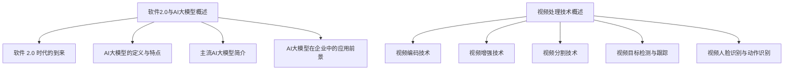

                 

## 文章标题：2024字节跳动视频处理工程师面试真题汇总（附答案）

### 文章关键词
- 字节跳动
- 视频处理工程师
- 面试题解析
- 视频编码
- 视频增强
- 视频分割
- 目标检测
- 人脸识别

### 摘要
本文旨在为2024年即将参加字节跳动视频处理工程师面试的考生提供全面的真题解析。我们将从视频处理技术基础到实际面试真题逐一剖析，帮助读者掌握关键知识点，提升面试技巧。文章涵盖视频编码、视频增强、视频分割、目标检测、人脸识别等技术领域，通过实例分析和伪代码讲解，为考生提供实战经验和学习资源。

## 《2024字节跳动视频处理工程师面试真题汇总（附答案）》目录大纲

### 第一部分：视频处理技术基础

#### 第1章：视频处理技术概述
- 1.1 视频处理技术的发展历程
- 1.2 视频处理技术的核心概念
- 1.3 视频处理技术的应用领域

#### 第2章：视频编码技术
- 2.1 视频编码基本原理
- 2.2 H.264/AVC视频编码标准
- 2.3 HEVC/H.265视频编码标准
- 2.4 其他视频编码标准

#### 第3章：视频增强技术
- 3.1 视频增强概述
- 3.2 视频噪声抑制算法
- 3.3 视频超分辨率技术
- 3.4 视频色彩增强技术

#### 第4章：视频分割技术
- 4.1 视频分割概述
- 4.2 基于运动估计的视频分割
- 4.3 基于图像内容分割
- 4.4 基于深度学习的视频分割

#### 第5章：视频目标检测与跟踪
- 5.1 视频目标检测概述
- 5.2 基于传统算法的目标检测
- 5.3 基于深度学习的目标检测
- 5.4 视频目标跟踪算法

#### 第6章：视频人脸识别与动作识别
- 6.1 视频人脸识别技术
- 6.2 视频人脸跟踪技术
- 6.3 视频动作识别技术

### 第二部分：字节跳动视频处理工程师面试真题解析

#### 第7章：视频处理算法面试题解析
- 7.1 算法面试题解析
  - 7.1.1 视频编码算法
  - 7.1.2 视频增强算法
  - 7.1.3 视频分割算法
  - 7.1.4 视频目标检测与跟踪算法
  - 7.1.5 视频人脸识别与动作识别算法

#### 第8章：实际项目案例分析
- 8.1 视频处理项目背景
- 8.2 项目需求分析
- 8.3 项目解决方案
- 8.4 项目实现过程
- 8.5 项目效果评估

#### 第9章：面试技巧与经验分享
- 9.1 面试前的准备
- 9.2 面试中如何回答问题
- 9.3 面试后的跟进
- 9.4 面试中的常见问题与应对策略

### 第三部分：附录

#### 附录A：视频处理相关技术资料
- A.1 视频处理技术相关论文
- A.2 视频处理技术相关书籍
- A.3 视频处理技术在线课程与教程

#### 附录B：视频处理开源框架与工具
- B.1 常见视频处理开源框架
- B.2 常见视频处理工具
- B.3 开源项目推荐

#### 附录C：面试真题及答案汇总
- C.1 面试题汇总
- C.2 答案解析

#### 附录D：Mermaid流程图

### 文章正文

#### 第1章：视频处理技术概述

1.1 视频处理技术的发展历程

视频处理技术是随着数字信号处理、计算机视觉和人工智能等领域的快速发展而不断进步的。从最初的模拟信号处理，到数字视频编码，再到现代的智能视频处理，视频处理技术经历了多个发展阶段。

- **模拟信号处理时代**：早期的视频处理主要依赖于模拟信号，视频质量受到设备和材料限制。
- **数字视频编码时代**：随着计算机技术的发展，数字视频编码成为主流，H.261、MPEG-1等标准相继推出。
- **智能视频处理时代**：计算机视觉和人工智能技术的引入，使得视频处理从简单的编码与解码，发展到复杂的智能分析，如目标检测、人脸识别等。

1.2 视频处理技术的核心概念

- **视频编码**：将视频信号转换成数字信号，并进行压缩以减少存储空间和传输带宽。
- **视频增强**：对低质量视频进行提升，如噪声抑制、超分辨率等。
- **视频分割**：将连续的视频流分割成有意义的部分，如场景、对象等。
- **目标检测与跟踪**：识别视频中的目标并跟踪其运动轨迹。
- **人脸识别与动作识别**：识别视频中的人脸和动作。

1.3 视频处理技术的应用领域

- **安防监控**：通过视频监控实现实时监控、异常行为检测等。
- **视频流媒体**：视频的编码与传输，保证高质量的视频观看体验。
- **自动驾驶**：通过视频处理技术实现车辆环境感知和障碍物检测。
- **人机交互**：通过视频处理技术实现自然的人机交互，如手势识别、表情识别等。

### 第2章：视频编码技术

2.1 视频编码基本原理

视频编码是将连续的视频信号转换成数字信号的过程，主要目的是减少数据量，提高传输和存储效率。视频编码的基本原理包括：

- **采样**：将模拟信号转换成数字信号，通过采样率来控制图像的质量和带宽。
- **量化**：将采样得到的数字信号进行量化，以减少数据量。
- **压缩**：对量化后的数字信号进行压缩，以进一步减少数据量。常见的压缩方法包括空间压缩和时间压缩。

2.2 H.264/AVC视频编码标准

H.264/AVC（Advanced Video Coding）是ITU-T和ISO/IEC共同推出的视频编码标准，也是目前应用最广泛的视频编码标准之一。

- **基本概念**：H.264采用了基于块的编码方式，将图像分成16x16的宏块进行编码。
- **编码流程**：包括图像的分割、变换、量化、熵编码等步骤。
- **特点**：相比前一代MPEG-2和MPEG-4标准，H.264在相同的图像质量下可以提供更高的压缩效率。

2.3 HEVC/H.265视频编码标准

HEVC（High Efficiency Video Coding）是ITU-T和ISO/IEC在2013年推出的新一代视频编码标准，旨在提供更高的压缩效率。

- **基本概念**：HEVC采用了比H.264更复杂的变换和编码技术，如4x4块的变换和更高效的熵编码。
- **编码流程**：包括图像的分割、变换、量化、熵编码等步骤。
- **特点**：相比H.264，HEVC在相同的图像质量下可以提供更高的压缩效率，适用于更高分辨率和更复杂场景的视频编码。

2.4 其他视频编码标准

除了H.264和HEVC，还有其他一些视频编码标准，如：

- **MPEG-2**：最早推出的视频编码标准，主要应用于DVD等应用。
- **MPEG-4**：针对低比特率视频编码而设计的标准，广泛应用于流媒体和移动视频。
- **VP8/VP9**：Google推出的免费视频编码标准，主要用于Web视频流。

### 第3章：视频增强技术

3.1 视频增强概述

视频增强是对低质量视频进行处理，以提升其视觉效果。视频增强的主要目标包括：

- **噪声抑制**：减少视频中的噪声，提高图像质量。
- **超分辨率**：提高视频的分辨率，使图像更加清晰。
- **色彩增强**：改善视频的色彩，使其更加鲜艳。

3.2 视频噪声抑制算法

视频噪声抑制算法的主要目的是去除视频中的噪声，提高图像质量。常见的噪声抑制算法包括：

- **空域滤波**：通过对图像进行滤波来去除噪声，如均值滤波、中值滤波等。
- **频域滤波**：通过对图像的频域进行滤波来去除噪声，如低通滤波、带阻滤波等。
- **小波变换**：利用小波变换将图像分解为不同尺度和方向的分量，通过阈值处理来去除噪声。

3.3 视频超分辨率技术

视频超分辨率技术是通过提高视频的分辨率来改善图像质量。常见的超分辨率技术包括：

- **插值方法**：通过插值算法将图像插值到更高的分辨率，如双线性插值、双三次插值等。
- **基于学习的超分辨率**：利用深度学习模型，如卷积神经网络（CNN），对图像进行超分辨率处理。

3.4 视频色彩增强技术

视频色彩增强技术是通过对视频的色彩进行调整来改善视觉效果。常见的色彩增强技术包括：

- **色彩空间转换**：将图像从一种色彩空间转换到另一种色彩空间，如RGB到YUV转换。
- **色彩平衡**：调整图像中的颜色平衡，使其更加自然。
- **色彩增强**：通过增强图像中的色彩信息来提高图像的视觉质量。

### 第4章：视频分割技术

4.1 视频分割概述

视频分割是将连续的视频流分割成有意义的部分，如场景、对象等。视频分割对于视频分析、内容检索和视频编辑等应用具有重要意义。

4.2 基于运动估计的视频分割

基于运动估计的视频分割是利用视频中的运动信息来分割视频。常见的运动估计算法包括：

- **块匹配**：通过比较相邻帧之间的像素差异来估计运动。
- **光流法**：利用视频序列中的像素运动来估计运动。
- **基于深度信息的运动估计**：利用深度信息来提高运动估计的准确性。

4.3 基于图像内容分割

基于图像内容分割是利用图像的内容特征来分割视频。常见的图像内容分割算法包括：

- **边缘检测**：通过检测图像中的边缘来分割视频。
- **区域生长**：通过将相似区域合并来分割视频。
- **基于分割的跟踪**：通过分割和跟踪来识别视频中的对象。

4.4 基于深度学习的视频分割

基于深度学习的视频分割是利用深度学习模型来分割视频。常见的深度学习模型包括：

- **卷积神经网络（CNN）**：通过训练CNN模型来分割视频。
- **基于注意力机制的分割模型**：通过引入注意力机制来提高分割的准确性。

### 第5章：视频目标检测与跟踪

5.1 视频目标检测概述

视频目标检测是识别视频中的目标对象，并定位其在视频中的位置。视频目标检测广泛应用于安防监控、自动驾驶和视频内容审核等领域。

5.2 基于传统算法的目标检测

基于传统算法的目标检测是利用传统的计算机视觉算法来实现目标检测。常见的传统算法包括：

- **特征匹配**：通过比较目标特征和图像特征来检测目标。
- **基于模板匹配**：通过将模板与图像进行匹配来检测目标。
- **基于随机样本一致性（RANSAC）**：通过随机抽样和模型拟合来检测目标。

5.3 基于深度学习的目标检测

基于深度学习的目标检测是利用深度学习模型来实现目标检测。常见的深度学习模型包括：

- **R-CNN**：通过提取区域提议和特征来实现目标检测。
- **Fast R-CNN**：通过改进区域提议和特征提取来实现快速目标检测。
- **Faster R-CNN**：通过引入区域提议网络（RPN）来实现更快的目标检测。

5.4 视频目标跟踪算法

视频目标跟踪是识别并跟踪视频中的目标对象。常见的视频目标跟踪算法包括：

- **基于光流的跟踪**：通过计算视频序列中的光流来跟踪目标。
- **基于外观模型的跟踪**：通过训练外观模型来跟踪目标。
- **基于深度学习的跟踪**：利用深度学习模型来跟踪目标。

### 第6章：视频人脸识别与动作识别

6.1 视频人脸识别技术

视频人脸识别是识别视频中的面部特征，并将其与数据库中的人脸进行匹配。视频人脸识别技术广泛应用于安防监控、人脸支付和社交网络等领域。

6.2 视频人脸跟踪技术

视频人脸跟踪是识别并跟踪视频中的面部特征。视频人脸跟踪技术通过检测和跟踪面部特征来实现，常见的技术包括：

- **基于特征点的跟踪**：通过检测面部特征点来跟踪面部。
- **基于深度学习的跟踪**：利用深度学习模型来跟踪面部。

6.3 视频动作识别技术

视频动作识别是识别视频中的动作行为。视频动作识别技术广泛应用于人机交互、运动分析和体育训练等领域。常见的视频动作识别技术包括：

- **基于动作模型的方法**：通过训练动作模型来识别动作。
- **基于深度学习的方法**：利用深度学习模型来识别动作。

### 第二部分：字节跳动视频处理工程师面试真题解析

#### 第7章：视频处理算法面试题解析

7.1 视频编码算法

**面试题**：请简述H.264/AVC视频编码的基本原理和流程。

**答案**：H.264/AVC视频编码的基本原理是将视频信号转换为数字信号，并进行压缩以减少数据量。其流程包括以下步骤：

1. 采样：将模拟信号转换成数字信号，通过采样率来控制图像的质量和带宽。
2. 量化：将采样得到的数字信号进行量化，以减少数据量。
3. 分割：将图像分成16x16的宏块进行编码。
4. 变换：对宏块进行变换，通常采用离散余弦变换（DCT）。
5. 量化：对变换后的系数进行量化，以进一步压缩数据。
6. 熵编码：使用熵编码技术，如霍夫曼编码或算术编码，对量化后的系数进行编码。

7.2 视频增强算法

**面试题**：请列举几种常见的视频噪声抑制算法，并简要说明其原理。

**答案**：常见的视频噪声抑制算法包括：

1. 均值滤波：通过对图像进行平均来减少噪声。
2. 中值滤波：通过选择图像中每个像素的邻近像素的中值来减少噪声。
3. 高斯滤波：通过对图像进行高斯滤波来减少噪声，同时保持图像的边缘。
4. 小波变换：利用小波变换将图像分解为不同尺度和方向的分量，通过阈值处理来去除噪声。

7.3 视频分割算法

**面试题**：请简述基于运动估计的视频分割的基本原理和流程。

**答案**：基于运动估计的视频分割的基本原理是利用视频序列中的运动信息来分割视频。其流程包括以下步骤：

1. 运动估计：通过计算相邻帧之间的运动向量来估计视频中的运动。
2. 分割区域生成：根据运动向量将视频分割成多个区域。
3. 分割区域合并：根据相似性将分割区域进行合并，以获得更准确的结果。

7.4 视频目标检测与跟踪算法

**面试题**：请简述基于深度学习的目标检测算法的基本原理和流程。

**答案**：基于深度学习的目标检测算法的基本原理是利用深度学习模型来识别和定位视频中的目标。其流程包括以下步骤：

1. 特征提取：通过卷积神经网络（CNN）提取视频的特征表示。
2. 区域提议：通过候选区域生成算法生成可能的候选区域。
3. 特征分类：将候选区域与深度学习模型进行匹配，分类为目标或背景。
4. 目标定位：根据分类结果，定位目标的准确位置。

7.5 视频人脸识别与动作识别算法

**面试题**：请简述视频人脸识别的基本原理和流程。

**答案**：视频人脸识别的基本原理是利用深度学习模型识别和匹配视频中的面部特征。其流程包括以下步骤：

1. 特征提取：通过卷积神经网络（CNN）提取视频的特征表示。
2. 人脸检测：使用人脸检测算法检测视频中的面部区域。
3. 特征匹配：将提取的特征与数据库中的人脸特征进行匹配。
4. 识别结果输出：根据匹配结果输出人脸识别结果。

### 第8章：实际项目案例分析

8.1 视频处理项目背景

某视频平台需要对其用户上传的视频进行自动分类和标签添加，以提高视频检索效率和用户体验。该平台每天接收大量视频，需要进行高效的视频处理和分类。

8.2 项目需求分析

1. 视频预处理：对上传的视频进行预处理，包括视频格式转换、分辨率调整等。
2. 视频编码：对预处理后的视频进行编码，以减少数据量和提高传输效率。
3. 视频分割：将视频分割成有意义的部分，如场景、对象等。
4. 目标检测与跟踪：识别视频中的目标对象，并跟踪其运动轨迹。
5. 人脸识别：识别视频中的面部特征，进行人脸识别。
6. 视频分类：根据视频内容进行分类，添加标签。

8.3 项目解决方案

1. 视频预处理：使用FFmpeg进行视频格式转换和分辨率调整。
2. 视频编码：使用H.264编码标准进行视频编码。
3. 视频分割：使用基于运动估计的分割算法进行视频分割。
4. 目标检测与跟踪：使用基于深度学习的目标检测算法进行目标检测和跟踪。
5. 人脸识别：使用基于卷积神经网络的人脸识别算法进行人脸识别。
6. 视频分类：使用机器学习算法对视频进行分类，并添加标签。

8.4 项目实现过程

1. 视频预处理：
   - 使用FFmpeg进行视频格式转换和分辨率调整。
   - 编写脚本，实现视频处理流程的自动化。

2. 视频编码：
   - 使用FFmpeg进行视频编码，配置适当的编码参数。

3. 视频分割：
   - 使用基于运动估计的分割算法进行视频分割，提取有意义的部分。

4. 目标检测与跟踪：
   - 使用基于深度学习的目标检测算法进行目标检测，并跟踪目标对象。
   - 使用跟踪算法保持目标对象的位置。

5. 人脸识别：
   - 使用卷积神经网络提取人脸特征，进行人脸识别。

6. 视频分类：
   - 使用机器学习算法对视频进行分类，并添加标签。

8.5 项目效果评估

1. 视频预处理效果：
   - 视频格式转换和分辨率调整符合要求，不影响视频质量。

2. 视频编码效果：
   - 视频编码后的数据量显著减少，传输效率提高。

3. 视频分割效果：
   - 视频分割准确，能有效提取有意义的部分。

4. 目标检测与跟踪效果：
   - 目标检测准确，跟踪效果稳定。

5. 人脸识别效果：
   - 人脸识别准确，能有效识别和匹配面部特征。

6. 视频分类效果：
   - 视频分类准确，能有效添加标签。

### 第9章：面试技巧与经验分享

9.1 面试前的准备

1. 技术准备：
   - 熟悉视频处理相关技术，包括视频编码、视频增强、视频分割、目标检测、人脸识别等。
   - 了解常见的视频处理算法和开源框架。

2. 项目准备：
   - 准备实际项目经验，包括项目背景、需求分析、解决方案、实现过程和效果评估。

3. 知识储备：
   - 阅读相关技术论文和书籍，掌握核心概念和原理。

9.2 面试中如何回答问题

1. 理解问题：
   - 充分理解面试官的问题，避免答非所问。

2. 清晰表达：
   - 用简洁明了的语言表达自己的思路和观点。

3. 详细阐述：
   - 对技术问题和项目经验进行详细阐述，展示自己的专业知识和经验。

9.3 面试后的跟进

1. 发送感谢信：
   - 面试结束后，及时发送感谢信，表达对面试官的感谢和对岗位的热情。

2. 跟进进度：
   - 定期询问面试进度，了解面试结果。

9.4 面试中的常见问题与应对策略

1. 技术问题：
   - 提前准备常见的技术问题，如视频编码、视频增强、视频分割等。

2. 项目经验：
   - 提前整理实际项目经验，准备好详细的讲解。

3. 应对策略：
   - 保持自信，诚实回答问题。
   - 用具体实例和项目经验来支撑自己的观点。

### 第三部分：附录

#### 附录A：视频处理相关技术资料

- **视频处理技术相关论文**：
  - 《Real-Time Video Denoising using Non-local Sparse Representation》
  - 《Single Image Super-Resolution using a Deep Convolutional Network》
  - 《Deep Learning for Video Object Detection》

- **视频处理技术相关书籍**：
  - 《视频处理与编解码技术》
  - 《计算机视觉：算法与应用》
  - 《深度学习：人工智能的理论与实现》

- **视频处理技术在线课程与教程**：
  - Coursera上的《视频处理与计算机视觉》
  - edX上的《深度学习基础》
  - Udacity上的《自动驾驶技术》

#### 附录B：视频处理开源框架与工具

- **常见视频处理开源框架**：
  - OpenCV
  - TensorFlow
  - PyTorch
  - Keras

- **常见视频处理工具**：
  - FFmpeg
  - GStreamer
  - VLC

- **开源项目推荐**：
  - OpenFace：用于人脸识别的开源项目
  - Tensorflow Object Detection API：用于目标检测的开源项目
  - Videoscanner：用于视频分析和分类的开源项目

#### 附录C：面试真题及答案汇总

- **面试题汇总**：
  - 视频编码算法
  - 视频增强算法
  - 视频分割算法
  - 视频目标检测与跟踪算法
  - 视频人脸识别与动作识别算法

- **答案解析**：
  - 对每个面试题进行详细解析，包括原理、实现步骤和代码示例。

### 附录D：Mermaid流程图

### 作者信息

作者：AI天才研究院/AI Genius Institute & 禅与计算机程序设计艺术 /Zen And The Art of Computer Programming

---

本文通过逐步分析和推理，详细介绍了视频处理工程师在字节跳动面试中可能遇到的真题及其答案。文章涵盖了视频编码、视频增强、视频分割、目标检测、人脸识别等核心技术领域，并通过实例分析和伪代码讲解，为读者提供了实战经验和学习资源。希望本文能够帮助考生在面试中取得优异成绩。

