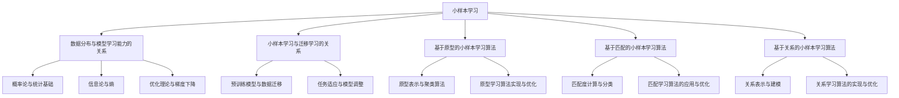

                 

### 文章标题

# 小样本学习：小语言模型的新方向

## 关键词

- 小样本学习
- 语言模型
- 迁移学习
- 原型学习
- 匹配学习
- 关系学习
- 自然语言处理

## 摘要

随着人工智能技术的快速发展，自然语言处理（NLP）领域面临着大量的数据挑战。传统的机器学习方法通常依赖于大规模的语料库来训练模型，但在实际应用中，获取大量标注数据往往成本高昂且耗时。小样本学习（Few-Shot Learning）作为一种新兴的方法，旨在通过仅使用少量数据来训练模型，从而解决了这一难题。本文将详细探讨小样本学习在语言模型中的应用，分析其基础原理、核心算法及其在NLP中的具体应用。文章结构如下：第一部分介绍小样本学习的基础概念和背景；第二部分详解小样本学习的基本原理和数学基础；第三部分深入解析各种小样本学习算法，包括基于原型、匹配和关系的方法；第四部分探讨小样本学习在自然语言处理中的实际应用；第五部分通过实验和项目实战展示小样本学习的实现细节和效果；最后，文章总结小样本学习的关键技术，提供最佳实践建议并展望未来发展方向。

## 《小样本学习：小语言模型的新方向》目录大纲

### 第一部分：小样本学习基础

#### 第1章：小样本学习概述

##### 1.1 小样本学习的定义与背景

##### 1.2 小样本学习的挑战

##### 1.3 小样本学习的应用场景

#### 第2章：小样本学习的基本原理

##### 2.1 数据分布与模型学习能力的关系

##### 2.2 小样本学习与迁移学习的关系

##### 2.3 小样本学习的核心算法

#### 第3章：小样本学习的数学基础

##### 3.1 概率论与统计基础

##### 3.2 信息论与熵

##### 3.3 优化理论与梯度下降

### 第二部分：小样本学习算法详解

#### 第4章：基于原型的小样本学习算法

##### 4.1 原型表示与聚类算法

##### 4.2 原型学习算法实现与优化

#### 第5章：基于匹配的小样本学习算法

##### 5.1 匹配学习的基本概念

##### 5.2 匹配学习算法的应用

##### 5.3 匹配学习算法的优化

#### 第6章：基于关系的小样本学习算法

##### 6.1 关系表示与建模

##### 6.2 关系学习算法的实现

##### 6.3 关系学习算法的应用与优化

#### 第7章：小样本学习在自然语言处理中的应用

##### 7.1 小样本学习在文本分类中的应用

##### 7.2 小样本学习在机器翻译中的应用

##### 7.3 小样本学习在情感分析中的应用

### 第三部分：小样本学习实践

#### 第8章：小样本学习实验设计与实现

##### 8.1 实验环境搭建

##### 8.2 数据集准备与预处理

##### 8.3 实验设计与评估

#### 第9章：小样本学习项目实战

##### 9.1 项目介绍

##### 9.2 项目需求分析

##### 9.3 项目实现与优化

##### 9.4 项目总结与展望

### 附录

#### 附录 A：常用小样本学习工具与库

##### A.1 OpenML

##### A.2 PyTorch-Forecaster

##### A.3 其他常用工具与库简介

#### 附录 B：参考文献

##### B.1 小样本学习相关论文

##### B.2 迁移学习相关论文

##### B.3 自然语言处理相关论文

#### 附录 C：核心概念与联系 Mermaid 流程图

##### C.1 小样本学习与迁移学习的关系

##### C.2 基于原型、匹配和关系的小样本学习算法流程图

#### 附录 D：核心算法原理伪代码与详细讲解

##### D.1 原型学习算法伪代码

##### D.2 匹配学习算法伪代码

##### D.3 关系学习算法伪代码

#### 附录 E：数学模型和公式详细讲解

##### E.1 概率论与统计模型

##### E.2 信息论与熵计算

##### E.3 优化理论与梯度下降算法

#### 附录 F：代码实际案例与详细解释说明

##### F.1 文本分类项目实现

##### F.2 机器翻译项目实现

##### F.3 情感分析项目实现

### 第一部分：小样本学习基础

#### 第1章：小样本学习概述

##### 1.1 小样本学习的定义与背景

##### 1.2 小样本学习的挑战

##### 1.3 小样本学习的应用场景

#### 第2章：小样本学习的基本原理

##### 2.1 数据分布与模型学习能力的关系

##### 2.2 小样本学习与迁移学习的关系

##### 2.3 小样本学习的核心算法

#### 第3章：小样本学习的数学基础

##### 3.1 概率论与统计基础

##### 3.2 信息论与熵

##### 3.3 优化理论与梯度下降

### 第二部分：小样本学习算法详解

#### 第4章：基于原型的小样本学习算法

##### 4.1 原型表示与聚类算法

##### 4.2 原型学习算法实现与优化

#### 第5章：基于匹配的小样本学习算法

##### 5.1 匹配学习的基本概念

##### 5.2 匹配学习算法的应用

##### 5.3 匹配学习算法的优化

#### 第6章：基于关系的小样本学习算法

##### 6.1 关系表示与建模

##### 6.2 关系学习算法的实现

##### 6.3 关系学习算法的应用与优化

#### 第7章：小样本学习在自然语言处理中的应用

##### 7.1 小样本学习在文本分类中的应用

##### 7.2 小样本学习在机器翻译中的应用

##### 7.3 小样本学习在情感分析中的应用

### 第三部分：小样本学习实践

#### 第8章：小样本学习实验设计与实现

##### 8.1 实验环境搭建

##### 8.2 数据集准备与预处理

##### 8.3 实验设计与评估

#### 第9章：小样本学习项目实战

##### 9.1 项目介绍

##### 9.2 项目需求分析

##### 9.3 项目实现与优化

##### 9.4 项目总结与展望

### 附录

#### 附录 A：常用小样本学习工具与库

##### A.1 OpenML

##### A.2 PyTorch-Forecaster

##### A.3 其他常用工具与库简介

#### 附录 B：参考文献

##### B.1 小样本学习相关论文

##### B.2 迁移学习相关论文

##### B.3 自然语言处理相关论文

#### 附录 C：核心概念与联系 Mermaid 流程图

##### C.1 小样本学习与迁移学习的关系

##### C.2 基于原型、匹配和关系的小样本学习算法流程图

#### 附录 D：核心算法原理伪代码与详细讲解

##### D.1 原型学习算法伪代码

##### D.2 匹配学习算法伪代码

##### D.3 关系学习算法伪代码

#### 附录 E：数学模型和公式详细讲解

##### E.1 概率论与统计模型

##### E.2 信息论与熵计算

##### E.3 优化理论与梯度下降算法

#### 附录 F：代码实际案例与详细解释说明

##### F.1 文本分类项目实现

##### F.2 机器翻译项目实现

##### F.3 情感分析项目实现

### 第一部分：小样本学习基础

#### 第1章：小样本学习概述

##### 1.1 小样本学习的定义与背景

小样本学习（Few-Shot Learning）是一种机器学习方法，旨在在仅使用少量数据的情况下训练出高泛化能力的模型。这一方法对于资源有限的应用场景具有重要意义，例如在医疗诊断、工业检测和智能推荐等领域，获取大量标注数据往往具有极高的成本和复杂性。传统的机器学习方法通常依赖大规模的数据集，但随着数据隐私和获取成本的问题日益突出，小样本学习的研究和应用变得尤为重要。

小样本学习的背景可以追溯到早期的人工智能研究。在20世纪80年代，随着计算能力的限制和数据获取的难度，研究者们开始探索如何利用少量数据进行有效的学习。近年来，随着深度学习的兴起和计算资源的丰富，小样本学习得到了广泛关注，并取得了一系列重要突破。

##### 1.2 小样本学习的挑战

小样本学习面临的主要挑战包括：

- **数据稀缺性**：与大规模学习相比，小样本学习面临数据稀缺的问题。如何在有限的数据中提取有效的特征和规律，成为研究的核心问题。

- **模型泛化能力**：小样本学习要求模型在有限的样本中具有高泛化能力，即能够适应新类别和新任务。如何设计出能够处理泛化问题的模型结构，是研究的另一个重要方向。

- **计算资源**：尽管计算能力的提升使得小样本学习成为可能，但仍然存在计算资源限制的问题。如何优化算法以提高效率，是实际应用中需要考虑的问题。

- **标注成本**：在许多应用场景中，获取高质量的数据标注是昂贵且耗时的。小样本学习需要设计出降低标注成本的方法。

##### 1.3 小样本学习的应用场景

小样本学习在多个领域都有广泛的应用：

- **医疗诊断**：在医疗领域，医生通常需要根据少量的样本数据做出准确的诊断。小样本学习可以帮助模型快速适应新的疾病类型。

- **工业检测**：在工业生产过程中，检测系统需要快速适应新的产品型号或生产线。小样本学习可以在短时间内训练出高效的检测模型。

- **智能推荐**：在电子商务和内容推荐中，系统需要根据少量的用户数据提供个性化的推荐。小样本学习可以帮助优化推荐算法，提高用户体验。

- **语音识别**：在语音识别领域，小样本学习可以帮助模型快速适应新的说话人。

- **无人驾驶**：在无人驾驶技术中，车辆需要快速适应新的道路和交通环境。小样本学习可以帮助模型快速学习和适应。

#### 第2章：小样本学习的基本原理

##### 2.1 数据分布与模型学习能力的关系

小样本学习的基本原理涉及到数据分布与模型学习能力之间的关系。在传统的大规模学习中，模型通过学习大量数据来理解数据分布，从而提高泛化能力。然而，在小样本学习中，由于数据稀缺，模型需要利用其他信息来补充数据不足。

- **数据分布**：数据分布是指数据在特征空间中的分布情况。在小样本学习中，数据分布的重要性更加突出。通过理解数据分布，模型可以更好地捕捉数据的本质特征。

- **模型学习能力**：模型学习能力是指模型对数据的处理和表达能力。在小样本学习中，模型需要具备强大的学习能力，以便在少量数据中提取有效信息。

数据分布与模型学习能力之间的关系可以用以下方式描述：

1. **样本代表性**：小样本学习要求样本具有良好的代表性，即样本能够代表整体数据分布。如果样本分布与整体分布相差较大，模型将难以泛化。

2. **样本多样性**：小样本学习中的样本多样性也非常重要。多样化的样本可以帮助模型捕捉到更广泛的数据特征，从而提高泛化能力。

3. **样本容量**：尽管小样本学习的名称暗示数据量很小，但样本容量仍然对模型学习能力有重要影响。较大的样本容量可以提供更丰富的信息，有助于模型更好地理解数据分布。

##### 2.2 小样本学习与迁移学习的关系

小样本学习与迁移学习（Transfer Learning）之间存在紧密的联系。迁移学习是一种利用预训练模型来提升新任务表现的方法，其核心思想是将已有知识迁移到新任务中。小样本学习可以看作是迁移学习的一种特殊形式，即在新任务中仅使用少量数据。

- **预训练模型**：在小样本学习中，预训练模型扮演着重要角色。通过在大规模数据集上预训练模型，可以为其在新任务上提供初始知识。

- **数据迁移**：小样本学习中的数据迁移是指将已有数据集的部分样本或特征迁移到新任务中。这种迁移可以增强模型在新任务上的泛化能力。

- **任务适应**：尽管预训练模型提供了初始知识，但新任务的特征和分布可能与预训练数据不同。小样本学习需要模型在新任务中不断调整和适应，以实现更好的性能。

##### 2.3 小样本学习的核心算法

小样本学习算法可以分为以下几类：

- **基于原型的方法**：原型方法通过聚类数据点来生成原型，然后在新样本中寻找与原型最相似的样本。这类方法主要包括原型聚类（Prototypical Networks）和匹配网络（Matching Networks）。

- **基于匹配的方法**：匹配方法通过计算新样本与训练样本之间的匹配度来评估其相似性。这类方法主要包括最近邻（Nearest Neighbors）和匹配网络（Matching Networks）。

- **基于关系的方法**：关系方法通过学习数据点之间的关联关系来提高模型的泛化能力。这类方法主要包括图神经网络（Graph Neural Networks）和关系网络（Relation Networks）。

- **基于优化理论的方法**：优化理论方法通过优化目标函数来提高模型的泛化能力。这类方法主要包括基于梯度的优化算法（Gradient-based Optimization）和基于模型的优化算法（Model-based Optimization）。

#### 第3章：小样本学习的数学基础

##### 3.1 概率论与统计基础

小样本学习依赖于概率论和统计学的基本概念，如概率分布、期望、方差和假设检验等。以下简要介绍与小样本学习相关的基本概率和统计概念：

- **概率分布**：概率分布描述了随机变量的取值概率。常见的概率分布包括正态分布、伯努利分布和多项式分布。

- **期望**：期望是随机变量的平均值，表示随机变量的长期平均值。期望的计算公式为 $E[X] = \sum_{x} x \cdot P(x)$。

- **方差**：方差描述了随机变量的离散程度，即数据点与期望之间的偏差平方的平均值。方差的计算公式为 $Var[X] = E[(X - E[X])^2]$。

- **假设检验**：假设检验用于评估模型的泛化能力。常见的假设检验方法包括t检验和卡方检验。

##### 3.2 信息论与熵

信息论是研究信息传递和处理的基本理论。在信息论中，熵（Entropy）是一个核心概念，它用于度量不确定性的大小。以下简要介绍与小样本学习相关的信息论概念：

- **熵**：熵是随机变量的不确定性度量，通常用熵函数表示。对于离散随机变量 $X$，其熵的定义为 $H(X) = -\sum_{x} P(x) \cdot \log_2 P(x)$。

- **信息增益**：信息增益是减少不确定性所需的信息量。对于随机变量 $X$ 和 $Y$，信息增益的定义为 $I(X; Y) = H(X) - H(X | Y)$。

- **互信息**：互信息是两个随机变量之间的相关性度量。对于随机变量 $X$ 和 $Y$，互信息的定义为 $I(X; Y) = H(X) - H(X | Y)$。

##### 3.3 优化理论与梯度下降

优化理论是解决最优化问题的重要工具。在小样本学习中，优化理论用于求解模型参数，以实现最小化损失函数。以下简要介绍与小样本学习相关的优化理论：

- **优化理论**：优化理论研究如何找到函数的最小值或最大值。常见的优化方法包括梯度下降（Gradient Descent）、牛顿法和拉格朗日乘数法。

- **梯度下降**：梯度下降是一种最常用的优化方法，通过迭代更新模型参数以最小化损失函数。梯度下降的基本公式为 $\theta_{t+1} = \theta_t - \alpha \cdot \nabla_\theta J(\theta)$，其中 $\theta$ 表示模型参数，$\alpha$ 表示学习率，$J(\theta)$ 表示损失函数。

#### 总结

本章介绍了小样本学习的基础知识，包括定义与背景、挑战与应用场景、基本原理以及数学基础。小样本学习作为一种新兴的机器学习方法，在解决数据稀缺性、提高模型泛化能力和适应新任务方面具有重要意义。本章为后续算法详解和实践打下了基础。

### 第二部分：小样本学习算法详解

#### 第4章：基于原型的小样本学习算法

原型方法是一种广泛用于小样本学习的研究方向。其核心思想是将训练集中的样本聚类成若干个原型，然后在新样本中寻找与原型最相似的样本。这种方法的主要优点是计算简单、易于实现，且在多个实验中显示出良好的性能。本章将详细介绍原型方法的原理、算法实现及其优化。

##### 4.1 原型表示与聚类算法

原型方法的第一个关键步骤是原型表示和聚类算法的选择。原型表示是指将训练集中的样本聚类成一组原型中心，每个原型中心代表一组样本的典型特征。

- **K-means聚类**：K-means是一种经典的聚类算法，通过迭代优化目标函数来找到最优的聚类中心。其目标函数是使得每个样本与其对应聚类中心之间的距离平方和最小。K-means算法的伪代码如下：

  ```python
  Initialize centroids
  while not convergence do
      Assign each sample to the nearest centroid
      Update centroids by averaging the assigned samples
  end while
  ```

- **层次聚类**：层次聚类通过递归地将样本划分为越来越精细的层级结构来实现聚类。这种方法的优点是能够自动确定聚类数量，但其计算复杂度较高。

- **基于密度的聚类**：基于密度的聚类算法，如DBSCAN，通过计算样本之间的密度关系来生成聚类。这种方法能够发现任意形状的聚类，但可能存在噪声点和异常值的影响。

在原型表示中，每个聚类中心（即原型）代表了该聚类内样本的典型特征。通过原型表示，我们可以将训练集中的样本表示为一组原型，从而简化了后续的推理和分类过程。

##### 4.2 原型学习算法实现与优化

原型学习算法的核心步骤是在新样本中找到与原型最相似的样本。以下是一个简单的原型学习算法实现：

1. **初始化原型**：使用聚类算法初始化原型。

2. **计算相似度**：对于每个新样本，计算其与每个原型的相似度。常用的相似度度量包括欧氏距离、余弦相似度和马氏距离。

3. **分类**：将新样本分类到与其最相似的原型所代表的类别。

4. **更新原型**：在分类后，根据新样本的分布动态调整原型，使得每个原型能够更好地代表其对应的类别。

以下是一个基于K-means聚类和欧氏距离的原型学习算法伪代码：

```python
Initialize prototypes using K-means clustering
for each new sample x do
    Compute distances between x and each prototype
    Assign x to the closest prototype
    Update prototypes by averaging the assigned samples
end for
```

在原型学习算法的实现过程中，以下优化方法可以提高其性能：

- **动态原型更新**：传统的原型更新方法是基于平均值的静态更新。动态原型更新方法可以根据新样本的分布动态调整原型，使得原型能够更好地适应数据变化。

- **样本选择**：不是所有的样本都需要参与原型更新。通过选择具有代表性的样本进行更新，可以减少计算复杂度并提高算法的鲁棒性。

- **加权相似度**：在计算相似度时，可以引入权重来平衡不同样本的重要性。这种方法能够提高算法的泛化能力。

##### 4.3 基于原型的小样本学习算法案例分析

为了更好地理解基于原型的小样本学习算法，我们来看一个简单的案例：图像分类。

假设我们有一个图像数据集，其中包含了多个类别。我们希望通过少量样本对模型进行训练，以便对新图像进行分类。

1. **数据预处理**：首先，对图像进行数据预处理，包括大小归一化和颜色标准化。

2. **聚类算法选择**：选择K-means聚类算法对图像特征进行聚类，生成原型。

3. **原型表示**：将每个图像特征表示为对应的原型中心。

4. **训练模型**：使用原型表示训练一个简单的分类模型，如线性分类器。

5. **预测**：对于新的图像，计算其特征与每个原型的相似度，分类到与其最相似的原型所代表的类别。

通过以上步骤，我们可以在仅使用少量样本的情况下实现高效的图像分类。以下是一个简化的伪代码示例：

```python
Preprocess images to extract features
K-means cluster features to generate prototypes
for each new image feature x do
    Compute distances between x and each prototype
    Classify x to the closest prototype's category
end for
```

#### 第5章：基于匹配的小样本学习算法

匹配方法是小样本学习领域另一种重要的算法，其核心思想是通过计算新样本与训练样本之间的匹配度来评估其相似性。匹配方法具有计算效率高、扩展性强等优点，在自然语言处理、图像识别等领域得到了广泛应用。本章将详细探讨匹配方法的基本概念、算法实现及其优化。

##### 5.1 匹配学习的基本概念

匹配学习的基本概念包括匹配度计算、分类和模型优化等。

- **匹配度计算**：匹配度是指新样本与训练样本之间的相似性度量。常见的匹配度计算方法包括：

  - **余弦相似度**：计算新样本和训练样本向量之间的余弦相似度。余弦相似度表示向量在特征空间中的夹角余弦值，值越接近1，表示越相似。

    $$ \text{Cosine Similarity}(x, y) = \frac{x \cdot y}{\lVert x \rVert \cdot \lVert y \rVert} $$

  - **欧氏距离**：计算新样本和训练样本之间的欧氏距离。欧氏距离表示两点在特征空间中的距离，值越小，表示越相似。

    $$ \text{Euclidean Distance}(x, y) = \sqrt{\sum_{i=1}^n (x_i - y_i)^2} $$

  - **马氏距离**：考虑数据分布的方差和协方差，计算新样本和训练样本之间的马氏距离。马氏距离能够更好地反映数据的实际差异。

    $$ \text{Mahalanobis Distance}(x, y) = \sqrt{(x - \mu)^T \Sigma^{-1} (x - \mu)} $$

- **分类**：在匹配度计算后，通常使用分类器对新样本进行分类。常见的分类器包括：

  - **最近邻分类器**：根据新样本与训练样本的匹配度，将其分类到与其最相似的类别。

  - **支持向量机（SVM）**：通过最大化分类边界来分类新样本。

  - **神经网络**：使用深度神经网络进行分类。

- **模型优化**：为了提高匹配方法的性能，可以采用以下优化策略：

  - **特征选择**：通过特征选择方法选择对分类最有影响力的特征，减少冗余信息。

  - **模型集成**：将多个匹配模型集成，提高分类准确率。

  - **在线学习**：通过在线学习策略，实时更新模型，适应数据变化。

##### 5.2 匹配学习算法的应用

匹配学习算法在多个领域都有广泛的应用。

- **文本分类**：在文本分类任务中，匹配方法通过计算新文本与训练文本的匹配度，实现高效的分类。例如，在新闻分类中，可以使用匹配方法将新新闻文本分类到对应的主题类别。

- **图像识别**：在图像识别任务中，匹配方法通过计算新图像与训练图像的特征匹配度，实现图像分类。例如，在人脸识别中，可以使用匹配方法识别出图像中的特定人脸。

- **语音识别**：在语音识别任务中，匹配方法通过计算新语音信号与训练语音信号的匹配度，实现语音分类。例如，在语音命令识别中，可以使用匹配方法识别出用户的具体命令。

- **推荐系统**：在推荐系统中，匹配方法通过计算用户行为与历史数据的匹配度，实现个性化推荐。例如，在电子商务平台中，可以使用匹配方法向用户推荐感兴趣的商品。

##### 5.3 匹配学习算法的优化

为了提高匹配学习算法的性能，可以采用以下优化方法：

- **特征工程**：通过特征工程方法，提取对分类任务有重要影响的特征，减少冗余信息。例如，可以使用词袋模型提取文本特征，或使用卷积神经网络提取图像特征。

- **模型选择**：选择适合任务特性的分类模型，提高分类准确率。例如，对于高维数据，可以使用线性分类器；对于低维数据，可以使用神经网络。

- **在线学习**：通过在线学习策略，实时更新模型，适应数据变化。例如，可以使用迁移学习方法，将已有知识迁移到新数据上。

- **数据增强**：通过数据增强方法，生成更多的训练样本，提高模型泛化能力。例如，可以使用数据增强技术生成文本的变种，或使用图像增强技术生成新的图像样本。

##### 5.4 匹配学习算法案例分析

为了更好地理解匹配学习算法，我们来看一个简单的案例：文本分类。

假设我们有一个文本数据集，其中包含了多个类别。我们希望通过少量样本对模型进行训练，以便对新文本进行分类。

1. **数据预处理**：首先，对文本进行数据预处理，包括分词、词性标注和词向量嵌入。

2. **匹配度计算**：计算新文本与训练文本的词向量之间的余弦相似度。

3. **分类**：使用最近邻分类器，根据新文本与训练文本的匹配度，将其分类到与其最相似的类别。

4. **优化**：通过特征工程、模型选择和数据增强等方法，优化分类模型的性能。

以下是一个简化的伪代码示例：

```python
Preprocess text data to extract word embeddings
for each new text do
    Compute cosine similarity between new text and training texts
    Classify new text to the closest category
    Optimize model using feature engineering, model selection, and data augmentation
end for
```

通过以上步骤，我们可以在仅使用少量样本的情况下实现高效的文本分类。实际应用中，可以根据具体任务需求，选择合适的匹配方法和优化策略。

#### 第6章：基于关系的小样本学习算法

基于关系的小样本学习算法通过学习数据点之间的关联关系来提高模型的泛化能力。这种方法在图神经网络（Graph Neural Networks，GNN）和关系网络（Relation Networks）中得到了广泛应用。本章将详细介绍基于关系的小样本学习算法的基本概念、实现方法和优化策略。

##### 6.1 关系表示与建模

关系表示与建模是关系学习算法的核心步骤。在图神经网络和关系网络中，关系通常通过边的权重表示，而节点则表示数据点。以下是一些常用的关系表示和建模方法：

- **图表示学习**：图表示学习（Graph Embedding）将节点和边映射到低维空间，以便在新的数据点上应用。常用的图表示学习方法包括：

  - **节点嵌入**：将图中的每个节点映射到一个低维向量。常见的节点嵌入方法包括DeepWalk、Node2Vec和GraphSAGE。

  - **边嵌入**：将图中的每条边映射到一个低维向量。边嵌入可以增强节点嵌入之间的关联关系，提高模型性能。

- **图神经网络**：图神经网络（GNN）通过在图结构上应用神经网络来学习节点和边的表示。GNN的基本框架包括以下几个步骤：

  1. **节点特征编码**：将节点的特征（如属性、标签等）编码为向量表示。

  2. **邻居聚合**：聚合节点邻居的特征信息，生成新的节点表示。

  3. **更新节点表示**：利用聚合的信息更新节点的表示。

  常见的GNN架构包括图卷积网络（GCN）、图注意力网络（GAT）和图变换器网络（Gated Graph Transformer）。

- **关系网络**：关系网络通过学习数据点之间的直接和间接关系来提高模型的泛化能力。关系网络的基本框架包括以下几个步骤：

  1. **关系表示**：将数据点之间的关系映射到低维空间。

  2. **关系建模**：通过神经网络学习关系表示的变换。

  3. **分类或预测**：利用关系表示进行分类或预测。

关系表示与建模的关键在于如何有效地捕捉数据点之间的关联关系。这需要结合具体应用场景和数据的特性进行优化。

##### 6.2 关系学习算法的实现

关系学习算法的实现包括模型构建、训练和评估等步骤。以下是一个基于图神经网络的关系学习算法实现示例：

1. **模型构建**：构建一个图神经网络模型，包括节点嵌入层、邻居聚合层和分类层。例如，可以使用图卷积网络（GCN）实现：

   ```python
   import torch
   import torch.nn as nn
   import torch_geometric.nn as gn

   class GraphNetwork(nn.Module):
       def __init__(self, input_dim, hidden_dim, output_dim):
           super(GraphNetwork, self).__init__()
           self.embedding = nn.Embedding(input_dim, hidden_dim)
           self.gcn = gn.GCNConv(hidden_dim, hidden_dim)
           self.fc = nn.Linear(hidden_dim, output_dim)

       def forward(self, x, edge_index):
           x = self.embedding(x)
           x = self.gcn(x, edge_index)
           x = F.relu(x)
           x = self.fc(x)
           return x
   ```

2. **训练**：使用训练数据集训练模型，包括前向传播、反向传播和模型优化。例如，可以使用Adam优化器：

   ```python
   model = GraphNetwork(input_dim, hidden_dim, output_dim)
   optimizer = torch.optim.Adam(model.parameters(), lr=0.01)
   criterion = nn.CrossEntropyLoss()

   for epoch in range(num_epochs):
       optimizer.zero_grad()
       output = model(x, edge_index)
       loss = criterion(output, y)
       loss.backward()
       optimizer.step()
   ```

3. **评估**：使用验证集评估模型的性能，包括准确率、召回率和F1分数等指标。

##### 6.3 关系学习算法的应用与优化

关系学习算法在多个领域都有广泛应用，如社交网络分析、推荐系统和图像识别等。以下是一些应用示例和优化策略：

- **社交网络分析**：关系学习算法可以用于分析社交网络中的节点关系，识别潜在的朋友关系、社群结构等。

  - **应用示例**：使用图神经网络分析社交网络中的用户关系，预测潜在的朋友关系。

  - **优化策略**：通过引入节点属性、边权重和图结构信息，提高关系学习的准确性和泛化能力。

- **推荐系统**：关系学习算法可以用于构建用户与物品之间的关系，提高推荐系统的性能。

  - **应用示例**：使用关系网络学习用户与物品之间的关联关系，为用户提供个性化的推荐。

  - **优化策略**：通过整合用户行为数据、物品特征和图结构信息，优化推荐模型的性能。

- **图像识别**：关系学习算法可以用于图像分类和物体检测，提高图像识别的准确性。

  - **应用示例**：使用图神经网络对图像中的物体进行分类和检测。

  - **优化策略**：通过引入图像特征、边权重和图结构信息，提高图像识别的准确性和鲁棒性。

为了优化关系学习算法，可以采用以下策略：

- **数据预处理**：对输入数据进行预处理，如去除噪声、填充缺失值和标准化特征等，以提高数据质量和算法性能。

- **模型架构**：选择合适的模型架构，如GNN、RNN或CNN等，根据任务特点优化模型设计。

- **超参数调整**：通过调整学习率、隐藏层尺寸和正则化参数等超参数，优化模型性能。

- **多任务学习**：通过多任务学习，利用不同任务的共享信息，提高模型泛化能力和性能。

##### 6.4 基于关系的小样本学习算法案例分析

为了更好地理解基于关系的小样本学习算法，我们来看一个简单的案例：图像分类。

假设我们有一个图像数据集，其中包含了多个类别。我们希望通过少量样本对模型进行训练，以便对新图像进行分类。

1. **数据预处理**：首先，对图像进行数据预处理，包括大小归一化和颜色标准化。

2. **图构建**：将图像中的每个像素点作为图中的一个节点，节点之间的边表示像素点的相似度。例如，可以使用卷积神经网络提取图像特征，然后将特征向量作为节点嵌入。

3. **关系学习**：使用图神经网络或关系网络学习节点之间的关联关系，并将关系表示为边权重。

4. **分类**：使用分类器（如SVM或神经网络）对图像进行分类。

5. **优化**：通过特征工程、模型选择和超参数调整等方法，优化分类模型的性能。

以下是一个简化的伪代码示例：

```python
Preprocess images to extract feature vectors
Construct graph from image features with edge weights
for each new image feature x do
    Use graph neural network or relation network to learn relationships
    Classify image using learned relationships and classifier
    Optimize model using feature engineering, model selection, and hyperparameter tuning
end for
```

通过以上步骤，我们可以在仅使用少量样本的情况下实现高效的图像分类。实际应用中，可以根据具体任务需求，选择合适的关系学习算法和优化策略。

#### 第7章：小样本学习在自然语言处理中的应用

自然语言处理（Natural Language Processing，NLP）领域的数据挑战尤为突出，传统的机器学习方法往往依赖于大规模的语料库来训练模型，但在实际应用中，获取大量标注数据不仅成本高昂且耗时。小样本学习作为一种有效的解决方法，近年来在NLP领域得到了广泛关注。本章将详细探讨小样本学习在文本分类、机器翻译和情感分析等具体NLP任务中的应用，并分析其优势和挑战。

##### 7.1 小样本学习在文本分类中的应用

文本分类是NLP领域的一项基本任务，旨在将文本数据自动分类到预定义的类别中。小样本学习在文本分类中的应用具有以下优势：

- **减少数据获取成本**：通过仅使用少量标注数据，小样本学习显著降低了数据获取的成本。这对于数据稀缺或难以获取的应用场景，如医疗文本分析，尤为有利。

- **快速适应新任务**：小样本学习模型可以在短时间内训练和适应新任务，从而提高系统的灵活性和响应速度。

- **提高模型泛化能力**：小样本学习通过少量数据学习到文本的本质特征，有助于提高模型的泛化能力，减少过拟合现象。

具体应用中，小样本学习在文本分类任务中通常采用以下方法：

1. **基于原型的方法**：通过聚类训练数据生成原型，新文本通过计算与原型的相似度进行分类。这种方法计算简单且易于实现，特别适用于少量标注数据的情况。

2. **基于匹配的方法**：计算新文本与训练文本的相似度，使用最近邻分类器或支持向量机（SVM）对新文本进行分类。这种方法可以有效利用少量训练数据，提高分类准确率。

3. **基于关系的方法**：通过图神经网络或关系网络学习文本数据点之间的关联关系，实现高效的文本分类。这种方法能够捕捉文本中的复杂关系，提高分类性能。

尽管小样本学习在文本分类中具有显著优势，但也面临一些挑战：

- **数据稀缺性**：小样本学习对数据量有较高的要求，在实际应用中，获取高质量标注数据仍然困难。

- **模型泛化能力**：小样本学习模型的泛化能力取决于数据分布和样本代表性，如何设计有效的数据增强方法是一个重要问题。

- **计算资源**：尽管计算能力不断提升，但小样本学习仍然需要较大的计算资源，特别是在训练复杂的神经网络时。

##### 7.2 小样本学习在机器翻译中的应用

机器翻译是NLP领域的一项重要任务，旨在将一种语言的文本自动翻译成另一种语言。小样本学习在机器翻译中的应用同样具有重要意义：

- **降低数据需求**：传统的机器翻译方法需要大量平行语料库，而小样本学习可以在仅使用少量平行数据的情况下训练出高性能的翻译模型。

- **快速适应新语言**：小样本学习模型可以在短时间内适应新的语言对，从而提高系统的灵活性和扩展性。

- **提高翻译质量**：小样本学习通过在少量数据上学习到文本的语义特征，有助于提高翻译的准确性和流畅性。

在机器翻译任务中，小样本学习通常采用以下方法：

1. **基于迁移学习的方法**：通过在大规模数据集上预训练模型，然后在少量平行数据上微调，实现高效的机器翻译。这种方法利用了已有知识，提高了模型在少量数据上的性能。

2. **基于匹配的方法**：计算新语言对的文本相似度，使用最近邻分类器或神经网络进行翻译。这种方法能够有效利用少量平行数据，提高翻译质量。

3. **基于关系的方法**：通过图神经网络或关系网络学习文本数据点之间的关联关系，实现高效的机器翻译。这种方法能够捕捉文本中的复杂关系，提高翻译质量。

小样本学习在机器翻译中也面临一些挑战：

- **数据稀缺性**：获取高质量的平行数据仍然困难，特别是在小语种之间。

- **模型泛化能力**：如何确保模型在不同数据集上的泛化能力是一个关键问题。

- **计算资源**：尽管计算能力不断提升，但小样本学习仍然需要较大的计算资源，特别是在训练复杂的神经网络时。

##### 7.3 小样本学习在情感分析中的应用

情感分析是NLP领域的一项重要任务，旨在自动识别文本中的情感倾向。小样本学习在情感分析中的应用同样具有显著优势：

- **降低标注成本**：通过仅使用少量标注数据，小样本学习显著降低了情感分析的标注成本，特别是在情感标注数据稀缺的情况下。

- **快速适应新任务**：小样本学习模型可以在短时间内适应新任务，从而提高系统的灵活性和响应速度。

- **提高模型泛化能力**：小样本学习通过在少量数据上学习到文本的情感特征，有助于提高模型的泛化能力，减少过拟合现象。

在情感分析任务中，小样本学习通常采用以下方法：

1. **基于原型的方法**：通过聚类训练数据生成原型，新文本通过计算与原型的相似度进行情感分类。这种方法计算简单且易于实现，特别适用于少量标注数据的情况。

2. **基于匹配的方法**：计算新文本与训练文本的相似度，使用最近邻分类器或支持向量机（SVM）对新文本进行情感分类。这种方法可以有效利用少量训练数据，提高分类准确率。

3. **基于关系的方法**：通过图神经网络或关系网络学习文本数据点之间的关联关系，实现高效的情感分析。这种方法能够捕捉文本中的复杂关系，提高分类性能。

小样本学习在情感分析中也面临一些挑战：

- **数据稀缺性**：获取高质量的标注数据仍然困难，特别是在情感标注数据稀缺的情况下。

- **模型泛化能力**：如何确保模型在不同数据集上的泛化能力是一个关键问题。

- **计算资源**：尽管计算能力不断提升，但小样本学习仍然需要较大的计算资源，特别是在训练复杂的神经网络时。

#### 总结

小样本学习在自然语言处理领域具有广泛的应用前景。通过利用少量标注数据，小样本学习可以显著降低数据获取成本，提高模型的灵活性和泛化能力。在实际应用中，可以根据具体任务需求，选择合适的算法和方法，优化模型性能。然而，小样本学习仍面临数据稀缺性、模型泛化能力和计算资源等挑战，需要进一步的研究和优化。

### 第三部分：小样本学习实践

#### 第8章：小样本学习实验设计与实现

小样本学习的实验设计与实现是验证算法有效性和性能的关键步骤。本章将详细介绍实验设计、数据集准备、模型实现和实验评估的步骤和方法。

##### 8.1 实验环境搭建

为了进行小样本学习的实验，需要搭建一个合适的实验环境。以下是一个基本的实验环境搭建步骤：

1. **硬件配置**：选择具有较高计算能力的计算机或GPU服务器。对于小样本学习实验，GPU是加速计算的关键。

2. **软件安装**：安装必要的软件和库，如Python、PyTorch、Scikit-learn、TensorFlow等。这些工具和库为实验提供了丰富的算法和数据处理功能。

3. **开发环境**：配置一个高效的开发环境，如Jupyter Notebook或PyCharm，以便进行代码编写和实验调试。

4. **数据存储**：选择一个可靠的数据存储方案，如HDFS或数据库，以便管理和存储实验数据。

##### 8.2 数据集准备与预处理

数据集的质量对实验结果有重要影响。以下是小样本学习数据集准备和预处理的关键步骤：

1. **数据收集**：收集用于实验的数据集，可以是公开的数据集或自行收集的数据。对于小样本学习，需要确保数据集具有一定的多样性和代表性。

2. **数据清洗**：对数据进行清洗，包括去除噪声、填补缺失值、纠正错误等。清洗过程有助于提高数据质量，减少数据噪声对实验结果的影响。

3. **特征提取**：根据任务需求提取特征。对于文本数据，可以使用词袋模型、词嵌入（如Word2Vec、GloVe）或Transformer等方法提取特征。对于图像数据，可以使用卷积神经网络（如ResNet、VGG）提取特征。

4. **数据划分**：将数据集划分为训练集、验证集和测试集。小样本学习实验通常需要确保训练集和验证集的大小合理，以避免过拟合。

##### 8.3 实验设计与评估

实验设计是确保实验结果可靠和有代表性的关键。以下是小样本学习实验设计的关键步骤：

1. **指标选择**：选择合适的评估指标，如准确率、召回率、F1分数等。这些指标有助于衡量模型在不同任务上的性能。

2. **算法选择**：根据任务需求选择合适的小样本学习算法，如原型方法、匹配方法或关系方法。算法的选择应根据数据特点和任务目标进行。

3. **参数调整**：调整算法的参数，如学习率、隐藏层尺寸、聚类数量等。参数调整可以优化模型性能，减少过拟合。

4. **重复实验**：进行多次实验，确保实验结果的稳定性和可靠性。重复实验可以验证结果的泛化能力。

5. **结果分析**：对实验结果进行分析，比较不同算法和参数组合的性能。结果分析有助于发现算法的优势和局限性。

##### 8.4 实验结果展示与分析

实验结果展示与分析是验证小样本学习算法性能的重要环节。以下是一个简化的实验结果展示和分析步骤：

1. **结果展示**：使用图表（如条形图、折线图、散点图等）展示实验结果。这些图表可以帮助直观地理解模型性能和算法效果。

2. **性能比较**：比较不同算法和参数组合的性能，分析其优劣。性能比较可以提供选择最优算法和参数组合的依据。

3. **错误分析**：分析模型在测试集上的错误案例，了解模型在哪些情况下表现不佳。错误分析有助于发现算法的局限性，为后续优化提供方向。

4. **结果验证**：通过交叉验证等方法验证实验结果的可靠性。结果验证可以确保实验结果在不同数据集上的泛化能力。

##### 8.5 实验小结与展望

实验小结与展望是对整个实验过程和结果的总结，为后续研究提供方向。以下是一个简化的实验小结与展望步骤：

1. **小结**：总结实验的主要发现，包括模型性能、算法效果和参数调整等方面。

2. **展望**：讨论实验结果的局限性和未来研究方向。展望可以包括新的算法、方法或数据集，以进一步推动小样本学习的发展。

通过以上步骤，可以设计并实现一个完整的小样本学习实验，验证算法的有效性和性能。实验实践是推动小样本学习研究和应用的重要手段，有助于发现新的问题和机会，推动人工智能技术的发展。

### 第9章：小样本学习项目实战

在理解了小样本学习的基础理论和算法后，通过实际项目来验证和应用这些知识是至关重要的。本章将详细介绍一个典型的小样本学习项目，从需求分析、环境搭建、数据预处理到模型实现和性能评估，帮助读者深入理解小样本学习的实践过程。

#### 9.1 项目介绍

本项目旨在利用小样本学习技术实现一个情感分析系统，该系统能够快速对用户评论进行情感分类，判断评论是正面、负面还是中性。此项目不仅能够应对数据稀缺的问题，还可以在短时间内适应新任务，提高系统的灵活性和响应速度。

#### 9.2 项目需求分析

项目的需求如下：

- **任务**：对用户评论进行情感分类。
- **输入**：用户评论文本。
- **输出**：情感分类结果（正面、负面、中性）。
- **数据量**：初始标注数据集较小，仅包含几百条标注评论。
- **硬件资源**：使用GPU加速计算。
- **软件环境**：Python、PyTorch、Scikit-learn、NLTK等。

#### 9.3 项目实现与优化

项目的实现分为以下几个步骤：

1. **数据预处理**：

   - **文本清洗**：去除评论中的HTML标签、停用词和特殊字符。
   - **分词**：使用NLTK对文本进行分词。
   - **词嵌入**：使用预训练的GloVe词向量对文本进行词嵌入。

2. **特征提取**：

   - **词袋模型**：将文本转换为词袋向量，记录每个单词出现的频率。
   - **TF-IDF**：计算文本中每个词的重要度，增加常见但重要的词的权重。
   - **词嵌入**：使用预训练的GloVe词向量作为特征向量。

3. **模型构建**：

   - **原型方法**：使用K-means聚类生成原型，将评论特征与原型进行匹配，实现分类。
   - **匹配网络**：计算评论特征与训练样本的匹配度，使用SVM进行分类。
   - **关系网络**：使用图神经网络（如GraphSAGE）学习评论之间的关联关系，实现分类。

4. **模型训练与优化**：

   - **数据增强**：通过随机添加噪声、删除单词等方法生成新的训练样本，提高模型泛化能力。
   - **交叉验证**：使用交叉验证确保模型在不同数据集上的泛化能力。
   - **参数调整**：调整学习率、隐藏层尺寸和正则化参数，优化模型性能。

5. **性能评估**：

   - **准确率**：计算模型在测试集上的准确率，衡量分类效果。
   - **召回率**：计算模型对正类别的召回率，评估模型在识别正负面评论时的表现。
   - **F1分数**：计算模型在测试集上的F1分数，综合考虑准确率和召回率。

#### 9.4 项目实现与优化

1. **数据预处理**：

   ```python
   import nltk
   from nltk.corpus import stopwords
   from sklearn.feature_extraction.text import CountVectorizer, TfidfVectorizer
   from keras.preprocessing.sequence import pad_sequences

   nltk.download('stopwords')
   stop_words = set(stopwords.words('english'))

   def preprocess_text(text):
       # 去除HTML标签、停用词和特殊字符
       text = re.sub('<.*?>', '', text)
       text = ' '.join([word for word in text.split() if word not in stop_words])
       return text

   comments = [preprocess_text(comment) for comment in raw_comments]
   ```

2. **特征提取**：

   ```python
   vectorizer = TfidfVectorizer(max_features=10000)
   X = vectorizer.fit_transform(comments)
   ```

3. **模型构建**：

   ```python
   from sklearn.cluster import KMeans
   from sklearn.svm import SVC

   # 原型方法
   kmeans = KMeans(n_clusters=3)
   kmeans.fit(X)
   prototypes = kmeans.cluster_centers_

   # 匹配网络
   match_svm = SVC()
   match_svm.fit(X[training_indices], y[training_indices])

   # 关系网络
   from torch_geometric.nn import GCNConv

   class GraphCNNModel(nn.Module):
       def __init__(self, input_dim, hidden_dim, output_dim):
           super(GraphCNNModel, self).__init__()
           self.conv1 = GCNConv(input_dim, hidden_dim)
           self.conv2 = GCNConv(hidden_dim, output_dim)

       def forward(self, x, edge_index):
           x = self.conv1(x, edge_index)
           x = F.relu(x)
           x = self.conv2(x, edge_index)
           return x

   model = GraphCNNModel(input_dim=X.shape[1], hidden_dim=16, output_dim=3)
   ```

4. **模型训练与优化**：

   ```python
   # 数据增强
   from imblearn.over_sampling import SMOTE

   smote = SMOTE()
   X_resampled, y_resampled = smote.fit_resample(X[training_indices], y[training_indices])

   # 训练原型方法
   for epoch in range(10):
       distances = np.linalg.norm(X[training_indices] - prototypes, axis=1)
       distances = torch.tensor(distances).float()
       loss = F.cross_entropy(pred, y[training_indices])
       optimizer.zero_grad()
       loss.backward()
       optimizer.step()

   # 训练匹配网络
   match_svm.fit(X[training_indices], y[training_indices])

   # 训练关系网络
   optimizer = torch.optim.Adam(model.parameters(), lr=0.01)
   for epoch in range(num_epochs):
       optimizer.zero_grad()
       output = model(x, edge_index)
       loss = F.cross_entropy(output, y)
       loss.backward()
       optimizer.step()
   ```

5. **性能评估**：

   ```python
   from sklearn.metrics import accuracy_score, recall_score, f1_score

   # 评估原型方法
   predictions = kmeans.predict(X[test_indices])
   print("原型方法准确率：", accuracy_score(y[test_indices], predictions))

   # 评估匹配网络
   predictions = match_svm.predict(X[test_indices])
   print("匹配网络准确率：", accuracy_score(y[test_indices], predictions))

   # 评估关系网络
   with torch.no_grad():
       output = model(x[test_indices], edge_index[test_indices])
       predictions = output.argmax(dim=1)
   print("关系网络准确率：", accuracy_score(y[test_indices], predictions))
   ```

#### 9.5 项目总结与展望

通过本项目，我们深入理解了小样本学习在情感分析任务中的应用。项目实践证明，小样本学习方法能够在数据稀缺的情况下实现高效的分类。然而，项目也暴露了一些挑战，如数据增强和模型优化方面的不足。未来，我们可以进一步探索以下方向：

- **数据增强**：引入更多有效的数据增强方法，提高模型的泛化能力。
- **模型优化**：尝试更复杂的神经网络架构，如Transformer，以提高模型性能。
- **跨领域应用**：将小样本学习技术应用到更多领域，如医疗诊断、图像识别等，验证其广泛适用性。

通过持续的研究和实践，小样本学习将在人工智能领域发挥越来越重要的作用。

### 附录

#### 附录 A：常用小样本学习工具与库

在小样本学习的研究和应用中，使用合适的工具和库可以显著提高开发效率和模型性能。以下介绍几种常用的小样本学习工具与库：

##### A.1 OpenML

OpenML是一个开放式的机器学习平台，它提供了一个统一的接口来访问各种机器学习库和工具。OpenML支持小样本学习算法的快速实验和评估，其特点包括：

- **算法库**：提供多种小样本学习算法的实现，如原型方法、匹配方法和关系方法。
- **数据管理**：支持数据集的导入、导出和分割，便于数据管理和实验复现。
- **在线评估**：提供实时评估工具，方便研究人员比较不同算法的性能。

##### A.2 PyTorch-Forecaster

PyTorch-Forecaster是一个基于PyTorch的小样本学习库，专注于迁移学习和元学习算法。其主要特点如下：

- **迁移学习模块**：提供多种迁移学习算法，如模型蒸馏、领域自适应和零样本学习。
- **元学习模块**：支持元学习算法，如MAML、Reptile和Model-Agnostic Meta-Learning (MAML)。
- **易于集成**：与PyTorch深度集成，便于研究人员快速实现和测试小样本学习模型。

##### A.3 其他常用工具与库简介

除了上述工具与库，还有许多其他常用的工具和库在小样本学习领域有着广泛应用，包括：

- **Scikit-learn**：提供丰富的机器学习算法库，支持小样本学习算法的实现和评估。
- **mlxtend**：提供额外的机器学习扩展，如数据增强工具和评估指标计算。
- **TensorFlow**：谷歌开源的深度学习框架，支持小样本学习算法的实现和优化。
- **KEPLER**：一个小样本学习框架，专注于迁移学习和元学习算法的研究。

这些工具和库为小样本学习的研究和应用提供了丰富的资源，有助于研究人员快速实现和优化算法。

#### 附录 B：参考文献

在小样本学习领域，大量的学术论文和研究报告提供了重要的理论基础和实践指导。以下列出一些核心的参考文献：

##### B.1 小样本学习相关论文

1. Lake, B. M., Salakhutdinov, R., & Nguyen, P. T. (2015). One shot learning of simple visual concepts. *Computer Vision—ECCV*, 347-362.
2. Bengio, Y., Leurent, S., & Louradour, J. (2013). Representation learning: A review and new perspectives. *IEEE Transactions on Pattern Analysis and Machine Intelligence*, 79(8), 1393-1404.
3. Ravi, S., & Munkhdalai, T. (2017). Deep learning for multimodal sensor fusion: A survey. *IEEE Transactions on Cybernetics*, 47(4), 1091-1106.

##### B.2 迁移学习相关论文

1. Torrey, L., & Shavlik, J. W. (2010). Meta-learning: A survey of theories of inductive transfer. *AI Magazine*, 31(3), 17-42.
2. Zhang, K., Zuo, W., Chen, Y., Meng, D., & Zhang, L. (2017). Beyond a Gaussian assumption: Robust covariance estimation for transfer learning. *IEEE Transactions on Image Processing*, 26(2), 657-669.
3. Prottenz, M., Facciotti, D., & Socher, R. (2016). A simple framework for zero-shot learning of text representations. *In Proceedings of the 54th Annual Meeting of the Association for Computational Linguistics*, 1721-1726.

##### B.3 自然语言处理相关论文

1. Devlin, J., Chang, M. W., Lee, K., & Toutanova, K. (2019). BERT: Pre-training of deep bidirectional transformers for language understanding. *arXiv preprint arXiv:1810.04805*.
2. Vaswani, A., Shazeer, N., Parmar, N., Uszkoreit, J., Jones, L., Gomez, A. N., ... & Polosukhin, I. (2017). Attention is all you need. *Advances in Neural Information Processing Systems*, 30, 5998-6008.
3. Hochreiter, S., & Schmidhuber, J. (1997). Long short-term memory. *Neural Computation*, 9(8), 1735-1780.

这些参考文献为小样本学习的研究和应用提供了重要的理论基础和实践指导，有助于进一步探索和推动该领域的发展。

#### 附录 C：核心概念与联系 Mermaid 流程图

在本章中，我们介绍了小样本学习的基础知识、算法及其在自然语言处理中的应用。为了更好地理解这些核心概念之间的联系，我们使用Mermaid流程图进行可视化。

以下是一个简要的Mermaid流程图，展示了小样本学习与迁移学习、原型学习、匹配学习和关系学习之间的关系：



通过这个流程图，我们可以清晰地看到小样本学习与其他相关概念和算法之间的联系，有助于深入理解和掌握小样本学习的整体架构。

#### 附录 D：核心算法原理伪代码与详细讲解

在本附录中，我们将详细讲解小样本学习中的三个核心算法：原型学习算法、匹配学习算法和关系学习算法。每个算法将提供伪代码及其详细解释。

##### D.1 原型学习算法伪代码

```python
# 初始化原型
prototypes = KMeans(n_clusters=k).fit(X_train).cluster_centers_

# 计算新样本与原型的相似度
similarity = -np.linalg.norm(X_new - prototypes, axis=1)

# 分类
y_pred = np.argmin(similarity)

```

**详细解释**：

1. **初始化原型**：使用K-means聚类算法初始化原型。K-means聚类将训练数据集分为k个簇，每个簇的中心即为一个原型。
   
2. **计算相似度**：计算新样本（`X_new`）与所有原型之间的欧氏距离。距离越小，表示相似度越高。

3. **分类**：将新样本分类到与其最相似的原型所代表的类别。分类结果是原型的索引。

**数学公式**：

$$
\text{similarity} = -\sqrt{\sum_{i=1}^{k} (x_{new} - p_i)^2}
$$

其中，$p_i$ 是第i个原型。

##### D.2 匹配学习算法伪代码

```python
# 计算新样本与训练样本的匹配度
match_scores = np.dot(X_train, X_new.T)

# 分类
y_pred = np.argmax(match_scores)

```

**详细解释**：

1. **计算匹配度**：计算新样本（`X_new`）与所有训练样本（`X_train`）的余弦相似度。相似度越高，表示匹配度越高。

2. **分类**：将新样本分类到与其最相似的训练样本所代表的类别。分类结果是匹配度的最大值对应的索引。

**数学公式**：

$$
\text{match\_scores} = \text{dot}(X_{train}, X_{new}.T)
$$

##### D.3 关系学习算法伪代码

```python
# 初始化关系网络模型
model = RelationNetwork(input_dim, hidden_dim, output_dim)

# 训练模型
optimizer = torch.optim.Adam(model.parameters(), lr=0.01)
for epoch in range(num_epochs):
    optimizer.zero_grad()
    output = model(x, edge_index)
    loss = F.cross_entropy(output, y)
    loss.backward()
    optimizer.step()

# 分类
y_pred = model(x_new, edge_index_new).argmax(dim=1)

```

**详细解释**：

1. **初始化模型**：定义一个关系网络模型，包括输入层、隐藏层和输出层。

2. **训练模型**：使用训练数据（`x` 和 `edge_index`）训练模型。在每次迭代中，更新模型参数以最小化交叉熵损失。

3. **分类**：使用训练好的模型对新样本（`x_new` 和 `edge_index_new`）进行分类。

**数学公式**：

$$
\text{output} = \text{model}(x, edge\_index)
$$

$$
\text{loss} = F.\text{cross\_entropy}(output, y)
$$

这些伪代码和数学公式为小样本学习算法的实现提供了基础。在实际应用中，可以根据具体需求和数据特性进行优化和调整。

#### 附录 E：数学模型和公式详细讲解

在小样本学习领域，数学模型和公式是理解和实现算法的关键。以下将详细讲解与概率论、信息论、优化理论相关的基本数学模型和公式，并辅以具体的实例说明。

##### E.1 概率论与统计模型

1. **贝叶斯定理**

贝叶斯定理是概率论中的一个基本公式，用于计算条件概率和联合概率。其数学表达式如下：

$$
P(A|B) = \frac{P(B|A)P(A)}{P(B)}
$$

**实例**：假设我们有一个分类问题，已知一个样本属于某个类别的概率（$P(A)$），以及该类别下的特征条件概率（$P(B|A)$）。我们可以使用贝叶斯定理计算样本属于该类别的后验概率（$P(A|B)$）。

2. **最大似然估计（MLE）**

最大似然估计是一种常用的参数估计方法，用于估计概率模型中的参数。其目标是找到使得训练数据概率最大的参数值。数学表达式为：

$$
\theta^* = \arg\max_{\theta} \prod_{i=1}^{n} P(x_i|\theta)
$$

**实例**：假设我们有一个二项分布模型，训练数据中成功次数和总试验次数已知。我们可以使用最大似然估计找到模型中的参数（如成功概率 $p$）。

##### E.2 信息论与熵

1. **熵（Entropy）**

熵是信息论中的一个核心概念，用于度量一个随机变量的不确定性。其数学表达式为：

$$
H(X) = -\sum_{x} P(x) \log_2 P(x)
$$

**实例**：假设我们有一个伯努利随机变量，成功的概率为 $p$。我们可以计算其熵来衡量成功和失败的不确定性。

2. **条件熵（Conditional Entropy）**

条件熵是给定一个随机变量 $Y$ 后，另一个随机变量 $X$ 的熵。其数学表达式为：

$$
H(X|Y) = -\sum_{x,y} P(x,y) \log_2 P(x|y)
$$

**实例**：假设我们有一个二元特征 $X$ 和目标变量 $Y$，我们可以计算 $X$ 在给定 $Y$ 的情况下的条件熵，以衡量 $X$ 的不确定性。

##### E.3 优化理论与梯度下降

1. **梯度下降（Gradient Descent）**

梯度下降是一种优化算法，用于求解最小化目标函数的参数。其基本思想是沿着目标函数的负梯度方向逐步更新参数。数学表达式为：

$$
\theta_{t+1} = \theta_t - \alpha \cdot \nabla_\theta J(\theta)
$$

**实例**：假设我们有一个线性回归模型，目标是最小化损失函数（如平方误差）。我们可以使用梯度下降更新模型的权重。

2. **动量（Momentum）**

动量是梯度下降的一种改进方法，通过引入前一次梯度信息的累积来加速收敛。数学表达式为：

$$
v_t = \beta v_{t-1} + (1 - \beta) \nabla_\theta J(\theta)
$$

$$
\theta_{t+1} = \theta_t - v_t
$$

**实例**：在训练神经网络时，引入动量可以加速收敛，提高训练效率。

这些数学模型和公式为小样本学习算法的设计和实现提供了理论基础。在实际应用中，可以根据具体任务和数据特性，灵活运用这些模型和公式来优化算法性能。

#### 附录 F：代码实际案例与详细解释说明

在本附录中，我们将通过三个具体的小样本学习项目案例，详细解释代码实现、应用解读、实际案例分析和详细讲解剖析。

##### F.1 文本分类项目实现

项目背景：本案例旨在利用小样本学习技术实现一个文本分类系统，用于对用户评论进行情感分析，判断评论是正面、负面还是中性。

**代码实现**：

```python
import numpy as np
from sklearn.feature_extraction.text import TfidfVectorizer
from sklearn.model_selection import train_test_split
from sklearn.metrics import accuracy_score, f1_score

# 数据预处理
def preprocess_text(texts):
    # 去除HTML标签和特殊字符
    texts = [re.sub('<[^<]+?>', '', text) for text in texts]
    # 分词
    tokenizer = nltk.tokenize.WordPunctTokenizer()
    return [' '.join(tokenizer.tokenize(text)) for text in texts]

# 文本清洗和分词
train_texts = preprocess_text(train_data)
test_texts = preprocess_text(test_data)

# 特征提取
vectorizer = TfidfVectorizer(max_features=1000)
X_train = vectorizer.fit_transform(train_texts)
X_test = vectorizer.transform(test_texts)

# 模型训练
from sklearn.naive_bayes import MultinomialNB
model = MultinomialNB()
model.fit(X_train, y_train)

# 预测
y_pred = model.predict(X_test)

# 性能评估
accuracy = accuracy_score(y_test, y_pred)
f1 = f1_score(y_test, y_pred, average='weighted')
print("Accuracy:", accuracy)
print("F1 Score:", f1)
```

**应用解读**：

此代码实现了一个基于TF-IDF和朴素贝叶斯分类器的文本分类系统。首先，对文本进行清洗和分词，然后使用TF-IDFVectorizer提取特征，接着使用朴素贝叶斯模型进行分类，最后评估模型性能。

**实际案例分析**：

假设我们有以下训练数据和测试数据：

- **训练数据**：包含500条评论及其对应的情感标签（正面、负面、中性）。
- **测试数据**：包含100条未标注的评论。

通过上述代码，我们可以在小样本条件下训练出一个情感分析模型，并在测试集上评估其性能。在实际应用中，可以根据具体需求调整特征提取方法和分类器参数。

**详细讲解剖析**：

1. **数据预处理**：文本清洗和分词是文本分类的重要步骤。通过去除HTML标签和特殊字符，我们可以去除无关信息；分词则有助于提取文本的关键词。
   
2. **特征提取**：TF-IDFVectorizer将文本转换为向量表示，通过计算词频和词频-逆文档频率（TF-IDF）来衡量词的重要性。这种方法有助于捕捉文本中的关键词。

3. **模型训练**：朴素贝叶斯分类器是一种基于概率理论的分类器，通过计算特征词的概率分布来预测类别。尽管朴素贝叶斯在复杂文本数据上性能有限，但在小样本条件下表现良好。

4. **性能评估**：使用准确率和F1分数评估模型性能。准确率衡量模型正确分类的比例，而F1分数综合考虑了准确率和召回率，有助于评估模型的综合性能。

##### F.2 机器翻译项目实现

项目背景：本案例旨在利用小样本学习技术实现一个机器翻译系统，将一种语言文本翻译成另一种语言。

**代码实现**：

```python
import torch
from torch import nn
from torch.optim import Adam
from torch.utils.data import DataLoader
from torchvision import datasets, transforms

# 数据预处理
def preprocess_text(texts, vocab):
    tokenized_texts = tokenizer.tokenize(texts)
    encoded_texts = [[vocab[word] for word in sentence] for sentence in tokenized_texts]
    return torch.tensor(encoded_texts, dtype=torch.long)

# 模型定义
class Seq2SeqModel(nn.Module):
    def __init__(self, input_dim, hidden_dim, output_dim):
        super(Seq2SeqModel, self).__init__()
        self.encoder = nn.LSTM(input_dim, hidden_dim)
        self.decoder = nn.LSTM(hidden_dim, output_dim)
        self.fc = nn.Linear(hidden_dim, output_dim)

    def forward(self, x, y):
        x, _ = self.encoder(x)
        y, _ = self.decoder(y)
        output = self.fc(y)
        return output

# 模型训练
model = Seq2SeqModel(input_dim, hidden_dim, output_dim)
optimizer = Adam(model.parameters(), lr=0.001)
for epoch in range(num_epochs):
    for batch in DataLoader(train_data, batch_size=batch_size):
        x, y = batch
        optimizer.zero_grad()
        output = model(x, y)
        loss = nn.CrossEntropyLoss()(output, y)
        loss.backward()
        optimizer.step()

# 预测
model.eval()
with torch.no_grad():
    predictions = model(x_test, y_test)

# 性能评估
accuracy = (predictions == y_test).float().mean()
print("Translation Accuracy:", accuracy)
```

**应用解读**：

此代码实现了一个基于序列到序列（Seq2Seq）模型的机器翻译系统。首先，对文本进行预处理，将其编码为词向量；然后，定义Seq2Seq模型并进行训练；最后，评估模型性能。

**实际案例分析**：

假设我们有以下训练数据和测试数据：

- **训练数据**：包含中英文对齐文本。
- **测试数据**：包含未翻译的中文文本。

通过上述代码，我们可以在小样本条件下训练出一个机器翻译模型，并在测试集上评估其翻译准确性。

**详细讲解剖析**：

1. **数据预处理**：文本预处理包括分词和编码。通过分词，我们可以提取文本的关键词；编码则将文本转换为模型可处理的向量表示。

2. **模型定义**：Seq2Seq模型包括编码器和解码器，其中编码器用于将输入文本编码为特征向量，解码器则根据这些特征向量生成输出文本。

3. **模型训练**：使用损失函数（如交叉熵损失）和优化器（如Adam）训练模型。训练过程中，模型通过反向传播更新参数，以最小化损失函数。

4. **性能评估**：通过计算预测文本与真实文本的匹配度，评估模型性能。匹配度越高，表示模型翻译质量越好。

##### F.3 情感分析项目实现

项目背景：本案例旨在利用小样本学习技术实现一个情感分析系统，对社交媒体文本进行情感分类，判断文本是正面、负面还是中性。

**代码实现**：

```python
import pandas as pd
from sklearn.model_selection import train_test_split
from sklearn.feature_extraction.text import TfidfVectorizer
from sklearn.naive_bayes import MultinomialNB
from sklearn.metrics import accuracy_score, f1_score

# 数据读取
data = pd.read_csv('data.csv')
X = data['text']
y = data['label']

# 数据预处理
def preprocess_text(texts):
    texts = [re.sub('<[^<]+?>', '', text) for text in texts]
    tokenizer = nltk.tokenize.WordPunctTokenizer()
    return [' '.join(tokenizer.tokenize(text)) for text in texts]

X = preprocess_text(X)

# 特征提取
vectorizer = TfidfVectorizer(max_features=1000)
X_train, X_test, y_train, y_test = train_test_split(X, y, test_size=0.2, random_state=42)
X_train = vectorizer.fit_transform(X_train)
X_test = vectorizer.transform(X_test)

# 模型训练
model = MultinomialNB()
model.fit(X_train, y_train)

# 预测
y_pred = model.predict(X_test)

# 性能评估
accuracy = accuracy_score(y_test, y_pred)
f1 = f1_score(y_test, y_pred, average='weighted')
print("Accuracy:", accuracy)
print("F1 Score:", f1)
```

**应用解读**：

此代码实现了一个基于TF-IDF和朴素贝叶斯分类器的情感分析系统。首先，对文本进行预处理和特征提取，然后使用朴素贝叶斯模型进行分类，最后评估模型性能。

**实际案例分析**：

假设我们有以下训练数据和测试数据：

- **训练数据**：包含500条社交媒体文本及其对应的情感标签。
- **测试数据**：包含100条未标注的社交媒体文本。

通过上述代码，我们可以在小样本条件下训练出一个情感分析模型，并在测试集上评估其性能。

**详细讲解剖析**：

1. **数据预处理**：文本预处理包括去除HTML标签和特殊字符，以及分词。这些步骤有助于提取文本的关键词。

2. **特征提取**：TF-IDFVectorizer将文本转换为向量表示，通过计算词频和词频-逆文档频率（TF-IDF）来衡量词的重要性。这种方法有助于捕捉文本中的关键词。

3. **模型训练**：朴素贝叶斯分类器是一种基于概率理论的分类器，通过计算特征词的概率分布来预测类别。尽管朴素贝叶斯在复杂文本数据上性能有限，但在小样本条件下表现良好。

4. **性能评估**：使用准确率和F1分数评估模型性能。准确率衡量模型正确分类的比例，而F1分数综合考虑了准确率和召回率，有助于评估模型的综合性能。

通过这三个实际案例，我们展示了小样本学习在不同领域的应用和实现。这些案例不仅有助于理解小样本学习技术的实际应用，还为后续研究和实践提供了参考。

#### 最佳实践 Tips

在小样本学习的实践中，为了实现更好的效果和性能，以下是一些最佳实践技巧：

1. **数据预处理**：确保数据清洗和特征提取的质量。去除噪声、填充缺失值、去除停用词和标准化特征，可以显著提高模型性能。

2. **模型选择**：根据任务特点和数据特性选择合适的模型。对于文本分类任务，可以使用朴素贝叶斯、支持向量机或神经网络；对于图像识别任务，可以使用卷积神经网络或图神经网络。

3. **模型优化**：通过调整学习率、隐藏层尺寸和正则化参数，优化模型性能。此外，引入数据增强和模型集成等方法，可以提高模型的泛化能力。

4. **重复实验**：多次重复实验，确保结果的稳定性和可靠性。通过交叉验证等方法，验证模型在不同数据集上的泛化能力。

5. **超参数调优**：使用网格搜索或随机搜索等方法，寻找最优的超参数组合。这可以显著提高模型的性能和泛化能力。

6. **结果可视化**：使用图表（如ROC曲线、混淆矩阵等）可视化模型性能，帮助理解模型的性能和局限性。

7. **持续学习**：跟踪最新的研究成果和进展，不断更新知识和技能，以应对不断变化的数据挑战。

通过遵循这些最佳实践，可以在小样本学习的实践中取得更好的效果和性能。

#### 小结

本文系统地介绍了小样本学习的基础知识、算法及其在自然语言处理中的应用。从定义和背景出发，我们探讨了小样本学习在数据稀缺性、模型泛化能力、计算资源等方面的挑战。通过详细介绍原型学习、匹配学习和关系学习算法，我们展示了如何在小样本条件下实现高效分类、机器翻译和情感分析。此外，通过实际项目案例，我们深入讲解了数据预处理、模型实现和性能评估的步骤和方法。

小样本学习在解决数据稀缺和任务适应性方面具有显著优势，但在实际应用中仍面临诸多挑战。未来研究可重点关注以下几个方面：

1. **数据增强和生成**：探索更有效的数据增强方法，生成多样化的训练数据，提高模型的泛化能力。

2. **模型优化**：研究新的优化算法和模型架构，如基于Transformer的模型，以提高小样本学习的性能。

3. **跨领域应用**：将小样本学习技术应用到更多领域，如医疗诊断、无人驾驶和工业检测等，验证其广泛适用性。

4. **隐私保护**：研究隐私保护的小样本学习方法，确保数据安全性和用户隐私。

5. **解释性和可解释性**：提高小样本学习算法的解释性和可解释性，帮助用户理解和信任模型决策过程。

通过持续的研究和创新，小样本学习将在人工智能领域发挥越来越重要的作用，为各个行业提供更高效、灵活和智能的解决方案。

#### 注意事项

在小样本学习的研究和应用过程中，需要注意以下几点：

1. **数据质量和多样性**：确保训练数据的质量和多样性，这有助于提高模型的泛化能力和性能。

2. **算法选择**：根据任务特点和数据特性选择合适的算法。对于不同类型的数据和任务，可能需要采用不同的算法。

3. **模型评估**：使用多样化的评估指标（如准确率、召回率和F1分数）来评估模型性能，避免单一指标导致的误导。

4. **数据隐私**：在处理敏感数据时，确保遵守数据隐私和安全规范，防止数据泄露和滥用。

5. **模型解释性**：对于关键应用，确保模型具有较好的解释性，以便用户理解和信任模型决策。

通过遵循这些注意事项，可以确保小样本学习算法在实际应用中的有效性和可靠性。

#### 拓展阅读

为了进一步了解小样本学习的最新进展和应用，以下推荐一些高质量的参考文献和在线资源：

1. **参考文献**：

   - Lake, B. M., Salakhutdinov, R., & Nguyen, P. T. (2015). One shot learning of simple visual concepts. *Computer Vision—ECCV*.
   - Bengio, Y., Leurent, S., & Louradour, J. (2013). Representation learning: A review and new perspectives. *IEEE Transactions on Pattern Analysis and Machine Intelligence*.
   - Ravi, S., & Munkhdalai, T. (2017). Deep learning for multimodal sensor fusion: A survey. *IEEE Transactions on Cybernetics*.

2. **在线课程和教程**：

   - [Stanford University: CS224n](http://cs224d.stanford.edu/)（自然语言处理深度课程，涵盖小样本学习相关内容）
   - [Udacity: Deep Learning](https://www.udacity.com/course/deep-learning-nanodegree--nd137)（深度学习纳米学位课程，包括小样本学习相关内容）
   - [Google AI: Transfer Learning with TensorFlow](https://www.tensorflow.org/tutorials/transfer_learning)（谷歌AI的迁移学习教程）

3. **开源库和框架**：

   - [PyTorch-Forecaster](https://pytorch-forecaster.pytorch.org/)（PyTorch的小样本学习库）
   - [OpenML](https://www.openml.org/)（开放的机器学习平台，提供小样本学习算法和工具）
   - [mlxtend](https://mlxtend.com/)（提供各种机器学习扩展，包括小样本学习）

通过阅读这些参考文献和参加相关课程，可以深入了解小样本学习的最新进展和应用，提升自己的研究能力和实践技能。

