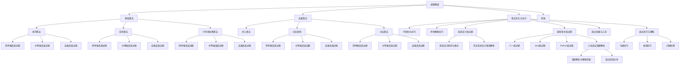

                 

### 《小米2025校招编程面试题精华总结》

#### 文章关键词
- 编程面试
- 算法
- 数据结构
- 系统设计
- 实战解析
- 小米校招

#### 文章摘要
本文旨在为准备参加小米2025校招编程面试的同学们提供一份全面的编程面试题精华总结。文章将按照编程基础、算法、系统设计和编程语言四大模块，逐一深入剖析各类面试题目的解题思路和实战技巧，帮助大家更好地应对校招面试挑战。

---

### 《小米2025校招编程面试题精华总结》目录大纲

#### 第一部分：编程基础与算法
##### 第1章：编程基础
###### 1.1 基础语法
###### 1.2 数据结构与算法概述
###### 1.3 常用算法与数据结构

##### 第2章：基础算法
###### 2.1 排序算法
###### 2.2 查找算法
###### 2.3 字符串处理算法

##### 第3章：高级算法
###### 3.1 贪心算法
###### 3.2 动态规划
###### 3.3 分治算法

##### 第4章：算法优化与技巧
###### 4.1 代码优化技巧
###### 4.2 考场解题技巧

#### 第二部分：编程面试题实战
##### 第5章：算法面试题
###### 5.1 简单难度面试题
###### 5.2 中等难度面试题
###### 5.3 高难度面试题

##### 第6章：系统设计面试题
###### 6.1 系统设计原则与模式
###### 6.2 常见系统设计题目解析

##### 第7章：编程语言面试题
###### 7.1 C++面试题
###### 7.2 Java面试题
###### 7.3 Python面试题

##### 第8章：小米面试真题解析
###### 8.1 真题解析与解题思路
###### 8.2 面试经验分享

#### 第三部分：编程面试准备与技巧
##### 第9章：面试准备与心态
###### 9.1 面试前的准备
###### 9.2 应对策略与心态调整

##### 第10章：面试技巧与策略
###### 10.1 面试中的沟通技巧
###### 10.2 面试中的表现技巧
###### 10.3 面试中的问题处理

#### 附录
##### 附录A：编程面试资源推荐
###### A.1 在线编程平台
###### A.2 算法与数据结构学习资源
###### A.3 编程社区与论坛

### 核心概念与联系

为了帮助读者更好地理解本文的内容结构，以下使用Mermaid流程图来展示各章节之间的逻辑关系：



通过上述流程图，我们可以清晰地看到各个章节之间的关联，为后续内容的展开奠定了基础。

### 编程基础

编程基础是学习任何编程语言和算法的基石。一个良好的编程基础可以帮助开发者更快地理解和掌握更复杂的概念和技能。在这一章节中，我们将介绍编程基础中的一些核心概念，包括基础语法、数据类型、变量和运算符等。

#### 基础语法

编程语言的语法是其结构的重要组成部分，它定义了如何组织代码以及如何使用各种语言元素。常见的编程语言语法包括：

- **变量声明**：变量是用来存储数据的容器。在声明变量时，需要指定其类型和名称。例如，在Python中，可以声明一个整数变量如下：
  ```python
  x = 10
  ```
  
- **条件语句**：条件语句用于根据条件执行不同的代码块。例如，在Python中，可以使用`if`语句来实现：
  ```python
  if x > 10:
      print("x 大于 10")
  ```

- **循环语句**：循环语句用于重复执行代码块。常见的循环有`for`循环和`while`循环。例如，在Python中，`for`循环可以用于遍历列表：
  ```python
  for i in range(5):
      print(i)
  ```

- **函数定义**：函数是组织代码的可重复部分。在Python中，可以定义一个函数如下：
  ```python
  def greet(name):
      print("Hello, " + name)
  ```

#### 数据类型

数据类型是编程语言中用于表示不同类型数据的方式。常见的编程语言数据类型包括：

- **整数（Integer）**：整数是没有小数部分的数。例如，`42`和`100`都是整数。
  
- **浮点数（Float）**：浮点数是带有小数部分的数。例如，`3.14`和`-0.001`都是浮点数。

- **字符串（String）**：字符串是一系列字符组成的序列。例如，`"Hello, World!"`是一个字符串。

- **布尔值（Boolean）**：布尔值是用于表示逻辑值的类型，只有`True`和`False`两种值。

- **列表（List）**：列表是可变长度的有序集合。例如，`[1, 2, 3, 4]`是一个包含四个整数的列表。

- **字典（Dictionary）**：字典是键值对的集合，用于存储关联数据。例如，`{"name": "Alice", "age": 25}`是一个字典。

#### 变量和常量

变量和常量是编程中用于存储数据的两种基本方式。

- **变量**：变量是可以在程序运行过程中更改值的存储位置。例如：
  ```python
  x = 10  # 将变量 x 赋值为 10
  x = x + 5  # 更改变量 x 的值为 15
  ```

- **常量**：常量是值一旦被赋值后就不能更改的变量。例如：
  ```python
  PI = 3.14159  # 将常量 PI 赋值为 3.14159
  ```

#### 运算符

运算符是用于执行特定运算的符号。常见的编程语言运算符包括：

- **算术运算符**：如加法（+）、减法（-）、乘法（*）、除法（/）等。
  ```python
  result = 10 + 5  # result 的值为 15
  ```

- **比较运算符**：如等于（==）、不等于（!=）、大于（>）、小于（<）等。
  ```python
  if x > 10:
      print("x 大于 10")
  ```

- **逻辑运算符**：如与（and）、或（or）、非（not）等。
  ```python
  if x > 10 and x < 20:
      print("x 在 10 到 20 之间")
  ```

通过理解这些编程基础概念，开发者可以更好地编写和理解代码。在接下来的章节中，我们将进一步探讨数据结构和算法，为读者提供更深入的编程知识。

### 数据结构与算法概述

在编程中，数据结构和算法是解决问题的关键要素。数据结构是组织数据的方式，而算法是解决问题的步骤。理解它们的基本概念和关系，有助于我们在编程过程中选择合适的解决方案，提高代码的效率和可维护性。

#### 数据结构

数据结构是编程中用于存储和组织数据的方式。常见的数据结构包括：

- **数组（Array）**：数组是一种线性数据结构，用于存储固定大小的元素序列。它提供快速的随机访问能力，但插入和删除操作相对较慢。

- **链表（Linked List）**：链表是一种由节点组成的线性数据结构，每个节点包含数据和指向下一个节点的指针。链表在插入和删除操作上具有更高的灵活性，但访问时间较长。

- **栈（Stack）**：栈是一种后进先出（LIFO）的数据结构，用于存储元素的顺序。栈在插入和删除元素时通常只需要一个指针指向栈顶。

- **队列（Queue）**：队列是一种先进先出（FIFO）的数据结构，用于存储元素的顺序。队列在插入和删除操作上都提供较好的性能。

- **树（Tree）**：树是一种层次结构，由节点和边组成。树用于表示层次关系，常见的树结构包括二叉树、平衡树等。

- **图（Graph）**：图是一种由节点和边组成的复杂结构，用于表示多个实体之间的连接关系。图可以用于解决路径查找、网络分析等问题。

这些数据结构各有其特点和适用场景。在编程中，选择合适的数据结构可以显著提高算法的效率和可扩展性。

#### 算法

算法是解决问题的步骤序列，用于实现特定功能。算法的核心目标是解决问题或执行特定任务，同时满足特定的性能和约束条件。算法可以分为多种类型，包括：

- **排序算法**：用于对数据进行排序，如冒泡排序、快速排序、归并排序等。

- **查找算法**：用于在数据结构中查找特定元素，如二分查找、线性查找等。

- **图算法**：用于解决图相关的问题，如图遍历、最短路径算法等。

- **动态规划**：用于解决具有重叠子问题和最优子结构特征的问题。

- **贪心算法**：通过每一步选择最优解，以期望得到全局最优解的算法。

- **分治算法**：将问题分解为更小的子问题，分别解决后再合并结果。

算法的性能通常用时间复杂度和空间复杂度来衡量。时间复杂度表示算法执行时间与输入规模的关系，空间复杂度表示算法占用内存与输入规模的关系。选择合适的算法和数据结构，可以显著提高程序的性能。

#### 数据结构、算法与编程的关系

数据结构和算法是编程的核心，它们紧密相连，共同决定了程序的效率和性能。

- **数据结构**为算法提供了操作对象，决定了算法的执行效率和资源消耗。例如，使用数组实现的排序算法通常比链表实现的效率更高。

- **算法**是解决问题的具体步骤，通过利用数据结构的特点，可以设计出更高效的解决方案。例如，二分查找算法在有序数组上具有O(log n)的时间复杂度。

- **编程**是将数据结构和算法应用于实际问题的过程。通过编写代码，将理论转化为可执行的程序。编程不仅仅是实现算法，还包括数据结构的实现和优化。

理解数据结构和算法的基本概念，掌握它们的适用场景，能够帮助我们更好地解决编程问题，提高代码质量和效率。在下一章节中，我们将详细探讨一些常见的基础算法，为读者提供更深入的知识。

### 基础算法

基础算法是解决编程问题的核心，掌握这些算法有助于我们应对各种面试题目。本章将介绍几种常见的基础算法，包括排序算法、查找算法和字符串处理算法。

#### 排序算法

排序算法用于将一组数据按照特定顺序排列。常见的排序算法包括冒泡排序、选择排序、插入排序和快速排序等。

##### 冒泡排序

冒泡排序（Bubble Sort）是一种简单的排序算法，它通过重复遍历要排序的数列，比较相邻的两个元素，若顺序错误则交换它们。遍历数列的工作重复进行，直到没有再需要交换的元素为止。

伪代码：

```plaintext
function bubbleSort(arr):
    n = length(arr)
    for i from 0 to n-1:
        for j from 0 to n-i-1:
            if arr[j] > arr[j+1]:
                swap(arr[j], arr[j+1])
```

例子：

给定数组 `[5, 2, 8, 12, 7]`，使用冒泡排序后的结果为 `[2, 5, 7, 8, 12]`。

##### 快速排序

快速排序（Quick Sort）是一种高效的排序算法，它采用分治策略来对数据进行排序。快速排序选择一个“基准”元素，将数组分为两部分，小于基准的元素放在其左侧，大于基准的元素放在其右侧，然后递归地排序左右两部分。

伪代码：

```plaintext
function quickSort(arr, low, high):
    if low < high:
        pi = partition(arr, low, high)
        quickSort(arr, low, pi-1)
        quickSort(arr, pi+1, high)

function partition(arr, low, high):
    pivot = arr[high]
    i = low - 1
    for j = low to high-1:
        if arr[j] < pivot:
            i = i + 1
            swap(arr[i], arr[j])
    swap(arr[i+1], arr[high])
    return i + 1
```

例子：

给定数组 `[5, 2, 8, 12, 7]`，使用快速排序后的结果为 `[2, 5, 7, 8, 12]`。

#### 查找算法

查找算法用于在数据结构中找到特定元素。常见的查找算法包括线性查找和二分查找。

##### 线性查找

线性查找（Linear Search）是一种简单且直观的查找算法，它从数组的第一个元素开始，逐个比较，直到找到目标元素或到达数组的末尾。

伪代码：

```plaintext
function linearSearch(arr, target):
    for i from 0 to length(arr) - 1:
        if arr[i] == target:
            return i
    return -1
```

例子：

给定数组 `[5, 2, 8, 12, 7]` 和目标元素 `8`，使用线性查找的结果为索引 `2`。

##### 二分查找

二分查找（Binary Search）是一种高效的查找算法，它只适用于有序数组。二分查找通过不断将搜索范围缩小一半，逐步逼近目标元素。

伪代码：

```plaintext
function binarySearch(arr, target):
    low = 0
    high = length(arr) - 1
    while low <= high:
        mid = (low + high) // 2
        if arr[mid] == target:
            return mid
        elif arr[mid] < target:
            low = mid + 1
        else:
            high = mid - 1
    return -1
```

例子：

给定有序数组 `[1, 2, 3, 4, 5, 6, 7, 8, 9, 10]` 和目标元素 `7`，使用二分查找的结果为索引 `6`。

#### 字符串处理算法

字符串处理算法用于处理文本数据，常见的操作包括字符串匹配、字符串转换等。

##### 字符串匹配算法

字符串匹配算法用于找到字符串中的一个子串。常见的字符串匹配算法包括朴素的字符串匹配算法和KMP算法。

##### 朴素的字符串匹配算法

伪代码：

```plaintext
function naiveStringMatch(s, p):
    n = length(s)
    m = length(p)
    for i from 0 to n - m:
        j = 0
        while j < m and s[i + j] == p[j]:
            j = j + 1
        if j == m:
            return i
    return -1
```

例子：

给定字符串 `"ABCDABD"` 和模式 `"ABD"`，使用朴素字符串匹配算法的结果为索引 `2`。

##### KMP算法

KMP算法是一种高效的字符串匹配算法，它通过预计算部分匹配表（Partial Match Table）来避免不必要的比较。

伪代码：

```plaintext
function computeLPSArray(pattern, lps):
    len = length(pattern)
    lps[0] = 0
    len = 0
    i = 1
    while i < len:
        if pattern[i] == pattern[len]:
            lps[i] = len + 1
            len = len + 1
            i = i + 1
        else:
            if len != 0:
                len = lps[len - 1]
                i = i - 1
            else:
                lps[i] = 0
                i = i + 1

function KMPSearch(text, pattern):
    n = length(text)
    m = length(pattern)
    lps = array of size m
    computeLPSArray(pattern, lps)
    i = 0  # index for text
    j = 0  # index for pattern
    while i < n:
        if pattern[j] == text[i]:
            i = i + 1
            j = j + 1
        if j == m:
            return i - j
        elif i < n and pattern[j] != text[i]:
            if j != 0:
                j = lps[j - 1]
            else:
                i = i + 1
    return -1
```

例子：

给定字符串 `"ABCDABD"` 和模式 `"ABD"`，使用KMP算法的结果为索引 `2`。

##### 字符串转换算法

字符串转换算法用于将字符串从一种格式转换为另一种格式，常见的转换包括大小写转换、替换子串等。

伪代码：

```plaintext
function toUpperCase(s):
    for each character c in s:
        if c is a lowercase letter:
            convert c to uppercase
    return s

function replaceSubstring(s, old, new):
    result = empty string
    i = 0
    while i < length(s):
        if s[i...i + length(old) - 1] == old:
            append new to result
            i = i + length(old)
        else:
            append s[i] to result
            i = i + 1
    return result
```

例子：

给定字符串 `"hello world"`，将其转换为全大写的结果为 `"HELLO WORLD"`。将字符串中的 "world" 替换为 "world!" 的结果为 `"hello world!"`。

通过掌握这些基础算法，我们可以更好地解决各种编程问题，提高代码的效率和可维护性。在接下来的章节中，我们将进一步探讨高级算法，为读者提供更深入的知识。

### 高级算法

高级算法在解决复杂问题时具有显著的优势，主要包括贪心算法、动态规划算法和分治算法。这些算法在编程面试中经常被考察，掌握它们有助于应对各种难题。

#### 贪心算法

贪心算法是一种局部最优选择策略，通过每一步选择当前最优解，以期在整体上达到最优解。贪心算法的核心思想是“贪”，即在每一步都做出当前情况下的最佳选择。

##### 贪心算法的基本步骤

1. **初始化**：确定问题的参数和目标。
2. **选择局部最优解**：根据当前状态，选择一个局部最优解。
3. **更新状态**：根据选择的结果更新问题的状态。
4. **判断是否结束**：如果达到结束条件，则结束；否则，继续选择局部最优解。

##### 经典贪心问题

- **零钱兑换**：给定一定数量的硬币，求最少需要多少硬币凑够某个金额。
  
  伪代码：

  ```plaintext
  function coinChange(coins, amount):
      sort coins in ascending order
      result = 0
      for coin in coins:
          while amount >= coin:
              amount = amount - coin
              result = result + 1
          if amount == 0:
              return result
      return -1
  ```

  示例：给定硬币面值为 `[1, 2, 5]`，目标金额为 `11`，最少需要的硬币数量为 `3`（硬币组合为 `[5, 5, 1]`）。

- **活动选择**：给定一系列活动，每个活动有一个开始时间和结束时间，选择最多不相交的活动。

  伪代码：

  ```plaintext
  function activitySelection(activities):
      sort activities by their finish times
      result = []
      lastFinishTime = -infinity
      for activity in activities:
          if activity.start > lastFinishTime:
              result.append(activity)
              lastFinishTime = activity.finish
      return result
  ```

  示例：给定活动列表 `[("1", "3"), ("2", "4"), ("3", "5"), ("4", "6")]`，选择的活动为 `[("1", "3"), ("3", "5"), ("4", "6")]`。

#### 动态规划算法

动态规划是一种解决具有重叠子问题和最优子结构特征问题的方法。动态规划将问题分解为多个子问题，并利用子问题的解来构建原问题的解。

##### 动态规划的基本步骤

1. **定义状态**：确定问题的参数和状态变量。
2. **状态转移方程**：根据状态变量之间的关系，建立递推关系式。
3. **边界条件**：确定递推关系的初始状态。
4. **计算最优解**：根据状态转移方程和边界条件，计算最终的最优解。

##### 经典动态规划问题

- **最长公共子序列（LCS）**：给定两个序列，找到它们最长的公共子序列。

  公式：

  ```latex
  LCS(X, Y) = 
  \begin{cases}
  0 & \text{如果 } m = 0 \text{ 或 } n = 0, \\
  1 & \text{如果 } X[m-1] = Y[n-1], \\
  \max(LCS(X, Y[0..n-2]), LCS(X[0..m-2], Y)), & \text{否则}.
  \end{cases}
  ```

  伪代码：

  ```plaintext
  function LCS(X, Y):
      m = length(X)
      n = length(Y)
      dp = array of size (m+1) x (n+1)
      for i from 0 to m:
          for j from 0 to n:
              if X[i-1] == Y[j-1]:
                  dp[i][j] = dp[i-1][j-1] + 1
              else:
                  dp[i][j] = max(dp[i-1][j], dp[i][j-1])
      return dp[m][n]
  ```

  示例：给定序列 `"AGGTAB"` 和 `"GXTXAYB"`，最长公共子序列为 `"GTAB"`。

- **背包问题**：给定一组物品，每个物品有重量和价值，选择物品装入背包，使得总价值最大化且总重量不超过背包容量。

  公式：

  ```latex
  dp[i][w] = 
  \begin{cases}
  0 & \text{如果 } w = 0 \text{ 或 } i = 0, \\
  dp[i-1][w] & \text{如果 } w < weights[i], \\
  \max(dp[i-1][w], dp[i-1][w - weights[i]] + values[i]), & \text{否则}.
  \end{cases}
  ```

  伪代码：

  ```plaintext
  function knapsack(values, weights, capacity):
      n = length(values)
      dp = array of size (n+1) x (capacity+1)
      for i from 1 to n:
          for w from 0 to capacity:
              if w >= weights[i-1]:
                  dp[i][w] = max(dp[i-1][w], dp[i-1][w - weights[i-1]] + values[i-1])
              else:
                  dp[i][w] = dp[i-1][w]
      return dp[n][capacity]
  ```

  示例：给定价值 `[60, 100, 120]` 和重量 `[10, 20, 30]` 的物品，以及背包容量 `50`，最优解为选择价值为 `220` 的物品组合。

#### 分治算法

分治算法是将一个复杂问题分解成若干个规模较小的相同问题来解决，然后将子问题的解合并为原问题的解。分治算法的核心思想是“分而治之”。

##### 分治算法的基本步骤

1. **分解**：将原问题分解为若干个规模较小的子问题。
2. **递归求解**：递归地解决子问题。
3. **合并**：将子问题的解合并为原问题的解。

##### 经典分治问题

- **归并排序**：归并排序是一种高效的排序算法，它将数组分解成若干个部分，分别排序，然后将排好序的部分合并。

  伪代码：

  ```plaintext
  function mergeSort(arr):
      if length(arr) <= 1:
          return arr
      mid = length(arr) // 2
      left = mergeSort(arr[0...mid-1])
      right = mergeSort(arr[mid...end])
      return merge(left, right)

  function merge(left, right):
      result = empty array
      i = 0
      j = 0
      while i < length(left) and j < length(right):
          if left[i] < right[j]:
              append left[i] to result
              i = i + 1
          else:
              append right[j] to result
              j = j + 1
      while i < length(left):
          append left[i] to result
          i = i + 1
      while j < length(right):
          append right[j] to result
          j = j + 1
      return result
  ```

  示例：给定数组 `[5, 2, 8, 12, 7]`，归并排序后的结果为 `[2, 5, 7, 8, 12]`。

- **快速幂算法**：快速幂算法用于计算大数的幂，通过分治策略减少计算次数。

  伪代码：

  ```plaintext
  function quickPow(base, exponent):
      if exponent == 0:
          return 1
      if exponent % 2 == 0:
          return quickPow(base * base, exponent // 2)
      else:
          return base * quickPow(base, exponent // 2)
  ```

  示例：计算 `2` 的 `10` 次方，结果为 `1024`。

通过掌握这些高级算法，我们可以在编程面试中更好地解决复杂问题。在接下来的章节中，我们将进一步探讨算法优化和考场解题技巧，帮助读者提高解题能力。

### 算法优化与技巧

在编程面试中，算法的效率往往决定了是否能够通过面试。优化算法不仅仅是为了提高程序的运行速度，还可以使代码更简洁，更易于维护。本章节将介绍几种常见的算法优化技巧，以及在考场中解题的技巧。

#### 代码优化技巧

1. **减少时间复杂度**

   - **避免冗余计算**：在代码中避免重复计算相同的值，例如，通过缓存中间结果来减少重复计算。
   - **使用高效的算法**：选择适合问题规模和特点的算法，避免使用复杂度较高的算法。
   - **减少不必要的循环**：通过提前终止循环或使用循环优化技巧来减少不必要的循环执行。

2. **减少空间复杂度**

   - **空间换时间**：在某些情况下，使用额外的空间可以换取更快的执行时间，例如，通过使用哈希表来加速查找操作。
   - **使用常数空间**：在可能的情况下，使用常数空间来存储数据，避免使用额外的数组或数据结构。

3. **内存管理**

   - **避免内存泄漏**：确保在不再需要数据时及时释放内存，避免内存泄漏。
   - **使用合适的数据结构**：选择适合当前问题规模的数据结构，避免使用过于庞大或过于简陋的数据结构。

4. **缓存技术**

   - **使用缓存**：通过缓存中间结果来减少重复计算，提高程序的整体性能。

#### 考场解题技巧

1. **审题仔细**

   - **理解题意**：仔细阅读题目，确保理解问题的要求。
   - **注意边界条件**：注意题目中的边界条件，例如，数组是否为空，输入数据是否在指定范围内。

2. **构思解题思路**

   - **列出可能的解决方案**：在脑海中快速列出几种可能的解决方案，评估它们的优缺点。
   - **选择最佳方案**：选择最合适的方案，并进行详细设计。

3. **动手实现**

   - **编写代码**：根据解题思路，逐步编写代码。
   - **调试代码**：在编写代码的过程中，不断调试和优化。

4. **优化代码**

   - **检查代码效率**：在编写代码后，检查时间复杂度和空间复杂度，确保代码高效。
   - **代码重构**：在确保代码正确的基础上，对代码进行重构，使其更加简洁和易于维护。

5. **总结与反思**

   - **总结解题经验**：在每次面试后，总结解题过程中的经验和教训。
   - **持续改进**：通过不断练习和总结，提高自己的编程能力和解题技巧。

#### 实战示例

##### 题目：两数之和

给定一个整数数组 `nums` 和一个目标值 `target`，请你在该数组中找出和为目标值的那两个整数，并返回他们的数组下标。

优化思路：

- **使用哈希表**：通过哈希表记录已经遍历过的数值及其对应的下标，可以快速找到与当前元素相加等于目标值的另一个元素。

实现代码（Python）：

```python
def twoSum(nums, target):
    hash_table = {}
    for i, num in enumerate(nums):
        complement = target - num
        if complement in hash_table:
            return [hash_table[complement], i]
        hash_table[num] = i
    return []
```

#### 解题思路

- **遍历数组**：遍历数组 `nums`，对于每个元素 `num`，计算其与目标值 `target` 的差值 `complement`。
- **查找哈希表**：在哈希表中查找 `complement` 是否存在，如果存在，返回其对应的下标和当前下标。
- **更新哈希表**：如果 `complement` 不存在，将当前元素及其下标添加到哈希表中。

#### 分析

- **时间复杂度**：O(n)，因为需要遍历数组 `nums`，查找和插入哈希表的时间复杂度为 O(1)。
- **空间复杂度**：O(n)，需要额外的哈希表存储数据。

通过上述优化和实现，我们可以更高效地解决两数之和问题。在接下来的章节中，我们将继续深入探讨编程面试中的算法题目。

### 算法面试题实战

在编程面试中，算法题目是考察应聘者编程能力的重要环节。本文将分类讨论算法面试题，从简单、中等到高难度，分别解析各类题目，帮助读者掌握解题思路和策略。

#### 简单难度面试题

##### 题目1：两数之和

**问题描述**：给定一个整数数组 `nums` 和一个目标值 `target`，请你在该数组中找出和为目标值的那两个整数，并返回他们的数组下标。

**解题思路**：使用哈希表记录已遍历的数值及其对应的下标，对于每个元素 `num`，计算其与目标值 `target` 的差值 `complement`，然后在哈希表中查找 `complement` 是否存在。

**代码实现**（Python）：

```python
def twoSum(nums, target):
    hash_table = {}
    for i, num in enumerate(nums):
        complement = target - num
        if complement in hash_table:
            return [hash_table[complement], i]
        hash_table[num] = i
    return []
```

**复杂度分析**：时间复杂度为 O(n)，空间复杂度为 O(n)。

##### 题目2：搜索插入位置

**问题描述**：给定一个排序数组 `nums` 和一个目标值 `target`，在数组中查找 `target` 的插入位置，确保数组仍保持排序状态。

**解题思路**：使用二分查找法，根据目标值与中间元素的比较，逐步缩小区间范围，直到找到插入位置。

**代码实现**（Python）：

```python
def searchInsert(nums, target):
    left, right = 0, len(nums) - 1
    while left <= right:
        mid = (left + right) // 2
        if nums[mid] == target:
            return mid
        elif nums[mid] < target:
            left = mid + 1
        else:
            right = mid - 1
    return left
```

**复杂度分析**：时间复杂度为 O(log n)，空间复杂度为 O(1)。

#### 中等难度面试题

##### 题目3：最长公共子序列

**问题描述**：给定两个字符串 `text` 和 `pattern`，找出它们的最长公共子序列。

**解题思路**：使用动态规划，定义一个二维数组 `dp`，其中 `dp[i][j]` 表示 `text` 的前 `i` 个字符和 `pattern` 的前 `j` 个字符的最长公共子序列长度。

**代码实现**（Python）：

```python
def longestCommonSubsequence(text, pattern):
    m, n = len(text), len(pattern)
    dp = [[0] * (n + 1) for _ in range(m + 1)]
    for i in range(1, m + 1):
        for j in range(1, n + 1):
            if text[i - 1] == pattern[j - 1]:
                dp[i][j] = dp[i - 1][j - 1] + 1
            else:
                dp[i][j] = max(dp[i - 1][j], dp[i][j - 1])
    return dp[m][n]
```

**复杂度分析**：时间复杂度为 O(mn)，空间复杂度为 O(mn)。

##### 题目4：合并区间

**问题描述**：给定一组区间，合并所有重叠的区间，并返回合并结果。

**解题思路**：首先对区间进行排序，然后遍历排序后的区间，合并重叠的区间。

**代码实现**（Python）：

```python
def merge(intervals):
    if not intervals:
        return []
    intervals.sort()
    result = [intervals[0]]
    for interval in intervals[1:]:
        if result[-1][1] >= interval[0]:
            result[-1][1] = max(result[-1][1], interval[1])
        else:
            result.append(interval)
    return result
```

**复杂度分析**：时间复杂度为 O(n log n)，空间复杂度为 O(n)。

#### 高难度面试题

##### 题目5：买卖股票的最佳时机 IV

**问题描述**：给定一个整数数组 `prices`，其中第 `i` 个元素表示第 `i` 天的股票价格。假设你可以多次买卖股票，但每次买卖股票需要经过一天，求最大利润。

**解题思路**：使用动态规划，定义一个二维数组 `dp[i][j]`，其中 `dp[i][j]` 表示第 `i` 天结束时，状态为 `j` 时的最大利润。

**代码实现**（Python）：

```python
def maxProfit(prices):
    n = len(prices)
    dp = [[0] * 2 for _ in range(n)]
    for i in range(1, n):
        dp[i][0] = max(dp[i - 1][0], dp[i - 1][1] + prices[i])
        dp[i][1] = max(dp[i - 1][1], dp[i - 1][0] - prices[i])
    return dp[n - 1][0]
```

**复杂度分析**：时间复杂度为 O(n)，空间复杂度为 O(1)。

##### 题目6：最长连续序列

**问题描述**：给定一个未排序的整数数组，找出最长的连续序列长度。

**解题思路**：使用哈希表记录每个数字是否已出现，遍历数组，对于每个未出现的数字，尝试扩展序列长度。

**代码实现**（Python）：

```python
def longestConsecutive(nums):
    num_set = set(nums)
    max_length = 0
    for num in num_set:
        if num - 1 not in num_set:
            current_num = num
            current_length = 1
            while current_num + 1 in num_set:
                current_num += 1
                current_length += 1
            max_length = max(max_length, current_length)
    return max_length
```

**复杂度分析**：时间复杂度为 O(n)，空间复杂度为 O(n)。

通过上述实战解析，读者可以更好地理解各类算法面试题的解题思路和策略。在接下来的章节中，我们将进一步探讨系统设计面试题，为读者提供更多有价值的面试技巧。

### 系统设计面试题

系统设计面试题是考察应聘者对系统架构、设计模式和系统性能优化等核心知识的掌握。这类题目不仅需要具备扎实的编程基础，还需要具备系统思维和设计能力。本章节将介绍系统设计原则与模式，并解析一些常见的系统设计面试题。

#### 系统设计原则

1. **模块化原则**：将系统分解为多个模块，每个模块负责一个特定的功能，模块之间通过接口进行通信。

2. **可扩展性原则**：系统设计时需要考虑未来的扩展性，确保在系统规模和需求发生变化时，能够灵活调整。

3. **高可用性原则**：系统需要具备较强的容错能力，在发生故障时能够快速恢复，确保服务的持续可用。

4. **高性能原则**：系统设计时需要关注性能优化，确保在高并发情况下，系统能够稳定运行。

5. **安全性原则**：系统需要具备一定的安全防护能力，防止各种安全威胁，如网络攻击、数据泄露等。

#### 常见系统设计模式

1. **分层模式**：系统按照功能分为多个层次，如表示层、业务逻辑层和数据访问层。层次之间通过接口进行通信。

2. **微服务模式**：将系统分解为多个独立的微服务，每个服务负责一个具体的功能，通过消息队列或API进行通信。

3. **缓存模式**：使用缓存来减少数据库的访问压力，提高系统的响应速度。

4. **分布式存储模式**：将数据存储在多个节点上，实现数据的高可用和快速访问。

5. **负载均衡模式**：通过负载均衡器将请求分配到多个服务器上，实现流量的均衡和系统的扩展。

#### 常见系统设计题目解析

##### 题目1：设计一个在线购物系统

**问题背景**：设计一个支持用户注册、登录、浏览商品、添加购物车、下单和支付功能的在线购物系统。

**设计方案**：

1. **模块划分**：将系统分为用户管理模块、商品管理模块、购物车模块、订单管理模块和支付管理模块。

2. **数据库设计**：设计用户表、商品表、购物车表、订单表和支付表等，存储用户信息、商品信息、购物车数据、订单数据和支付数据。

3. **接口设计**：设计用户管理接口、商品管理接口、购物车接口、订单管理接口和支付管理接口，提供相应的功能操作。

4. **系统架构**：采用分层架构，将表示层、业务逻辑层和数据访问层分开，提高系统的可维护性和扩展性。

5. **性能优化**：使用缓存技术提高商品浏览和查询的速度，使用数据库分片和读写分离提高系统的并发处理能力。

**代码示例**：

以下是一个简单的用户管理模块接口设计（Python）：

```python
class UserManager:
    def register_user(self, username, password):
        # 注册用户
        pass

    def login_user(self, username, password):
        # 用户登录
        pass

    def get_user_info(self, username):
        # 获取用户信息
        pass
```

##### 题目2：设计一个社交媒体系统

**问题背景**：设计一个支持用户注册、登录、发布动态、评论、点赞和私信功能的社交媒体系统。

**设计方案**：

1. **模块划分**：将系统分为用户管理模块、动态管理模块、评论管理模块、点赞管理模块和私信管理模块。

2. **数据库设计**：设计用户表、动态表、评论表、点赞表和私信表等，存储用户信息、动态数据、评论数据、点赞数据和私信数据。

3. **接口设计**：设计用户管理接口、动态管理接口、评论管理接口、点赞管理接口和私信管理接口，提供相应的功能操作。

4. **系统架构**：采用微服务架构，将用户管理服务、动态管理服务、评论管理服务、点赞管理服务和私信管理服务分开部署。

5. **性能优化**：使用消息队列来异步处理点赞和评论操作，使用缓存技术减少数据库的访问压力。

**代码示例**：

以下是一个简单的动态管理模块接口设计（Python）：

```python
class DynamicManager:
    def create_dynamic(self, user_id, content):
        # 发布动态
        pass

    def get_dynamics_by_user(self, user_id):
        # 获取用户发布的动态
        pass

    def like_dynamic(self, user_id, dynamic_id):
        # 点赞动态
        pass

    def comment_dynamic(self, user_id, dynamic_id, content):
        # 评论动态
        pass
```

通过以上解析，我们可以看到系统设计题目需要考虑多个方面，包括模块划分、数据库设计、接口设计和性能优化等。掌握这些核心原则和设计模式，有助于我们更好地应对系统设计面试题。

### 编程语言面试题

在编程面试中，掌握不同编程语言的能力是评估应聘者技术水平的重要指标。本章节将针对C++、Java和Python三种编程语言，介绍一些常见的面试题目，并提供解题思路和代码示例。

#### C++面试题

##### 题目1：内存管理

**问题描述**：解释C++中的内存管理，包括动态分配和回收内存的方式。

**解题思路**：C++中内存管理主要通过`new`和`delete`关键字进行动态分配和回收。此外，还需了解`malloc`和`free`函数，以及智能指针如`unique_ptr`和`shared_ptr`的使用。

**代码示例**：

```cpp
#include <iostream>
#include <memory>

void manageMemory() {
    int* ptr = new int(10);
    std::cout << *ptr << std::endl;  // 输出10
    delete ptr;  // 手动回收内存

    int* ptr2 = (int*)malloc(sizeof(int));
    *ptr2 = 20;
    std::cout << *ptr2 << std::endl;  // 输出20
    free(ptr2);  // 手动回收内存

    std::unique_ptr<int> uptr(new int(30));
    std::cout << *uptr << std::endl;  // 输出30
    // 自动回收内存，不需要调用delete
}

int main() {
    manageMemory();
    return 0;
}
```

##### 题目2：多态

**问题描述**：解释C++中的多态，并提供一个多态的例子。

**解题思路**：C++中多态是通过继承和虚函数实现的。基类和派生类可以有不同的行为，通过基类的指针或引用调用虚函数，可以实现动态绑定。

**代码示例**：

```cpp
#include <iostream>

class Base {
public:
    virtual void display() {
        std::cout << "Base display" << std::endl;
    }
};

class Derived : public Base {
public:
    void display() override {
        std::cout << "Derived display" << std::endl;
    }
};

int main() {
    Base* b = new Derived();
    b->display();  // 输出Derived display
    delete b;
    return 0;
}
```

#### Java面试题

##### 题目1：垃圾回收

**问题描述**：解释Java中的垃圾回收机制。

**解题思路**：Java中的垃圾回收是通过垃圾回收器（GC）自动进行的。GC的主要目标是回收不再使用的对象，通过标记-清除算法或复制算法实现。

**代码示例**：

```java
public class GarbageCollection {
    public static void main(String[] args) {
        String str = new String("Hello");
        str = null;  // str 变量不再引用该对象
        
        // 假设在这里进行垃圾回收
        System.gc();  // 强制进行垃圾回收
    }
}
```

##### 题目2：多线程

**问题描述**：解释Java中的多线程，并提供一个多线程的例子。

**解题思路**：Java中多线程通过`Thread`类或实现`Runnable`接口创建。多线程可以并行执行任务，提高程序的响应速度。

**代码示例**：

```java
public class MultiThread {
    public static void main(String[] args) {
        Thread t1 = new Thread(new MyRunnable());
        Thread t2 = new Thread(new MyRunnable());
        t1.start();
        t2.start();
    }
}

class MyRunnable implements Runnable {
    @Override
    public void run() {
        System.out.println("Thread running");
    }
}
```

#### Python面试题

##### 题目1：内存管理

**问题描述**：解释Python中的内存管理。

**解题思路**：Python中的内存管理主要依赖于解释器和垃圾回收机制。内存分配和回收是自动进行的，通过引用计数和循环检测来管理内存。

**代码示例**：

```python
a = [1, 2, 3]  # 分配内存
del a  # 删除引用，触发垃圾回收
```

##### 题目2：协程

**问题描述**：解释Python中的协程，并提供一个协程的例子。

**解题思路**：Python中的协程通过生成器（`yield`关键字）实现，可以暂停和恢复执行，实现并发操作。

**代码示例**：

```python
def coroutine():
    print("Coroutine started")
    while True:
        x = (yield)
        print("Received:", x)

coro = coroutine()
next(coro)  # 激活协程
coro.send("Hello")  # 向协程发送消息
```

通过以上面试题的解析，读者可以更好地掌握C++、Java和Python的核心知识点，为编程面试做好准备。

### 小米面试真题解析

在准备小米2025校招编程面试时，了解一些实际面试真题以及解题思路是非常重要的。本文将分享一些小米面试中的经典真题，并提供详细的解题思路和代码实现，帮助读者更好地应对面试挑战。

#### 题目1：最长公共子序列（LCS）

**问题描述**：给定两个字符串 `text` 和 `pattern`，找出它们的最长公共子序列。

**解题思路**：使用动态规划算法解决。定义一个二维数组 `dp`，其中 `dp[i][j]` 表示 `text` 的前 `i` 个字符和 `pattern` 的前 `j` 个字符的最长公共子序列长度。

**代码实现**（Python）：

```python
def longestCommonSubsequence(text, pattern):
    m, n = len(text), len(pattern)
    dp = [[0] * (n + 1) for _ in range(m + 1)]

    for i in range(1, m + 1):
        for j in range(1, n + 1):
            if text[i - 1] == pattern[j - 1]:
                dp[i][j] = dp[i - 1][j - 1] + 1
            else:
                dp[i][j] = max(dp[i - 1][j], dp[i][j - 1])
    
    return dp[m][n]

text = "AGGTAB"
pattern = "GXTXAYB"
print(longestCommonSubsequence(text, pattern))  # 输出 4
```

#### 题目2：背包问题

**问题描述**：给定一组物品，每个物品有重量和价值，选择物品装入背包，使得总价值最大化且总重量不超过背包容量。

**解题思路**：使用动态规划算法解决。定义一个二维数组 `dp`，其中 `dp[i][w]` 表示在前 `i` 个物品中，总重量不超过 `w` 的最大价值。

**代码实现**（Python）：

```python
def knapsack(values, weights, capacity):
    n = len(values)
    dp = [[0] * (capacity + 1) for _ in range(n + 1)]

    for i in range(1, n + 1):
        for w in range(1, capacity + 1):
            if weights[i - 1] <= w:
                dp[i][w] = max(dp[i - 1][w], dp[i - 1][w - weights[i - 1]] + values[i - 1])
            else:
                dp[i][w] = dp[i - 1][w]
    
    return dp[n][capacity]

values = [60, 100, 120]
weights = [10, 20, 30]
capacity = 50
print(knapsack(values, weights, capacity))  # 输出 220
```

#### 题目3：最长连续序列

**问题描述**：给定一个未排序的整数数组，找出最长的连续序列长度。

**解题思路**：使用哈希表记录每个数字是否已出现，遍历数组，对于每个未出现的数字，尝试扩展序列长度。

**代码实现**（Python）：

```python
def longestConsecutive(nums):
    num_set = set(nums)
    max_length = 0
    for num in num_set:
        if num - 1 not in num_set:
            current_num = num
            current_length = 1
            while current_num + 1 in num_set:
                current_num += 1
                current_length += 1
            max_length = max(max_length, current_length)
    
    return max_length

nums = [100, 4, 200, 1, 3, 2]
print(longestConsecutive(nums))  # 输出 4
```

#### 题目4：两数之和

**问题描述**：给定一个整数数组 `nums` 和一个目标值 `target`，找出和为目标值的那两个整数，并返回它们的数组下标。

**解题思路**：使用哈希表记录已遍历的数值及其对应的下标，对于每个元素 `num`，计算其与目标值 `target` 的差值 `complement`，然后在哈希表中查找 `complement` 是否存在。

**代码实现**（Python）：

```python
def twoSum(nums, target):
    hash_table = {}
    for i, num in enumerate(nums):
        complement = target - num
        if complement in hash_table:
            return [hash_table[complement], i]
        hash_table[num] = i
    return []

nums = [2, 7, 11, 15]
target = 9
print(twoSum(nums, target))  # 输出 [0, 1]
```

#### 面试经验分享

在参加小米面试的过程中，以下几点经验值得分享：

1. **充分准备**：提前了解公司的业务和技术方向，针对面试题进行充分的准备和练习。

2. **思维清晰**：在面试过程中，保持思路清晰，逐步讲解解题思路，避免跳跃性思维。

3. **代码优化**：在实现代码时，注重代码的效率和可读性，并进行必要的代码优化。

4. **沟通能力**：良好的沟通能力有助于更好地传达解题思路，也与面试官建立良好的互动。

通过以上真题解析和经验分享，相信读者可以更好地应对小米的编程面试。

### 编程面试准备与心态

#### 面试前的准备

1. **基础知识复习**：复习编程语言的基础语法、数据结构、算法等知识，确保对这些概念有清晰的理解。

2. **刷题实践**：通过在线编程平台（如LeetCode、牛客网等）刷题，积累实际解题经验。

3. **项目经验积累**：准备一些与面试公司业务相关的项目经验，能够在面试中展示实际能力。

4. **了解公司文化**：了解应聘公司的文化、业务和核心技术，以便在面试中表现出对公司的兴趣和热情。

5. **模拟面试**：与朋友或同事进行模拟面试，提高应对实际面试的自信和应对能力。

#### 应对策略与心态调整

1. **冷静应对**：在面试过程中，保持冷静，遇到难题不要慌乱，逐步分析问题。

2. **清晰表达**：清晰、准确地表达解题思路，避免语言模糊或逻辑混乱。

3. **积极提问**：在面试过程中，适当提问，了解面试官对问题的期望，展示对问题的思考。

4. **心态调整**：保持积极乐观的心态，面对失败和挑战时，学会调整心态，总结经验。

5. **持续学习**：面试不是终点，面试后继续学习和提升，不断完善自己的技术和能力。

### 面试技巧与策略

#### 面试中的沟通技巧

1. **主动沟通**：在面试开始时，主动与面试官打招呼，建立良好的第一印象。

2. **倾听与反馈**：仔细倾听面试官的问题，给予恰当的反馈，表明自己正在认真思考。

3. **简洁明了**：回答问题时，尽量简洁明了，避免冗长的解释。

4. **表达清晰**：使用清晰、准确的措辞，避免模糊或含糊的表达。

#### 面试中的表现技巧

1. **自信稳重**：在面试过程中，保持自信和稳重，避免过分紧张或慌乱。

2. **展示专业能力**：通过实例和项目经验展示自己在编程和系统设计方面的专业能力。

3. **展示团队协作能力**：在面试中，提及自己在团队项目中的角色和贡献，展示团队合作能力。

4. **展示学习意愿**：表达对新技术和新知识的强烈兴趣，展示自我提升的意愿。

#### 面试中的问题处理

1. **问题理解不清**：及时询问面试官，确保自己对问题的理解准确。

2. **难题应对**：遇到难题时，保持冷静，逐步分析问题，展示自己的思考过程。

3. **时间管理**：在回答问题时，注意时间管理，确保回答完整且准确。

4. **总结与反思**：在面试结束时，对面试过程进行简要总结，表达对面试官和公司的感谢。

### 最佳实践 tips

1. **提前准备**：提前准备面试，熟悉常见面试题和解决方案。

2. **练习编程**：通过刷题和编程实践，提高编程能力和解题技巧。

3. **注重细节**：在编写代码时，注意代码质量和性能优化。

4. **积极沟通**：在面试中积极与面试官沟通，展示良好的沟通能力。

5. **持续学习**：面试后，继续学习新技术和知识，保持进步。

### 小结

通过本文的详细解析和实战示例，读者可以更好地了解小米2025校招编程面试的各个部分，包括编程基础、算法、系统设计和编程语言面试题。同时，本文还提供了面试准备和技巧，帮助读者顺利通过面试。希望本文对您的编程面试之路有所帮助。

### 附录：编程面试资源推荐

为了帮助准备编程面试的读者，本文推荐一些优质的在线编程平台、算法与数据结构学习资源以及编程社区与论坛。

#### 在线编程平台

1. **LeetCode**：提供丰富的编程面试题库，支持多种编程语言，是面试准备的不二之选。
   - 网址：[LeetCode](https://leetcode.com/)

2. **牛客网**：涵盖大量企业面试题库，适合国内求职者。
   - 网址：[牛客网](https://www.nowcoder.com/)

3. **HackerRank**：提供各种编程挑战和竞赛题目，适合提升编程能力。
   - 网址：[HackerRank](https://www.hackerrank.com/)

#### 算法与数据结构学习资源

1. **《算法导论》（Introduction to Algorithms）**：经典算法教材，适合系统学习算法和数据结构。
   - 作者：Thomas H. Cormen, Charles E. Leiserson, Ronald L. Rivest, Clifford Stein
   - 网址：[MIT OpenCourseWare](https://ocw.mit.edu/courses/electrical-engineering-and-computer-science/6-006-introduction-to-algorithms-fall-2014/)

2. **《编程之美》（Cracking the Coding Interview）**：详细讲解编程面试中的常见问题和解决方案。
   - 作者：Gayle Laakmann McDowell
   - 网址：[Amazon](https://www.amazon.com/Cracking-Coding-Interview-6th-Ed/dp/0984782855)

3. **《算法竞赛入门经典》（Algorithmic Problems and Concepts in Contest Programming）**：适合竞赛编程爱好者。
   - 作者：Ural B.
   - 网址：[Amazon](https://www.amazon.com/Algorithmic-Problems-Concepts-Contest-Programming/dp/1846280368)

#### 编程社区与论坛

1. **Stack Overflow**：全球最大的开发社区，适合解决编程中的各种问题。
   - 网址：[Stack Overflow](https://stackoverflow.com/)

2. **GitHub**：开源社区，可以查看和学习各种开源项目的代码。
   - 网址：[GitHub](https://github.com/)

3. **CSDN**：中国最大的IT社区和服务平台，提供丰富的编程资源和讨论。
   - 网址：[CSDN](https://www.csdn.net/)

通过使用这些资源和平台，读者可以系统地学习和提升自己的编程能力和面试技巧。希望这些推荐对您的编程面试之旅有所帮助。

