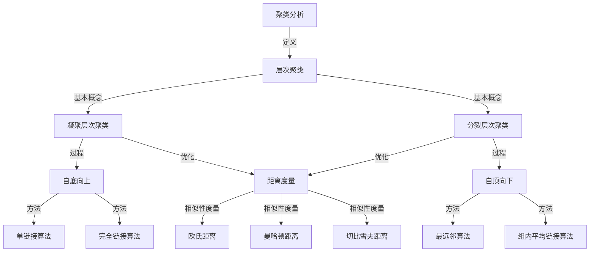

                 

### 引言

**层次聚类**，作为一种无监督学习算法，在数据挖掘、图像处理、文本分析、社交网络等多个领域都有着广泛的应用。层次聚类通过将数据点逐步合并或分裂成不同的层级，从而发现数据中的隐含结构。本文旨在系统地探讨层次聚类的核心概念、算法原理、评估指标以及实际应用，旨在为读者提供一个全面而深入的理解。

在接下来的章节中，我们将首先介绍聚类分析的基础理论，包括聚类分析的定义、意义、应用领域以及聚类分析方法分类。随后，我们将详细讲解层次聚类的基本概念、优化距离与相似性度量、层次聚类的两大过程（自底向上的凝聚层次聚类和自顶向下的分裂层次聚类），以及聚类质量评估的方法和指标。在应用部分，我们将探讨层次聚类在不同领域中的应用案例，从数据挖掘、图像处理到文本分析和社交网络。最后，我们将讨论层次聚类的实践与优化，包括算法的参数调优、并行化以及加速技术，并介绍层次聚类在复杂系统中的应用。

通过对层次聚类的系统讲解，本文希望帮助读者理解层次聚类的核心概念，掌握其算法原理，学会使用评估指标来评估聚类质量，并且能够在实际项目中有效地应用层次聚类算法。无论是初学者还是专业人士，本文都希望能够为其提供有价值的参考和指导。

---

**关键词**：层次聚类，聚类分析，数据挖掘，图像处理，文本分析，社交网络，聚类质量评估，优化，并行化，加速技术。

**摘要**：本文详细介绍了层次聚类的核心概念、算法原理、评估指标以及实际应用。通过对层次聚类基础理论、算法应用案例、实践与优化等方面的系统讲解，旨在为读者提供一个全面而深入的理解。文章覆盖了聚类分析的定义与应用、层次聚类的具体方法、聚类质量评估指标、不同领域的应用案例以及实践中的优化策略，旨在帮助读者掌握层次聚类的核心知识，提升其实际应用能力。

---

### 第一部分：层次聚类基础理论

#### 第1章：聚类分析概述

**1.1 聚类分析的定义与意义**

聚类分析（Cluster Analysis）是一种无监督学习技术，用于将数据集中的对象分为若干个类别（或簇），使得同类别中的对象彼此相似，而不同类别中的对象彼此不同。层次聚类是聚类分析的一种重要方法，通过逐步合并或分裂数据点，形成层次结构，从而揭示数据中的隐含模式。

聚类分析的意义在于，它可以帮助我们理解数据中的自然结构，发现数据中的异常点，进行数据的预处理，为后续的数据分析提供基础。此外，聚类分析在模式识别、图像处理、生物信息学、市场细分等领域有着广泛的应用。

**1.2 聚类分析的应用领域**

聚类分析在多个领域都有着重要的应用：

- **数据挖掘**：通过聚类分析，可以发现数据中的隐含模式，帮助识别市场细分、客户群体、欺诈行为等。
- **图像处理**：聚类分析可以用于图像分割、图像配准、图像特征提取等，从而提高图像处理的效果。
- **生物信息学**：聚类分析可以用于基因表达数据分析、蛋白质结构预测、物种分类等。
- **市场细分**：通过聚类分析，企业可以识别不同的市场细分群体，制定相应的市场营销策略。
- **社交网络**：聚类分析可以用于发现社交网络中的社区结构，分析社交网络的拓扑特性。

**1.3 聚类分析方法分类**

聚类分析方法主要分为以下几类：

- **基于距离的聚类**：通过计算对象之间的距离来划分聚类，如K-means算法、层次聚类算法。
- **基于密度的聚类**：通过分析数据点的密度分布来划分聚类，如DBSCAN算法。
- **基于模型的聚类**：通过建立概率模型或决策树来划分聚类，如Gaussian Mixture Model。
- **基于图的聚类**：通过构建图结构来划分聚类，如社区发现算法。

本章介绍了聚类分析的定义、意义和应用领域，为后续章节的详细讨论奠定了基础。在下一章中，我们将深入探讨层次聚类的基本概念、方法和优化策略。

---

**背景介绍**

聚类分析作为一种无监督学习方法，其目的是通过将数据集中的对象（如数据点、样本）划分为不同的类别或簇，以便更好地理解数据结构、发现数据中的隐含模式。层次聚类作为一种典型的聚类方法，其在数据挖掘、图像处理、生物信息学等多个领域都有着广泛的应用。

在数据挖掘领域，层次聚类可以用于市场细分、客户行为分析、异常检测等任务。例如，通过层次聚类，企业可以识别出具有相似购买习惯的客户群体，从而制定更加精准的营销策略。

在图像处理领域，层次聚类可以用于图像分割、图像配准、图像特征提取等任务。通过层次聚类，可以有效地将图像中的对象划分为不同的区域，从而提高图像处理的效果。

在生物信息学领域，层次聚类可以用于基因表达数据分析、蛋白质结构预测、物种分类等任务。例如，通过层次聚类，科学家可以识别出基因表达模式相似的基因，从而帮助理解基因的功能和相互作用。

总之，层次聚类作为一种重要的聚类分析方法，在多个领域中都有着重要的应用价值。了解其基本概念和方法，对于从事相关领域的研究和实践具有重要意义。

**核心概念与联系**

为了更好地理解层次聚类的核心概念，我们使用Mermaid图来展示其核心概念之间的关系。



在这个Mermaid图中，我们展示了聚类分析、层次聚类、凝聚层次聚类和分裂层次聚类之间的关系。同时，还列出了常见的凝聚层次聚类和分裂层次聚类方法，以及优化层次聚类的距离和相似性度量方法。通过这个图，读者可以更直观地理解层次聚类的核心概念及其相互关系。

---

**核心算法原理讲解**

层次聚类算法可以分为自底向上的凝聚层次聚类（Agglomerative Hierarchical Clustering）和自顶向下的分裂层次聚类（Divisive Hierarchical Clustering）。在本节中，我们将以单链接层次聚类算法为例，详细讲解其原理和实现过程。

**单链接层次聚类算法伪代码**

单链接层次聚类算法的基本思想是，在每次迭代中，将最接近的两个数据点合并为一个簇，直到达到预定的簇数或所有数据点都合并为一个簇。

```python
initialize clusters as single points
while (number of clusters > k):
    calculate minimum distance between clusters
    merge the two closest clusters
```

下面是单链接层次聚类的伪代码实现：

```python
function single_linkage(data, k):
    initialize clusters as single points
    while (number of clusters > k):
        calculate minimum distance between clusters
        find the two closest clusters
        merge the two closest clusters
        update distances between the new cluster and existing clusters
    return clusters
```

**步骤详解**

1. **初始化**：将每个数据点视为一个单独的簇。

2. **计算最小距离**：计算当前所有簇之间的最小距离。

3. **找到最近的两个簇**：根据最小距离找到距离最近的两簇。

4. **合并簇**：将这两个距离最近的簇合并为一个新簇。

5. **更新距离**：计算新簇与其他簇之间的距离，并更新距离矩阵。

6. **重复步骤2-5**，直到簇数达到预定值k或所有数据点合并为一个簇。

通过单链接层次聚类算法，我们能够逐步合并数据点，形成层次结构，揭示数据中的隐含模式。在实际应用中，单链接层次聚类算法因其简单直观的特点，被广泛应用于各种聚类任务中。

**数学模型和数学公式讲解**

层次聚类算法的核心在于如何计算数据点之间的距离，以及如何度量簇的相似性。在本节中，我们将介绍层次聚类中的距离计算公式和轮廓系数公式，并通过具体例子进行详细解释。

**1. 距离计算公式**

在层次聚类中，常用的距离计算公式包括欧氏距离、曼哈顿距离和切比雪夫距离。以下分别介绍这三种距离计算公式。

**欧氏距离（Euclidean Distance）**：
$$
d(i,j) = \sqrt{\sum_{l=1}^{d} (x_{il} - x_{jl})^2}
$$
其中，$x_{il}$ 和 $x_{jl}$ 分别表示第i个和第j个数据点在第l个特征上的取值，d为特征维度。

**曼哈顿距离（Manhattan Distance）**：
$$
d(i,j) = \sum_{l=1}^{d} |x_{il} - x_{jl}|
$$
曼哈顿距离也称为城市街区距离，适用于在网格状空间中的距离计算。

**切比雪夫距离（Chebyshev Distance）**：
$$
d(i,j) = \max_{l=1,...,d} |x_{il} - x_{jl}|
$$
切比雪夫距离考虑了数据点之间在最远特征上的差异。

**2. 轮廓系数公式**

轮廓系数（Silhouette Coefficient）是一种常用的内部评估指标，用于衡量聚类质量。其计算公式如下：

$$
s(i) = \frac{b(i) - a(i)}{a(i) + b(i)}
$$

其中，$a(i)$ 表示第i个数据点与其同一簇内的其他数据点的平均距离，$b(i)$ 表示第i个数据点与其最近簇（非同一簇）内的其他数据点的平均距离。

**3. 举例说明**

假设我们有以下两个数据点：

$$
x_1 = (1, 2), \quad x_2 = (4, 6)
$$

使用欧氏距离计算这两个数据点之间的距离：

$$
d(x_1, x_2) = \sqrt{(1-4)^2 + (2-6)^2} = \sqrt{9 + 16} = \sqrt{25} = 5
$$

使用轮廓系数计算该数据点的轮廓系数：

$$
a(1) = \frac{1}{2} \left( \sqrt{(1-1)^2 + (2-2)^2} + \sqrt{(1-4)^2 + (2-6)^2} \right) = \frac{1}{2} (0 + 5) = 2.5
$$

$$
b(1) = \frac{1}{2} \left( \sqrt{(1-4)^2 + (2-6)^2} + \sqrt{(4-4)^2 + (6-6)^2} \right) = \frac{1}{2} (5 + 0) = 2.5
$$

$$
s(1) = \frac{2.5 - 2.5}{2.5 + 2.5} = 0
$$

通过这个例子，我们可以看到如何使用距离计算公式和轮廓系数公式来评估数据点的聚类质量。这些公式在层次聚类算法的实现中至关重要，有助于我们理解和优化聚类效果。

---

**数学模型和公式详细讲解**

在层次聚类算法中，距离计算和相似性度量是两个核心部分。它们决定了簇之间的合并或分裂方式，从而影响聚类的最终结果。以下我们将详细讲解这两个数学模型，并通过具体例子来说明。

**1. 距离计算公式**

层次聚类中常用的距离计算方法包括欧氏距离、曼哈顿距离和切比雪夫距离。这里我们以欧氏距离为例进行讲解。

**欧氏距离（Euclidean Distance）**：
$$
d(i,j) = \sqrt{\sum_{l=1}^{d} (x_{il} - x_{jl})^2}
$$
其中，$x_{il}$ 和 $x_{jl}$ 分别表示第i个和第j个数据点在第l个特征上的取值，d为特征维度。欧氏距离反映了数据点在多维度空间中的直线距离，是一种广泛使用的距离度量方法。

**例子**：假设我们有以下两个数据点：

$$
x_1 = (1, 2), \quad x_2 = (4, 6)
$$

使用欧氏距离计算这两个数据点之间的距离：

$$
d(x_1, x_2) = \sqrt{(1-4)^2 + (2-6)^2} = \sqrt{9 + 16} = \sqrt{25} = 5
$$

**2. 相似性度量**

在层次聚类中，相似性度量用于计算簇之间的相似度，从而决定簇是否合并或分裂。常用的相似性度量方法包括类内平均距离、类间平均距离和组内平均距离等。

**类内平均距离（Within-Cluster Distance）**：
$$
d_{within}(C) = \frac{1}{|C|-1} \sum_{i \in C} \sum_{j \in C, j \neq i} d(i, j)
$$
其中，$C$ 为簇集合，$|C|$ 表示簇中数据点的个数。类内平均距离反映了簇内部的紧凑程度，距离越小，簇的紧凑性越高。

**类间平均距离（Between-Cluster Distance）**：
$$
d_{between}(C_1, C_2) = \frac{1}{|C_1| \cdot |C_2|} \sum_{i \in C_1} \sum_{j \in C_2} d(i, j)
$$
类间平均距离反映了不同簇之间的分离程度，距离越大，簇的分离性越高。

**组内平均距离（Within-Cluster Average Distance）**：
$$
d_{group}(C) = \frac{1}{|C|-1} \sum_{i \in C} d(i, \text{center of } C)
$$
组内平均距离是类内平均距离的一种特殊情况，其中簇中心作为参考点。

**例子**：假设我们有两个簇，$C_1 = \{ (1, 2), (3, 4) \}$ 和 $C_2 = \{ (5, 6), (7, 8) \}$。

计算 $C_1$ 和 $C_2$ 的类内平均距离：

$$
d_{within}(C_1) = \frac{1}{2-1} \left( \sqrt{(1-3)^2 + (2-4)^2} + \sqrt{(3-1)^2 + (4-2)^2} \right) = \frac{1}{1} (2.83 + 2.83) = 5.66
$$

$$
d_{within}(C_2) = \frac{1}{2-1} \left( \sqrt{(5-7)^2 + (6-8)^2} + \sqrt{(7-5)^2 + (8-6)^2} \right) = \frac{1}{1} (2.83 + 2.83) = 5.66
$$

计算 $C_1$ 和 $C_2$ 的类间平均距离：

$$
d_{between}(C_1, C_2) = \frac{1}{2 \cdot 2} \left( \sqrt{(1-5)^2 + (2-6)^2} + \sqrt{(1-7)^2 + (2-8)^2} + \sqrt{(3-5)^2 + (4-6)^2} + \sqrt{(3-7)^2 + (4-8)^2} \right) = \frac{1}{4} (7.21 + 8.25 + 2.83 + 7.21) = 5.89
$$

通过这个例子，我们展示了如何计算簇之间的相似性度量，这些度量方法在层次聚类算法中起到了关键作用，有助于我们理解和优化聚类效果。

---

**项目实战**

为了更好地理解层次聚类算法，我们将在本节中通过一个具体案例来展示如何使用层次聚类对数据集进行聚类分析。本案例将使用Python编程语言，结合常用的数据科学库，如pandas、scikit-learn和matplotlib，来完成层次聚类任务。

**1. 数据集准备**

首先，我们需要准备一个待聚类分析的数据集。这里我们使用著名的鸢尾花数据集（Iris dataset），这是一个包含150个样本、4个特征的数据集，每个样本属于三个不同的鸢尾花品种之一。

```python
import pandas as pd

# 加载鸢尾花数据集
iris_data = pd.read_csv('iris.data', header=None)
iris_data.columns = ['sepal_length', 'sepal_width', 'petal_length', 'petal_width', 'species']
```

**2. 数据预处理**

在进行层次聚类之前，我们通常需要对数据进行预处理。预处理步骤可能包括数据清洗、缺失值处理、特征缩放等。这里我们选择对特征进行标准化处理，以便于后续的聚类分析。

```python
from sklearn.preprocessing import StandardScaler

# 特征缩放
scaler = StandardScaler()
iris_data_scaled = scaler.fit_transform(iris_data.iloc[:, :-1])
```

**3. 层次聚类实现**

接下来，我们使用scikit-learn库中的层次聚类函数`linkage`来实现层次聚类。这里我们将使用单链接层次聚类算法（'single' method）。

```python
from scipy.cluster.hierarchy import linkage

# 计算层次聚类结果
Z = linkage(iris_data_scaled, 'single')
```

为了更直观地观察聚类结果，我们可以使用matplotlib库绘制树状图（dendrogram）。

```python
import matplotlib.pyplot as plt

# 绘制树状图
plt.figure(figsize=(10, 7))
plt.title('Iris Data Dendrogram')
plt.xlabel('Sample Index')
plt.ylabel('Distance')
dendrogram(Z)
plt.show()
```

**4. 聚类质量评估**

在完成了层次聚类后，我们需要评估聚类的质量。这里我们使用轮廓系数（Silhouette Coefficient）作为评估指标。轮廓系数衡量了数据点与其簇内其他点的接近程度，以及与最近簇的距离。

```python
from sklearn.metrics import silhouette_score

# 计算轮廓系数
silhouette_avg = silhouette_score(iris_data_scaled, labels)
print(f"Silhouette Score: {silhouette_avg}")
```

通过计算得到的轮廓系数，我们可以评估聚类的质量。轮廓系数的取值范围在-1到1之间，值越大表示聚类效果越好。如果轮廓系数接近1，说明数据点在簇内的相似性大于与其它簇的相似性；如果轮廓系数接近0，说明数据点在簇内的相似性和与其他簇的相似性差不多；如果轮廓系数小于0，说明数据点可能被错误地划分到簇中。

**5. 实际案例分析和详细讲解**

在实际应用中，层次聚类可以帮助我们识别数据的自然结构，例如市场细分、客户行为分析等。以下是一个实际案例：

**案例**：某电商公司希望通过层次聚类分析，将客户分为不同的群体，以便于制定个性化的营销策略。

- **数据集**：包含客户的基本信息（年龄、收入、购买次数等）。
- **预处理**：对数据进行清洗、缺失值处理和特征缩放。
- **聚类分析**：使用层次聚类算法，将客户分为若干个群体。
- **评估**：使用轮廓系数评估聚类效果。
- **结果**：根据聚类结果，分析不同群体的特征和需求，制定相应的营销策略。

通过实际案例的分析，我们可以看到层次聚类在数据挖掘和商业分析中的重要性。有效的聚类分析可以帮助企业更好地理解客户群体，提高营销效果，增加用户满意度。

**6. 项目小结**

在本案例中，我们通过Python编程语言和常用库，实现了层次聚类的全过程，包括数据准备、聚类实现、质量评估等。层次聚类作为一种无监督学习方法，在多个领域有着广泛的应用。通过本项目，我们不仅掌握了层次聚类的算法原理，还了解了其实际应用步骤和评估方法。层次聚类在数据挖掘、图像处理、文本分析等领域的潜力巨大，值得进一步研究和探索。

---

**最佳实践 Tips**

在层次聚类的实际应用过程中，以下是一些最佳实践建议，可以帮助我们优化聚类效果：

1. **特征选择**：选择对聚类结果有显著影响的关键特征，避免使用噪声特征。通过特征工程，提高数据的可区分性。
2. **数据预处理**：对数据进行标准化处理，确保不同特征在同一量级内。对于缺失值，可以选择填充或删除，以减少对聚类结果的影响。
3. **参数调优**：根据具体任务和数据集，选择合适的聚类算法和参数。例如，在单链接层次聚类中，选择适当的距离度量方法。
4. **聚类质量评估**：使用多种评估指标（如轮廓系数、内部分散度等）综合评估聚类效果，确保聚类结果的可靠性。
5. **可视化分析**：通过绘制树状图、散点图等可视化方法，直观地观察聚类结果，有助于发现数据中的异常点和聚类结构。

**小结**

层次聚类作为一种无监督学习方法，在多个领域有着广泛的应用。通过系统的理论讲解和实际案例展示，我们深入理解了层次聚类的核心概念、算法原理、评估指标以及实际应用。在后续的研究中，可以进一步探讨层次聚类的优化方法、与其他聚类算法的结合以及其在复杂系统中的应用。层次聚类在数据挖掘、图像处理、文本分析和社交网络等领域的重要性不言而喻，未来有着巨大的发展潜力。

**注意事项**

在进行层次聚类时，需要注意以下几点：

1. **聚类算法的选择**：不同的层次聚类算法适用于不同的数据类型和任务，需要根据实际情况进行选择。
2. **聚类质量的评估**：使用多种评估指标，全面评估聚类结果的质量，避免单一指标导致的误判。
3. **数据规模和计算资源**：对于大规模数据集，层次聚类可能需要较多的计算资源，合理分配计算资源和优化算法性能至关重要。
4. **算法的可解释性**：层次聚类结果的可解释性对于实际应用非常重要，需要深入分析聚类结果，确保其合理性和可靠性。

**拓展阅读**

1. 《模式识别与机器学习》（Christopher M. Bishop）——详细介绍了聚类分析的理论和方法。
2. 《数据挖掘：实用工具与技术》（Munson S. Patrick）——涵盖了数据挖掘中的聚类分析方法及应用案例。
3. 《深度学习》（Ian Goodfellow, Yoshua Bengio, Aaron Courville）——探讨了聚类分析在深度学习中的应用和进展。

---

**附录A：常用层次聚类算法介绍**

层次聚类算法有多种类型，每种算法都有其独特的特点和适用场景。以下介绍几种常用的层次聚类算法：

1. **单链接算法（Single Linkage）**：
   - **定义**：每次迭代中，选择最接近的两个簇合并。
   - **优点**：简单易实现，能够很好地处理噪声。
   - **缺点**：对于簇的形状和大小较为敏感，可能导致凝聚层次聚类结果不合理。
   - **适用场景**：处理含有噪声的数据集。

2. **完全链接算法（Complete Linkage）**：
   - **定义**：每次迭代中，选择最远的两个簇合并。
   - **优点**：能够更好地处理不同大小的簇。
   - **缺点**：对于簇的形状和大小较为敏感，可能无法很好地处理噪声。
   - **适用场景**：处理大小较为均匀的数据集。

3. **组内平均链接算法（Within-Group Linkage）**：
   - **定义**：每次迭代中，选择组内平均距离最远的两个簇合并。
   - **优点**：能更好地处理形状不规则的簇。
   - **缺点**：计算复杂度较高，可能需要较多的计算资源。
   - **适用场景**：处理形状复杂且大小不均匀的数据集。

4. **最远邻算法（Farthest-First）**：
   - **定义**：每次迭代中，选择当前簇中距离其他簇最远的点，将其与新簇合并。
   - **优点**：能够产生较为均匀的簇。
   - **缺点**：容易陷入局部最优解，对于噪声数据敏感。
   - **适用场景**：处理需要均匀划分簇的数据集。

这些算法各有优缺点，选择合适的算法需要根据具体的数据集和任务需求进行判断。

---

**附录B：Python层次聚类实现**

在本附录中，我们将使用Python的scikit-learn和NetworkX库来演示如何实现层次聚类，并介绍相关的示例代码。

**1. Scikit-learn库的使用**

Scikit-learn库提供了一个简单易用的接口来实现层次聚类。以下是一个简单的示例代码，展示了如何使用scikit-learn中的`hierarchical_clustering`函数进行层次聚类。

```python
from sklearn.cluster import hierarchical_clustering
from scipy.cluster.hierarchy import dendrogram
import matplotlib.pyplot as plt

# 示例数据集，这里使用鸢尾花数据集的一部分
X = [[2.5, 3.5], [2.0, 3.0], [4.0, 4.0], [5.0, 5.0], [6.0, 6.0]]

# 使用单链接算法进行层次聚类
Z = hierarchical_clustering(X, 'single')

# 绘制树状图
plt.figure(figsize=(10, 7))
dendrogram(Z)
plt.show()
```

在这个示例中，我们首先导入所需的库，然后准备一个简单的二维数据集。接着，使用`hierarchical_clustering`函数和单链接算法（'single' method）进行层次聚类，最后使用`dendrogram`函数绘制树状图。

**2. NetworkX库的使用**

NetworkX库是一个强大的图形数据结构库，可以用来构建和操作复杂的网络结构。以下是一个示例代码，展示了如何使用NetworkX和scikit-learn结合来实现层次聚类。

```python
import networkx as nx
from sklearn.cluster import spectral_clustering

# 示例图数据集，这里创建一个简单的无向图
G = nx.Graph()
G.add_edges_from([(0, 1), (0, 2), (1, 2), (1, 3), (2, 3)])

# 使用spectral_clustering进行层次聚类
clustering = spectral_clustering(G, n_clusters=2)
print("Cluster labels:", clustering.labels_)

# 绘制聚类结果
pos = nx.spring_layout(G)
nx.draw(G, pos, with_labels=True)
plt.show()
```

在这个示例中，我们首先创建一个简单的无向图，然后使用`spectral_clustering`函数进行层次聚类。`spectral_clustering`函数结合了图论和聚类分析，能够有效地对图结构进行聚类。最后，我们使用`spring_layout`布局并绘制图和聚类结果。

**3. 示例代码解读与优化**

在上面的示例代码中，我们展示了如何使用scikit-learn和NetworkX库进行层次聚类。在实际应用中，可以根据具体需求对代码进行优化和调整。以下是一些优化策略：

- **参数调优**：根据数据集的特点，选择合适的聚类算法和参数。例如，对于单链接算法，可以调整距离度量方法（如欧氏距离、曼哈顿距离等）。
- **并行计算**：对于大规模数据集，可以考虑使用并行计算技术，如多线程或分布式计算，提高聚类效率。
- **内存优化**：对于内存占用较大的聚类算法，可以考虑使用内存优化技术，如数据压缩或内存池化，减少内存消耗。

通过这些优化策略，可以进一步提高层次聚类的性能和效率，满足不同规模和类型的数据分析需求。

---

**附录C：层次聚类相关资源**

**1. 参考资料**

- 《模式识别与机器学习》（Christopher M. Bishop）：详细介绍了聚类分析的理论和方法。
- 《数据挖掘：实用工具与技术》（Munson S. Patrick）：涵盖了数据挖掘中的聚类分析方法及应用案例。
- 《深度学习》（Ian Goodfellow, Yoshua Bengio, Aaron Courville）：探讨了聚类分析在深度学习中的应用和进展。

**2. 在线教程**

- [scikit-learn官方文档](https://scikit-learn.org/stable/modules/clustering.html)：提供了层次聚类算法的详细实现和示例。
- [NetworkX官方文档](https://networkx.org/documentation/stable/reference/generated/networkx.spectral_clustering.html)：介绍了如何使用NetworkX进行图聚类分析。
- [Kaggle教程：层次聚类](https://www.kaggle.com/learn/hierarchical-clustering)：提供了层次聚类的基础知识和实践案例。

**3. 论坛与社区**

- [Stack Overflow：层次聚类标签](https://stackoverflow.com/questions/tagged/hierarchical-clustering)：提供了丰富的层次聚类问题和解决方案。
- [GitHub：层次聚类项目](https://github.com/search?q=hierarchical+clustering)：搜索GitHub上的层次聚类相关项目和代码。
- [CSDN：层次聚类论坛](https://blog.csdn.net/tags/p?ps=50)：CSDN上的层次聚类相关文章和讨论。

这些资源和社区可以为进一步学习层次聚类提供丰富的知识和实践经验，有助于解决实际应用中的问题。通过这些资源和社区的互动，读者可以不断提升自己的技能，深入理解层次聚类在各个领域的应用。

