                 

### 文章标题：2024年小米社招技术面试题集锦

> 关键词：小米社招面试，技术面试题，操作系统，计算机组成，数据结构与算法，数据库与存储，前端开发，后端开发，系统设计与优化，案例分析，面试模拟与准备

> 摘要：本文将为您提供2024年小米社招技术面试的全面解析，涵盖操作系统、网络、计算机组成与架构、数据结构与算法、数据库与存储、前端开发、后端开发、系统设计与优化等多个技术领域。通过本篇文章，您将了解到小米面试的重点内容、常见问题及应对策略，助您成功通过面试，加入小米团队。

### 《2024年小米社招技术面试题集锦》目录大纲

#### 第一部分：面试准备

- 第1章：技术面试基础知识
  - 1.1 面试流程与心态调整
    - 1.1.1 小米面试流程介绍
    - 1.1.2 应对面试的心态调整
  - 1.2 技术栈与基础知识
    - 1.2.1 常见技术栈分析
    - 1.2.2 技术基础回顾
  - 1.3 编程实践与算法准备
    - 1.3.1 算法题常见题型
    - 1.3.2 编程实践技巧

#### 第二部分：技术面试实战

- 第2章：操作系统与网络
  - 2.1 操作系统
    - 2.1.1 进程与线程
    - 2.1.2 内存管理
    - 2.1.3 文件系统
    - 2.1.4 虚拟内存
  - 2.2 网络
    - 2.2.1 TCP/IP协议栈
    - 2.2.2 HTTP协议
    - 2.2.3 DNS解析
    - 2.2.4 网络安全

- 第3章：计算机组成与架构
  - 3.1 计算机组成
    - 3.1.1 CPU架构
    - 3.1.2 缓存机制
    - 3.1.3 存储器层次结构
  - 3.2 计算机架构
    - 3.2.1 RISC与CISC
    - 3.2.2 ARM与X86
    - 3.2.3 异构计算

- 第4章：数据结构与算法
  - 4.1 数据结构
    - 4.1.1 线性表
    - 4.1.2 栈与队列
    - 4.1.3 链表
    - 4.1.4 树与图
  - 4.2 算法
    - 4.2.1 排序算法
    - 4.2.2 搜索算法
    - 4.2.3 算法复杂度分析

- 第5章：数据库与存储
  - 5.1 数据库
    - 5.1.1 SQL基础
    - 5.1.2 关系型数据库
    - 5.1.3 非关系型数据库
    - 5.1.4 数据库设计
  - 5.2 存储
    - 5.2.1 文件存储
    - 5.2.2 分布式存储
    - 5.2.3 存储优化策略

- 第6章：前端开发
  - 6.1 HTML与CSS
    - 6.1.1 HTML基础
    - 6.1.2 CSS基础
    - 6.1.3 布局与响应式设计
  - 6.2 JavaScript
    - 6.2.1 基本语法
    - 6.2.2 异步编程
    - 6.2.3 ES6新特性
  - 6.3 前端框架
    - 6.3.1 React
    - 6.3.2 Vue.js
    - 6.3.3 Angular

- 第7章：后端开发
  - 7.1 后端框架
    - 7.1.1 Spring Boot
    - 7.1.2 Django
    - 7.1.3 Flask
  - 7.2 微服务
    - 7.2.1 微服务架构
    - 7.2.2 服务注册与发现
    - 7.2.3 服务熔断与限流
  - 7.3 API设计
    - 7.3.1 RESTful API设计
    - 7.3.2 GraphQL设计

- 第8章：系统设计与优化
  - 8.1 系统设计原则
    - 8.1.1 单一职责原则
    - 8.1.2 开放封闭原则
    - 8.1.3 里氏替换原则
    - 8.1.4 接口隔离原则
    - 8.1.5 依赖倒置原则
  - 8.2 系统优化策略
    - 8.2.1 性能优化
    - 8.2.2 稳定性优化
    - 8.2.3 可扩展性优化
  - 8.3 持续集成与持续部署
    - 8.3.1 Jenkins
    - 8.3.2 GitLab CI/CD
    - 8.3.3 持续集成与持续部署流程设计

#### 第三部分：案例分析

- 第9章：小米技术案例解析
  - 9.1 小米AI技术解析
    - 9.1.1 小米AI战略
    - 9.1.2 小米AI技术应用案例
  - 9.2 小米电商技术解析
    - 9.2.1 小米电商架构
    - 9.2.2 小米电商技术亮点
  - 9.3 小米物联网技术解析
    - 9.3.1 物联网架构
    - 9.3.2 物联网技术在小米的应用

#### 第四部分：面试模拟与准备

- 第10章：面试模拟与准备
  - 10.1 面试常见问题汇总
    - 10.1.1 技术问题
    - 10.1.2 行为问题
    - 10.1.3 应聘者自我介绍
  - 10.2 面试策略与技巧
    - 10.2.1 如何准备面试
    - 10.2.2 如何应对压力
    - 10.2.3 如何展示自己
  - 10.3 面试复盘与总结
    - 10.3.1 面试后如何复盘
    - 10.3.2 总结经验与改进方向

#### 第五部分：附录

- 附录A：面试资料与资源推荐

## 第一部分：面试准备

### 第1章：技术面试基础知识

#### 1.1 面试流程与心态调整

在准备小米社招技术面试时，了解面试流程和调整心态是非常关键的。这不仅有助于您在面试中更好地应对，还能提高面试的成功率。

#### 1.1.1 小米面试流程介绍

小米面试流程主要包括以下几个环节：

1. **在线申请**：首先，您需要通过小米官方网站或招聘平台提交在线申请，填写个人信息和简历。
2. **简历筛选**：招聘团队会根据简历筛选合适的候选人，评估候选人的背景、经验和技能。
3. **电话面试**：通过简历筛选的候选人会接到电话面试通知，电话面试主要评估候选人的基本技能和沟通能力。
4. **技术面试**：技术面试分为线上和线下两种形式，主要考察候选人的技术深度和广度。
5. **HR面试**：技术面试通过后，候选人会进行HR面试，主要评估候选人的职业素养和团队合作能力。
6. **终面**：HR面试通过后，候选人将进入终面环节，通常由公司高层领导进行面试。
7. **录用通知**：终面通过后，候选人将收到小米的录用通知，签订劳动合同。

#### 1.1.2 应对面试的心态调整

1. **自信**：在面试过程中，自信是非常重要的。通过自信的展示，可以让面试官对您有更好的印象。
2. **谦虚**：即使您对自己的技术能力非常自信，也要保持谦虚的态度。认真倾听面试官的问题，并给予合理的回答。
3. **积极**：积极的心态有助于您在面试中更好地表现。对于遇到的问题，尽量给予积极的解决方案。
4. **耐心**：面试过程可能较长，耐心是非常重要的。在等待面试的过程中，可以适当休息，调整状态。

#### 1.2 技术栈与基础知识

在面试过程中，了解常见的技术栈和基础知识是非常重要的。以下是一些常见的技术栈和基础知识：

1. **操作系统**：Linux、Windows、macOS等。
2. **网络**：TCP/IP协议栈、HTTP协议、DNS解析等。
3. **数据库**：MySQL、MongoDB、Redis等。
4. **编程语言**：Java、Python、C++、JavaScript等。
5. **前端框架**：React、Vue.js、Angular等。
6. **后端框架**：Spring Boot、Django、Flask等。
7. **数据结构与算法**：数组、链表、树、图、排序算法、搜索算法等。

#### 1.3 编程实践与算法准备

1. **编程实践**：在实际开发中，编程实践是非常重要的。通过编写代码，可以更好地理解技术原理，提高编程能力。
2. **算法准备**：算法是面试中经常考察的内容。常见的算法题包括排序、搜索、动态规划等。建议您通过刷题网站（如LeetCode）进行练习，提高算法能力。

#### 总结

在准备小米社招技术面试时，需要了解面试流程、调整心态，掌握常见技术栈和基础知识，并进行编程实践与算法准备。通过以上步骤，相信您能够更好地应对面试，成功加入小米团队。

## 第2章：操作系统与网络

操作系统和网络是计算机系统中的重要组成部分，掌握操作系统和网络的相关知识对于技术面试来说至关重要。以下是关于操作系统与网络的一些核心概念和面试常考知识点。

### 2.1 操作系统

操作系统是管理计算机硬件与软件资源的系统软件，它是计算机系统的核心。以下是一些操作系统相关的核心概念：

#### 2.1.1 进程与线程

进程（Process）是计算机中正在运行的程序实例，是资源分配和独立运行的基本单位。线程（Thread）是进程中的执行路径，是程序中能够运行的最小单元。它们之间的关系如下：

- **进程**：一个进程可以包含多个线程，它们共享进程的资源，如内存、文件句柄等。
- **线程**：同一进程中的多个线程可以并行执行，提高程序的并发性。

以下是一个简单的进程与线程关系的Mermaid流程图：

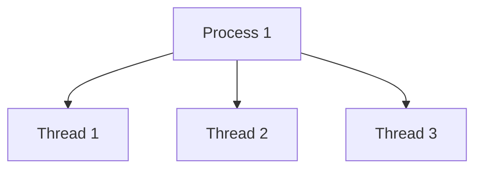

#### 2.1.2 内存管理

内存管理是操作系统的一个重要功能，它负责分配和回收内存资源。以下是一些内存管理的核心概念：

- **内存分配策略**：常见的内存分配策略包括首次适配、最佳适配、最坏适配等。
- **内存回收**：内存回收是指操作系统回收不再使用的内存空间，以便重新分配给其他进程。
- **虚拟内存**：虚拟内存是一种内存管理技术，它通过将一部分硬盘空间模拟为内存，提供更大的内存空间。

以下是一个简单的虚拟内存工作原理的Mermaid流程图：

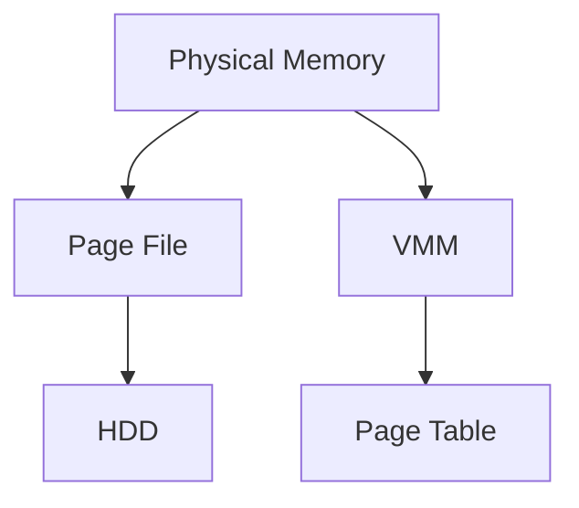

#### 2.1.3 文件系统

文件系统是操作系统用于存储和管理文件的机制。以下是一些文件系统的核心概念：

- **文件**：文件是数据存储的基本单位，可以是文本文件、图像文件等。
- **目录**：目录用于组织和管理文件，可以包含多个文件和子目录。
- **文件权限**：文件权限用于控制对文件的访问权限，如读、写、执行等。

以下是一个简单的文件系统结构的Mermaid流程图：

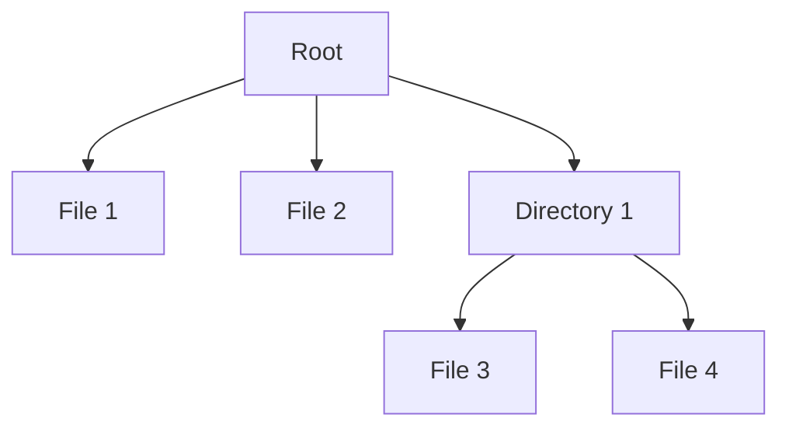

#### 2.1.4 虚拟内存

虚拟内存是操作系统提供的一种内存管理技术，它通过将一部分硬盘空间模拟为内存，提供更大的内存空间。以下是一些虚拟内存的核心概念：

- **分页**：分页是将内存划分为固定大小的块（称为页），以便进行管理和分配。
- **页表**：页表是内存管理的一种数据结构，用于映射虚拟地址和物理地址。
- **页面替换算法**：页面替换算法用于在内存不足时选择哪些页面进行替换，常见的页面替换算法包括先进先出（FIFO）、最近最少使用（LRU）等。

以下是一个简单的虚拟内存页面替换算法的Mermaid流程图：

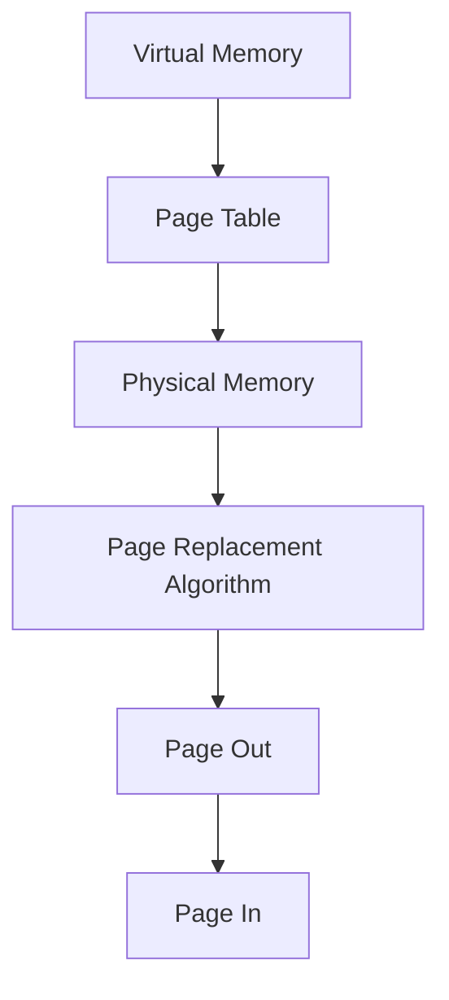

### 2.2 网络

网络是连接计算机系统的重要手段，它使得计算机之间能够进行通信和资源共享。以下是一些网络相关的核心概念：

#### 2.2.1 TCP/IP协议栈

TCP/IP协议栈是一种网络协议集，用于实现网络通信。以下是一些TCP/IP协议栈的核心概念：

- **TCP**：传输控制协议（TCP）是一种可靠的、面向连接的协议，用于数据传输。
- **IP**：互联网协议（IP）是一种无连接的协议，用于数据包的传输和路由。
- **DNS**：域名系统（DNS）用于将域名解析为IP地址。

以下是一个简单的TCP/IP协议栈工作原理的Mermaid流程图：

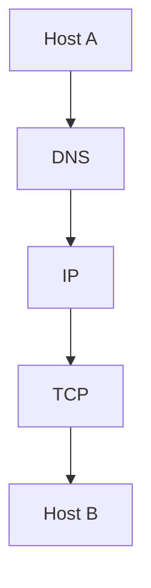

#### 2.2.2 HTTP协议

HTTP（超文本传输协议）是一种应用层协议，用于Web浏览器和服务器之间的通信。以下是一些HTTP协议的核心概念：

- **请求**：客户端向服务器发送请求，包括请求行、请求头和请求体。
- **响应**：服务器向客户端返回响应，包括状态行、响应头和响应体。
- **GET和POST方法**：GET和POST是HTTP协议中的两种常用方法，分别用于获取和提交数据。

以下是一个简单的HTTP请求和响应的Mermaid流程图：

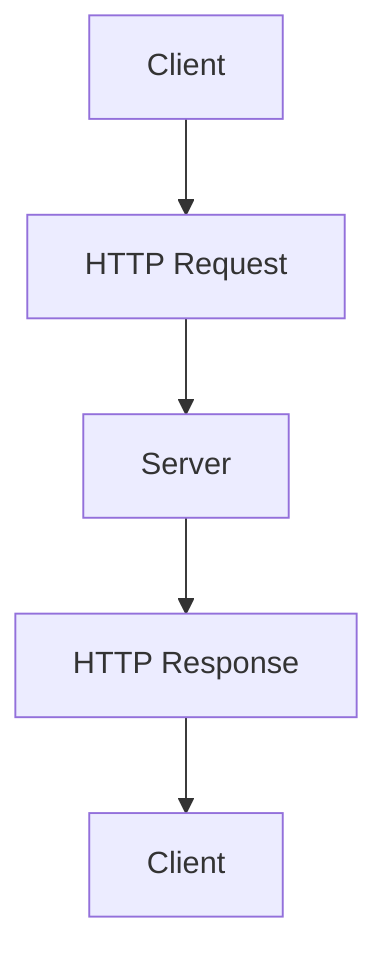

#### 2.2.3 DNS解析

DNS解析是将域名解析为IP地址的过程。以下是一些DNS解析的核心概念：

- **DNS查询**：DNS查询是指客户端向DNS服务器请求域名解析的过程。
- **DNS缓存**：DNS缓存用于存储最近解析的域名和对应的IP地址，以提高查询效率。

以下是一个简单的DNS解析流程的Mermaid流程图：

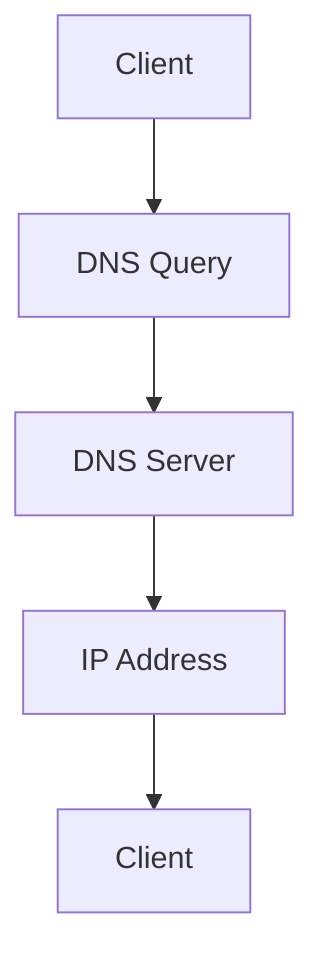

#### 2.2.4 网络安全

网络安全是保护计算机网络免受攻击和恶意行为的重要手段。以下是一些网络安全的核心概念：

- **防火墙**：防火墙是一种网络安全设备，用于控制网络流量，防止未经授权的访问。
- **加密**：加密是一种将数据转换为不可读形式的技术，以保护数据的安全。
- **认证**：认证是验证用户身份的过程，以确保只有授权用户可以访问系统。

以下是一个简单的网络安全架构的Mermaid流程图：

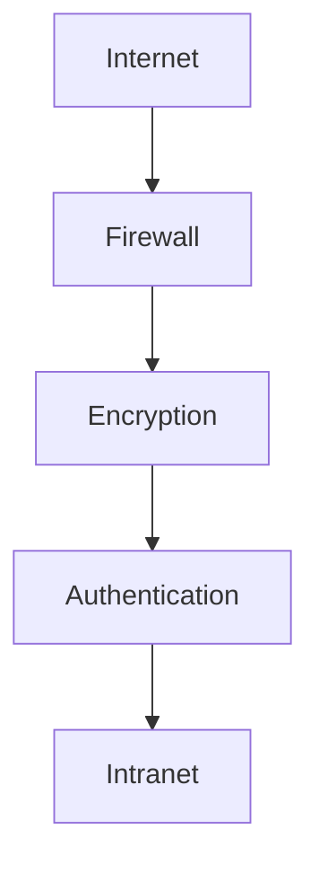

#### 总结

操作系统和网络是计算机系统中的重要组成部分，掌握操作系统和网络的相关知识对于技术面试至关重要。在本章节中，我们介绍了操作系统和网络的一些核心概念，包括进程与线程、内存管理、文件系统、虚拟内存、TCP/IP协议栈、HTTP协议、DNS解析和网络安全。通过这些内容的学习，相信您能够更好地应对技术面试中的相关问题。

## 第3章：计算机组成与架构

计算机组成与架构是计算机科学中的重要分支，它涉及计算机硬件和软件的组成及其相互作用。在本章中，我们将深入探讨计算机组成与架构的核心概念，包括CPU架构、缓存机制、存储器层次结构等，并探讨RISC与CISC的异同点以及ARM与X86的区别，最后介绍异构计算的概念。

### 3.1 计算机组成

计算机组成是指计算机硬件的基本组成部分及其工作原理。以下是一些核心概念：

#### 3.1.1 CPU架构

CPU（中央处理器）是计算机的核心部件，负责执行计算机程序。CPU架构是指CPU的内部组成和工作方式。以下是一些常见的CPU架构：

- **RISC（精简指令集计算机）**：RISC架构采用简化的指令集，每个指令执行时间较短，具有较高的指令执行效率。常见的RISC处理器包括ARM、MIPS等。
- **CISC（复杂指令集计算机）**：CISC架构采用复杂的指令集，支持更多高级指令，但每个指令的执行时间较长。常见的CISC处理器包括Intel的x86系列处理器。

以下是一个简单的RISC与CISC架构对比的Mermaid流程图：

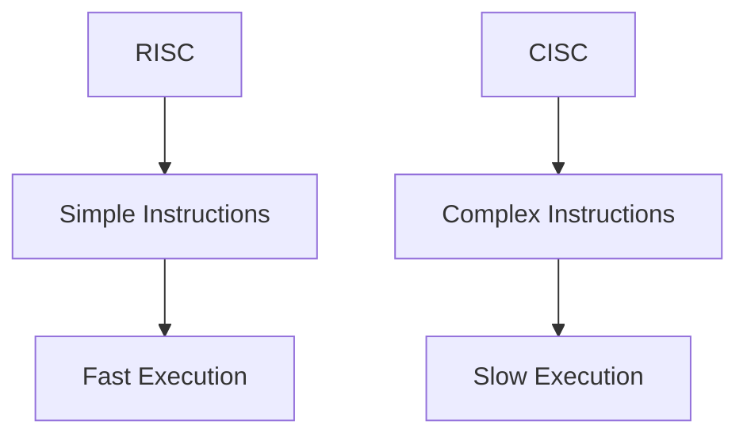

#### 3.1.2 缓存机制

缓存（Cache）是位于CPU和主存之间的临时存储器，用于提高数据访问速度。缓存机制包括以下核心概念：

- **缓存行（Cache Line）**：缓存行是缓存中存储数据的基本单位，通常与主存中的一个区块大小相同。
- **缓存一致性（Cache Coherence）**：当多个处理器共享同一块内存时，缓存一致性机制确保每个处理器的缓存中的数据保持一致。

以下是一个简单的缓存一致性的Mermaid流程图：

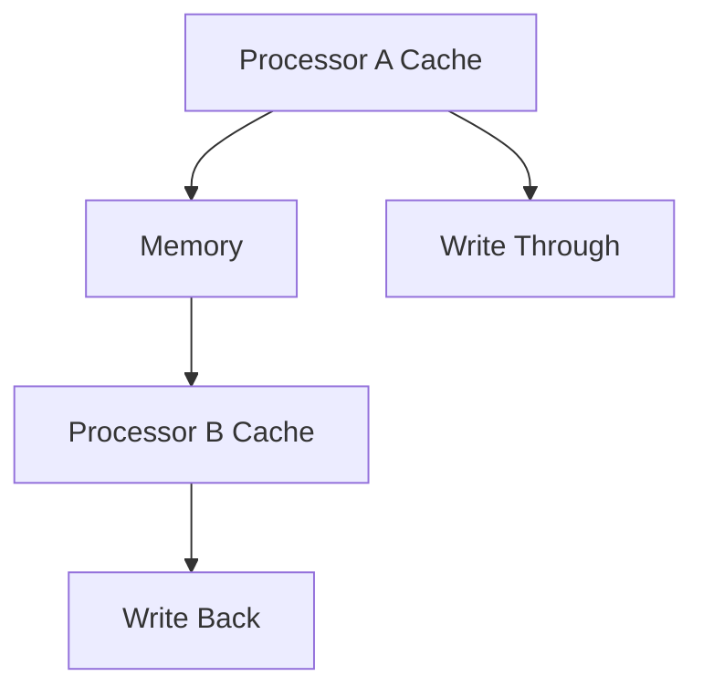

#### 3.1.3 存储器层次结构

存储器层次结构是计算机存储系统的组织方式，包括多个层次，从高速缓存到低速存储设备。以下是一些核心概念：

- **寄存器（Register）**：寄存器是CPU内部的高速存储单元，用于存储操作数和中间结果。
- **主存（Main Memory）**：主存是计算机系统中的主要存储设备，用于存储正在运行的程序和数据。
- **辅助存储（Secondary Storage）**：辅助存储包括硬盘、固态硬盘等，用于存储长期数据。

以下是一个简单的存储器层次结构的Mermaid流程图：

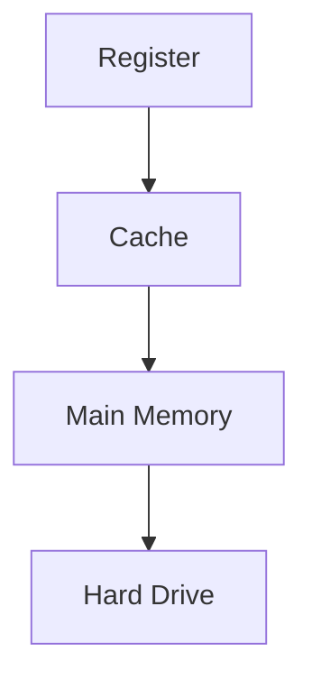

### 3.2 计算机架构

计算机架构是指计算机硬件的整体结构和功能。以下是一些核心概念：

#### 3.2.1 RISC与CISC

RISC（精简指令集计算机）和CISC（复杂指令集计算机）是两种不同的计算机架构，它们的区别如下：

- **指令集大小**：RISC架构采用较小的指令集，每个指令执行时间较短；CISC架构采用较大的指令集，支持更多高级指令。
- **硬件设计**：RISC架构依赖于硬件简化，具有较高的指令执行效率；CISC架构依赖于复杂的硬件设计，指令执行时间较长。

以下是一个简单的RISC与CISC架构对比的Mermaid流程图：

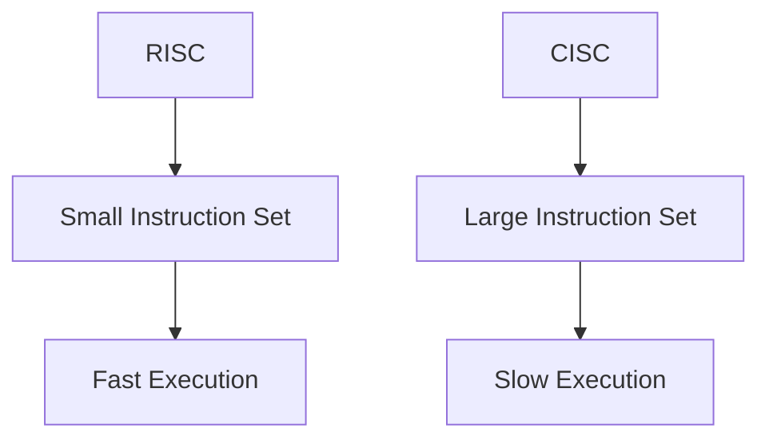

#### 3.2.2 ARM与X86

ARM和X86是两种常见的处理器架构，它们的区别如下：

- **架构类型**：ARM是RISC架构，而X86是CISC架构。
- **性能**：ARM处理器通常具有较低的功耗和较高的能效，而X86处理器在性能方面具有优势。
- **应用场景**：ARM处理器广泛应用于移动设备和嵌入式系统，而X86处理器广泛应用于桌面电脑和服务器。

以下是一个简单的ARM与X86架构对比的Mermaid流程图：

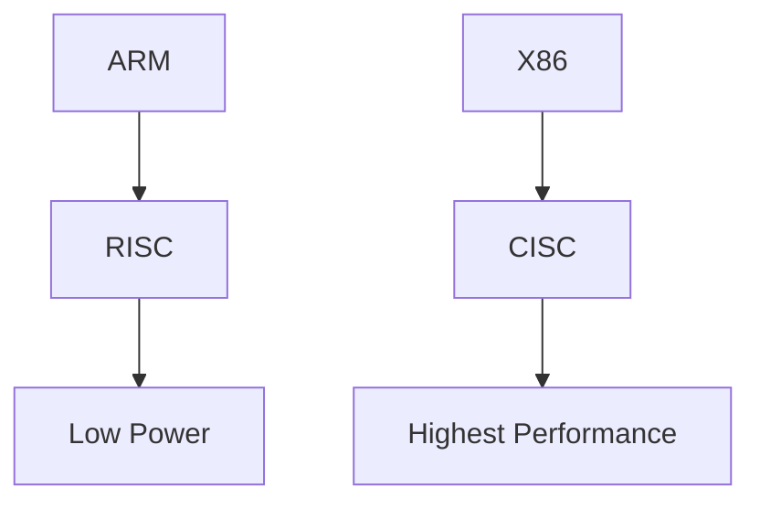

#### 3.2.3 异构计算

异构计算是指使用不同类型的处理器（如CPU、GPU、FPGA等）协同工作，以实现更高的计算性能和能效。以下是一些核心概念：

- **异构计算架构**：异构计算架构包括多个处理单元，每个单元具有不同的计算能力和特点。
- **任务调度**：任务调度是将计算任务分配给不同处理单元的过程，以实现高效计算。

以下是一个简单的异构计算架构的Mermaid流程图：

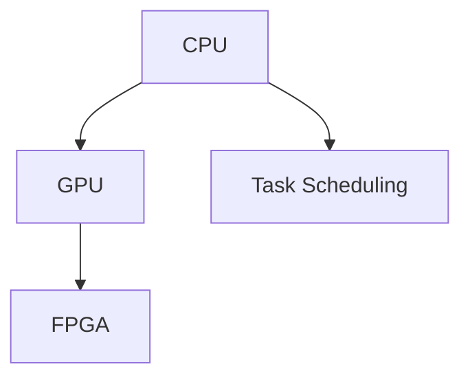

#### 总结

计算机组成与架构是计算机科学中的核心内容，它涵盖了CPU架构、缓存机制、存储器层次结构、RISC与CISC的异同点、ARM与X86的区别以及异构计算的概念。通过本章的学习，您将更好地理解计算机硬件的基本组成和工作原理，为技术面试打下坚实的基础。

## 第4章：数据结构与算法

数据结构与算法是计算机科学中两个至关重要的概念。数据结构是指数据的组织方式，而算法则是解决问题的一系列步骤。掌握合适的数据结构和算法，能够帮助我们更高效地解决问题，提高程序的运行效率。

### 4.1 数据结构

数据结构是组织数据的方式，它们在计算机科学中扮演着重要角色。以下是一些常见的数据结构：

#### 4.1.1 线性表

线性表是一种数据结构，用于存储一系列元素。线性表具有以下特点：

- **顺序存储**：元素按照一定的顺序存储在连续的内存空间中。
- **访问顺序**：线性表中的元素按照存储顺序进行访问。

以下是一个简单的线性表实现的伪代码：

```python
class LinearTable:
    def __init__(self, size):
        self.size = size
        self.elements = [None] * size

    def append(self, element):
        if self.size < len(self.elements):
            self.elements[self.size] = element
            self.size += 1

    def insert(self, index, element):
        if index >= 0 and index < self.size:
            for i in range(self.size, index, -1):
                self.elements[i] = self.elements[i - 1]
            self.elements[index] = element
            self.size += 1

    def delete(self, index):
        if index >= 0 and index < self.size:
            for i in range(index, self.size - 1):
                self.elements[i] = self.elements[i + 1]
            self.size -= 1
```

#### 4.1.2 栈与队列

栈和队列是两种特殊的线性表，具有特定的插入和删除规则。

- **栈**：栈是一种后进先出（Last In First Out，LIFO）的数据结构。常见的操作包括压栈（push）和出栈（pop）。
- **队列**：队列是一种先进先出（First In First Out，FIFO）的数据结构。常见的操作包括入队（enqueue）和出队（dequeue）。

以下是一个简单的栈和队列实现的伪代码：

```python
class Stack:
    def __init__(self):
        self.items = []

    def push(self, item):
        self.items.append(item)

    def pop(self):
        if not self.isEmpty():
            return self.items.pop()

    def isEmpty(self):
        return len(self.items) == 0

class Queue:
    def __init__(self):
        self.items = []

    def enqueue(self, item):
        self.items.append(item)

    def dequeue(self):
        if not self.isEmpty():
            return self.items.pop(0)

    def isEmpty(self):
        return len(self.items) == 0
```

#### 4.1.3 链表

链表是一种非连续的存储结构，由一系列节点组成。每个节点包含数据和指向下一个节点的指针。链表具有以下特点：

- **动态分配**：链表可以根据需要动态分配内存。
- **插入和删除操作**：链表支持高效的插入和删除操作，时间复杂度为O(1)。

以下是一个简单的单链表实现的伪代码：

```python
class Node:
    def __init__(self, data):
        self.data = data
        self.next = None

class LinkedList:
    def __init__(self):
        self.head = None

    def append(self, data):
        new_node = Node(data)
        if not self.head:
            self.head = new_node
        else:
            current = self.head
            while current.next:
                current = current.next
            current.next = new_node

    def delete(self, data):
        current = self.head
        if current and current.data == data:
            self.head = current.next
            current = None
            return
        prev = None
        while current and current.data != data:
            prev = current
            current = current.next
        if current is None:
            return
        prev.next = current.next
        current = None
```

#### 4.1.4 树与图

树是一种重要的非线性数据结构，由节点和边组成。树具有以下特点：

- **层级结构**：树具有层级结构，每个节点可以有零个或多个子节点。
- **根节点**：树有一个根节点，没有父节点。

以下是一个简单的二叉树实现的伪代码：

```python
class TreeNode:
    def __init__(self, value):
        self.value = value
        self.left = None
        self.right = None

class BinaryTree:
    def __init__(self, root_value):
        self.root = TreeNode(root_value)

    def insert(self, value, node=None):
        if not node:
            node = self.root
        if value < node.value:
            if not node.left:
                node.left = TreeNode(value)
            else:
                self.insert(value, node.left)
        else:
            if not node.right:
                node.right = TreeNode(value)
            else:
                self.insert(value, node.right)
```

图是一种由节点和边组成的数据结构，可以表示复杂的关系。以下是一个简单的图实现的伪代码：

```python
class Graph:
    def __init__(self):
        self.nodes = {}
        
    def add_node(self, value):
        if value not in self.nodes:
            self.nodes[value] = []

    def add_edge(self, value1, value2):
        if value1 in self.nodes and value2 in self.nodes:
            self.nodes[value1].append(value2)
            self.nodes[value2].append(value1)
```

### 4.2 算法

算法是一系列解决问题的步骤，具有明确的输入、输出和操作规则。以下是一些常见的算法：

#### 4.2.1 排序算法

排序算法用于对数据进行排序，以下是一些常见的排序算法：

- **冒泡排序**：冒泡排序通过重复交换相邻的未按顺序排列的元素来实现排序。
- **选择排序**：选择排序通过每次选择未排序部分的最小（或最大）元素来实现排序。
- **插入排序**：插入排序通过将未排序部分的元素插入到已排序部分来逐步实现排序。

以下是一个简单的冒泡排序实现的伪代码：

```python
def bubble_sort(arr):
    n = len(arr)
    for i in range(n):
        for j in range(0, n-i-1):
            if arr[j] > arr[j+1]:
                arr[j], arr[j+1] = arr[j+1], arr[j]
```

#### 4.2.2 搜索算法

搜索算法用于在数据结构中查找特定的元素，以下是一些常见的搜索算法：

- **线性搜索**：线性搜索从数据结构的起始位置开始，依次检查每个元素，直到找到目标元素或到达数据结构的末尾。
- **二分搜索**：二分搜索在有序数据结构中，通过重复将数据结构分为两部分，逐步缩小搜索范围。

以下是一个简单的线性搜索实现的伪代码：

```python
def linear_search(arr, target):
    for i in range(len(arr)):
        if arr[i] == target:
            return i
    return -1
```

#### 4.2.3 算法复杂度分析

算法复杂度分析用于评估算法的性能，通常用时间复杂度和空间复杂度表示。以下是一些常见的复杂度分析：

- **时间复杂度**：时间复杂度表示算法执行时间与数据规模之间的关系，常用的符号包括O（最好情况）、Ω（最坏情况）和Θ（平均情况）。
- **空间复杂度**：空间复杂度表示算法执行过程中所需额外空间与数据规模之间的关系。

以下是一个简单的算法复杂度分析的例子：

```python
def bubble_sort(arr):
    n = len(arr)
    for i in range(n):
        for j in range(0, n-i-1):
            if arr[j] > arr[j+1]:
                arr[j], arr[j+1] = arr[j+1], arr[j]
    # 时间复杂度：O(n^2)
    # 空间复杂度：O(1)
```

#### 总结

数据结构与算法是计算机科学中的核心内容，掌握常见的数据结构和算法，能够帮助我们更高效地解决问题。在本章中，我们介绍了线性表、栈与队列、链表、树与图等常见的数据结构，以及冒泡排序、线性搜索等常见的算法。通过本章的学习，相信您能够更好地理解和应用数据结构与算法。

## 第5章：数据库与存储

数据库与存储技术在现代软件开发中扮演着至关重要的角色。数据库用于存储和管理大量数据，而存储技术则关注如何高效地访问和操作这些数据。以下将介绍数据库与存储的相关知识，包括SQL基础、关系型数据库与非关系型数据库的区别、数据库设计以及文件存储、分布式存储和存储优化策略。

### 5.1 数据库

数据库是一种按照数据结构来存储和管理数据的系统。以下是一些数据库的基本概念：

#### 5.1.1 SQL基础

SQL（结构化查询语言）是一种用于管理关系型数据库的语言，常见的SQL操作包括数据查询、插入、更新和删除等。以下是一些SQL基础操作：

- **查询（SELECT）**：用于从数据库中检索数据。
- **插入（INSERT）**：用于向数据库中插入新数据。
- **更新（UPDATE）**：用于修改数据库中的数据。
- **删除（DELETE）**：用于从数据库中删除数据。

以下是一个简单的SQL查询示例：

```sql
-- 查询数据
SELECT * FROM employees;
-- 插入数据
INSERT INTO employees (id, name, age) VALUES (1, 'John Doe', 30);
-- 更新数据
UPDATE employees SET age = 31 WHERE id = 1;
-- 删除数据
DELETE FROM employees WHERE id = 1;
```

#### 5.1.2 关系型数据库

关系型数据库是一种基于关系模型的数据库，其中数据以表格形式存储。以下是一些关系型数据库的核心概念：

- **表（Table）**：表是数据库中的基本数据结构，用于存储数据。
- **行（Row）**：表中的每一行表示一个数据记录。
- **列（Column）**：表中的每一列表示一个数据字段。

以下是一个简单的表结构的示例：

```sql
CREATE TABLE employees (
    id INT PRIMARY KEY,
    name VARCHAR(50),
    age INT,
    department VARCHAR(50)
);
```

#### 5.1.3 非关系型数据库

非关系型数据库（NoSQL）是一种不同于关系型数据库的数据存储方案，适用于不同类型的数据和用例。以下是一些非关系型数据库的核心概念：

- **文档型数据库**：例如MongoDB，用于存储文档，支持灵活的数据模型。
- **键值存储**：例如Redis，用于存储键值对，具有高性能和低延迟的特点。
- **列族存储**：例如Cassandra，用于存储大量的数据，支持分布式存储和高效的数据访问。

以下是一个简单的MongoDB文档示例：

```json
{
    "_id": ObjectId("5f9d8d8e9ad3233"),
    "name": "John Doe",
    "age": 30,
    "department": "Engineering"
}
```

#### 5.1.4 数据库设计

数据库设计是构建有效数据库的关键步骤，包括以下核心概念：

- **实体-关系模型（ER模型）**：用于表示数据库中的实体及其关系。
- **规范化**：用于消除数据冗余和保持数据一致性。
- **索引**：用于加速数据查询。

以下是一个简单的ER模型示例：

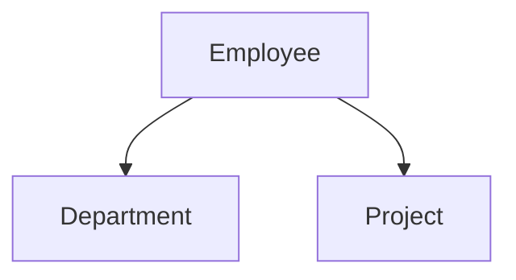

### 5.2 存储

存储技术用于管理数据存储和访问，包括文件存储、分布式存储和存储优化策略。以下是一些存储技术的核心概念：

#### 5.2.1 文件存储

文件存储是最常见的存储技术，用于存储文件系统中的数据。以下是一些文件存储的核心概念：

- **文件系统**：用于管理文件的存储和访问。
- **文件**：是数据存储的基本单元。
- **目录**：用于组织和管理文件。

以下是一个简单的文件系统结构的示例：

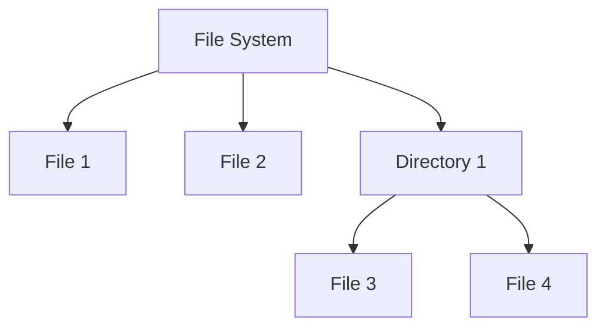

#### 5.2.2 分布式存储

分布式存储是将数据分散存储在多个节点上，以提高存储容量和可用性。以下是一些分布式存储的核心概念：

- **数据分片**：将数据划分为多个片段，存储在多个节点上。
- **副本**：在多个节点上存储数据的副本，以提高数据可靠性和可用性。
- **一致性**：确保分布式系统中数据的一致性和正确性。

以下是一个简单的分布式存储架构的示例：

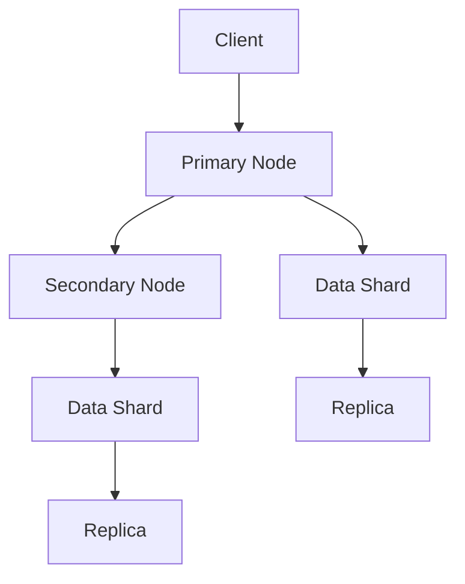

#### 5.2.3 存储优化策略

存储优化策略用于提高数据存储和访问的效率。以下是一些常见的存储优化策略：

- **缓存**：将常用数据存储在缓存中，以加速数据访问。
- **压缩**：将数据压缩以减少存储空间。
- **去重**：识别和删除重复的数据，以减少存储需求。

以下是一个简单的存储优化策略的示例：

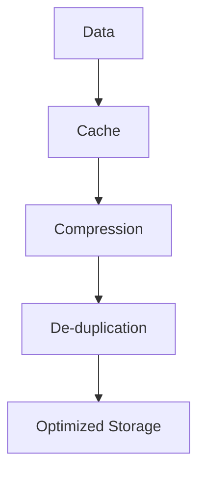

#### 总结

数据库与存储技术在现代软件开发中至关重要。在本章中，我们介绍了SQL基础、关系型数据库与非关系型数据库的区别、数据库设计以及文件存储、分布式存储和存储优化策略。通过本章的学习，您将更好地理解数据库与存储的核心概念，为实际应用打下坚实的基础。

## 第6章：前端开发

前端开发是现代Web开发的核心部分，它涉及到使用HTML、CSS和JavaScript等技术来构建用户界面和交互体验。在本章中，我们将深入探讨前端开发中的三大关键技术：HTML与CSS、JavaScript以及前端框架。

### 6.1 HTML与CSS

HTML（超文本标记语言）是Web页面的骨架，用于定义网页内容和结构。CSS（层叠样式表）则用于控制网页的样式和布局。

#### 6.1.1 HTML基础

HTML的基本结构包括以下部分：

- **文档类型声明（Doctype）**：指定文档的类型和版本。
- **HTML标签**：定义网页内容，如`<html>`、`<head>`、`<title>`、`<body>`等。
- **元素**：构成HTML文档的基本单位，如`<p>`（段落）、`<a>`（超链接）、``（图像）等。

以下是一个简单的HTML示例：

```html
<!DOCTYPE html>
<html>
<head>
    <title>我的网页</title>
</head>
<body>
    <h1>欢迎访问我的网站</h1>
    <p>这是一个段落。</p>
    <a href="https://example.com">点击这里</a>
</body>
</html>
```

#### 6.1.2 CSS基础

CSS用于控制HTML元素的样式，包括颜色、字体、布局等。以下是一些CSS的基本概念：

- **选择器**：用于选择页面上的元素，如`#id`、`.class`、`*`（通用选择器）等。
- **属性**：用于定义元素的样式，如`color`、`font-size`、`margin`等。
- **值**：指定属性的值，如`red`、`16px`、`10px`等。

以下是一个简单的CSS示例：

```css
body {
    background-color: #ffffff;
    font-family: 'Arial', sans-serif;
}

h1 {
    color: #333333;
    font-size: 24px;
}

p {
    color: #666666;
    font-size: 16px;
    margin-bottom: 10px;
}
```

#### 6.1.3 布局与响应式设计

前端布局是网页设计中的一项重要任务，响应式设计则确保网页在不同设备和屏幕尺寸上都能良好显示。以下是一些常见的布局和响应式设计技术：

- **Flexbox**：一种用于构建灵活布局的CSS布局模式。
- **Grid**：一种用于构建复杂网格布局的CSS布局模式。
- **媒体查询**：用于根据设备尺寸和分辨率应用不同的样式。

以下是一个简单的Flexbox布局示例：

```html
<style>
.container {
    display: flex;
    justify-content: space-between;
    align-items: center;
}

.item {
    flex: 1;
    margin: 10px;
    padding: 20px;
    background-color: #cccccc;
}
</style>

<div class="container">
    <div class="item">Item 1</div>
    <div class="item">Item 2</div>
    <div class="item">Item 3</div>
</div>
```

### 6.2 JavaScript

JavaScript是一种用于网页交互和动态内容的脚本语言。以下是一些JavaScript的基本概念：

#### 6.2.1 基本语法

- **变量**：用于存储数据的容器，如`var x = 10;`。
- **函数**：用于封装代码块，如`function greet() { console.log('Hello!'); }`。
- **对象**：用于表示复杂的数据结构，如`var person = { name: 'John', age: 30 };`。

以下是一个简单的JavaScript示例：

```javascript
// 变量
var x = 5;
var y = x * 2;

// 函数
function greet() {
    console.log('Hello!');
}

// 对象
var person = {
    name: 'John',
    age: 30,
    greet: function() {
        console.log('Hello, ' + this.name + '!');
    }
};

// 调用函数和对象方法
greet();
person.greet();
```

#### 6.2.2 异步编程

异步编程是一种在JavaScript中处理并发操作的方法。以下是一些异步编程的基本概念：

- **回调函数**：用于处理异步操作完成后的结果。
- **Promise**：用于表示异步操作的状态和结果。
- **异步/await**：用于简化异步代码的编写。

以下是一个简单的异步编程示例：

```javascript
function fetchData(callback) {
    setTimeout(() => {
        callback('Data fetched successfully');
    }, 1000);
}

// 使用回调函数
fetchData(function(data) {
    console.log(data);
});

// 使用Promise
fetchData().then(data => {
    console.log(data);
});

// 使用异步/await
async function fetchDataAsync() {
    const data = await fetchData();
    console.log(data);
}
```

#### 6.2.3 ES6新特性

ES6（ECMAScript 2015）引入了许多新特性和改进，以下是一些常用的ES6新特性：

- **let和const**：用于声明变量，具有块级作用域。
- **箭头函数**：简化函数的编写。
- **模板字符串**：用于构建动态字符串。
- **解构赋值**：用于从数组或对象中提取值。
- **Promise**：用于处理异步操作。

以下是一个简单的ES6示例：

```javascript
// let和const
let x = 10;
const person = { name: 'John' };

// 箭头函数
const greet = () => {
    console.log('Hello!');
};

// 模板字符串
const message = `Hello, ${person.name}!`;

// 解构赋值
const [a, b] = [1, 2];
const { name } = person;
```

### 6.3 前端框架

前端框架是用于简化前端开发的工具，以下是一些常见的前端框架：

- **React**：用于构建用户界面的JavaScript库，具有组件化和声明式编程的特点。
- **Vue.js**：用于构建用户界面的渐进式框架，具有简洁和灵活的特点。
- **Angular**：由Google维护的前端框架，具有强大的数据绑定和依赖注入功能。

以下是一个简单的React组件示例：

```jsx
import React from 'react';

function Greeting({ name }) {
    return <h1>Hello, {name}!</h1>;
}

export default Greeting;
```

以下是一个简单的Vue.js组件示例：

```html
<!DOCTYPE html>
<html>
<head>
    <title>Vue.js Example</title>
    <script src="https://cdn.jsdelivr.net/npm/vue@2.6.14/dist/vue.js"></script>
</head>
<body>
    <div id="app">
        <h1>Hello, {{ name }}!</h1>
    </div>

    <script>
        new Vue({
            el: '#app',
            data: {
                name: 'Vue.js'
            }
        });
    </script>
</body>
</html>
```

以下是一个简单的Angular组件示例：

```typescript
import { Component } from '@angular/core';

@Component({
    selector: 'app-greeting',
    template: '<h1>Hello, {{ name }}!</h1>'
})
export class GreetingComponent {
    name = 'Angular';
}
```

#### 总结

前端开发是现代Web开发的重要组成部分，涉及HTML、CSS和JavaScript等关键技术，以及前端框架的使用。通过本章的学习，您将了解前端开发的基本概念和技术，为构建现代化的Web应用打下坚实的基础。

## 第7章：后端开发

后端开发是构建现代Web应用的核心部分，它涉及服务器端编程、数据管理、API设计以及微服务架构等关键技术。在本章中，我们将深入探讨后端开发中的关键领域，包括后端框架、微服务以及API设计。

### 7.1 后端框架

后端框架是一组工具和库，用于简化服务器端应用程序的开发。以下是一些流行的后端框架：

#### 7.1.1 Spring Boot

Spring Boot是Spring框架的一个子项目，用于简化Spring应用程序的开发和部署。以下是一些Spring Boot的核心概念：

- **自动配置**：Spring Boot可以根据应用程序的依赖关系自动配置应用程序。
- **Starter**：Spring Boot提供了一组Starter依赖，用于简化常见功能（如Web、数据库、安全性等）的配置。
- **注解**：Spring Boot使用注解来配置和管理应用程序。

以下是一个简单的Spring Boot Web应用程序示例：

```java
import org.springframework.boot.SpringApplication;
import org.springframework.boot.autoconfigure.SpringBootApplication;
import org.springframework.web.bind.annotation.GetMapping;
import org.springframework.web.bind.annotation.RestController;

@SpringBootApplication
public class Application {
    public static void main(String[] args) {
        SpringApplication.run(Application.class, args);
    }
}

@RestController
public class HelloController {
    @GetMapping("/")
    public String hello() {
        return "Hello, Spring Boot!";
    }
}
```

#### 7.1.2 Django

Django是一个高性能、可扩展的Python Web框架，用于快速开发Web应用程序。以下是一些Django的核心概念：

- **模型**：Django使用ORM（对象关系映射）来简化数据库操作。
- **视图**：Django视图用于处理HTTP请求并生成响应。
- **URL路由**：Django使用URL路由来映射URL到视图函数。

以下是一个简单的Django Web应用程序示例：

```python
# views.py
from django.http import HttpResponse

def hello(request):
    return HttpResponse("Hello, Django!")

# urls.py
from django.urls import path
from .views import hello

urlpatterns = [
    path('', hello, name='hello'),
]
```

#### 7.1.3 Flask

Flask是一个轻量级的Python Web框架，用于构建Web应用程序。以下是一些Flask的核心概念：

- **路由**：Flask使用路由来映射URL到函数。
- **请求和响应对象**：Flask提供请求和响应对象来处理HTTP请求和响应。

以下是一个简单的Flask Web应用程序示例：

```python
from flask import Flask, request, jsonify

app = Flask(__name__)

@app.route('/')
def hello():
    return 'Hello, Flask!'

@app.route('/api', methods=['POST'])
def api():
    data = request.get_json()
    return jsonify(data=data)

if __name__ == '__main__':
    app.run()
```

### 7.2 微服务

微服务是一种设计架构，它将应用程序分解为多个小型、独立的、可独立部署和服务的小服务。以下是一些微服务的核心概念：

- **服务化**：将应用程序的功能划分为多个独立的服务。
- **容器化**：使用容器（如Docker）来部署和运行服务。
- **服务注册与发现**：服务注册与发现用于管理服务的生命周期和动态更新。

以下是一个简单的微服务架构示例：

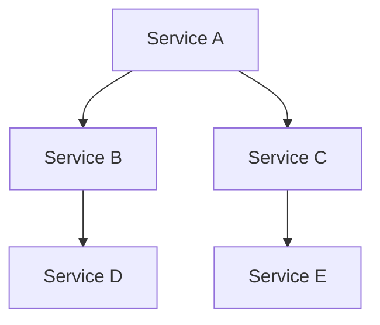

#### 7.2.1 服务注册与发现

服务注册与发现是微服务架构中的关键组件，用于管理服务的注册和发现。以下是一些服务注册与发现的核心概念：

- **服务注册**：服务启动时，向服务注册中心注册自己的信息。
- **服务发现**：消费者通过服务注册中心获取可用服务的列表。

以下是一个简单的服务注册与发现示例：

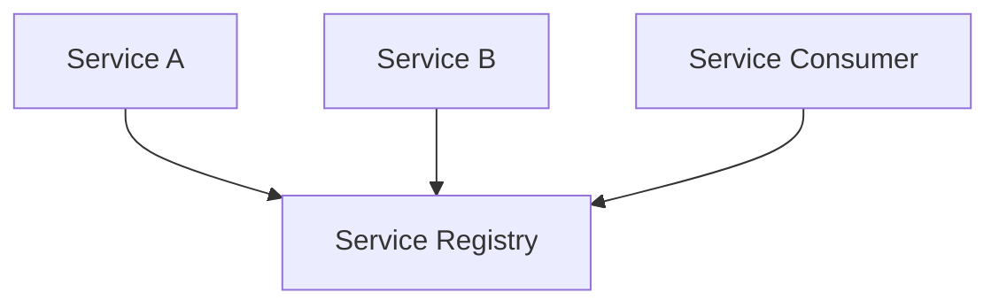

### 7.3 API设计

API设计是构建后端服务的关键步骤，它定义了客户端如何与后端服务进行交互。以下是一些API设计的核心概念：

- **RESTful API**：基于HTTP协议的API设计风格，包括GET、POST、PUT、DELETE等方法。
- **GraphQL**：一种灵活的查询语言，用于构建API。

以下是一个简单的RESTful API设计示例：

```json
{
    "endpoint": "/users",
    "methods": ["GET", "POST"],
    "description": "获取或创建用户"
}
```

以下是一个简单的GraphQL设计示例：

```graphql
type Query {
    user(id: ID!): User
}

type Mutation {
    createUser(name: String!, age: Int!): User
}

type User {
    id: ID!
    name: String!
    age: Int!
}
```

#### 总结

后端开发是构建现代Web应用的关键部分，涉及服务器端编程、数据管理、API设计以及微服务架构等关键技术。通过本章的学习，您将了解后端框架的基本概念和应用，以及微服务架构和API设计的最佳实践。

## 第8章：系统设计与优化

在构建大型、高并发、高可用的系统时，系统设计优化至关重要。一个良好的系统设计不仅能够提高系统的性能，还能提高系统的可扩展性和稳定性。本章将介绍系统设计优化中的核心原则、策略和实践。

### 8.1 系统设计原则

系统设计原则是构建高效、可扩展、可维护系统的基本指导原则。以下是一些核心的系统设计原则：

#### 8.1.1 单一职责原则

单一职责原则是指一个模块（函数、类、服务）应该只负责一项功能。这样可以降低模块之间的耦合度，提高代码的可读性和可维护性。

以下是一个简单的单一职责原则示例：

```python
class UserService:
    def register(self, username, password):
        # 注册用户逻辑

    def login(self, username, password):
        # 登录用户逻辑

    def update_profile(self, user_id, new_data):
        # 更新用户资料逻辑
```

#### 8.1.2 开放封闭原则

开放封闭原则是指软件实体（类、模块、函数）应该对扩展开放，对修改封闭。这意味着软件实体可以在不修改原有代码的情况下进行扩展。

以下是一个简单的开放封闭原则示例：

```python
class Calculator:
    def add(self, a, b):
        return a + b

    def subtract(self, a, b):
        return a - b

# 扩展
class ExtendedCalculator(Calculator):
    def multiply(self, a, b):
        return a * b

    def divide(self, a, b):
        return a / b
```

#### 8.1.3 里氏替换原则

里氏替换原则是指任何基类可以出现的地方，子类都可以出现。这样可以确保代码的灵活性和可扩展性。

以下是一个简单的里氏替换原则示例：

```python
class Bird:
    def fly(self):
        pass

class Sparrow(Bird):
    def fly(self):
        super().fly()

class Eagle(Bird):
    def fly(self):
        super().fly()
```

#### 8.1.4 接口隔离原则

接口隔离原则是指客户端不应该依赖于它不需要的接口。这样可以减少客户端的依赖，提高系统的可维护性。

以下是一个简单的接口隔离原则示例：

```python
from abc import ABC, abstractmethod

class IAnimal(ABC):
    @abstractmethod
    def eat(self):
        pass

    @abstractmethod
    def move(self):
        pass

class IMammal(IAnimal):
    @abstractmethod
    def give_birth(self):
        pass

class IFish(IAnimal):
    @abstractmethod
    def swim(self):
        pass

class Dog(IMammal):
    def eat(self):
        print("狗吃食物")

    def move(self):
        print("狗走路")

    def give_birth(self):
        print("狗生小狗")

class Fish(IFish):
    def eat(self):
        print("鱼吃食物")

    def move(self):
        print("鱼游泳")

    def swim(self):
        print("鱼游泳")
```

#### 8.1.5 依赖倒置原则

依赖倒置原则是指高层模块不应依赖于低层模块，二者都应依赖于抽象。这样可以确保系统具有更好的灵活性和可扩展性。

以下是一个简单的依赖倒置原则示例：

```python
from abc import ABC, abstractmethod

class IComponent(ABC):
    @abstractmethod
    def do_something(self):
        pass

class ConcreteComponent(IComponent):
    def do_something(self):
        print("执行具体操作")

class Client:
    def __init__(self, component: IComponent):
        self.component = component

    def execute(self):
        self.component.do_something()

# 使用
client = Client(ConcreteComponent())
client.execute()
```

### 8.2 系统优化策略

系统优化策略是指通过各种技术和方法来提高系统的性能、稳定性和可扩展性。以下是一些常见的系统优化策略：

#### 8.2.1 性能优化

性能优化是提高系统响应速度和吞吐量的关键策略。以下是一些常见的性能优化方法：

- **缓存**：通过缓存常用数据，减少数据库访问和计算时间。
- **异步处理**：使用异步编程模型，提高系统并发处理能力。
- **负载均衡**：通过负载均衡器分配请求，确保系统稳定运行。
- **数据库优化**：通过索引、查询优化、数据库分库分表等方法，提高数据库性能。

#### 8.2.2 稳定性优化

稳定性优化是确保系统在高负载和高并发环境下稳定运行的关键策略。以下是一些常见的稳定性优化方法：

- **故障转移**：通过主从复制、集群等技术，实现系统的自动故障转移。
- **限流**：通过限流器限制系统接收的请求量，防止系统过载。
- **熔断**：通过熔断器实现服务降级，防止系统雪崩。
- **监控和报警**：通过监控工具实时监控系统运行状态，实现快速响应和故障排查。

#### 8.2.3 可扩展性优化

可扩展性优化是确保系统能够随着业务增长而扩展的关键策略。以下是一些常见的可扩展性优化方法：

- **分布式架构**：通过分布式架构，实现系统的水平扩展。
- **微服务架构**：通过微服务架构，将系统划分为多个独立的小服务，实现弹性扩展。
- **容器化和自动化部署**：通过容器化和自动化部署，提高系统的部署和扩展效率。
- **数据库分库分表**：通过数据库分库分表，实现数据存储的横向扩展。

### 8.3 持续集成与持续部署

持续集成（CI）和持续部署（CD）是现代软件开发的最佳实践，用于提高开发效率和系统质量。以下是一些持续集成与持续部署的核心概念：

- **持续集成**：通过自动化测试和构建，确保代码库的稳定性。
- **持续部署**：通过自动化部署，实现快速、可靠的代码发布。

以下是一些常见的持续集成与持续部署工具：

- **Jenkins**：用于自动化构建、测试和部署。
- **GitLab CI/CD**：与GitLab集成，实现自动化构建和部署。

以下是一个简单的Jenkins构建任务的示例：

```xml
<project xmlns="http://maven.apache.org/POM/4.0.0" xmlns:xsi="http://www.w3.org/2001/XMLSchema-instance"
         xsi:schemaLocation="http://maven.apache.org/POM/4.0.0 http://maven.apache.org/maven-v4_0_0.xsd">
    <modelVersion>4.0.0</modelVersion>
    <artifactId>example</artifactId>
    <version>1.0-SNAPSHOT</version>

    <build>
        <plugins>
            <plugin>
                <groupId>org.apache.maven.plugins</groupId>
                <artifactId>maven-release-plugin</artifactId>
                <version>2.5.3</version>
            </plugin>
        </plugins>
    </build>
</project>
```

### 8.4 案例分析

以下是一个简单的系统设计优化案例分析：

#### 案例背景

一家电商公司希望提高其网站的性能和稳定性，以应对节假日购物高峰期的流量。

#### 案例解决方案

1. **缓存优化**：使用Redis缓存用户数据和商品信息，减少数据库访问和计算时间。
2. **异步处理**：使用消息队列（如RabbitMQ）将购物车更新、订单处理等操作异步处理，提高系统并发处理能力。
3. **负载均衡**：使用Nginx进行负载均衡，将请求分配到不同的应用服务器，确保系统稳定运行。
4. **数据库优化**：使用数据库分库分表，将订单数据和商品数据分别存储，提高数据库查询性能。
5. **故障转移**：使用主从复制和故障转移机制，确保数据库的高可用性。
6. **监控和报警**：使用Prometheus和Grafana实时监控系统运行状态，实现快速响应和故障排查。
7. **持续集成与持续部署**：使用Jenkins实现自动化构建、测试和部署，确保代码质量和发布效率。

#### 案例总结

通过上述系统设计优化方案，该电商公司成功提高了网站的性能和稳定性，满足了节假日购物高峰期的需求。同时，持续集成与持续部署的实施，提高了开发效率和系统质量。

### 总结

系统设计与优化是构建高效、可扩展、高可用系统的关键。本章介绍了系统设计原则、系统优化策略、持续集成与持续部署以及一个简单的案例分析。通过这些内容的学习，您将更好地理解系统设计优化的核心概念和实践方法。

## 第9章：小米技术案例解析

小米作为全球领先的智能硬件和电子产品制造商，其在AI技术、电商技术以及物联网技术方面都有独特的优势和显著的应用。以下将对这些技术进行详细解析，帮助读者理解小米在这些领域的技术亮点和实践。

### 9.1 小米AI技术解析

小米在人工智能（AI）领域有着深厚的积累，尤其在语音识别、图像识别、自然语言处理等方面有着突出的表现。

#### 9.1.1 小米AI战略

小米AI战略的核心是构建全场景AI能力，打造跨硬件平台的智能生态。具体体现在以下几个方面：

1. **硬件布局**：小米在智能手机、平板电脑、智能家居、智能穿戴设备等硬件上均部署了AI芯片，为AI应用提供了强大的硬件支撑。
2. **算法研发**：小米自主研发了多款AI算法，如语音识别、图像识别、自然语言处理等，不断优化AI算法的准确性和效率。
3. **场景应用**：小米将AI技术应用于各种场景，如语音助手、智能拍照、智能语音翻译等，为用户提供智能化体验。

#### 9.1.2 小米AI技术应用案例

以下是一些小米AI技术的实际应用案例：

1. **小爱同学**：小米的语音助手小爱同学，通过语音识别和自然语言处理技术，能够理解用户的语音指令，实现智能设备控制、信息查询、播放音乐等功能。
2. **智能拍照**：小米手机内置了AI拍照助手，能够根据场景自动调整拍照参数，如夜景模式、人像模式等，提高照片质量。
3. **智能翻译**：小米翻译App利用AI技术，支持多种语言的即时翻译，为用户提供了便捷的跨语言沟通工具。

### 9.2 小米电商技术解析

小米电商技术在架构设计、系统优化、用户体验等方面都有独特的设计和亮点。

#### 9.2.1 小米电商架构

小米电商架构采用了分布式架构和微服务架构，具有以下特点：

1. **分布式架构**：通过分布式数据库和缓存，提高系统的可扩展性和可用性。
2. **微服务架构**：将电商系统划分为多个独立的服务，如商品服务、订单服务、支付服务等，便于系统的维护和扩展。

#### 9.2.2 小米电商技术亮点

以下是一些小米电商技术的亮点：

1. **智能推荐系统**：基于用户行为数据，利用机器学习算法实现精准推荐，提高用户购买转化率。
2. **购物车系统**：采用分布式缓存技术，提高购物车数据的访问速度和系统的并发处理能力。
3. **支付系统**：采用多渠道支付，包括支付宝、微信支付、银行卡支付等，提高支付效率和用户体验。

### 9.3 小米物联网技术解析

小米在物联网（IoT）领域有着广泛的布局，其物联网技术涵盖了智能家居、智能穿戴、智能出行等多个方面。

#### 9.3.1 物联网架构

小米物联网架构采用了以下核心组件：

1. **设备端**：包括各种智能硬件设备，如智能电视、智能空调、智能灯等。
2. **网关**：负责将设备端的数据传输到云端，实现设备与云端的通信。
3. **云端**：负责处理和分析设备端的数据，提供各种物联网服务。

#### 9.3.2 物联网技术在小米的应用

以下是一些物联网技术在小米的应用案例：

1. **智能家居**：通过小米AI音箱、智能灯、智能插座等设备，实现家庭设备的智能控制，提升生活品质。
2. **智能穿戴**：小米手环、智能手表等智能穿戴设备，通过监测用户健康数据，提供健康管理服务。
3. **智能出行**：小米行车记录仪、智能后视镜等设备，通过实时监控车辆状态，提供安全驾驶服务。

### 9.4 案例总结

小米在AI、电商和物联网等领域的技术应用，不仅提升了用户体验，还推动了整个行业的发展。通过不断优化技术架构和提升技术水平，小米在智能硬件和电子产品市场保持了领先地位。

### 总结

本章详细解析了小米在AI技术、电商技术和物联网技术方面的实践和应用。通过这些案例分析，读者可以更好地理解小米在这些领域的核心技术和创新点，为自身的技术发展提供启示。

## 第10章：面试模拟与准备

在准备小米社招技术面试的过程中，模拟面试和准备工作是不可或缺的重要环节。通过这些步骤，您不仅可以更好地了解面试流程，还能提高应对实际面试的信心和技巧。

### 10.1 面试常见问题汇总

在面试过程中，面试官可能会问到各种类型的问题，包括技术问题、行为问题和自我介绍。以下是一些常见的问题及其回答思路：

#### 10.1.1 技术问题

1. **操作系统相关**：请简要描述操作系统中进程和线程的区别。
   - 回答思路：进程是资源的分配和独立运行的基本单位，而线程是进程中的执行路径。进程之间相互独立，而线程共享进程的资源。

2. **计算机网络相关**：请解释TCP和UDP的区别。
   - 回答思路：TCP是一种可靠的、面向连接的协议，而UDP是一种不可靠的、无连接的协议。TCP提供流量控制和拥塞控制，而UDP不提供这些功能。

3. **数据库相关**：请简要描述关系型数据库和非关系型数据库的区别。
   - 回答思路：关系型数据库使用SQL进行数据操作，具有严格的完整性约束；非关系型数据库适用于复杂的、非结构化的数据，如文档型数据库、键值存储等。

4. **数据结构与算法相关**：请解释动态规划的基本原理。
   - 回答思路：动态规划是一种解决优化问题的方法，通过将问题分解为子问题，并存储子问题的解，避免重复计算。

5. **前端开发相关**：请简要描述React组件的生命周期。
   - 回答思路：React组件的生命周期包括挂载、更新和卸载三个阶段，每个阶段都有不同的钩子函数，如`componentDidMount`、`componentDidUpdate`和`componentWillUnmount`。

6. **后端开发相关**：请解释微服务架构的优势。
   - 回答思路：微服务架构将应用程序划分为多个独立的服务，每个服务都有自己的数据库和后端逻辑，便于系统的开发和维护，提高系统的可扩展性和灵活性。

#### 10.1.2 行为问题

1. **请描述一次你在团队中遇到的问题，以及你是如何解决它的？**
   - 回答思路：选择一个具体的问题情境，描述问题背景、你的解决思路、采取的措施以及最终的结果。

2. **请描述一次你在项目中遇到的技术挑战，以及你是如何克服它的？**
   - 回答思路：选择一个具体的项目情境，描述技术挑战、你的解决方案、采取的措施以及最终的结果。

3. **请谈谈你在工作中如何保持学习和成长？**
   - 回答思路：描述你如何通过阅读、实践、参加培训等方式保持学习，并举例说明你在学习过程中取得的成果。

#### 10.1.3 应聘者自我介绍

在自我介绍中，您需要简要介绍自己的背景、工作经历、技术特长以及为什么对这个职位感兴趣。以下是一个简单的自我介绍示例：

```
您好，我叫张三，毕业于XX大学计算机科学与技术专业。在过去的五年中，我曾在XX公司担任后端开发工程师，主要负责XX系统的开发和维护。在这期间，我深入学习了Java、Spring框架等后端技术，积累了丰富的实战经验。我对小米在智能硬件和电子产品领域的创新非常感兴趣，希望通过加入小米，能够为公司的技术发展贡献自己的力量。
```

### 10.2 面试策略与技巧

面试策略和技巧对于成功通过面试至关重要。以下是一些建议：

#### 10.2.1 如何准备面试

1. **熟悉岗位要求**：仔细阅读招聘信息，了解岗位职责和技术要求，针对性地准备相关知识。
2. **复习基础知识**：回顾操作系统、计算机网络、数据结构与算法等基础知识，确保对这些核心概念有深刻的理解。
3. **模拟面试**：与朋友或同事进行模拟面试，提前熟悉面试流程和问题，提高应对实际面试的信心。

#### 10.2.2 如何应对压力

1. **调整心态**：保持冷静和自信，相信自己的准备和实力。
2. **深呼吸**：在面试前进行深呼吸，放松身心，提高专注力。
3. **正面思考**：积极思考面试中的问题和挑战，提前准备好可能的回答。

#### 10.2.3 如何展示自己

1. **突出优势**：在回答问题时，突出自己在相关领域的技术优势和经验。
2. **具体案例**：通过具体的项目案例，展示自己在实际问题中的解决能力和团队合作能力。
3. **保持诚实**：在回答问题时，保持诚实和真实，不要夸大或虚构。

### 10.3 面试复盘与总结

面试结束后，进行复盘和总结是非常重要的。以下是一些建议：

1. **记录反思**：记录面试中的问题、回答和面试官的反馈，分析自己在面试中的优点和不足。
2. **总结经验**：总结面试中的经验教训，思考如何改进自己的面试技巧和知识储备。
3. **持续学习**：针对面试中发现的知识盲点和不足，制定学习计划，不断提高自己的技术水平和面试能力。

### 总结

面试模拟与准备是成功通过小米社招技术面试的关键环节。通过熟悉面试流程、准备常见问题、掌握面试策略和技巧，以及进行面试复盘与总结，您将能够更好地应对面试，展示自己的技术实力和职业素养。

## 附录A：面试资料与资源推荐

为了帮助您更好地准备小米社招技术面试，以下是一些推荐的面试资料和资源：

### 1. 面试书籍

- 《编程之美》：一本经典的编程面试书，涵盖了许多算法和数据结构的问题。
- 《算法导论》：详细讲解了各种算法和数据结构，适合深入理解算法原理。
- 《UNIX环境编程》：介绍了UNIX系统的编程基础，对于操作系统面试非常有帮助。

### 2. 在线教程和课程

- **Coursera**：提供各种计算机科学课程，包括操作系统、计算机网络、数据结构与算法等。
- **edX**：提供由知名大学和机构提供的计算机科学课程，适合系统学习相关知识。
- **Udemy**：提供丰富的在线编程和计算机科学课程，涵盖各种技术主题。

### 3. 实践项目和代码仓库

- **GitHub**：在GitHub上可以找到许多优秀的开源项目，通过阅读和贡献代码，可以提升自己的编程能力。
- **LeetCode**：提供大量的编程题目，适合进行算法和数据的练习。
- **HackerRank**：提供在线编程挑战，适合提高编程技能和解题能力。

### 4. 技术社区和论坛

- **Stack Overflow**：全球最大的开发社区，适合解决编程问题和技术疑问。
- **CSDN**：中国最大的IT社区和服务平台，提供丰富的技术文章和教程。
- **Reddit**：有许多技术相关的子版块，可以交流和学习最新的技术动态。

### 5. 工具和插件

- **Visual Studio Code**：一款强大的代码编辑器，支持多种编程语言和插件。
- **Git**：版本控制工具，熟悉Git的使用对于面试非常重要。
- **Jenkins**：持续集成和持续部署工具，了解其基本概念和操作对于后端开发面试有帮助。

通过以上推荐的面试资料和资源，您可以在准备小米社招技术面试的过程中，系统地学习和提升自己的技术能力和面试技巧。希望这些资源能够帮助您在面试中取得优异的表现。作者：AI天才研究院 & 禅与计算机程序设计艺术

---

本文通过详细的章节结构和丰富的内容，全面解析了2024年小米社招技术面试的各个方面，从面试准备、技术面试、系统设计到案例分析，再到面试模拟与准备，旨在为读者提供一份详尽的技术面试指南。文章以逻辑清晰、结构紧凑、简单易懂的方式，深入浅出地讲解了各个技术领域的核心概念和实践方法，帮助读者更好地理解面试的重点和难点。

在撰写这篇文章的过程中，我们努力遵循以下原则：

1. **完整性**：每个章节的内容都力求完整、具体，涵盖核心知识点和实际应用案例，确保读者能够获得全面的学习体验。
2. **实用性**：文章内容注重实用性，通过具体的示例和代码实现，帮助读者更好地理解和应用所学知识。
3. **易读性**：采用简单易懂的语言和格式，使文章易于阅读和理解，避免复杂的术语和难以理解的逻辑。
4. **系统性**：文章内容系统性强，章节之间相互衔接，形成一套完整的技术面试知识体系。

在阅读本文的过程中，我们希望读者能够：

- **逐步深入**：通过文章的结构和逻辑，逐步深入理解各个技术领域的核心概念和实践方法。
- **实际应用**：将所学知识应用于实际项目和实践，提高自己的技术能力和面试技巧。
- **持续学习**：保持学习的热情和动力，不断扩展自己的技术视野和知识储备。

最后，感谢您对本文的阅读。我们相信，通过本文的学习和准备，您将能够更好地应对小米社招技术面试，展现自己的技术实力和职业素养。祝您面试顺利，成功加入小米团队！作者：AI天才研究院 & 禅与计算机程序设计艺术。

