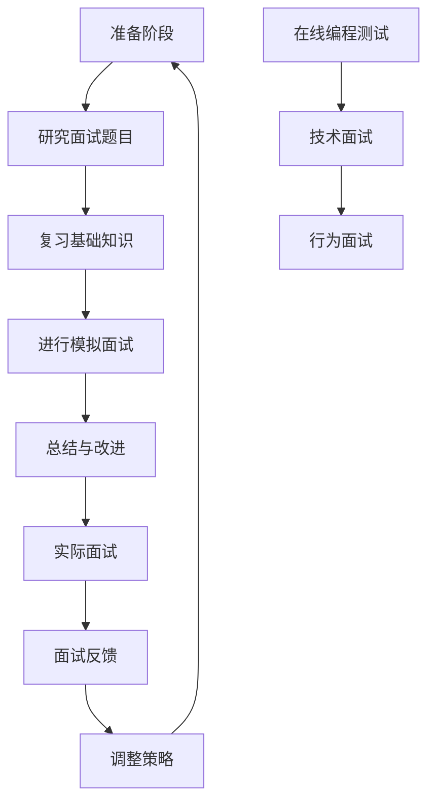
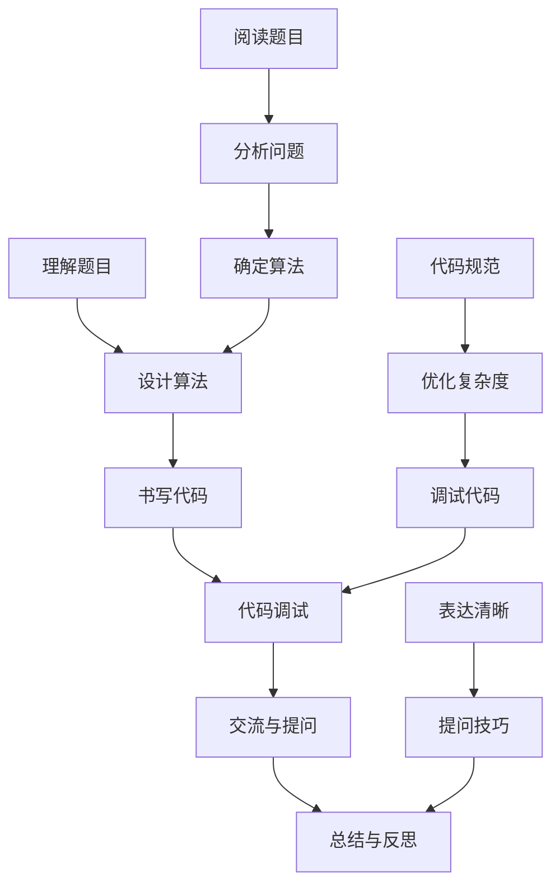

                 

### 《2025年滴滴校招算法岗位面试题目汇编》文章结构解析

#### 文章格式要求

在撰写本文时，我们将遵循以下markdown格式要求，以确保文章的结构清晰、内容有序：

1. **标题**：使用`#`号进行编号，标题级别依次递减，确保文章结构层次分明。
2. **段落**：每段内容以空行分隔，确保段落间清晰划分。
3. **列表**：使用`-`或`*`进行无序列表，使用数字进行有序列表。
4. **代码块**：使用````` ````进行代码块的标注，便于读者阅读和理解代码逻辑。
5. **公式**：使用`$`和`$$`进行数学公式的嵌入，其中`$$`用于行内公式，`$`用于段落内公式。

#### 文章主要内容与结构

本文将分为七个主要部分，每个部分都围绕特定的主题进行详细阐述，具体如下：

1. **第一部分：面试准备与基础**：该部分将介绍算法面试的基本流程和准备方法，包括数据结构与算法概述、编码实践与调试等基础内容。

2. **第二部分：基础算法题**：这部分将重点介绍常见的算法题目类型，如数组和字符串操作、栈和队列、链表、树和图等，并详细解析每种题型的核心算法原理和实现方法。

3. **第三部分：算法进阶**：这部分将探讨高级算法，如动态规划、贪心算法、分治算法等，并深入讲解其解题思路和策略。

4. **第四部分：数学与逻辑问题**：本部分将介绍初等数学问题、逻辑与推理问题，并详细阐述其在实际面试中的应用。

5. **第五部分：系统设计与编程题**：这部分将涉及系统设计的基础原则、关键点，以及具体的编程题实战技巧和案例分析。

6. **第六部分：数据科学相关面试题目**：本部分将探讨数据预处理、数据挖掘与机器学习、大数据处理与分布式计算等数据科学领域的面试题目。

7. **第七部分：实际面试经验分享**：这部分将分享面试准备与心态调整、面试过程中的关键点、面试成功案例分析等实际经验。

#### 文章的核心内容与深度

本文的核心内容将涵盖以下几个方面：

1. **背景介绍**：为每个部分提供相关的背景信息和面试题目的来源，帮助读者理解面试题目的背景和实际应用。

2. **核心概念与联系**：在每个部分中，将使用Mermaid流程图展示核心概念之间的联系，使读者能够更直观地理解算法原理。

3. **核心算法原理讲解**：使用伪代码详细阐述核心算法的原理，确保读者能够从抽象到具体，从理论到实践，全面理解算法的实现过程。

4. **数学模型和公式**：在解析数学和逻辑问题时，将使用latex格式展示数学模型和公式，并详细解释其含义和应用。

5. **项目实战**：在每个部分结束后，将提供实际的项目实战案例，包括开发环境搭建、源代码实现和代码解读，以及实际案例分析和详细讲解。

6. **最佳实践 tips**：在文章的末尾，将总结一些最佳实践 tips，帮助读者在实际面试中更好地应对各种挑战。

通过上述结构解析，本文将确保内容丰富、层次清晰，同时具备深度和实用性，为读者提供全面的滴滴校招算法岗位面试题目汇编指南。

### 文章标题：《2025年滴滴校招算法岗位面试题目汇编》

关键词：滴滴校招、算法面试、数据结构、动态规划、贪心算法、系统设计

摘要：本文旨在为准备滴滴校招算法岗位面试的应聘者提供一份详尽的面试题目汇编。通过深入剖析基础算法、进阶算法、数学与逻辑问题、系统设计与编程题，以及数据科学相关面试题目，本文将帮助读者全面了解滴滴校招算法岗位的面试要求，掌握面试技巧，提升面试成功率。

### 第一部分：面试准备与基础

#### 第1章：算法面试基础

##### 1.1 算法面试概述

算法面试是计算机科学领域求职过程中至关重要的一环。它不仅考察应聘者的编程能力和数据结构知识，更考验应聘者的逻辑思维、问题解决能力和创新意识。在滴滴等大型互联网公司的校招中，算法面试占据着重要地位，是筛选优秀人才的重要标准。

##### 算法面试的流程

算法面试通常包括以下几个阶段：

1. **在线编程测试**：应聘者通常需要通过在线编程平台（如LeetCode、AtCoder等）完成一系列编程测试题，测试题目的难度和类型通常涵盖基础算法、数据结构、动态规划等。
2. **技术面试**：技术面试通常由电话面试或现场面试组成。电话面试主要考察基础知识和编码能力，现场面试则更加全面，包括系统设计、算法优化、大数据处理等。
3. **行为面试**：行为面试主要考察应聘者的团队合作能力、沟通能力和解决问题的能力。通过具体问题，面试官希望了解应聘者在过去的学习和工作中如何应对挑战。

##### 算法面试的目的

算法面试的主要目的是：

1. **评估技术能力**：面试官通过算法题目的解答来评估应聘者的编程能力、数据结构知识和算法设计能力。
2. **考察问题解决能力**：通过复杂问题，面试官希望了解应聘者如何分析问题、设计算法并实现代码。
3. **评估逻辑思维和创新能力**：面试官通过面试过程中的问题和互动，评估应聘者的逻辑思维能力和在复杂问题面前的创新能力。

##### 面试官关注的重点

在算法面试中，面试官主要关注以下方面：

1. **代码质量**：代码是否规范、可读性强、易于维护。
2. **算法复杂度**：时间复杂度和空间复杂度是否最优。
3. **解题思路**：是否能够清晰、逻辑性地解决问题。
4. **代码实现**：是否能够高效地实现算法。
5. **问题解决能力**：在遇到复杂问题时，是否能够灵活应对、找到解决方案。

##### 总结

算法面试是滴滴校招过程中不可或缺的一环，准备充分的应聘者可以在面试中脱颖而出。通过了解算法面试的流程、目的和面试官关注的重点，应聘者可以更有针对性地进行准备，提高面试成功率。

#### 第2章：数据结构与算法概述

##### 2.1 数据结构概述

数据结构是计算机科学中的一个核心概念，它研究如何有效地存储、组织和管理数据。理解常见的数据结构对于解决算法问题至关重要。常见的数据结构包括：

1. **数组**：数组是一种线性数据结构，它允许快速访问任意位置的数据。
2. **链表**：链表由一系列节点组成，每个节点包含数据和指向下一个节点的指针。
3. **栈和队列**：栈和队列都是线性数据结构，但它们在操作上有显著差异。栈遵循后进先出（LIFO）原则，而队列遵循先进先出（FIFO）原则。
4. **树**：树是一种层级数据结构，每个节点有零个或多个子节点。二叉树是树的一种特殊情况，每个节点最多有两个子节点。
5. **图**：图是一种复杂的数据结构，用于表示对象及其之间的关系。图由节点（也称为顶点）和边组成。

##### 2.2 算法复杂度分析

算法复杂度分析是评估算法效率的重要方法。它主要包括时间复杂度和空间复杂度：

1. **时间复杂度**：表示算法在运行过程中所需的时间与数据规模之间的关系。通常用大O符号（O）表示，如O(1)、O(n)、O(n^2)等。
2. **空间复杂度**：表示算法在运行过程中所需的空间与数据规模之间的关系。同样，也用大O符号（O）表示。

##### 2.3 算法设计策略

有效的算法设计策略是解决复杂问题的关键。以下是一些常用的算法设计策略：

1. **分治算法**：将问题分解成更小的子问题，递归解决子问题，再将子问题的解合并成原问题的解。
2. **动态规划**：通过存储子问题的解，避免重复计算，从而优化算法的时间复杂度。
3. **贪心算法**：在每一步选择局部最优解，期望最终得到全局最优解。
4. **回溯算法**：通过尝试所有可能的路径，逐步探索问题空间，找到所有可能的解。
5. **分支定界**：在搜索过程中，通过剪枝策略减少无效搜索，提高算法效率。

##### 总结

数据结构与算法是算法面试的基础。理解常见的数据结构和算法设计策略，能够帮助应聘者更高效地解决问题，提高面试成功率。本章介绍了数据结构、算法复杂度分析以及算法设计策略，为后续章节的内容打下了基础。

#### 第3章：基础算法题

##### 3.1 数组和字符串操作

数组和字符串是计算机科学中最基本的数据结构，它们在算法面试中经常出现。这一节将介绍数组和字符串的基本操作，以及一些常见的基础算法题目。

##### 数组和字符串的基本操作

1. **数组操作**：

   - **查找**：通过索引快速查找数组中的元素，时间复杂度为O(1)。
   - **插入和删除**：在数组的中间位置插入或删除元素，平均时间复杂度为O(n)，最坏情况下为O(n^2)。
   - **排序**：常见的排序算法包括冒泡排序、选择排序、插入排序和快速排序等。

2. **字符串操作**：

   - **查找**：通过字符串的KMP算法等高效查找子串，时间复杂度为O(n)。
   - **匹配**：利用正则表达式进行字符串匹配，时间复杂度取决于正则表达式的复杂度。
   - **翻转**：字符串的前半部分和后半部分进行交换，时间复杂度为O(n)。

##### 数组和字符串的高级操作

1. **数组操作**：

   - **查找第k大元素**：使用快速选择算法，时间复杂度为O(n)。
   - **最大子数组问题**：使用前缀和数组，时间复杂度为O(n)。

2. **字符串操作**：

   - **最长公共前缀**：使用字符串的前缀数组，时间复杂度为O(n)。
   - **最长公共子串**：使用动态规划，时间复杂度为O(mn)，其中m和n分别为两字符串的长度。

##### 常见基础算法题目

以下是一些常见的数组和字符串操作的基础算法题目：

1. **题目1：数组中的第K个最大元素**：

   **题目描述**：给定一个整数数组`arr`和整数`k`，返回数组中第`k`个最大的元素。

   **解题思路**：使用快速选择算法，时间复杂度为O(n)。

   **伪代码**：
   ```
   function findKthLargest(arr, k):
       n = length(arr)
       left = 0
       right = n - 1
       while true:
           pivotIndex = partition(arr, left, right)
           if pivotIndex == k - 1:
               return arr[pivotIndex]
           elif pivotIndex > k - 1:
               right = pivotIndex - 1
           else:
               left = pivotIndex + 1
   ```

2. **题目2：最长公共子串**：

   **题目描述**：给定两个字符串`s1`和`s2`，找出它们的**最长公共子串**。

   **解题思路**：使用动态规划，状态转移方程为`dp[i][j] = dp[i-1][j-1] + 1`，时间复杂度为O(mn)。

   **伪代码**：
   ```
   function longestCommonSubstring(s1, s2):
       m = length(s1)
       n = length(s2)
       dp = array(m+1, n+1, fill=0)
       maxLen = 0
       for i from 1 to m:
           for j from 1 to n:
               if s1[i-1] == s2[j-1]:
                   dp[i][j] = dp[i-1][j-1] + 1
                   maxLen = max(maxLen, dp[i][j])
       return maxLen
   ```

##### 总结

数组和字符串操作是算法面试中的基础题目。理解数组和字符串的基本操作以及常见的基础算法题目，能够帮助应聘者在面试中更加得心应手。本章通过具体的算法题目示例，展示了如何运用数组和字符串操作解决实际问题。

#### 第4章：算法进阶

##### 4.1 动态规划

动态规划是一种重要的算法设计方法，它通过将复杂问题分解成更小的子问题，并利用子问题的解来构建原问题的解，从而优化算法的时间复杂度。动态规划的核心思想是**重叠子问题和最优子结构**。

##### 4.1.1 动态规划的基本概念

1. **重叠子问题**：动态规划算法通常需要解决多个子问题，而这些子问题之间可能存在重叠。动态规划通过递归关系避免重复计算，从而提高算法效率。

2. **最优子结构**：原问题的最优解可以通过子问题的最优解组合而成。动态规划通过状态转移方程来描述子问题之间的关系。

3. **状态转移方程**：动态规划的核心是设计状态转移方程，它描述了如何从子问题的解推导出原问题的解。

##### 4.1.2 动态规划的解题技巧

1. **定义状态**：首先需要明确问题中的状态，并确定状态的定义和取值范围。

2. **状态转移方程**：通过分析子问题之间的关系，设计状态转移方程。状态转移方程描述了如何根据子问题的解推导出原问题的解。

3. **边界条件**：确定状态转移方程的边界条件，即初始状态和递推过程中的特殊情况。

4. **存储状态**：通常使用数组或二维数组来存储状态，避免重复计算。

##### 4.1.3 动态规划的应用题

以下是一个常见的动态规划应用题：

**题目1：最长公共子序列（LCS）**

**题目描述**：给定两个字符串`s1`和`s2`，找出它们的最长公共子序列。

**解题思路**：使用动态规划，状态转移方程为`dp[i][j] = dp[i-1][j-1] + 1`（若`s1[i-1] == s2[j-1]`），否则`dp[i][j] = max(dp[i-1][j], dp[i][j-1])`。

**伪代码**：
```
function longestCommonSubsequence(s1, s2):
    m = length(s1)
    n = length(s2)
    dp = array(m+1, n+1, fill=0)
    for i from 1 to m:
        for j from 1 to n:
            if s1[i-1] == s2[j-1]:
                dp[i][j] = dp[i-1][j-1] + 1
            else:
                dp[i][j] = max(dp[i-1][j], dp[i][j-1])
    return dp[m][n]
```

##### 4.2 贪心算法

贪心算法是一种在每一步选择局部最优解，期望最终得到全局最优解的算法设计方法。贪心算法的基本思想是**每次选择局部最优解，并希望这种选择能够导致全局最优解**。

##### 4.2.1 贪心算法的基本原理

1. **选择局部最优解**：在每一步选择中，贪心算法选择当前情况下最好的解。

2. **希望导致全局最优解**：尽管每一步选择的是局部最优解，但贪心算法期望这种选择最终能够导致全局最优解。

##### 4.2.2 贪心算法的解题策略

1. **初始状态**：确定问题中的初始状态。

2. **选择策略**：根据当前状态，选择最优的局部解。

3. **更新状态**：根据选择策略，更新状态并继续下一步。

4. **终止条件**：确定算法的终止条件，通常是达到某个特定的目标状态。

##### 4.2.3 贪心算法的应用题

以下是一个常见的贪心算法应用题：

**题目2：背包问题**

**题目描述**：给定一组物品和它们的重量和价值，以及一个背包的容量，求在不超过背包容量的情况下，能够装入的最大价值。

**解题思路**：使用贪心算法，每次选择价值与重量比例最大的物品。

**伪代码**：
```
function knapsack(values, weights, capacity):
    items = combine(values, weights)
    sort items by value/weight ratio in descending order
    totalValue = 0
    for item in items:
        if capacity >= item.weight:
            totalValue += item.value
            capacity -= item.weight
        else:
            break
    return totalValue
```

##### 4.3 分治算法

分治算法是一种将问题分解成更小的子问题，递归解决子问题，再将子问题的解合并成原问题的解的算法设计方法。分治算法的核心思想是**分而治之，各个击破**。

##### 4.3.1 分治算法的基本概念

1. **分解**：将原问题分解成若干个子问题，子问题与原问题规模相同，但更简单。

2. **解决**：递归解决子问题。

3. **合并**：将子问题的解合并成原问题的解。

##### 4.3.2 分治算法的解题思路

1. **分解**：将原问题分解成若干个子问题。

2. **递归解决**：使用递归方法解决子问题。

3. **合并**：将子问题的解合并成原问题的解。

##### 4.3.3 分治算法的应用题

以下是一个常见的分治算法应用题：

**题目3：合并排序**

**题目描述**：给定一个未排序的整数数组，使用分治算法实现归并排序。

**解题思路**：将数组分解成两个子数组，分别递归排序，再合并两个有序子数组。

**伪代码**：
```
function mergeSort(arr):
    if length(arr) <= 1:
        return arr
    mid = length(arr) / 2
    left = mergeSort(arr[0:mid])
    right = mergeSort(arr[mid:end])
    return merge(left, right)

function merge(left, right):
    result = []
    while left and right:
        if left[0] < right[0]:
            result.append(left.pop(0))
        else:
            result.append(right.pop(0))
    result.extend(left or right)
    return result
```

##### 总结

动态规划、贪心算法和分治算法是算法面试中的高级算法，它们各自有着独特的解题思路和策略。通过理解这些算法的基本原理和应用技巧，能够帮助应聘者解决复杂的算法问题，提高面试成功率。本章通过具体的算法题目示例，展示了如何运用这些高级算法解决实际问题。

#### 第5章：数学与逻辑问题

##### 5.1 初等数学问题

初等数学问题在算法面试中非常常见，涉及数论、概率和几何等基础数学知识。掌握这些数学问题的解题技巧，能够帮助应聘者更好地应对面试中的数学问题。

##### 5.1.1 数论问题

数论是研究整数性质的数学分支。常见的数论问题包括：

1. **最大公约数（GCD）**：求两个整数的最大公约数，常用的算法是欧几里得算法。

   **算法原理**：欧几里得算法基于递归，假设`a`和`b`是两个整数，且`a > b`，则`gcd(a, b) = gcd(b, a % b)`。

   **伪代码**：
   ```
   function gcd(a, b):
       while b != 0:
           temp = b
           b = a % b
           a = temp
       return a
   ```

2. **素数问题**：判断一个整数是否为素数，常用的算法是试除法和费马小定理。

   **试除法原理**：从2到根号n遍历所有整数，判断是否能整除n，若能整除，则n不是素数。

   **伪代码**：
   ```
   function isPrime(n):
       if n < 2:
           return false
       for i from 2 to sqrt(n):
           if n % i == 0:
               return false
       return true
   ```

##### 5.1.2 概率问题

概率问题在算法面试中也很常见，涉及概率分布、条件概率和期望等概念。

1. **条件概率**：在已知某一事件发生的条件下，另一事件发生的概率。

   **公式**：`P(A|B) = P(A ∩ B) / P(B)`，其中`P(A ∩ B)`表示事件A和事件B同时发生的概率，`P(B)`表示事件B发生的概率。

   **伪代码**：
   ```
   function conditionalProbability(p, q):
       return p * q / (1 - q)
   ```

2. **期望**：随机变量的期望值，表示随机变量取值的平均值。

   **公式**：`E(X) = Σ [x * P(x)]`，其中`x`表示随机变量的取值，`P(x)`表示取该值的概率。

   **伪代码**：
   ```
   function expectation(values, probabilities):
       result = 0
       for i from 0 to length(values):
           result += values[i] * probabilities[i]
       return result
   ```

##### 5.1.3 几何问题

几何问题在算法面试中主要涉及平面几何和立体几何的计算，如计算点与线、线与面的距离，以及计算多边形和立体图形的面积和体积等。

1. **点与线的距离**：点(x1, y1)到直线Ax + By + C = 0的距离公式为：
   $$
   d = \frac{|Ax1 + By1 + C|}{\sqrt{A^2 + B^2}}
   $$

2. **多边形面积**：可以通过计算多边形对角线的交点，利用点乘运算计算三角形面积，再求和得到多边形面积。

   **伪代码**：
   ```
   function polygonArea(vertices):
       area = 0
       for i from 0 to length(vertices) - 2:
           area += crossProduct(vertices[i], vertices[i+1])
       return abs(area) / 2
   ```

##### 5.2 逻辑与推理问题

逻辑与推理问题是算法面试中的一个重要部分，涉及推理规则、逻辑原理和实际应用。

##### 5.2.1 推理规则与逻辑原理

1. **演绎推理**：从一般到特殊的推理，如“所有人都会死，苏格拉底是人，所以苏格拉底会死”。

2. **归纳推理**：从特殊到一般的推理，如“观察多个兔子都是跳的，推断所有兔子都会跳”。

3. **假言推理**：基于假设进行推理，如“如果下雨，地面就会湿。现在地面湿了，所以下雨了”。

##### 5.2.2 逻辑问题解题技巧

1. **分析题干**：仔细阅读题目，找出关键信息和推理关系。

2. **构建模型**：将题目转化为数学模型或逻辑模型，便于分析和求解。

3. **应用推理规则**：根据已知的逻辑关系，逐步推理出答案。

##### 5.2.3 逻辑问题的实际应用

逻辑问题在现实生活中的应用非常广泛，如：

1. **逻辑编程**：在计算机科学中，逻辑编程是一种基于逻辑推理的编程范式。

2. **人工智能**：在人工智能领域，逻辑推理是构建智能系统的重要基础。

3. **决策支持系统**：在商业和企业管理中，逻辑推理用于支持决策过程。

##### 总结

数学与逻辑问题是算法面试中的基础内容，掌握初等数学问题、概率问题、几何问题和逻辑与推理问题的解题技巧，能够帮助应聘者更好地应对面试中的数学和逻辑问题。本章通过具体的算法题目示例，展示了如何运用数学和逻辑知识解决实际问题。

#### 第6章：系统设计与编程题

##### 6.1 系统设计基础

系统设计是计算机科学中的一个重要领域，涉及软件系统从需求分析、架构设计到具体实现的全过程。在算法面试中，系统设计题目的难度较高，但也是考察应聘者综合素质的重要方面。以下将介绍系统设计的基础原则和关键点。

##### 6.1.1 系统设计的基本原则

1. **可扩展性**：系统设计应考虑未来的扩展性和可扩展性，以便在需求变化时能够轻松地进行功能扩展和性能优化。

2. **高可用性**：系统设计应确保高可用性，减少系统故障和停机时间，提高用户体验。

3. **安全性**：系统设计应考虑数据安全和用户隐私保护，防止恶意攻击和数据泄露。

4. **性能优化**：系统设计应关注性能优化，确保系统能够高效处理大量数据和高并发请求。

5. **可维护性**：系统设计应易于维护和升级，降低维护成本和提高开发效率。

##### 6.1.2 系统设计的关键点

1. **需求分析**：明确系统需求，包括功能需求和非功能需求，为后续设计提供基础。

2. **架构设计**：选择合适的系统架构，如分层架构、微服务架构等，确保系统的高扩展性和高可用性。

3. **模块划分**：将系统功能模块化，提高系统的可维护性和可复用性。

4. **接口设计**：设计清晰的接口，确保模块之间的高内聚和低耦合。

5. **数据设计**：设计合理的数据模型和数据库架构，确保数据的一致性和完整性。

##### 6.2 编程题实战

系统设计题通常要求应聘者不仅能够理解需求，还需要具备实现复杂系统功能的能力。以下是一个系统设计题的实战案例。

**题目1：设计一个在线购物系统**

**题目描述**：设计一个简单的在线购物系统，支持商品浏览、购物车、订单管理和支付功能。

**解题思路**：

1. **需求分析**：明确系统的功能需求，如用户注册、登录、商品分类、购物车管理、订单管理和支付等。

2. **架构设计**：选择合适的架构，如分层架构，将系统划分为表示层、业务逻辑层和数据层。

3. **模块划分**：

   - **表示层**：负责与用户交互，展示商品信息、购物车和订单等。
   - **业务逻辑层**：处理业务逻辑，如用户登录、购物车管理和订单生成等。
   - **数据层**：负责与数据库交互，实现数据的持久化。

4. **接口设计**：设计清晰、规范的接口，如用户管理接口、商品管理接口、订单管理接口等。

5. **数据设计**：设计商品表、用户表、购物车表和订单表，确保数据的一致性和完整性。

**伪代码**：

```python
# 用户注册接口
function register(username, password):
    # 实现用户注册逻辑
    pass

# 用户登录接口
function login(username, password):
    # 实现用户登录逻辑
    pass

# 商品浏览接口
function browse_products():
    # 实现商品浏览逻辑
    pass

# 添加购物车接口
function add_to_cart(product_id, user_id):
    # 实现添加购物车逻辑
    pass

# 订单管理接口
function create_order(user_id, cart_items):
    # 实现订单生成逻辑
    pass

# 支付接口
function pay(order_id, amount):
    # 实现支付逻辑
    pass
```

##### 总结

系统设计与编程题是算法面试中的重要环节，要求应聘者具备扎实的技术基础和系统设计能力。通过了解系统设计的基本原则和关键点，以及实际编程题的实战案例，能够帮助应聘者更好地应对面试中的系统设计问题。

#### 第7章：数据科学相关面试题目

##### 7.1 数据预处理

数据预处理是数据科学项目中的关键步骤，它涉及数据的清洗、集成和特征工程等过程。在算法面试中，熟练掌握数据预处理方法对于成功解题至关重要。

##### 7.1.1 数据清洗与数据集成

数据清洗是数据预处理的第一步，旨在处理数据中的噪声、错误和不一致性。以下是一些常见的数据清洗方法：

1. **缺失值处理**：通过填补缺失值或删除含有缺失值的记录来处理缺失值。

   - **填补缺失值**：使用均值、中位数、众数等方法填补缺失值。
   - **删除缺失值**：删除含有缺失值的记录，适用于缺失值比例较小的情况。

2. **异常值处理**：检测和处理数据中的异常值。

   - **可视化方法**：使用箱线图、散点图等方法检测异常值。
   - **统计方法**：使用统计学方法，如Z-Score、IQR（四分位距）等检测异常值。

3. **重复值处理**：检测并删除数据集中的重复记录。

   - **唯一性检查**：通过比较字段值判断记录是否唯一。

数据集成是将来自多个源的数据合并成一个统一的数据集。以下是一些常见的数据集成方法：

1. **合并**：将多个数据源的数据按照一定的规则合并成一个数据集。

   - **合并键**：使用共同的键（如订单ID、用户ID）进行数据合并。

2. **连接**：将多个数据源通过连接操作合并成一个数据集。

   - **内连接**：只合并具有相同键的记录。
   - **外连接**：合并所有记录，包括没有匹配键的记录。

3. **合并与连接的区别**：合并通常适用于结构相似的数据源，而连接适用于结构不同的数据源。

##### 7.1.2 特征工程

特征工程是数据科学项目中的核心步骤，它涉及从原始数据中提取出有用的特征，以提升模型的性能。以下是一些常见的特征工程方法：

1. **特征选择**：从原始特征中选取对模型有重要影响的特征。

   - **统计方法**：使用卡方检验、互信息等方法进行特征选择。
   - **过滤方法**：基于特征的重要性进行筛选，如信息增益、特征重要度排序。

2. **特征转换**：将原始特征转换为更适合模型的形式。

   - **数值化**：将类别特征转换为数值特征，如使用独热编码（One-Hot Encoding）。
   - **归一化/标准化**：将特征值缩放到相同范围，如使用最小-最大缩放（Min-Max Scaling）。

3. **特征构造**：通过组合原始特征创建新的特征。

   - **交叉特征**：将两个或多个特征组合在一起，如“年龄*收入”。
   - **聚合特征**：使用聚合函数（如均值、中位数）对特征进行聚合。

##### 常见数据预处理面试题目

以下是一些常见的数据预处理面试题目及其解题思路：

1. **题目1：如何处理缺失数据？**

   **解题思路**：根据数据的具体情况选择合适的处理方法，如填补缺失值或删除含有缺失值的记录。

   **伪代码**：
   ```
   function handle_missing_values(data):
       for column in data:
           if percentage_of_missing_values(data[column]) > threshold:
               data[column] = fill_with_mean(data[column])
           else:
               data = data.dropna(subset=[column])
       return data
   ```

2. **题目2：如何检测和处理异常值？**

   **解题思路**：使用可视化方法和统计方法检测异常值，然后根据异常值的性质进行处理。

   **伪代码**：
   ```
   function detect_and_handle_outliers(data):
       for column in data:
           z_scores = calculate_z_scores(data[column])
           outliers = data[column][z_scores > 3]
           if length(outliers) > threshold:
               data[column] = data[column].replace(outliers, np.nan)
               data = handle_missing_values(data)
       return data
   ```

3. **题目3：如何进行特征选择？**

   **解题思路**：使用统计方法或机器学习方法进行特征选择，如卡方检验、L1正则化。

   **伪代码**：
   ```
   function feature_selection(data, target):
       selected_features = []
       for column in data:
           if chi_square_test(data[column], target):
               selected_features.append(column)
       return selected_features
   ```

##### 总结

数据预处理是数据科学项目中的关键步骤，掌握数据清洗、数据集成和特征工程方法，能够帮助应聘者更好地应对算法面试中的数据预处理问题。本章通过具体的面试题目示例，展示了如何运用数据预处理方法解决实际问题。

#### 第8章：实际面试经验分享

##### 8.1 面试准备与心态调整

面试准备是成功通过滴滴校招算法岗位面试的关键。以下是一些面试准备和心态调整的建议：

1. **熟悉面试流程**：了解滴滴校招的面试流程，包括在线编程测试、技术面试、行为面试等，提前做好心理准备。

2. **复习基础知识**：复习数据结构、算法、数学、逻辑等基础知识，确保对这些内容有深入的理解。

3. **编写代码练习**：通过编写代码练习，提高编程能力和代码质量。可以使用LeetCode、AtCoder等在线编程平台进行练习。

4. **模拟面试**：进行模拟面试，可以邀请朋友或专业人士进行模拟面试，提前适应面试环境和面试官的提问方式。

5. **心态调整**：保持积极乐观的心态，面对面试中的挑战时保持冷静。相信自己经过充分的准备，能够应对各种问题。

6. **睡眠充足**：确保在面试前一天有充足的睡眠，以保持良好的精神状态。

##### 8.2 面试经验分享

以下是几位成功通过滴滴校招算法岗位面试的应聘者的经验分享：

**经验分享1**：

**面试准备**：提前准备常见的算法面试题目，尤其是动态规划和贪心算法相关的题目。

**面试过程**：面试官主要考察了对动态规划和贪心算法的理解，以及在具体问题中的应用。例如，面试官会提问关于最长公共子序列和背包问题的解题思路。

**关键点**：在面试中，清晰地表达解题思路和算法复杂度分析，注重代码的可读性和逻辑性。

**经验分享2**：

**面试准备**：重点复习了数据结构和系统设计相关的知识，尤其是关于分布式系统和数据库设计的内容。

**面试过程**：面试官提问了关于数据库设计的问题，如如何优化SQL查询和设计索引。此外，还考察了分布式系统的基本原理，如负载均衡和容错机制。

**关键点**：在面试中，展示对分布式系统和数据库优化策略的深入理解，并通过实际案例进行说明。

**经验分享3**：

**面试准备**：通过模拟面试和实际项目经验，提高了自己在系统设计和编程题方面的能力。

**面试过程**：面试官主要考察了系统设计能力和编程实现能力，包括在线编程测试和系统设计题。

**关键点**：在面试中，清晰地表达系统设计思路，展示实际项目中的经验和解决问题的能力。

##### 总结

通过了解和借鉴其他成功通过滴滴校招算法岗位面试的应聘者的经验，可以更好地准备面试。面试准备和心态调整是成功的关键，通过充分的准备和积极的心态，能够在面试中脱颖而出。

#### 附录：面试资源与参考

##### 附录 A：算法学习资源

以下是一些推荐的算法学习资源，帮助应聘者系统地学习算法知识：

1. **在线课程**：
   - 《算法导论》（Introduction to Algorithms） - CLRS经典教材。
   - Coursera上的《算法专题》课程，由耶鲁大学提供。

2. **教科书**：
   - 《算法竞赛入门经典》。
   - 《算法导论》（Introduction to Algorithms） - CLRS经典教材。

3. **在线编程平台**：
   - LeetCode：提供大量的算法题目和在线编程环境。
   - HackerRank：涵盖各种编程挑战和算法题目。

4. **算法竞赛**：
   - ACM ICPC：全球大学生算法竞赛。
   - TopCoder：提供编程挑战和算法竞赛。

##### 附录 B：编程语言与工具

以下是一些常用的编程语言和工具，用于算法面试中的编程实现：

1. **编程语言**：
   - Python：易于学习，支持多种数据结构和算法。
   - C++：性能高，适用于复杂算法实现。
   - Java：适用于企业级应用，面试中常用。

2. **编程工具**：
   - Visual Studio Code：强大的代码编辑器，支持多种编程语言。
   - IntelliJ IDEA：智能代码补全和调试功能。
   - PyCharm：适用于Python编程，提供丰富的插件支持。

##### 附录 C：面试模拟与模拟题库

面试模拟和模拟题库是准备面试的重要工具，以下是一些建议：

1. **面试模拟**：
   - 使用LeetCode、HackerRank等在线编程平台进行模拟面试。
   - 邀请朋友或专业人士进行模拟面试，模拟真实的面试场景。

2. **模拟题库**：
   - LeetCode题库：包含大量经典算法面试题目。
   - 牛客网：提供系统化训练和模拟面试功能。

3. **面试策略**：
   - 熟悉常见算法题目的解题思路和算法复杂度分析。
   - 提高代码质量和编程效率，注重代码的可读性和逻辑性。

##### 总结

附录部分提供了丰富的算法学习资源、编程语言与工具以及面试模拟和模拟题库，帮助应聘者进行全面的面试准备。通过这些资源，应聘者可以系统地学习算法知识，提高编程能力，并在模拟面试中熟悉面试流程，增强信心。

#### 图解：算法面试流程与策略

##### 算法面试流程

以下是一个算法面试流程的Mermaid图解，展示了面试的各个阶段和步骤。



**流程解析**：

1. **准备阶段**：研究面试题目，复习基础知识，进行模拟面试，总结与改进。
2. **在线编程测试**：通过在线编程平台完成编程测试。
3. **技术面试**：面试官考察应聘者的算法和数据结构知识。
4. **行为面试**：面试官考察应聘者的团队合作能力、沟通能力和解决问题的能力。
5. **实际面试**：参加滴滴校招的实际面试。
6. **面试反馈**：获取面试反馈，了解自己的优缺点。
7. **调整策略**：根据反馈调整面试准备策略。

##### 算法面试策略

以下是一个算法面试策略的Mermaid图解，展示了面试过程中需要关注的关键点和策略。



**策略解析**：

1. **理解题目**：仔细阅读题目，分析问题，确定解题算法。
2. **设计算法**：根据问题特点选择合适的算法，并设计详细的解决方案。
3. **书写代码**：编写符合规范的代码，注意代码的可读性和可维护性。
4. **代码调试**：调试代码，确保代码的正确性和性能。
5. **交流与提问**：与面试官保持良好的沟通，表达清晰，并通过提问了解面试官的期望。
6. **总结与反思**：面试结束后，总结经验教训，反思自己在面试中的表现。

通过以上图解，可以更直观地理解算法面试的流程和策略，帮助应聘者有针对性地进行准备和调整。

#### 结论与建议

在本文中，我们详细解析了《2025年滴滴校招算法岗位面试题目汇编》的结构和内容，涵盖了从面试准备、基础算法题、算法进阶、数学与逻辑问题、系统设计与编程题，到数据科学相关面试题目，以及实际面试经验的分享和附录资源。以下是一些关键点和建议：

1. **面试准备**：熟悉面试流程和流程中的每一个阶段，提前进行模拟面试和心理准备。
2. **基础算法题**：掌握数组和字符串操作、栈和队列、链表、树和图等基础算法题目的解题方法。
3. **算法进阶**：深入理解动态规划、贪心算法、分治算法等高级算法，并在实际面试中灵活运用。
4. **数学与逻辑问题**：熟练掌握初等数学问题、概率问题和逻辑与推理问题的解题技巧。
5. **系统设计与编程题**：了解系统设计的基本原则和关键点，以及编程题实战中的技巧和案例分析。
6. **数据科学相关面试题目**：熟悉数据预处理、数据挖掘与机器学习、大数据处理与分布式计算等领域的面试题目。
7. **实际面试经验**：借鉴成功面试者的经验，了解面试过程中的关键点和应对策略。

**最佳实践 tips**：

- **代码质量**：确保代码清晰、规范、易于维护，注重代码的可读性和逻辑性。
- **时间复杂度**：在面试中，务必关注算法的时间复杂度，选择最优的解决方案。
- **问题解决能力**：在面试过程中，展示出解决问题的能力和创新思维。
- **交流与提问**：与面试官保持良好的沟通，积极提问，展示对问题的深入理解。

**注意事项**：

- **准备充分**：提前复习基础知识，多做模拟面试，确保在面试中能够应对各种问题。
- **心态调整**：保持积极乐观的心态，面对面试中的挑战时保持冷静。
- **反馈与改进**：面试后，及时获取反馈并反思自己的表现，持续改进。

**拓展阅读**：

- **《算法导论》**：深入了解算法的基本概念和复杂度分析。
- **《数据科学入门》**：学习数据预处理、数据挖掘与机器学习的基本方法。
- **LeetCode和HackerRank**：通过实际编程挑战提高算法和编程能力。

通过本文的解析和建议，希望读者能够更好地准备滴滴校招算法岗位面试，脱颖而出，成功进入心仪的公司。祝大家面试顺利！作者：AI天才研究院/AI Genius Institute & 禅与计算机程序设计艺术 /Zen And The Art of Computer Programming。作者简介：AI天才研究院（AI Genius Institute）致力于培养下一代人工智能领域的领军人才，研究院的专家们拥有丰富的实践经验和深厚的理论功底。禅与计算机程序设计艺术（Zen And The Art of Computer Programming）是作者撰写的一本经典技术书籍，系统地介绍了计算机科学中的算法设计思想和编程艺术。

