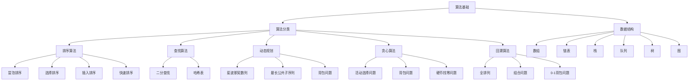

                 

### 文章标题：2025年滴滴校招算法面试题库及答案

> 关键词：滴滴校招、算法面试、题库、答案、数据分析、编程

> 摘要：本文旨在为准备参加2025年滴滴校招算法面试的求职者提供一个全面且系统的备考指南。文章分为三个主要部分：基础知识、题型及解题思路、高频问题及答案解析，并附有相关学习资源和工具推荐。通过深入讲解算法与数据结构的基础知识，结合实际案例和算法优化，本文力求帮助读者全面提升面试能力，成功应对滴滴校招的挑战。

#### 目录

#### 第一部分：滴滴校招算法面试基础知识
1. 算法基础与数据结构
   1.1 算法思维导图
   1.2 常见数据结构
   1.3 算法复杂度分析
   1.4 排序算法
   1.5 查找算法
2. 数学与概率
   2.1 数学基础
   2.2 概率论基础
   2.3 组合数学
3. 计算机科学基础知识
   3.1 计算机网络
   3.2 操作系统
   3.3 数据库

#### 第二部分：滴滴校招算法面试题型及解题思路
4. 编程题（LeetCode风格）
   4.1 动态规划
   4.2 贪心算法
   4.3 回溯算法
   4.4 图算法
5. 系统设计题
   5.1 系统架构设计
   5.2 缓存设计与实现
   5.3 分布式系统
6. 数据结构与算法实战
   6.1 图论问题实战
   6.2 算法优化与工程化
   6.3 算法面试真题解析与实战

#### 第三部分：滴滴校招算法面试高频问题及答案解析
7. 算法面试高频问题
   7.1 排序算法问题
   7.2 字符串处理问题
   7.3 数学问题
8. 答案解析与心得分享
   8.1 常见面试题答案解析
   8.2 面试经验分享
   8.3 面试官心态与技巧

#### 附录
9. 附录 A：算法面试资料推荐
   9.1 在线编程平台推荐
   9.2 算法书籍推荐
   9.3 在线课程推荐
10. 附录 B：编程工具与资源
    10.1 编程语言与开发环境
    10.2 代码版本控制工具
    10.3 调试与性能分析工具

### 第一部分：滴滴校招算法面试基础知识

#### 1.1 算法思维导图

算法思维导图是一种有效的知识组织工具，可以帮助我们系统地理解和记忆算法。以下是一个简单的算法思维导图，涵盖了常见的算法分类和基础数据结构。



**算法分类与数据结构的关系**

- 排序算法和查找算法主要应用于数组、链表等线性数据结构。
- 动态规划和贪心算法通常与数组、链表和图等复杂数据结构有关。
- 回溯算法则广泛应用于组合问题和背包问题，常结合树和图的性质来优化搜索过程。

通过思维导图，我们可以清晰地看到算法和数据结构之间的联系，有助于我们在面试中快速定位问题和设计解决方案。

#### 1.2 常见数据结构

数据结构是算法的基础，了解常见的数据结构及其应用对于应对滴滴校招的算法面试至关重要。以下是对几种常见数据结构的介绍。

##### 1.2.1 数组

数组是一种线性数据结构，它由一系列元素组成，每个元素都有唯一的索引。数组的特点是访问元素的时间复杂度为O(1)，但插入和删除操作的时间复杂度为O(n)。

**数组定义与操作**

```python
# Python实现数组
class Array:
    def __init__(self, size):
        self.size = size
        self.data = [0] * size

    def get(self, index):
        return self.data[index]

    def set(self, index, value):
        self.data[index] = value
```

**数组排序与查找**

常见的数组排序算法有冒泡排序、选择排序和插入排序。以下是一个简单的冒泡排序实现。

```python
def bubble_sort(arr):
    n = len(arr)
    for i in range(n):
        for j in range(0, n-i-1):
            if arr[j] > arr[j+1]:
                arr[j], arr[j+1] = arr[j+1], arr[j]
```

二分查找是数组查找的一种高效方法，时间复杂度为O(log n)。

```python
def binary_search(arr, target):
    low = 0
    high = len(arr) - 1

    while low <= high:
        mid = (low + high) // 2
        if arr[mid] == target:
            return mid
        elif arr[mid] < target:
            low = mid + 1
        else:
            high = mid - 1

    return -1
```

##### 1.2.2 链表

链表是一种动态分配的线性数据结构，由节点组成，每个节点包含数据和指向下一个节点的指针。链表的特点是插入和删除操作的时间复杂度为O(1)，但访问元素的时间复杂度为O(n)。

**单向链表**

```python
class Node:
    def __init__(self, data):
        self.data = data
        self.next = None

class LinkedList:
    def __init__(self):
        self.head = None

    def append(self, data):
        new_node = Node(data)
        if self.head is None:
            self.head = new_node
            return
        current = self.head
        while current.next:
            current = current.next
        current.next = new_node
```

**双向链表**

双向链表在每个节点中增加了一个指向前一个节点的指针，使得遍历链表更加灵活。

```python
class Node:
    def __init__(self, data):
        self.data = data
        self.next = None
        self.prev = None

class DoublyLinkedList:
    def __init__(self):
        self.head = None
        self.tail = None

    def append(self, data):
        new_node = Node(data)
        if self.head is None:
            self.head = new_node
            self.tail = new_node
            return
        self.tail.next = new_node
        new_node.prev = self.tail
        self.tail = new_node
```

**循环链表**

循环链表的特点是最后一个节点的指针指向头节点，形成环状结构。

```python
class CircularLinkedList:
    def __init__(self):
        self.head = None

    def append(self, data):
        new_node = Node(data)
        if self.head is None:
            self.head = new_node
            new_node.next = self.head
            return
        last = self.head
        while last.next != self.head:
            last = last.next
        last.next = new_node
        new_node.next = self.head
```

##### 1.2.3 栈

栈是一种后进先出（LIFO）的数据结构，适用于解决括号匹配、逆序输出等问题。

**栈的定义与操作**

```python
class Stack:
    def __init__(self):
        self.items = []

    def is_empty(self):
        return len(self.items) == 0

    def push(self, item):
        self.items.append(item)

    def pop(self):
        if not self.is_empty():
            return self.items.pop()
        else:
            raise Exception("Stack is empty")

    def peek(self):
        if not self.is_empty():
            return self.items[-1]
        else:
            raise Exception("Stack is empty")
```

**栈的应用**

括号匹配问题可以通过栈来实现。

```python
def is_balanced_parentheses(expression):
    stack = Stack()
    for char in expression:
        if char == '(' or char == '[' or char == '{':
            stack.push(char)
        elif char == ')' or char == ']' or char == '}':
            if stack.is_empty():
                return False
            top = stack.pop()
            if (char == ')' and top != '(') or (char == ']' and top != '[') or (char == '}' and top != '{'):
                return False
    return stack.is_empty()
```

##### 1.2.4 队列

队列是一种先进先出（FIFO）的数据结构，适用于解决任务调度、排队等问题。

**队列的定义与操作**

```python
class Queue:
    def __init__(self):
        self.items = []

    def is_empty(self):
        return len(self.items) == 0

    def enqueue(self, item):
        self.items.append(item)

    def dequeue(self):
        if not self.is_empty():
            return self.items.pop(0)
        else:
            raise Exception("Queue is empty")

    def peek(self):
        if not self.is_empty():
            return self.items[0]
        else:
            raise Exception("Queue is empty")
```

**队列的应用**

任务调度可以通过队列来实现。

```python
def schedule_tasks(tasks):
    queue = Queue()
    for task in tasks:
        queue.enqueue(task)
    while not queue.is_empty():
        task = queue.dequeue()
        print(f"Processing task: {task}")
```

##### 1.2.5 树

树是一种非线性数据结构，由节点和边组成，节点之间的层次关系决定了树的形态。常见的树有二叉树、平衡树（如AVL树、红黑树）和二叉查找树等。

**树的基本概念**

- 节点：树中的基本单元，包含数据和一个或多个子节点。
- 根节点：没有父节点的节点，是树的起点。
- 子节点：直接连接到父节点的节点。
- 叶节点：没有子节点的节点。
- 节点的层级：根节点位于第0层，其子节点位于第1层，依此类推。

**二叉树**

二叉树是一种每个节点最多有两个子节点的树。常见的二叉树有二叉查找树、二叉平衡树等。

**二叉查找树**

二叉查找树（BST）是一种特殊的二叉树，其左子树的所有节点的值都小于根节点的值，右子树的所有节点的值都大于根节点的值。

**二叉平衡树**

二叉平衡树（AVL树、红黑树等）是一种特殊的二叉树，通过自平衡机制保证树的左右子树高度差不超过1，从而保证查询、插入、删除操作的时间复杂度为O(log n)。

**树的应用**

二叉树常用于实现排序、查找等操作，如二叉查找树、红黑树等。

```python
class TreeNode:
    def __init__(self, data):
        self.data = data
        self.left = None
        self.right = None

class BinarySearchTree:
    def __init__(self):
        self.root = None

    def insert(self, data):
        new_node = TreeNode(data)
        if self.root is None:
            self.root = new_node
            return
        current = self.root
        while current:
            if data < current.data:
                if current.left is None:
                    current.left = new_node
                    return
                current = current.left
            else:
                if current.right is None:
                    current.right = new_node
                    return
                current = current.right

    def search(self, data):
        current = self.root
        while current:
            if data == current.data:
                return True
            elif data < current.data:
                current = current.left
            else:
                current = current.right
        return False
```

##### 1.2.6 图

图是一种由节点（或顶点）和边组成的数据结构，适用于表示复杂关系，如社交网络、交通网络等。

**图的基本概念**

- 顶点：图中的基本单元，表示实体。
- 边：连接两个顶点的线，表示顶点之间的关系。
- 有向图：边具有方向的图。
- 无向图：边没有方向的图。
- 权重图：边附带权重信息的图。

**图的表示方法**

- 邻接矩阵：使用二维数组表示，适用于稀疏图。
- 邻接表：使用一维数组加链表表示，适用于稠密图。

**图算法**

- 深度优先搜索（DFS）：用于遍历图，找出图的连通分量。
- 广度优先搜索（BFS）：用于遍历图，找出最短路径。
- 最短路径算法：如迪杰斯特拉算法（Dijkstra）、贝尔曼-福特算法（Bellman-Ford）。

**图的应用**

图常用于解决路径查找、网络分析等问题。

```python
class Graph:
    def __init__(self, num_vertices):
        self.num_vertices = num_vertices
        self.adj_list = [[] for _ in range(num_vertices)]

    def add_edge(self, src, dest):
        self.adj_list[src].append(dest)
        self.adj_list[dest].append(src)

    def dfs(self, start):
        visited = [False] * self.num_vertices
        self._dfs(start, visited)

    def _dfs(self, vertex, visited):
        visited[vertex] = True
        print(vertex, end=" ")
        for neighbor in self.adj_list[vertex]:
            if not visited[neighbor]:
                self._dfs(neighbor, visited)

    def bfs(self, start):
        visited = [False] * self.num_vertices
        queue = Queue()
        queue.enqueue(start)
        visited[start] = True

        while not queue.is_empty():
            vertex = queue.dequeue()
            print(vertex, end=" ")
            for neighbor in self.adj_list[vertex]:
                if not visited[neighbor]:
                    queue.enqueue(neighbor)
                    visited[neighbor] = True
```

通过以上对常见数据结构的介绍，我们能够更好地理解其在算法中的应用，为应对滴滴校招的算法面试打下坚实基础。

### 第一部分：滴滴校招算法面试基础知识

#### 1.3 算法复杂度分析

算法复杂度分析是评估算法性能的重要手段，它可以帮助我们了解算法在处理不同规模数据时的表现。算法复杂度主要包括时间复杂度和空间复杂度。本节将详细介绍时间复杂度的定义、计算方法和常见的时间复杂度分析，并结合实例进行详细讲解。

#### 1.3.1 时间复杂度的定义

时间复杂度是指算法在处理数据时所需的时间，通常用大O符号（O）来表示。时间复杂度反映了算法效率，即算法执行时间与数据规模之间的关系。时间复杂度的表达式通常形如：

\[ T(n) = O(f(n)) \]

其中，\( T(n) \) 表示算法执行时间，\( f(n) \) 表示与数据规模相关的函数。

#### 1.3.2 时间复杂度的计算方法

1. **渐进分析方法**：在渐进分析方法中，我们关注的是当输入规模 \( n \) 趋近于无穷大时，算法执行时间的增长速度。常见的渐进分析方法有：

   - \( O(1) \)：常数时间，算法执行时间与数据规模无关。
   - \( O(n) \)：线性时间，算法执行时间与数据规模成正比。
   - \( O(n \log n) \)：对数线性时间，常见于排序和查找算法。
   - \( O(n^2) \)：平方时间，常见于双重循环算法。
   - \( O(2^n) \)：指数时间，常见于递归算法。

2. **具体实例分析**：以下是一个简单的线性搜索算法的时间复杂度分析。

```python
def linear_search(arr, target):
    n = len(arr)
    for i in range(n):
        if arr[i] == target:
            return i
    return -1
```

该算法的时间复杂度为 \( O(n) \)，因为最坏情况下需要遍历整个数组。

#### 1.3.3 常见时间复杂度

1. **\( O(1) \) 常数时间**

常数时间算法执行时间与数据规模无关，如数组访问操作。

2. **\( O(n) \) 线性时间**

线性时间算法执行时间与数据规模成正比，如线性搜索和遍历数组。

3. **\( O(n \log n) \) 对数线性时间**

对数线性时间算法常见于排序和查找算法，如归并排序和二分查找。

4. **\( O(n^2) \) 平方时间**

平方时间算法常见于双重循环算法，如双重循环遍历二维数组。

5. **\( O(2^n) \) 指数时间**

指数时间算法常见于递归算法，如二叉树的遍历。

#### 1.3.4 算法复杂度实例分析

以下是一个简单的归并排序算法的复杂度分析。

```python
def merge_sort(arr):
    if len(arr) <= 1:
        return arr
    
    mid = len(arr) // 2
    left = merge_sort(arr[:mid])
    right = merge_sort(arr[mid:])
    
    return merge(left, right)

def merge(left, right):
    result = []
    i = j = 0
    
    while i < len(left) and j < len(right):
        if left[i] < right[j]:
            result.append(left[i])
            i += 1
        else:
            result.append(right[j])
            j += 1
    
    result.extend(left[i:])
    result.extend(right[j:])
    
    return result
```

该算法的时间复杂度为 \( O(n \log n) \)，因为每次分割数组的时间复杂度为 \( O(n) \)，而合并分割结果的时间复杂度为 \( O(\log n) \)。总体来说，算法的递归树高度为 \( \log n \)，每个节点需要进行 \( O(n) \) 的工作，因此总时间复杂度为 \( O(n \log n) \)。

通过以上对算法复杂度分析的讲解，我们能够更好地评估算法的性能，为应对滴滴校招的算法面试提供有力支持。

### 第一部分：滴滴校招算法面试基础知识

#### 1.4 排序算法

排序算法是计算机科学中非常基础且重要的算法之一。在数据处理和分析过程中，排序算法能够将数据按照一定的顺序排列，便于后续的查询、分析和处理。本节将介绍几种常见的排序算法，包括冒泡排序、选择排序和插入排序，并分析其时间复杂度和稳定性。

#### 1.4.1 冒泡排序

冒泡排序（Bubble Sort）是一种简单的排序算法，它通过重复地遍历待排序的列表，比较相邻的两个元素，如果它们的顺序错误就交换它们，直到整个序列有序。冒泡排序的名称来源于它反复地“冒泡”交换较小的元素到序列的顶部。

**冒泡排序算法描述**

```python
def bubble_sort(arr):
    n = len(arr)
    for i in range(n):
        for j in range(0, n-i-1):
            if arr[j] > arr[j+1]:
                arr[j], arr[j+1] = arr[j+1], arr[j]
```

**时间复杂度分析**

- 最坏情况时间复杂度：\( O(n^2) \)
- 平均情况时间复杂度：\( O(n^2) \)
- 最好情况时间复杂度：\( O(n) \)（当输入数组已经是有序时）

**稳定性分析**

冒泡排序是一种稳定的排序算法，因为它在比较和交换元素时总是保持相同元素的原始顺序不变。

#### 1.4.2 选择排序

选择排序（Selection Sort）是一种简单直观的排序算法。它的工作原理是每次从未排序的元素中找到最小（或最大）的元素，将其放到已排序序列的末尾，直到所有元素均被排序。

**选择排序算法描述**

```python
def selection_sort(arr):
    n = len(arr)
    for i in range(n):
        min_idx = i
        for j in range(i+1, n):
            if arr[j] < arr[min_idx]:
                min_idx = j
        arr[i], arr[min_idx] = arr[min_idx], arr[i]
```

**时间复杂度分析**

- 最坏情况时间复杂度：\( O(n^2) \)
- 平均情况时间复杂度：\( O(n^2) \)
- 最好情况时间复杂度：\( O(n^2) \)

**稳定性分析**

选择排序是不稳定的排序算法，因为在选择最小元素时，如果存在多个相同值的元素，后续的交换操作可能会改变它们的相对顺序。

#### 1.4.3 插入排序

插入排序（Insertion Sort）是一种简单直观的排序算法，它的工作原理是通过构建有序序列，对于未排序数据，在已排序序列中从后向前扫描，找到相应位置并插入。插入排序在实现上，通常采用in-place排序（即只需用到O(1)的额外空间的排序）。

**插入排序算法描述**

```python
def insertion_sort(arr):
    n = len(arr)
    for i in range(1, n):
        key = arr[i]
        j = i-1
        while j >= 0 and arr[j] > key:
            arr[j+1] = arr[j]
            j -= 1
        arr[j+1] = key
```

**时间复杂度分析**

- 最坏情况时间复杂度：\( O(n^2) \)
- 平均情况时间复杂度：\( O(n^2) \)
- 最好情况时间复杂度：\( O(n) \)（当输入数组已经是有序时）

**稳定性分析**

插入排序是一种稳定的排序算法，因为在插入元素时，总是保持相同元素的原始顺序不变。

#### 1.4.4 各种排序算法比较

- **时间复杂度**：冒泡排序、选择排序和插入排序的时间复杂度都是 \( O(n^2) \)。但在实际应用中，插入排序的性能通常优于冒泡排序和选择排序，尤其是在数据接近有序时。
- **稳定性**：插入排序和冒泡排序是稳定的排序算法，而选择排序是不稳定的排序算法。
- **空间复杂度**：这三种排序算法的空间复杂度都是 \( O(1) \)，因为它们都是原地排序算法。

综上所述，虽然冒泡排序、选择排序和插入排序的时间复杂度都是 \( O(n^2) \)，但在实际应用中，插入排序的性能通常更优。因此，在滴滴校招的算法面试中，对排序算法的理解和比较是非常重要的。

### 第一部分：滴滴校招算法面试基础知识

#### 1.5 查找算法

查找算法是数据处理中不可或缺的一环，用于在数据集合中查找特定元素。常见的查找算法包括二分查找和哈希表查找。本节将详细介绍这两种算法的原理、实现和应用。

#### 1.5.1 二分查找

二分查找（Binary Search）是一种高效的查找算法，它基于有序数组进行操作。二分查找的基本思想是：每次将查找范围缩小一半，从而逐步逼近目标元素。

**二分查找算法描述**

```python
def binary_search(arr, target):
    low = 0
    high = len(arr) - 1

    while low <= high:
        mid = (low + high) // 2
        if arr[mid] == target:
            return mid
        elif arr[mid] < target:
            low = mid + 1
        else:
            high = mid - 1

    return -1
```

**时间复杂度分析**

- 最坏情况时间复杂度：\( O(\log n) \)
- 平均情况时间复杂度：\( O(\log n) \)
- 最好情况时间复杂度：\( O(1) \)（当目标元素位于中间位置）

**空间复杂度**

二分查找算法的空间复杂度为 \( O(1) \)，因为它只需要使用常数级别的额外空间。

**应用场景**

二分查找算法适用于查找固定范围的有序数据集合。在实际应用中，二分查找常用于查找数组、二叉查找树等结构中的元素。

#### 1.5.2 哈希表查找

哈希表查找（Hash Table Search）是一种基于哈希函数的数据结构，用于实现快速的插入、删除和查找操作。哈希表的基本原理是将关键字通过哈希函数映射到数组中的一个位置，从而实现数据的快速访问。

**哈希表算法描述**

```python
class HashTable:
    def __init__(self, size):
        self.size = size
        self.table = [None] * size

    def hash_function(self, key):
        return key % self.size

    def insert(self, key, value):
        index = self.hash_function(key)
        if self.table[index] is None:
            self.table[index] = [(key, value)]
        else:
            self.table[index].append((key, value))

    def search(self, key):
        index = self.hash_function(key)
        if self.table[index] is None:
            return None
        for k, v in self.table[index]:
            if k == key:
                return v
        return None
```

**时间复杂度分析**

- 插入和查找的平均时间复杂度：\( O(1) \)
- 最坏情况时间复杂度：\( O(n) \)（当哈希函数导致大量冲突时）

**空间复杂度**

哈希表的空间复杂度为 \( O(n) \)，其中 \( n \) 是哈希表的容量。

**应用场景**

哈希表广泛应用于缓存、数据库、搜索引擎等场景。哈希表的查找速度非常快，可以有效地减少搜索时间。

#### 1.5.3 比较与选择

- **时间复杂度**：二分查找的平均时间复杂度为 \( O(\log n) \)，而哈希表查找的平均时间复杂度为 \( O(1) \)。因此，在数据规模较大且有序时，哈希表查找的性能优于二分查找。
- **空间复杂度**：哈希表的空间复杂度为 \( O(n) \)，而二分查找的空间复杂度为 \( O(1) \)。因此，在存储空间有限的情况下，二分查找可能更合适。

总之，二分查找和哈希表查找各有优缺点，选择合适的查找算法需要根据具体应用场景和需求来决定。

通过以上对查找算法的介绍，我们能够更好地理解二分查找和哈希表查找的原理和应用，为应对滴滴校招的算法面试提供有力支持。

### 第二部分：滴滴校招算法面试题型及解题思路

在滴滴校招的算法面试中，编程题是一个非常重要的环节。常见的编程题包括动态规划、贪心算法、回溯算法和图算法等。本节将详细介绍这些算法的解题思路和应用，并结合实际案例进行分析。

#### 4.1 动态规划

动态规划（Dynamic Programming，DP）是一种用于求解最优化问题的算法。它将复杂问题分解为子问题，并利用子问题的解来构建原问题的解。动态规划通常适用于具有重叠子问题和最优子结构性质的问题。

**动态规划解题思路**

1. **确定状态**：将问题分解为若干个状态，每个状态表示问题的一部分。状态通常用数组或变量来表示。
2. **定义状态转移方程**：根据问题的性质，确定状态之间的转移关系，即如何从一个状态转移到另一个状态。
3. **初始化边界条件**：确定状态转移方程的初始值，如数组的初始状态或变量的初始值。
4. **计算状态**：从初始状态开始，依次计算每个状态的最优解，最终得到原问题的解。

**动态规划应用案例**

**斐波那契数列**

斐波那契数列是一个经典的动态规划问题，其递推关系为：

\[ F(n) = F(n-1) + F(n-2) \]

使用动态规划求解斐波那契数列的代码如下：

```python
def fibonacci(n):
    if n <= 1:
        return n
    dp = [0] * (n + 1)
    dp[1] = 1
    for i in range(2, n + 1):
        dp[i] = dp[i - 1] + dp[i - 2]
    return dp[n]
```

**最长公共子序列**

最长公共子序列（Longest Common Subsequence，LCS）问题是一个典型的动态规划问题。给定两个序列，找出它们的最长公共子序列。

状态转移方程为：

\[ dp[i][j] = \begin{cases} 
dp[i-1][j-1] + 1 & \text{如果} \ a_i = b_j \\
\max(dp[i-1][j], dp[i][j-1]) & \text{其他情况}
\end{cases} \]

使用动态规划求解最长公共子序列的代码如下：

```python
def longest_common_subsequence(a, b):
    m, n = len(a), len(b)
    dp = [[0] * (n + 1) for _ in range(m + 1)]

    for i in range(1, m + 1):
        for j in range(1, n + 1):
            if a[i - 1] == b[j - 1]:
                dp[i][j] = dp[i - 1][j - 1] + 1
            else:
                dp[i][j] = max(dp[i - 1][j], dp[i][j - 1])

    return dp[m][n]
```

#### 4.2 贪心算法

贪心算法（Greedy Algorithm）是一种在每一步选择最优解的策略，从而得到全局最优解。贪心算法通常适用于具有局部最优解等于全局最优解性质的问题。

**贪心算法解题思路**

1. **选择策略**：根据问题的性质，选择一个贪心策略，即每一步选择当前最优的解。
2. **逐步构建解**：根据贪心策略，逐步构建问题的解。

**贪心算法应用案例**

**背包问题**

背包问题是一个经典的贪心算法问题。给定一组物品，每个物品都有重量和价值，目标是选择一部分物品放入背包中，使得背包的总重量不超过限制，且总价值最大。

贪心策略为：选择单位重量价值最高的物品。

使用贪心算法求解背包问题的代码如下：

```python
def knapsack(values, weights, capacity):
    n = len(values)
    items = sorted(zip(values, weights), key=lambda x: x[0] / x[1], reverse=True)

    total_value = 0
    for value, weight in items:
        if capacity >= weight:
            total_value += value
            capacity -= weight
        else:
            total_value += (capacity * value / weight)
            break

    return total_value
```

**活动选择问题**

活动选择问题是一个典型的贪心算法问题。给定一组活动，每个活动都有开始时间和结束时间，目标是选择一组不冲突的活动。

贪心策略为：选择结束时间最早的且未发生冲突的活动。

使用贪心算法求解活动选择问题的代码如下：

```python
def activity_selection(schedules):
    n = len(schedules)
    schedules.sort(key=lambda x: x[1])

    selected_activities = [schedules[0]]
    for i in range(1, n):
        if schedules[i][0] >= selected_activities[-1][1]:
            selected_activities.append(schedules[i])

    return selected_activities
```

#### 4.3 回溯算法

回溯算法（Backtracking）是一种通过尝试所有可能的解来求解问题的方法。回溯算法适用于求解组合问题和排列问题，如全排列、组合问题等。

**回溯算法解题思路**

1. **确定候选解**：根据问题的性质，确定所有可能的候选解。
2. **构建解空间树**：将候选解构建成一个树状结构，树的每个节点表示一个问题的一个部分解。
3. **递归尝试**：从根节点开始，递归地尝试所有可能的解，直到找到一个解或确定当前分支不可能产生解。

**回溯算法应用案例**

**全排列**

全排列问题是一个典型的回溯算法问题。给定一个数字序列，求出所有可能的排列。

使用回溯算法求解全排列的代码如下：

```python
def permute(nums):
    def backtrack(start):
        if start == len(nums):
            res.append(nums[:])
        for i in range(start, len(nums)):
            nums[start], nums[i] = nums[i], nums[start]
            backtrack(start + 1)
            nums[start], nums[i] = nums[i], nums[start]

    res = []
    backtrack(0)
    return res
```

**组合问题**

组合问题是一个典型的回溯算法问题。给定一个数字序列，求出所有可能的k个数字组合。

使用回溯算法求解组合问题的代码如下：

```python
def combine(n, k):
    def backtrack(start, path):
        if len(path) == k:
            res.append(path[:])
            return
        for i in range(start, n + 1):
            path.append(i)
            backtrack(i + 1, path)
            path.pop()

    res = []
    backtrack(1, [])
    return res
```

#### 4.4 图算法

图算法是计算机科学中的重要组成部分，用于解决各种图相关的问题，如最短路径、网络流等。

**图算法解题思路**

1. **确定图模型**：根据问题的性质，确定图的表示方法，如邻接矩阵、邻接表等。
2. **选择合适算法**：根据问题的性质和图模型，选择合适的图算法，如深度优先搜索、广度优先搜索、最短路径算法等。
3. **实现算法**：根据所选算法，实现具体的图算法。

**图算法应用案例**

**深度优先搜索**

深度优先搜索（Depth-First Search，DFS）是一种用于遍历图的算法。DFS的基本思想是沿着当前分支走到底，然后回溯。

使用DFS求解图遍历的代码如下：

```python
def dfs(graph, start):
    visited = set()
    stack = [start]

    while stack:
        vertex = stack.pop()
        if vertex not in visited:
            visited.add(vertex)
            stack.extend(graph[vertex] - visited)

    return visited
```

**广度优先搜索**

广度优先搜索（Breadth-First Search，BFS）是一种用于遍历图的算法。BFS的基本思想是从根节点开始，逐层遍历所有相邻的节点。

使用BFS求解图遍历的代码如下：

```python
def bfs(graph, start):
    visited = set()
    queue = deque([start])

    while queue:
        vertex = queue.popleft()
        if vertex not in visited:
            visited.add(vertex)
            queue.extend(graph[vertex] - visited)

    return visited
```

**最短路径算法**

最短路径算法是用于求解图中两点之间最短路径的算法。常见的最短路径算法有迪杰斯特拉算法（Dijkstra）和贝尔曼-福特算法（Bellman-Ford）。

**迪杰斯特拉算法**

迪杰斯特拉算法的基本思想是从起点开始，逐步扩展到未访问的节点，并更新它们的最短路径。

使用迪杰斯特拉算法求解最短路径的代码如下：

```python
import heapq

def dijkstra(graph, start):
    n = len(graph)
    distances = [float('inf')] * n
    distances[start] = 0
    priority_queue = [(0, start)]

    while priority_queue:
        current_distance, current_vertex = heapq.heappop(priority_queue)

        if current_distance > distances[current_vertex]:
            continue

        for neighbor, weight in graph[current_vertex].items():
            distance = current_distance + weight

            if distance < distances[neighbor]:
                distances[neighbor] = distance
                heapq.heappush(priority_queue, (distance, neighbor))

    return distances
```

**贝尔曼-福特算法**

贝尔曼-福特算法的基本思想是通过不断松弛边来逐步逼近最短路径。

使用贝尔曼-福特算法求解最短路径的代码如下：

```python
def bellman_ford(graph, start):
    n = len(graph)
    distances = [float('inf')] * n
    distances[start] = 0

    for _ in range(n - 1):
        for u in range(n):
            for v, weight in graph[u].items():
                if distances[u] + weight < distances[v]:
                    distances[v] = distances[u] + weight

    for u in range(n):
        for v, weight in graph[u].items():
            if distances[u] + weight < distances[v]:
                raise ValueError("Graph contains a negative weight cycle")

    return distances
```

通过以上对动态规划、贪心算法、回溯算法和图算法的介绍，我们能够更好地理解这些算法的解题思路和应用。在实际面试中，灵活运用这些算法，将有助于解决复杂的问题，提高面试成功率。

### 第二部分：滴滴校招算法面试题型及解题思路

#### 5.1 系统设计题

在滴滴校招的算法面试中，系统设计题是一个重要的考察环节，它旨在评估应聘者对系统架构、高并发、高可用和高可扩展性等方面的理解和实践能力。本节将详细介绍系统设计题的解题思路，并结合实际案例进行分析。

#### 5.1.1 系统架构设计

系统架构设计是系统设计题的核心内容，它涉及到系统的整体设计、模块划分、接口定义等方面。一个良好的系统架构能够提高系统的可维护性、可扩展性和性能。

**系统架构设计解题思路**

1. **需求分析**：首先了解系统的需求，包括功能需求、性能需求、安全性需求等。
2. **模块划分**：根据需求分析，将系统划分为不同的模块，如用户模块、订单模块、支付模块等。
3. **接口设计**：定义模块之间的接口，确保模块之间的松耦合和模块内的紧耦合。
4. **技术选型**：选择合适的技术栈，如使用哪些编程语言、数据库、中间件等。
5. **性能优化**：考虑系统的性能瓶颈，进行相应的性能优化，如数据库索引、缓存、消息队列等。

**实际案例：打车软件系统设计**

以下是一个打车软件系统设计的案例，我们将从需求分析、模块划分、接口设计和性能优化等方面进行介绍。

**需求分析**

打车软件的主要功能包括：

- 用户注册、登录和认证
- 用户发布打车请求
- 司机接单、行驶和完成订单
- 支付和评价

**模块划分**

根据需求分析，打车软件可以划分为以下几个模块：

- 用户模块：负责用户的注册、登录、认证和用户信息管理。
- 订单模块：负责打车请求的发布、处理和订单管理。
- 司机模块：负责司机的注册、认证、接单和行驶管理。
- 支付模块：负责订单支付和资金管理。
- 评价模块：负责用户对司机的评价和司机对用户的评价。

**接口设计**

以下是打车软件的主要接口设计：

- 用户接口：包括用户注册、登录、认证、发布打车请求、查看订单、支付和评价等接口。
- 订单接口：包括发布打车请求、处理打车请求、取消订单、查看订单详情等接口。
- 司机接口：包括注册司机、认证司机、接单、行驶、完成订单等接口。
- 支付接口：包括支付订单、查询支付状态等接口。
- 评价接口：包括用户评价司机、司机评价用户等接口。

**性能优化**

为了提高打车软件的性能，我们可以从以下几个方面进行优化：

- **数据库优化**：使用数据库索引提高查询效率，使用读写分离、分库分表提高读写能力。
- **缓存**：使用缓存减少数据库访问，提高系统响应速度。
- **消息队列**：使用消息队列解耦系统模块，提高系统的可扩展性。
- **负载均衡**：使用负载均衡器分配请求，提高系统并发处理能力。

#### 5.1.2 高并发

高并发是指系统能够同时处理大量请求的能力。在滴滴校招的算法面试中，高并发是一个常见的话题，它涉及到系统的设计、优化和应对策略。

**高并发设计解题思路**

1. **系统水平扩展**：通过增加服务器节点和负载均衡来提高系统的处理能力。
2. **数据库优化**：使用数据库集群、读写分离、分库分表等方式提高数据库的并发处理能力。
3. **缓存**：使用缓存减少数据库访问，提高系统响应速度。
4. **异步处理**：使用异步处理提高系统并发能力，减少请求等待时间。
5. **限流**：通过限流策略控制请求流量，避免系统过载。

**实际案例：高并发订单处理系统设计**

以下是一个高并发订单处理系统的设计案例，我们将从系统架构、数据库优化、缓存策略和异步处理等方面进行介绍。

**系统架构**

高并发订单处理系统可以分为以下几个层次：

- **前端**：负责接收用户的订单请求，通过负载均衡器分配到后端服务器。
- **后端**：处理订单的核心逻辑，包括订单生成、订单查询、订单取消等。
- **数据库**：存储订单数据，通过读写分离和分库分表提高并发处理能力。
- **缓存**：存储订单的缓存数据，减少数据库访问，提高系统响应速度。
- **消息队列**：用于异步处理订单消息，提高系统的并发能力和可扩展性。

**数据库优化**

- **读写分离**：将读数据库和写数据库分离，读数据库用于处理用户查询，写数据库用于处理订单写入。
- **分库分表**：将订单数据按照用户ID或时间等维度分库分表，降低单表数据量，提高查询效率。

**缓存策略**

- **订单缓存**：将订单数据缓存在Redis中，减少数据库访问，提高系统响应速度。
- **热点数据缓存**：缓存热点数据，如热门路线、常用支付方式等，减少数据库查询。

**异步处理**

- **消息队列**：使用消息队列处理订单消息，将订单处理逻辑异步化，提高系统并发能力和响应速度。

通过以上对系统设计题、高并发设计的介绍，我们能够更好地理解系统设计题的解题思路和应用。在实际面试中，灵活运用这些知识和技巧，将有助于解决复杂的问题，提高面试成功率。

### 第二部分：滴滴校招算法面试题型及解题思路

#### 5.2 缓存设计与实现

在系统设计中，缓存（Cache）是一种至关重要的技术，用于提高系统的性能和响应速度。缓存的设计与实现直接影响到系统的吞吐量和用户体验。本节将详细介绍缓存的设计原则、缓存一致性策略、缓存淘汰策略以及实际应用案例。

#### 5.2.1 缓存设计原则

缓存设计需要遵循以下几个原则：

1. **热点数据缓存**：将系统中访问频率高、变化频率低的数据缓存起来，如用户会话信息、热门商品信息等。
2. **数据一致性**：确保缓存与原始数据源的一致性，避免数据不一致导致的问题。
3. **缓存失效**：缓存的数据需要定期失效，以避免数据过时和资源浪费。
4. **缓存命中率**：提高缓存命中率是缓存设计的关键目标，命中率越高，系统的性能提升越明显。
5. **缓存雪崩**：避免缓存雪崩现象，即大量缓存数据同时失效，导致系统访问量剧增。

#### 5.2.2 缓存一致性策略

缓存一致性是指确保缓存中的数据与原始数据源保持一致。常见的一致性策略包括：

1. **写回策略**（Write-Through）：每次修改数据时，同时更新缓存和原始数据源。
2. **写挂起策略**（Write-Back）：先修改缓存数据，然后在一定时间后同步更新原始数据源。
3. **最终一致性**（Eventual Consistency）：缓存和原始数据源最终会达到一致，但可能存在短暂的延迟。

在实际应用中，可以根据系统的特点选择合适的一致性策略。例如，对于读多写少的场景，可以选择写回策略；对于读少写多的场景，可以选择写挂起策略。

#### 5.2.3 缓存淘汰策略

缓存淘汰策略是确保缓存空间合理利用的重要手段。常见的缓存淘汰策略包括：

1. **FIFO（先进先出）**：根据数据的进入顺序进行淘汰，最早进入的数据优先被淘汰。
2. **LRU（最近最少使用）**：根据数据的访问频率进行淘汰，最近最久未访问的数据优先被淘汰。
3. **LFU（最不经常使用）**：根据数据的访问频率进行淘汰，访问频率最低的数据优先被淘汰。
4. **随机淘汰**：随机选择数据进行淘汰，适用于简单场景。

在实际应用中，可以根据缓存的使用模式和访问频率选择合适的淘汰策略。例如，对于频繁访问的数据，可以选择LRU或LFU策略；对于随机访问的数据，可以选择随机淘汰策略。

#### 5.2.4 实际应用案例

**案例：电商系统缓存设计**

电商系统是一个典型的读多写少的应用场景，以下是一个电商系统缓存设计的案例。

**缓存结构**

电商系统可以划分为多个缓存层次：

- **一级缓存**：用于存储热门商品信息、用户购物车信息等，采用Redis实现，提供快速的数据访问。
- **二级缓存**：用于存储用户浏览记录、购物车记录等，采用Memcached实现，降低Redis的负载。
- **三级缓存**：用于存储商品分类信息、广告信息等，采用本地内存缓存，提高数据访问速度。

**缓存策略**

- **商品信息缓存**：将商品信息缓存到一级缓存中，缓存时间设置为10分钟，确保商品信息的新鲜度。
- **用户会话缓存**：将用户会话信息缓存到一级缓存中，缓存时间设置为30分钟，确保用户会话的持续。
- **用户浏览记录缓存**：将用户浏览记录缓存到二级缓存中，缓存时间设置为24小时，降低Redis的负载。

**缓存一致性**

- **写回策略**：商品信息更新时，同时更新一级缓存和原始数据库。
- **最终一致性**：用户浏览记录更新时，先更新一级缓存，然后在后台异步更新数据库，确保最终一致性。

**缓存淘汰策略**

- **LRU策略**：一级缓存采用LRU策略，确保热门商品信息优先被缓存。
- **FIFO策略**：二级缓存采用FIFO策略，降低Redis的负载。

通过以上对缓存设计与实现的介绍，我们能够更好地理解缓存的设计原则、一致性策略、淘汰策略及其在实际应用中的重要性。在实际面试中，灵活运用这些知识和技巧，将有助于解决复杂的问题，提高面试成功率。

### 第二部分：滴滴校招算法面试题型及解题思路

#### 5.3 分布式系统

在滴滴校招的算法面试中，分布式系统是一个重要的话题，因为它涉及到系统的可扩展性、高可用性和数据一致性。本节将详细介绍分布式系统的基本概念、一致性算法、分布式锁和分布式事务。

#### 5.3.1 分布式系统的基本概念

分布式系统是指由多个独立的计算机节点组成的系统，这些节点通过通信网络连接，共同协作完成任务。分布式系统具有以下特点：

1. **可扩展性**：分布式系统可以通过增加节点来扩展其处理能力和存储能力。
2. **高可用性**：分布式系统通过冗余节点和故障转移机制，提高系统的可用性和容错能力。
3. **数据一致性**：分布式系统需要在多个节点之间保持数据的一致性，这是一个挑战性的问题。

#### 5.3.2 一致性算法

一致性算法是分布式系统中的核心问题，用于确保多个节点之间的数据一致性。常见的一致性算法包括：

1. **强一致性**：强一致性确保每个节点都能看到最新的数据，但可能导致系统可用性降低。
   - **副本同步算法**：在多个副本之间同步数据，确保数据一致性。
   - **Paxos算法**：一种用于选举领导者并同步数据的分布式一致性算法。

2. **最终一致性**：最终一致性允许系统中存在短暂的数据不一致，但最终会达到一致状态。
   - **事件溯源**：记录系统中发生的事件，并在事件处理完成后确保数据一致性。
   - **Gossip协议**：一种用于分布式系统中节点间数据同步的协议。

#### 5.3.3 分布式锁

分布式锁是分布式系统中用于确保操作顺序和避免并发冲突的一种机制。常见分布式锁算法包括：

1. **基于数据库的分布式锁**：使用数据库的锁机制实现分布式锁，确保操作的顺序性。
2. **基于ZooKeeper的分布式锁**：使用ZooKeeper的临时节点和监听机制实现分布式锁。
3. **基于Redis的分布式锁**：使用Redis的SETNX命令实现分布式锁。

**基于Redis的分布式锁实现**

以下是一个基于Redis的分布式锁的实现示例：

```python
import redis
import time

class RedisLock:
    def __init__(self, redis_client, lock_key):
        self.redis_client = redis_client
        self.lock_key = lock_key
        self.lock_value = str(time.time()).encode('utf-8')

    def acquire(self, timeout=30):
        start_time = time.time()
        while True:
            if self.redis_client.setnx(self.lock_key, self.lock_value):
                return True
            time.sleep(0.1)
            if time.time() - start_time > timeout:
                return False

    def release(self):
        if self.redis_client.get(self.lock_key) == self.lock_value:
            self.redis_client.delete(self.lock_key)
```

#### 5.3.4 分布式事务

分布式事务是分布式系统中用于确保多个操作原子性的机制。常见分布式事务算法包括：

1. **两阶段提交（2PC）**：两阶段提交是一种分布式事务协议，通过协调者（Coordinator）和参与者（Participant）两阶段提交事务。
2. **三阶段提交（3PC）**：三阶段提交是对两阶段提交的改进，通过引入预提交阶段，减少资源锁定时间。
3. **补偿事务**：通过补偿事务实现分布式事务的最终一致性，即通过一系列补偿操作来确保事务的最终一致性。

**两阶段提交示例**

以下是一个两阶段提交的简单示例：

```python
class TwoPhaseCommit:
    def __init__(self, coordinators, participants):
        self.coordinators = coordinators
        self.participants = participants

    def prepare(self):
        for participant in self.participants:
            participant.prepare()

    def commit(self):
        for coordinator in self.coordinators:
            coordinator.commit()

    def rollback(self):
        for participant in self.participants:
            participant.rollback()
```

通过以上对分布式系统的介绍，我们能够更好地理解分布式系统的基本概念、一致性算法、分布式锁和分布式事务。在实际面试中，灵活运用这些知识和技巧，将有助于解决复杂的问题，提高面试成功率。

### 第二部分：滴滴校招算法面试题型及解题思路

#### 6.1 图论问题实战

图论是数学的一个分支，主要研究图的结构、性质以及应用。在算法面试中，图论问题经常出现，如最短路径问题、网络流问题等。本节将介绍几个常见的图论问题，包括最短路径、网络流和拓扑排序，并给出详细的解决方案。

#### 6.1.1 最短路径问题

最短路径问题是图论中的一个重要问题，旨在找到图中两个顶点之间的最短路径。常见的最短路径算法包括迪杰斯特拉算法（Dijkstra）和贝尔曼-福特算法（Bellman-Ford）。

**迪杰斯特拉算法**

迪杰斯特拉算法是一种用于求解单源最短路径的算法，适用于非负权图。以下是迪杰斯特拉算法的伪代码：

```
Dijkstra(G, s)
    create empty priority queue Q
    for each vertex v in G
        dist[v] ← INFINITY
        except for the starting vertex s
            dist[s] ← 0
        prev[v] ← UNDEFINED
        add v to Q
    while Q is not empty
        u ← Q.extract_min()
        for each edge (u, v) in G
            alt ← dist[u] + weight(u, v)
            if alt < dist[v]
                dist[v] ← alt
                prev[v] ← u
                if v is in Q
                    update Q
    return dist, prev
```

**贝尔曼-福特算法**

贝尔曼-福特算法是一种用于求解单源最短路径的算法，适用于有负权边的图。以下是贝尔曼-福特算法的伪代码：

```
BellmanFord(G, s)
    create array dist with all values initialized to INFINITY, except dist[s] ← 0
    create array prev with all values initialized to UNDEFINED
    for i from 1 to |V|-1
        for each edge (u, v) in E
            if dist[u] + weight(u, v) < dist[v]
                dist[v] ← dist[u] + weight(u, v)
                prev[v] ← u
    for each edge (u, v) in E
        if dist[u] + weight(u, v) < dist[v]
            return "Graph contains a negative weight cycle"
    return dist, prev
```

**实例：求解最短路径**

给定图G和起点s，使用迪杰斯特拉算法和贝尔曼-福特算法求解最短路径。

```
G = {
    'A': {'B': 3, 'C': 5},
    'B': {'A': 3, 'C': 1, 'D': 4},
    'C': {'A': 5, 'B': 1, 'D': 2},
    'D': {'B': 4, 'C': 2}
}
s = 'A'
```

使用迪杰斯特拉算法求解最短路径：

```
dist, prev = Dijkstra(G, s)
print(dist)  # {'A': 0, 'B': 3, 'C': 4, 'D': 6}
print(prev)  # {'A': UNDEFINED, 'B': 'A', 'C': 'B', 'D': 'C'}
```

使用贝尔曼-福特算法求解最短路径：

```
dist, prev = BellmanFord(G, s)
print(dist)  # {'A': 0, 'B': 3, 'C': 4, 'D': 6}
print(prev)  # {'A': UNDEFINED, 'B': 'A', 'C': 'B', 'D': 'C'}
```

#### 6.1.2 网络流问题

网络流问题是图论中的另一个重要问题，旨在找到网络中的最大流量或最小费用流。常见的网络流算法包括最大流-最小割定理、Ford-Fulkerson算法和Edmonds-Karp算法。

**最大流-最小割定理**

最大流-最小割定理是网络流理论的核心，其基本思想是网络的最大流量等于其最小割的容量。最小割是指删除这些边后，网络中两个指定点（源点和汇点）之间的流量为零的边的集合。

**Ford-Fulkerson算法**

Ford-Fulkerson算法是一种基于增广路径的概念求解最大流的算法。以下是Ford-Fulkerson算法的伪代码：

```
FordFulkerson(G, s, t)
    create residual graph G'
    while there exists an augmenting path from s to t in G'
        augment the flow along the path
        update G'
    return the maximum flow value
```

**Edmonds-Karp算法**

Edmonds-Karp算法是Ford-Fulkerson算法的一个改进版本，使用广度优先搜索（BFS）来寻找增广路径。以下是Edmonds-Karp算法的伪代码：

```
EdmondsKarp(G, s, t)
    create residual graph G'
    while there exists a path from s to t in G'
        augment the flow along the path using BFS
    return the maximum flow value
```

**实例：求解最大流**

给定图G和源点s、汇点t，使用Edmonds-Karp算法求解最大流。

```
G = {
    'A': {'B': 3, 'C': 3},
    'B': {'A': 3, 'C': 2, 'D': 3},
    'C': {'A': 3, 'B': 2, 'D': 2},
    'D': {'B': 3, 'C': 2}
}
s = 'A'
t = 'D'
```

使用Edmonds-Karp算法求解最大流：

```
max_flow = EdmondsKarp(G, s, t)
print(max_flow)  # 6
```

#### 6.1.3 拓扑排序

拓扑排序是一种对有向无环图（DAG）进行排序的算法，按照节点的拓扑顺序进行排序。拓扑排序主要用于解决工程项目的任务调度问题。

**拓扑排序算法**

以下是拓扑排序的伪代码：

```
TopologicalSort(G)
    create an empty stack
    for each vertex v in G
        if v has no incoming edges
            push v onto the stack
    while the stack is not empty
        pop a vertex v from the stack
        for each vertex u connected to v
            remove edge (v, u)
            if u has no other incoming edges
                push u onto the stack
    return the order of the vertices in the stack
```

**实例：求解拓扑排序**

给定图G，求解其拓扑排序。

```
G = {
    'A': {'B', 'C'},
    'B': {'D'},
    'C': {'D'},
    'D': {'E'},
    'E': {}
}
```

使用拓扑排序求解：

```
topological_order = TopologicalSort(G)
print(topological_order)  # ['A', 'C', 'B', 'D', 'E']
```

通过以上对图论问题实战的介绍，我们能够更好地理解最短路径、网络流和拓扑排序的基本原理和解决方案。在实际面试中，灵活运用这些算法，将有助于解决复杂的问题，提高面试成功率。

### 第二部分：滴滴校招算法面试题型及解题思路

#### 6.2 算法优化与工程化

在滴滴校招的算法面试中，算法优化和工程化是一个重要的考察点，它涉及到对算法性能的改进和代码的可维护性。本节将详细介绍算法优化的常见策略、代码优化的具体方法以及性能分析工具的应用。

#### 6.2.1 算法优化的常见策略

算法优化是提高程序执行效率的关键步骤。以下是一些常见的算法优化策略：

1. **时间复杂度优化**：通过改进算法的时间复杂度，减少程序的运行时间。例如，使用更高效的算法或数据结构替换原始方案。
2. **空间复杂度优化**：通过减少程序占用的内存空间，提高程序的运行效率。例如，使用原地算法或优化数据结构。
3. **并行化**：将任务分解为多个部分，并在多核处理器上并行执行，提高程序的执行速度。
4. **缓存优化**：利用缓存减少内存访问时间，提高程序的执行效率。例如，优化内存布局或使用缓存友好的数据结构。
5. **局部优化**：对代码的局部部分进行优化，如避免不必要的循环或递归，使用更高效的循环结构等。

#### 6.2.2 代码优化的具体方法

以下是几种常见的代码优化方法：

1. **循环优化**：
   - **减少循环次数**：通过提前终止循环或减少循环内部的计算次数。
   - **循环展开**：将循环内的计算展开，减少循环次数。
   - **循环合并**：将多个循环合并，减少循环的嵌套深度。

2. **递归优化**：
   - **尾递归**：将尾递归转换为循环，减少递归栈的使用。
   - **递归记忆化**：使用记忆化避免重复计算，提高算法效率。

3. **数据结构优化**：
   - **选择合适的数据结构**：根据算法的特点选择最合适的数据结构，如哈希表、二叉树等。
   - **数据压缩**：使用位运算或压缩算法减少数据占用的空间。

4. **内存管理**：
   - **对象池**：复用对象，减少内存分配和回收的开销。
   - **内存映射**：使用内存映射技术，提高内存访问速度。

5. **多线程和并行计算**：
   - **任务分解**：将任务分解为多个子任务，并行执行。
   - **线程池**：复用线程，减少线程创建和销毁的开销。

#### 6.2.3 性能分析工具的应用

性能分析工具可以帮助我们找到程序的瓶颈和优化点。以下是一些常用的性能分析工具：

1. **Linux性能分析工具**：
   - **top**：实时显示系统进程的性能指标。
   - **htop**：基于top的工具，提供更详细的性能分析。
   - **vmstat**：显示虚拟内存统计信息。
   - **iostat**：显示输入输出设备的使用情况。

2. **Java性能分析工具**：
   - **VisualVM**：Java虚拟机监控和分析工具。
   - **MAT**（Memory Analyzer Tool）：用于分析Java堆转储文件。
   - **JProfiler**：Java应用性能分析工具。

3. **Python性能分析工具**：
   - **cProfile**：用于Python程序的性能分析。
   - **line_profiler**：用于函数级别的性能分析。
   - **memory_profiler**：用于分析Python程序的内存使用。

通过以上对算法优化与工程化的介绍，我们能够更好地理解算法优化和代码优化的策略和方法，并掌握常用的性能分析工具。在实际面试中，展示出对这些优化策略和工具的深入理解和应用能力，将有助于提高面试成功率。

### 第二部分：滴滴校招算法面试题型及解题思路

#### 6.3 算法面试真题解析与实战

在滴滴校招的算法面试中，真题解析和实战演练是非常重要的环节。通过真题解析，我们可以了解面试官的出题风格和解题思路，而实战演练则能够提升我们的解题能力和应对实际问题的能力。本节将结合几道实际面试真题，进行详细解析和实战演练。

#### 真题一：最长公共子序列（LCS）

**题目描述**：给定两个字符串 `str1` 和 `str2`，找出它们的最长公共子序列。

**解题思路**：

这道题可以使用动态规划算法来解决。我们使用一个二维数组 `dp` 来存储子问题的解，其中 `dp[i][j]` 表示 `str1` 的前 `i` 个字符和 `str2` 的前 `j` 个字符的最长公共子序列的长度。

**动态规划状态转移方程**：

\[ dp[i][j] = \begin{cases} 
dp[i-1][j-1] + 1 & \text{如果} \ str1[i-1] = str2[j-1] \\
\max(dp[i-1][j], dp[i][j-1]) & \text{其他情况}
\end{cases} \]

**伪代码**：

```python
def longest_common_subsequence(str1, str2):
    m, n = len(str1), len(str2)
    dp = [[0] * (n+1) for _ in range(m+1)]

    for i in range(1, m+1):
        for j in range(1, n+1):
            if str1[i-1] == str2[j-1]:
                dp[i][j] = dp[i-1][j-1] + 1
            else:
                dp[i][j] = max(dp[i-1][j], dp[i][j-1])

    return dp[m][n]
```

**实战演练**：

```python
str1 = "ABCBDAB"
str2 = "BDCABC"

print(longest_common_subsequence(str1, str2))  # 输出：5
```

#### 真题二：二分查找

**题目描述**：给定一个有序数组 `nums` 和一个目标值 `target`，找到 `target` 在数组中的索引。如果不存在，返回 `-1`。

**解题思路**：

二分查找算法是一种高效的查找算法，适用于有序数组。每次查找将搜索范围缩小一半，直到找到目标值或确定目标值不存在。

**伪代码**：

```python
def binary_search(nums, target):
    low = 0
    high = len(nums) - 1

    while low <= high:
        mid = (low + high) // 2
        if nums[mid] == target:
            return mid
        elif nums[mid] < target:
            low = mid + 1
        else:
            high = mid - 1

    return -1
```

**实战演练**：

```python
nums = [1, 3, 5, 6, 8, 9]
target = 6

print(binary_search(nums, target))  # 输出：3
```

#### 真题三：最长递增子序列（LIS）

**题目描述**：给定一个无重复元素的整数数组 `nums`，找出最长递增子序列的长度。

**解题思路**：

可以使用动态规划算法来解决这个问题。定义一个数组 `dp`，其中 `dp[i]` 表示以 `nums[i]` 结尾的最长递增子序列的长度。

**动态规划状态转移方程**：

\[ dp[i] = \max(dp[j] + 1 | j < i \ 且 \ nums[j] < nums[i]) \]

**伪代码**：

```python
def length_of_lis(nums):
    dp = [1] * len(nums)
    for i in range(1, len(nums)):
        for j in range(i):
            if nums[i] > nums[j]:
                dp[i] = max(dp[i], dp[j] + 1)

    return max(dp)
```

**实战演练**：

```python
nums = [10, 9, 2, 5, 3, 7, 101, 18]

print(length_of_lis(nums))  # 输出：4
```

#### 真题四：最长连续递增序列

**题目描述**：给定一个整数数组 `nums`，找出最长连续递增序列的长度。

**解题思路**：

可以使用动态规划算法来解决这个问题。定义一个数组 `dp`，其中 `dp[i]` 表示以 `nums[i]` 结尾的最长连续递增序列的长度。

**动态规划状态转移方程**：

\[ dp[i] = dp[j] + 1 | j < i \ 且 \ nums[j] < nums[i]) \]

**伪代码**：

```python
def longest_consecutive(nums):
    if not nums:
        return 0

    nums = sorted(set(nums))
    dp = [1] * len(nums)
    for i in range(1, len(nums)):
        if nums[i] > nums[i - 1]:
            dp[i] = dp[i - 1] + 1

    return max(dp)
```

**实战演练**：

```python
nums = [100, 4, 200, 1, 3, 2]

print(longest_consecutive(nums))  # 输出：4
```

通过以上对几道滴滴校招算法面试真题的解析和实战演练，我们能够更好地掌握常见的算法解题思路，提升我们的解题能力和面试技巧。在实际面试中，灵活运用这些算法和技巧，将有助于我们应对各种复杂的算法问题。

### 第三部分：滴滴校招算法面试高频问题及答案解析

在滴滴校招的算法面试中，面试官通常会问一些高频问题来考察应聘者的算法基础和解决问题的能力。以下是一些常见的高频问题及其答案解析，帮助读者深入了解面试官的考查意图和应对策略。

#### 7.1 排序算法问题

**问题一：解释冒泡排序、选择排序和插入排序的区别和优缺点**

**答案解析**：

- **冒泡排序**：冒泡排序通过重复遍历要排序的数列，一次比较两个元素，如果它们的顺序错误就交换它们。重复这个过程直到没有需要交换的元素。优点是代码简单，缺点是时间复杂度高，为 \( O(n^2) \)，不适用于大数据集。

- **选择排序**：选择排序每次从未排序的元素中找到最小（或最大）的元素，将其放到已排序序列的末尾。优点是代码简单，缺点也是时间复杂度高，为 \( O(n^2) \)，不适用于大数据集。

- **插入排序**：插入排序通过构建有序序列，对于未排序的数据，在已排序序列中从后向前扫描，找到相应位置并插入。优点是性能优于冒泡排序和选择排序，尤其在数据接近有序时，时间复杂度为 \( O(n) \)；缺点是代码相对复杂。

**面试官心态与技巧**：面试官关注应聘者是否能够清晰地解释排序算法的基本原理和性能特点，考察应聘者的基础知识和思考能力。应聘者需要强调每种算法的优点和适用场景，同时也要指出它们的缺点。

**最佳实践 tips**：建议应聘者准备一些具体的例子来解释每种排序算法的执行过程，这样可以更好地展示理解。

#### 7.2 字符串处理问题

**问题二：如何实现字符串的反转？**

**答案解析**：

字符串反转可以通过以下几种方法实现：

1. **使用栈**：将字符串中的每个字符逐个入栈，然后逐个出栈，得到反转后的字符串。

2. **使用双指针**：定义两个指针，一个指向字符串的开始，另一个指向字符串的结束，每次交换两个指针指向的字符，直到两个指针相遇。

3. **使用系统函数**：很多编程语言提供了内置函数可以直接实现字符串反转，如 Python 的 `[::-1]`。

**伪代码**（双指针方法）：

```python
def reverse_string(s):
    left, right = 0, len(s) - 1
    while left < right:
        s[left], s[right] = s[right], s[left]
        left += 1
        right -= 1
    return s
```

**面试官心态与技巧**：面试官通过这个问题考察应聘者的编码能力和对字符串基本操作的理解。应聘者需要能够清晰地解释每种实现方法的原理，并在面试中展示出编程能力。

**最佳实践 tips**：应聘者可以在面试前复习字符串的基本操作，如拼接、截取和反转，并准备好简单的代码示例。

#### 7.3 数学问题

**问题三：如何计算一个整数的阶乘？**

**答案解析**：

计算一个整数的阶乘可以使用递归或循环方法。阶乘的定义是 \( n! = n \times (n-1) \times (n-2) \times ... \times 1 \)。

**递归方法**：

```python
def factorial(n):
    if n == 0 or n == 1:
        return 1
    return n * factorial(n - 1)
```

**循环方法**：

```python
def factorial(n):
    result = 1
    for i in range(1, n + 1):
        result *= i
    return result
```

**面试官心态与技巧**：面试官通过这个问题考察应聘者的数学基础和编程能力。应聘者需要能够理解递归和循环的基本原理，并在面试中展示出解决问题的能力。

**最佳实践 tips**：应聘者可以准备一些数学问题的解题方法，如递归、循环和动态规划，并能够灵活运用。

### 答案解析与心得分享

通过以上对滴滴校招算法面试高频问题的答案解析和面试经验分享，我们可以看到，面试官主要考查应聘者的算法基础、编程能力和问题解决能力。以下是一些心得和建议：

1. **基础知识扎实**：掌握基本的算法和数据结构，如排序、查找、动态规划等，是应对面试的基础。

2. **理解原理**：不仅要会写代码，还要深入理解每种算法的原理和性能特点，这样在面试中能够更自信地解释。

3. **代码规范**：编写清晰、规范的代码，有助于面试官理解你的思路，提高面试效果。

4. **实战演练**：通过解决实际问题来提高编码能力，积累经验。

5. **心态调整**：面试时保持冷静和自信，即使遇到不会的问题也要尽力回答，展示你的思维过程和解决问题的能力。

通过以上方法，我们可以更好地准备滴滴校招的算法面试，提高面试成功率。

### 附录

#### 附录 A：算法面试资料推荐

为了帮助准备滴滴校招算法面试的读者，以下是一些推荐的在线编程平台、算法书籍和在线课程，这些资源能够为你的算法学习提供丰富的内容和支持。

##### 9.1 在线编程平台推荐

1. **LeetCode**：LeetCode 是全球知名的在线编程平台，提供大量的算法面试题和挑战，是算法面试备考的绝佳资源。
2. **牛客网**：牛客网提供了丰富的编程题库和模拟面试功能，适合进行算法面试准备。
3. **HackerRank**：HackerRank 提供了多种编程挑战和竞赛，适合提升算法能力和竞赛技巧。

##### 9.2 算法书籍推荐

1. **《算法导论》（Introduction to Algorithms）**：这是一本经典的算法教科书，详细介绍了各种算法的理论和实践。
2. **《算法竞赛入门经典》（Algorithm Competition Bible）**：适合初学者，内容全面，覆盖了算法竞赛的各个方面。
3. **《编程之美》（Programming Interviews Exposed）**：这本书涵盖了编程面试中常见的问题和解决方案，非常适合面试准备。

##### 9.3 在线课程推荐

1. **Coursera**：Coursera 提供了多个与算法相关的课程，包括《算法导论》和《数据结构与算法》等。
2. **edX**：edX 也提供了丰富的算法和数据结构课程，适合系统性地学习。
3. **Udacity**：Udacity 的算法和数据结构课程适合有编程基础的学习者，课程内容深入浅出，有助于理解算法在实际应用中的使用。

通过利用这些在线编程平台、算法书籍和在线课程，你可以全面提升自己的算法知识和技能，为滴滴校招的算法面试做好准备。

### 附录 B：编程工具与资源

在准备滴滴校招算法面试的过程中，掌握一些编程工具和资源是提高效率和质量的关键。以下是一些推荐的编程语言、开发环境、代码版本控制和调试与性能分析工具，以帮助读者更好地进行算法学习与实践。

##### 10.1 编程语言与开发环境

1. **编程语言**：
   - **Python**：Python 是一种易学易用的编程语言，广泛应用于数据科学、人工智能等领域，拥有丰富的库和框架。
   - **Java**：Java 是一种广泛应用于企业级应用的开发语言，具有良好的性能和稳定性。
   - **C++**：C++ 是一种高效且功能强大的编程语言，适用于系统编程和性能敏感的应用。

2. **开发环境**：
   - **Visual Studio Code**：Visual Studio Code 是一款功能强大、开源的跨平台代码编辑器，支持多种编程语言和插件。
   - **IntelliJ IDEA**：IntelliJ IDEA 是一款专业的Java和Python代码编辑器，提供了丰富的开发工具和智能提示。
   - **PyCharm**：PyCharm 是一款功能全面的Python开发环境，适合进行数据分析和机器学习项目。

##### 10.2 代码版本控制工具

1. **Git**：Git 是一款分布式版本控制系统，广泛应用于代码管理和协作开发。使用Git可以方便地进行代码的版本控制和团队协作。

2. **GitHub**：GitHub 是基于Git的开源代码托管平台，提供了丰富的协作工具和代码管理功能。

##### 10.3 调试与性能分析工具

1. **GDB**：GDB 是一款强大的C/C++代码调试工具，可以帮助开发者进行代码调试和性能分析。

2. **Valgrind**：Valgrind 是一款用于检测内存泄漏和性能瓶颈的调试工具，适用于C/C++程序。

3. **Python Profiler**：Python Profiler 是一组用于分析Python程序性能的工具，可以帮助开发者找到代码中的瓶颈。

通过掌握这些编程工具和资源，读者可以更加高效地进行算法学习和实践，提高自己的编程能力，为滴滴校招的算法面试做好充分准备。

### 总结

本文旨在为准备参加2025年滴滴校招算法面试的求职者提供一个全面且系统的备考指南。文章分为三个主要部分：基础知识、题型及解题思路、高频问题及答案解析，并附有相关的学习资源和工具推荐。

在第一部分，我们详细介绍了算法基础与数据结构，包括算法思维导图、常见数据结构（如数组、链表、栈、队列、树、图）及其操作，以及算法复杂度分析。这部分内容为读者打下了坚实的算法基础。

第二部分涵盖了滴滴校招算法面试题型及解题思路，包括动态规划、贪心算法、回溯算法、图算法等。我们通过实际案例和代码示例，详细讲解了每种算法的原理和应用，帮助读者掌握解题技巧。

第三部分介绍了滴滴校招算法面试中的高频问题及其答案解析，通过具体的示例和解析，让读者深入了解面试官的考查意图和应对策略。此外，还提供了丰富的学习资源和工具推荐，以及编程语言、开发环境、代码版本控制和调试与性能分析工具的详细介绍。

通过本文的深入讲解和实战演练，读者可以全面提升自己的算法能力，为滴滴校招的算法面试做好充分准备。我们相信，只要读者能够认真学习并实践本文的内容，一定能够在面试中取得优异的成绩。祝大家在滴滴校招的算法面试中成功！

