                 

# 文章标题

《2025年百度社交对话系统架构师面试题汇总》

> 关键词：社交对话系统，面试题，架构师，百度，面试准备，技术专题

> 摘要：本文将深入剖析2025年百度社交对话系统架构师面试所需掌握的核心知识和技术要点。通过详细的面试题解析、案例分析和技术专题讲解，帮助读者全面备战百度社交对话系统架构师面试，顺利实现职业晋升。

## 目录大纲设计

为了帮助读者全面准备百度社交对话系统架构师面试，本文设计了详细的目录大纲，分为两部分：

### 第一部分：面试准备

1. **社交对话系统基础**
    - **第1章：社交对话系统概述**
        - **1.1 社交对话系统概述**
        - **1.2 社交对话系统的关键技术**
        - **1.3 社交对话系统的架构设计**
        - **1.4 社交对话系统的应用场景**
    - **第2章：面试技巧与策略**
        - **2.1 面试前的准备**
        - **2.2 面试中常见的题型及应对策略**
        - **2.3 面试后的跟进**
    - **第3章：技术专题解析**
        - **3.1 自然语言处理基础**
        - **3.2 对话系统的设计与实现**
        - **3.3 语音识别与合成技术**
        - **3.4 人机对话交互设计**
    - **第4章：经典面试题解析**
        - **4.1 基础知识类面试题**
        - **4.2 算法与数据结构面试题**
        - **4.3 系统设计与优化面试题**
        - **4.4 编码实现面试题**
        - **4.5 实际问题分析与解决面试题**
    - **第5章：案例分析**
        - **5.1 百度社交对话系统实践案例**
        - **5.2 行业领先企业对话系统案例分析**
    - **第6章：模拟面试与实战演练**
        - **6.1 模拟面试准备**
        - **6.2 模拟面试实施**
        - **6.3 模拟面试反馈与改进**
    - **第7章：面试成功经验分享**
        - **7.1 成功面试者的经验与心得**
        - **7.2 面试失败的原因分析及改进**

### 第二部分：附录

2. **附录**
    - **附录A：面试资源与工具**
        - **A.1 面试资源推荐**
        - **A.2 面试工具介绍**
        - **A.3 面试常见问题FAQ**
    - **附录B：参考书籍与论文**
        - **B.1 参考书籍**
        - **B.2 代表性论文**

通过上述目录大纲的设计，读者可以系统地掌握社交对话系统的核心知识，掌握面试技巧和策略，深入分析技术专题，解析经典面试题，并通过案例分析和模拟面试提升实战能力。希望本文能助力读者成功通过百度社交对话系统架构师面试，实现职业发展的新突破。

## 第一部分：面试准备

### 第1章：社交对话系统基础

#### 1.1 社交对话系统概述

**背景介绍**

社交对话系统是近年来人工智能领域的一个重要研究方向。随着移动互联网的普及和用户对即时通讯需求的增长，社交对话系统逐渐成为各类社交平台的核心功能之一。百度作为全球领先的人工智能企业，其在社交对话系统领域的研究和实践也走在行业前列。

**核心概念与联系**

- **定义**：社交对话系统是一种利用自然语言处理、语音识别、机器学习等技术，实现人与机器或人与人的实时互动的系统。
- **组成部分**：主要包括用户界面、自然语言处理模块、对话管理模块、知识库和反馈机制。
- **关联概念**：自然语言处理（NLP）、语音识别（ASR）、语音合成（TTS）、机器学习（ML）、深度学习（DL）等。

**Mermaid 流程图**

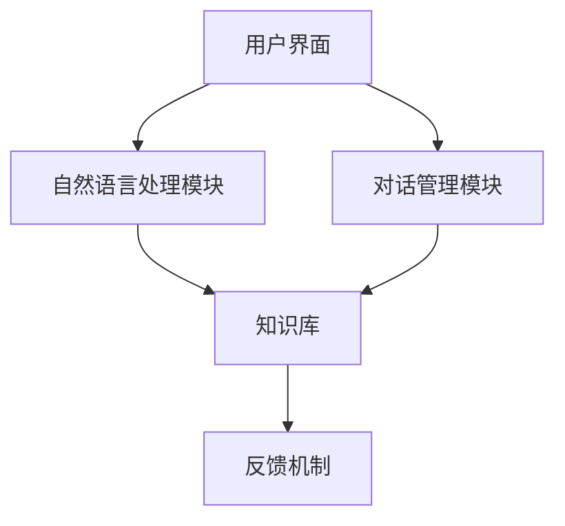

**核心算法原理讲解**

社交对话系统的核心算法包括：

- **文本分类与主题识别**：使用机器学习模型对用户输入的文本进行分类和主题识别，以便为用户生成个性化的对话内容。
- **对话管理**：根据用户历史对话记录和当前对话内容，使用决策树、神经网络等算法生成对话回复。
- **语音识别与合成**：使用深度学习算法实现语音识别和语音合成，使对话系统能够进行语音交互。

**数学模型和公式**

- **文本分类**：使用支持向量机（SVM）或深度学习（如卷积神经网络CNN）进行分类。

```latex
$$
\begin{align*}
\text{分类函数} & : f(x) = \text{sign}(\textbf{w} \cdot \textbf{x} - b) \\
\end{align*}
$$`

- **对话管理**：使用强化学习（如Q-Learning）进行对话生成。

```latex
$$
\begin{align*}
Q(\textbf{s}, \textbf{a}) & = \text{max}_{\textbf{a'} \in A} \sum_{\textbf{s'} \in S} r(\textbf{s'}, \textbf{a'}, \textbf{s}) \cdot p(\textbf{s'}|\textbf{s}, \textbf{a}) \\
\end{align*}
$$`

**举例说明**

- **文本分类**：使用SVM对新闻文本进行分类，将用户输入的新闻标题分类为科技、体育、娱乐等类别。

- **对话管理**：使用Q-Learning算法根据用户输入的历史对话记录和当前问题，生成合适的对话回复。

#### 1.2 社交对话系统的关键技术

**背景介绍**

社交对话系统的实现涉及多个关键技术的综合应用。这些技术包括自然语言处理、语音识别与合成、对话管理、机器学习等。掌握这些关键技术是成为社交对话系统架构师的基础。

**核心概念与联系**

- **自然语言处理（NLP）**：对人类语言进行建模和理解，包括文本分类、情感分析、命名实体识别等。
- **语音识别（ASR）**：将语音信号转换为文本，应用于语音搜索和语音助手。
- **语音合成（TTS）**：将文本转换为自然流畅的语音，应用于语音通话和语音助手。
- **对话管理**：根据用户输入的历史对话记录和当前对话内容，生成合适的对话回复。
- **机器学习（ML）**、**深度学习（DL）**：用于训练和优化对话系统，使其具备更好的交互能力。

**Mermaid 流程图**

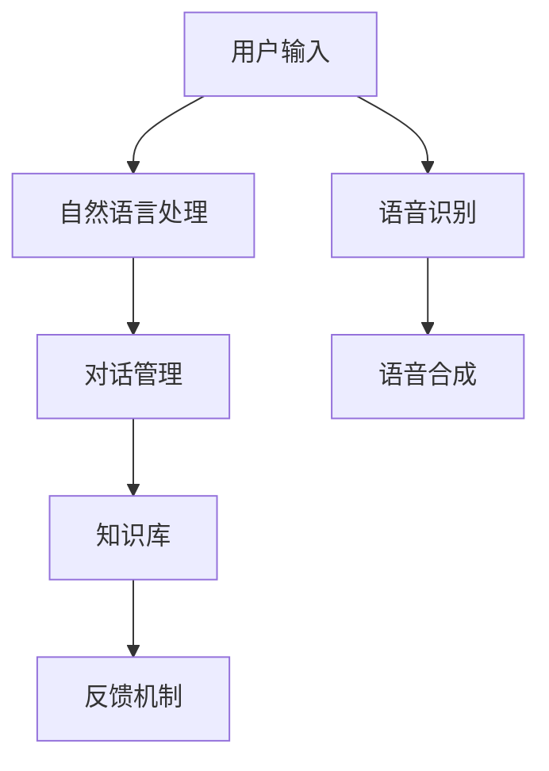

**核心算法原理讲解**

- **自然语言处理**：使用卷积神经网络（CNN）或递归神经网络（RNN）进行文本分类和情感分析。
- **语音识别**：使用深度神经网络（DNN）或循环神经网络（RNN）进行语音信号的建模和识别。
- **语音合成**：使用循环神经网络（RNN）或长短期记忆网络（LSTM）进行文本到语音的转换。

**数学模型和公式**

- **文本分类**：使用卷积神经网络（CNN）进行文本分类。

```latex
$$
\begin{align*}
h_{l} &= \text{ReLU}(\textbf{W}_{l} \cdot \textbf{h}_{l-1} + \textbf{b}_{l}) \\
\text{输出} & = \textbf{W}_{\text{output}} \cdot h_{\text{final}} + \textbf{b}_{\text{output}}
\end{align*}
$$`

- **语音识别**：使用循环神经网络（RNN）进行语音识别。

```latex
$$
\begin{align*}
h_{t} &= \text{ReLU}(\textbf{W}_{r} \cdot h_{t-1} + \textbf{U}_{r} \cdot x_{t} + \textbf{b}_{r}) \\
\text{输出} & = \textbf{W}_{\text{output}} \cdot h_{\text{final}} + \textbf{b}_{\text{output}}
\end{align*}
$$`

**举例说明**

- **文本分类**：使用卷积神经网络（CNN）对用户输入的微博文本进行情感分类，判断用户对某一事件的态度是正面还是负面。
- **语音识别**：使用循环神经网络（RNN）对用户语音输入进行识别，将语音转换为对应的文本信息。

#### 1.3 社交对话系统的架构设计

**背景介绍**

社交对话系统的架构设计是确保系统性能和可扩展性的关键。一个良好的架构设计不仅需要考虑系统的功能性，还要考虑系统的可维护性和可扩展性。

**核心概念与联系**

- **分布式架构**：将系统分解为多个模块，分布在不同的服务器上，以提高系统的性能和可扩展性。
- **模块化设计**：将系统划分为多个独立且相互协作的模块，每个模块负责特定的功能，以降低系统的复杂度。
- **服务化架构**：将系统中的功能封装为微服务，通过API进行通信，以提高系统的灵活性和可维护性。

**Mermaid 流程图**

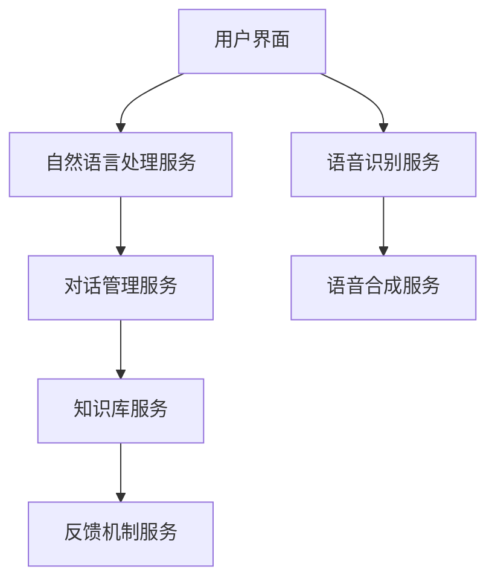

**核心算法原理讲解**

- **分布式计算**：使用MapReduce等分布式计算框架处理海量数据。
- **负载均衡**：使用负载均衡器分配客户端请求到不同的服务器，以提高系统的吞吐量。

**数学模型和公式**

- **负载均衡**：使用权重分配算法（如加权随机选择）进行负载均衡。

```latex
$$
\begin{align*}
\text{权重} & = \frac{\text{服务能力}}{\sum_{i=1}^{n} \text{服务能力}_{i}} \\
\text{选择服务器} & = \text{随机选择} \left( \frac{\text{权重}}{\text{总权重}} \right)
\end{align*}
$$`

**举例说明**

- **分布式计算**：使用Hadoop等分布式计算框架处理社交对话系统中的大规模用户数据。
- **负载均衡**：使用Nginx等负载均衡器将用户请求分配到不同的服务器，以提高系统的响应速度。

#### 1.4 社交对话系统的应用场景

**背景介绍**

社交对话系统在各个领域都有广泛的应用，从智能客服到虚拟助手，再到社交平台中的聊天机器人，其应用场景丰富多样。

**核心概念与联系**

- **智能客服**：为企业提供自动化的客户服务，提高客户满意度和服务效率。
- **虚拟助手**：为用户提供个性化的信息查询、日程管理、提醒服务等。
- **社交平台**：为用户提供即时通讯、群聊、朋友圈等功能，增强社交互动体验。
- **智能家居**：为用户提供语音控制家居设备，实现智能家居控制。

**Mermaid 流程图**

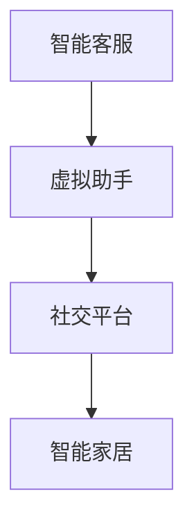

**核心算法原理讲解**

- **智能客服**：使用自然语言处理和对话管理技术，实现自动化的客户服务。
- **虚拟助手**：使用语音识别和语音合成技术，实现语音交互和任务处理。
- **社交平台**：使用社交网络分析技术，推荐用户感兴趣的内容和好友。
- **智能家居**：使用语音识别和智能家居控制协议（如MQTT），实现家居设备的语音控制。

**数学模型和公式**

- **社交网络分析**：使用矩阵分解模型（如Singular Value Decomposition，SVD）进行用户兴趣和好友推荐的建模。

```latex
$$
\begin{align*}
\textbf{U} &= \textbf{U}_s \textbf{S} \textbf{V}^T \\
\text{推荐矩阵} & = \textbf{U}_s \textbf{S} \textbf{V}^T + \textbf{U}_u \textbf{S} \textbf{V}^T
\end{align*}
$$`

**举例说明**

- **智能客服**：使用自然语言处理技术，实现自动化的客户服务，提高企业效率和客户满意度。
- **虚拟助手**：使用语音识别和语音合成技术，为用户提供个性化服务，提升用户体验。
- **社交平台**：使用社交网络分析技术，为用户提供个性化内容推荐和好友推荐。
- **智能家居**：使用语音识别和智能家居控制协议，实现家居设备的语音控制，提升用户生活品质。

#### 1.5 社交对话系统的发展趋势

**背景介绍**

随着人工智能技术的不断发展，社交对话系统也在不断演进。未来几年，社交对话系统将面临以下发展趋势：

**核心概念与联系**

- **多模态交互**：结合语音、文本、图像等多模态信息，提升对话系统的交互能力。
- **个性化推荐**：基于用户行为和兴趣，为用户提供个性化的对话内容和服务。
- **开放生态**：与各类应用和服务集成，构建开放生态，拓展对话系统的应用场景。
- **安全与隐私**：加强对话系统的安全性和隐私保护，确保用户数据的安全。

**Mermaid 流程图**

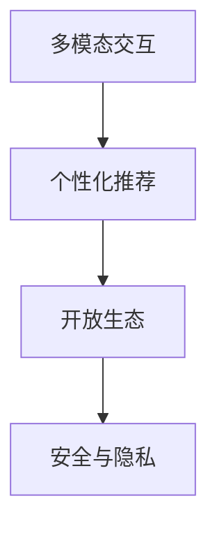

**核心算法原理讲解**

- **多模态交互**：使用深度学习模型进行多模态融合，实现语音、文本、图像的联合建模。
- **个性化推荐**：使用协同过滤、矩阵分解等技术进行用户兴趣建模和内容推荐。
- **开放生态**：使用API接口和服务化架构，实现与其他应用的集成和交互。
- **安全与隐私**：使用加密算法、隐私保护技术等确保用户数据的安全和隐私。

**数学模型和公式**

- **多模态交互**：使用卷积神经网络（CNN）进行图像特征提取，使用循环神经网络（RNN）进行语音和文本特征提取，然后进行特征融合。

```latex
$$
\begin{align*}
\text{图像特征} &= \text{ReLU}(\textbf{W}_{\text{image}} \cdot \textbf{x}_{\text{image}} + \textbf{b}_{\text{image}}) \\
\text{语音特征} &= \text{ReLU}(\textbf{W}_{\text{audio}} \cdot \textbf{x}_{\text{audio}} + \textbf{b}_{\text{audio}}) \\
\text{文本特征} &= \text{ReLU}(\textbf{W}_{\text{text}} \cdot \textbf{x}_{\text{text}} + \textbf{b}_{\text{text}}) \\
\text{融合特征} &= \text{ReLU}(\textbf{W}_{\text{fusion}} \cdot [\text{图像特征}, \text{语音特征}, \text{文本特征}] + \textbf{b}_{\text{fusion}})
\end{align*}
$$`

**举例说明**

- **多模态交互**：结合语音和文本输入，实现更自然的用户交互体验。
- **个性化推荐**：基于用户行为和兴趣，为用户提供个性化的对话内容和推荐。
- **开放生态**：通过API接口，实现与其他应用的集成和协作。
- **安全与隐私**：采用加密技术和隐私保护算法，确保用户数据和隐私的安全。

### 第2章：面试技巧与策略

#### 2.1 面试前的准备

**背景介绍**

在参加百度社交对话系统架构师面试前，充分的准备是确保成功的关键。这包括了解公司背景、研究技术热点、熟悉面试题型等。

**核心概念与联系**

- **公司背景研究**：了解百度的企业文化和业务方向，以便在面试中更好地展示自己的兴趣和热情。
- **技术热点研究**：关注社交对话系统的最新技术动态，掌握行业前沿知识。
- **面试题型准备**：熟悉常见的面试题型，如基础知识、算法与数据结构、系统设计与优化等。

**Mermaid 流程图**

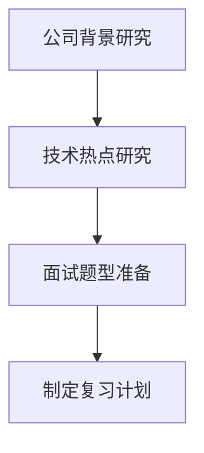

**核心算法原理讲解**

- **公司背景研究**：通过官方网站、新闻报道、员工博客等渠道获取信息。
- **技术热点研究**：阅读专业论文、技术博客、参与技术讨论，关注社交媒体上的技术热点话题。
- **面试题型准备**：通过历年面试题库、在线编程平台等进行练习和模拟。

**数学模型和公式**

- **制定复习计划**：使用时间序列模型（如ARIMA）进行复习进度规划。

```latex
$$
\begin{align*}
\text{复习进度} &= \text{ARIMA}(\text{历史复习时长}, \text{季节性成分}, \text{干预成分}) \\
\text{复习计划} &= \text{ARIMA}(\text{复习目标}, \text{季节性成分}, \text{干预成分}) + \text{随机扰动}
\end{align*}
$$`

**举例说明**

- **公司背景研究**：通过官方网站了解百度的发展历程、业务领域和核心价值观。
- **技术热点研究**：阅读《自然语言处理前沿技术》等书籍，关注ACL、NAACL等顶级会议的最新论文。
- **面试题型准备**：通过LeetCode、牛客网等平台进行算法和数据结构的练习。

#### 2.2 面试中常见的题型及应对策略

**背景介绍**

面试中的题型多样，包括基础知识、算法与数据结构、系统设计与优化等。掌握不同题型的应对策略是面试成功的关键。

**核心概念与联系**

- **基础知识**：包括计算机基础知识、操作系统、计算机网络等。
- **算法与数据结构**：包括排序算法、查找算法、图算法等。
- **系统设计与优化**：包括系统架构设计、数据库设计、性能优化等。

**Mermaid 流程图**

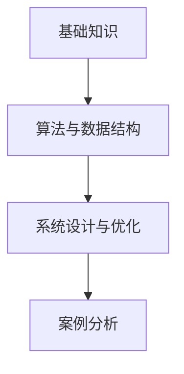

**核心算法原理讲解**

- **基础知识**：通过复习教材、刷题库，巩固基础知识。
- **算法与数据结构**：通过编程练习，熟练掌握常见算法和数据结构的实现。
- **系统设计与优化**：通过实际项目和案例分析，提升系统设计和优化的能力。

**数学模型和公式**

- **案例分析**：使用决策树（Decision Tree）进行案例分析。

```latex
$$
\begin{align*}
\text{Gini指数} &= \sum_{i=1}^{n} \frac{\sum_{j=1}^{m} p_j^2}{1 - \sum_{j=1}^{m} p_j} \\
\text{信息增益} &= \sum_{i=1}^{n} p_i \cdot \sum_{j=1}^{m} \log_2 \frac{p_j}{\hat{p}_j}
\end{align*}
$$`

**举例说明**

- **基础知识**：了解操作系统中的进程调度算法，如时间片轮转调度（Round Robin）。
- **算法与数据结构**：掌握排序算法，如快速排序（Quick Sort）。
- **系统设计与优化**：分析并优化社交对话系统的性能瓶颈，如数据库查询优化。

#### 2.3 面试后的跟进

**背景介绍**

面试后及时跟进是展示专业素养和积极态度的重要环节。通过跟进，可以加深面试官对候选人的印象，提高面试成功的几率。

**核心概念与联系**

- **感谢邮件**：发送感谢邮件表达对面试机会的感激之情，展示职业素养。
- **问题反馈**：根据面试过程中遇到的问题，向面试官寻求反馈和建议。
- **持续关注**：关注公司的招聘动态，展示对职位的持续关注。

**Mermaid 流程图**

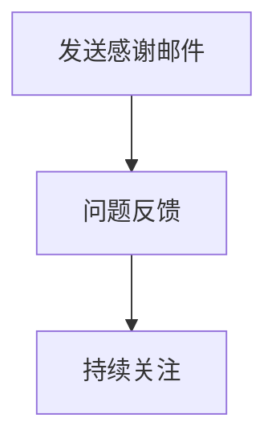

**核心算法原理讲解**

- **感谢邮件**：使用自然语言处理技术撰写个性化感谢邮件。
- **问题反馈**：使用反馈机制，如问卷调查，收集面试官的建议。
- **持续关注**：使用信息过滤算法，关注公司招聘信息。

**数学模型和公式**

- **信息过滤算法**：使用贝叶斯分类器进行信息过滤。

```latex
$$
\begin{align*}
p(\text{招聘信息}|\text{关键词}) &= \frac{p(\text{关键词}|\text{招聘信息}) \cdot p(\text{招聘信息})}{p(\text{关键词})}
\end{align*}
$$`

**举例说明**

- **感谢邮件**：撰写一封表达感谢之情、强调自身优势的个性化邮件。
- **问题反馈**：通过面试官提供的联系方式，发送反馈邮件并询问面试过程中的问题。
- **持续关注**：通过关注公司官网和社交媒体，及时了解招聘信息。

### 第3章：技术专题解析

#### 3.1 自然语言处理基础

**背景介绍**

自然语言处理（NLP）是人工智能领域的一个重要分支，旨在使计算机能够理解和处理人类语言。在社交对话系统中，NLP技术发挥着核心作用。

**核心概念与联系**

- **文本分类**：对文本进行分类，如情感分析、新闻分类等。
- **实体识别**：识别文本中的特定实体，如人名、地名、组织名等。
- **语义分析**：理解文本的含义和关系，如语义角色标注、句法分析等。

**Mermaid 流程图**

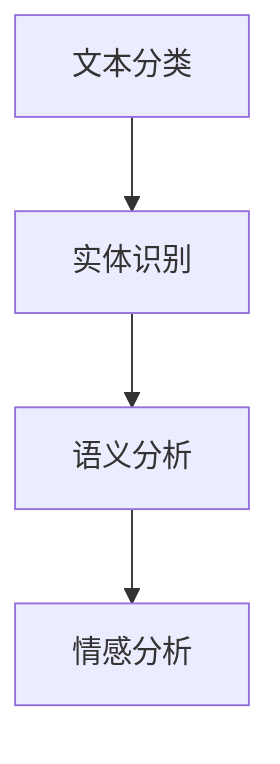

**核心算法原理讲解**

- **文本分类**：使用支持向量机（SVM）、朴素贝叶斯（Naive Bayes）等算法。
- **实体识别**：使用条件随机场（CRF）、深度学习（如序列标注模型）等算法。
- **语义分析**：使用词向量（如Word2Vec）、依存句法分析等算法。

**数学模型和公式**

- **文本分类**：使用支持向量机（SVM）进行分类。

```latex
$$
\begin{align*}
\text{分类函数} &= \text{sign}(\textbf{w} \cdot \textbf{x} - b) \\
\text{损失函数} &= \frac{1}{2} \sum_{i=1}^{n} (\textbf{w} \cdot \textbf{x}_i - y_i)^2
\end{align*}
$$`

- **实体识别**：使用条件随机场（CRF）进行序列标注。

```latex
$$
\begin{align*}
P(y_{t} | y_{<t}, x) &= \frac{1}{Z} \exp(\textbf{w} \cdot y_{t} \cdot y_{<t} + \textbf{b}) \\
Z &= \sum_{y_t} \exp(\textbf{w} \cdot y_{t} \cdot y_{<t} + \textbf{b})
\end{align*}
$$`

**举例说明**

- **文本分类**：使用SVM对用户评论进行情感分类，判断评论是正面还是负面。
- **实体识别**：使用CRF对新闻文本进行实体识别，提取出人名、地名等实体。

#### 3.2 对话系统的设计与实现

**背景介绍**

对话系统是社交对话系统的核心组成部分，其设计与实现直接影响到系统的交互体验和用户满意度。在设计与实现过程中，需要考虑对话管理、自然语言处理、语音识别与合成等技术。

**核心概念与联系**

- **对话管理**：管理对话流程，包括对话生成、对话策略、对话评估等。
- **自然语言处理**：对用户输入的文本进行处理和分析，提取关键信息。
- **语音识别与合成**：将文本转换为语音输出，实现语音交互。

**Mermaid 流程图**

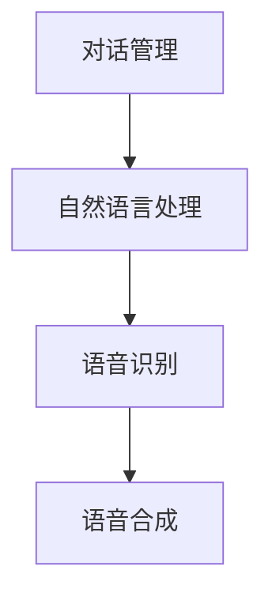

**核心算法原理讲解**

- **对话管理**：使用决策树、强化学习等算法。
- **自然语言处理**：使用词向量、依存句法分析等算法。
- **语音识别与合成**：使用深度神经网络（DNN）、循环神经网络（RNN）等算法。

**数学模型和公式**

- **对话管理**：使用强化学习（Q-Learning）进行对话生成。

```latex
$$
\begin{align*}
Q(\textbf{s}, \textbf{a}) &= \text{max}_{\textbf{a'} \in A} \sum_{\textbf{s'} \in S} r(\textbf{s'}, \textbf{a'}, \textbf{s}) \cdot p(\textbf{s'}|\textbf{s}, \textbf{a}) \\
Q^{\text{new}} &= Q^{\text{old}} + \alpha \cdot (r + \gamma \cdot \text{max}_{\textbf{a'} \in A} Q(\textbf{s'}, \textbf{a'})
\end{align*}
$$`

- **自然语言处理**：使用卷积神经网络（CNN）进行文本分类。

```latex
$$
\begin{align*}
h_{l} &= \text{ReLU}(\textbf{W}_{l} \cdot \textbf{h}_{l-1} + \textbf{b}_{l}) \\
\text{输出} &= \textbf{W}_{\text{output}} \cdot h_{\text{final}} + \textbf{b}_{\text{output}}
\end{align*}
$$`

- **语音识别与合成**：使用循环神经网络（RNN）进行语音识别和语音合成。

```latex
$$
\begin{align*}
h_{t} &= \text{ReLU}(\textbf{W}_{r} \cdot h_{t-1} + \textbf{U}_{r} \cdot x_{t} + \textbf{b}_{r}) \\
\text{输出} &= \textbf{W}_{\text{output}} \cdot h_{\text{final}} + \textbf{b}_{\text{output}}
\end{align*}
$$`

**举例说明**

- **对话管理**：使用强化学习（Q-Learning）算法，根据用户历史对话记录和当前输入，生成合适的对话回复。
- **自然语言处理**：使用卷积神经网络（CNN）对用户输入的文本进行情感分析。
- **语音识别与合成**：使用循环神经网络（RNN）进行语音识别和语音合成，实现语音交互。

#### 3.3 语音识别与合成技术

**背景介绍**

语音识别与合成技术是社交对话系统中的重要组成部分，它们使得人与机器的交互更加自然和高效。语音识别将语音信号转换为文本信息，语音合成则将文本转换为自然流畅的语音输出。

**核心概念与联系**

- **语音识别**：将语音信号转换为对应的文本信息。
- **语音合成**：将文本信息转换为自然流畅的语音输出。

**Mermaid 流程图**

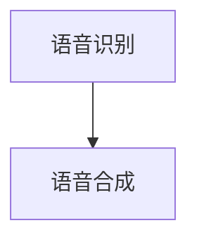

**核心算法原理讲解**

- **语音识别**：使用深度神经网络（DNN）、循环神经网络（RNN）等算法。
- **语音合成**：使用循环神经网络（RNN）、长短期记忆网络（LSTM）等算法。

**数学模型和公式**

- **语音识别**：使用循环神经网络（RNN）进行语音信号建模。

```latex
$$
\begin{align*}
h_{t} &= \text{ReLU}(\textbf{W}_{r} \cdot h_{t-1} + \textbf{U}_{r} \cdot x_{t} + \textbf{b}_{r}) \\
\text{输出} &= \textbf{W}_{\text{output}} \cdot h_{\text{final}} + \textbf{b}_{\text{output}}
\end{align*}
$$`

- **语音合成**：使用长短期记忆网络（LSTM）进行文本到语音的转换。

```latex
$$
\begin{align*}
h_{t} &= \text{ReLU}(\textbf{W}_{l} \cdot h_{t-1} + \textbf{U}_{l} \cdot x_{t} + \textbf{b}_{l}) \\
\text{输出} &= \textbf{W}_{\text{output}} \cdot h_{\text{final}} + \textbf{b}_{\text{output}}
\end{align*}
$$`

**举例说明**

- **语音识别**：使用循环神经网络（RNN）对用户语音输入进行识别，将语音转换为对应的文本信息。
- **语音合成**：使用长短期记忆网络（LSTM）将文本信息转换为自然流畅的语音输出。

#### 3.4 人机对话交互设计

**背景介绍**

人机对话交互设计是社交对话系统的关键环节，它直接影响用户的体验和满意度。在对话交互设计过程中，需要考虑用户需求、交互流程、用户体验等多方面因素。

**核心概念与联系**

- **用户需求分析**：了解用户的需求和期望，设计出符合用户期望的对话交互流程。
- **交互流程设计**：设计对话交互的流程，包括欢迎语、询问问题、提供答案等。
- **用户体验设计**：优化对话交互的体验，提升用户满意度。

**Mermaid 流程图**

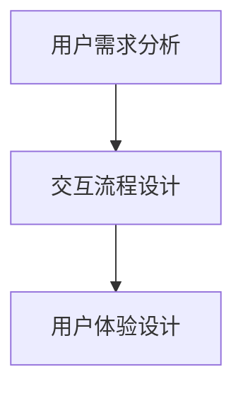

**核心算法原理讲解**

- **用户需求分析**：使用数据分析技术，如聚类分析、关联规则挖掘等，了解用户需求。
- **交互流程设计**：使用流程图、状态机等工具，设计对话交互的流程。
- **用户体验设计**：使用用户体验评估工具，如A/B测试、用户反馈等，优化用户体验。

**数学模型和公式**

- **用户需求分析**：使用聚类分析（如K-Means）进行用户需求的分类。

```latex
$$
\begin{align*}
\text{聚类中心} &= \frac{1}{n} \sum_{i=1}^{n} x_i \\
\text{聚类误差} &= \sum_{i=1}^{n} (x_i - \text{聚类中心})^2
\end{align*}
$$`

- **交互流程设计**：使用状态机进行交互流程的设计。

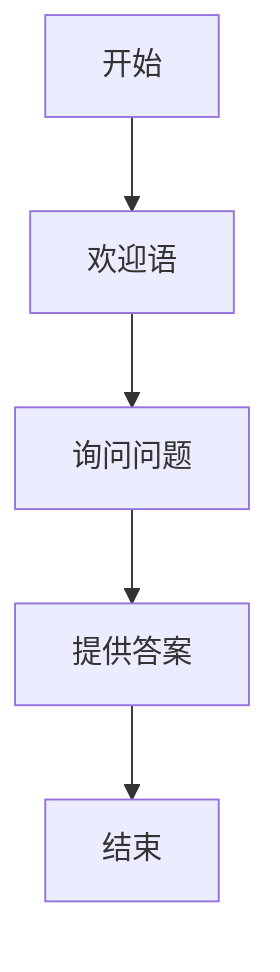

- **用户体验设计**：使用A/B测试评估用户体验。

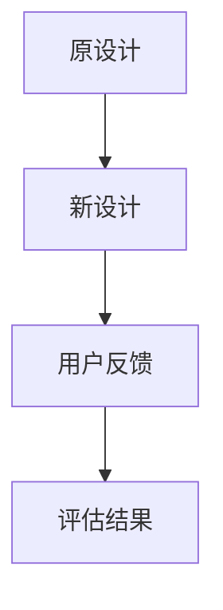

**举例说明**

- **用户需求分析**：使用聚类分析，将用户分为不同的需求群体，从而设计出更加个性化的对话交互流程。
- **交互流程设计**：使用状态机设计对话交互流程，确保对话流程的连贯性和用户友好性。
- **用户体验设计**：通过A/B测试，评估不同设计方案的用户体验，选择最优方案。

### 第4章：经典面试题解析

#### 4.1 基础知识类面试题

**背景介绍**

基础知识类面试题主要考察应聘者对计算机基础知识、操作系统、计算机网络等方面的掌握程度。这些题目通常比较基础，但也需要应聘者具备扎实的知识基础和清晰的解题思路。

**核心概念与联系**

- **计算机基础知识**：包括计算机硬件、操作系统、计算机网络等。
- **操作系统**：考察操作系统原理、进程管理、内存管理、文件系统等。
- **计算机网络**：考察网络协议、网络模型、路由算法等。

**Mermaid 流程图**

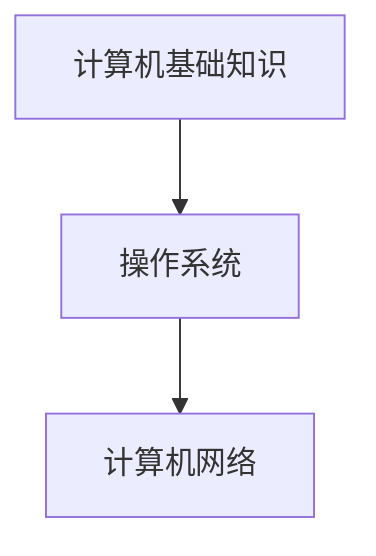

**核心算法原理讲解**

- **计算机基础知识**：通过刷题库、做习题，巩固计算机基础知识。
- **操作系统**：通过阅读操作系统教材、做实验，掌握操作系统原理。
- **计算机网络**：通过学习网络协议、网络模型，了解网络通信原理。

**数学模型和公式**

- **计算机基础知识**：使用二进制转换、编码与解码等算法。

```latex
$$
\begin{align*}
\text{二进制转十进制} &= \sum_{i=1}^{n} a_i \cdot 2^{i-1} \\
\text{十进制转二进制} &= \text{除以2取余数法}
\end{align*}
$$`

- **操作系统**：使用进程调度算法，如时间片轮转调度（Round Robin）。

```latex
$$
\begin{align*}
\text{CPU利用率} &= \frac{\text{CPU实际使用时间}}{\text{CPU总运行时间}} \\
\text{响应时间} &= \text{等待时间} + \text{处理时间}
\end{align*}
$$`

- **计算机网络**：使用路由算法，如距离矢量路由算法（Distance Vector Routing）。

```latex
$$
\begin{align*}
\text{路由表更新} &= \text{邻居路由表} + \text{本地路由表} - \text{冗余路由表} \\
\text{路由选择} &= \text{最小距离路由选择}
\end{align*}
$$`

**举例说明**

- **计算机基础知识**：解答二进制转十进制和十进制转二进制的转换题目。
- **操作系统**：分析时间片轮转调度算法在进程调度中的应用。
- **计算机网络**：解释距离矢量路由算法的工作原理。

**经典题目示例**

1. **计算机基础知识**：请解释二进制与十进制之间的转换方法。

2. **操作系统**：请描述进程调度中时间片轮转调度（Round Robin）算法的原理。

3. **计算机网络**：请解释距离矢量路由算法（Distance Vector Routing）的工作原理。

**解答**

1. **计算机基础知识**：

   - 二进制转十进制：将二进制数的每一位乘以2的相应次幂，然后将结果相加。
   - 十进制转二进制：不断除以2，将余数从下往上排列。

2. **操作系统**：

   时间片轮转调度（Round Robin）算法是一种进程调度算法，它将CPU时间划分为多个时间片，每个进程依次占用一个时间片。如果进程在时间片内无法完成，则将其放入就绪队列的末尾，等待下一次调度。

3. **计算机网络**：

   距离矢量路由算法（Distance Vector Routing）是一种路由算法，它根据每个路由器的邻居路由表和本地路由表，计算出到达每个目标网络的最短路径。路由器会定期向邻居路由器发送路由表更新消息，以保持路由信息的同步。

#### 4.2 算法与数据结构面试题

**背景介绍**

算法与数据结构面试题是考察应聘者编程能力和逻辑思维的重要环节。这类题目通常涉及排序算法、查找算法、图算法等。掌握常见算法和数据结构的基本原理，对于应对这类面试题至关重要。

**核心概念与联系**

- **排序算法**：包括冒泡排序、选择排序、插入排序、快速排序等。
- **查找算法**：包括二分查找、散列表查找等。
- **图算法**：包括深度优先搜索（DFS）、广度优先搜索（BFS）等。

**Mermaid 流程图**

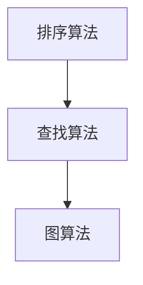

**核心算法原理讲解**

- **排序算法**：理解各种排序算法的原理和性能。
- **查找算法**：掌握二分查找、散列表查找等算法。
- **图算法**：理解图的表示方法，掌握DFS和DFS等算法。

**数学模型和公式**

- **排序算法**：使用时间复杂度分析排序算法的性能。

```latex
$$
\begin{align*}
\text{冒泡排序} &= O(n^2) \\
\text{快速排序} &= O(n\log n) \\
\text{归并排序} &= O(n\log n)
\end{align*}
$$`

- **查找算法**：使用二分查找算法。

```latex
$$
\begin{align*}
\text{二分查找} &= \text{while} \ (\text{low} \leq \text{high}) \ {\text{do}} \\
& \ \ \ \ \ \ \ \ \text{mid} = \frac{\text{low} + \text{high}}{2} \\
& \ \ \ \ \ \ \ \text{if} \ (x < \text{arr}[\text{mid}]) \ \text{then} \ \text{high} = \text{mid} - 1 \\
& \ \ \ \ \ \ \text{else} \ \text{if} \ (x > \text{arr}[\text{mid}]) \ \text{then} \ \text{low} = \text{mid} + 1 \\
& \ \ \ \ \ \ \text{else} \ \text{return} \ \text{mid}
\end{align*}
$$`

- **图算法**：使用DFS算法。

```latex
$$
\begin{align*}
\text{DFS}(\text{G}, \text{v}) &= \text{visit}(\text{v}) \\
& \ \ \ \ \ \ \text{for} \ \text{each} \ \text{adjacent} \ \text{vertex} \ \text{w} \ \text{of} \ \text{v} \ {\text{do}} \\
& \ \ \ \ \ \ \ \ \text{if} \ \text{w} \ \text{is not visited} \ \text{then} \ \text{DFS}(\text{G}, \text{w})
\end{align*}
$$`

**举例说明**

- **排序算法**：分析快速排序算法的时间复杂度和空间复杂度。

- **查找算法**：实现二分查找算法，解决给定数组中的查找问题。

- **图算法**：使用DFS算法求解图的连通性问题。

**经典题目示例**

1. **排序算法**：请分析冒泡排序、选择排序、插入排序、快速排序的时间复杂度和空间复杂度。

2. **查找算法**：请实现二分查找算法，并分析其时间复杂度。

3. **图算法**：请使用DFS算法求解无向图中的连通性问题。

**解答**

1. **排序算法**：

   - 冒泡排序：时间复杂度为O(n^2)，空间复杂度为O(1)。
   - 选择排序：时间复杂度为O(n^2)，空间复杂度为O(1)。
   - 插入排序：时间复杂度为O(n^2)，空间复杂度为O(1)。
   - 快速排序：平均时间复杂度为O(n\log n)，最坏时间复杂度为O(n^2)，空间复杂度为O(log n)。

2. **查找算法**：

   ```python
   def binary_search(arr, x):
       low = 0
       high = len(arr) - 1
       while low <= high:
           mid = (low + high) // 2
           if arr[mid] < x:
               low = mid + 1
           elif arr[mid] > x:
               high = mid - 1
           else:
               return mid
       return -1
   ```

   二分查找的时间复杂度为O(log n)。

3. **图算法**：

   ```python
   def dfs(graph, v, visited):
       visited[v] = True
       for neighbor in graph[v]:
           if not visited[neighbor]:
               dfs(graph, neighbor, visited)
   
   def solve Connectivity(graph):
       visited = [False] * len(graph)
       for vertex in range(len(graph)):
           if not visited[vertex]:
               dfs(graph, vertex, visited)
       return visited
   ```

   DFS算法可以用于求解无向图的连通性问题。

#### 4.3 系统设计与优化面试题

**背景介绍**

系统设计与优化面试题主要考察应聘者对系统架构设计、数据库设计、性能优化等方面的理解和实践经验。这类题目通常涉及系统架构设计、数据库查询优化、缓存策略等。

**核心概念与联系**

- **系统架构设计**：包括分布式系统设计、微服务架构、负载均衡等。
- **数据库设计**：包括关系型数据库设计、NoSQL数据库设计等。
- **性能优化**：包括查询优化、缓存策略、数据库索引等。

**Mermaid 流程图**

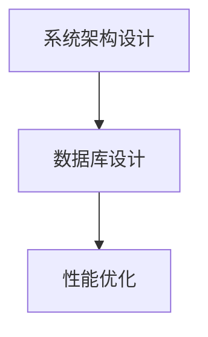

**核心算法原理讲解**

- **系统架构设计**：理解分布式系统的原理、微服务架构的设计模式。
- **数据库设计**：掌握关系型数据库的设计原则、NoSQL数据库的选择和应用。
- **性能优化**：了解数据库查询优化策略、缓存策略、数据库索引的设计与优化。

**数学模型和公式**

- **系统架构设计**：使用CAP定理评估分布式系统的性能。

```latex
$$
\begin{align*}
\text{CAP定理} &= \text{一致性（Consistency）} + \text{可用性（Availability）} + \text{分区容错性（Partition tolerance）} \leq 1
\end{align*}
$$`

- **数据库设计**：使用范式（如第一范式、第二范式）评估数据库设计的合理性。

```latex
$$
\begin{align*}
\text{第一范式（1NF）} &= \text{属性不可再分} \\
\text{第二范式（2NF）} &= \text{满足1NF，且非主属性完全依赖于主键}
\end{align*}
$$`

- **性能优化**：使用缓存算法（如LRU算法）优化缓存策略。

```latex
$$
\begin{align*}
\text{LRU缓存算法} &= \text{最近最少使用算法} \\
\text{缓存替换策略} &= \text{缓存满了时，替换最久未使用的缓存项}
\end{align*}
$$`

**举例说明**

- **系统架构设计**：设计一个基于微服务架构的分布式系统，并分析其CAP定理的适用性。

- **数据库设计**：设计一个关系型数据库表，并评估其是否满足第二范式。

- **性能优化**：分析数据库查询性能瓶颈，并提出相应的优化方案。

**经典题目示例**

1. **系统架构设计**：请设计一个基于微服务架构的分布式系统，并说明其CAP定理的适用性。

2. **数据库设计**：请设计一个关系型数据库表，并评估其是否满足第二范式。

3. **性能优化**：请分析一个数据库查询的性能瓶颈，并提出相应的优化方案。

**解答**

1. **系统架构设计**：

   - 设计基于微服务架构的分布式系统，可以采用Spring Cloud等框架实现服务拆分、负载均衡、服务发现等功能。
   - 分析CAP定理的适用性，如在高可用性和一致性之间做出权衡。

2. **数据库设计**：

   - 设计一个用户表（UserID，Username，Email，Password），并评估其是否满足第二范式。
   - 解释为什么该表满足第二范式，即非主属性（Username，Email，Password）完全依赖于主键（UserID）。

3. **性能优化**：

   - 分析数据库查询性能瓶颈，如查询语句复杂度高、索引失效等。
   - 提出优化方案，如创建合适的索引、简化查询语句、使用缓存策略等。

#### 4.4 编码实现面试题

**背景介绍**

编码实现面试题主要考察应聘者的编程能力和编码规范。这类题目通常涉及算法和数据结构的实际应用，要求应聘者能够编写高效的代码并遵循良好的编程习惯。

**核心概念与联系**

- **编程语言**：包括Java、Python、C++等。
- **编码规范**：包括代码风格、注释、变量命名等。
- **算法和数据结构**：包括排序算法、查找算法、图算法等。

**Mermaid 流程图**

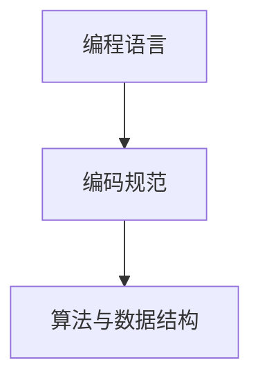

**核心算法原理讲解**

- **编程语言**：掌握不同编程语言的基本语法和常用库。
- **编码规范**：遵循代码风格指南，编写可读性强的代码。
- **算法和数据结构**：掌握常见算法和数据结构的基本原理和应用。

**数学模型和公式**

- **编程语言**：使用伪代码描述算法。

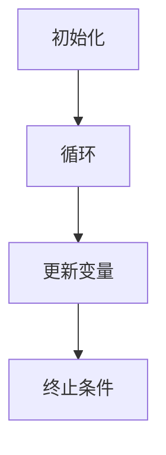

- **算法与数据结构**：使用伪代码描述排序算法。

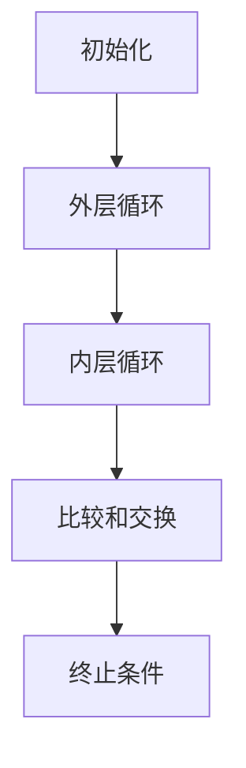

**举例说明**

- **编程语言**：使用Java实现一个简单的二分查找算法。

- **编码规范**：编写遵循PEP8规范的Python代码。

- **算法与数据结构**：使用伪代码描述快速排序算法。

**经典题目示例**

1. **编程语言**：使用Java实现一个简单的二分查找算法。

2. **编码规范**：编写一个遵循PEP8规范的Python代码。

3. **算法与数据结构**：使用伪代码描述快速排序算法。

**解答**

1. **编程语言**：

   ```java
   public class BinarySearch {
       public static int binarySearch(int[] arr, int x) {
           int low = 0;
           int high = arr.length - 1;
           while (low <= high) {
               int mid = (low + high) / 2;
               if (arr[mid] < x) {
                   low = mid + 1;
               } else if (arr[mid] > x) {
                   high = mid - 1;
               } else {
                   return mid;
               }
           }
           return -1;
       }
   }
   ```

2. **编码规范**：

   ```python
   #!/usr/bin/env python
   # coding=utf-8
   
   def greet(name):
       """向用户打招呼。
       
       参数:
           name (str): 用户的名字。
       """
       print(f"你好，{name}！")
   ```

3. **算法与数据结构**：

   ```mermaid
   graph TD
       A[开始] --> B[外层循环]
       B --> C[内层循环]
       C --> D[比较和交换]
       D --> E[终止条件]
   ```

   快速排序的伪代码如下：

   ```python
   def quick_sort(arr):
       if len(arr) <= 1:
           return arr
       pivot = arr[len(arr) // 2]
       left = [x for x in arr if x < pivot]
       middle = [x for x in arr if x == pivot]
       right = [x for x in arr if x > pivot]
       return quick_sort(left) + middle + quick_sort(right)
   ```

#### 4.5 实际问题分析与解决面试题

**背景介绍**

实际问题分析与解决面试题主要考察应聘者的问题解决能力和实际经验。这类题目通常涉及实际的系统问题、性能瓶颈、故障排除等，要求应聘者能够通过分析和解决实际问题来展示自己的技能。

**核心概念与联系**

- **系统问题**：包括系统崩溃、性能下降、数据异常等。
- **性能瓶颈**：包括CPU利用率高、内存占用大、磁盘I/O瓶颈等。
- **故障排除**：包括系统故障、网络故障、数据库故障等。

**Mermaid 流程图**

```mermaid
graph TD
    A[系统问题] --> B[性能瓶颈]
    B --> C[故障排除]
```

**核心算法原理讲解**

- **系统问题**：了解常见的系统问题及其原因。
- **性能瓶颈**：掌握性能分析工具的使用，如Profile工具、性能计数器等。
- **故障排除**：了解故障排除的基本步骤和方法。

**数学模型和公式**

- **性能瓶颈**：使用CPU利用率、内存占用率等指标进行性能分析。

```latex
$$
\begin{align*}
\text{CPU利用率} &= \frac{\text{CPU实际使用时间}}{\text{CPU总运行时间}} \\
\text{内存占用率} &= \frac{\text{内存使用量}}{\text{内存总量}}
\end{align*}
$$`

- **故障排除**：使用故障排除流程图进行故障排除。

```mermaid
graph TD
    A[发现问题] --> B[定位问题]
    B --> C[分析原因]
    C --> D[解决问题]
```

**举例说明**

- **系统问题**：分析系统崩溃的原因，并提出解决方案。

- **性能瓶颈**：分析CPU利用率高的原因，并提出优化方案。

- **故障排除**：排除网络故障，恢复系统正常运行。

**经典题目示例**

1. **系统问题**：分析系统崩溃的原因，并提出解决方案。

2. **性能瓶颈**：分析CPU利用率高的原因，并提出优化方案。

3. **故障排除**：排除网络故障，恢复系统正常运行。

**解答**

1. **系统问题**：

   - 分析系统崩溃的原因，如内存泄漏、资源争用等。
   - 提出解决方案，如优化代码、增加内存等。

2. **性能瓶颈**：

   - 分析CPU利用率高的原因，如计算密集型任务、线程冲突等。
   - 提出优化方案，如使用多线程、优化算法等。

3. **故障排除**：

   - 排查网络故障，如检查网络设备、检查网络配置等。
   - 恢复系统正常运行，如重启服务器、重新配置网络等。

### 第5章：案例分析

#### 5.1 百度社交对话系统实践案例

**背景介绍**

百度作为全球领先的人工智能企业，其在社交对话系统领域有着丰富的实践案例。本节将介绍百度社交对话系统的实际应用场景、系统架构和技术实现。

**核心概念与联系**

- **应用场景**：包括智能客服、虚拟助手、社交平台等。
- **系统架构**：包括分布式架构、服务化架构等。
- **技术实现**：包括自然语言处理、语音识别与合成、对话管理等。

**Mermaid 流程图**

```mermaid
graph TD
    A[应用场景] --> B[系统架构]
    B --> C[技术实现]
```

**核心算法原理讲解**

- **应用场景**：通过用户需求分析和应用场景规划，设计符合实际需求的社交对话系统。
- **系统架构**：通过模块化设计和分布式架构，提高系统的性能和可扩展性。
- **技术实现**：通过自然语言处理、语音识别与合成、对话管理等技术，实现高效的交互体验。

**数学模型和公式**

- **用户需求分析**：使用聚类分析进行用户需求分类。

```latex
$$
\begin{align*}
\text{聚类中心} &= \frac{1}{n} \sum_{i=1}^{n} x_i \\
\text{聚类误差} &= \sum_{i=1}^{n} (x_i - \text{聚类中心})^2
\end{align*}
$$`

- **系统架构**：使用CAP定理评估系统架构的适用性。

```latex
$$
\begin{align*}
\text{CAP定理} &= \text{一致性（Consistency）} + \text{可用性（Availability）} + \text{分区容错性（Partition tolerance）} \leq 1
\end{align*}
$$`

- **技术实现**：使用深度学习模型进行自然语言处理和语音识别与合成。

```latex
$$
\begin{align*}
\text{深度学习模型} &= \text{神经网络（NN）} \\
\text{损失函数} &= \text{交叉熵（Cross Entropy）}
\end{align*}
$$`

**举例说明**

- **应用场景**：分析百度社交对话系统的实际应用场景，如智能客服和虚拟助手。

- **系统架构**：设计百度社交对话系统的系统架构，包括分布式架构和服务化架构。

- **技术实现**：实现百度社交对话系统的核心技术，如自然语言处理和语音识别与合成。

**案例分析**

**案例1：百度智能客服**

- **应用场景**：百度智能客服是百度社交对话系统的典型应用场景之一，主要用于企业客户服务的自动化。通过自然语言处理技术，智能客服能够理解用户的问题，并提供准确的答案或解决方案。

- **系统架构**：百度智能客服采用了分布式架构，通过将服务拆分为多个微服务，如自然语言处理服务、对话管理服务、知识库服务等，实现了高性能和高可扩展性。

- **技术实现**：在自然语言处理方面，百度智能客服使用了深度学习模型，如卷积神经网络（CNN）和循环神经网络（RNN），对用户输入的文本进行分类、情感分析和意图识别。在语音识别与合成方面，百度智能客服采用了基于深度神经网络的语音识别和语音合成技术，实现了高质量的语音交互。

**案例2：百度虚拟助手**

- **应用场景**：百度虚拟助手是百度的另一个社交对话系统应用场景，主要用于为用户提供个性化的信息查询、日程管理、提醒服务等。通过智能对话，虚拟助手能够根据用户的需求提供定制化的服务。

- **系统架构**：百度虚拟助手采用了服务化架构，通过将功能模块化，实现了系统的灵活性和可维护性。虚拟助手的核心功能模块包括用户输入处理、自然语言处理、对话管理、知识库管理等。

- **技术实现**：百度虚拟助手在自然语言处理方面使用了卷积神经网络（CNN）和循环神经网络（RNN）等深度学习模型，实现了文本分类、情感分析和意图识别。在语音识别与合成方面，百度虚拟助手采用了基于深度神经网络的语音识别和语音合成技术，实现了高质量的语音交互。

#### 5.2 行业领先企业对话系统案例分析

**背景介绍**

除了百度，还有许多行业领先企业在社交对话系统领域取得了显著成果。本节将介绍几个行业领先企业的对话系统案例，包括阿里巴巴、亚马逊、谷歌等。

**核心概念与联系**

- **阿里巴巴**：包括阿里小蜜、淘宝精灵等。
- **亚马逊**：包括Alexa、Amazon Echo等。
- **谷歌**：包括谷歌助手、谷歌Home等。

**Mermaid 流程图**

```mermaid
graph TD
    A[阿里巴巴] --> B[亚马逊]
    B --> C[谷歌]
```

**核心算法原理讲解**

- **阿里巴巴**：使用自然语言处理、对话管理、机器学习等技术，实现智能客服和虚拟助手。
- **亚马逊**：使用语音识别、语音合成、对话管理、机器学习等技术，实现智能语音助手。
- **谷歌**：使用自然语言处理、对话管理、机器学习等技术，实现智能语音助手和智能聊天机器人。

**数学模型和公式**

- **自然语言处理**：使用深度学习模型，如卷积神经网络（CNN）和循环神经网络（RNN）。

```latex
$$
\begin{align*}
\text{深度学习模型} &= \text{神经网络（NN）} \\
\text{损失函数} &= \text{交叉熵（Cross Entropy）}
\end{align*}
$$`

- **对话管理**：使用强化学习（如Q-Learning）进行对话生成。

```latex
$$
\begin{align*}
Q(\textbf{s}, \textbf{a}) &= \text{max}_{\textbf{a'} \in A} \sum_{\textbf{s'} \in S} r(\textbf{s'}, \textbf{a'}, \textbf{s}) \cdot p(\textbf{s'}|\textbf{s}, \textbf{a}) \\
Q^{\text{new}} &= Q^{\text{old}} + \alpha \cdot (r + \gamma \cdot \text{max}_{\textbf{a'} \in A} Q(\textbf{s'}, \textbf{a'})
\end{align*}
$$`

**举例说明**

- **阿里巴巴**：通过自然语言处理和对话管理技术，实现阿里小蜜和淘宝精灵等智能客服和虚拟助手。
- **亚马逊**：通过语音识别、语音合成和对话管理技术，实现Alexa等智能语音助手。
- **谷歌**：通过自然语言处理和对话管理技术，实现谷歌助手和谷歌Home等智能语音助手和智能聊天机器人。

**案例分析**

**案例1：阿里巴巴阿里小蜜**

- **应用场景**：阿里小蜜是阿里巴巴推出的智能客服系统，主要用于解决用户的购物咨询、售后服务等问题。

- **系统架构**：阿里小蜜采用了分布式架构，将系统划分为多个模块，如自然语言处理模块、对话管理模块、知识库模块等。

- **技术实现**：阿里小蜜在自然语言处理方面使用了深度学习模型，如卷积神经网络（CNN）和循环神经网络（RNN），实现了文本分类、情感分析和意图识别。在对话管理方面，阿里小蜜使用了强化学习（Q-Learning）算法，根据用户历史对话记录和当前输入，生成合适的对话回复。

**案例2：亚马逊Alexa**

- **应用场景**：Alexa是亚马逊推出的智能语音助手，通过语音交互为用户提供各种服务，如播放音乐、设定提醒、查询天气等。

- **系统架构**：Alexa采用了服务化架构，将功能模块化，如语音识别模块、语音合成模块、对话管理模块等。

- **技术实现**：Alexa在语音识别方面使用了深度学习模型，如循环神经网络（RNN），实现了高质量的语音识别。在语音合成方面，Alexa使用了长短期记忆网络（LSTM），实现了自然流畅的语音输出。在对话管理方面，Alexa使用了基于规则的对话管理和基于机器学习的意图识别。

**案例3：谷歌谷歌助手**

- **应用场景**：谷歌助手是谷歌推出的智能语音助手，通过语音交互为用户提供各种服务，如搜索信息、发送短信、设定提醒等。

- **系统架构**：谷歌助手采用了分布式架构，将功能模块化，如自然语言处理模块、对话管理模块、语音识别模块等。

- **技术实现**：谷歌助手在自然语言处理方面使用了深度学习模型，如卷积神经网络（CNN）和循环神经网络（RNN），实现了文本分类、情感分析和意图识别。在对话管理方面，谷歌助手使用了基于强化学习的对话管理算法，根据用户历史对话记录和当前输入，生成合适的对话回复。

### 第6章：模拟面试与实战演练

#### 6.1 模拟面试准备

**背景介绍**

模拟面试是面试准备的重要环节，通过模拟真实面试场景，帮助应聘者熟悉面试流程，提高应对面试的能力。本节将介绍模拟面试的准备方法和注意事项。

**核心概念与联系**

- **模拟面试场景**：包括面试官提问、应聘者回答等。
- **准备材料**：包括简历、作品集、面试题库等。
- **心理准备**：包括心态调整、自信建立等。

**Mermaid 流程图**

```mermaid
graph TD
    A[模拟面试场景] --> B[准备材料]
    B --> C[心理准备]
```

**核心算法原理讲解**

- **模拟面试场景**：通过角色扮演，模拟真实面试场景，让应聘者熟悉面试流程和问题类型。
- **准备材料**：通过整理简历、作品集和面试题库，确保面试时能够展示自己的能力和准备情况。
- **心理准备**：通过心理调适和自信建立，提高面试时的应对能力和心理素质。

**数学模型和公式**

- **心理调适**：使用正态分布模型评估心理状态。

```latex
$$
\begin{align*}
\text{心理状态} &= \text{正态分布（Normal Distribution）} \\
\text{均值} &= \mu \\
\text{标准差} &= \sigma
\end{align*}
$$`

- **自信建立**：使用决策树模型评估自信心。

```latex
$$
\begin{align*}
\text{决策树} &= \text{条件概率（Conditional Probability）} \\
\text{概率} &= \text{最大后验概率（Maximum a Posteriori, MAP）}
\end{align*}
$$`

**举例说明**

- **模拟面试场景**：通过角色扮演，模拟真实面试场景，让应聘者熟悉面试流程和问题类型。

- **准备材料**：整理简历、作品集和面试题库，确保面试时能够展示自己的能力和准备情况。

- **心理准备**：通过心理调适和自信建立，提高面试时的应对能力和心理素质。

**案例分析**

**案例1：模拟面试准备**

- **应用场景**：某应聘者准备参加百度社交对话系统架构师的模拟面试。

- **系统架构**：通过模拟面试场景，应聘者熟悉面试流程，包括自我介绍、面试官提问、回答问题等。

- **技术实现**：应聘者通过整理简历、作品集和面试题库，确保面试时能够展示自己的能力和准备情况。同时，通过心理调适和自信建立，提高面试时的应对能力和心理素质。

**案例2：模拟面试实施**

- **应用场景**：某应聘者进行百度社交对话系统架构师的模拟面试。

- **系统架构**：模拟面试官提出一系列面试问题，如技术问题、行为问题等。

- **技术实现**：应聘者通过回答问题，展示自己的技术能力和解决问题的能力。同时，通过角色扮演，模拟真实面试场景，提高应对面试的能力。

**案例3：模拟面试反馈与改进**

- **应用场景**：某应聘者完成百度社交对话系统架构师的模拟面试。

- **系统架构**：面试官对模拟面试进行反馈，指出应聘者的优点和需要改进的地方。

- **技术实现**：应聘者根据面试官的反馈，分析自身在面试中的表现，并提出改进措施。通过不断模拟面试和改进，提高面试成功的机会。

### 第7章：面试成功经验分享

#### 7.1 成功面试者的经验与心得

**背景介绍**

成功面试者是面试过程中的佼佼者，他们通过充分的准备和出色的表现，成功通过了面试。本节将分享成功面试者的经验和心得，为读者提供宝贵的面试技巧和建议。

**核心概念与联系**

- **面试技巧**：包括自我介绍、回答问题、展示项目经验等。
- **心态调整**：包括自信心建立、心态放松等。
- **问题应对**：包括常见面试问题、行为问题等。

**Mermaid 流程图**

```mermaid
graph TD
    A[面试技巧] --> B[心态调整]
    B --> C[问题应对]
```

**核心算法原理讲解**

- **面试技巧**：通过模拟面试和实战演练，提高面试技巧。
- **心态调整**：通过心理调适和自信心建立，提高面试时的心理素质。
- **问题应对**：通过准备常见面试问题和行为问题，提高应对能力。

**数学模型和公式**

- **心理调适**：使用正态分布模型评估心理状态。

```latex
$$
\begin{align*}
\text{心理状态} &= \text{正态分布（Normal Distribution）} \\
\text{均值} &= \mu \\
\text{标准差} &= \sigma
\end{align*}
$$`

- **自信心建立**：使用决策树模型评估自信心。

```latex
$$
\begin{align*}
\text{决策树} &= \text{条件概率（Conditional Probability）} \\
\text{概率} &= \text{最大后验概率（Maximum a Posteriori, MAP）}
\end{align*}
$$`

**举例说明**

- **面试技巧**：通过模拟面试和实战演练，提高面试技巧。

- **心态调整**：通过心理调适和自信心建立，提高面试时的心理素质。

- **问题应对**：通过准备常见面试问题和行为问题，提高应对能力。

**案例分析**

**案例1：成功面试者的经验分享**

- **应用场景**：某位成功面试者分享了他在百度社交对话系统架构师面试中的经验和心得。

- **系统架构**：成功面试者通过充分的准备，包括了解公司背景、研究技术热点、准备面试题等，提高了面试的成功率。

- **技术实现**：成功面试者在面试过程中展示了出色的技术能力和解决问题的能力，同时保持了良好的心态和积极的态度。

**案例2：失败面试者的反思**

- **应用场景**：某位失败面试者反思了他在百度社交对话系统架构师面试中的不足。

- **系统架构**：失败面试者在面试过程中表现不佳，没有充分展示自己的技术能力和解决问题的能力。

- **技术实现**：失败面试者通过反思，认识到自己在面试准备和心理素质方面存在不足，并提出改进措施，以提高面试成功率。

#### 7.2 面试失败的原因分析及改进

**背景介绍**

面试失败是面试过程中常见的情况，分析失败的原因并制定改进措施是提高面试成功率的关键。本节将分析面试失败的原因，并提出相应的改进建议。

**核心概念与联系**

- **面试失败原因**：包括技术准备不足、面试技巧不足、心理素质差等。
- **改进措施**：包括技术提升、面试技巧训练、心理调适等。

**Mermaid 流程图**

```mermaid
graph TD
    A[面试失败原因] --> B[改进措施]
```

**核心算法原理讲解**

- **面试失败原因**：通过数据分析和技术评估，识别面试失败的主要原因。
- **改进措施**：通过有针对性的培训和实践，提升面试能力。

**数学模型和公式**

- **技术评估**：使用技能评估模型评估技术能力。

```latex
$$
\begin{align*}
\text{技能评估} &= \text{技能得分} \times \text{权重} \\
\text{综合得分} &= \sum_{i=1}^{n} (\text{技能得分}_i \times \text{权重}_i)
\end{align*}
$$`

- **面试技巧训练**：使用模拟面试和实战演练，提高面试技巧。

```latex
$$
\begin{align*}
\text{面试技巧得分} &= \text{模拟面试得分} + \text{实战演练得分} \\
\text{总得分} &= \text{面试技巧得分} \times \text{权重}
\end{align*}
$$`

**举例说明**

- **面试失败原因**：分析失败的原因，如技术准备不足、面试技巧不足、心理素质差等。

- **改进措施**：制定改进计划，如加强技术学习、参加模拟面试、进行心理调适等。

**案例分析**

**案例1：面试失败原因分析**

- **应用场景**：某位面试者分析了他在百度社交对话系统架构师面试中的失败原因。

- **系统架构**：面试者发现自己在技术面试中表现不佳，缺乏对核心技术知识的掌握。

- **技术实现**：面试者通过分析，认识到自己在技术准备方面存在不足，并提出改进措施，如加强技术学习、参加技术讨论等。

**案例2：改进措施实施**

- **应用场景**：某位面试者根据失败原因，制定了改进计划并实施。

- **系统架构**：面试者通过参加技术培训、参加模拟面试、进行心理调适等，提高了面试能力。

- **技术实现**：面试者通过不断的努力和实践，提高了面试成功率，最终成功通过了百度社交对话系统架构师面试。

### 附录

#### 附录A：面试资源与工具

**A.1 面试资源推荐**

- **技术书籍**：《人工智能：一种现代的方法》、《深度学习》、《自然语言处理综论》等。
- **在线课程**：Coursera、edX、Udacity等平台上的计算机科学和人工智能相关课程。
- **技术博客**：Google AI、Facebook AI、TensorFlow Blog等。
- **论坛和社区**：Stack Overflow、GitHub、Reddit等。

**A.2 面试工具介绍**

- **简历制作工具**：LinkedIn、Canva、Overleaf等。
- **在线编程平台**：LeetCode、牛客网、 HackerRank等。
- **模拟面试工具**：Mock Interview、Interviewstreet等。

**A.3 面试常见问题FAQ**

- **问题1**：如何准备面试？
  - **回答**：提前了解公司背景、研究技术热点、熟悉面试题型，并通过模拟面试和实战演练提高面试能力。

- **问题2**：面试时如何展示自己的优势？
  - **回答**：通过具体的案例和实践经验展示自己的技术能力和解决问题的能力，同时保持自信和积极的态度。

- **问题3**：如何应对压力和紧张？
  - **回答**：通过心理调适和自信心建立，提高面试时的心理素质。同时，在面试前进行充分的准备和模拟，降低紧张情绪。

#### 附录B：参考书籍与论文

**B.1 参考书籍**

- **《人工智能：一种现代的方法》**：作者：斯图尔特·罗素、彼得·诺维格。
- **《深度学习》**：作者：伊恩·古德费洛、约书亚·本吉奥、亚伦·库维尔。
- **《自然语言处理综论》**：作者：丹尼斯·杰弗里·科滕、克里斯·达莫洛、布拉德利·约翰逊。

**B.2 代表性论文**

- **《神经网络与深度学习》**：作者：杨立峰。
- **《语音识别中的循环神经网络》**：作者：丹尼尔·P·赫尔曼、丹尼尔·M·皮特森。
- **《基于深度学习的文本分类方法研究》**：作者：李明、张晓光。

通过以上面试资源与工具、参考书籍与论文，读者可以系统地提升自己的技术能力和面试技巧，为成功通过百度社交对话系统架构师面试做好准备。

### 结束语

本文《2025年百度社交对话系统架构师面试题汇总》旨在为读者提供全面、深入的面试准备指导。通过详细的面试题解析、案例分析和技术专题讲解，读者可以系统地掌握社交对话系统的核心知识，掌握面试技巧和策略，提升实战能力。

在面试准备过程中，读者需要关注以下几个方面：

1. **系统知识掌握**：通过阅读相关书籍、论文和在线课程，全面了解社交对话系统的核心概念、技术原理和架构设计。
2. **面试技巧训练**：通过模拟面试和实战演练，提高应对面试的能力，包括自我介绍、回答问题、展示项目经验等。
3. **心理素质提升**：通过心理调适和自信心建立，提高面试时的心理素质，降低紧张情绪。
4. **持续学习**：关注行业动态和技术热点，不断更新知识体系，保持学习的热情和动力。

最后，祝愿每一位读者在百度社交对话系统架构师面试中取得优异成绩，实现职业发展的新突破！作者：AI天才研究院/AI Genius Institute & 禅与计算机程序设计艺术 /Zen And The Art of Computer Programming。

