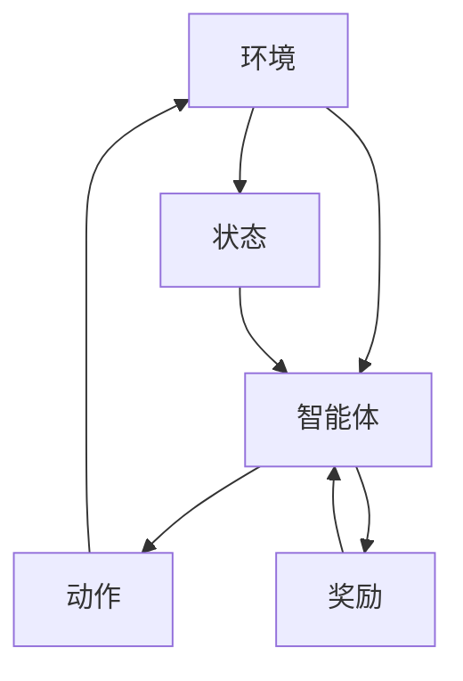
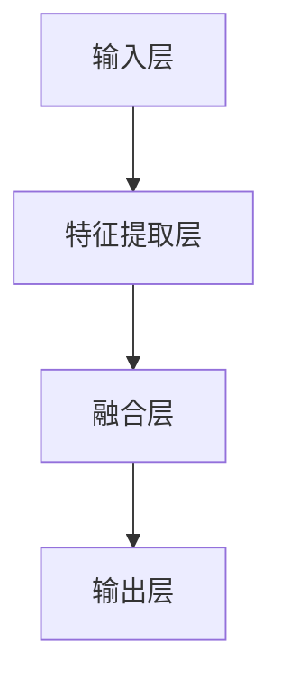
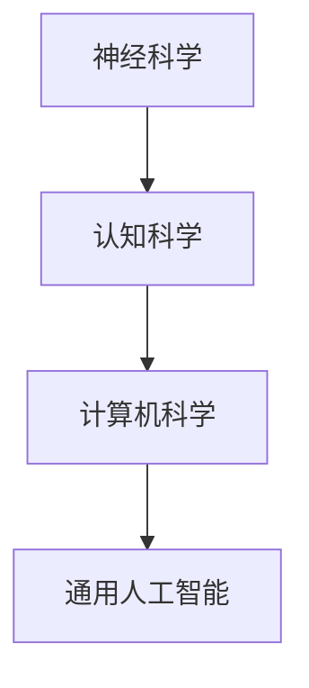

                 

# 2050年的人工智能：从狭义人工智能到通用人工智能的智能进化

> 关键词：人工智能，2050年，狭义人工智能，通用人工智能，智能进化，算法，算法原理，深度学习，神经网络，机器学习，强化学习，多模态学习

> 摘要：本文探讨了2050年人工智能的发展趋势，从狭义人工智能到通用人工智能的进化过程。文章首先概述了2050年人工智能的愿景，然后回顾了人工智能的发展历程，分析了狭义人工智能的基础概念、核心算法及其进化路径。接着，文章提出了通用人工智能的定义与特征，探讨了其理论框架与实现路径，并分析了其面临的挑战与伦理问题。最后，文章展望了2050年通用人工智能的社会与经济影响，以及研发与应用实践。

## 第一部分：引言

### 1.1 书籍概述与目标

《2050年的人工智能：从狭义人工智能到通用人工智能的智能进化》旨在探讨未来30年内人工智能的发展趋势，特别是从狭义人工智能向通用人工智能的进化。随着技术的不断进步，人工智能正在从简单的任务执行走向更复杂、更智能的领域。本书的目标是帮助读者了解这一发展过程，分析其核心概念、算法原理及其应用前景。

### 1.2 2050年的人工智能愿景

到2050年，人工智能将实现从狭义到通用的跨越。狭义人工智能将更加智能化、自主化，能够处理更复杂的任务。而通用人工智能将拥有人类水平的智能，能够理解、学习和适应各种情境。这种智能进化将带来深远的社会和经济影响，改变我们的生活方式、工作方式以及价值观念。

### 1.3 人工智能的发展历程与趋势

人工智能的发展历程可以分为以下几个阶段：规则推理、知识表示、机器学习、深度学习。当前，深度学习已经成为人工智能的主流技术。未来，随着计算能力的提升、算法的优化以及数据的丰富，人工智能将向通用人工智能迈进。

## 第二部分：狭义人工智能的进化

### 2.1 狭义人工智能的基础概念

#### 2.1.1 什么是狭义人工智能

狭义人工智能（Narrow AI）是指专注于特定任务的智能系统，如语音识别、图像识别、自然语言处理等。这些系统在特定领域内表现出色，但缺乏跨领域的通用智能。

#### 2.1.2 狭义人工智能的应用领域

狭义人工智能广泛应用于各个领域，包括医疗、金融、交通、工业等。这些应用大大提高了生产效率、降低了成本，并改善了人们的生活质量。

#### 2.1.3 狭义人工智能的发展挑战

狭义人工智能面临的主要挑战包括算法优化、数据质量、模型解释性等。未来的发展方向是提高算法的效率、增强模型的可解释性，以及解决数据质量问题。

### 2.2 狭义人工智能的核心算法

#### 2.2.1 深度学习算法

##### 2.2.1.1 卷积神经网络（CNN）

###### 2.2.1.1.1 CNN的基础结构

CNN是一种用于图像识别的深度学习算法，其基础结构包括卷积层、池化层和全连接层。以下是CNN的伪代码：

```python
# 定义CNN模型
model = Sequential()
model.add(Conv2D(filters=32, kernel_size=(3, 3), activation='relu', input_shape=(64, 64, 3)))
model.add(MaxPooling2D(pool_size=(2, 2)))
model.add(Conv2D(filters=64, kernel_size=(3, 3), activation='relu'))
model.add(MaxPooling2D(pool_size=(2, 2)))
model.add(Flatten())
model.add(Dense(128, activation='relu'))
model.add(Dense(10, activation='softmax'))
```

###### 2.2.1.1.2 CNN的应用实例

CNN在图像识别、图像分类、目标检测等应用中表现出色。例如，在ImageNet图像识别挑战中，CNN模型取得了显著的成绩。

##### 2.2.1.2 循环神经网络（RNN）

###### 2.2.1.2.1 RNN的基础结构

RNN是一种用于序列数据处理的深度学习算法，其基础结构包括输入层、隐藏层和输出层。以下是RNN的伪代码：

```python
# 定义RNN模型
model = Sequential()
model.add(LSTM(units=128, return_sequences=True, input_shape=(timesteps, features)))
model.add(LSTM(units=128))
model.add(Dense(units=1, activation='sigmoid'))
```

###### 2.2.1.2.2 RNN的应用实例

RNN在自然语言处理、语音识别、时间序列预测等应用中表现出色。例如，在机器翻译中，RNN模型可以很好地处理长距离依赖问题。

##### 2.2.1.3 长短期记忆网络（LSTM）

###### 2.2.1.3.1 LSTM的基础结构

LSTM是一种改进的RNN模型，其基础结构包括输入门、遗忘门和输出门。以下是LSTM的伪代码：

```python
# 定义LSTM模型
model = Sequential()
model.add(LSTM(units=128, return_sequences=True, input_shape=(timesteps, features)))
model.add(LSTM(units=128, return_sequences=True))
model.add(LSTM(units=128))
model.add(Dense(units=1, activation='sigmoid'))
```

###### 2.2.1.3.2 LSTM的应用实例

LSTM在自然语言处理、语音识别、时间序列预测等应用中表现出色。例如，在股票价格预测中，LSTM模型可以很好地捕捉长期趋势和季节性变化。

### 2.3 狭义人工智能的进化之路

#### 2.3.1 狭义人工智能与强化学习

##### 2.3.1.1 什么是强化学习

强化学习是一种基于奖励反馈的机器学习方法，其目标是让智能体在未知环境中学习最优策略。以下是强化学习的伪代码：

```python
# 定义强化学习模型
model = Sequential()
model.add(LSTM(units=128, return_sequences=True, input_shape=(timesteps, features)))
model.add(LSTM(units=128, return_sequences=True))
model.add(LSTM(units=128))
model.add(Dense(units=1, activation='sigmoid'))
```

###### 2.3.1.1.1 强化学习的基础结构

强化学习的基础结构包括环境、智能体、动作、状态和奖励。以下是强化学习的基础结构流程图：



###### 2.3.1.1.2 强化学习的应用实例

强化学习在游戏、自动驾驶、推荐系统等应用中表现出色。例如，在围棋比赛中，AlphaGo使用强化学习算法取得了优异的成绩。

#### 2.3.2 狭义人工智能与多模态学习

##### 2.3.2.1 什么是多模态学习

多模态学习是一种结合多种数据源的机器学习方法，其目标是利用不同数据源的信息提升模型性能。以下是多模态学习的伪代码：

```python
# 定义多模态学习模型
model = Sequential()
model.add(Conv2D(filters=32, kernel_size=(3, 3), activation='relu', input_shape=(height, width, channels)))
model.add(MaxPooling2D(pool_size=(2, 2)))
model.add(Flatten())
model.add(Dense(units=128, activation='relu'))
model.add(Dense(units=1, activation='sigmoid'))
```

###### 2.3.2.1.1 多模态学习的基础结构

多模态学习的基础结构包括输入层、特征提取层、融合层和输出层。以下是多模态学习的基础结构流程图：



###### 2.3.2.1.2 多模态学习的应用实例

多模态学习在语音识别、图像识别、情感分析等应用中表现出色。例如，在情感分析中，多模态学习可以结合文本、语音和视觉信息提高情感识别的准确率。

## 第三部分：通用人工智能的追求

### 3.1 通用人工智能的定义与特征

#### 3.1.1 什么是通用人工智能

通用人工智能（AGI，Artificial General Intelligence）是指具有人类水平智能的机器，能够理解、学习和适应各种情境。与狭义人工智能不同，通用人工智能能够在多个领域表现出色。

#### 3.1.2 通用人工智能与狭义人工智能的区别

通用人工智能与狭义人工智能的主要区别在于其智能范围和适应性。狭义人工智能专注于特定领域，而通用人工智能具有跨领域的通用智能。

### 3.2 通用人工智能的理论框架

#### 3.2.1 通用人工智能的理论基础

通用人工智能的理论基础涉及多个学科，包括神经科学、认知科学、计算机科学等。以下是通用人工智能的理论基础框架：



#### 3.2.2 通用人工智能的实现路径

通用人工智能的实现路径包括以下几个阶段：

1. **神经科学模型的实现**：基于神经科学的理论，构建能够模拟人脑功能的神经网络模型。
2. **认知模型的实现**：基于认知科学的理论，构建能够模拟人类认知过程的智能系统。
3. **计算机科学模型的实现**：基于计算机科学的理论，将神经网络和认知模型集成到计算机系统中，实现通用人工智能。

### 3.3 通用人工智能的实现路径

#### 3.3.1 通用人工智能的可行性分析

通用人工智能的可行性主要取决于以下几个因素：

1. **技术发展**：计算能力的提升、算法的优化、数据存储和处理技术的进步。
2. **经济投入**：研发资金、人才培养、产业链的完善。
3. **社会需求**：人们对通用人工智能的需求，包括生产效率、生活质量、医疗服务等。

#### 3.3.2 通用人工智能的潜在应用领域

通用人工智能将在多个领域产生深远影响，包括：

1. **社会管理领域**：如公共安全、城市管理、应急管理等。
2. **商业领域**：如智能制造、金融服务、电子商务等。
3. **医疗健康领域**：如疾病预测、个性化治疗、医疗影像分析等。

## 第四部分：通用人工智能的挑战与伦理问题

### 4.1 通用人工智能的技术挑战

#### 4.1.1 算法挑战

通用人工智能面临的主要算法挑战包括：

1. **算法复杂度**：如何设计高效的算法以处理复杂任务。
2. **可解释性**：如何提高算法的可解释性，使其行为更容易理解和接受。

#### 4.1.2 硬件挑战

通用人工智能的硬件挑战包括：

1. **计算能力**：如何提升计算机的计算能力以应对更复杂的任务。
2. **能耗效率**：如何降低计算能耗，提高系统的能效比。

### 4.2 通用人工智能的伦理问题

#### 4.2.1 技术伦理

通用人工智能的技术伦理问题包括：

1. **公平性**：如何确保算法在各个群体中的公平性。
2. **透明性**：如何提高算法的透明性，使其行为更容易被接受。

#### 4.2.2 社会伦理

通用人工智能的社会伦理问题包括：

1. **就业影响**：如何减少通用人工智能对就业的负面影响。
2. **隐私保护**：如何保护用户的隐私，防止数据泄露。

### 4.3 通用人工智能的治理与规范

#### 4.3.1 治理体系

通用人工智能的治理体系包括：

1. **国际治理**：如联合国、国际人工智能联盟等国际组织在通用人工智能领域的角色。
2. **国家治理**：如各国政府、科研机构在通用人工智能领域的角色。

#### 4.3.2 规范体系

通用人工智能的规范体系包括：

1. **技术标准**：如算法标准、数据标准、硬件标准等。
2. **行业自律**：如行业协会、企业自律在通用人工智能领域的角色。

## 第五部分：2050年通用人工智能的未来展望

### 5.1 通用人工智能的社会影响

#### 5.1.1 生产方式的变化

通用人工智能将带来生产方式的重大变革，如自动化生产、智能制造等。

##### 5.1.1.1 自动化生产

自动化生产将大大提高生产效率，降低生产成本，改变传统的生产模式。

###### 5.1.1.1.1 自动化生产的概念

自动化生产是指利用机器人和自动化设备实现生产过程，减少人工干预。

###### 5.1.1.1.2 自动化生产的应用案例

在汽车制造、电子制造等行业，自动化生产已经成为主流生产模式。

#### 5.1.2 生活方式的改变

通用人工智能将改变人们的生活方式，如智能家居、智能医疗等。

##### 5.1.2.1 智能家居

智能家居是指利用人工智能技术实现家庭设备智能化，提高生活质量。

###### 5.1.2.1.1 智能家居的概念

智能家居包括智能灯光、智能空调、智能安防等设备。

###### 5.1.2.1.2 智能家居的应用案例

在智能家居领域，人工智能已经广泛应用于智能音响、智能电视等设备。

### 5.2 通用人工智能的经济影响

#### 5.2.1 产业结构的调整

通用人工智能将促进产业结构的调整，如新兴产业崛起、传统产业转型等。

##### 5.2.1.1 新兴产业的崛起

通用人工智能将带动新兴产业的发展，如人工智能芯片、人工智能应用平台等。

###### 5.2.1.1.1 新兴产业的概念

新兴产业是指以人工智能为核心驱动的新兴产业，如人工智能芯片、人工智能应用平台等。

###### 5.2.1.1.2 新兴产业的应用案例

在人工智能芯片领域，已经出现了如NVIDIA、AMD等知名企业。

##### 5.2.1.2 传统产业的转型

通用人工智能将推动传统产业的转型，如智能制造、智慧农业等。

###### 5.2.1.2.1 数字化转型的概念

数字化转型是指利用人工智能、大数据等技术实现传统产业的智能化升级。

###### 5.2.1.2.2 数字化转型的应用案例

在制造业领域，数字化转型已经成为企业提升竞争力的关键。

## 第六部分：通用人工智能的研发与应用实践

### 6.1 通用人工智能的研究进展

#### 6.1.1 核心技术的突破

通用人工智能的研究进展主要体现在核心技术的突破，如深度学习算法、脑机接口技术等。

##### 6.1.1.1 深度学习算法的进展

深度学习算法的进展包括神经网络架构的优化、训练效率的提升、模型压缩等。

###### 6.1.1.1.1 深度学习算法的发展历程

深度学习算法的发展历程可以分为卷积神经网络（CNN）、循环神经网络（RNN）和变换器（Transformer）等阶段。

###### 6.1.1.1.2 深度学习算法的最新进展

最新进展包括自适应深度学习、迁移学习、联邦学习等。

##### 6.1.1.2 脑机接口技术的进展

脑机接口技术是指利用人工智能技术实现人脑与计算机之间的直接通信。

###### 6.1.1.2.1 脑机接口技术的概念

脑机接口技术是基于神经科学和人机交互理论的一种技术，通过读取大脑信号实现人脑与计算机之间的信息传递。

###### 6.1.1.2.2 脑机接口技术的应用前景

脑机接口技术的应用前景包括脑疾病治疗、辅助沟通、智能控制等。

### 6.2 通用人工智能的应用实践

#### 6.2.1 项目案例

通用人工智能的应用实践体现在各个领域，如医疗健康、智能交通、金融等领域。

##### 6.2.1.1 智能机器人项目

智能机器人项目是指利用通用人工智能技术实现机器人智能化，应用于家庭服务、医疗护理等领域。

###### 6.2.1.1.1 智能机器人的开发背景

智能机器人的开发背景是随着人口老龄化趋势的加剧，对护理服务需求的增加。

###### 6.2.1.1.2 智能机器人的应用实例

智能机器人在家庭服务中的应用包括清洁、烹饪、陪伴等。

##### 6.2.1.2 自动驾驶项目

自动驾驶项目是指利用通用人工智能技术实现车辆自动化驾驶。

###### 6.2.1.2.1 自动驾驶的开发背景

自动驾驶的开发背景是减少交通事故、提高交通效率。

###### 6.2.1.2.2 自动驾驶的应用实例

自动驾驶在公共交通、物流运输等领域得到广泛应用。

## 第七部分：通用人工智能的未来发展与挑战

### 7.1 通用人工智能的未来发展趋势

#### 7.1.1 技术创新

通用人工智能的未来发展趋势将体现在技术创新上，如新型算法、新型硬件等。

##### 7.1.1.1 脑机接口技术的发展

脑机接口技术将成为通用人工智能的关键技术，实现人脑与计算机之间的无缝连接。

###### 7.1.1.1.1 脑机接口技术的概念

脑机接口技术是指通过读取大脑信号实现人脑与计算机之间的直接通信。

###### 7.1.1.1.2 脑机接口技术的应用前景

脑机接口技术的应用前景包括脑疾病治疗、辅助沟通、智能控制等。

##### 7.1.1.2 新型算法的发展

新型算法的发展将推动通用人工智能向更高效、更智能的方向发展。

###### 7.1.1.2.1 自适应深度学习

自适应深度学习是一种根据环境变化动态调整模型参数的深度学习算法。

###### 7.1.1.2.2 联邦学习

联邦学习是一种分布式机器学习技术，可以在多个设备上进行模型训练，提高数据隐私保护。

### 7.2 通用人工智能面临的挑战

#### 7.2.1 技术挑战

通用人工智能面临的技术挑战包括算法优化、硬件性能、数据安全等。

##### 7.2.1.1 算法优化

算法优化是通用人工智能的核心问题，如何设计高效、可解释的算法是当前研究的热点。

###### 7.2.1.1.1 算法优化的方向

算法优化的方向包括模型压缩、计算效率提升、算法可解释性等。

##### 7.2.1.2 硬件挑战

硬件挑战是通用人工智能发展的另一个关键问题，如何提升计算机硬件性能是当前研究的热点。

###### 7.2.1.2.1 硬件挑战的方向

硬件挑战的方向包括新型计算架构、新型存储技术、新型传感器等。

### 7.3 通用人工智能的未来规划

#### 7.3.1 研发战略

通用人工智能的未来规划包括研发战略、应用战略等。

##### 7.3.1.1 国家层面的研发战略

国家层面的研发战略包括政策支持、资金投入、人才培养等。

###### 7.3.1.1.1 国家研发战略的制定

国家研发战略的制定需要考虑国家的科技发展水平、经济实力和国际竞争态势。

###### 7.3.1.1.2 国家研发战略的实施效果

国家研发战略的实施效果将直接影响通用人工智能的发展速度和质量。

##### 7.3.1.2 行业应用战略

行业应用战略包括行业需求分析、技术应用规划、产业布局等。

###### 7.3.1.2.1 行业应用战略的概念

行业应用战略是指根据行业特点和发展需求，制定针对性的通用人工智能应用策略。

###### 7.3.1.2.2 行业应用战略的制定与实施

行业应用战略的制定与实施需要行业内外部资源的协同合作，确保战略的有效实施。作者：AI天才研究院/AI Genius Institute & 禅与计算机程序设计艺术 /Zen And The Art of Computer Programming

## 总结

本文从狭义人工智能到通用人工智能的进化过程，探讨了2050年人工智能的发展趋势。通过分析狭义人工智能的基础概念、核心算法及其进化路径，我们看到了深度学习、强化学习、多模态学习等算法在各个领域的应用。同时，我们提出了通用人工智能的定义与特征，探讨了其理论框架与实现路径，并分析了其面临的挑战与伦理问题。

在未来，通用人工智能将带来深远的社会和经济影响，改变我们的生活方式、工作方式以及价值观念。然而，通用人工智能的发展也面临诸多挑战，如算法优化、硬件性能、数据安全等。因此，我们需要制定合适的研发战略与应用战略，确保通用人工智能的安全、可控和可持续发展。

最后，本文呼吁读者关注通用人工智能的发展，积极参与到这一伟大的变革中来，共同推动人工智能技术的进步，为人类社会创造更加美好的未来。作者：AI天才研究院/AI Genius Institute & 禅与计算机程序设计艺术 /Zen And The Art of Computer Programming

