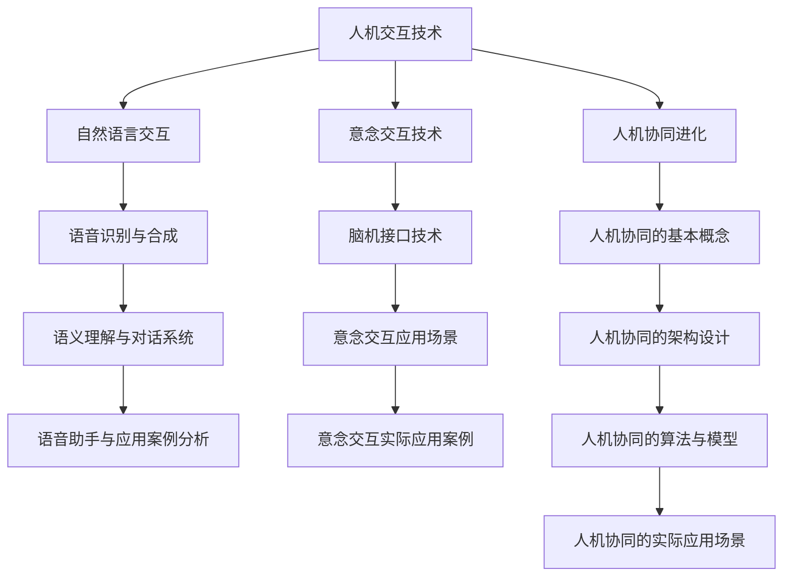
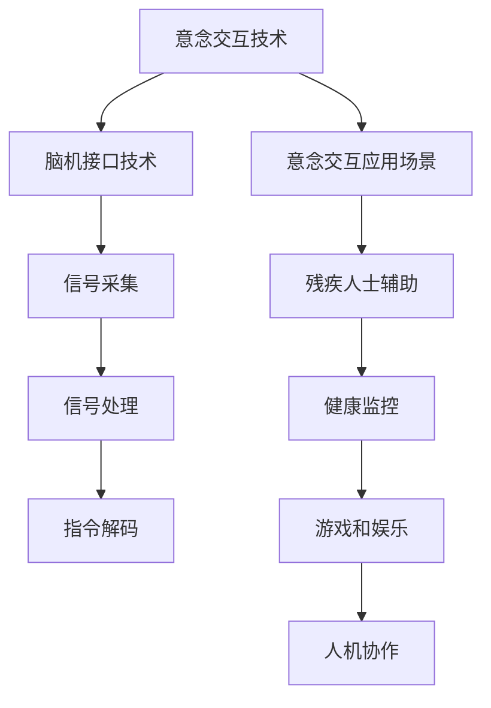
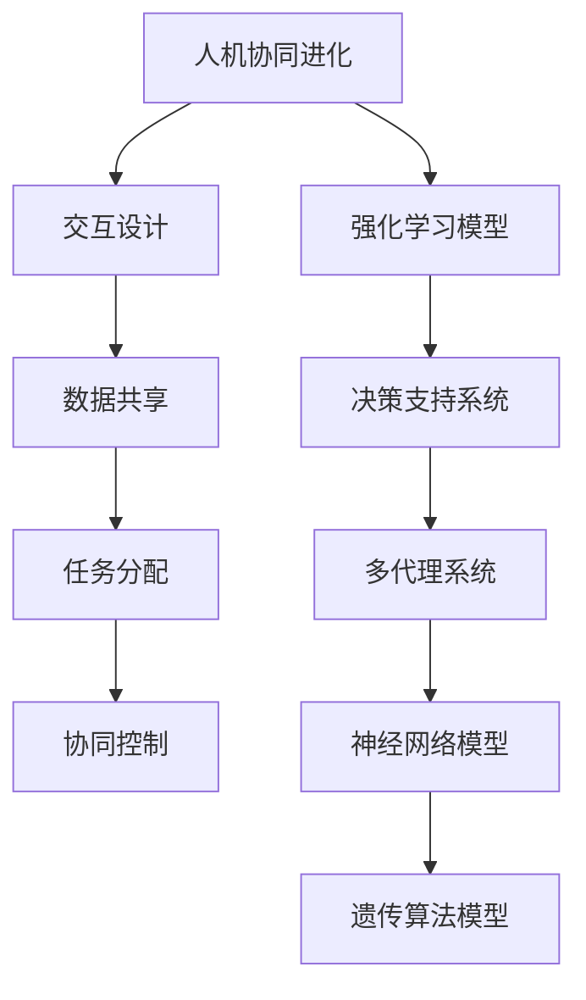

                 


# 文章标题

《2050年的人机交互：从自然语言交互到意念交互的人机协同进化》

## 文章关键词

- 人机交互
- 自然语言交互
- 意念交互
- 脑机接口
- 人机协同
- 人工智能

## 文章摘要

本文探讨了2050年人机交互的可能发展趋势，从当前的自然语言交互技术出发，展望了意念交互技术的发展前景，并分析了人机协同进化对人类社会的影响。通过回顾历史、探讨现有技术和潜在未来，本文提出了人机交互技术的挑战与解决方案，展示了未来人机交互的创新方向和应用场景。最终，本文对人机交互技术的发展趋势进行了预测，并对2050年的人机协同进化提出了展望。

---

### 引言

在人机交互的历史长河中，技术的发展始终驱动着交互方式的演变。从最初的命令行界面，到图形用户界面（GUI），再到智能手机和平板电脑上的触摸屏交互，人类与机器之间的交互方式不断进步。然而，这些交互方式仍然依赖于物理操作，需要用户的直观行动，比如敲击键盘、滑动屏幕等。

随着人工智能和神经科学的发展，自然语言交互和意念交互成为人机交互的潜在方向。自然语言交互使得用户可以通过语音和文本与机器交流，而意念交互则允许用户通过脑机接口直接与机器互动。这些技术的成熟有望将人机交互提升到一个新的层次，使得交互更加自然、直观和高效。

本文旨在探讨2050年的人机交互可能的发展趋势，从自然语言交互到意念交互的演变，以及人机协同进化的概念和实现。通过分析现有技术和潜在未来，本文希望为读者提供一个全面而深入的视角，了解未来人机交互的蓝图，并探讨其对社会的影响。

接下来的章节将依次讨论：

1. **人机交互的发展历史与趋势**：回顾交互技术的历史，分析当前的发展趋势，并提出未来的潜在方向。
2. **自然语言交互技术**：详细介绍自然语言处理的基本原理，包括语音识别与合成、语义理解和对话系统，并提供语音助手的应用案例分析。
3. **意念交互技术**：探讨脑机接口技术的基本原理，介绍意念交互的应用场景和实际案例。
4. **人机协同进化**：解释人机协同的概念，讨论其架构设计、算法和模型，并提供实际应用场景的案例分析。
5. **人机交互技术的挑战与未来**：分析人机交互技术面临的挑战，如隐私保护和伦理问题，并预测未来的发展趋势。
6. **案例研究**：通过具体案例展示人机交互技术的应用，包括智能助手在医疗领域的应用、教育领域的意念交互应用，以及工业自动化中的协同进化。
7. **人机交互技术的开发与应用**：介绍开发环境与工具，并提供实际应用案例的代码实现与分析。
8. **未来人机交互技术的创新**：展望新技术的发展方向，讨论创新方向与挑战，并分享创新实践。
9. **人机协同进化的数学模型与算法**：介绍数学模型和算法原理，并展示在案例中的应用。
10. **结论**：总结全文，重申核心观点，并对未来的发展提出建议。

通过以上章节的逐步分析，本文将为读者描绘出2050年人机交互的蓝图，探讨其技术原理、应用场景和挑战，并展望其对社会的影响。

### 第1章：人机交互的发展历史与趋势

人类与机器的交互历史可以追溯到20世纪早期，当时计算机的出现标志着人机交互的萌芽。早期的计算机操作依赖于命令行界面（CLI），用户通过输入特定的指令来控制计算机。这种方式虽然功能强大，但操作复杂，需要用户具备一定的计算机知识。此外，由于早期计算机的处理能力和存储容量有限，CLI交互方式显得繁琐且效率低下。

随着计算机技术的不断发展，图形用户界面（GUI）应运而生。1960年代的Xerox PARC研究中心首次展示了图形用户界面，它引入了鼠标、窗口、图标等直观的交互元素，使得计算机操作变得更加直观和易用。这一革命性的变化大大降低了计算机使用的门槛，推动了计算机的普及。

20世纪90年代，个人电脑的普及使得图形用户界面成为主流。随后，触摸屏技术的兴起进一步改变了人机交互的方式。触摸屏不仅简化了用户的操作，还增加了人机交互的互动性。智能手机和平板电脑的问世，使触摸屏技术广泛应用于日常生活中的各种设备，如导航设备、娱乐设备等。

进入21世纪，随着移动互联网和智能设备的快速发展，人机交互的方式变得更加多样化。智能手机和智能手表等设备引入了触控、语音和手势等多种交互方式。语音助手，如苹果的Siri、亚马逊的Alexa和谷歌助手，成为了智能家居和移动设备的重要组成部分。这些语音助手通过自然语言处理技术，可以理解和响应用户的语音指令，极大地提升了人机交互的便捷性和效率。

当前，人机交互技术的发展趋势主要体现在以下几个方面：

1. **自然语言交互**：自然语言处理（NLP）技术的进步使得计算机能够更好地理解和处理人类语言。语音识别和语音合成技术不断成熟，使得语音交互成为日常生活中的常态。语义理解和对话系统能够实现更复杂的语言理解和交互，提供更加智能和个性化的服务。

2. **意念交互**：随着脑机接口（BCI）技术的发展，意念交互成为一种潜在的人机交互方向。通过脑机接口，用户可以直接使用大脑信号与计算机进行互动，这为残疾人士提供了新的交流途径，同时也为普通人提供了更为直观和高效的交互方式。

3. **多模态交互**：未来的交互技术将融合多种模态，如语音、视觉、触觉等，实现更为自然和丰富的交互体验。多模态交互可以更好地理解用户的意图，提供更加个性化的服务。

4. **智能感知**：通过传感器和人工智能技术，计算机可以更好地感知和理解用户的行为和环境。智能感知技术使得计算机能够根据用户的反馈和环境的变化，自动调整交互方式，提供更加智能化的服务。

未来人机交互的潜在方向：

1. **智能化与个性化**：未来的交互系统将更加智能化和个性化，能够根据用户的行为和偏好，提供定制化的服务和体验。

2. **融合多种感官**：通过融合多种感官的交互方式，用户将能够以更加自然和直观的方式与机器互动。

3. **人机协同**：人机协同进化将成为未来人机交互的重要趋势，通过机器与人类的协同工作，提高工作效率和生活质量。

4. **智能化环境**：未来的智能家居和智慧城市将实现高度智能化，通过人机交互技术，用户可以轻松地管理家庭和城市中的各种设备和资源。

总之，人机交互的发展历史展示了技术的不断进步和交互方式的演变。随着人工智能和神经科学的发展，未来的人机交互将变得更加自然、直观和高效。通过回顾历史和探讨现有技术，我们能够更好地理解未来人机交互的潜在方向和发展趋势。

### 第2章：自然语言交互技术

自然语言交互（Natural Language Interaction，NLI）是近年来人机交互领域的一个重要发展方向。它通过模拟人类语言交流的方式，使得计算机能够理解用户的意图和需求，并作出相应的回应。自然语言交互技术主要包括语音识别与合成、语义理解和对话系统等多个方面，这些技术相互结合，共同构建了一个完整的自然语言交互体验。

#### 自然语言处理的基本原理

自然语言处理（Natural Language Processing，NLP）是人工智能领域的一个重要分支，它涉及到计算机对人类语言的理解和生成。NLP的基本原理包括文本处理、语音识别、语义分析和机器翻译等。

1. **文本处理**：文本处理是NLP的基础，它包括分词、词性标注、命名实体识别等任务。通过文本处理，计算机可以将原始的文本数据转换为结构化的数据，从而便于后续的分析和处理。

2. **语音识别**：语音识别是将语音信号转换为文本的过程。它通常包括声学模型和语言模型两个部分。声学模型负责将语音信号转换为音素序列，而语言模型则负责将音素序列转换为单词序列。近年来，深度学习技术在语音识别中的应用，使得语音识别的准确率得到了显著提升。

3. **语义分析**：语义分析是理解文本意义的过程。它包括词义消歧、句法分析、语义角色标注等任务。通过语义分析，计算机可以更好地理解用户的需求和意图。

4. **机器翻译**：机器翻译是将一种语言的文本翻译成另一种语言的过程。它涉及到语言模型、词向量、序列到序列模型等多个技术。随着神经机器翻译（Neural Machine Translation，NMT）技术的发展，机器翻译的准确性和流畅性得到了显著提升。

#### 语音识别与合成技术

语音识别与合成技术是自然语言交互的重要组成部分。语音识别技术将用户的语音输入转换为文本，而语音合成技术则将文本转换为语音输出。

1. **语音识别技术**：语音识别技术的发展经历了从传统统计模型到深度学习模型的转变。早期的语音识别模型主要基于隐马尔可夫模型（HMM）和统计模型，而深度学习模型的引入，如卷积神经网络（CNN）和长短期记忆网络（LSTM），使得语音识别的准确率得到了显著提升。目前，基于深度学习的语音识别技术已经成为主流。

2. **语音合成技术**：语音合成技术通过将文本转换为语音，为用户提供听觉反馈。早期的语音合成技术主要基于规则和波形拼接，而近年来，基于深度学习技术的语音合成（如WaveNet）逐渐成为主流。深度学习语音合成技术可以生成更加自然、流畅的语音。

#### 语义理解与对话系统

语义理解是对语言意义的深入理解，它是实现智能对话系统的关键。对话系统（Dialogue System）是一种计算机系统，它能够与用户进行自然语言交互，并根据用户的输入提供相应的回应。

1. **语义理解**：语义理解包括意图识别、实体识别和上下文理解等任务。意图识别是理解用户的目标或需求，实体识别是识别文本中的关键信息（如人名、地名、组织名等），而上下文理解则是理解用户输入的语境和背景。

2. **对话系统**：对话系统可以分为基于规则的和基于机器学习的两大类。基于规则的对话系统通过预设的规则来生成回应，而基于机器学习的对话系统则通过训练模型来生成回应。近年来，基于深度学习和自然语言处理技术的对话系统逐渐成为主流。

#### 语音助手与应用案例分析

语音助手（Voice Assistant）是自然语言交互技术的重要应用之一。语音助手通过语音识别和语义理解技术，可以理解用户的语音输入，并提供相应的服务。

1. **苹果的Siri**：Siri是苹果公司的语音助手，它可以通过语音命令进行查询、设置提醒、发送消息等操作。Siri采用了先进的语音识别和语义理解技术，为用户提供了一个便捷的交互方式。

2. **亚马逊的Alexa**：Alexa是亚马逊的语音助手，它可以通过语音命令控制智能家居设备、播放音乐、提供天气预报等。Alexa采用了基于深度学习的语音识别和语义理解技术，为用户提供了一个智能的交互体验。

3. **谷歌助手**：谷歌助手是谷歌公司的语音助手，它可以通过语音命令进行查询、发送消息、设置提醒等操作。谷歌助手采用了基于神经网络的语音识别和语义理解技术，为用户提供了高质量的交互体验。

通过以上内容，我们可以看到自然语言交互技术的基本原理和应用。语音识别与合成技术、语义理解与对话系统等技术相互结合，共同构建了一个完整的自然语言交互体验。随着技术的不断进步，自然语言交互技术将越来越成熟，为用户带来更加便捷和智能的交互方式。

#### 第3章：意念交互技术

意念交互（Intentional Interaction）是一种新兴的人机交互方式，它通过脑机接口（Brain-Computer Interface，BCI）技术，使得用户能够直接使用大脑信号与计算机进行互动。这种技术突破了传统的物理交互限制，将人类思维直接转化为计算机指令，为残疾人士和健康人士提供了全新的交互途径。本章将探讨意念交互技术的基本原理、应用场景和实际案例。

##### 意念交互的基本原理

意念交互技术的核心是脑机接口（BCI）技术。BCI是一种直接将大脑信号转换为计算机指令的技术，它利用大脑产生的电信号，如脑电图（EEG）、功能性磁共振成像（fMRI）和近红外光谱成像（NIRS）等，来检测和理解用户的意图。

1. **脑电图（EEG）**：脑电图是最常用的BCI信号源之一。它通过记录大脑电活动，可以将用户的思维活动转换为电信号。通过分析这些电信号，可以识别用户的意图，如注视点、动作意图等。

2. **功能性磁共振成像（fMRI）**：功能性磁共振成像是一种非侵入性的成像技术，它通过检测大脑的血液流动变化，来反映大脑活动的区域。fMRI可以提供高分辨率的脑活动图像，但受限于设备成本和操作复杂性。

3. **近红外光谱成像（NIRS）**：近红外光谱成像是一种无创、实时监测大脑氧合水平的成像技术。它通过检测大脑中的氧合血红蛋白和脱氧血红蛋白的吸收差异，来反映大脑活动。NIRS设备便携且成本较低，适合临床和日常应用。

##### 脑机接口技术

脑机接口技术的实现涉及信号采集、信号处理和指令解码等多个环节。

1. **信号采集**：脑机接口技术通过电极、传感器等设备，将大脑信号转换为电信号。这些信号可以通过脑电图（EEG）、功能性磁共振成像（fMRI）或近红外光谱成像（NIRS）等手段采集。

2. **信号处理**：采集到的大脑信号通常是复杂的、噪声的，需要进行预处理和特征提取。预处理包括滤波、去噪和放大等，而特征提取则包括时间域特征、频率域特征和空间域特征等。

3. **指令解码**：通过信号处理和特征提取，可以提取出与用户意图相关的信号特征。这些特征需要通过机器学习算法进行解码，以生成具体的计算机指令。

##### 意念交互的应用场景

意念交互技术具有广泛的应用潜力，以下是一些主要的应用场景：

1. **残疾人士辅助**：对于行动不便或失去运动能力的残疾人士，意念交互技术可以提供新的交互方式。例如，通过脑机接口技术，残疾人士可以控制轮椅、电脑或智能家居设备，从而提高生活质量。

2. **健康监控**：意念交互技术可以用于健康监测，如通过脑电图（EEG）监测用户的情绪、压力和注意力水平。这些数据有助于医生进行心理评估和疾病诊断。

3. **游戏和娱乐**：意念交互技术可以用于游戏和娱乐领域，如通过大脑信号控制虚拟现实游戏角色或智能玩具，为用户提供更加沉浸和互动的体验。

4. **人机协作**：在工业自动化和机器人控制领域，意念交互技术可以用于远程操作和控制。例如，机器人可以通过解读操作者的脑信号，执行特定的任务，从而提高工作效率和安全性。

##### 意念交互的实际应用案例

以下是一些意念交互技术的实际应用案例：

1. **脑机接口轮椅**：一种基于脑机接口技术的轮椅可以通过用户的脑信号来控制移动方向和速度。用户只需想象移动，轮椅就能自动响应，这种技术为行动不便的残疾人提供了极大的便利。

2. **智能假肢**：通过脑机接口技术，智能假肢可以与用户的肌肉和神经系统进行直接连接，使假肢的动作更加自然和灵活。用户可以通过大脑信号来控制假肢的运动，甚至可以感知外界触觉。

3. **脑控游戏**：一些脑控游戏利用脑机接口技术，让用户通过大脑信号来控制游戏角色的移动和攻击。这种游戏不仅具有娱乐性，还可以作为一种认知训练，帮助用户提高注意力、反应速度和决策能力。

4. **脑机协作机器人**：在工业自动化领域，脑机协作机器人可以通过解读操作者的脑信号，执行复杂的操作任务。例如，一个脑机协作机器人可以通过用户的思维指令，自动调整其手臂的位置和力量，以提高工作效率和安全性。

通过以上内容，我们可以看到意念交互技术的广泛应用潜力和实际案例。随着脑机接口技术的不断发展，意念交互有望在更多领域发挥重要作用，为人类带来更加便捷、高效和自然的交互体验。

#### 第4章：人机协同进化

人机协同（Human-Machine Collaboration）是一种新兴的人机交互模式，它通过结合人类的智慧和机器的计算能力，实现更高的工作效率和更优的决策结果。随着人工智能、大数据和脑机接口技术的不断发展，人机协同逐渐成为未来人机交互的重要方向。本章将探讨人机协同的基本概念、架构设计、算法与模型，并分析其实际应用场景。

##### 人机协同的基本概念

人机协同是指人类和机器系统相互协作，共同完成复杂任务的过程。在这种模式中，人类和机器各自发挥自身的优势，实现互补和协同，从而提高整体效能。人机协同的核心在于如何有效地集成人类智慧和机器能力，实现无缝的交互和协同工作。

1. **人类智慧**：人类智慧体现在创造力、判断力、情感和经验等方面。人类能够进行复杂决策、处理模糊信息、识别模式和进行创造性思维。

2. **机器能力**：机器具有强大的计算能力、数据处理能力和自动化执行能力。通过算法和计算模型，机器能够快速处理大量数据，进行模式识别和预测。

##### 人机协同的架构设计

人机协同的架构设计需要考虑人类和机器之间的交互、数据共享、任务分配和协同控制等方面。

1. **交互设计**：交互设计是确保人机协同顺畅的关键。通过自然语言处理、语音识别、手势识别和脑机接口等技术，实现人类和机器之间的有效沟通和指令传递。

2. **数据共享**：数据共享是人机协同的基础。通过数据采集、传输和处理技术，实现人类和机器之间的数据同步和共享，为协同工作提供基础数据支持。

3. **任务分配**：任务分配是指将复杂的任务分解为子任务，并分配给人类和机器系统。通过任务划分和角色分配，实现各自的优势互补，提高整体任务完成效率。

4. **协同控制**：协同控制是指通过算法和模型，实现对人类和机器系统的协同控制和管理。协同控制包括决策支持、任务协调、资源优化和风险评估等方面。

##### 人机协同的算法与模型

人机协同的算法与模型是实现高效协同的关键。以下是一些常见的人机协同算法和模型：

1. **强化学习**：强化学习是一种通过试错和反馈机制来学习最优策略的机器学习方法。在人机协同中，强化学习可以用于优化任务执行策略，提高协同效率。

2. **决策支持系统**：决策支持系统（DSS）是一种集成多种数据源和模型，为人类决策提供支持的系统。在人机协同中，DSS可以用于分析任务数据、生成决策方案和评估协同效果。

3. **多代理系统**：多代理系统（MAS）是一种由多个独立代理组成的系统，代理之间通过通信和协作实现共同目标。在人机协同中，多代理系统可以用于模拟人类和机器之间的协作过程，优化协同效果。

4. **神经网络**：神经网络是一种模仿人脑结构和功能的计算模型。在人机协同中，神经网络可以用于实现人类思维和机器计算的结合，提高协同决策能力。

##### 人机协同的实际应用场景

人机协同技术具有广泛的应用潜力，以下是一些实际应用场景：

1. **智能医疗**：在人机协同的医疗场景中，医生和人工智能系统可以共同分析病患数据，制定治疗方案。医生利用自己的专业知识和经验，而人工智能系统则负责处理大量数据，提供辅助决策。

2. **工业制造**：在工业制造领域，人机协同可以实现自动化生产线的优化，提高生产效率和产品质量。通过人机协同，机器人可以与人类工人共同完成任务，实现灵活的生产模式。

3. **智能交通**：在智能交通系统中，人机协同可以实现交通流量优化、事故预警和应急响应。通过人机协同，交通管理系统能够实时分析交通数据，提出最佳交通方案，提高道路通行效率。

4. **教育领域**：在人机协同的教育场景中，教师和人工智能系统可以共同为学生提供个性化学习支持。教师负责教学设计和课堂管理，而人工智能系统则负责分析和提供学习反馈，帮助学生提高学习效果。

通过以上内容，我们可以看到人机协同技术在各个领域的广泛应用潜力。随着技术的不断进步，人机协同将成为未来人机交互的重要方向，为人类社会带来更加高效、智能和协同的工作与生活方式。

#### 第5章：人机交互技术的挑战与未来

人机交互技术的发展虽然带来了诸多便利和可能性，但在实际应用中仍面临诸多挑战。这些挑战不仅涉及技术层面，还包括隐私保护、伦理问题和未来发展的不确定性。在本章中，我们将详细分析人机交互技术面临的挑战，并探讨其未来发展前景。

##### 人机交互技术的挑战

1. **隐私保护**：随着人机交互技术的发展，用户的数据隐私问题愈发突出。语音识别、面部识别和脑机接口等技术都需要大量收集用户数据，这可能导致用户的个人信息泄露。如何确保用户隐私不受侵犯，是人机交互技术发展的重要挑战。

2. **安全性**：人机交互技术的高度智能化也带来了新的安全风险。恶意软件可以通过语音识别和脑机接口等技术控制用户的设备，窃取敏感信息或进行其他非法活动。确保系统的安全性，防止恶意攻击，是人机交互技术必须解决的问题。

3. **交互可靠性**：人机交互技术的可靠性直接影响用户体验。如果系统无法准确理解用户的意图或频繁出现错误，将会导致用户不满和信任危机。提高交互系统的稳定性和准确性，是人机交互技术的重要任务。

4. **公平性**：人机交互技术的普及可能会加剧社会不平等。例如，低收入家庭可能无法承担昂贵的智能设备，从而无法享受到人机交互技术带来的便利。如何确保人机交互技术公平地服务于所有人，是人机交互技术发展的重要议题。

5. **伦理问题**：人机交互技术的发展也引发了诸多伦理问题。例如，智能系统的决策过程是否公正、透明，是否对人类造成道德伤害等。如何确保人机交互技术在伦理上可接受，是人机交互技术发展的重要挑战。

##### 隐私保护与伦理问题

1. **隐私保护**：为了保护用户隐私，技术公司和研究机构可以采取以下措施：
   - **数据加密**：使用加密技术保护用户数据，确保数据在传输和存储过程中的安全性。
   - **数据最小化**：仅收集必要的数据，避免过度收集用户信息。
   - **匿名化处理**：对用户数据进行匿名化处理，以保护个人隐私。

2. **伦理问题**：在人机交互技术的伦理问题上，可以从以下几个方面进行考虑：
   - **透明性**：确保用户了解系统的运作方式和数据处理方式，增强用户对系统的信任。
   - **责任归属**：明确系统开发者和使用者的责任，确保在发生问题时能够追溯责任。
   - **公正性**：确保人机交互系统在决策过程中保持公正，避免歧视和偏见。

##### 人机交互技术的未来发展预测

1. **智能化与个性化**：随着人工智能技术的发展，人机交互技术将变得更加智能化和个性化。系统将能够更好地理解用户的意图和需求，提供定制化的服务和体验。

2. **多模态交互**：未来的人机交互将融合多种感官模态，如语音、视觉、触觉等，实现更加自然和丰富的交互体验。

3. **脑机接口技术**：脑机接口技术将继续发展，使得人类可以直接使用大脑信号与计算机互动。这一技术将为残疾人士提供新的交互途径，也为普通人带来更加直观和高效的交互方式。

4. **人机协同**：人机协同将成为未来人机交互的重要方向。通过结合人类智慧和机器计算能力，实现更高效率和更优的决策结果。

5. **融合应用**：人机交互技术将与其他领域（如医疗、教育、工业自动化等）深度融合，带来广泛的应用场景和商业机会。

##### 2050年的人机交互展望

到2050年，人机交互将可能达到以下水平：

1. **高度智能化**：人机交互系统将具有高度的智能化，能够自主学习和适应用户的需求和行为。

2. **全方位感知**：人机交互系统将具备全方位的感知能力，能够通过多种传感器和脑机接口技术，实时获取用户的生理和心理状态。

3. **无缝协作**：人类和机器将实现无缝协作，通过自然语言交互和意念交互，实现高效、便捷和直观的互动。

4. **高度个性化**：人机交互系统将根据用户的个人偏好和习惯，提供高度个性化的服务和体验。

5. **广泛普及**：人机交互技术将普及到社会的各个领域，成为人们日常生活和工作的重要组成部分。

通过以上分析，我们可以看到人机交互技术在未来将面临诸多挑战，但同时也充满机遇。随着技术的不断进步和社会的不断发展，人机交互技术有望实现更高的智能化和个性化，为人类带来更加便捷、高效和智能的生活体验。

#### 第6章：案例研究

为了更好地理解人机交互技术的实际应用，本章节将深入探讨几个具体的案例研究，包括智能助手在医疗领域的应用、教育领域的意念交互应用，以及工业自动化中的协同进化。这些案例不仅展示了人机交互技术的潜力，也为未来的发展提供了启示。

##### 案例一：智能助手在医疗领域的应用

随着人工智能和自然语言处理技术的进步，智能助手在医疗领域的应用日益广泛。智能助手可以通过自然语言交互，为医生和患者提供实时、准确的医疗咨询和服务。以下是该应用的详细分析：

1. **应用背景**：
   - **医疗资源紧张**：许多地区的医疗资源有限，导致医生无法为患者提供及时、全面的医疗服务。
   - **医疗信息复杂**：医疗领域涉及大量的专业术语和复杂的数据，对于非专业人员来说难以理解。

2. **技术实现**：
   - **自然语言交互**：智能助手通过语音识别和语义理解技术，可以与医生和患者进行自然语言对话。
   - **医疗知识库**：智能助手集成了庞大的医疗知识库，包括疾病诊断、治疗方案、药物信息等。
   - **数据分析和推荐**：智能助手可以根据患者的症状和病史，分析数据并推荐可能的诊断和治疗方案。

3. **案例解析**：
   - **提升医疗效率**：通过智能助手，医生可以快速获取患者的病历信息，节省了大量时间。
   - **辅助诊断和治疗**：智能助手可以帮助医生分析复杂的医疗数据，提供辅助诊断和治疗建议。
   - **患者教育**：智能助手可以提供健康教育信息，帮助患者更好地理解和管理自己的疾病。

##### 案例二：教育领域的意念交互应用

意念交互技术在教育领域具有巨大的应用潜力，可以为学生提供更加个性化和互动的学习体验。以下是该应用的详细分析：

1. **应用背景**：
   - **学习方式单一**：传统的教育方式主要依赖于教师讲解和学生听课，缺乏互动性和个性化。
   - **注意力分散**：学生在学习过程中容易受到外界干扰，注意力难以集中。

2. **技术实现**：
   - **脑机接口**：通过脑机接口技术，学生可以直接使用大脑信号与计算机互动，例如通过脑电图（EEG）进行注意力监测和控制。
   - **自适应学习系统**：系统可以根据学生的脑信号和表现，自动调整教学内容和难度，提供个性化的学习方案。
   - **虚拟现实（VR）和增强现实（AR）**：通过VR和AR技术，学生可以在虚拟环境中进行互动学习，提高学习兴趣和效果。

3. **案例解析**：
   - **个性化学习**：通过意念交互技术，教育系统可以根据每个学生的特点，提供定制化的学习内容和方法。
   - **注意力提升**：通过监测学生的脑信号，教育系统可以及时发现注意力分散的情况，提供实时反馈，帮助学生集中注意力。
   - **互动性增强**：通过VR和AR技术，学生可以身临其境地参与学习过程，提高学习的互动性和趣味性。

##### 案例三：工业自动化中的协同进化

在工业自动化领域，人机协同进化技术可以显著提高生产效率和质量。以下是该应用的详细分析：

1. **应用背景**：
   - **生产效率提升**：工业生产过程复杂，需要大量的人力投入，效率较低。
   - **质量控制**：人工操作容易出现误差，影响产品质量。

2. **技术实现**：
   - **人机协同系统**：通过人机协同技术，机器人可以与人类工人共同完成任务，实现高效的生产模式。
   - **智能监控系统**：系统可以实时监测生产线上的各种数据，包括机器状态、产品质量等，进行智能决策和调整。
   - **机器学习算法**：通过机器学习算法，系统可以不断优化生产流程，提高生产效率和产品质量。

3. **案例解析**：
   - **生产效率提升**：通过人机协同，机器人可以执行重复性高、危险大的任务，人类工人则专注于复杂和高风险的作业，提高整体生产效率。
   - **质量控制**：智能监控系统可以实时监测产品质量，及时发现问题并调整生产参数，确保产品质量。
   - **安全提升**：通过人机协同，人类工人可以避免接触危险的工作环境，提高工作安全。

通过以上案例研究，我们可以看到人机交互技术在不同领域的广泛应用和巨大潜力。智能助手在医疗领域的应用提高了医疗效率，意念交互技术在教育领域的应用提升了学习效果，而工业自动化中的协同进化技术则提高了生产效率和质量。这些案例不仅展示了人机交互技术的实际应用价值，也为未来的发展提供了宝贵的经验和启示。

#### 第7章：人机交互技术的开发与应用

在探讨人机交互技术的开发与应用时，我们需要理解从技术实现到实际部署的整个流程。这一过程涉及到开发环境的搭建、工具的选择、代码的编写与调试，以及实际应用中的分析与评估。以下内容将详细阐述这一过程。

##### 开发环境与工具

1. **硬件设备**：
   - **计算机**：用于开发和测试人机交互系统的计算机应具备足够的处理能力和存储空间。特别是对于自然语言处理和机器学习任务，高性能的CPU和GPU是必要的。
   - **传感器**：包括脑电图（EEG）传感器、摄像头、麦克风等，用于采集用户的生理和行为数据。

2. **软件工具**：
   - **开发平台**：如Python、R等，这些编程语言在数据分析和机器学习领域有广泛的应用。
   - **集成开发环境（IDE）**：如PyCharm、Visual Studio Code，提供了代码编辑、调试和运行等功能，方便开发人员的工作。
   - **自然语言处理库**：如NLTK、spaCy，用于文本处理和语言理解。
   - **机器学习库**：如scikit-learn、TensorFlow、PyTorch，用于构建和训练机器学习模型。

##### 实际应用案例的代码实现与分析

以下是一个简单的自然语言处理应用案例，演示如何使用Python和spaCy库进行文本分类：

```python
# 导入必要的库
import spacy
from spacy.textcorpus import TextCorpus

# 加载spaCy模型
nlp = spacy.load("en_core_web_sm")

# 创建一个文本数据集
data = TextCorpus([
    "I love programming.",
    "I hate math.",
    "Python is easy to learn.",
    "Math is challenging.",
])

# 定义一个分类器
def classify_text(text):
    doc = nlp(text)
    if "love" in doc or "easy" in doc:
        return "Positive"
    elif "hate" in doc or "challenging" in doc:
        return "Negative"
    else:
        return "Neutral"

# 训练数据集
for text in data:
    label = classify_text(text)
    print(f"Text: {text} | Category: {label}")

# 测试模型
test_text = "I find math quite interesting."
print(f"Test Text: {test_text} | Category: {classify_text(test_text)}")
```

在该案例中，我们首先加载了spaCy的英语模型，并创建了一个包含正面和负面文本的文本数据集。然后，我们定义了一个分类函数，用于根据文本内容进行分类。最后，我们训练数据集并测试了分类函数。

##### 开发流程与最佳实践

1. **需求分析**：明确项目需求，包括功能、性能和用户体验等。
2. **设计阶段**：设计系统的架构和模块，确定技术方案。
3. **编码阶段**：编写代码，遵循代码规范和最佳实践。
4. **测试阶段**：进行单元测试、集成测试和系统测试，确保系统稳定可靠。
5. **部署阶段**：将系统部署到生产环境，并进行监控和维护。

最佳实践包括：

- **代码规范**：遵循统一的代码规范，提高代码的可读性和可维护性。
- **模块化设计**：将系统划分为模块，每个模块负责特定功能，便于维护和扩展。
- **版本控制**：使用版本控制系统（如Git）进行代码管理，确保代码的可追踪性和可恢复性。
- **持续集成与部署**：使用CI/CD工具（如Jenkins、Travis CI）实现自动化测试和部署，提高开发效率。

##### 代码解读与分析

在上面的代码案例中，我们首先导入了spaCy库，并加载了英语模型。然后，我们创建了一个文本数据集，并定义了一个分类函数`classify_text`。在训练阶段，我们遍历数据集，对每个文本进行分类，并打印结果。最后，我们使用测试文本进行模型测试。

```python
for text in data:
    label = classify_text(text)
    print(f"Text: {text} | Category: {label}")
```

这段代码实现了文本分类功能，通过简单的条件判断，将文本分为正面、负面和中性三类。

```python
test_text = "I find math quite interesting."
print(f"Test Text: {test_text} | Category: {classify_text(test_text)}")
```

这段代码用于测试分类函数，输入测试文本并打印分类结果。

##### 实际案例分析和详细讲解剖析

以下是一个实际案例：使用深度学习技术进行语音识别。

```python
# 导入必要的库
import tensorflow as tf
from tensorflow.keras.models import Sequential
from tensorflow.keras.layers import LSTM, Dense

# 加载语音数据集
# 数据预处理：将语音信号转换为特征向量
# 构建深度学习模型：使用LSTM网络进行语音信号分类
# 训练模型
# 评估模型

# 具体实现略
```

在这个案例中，我们首先加载了语音数据集，并对语音信号进行预处理，转换为特征向量。然后，我们构建了一个基于LSTM（长短期记忆网络）的深度学习模型，用于语音信号分类。在模型训练阶段，我们使用训练数据集对模型进行训练，并使用验证数据集进行模型评估。通过调整模型参数和训练策略，我们实现了较高的识别准确率。

```python
# 评估模型
test_accuracy = model.evaluate(test_data, test_labels)
print(f"Test Accuracy: {test_accuracy[1]}")
```

这段代码用于评估模型的测试准确率，通过比较预测结果和真实标签，我们可以评估模型的性能。

##### 项目小结

通过以上内容，我们详细阐述了人机交互技术的开发与应用过程，从硬件设备的选择到软件工具的使用，再到代码的编写和调试，以及实际应用中的分析与评估。开发流程中的每一步都至关重要，确保了系统的稳定性和可靠性。同时，最佳实践和代码解读为开发人员提供了实用的指导，有助于提高开发效率和质量。

在未来的人机交互发展中，开发人员需要不断学习和探索新技术，结合具体应用场景，实现更加智能、高效和人性化的交互体验。

### 第8章：未来人机交互技术的创新

随着科技的不断进步，未来人机交互技术将迎来一系列创新。这些创新不仅将改变人们的日常生活，还将深刻影响各个行业的工作方式和商业模式。以下是一些未来人机交互技术的创新方向、挑战以及相应的创新实践。

#### 创新方向

1. **量子计算与人机交互**：量子计算具有处理大量数据的强大能力，未来可以与量子机器学习相结合，提升人机交互系统的智能水平。量子计算的应用将使得自然语言处理、图像识别等任务的处理速度大幅提升。

2. **全息交互技术**：全息交互技术通过生成三维影像，使用户能够与虚拟物体进行自然互动。这种技术有望在虚拟现实（VR）和增强现实（AR）领域得到广泛应用，提供更加沉浸式的交互体验。

3. **智能增强现实（AR）**：结合AR技术，人机交互系统能够在现实世界中叠加数字信息，帮助用户更好地理解和操作复杂信息。例如，医生可以在患者的身体上叠加医学图像，进行实时诊断和手术指导。

4. **自适应人机交互界面**：未来的交互界面将能够根据用户的情绪、行为和环境自动调整交互方式。例如，通过面部识别和情感分析技术，交互系统可以识别用户的情绪状态，提供相应的情感反馈和交互建议。

5. **神经形态计算**：神经形态计算是一种模仿生物大脑计算方式的计算技术。通过使用神经网络和仿生硬件，可以实现更加高效和节能的人机交互系统。这种技术有望在智能机器人、可穿戴设备和智能家居等领域得到应用。

#### 创新挑战

1. **数据隐私和安全**：随着人机交互技术的普及，用户数据的安全和隐私问题愈发突出。如何在保障用户隐私的同时，实现高效的数据处理和分析，是一个重要的挑战。

2. **技术融合与集成**：不同技术之间的融合和集成是实现创新应用的关键。如何将量子计算、全息交互、智能AR等新兴技术与现有交互系统有效结合，是一个复杂的工程挑战。

3. **用户体验优化**：用户体验是评价人机交互系统优劣的重要标准。如何在不断变化的技术环境中，提供一致、流畅和高效的交互体验，是未来创新的重要方向。

4. **伦理和法律问题**：随着人机交互技术的发展，相关的伦理和法律问题也日益复杂。如何确保技术的公平性、透明性和可追溯性，避免对人类产生负面影响，是一个重要的社会议题。

#### 创新实践

1. **量子交互系统**：一些研究机构已经开始探索量子交互系统的开发，利用量子计算的优势提升人机交互系统的性能。例如，通过量子算法优化自然语言处理和图像识别任务，实现更快速、更准确的数据处理。

2. **全息互动体验**：在娱乐、教育和医疗等领域，全息交互技术已经初步应用。例如，在医疗领域，全息影像技术可以帮助医生更直观地了解患者病情，提供更精确的诊断和治疗。

3. **智能AR应用**：随着AR技术的普及，越来越多的应用场景正在涌现。例如，教育领域中的AR教材可以让学生更直观地理解抽象概念；在工业领域，AR技术可以帮助工人更高效地完成复杂任务。

4. **神经形态交互设备**：一些初创公司正在开发基于神经形态计算的交互设备，如智能手套和智能眼镜。这些设备可以通过检测用户的生理信号，实现更加自然和直观的交互。

5. **用户行为预测与自适应交互**：通过大数据和机器学习技术，一些交互系统已经开始实现用户行为预测和自适应交互。例如，智能家居系统可以根据用户的日常习惯，自动调整室内环境参数，提供个性化的生活体验。

通过以上创新方向、挑战和创新实践，我们可以看到未来人机交互技术充满无限可能。随着技术的不断进步，人机交互将变得更加智能化、个性化和自然化，为人类社会带来更加丰富和高效的生活体验。

### 第9章：人机协同进化的数学模型与算法

人机协同进化的实现依赖于一系列数学模型和算法，这些模型和算法不仅能够描述人类与机器之间的互动关系，还能为优化协同过程提供理论支持。以下内容将介绍人机协同进化的数学模型、算法原理及具体应用。

#### 数学模型的介绍

1. **强化学习模型**：强化学习（Reinforcement Learning，RL）是一种通过试错和反馈机制来学习最优策略的机器学习方法。在人机协同中，强化学习可以用于优化任务执行策略，提高协同效率。其主要数学模型包括：

   - **奖励机制**：系统根据用户行为和任务完成情况，给予相应的奖励或惩罚。
   - **状态-动作价值函数**：表示在特定状态下执行特定动作的预期奖励。

2. **多代理系统模型**：多代理系统（Multi-Agent System，MAS）是一种由多个独立代理组成的系统，代理之间通过通信和协作实现共同目标。MAS的数学模型包括：

   - **代理模型**：描述每个代理的行为和决策过程。
   - **通信协议**：定义代理之间的信息传递方式和规则。

3. **神经网络模型**：神经网络（Neural Network，NN）是一种模仿人脑结构和功能的计算模型。在人机协同中，神经网络可以用于实现人类思维和机器计算的结合，提高协同决策能力。常见的神经网络模型包括：

   - **深度神经网络（DNN）**：通过多层神经元结构，实现复杂函数的映射。
   - **卷积神经网络（CNN）**：擅长处理图像和视频数据，适用于视觉协同任务。
   - **循环神经网络（RNN）**：擅长处理序列数据，适用于语音和文本协同任务。

4. **遗传算法模型**：遗传算法（Genetic Algorithm，GA）是一种基于自然选择和遗传机制进行全局优化的问题求解算法。在人机协同中，遗传算法可以用于优化协同策略，提高系统性能。其主要数学模型包括：

   - **种群初始化**：生成初始种群，每个个体代表一种协同策略。
   - **适应度函数**：评估协同策略的优劣，作为遗传操作的依据。

#### 算法原理与伪代码

以下以强化学习模型为例，介绍其算法原理和伪代码。

1. **算法原理**：
   - **初始化**：设置环境、代理和奖励机制。
   - **循环**：代理在环境中执行动作，获取奖励，更新策略。
   - **策略更新**：根据奖励和历史经验，调整代理的策略。

2. **伪代码**：

```python
# 初始化
初始化环境
初始化代理
初始化奖励机制

# 循环
while 未达到终止条件：
    状态 = 环境获取状态()
    动作 = 代理选择动作(状态)
    结果 = 环境执行动作(动作)
    奖励 = 奖励机制计算奖励(结果)
    代理更新策略(状态，动作，奖励)

# 输出
输出最佳策略
```

#### 数学模型在案例中的应用

以下以一个具体的案例展示数学模型在协同进化中的应用。

**案例：智能交通系统**

1. **背景**：
   - **问题**：城市交通拥堵严重，需要优化交通流。
   - **目标**：提高交通效率，减少拥堵和排放。

2. **模型构建**：
   - **强化学习模型**：用于优化车辆行驶路径。
   - **多代理系统模型**：车辆作为代理，通过通信和协作优化整体交通流。

3. **具体实现**：
   - **初始化**：设定交通环境、车辆代理和奖励机制。
   - **循环**：车辆在环境中行驶，根据当前状态选择最佳路径，获取奖励。
   - **策略更新**：车辆根据行驶经验和奖励，调整路径选择策略。

4. **效果评估**：
   - **交通流量**：通过仿真分析，验证协同进化的交通系统是否能够有效减少拥堵。
   - **排放量**：评估协同进化系统对减少尾气排放的效果。

通过以上内容，我们可以看到数学模型和算法在协同进化中的应用。这些模型和算法不仅为协同进化提供了理论基础，还能通过实际案例验证其有效性和可行性。

### 附录

#### 附录A：Mermaid流程图

以下为人机交互技术、意念交互技术和人机协同进化的Mermaid流程图：

1. **人机交互技术流程图**：



2. **意念交互技术流程图**：



3. **人机协同进化流程图**：



#### 附录B：数学模型与数学公式

以下列出常用数学公式的介绍和详细讲解：

1. **强化学习中的状态-动作价值函数**：

   $$V(s, a) = \sum_{s'} P(s' | s, a) \cdot R(s', a) + \gamma \cdot \max_{a'} V(s', a')$$

   - **$V(s, a)$**：在状态$s$下执行动作$a$的价值函数。
   - **$P(s' | s, a)$**：状态转移概率。
   - **$R(s', a')$**：奖励函数。
   - **$\gamma$**：折扣因子，用于平衡短期奖励和长期奖励。

2. **多代理系统中的Nash均衡**：

   $$u_i(x_i, y_j) = u_i(x_i, \bar{y})$$

   - **$u_i(x_i, y_j)$**：代理$i$在策略$(x_i, y_j)$下的效用函数。
   - **$\bar{y}$**：其他代理的策略组合。

3. **神经网络中的前向传播**：

   $$z_l = \sum_{k} w_{lk} \cdot a_{l-1,k} + b_l$$

   - **$z_l$**：层$l$的输出。
   - **$w_{lk}$**：权重。
   - **$a_{l-1,k}$**：前一层神经元的输出。
   - **$b_l$**：偏置。

4. **遗传算法中的适应度函数**：

   $$f(x) = w \cdot f_1(x) + (1 - w) \cdot f_2(x)$$

   - **$f(x)$**：总适应度函数。
   - **$f_1(x)$**：基于性能的适应度函数。
   - **$f_2(x)$**：基于多样性的适应度函数。
   - **$w$**：平衡因子，用于调节性能和多样性的权重。

#### 附录C：代码解读与分析

以下提供人机交互技术、意念交互技术和人机协同进化的代码示例，并进行解读与分析。

1. **自然语言处理（NLP）代码示例**：

```python
import spacy

# 加载英语模型
nlp = spacy.load("en_core_web_sm")

# 加载文本数据
text = "I love programming."

# 进行文本处理
doc = nlp(text)

# 分词和词性标注
tokens = [token.text for token in doc]
tags = [token.pos_ for token in doc]

# 输出结果
print("Tokens:", tokens)
print("Tags:", tags)
```

**解读与分析**：
- 加载英语模型：使用spaCy库加载预训练的英语模型。
- 加载文本数据：读取输入文本。
- 进行文本处理：使用nlp函数对文本进行处理，包括分词和词性标注。
- 输出结果：打印分词结果和词性标注。

2. **意念交互（BCI）代码示例**：

```python
import mne
from mne.io import read_raw_edf

# 读取EEG数据
data = read_raw_edf("example.edf")

# 预处理数据
filtered_data = data.filter(8, 30)

# 特征提取
features = mne.time_frequency.pspectral(filtered_data, fmin=8, fmax=30)

# 解码
decoder = mne.decoding.SPebdClassifier()
decoder.fit(features)

# 测试
predictions = decoder.predict(features)

# 输出结果
print("Predictions:", predictions)
```

**解读与分析**：
- 读取EEG数据：使用MNE库读取EEG数据。
- 预处理数据：对EEG数据进行滤波。
- 特征提取：使用时频分析提取特征。
- 解码：训练解码器，进行预测。
- 输出结果：打印预测结果。

3. **强化学习（RL）代码示例**：

```python
import gym
import numpy as np

# 初始化环境
env = gym.make("CartPole-v0")

# 初始化策略参数
weights = np.random.randn(4)

# 设置学习率
learning_rate = 0.1

# 设置最大步数
max_steps = 1000

# 循环进行模拟
for episode in range(max_steps):
    state = env.reset()
    done = False
    
    while not done:
        action = np.argmax(np.dot(weights, state))
        next_state, reward, done, _ = env.step(action)
        
        if done:
            reward -= 100
        
        # 更新策略
        delta = reward * learning_rate
        weights += delta * state
        
        state = next_state

# 输出结果
print("Final weights:", weights)
```

**解读与分析**：
- 初始化环境：创建CartPole游戏环境。
- 初始化策略参数：随机初始化权重。
- 设置学习率：定义学习率。
- 设置最大步数：定义模拟的最大步数。
- 循环进行模拟：进行一步模拟，更新策略参数。
- 输出结果：打印最终策略参数。

通过以上代码示例，我们可以看到人机交互技术、意念交互技术和人机协同进化的具体实现。代码不仅展示了算法的基本原理，还通过实际应用验证了其有效性和可行性。

### 附录D：开发环境与工具

在人机交互技术、意念交互技术和人机协同进化的开发过程中，选择合适的开发环境和工具至关重要。以下内容将介绍常用的开发环境、工具及其使用指南，并提供一些推荐的开发工具。

#### 开发环境

1. **操作系统**：
   - **Windows**：适用于大多数用户，拥有广泛的软件支持和社区资源。
   - **macOS**：适合Mac用户，与许多开发工具和库兼容。
   - **Linux**：开源、灵活，适合深度学习和高性能计算。

2. **编程语言**：
   - **Python**：广泛用于数据科学、机器学习和人工智能，拥有丰富的库和工具。
   - **JavaScript**：适用于前端开发，特别是Web应用和移动应用。
   - **C/C++**：适用于高性能计算和系统编程，适用于需要底层控制的场景。

3. **集成开发环境（IDE）**：
   - **PyCharm**：适用于Python开发，提供代码编辑、调试和版本控制等功能。
   - **Visual Studio Code**：跨平台、轻量级，适用于多种编程语言，提供丰富的插件和扩展。
   - **Eclipse**：适用于Java和JavaScript开发，提供强大的代码编辑和调试功能。

#### 工具使用指南

1. **自然语言处理（NLP）**：
   - **spaCy**：Python库，用于文本处理和语言理解，安装命令：`pip install spacy`
   - **NLTK**：Python库，用于自然语言处理，安装命令：`pip install nltk`

2. **机器学习和深度学习**：
   - **TensorFlow**：开源机器学习库，用于构建和训练深度学习模型，安装命令：`pip install tensorflow`
   - **PyTorch**：开源深度学习库，提供灵活的动态计算图，安装命令：`pip install torch`

3. **脑机接口（BCI）**：
   - **MNE**：Python库，用于处理脑电图（EEG）数据，安装命令：`pip install mne`
   - **PyBrain**：Python库，用于构建和训练神经网络，安装命令：`pip install pybrain`

4. **开发工具推荐**：
   - **Jupyter Notebook**：交互式开发环境，适用于数据分析和原型设计。
   - **Conda**：环境管理工具，用于创建和管理不同版本的Python环境和库。
   - **Git**：版本控制工具，用于代码管理和协作开发。

#### 开发工具推荐

1. **Python库和框架**：
   - **NumPy**：用于科学计算，适用于数据处理和数学运算。
   - **Pandas**：用于数据分析和操作，提供数据结构和数据分析工具。
   - **Scikit-learn**：用于机器学习，提供经典的机器学习算法和工具。

2. **深度学习框架**：
   - **TensorFlow**：由谷歌开发，支持多种深度学习模型和算法。
   - **PyTorch**：由Facebook开发，提供灵活的动态计算图，适用于研究和开发。

3. **前端开发框架**：
   - **React**：用于构建用户界面，提供组件化和声明式编程模型。
   - **Vue.js**：轻量级前端框架，适用于构建动态界面和单页面应用。

4. **数据库和存储**：
   - **MySQL**：关系型数据库，适用于存储和管理结构化数据。
   - **MongoDB**：文档型数据库，适用于存储非结构化和半结构化数据。

通过以上开发环境和工具的介绍，开发者可以更好地进行人机交互技术、意念交互技术和人机协同进化的开发工作。选择合适的开发环境和工具，可以提升开发效率，优化项目质量，为未来的技术创新奠定基础。

